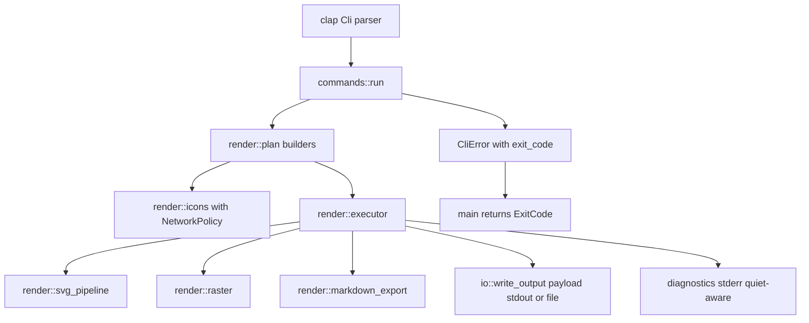

# CLI Rust Best Practices Refactor - Plan

## Goal Capsule

| Field | Value |
|---|---|
| Objective | Refactor `merman-cli` into a stricter Rust CLI implementation with explicit exit behavior, contextual errors, predictable network policy, smaller render modules, and cleaner stdout/stderr contracts. |
| Authority | The user explicitly allows fearless refactoring, breaking CLI behavior where it improves the long-term design, deleting obsolete code, and changing compatibility defaults when the migration is documented. Existing Mermaid parity and rendering semantics remain higher authority than CLI cleanup. |
| Execution profile | Characterization-first refactor: lock the CLI behaviors that should survive, introduce the new contracts behind tests, then split modules and delete compatibility-only code that no longer earns its surface area. |
| Stop conditions | Stop if a proposed CLI change would alter `merman-core`, `merman-render`, binding JSON, or Mermaid parity behavior outside the CLI path; stop and ask if a change would intentionally reduce top-level `mmdc` functional coverage rather than only changing CLI ergonomics or safety defaults. |
| Tail ownership | The implementer owns Rust code, CLI tests, README, changelog, and any migration notes for breaking command behavior. |

---

## Product Contract

### Summary

This plan hardens `merman-cli` as a production Rust command-line tool rather than only a thin export wrapper. The current CLI has a good foundation: clap derive, modular command dispatch, integration tests, output pipeline selection, and a documented `mmdc`-compatible top-level mode. The remaining issues are deeper engineering contracts: every runtime failure currently exits as `1`, error variants lose actionable classification, `render.rs` owns too many unrelated responsibilities, icon pack loading can perform implicit network requests, and progress messages are not consistently separated from machine-readable output.

### Problem Frame

The CLI is now user-facing enough that operational behavior matters. Scripts need stable exit statuses. Offline or locked-down environments should not discover a network dependency only when `--iconPacks` falls through to unpkg. Users piping SVG/JSON/text need stdout to remain payload-only, while diagnostics and progress belong on stderr. Maintainers need render planning, execution, raster/PDF export, Markdown export, and icon loading to live behind smaller interfaces so future parity work does not keep expanding a single large module.

The user has authorized breaking changes and deletion, so this should not be limited to small compatibility patches. The refactor should choose the cleaner contract, document the migration, and remove obsolete helper paths once the new contract is covered.

### Requirements

**CLI behavior**

- R1. Runtime errors must return documented, meaningful exit statuses instead of mapping every error to exit code `1`.
- R2. Error messages must preserve context and source errors while staying concise on stderr.
- R3. stdout must contain only requested command output such as SVG, raster bytes, JSON, text render output, or completion scripts.
- R4. Non-error diagnostics, accepted-compatibility warnings, and progress messages must go to stderr and be suppressible with `--quiet` where they are not required errors.
- R5. Top-level export behavior, developer subcommands, and recently added `--svg-pipeline` semantics must keep their documented successful workflows unless this plan explicitly marks a breaking change.
- R6. A downstream consumer closing stdout early must be handled as a normal broken-pipe termination path, not as a noisy user-facing I/O error.

**Network and resource policy**

- R7. Icon pack network access must be explicit. Local `node_modules`, local paths, and `file://` sources should work by default; HTTP(S) icon pack fetching should require an opt-in flag.
- R8. Missing local icon packs must fail with an actionable message that tells users how to install the package locally or opt into network fetching.
- R9. Existing raster safety limits and SVG pipeline safety decisions must remain intact while CLI internals are split.

**Architecture and maintainability**

- R10. `crates/merman-cli/src/render.rs` must be split into focused modules with a small public entrypoint and clear ownership for plan building, execution, Markdown export, raster/PDF export, SVG pipelines, and icon packs.
- R11. The CLI error model should use the workspace `thiserror` dependency to reduce hand-written boilerplate and make source chains explicit.
- R12. Dead compatibility helpers, duplicate wrappers, and no-op options introduced only by previous structure should be removed once tests prove they are not part of the retained contract.
- R13. Verification must use `cargo nextest` for Rust tests, `cargo fmt` for formatting, and a documented clippy strategy that does not pretend unrelated workspace lint debt is a CLI regression.

### Acceptance Examples

- AE1. Given a missing input file, when a user runs `merman-cli -i missing.mmd -o out.svg`, then stderr contains the missing-file message and the process exits with the documented usage/input status instead of the generic runtime status.
- AE2. Given an output path whose parent directory does not exist, when a user runs `merman-cli -i diagram.mmd -o missing/out.svg`, then stderr names the missing output directory and the exit status matches the invalid-output category.
- AE3. Given `--iconPacks @iconify-json/logos` with no local `node_modules` package, when `--allow-network` is absent, then the command fails without contacting unpkg and tells the user to install the package locally or pass `--allow-network`.
- AE4. Given `--iconPacksNamesAndUrls logos#https://example.com/icons.json`, when `--allow-network` is absent, then the command fails before fetching the URL.
- AE5. Given the same explicit HTTPS icon source and `--allow-network`, when the test uses a local HTTP fixture server, then the icon pack is fetched and registered as it is today.
- AE6. Given `-o -` or subcommands that write JSON/text to stdout, when warnings or progress are emitted, then stdout remains parseable payload and diagnostics appear only on stderr.
- AE7. Given an SVG export with `--svg-pipeline parity|readable|resvg-safe`, when the render module is split, then the existing pipeline behavior and tests remain unchanged.
- AE8. Given a command whose stdout is piped to a consumer that exits early, when stdout returns `BrokenPipe`, then `merman-cli` exits without printing an I/O error to stderr.

### Scope Boundaries

In scope:

- `crates/merman-cli/src/main.rs`
- `crates/merman-cli/src/error.rs`
- `crates/merman-cli/src/io.rs`
- `crates/merman-cli/src/cli.rs`
- `crates/merman-cli/src/commands.rs`
- `crates/merman-cli/src/render.rs` and new `crates/merman-cli/src/render/*.rs` modules
- `crates/merman-cli/tests/cli_compat.rs`
- `crates/merman-cli/README.md`
- top-level `README.md` only where CLI examples or export-safe SVG language must stay aligned
- `CHANGELOG.md`

Deferred to follow-up work:

- Streaming Markdown input or large-file memory limits. Mermaid source files are small enough that `read_to_string` is acceptable for this refactor.
- Workspace-wide clippy cleanup in `merman-elk-layered`, `roughr`, and `manatee`. Prior local checks reached dependency lint failures before surfacing any CLI-specific clippy errors.
- Full `mmdc` zero-change script replacement. `merman-cli` remains a browserless functional CLI with documented differences.

Out of scope:

- Changing Mermaid parser, layout, rendering, SVG parity, host theme profile, binding JSON, WASM, Typst, or FFI behavior.
- Removing documented top-level `mmdc` functional options unless a later implementation discovery shows they are impossible to support safely.
- Adding network access outside the explicit icon pack path.

### Outstanding Questions

No launch-blocking questions remain. The plan chooses a breaking offline-first icon policy because the user explicitly allowed breaking cleanup and because implicit network access is the weaker long-term CLI contract.

---

## Planning Contract

### Key Technical Decisions

- KTD1. Use `std::process::ExitCode` from `main.rs` and add `CliError::exit_code()`. Clap keeps owning parse/help exit behavior before `main` dispatch; runtime errors should use a small documented taxonomy: success `0`, generic runtime/render failure `1`, usage/input/config/output contract failure `2`, and direct I/O failure `3`. Broken stdout pipes are the exception: suppress the diagnostic and return success because downstream early close is normal pipe behavior, not a failed render.
- KTD2. Convert `CliError` to `thiserror::Error`. The workspace already provides `thiserror`, so the CLI can remove manual `Display` and `From` boilerplate without broadening the dependency graph.
- KTD3. Keep stdout payload-only. `commands.rs` may print command payloads to stdout, `io::write_output` may write requested bytes to stdout, and completion generation may write scripts to stdout. Everything else moves to stderr behind a small diagnostics helper that honors `--quiet`.
- KTD4. Make icon pack network access opt-in with `--allow-network`. Do not add a redundant `--offline` flag because the new default is offline. Local package lookup, local file paths, and `file://` sources remain allowed by default.
- KTD5. Preserve explicit HTTPS icon sources as a supported capability, but require the same `--allow-network` opt-in for both `--iconPacks` unpkg fallback and `--iconPacksNamesAndUrls prefix#https://...`.
- KTD6. Split `render.rs` by responsibility rather than by current function order. The entrypoint should expose `RenderPlan`, `render_plan_for_mmdc`, `render_plan_for_subcommand`, and `run_render`; internals move into `plan`, `executor`, `markdown_export`, `raster`, `icons`, and `svg_pipeline` modules.
- KTD7. Characterize behavior before moving code. Tests for exit statuses, stderr/stdout separation, icon network policy, and SVG pipeline preservation should land before or with the relevant refactor so module movement cannot hide a behavior drift.
- KTD8. Treat clippy as useful evidence but not the blocking gate for this CLI plan until unrelated workspace dependency lints are handled or a dependency-aware lint strategy is established. Record observed non-CLI blockers instead of claiming the CLI failed clippy.

### High-Level Technical Design



The CLI should have one narrow diagnostic path and one narrow payload path. Command payloads remain explicit writes to stdout or files. Diagnostic helpers receive the quiet flag and write to stderr. `CliError` owns user-facing error text and exit status, while `main.rs` becomes a thin parser/dispatcher that prints the error and returns the code.

The render module should become a directory module:

```text
crates/merman-cli/src/render.rs
crates/merman-cli/src/render/plan.rs
crates/merman-cli/src/render/executor.rs
crates/merman-cli/src/render/markdown_export.rs
crates/merman-cli/src/render/raster.rs
crates/merman-cli/src/render/icons.rs
crates/merman-cli/src/render/svg_pipeline.rs
```

`render.rs` should re-export only the pieces used by `commands.rs`. Internal structs such as `RenderRequest`, `RenderedArtifact`, `RasterCliOptions`, and `IconPackSource` should move to the module that owns them.

### Implementation Sequence

1. Add characterization tests for error exit codes and stdout/stderr behavior around the current structure.
2. Convert the error model and `main.rs` exit handling.
3. Add `--allow-network` and the icon network policy tests, updating behavior intentionally.
4. Move diagnostics to stderr and quiet-aware helpers.
5. Split `render.rs` into focused modules without changing the behavior already locked by tests.
6. Update README and changelog with breaking migration notes.
7. Run the verification contract and remove obsolete helpers that become unused after the split.

### Risks and Mitigations

| Risk | Mitigation |
|---|---|
| Exit code changes break scripts that only expected `1`. | Document the taxonomy in `crates/merman-cli/README.md` and `CHANGELOG.md`; keep success output unchanged. |
| Offline-first icon packs surprise users relying on implicit unpkg fallback. | Make the error message actionable and show the exact migration: install the matching `@iconify-json` package locally or pass `--allow-network`. |
| Splitting `render.rs` creates circular module dependencies. | Move data ownership first: plan-only types in `plan.rs`, execution-only types in `executor.rs`, source loading in `icons.rs`, and pure SVG helpers in `svg_pipeline.rs`. |
| Clippy remains red because of unrelated workspace crates. | Keep nextest and fmt blocking; run clippy as recorded evidence and do not treat non-CLI dependency lint debt as this plan's failure. |
| stdout/stderr changes alter progress visibility for file-output scripts. | Treat progress as diagnostics by design; tests assert payload-only stdout and `--quiet` suppression. |

---

## Implementation Units

### U1. Error taxonomy and process exit handling

- **Goal:** Make runtime exit statuses explicit and testable without changing successful command output.
- **Requirements:** R1, R2, R5, R6, R11
- **Dependencies:** None
- **Files:**
  - `crates/merman-cli/src/main.rs`
  - `crates/merman-cli/src/error.rs`
  - `crates/merman-cli/Cargo.toml`
  - `crates/merman-cli/tests/cli_compat.rs`
- **Approach:** Add `thiserror.workspace = true` to the CLI crate. Convert `CliError` to `#[derive(Debug, thiserror::Error)]`. Add `CliError::exit_code() -> std::process::ExitCode` and update `main` to return `ExitCode`. Keep clap parse errors untouched because `Cli::parse()` exits before `commands::run`.
- **Test scenarios:**
  - Missing input file exits with the documented usage/input status.
  - Missing output directory exits with the documented invalid-output status.
  - Invalid JSON config or Puppeteer config exits with the documented usage/config status.
  - A direct I/O failure that maps to `CliError::Io` exits with the documented I/O status.
  - A stdout `BrokenPipe` path is covered by a unit test or integration test and does not print the generic I/O error.
  - Existing successful SVG, JSON, and completion flows still exit `0`.
- **Verification:** `cargo nextest run -p merman-cli missing_input missing_output invalid_config` or equivalent targeted test names pass after tests are added.

### U2. Payload-only stdout and quiet-aware diagnostics

- **Goal:** Separate command payload from diagnostics across top-level export and developer subcommands.
- **Requirements:** R3, R4, R5, R6
- **Dependencies:** U1
- **Files:**
  - `crates/merman-cli/src/io.rs`
  - `crates/merman-cli/src/render.rs`
  - `crates/merman-cli/src/commands.rs`
  - `crates/merman-cli/tests/cli_compat.rs`
- **Approach:** Add a small diagnostics helper or `DiagnosticSink` that writes to stderr and honors `quiet`. Move `RenderRequest::info` from `println!` to that helper. Keep payload print sites in `commands.rs` for `detect`, `parse`, `layout`, and `completion` as stdout writes because those are the command result.
- **Test scenarios:**
  - Rendering to `-o -` produces parseable SVG on stdout with no progress or warnings mixed into stdout.
  - Rendering to a file prints non-error progress to stderr, not stdout.
  - `--quiet` suppresses non-error diagnostics but not final error messages.
  - `detect`, `parse`, and `layout` still print their documented payloads to stdout.
  - A broken stdout pipe does not leak an I/O diagnostic onto stderr.
- **Verification:** Focused CLI integration tests assert stdout and stderr separately.

### U3. Explicit icon pack network policy

- **Goal:** Replace implicit unpkg/HTTP fetching with an opt-in network contract.
- **Requirements:** R7, R8, R12
- **Dependencies:** U1
- **Files:**
  - `crates/merman-cli/src/cli.rs`
  - `crates/merman-cli/src/render.rs`
  - `crates/merman-cli/tests/cli_compat.rs`
  - `crates/merman-cli/README.md`
  - `CHANGELOG.md`
- **Approach:** Add `--allow-network` to `IconCliArgs` and thread it into icon registry loading. Introduce a `NetworkPolicy` or equivalent enum in the icon-loading module. For `--iconPacks`, local `node_modules` lookup remains first; if no local package exists and network is disabled, return `CliError::InvalidInput` with migration guidance instead of constructing the unpkg URL. For `--iconPacksNamesAndUrls`, reject HTTP(S) sources unless network is enabled. Keep local paths and `file://` URLs unchanged.
- **Test scenarios:**
  - Local `node_modules/@iconify-json/test/icons.json` still renders without `--allow-network`.
  - Explicit local JSON path still renders without `--allow-network`.
  - Explicit `file://` icon source still renders without `--allow-network`.
  - Explicit HTTP source fails before fetch without `--allow-network`.
  - Explicit HTTP source succeeds against the existing local test server with `--allow-network`.
  - Missing package name fails without contacting unpkg and names `--allow-network` in the error.
- **Verification:** Existing icon tests are updated, and no test requires internet access.

### U4. Render module decomposition

- **Goal:** Turn `render.rs` from a large responsibility sink into a small entrypoint over focused modules.
- **Requirements:** R9, R10, R12
- **Dependencies:** U1, U2, U3
- **Files:**
  - `crates/merman-cli/src/render.rs`
  - `crates/merman-cli/src/render/plan.rs`
  - `crates/merman-cli/src/render/executor.rs`
  - `crates/merman-cli/src/render/markdown_export.rs`
  - `crates/merman-cli/src/render/raster.rs`
  - `crates/merman-cli/src/render/icons.rs`
  - `crates/merman-cli/src/render/svg_pipeline.rs`
  - `crates/merman-cli/src/commands.rs`
- **Approach:** Move code by ownership, not by convenience. `plan.rs` owns `RenderPlan`, `RenderMode`, `RasterCliOptions`, output inference, defaults, and validation. `executor.rs` owns `run_render`, `RenderRequest`, diagram rendering, text rendering, and artifact dispatch. `markdown_export.rs` owns Markdown batch rendering and artefact path logic. `raster.rs` owns raster/PDF option translation and PDF source wrapping. `icons.rs` owns icon registry loading and network policy. `svg_pipeline.rs` owns pipeline selection and CLI postprocessor composition.
- **Test scenarios:**
  - Existing top-level SVG, PNG, JPEG, PDF, Markdown, ASCII/Unicode, config/theme/css, icon, and `--svg-pipeline` tests pass unchanged except for intentional icon network flag updates.
  - New modules do not expose internals that `commands.rs` does not need.
  - Any helper left in `render.rs` has a reason to be part of the public render entrypoint; otherwise it is moved or deleted.
- **Verification:** `cargo nextest run -p merman-cli` passes after the split, and `rg -n "pub\\(crate\\)" crates/merman-cli/src/render*.rs crates/merman-cli/src/render` shows a small public surface.

### U5. CLI documentation and migration notes

- **Goal:** Make breaking behavior and Rust CLI contracts discoverable for users.
- **Requirements:** R1, R3, R4, R5, R7, R8, R13
- **Dependencies:** U1, U2, U3, U4
- **Files:**
  - `crates/merman-cli/README.md`
  - `README.md`
  - `CHANGELOG.md`
  - `docs/rendering/SVG_OUTPUT_PIPELINE.md` only if SVG pipeline text needs alignment after examples move
- **Approach:** Add a CLI behavior section that documents exit statuses, stdout/stderr rules, and the offline-first icon policy. Update icon pack examples so remote sources include `--allow-network`. Add changelog entries under breaking changes for icon networking, diagnostic stream changes, and exit status taxonomy. Keep `--svg-pipeline` docs aligned with the existing parity/readable/resvg-safe contract.
- **Test scenarios:**
  - README examples for icon HTTP sources include `--allow-network`.
  - Changelog names every intentional breaking behavior.
  - No docs still claim missing local packages automatically fetch unpkg by default.
- **Verification:** `rg -n "unpkg|allow-network|exit status|stderr|stdout" crates/merman-cli/README.md README.md CHANGELOG.md` shows aligned language.

### U6. Verification and lint evidence

- **Goal:** Finish with repo-appropriate gates and clear residual risk.
- **Requirements:** R13
- **Dependencies:** U1, U2, U3, U4, U5
- **Files:**
  - `crates/merman-cli/tests/cli_compat.rs`
  - `CHANGELOG.md`
- **Approach:** Use `cargo fmt` and `cargo nextest` as blocking gates. Run clippy as evidence, but classify failures by owning crate. If clippy still stops in non-CLI workspace crates, record that in the final implementation summary instead of weakening CLI tests.
- **Test scenarios:**
  - `cargo nextest run -p merman-cli` passes.
  - Targeted tests for U1-U3 pass before the full package run.
  - `cargo fmt` produces no diff.
  - `git diff --check` passes.
  - Clippy is either green for the selected scope or the remaining blockers are explicitly outside `merman-cli`.
- **Verification:** Final implementation summary reports exact commands and any non-blocking clippy blockers.

---

## Verification Contract

| Gate | Command | Applies to | Done Signal |
|---|---|---|---|
| Format | `cargo fmt` | All Rust changes | No formatting diff remains. |
| Targeted error tests | `cargo nextest run -p merman-cli missing_input missing_output invalid_config` | U1 | New exit-code tests pass. Exact test names may differ after implementation but must target the same scenarios. |
| Targeted stream tests | `cargo nextest run -p merman-cli stdout stderr quiet` | U2 | stdout/stderr separation and quiet behavior pass. Exact test names may differ after implementation but must target the same scenarios. |
| Targeted icon tests | `cargo nextest run -p merman-cli icon_pack` | U3 | Local, file URL, rejected HTTP without opt-in, and allowed HTTP with fixture server pass. |
| Full CLI suite | `cargo nextest run -p merman-cli` | U1-U6 | The CLI package test suite passes with default features. |
| Workspace whitespace | `git diff --check` | U1-U6 | No whitespace errors are reported. |
| Clippy evidence | `cargo clippy -p merman-cli --all-targets --all-features -- -D warnings` | U6 | Green if unrelated workspace lint debt is already fixed; otherwise final notes must identify non-CLI blocking crates and show whether any CLI diagnostics were reached. |

---

## Definition of Done

- D1. `CliError` uses `thiserror`, exposes a documented exit-code taxonomy, and `main.rs` returns `std::process::ExitCode`.
- D2. CLI tests lock representative success and failure exit statuses.
- D3. stdout is payload-only for SVG, raster bytes, JSON, text output, and completion scripts; diagnostics are stderr-only.
- D4. `--quiet` suppresses non-error diagnostics without hiding errors.
- D5. Broken stdout pipes return success without printing a generic I/O error.
- D6. Icon pack networking is explicit through `--allow-network`, with local packages, local paths, and `file://` sources still working by default.
- D7. All icon-pack tests avoid real internet access.
- D8. `render.rs` is reduced to a small entrypoint and focused implementation modules own plan construction, execution, Markdown export, raster/PDF, icons, and SVG pipelines.
- D9. Obsolete helpers, no-op wrappers, and duplicated code made unnecessary by the new module structure are removed.
- D10. `crates/merman-cli/README.md`, top-level `README.md` where relevant, and `CHANGELOG.md` document the breaking changes and migration commands.
- D11. `cargo fmt`, `cargo nextest run -p merman-cli`, and `git diff --check` pass.
- D12. Clippy is run or attempted; any remaining failures are classified as CLI-owned or non-CLI workspace debt.
- D13. The final implementation leaves no experimental or abandoned refactor code in the diff.

---

## Appendix

### Local Evidence

- `crates/merman-cli/src/main.rs` currently prints any `commands::run` error and exits with `1`.
- `crates/merman-cli/src/error.rs` currently hand-writes `Display` and `From` implementations for `CliError`.
- `crates/merman-cli/src/io.rs` already sends the "reading from stdin" warning to stderr and owns payload writes through `write_output`.
- `crates/merman-cli/src/render.rs` currently owns render planning, execution, SVG postprocessing, raster/PDF conversion, Markdown export, icon registry loading, unpkg fallback, and progress logging.
- `crates/merman-cli/src/render.rs` currently uses `println!` for `RenderRequest::info`.
- `crates/merman-cli/src/render.rs` currently falls back from package-style `--iconPacks` values to matching `https://unpkg.com/.../icons.json` URLs when no local package is found.
- `crates/merman-cli/README.md` currently documents that implicit unpkg fallback.
- Workspace `Cargo.toml` already contains `thiserror = "2.0.11"`.
- Prior local clippy attempts for the CLI package reached existing dependency lint failures in `merman-elk-layered`, `roughr`, and `manatee`, so clippy should be recorded carefully instead of treated as a simple CLI-only gate.

### Prior Related Plans

- `docs/plans/2026-06-23-001-refactor-cli-functional-parity-ergonomics-plan.md` improved CLI functional parity and help ergonomics.
- This plan starts after that work: it keeps the useful compatibility surface but changes deeper operational contracts where a Rust CLI should be stricter.
