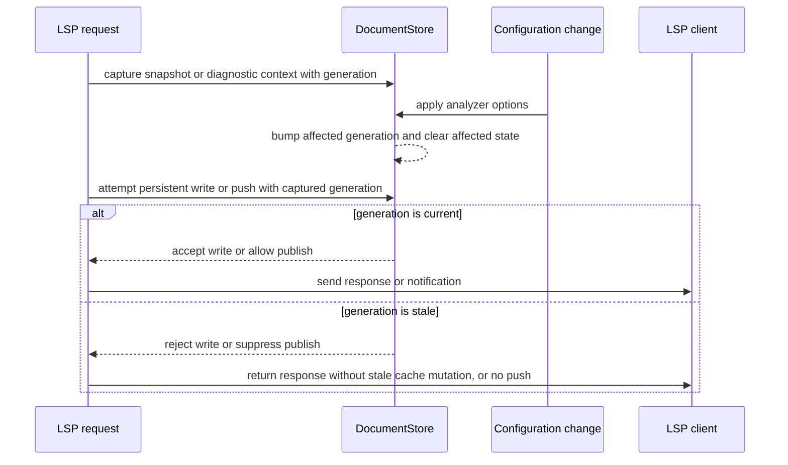
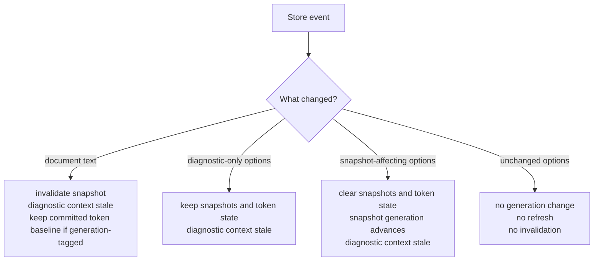

# LSP Interleaving Hardening - Plan

## Goal Capsule

- **Objective:** Harden LSP request interleavings around analyzer configuration, diagnostics, semantic-token state, and lazy editor snapshots so stale in-flight work cannot repopulate newer state, while deleting obsolete unguarded state paths instead of preserving unreleased compatibility.
- **Authority:** Maintainer direction: continue the next fearless refactor only where review found real need; breaking unreleased internals is acceptable, and compatibility shims are not required.
- **Execution profile:** Focused `merman-lsp` hardening with small `DocumentStore` state-model changes, deterministic tests, protocol smoke coverage, and narrow LSP documentation updates.
- **Stop conditions:** Stop if the work turns into a broad analysis engine redesign, VS Code release workflow, external lint adapter work, formatter work, or a new preview-product feature.
- **Tail ownership:** The implementation should leave deterministic tests that prove stale LSP requests either cannot persist state or are handled as bounded protocol responses with no stale server cache.

---

## Product Contract

### Summary

The previous refactor unified analyzer lifecycle, lazy editor snapshots, and protocol projection boundaries.
The remaining risk is request interleaving: one LSP request can capture a snapshot or analyzer, a configuration change can clear newer state, and the older request can later write semantic-token state or publish diagnostics as if it were still current.
This plan adds a small generation model and targeted tests so `merman-lsp` keeps its strong parser-backed language intelligence even when clients issue overlapping requests.

### Problem Frame

`DocumentStore` now owns a coherent analyzer lifecycle and correctly distinguishes diagnostic-only changes from snapshot-affecting changes.
It also stores lazy editor snapshots and semantic-token result state.
That is the right ownership shape, but it does not yet encode the time boundary between "request captured state" and "request writes response-side cache".

The highest-value next hardening is therefore not another boundary split.
It is making staleness observable and testable:

- semantic-token full and delta requests should not repopulate `semantic_tokens_state` after a snapshot-affecting configuration change cleared it;
- stale previous semantic-token result ids should fall back to full tokens after snapshot-affecting changes;
- push diagnostics should not publish results from a diagnostic context that became stale before publication;
- pull diagnostics should prove that a refresh after configuration change is followed by diagnostics from the current analyzer options;
- unchanged configuration should remain a true no-op for snapshots, semantic-token state, and client refreshes.

### Requirements

**State Generations**

- R1. `DocumentStore` must expose or internally enforce a generation boundary for snapshot-dependent state so stale request results cannot repopulate cleared snapshot or semantic-token cache state.
- R2. Diagnostic publication must have enough generation or context identity to suppress stale push diagnostics after document text or diagnostic-affecting configuration changes.
- R3. Diagnostic-only analyzer changes must preserve editor snapshots and semantic-token state while still making older diagnostic publish contexts stale.
- R4. Snapshot-affecting analyzer changes must invalidate editor snapshots, clear semantic-token state, and make older snapshot-dependent request results unable to write cache state.
- R5. Unchanged analyzer options must return `AnalyzerConfigurationChange::Unchanged` and must not invalidate snapshots, semantic-token state, diagnostics, or client refresh behavior.

**LSP Protocol Behavior**

- R6. Semantic-token full and delta handlers must record token state only when the request's captured snapshot generation is still current.
- R7. Semantic-token delta handlers must return full tokens when the client's previous result id is unknown, stale, or from a cleared snapshot generation.
- R8. Push diagnostic paths must not publish diagnostics from a context that became stale before the client notification is sent.
- R9. Pull diagnostic paths must answer from current analyzer options after a configuration refresh, or recompute once when an in-flight context is detected as stale.
- R10. Diagnostic-pull clients must continue to receive `workspace/diagnostic/refresh` rather than `textDocument/publishDiagnostics` for configuration-driven diagnostic refreshes.

**Testing And Scope**

- R11. Interleaving tests must be deterministic and should prefer pure `DocumentStore` state tests or small extracted helpers over scheduler timing.
- R12. LSP smoke tests must prove the externally visible refresh, fallback, and no-push behavior for real `tower_lsp` requests.
- R13. Documentation must state the stale-state policy only where it affects future maintainers; it must not claim new public API or ecosystem integration.
- R14. Obsolete unguarded state-mutating helpers, compatibility shims, or test hooks introduced during the refactor must be removed before the plan is done.

### Scope Boundaries

In scope:

- `DocumentStore` generation or epoch state for snapshot-dependent and diagnostic-dependent work;
- semantic-token state writes and delta fallback after configuration changes;
- diagnostic publish/pull currentness checks;
- no-op configuration behavior tests;
- LSP smoke tests for diagnostic pull refresh and semantic-token delta fallback;
- short LSP documentation updates for the interleaving contract.

Deferred to follow-up work:

- broader cancellation support for arbitrary long-running analysis;
- workspace-wide pull diagnostics for unopened files;
- LSP progress reporting or partial-result streaming;
- performance benchmarking for pathological clients;
- public lint adapter packages for external ecosystems.

Outside this plan:

- changes to Mermaid parsing semantics;
- changes to `merman-analysis` public JSON payloads;
- moving LSP protocol types into `merman-editor-core`;
- replacing external Mermaid preview or lint extensions;
- VS Code extension marketplace metadata, packaging, or release CI.

### Acceptance Examples

- AE1. A semantic-token full request captures snapshot generation `N`; a snapshot-affecting configuration change advances the generation; the old request completes but its token state write is rejected.
- AE2. After snapshot-affecting configuration clears token state, a `textDocument/semanticTokens/full/delta` request with the old `previous_result_id` returns full tokens rather than a delta from stale state.
- AE3. A diagnostic-only configuration change preserves cached editor snapshots and semantic-token state, but an older push diagnostic context captured before the change is not published after the change.
- AE4. A pull-diagnostic client receives `workspace/diagnostic/refresh`, no push diagnostics, and the subsequent `textDocument/diagnostic` result reflects the updated analyzer rule configuration.
- AE5. Applying `AnalysisOptions::default()` when the store already has default options is a no-op: cached snapshots and semantic-token state remain, and the server emits no refresh or publish notification.
- AE6. Document text replacement invalidates snapshot-dependent state and makes older diagnostic publish contexts stale without requiring timing-sensitive tests.
- AE7. Diagnostic pull responses may remain protocol responses to the client's request, but they do not mutate server state with stale analyzer output.
- AE8. Existing lazy snapshot behavior remains intact: opening a document stores text only, and editor snapshots are built on demand.

---

## Planning Contract

### Assumptions

- The branch already contains `DocumentWorkspace::with_analyzer`, LSP-local protocol projection helpers, borrowed editor snapshot request paths, and editor-core-derived semantic token legend ordering.
- `DocumentStore` is the right place to own small generation state because it already owns documents, snapshots, analyzer options, and semantic-token result state.
- The exact generation type names are implementation details; the load-bearing behavior is "capture generation with request state, validate generation before persistent write or push notification".
- Pull diagnostics do not currently keep server-side diagnostic result state, so their main correctness requirement is current analyzer use after refresh and no stale cache mutation.
- No external research is needed for this plan because the behavior is shaped by current repo architecture and LSP handler state, not a new third-party API.

### Key Technical Decisions

- KTD1. Use explicit store generations instead of scheduler-dependent tests. The implementation should make staleness a value that tests can construct and validate without sleeping, racing tasks, or relying on executor ordering.
- KTD2. Separate snapshot-dependent generation from diagnostic publish currentness if one counter would over-invalidate. Diagnostic-only changes should keep editor snapshots and token state valid, but still stale old diagnostic publish contexts.
- KTD3. Treat semantic-token result state as snapshot-generation-scoped. A request may still return a token response to the client, but it must not update `semantic_tokens_state` if its captured generation is no longer current.
- KTD4. Prefer suppressing stale push diagnostics and recomputing stale pull diagnostics once. Push notifications are unsolicited state updates, so stale ones should be dropped; pull responses are solicited, so recomputing once gives the client current analyzer behavior without introducing a cancellation framework.
- KTD5. Keep protocol behavior local to `merman-lsp`. The generation checks can live in `DocumentStore` and server helpers, but `merman-editor-core` and `merman-analysis` should not learn about LSP result ids, refresh requests, or client diagnostic modes.
- KTD6. Do not add broad async hooks unless a pure state seam cannot prove the behavior. Test-only scheduler gates are acceptable only as a last resort for one smoke-level proof, not as the main correctness mechanism.
- KTD7. Delete obsolete unguarded helpers rather than wrapping them for compatibility. `merman-lsp` internals are not a released API, so keeping both guarded and unguarded state-write paths would make future regressions more likely.
- KTD8. Treat document text edits differently from snapshot-affecting configuration changes. Text edits stale in-flight snapshot writes, but may keep the last committed semantic-token state as the client's previous-result baseline for delta responses; snapshot-affecting configuration changes clear token state because old result ids no longer describe the active analyzer configuration.

### Priority Analysis

P0 is the state model: U1 must land first because every later behavior needs a deterministic way to say whether a request context is current.
P1 is stale persistent state: U2 and U3 block correctness because they prevent old requests from repopulating semantic-token cache or publishing diagnostics after newer state exists.
P2 is protocol proof: U4 validates that client-visible behavior still matches LSP expectations after the internal state model changes.
P3 is documentation: U5 should follow the code so it documents implemented behavior rather than aspirational guarantees.

The plan intentionally defers broad cancellation, workspace diagnostics, external lint adapters, VS Code release work, and unrelated `merman-core` lint cleanup.
Those are real follow-ups, but they do not reduce the current LSP stale-state risk as directly as the P0/P1 work.

### High-Level Technical Design

### System-Wide Impact

- `crates/merman-lsp/src/document_store.rs` is the main state model and should own generation capture, currentness checks, semantic-token state acceptance, and no-op behavior tests.
- `crates/merman-lsp/src/server.rs` owns LSP request lifecycles, diagnostic publication, diagnostic pull responses, semantic-token result recording, and client refresh notifications.
- `crates/merman-lsp/src/semantic_tokens.rs` should remain focused on token projection and delta construction; it should not own store currentness.
- `crates/merman-lsp/tests/document_store.rs` should carry most deterministic state-machine tests.
- `crates/merman-lsp/tests/server_smoke.rs` should carry protocol-visible behavior for pull diagnostics, semantic-token delta fallback, and no unexpected notifications.
- `docs/lsp/CAPABILITIES.md` and `docs/lsp/DIAGNOSTIC_PROTOCOL.md` are the only likely docs that need small updates.

### Risks And Mitigations

| Risk | Mitigation |
|---|---|
| A single generation counter invalidates semantic-token state on diagnostic-only changes. | Use separate snapshot-dependent and diagnostic-dependent generations, or encode the event type in store currentness checks. |
| Stale pull diagnostic recomputation doubles work on every request. | Recompute only when a post-analysis generation check detects staleness; the normal path remains one analysis. |
| Tests become timing-sensitive and flaky. | Prove stale write rejection with pure store APIs first; reserve async smoke tests for observable LSP behavior. |
| Semantic-token delta behavior becomes stricter than LSP clients expect. | Fall back to full tokens for stale or unknown result ids, which is valid LSP behavior and already the server's current fallback shape. |
| Generation APIs leak as public design surface. | Keep new helpers `pub(crate)` unless existing integration tests require public access; tests inside the crate can validate private helpers through crate-level modules where appropriate. |
| Documentation overstates the guarantee. | Document persistent-state and publish-notification guarantees, not a general promise that all in-flight client responses are canceled. |

### Sources And Research

- `docs/plans/2026-07-02-001-refactor-analysis-editor-snapshot-seams-plan.md` established the analyzer lifecycle, lazy snapshot, and protocol projection boundary this plan builds on.
- `docs/lsp/CAPABILITIES.md` already states that snapshots are built from the active analyzer configuration and that diagnostic-only changes should not invalidate semantic-token state.
- `docs/lsp/DIAGNOSTIC_PROTOCOL.md` states that LSP pull diagnostics project the same analysis payloads as push diagnostics and that workspace diagnostics remain unimplemented.
- `docs/adr/0070-diagnostics-first-analysis-contract.md` and `docs/adr/0071-editor-parser-semantic-seam.md` define analysis as the diagnostic source of truth and LSP as a projection layer.
- Local code review found that `DocumentStore::set_semantic_tokens_state` accepts writes without a currentness check and that `MermanLanguageServer::record_semantic_tokens_state` records after request work completes.
- Local code review found that diagnostic push paths capture `(StoredDocument, Analyzer)` before analysis and publish without a post-analysis currentness check.

---

## Implementation Units

### U1. Add Deterministic Store Generations

- **Goal:** Make snapshot-dependent and diagnostic-dependent staleness representable in `DocumentStore`.
- **Priority:** P0
- **Requirements:** R1, R2, R3, R4, R5, R11, R14, AE1, AE3, AE5, AE6
- **Dependencies:** None
- **Files:** `crates/merman-lsp/src/document_store.rs`, `crates/merman-lsp/tests/document_store.rs`
- **Approach:** Introduce store-owned generation state for snapshot-dependent work and diagnostic publish currentness. Have snapshot capture and diagnostic context capture include the relevant generation. Have document text changes, diagnostic-only option changes, snapshot-affecting option changes, and unchanged option applications update or preserve generations according to the Product Contract. Delete or privatize old state paths that cannot carry generation identity; do not leave an unguarded public escape hatch beside the new guarded path.
- **Patterns to follow:** Existing `AnalyzerConfigurationChange`, `DocumentStore::apply_analyzer_options`, `DocumentStore::snapshot_cloned`, `DocumentStore::diagnostic_context`, and existing lazy snapshot tests.
- **Test scenarios:** Applying default options to a default store returns `Unchanged` and preserves an existing snapshot and semantic-token state; diagnostic-only rule severity changes preserve the snapshot generation and token state but stale older diagnostic contexts; snapshot-affecting `max_source_bytes` changes clear snapshots and token state and stale older snapshot captures; text replacement stales older snapshot and diagnostic contexts while preserving only committed token state that remains valid as a delta baseline; removing a document clears all state for that URI.
- **Verification:** Store tests prove generation transitions without async sleeps or task scheduling.

### U2. Guard Semantic-Token State Writes And Delta Fallback

- **Goal:** Prevent semantic-token requests that started before a snapshot-affecting change from repopulating stale token state.
- **Priority:** P1
- **Requirements:** R1, R4, R6, R7, R11, R12, R14, AE1, AE2, AE5, AE8
- **Dependencies:** U1
- **Files:** `crates/merman-lsp/src/document_store.rs`, `crates/merman-lsp/src/server.rs`, `crates/merman-lsp/src/semantic_tokens.rs`, `crates/merman-lsp/tests/document_store.rs`, `crates/merman-lsp/tests/server_smoke.rs`
- **Approach:** Change semantic-token request paths so snapshot capture returns the generation that produced the snapshot. Replace unconditional token-state recording with a currentness-checked store method, then remove the unguarded setter from request-facing code. Store semantic-token state with enough generation identity that delta requests can distinguish current state from cleared or stale state. Keep delta projection in `semantic_tokens.rs`; keep generation validation in the store/server layer.
- **Patterns to follow:** Current `MermanLanguageServer::semantic_tokens_full`, `semantic_tokens_full_delta`, `record_semantic_tokens_state`, `DocumentStore::semantic_tokens_state_cloned`, and `semantic_tokens_delta_result`.
- **Test scenarios:** A direct store test rejects `set_semantic_tokens_state` when given an old snapshot generation; semantic-token full records state when the generation is current; document text edits preserve the last committed token state only as a previous-result baseline while rejecting stale in-flight writes; snapshot-affecting configuration clears state and a later delta request with the old `previous_result_id` returns full tokens; diagnostic-only configuration preserves token state and does not force a semantic-token refresh; unchanged configuration emits no semantic-token refresh.
- **Verification:** LSP smoke coverage observes full-token fallback after snapshot-affecting configuration and existing delta behavior still passes when the previous result id is current.

### U3. Guard Diagnostic Publish And Pull Currentness

- **Goal:** Ensure diagnostics do not publish or report stale analyzer output after document or configuration changes.
- **Priority:** P1
- **Requirements:** R2, R3, R8, R9, R10, R11, R12, R14, AE3, AE4, AE6, AE7
- **Dependencies:** U1
- **Files:** `crates/merman-lsp/src/document_store.rs`, `crates/merman-lsp/src/server.rs`, `crates/merman-lsp/tests/document_store.rs`, `crates/merman-lsp/tests/server_smoke.rs`
- **Approach:** Have diagnostic context capture include the document version and diagnostic generation. Before `publishDiagnostics`, re-check that the captured context is still current; suppress the notification when it is stale because a newer publish or refresh path owns the current state. For pull diagnostics, perform a post-analysis currentness check and recompute once from the latest context if the captured analyzer became stale before response construction. Do not introduce server-side diagnostic result caching.
- **Patterns to follow:** Current `publish_for_uri`, `republish_all`, `diagnostic`, `diagnostics_for_document`, `document_diagnostic_report`, and existing diagnostic pull tests.
- **Test scenarios:** A stale diagnostic context captured before a diagnostic-only configuration change is rejected for push publication; a stale context captured before document text replacement is rejected; a pull client with diagnostic refresh support receives no push diagnostics during configuration refresh; after disabling a duplicate-commit rule, the next `textDocument/diagnostic` response omits the duplicate diagnostic; if pull analysis detects a stale context, it recomputes once rather than returning the old analyzer result.
- **Verification:** Deterministic store tests prove stale publish rejection, and `server_smoke` proves pull refresh followed by current diagnostics.

### U4. Prove Server Refresh No-Op And Mode-Specific Effects

- **Goal:** Lock down the externally visible refresh behavior for unchanged, diagnostic-only, and snapshot-affecting configuration changes.
- **Priority:** P2
- **Requirements:** R3, R4, R5, R10, R12, AE4, AE5, AE8
- **Dependencies:** U2, U3
- **Files:** `crates/merman-lsp/src/server.rs`, `crates/merman-lsp/tests/server_smoke.rs`, `crates/merman-lsp/tests/document_store.rs`
- **Approach:** Extend the existing configuration-change smoke tests to cover the no-op path and stale previous semantic-token ids. Keep test inputs small and source-backed: use rule severity/disablement for diagnostic-only changes and resource-limit changes for snapshot-affecting changes. Assert absence of notifications with bounded waits only at the LSP socket boundary, where absence is the observable protocol behavior; keep internal state assertions in `DocumentStore` tests.
- **Patterns to follow:** Existing `lsp_service_refreshes_diagnostics_after_configuration_change_when_supported`, `lsp_service_diagnostic_pull_refresh_does_not_push_open_documents`, semantic-token refresh tests, and delta smoke tests.
- **Test scenarios:** Unchanged configuration produces no publish diagnostics, no `workspace/diagnostic/refresh`, and no `workspace/semanticTokens/refresh`; diagnostic-only configuration in pull mode produces diagnostic refresh and no publish diagnostics; snapshot-affecting configuration with semantic-token refresh support produces semantic-token refresh; snapshot-affecting configuration without a current previous token state returns full tokens for a stale delta request.
- **Verification:** Server smoke tests cover each client capability combination without introducing timing-dependent races beyond existing socket absence checks.

### U5. Document The Interleaving Contract

- **Goal:** Make future maintainers understand what is guaranteed and what is intentionally bounded.
- **Priority:** P3
- **Requirements:** R13, AE7
- **Dependencies:** U2, U3, U4
- **Files:** `docs/lsp/CAPABILITIES.md`, `docs/lsp/DIAGNOSTIC_PROTOCOL.md`
- **Approach:** Add concise wording that `merman-lsp` rejects stale persistent semantic-token state writes, suppresses stale push diagnostics, and treats pull diagnostic stale detection as a recompute-once path rather than a cancellation framework. Keep the docs framed as LSP adapter behavior, not as new analysis API surface.
- **Patterns to follow:** Existing capability wording around analyzer configuration, diagnostic pull refresh, and semantic-token delta state.
- **Test scenarios:** Test expectation: none -- documentation only, verified by matching implemented behavior and avoiding public API claims.
- **Verification:** Documentation references the same stale-state policy implemented by U2 and U3 and does not reopen external lint or preview scope.

---

## Verification Contract

| Gate | Applies To | Done Signal |
|---|---|---|
| `cargo fmt --all --check` | All touched Rust files | Formatting passes with no diff required. |
| `cargo nextest run -p merman-lsp --no-fail-fast` | U1-U4 | Store, server, semantic-token, and diagnostic tests pass together. |
| `cargo test -p merman-lsp --test server_smoke -- --nocapture` | U2-U4 | Protocol smoke tests pass and show no unexpected diagnostics or refresh messages. |
| `cargo test -p merman-lsp --test document_store -- --nocapture` | U1-U3 | Deterministic generation and stale-state tests pass. |
| `cargo clippy -p merman-lsp --all-targets --no-deps -- -D warnings` | U1-U4 | LSP crate stays warning-free without being blocked by unrelated dependency lint debt. |
| Documentation review | U5 | Docs describe implemented LSP stale-state behavior and no broader public API guarantee. |

---

## Definition of Done

- U1 is done when store generation transitions are deterministic, tested, and do not invalidate snapshot-dependent state on diagnostic-only changes.
- U2 is done when stale semantic-token writes are rejected, stale previous result ids fall back to full tokens, and current delta behavior still works.
- U3 is done when stale push diagnostics are suppressed and pull diagnostics after refresh reflect current analyzer options.
- U4 is done when server smoke tests cover unchanged, diagnostic-only, and snapshot-affecting configuration effects across refresh-capable clients.
- U5 is done when LSP docs name the bounded interleaving contract without claiming cancellation or ecosystem integration.
- The final diff contains no abandoned test hooks, no broad runtime cancellation framework, no compatibility shim for unreleased internals, and no unrelated LSP or VS Code product changes.
- The verification gates in the Verification Contract pass, or any failure is clearly identified as unrelated pre-existing debt with evidence.
