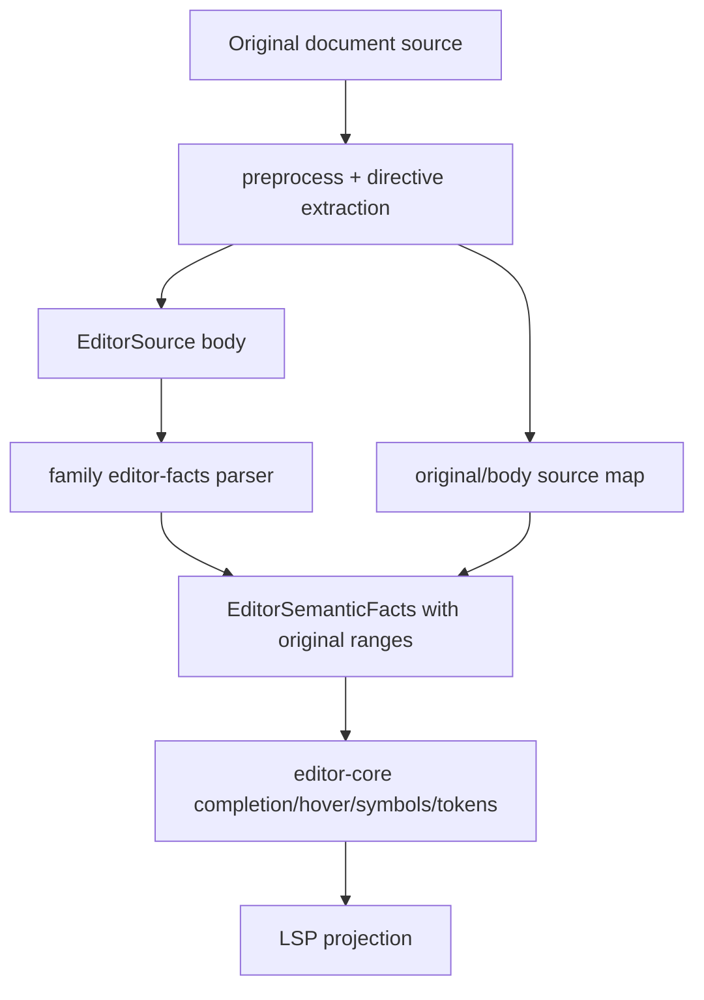
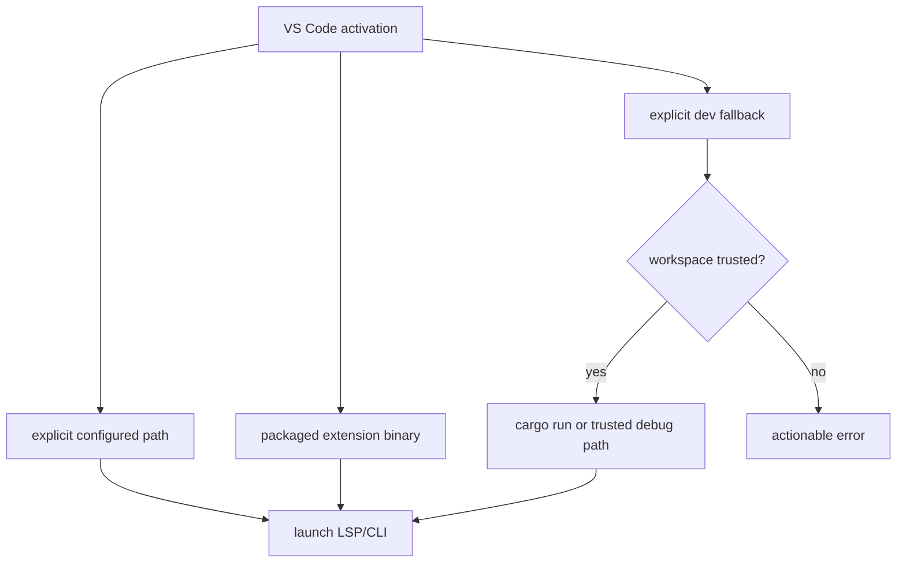
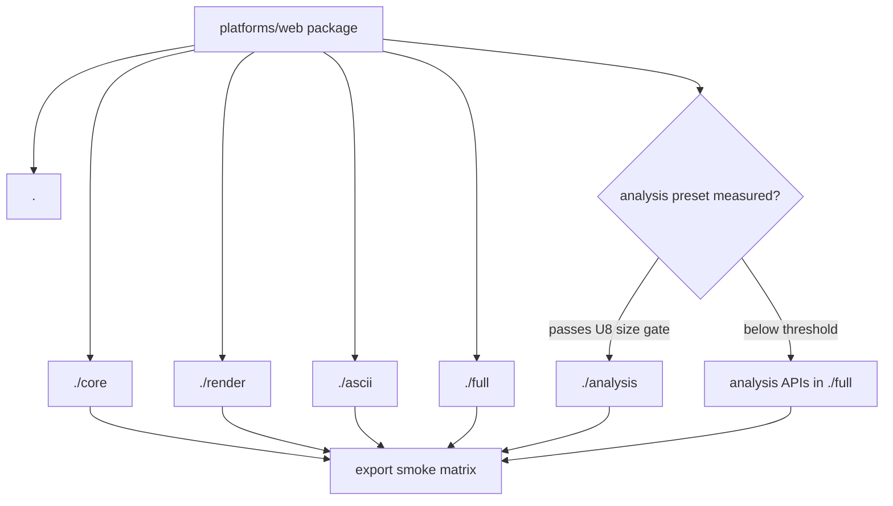

# PR20 Merge Hardening - Plan

## Goal Capsule

- **Objective:** Bring PR #20 to a mergeable state by fixing the review findings that affect extension trust, release correctness, LSP/editor consistency, Mermaid parity, Web/WASM package surfaces, and FFI smoke coverage.
- **Authority:** Maintainer direction allows fearless refactoring, breaking changes, and deletion of unnecessary code. Prefer deleting unsafe or misleading compatibility paths over preserving unreleased behavior.
- **Execution profile:** Cross-cutting Rust, TypeScript, CI, docs, and release hardening. Work should land as small ordered slices, but the design may reshape internal APIs when the current seams are the source of the bug.
- **Stop conditions:** Stop and ask before turning this into a full PR #20 rewrite, broad `clippy -D warnings` cleanup, unrelated Mermaid parity audit, UI polish pass, or marketplace launch project.
- **Tail ownership:** The finished branch should have deterministic regression tests and release gates that make the same review findings hard to reintroduce.

---

## Product Contract

### Summary

PR #20 has the right product direction: move Merman from a parser/renderer library toward a practical language-intelligence and package ecosystem. The blocking problem is not one single bug. It is that several new surfaces crossed trust, release, and semantic boundaries before those boundaries were made explicit.

The correct fix is a merge-hardening pass with three priorities:

1. **Trust and release first:** VS Code must not execute workspace binaries by default, and VSIX version/package checks must be part of release preflight.
2. **Semantic correctness second:** LSP/editor facts must observe the same preprocessed source as rendering, stale LSP work must not publish empty or stale state, and completion data must be derived from parser facts instead of hand-maintained drift.
3. **Surface contracts third:** Web exports, FFI callbacks, docs, and smoke tests must match the actual public package surface.

The plan intentionally keeps the existing Web `core`/`render`/`ascii`/`full` exports because local artifacts show meaningful size deltas. A separate `analysis` Web export should be added only if measurement passes the explicit U8 size gate; otherwise, expose the analysis API through the existing `full` surface and avoid another package path.

### Problem Frame

The review findings cluster around five deeper issues:

- **Implicit trust boundary:** `merman-vscode` currently treats a workspace `target/debug` binary as an automatic fallback when packaged binaries are missing. That is convenient during development, but unsafe as default extension activation behavior.
- **Release contract gap:** VSIX package metadata and packaged contents are verified, but the VS Code package version is not tied into `scripts/release-version.py`, and workflow verification does not pass the expected VSIX version.
- **Split parser/editor source semantics:** `ParsePipeline::parse_editor_semantic_facts()` calls `preprocess()` but most editor-facts parsers still receive the original source. This can diverge around frontmatter, init directives, and future source-map behavior.
- **LSP state currentness gaps:** Workspace symbols build snapshots while holding the store mutex, and pull diagnostics can degrade to an empty report when a recompute races with newer state.
- **Public surface drift:** Web docs say slim presets are not npm export paths while `package.json` already publishes them; Web smoke tests mostly exercise the root artifact; C smoke coverage does not exercise a non-null host text-measure callback; and diagnostic `codeDescription` points at the old repo owner.

### Requirements

**VS Code Trust And Release**

- R1. The VS Code extension must never execute workspace `target/debug` binaries by default.
- R2. Development fallbacks must be opt-in, clearly named, and gated by workspace trust when they use workspace-local executable paths.
- R3. Production resolution should prefer packaged binaries and user/global explicit paths. Explicit paths, workspace-debug paths, and Cargo fallbacks that resolve into the active workspace must require workspace trust; untrusted workspaces may not execute workspace-local binaries through configuration.
- R4. Extension settings, tests, and error messages must not imply that workspace debug binaries are a normal packaged fallback.
- R5. VS Code package version must participate in release-version checks alongside Cargo, Web, Android, Flutter, and Python.
- R6. VSIX verification in release preflight must pass and assert the expected release version.

**LSP And Editor Semantics**

- R7. Editor semantic facts must be parsed from the same preprocessed diagram body used by the render/model parse path, with source offsets mapped back to the original document.
- R8. The implementation should centralize this as a preprocessed editor-source abstraction instead of patching each family parser independently.
- R9. LSP workspace symbol collection must not hold the store mutex while building or recomputing snapshots.
- R10. Pull diagnostics must not return an empty diagnostic report merely because a recompute raced and became stale; empty is valid only when the document is absent, closed, or truly diagnostic-free.
- R11. Markdown command links returned by the extension/LSP client must default to untrusted markdown or a minimal command allowlist.

**Mermaid Parity**

- R12. Flowchart shape completions must come from the parser-supported public shape catalog, not a hand-maintained list.
- R13. Completion must not suggest shape names that the parser rejects, such as underscore or camelCase-only internal values.
- R14. Gantt `click` parsing must support Mermaid's bare callback and callback-plus-href forms, matching the pinned upstream grammar.
- R15. Parser parity fixes must include golden or model-level tests that prove accepted syntax updates the semantic model, not just that parsing returns `Ok`.
- R16. Expanded Gantt href parsing must preserve or explicitly verify the existing URL-safety policy at render/editor projection boundaries; grammar parity must not introduce a new unsafe-link path.

**Web/WASM And FFI Surfaces**

- R17. `@mermanjs/web` docs, package exports, generated surface entries, and smoke tests must agree on whether `./core`, `./render`, `./ascii`, and `./full` are public.
- R18. Keep those four Web exports unless size measurement shows they are not materially useful.
- R19. Add a dedicated Web `analysis` export only if a measured preset meets the explicit size gate in U8; otherwise, expose analysis through `full` and document why no split exists.
- R20. Web smoke and prepack gates must exercise every public export path, not only the root package.
- R21. FFI C smoke tests must exercise installing a non-null `MermanHostTextMeasureCallback`, rendering with it, and resetting it to null.

**Repository Hygiene**

- R22. Diagnostic `codeDescription` links must point at `github.com/Latias94/merman`.
- R23. Broad clippy cleanup is deferred unless a warning is in a file directly touched by this plan and can be fixed without expanding scope.
- R24. Docs must distinguish implemented package/release contracts from future ideas.

### Scope Boundaries

In scope:

- VS Code binary resolution and markdown trust settings.
- VSIX version and release-preflight gates.
- `parse_editor_semantic_facts()` source preprocessing and source-offset strategy.
- Flowchart shape completion catalog and Gantt click parser parity.
- LSP workspace-symbol lock narrowing and pull-diagnostic stale recompute behavior.
- Web package export/docs/smoke/prepack alignment, including a measured decision on an analysis export.
- FFI C callback smoke coverage.
- Small diagnostics URL cleanup.

Deferred:

- Full PR #20 architectural rewrite.
- Full `cargo clippy --workspace --all-targets -- -D warnings` cleanup.
- New VS Code marketplace launch assets, publishing automation, or UI redesign.
- Full Mermaid parity matrix expansion beyond the review-triggered parser gaps.
- Public analysis package strategy beyond the measured Web subpath decision in U8.

Outside this plan:

- Replacing Mermaid.js runtime behavior.
- Adding a formatter.
- Changing diagram rendering visuals except where parser parity requires model changes.
- Moving LSP protocol types into `merman-editor-core`.

### Acceptance Examples

- AE1. Packaged VS Code activation fails with an actionable error when no packaged or explicit binary exists; it does not silently run `target/debug/merman-lsp`.
- AE2. A trusted development workspace can still use an explicit Cargo fallback when the corresponding setting is enabled.
- AE3. `python scripts/release-version.py check --version X` fails if `tools/vscode-extension/package.json` is not version `X`.
- AE4. Release preflight VSIX verification fails if the package manifest version inside the VSIX does not match the requested release version.
- AE5. A diagram with frontmatter or init directives produces editor facts, completions, symbols, and semantic tokens with original-document ranges.
- AE6. Workspace symbol requests release the document-store lock before building expensive snapshots.
- AE7. Pull diagnostics under stale-context races either recompute boundedly or report current diagnostics; they do not publish a misleading empty result.
- AE8. Flowchart shape completion does not suggest `inv_trapezoid` if the parser rejects underscore shape names.
- AE9. Gantt `click taskId callbackName` and mixed `href`/callback forms update the click/link model according to upstream Mermaid grammar.
- AE10. `npm run smoke --prefix platforms/web` checks all documented public exports and fails on any stale export/doc mismatch.
- AE11. FFI C smoke verifies a host text-measure callback path and then verifies null reset remains valid.

---

## Planning Contract

### Assumptions

- PR #20 is still a feature branch, so internal breaking changes and removal of misleading settings are acceptable.
- The repo already has adjacent plans for analysis/editor snapshot seams and LSP interleaving hardening; this plan should consume their direction instead of re-planning those topics wholesale.
- Web package size matters enough to keep multiple exports: local artifacts show `core` around 1.97 MB raw, `ascii` around 2.97 MB, `render` around 4.91 MB, and `full` around 6.94 MB.
- The current Web `full` artifact includes `editor-language`, which pulls `merman-analysis` and `merman-editor-core`.
- `repo-ref/mermaid` is the pinned upstream evidence source for Mermaid grammar behavior.

### Key Technical Decisions

- KTD1. Delete the automatic workspace-debug fallback. If a developer workflow still needs `target/debug`, express it as an explicit development setting that requires workspace trust and never appears as a production fallback.
- KTD2. Treat VSIX as a first-class release surface. Version checks and packaged-content checks should be impossible to run without asserting the release version.
- KTD3. Introduce the smallest preprocessed editor source type needed for this review finding: body text plus original-range translation for frontmatter/init-directive cases. Add directive metadata or broader source-map helpers only when a migrated parser needs them.
- KTD4. Parser-supported catalogs should own completion vocabularies. Editor-core may filter and label shape items, but it should not duplicate the shape list by hand.
- KTD5. Fix LSP currentness with bounded, explicit state checks. Do not add sleeps, scheduler hooks, or broad cancellation just to hide stale races.
- KTD6. Keep `core`/`render`/`ascii`/`full` Web exports public because their size profile is materially different. Measure `analysis`, but add it as a public export only if it passes the U8 numeric size gate; otherwise record a declined decision and keep analysis APIs on `full`.
- KTD7. Prefer release gates over documentation-only fixes whenever a mismatch can break consumers.

### Priority Analysis

**P0: stop unsafe execution and release drift.** R1-R6 are the highest priority because they define whether the extension and release artifacts are safe to ship at all.

**P1: stop semantic/state corruption.** R7-R16 are next because they affect core language-intelligence correctness and can silently produce bad editor behavior.

**P2: make public package contracts truthful.** R17-R21 are release-facing but less security-sensitive. They should land before merge so the package does not publish contradictory API promises.

**P3: cleanup and guardrails.** R22-R24 are low risk but cheap enough to include while the touched areas are active.

### High-Level Technical Design

### System-Wide Impact

- `tools/vscode-extension/src/binaries.ts` changes binary resolution policy and tests.
- `tools/vscode-extension/src/server.ts` changes markdown trust and server launch behavior.
- `tools/vscode-extension/package.json` changes settings descriptions and version governance.
- `scripts/release-version.py` adds VS Code package version checking.
- `.github/workflows/release-preflight.yml` passes expected version into VSIX verification.
- `crates/merman-core/src/parse_pipeline.rs` becomes the central entry for preprocessed editor-source parsing.
- Family parser modules under `crates/merman-core/src/diagrams/*/parse.rs` migrate from raw `self.text` editor facts to the new editor-source body where needed.
- `crates/merman-core/src/diagrams/flowchart/shape_data.rs` exposes a public supported-shape catalog helper for editor use.
- `crates/merman-editor-core/src/completion.rs` consumes the flowchart shape catalog and filters invalid public values.
- `crates/merman-core/src/diagrams/gantt/parse.rs` ports upstream click grammar combinations and tests unsafe-link behavior through the existing projection/sanitization path.
- `crates/merman-lsp/src/server.rs` and `crates/merman-lsp/src/document_store.rs` narrow lock scope and stale diagnostic behavior.
- `platforms/web/package.json`, `platforms/web/scripts/*`, and `docs/release/PACKAGE_SURFACES.md` align Web exports and smoke gates.
- `crates/merman-ffi/tests/c_consumer_smoke.c` adds non-null callback coverage.

### Risks And Mitigations

| Risk | Mitigation |
|---|---|
| Removing workspace-debug fallback slows extension development. | Keep explicit `useCargoRun` and, only if needed, add an explicit trusted debug-path dev setting with clear wording. |
| Source-map work becomes too broad. | Start with frontmatter/directive masking cases needed by editor facts; keep rendering source maps and browser UI mapping out of scope. |
| Shape catalog exposure leaks Mermaid internal aliases. | Expose a filtered public helper that applies the same lowercase/no-underscore parser rules used by shapeData validation. |
| Gantt click parsing accepts syntax Mermaid rejects. | Use pinned `repo-ref/mermaid` grammar as the source of truth and add negative tests for malformed tails. |
| Pull diagnostic retry loops under rapid edits. | Bound recompute attempts and return a protocol-appropriate stale/canceled response rather than looping indefinitely. |
| Web `analysis` export adds churn without real size benefit. | Gate it on the explicit U8 size threshold and otherwise record a declined decision with `full` API docs. |
| Release workflows become too slow. | Extend existing gates rather than adding a second packaging matrix; reuse current `verify-vsix` and Web smoke scripts. |

### Sources And Research

- PR reference: `https://github.com/Latias94/merman/pull/20`.
- Existing plan: `docs/plans/2026-07-02-001-refactor-analysis-editor-snapshot-seams-plan.md`.
- Existing plan: `docs/plans/2026-07-02-002-refactor-lsp-interleaving-hardening-plan.md`.
- Upstream Mermaid grammar: `repo-ref/mermaid/packages/mermaid/src/diagrams/gantt/parser/gantt.jison`.
- Local Web artifact sizes in `platforms/web/pkg/**/merman_wasm_bg.wasm`.
- Local review of VS Code, LSP, parser, Web, CI, and FFI files listed in System-Wide Impact.

---

## Implementation Units

### U1. Remove Unsafe VS Code Binary Fallback

- **Priority:** P0
- **Goal:** Make extension binary resolution explicit and production-safe.
- **Requirements:** R1, R2, R3, R4, AE1, AE2
- **Dependencies:** None
- **Files:** `tools/vscode-extension/src/binaries.ts`, `tools/vscode-extension/src/server.ts`, `tools/vscode-extension/src/renderer.ts`, `tools/vscode-extension/src/config.ts`, `tools/vscode-extension/package.json`, `tools/vscode-extension/src/test/**/*.test.ts`
- **Approach:** Remove `workspace-debug` from the default resolution path and from normal user-facing setting copy. Keep packaged binaries as the normal production path. Explicit configured paths remain supported, but resolution must classify whether the path is user/global configuration outside the workspace or a workspace-local executable. Reject workspace-local explicit paths and Cargo fallbacks in untrusted workspaces. If `target/debug` support is still valuable, add a dev-only setting such as `merman.server.useWorkspaceDebugBinary` and gate it with `vscode.workspace.isTrusted`. Apply the same policy to CLI/preview/export resolution.
- **Test scenarios:** packaged binary wins; user/global explicit path outside the workspace wins; missing packaged binary errors without scanning workspace; Cargo fallback only runs when enabled and workspace trusted; explicit path pointing inside the workspace is rejected in an untrusted workspace; workspace-debug dev fallback is rejected in untrusted workspace; setting descriptions no longer advertise implicit debug fallback.
- **Verification:** `npm test --prefix tools/vscode-extension`; `npm run check --prefix tools/vscode-extension`.

### U2. Make VSIX Version A Release Gate

- **Priority:** P0
- **Goal:** Tie VS Code package version and VSIX verification to the repository release version.
- **Requirements:** R5, R6, AE3, AE4
- **Dependencies:** None
- **Files:** `scripts/release-version.py`, `.github/workflows/release-preflight.yml`, `tools/vscode-extension/scripts/verify-vsix.mjs`, `tools/vscode-extension/package.json`
- **Approach:** Add a `vscode_extension_version()` reader to `scripts/release-version.py` and include it in `check_versions()`. Update release preflight `Verify VSIX contents` to pass `--version "${{ inputs.version }}"`. Keep `verify-vsix.mjs` as the single content assertion script and add tests only if the repo already has a harness for it.
- **Test scenarios:** version check fails when VS Code package version differs; release workflow command visibly passes `--version`; `verify-vsix.mjs` rejects mismatched manifest versions.
- **Verification:** `python scripts/release-version.py check --version "$(python - <<'PY'\nimport tomllib\nprint(tomllib.load(open('Cargo.toml','rb'))['workspace']['package']['version'])\nPY\n)"`; when local VSIX packaging is available, run `npm run verify:vsix -- --vsix <file> --platform <key> --target <key> --version <expected>` plus a negative mismatch check. Do not treat `verify-vsix.mjs --help` as evidence because it does not inspect a VSIX.

### U3. Centralize Preprocessed Editor Source

- **Priority:** P1
- **Goal:** Ensure editor facts use render/model preprocessing while preserving original document ranges.
- **Requirements:** R7, R8, AE5
- **Dependencies:** None
- **Files:** `crates/merman-core/src/parse_pipeline.rs`, `crates/merman-core/src/diagram/mod.rs`, `crates/merman-core/src/diagrams/*/parse.rs`, `crates/merman-core/src/diagrams/**/tests.rs`, `crates/merman-editor-core/tests/semantic_facts.rs`, `crates/merman-editor-core/tests/completion.rs`, `crates/merman-editor-core/tests/structure.rs`, `crates/merman-editor-core/tests/semantic_tokens.rs`
- **Approach:** Introduce an `EditorParseSource` or similarly named internal type returned by preprocessing. The MVP should carry only the preprocessed body and original-range translator needed for frontmatter/init-directive editor facts. Migrate only the family parsers proven to diverge on raw source, starting with sequence, class, state, ER, and any flowchart path that still bypasses the preprocessed body. Treat broader directive metadata, helper APIs, and remaining family migration as follow-up cleanup unless the compile-time signature change forces a local mechanical update.
- **Test scenarios:** frontmatter plus sequence/class/state/ER diagrams still produce node/participant/class facts; completion and symbols point to original source ranges; directive prefixes still attach to facts; parse errors preserve useful original locations.
- **Verification:** `cargo nextest run -p merman-core -p merman-editor-core --no-fail-fast`.

### U4. Fix Flowchart Shape Completion Drift

- **Priority:** P1
- **Goal:** Make completion suggestions reflect parser-accepted shape names.
- **Requirements:** R12, R13, AE8
- **Dependencies:** U3 only if completion tests need the new source mapping; otherwise independent.
- **Files:** `crates/merman-core/src/diagrams/flowchart/shape_data.rs`, `crates/merman-editor-core/src/completion.rs`, `crates/merman-editor-core/tests/**/*completion*`
- **Approach:** Expose a sorted parser-backed public shape list from `merman-core`. Apply the same public filter used by shapeData validation: lowercase only, no underscore, and parser-supported. Replace the hard-coded editor-core list with this catalog, adding details/labels locally.
- **Test scenarios:** `inv_trapezoid` is absent; representative accepted shapes are present; all completion shape labels pass parser validation; catalog ordering is deterministic.
- **Verification:** `cargo nextest run -p merman-editor-core --no-fail-fast`.

### U5. Port Gantt Click Callback Grammar

- **Priority:** P1
- **Goal:** Match upstream Mermaid Gantt `click` callback and href combinations.
- **Requirements:** R14, R15, R16, AE9
- **Dependencies:** None
- **Files:** `crates/merman-core/src/diagrams/gantt/parse.rs`, `crates/merman-core/tests/**/*gantt*`, `crates/merman-core/tests/goldens/**/*`
- **Approach:** Rework `parse_click_statement()` to parse a click id followed by any valid Mermaid combination of callback name, callback args, and href. Reject unrecognized non-empty tails instead of silently accepting partial parse. Preserve current href-only behavior and verify that any existing URL sanitization or projection policy still applies to the newly accepted href combinations.
- **Test scenarios:** bare callback; callback with args; callback then href; href then callback; href-only; malformed extra tail returns a parse fallback/error; semantic model contains expected click event and link entries; unsafe schemes in accepted href forms follow the same sanitization or rejection behavior as existing href-only Gantt links.
- **Verification:** `cargo nextest run -p merman-core --no-fail-fast`.

### U6. Harden LSP Snapshot And Diagnostic Currentness

- **Priority:** P1
- **Goal:** Remove stale or lock-heavy LSP paths exposed by review.
- **Requirements:** R9, R10, AE6, AE7
- **Dependencies:** Align with `docs/plans/2026-07-02-002-refactor-lsp-interleaving-hardening-plan.md` if that work has not already landed.
- **Files:** `crates/merman-lsp/src/server.rs`, `crates/merman-lsp/src/document_store.rs`, `crates/merman-lsp/tests/document_store.rs`, `crates/merman-lsp/tests/server_smoke.rs`
- **Approach:** Add a two-phase workspace symbol path: capture URI/document identities under lock, then build or clone snapshots outside the mutex. For pull diagnostics, replace the stale-then-`unwrap_or_default()` path with a bounded recompute/currentness helper: analyze the captured context, check currentness, retry once from the latest context if stale, then return an LSP stale/canceled response such as `ContentModified` rather than an empty report if the retry is also stale. Empty diagnostics remain valid only for absent documents or current diagnostic-free documents.
- **Test scenarios:** workspace symbol over multiple documents does not call snapshot construction under mutex; stale diagnostic context after a text/config change does not return empty when current diagnostics exist; a second stale recompute returns the chosen stale/canceled response; absent document still returns empty.
- **Verification:** `cargo nextest run -p merman-lsp --no-fail-fast`.

### U7. Tighten VS Code Markdown Trust

- **Priority:** P1
- **Goal:** Avoid broad trusted markdown in language-client rendered content.
- **Requirements:** R11
- **Dependencies:** None
- **Files:** `tools/vscode-extension/src/server.ts`, `tools/vscode-extension/src/test/**/*.test.ts`
- **Approach:** Set client markdown trust to false by default. If command links are required, use VS Code's allowlist shape for extension-owned commands only and keep HTML disabled.
- **Test scenarios:** language client options do not set broad `isTrusted: true`; any allowed commands are extension-owned and enumerated.
- **Verification:** `npm test --prefix tools/vscode-extension`; `npm run check --prefix tools/vscode-extension`.

### U8. Align Web Public Exports, Analysis Decision, And Smoke Matrix

- **Priority:** P2
- **Goal:** Make `@mermanjs/web` package surface truthful and guarded.
- **Requirements:** R17, R18, R19, R20, AE10
- **Dependencies:** None
- **Files:** `platforms/web/package.json`, `platforms/web/scripts/build-wasm.mjs`, `platforms/web/scripts/build-surface-packages.mjs`, `platforms/web/scripts/smoke.mjs`, `platforms/web/scripts/prepack-check.mjs`, `platforms/web/src/**/*`, `docs/release/PACKAGE_SURFACES.md`, `.github/workflows/release-preflight.yml`
- **Approach:** Declare `./core`, `./render`, `./ascii`, and `./full` as public exports in docs. Update smoke to iterate over every documented export and corresponding WASM module/preset manifest. Add a measurement-only `browser-analysis` preset if needed to evaluate size. Add `./analysis` as a public export only if gzip size is at least 25% smaller than `render` or at least 50% smaller than `full`, and raw size does not regress against the same comparator. If the threshold is not met, do not add the export; document a declined decision and state that analysis is available through `./full`.
- **Test scenarios:** root and all public subpaths import; each subpath initializes its own WASM artifact; capabilities match preset manifest; docs mention every exported surface; package exports do not include undocumented public paths; the analysis export decision records raw and gzip numbers and the threshold outcome.
- **Verification:** `npm run build --prefix platforms/web`; `npm run smoke --prefix platforms/web`; `npm run prepack --prefix platforms/web`; `cargo run -p xtask -- wasm-size-matrix --budget-file docs/release/WASM_SIZE_BUDGETS.json` if size evidence changes.

### U9. Add FFI Host Text Measure C Smoke

- **Priority:** P2
- **Goal:** Prove the C ABI callback path works for real C consumers.
- **Requirements:** R21, AE11
- **Dependencies:** None
- **Files:** `crates/merman-ffi/tests/c_consumer_smoke.c`, `crates/merman-ffi/include/merman.h`, `crates/merman-ffi/src/lib.rs`, `crates/merman-ffi/tests/**/*`
- **Approach:** Add a small C callback that returns deterministic width/height and increments a counter through `user_data`. Install it with `merman_engine_set_text_measure_callback`, render a simple SVG when render is enabled, assert the callback ran, then reset with a null callback and render/analyze again.
- **Test scenarios:** non-null callback succeeds; callback receives non-null text for labels; reset null succeeds; unsupported-render builds still return the expected unsupported result without crashing.
- **Verification:** `cargo nextest run -p merman-ffi --no-fail-fast`.

### U10. Clean Diagnostic Links And Touched Warnings

- **Priority:** P3
- **Goal:** Remove cheap correctness drift without opening broad lint scope.
- **Requirements:** R22, R23, R24
- **Dependencies:** None
- **Files:** `crates/merman-lsp/src/diagnostics.rs`, touched Rust/TypeScript files, relevant docs
- **Approach:** Update `codeDescription` links to `https://github.com/Latias94/merman/rules/{code}` or a documented rules path if one exists. Fix clippy warnings only in files already modified by U1-U9 when the fix is local and obvious. Do not start a workspace-wide lint campaign under this unit.
- **Test scenarios:** diagnostic conversion tests assert the new repo owner; touched files remain formatted and locally lint-clean where feasible.
- **Verification:** `cargo nextest run -p merman-lsp --no-fail-fast`; `cargo fmt --check`; targeted `cargo clippy` only for touched packages if runtime is acceptable.

---

## Verification Contract

### Required Gates

- `cargo fmt --check`
- `cargo nextest run -p merman-core -p merman-editor-core -p merman-lsp -p merman-ffi --no-fail-fast`
- `npm run check --prefix tools/vscode-extension`
- `npm test --prefix tools/vscode-extension`
- `npm run build --prefix platforms/web`
- `npm run smoke --prefix platforms/web`
- `npm run prepack --prefix platforms/web`
- `python scripts/release-version.py check --version <workspace-version>`

### Conditional Gates

- `cargo run -p xtask -- wasm-size-matrix --budget-file docs/release/WASM_SIZE_BUDGETS.json` when Web preset/export decisions change.
- VSIX dry-run packaging and `npm run verify:vsix -- --version <release-version>` when local platform tooling is available.
- Targeted `cargo clippy -p <touched-package> --all-targets -- -D warnings` only after the main fixes are green; do not block the plan on unrelated existing warnings.

### Evidence To Capture

- Before/after Web WASM raw and gzip sizes for `core`, `render`, `ascii`, `full`, and any measured `analysis` preset, plus the U8 threshold decision.
- VSIX verification command showing `--version`.
- Tests proving frontmatter/directive source ranges for editor facts.
- Tests proving Gantt click semantic model updates.
- Tests proving pull diagnostics do not degrade stale races to empty results.

---

## Rollout And Landing Strategy

1. Land U1 and U2 first as the P0 trust/release slice. This should be reviewable independently and should not depend on parser work.
2. Run an LSP status checkpoint against `docs/plans/2026-07-02-002-refactor-lsp-interleaving-hardening-plan.md`: identify which generation/currentness pieces already landed, then decide whether U6 is a small convergence patch, a full implementation, or safe to run in parallel with U3-U5.
3. Land U7 as the remaining VS Code security hardening slice.
4. Land U3, U4, and U5 as the Mermaid/editor semantics slice. This may be a breaking internal refactor and should carry the heaviest Rust tests.
5. Land U6 according to the checkpoint result if it was not already completed in parallel.
6. Land U8 and U9 as package/FFI surface hardening.
7. Land U10 and docs cleanup last, after behavior is fixed.

If the branch needs to be split for review, use the same slice boundaries. Do not merge Web surface docs before smoke/prepack enforces them.

---

## Definition Of Done

- No automatic VS Code workspace-debug execution remains in production binary resolution.
- VS Code package version is checked by release-version tooling and VSIX verification asserts the expected version in CI.
- Editor facts use preprocessed source with original-range preservation for frontmatter/directive cases.
- Flowchart shape completion is parser-backed and no longer suggests rejected underscore/camelCase values.
- Gantt click callback and href combinations match pinned Mermaid grammar and have model-level tests.
- LSP workspace symbols and pull diagnostics no longer have the reviewed lock/currentness failure modes.
- Web package exports, docs, smoke tests, and prepack checks agree on the public surface.
- The measured `analysis` Web surface decision is recorded: either implemented with size evidence or explicitly declined because the size delta is not worth another export.
- FFI C smoke covers non-null host text measurement and null reset.
- Required verification gates pass or any remaining failure is documented as unrelated pre-existing debt with exact command output.
