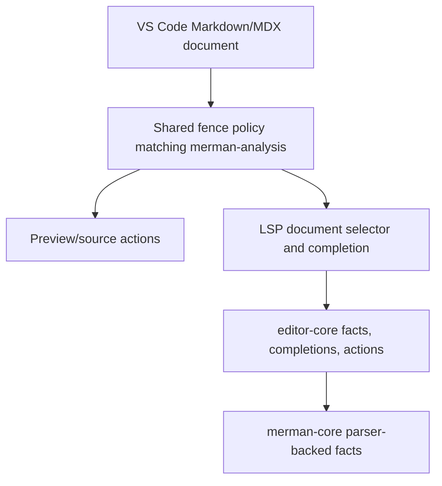
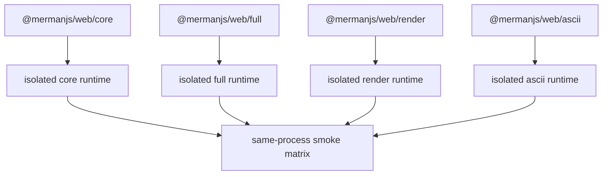
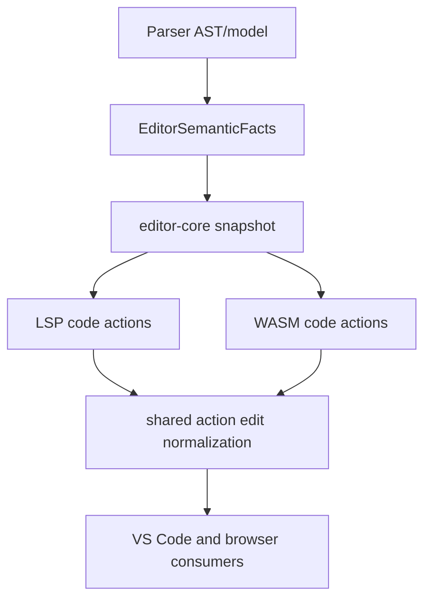

# PR20 Review Fixes - Plan

## Goal Capsule

- **Objective:** Fix the reviewed PR #20 issues that block a reliable local Mermaid language-intelligence release across Rust, VS Code, Web/WASM, Android JNI, and release docs.
- **Authority:** Maintainer direction allows fearless refactoring, breaking unreleased APIs, and deleting misleading compatibility code. Existing repository safety rules still apply: do not discard unrelated local work, stage only this plan's changes, and use `nextest` and `cargo fmt` for Rust verification.
- **Execution profile:** Cross-cutting hardening with behavior-bearing tests first where practical. The implementation may reshape internal APIs when duplicated scanner, action, or package-surface logic is the bug.
- **Stop conditions:** Stop and ask only if a fix would change product scope beyond PR #20 language intelligence, require dropping a public package surface already documented for this PR, or conflict with current Mermaid semantics from `repo-ref/mermaid`.
- **Tail ownership:** The finished branch should be locally verified, reviewable in focused commits, and safe to merge without hiding residual review findings in docs-only workarounds.

---

## Product Contract

### Summary

PR #20 adds a useful language-intelligence layer, but several new public and cross-surface contracts are inconsistent.
The merge-hardening target is to make each surface tell the same truth: Rust editor facts match parser semantics, VS Code preview and LSP agree on Markdown/MDX sources, Web subpaths load the artifact they name, Android JNI builds under declared feature combinations, and release docs match automation.

### Problem Frame

The review findings share one root cause: behavior was implemented separately at each boundary.
VS Code has its own Markdown fence scanner, Web subpaths share a root WASM singleton, WASM code actions duplicate LSP normalization, and editor facts sometimes skip parser-backed semantic constructs.
This creates failures that normal happy-path tests miss because each surface works alone but not when combined with its documented contract.

### Requirements

**Build And Package Correctness**

- R1. Android JNI must compile for the supported Android target with `merman-ffi --no-default-features`.
- R2. `@mermanjs/web` subpath entry points must initialize and report the WASM preset they name when multiple subpaths are imported in one JavaScript process.
- R3. Web smoke/prepack checks must catch cross-subpath singleton contamination.
- R4. Rust crate release documentation must match the release workflow's crate list and order.

**Editor And Mermaid Semantics**

- R5. Flowchart standalone shape-data statements such as `D@{ shape: rounded }` must produce editor facts for their target node when Mermaid treats them as node definitions.
- R6. Requirement diagram `style`, `classDef`, and `class` statements with comma-separated IDs must produce facts for every relevant ID, not just the first one.
- R7. Parser-backed tests must prove the semantic facts or model behavior, not only that parsing returns `Ok`.

**VS Code, LSP, And Source Selection**

- R8. VS Code preview/source actions must use Markdown fence rules equivalent to `merman-analysis`: skip non-Mermaid fences, reject tab and 4-space-indented fences, and preserve cursor-to-fence selection behavior.
- R9. `.mdx` support must not depend on a third-party extension assigning `languageId: "mdx"` in a clean VS Code profile.
- R10. LSP completion capabilities must advertise the same trigger characters used by the Monaco/playground integration.
- R11. Diagnostic `codeDescription` links must point at the current repository or a real docs path.

**Cross-Surface Contract Hygiene**

- R12. WASM and LSP code-action exports must share ordering and overlapping-edit rejection rules, or a shared normalization helper, so browser consumers do not receive edits the LSP surface would suppress.
- R13. TypeScript package declarations should be generated or checked against wasm-bindgen output enough to prevent hand-written contract drift for public Web APIs.
- R14. `merman-editor-core` should expose a smaller supported public API; internal modules and mutable snapshot state should not become accidental semver commitments before release.
- R15. FFI/Android docs must describe implemented thread, lifecycle, and analysis surfaces accurately.

### Scope Boundaries

In scope:

- PR #20 branch-local fixes for reviewed behavior, tests, and docs.
- Breaking unreleased internal APIs in `merman-editor-core`, `merman-wasm`, and Web TypeScript wrappers when that removes drift.
- Deleting duplicated scanner/action/export logic after equivalent shared coverage exists.
- Focused release documentation updates tied to the fixed surfaces.

Deferred to follow-up work:

- Full source-map redesign across all Markdown consumers beyond the preview/source-action parity bug.
- Full VS Code extension-host automation if local platform setup makes it impractical in this branch.
- Marketplace publishing, screenshots, or UX polish unrelated to the reviewed failures.
- Whole-workspace clippy cleanup or unrelated public API redesign outside touched editor/WASM surfaces.

Outside this product identity:

- Pixel-perfect Mermaid rendering parity.
- Replacing Mermaid's syntax semantics with Merman-specific behavior.
- Adding a formatter or new diagram families.

### Acceptance Examples

- AE1. `cargo check -p merman-ffi --target aarch64-linux-android --no-default-features` succeeds.
- AE2. A Node process that initializes `@mermanjs/web/core` and then `@mermanjs/web/full` observes full capabilities from the full subpath and can call SVG rendering.
- AE3. A Markdown document containing a Mermaid-looking fence inside a normal non-Mermaid fence is ignored by VS Code preview/source actions exactly as analysis ignores it.
- AE4. A tab-indented or 4-space-indented Mermaid fence does not become a preview source.
- AE5. In a clean VS Code profile, `.mdx` files still get Merman LSP/source-action behavior based on file pattern or contributed language support.
- AE6. `flowchart TD\nD@{ shape: rounded }\n` exposes `D` through document symbols/references/semantic facts.
- AE7. `requirementDiagram` style/class statements with `a,b,c` expose facts for all listed IDs.
- AE8. VS Code receives completion trigger characters for Mermaid-relevant punctuation and whitespace.
- AE9. Web and LSP code actions return the same sorted, non-overlapping edit set for equivalent analysis input.
- AE10. Release docs and release workflow agree on every publishable Rust crate introduced by PR #20.

---

## Planning Contract

### Assumptions

- The current checkout is already the PR #20 head branch `feat/editor-core-language-intelligence` at `61ca325df32e31430d96450dd4199506e007778e`.
- `repo-ref/mermaid` is available locally and remains the source of truth for Mermaid grammar and semantic behavior.
- The Web subpaths `./core`, `./render`, `./ascii`, and `./full` remain public because `platforms/web/README.md` documents them.
- This plan is narrower than `docs/plans/2026-07-03-001-pr20-merge-hardening-plan.md`; that existing plan remains a related artifact, not the execution target for this accepted review pass.

### Key Technical Decisions

- KTD1. Fix real contracts before polishing docs. Compile failures and multi-surface runtime mismatches are P0/P1 because they invalidate release artifacts.
- KTD2. Prefer shared source/action modules over duplicated TypeScript/Rust logic. The scanner and code-action drift came from separate implementations.
- KTD3. Preserve Mermaid semantics from the parser/model. Editor facts should be derived from parsed constructs, not from approximations that skip valid grammar arms.
- KTD4. Isolate Web subpath runtime state by surface. Public ESM subpaths may coexist in one process, so a root singleton cannot own all presets.
- KTD5. Tighten public API boundaries while PR #20 is unreleased. Re-export stable types and helpers, keep implementation modules private or crate-private, and provide constructors/accessors instead of exposing mutable internals.
- KTD6. Document concurrency as a contract only after code and headers support it. FFI docs must not promise thread-safe calls when handles can be mutated or freed concurrently.

### Priority Analysis

| Priority | Work | Rationale |
|---|---|---|
| P0 | U1 Android JNI feature matrix, U2 Web runtime isolation | These are concrete build/runtime contract failures that users can hit immediately. |
| P1 | U3 VS Code source selection, U4/U5 parser-backed editor facts, U6 completion/diagnostics | These produce wrong editor behavior or missing language intelligence while appearing successful. |
| P2 | U7 code-action parity, U8 TS/API surface tightening, U9 release/docs sync | These reduce drift and future semver/release risk before merge. |
| P3 | U10 verification and optional extension-host smoke | These guard the fixed surfaces and expose residual manual risks. |

### High-Level Technical Design







### System-Wide Impact

- `crates/merman-ffi` Android JNI handle types, feature gates, C/JNI smoke tests, and FFI docs are affected by U1 and U9.
- `platforms/web` ESM entry points, package smoke scripts, and TypeScript declaration strategy are affected by U2 and U8.
- `tools/vscode-extension` preview/source extraction, document selectors, CodeLens registration, and tests are affected by U3 and U6.
- `crates/merman-analysis` is the canonical Markdown fence policy source for U3.
- `crates/merman-core` flowchart and requirement diagram editor facts are affected by U4 and U5.
- `crates/merman-editor-core`, `crates/merman-lsp`, and `crates/merman-wasm` action/completion/API surfaces are affected by U6, U7, and U8.
- `.github/workflows/release-crates.yml`, `tools/publish.py`, and `docs/release/*` are affected by U9.

### Risks And Mitigations

| Risk | Mitigation |
|---|---|
| Web runtime isolation duplicates code across subpaths. | Extract a runtime factory that keeps cache state per entry module, not per global root singleton. |
| VS Code preview scanner starts diverging again. | Move scanner rules into one tested helper, or mirror `merman-analysis` rules with explicit fixture tests for non-Mermaid fences and indentation. |
| Flowchart shape-data facts need spans the AST does not carry. | Extend only the relevant grammar/AST node with target span rather than broad source-map surgery. |
| Requirement ID spans are approximate because current parser returns strings. | Iterate all IDs now with line-local offset search; deepen to span-carrying parse output only if duplicate IDs make tests ambiguous. |
| Public API tightening breaks internal crates. | Fix all workspace consumers in the same unit and keep stable re-exports for intended external types. |
| Code-action normalization changes browser behavior. | Add paired LSP/WASM tests over the same input and assert both order and overlap rejection. |
| Extension-host smoke is slow or unavailable. | Keep unit/integration tests authoritative and record manual extension-host smoke as conditional evidence. |

### Sources And Research

- PR: `https://github.com/Latias94/merman/pull/20`.
- Related plan: `docs/plans/2026-07-03-001-pr20-merge-hardening-plan.md`.
- Flowchart shape-data grammar: `crates/merman-core/src/diagrams/flowchart_grammar.lalrpop` and `repo-ref/mermaid/packages/mermaid/src/diagrams/flowchart/parser/flow.jison`.
- Requirement ID-list grammar: `repo-ref/mermaid/packages/mermaid/src/diagrams/requirement/parser/requirementDiagram.jison`.
- Markdown fence policy: `crates/merman-analysis/src/document.rs`.
- Web surface docs: `platforms/web/README.md`.

---

## Implementation Units

### U1. Fix Android JNI No-Default Feature Build

- **Goal:** Make Android JNI reusable-engine symbols compile under `merman-ffi --no-default-features`.
- **Requirements:** R1, R15, AE1
- **Dependencies:** None
- **Files:** `crates/merman-ffi/src/android_jni.rs`, `crates/merman-ffi/Cargo.toml`, `crates/merman-ffi/tests/**/*`, `docs/bindings/FFI_PROTOCOL.md`, `docs/bindings/ANDROID_JNI.md`
- **Approach:** Keep `JniReusableEngine` available outside the `render` feature and cfg only render/text-measurer fields and methods. JNI analyze/validation paths should work without render. Render-only JNI functions should return the established unsupported-render error instead of failing to compile. Update docs to describe handle lifecycle, non-thread-safe mutation/free expectations, and Android `analyzeJson`.
- **Execution note:** Start by keeping the current `cargo check -p merman-ffi --target aarch64-linux-android --no-default-features` failure as the red evidence.
- **Patterns to follow:** Existing `merman_bindings_core::BindingEngine` feature gating and unsupported-feature errors in `crates/merman-ffi/src/lib.rs`.
- **Test scenarios:** Android target no-default check succeeds; default feature build still exposes render text-measurer paths; no-render JNI analyze path can allocate/free a reusable engine; render-only methods under no-render return unsupported instead of referencing missing symbols; docs state handles are not safe for concurrent free/mutate/use.
- **Verification:** Android no-default `cargo check` succeeds; `cargo nextest run -p merman-ffi --no-fail-fast` passes when host prerequisites are available.

### U2. Isolate Web Subpath WASM Runtime State

- **Goal:** Ensure each `@mermanjs/web` subpath initializes and uses its own documented preset in the same ESM process.
- **Requirements:** R2, R3, R13, AE2
- **Dependencies:** None
- **Files:** `platforms/web/src/index.ts`, `platforms/web/src/surfaces/core.ts`, `platforms/web/src/surfaces/render.ts`, `platforms/web/src/surfaces/ascii.ts`, `platforms/web/src/surfaces/full.ts`, `platforms/web/scripts/smoke.mjs`, `platforms/web/scripts/prepack-check.mjs`, `platforms/web/README.md`
- **Approach:** Replace the root singleton with a runtime factory or per-surface cache. Default root import may keep its own cache, but subpaths must not call a shared `initRootMerman` that returns a previously initialized different preset. Add a same-process smoke case that imports at least `core` then `full`, and preferably all pairwise public subpaths, asserting capabilities and representative APIs.
- **Execution note:** Add a failing same-process smoke before changing runtime state.
- **Patterns to follow:** Existing surface loader functions and `bindingCapabilities()` preset manifest checks in `platforms/web/scripts/smoke.mjs`.
- **Test scenarios:** core then full returns full render capabilities; full then core returns core capabilities from the core subpath; render/ascii subpaths report the matching manifest; repeated init of the same subpath is idempotent; conflicting custom loader calls fail clearly or stay isolated by runtime instance.
- **Verification:** `npm run smoke --prefix platforms/web`; `npm run prepack --prefix platforms/web`; `npm run build --prefix platforms/web` if sources are rebuilt.

### U3. Align VS Code Markdown/MDX Source Selection With Analysis

- **Goal:** Make preview, CodeLens, and source actions select the same Mermaid sources that analysis/LSP recognizes.
- **Requirements:** R8, R9, AE3, AE4, AE5
- **Dependencies:** None
- **Files:** `tools/vscode-extension/src/preview-source.ts`, `tools/vscode-extension/src/codelens.ts`, `tools/vscode-extension/src/server.ts`, `tools/vscode-extension/package.json`, `tools/vscode-extension/src/test/**/*preview*`, `tools/vscode-extension/src/test/**/*codelens*`, `crates/merman-analysis/src/document.rs`
- **Approach:** Reuse or faithfully mirror `merman-analysis` fence policy: any non-Mermaid fenced block skips to its close, Mermaid fences allow up to three leading spaces, tabs and four spaces are rejected, and closing fences respect marker and length. For `.mdx`, add a file-name/document-selector fallback or contribute a minimal MDX language entry so clean profiles do not depend on third-party language IDs.
- **Execution note:** Add unit tests for nested non-Mermaid fence and indentation mismatch before changing scanner behavior.
- **Patterns to follow:** `extract_markdown_diagrams()`, `markdown_fence_opening()`, and `trim_fence_indent()` in `crates/merman-analysis/src/document.rs`.
- **Test scenarios:** Mermaid fence inside ` ```js` is ignored; real Mermaid fence after that block is found; tab-indented and 4-space-indented Mermaid fences are ignored; 0-3-space fences are accepted; tilde fences follow analysis behavior; `.mdx` file names activate source actions/LSP in a clean profile path.
- **Verification:** `npm test --prefix tools/vscode-extension`; targeted Rust analysis tests if a shared scanner API is introduced.

### U4. Restore Flowchart ShapeData Editor Facts

- **Goal:** Emit parser-backed editor facts for standalone flowchart shape-data node definitions.
- **Requirements:** R5, R7, AE6
- **Dependencies:** None
- **Files:** `crates/merman-core/src/diagrams/flowchart_grammar.lalrpop`, `crates/merman-core/src/diagrams/flowchart/ast.rs`, `crates/merman-core/src/diagrams/flowchart.rs`, `crates/merman-core/src/diagrams/flowchart/semantic.rs`, `crates/merman-editor-core/tests/**/*`, `crates/merman-core/tests/**/*flowchart*`
- **Approach:** Add target span to `Stmt::ShapeData` or otherwise capture enough source range to push a node symbol for standalone shape-data statements. Preserve existing model semantics that can apply shape data to edges when an edge with that ID exists, but make editor facts reflect Mermaid's node-definition behavior when parsed as a node target.
- **Execution note:** Add a failing editor-core symbol/reference or semantic-facts test for `D@{ shape: rounded }` before changing grammar/AST.
- **Patterns to follow:** `Stmt::Node` and `push_flowchart_node_symbol()` handling in `crates/merman-core/src/diagrams/flowchart.rs`.
- **Test scenarios:** standalone shape data emits node symbol `D`; shape-data statement inside a subgraph emits symbol with original range; existing chain/node shape-data facts are unchanged; edge shape-data model behavior remains covered; malformed shape data still reports expected syntax diagnostics.
- **Verification:** `cargo nextest run -p merman-core -p merman-editor-core --no-fail-fast`.

### U5. Emit Requirement Facts For All ID-List Targets

- **Goal:** Make requirement diagram editor facts honor Mermaid `idList` semantics for style and class statements.
- **Requirements:** R6, R7, AE7
- **Dependencies:** None
- **Files:** `crates/merman-core/src/diagrams/requirement.rs`, `crates/merman-editor-core/tests/**/*requirement*`, `crates/merman-core/tests/**/*requirement*`
- **Approach:** Replace `ids.first()` handling with iteration over every parsed ID for `style`, `classDef`, and `class` statements. Use line-local span search that advances past previous matches so repeated prefixes do not collapse to the first occurrence. If current helpers are too string-only for reliable spans, return lightweight ID-with-span records from the parse helpers.
- **Execution note:** Add tests with three IDs and assertions for all three facts before implementation.
- **Patterns to follow:** Existing `push_requirement_class_refs()` and style-ref helpers in `crates/merman-core/src/diagrams/requirement.rs`.
- **Test scenarios:** `style a,b,c fill:#f00` emits three style target facts; `class a,b hot,cold` emits all target and class refs; `classDef hot,cold fill:#f00` emits both class definitions; duplicate or prefix-like IDs map to the correct spans; existing relationship/entity facts remain unchanged.
- **Verification:** `cargo nextest run -p merman-core -p merman-editor-core --no-fail-fast`.

### U6. Align LSP Completion And Diagnostic Link Contracts

- **Goal:** Make VS Code LSP completions trigger naturally and diagnostics link to real project locations.
- **Requirements:** R10, R11, AE8
- **Dependencies:** None
- **Files:** `crates/merman-lsp/src/server.rs`, `crates/merman-lsp/src/diagnostics.rs`, `crates/merman-lsp/tests/server_smoke.rs`, `crates/merman-lsp/tests/**/*diagnostic*`, `playground/src/lib/mermaid-language.ts`, `docs/lsp/**/*`
- **Approach:** Add LSP `CompletionOptions.trigger_characters` matching the Monaco/playground provider unless LSP-specific evidence requires a narrower set. Update capability tests. Point `codeDescription.href` at the current repo and preferably a real docs/rules anchor if one exists; otherwise keep a current stable repository URL and mark missing rule docs as deferred.
- **Execution note:** Update capability tests first so absence of trigger characters fails before implementation.
- **Patterns to follow:** Existing `Server::capabilities()` and `server_smoke` capability assertions.
- **Test scenarios:** completion provider advertises space, newline, `-`, `@`, and `:` or a justified subset; resolve provider remains enabled; diagnostics include current owner URL; no stale `Latias94` mismatch remains elsewhere in diagnostic docs.
- **Verification:** `cargo nextest run -p merman-lsp --no-fail-fast`.

### U7. Share Code-Action Normalization Across LSP And WASM

- **Goal:** Prevent browser consumers from receiving overlapping or unsorted edits that LSP would reject.
- **Requirements:** R12, AE9
- **Dependencies:** None
- **Files:** `crates/merman-lsp/src/code_actions.rs`, `crates/merman-wasm/src/lib.rs`, `crates/merman-editor-core/src/**/*`, `crates/merman-lsp/tests/**/*code_action*`, `crates/merman-wasm/tests/**/*`, `platforms/web/src/**/*`
- **Approach:** Move edit sorting and overlap rejection into a protocol-neutral helper, likely in `merman-editor-core` if it already owns action/fix concepts. LSP and WASM should both call it before projecting to protocol-specific payloads. If no overlapping case exists today, add a synthetic unit test around the helper and keep both projections wired to it.
- **Execution note:** Characterize current LSP/WASM output on the same analysis input before moving the helper.
- **Patterns to follow:** Current LSP normalization in `crates/merman-lsp/src/code_actions.rs`.
- **Test scenarios:** non-overlapping edits are sorted identically in LSP and WASM; overlapping edits are dropped or reported according to one shared policy; WASM JSON action order matches LSP order for equivalent input; existing quick fixes still serialize.
- **Verification:** `cargo nextest run -p merman-editor-core -p merman-lsp -p merman-wasm --no-fail-fast`; `npm run smoke --prefix platforms/web` if Web action wrappers change.

### U8. Tighten Web TypeScript And Editor-Core Public API Boundaries

- **Goal:** Reduce accidental public contract drift before PR #20 ships.
- **Requirements:** R13, R14
- **Dependencies:** U7 if action types move through editor-core.
- **Files:** `platforms/web/src/index.ts`, `platforms/web/src/surfaces/*.ts`, `platforms/web/package.json`, `platforms/web/scripts/**/*`, `crates/merman-editor-core/src/lib.rs`, `crates/merman-editor-core/src/snapshot.rs`, `crates/merman-editor-core/src/**/*`, downstream Rust crates importing editor-core internals, `platforms/web/README.md`
- **Approach:** Introduce a generated declaration check or a focused TypeScript contract test that compares exported wrapper names against wasm-bindgen output. For `merman-editor-core`, replace broad `pub mod` exposure with curated re-exports for supported types and make implementation modules private where workspace consumers do not need them. Add accessors for snapshot data that callers need and remove mutable field exposure where feasible.
- **Execution note:** This is allowed to break unreleased internal imports, but each break must be fixed in the same commit with workspace tests.
- **Patterns to follow:** Existing facade style in crates that expose curated public APIs, and wasm-bindgen generated package structure under `platforms/web/pkg`.
- **Test scenarios:** TypeScript build fails if a documented wrapper export disappears; wasm-bindgen-only raw exports are not hand-documented as stable wrapper APIs; workspace Rust consumers compile after editor-core module privacy changes; snapshot callers use accessors rather than mutating fields.
- **Verification:** `cargo check --workspace`; `npm run prepack --prefix platforms/web`; `npm run build --prefix platforms/web`.

### U9. Sync Release And Binding Documentation With Automation

- **Goal:** Make release and binding docs reflect the fixed implementation contracts.
- **Requirements:** R4, R15, AE10
- **Dependencies:** U1, U2, U8 for final wording.
- **Files:** `docs/release/PUBLISH_ORDER.md`, `docs/release/PACKAGE_SURFACES.md`, `.github/workflows/release-crates.yml`, `tools/publish.py`, `docs/bindings/FFI_PROTOCOL.md`, `docs/bindings/ANDROID_JNI.md`, `docs/lsp/**/*`, `platforms/web/README.md`
- **Approach:** Update crate order docs to match the workflow and `tools/publish.py` source of truth, or add a check that derives docs from one canonical list. Document Web subpath isolation and supported surfaces. Clarify FFI threading/handle lifecycle: calls using the same mutable/freeable handle are not concurrently safe unless guarded by the caller. Add Android `analyzeJson` to the JNI docs.
- **Execution note:** Prefer adding a cheap consistency check over another hand-maintained crate list when feasible.
- **Patterns to follow:** Existing release docs in `docs/release/RELEASING.md` and workflow crate array in `.github/workflows/release-crates.yml`.
- **Test scenarios:** docs list all workflow crates including `roughr-merman`, `merman-analysis`, `merman-editor-core`, `merman-lsp`, `merman-typst-plugin`, and `merman-wasm`; publish script/workflow/doc order cannot drift silently; FFI docs no longer claim broad stateless concurrency for reusable handles; Android docs mention analyze JSON.
- **Verification:** relevant doc consistency test if added; `python scripts/release-version.py check --version <workspace-version>` if release tooling is touched.

### U10. Final Verification And Extension-Host Smoke

- **Goal:** Prove the branch is merge-ready after the cross-surface fixes.
- **Requirements:** R1-R15, AE1-AE10
- **Dependencies:** U1-U9
- **Files:** `.github/workflows/**/*`, `tools/vscode-extension/**/*`, `platforms/web/**/*`, touched Rust crates
- **Approach:** Run the plan's required gates, inspect diffs for leftover duplicate scanner/runtime/action logic, and perform a manual or automated VS Code extension-host smoke when local tooling permits. The smoke should cover `.mmd`, Markdown fence, and `.mdx` behavior enough to validate U3/U6.
- **Execution note:** Use this as the final integration checkpoint, not as a place to add new scope.
- **Patterns to follow:** Existing extension tests and release preflight scripts.
- **Test scenarios:** all required gates pass; extension-host smoke confirms `.mmd` and Markdown/MDX language features activate; Web same-process subpath smoke fails if runtime isolation regresses; Android no-default check is captured in final evidence.
- **Verification:** complete Verification Contract below.

---

## Verification Contract

### Required Gates

| Gate | Covers |
|---|---|
| `cargo fmt --check` | Rust formatting for all touched crates. |
| `cargo check --workspace` | Workspace compile after API tightening. |
| `cargo check -p merman-ffi --target aarch64-linux-android --no-default-features` | Android JNI no-default feature contract. |
| `cargo nextest run -p merman-core -p merman-editor-core -p merman-lsp -p merman-ffi --no-fail-fast` | Parser facts, editor-core, LSP, and FFI behavior. |
| `cargo nextest run -p merman-wasm --no-fail-fast` | WASM action parity when U7 touches wasm exports. |
| `npm test --prefix tools/vscode-extension` | Preview/source selection, MDX activation, and extension configuration behavior. |
| `npm run check --prefix tools/vscode-extension` | VS Code TypeScript compile/type checks. |
| `npm run build --prefix platforms/web` | Web package TypeScript and surface build. |
| `npm run smoke --prefix platforms/web` | Public Web subpaths and same-process runtime isolation. |
| `npm run prepack --prefix platforms/web` | Web package export/docs/prepack integrity. |

### Conditional Gates

- Run a VS Code extension-host smoke if local VS Code tooling is available; otherwise record that only unit-level extension tests ran.
- Run release doc consistency checks if U9 adds or changes a check.
- Run targeted `cargo clippy` only for touched packages after the main gates are green and only if failures are local to this plan.

### Evidence To Capture

- Red/green evidence for Android JNI no-default compile.
- Red/green same-process Web subpath smoke showing `core` then `full` no longer contaminates capabilities.
- Tests proving VS Code preview/source extraction ignores non-Mermaid outer fences and 4-space/tab-indented Mermaid fences.
- Tests proving Flowchart shape-data and Requirement multi-ID editor facts.
- Capability test showing LSP completion triggers.
- LSP/WASM action parity evidence for sorting and overlap rejection.
- Diff or test showing release docs and workflow crate lists no longer drift.

---

## Rollout And Landing Strategy

1. Land U1 and U2 first because they are hard build/runtime failures and produce concrete red/green evidence.
2. Land U3, U6, and U10's focused extension checks as the VS Code/LSP integration slice.
3. Land U4 and U5 as the parser-backed editor semantics slice.
4. Land U7 and U8 as the cross-surface contract cleanup slice after the semantics are stable.
5. Land U9 docs/release sync last so it describes the final implementation rather than an intermediate state.
6. Commit each complete slice with a conventional commit message after its focused tests pass; do not stage unrelated local changes.

---

## Definition of Done

- Android JNI compiles under the no-default Android target and default feature tests still pass.
- Web public subpaths have isolated runtime state and same-process smoke coverage.
- VS Code preview/source actions and analysis agree on Markdown/MDX Mermaid fence detection.
- Clean-profile `.mdx` support is handled by file pattern or contributed language support.
- Flowchart standalone shape-data and Requirement multi-ID statements emit complete editor facts with tests.
- LSP completion trigger characters and diagnostic links match the intended public contract.
- LSP and WASM code actions share normalization for sorting and overlapping edits.
- Web TypeScript and editor-core public APIs expose intended stable surfaces without broad accidental module exports.
- Release, binding, and Android JNI docs match automation and implementation.
- Required verification gates pass, or any remaining failure is documented with exact command output and an unrelated/pre-existing rationale.
