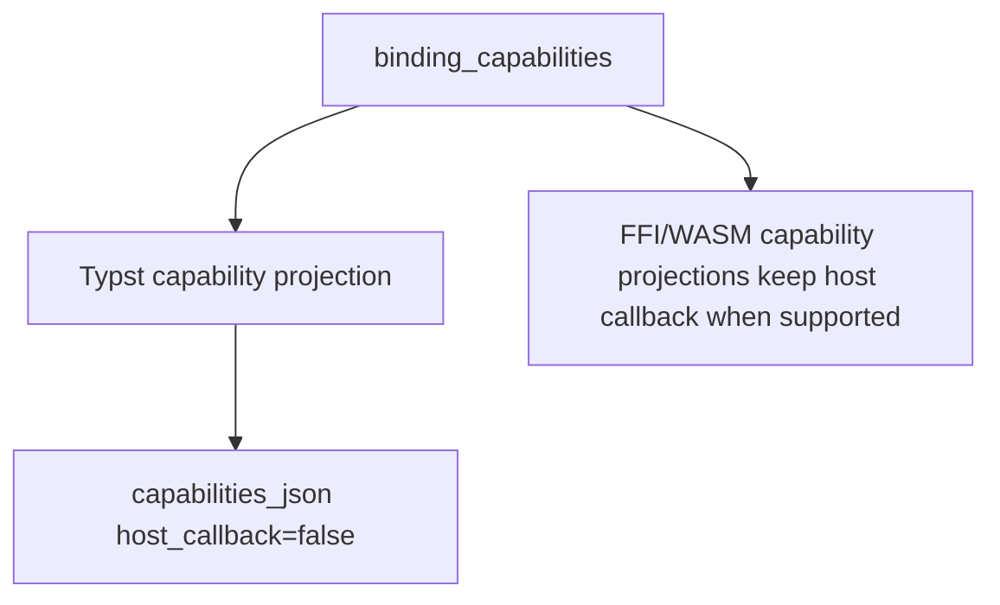
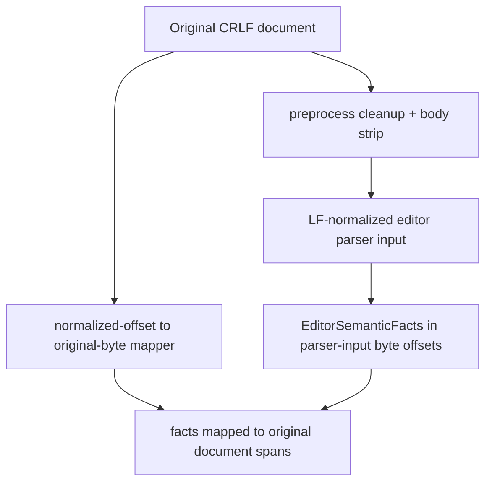
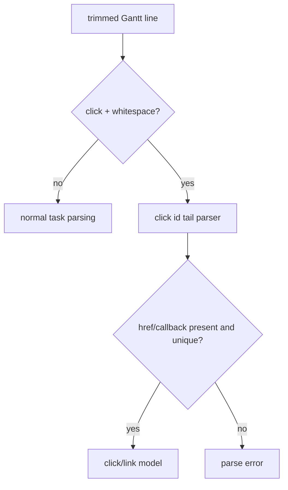

# PR20 CI And Review Fixes - Plan

## Goal Capsule

- **Objective:** Make PR #20 mergeable by fixing the current CI failure and the confirmed review findings that affect Mermaid parser parity, editor source mapping, Flutter FFI callback safety, and release confidence.
- **Authority:** Maintainer direction allows fearless refactoring, breaking unreleased APIs, and deleting misleading compatibility code. Repo safety rules still apply: do not discard unrelated work, stage only this plan's changes, use `cargo fmt`, and prefer `nextest` for Rust tests.
- **Execution profile:** Focused cross-surface hardening. Behavior-bearing fixes should start from failing or strengthened regression tests when practical.
- **Stop conditions:** Stop only if a fix would remove a documented public package surface, contradict pinned Mermaid behavior in `repo-ref/mermaid`, or expand into a full PR #20 redesign beyond the issues named here.
- **Tail ownership:** The finished branch should have focused commits, passing local gates for touched packages, and an honest record of any release gates that cannot run locally.

---

## Product Contract

### Summary

This plan targets the concrete PR #20 defects visible after review: Typst capability JSON currently breaks CI, Gantt click parsing misclassifies valid task text, editor facts lose source mapping on CRLF plus preprocessing, and Flutter host text measurement can let user exceptions escape a native callback boundary.
The scope also carries final focused verification for the already-reviewed release/Web/VS Code surfaces without reopening unrelated PR #20 architecture work.

### Problem Frame

The defects share one pattern: a shared capability or parser contract was projected through a narrower consumer boundary without preserving that boundary's exact semantics.
Typst reuses binding capabilities even though Typst cannot provide a host text-measure callback.
Gantt reuses a broad string prefix where Mermaid requires a keyword token.
Editor facts treat preprocessing as a single offset even though CRLF normalization changes byte positions throughout the body.
Flutter exposes a user callback through FFI without converting Dart exceptions into a native-safe fallback result.

### Requirements

**CI And Binding Boundaries**

- R1. Typst plugin capability JSON must report the Typst package boundary, including `host_callback=false`, while preserving shared render and deterministic measurement flags.
- R2. Binding capability tests should distinguish shared binding capabilities from consumer-specific capabilities so future surfaces do not drift silently.

**Mermaid Parser Parity**

- R3. Gantt `click` statements must be recognized only when `click` is followed by a Mermaid keyword boundary.
- R4. Legal Gantt task names starting with `click`, such as `Clickable task` and `clickhouse migration`, must parse as tasks rather than click directives.
- R5. Gantt click parsing must reject malformed click statements that Mermaid would not silently accept, including a bare `click id` and repeated href/call clauses.

**Editor Source Mapping**

- R6. Editor facts parsed from preprocessed diagram bodies must map spans back to original CRLF documents after frontmatter or init directives are stripped.
- R7. Source remapping must cover symbols, diagnostics, and expected syntax without falling back to parsing the unprocessed original document when a normalized body can be mapped.

**FFI Callback Safety**

- R8. Flutter host text measurement callbacks must never let user exceptions cross the Dart FFI callback boundary.
- R9. Callback failures should degrade to the same native fallback path as an unhandled text measurement request, with tests or a deliberate platform limitation recorded.

**Merge Confidence**

- R10. Focused tests for these fixes must pass locally, and broader PR #20 gates should be run or explicitly recorded as unavailable.

### Acceptance Examples

- AE1. The failing `merman-typst-plugin` test observes `text_measurement.host_callback == false` with render enabled.
- AE2. A Gantt diagram containing `Clickable task : 2026-01-01, 1d` or `clickhouse migration : 2026-01-01, 1d` does not enter the click parser.
- AE3. `click id1` and duplicate `href` or `call` click clauses produce a parse error instead of a no-op or overwrite.
- AE4. A CRLF sequence diagram with frontmatter maps the `Alice` participant span to the original document bytes.
- AE5. A CRLF sequence diagram with an init directive maps a later `Bob` reference span to the original document bytes.
- AE6. A Flutter measurer that throws is caught inside `_measureText` and returns an unhandled native result.

### Scope Boundaries

In scope:

- Current CI failure in `crates/merman-typst-plugin`.
- Confirmed P1/P2 findings from the PR #20 review pass.
- Local refactors required to make those fixes structurally correct.
- Focused tests and docs only when they prevent recurrence of these exact issues.

Deferred to follow-up work:

- Full editor source-map redesign for every Markdown or browser consumer.
- Full VS Code extension-host smoke if local VS Code tooling is not available.
- Full Web release matrix, VSIX matrix, or external registry validation.
- Broad cleanup from earlier PR20 plans that is not needed for the current failures.

Outside this plan:

- Pixel-perfect Mermaid rendering parity.
- New diagram families, formatter work, or UI polish.
- Replacing Mermaid's grammar with Merman-specific behavior.

---

## Planning Contract

### Assumptions

- The checkout is PR #20 branch `feat/editor-core-language-intelligence`.
- `docs/plans/2026-07-03-001-pr20-merge-hardening-plan.md` and `docs/plans/2026-07-03-002-refactor-pr20-review-fixes-plan.md` are related background artifacts, but this plan is the execution target for the current CI failure and confirmed review findings.
- `repo-ref/mermaid` is available locally and remains the grammar source of truth.
- Flutter unit tooling may not be installed locally; if so, Rust and static Dart verification become the local proof for U4, with callback behavior covered by code review until Flutter CI runs.

### Key Technical Decisions

- KTD1. Fix Typst at the consumer boundary rather than weakening shared binding metadata. FFI and WASM can support host callbacks; Typst cannot, so Typst should project a narrower capability payload.
- KTD2. Model Gantt `click` as a keyword token, not a raw prefix. This matches Mermaid's lexer and prevents valid task text from being treated as interactivity syntax.
- KTD3. Replace single-offset editor remapping with a mapper that can translate normalized LF body offsets to original CRLF byte offsets. A single offset is only correct when preprocessing preserves body bytes exactly.
- KTD4. Treat FFI callbacks as failure boundaries. User code exceptions should become `handled=0` fallback results unless the wrapper can report a controlled Dart-side error after native work returns.
- KTD5. Keep verification focused. The plan should make the current PR merge safer without re-executing every broader PR20 plan unless a touched surface requires it.

### Priority Analysis

| Priority | Work | Rationale |
|---|---|---|
| P0 | U1 Typst capability boundary | This is the known CI red failure. |
| P1 | U2 Gantt click parser parity | This can break ordinary valid Gantt tasks and should block merge. |
| P2 | U3 CRLF editor source map, U4 Flutter callback safety | These are cross-platform correctness and stability issues with clear fixes. |
| P3 | U5 final verification | This records what is green locally and what remains CI-owned. |

### High-Level Technical Design

### Risks And Mitigations

| Risk | Mitigation |
|---|---|
| Typst capability projection hides real render capability while overriding host callback. | Preserve shared render/vendored/deterministic fields and override only Typst-inapplicable callback/font-asset fields. |
| CRLF mapping becomes a broad source-map rewrite. | Implement the smallest mapper needed for normalized preprocessing output and original byte spans; keep API internal to `parse_pipeline.rs` unless tests force reuse. |
| Gantt duplicate-clause rejection rejects an upstream-accepted form. | Compare against pinned `gantt.jison` alternatives and add positive tests for already-supported callback/href combinations. |
| Flutter callback errors become unobservable. | Prefer fallback safety first; if existing wrapper state can carry a last callback error cleanly, expose it as a controlled Dart-side error in the same unit. |
| Final gates are too expensive for one local run. | Run targeted package gates first and record any broader unavailable gate with exact reason. |

### Sources And Research

- Current CI failure: `tests::capabilities_json_reports_text_measurement_boundary` in `crates/merman-typst-plugin/src/lib.rs`.
- Confirmed PR review findings from the local review pass in this session.
- Gantt grammar source: `repo-ref/mermaid/packages/mermaid/src/diagrams/gantt/parser/gantt.jison`.
- Existing related plans: `docs/plans/2026-07-03-001-pr20-merge-hardening-plan.md`, `docs/plans/2026-07-03-002-refactor-pr20-review-fixes-plan.md`.

---

## Implementation Units

### U1. Project Typst Capability Metadata Correctly

- **Goal:** Make Typst `capabilities_json()` describe Typst's actual text-measurement boundary and restore the failing CI test.
- **Requirements:** R1, R2, AE1
- **Dependencies:** None
- **Files:** `crates/merman-typst-plugin/src/lib.rs`, `crates/merman-typst-plugin/Cargo.toml`, `crates/merman-bindings-core/src/metadata.rs`
- **Approach:** Keep shared binding capabilities as the common source, but introduce a Typst-local projection before JSON serialization that forces unsupported Typst text-measurement fields to false. Avoid changing shared `host_callback` semantics for FFI/WASM consumers.
- **Execution note:** Start with the current failing test as red evidence, then make the minimal boundary projection green.
- **Patterns to follow:** Existing `binding_capabilities_json()` and shared metadata tests in `crates/merman-bindings-core/src/metadata.rs`.
- **Test scenarios:** Typst render-enabled build reports `render=true`, `vendored=true`, `deterministic=true`, and `host_callback=false`; no-render Typst build still reports render and measurement flags false; shared binding-core tests continue to report `host_callback == cfg!(feature = "render")`.
- **Verification:** `cargo nextest run -p merman-typst-plugin --no-fail-fast`; `cargo nextest run -p merman-bindings-core --no-fail-fast` if shared metadata code changes.

### U2. Harden Gantt Click Keyword And Tail Semantics

- **Goal:** Align Gantt click parsing with Mermaid keyword boundaries and reject malformed click tails.
- **Requirements:** R3, R4, R5, AE2, AE3
- **Dependencies:** None
- **Files:** `crates/merman-core/src/diagrams/gantt/parse.rs`, `crates/merman-core/src/diagrams/gantt/tests.rs`
- **Approach:** Require a whitespace boundary after the initial `click` keyword before entering click parsing. Reject a click statement that ends without href or callback data, and reject repeated href/call clauses rather than overwriting prior parsed values. Preserve existing positive coverage for bare callbacks, callback args, href-first, callback-first, and href-only statements.
- **Execution note:** Add failing negative tests for `Clickable task`, `clickhouse migration`, bare click, duplicate href, and duplicate call before changing parser logic.
- **Patterns to follow:** Current `starts_with_click_keyword()` helper and existing Gantt click model tests.
- **Test scenarios:** `Clickable task : 2026-01-01, 1d` parses as a task; `clickhouse migration : 2026-01-01, 1d` parses as a task; `click id1` errors; duplicate `href` errors; duplicate `call` errors; existing `href "url" callback`, `callback href "url"`, and href-only forms stay green.
- **Verification:** `cargo nextest run -p merman-core gantt --no-fail-fast`.

### U3. Map CRLF Preprocessed Editor Facts Back To Original Source

- **Goal:** Preserve editor semantic spans when preprocessing normalizes CRLF and strips frontmatter or init directives.
- **Requirements:** R6, R7, AE4, AE5
- **Dependencies:** None
- **Files:** `crates/merman-core/src/parse_pipeline.rs`, `crates/merman-core/src/tests/sequence.rs`
- **Approach:** Replace the `EditorParseSourceMap` single-offset remap with an internal mapper that can find the preprocessed LF body within a normalized view of the original source and translate parser-input byte offsets back to original byte offsets. Keep the existing simple offset path for unchanged or byte-identical bodies.
- **Execution note:** Add CRLF frontmatter and CRLF init directive tests first and confirm the current mapper fails or falls back incorrectly.
- **Patterns to follow:** Existing LF-only frontmatter/init span tests in `crates/merman-core/src/tests/sequence.rs`.
- **Test scenarios:** CRLF frontmatter maps `Alice` to the original CRLF byte range; CRLF init directive maps a later `Bob` reference to the original byte range; diagnostics and expected syntax spans are remapped through the same mapper; LF-only tests remain unchanged.
- **Verification:** `cargo nextest run -p merman-core sequence --no-fail-fast`.

### U4. Contain Flutter Host Text Measurement Exceptions

- **Goal:** Keep Dart user exceptions from escaping the native FFI callback path.
- **Requirements:** R8, R9, AE6
- **Dependencies:** None
- **Files:** `platforms/flutter/lib/src/merman_ffi.dart`, `platforms/flutter/test/**/*`
- **Approach:** Wrap the `MermanTextMeasurer` invocation inside `_measureText` and return the default unhandled native result on exception. Add a focused test if the Flutter package has a local test harness; otherwise keep the change minimal and record static verification plus CI-owned Flutter validation.
- **Execution note:** Prefer a unit test around a throwing measurer if Flutter tooling is available; otherwise do not invent a brittle local harness.
- **Patterns to follow:** Existing invalid-result fallback in `_measureText` and native callback docs in `crates/merman-ffi/include/merman.h`.
- **Test scenarios:** throwing measurer returns `handled=0`; null measurer returns `handled=0`; invalid numeric result returns `handled=0`; valid finite result still sets handled, width, height, and line count.
- **Verification:** Flutter unit tests if present and runnable; otherwise Dart format/analyze if tooling exists plus focused code review.

### U5. Run Focused Merge Verification

- **Goal:** Prove the fixes locally and identify any remaining CI-owned gates.
- **Requirements:** R10
- **Dependencies:** U1, U2, U3, U4
- **Files:** `docs/plans/2026-07-03-003-refactor-pr20-ci-review-fixes-plan.md`, touched Rust and Dart files
- **Approach:** Run the focused package tests after each behavior slice, then run formatting and the smallest broader gates that exercise changed shared contracts. Do not hide unrelated failures as fixes.
- **Execution note:** Use this unit as the final integration checkpoint and cleanup pass.
- **Patterns to follow:** Repo convention: Rust tests through `cargo nextest` where practical and formatting through `cargo fmt`.
- **Test scenarios:** Typst plugin targeted test passes; Gantt parser targeted tests pass; sequence CRLF editor facts pass; Flutter callback change is verified by local tooling or recorded as CI-owned; final git diff contains no abandoned experimental code.
- **Verification:** `cargo fmt --check`; `cargo nextest run -p merman-typst-plugin -p merman-core --no-fail-fast`; broader PR20 gates as time/tooling allows.

---

## Verification Contract

### Required Gates

| Gate | Covers |
|---|---|
| `cargo nextest run -p merman-typst-plugin --no-fail-fast` | Typst capability boundary and the current CI failure. |
| `cargo nextest run -p merman-core gantt --no-fail-fast` | Gantt keyword boundary and malformed click tails. |
| `cargo nextest run -p merman-core sequence --no-fail-fast` | CRLF editor fact remapping. |
| `cargo fmt --check` | Rust formatting for touched crates. |

### Conditional Gates

- Run `cargo nextest run -p merman-bindings-core --no-fail-fast` if shared metadata code changes.
- Run `dart test` or equivalent under `platforms/flutter` if Flutter tooling and tests are present.
- Run broader PR20 gates from `docs/plans/2026-07-03-002-refactor-pr20-review-fixes-plan.md` only when touched files overlap those surfaces or the focused gates reveal shared-contract risk.

### Evidence To Capture

- Red/green evidence for `tests::capabilities_json_reports_text_measurement_boundary`.
- Red/green evidence for Gantt `click` prefix and duplicate-tail regression tests.
- Red/green evidence for CRLF frontmatter/init source remap tests.
- Flutter callback verification result or a precise local-tooling-unavailable note.

---

## Definition of Done

- Typst plugin capability JSON passes its targeted test and accurately reports no host callback support.
- Gantt task text beginning with `click` but not followed by whitespace is no longer parsed as a click directive.
- Gantt malformed click statements no longer silently no-op or overwrite repeated href/call data.
- Editor semantic facts from CRLF documents with frontmatter or init directives map to original byte ranges.
- Flutter host text measurement exceptions are contained at the callback boundary.
- Required focused gates pass locally, or any unavailable conditional gate is recorded with exact reason.
- The final diff contains only plan-scoped code, tests, and documentation.
