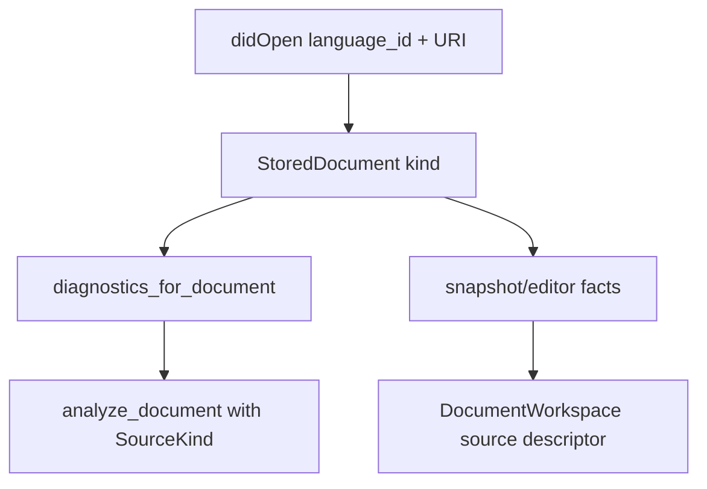
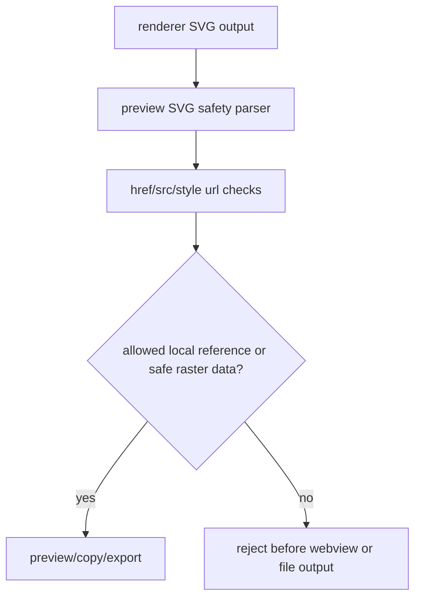
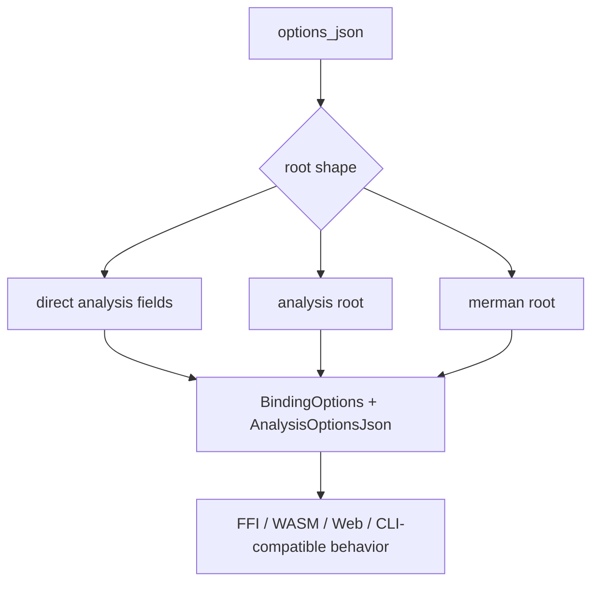

# PR20 Post Review Hardening - Plan

## Goal Capsule

- **Objective:** Resolve the full post-review hardening set for PR #20 across LSP diagnostics, VS Code preview/export safety, binding options contracts, Web TypeScript declarations, public API boundaries, and maintainability cleanup.
- **Authority:** Maintainer direction allows fearless refactoring, breaking unreleased APIs, deleting misleading compatibility code, and committing logical slices. Repo safety rules still apply: never discard unrelated work, stage only this plan's changes, prefer `nextest` for Rust tests, and use `cargo fmt`.
- **Execution profile:** Deep cross-surface hardening on an unreleased PR branch. Behavior-bearing units should start from failing or strengthened regression tests when practical; pure docs/config cleanup can use smoke or contract verification.
- **Stop conditions:** Stop only if implementation would contradict pinned Mermaid semantics, require dropping a documented public package surface without replacement, or expand into unrelated PR #20 product work such as formatter support, marketplace launch assets, or broad Mermaid visual parity.
- **Tail ownership:** The finished branch should have focused commits, deterministic regression tests for each corrected contract, and an honest verification record for any gate that cannot run locally.

---

## Product Contract

### Summary

This plan hardens PR #20 by turning review findings into durable contracts: LSP document kind must drive diagnostics, VS Code SVG output must be allowlisted before preview/export, binding options must parse the same root shapes across surfaces, Web `.d.ts` options must match runtime support, and publishable crates must avoid accidental semver exposure.

The work also uses the maintainer's fearless-refactor posture to remove misleading watcher/docs behavior and split the largest new analysis module when that makes the implementation easier to test and maintain.

### Problem Frame

The review findings share a boundary-drift pattern.
PR #20 added language intelligence across Rust, LSP, VS Code, WASM/Web, and bindings, but some surfaces re-inferred state that was already known elsewhere.
That drift shows up as Markdown diagnostics ignoring `language_id`, sanitizer tests covering only a denylist, binding JSON accepting fewer roots than analysis/LSP, TypeScript declarations lagging Rust runtime options, and LSP crate internals becoming public by accident.

The correct fix is not a docs-only pass.
The branch is still unreleased, so the safer long-term move is to tighten source-of-truth helpers, delete or demote accidental surfaces, add regression tests at the failing boundaries, and then simplify the new analysis/editor structure enough that future review does not need to parse a monolith.

### Requirements

**LSP and editor correctness**

- R1. Diagnostics must use the stored `DocumentKind` for Markdown, MDX, and diagram documents instead of re-inferring kind from URI suffix.
- R2. Untitled or extensionless Markdown/MDX documents opened by language ID must produce fence-scoped diagnostics and remapped ranges.
- R3. Pull diagnostics must not surface `InternalError` for normal rapid-edit races; stale recomputation should retry against the latest context within a bounded loop or return a content-changed/cancellation-shaped retry signal.
- R4. The supported legacy `flowchart` diagram id must receive the same parser-backed editor facts as `flowchart-v2` and `flowchart-elk` when the parser supports it.
- R5. Editor facts and flowchart facts allowlists must not diverge for equivalent Flowchart family ids.

**VS Code safety and runtime behavior**

- R6. VS Code preview/export SVG safety must use URL allowlisting for SVG `href`, `src`, and CSS `url(...)` references.
- R7. Unsafe or host-local schemes such as `file:`, `command:`, `vscode:`, unknown schemes, and `data:image/svg+xml` must be rejected before webview preview, SVG copy, or SVG export.
- R8. The extension README must describe the actual binary resolver: packaged binaries, explicit paths, and explicitly enabled Cargo development fallback. It must not promise automatic `target/debug` fallback.
- R9. The extension should not register broad workspace file watchers until the LSP consumes watched-file events.
- R10. Export and copy commands must have command-level workflow tests for active document, source-action target, save cancellation, missing source, sanitizer failures, and PNG clipboard fallback.

**Binding and Web public contracts**

- R11. Binding `options_json` must accept the same direct, `analysis`, and `merman` analysis roots that analysis/LSP advertise, while preserving binding-specific top-level options.
- R12. Unknown fields should remain ignored, but known wrapped analysis fields must not be silently dropped.
- R13. `@mermanjs/web` TypeScript option declarations must include runtime-supported class resource limits and ASCII relation-summary diagnostics in both snake_case and camelCase where the runtime supports aliases.
- R14. Binding options docs and Web contract checks must catch future drift between Rust option JSON, binding runtime parsing, and TypeScript declarations.

**Public API and maintainability**

- R15. `merman-lsp` must expose only intentional public API from its publishable crate root; implementation modules should become private unless downstream public use is deliberate.
- R16. Internal re-exports needed by tests, binaries, or known consumers must be curated rather than broad `pub mod` exposure.
- R17. The new analysis editor implementation should be split into focused private modules when doing so reduces real complexity and test navigation cost.
- R18. Snapshot build paths should avoid avoidable whole-document cloning when the change can be made without obscuring the current stale-generation logic.

### Acceptance Examples

- AE1. An `untitled:` document opened with `language_id = "markdown"` and a Mermaid fence produces diagnostics for the fence body rather than parsing the whole Markdown document as a diagram.
- AE2. A `.mdx` document without a useful file extension but opened as MDX produces MDX-style document analysis.
- AE3. `assertSafePreviewSvg('<svg><image href="file:///etc/passwd"/></svg>')` rejects the SVG, as do `command:`, `vscode:`, unknown schemes, `data:image/svg+xml`, and CSS `url(...)` equivalents.
- AE4. A safe local fragment such as `<a href="#node">` still passes SVG safety.
- AE5. Passing binding options as `{ "analysis": { "lint": { ... } } }` or `{ "merman": { "resources": { ... } } }` affects analysis the same way as direct top-level options.
- AE6. TypeScript accepts `resources.max_class_nodes`, `resources.max_class_edges`, `resources.max_class_namespaces`, `ascii.relation_summary_diagnostics`, and `ascii.relationSummaryDiagnostics`.
- AE7. A pull-diagnostic request racing with a newer document version does not return JSON-RPC internal error for normal typing.
- AE8. `parse_editor_semantic_facts_with_type_sync("flowchart", ...)` returns parser-backed flowchart facts for supported flowchart syntax.
- AE9. External users of `merman-lsp` can still construct/start `MermanLanguageServer`, but cannot import internal handler/store modules as public semver surface.
- AE10. README extension-development steps succeed by either preparing packaged binaries or enabling Cargo fallback; they no longer imply `target/debug` is discovered automatically.

### Scope Boundaries

In scope:

- LSP diagnostics source-kind correctness and stale pull-diagnostic retry behavior.
- VS Code SVG safety allowlist and command-level export/copy coverage.
- VS Code binary resolver documentation and unused watcher removal.
- Binding options root extraction, Web TypeScript declaration drift, and options docs/contracts.
- `merman-lsp` crate-root API tightening.
- Focused analysis editor module split and snapshot allocation cleanup when directly supporting the fixes.

#### Deferred to Follow-Up Work

- Full VS Code extension-host UI automation if local VS Code tooling is unavailable.
- Full Mermaid parity expansion beyond the reviewed `flowchart` editor facts gap.
- Major source-map redesign outside diagnostics/editor facts affected here.
- Whole-workspace clippy cleanup and unrelated monolith splitting outside touched analysis/editor code.
- Marketplace publishing, screenshots, launch copy, or UX polish.

Outside this product identity:

- Pixel-perfect Mermaid rendering changes.
- Adding a formatter or new diagram families.
- Replacing Mermaid syntax with Merman-only behavior.

---

## Planning Contract

### Assumptions

- The checkout is PR #20 branch `feat/editor-core-language-intelligence` at the reviewed head.
- Existing PR20 plans remain background artifacts; this plan is the execution target for the latest post-review findings.
- The relevant surfaces are unreleased enough that breaking internal Rust/TypeScript APIs is acceptable when it removes accidental contracts.
- No external research is load-bearing: all findings come from this repository, PR #20 review, pinned Mermaid strategy, and local package contracts.

### Key Technical Decisions

- KTD1. Use stored document kind as the source of truth for LSP document analysis. The LSP already records `DocumentKind` at `didOpen`; diagnostics should not discard that knowledge and re-infer from URI.
- KTD2. SVG safety uses allowlists, not denylist patches. New URL schemes appear over time, so preview/export safety should reject unknown schemes by default.
- KTD3. Bindings should reuse analysis root extraction instead of copying root semantics. This keeps LSP, CLI, WASM, and FFI option JSON behavior aligned.
- KTD4. TypeScript types are part of the public Web contract. Runtime-supported options are incomplete if TS users must bypass the declared API.
- KTD5. Publishable crate roots are semver surfaces. Internal LSP modules should be private until the project deliberately supports them as an API.
- KTD6. Performance cleanup must preserve current-generation checks. Reducing clones is welcome only when stale snapshot and diagnostic correctness remain easy to audit.

### Priority Analysis

| Priority | Work | Rationale |
|---|---|---|
| P0 | U1, U2 | These are user-visible correctness and security/trust boundary issues. |
| P1 | U3, U4, U5 | These repair public cross-surface contracts before release. |
| P2 | U6, U7 | These prevent accidental semver commitments and remove misleading extension behavior. |
| P3 | U8, U9 | These improve maintainability/performance and lock verification around the full hardening pass. |

### High-Level Technical Design

### Risks and Mitigations

| Risk | Mitigation |
|---|---|
| Tightening SVG allowlists breaks legitimate Mermaid image use. | Preserve `#fragment` and explicitly safe raster data URLs; add positive tests for inert local references. |
| Binding root extraction accidentally hides binding-specific options. | Parse binding-specific top-level fields separately from extracted analysis fields and test mixed payloads. |
| `merman-lsp` module privacy breaks internal tests or binaries. | Re-export only intentional public types and update internal tests to use crate-private paths where possible. |
| Snapshot allocation refactor obscures stale-generation behavior. | Keep generation/epoch checks at the store boundary and add focused tests around stale insertion. |
| Analysis editor module split becomes churn without benefit. | Split only cohesive groups needed for current fixes: types/indexing/projection/scanning/tests. |

### Sources and Research

- Post-review findings from the multi-review pass in this session.
- Existing related plans: `docs/plans/2026-07-03-001-pr20-merge-hardening-plan.md`, `docs/plans/2026-07-03-002-refactor-pr20-review-fixes-plan.md`, `docs/plans/2026-07-03-003-refactor-pr20-ci-review-fixes-plan.md`.
- Project instructions: `AGENTS.md`.
- Local patterns: `crates/merman-editor-core/src/workspace.rs` already maps `DocumentKind` to `SourceKind`; `tools/vscode-extension/src/test/preview-svg-safety.test.ts` already covers active elements and external URL denial; `crates/merman-analysis/src/options_json.rs` already accepts direct, `analysis`, and `merman` roots for analysis settings.

---

## Implementation Units

### U1. Align LSP Diagnostics With Stored Document Kind

- **Goal:** Make diagnostics use the same document-kind source descriptor as editor snapshots.
- **Requirements:** R1, R2, AE1, AE2
- **Dependencies:** None
- **Files:** `crates/merman-lsp/src/server.rs`, `crates/merman-lsp/tests/server_smoke.rs`, `crates/merman-lsp/tests/diagnostics.rs`
- **Approach:** Introduce or reuse a small helper that maps `merman_editor_core::DocumentKind` to `merman_analysis::SourceKind` with the current URI as path. Replace URI-extension inference in diagnostics with that helper.
- **Execution note:** Start with a failing LSP test for `untitled:` Markdown diagnostics before changing production code.
- **Patterns to follow:** `crates/merman-editor-core/src/workspace.rs` source descriptor mapping; existing `did_open_uses_language_id_and_change_preserves_document_kind` LSP test.
- **Test scenarios:**
  - Open `untitled:notes` as `markdown` with one Mermaid fence containing invalid Mermaid; requesting diagnostics returns the diagnostic remapped to the fence body.
  - Open an extensionless URI as `mdx` with a Mermaid fence; diagnostics treat it as MDX/Markdown-family input rather than a whole diagram.
  - Open a `.mmd` diagram; diagnostics still use diagram source kind and unchanged ranges.
- **Verification:** Focused LSP diagnostics tests pass and no caller in `server.rs` re-infers Markdown status from URI after `didOpen`.

### U2. Harden VS Code SVG Safety to an Allowlist

- **Goal:** Reject unsafe local, extension, and unknown SVG URL schemes before preview, copy, or export.
- **Requirements:** R6, R7, AE3, AE4
- **Dependencies:** None
- **Files:** `tools/vscode-extension/src/preview-svg-safety.ts`, `tools/vscode-extension/src/test/preview-svg-safety.test.ts`, `tools/vscode-extension/src/export.ts`, `tools/vscode-extension/src/preview-instance.ts`
- **Approach:** Replace URL scheme denylist logic with a parser/normalizer that allows only local fragment references and explicitly safe raster `data:image/*` forms. Apply the same check to attributes and CSS `url(...)` values.
- **Execution note:** Add rejecting tests first for every newly denied scheme and keep the existing inert-SVG positive cases green.
- **Patterns to follow:** Existing `assertSafePreviewSvg` tests for active elements, event handlers, external resources, and CSS URL decoding.
- **Test scenarios:**
  - Reject `file:`, `command:`, `vscode:`, `data:image/svg+xml`, and a made-up scheme in `href` and `src`.
  - Reject the same schemes inside inline `style="fill:url(...)"` and `<style>` blocks.
  - Accept `href="#node"` and safe internal marker references.
  - Accept a deliberately safe raster image data URL only if the implementation chooses to support raster data.
  - Confirm sanitizer failures prevent SVG copy/export from writing unsafe output.
- **Verification:** VS Code extension unit tests for preview safety pass and no preview/export path accepts unchecked renderer SVG.

### U3. Unify Binding Options Root Extraction and Web Option Types

- **Goal:** Make binding JSON, Web TypeScript declarations, docs, and runtime options expose the same supported analysis/resource/ascii contract.
- **Requirements:** R11, R12, R13, R14, AE5, AE6
- **Dependencies:** None
- **Files:** `crates/merman-analysis/src/options_json.rs`, `crates/merman-bindings-core/src/common.rs`, `crates/merman-bindings-core/src/ascii.rs`, `crates/merman-bindings-core/src/render/request.rs`, `crates/merman-bindings-core/src/render.rs`, `platforms/web/src/index.ts`, `platforms/web/scripts/check-contracts.mjs`, `docs/bindings/OPTIONS_JSON.md`
- **Approach:** Expose a small analysis-options extraction helper that bindings can call without losing binding-specific top-level options. Add TS declaration fields for class resource limits and relation-summary diagnostics. Extend contract checks or tests so Rust and TS cannot drift silently.
- **Execution note:** Characterize current direct-root behavior first, then add failing wrapped-root tests before changing parsing.
- **Patterns to follow:** `analysis_options_from_json_value` root handling; existing `render_ascii_accepts_relation_summary_diagnostics_option`; existing Web prepack/contract scripts.
- **Test scenarios:**
  - Direct top-level `lint` and `resources` still affect `analyze_json` and rendering.
  - Wrapped `{ "analysis": { "lint": ... } }` and `{ "merman": { "resources": ... } }` affect the same outputs as direct options.
  - A payload mixing binding-specific `ascii` or `svg` options with wrapped analysis options preserves both sets.
  - Unknown fields remain ignored.
  - TypeScript compilation or contract script accepts the new `ResourceOptions` and `AsciiRenderOptions` fields.
- **Verification:** Binding-core focused tests and Web contract/type checks pass; `docs/bindings/OPTIONS_JSON.md` lists every public resource/ascii field implemented by Rust and declared by TS.

### U4. Make Pull Diagnostics Robust Under Rapid Edits

- **Goal:** Replace one-shot stale recomputation with a bounded latest-context retry that avoids normal `InternalError` responses.
- **Requirements:** R3, AE7
- **Dependencies:** U1
- **Files:** `crates/merman-lsp/src/server.rs`, `crates/merman-lsp/tests/server_smoke.rs`, `crates/merman-lsp/tests/diagnostics.rs`
- **Approach:** Rework `diagnostics_or_recompute_once` into a small bounded loop that refreshes context after stale analysis. If the document changes beyond the retry limit, return a more accurate retry/cancel/content-changed error instead of generic internal error.
- **Execution note:** Add a focused race/stale-context regression before refactoring the loop.
- **Patterns to follow:** Existing diagnostic generation/epoch checks in `DocumentStore`; stale snapshot insertion checks in `document_store.rs`.
- **Test scenarios:**
  - A diagnostic request using a stale context retries against the latest context and returns latest diagnostics.
  - A closed document still returns an empty diagnostic report.
  - An intentionally unrecoverable repeated-stale case returns a non-internal retry-shaped error or documented cancellation error.
  - Push diagnostics behavior remains unchanged for clients without pull diagnostics.
- **Verification:** LSP diagnostic tests pass and no normal rapid-edit path routes through `tower_lsp::jsonrpc::Error::internal_error()`.

### U5. Restore Parser-Backed Legacy Flowchart Editor Facts

- **Goal:** Ensure supported `flowchart` inputs get parser-backed editor facts rather than text-scan fallback.
- **Requirements:** R4, R5, AE8
- **Dependencies:** None
- **Files:** `crates/merman-core/src/parse_pipeline.rs`, `crates/merman-analysis/src/result.rs`, `crates/merman-core/src/tests/flowchart.rs`, `crates/merman-editor-core/tests/semantic_facts.rs`, `crates/merman-analysis/tests/analyzer.rs`
- **Approach:** Add `flowchart` to editor semantic facts dispatch and align analysis flowchart fact allowlists where the parser/model treats it as equivalent to `flowchart-v2`. Keep `flowchart-elk` behavior unchanged.
- **Execution note:** Add the failing `parse_editor_semantic_facts_with_type_sync("flowchart", ...)` regression first.
- **Patterns to follow:** Existing flowchart editor facts tests using `flowchart-v2`; family registry aliases in `crates/merman-core/src/family.rs`.
- **Test scenarios:**
  - `parse_editor_semantic_facts_with_type_sync("flowchart", "flowchart TD\nA-->B\n", strict)` returns symbols/facts for `A` and `B`.
  - Analysis facts for a legacy `flowchart` type include flowchart facts when the model is equivalent.
  - `flowchart-elk` still routes through the existing ELK-specific arm.
- **Verification:** Core, analysis, and editor-core focused tests prove parser-backed facts for the legacy id.

### U6. Tighten `merman-lsp` Public API Boundaries

- **Goal:** Prevent publishable LSP implementation modules from becoming accidental semver API.
- **Requirements:** R15, R16, AE9
- **Dependencies:** U1, U4
- **Files:** `crates/merman-lsp/src/lib.rs`, `crates/merman-lsp/src/server.rs`, `crates/merman-lsp/src/protocol.rs`, `crates/merman-lsp/tests/*.rs`, `crates/merman-lsp/README.md`
- **Approach:** Change implementation modules from `pub mod` to private `mod` where possible. Re-export only `MermanLanguageServer` and deliberate protocol constants/types required by external consumers or integration tests. Move tests to crate-internal access patterns when they were relying on accidental public modules.
- **Execution note:** Treat compiler errors as the discovery mechanism for intentional re-exports, but keep the final re-export list small and documented.
- **Patterns to follow:** `crates/merman-editor-core/src/lib.rs` private-module plus curated `pub use` pattern.
- **Test scenarios:**
  - Existing LSP integration tests compile after module privacy changes.
  - Public construction/startup of `MermanLanguageServer` still compiles.
  - Protocol custom request constants/types intended for clients remain available if documented as public.
- **Verification:** `cargo check`/focused LSP tests pass and `lib.rs` no longer exposes handler/store/snapshot internals broadly.

### U7. Fix VS Code Runtime Docs, Remove Unused Watcher, and Cover Export Commands

- **Goal:** Make extension docs and runtime wiring match actual behavior, and cover command-level export/copy workflows.
- **Requirements:** R8, R9, R10, AE10
- **Dependencies:** U2
- **Files:** `tools/vscode-extension/README.md`, `tools/vscode-extension/src/server.ts`, `tools/vscode-extension/src/export.ts`, `tools/vscode-extension/src/test/export.test.ts`, `tools/vscode-extension/src/test/binaries.test.ts`, `tools/vscode-extension/package.json`
- **Approach:** Remove or rewrite `target/debug` automatic fallback wording. Prefer instructions that either run `prepare:binaries` or enable trusted Cargo fallback. Delete `synchronize.fileEvents` until server-side watched-file handling exists. Add command-level tests using the existing fake VS Code host style.
- **Execution note:** Prefer workflow tests over internal-only tests because the risk is broken command registration and source resolution.
- **Patterns to follow:** `preview-manager.test.ts` fake host style; `binaries.test.ts` cargo fallback and trust gating tests; `source-actions.test.ts` command argument helpers.
- **Test scenarios:**
  - `merman.exportSvg` resolves an active Mermaid file and writes sanitized SVG to the selected path.
  - `merman.exportPng` resolves a Markdown fence source-action target and calls renderer with the fence source.
  - Save dialog cancellation exits without rendering.
  - Missing Mermaid source shows a warning and does not render.
  - `merman.copyPng` falls back to PNG export when no clipboard command exists or the command fails.
  - Language client options no longer register unused broad file watchers.
- **Verification:** VS Code extension unit tests pass and README quick start no longer describes a resolver path that code does not implement.

### U8. Split Analysis Editor Internals and Reduce Snapshot Copying

- **Goal:** Improve maintainability and allocation behavior in the new editor-analysis and LSP snapshot paths without changing behavior.
- **Requirements:** R17, R18
- **Dependencies:** U1, U5, U6
- **Files:** `crates/merman-analysis/src/editor.rs`, `crates/merman-analysis/src/editor/*.rs`, `crates/merman-analysis/src/lib.rs`, `crates/merman-lsp/src/document_store.rs`, `crates/merman-editor-core/src/workspace.rs`, `crates/merman-analysis/tests/*.rs`, `crates/merman-lsp/tests/document_store.rs`
- **Approach:** Split editor production code into focused private modules such as fact types, text indexing, fallback scanning, and core projection while preserving public re-exports. For snapshots, reduce avoidable `String` cloning or transient workspace cloning only where the resulting API remains clearer than the current path.
- **Execution note:** Run characterization tests before and after the split; this unit is refactor-first, not behavior-first.
- **Patterns to follow:** Existing analysis submodule organization; `merman-editor-core` module layout; generation/epoch tests in `document_store.rs`.
- **Test scenarios:**
  - Existing editor facts tests pass unchanged after module split.
  - Public `FenceTextIndexSource` and editor-facing exports remain available where documented.
  - Snapshot insertion still rejects stale generation/epoch results.
  - Workspace symbol collection and semantic token snapshot paths still reuse current snapshots after refactor.
- **Verification:** Focused analysis/editor/LSP tests pass and the largest new editor file is reduced into cohesive modules.

### U9. Run Focused Verification and Review Cleanup

- **Goal:** Prove the full hardening pass and remove dead code introduced by attempted fixes.
- **Requirements:** All requirements
- **Dependencies:** U1, U2, U3, U4, U5, U6, U7, U8
- **Files:** `Cargo.toml`, `crates/*/Cargo.toml`, `platforms/web/package.json`, `tools/vscode-extension/package.json`, touched tests and docs
- **Approach:** Run focused Rust, Web, and VS Code gates for touched surfaces; format only the touched Rust code; run a final review pass and remove abandoned helpers or transitional exports.
- **Execution note:** This is verification-first cleanup. Do not broaden into unrelated lint or formatting churn.
- **Patterns to follow:** Existing PR20 verification plans and repository preference for `cargo nextest`.
- **Test scenarios:**
  - Rust focused tests cover LSP, core, analysis, editor-core, and bindings-core changes.
  - VS Code extension unit tests cover safety/export/server option changes.
  - Web package contract/type checks cover declaration updates.
  - Final `git diff` contains no unused watcher scaffolding, accidental broad public exports, or docs claiming removed behavior.
- **Verification:** Focused gates pass locally or unavailable gates are recorded with exact reason; final code review has no unresolved actionable findings for this plan scope.

---

## Verification Contract

| Gate | Applies To | Done Signal |
|---|---|---|
| `cargo fmt` on touched Rust crates | U1, U3, U4, U5, U6, U8, U9 | Formatting diff is limited to touched Rust files. |
| `cargo nextest run -p merman-lsp` | U1, U4, U6, U8 | LSP diagnostics, server, and document-store tests pass. |
| `cargo nextest run -p merman-core -p merman-analysis -p merman-editor-core` | U5, U8 | Parser/editor facts and analysis tests pass. |
| `cargo nextest run -p merman-bindings-core` | U3 | Binding options JSON and ASCII/render tests pass. |
| VS Code extension unit tests | U2, U7 | Preview safety, binary resolver docs/tests, server options, and export command tests pass. |
| Web package contract/type checks | U3 | Type declarations and package contract scripts accept the new option fields. |
| Final review pass | U9 | No unresolved actionable review findings remain for the plan scope. |

---

## Definition of Done

- Every requirement R1-R18 is satisfied by code, tests, docs, or an explicitly recorded verification result.
- Every acceptance example AE1-AE10 has a regression test or a documented focused verification path.
- Public API tightening is intentional and documented where external consumers are expected.
- No unsafe SVG URL scheme accepted by the VS Code preview/export sanitizer.
- Binding options JSON behaves consistently across direct, `analysis`, and `merman` roots.
- The plan's implementation leaves no abandoned experimental helpers, dead watchers, misleading docs, or broad accidental exports.
- The final diff is formatted, focused, and committed in logical conventional commits.
