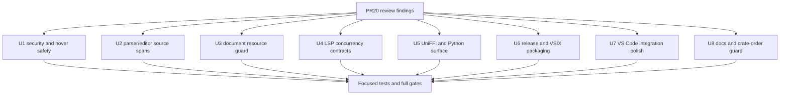

# PR20 Review Hardening - Plan

## Goal Capsule

| Field | Decision |
|---|---|
| Objective | Resolve the full PR20 review finding set across SVG safety, parser spans, document analysis limits, LSP concurrency, UniFFI/Python bindings, VSIX release metadata, VS Code polish, and release documentation. |
| Authority | The review findings are the product contract; existing Mermaid parity semantics and repo release conventions constrain implementation choices. |
| Execution profile | Deep cross-surface refactor with security-sensitive and source-edit-sensitive units first. |
| Stop conditions | Stop only for a contradiction with existing public API contracts, missing release credentials, or a test fixture that proves a finding is already obsolete. |
| Landing strategy | Commit coherent green units on the current feature branch; do not mutate `main` directly. |

---

## Product Contract

### Summary

PR20 already adds broad language-intelligence and release-surface work, but the follow-up review found correctness gaps that can corrupt source edits, weaken preview safety, or fail downstream packaging.
This plan makes those boundaries explicit and fixes them as first-class contracts rather than narrow patches.

### Requirements

**Security and user-source safety**

- R1. SVG preview, copy, and export must reject CSS escape variants of forbidden `@import` and `url(...)` constructs with the same authority as literal spellings.
- R2. Flowchart completion after `A -->|label|` must insert the target node after the edge label instead of replacing the label.
- R3. Class diagram source spans must remain tied to raw source tokens when class IDs are transformed for DOM/model identity.
- R4. Class callback payload spans must exclude whitespace after `call`.
- R5. Hover Markdown must escape or neutralize diagram-provided names and details before returning `MarkupKind::Markdown`.

**Resource limits and LSP concurrency**

- R6. `max_source_bytes` must apply at the document-entry boundary for Markdown and MDX before full-source copying and fence scanning.
- R7. Rename workspace edits must carry versioned `document_changes` instead of unversioned `changes`.
- R8. Semantic token full, delta, and range responses must not return results from stale document snapshots after a newer snapshot exists.

**Bindings and release packaging**

- R9. UniFFI host text-measurement callback errors must have an explicit observable contract and must not be silently converted into normal fallback layout without a test-proved decision.
- R10. The Python package must export every public UniFFI record used by public methods, including `MermanLintRuleCatalogEntry`.
- R11. VSIX packaging must use a Marketplace-compatible manifest version and encode prerelease state through VSIX prerelease metadata.
- R12. Release verification must reject publish order regressions where a publishable workspace crate appears before a publishable dependency.
- R13. Release documentation must describe Web package subpath surfaces and the VSIX prerelease artifact strategy.

**VS Code integration polish**

- R14. VS Code render subprocesses must hide Windows console windows consistently with clipboard subprocesses.
- R15. The CodeLens provider must refresh when `merman.sourceActions.enabled` changes at runtime.

### Acceptance Examples

- AE1. Given SVG style content containing escaped `@im\70ort`, escaped `u\72l(...)`, or escaped characters split by comments, the safety layer rejects it before preview/export use.
- AE2. Given `flowchart TD\n  A -->|label|` and target-node completion at the end, the replacement range is zero-width after the closing `|`.
- AE3. Given ``class `123` `` and a rename/code-navigation request, the selected source range covers the numeric content inside the backticks, not a DOM-prefixed identifier or the opening backtick.
- AE4. Given `call   doWork()` in a class diagram, callback selection points to `doWork`, not the whitespace before it.
- AE5. Given a Markdown source larger than `max_source_bytes` with a small Mermaid fence near the front, analysis returns the resource-limit diagnostic without copying or scanning the whole document.
- AE6. Given a document update racing with semantic-token work, the server either recomputes against the current snapshot or returns an LSP content-modified error instead of stale tokens.
- AE7. Given a Python import of `merman`, `hasattr(merman, "MermanLintRuleCatalogEntry")` is true.
- AE8. Given VSIX prerelease packaging input, the package manifest version is numeric SemVer-compatible and the VSIX carries prerelease metadata.
- AE9. Given hover text containing `[link](https://example.invalid)`, ``, backticks, or newlines, the hover displays inert text rather than Markdown controls.
- AE10. Given `merman.sourceActions.enabled` flips while a Mermaid document is open, CodeLens rows refresh without reloading the extension host.

### Scope Boundaries

- Do not change Mermaid parser semantics except where source spans or incomplete-edit state are incorrect.
- Do not broaden SVG CSS support beyond the current safe subset; stricter rejection is acceptable for ambiguous escaped `url` or `@import`.
- Do not publish, retag, or mutate remote `main` as part of this plan.
- Do not create compatibility shims that preserve known-broken behavior when public API breakage is the cleaner fix.

---

## Planning Contract

### Key Technical Decisions

- KTD1. Normalize forbidden CSS identifiers before policy checks. Literal substring checks are not a security boundary when CSS accepts escapes and comments inside identifiers.
- KTD2. Source-edit spans are owned by lexer/parser source coordinates, not by normalized model IDs. Any transformed identifier must carry or recover its raw-token selection range.
- KTD3. Resource limits belong at the ingestion boundary. A byte limit that fires only after Markdown extraction has already allocated the full source misses the stated contract.
- KTD4. LSP snapshot version is the concurrency boundary. Rename edits, semantic-token cache writes, and semantic-token responses must prove they still describe the captured snapshot.
- KTD5. Host callback failures are either public errors or intentionally documented fallback. Silent error swallowing makes bindings impossible to debug.
- KTD6. Release metadata separates workspace/package version intent from Marketplace manifest constraints. VSIX prerelease state is artifact metadata, not a prerelease manifest version.

### High-Level Technical Design

### Sequencing

Start with U1 and U2 because they cover security and source-corrupting edit ranges.
Then implement U3 and U4 because they define cross-request resource and concurrency contracts.
U5 and U6 follow because they touch release-facing public surfaces.
Finish with U7 and U8, then run full verification and simplify any duplicated helper code that emerged.

### System-Wide Impact

- Preview/export safety depends on one SVG sanitizer; strengthening it protects VS Code preview, copy, and export together.
- Parser span fixes flow into editor-core completion, rename, hover, and any LSP feature that consumes semantic facts.
- LSP versioning changes can alter client-visible error behavior under races, so smoke tests must cover full, delta, range, and rename paths.
- Release metadata changes affect CI workflows, package verification scripts, and contributor release docs.

---

## Implementation Units

### U1. Harden SVG CSS and Hover Markdown Boundaries

- **Goal:** Close escaping-based CSS bypasses and Markdown hover injection/spoofing paths.
- **Requirements:** R1, R5, AE1, AE9
- **Files:** `tools/vscode-extension/src/preview-svg-safety.ts`, `tools/vscode-extension/src/test/preview-svg-safety.test.ts`, `crates/merman-editor-core/src/structure.rs`, `crates/merman-editor-core/tests/structure.rs`, `playground/src` hover consumers if tests reveal shared escaping assumptions.
- **Approach:** Add a small CSS identifier scanner or canonicalizer that removes comments and decodes CSS escapes before checking forbidden at-rules/functions. Keep URL value decoding for existing checks. Add Markdown escaping at the editor-core hover boundary so VS Code and Monaco receive inert text.
- **Patterns:** Existing `decodeCssEscapes` and `assertSafeCss`; existing editor-core structure tests for symbol and hover projections.
- **Test scenarios:** Escaped `@import`; escaped `url`; comments embedded inside forbidden identifiers; allowed non-URL styling still accepted; hover text with link syntax, image syntax, backticks, and newlines rendered inert.
- **Verification:** VS Code extension safety tests pass; editor-core structure tests pass; no preview/export path bypasses the shared sanitizer.

### U2. Repair Parser and Editor Source Spans

- **Goal:** Ensure incomplete flowchart edges and class diagram transformed IDs produce source-safe completion, rename, and selection spans.
- **Requirements:** R2, R3, R4, AE2, AE3, AE4
- **Files:** `crates/merman-core/src/diagrams/flowchart.rs`, `crates/merman-core/src/tests/flowchart.rs`, `crates/merman-core/src/diagrams/class/lexer.rs`, `crates/merman-core/src/diagrams/class/parse.rs`, `crates/merman-core/src/diagrams/class/tests.rs`, `crates/merman-editor-core/tests/completion.rs`, `crates/merman-editor-core/tests/structure.rs`.
- **Approach:** Advance flowchart awaiting-node state across `Tok::EdgeLabel` so expected target spans are zero-width after the label. Preserve or reconstruct quoted numeric class-name selection ranges from raw token spans. Move class callback function-name start after whitespace skipping.
- **Patterns:** Current `ExpectedSyntax` flow in `flowchart.rs`; class lexer token selection helpers; editor-core completion range assertions.
- **Test scenarios:** `A -->|label|` completion range; quoted numeric class declaration rename; quoted numeric class relation/reference selection; `call   doWork()` payload selection.
- **Verification:** Core parser tests and editor-core completion/structure tests pass with red-first regression coverage for each span bug.

### U3. Enforce Document-Level Source Byte Limits

- **Goal:** Make `max_source_bytes` true to its protocol description for Mermaid, Markdown, and MDX entries.
- **Requirements:** R6, AE5
- **Files:** `crates/merman-analysis/src/document.rs`, `crates/merman-analysis/src/analyzer.rs`, `crates/merman-analysis/tests/analyzer.rs`, `crates/merman-analysis/tests/payload_schema.rs` if diagnostics payload shape changes, `crates/merman-lsp/src/protocol.rs` if wording needs alignment.
- **Approach:** Check byte length before constructing `DocumentSource` for document-level analysis. Return the same resource-limit diagnostic semantics used by single-diagram analysis, without scanning Markdown fences or cloning large source bodies.
- **Patterns:** Existing `Analyzer::analyze_local` resource diagnostic and `AnalysisOptions::max_source_bytes` handling.
- **Test scenarios:** Oversized Markdown with a small early Mermaid fence; oversized MDX; oversized plain Mermaid; boundary exactly at the limit; no-limit behavior unchanged.
- **Verification:** Analysis tests pass and resource diagnostics remain schema-compatible.

### U4. Version LSP Rename and Semantic Token Results

- **Goal:** Prevent stale edits and stale semantic tokens from reaching clients after document updates.
- **Requirements:** R7, R8, AE6
- **Files:** `crates/merman-lsp/src/structure.rs`, `crates/merman-lsp/src/server.rs`, `crates/merman-lsp/src/document_store.rs`, `crates/merman-lsp/src/semantic_tokens.rs` if API shape changes, `crates/merman-lsp/tests/server_smoke.rs`, `crates/merman-lsp/src/document_store_tests.rs`.
- **Approach:** Convert rename edits to `document_changes` with `OptionalVersionedTextDocumentIdentifier`. For semantic tokens, make currentness a response gate as well as a cache-write gate: retry against the current snapshot within a bounded loop or return `ContentModified` when a race cannot be resolved.
- **Patterns:** Existing code-action versioned edit conversion; `DocumentStore::set_semantic_tokens_state_if_current`; semantic-token delta smoke tests.
- **Test scenarios:** Rename edit contains document version; semantic full rejects/recomputes stale snapshot; delta handles stale previous-result state; range request does not return stale tokens; diagnostic-only configuration still preserves valid token state.
- **Verification:** LSP smoke tests and document-store tests pass.

### U5. Clarify UniFFI Callback Errors and Python Exports

- **Goal:** Make host text measurement failures observable and keep Python exports aligned with the UniFFI public surface.
- **Requirements:** R9, R10, AE7
- **Files:** `crates/merman-uniffi/src/lib.rs`, `crates/merman-uniffi/tests/bindgen_smoke.rs`, `crates/merman-uniffi/README.md`, `docs/bindings/UNIFFI.md`, `docs/bindings/PYTHON_UNIFFI.md`, `platforms/python/merman/src/merman/__init__.py`, `platforms/python/merman/README.md`.
- **Approach:** Prefer propagating callback errors as `MermanError` from reusable render/layout paths. If a binding generator constraint prevents propagation at one call site, document and test the narrower fallback. Export `MermanLintRuleCatalogEntry` from the Python shim and assert it in binding smoke tests.
- **Patterns:** Existing `From<UnexpectedUniFFICallbackError> for MermanError`; existing bindgen smoke checks for generated Python APIs.
- **Test scenarios:** Host callback returns `Err` and render/layout returns an error; callback returns `Ok(None)` and fallback still works; Python shim exposes `MermanLintRuleCatalogEntry`; lint catalog methods still return typed records.
- **Verification:** UniFFI crate tests and Python bindgen smoke tests pass.

### U6. Make VSIX Prerelease Packaging Marketplace-Compatible

- **Goal:** Remove semver-prerelease manifest versions from VSIX packaging while preserving prerelease artifact intent.
- **Requirements:** R11, AE8
- **Files:** `tools/vscode-extension/package.json`, `.github/workflows/vscode-extension.yml`, `.github/workflows/release-preflight.yml`, `tools/vscode-extension/scripts/verify-vsix.mjs`, `tools/vscode-extension/src/test` or script-level tests if a local harness exists, `docs/release/RELEASING.md`, `docs/release/PACKAGE_SURFACES.md`.
- **Approach:** Introduce a deterministic VSIX manifest version strategy that strips prerelease suffixes or uses a VSIX-specific release version before packaging. Pass `--pre-release` when the release input is prerelease. Teach VSIX verification to assert the prerelease property and numeric manifest version.
- **Patterns:** Local `@vscode/vsce` behavior in `node_modules/@vscode/vsce`; current VSIX verification script; release workflow version derivation.
- **Test scenarios:** Alpha input packages as numeric manifest version with prerelease metadata; stable input packages without prerelease metadata; invalid prerelease manifest version is rejected by verification; workflow path passes the derived values consistently.
- **Verification:** VS Code extension tests/build scripts pass; VSIX verification script passes on synthetic fixtures or generated artifact.

### U7. Refresh Runtime VS Code Integration State

- **Goal:** Fix Windows subprocess UX and make source-action CodeLens react to live configuration changes.
- **Requirements:** R14, R15, AE10
- **Files:** `tools/vscode-extension/src/render-process.ts`, `tools/vscode-extension/src/test/render-process.test.ts`, `tools/vscode-extension/src/codelens.ts`, `tools/vscode-extension/src/extension.ts`, `tools/vscode-extension/src/test/source-actions.test.ts`, `tools/vscode-extension/src/test/language-intelligence.test.ts` if provider lifecycle tests live there.
- **Approach:** Add `windowsHide: true` to render subprocess options. Give the CodeLens provider an `EventEmitter<void>` and expose refresh/dispose hooks that `extension.ts` fires when `merman.sourceActions.enabled` changes.
- **Patterns:** `clipboard-command.ts` subprocess options; existing extension configuration-change handling; VS Code provider event conventions.
- **Test scenarios:** Render process spawn includes `windowsHide`; disabling source actions fires CodeLens refresh; enabling again fires refresh; provider dispose releases event resources.
- **Verification:** VS Code extension unit tests pass.

### U8. Strengthen Release Order Guard and Release Docs

- **Goal:** Make release automation reject publish-order regressions and keep release docs aligned with current package surfaces.
- **Requirements:** R12, R13
- **Files:** `scripts/verify-release-crate-order.py`, `.github/workflows/ci.yml`, `.github/workflows/release-preflight.yml`, `docs/release/PUBLISH_ORDER.md`, `docs/release/PACKAGE_SURFACES.md`, `docs/release/RELEASING.md`, `scripts/release-version.py`, optional `scripts/test_verify_release_crate_order.py`.
- **Approach:** Use `cargo metadata` to build publishable workspace dependency edges and assert every non-dev publishable dependency is earlier than its dependent. Update docs to include Web `./core`, `./render`, `./ascii`, and `./full` subpaths plus VSIX prerelease packaging checks.
- **Patterns:** Existing publishable set extraction in `verify-release-crate-order.py`; release docs around package surfaces and gates.
- **Test scenarios:** Current order passes; synthetic swapped dependency order fails; dev-only dependency does not block; docs mention Web subpaths and VSIX prerelease artifact policy.
- **Verification:** Release-order script passes; docs and release-version checklist remain consistent.

---

## Verification Contract

| Gate | Applies to | Done signal |
|---|---|---|
| Rust formatting | U2, U3, U4, U5, U8 | `cargo fmt --all -- --check` passes after Rust edits. |
| Focused Rust tests | U2, U3, U4, U5 | `cargo nextest` passes for affected crates and named regression tests. |
| VS Code extension tests | U1, U6, U7 | `npm test` under `tools/vscode-extension` passes. |
| VS Code TypeScript/build checks | U1, U6, U7 | Extension TypeScript/build validation passes with no new diagnostics. |
| Release guard | U6, U8 | `python scripts/verify-release-crate-order.py` passes and a negative topo fixture/test fails as expected. |
| Full workspace confidence | All units | Full workspace nextest and package-specific checks pass before final completion unless an external dependency is unavailable and the skipped gate is explained. |

---

## Definition of Done

- Every requirement R1-R15 has a code, test, or documentation change that directly satisfies it.
- Behavior-bearing fixes include regression coverage or a documented no-test exception with replacement verification.
- No abandoned compatibility shims, dead helper functions, or experimental scripts remain in the diff.
- Public API or packaging breakage is intentional, documented, and validated by smoke tests.
- Focused verification passes for each completed unit, followed by the full verification contract before final handoff.
- Commits are conventional, scoped to coherent completed units, and stage only files changed for this plan.

---

## Appendix

### Review Finding Map

| Finding | Requirement | Unit |
|---|---|---|
| Escaped CSS `@import` and `url` bypass in SVG sanitizer | R1 | U1 |
| Flowchart target completion replaces edge label | R2 | U2 |
| Quoted numeric class ID selection span is wrong | R3 | U2 |
| Class callback name span includes whitespace after `call` | R4 | U2 |
| Hover Markdown renders source-controlled Markdown | R5 | U1 |
| Markdown/MDX `max_source_bytes` applies too late | R6 | U3 |
| Rename returns unversioned workspace edits | R7 | U4 |
| Semantic token requests can return stale snapshots | R8 | U4 |
| UniFFI callback errors are swallowed into fallback | R9 | U5 |
| Python shim misses `MermanLintRuleCatalogEntry` export | R10 | U5 |
| VSIX manifest uses prerelease SemVer version | R11 | U6 |
| Release crate order guard lacks dependency topo check | R12 | U8 |
| Release docs miss Web subpaths and VSIX prerelease policy | R13 | U8 |
| Render subprocess lacks `windowsHide` | R14 | U7 |
| CodeLens does not refresh on `merman.sourceActions.enabled` changes | R15 | U7 |
