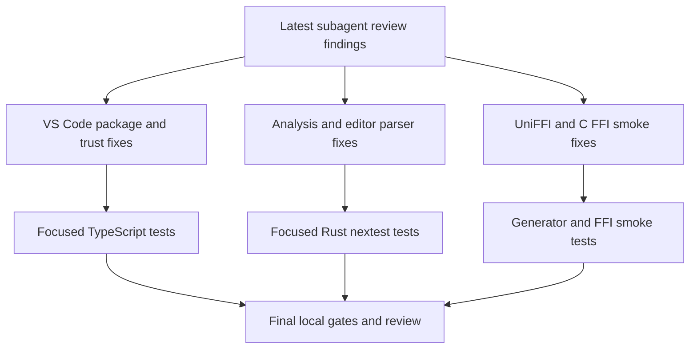

# PR20 Subagent Review Fixes - Plan

## Goal Capsule

| Field | Value |
|---|---|
| Objective | Resolve the latest full subagent review findings for PR #20 so the branch is mergeable and the new editor-language intelligence surfaces have durable contracts. |
| Authority | The review findings and current CI failure are the product contract; repo Mermaid parity strategy, Workspace Trust expectations, and binding protocol docs constrain the implementation. |
| Execution profile | Focused cross-surface hardening on the existing PR branch. Behavior-bearing fixes should start from failing or strengthened regression tests when practical; pure manifest/test-contract fixes use focused smoke verification. |
| Stop conditions | Stop only for a finding that contradicts an existing public contract, requires product-scope expansion beyond PR #20, or cannot be verified locally without changing CI or release credentials. |
| Tail ownership | `ce-work` owns implementation, focused verification, review, commits, and pushing the PR branch when the local branch is green enough to publish. |

---

## Product Contract

### Summary

This plan fixes the six current PR #20 blockers and contract drifts found by the latest subagent review: VS Code export messaging must pass cross-platform package tests, server launch settings must respect Workspace Trust, analysis source-size guards must run before plain-diagram copies, editor facts must parse preprocessed input even when span remap degrades, Python UniFFI package shims must refresh managed exports, and C FFI validation smoke tests must match the render-free protocol.

### Problem Frame

The findings share one failure mode: boundary logic was added near cross-surface seams, but a few edge contracts still depend on host platform behavior, workspace trust defaults, parser preprocessing internals, or optional render features.
PR #20 is unreleased, so the correct fix is to tighten those seams now rather than preserve accidental behavior for compatibility.
The current CI blocker is the VS Code export basename failure on macOS/Linux package jobs, so it takes priority over deeper but non-blocking hardening.

### Requirements

**VS Code extension**

- R1. Export success messages must show a file basename consistently for URI paths and Windows-style `fsPath` values on every Node host OS.
- R2. Additional `merman-lsp` server arguments must be treated as trust-sensitive launch shape, aligned with existing restricted server path and Cargo settings.

**Analysis and parser core**

- R3. Plain Mermaid source-size caps must be enforced before constructing `SourceMap`, `DocumentDiagram`, or other source-owning analysis structures.
- R4. Editor semantic facts must parse the preprocessed Mermaid body after frontmatter, directive, CRLF, or entity cleanup; failed source remapping may degrade spans, but must not switch the parser input back to the original document.

**Bindings and release smoke**

- R5. Generated Python UniFFI package shims must refresh managed exports when the generator reruns against an existing package directory.
- R6. C FFI `validate_json` smoke tests must assert the render-free validation contract for function and reusable-engine APIs.

### Acceptance Examples

- AE1. On macOS or Linux test runners, a save dialog result with `fsPath` equal to `C:\workspace\out.svg` reports `Exported out.svg.`.
- AE2. A workspace setting for `merman.server.args` is documented and classified as restricted, and the runtime does not accept untrusted workspace-controlled direct server args.
- AE3. An oversized plain `.mmd` input with `max_source_bytes` set returns a resource-limit diagnostic without copying the whole input into a `SourceMap` or whole-document diagram.
- AE4. A Mermaid document with YAML frontmatter and `#quot;`-style entity cleanup still feeds editor facts with the preprocessed diagram body rather than the original frontmatter-bearing source.
- AE5. Re-running the Python package generator over an existing generated package updates `__init__.py` so new UniFFI exports are importable from `merman`.
- AE6. A no-render FFI build can still pass validation smoke checks for a valid source, while empty or missing diagram input returns the documented no-diagram error.

### Scope Boundaries

- In scope: direct fixes for the six latest review findings, tests proving each contract, and cleanup of any transitional helper introduced by these fixes.
- In scope: focused CI parity verification for touched Rust, TypeScript, Python generator, and C smoke surfaces.
- Out of scope: reopening earlier PR20 findings already resolved by prior plans unless a new regression test exposes overlap.

#### Deferred to Follow-Up Work

- Full Mermaid semantic parity expansion beyond the specific editor facts preprocessing/remap boundary.
- Broad restructuring of VS Code settings beyond launch-shape trust classification.
- Publishing release artifacts or merging PR #20 into `main`; this plan only prepares and pushes the PR branch.

---

## Planning Contract

### Assumptions

- The user has authorized fearless refactoring, breaking unreleased PR behavior, deleting unnecessary code, and continuing without an additional scope confirmation.
- The checkout is the PR #20 branch `feat/editor-core-language-intelligence`.
- No external research is load-bearing because all fixes are grounded in repository tests, current CI logs, review findings, and checked-in binding protocol docs.
- Subagents are useful for read-only review and post-change validation, but implementation should avoid parallel writes in the shared checkout.

### Key Technical Decisions

- KTD1. Fix the CI blocker first. The basename helper is low-risk and directly unblocks the package matrix, so it lands before deeper Rust and bindings work.
- KTD2. Prefer narrow trust hardening over hidden argument filtering. `merman.server.args` should be classified as restricted in the VS Code manifest and guarded at runtime so trust behavior is visible to VS Code and testable in resolver tests.
- KTD3. Put resource-limit checks before ownership. Plain diagram analysis should mirror the Markdown/MDX fast path by constructing an empty source map plus a calculated whole-text span instead of copying oversized source.
- KTD4. Keep parser input semantic authority with preprocessing. When preprocessing changes the input in ways that cannot be mapped exactly, editor facts should still parse the preprocessed body and only degrade span remapping.
- KTD5. Treat generated Python `__init__.py` as a managed shim. The generator should overwrite the known generated shim or use a marker to distinguish managed files from user customizations.
- KTD6. Bindings tests should encode protocol truth, not feature availability assumptions. `validate_json` is a diagnostics/validation surface, so smoke expectations must not depend on render support.

### Priority Analysis

| Priority | Units | Rationale |
|---|---|---|
| P1 | U1 | Current PR package checks fail on macOS/Linux and block mergeability. |
| P2 | U2, U3, U4, U5, U6 | These are security/trust, resource protection, parser correctness, and downstream binding contract issues that should not ship in PR #20. |
| P3 | U7 | Verification and review cleanup prove the fix set and remove abandoned implementation residue. |

### High-Level Technical Design

### Risks and Mitigations

- Risk: resource-limit diagnostics lose useful location data when avoiding source copies. Mitigation: reuse the document fast-path span calculation so diagnostics still point at the whole input.
- Risk: editor facts span remap degradation could hide real parser locations. Mitigation: parse preprocessed input for semantic correctness and keep remap fallback explicit, with regression coverage for frontmatter/entity cleanup.
- Risk: overwriting `__init__.py` can clobber custom package code. Mitigation: overwrite only the known generated shim shape or introduce a managed marker before making unconditional updates.
- Risk: Workspace Trust behavior differs between manifest metadata and runtime mocks. Mitigation: test both manifest classification and direct runtime args handling.

### Sources and Research

- Current CI logs for run `28693999032` show `exports active Mermaid SVG through the save dialog` failing on macOS/Linux package jobs.
- Review findings from the latest full subagent review in this session.
- Existing related plans: `docs/plans/2026-07-04-001-refactor-pr20-post-review-hardening-plan.md`, `docs/plans/2026-07-04-002-pr20-review-hardening-plan.md`.
- Local patterns: `tools/vscode-extension/src/test/export.test.ts` for command mocks, `tools/vscode-extension/src/test/binaries.test.ts` for trust-gated launch behavior, `crates/merman-analysis/src/document.rs` for source-limit fast-path spans, `crates/merman-core/src/parse_pipeline.rs` for editor source remapping, and `docs/bindings/FFI_PROTOCOL.md` for validation semantics.

---

## Implementation Units

### U1. Make VS Code Export Basename Platform-Neutral

- **Goal:** Fix the current package CI failure by deriving the success-message filename independently of host path separator.
- **Requirements:** R1, AE1.
- **Dependencies:** None.
- **Files:** `tools/vscode-extension/src/export.ts`, `tools/vscode-extension/src/test/export.test.ts`.
- **Approach:** Introduce a small display-name helper near export command code that prefers URI path semantics and falls back through POSIX/Windows basename normalization for mock and remote-path safety.
- **Execution note:** Start with the existing failing export test and keep the Windows-style `fsPath` assertion as the red evidence.
- **Patterns to follow:** Existing export command fake host and command workflow assertions in `tools/vscode-extension/src/test/export.test.ts`.
- **Test scenarios:** Existing active-Mermaid SVG export with Windows-style `fsPath` on POSIX reports `out.svg`; add or strengthen a scenario for POSIX-style save paths if the helper is not covered by the existing command test.
- **Verification:** VS Code extension export tests pass locally, and the expected message no longer includes a directory path.

### U2. Restrict and Guard Server Launch Args

- **Goal:** Align `merman.server.args` with Workspace Trust expectations for executable launch shape.
- **Requirements:** R2, AE2.
- **Dependencies:** None.
- **Files:** `tools/vscode-extension/package.json`, `tools/vscode-extension/src/config.ts`, `tools/vscode-extension/src/server.ts`, `tools/vscode-extension/src/test/binaries.test.ts`, `tools/vscode-extension/src/test/language-intelligence.test.ts`.
- **Approach:** Mark the setting as restricted in the manifest and ensure runtime server args from workspace configuration are rejected or ignored when the workspace is untrusted. Prefer reusing the binary resolver trust model so command construction has a single boundary.
- **Execution note:** Strengthen the binary/server-setting tests before changing runtime behavior where practical.
- **Patterns to follow:** Existing `resolveMermanBinary` trust tests for explicit paths and Cargo fallback.
- **Test scenarios:** Manifest contribution includes `restricted: true` for `merman.server.args`; trusted workspace passes direct args through; untrusted workspace with direct server args fails with a setup error or starts without those args according to the final resolver contract; configuration-change restart behavior still treats args as server-shape changes.
- **Verification:** VS Code binary resolver and language-intelligence tests pass.

### U3. Hoist Plain Diagram Source Limits Before Copies

- **Goal:** Enforce `max_source_bytes` for plain Mermaid inputs before source-owning structures are built.
- **Requirements:** R3, AE3.
- **Dependencies:** None.
- **Files:** `crates/merman-analysis/src/analyzer.rs`, `crates/merman-analysis/src/document.rs`, analysis tests in `crates/merman-analysis/src/analyzer.rs` and `crates/merman-analysis/src/document.rs`.
- **Approach:** Extract or share a resource-limit result helper that can serve both document and plain-analyzer paths with an empty source map and whole-text span calculation. Route `analyze_result`, `analyze`, and `analyze_facts` through the same pre-copy guard.
- **Execution note:** Add characterization/regression tests that fail because the oversized plain input currently builds a non-empty source map before returning the resource limit.
- **Patterns to follow:** `document_source_limit_result` and `whole_text_span_without_source_copy` in `crates/merman-analysis/src/document.rs`.
- **Test scenarios:** Plain `analyze_result` on oversized input returns one resource-limit diagnostic and no analyzed diagrams; plain `analyze` and `analyze_facts` expose the same diagnostic; under-limit plain input still parses normally; Markdown/MDX source-limit behavior remains unchanged.
- **Verification:** Focused `merman-analysis` tests pass under nextest.

### U4. Preserve Preprocessed Parser Input for Editor Facts

- **Goal:** Stop editor semantic facts from parsing the original source when preprocessing changed the diagram body and exact remapping is unavailable.
- **Requirements:** R4, AE4.
- **Dependencies:** None.
- **Files:** `crates/merman-core/src/parse_pipeline.rs`, `crates/merman-core/src/preprocess/mod.rs`, core parser tests in `crates/merman-core/src/parse_pipeline.rs` or adjacent editor facts test files.
- **Approach:** Change the remap fallback so `parser_input` remains `preprocessed`; represent unknown or degraded remap as a remap mode that leaves spans in parser-input coordinates or clamps safely rather than switching parser input back to `original`.
- **Execution note:** Add a regression with frontmatter plus entity cleanup before changing the fallback.
- **Patterns to follow:** Existing `EditorParseSourceMap` offset and normalized-remap modes, plus preprocessing tests for `#quot;` entity encoding.
- **Test scenarios:** Frontmatter plus entity cleanup parses editor facts from the body and does not report malformed frontmatter from the original source; CRLF normalized cases still remap spans to original offsets; exact-substring preprocessing still uses offset remap; unknown remap does not panic or produce out-of-bounds spans.
- **Verification:** Focused `merman-core` editor facts and preprocessing tests pass under nextest.

### U5. Refresh Managed Python UniFFI Package Shims

- **Goal:** Ensure existing generated Python packages receive updated top-level exports when the generator reruns.
- **Requirements:** R5, AE5.
- **Dependencies:** None.
- **Files:** `crates/merman-uniffi/examples/generate_python_package.rs`, generator tests under `crates/merman-uniffi/tests` if present or a new focused test module, `platforms/python/merman/src/merman/__init__.py` if the managed marker/content changes.
- **Approach:** Make `ensure_init_file` refresh known generated shim content using a stable marker or exact generated-body comparison. Preserve custom user shims unless a marker proves the file is managed.
- **Execution note:** Start with a test that creates a stale generated shim and verifies rerun refreshes the export list.
- **Patterns to follow:** Existing generated Python package layout in `platforms/python/merman/src/merman`.
- **Test scenarios:** Missing `__init__.py` is created; stale managed `__init__.py` is overwritten with current exports; custom unmarked `__init__.py` is preserved or errors with a clear message according to final generator contract; generated shim includes `MermanTextMeasurer`, text measure request/result, and lint catalog exports.
- **Verification:** Focused UniFFI generator tests pass, or generator smoke is run if no unit seam exists.

### U6. Align C FFI Validation Smoke With Render-Free Protocol

- **Goal:** Make validation smoke tests reflect that `validate_json` is available independently of render support.
- **Requirements:** R6, AE6.
- **Dependencies:** None.
- **Files:** `crates/merman-ffi/tests/c_consumer_smoke.c`, `docs/bindings/FFI_PROTOCOL.md` if implementation uncovers doc drift, FFI smoke harness files if expectations are duplicated.
- **Approach:** Remove `api.render_enabled` from validation expected payloads for both function and engine validation calls. Add a no-diagram validation assertion if the smoke harness can express it without broad duplication.
- **Execution note:** Treat this as protocol-test cleanup; no production code change is expected unless smoke reveals implementation drift.
- **Patterns to follow:** Existing `expect_ok_with` and `expect_error_with` helpers in the C smoke test.
- **Test scenarios:** Valid source through `api.validate_json` expects `"valid":true` regardless of render feature; valid source through `api.engine_validate_json` expects `"valid":true` regardless of render feature; empty source returns `MERMAN_NO_DIAGRAM` where the protocol specifies it.
- **Verification:** C FFI smoke build/test passes for the available local feature set; no-render behavior is covered by the smoke expectation or documented as CI-only if the local harness cannot build it.

### U7. Run Focused Verification, Review, and Publish PR Branch

- **Goal:** Prove the full fix set, simplify any duplicate helper code, and publish the PR branch when local checks are credible.
- **Requirements:** R1, R2, R3, R4, R5, R6.
- **Dependencies:** U1, U2, U3, U4, U5, U6.
- **Files:** All touched files plus this plan file.
- **Approach:** Run formatting and focused tests by touched surface, then run a final review pass. Commit logical units with conventional messages and push `feat/editor-core-language-intelligence`; do not merge into or push `main` as part of this plan.
- **Patterns to follow:** Repository preference for `cargo fmt` and `cargo nextest`, VS Code extension `npm test`, and existing PR20 verification plans.
- **Test scenarios:** Test expectation: none -- this unit is verification and cleanup, not a new behavior surface.
- **Verification:** `cargo fmt --check`; focused `cargo nextest` for touched Rust crates; VS Code extension tests; UniFFI/FFI focused checks where available; final code review has no unresolved actionable findings in plan scope; PR branch is pushed if commits were created.

---

## Verification Contract

| Gate | Units | Done Signal |
|---|---|---|
| VS Code extension tests | U1, U2 | Export and binary/config trust tests pass through the extension test command or focused Node test invocation. |
| Rust analysis/core tests | U3, U4 | Focused nextest tests for `merman-analysis` and `merman-core` pass. |
| UniFFI generator tests or smoke | U5 | Existing or new generator test proves managed shim refresh. |
| C FFI smoke | U6 | Smoke expectations no longer depend on render support for validation. |
| Formatting | U3, U4, U5, U6 | `cargo fmt --check` passes for touched Rust/C-adjacent workspace formatting expectations. |
| Final review | U7 | A final review pass finds no unresolved P0/P1/P2 issues in this plan scope. |

### Evidence To Capture

- CI-blocking export assertion before and after U1.
- Trust behavior for `merman.server.args` in trusted and untrusted launch paths.
- Resource-limit diagnostics for oversized plain Mermaid without source-copy-dependent structures.
- Editor facts behavior for preprocessed but non-exactly-remappable input.
- Python shim refresh behavior on an existing stale package directory.
- C smoke validation behavior independent of render feature availability.

---

## Definition of Done

- Current macOS/Linux VS Code package failure is fixed locally and ready for CI.
- All six review findings are either fixed with tests or recorded as impossible to reproduce locally with exact residual risk.
- The implementation removes dead-end helpers or obsolete code introduced during the fix pass.
- Focused verification gates pass locally, or unavailable gates are documented with exact tooling constraints.
- Changes are committed with conventional commit messages and pushed to the PR branch when verification is acceptable.
