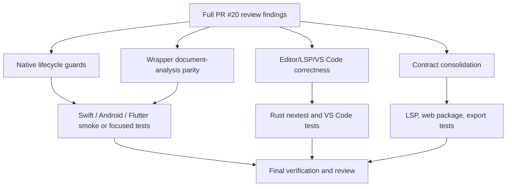

# PR20 Full Review Hardening - Plan

## Goal Capsule

| Field | Value |
|---|---|
| Objective | Resolve the remaining full-review findings for PR #20 so the editor-language intelligence branch is safe across native bindings, VS Code, LSP, web packaging, and core parser contracts. |
| Authority | The latest full subagent review findings, the current PR branch state, repository parity strategy, public C/UniFFI contracts, and host binding lifecycle expectations. |
| Execution profile | Deep cross-surface hardening on the existing PR branch. Behavior-bearing work should use proof-first or characterization-first tests when the seam is practical; pure packaging or structural cleanup should use focused smoke and contract checks. |
| Stop conditions | Stop only for a finding that contradicts an existing public release contract, requires credentials or external hardware not available locally, or changes PR scope beyond editor-language/binding hardening. |
| Tail ownership | The current Codex goal session owns implementation, simplification, code review, focused verification, commits, and pushing the PR branch when the tree is credible. |

---

## Product Contract

### Summary

This plan hardens PR #20 after full subagent review by fixing the remaining runtime-safety, wrapper-parity, VS Code lifecycle, parser span-contract, and structural maintainability issues.
The branch is unreleased and the maintainer authorized fearless refactoring, so the plan prefers removing ambiguous or duplicated designs over preserving accidental behavior.

### Problem Frame

PR #20 adds editor-language intelligence and expands multiple host surfaces.
The first fix wave made CI green, but review still found lifecycle races, wrapper gaps, stale-client failure modes, and duplicated contracts that would become expensive once published.
The highest-risk issues sit at native host boundaries where a dangling callback, freed reusable engine, or failed language client can turn an ordinary user action into undefined behavior or a permanently broken session.

### Requirements

**Native binding lifecycle safety**

- R1. Swift reusable engines must not free or replace native engine state while another thread is inside a native call or callback registration operation.
- R2. Flutter reusable engines must keep old text-measure callbacks alive until native replacement or clearing succeeds, and must close newly allocated callbacks on failure.
- R3. Binding lifecycle APIs must reject or serialize reentrant close/callback/native-call operations instead of leaving dangling native pointers.

**Wrapper parity and public contracts**

- R4. Swift, Android/Kotlin, Android JNI, and Flutter wrappers must expose document analysis and document facts APIs that match the checked-in C ABI and UniFFI surfaces.
- R5. Wrapper examples, smoke tests, or docs must prove stateless and reusable-engine document analysis paths where the platform already has an analogous plain-source API.
- R6. Flutter's public barrel must export ASCII capability types returned by its public API.

**Editor and LSP correctness**

- R7. VS Code language-client startup failure must clear the global client and report a usable error state so later commands do not talk to a failed client.
- R8. VS Code preview webview message handlers must catch asynchronous failures, log them, and surface user-visible errors when copy/export/reveal/source actions fail.
- R9. Editor semantic facts produced after preprocessing must have an explicit span-coordinate contract when exact source remapping is unavailable.

**Structural consolidation**

- R10. LSP snapshot context and server wiring must be split enough that stale-context behavior is centralized and tests do not keep inflating `server.rs`.
- R11. VS Code export workflows must share one implementation path for command and preview-originated SVG export behavior.
- R12. Web package surface entry metadata must be single-sourced so generator, runtime, surface entry files, and contract checker cannot drift.
- R13. Analysis source-limit helper code should live at the analysis boundary that owns the behavior, without thin duplicate wrappers.

### Acceptance Examples

- AE1. If one Swift thread calls `close()` while another thread is rendering or analyzing through the same reusable engine, the close operation waits or fails safely and no freed pointer is passed to native code.
- AE2. If Flutter native callback registration fails after a new text measurer is allocated, the previous callback remains valid and the new callback is closed.
- AE3. Swift, Android, and Flutter hosts can analyze a Markdown document with multiple Mermaid fences and receive document-level JSON or facts without reaching into C ABI names manually.
- AE4. If the VS Code language server start promise rejects, `showRuleCatalog` and `showConfigSchema` see no active client and do not send requests to the failed instance.
- AE5. A failing preview `copySvg` message is caught, logged, and reported rather than becoming an unhandled promise rejection.
- AE6. A preprocessed diagram whose spans cannot be mapped exactly still produces semantic facts, and any exposed spans are marked or transformed according to the documented degraded contract.
- AE7. Adding a new web surface wrapper export requires changing one manifest or helper source, and the generator plus checker consume that same source.

### Scope Boundaries

- In scope: direct fixes for all P1/P2 findings from the latest full review, P3 cleanup when it is low-risk and adjacent to touched code, tests or smoke coverage for every behavior-bearing change, and deletion of duplicated code made obsolete by the refactor.
- In scope: breaking unreleased PR #20 wrapper APIs when the new shape is clearer and closer to the underlying C/UniFFI contracts.
- In scope: committing logical units and pushing `feat/editor-core-language-intelligence`.
- Out of scope: merging PR #20 into `main`, publishing packages, changing Mermaid parity baselines unrelated to editor-language hardening, or broad UI redesign outside the VS Code error-handling paths.

#### Deferred to Follow-Up Work

- Broader Swift or Android package distribution automation beyond smoke coverage for the new wrapper methods.
- Full release-workflow permission tightening, unless current edits touch that workflow directly.
- SVG sanitizer policy changes for future raw HTML label support, unless the preview error handling uncovers an immediate exploitable path.

---

## Planning Contract

### Assumptions

- The user has pre-authorized skipping scoping confirmation and post-plan handoff prompts, and selected the goal/ce-work execution path.
- The active checkout is the PR #20 branch `feat/editor-core-language-intelligence`.
- The review findings are authoritative even when no current CI failure reproduces them.
- Codex subagents share the same checkout in this environment, so write-heavy implementation should be serialized; subagents are best used for read-only review or focused post-change validation.
- No external web research is load-bearing because all contracts are local: checked-in C headers, UniFFI exports, wrapper code, VS Code extension tests, and CI config.

### Key Technical Decisions

- KTD1. Fix lifecycle races before parity additions. A use-after-free or callback ownership bug has higher severity than missing wrapper convenience APIs, and later wrapper methods should inherit the same lifecycle guard.
- KTD2. Treat binding document analysis as a first-class host API. The C ABI and UniFFI already expose document analysis, so platform wrappers should not force users to manually bind lower-level symbols.
- KTD3. Centralize native-call lifecycle guards per host. Swift should mirror Android's reusable-engine lock discipline, while Flutter should make callback ownership transitions transactional within its existing isolate model.
- KTD4. Make degraded editor spans explicit. Semantic correctness should parse preprocessed input, but downstream editor consumers need a clear signal or normalization path when spans are not original-source coordinates.
- KTD5. Keep VS Code globals valid-or-empty. A failed language client must not remain in `client`, and webview message dispatch must terminate errors at the host boundary.
- KTD6. Consolidate duplicated contract lists instead of adding more checkers. Checkers catch drift after the fact; a shared manifest or helper prevents drift at the source.

### Priority Analysis

| Priority | Units | Rationale |
|---|---|---|
| P1 | U1 | Swift reusable-engine UAF can crash native hosts and corrupt memory. |
| P2 | U2, U3, U4, U5 | Flutter callback ownership, wrapper parity, VS Code stale client, webview unhandled rejections, and degraded span semantics affect public correctness and host stability. |
| P2 Structural | U6, U7, U8 | LSP, VS Code export, and web surface duplication increase future regression risk on actively changing PR surfaces. |
| P3 | U9, U10 | Barrel export and analysis helper cleanup are small contract/maintainability fixes that fit adjacent work. |
| Tail | U11 | Final verification, review, commits, and push prove the full plan and remove dead-end code. |

### High-Level Technical Design

### Risks and Mitigations

- Risk: Swift lifecycle locking can deadlock if a text measurement callback reenters the same reusable engine. Mitigation: detect same-thread reentry or design a lifecycle guard that tracks active native calls and rejects reentrant engine use with a clear error.
- Risk: Flutter callback changes can leak callbacks when registration fails on rare error paths. Mitigation: test replacement, clearing, and failure ordering with fake bindings or a narrow injectable seam.
- Risk: adding document APIs to wrappers can drift naming across platforms. Mitigation: align method names around existing plain `analyze` naming and checked-in C/UniFFI document terms, then document platform-specific conventions in one pass.
- Risk: LSP structural splitting can produce broad mechanical churn. Mitigation: extract only cohesive stale-context/test modules first and keep public behavior unchanged.
- Risk: web surface manifest generation can require regenerating files. Mitigation: regenerate deterministic surface files and stage only source/managed outputs related to the manifest refactor.

### Sources and Research

- Current review findings from the full PR #20 subagent review in this session.
- Existing related plan: `docs/plans/2026-07-04-003-refactor-pr20-subagent-review-fixes-plan.md`.
- Local contracts: `crates/merman-ffi/include/merman.h`, `crates/merman-uniffi/src/lib.rs`, `docs/bindings/FFI_PROTOCOL.md`, wrapper READMEs, and platform smoke examples.
- Local patterns: Android reusable-engine lifecycle guard in `platforms/android/src/main/kotlin/io/merman/MermanReusableEngine.kt`, C/JNI wrapper patterns in `crates/merman-ffi/src/android_jni.rs`, VS Code fake-client tests under `tools/vscode-extension/src/test`, and web surface generator/checker scripts in `platforms/web/scripts`.

---

## Implementation Units

### U1. Guard Swift Reusable Engine Native Lifetimes

- **Goal:** Prevent Swift reusable engines from freeing or mutating native engine state during concurrent native calls.
- **Requirements:** R1, R3, AE1.
- **Dependencies:** None.
- **Files:** `platforms/apple/Sources/Merman/MermanEngine.swift`, `platforms/apple/examples/smoke/Sources/MermanAppleSmoke/main.swift`, Apple package tests or smoke files if present.
- **Approach:** Introduce a lifecycle guard around reusable-engine native calls, callback registration, and close. The guard should serialize close with active native calls, reject same-thread reentry if it would deadlock, and make `close()` idempotent after the native pointer is released.
- **Execution note:** Start with a concurrency-focused smoke or unit seam if practical; otherwise document the no-test exception and prove with compile plus a smoke example that uses callback registration and close.
- **Patterns to follow:** Android reusable-engine lock model in `platforms/android/src/main/kotlin/io/merman/MermanReusableEngine.kt`.
- **Test scenarios:** Concurrent close while analysis/render is active does not free the pointer early; callback replacement and close serialize; repeated close is safe; using an engine after close returns the existing Swift error contract.
- **Verification:** Swift package build or Apple smoke succeeds, and code review confirms every reusable-engine native entry uses the lifecycle guard.

### U2. Make Flutter Text Measure Callback Replacement Transactional

- **Goal:** Preserve callback ownership across replacement, clearing, failure, and engine close paths.
- **Requirements:** R2, R3, AE2.
- **Dependencies:** None.
- **Files:** `platforms/flutter/lib/src/merman_ffi.dart`, `platforms/flutter/test` files or a new focused fake-bindings test if the package supports it, `platforms/flutter/example/smoke.dart`.
- **Approach:** Allocate the new `NativeCallable` before native registration, keep the old callback alive until native registration or clearing succeeds, close the new callback on failure, and close the old callback only after native state no longer points at it.
- **Execution note:** Add or strengthen a test around callback replacement ordering before changing the production path when the binding seam allows it.
- **Patterns to follow:** Existing `_check`, `_closeTextMeasureCallback`, and reusable-engine close patterns in `platforms/flutter/lib/src/merman_ffi.dart`.
- **Test scenarios:** Replacing a measurer closes the old callback only after successful native registration; failed replacement leaves the old callback and measurer active; clearing a measurer calls native clear before closing the callback; close clears native callback ownership before closing Dart resources.
- **Verification:** Flutter analysis and focused tests or smoke pass, with any unavailable native test documented.

### U3. Expose Document Analysis in Native Host Wrappers

- **Goal:** Add stateless and reusable-engine document analysis/facts methods to Swift, Android/Kotlin/JNI, and Flutter.
- **Requirements:** R4, R5, AE3.
- **Dependencies:** U1 for Swift lifecycle guard reuse; U2 for Flutter lifecycle cleanup.
- **Files:** `platforms/apple/Sources/Merman/MermanEngine.swift`, `platforms/apple/examples/smoke/Sources/MermanAppleSmoke/main.swift`, `platforms/android/src/main/kotlin/io/merman/MermanEngine.kt`, `platforms/android/src/main/kotlin/io/merman/MermanReusableEngine.kt`, `crates/merman-ffi/src/android_jni.rs`, `platforms/android/examples/MermanSmoke.kt`, `platforms/flutter/lib/src/merman_ffi.dart`, `platforms/flutter/example/smoke.dart`, wrapper README files if API docs drift.
- **Approach:** Mirror existing plain-source analyze methods while adding `sourceUri` and document-source-kind inputs required by C/UniFFI document APIs. Keep naming consistent per host language and route reusable-engine methods through the lifecycle/callback-safe call helpers.
- **Execution note:** Prefer smoke-first proof because these are FFI wrapper surfaces; add focused tests only where the wrapper has an existing fake native binding seam.
- **Patterns to follow:** C ABI document functions in `crates/merman-ffi/include/merman.h` and UniFFI document exports in `crates/merman-uniffi/src/lib.rs`.
- **Test scenarios:** Stateless Swift/Kotlin/Dart document analysis returns document JSON for Markdown with a Mermaid fence; reusable-engine document analysis returns the same shape; document facts methods expose facts JSON when the platform wrapper exposes plain facts or analogous analysis helpers; invalid or empty document input preserves existing error handling.
- **Verification:** Platform smoke examples compile or run where tooling is available; Rust JNI code compiles; wrapper docs match the public method names.

### U4. Clear Failed VS Code Language Clients

- **Goal:** Ensure a language-client start failure leaves no stale global client and later commands see a clean inactive state.
- **Requirements:** R7, AE4.
- **Dependencies:** None.
- **Files:** `tools/vscode-extension/src/extension.ts`, `tools/vscode-extension/src/test/language-intelligence.test.ts` or a new focused extension lifecycle test.
- **Approach:** Assign the global client only after successful start, or clear it in a start failure handler. Stop any partially-created client best-effort and ensure configuration push failures follow the same cleanup path.
- **Execution note:** Add a fake client that rejects `start()` before changing global assignment behavior.
- **Patterns to follow:** Existing fake client and command tests in the VS Code extension test suite.
- **Test scenarios:** `start()` rejection clears `client`; later rule catalog/config schema commands do not send requests; successful start still pushes configuration and registers commands; configuration push rejection cleans up or reports failure consistently.
- **Verification:** Focused VS Code extension tests pass.

### U5. Catch VS Code Preview Webview Message Failures

- **Goal:** Prevent unhandled promise rejections from async preview webview message handlers.
- **Requirements:** R8, AE5.
- **Dependencies:** None.
- **Files:** `tools/vscode-extension/src/preview-instance.ts`, `tools/vscode-extension/src/test/preview-manager.test.ts`, `tools/vscode-extension/src/test/preview-webview.test.ts` or adjacent test files.
- **Approach:** Wrap `handleWebviewMessage` dispatch in a terminating `.catch` path that logs the failure and shows an appropriate user-facing error for copy, export, reveal, and source actions without crashing the extension host.
- **Execution note:** Strengthen a test with a clipboard or SVG validation failure before adding the catch path.
- **Patterns to follow:** Existing output channel logging and warning/error message helpers in the extension.
- **Test scenarios:** `copySvg` sanitizer failure is caught and reported; clipboard write failure is caught and reported; unknown messages still follow current validation behavior; successful copy/export/reveal behavior is unchanged.
- **Verification:** Focused preview tests pass.

### U6. Make Unmapped Editor Span Semantics Explicit

- **Goal:** Keep semantic facts from preprocessed parser input while making degraded spans safe and unambiguous.
- **Requirements:** R9, AE6.
- **Dependencies:** None.
- **Files:** `crates/merman-core/src/parse_pipeline.rs`, `crates/merman-core/src/tests/sequence.rs`, additional core tests if needed, downstream LSP/editor code if it consumes the new degraded-span signal.
- **Approach:** Replace the ambiguous "unmapped means identity offset" behavior with an explicit degraded remap mode. Choose the smallest contract that downstream consumers can handle safely: either mark facts as parser-coordinate spans, suppress spans that cannot be trusted, or remap only spans whose source slice can be verified.
- **Execution note:** Add a regression that asserts symbol/fact spans after entity cleanup or directive/frontmatter cleanup follow the degraded contract, not accidental parser offsets presented as original offsets.
- **Patterns to follow:** Existing editor facts preprocessing tests and `EditorSourceRemap` variants in `crates/merman-core/src/parse_pipeline.rs`.
- **Test scenarios:** Exact offset remap still returns original-source spans; CRLF normalization still maps spans correctly; entity cleanup with no exact remap still returns facts and safe degraded spans; no degraded span points outside the original source.
- **Verification:** Focused `merman-core` nextest tests pass.

### U7. Split LSP Snapshot Context and Server Tests

- **Goal:** Reduce `server.rs` size and centralize semantic/structure snapshot context freshness logic.
- **Requirements:** R10.
- **Dependencies:** U6 if span semantics require LSP adaptation.
- **Files:** `crates/merman-lsp/src/server.rs`, new `crates/merman-lsp/src/snapshot_context.rs` or equivalent, new `crates/merman-lsp/src/server_tests.rs` or test module files, `crates/merman-lsp/src/lib.rs` or module declarations if needed.
- **Approach:** Extract duplicated semantic/structure snapshot context helpers behind a purpose enum or small type that owns stale revision checks. Move large test blocks out of `server.rs` while preserving public `LanguageServer` wiring.
- **Execution note:** Keep this as behavior-preserving refactor; use existing stale snapshot tests as characterization before moving code.
- **Patterns to follow:** Existing stale semantic and structure snapshot tests recently added in `crates/merman-lsp/src/server.rs`.
- **Test scenarios:** Semantic snapshot stale revision rejects; structure snapshot stale revision rejects; successful fresh snapshot paths are unchanged; moved tests still compile and exercise the same helpers.
- **Verification:** Focused `merman-lsp` nextest tests pass and `server.rs` no longer owns duplicate stale-context helper logic.

### U8. Share VS Code Export Workflow and Web Surface Manifests

- **Goal:** Delete duplicated export and web-surface contract lists while preserving generated output.
- **Requirements:** R11, R12, AE7.
- **Dependencies:** U5 for preview error behavior if export code is touched there.
- **Files:** `tools/vscode-extension/src/export.ts`, `tools/vscode-extension/src/preview-instance.ts`, new shared export helper if needed, VS Code export/preview tests, `platforms/web/scripts/build-surface-packages.mjs`, `platforms/web/scripts/check-contracts.mjs`, `platforms/web/src/surface-runtime.ts`, `platforms/web/src/surfaces/*.ts`, optional shared manifest under `platforms/web/src` or `platforms/web/scripts`.
- **Approach:** Extract one VS Code SVG export workflow used by command and preview paths. For web surfaces, move surface entries and runtime binding names into one manifest/helper consumed by generator and contract checker; regenerate managed surface entry files if needed.
- **Execution note:** Characterize current export messages and web checker output before deleting duplication.
- **Patterns to follow:** Existing export command tests, preview export handling, and `platforms/web/scripts/check-contracts.mjs` drift checks.
- **Test scenarios:** Command export and preview export both write through the same helper and retain success/failure messages; web contract checker reads the shared manifest; generated surface entries re-export all runtime-bound wrappers; adding a manifest-only binding causes the checker to fail until generated entries match.
- **Verification:** VS Code export/preview tests and web contract/build or smoke checks pass.

### U9. Finish Small Public Contract Cleanups

- **Goal:** Land low-risk P3 findings adjacent to touched code.
- **Requirements:** R6, R13.
- **Dependencies:** None.
- **Files:** `platforms/flutter/lib/merman.dart`, `platforms/flutter/lib/src/merman_ffi.dart`, `crates/merman-analysis/src/analyzer.rs`, `crates/merman-analysis/src/document.rs`, related analysis tests.
- **Approach:** Export Flutter ASCII capability value types from the public barrel. Move source-limit helper logic to the module that owns the analysis boundary and delete thin wrappers that only forward parameters.
- **Execution note:** Treat barrel exports as compile/analyze coverage; treat analysis helper movement as behavior-preserving refactor with existing tests as characterization.
- **Patterns to follow:** Existing Flutter public export list and analysis source-limit helpers introduced by the prior plan.
- **Test scenarios:** A Flutter user importing `package:merman/merman.dart` can refer to ASCII capability types; analysis source-limit tests still pass after helper relocation; no duplicate helper remains.
- **Verification:** Flutter analyze or focused package compile path passes; focused `merman-analysis` nextest tests pass.

### U10. Run Read-Only Full Review After Fixes

- **Goal:** Re-run broad review with subagents after implementation to catch regressions before final commit/push.
- **Requirements:** R1, R2, R3, R4, R5, R6, R7, R8, R9, R10, R11, R12, R13.
- **Dependencies:** U1, U2, U3, U4, U5, U6, U7, U8, U9.
- **Files:** All touched files.
- **Approach:** Dispatch read-only subagents by risk area: native lifecycle, wrapper parity, VS Code, Rust core/LSP, web packaging, and tests. Do not let subagents edit or commit in the shared checkout; integrate findings serially.
- **Execution note:** This is review-only unless a finding is accepted; any fix gets its own focused verification.
- **Patterns to follow:** Previous subagent full-review structure from this session.
- **Test scenarios:** Test expectation: none -- this is a review gate, not product behavior.
- **Verification:** No unresolved P0/P1/P2 findings remain, or residuals are documented with a clear reason and user-visible risk.

### U11. Final Verification, Commit, Push, and Goal Closure

- **Goal:** Prove the plan end-to-end and publish the PR branch.
- **Requirements:** All requirements.
- **Dependencies:** U1, U2, U3, U4, U5, U6, U7, U8, U9, U10.
- **Files:** All touched files plus this plan file.
- **Approach:** Run formatting and focused tests by touched surface, then broader checks that are practical locally. Stage only files changed for this plan, create conventional commits at logical boundaries, push `feat/editor-core-language-intelligence`, and check PR status.
- **Patterns to follow:** Repository preference for `cargo fmt`, `cargo nextest`, extension package scripts, Flutter package tooling, platform smoke scripts, and CI workflow smoke gates.
- **Test scenarios:** Test expectation: none -- this unit is verification, landing, and cleanup.
- **Verification:** Required Verification Contract gates pass or are documented as not applicable; final `git diff --check` passes; PR branch is pushed; GitHub PR checks are clean or pending with no known local failure.

---

## Verification Contract

| Gate | Units | Done Signal |
|---|---|---|
| Swift wrapper build or smoke | U1, U3 | Apple package build or smoke proves reusable-engine lifecycle paths and document-analysis wrapper methods compile. |
| Flutter analyze/tests or smoke | U2, U3, U9 | Flutter package can analyze or run focused tests; callback replacement and public exports are covered where the test seam exists. |
| Android/JNI compile or smoke | U3 | Kotlin wrapper and JNI document-analysis methods compile; Android smoke or Rust JNI checks cover method wiring where tooling is available. |
| VS Code extension tests | U4, U5, U8 | Focused language-client lifecycle, preview message, and export workflow tests pass. |
| Rust core/LSP/analysis tests | U6, U7, U9 | Focused `cargo nextest` runs for `merman-core`, `merman-lsp`, and `merman-analysis` pass. |
| Web package contract checks | U8 | Web surface generator/checker/build or smoke verifies the shared manifest and generated surfaces. |
| Formatting and static checks | All code units | `cargo fmt --check`, `git diff --check`, and relevant package format/lint checks pass for touched surfaces. |
| Full review | U10 | Read-only subagent or `ce-code-review` pass finds no unresolved P0/P1/P2 issues in plan scope. |
| PR branch publish | U11 | Logical commits exist on `feat/editor-core-language-intelligence`, the branch is pushed, and PR #20 status is checked. |

### Evidence To Capture

- Swift lifecycle guard reasoning and build/smoke output.
- Flutter callback replacement ordering test or documented smoke evidence.
- Wrapper document-analysis API compile/smoke evidence across Swift, Android, and Flutter.
- VS Code failed-start and webview rejection tests before and after fixes where practical.
- Core degraded-span regression assertions.
- LSP stale-context tests after module extraction.
- Web surface manifest checker output after consolidation.
- Final review findings and resolution notes.

---

## Definition of Done

- All P1/P2 findings from the latest full review are fixed, tested, or explicitly documented as non-applicable with a defensible reason.
- P3 cleanups in scope are either completed or deferred only when they are no longer adjacent to touched code.
- No wrapper method added by this plan bypasses lifecycle guards or native result/error handling.
- Public wrapper docs and examples do not advertise methods that fail to compile.
- Duplicated contract lists removed by this plan are replaced with a shared source of truth, not another post-hoc checker only.
- Focused verification gates pass locally, and unavailable gates are named with exact tooling constraints.
- Dead-end or experimental code from attempted fixes is removed before final commit.
- Changes are committed with conventional commit messages and pushed to the PR branch.
