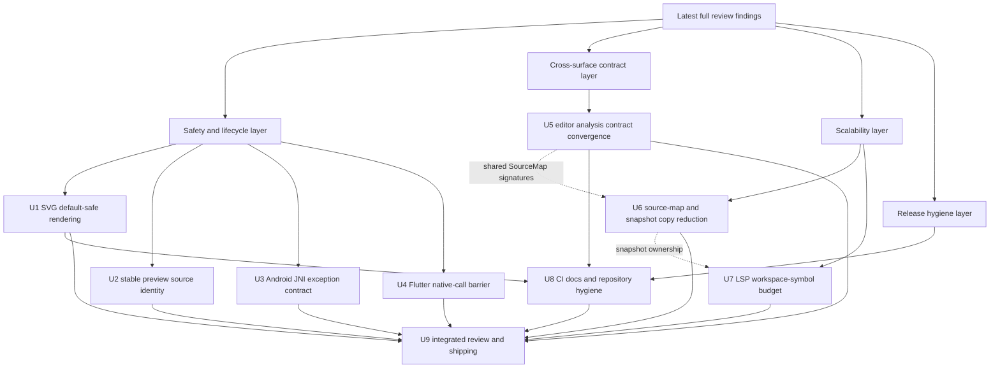

# PR20 Post-Review Refactor and Safety Closure - Plan

## Goal Capsule

| Field | Value |
|---|---|
| Objective | Resolve the latest full subagent review findings for PR #20 with safety-first refactors across SVG preview/rendering, host bindings, editor analysis contracts, LSP scalability, CI coverage, and public repository hygiene. |
| Authority | The latest read-only full review findings, the current PR branch diff against `origin/main`, repository AGENTS instructions, Mermaid parity strategy, public host binding contracts, and local CI scripts. |
| Execution profile | Deep cross-surface hardening on the existing PR branch. Behavior-bearing changes should use proof-first or characterization-first tests when practical; config, docs, and packaging work should use smoke or contract verification. |
| Stop conditions | Stop only if implementation reveals a release-blocking public contract conflict, unavailable platform tooling blocks proof of a safety-critical change, or a finding requires scope outside PR #20 editor-language and binding hardening. |
| Tail ownership | The current Codex goal session owns implementation, simplification, focused verification, full code review, commits, and pushing the PR branch under repository conventions and user preferences. |

---

## Product Contract

### Summary

This plan closes the remaining issues found by the latest full subagent review of PR #20.
The branch is unreleased and the maintainer authorized fearless refactoring, so the plan prefers clear contract boundaries and deletion of accidental complexity over preserving weak interim APIs.

### Problem Frame

PR #20 now spans Rust analysis, LSP behavior, web helpers, VS Code preview/export flows, and native/mobile bindings.
The latest review found no P0/P1 blockers, but it identified P2 issues that would become expensive after publication: SVG helpers load unsafe external resources, host callbacks can cross native lifetime boundaries, editor analysis contracts drift across Rust and TypeScript, and workspace-scale analysis paths can degrade under large documents.
The PR should land with these contracts explicit rather than relying on undocumented caller discipline.

### Requirements

**SVG and preview safety**

- R1. VS Code SVG sanitization must reject or rewrite every URL-bearing SVG attribute that can load external content, while preserving safe local fragment references such as `url(#clipPathId)`.
- R2. Web DOM rendering helpers must run the same active-content SVG safety policy as VS Code before DOM import, rejecting script/foreignObject, event attributes, dangerous style URLs, href/src resources, and URL-bearing paint/filter/mask/marker attributes by default; any raw/unsafe insertion path must be named as an explicit opt-in rather than the default convenience API.
- R3. VS Code preview utility code must not leave weak runtime hygiene behind: CSP nonce generation, copy-timer cleanup, render-process stderr handling, and async preview errors should fail visibly and predictably.

**Host binding lifecycle and exception contracts**

- R4. Android JNI text-measure callbacks must not swallow pending Java exceptions; if the Java callback throws, the wrapper must clear the pending exception, treat only that measurement as unavailable, and let the configured native text-measure fallback handle it without leaving JNI in an exceptional state.
- R5. Flutter reusable engines must guard native calls, callbacks, `close()`, and text-measurer mutation with one lifecycle barrier: reentrant calls on the same engine during a callback return a named lifecycle error, while `close()` during an active native call records a deferred close and frees native state only after the outer call exits.
- R6. Host binding docs and smoke coverage must explain and prove lifecycle behavior for callback failures, close-during-callback attempts, and reusable-engine calls after close.

**Editor analysis and public contract parity**

- R7. TypeScript, Rust, WASM, C, UniFFI, and host wrappers must agree on editor semantic fact source strings and document-analysis/facts surfaces that are publicly exported.
- R8. Flowchart structured facts must accept every parser family variant produced by the current configuration, including legacy `flowchart` when dagre-d3 is selected.
- R9. Source-map and semantic-token span conversion must handle CRLF line endings correctly and avoid repeated line-start rescans on dense or long-line documents.

**Workspace-scale reliability**

- R10. LSP workspace/symbol refresh must avoid unbounded synchronous rebuilds of every missing open-document snapshot; stale checks and budgeting must be centralized, with client-cancel support limited to cooperative checkpoints exposed by the current request path.
- R11. Analysis and editor workspace snapshots should reduce avoidable full-text and fence-body copies where ownership can be shared without making APIs harder to reason about.

**CI, release, and repository hygiene**

- R12. CI path filters and package checks must include every file that can affect web prepack, VSIX packaging, release crate order, and public surface contracts.
- R13. Public docs and examples must reflect the current host API surface, including render-gated/no-render behavior, without keeping stale wrapper guidance.
- R14. Transient agent progress/session logs must not ship as public project documentation when their content is process noise rather than durable engineering knowledge.

### Acceptance Examples

- AE1. A VS Code preview SVG containing `fill="url(https://example.invalid/p.svg#x)"`, `filter="url(file:///tmp/x)"`, or `mask="url(data:text/html,...)"` is blocked or sanitized, while `clip-path="url(#localClip)"` remains valid.
- AE2. Calling the web `renderSvgElement` convenience helper with an SVG image element whose `href` points at `https://example.invalid/a.png` does not load the URL unless the caller chooses an explicitly unsafe path.
- AE3. If an Android text-measure callback throws, the pending Java exception is cleared, the current measurement uses the configured fallback path, and the next JNI call can proceed normally.
- AE4. If a Flutter text-measure callback tries to reenter the same reusable engine it receives `DART_ENGINE_REENTERED`; if it calls `close()`, native free is deferred until the outer native call exits.
- AE5. A locked VS Code preview remains attached to the same Markdown fence after a new earlier fence is inserted; if the target fence disappears, preview/export/copy does not silently retarget another diagram.
- AE6. A diagram parsed with legacy `flowchart` structured facts still produces the expected analysis facts when the active site config selects dagre-d3.
- AE7. Semantic tokens for a CRLF Markdown document map line/character positions without off-by-one drift, and dense semantic spans do not require repeated full line rescans.
- AE8. A PR that only changes `docs/release/WASM_SIZE_BUDGETS.json` runs the web prepack/smoke gate that reads that file.

### Scope Boundaries

- In scope: all P2 findings from the latest full review, adjacent P3 fixes that are low-risk or share touched files, tests/smokes for behavior-bearing changes, and deletion or consolidation of obsolete code and process-noise docs.
- In scope: breaking unreleased PR #20 APIs when the clearer API better matches Rust/C/UniFFI contracts and host lifecycle semantics.
- In scope: incremental conventional commits and pushing `feat/editor-core-language-intelligence` after credible verification.
- Out of scope: merging PR #20 into `main`, publishing packages, broad Mermaid parity baseline refreshes unrelated to the reviewed findings, or a wholesale replacement of the LSP server architecture beyond the workspace/symbol and snapshot bottlenecks found here.

#### Deferred to Follow-Up Work

- A full VS Code extension-host matrix across all supported VS Code versions if local tooling cannot run it during this branch; this plan still requires a meaningful extension-host smoke or a CI-bound equivalent.
- A generated cross-language API surface manifest for every wrapper if the immediate contract drift can be closed with focused tests and existing generation inputs.

---

## Planning Contract

### Assumptions

- The active checkout is the PR branch `feat/editor-core-language-intelligence`; work continues there unless the user redirects.
- The latest subagent review findings are authoritative planning input even when current CI is green.
- No external web research is load-bearing because every finding is tied to checked-in source, generated bindings, tests, docs, or CI configuration.
- Codex subagents share this checkout in the current environment, so write-heavy implementation should be serialized or narrowly delegated; read-only review subagents are safe to run broadly.
- Platform-specific verification may have local tool gaps. When a platform tool is unavailable, the implementation must still add local contract tests or smoke scripts and record the unavailable gate instead of treating it as pass.

### Key Technical Decisions

- KTD1. Security defaults close first. Preview and web DOM helper APIs should reject active SVG content and external resource loads by default because Mermaid text can become SVG supplied by untrusted documents.
- KTD2. SVG safety stays inventory-backed. U1 should derive URL-bearing attributes, active SVG elements, and CSS URL handling from a source-backed inventory or a shared sanitizer pipeline before extending the current scanner.
- KTD3. Lifecycle guards live at host API boundaries. Android callback exceptions clear and fall back for the affected measurement; Flutter callback-time reentry errors and callback-time close defers native free.
- KTD4. Stable preview identity uses source evidence, not ordinal position. Markdown fence ordinal is a display convenience, not a safe lock identifier after edits.
- KTD5. Analysis contracts converge at the model boundary. Rust parser variants, TypeScript unions, WASM wrappers, C, UniFFI, and host docs should accept the same semantic facts rather than each layer carrying its own partial enum.
- KTD6. Performance fixes need objective evidence. U6 must include a dense-span or long-line fixture that proves span conversion work is linear enough for the hot path, not just visually cleaner code.
- KTD7. Workspace/symbol budgeting returns partial fresh results. U7 should build missing snapshots in bounded batches, never return stale symbols, return completed fresh symbols when the budget is exhausted, and integrate explicit client cancellation only where the current request path exposes it.
- KTD8. CI gates must watch their real inputs. A script that reads a release budget, contract manifest, or crate-order file makes that file a workflow trigger.
- KTD9. Public docs should carry durable contracts only. Agent session logs and transient progress files should be deleted or collapsed into stable guidance when they do not explain product behavior or architecture.

### Priority Analysis

| Priority | Units | Rationale |
|---|---|---|
| Safety first | U1, U2, U3, U4 | External SVG resource loading, unstable preview identity, JNI exception state, and Flutter reusable-engine lifetime risks can produce security issues, incorrect exports, or host crashes. |
| Contract correctness | U5 | Editor fact source drift and legacy flowchart fact dropping are public contract mismatches across runtime layers. |
| Scalability | U6, U7 | Source-map rescans, text copies, and unbounded workspace/symbol refreshes get worse with large documents and workspaces. |
| Release confidence | U8 | CI, public docs, no-render behavior, and repo hygiene determine whether the branch remains maintainable after merge. |
| Tail | U9 | Full verification and review must re-check the integrated cross-surface behavior after all refactors land. |

### High-Level Technical Design

The dependency graph keeps API safety and identity fixes ahead of broad verification, while allowing independent host/platform units to be implemented and committed separately.
U5 and U6 may share `SourceMap` and editor-core call sites; if implementation reveals overlap, serialize them and keep the source-map abstraction change in one commit.

### Risks and Mitigations

| Risk | Mitigation |
|---|---|
| SVG sanitization may break valid local marker/filter usage. | Distinguish local fragment `url(#id)` from external, data, file, and script-bearing URLs; add regression tests for both allowed and rejected shapes. |
| Flutter lifecycle protection may change observable close/reentry behavior. | Treat PR #20 APIs as unreleased, document the new behavior, and prove callbacks cannot free the engine during native calls. |
| Source-map indexing can introduce subtle line/UTF-16 regressions. | Add focused CRLF, long-line, emoji, and dense-span tests before replacing repeated scans. |
| LSP workspace/symbol budgeting can hide valid symbols if too aggressive. | Keep budgets interruptible and stale-aware rather than dropping documents permanently; add tests for updated snapshots and cancellation. |
| CI extension-host smoke may be platform-sensitive. | Prefer a small deterministic extension-host smoke; if unavailable locally, wire it as a CI gate with clear path triggers and a local fallback unit test. |

### Sources and Research

- Latest read-only subagent findings on `origin/main...HEAD` for maintainability, testing/CI, bindings/API, performance/reliability, VS Code/web, security, and Rust semantics.
- Existing plan context in `docs/plans/2026-07-04-004-refactor-pr20-full-review-hardening-plan.md`.
- Repository guidance in `AGENTS.md`, especially Rust `nextest`, `cargo fmt`, precise staging, and no destructive restore/reset behavior.
- Mermaid parity strategy in `AGENTS.md`, especially source-backed semantic convergence and narrow comparator normalization.

---

## Implementation Units

### U1. Harden SVG Sanitization and Web DOM Rendering Defaults

- **Goal:** Make VS Code preview SVG handling and web DOM helper APIs default-safe against external SVG resource loads.
- **Requirements:** R1, R2, R3; covers AE1, AE2.
- **Dependencies:** None.
- **Files:** `tools/vscode-extension/src/preview-svg-safety.ts`, `tools/vscode-extension/src/test/preview-svg-safety.test.ts`, `tools/vscode-extension/src/render-process.ts`, `tools/vscode-extension/src/test/render-process.test.ts`, `platforms/web/src/index.ts`, `platforms/web/scripts/dom-safety-smoke.mjs`, `tools/vscode-extension/src/preview-html.ts`, `tools/vscode-extension/src/Preview.tsx`.
- **Approach:** Inventory the SVG active-content and URL-bearing surface before extending the sanitizer. Cover event/style/href checks, active elements, CSS URLs, paint, filter, clip, mask, and marker attributes. Preserve local fragments while rejecting external schemes and raw resource URLs. Apply the same default-safe sanitizer before browser DOM insertion in web helpers, and keep raw string rendering separate from DOM insertion. Replace weak CSP nonce generation, clean up preview copy timers, and make render-process stderr win over generic stdin pipe errors.
- **Execution note:** Start with failing sanitizer and web-helper tests that prove an external resource is accepted today, then implement the allowlist.
- **Patterns to follow:** Existing VS Code preview safety tests, web package contract checks, and the narrow-normalization style used elsewhere in the repo.
- **Test scenarios:** Reject `script`, `foreignObject`, event attributes, style URL payloads, and `fill`, `stroke`, `filter`, `clip-path`, `mask`, and `marker-end` values that reference `http:`, `https:`, `file:`, `data:`, or script-like URLs. Preserve `url(#localId)` for legitimate SVG-local references. Reject or sanitize SVG image `href` and legacy `xlink:href` external loads. Prove `renderSvgElement` and `renderSvgToElement` do not load external URLs by default through `dom-safety-smoke`. Verify any explicitly unsafe opt-in is named and covered. Verify preview copy timer cleanup does not update state after unmount. Verify subprocess stderr is surfaced when stdin fails with `EPIPE` before process close.
- **Verification:** Focused VS Code extension tests pass, the web DOM safety smoke passes, and manual code review confirms no DOM insertion convenience path bypasses the default-safe sanitizer.

### U2. Stabilize VS Code Preview Source Identity

- **Goal:** Prevent locked preview/export/copy workflows from silently retargeting a different Mermaid fence after Markdown edits.
- **Requirements:** R3; covers AE5.
- **Dependencies:** None.
- **Files:** `tools/vscode-extension/src/preview-source.ts`, `tools/vscode-extension/src/preview-session.ts`, `tools/vscode-extension/src/test/preview-source.test.ts`, `tools/vscode-extension/src/test/preview-session.test.ts`, `tools/vscode-extension/src/preview-manager.ts`.
- **Approach:** Replace ordinal-only fence IDs with an identity that includes stable source evidence such as range, body hash, or an existing source snapshot. When the original fence cannot be resolved, keep the locked snapshot or surface a stale-source error rather than retargeting by ordinal. Align export/copy/reveal actions with the same identity resolver.
- **Execution note:** Add characterization tests for the current ordinal drift before changing resolver behavior.
- **Patterns to follow:** Existing preview source/session tests and VS Code command error reporting added in earlier hardening.
- **Test scenarios:** Lock fence 2, insert a new fence before it, and verify the lock still resolves to the original body. Delete the locked fence and verify export/copy reports stale source instead of using the new fence at the old ordinal. Edit only whitespace around the fence and verify identity still resolves when the body hash or range rule allows it. Trigger async copy/export failure and verify it is caught and reported.
- **Verification:** Preview source/session tests prove no ordinal retargeting and no unhandled async preview action rejection remains.

### U3. Define and Enforce Android JNI Text-Measure Exception Semantics

- **Goal:** Ensure Java callback failures leave JNI in a clean state and map to a stable native error or fallback contract.
- **Requirements:** R4, R6; covers AE3.
- **Dependencies:** None.
- **Files:** `crates/merman-ffi/src/android_jni.rs`, `crates/merman-ffi/tests` or existing JNI-adjacent test location, `platforms/android` smoke/docs files, `docs/platforms` Android binding docs.
- **Approach:** Replace `.ok().flatten()` callback swallowing with explicit `call_method` result handling. If a Java exception is pending, clear it before returning through Rust and treat that measurement as unhandled so the configured fallback path handles it. Keep native resource cleanup symmetric for success, fallback, and exception flows.
- **Execution note:** This is safety-critical. Add a locally runnable or CI-bound callback smoke that observes callback throw behavior; compile-only evidence is not enough to mark U3 complete.
- **Patterns to follow:** Existing C/Android FFI error mapping and reusable-engine pointer cleanup patterns.
- **Test scenarios:** Callback returns a valid measurement and native render/analyze succeeds. Callback throws, pending exception is cleared, the affected measurement uses the configured fallback path, and a subsequent JNI call does not fail because of stale exception state. Callback returns malformed/null data and maps to the same documented fallback class. Engine cleanup still happens after callback failure.
- **Verification:** Android JNI code compiles for an Android target or reports the exact missing Android target/NDK blocker, executable callback smoke exists locally or in CI, and docs describe the callback failure contract.

### U4. Add Flutter Reusable Engine Native-Call Lifecycle Barrier

- **Goal:** Prevent Flutter reusable engines from closing, reentering, or replacing callbacks while a native call is active.
- **Requirements:** R5, R6; covers AE4.
- **Dependencies:** None.
- **Files:** `platforms/flutter/lib/src/merman_ffi.dart`, `platforms/flutter/test` or `platforms/flutter/tool` lifecycle tests, `platforms/flutter/example` smoke files, `docs/platforms` Flutter binding docs.
- **Approach:** Introduce a small reusable-engine lifecycle barrier around all native calls and callback registration operations. Track active native-call depth, deferred close requests, and callback reentry. Same-engine public calls from inside a callback return `DART_ENGINE_REENTERED`; `close()` inside a callback marks deferred close and frees the native engine after the outer native call exits. Keep callback ownership transactional so failed replacement does not free the previously active callback.
- **Execution note:** Start with a failing lifecycle test that calls close or a public reusable-engine method from inside the text-measure callback.
- **Patterns to follow:** Existing Flutter FFI wrapper error classes, callback allocation cleanup, and reusable-engine close behavior.
- **Test scenarios:** Reentrant engine call from callback returns `DART_ENGINE_REENTERED` and does not call native recursively. `close()` from callback defers native free until the outer call exits. Failed text-measurer replacement keeps the previous callback alive and closes the newly allocated callback. Calls after close fail consistently. Normal render/analyze calls still work with and without a custom measurer.
- **Verification:** Dart/Flutter focused tests or CI-bound smoke scripts prove callback-time reentry and close behavior, analyzer reports no lifecycle-field misuse, and docs/examples reflect the public close/reentry behavior.

### U5. Close Editor Analysis Contract Drift

- **Goal:** Make editor semantic facts and flowchart analysis accept every runtime value produced by Rust/WASM and expose matching TypeScript contracts.
- **Requirements:** R7, R8, R13; covers AE6.
- **Dependencies:** None.
- **Files:** `platforms/web/src/index.ts`, `platforms/web/test` contract tests, `crates/merman-analysis/src/result.rs`, `crates/merman-analysis/tests`, `crates/merman-wasm` tests, `crates/merman-ffi/include/merman.h`, `crates/merman-ffi/tests/c_consumer_smoke.c`, `crates/merman-uniffi/src/lib.rs`, `crates/merman-uniffi/tests` or bindgen smoke tests, Python UniFFI shim files, host wrapper docs under `docs/platforms` or `docs/bindings`.
- **Approach:** Complete the TypeScript `EditorSemanticFactSource` union for parser recovery/degradation values emitted by Rust. Accept legacy `flowchart` structured facts where current parser configuration can still produce them. Refresh no-render and render-gated shims/tests so public docs match current behavior rather than historical contract fragments.
- **Execution note:** Add contract tests that assert the missing runtime strings and legacy `flowchart` variant fail before production edits where practical.
- **Patterns to follow:** Existing web contract checker style, `AnalysisFlowchartFacts::try_from_model`, WASM no-render validation tests, and UniFFI generated-surface expectations.
- **Test scenarios:** Web TypeScript accepts `parser_complete_degraded_spans` and `parser_recovered_degraded_spans`. Analysis converts a structured-facts payload with diagram family `flowchart` into flowchart facts when dagre-d3 is selected. No-render WASM validation exposes the expected non-render contract and does not import render-only symbols. Python/UniFFI shims do not expose render-gated imports in no-render mode. C and UniFFI smoke tests prove document-analysis/facts surfaces remain exported where the plan says they are public.
- **Verification:** Focused Rust analysis tests, WASM/web contract checks, C/UniFFI smoke coverage, and docs/API examples agree on the same source strings and flowchart fact family set.

### U6. Refactor SourceMap and Snapshot Ownership for Dense Documents

- **Goal:** Remove repeated UTF-16 line rescans and avoidable text/fence-body clones in analysis and editor workspace snapshots.
- **Requirements:** R9, R11; covers AE7.
- **Dependencies:** U5 if shared `SourceMap` signatures move during contract work.
- **Files:** `crates/merman-analysis/src/source_map.rs`, `crates/merman-analysis/src/document.rs`, `crates/merman-editor-core/src/semantic_tokens.rs`, `crates/merman-editor-core/src/structure.rs`, `crates/merman-editor-core/src/workspace.rs`, related Rust tests.
- **Approach:** Move line-boundary and UTF-16 offset indexing into `SourceMap` so callers can convert many spans without rescanning from line start. Normalize CRLF handling at line-bound computation. Use shared immutable string ownership where snapshots currently clone full document text or fence bodies without needing mutation.
- **Execution note:** Add CRLF and dense-span characterization tests before replacing the span conversion path.
- **Patterns to follow:** Existing `SourceMap::span` callers, editor-core semantic token tests, and workspace snapshot ownership conventions.
- **Test scenarios:** CRLF input maps byte offsets to correct line/UTF-16 character positions. Emoji and other surrogate-pair text still produce correct UTF-16 positions. Many semantic spans on one long line reuse cached line metrics rather than repeated scans. A dense-span or long-line fixture records objective evidence that conversion work grows without repeated full-prefix scans. Workspace snapshots share immutable text without changing public behavior or lifetime safety.
- **Verification:** Rust unit/integration tests pass for analysis and editor-core, and an instrumented test or microbenchmark fixture proves dense span conversion avoids per-span line-prefix rescans.

### U7. Budget LSP Workspace Symbol Snapshot Refresh

- **Goal:** Make workspace/symbol requests stale-aware, cancellable, and bounded instead of synchronously rebuilding every missing snapshot.
- **Requirements:** R10, R11.
- **Dependencies:** U6 if snapshot ownership changes.
- **Files:** `crates/merman-lsp/src/server.rs`, `crates/merman-lsp/src/document_store.rs`, `crates/merman-lsp/tests` or existing server test files.
- **Approach:** Centralize open-document snapshot refresh in the document store with a request budget and stale-generation checks. Build missing snapshots in batches no larger than eight and cap a workspace/symbol request at thirty-two newly built snapshots before returning fresh partial results. Check stale generation between batches and integrate explicit request cancellation only if the current LSP request future exposes a usable signal; otherwise record client-cancel-token integration as follow-up while keeping stale and budget checkpoints in scope. Avoid shared-string to owned-string conversions unless analysis requires owned text.
- **Execution note:** Start with tests that model stale document generations and cancellation during workspace/symbol.
- **Patterns to follow:** Existing LSP server tests, document store generation handling, and prior split of snapshot context from `server.rs`.
- **Test scenarios:** Workspace/symbol for a small workspace returns symbols from current open snapshots. A document edited during workspace/symbol does not return symbols from the stale pre-edit snapshot. Budget exhaustion returns symbols from already-fresh or newly-built current snapshots without stale entries. Explicit cancellation stops additional snapshot builds when the current request path exposes a usable signal. Large missing-snapshot sets are bounded in eight-document batches with a thirty-two-build cap. Snapshot text ownership avoids unnecessary full-string copies where analysis accepts shared text.
- **Verification:** LSP focused tests pass, `server.rs` loses request-specific rebuild complexity, and the budget/stale behavior has an explicit test contract rather than an unbounded best effort.

### U8. Repair CI Triggers, Public Docs, and Repository Hygiene

- **Goal:** Keep release/web/VSIX gates and public documentation aligned with the branch's real inputs and exported API surface.
- **Requirements:** R12, R13, R14; covers AE8.
- **Dependencies:** U1, U5 for any contract files they introduce or rename.
- **Files:** `.github/workflows/pages.yml`, `.github/workflows/vscode-extension.yml`, `tools/vscode-extension/package.json`, `platforms/web/scripts/prepack-check.mjs`, `scripts/test_verify_release_crate_order.py`, release validation scripts, `docs/release/WASM_SIZE_BUDGETS.json`, `docs/platforms`, `docs/knowledge/engineering`.
- **Approach:** Add every prepack, budget, surface-manifest, VSIX, and release-order input to the CI path filters that consume it. Add or wire a small VS Code extension-host smoke where feasible, and ensure release crate order verification runs in CI. Remove transient progress/session/log files from public docs or consolidate only durable lessons into stable docs.
- **Execution note:** Treat workflow edits as smoke-first: the proof is path-filter coverage plus a focused local script/test, not a broad unrelated CI rewrite.
- **Patterns to follow:** Existing GitHub Actions path-filter style, package script naming, and current docs organization.
- **Test scenarios:** A budget-only web change matches the Pages/web workflow filter. Release crate-order test is runnable locally and referenced by CI. VSIX smoke has a deterministic command or documented CI invocation. Public platform docs mention current render-gated/no-render behavior and host APIs. Process-noise docs are absent from the PR diff unless their content was converted into durable guidance.
- **Verification:** Workflow path filters cover all script inputs, local release-order unit test passes, package scripts resolve, and docs no longer expose stale or transient agent-process artifacts.

### U9. Integrated Full Review, Verification, Commit, and Push

- **Goal:** Prove the integrated branch after all refactors, fix any new review findings, and push the PR branch.
- **Requirements:** R1-R14.
- **Dependencies:** U1, U2, U3, U4, U5, U6, U7, U8.
- **Files:** Any files changed by earlier units, plus generated or documentation files required by verification.
- **Approach:** Run focused tests as each unit lands, then run the verification contract for the integrated branch. Use read-only subagents for a full diff review after implementation and fix actionable findings before final push. Keep commits logical and stage only files owned by this work.
- **Execution note:** Do not mark the goal complete on review-only confidence; the diff must be locally verified, committed, pushed, and re-reviewed.
- **Patterns to follow:** Previous PR #20 hardening commits and repository conventional commit style.
- **Test scenarios:** No new P0/P1/P2 review finding remains unresolved. Focused tests added by U1-U8 are included in the final gates. The final `git status` is clean except for intentionally untracked local-only artifacts, and the PR branch is pushed to its remote counterpart.
- **Verification:** Final verification contract is complete or each unavailable platform gate is reported with a reason and replacement evidence.

---

## Verification Contract

| Gate | Applies to | Done signal |
|---|---|---|
| `cargo fmt --all --check` | Rust changes | Formatting is clean for all Rust crates touched by the plan. |
| `cargo nextest run -p merman-analysis --cargo-quiet` | U5, U6 | Analysis, source-map, and flowchart fact regressions pass. |
| `cargo nextest run -p merman-editor-core --cargo-quiet` | U5, U6 | Semantic token, structure, and workspace snapshot tests pass. |
| `cargo nextest run -p merman-lsp --cargo-quiet` | U7 | LSP workspace/symbol and document-store tests pass. |
| `cargo check -p merman-ffi --features core-full,core-host --target aarch64-linux-android` | U3 | Android JNI code compiles for an Android target, or the exact missing Android Rust target/NDK blocker is reported with CI-bound smoke evidence. |
| `cargo check -p merman-wasm --features editor-language` | U5 | WASM editor-language contracts compile. |
| `npm test` or the repo's focused VS Code extension test command in `tools/vscode-extension` | U1, U2 | Preview sanitizer, source identity, render-process stderr, async errors, and extension smoke tests pass. |
| Web package contract/prepack script plus `platforms/web/scripts/dom-safety-smoke.mjs` | U1, U5, U8 | Web TypeScript contracts, DOM helper safety defaults, and size-budget inputs pass. |
| Dart/Flutter analyze plus focused lifecycle test or CI-bound callback smoke | U4 | Flutter reusable-engine reentry and deferred-close behavior are verified; unavailable local tooling blocks U4 unless CI-bound smoke evidence exists. |
| Dense-span or long-line SourceMap instrumentation gate | U6 | Span conversion evidence shows repeated line-prefix scans have been removed. |
| Release-order unit test such as `python -m unittest scripts/test_verify_release_crate_order.py` | U8 | Release crate ordering is covered locally and wired to CI. |
| Full read-only subagent review of the final diff | U9 | No unresolved actionable P0/P1/P2 findings remain. |

### Evidence To Capture

- Red or characterization evidence for SVG external resource acceptance, preview ordinal drift, Android callback exception state, Flutter reentry/close behavior, TypeScript fact source drift, legacy `flowchart` fact dropping, CRLF span mapping, and LSP stale workspace/symbol behavior where tests can be written before implementation.
- Any platform verification that cannot run locally, with the exact unavailable tool and either CI-bound safety smoke evidence or a blocked status for the affected safety-critical unit.
- Commit hashes and pushed branch state after each logical unit or batch.

---

## Definition of Done

- Every R1-R14 requirement is satisfied by code, tests, docs, CI config, or an explicit in-plan deferred boundary.
- Every U1-U8 feature-bearing unit has focused tests or a documented smoke/contract proof; no behavior-bearing unit is left with only code review as evidence.
- The final diff removes dead-end or obsolete code introduced during refactoring and deletes or consolidates transient process docs that should not be public project documentation.
- The verification contract is run to completion where tools are available; U3 and U4 safety-critical callback smokes are either locally runnable or CI-bound, not replaced by compile-only or documentation-only evidence.
- A final full read-only subagent review finds no unresolved actionable P0/P1/P2 issues.
- Logical conventional commits are present, the PR branch `feat/editor-core-language-intelligence` is pushed, and local `git status --short --branch` is clean or contains only intentionally untracked local artifacts not staged for commit.
