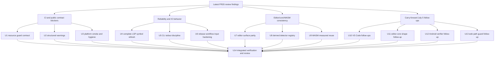

# PR20 CI and Contract Closure - Plan

## Goal Capsule

| Field | Value |
|---|---|
| Objective | Close the latest PR #20 review findings by restoring CI, making public parse and lint contracts explicit, carrying forward unresolved July 5 follow-up fixes, and removing reliability and performance traps across LSP, CLI, editor, release, core, and WASM surfaces. |
| Authority | The 2026-07-05 PR #20 review findings, current branch `feat/editor-core-language-intelligence`, repository AGENTS instructions, existing PR20 hardening plans, and checked-in tests/workflows. |
| Execution profile | Deep cross-surface refactor on the current PR branch. Behavior-bearing work should use proof-first or characterization-first tests when practical; platform and workflow work should use compile, smoke, or contract tests. |
| Stop conditions | Stop only if implementation reveals a product-scope conflict, a public API decision that contradicts maintainer intent, or platform tooling is unavailable for a safety-critical proof with no CI-bound replacement. |
| Tail ownership | The active Codex goal session owns implementation, focused verification, read-only review, logical commits, and PR-branch push. It must not push or rewrite `main` from this session. |

---

## Product Contract

### Summary

This plan turns the latest PR #20 review and still-relevant July 5 follow-up work into an executable closure pass.
It prioritizes current CI failures and public contract regressions before broader reliability, editor, and cleanup work.

### Problem Frame

PR #20 now exposes editor-language intelligence across Rust core, analysis, LSP, CLI, WASM, VS Code, playground, and platform smoke tests.
The current branch has several failures that are not cosmetic: analyzer and CLI disagree about whether resource limit diagnostics are configurable, block/gitGraph parse output changed a public JSON field while tests hide the new structure, Apple and Android smoke builds fail, and `git diff --check` is blocked by plan-file whitespace.
Additional review findings show first-request LSP workspace symbols can omit documents, CLI text output can panic on closed stdout, release workflows interpolate untrusted inputs inside shell scripts, and editor/runtime helpers carry duplicated or stale contracts.

### Requirements

**CI blockers and public contracts**

- R1. Resource limit diagnostics must be hard guards: not disableable, not severity-overridable, not listed as configurable, and rejected consistently by analysis JSON config and CLI argument parsing.
- R2. Parse JSON for block and gitGraph warning diagnostics must expose structured `warningFacts` without hiding it in snapshot normalization, while keeping a compatibility `warnings` string array unless implementation proves the breaking change is intentional and covered.
- R3. Apple smoke code must compile by using non-capturing C callbacks or user-data state, and must keep the reentry/lifecycle smoke coverage that PR #20 added.
- R4. Android instrumentation smoke code must compile by placing Kotlin example sources in the source set Gradle actually compiles or by configuring the Kotlin source set explicitly.
- R5. Repository hygiene must satisfy whitespace checks, including the known trailing blank line in the prior PR20 follow-up plan.

**Reliability and IO behavior**

- R6. LSP `workspace/symbol` must not silently omit open documents just because more than the snapshot budget are missing; it must complete bounded refresh batches until all eligible documents are current or the request is stale/cancelled.
- R7. CLI text output for `lint` and `lint-rules` must use the shared stdout writer path so closed stdout maps to the existing broken-pipe error behavior instead of panicking through `println!`.
- R8. Release workflows must move user-controlled workflow inputs into validated environment variables before shell use and must preserve safe `GITHUB_OUTPUT` writing for versions, tags, and source refs.

**Editor, core, and WASM consistency**

- R9. Browser playground semantic token encoding must use the same legend that the language service advertises, not a stale static legend when the service legend changes.
- R10. VS Code lint defaults and preview-source scanning must align with repository lint-profile policy and Markdown/Mermaid source extraction semantics; authoring-only diagnostics must be opt-in unless a checked-in ADR or product source says otherwise.
- R11. Core detector tiny-profile facts and fast keywords must be derived from the full detector registry by profile metadata instead of maintained as a duplicated hand-written table.
- R12. WASM editor queries must avoid measured repeated parsing in current editor flows; a new exported session API is allowed only after instrumentation proves same-source repeated workspace construction is material, otherwise the fix should stay internal or be deferred.
- R13. Every behavior-bearing fix must carry focused tests, smoke coverage, or an explicit local-tooling limitation with replacement evidence.

**Carry-forward closure**

- R14. Still-relevant units from the July 5 PR20 follow-up plans must be idempotency-checked against the current tree and either verified as already implemented or completed with tests: VS Code activation/trust/settings validation, EOF fence diagnostics, shape-completion braces, Android AAR public-class verification, and web package symlink/junction path guards.

### Acceptance Examples

- AE1. Passing `--disable-rule merman.resource.source_bytes_exceeded` or `--rule-severity merman.resource.source_bytes_exceeded=hint` fails validation in CLI and JSON config before analysis runs, matching analysis-layer tests that resource diagnostics are hard guards.
- AE2. A block or gitGraph parse payload with warnings contains `warningFacts` objects and a compatibility `warnings` string list; snapshots fail if structured facts are accidentally removed.
- AE3. A workspace-symbol request over more than thirty-two uncached open Mermaid documents returns symbols from the later documents on the first request when the documents remain current.
- AE4. Piping `merman lint-rules` or text-format `merman lint` into a closed stdout consumer exits through the same broken-pipe handling already covered by render/parse/completion tests.
- AE5. A release workflow run with a malicious-looking `version` or `source_ref` input is rejected by validation before the value reaches shell evaluation.
- AE6. A playground semantic-token response encoded with a service-provided legend decodes to the advertised token types rather than the compile-time static legend.
- AE7. Repeated WASM editor-language calls against one document either reuse a proven internal cache/session or produce instrumentation showing a public session API is not justified in this PR.
- AE8. If the July 5 follow-up fixes are already present, their focused tests prove the behavior; otherwise the branch gains tests proving VS Code activation survives language-server startup failure, invalid VS Code analysis settings are sanitized, EOF fence diagnostics include the final line, shape completion does not duplicate braces, Android AAR verification includes text-measure wrapper classes, and web package scripts reject symlink/junction escapes.

### Scope Boundaries

- In scope: all latest review findings listed in this plan, unresolved July 5 PR20 follow-up items, adjacent tests needed to prove them, deletion of obsolete normalization or duplicated registries, and logical conventional commits on the PR branch.
- In scope: breaking unreleased PR #20 internals where the new contract is clearer, but public parse/CLI surfaces should prefer additive compatibility when it costs little.
- In scope: read-only subagent review after implementation and pushing `feat/editor-core-language-intelligence` when local verification is credible.
- Out of scope: merging PR #20 to `main`, pushing `main`, publishing packages, broad Mermaid visual baseline refresh unrelated to these defects, or replacing the LSP architecture beyond the symbol-refresh contract needed here.

#### Deferred to Follow-Up Work

- A generated cross-language Markdown fence/source-extraction library if parity tests can close the immediate VS Code versus analysis drift without introducing a new generator in this PR.
- A full external security audit of all release workflows; this plan hardens the workflows touched by PR #20 and any matching unsafe interpolation pattern already present in release workflow scripts.

---

## Planning Contract

### Assumptions

- The user has already authorized proceeding without a separate scoping confirmation and asked for goal-mode execution after planning.
- The active checkout remains `feat/editor-core-language-intelligence`; implementation continues there unless the user redirects.
- No external web research is load-bearing because every finding is grounded in checked-in source, tests, workflows, or CI output from PR #20.
- Platform-specific gates may be unavailable locally. If so, implementation must add deterministic contract tests and record the exact unavailable tool rather than treating compile-only evidence as enough for safety-critical paths.
- Codex subagents share the same checkout in this environment, so implementation subagents should be used for read-only review or carefully serialized/disjoint edit units unless isolation is known.

### Key Technical Decisions

- KTD1. Resource diagnostics are policy guards, not lint preferences. They stay outside the configurable rule catalog, and any attempt to disable or override them fails validation instead of being accepted and ignored.
- KTD2. Structured warning facts are the canonical semantic output. Compatibility `warnings` strings can remain as an alias, but snapshot and xtask normalization must not erase `warningFacts` because that hides the contract being added.
- KTD3. Platform smoke fixes should repair source-set and callback semantics, not skip the smoke. Android and Apple smoke failures are compile-time signals that host examples no longer match the public binding API.
- KTD4. LSP symbol completeness beats silent budget drops, but refresh must have cancellation and request-budget checkpoints. If the implementation cannot complete all current open-document snapshots within that budget, it must use an explicit partial-result/background-refresh path or return a documented request error instead of silently omitting documents.
- KTD5. Text output goes through shared IO helpers. The CLI already has broken-pipe handling, so lint and lint-rules should reuse it instead of creating a second stdout behavior through `println!`.
- KTD6. Release workflow inputs are data until validated. Release workflows should validate `source_ref` before checkout, consume validated environment variables in shell, reject invalid semver/tag/ref values before use, and keep publish-capable credentials out of build/verify jobs where possible.
- KTD7. Editor contracts use advertised runtime metadata. Semantic token encoding, lint profile defaults, and Markdown fence scanning should follow the service/analysis contract rather than stale static copies.
- KTD8. Registry subsets are derived, not duplicated. Tiny detector facts and fast-keyword lists should flow from the full detector registry with profile metadata so adding a detector cannot desync the tiny profile.
- KTD9. WASM editor performance is measurement-gated. Instrument repeated same-source editor calls first; add an exported session boundary only if current editor flows show material repeated parsing, otherwise use a smaller internal cache or defer the public API.

### Priority Analysis

| Priority | Units | Rationale |
|---|---|---|
| CI and contract blockers | U1, U2, U3 | These directly explain current failing checks or public parse/analysis contract regressions. |
| Runtime reliability | U4, U5, U6 | These prevent silent LSP omissions, CLI panics, and unsafe release shell behavior. |
| Editor and API consistency | U7, U8, U9 | These reduce drift across playground, VS Code, core detector metadata, and WASM editor APIs. |
| Carry-forward completeness | U10, U11, U12, U13 | Still-relevant July 5 fixes should not remain stranded in older plans when this goal claims PR20 closure. |
| Tail quality | U14 | The final integrated branch needs review, focused gates, commits, and PR-branch push without touching `main`. |

### High-Level Technical Design

The dependency shape keeps the branch greenest first.
U1, U2, and U3 should land before broad editor/performance work because they remove CI blockers and prevent public contract drift from being hidden by tests.

### System-Wide Impact

The plan touches public JSON output, CLI validation, analysis JSON configuration, LSP request behavior, platform binding examples, release automation, TypeScript editor consumers, and WASM editor APIs.
Review must check downstream-facing compatibility for parse payloads, CLI rule IDs, TypeScript exports, and platform examples.
The largest integration risk is that multiple units may touch analysis rule metadata and editor semantic-token contracts; serialize those edits if implementation reveals shared types or snapshot goldens overlap.

### Risks and Mitigations

| Risk | Mitigation |
|---|---|
| Preserving both `warnings` and `warningFacts` could duplicate data and confuse snapshots. | Make `warningFacts` canonical, keep `warnings` as a compatibility alias, and assert both explicitly in parse/snapshot tests. |
| Resource-rule CLI behavior changes tests that previously expected disable/override success. | Reframe CLI tests around rejected configuration or hard-guard behavior and keep analyzer tests as the source of truth. |
| LSP all-document refresh could hurt large-workspace latency. | Batch refreshes, check staleness/cancellation between batches, and test both completeness and stale-document avoidance. |
| Release workflow hardening can break legitimate manual release refs. | Validate source refs before checkout, document accepted protected-branch or matching release-tag forms in workflow help or test fixtures, and minimize publish-capable permissions by job. |
| WASM reuse work can add an unnecessary public API. | Measure repeated parse cost first, prefer internal caching when sufficient, and export a session handle only when current editor flows justify it. |

### Sources and Research

- Current code anchors from the review: `crates/merman-core/src/diagrams/block.rs`, `crates/merman-core/src/diagrams/git_graph.rs`, `crates/merman-core/tests/snapshots.rs`, `crates/xtask/src/cmd/snapshots.rs`, `crates/merman-analysis/src/analyzer.rs`, `crates/merman-analysis/src/rules.rs`, `crates/merman-cli/tests/cli_compat.rs`, `crates/merman-lsp/src/server.rs`, `crates/merman-lsp/src/document_store.rs`, `platforms/apple/examples/smoke/Sources/MermanAppleSmoke/main.swift`, `platforms/android/build.gradle.kts`, `platforms/android/src/androidTest/kotlin/io/merman/MermanInstrumentedSmokeTest.kt`, `.github/workflows/release-preflight.yml`, `playground/src/lib/mermaid-language.ts`, `tools/vscode-extension/src/preview-source.ts`, `crates/merman-core/src/family.rs`, and `crates/merman-wasm/src/lib.rs`.
- Existing PR20 plans: `docs/plans/2026-07-04-005-refactor-pr20-post-review-refactor-plan.md` and `docs/plans/2026-07-05-002-refactor-pr20-subagent-followups-plan.md`.
- ADRs that shape this plan: `docs/adr/0070-diagnostics-first-analysis-contract.md`, `docs/adr/0072-lint-rule-governance.md`, `docs/adr/0006-feature-flags-tiny-vs-full.md`, and `docs/adr/0012-tiny-scope.md`.
- Repository guidance in `AGENTS.md`, especially Rust `nextest`, `cargo fmt`, precise staging, no destructive reset/restore/stash/clean, and Mermaid parity by source-backed semantic convergence.

---

## Implementation Units

| Unit | Title | Primary files | Depends on |
|---|---|---|---|
| U1 | Make resource limit rules non-configurable end to end | `crates/merman-analysis/src/rules.rs`, `crates/merman-cli/tests/cli_compat.rs` | None |
| U2 | Preserve structured warning facts in parse output and snapshots | `crates/merman-core/src/diagrams/block.rs`, `crates/merman-core/src/diagrams/git_graph.rs`, `crates/merman-core/tests/snapshots.rs` | None |
| U3 | Repair platform smoke compile blockers and diff hygiene | `platforms/apple`, `platforms/android`, `docs/plans/2026-07-05-002-refactor-pr20-subagent-followups-plan.md` | None |
| U4 | Complete LSP workspace-symbol snapshot refresh | `crates/merman-lsp/src/server.rs`, `crates/merman-lsp/src/document_store.rs` | None |
| U5 | Route CLI lint text output through shared stdout handling | `crates/merman-cli/src/commands.rs`, `crates/merman-cli/tests/cli_compat.rs` | None |
| U6 | Harden release workflow shell input handling | `.github/workflows/release-*.yml`, `scripts` workflow tests | None |
| U7 | Align editor surface contracts | `playground/src/lib/mermaid-language.ts`, `tools/vscode-extension/src/preview-source.ts`, `tools/vscode-extension/package.json` | U1 if lint defaults reuse rule catalog |
| U8 | Derive tiny detector facts from the full registry | `crates/merman-core/src/family.rs` | None |
| U9 | Gate WASM editor reuse on measured reparse cost | `crates/merman-wasm/src/lib.rs`, web/playground consumers | U7 if TypeScript API wrappers change |
| U10 | Close VS Code follow-up gaps | `tools/vscode-extension` | U1 if lint settings reuse the rule contract; U7 for preview-source parity |
| U11 | Close editor-core shape completion follow-up | `crates/merman-editor-core` | None |
| U12 | Close Android AAR verification follow-up | `scripts/verify-platform-bindings.py` | U3 if Android source-set fixes affect verifier fixtures |
| U13 | Close web package path guard follow-up | `platforms/web/scripts` | None |
| U14 | Integrated verification, read-only review, commit, and PR-branch push | All changed files | U1-U13 |

### U1. Make Resource Limit Rules Non-Configurable End To End

- **Goal:** Resolve analyzer/CLI contract drift so resource limit diagnostics are hard guards everywhere.
- **Requirements:** R1, R13; covers AE1.
- **Dependencies:** None.
- **Files:** `crates/merman-analysis/src/rules.rs`, `crates/merman-analysis/src/analyzer.rs`, `crates/merman-analysis/src/options_json.rs`, `crates/merman-analysis/src/analyzer/tests.rs`, `crates/merman-cli/src/cli.rs`, `crates/merman-cli/src/commands.rs`, `crates/merman-cli/tests/cli_compat.rs`.
- **Approach:** Introduce or reuse a single `RuleDescriptor` configurability predicate that excludes internal and resource categories. Use it for catalog entries, configurable descriptor lookup, JSON config validation, and CLI parsers. Keep analyzer resource diagnostics on default error severity and ignore rule config for the resource guard path.
- **Execution note:** Start with the existing analyzer tests as the authority, then change CLI tests that currently assert resource disable/override success to assert rejection or unchanged hard-guard behavior.
- **Patterns to follow:** Existing configurable rule tests in `crates/merman-analysis/src/rules.rs`, CLI argument parser validation in `crates/merman-cli/src/cli.rs`, and analyzer resource guard tests in `crates/merman-analysis/src/analyzer/tests.rs`.
- **Test scenarios:** `configurable_rule_catalog` and `lint-rules --configurable` exclude `merman.resource.source_bytes_exceeded`. CLI rejects `--disable-rule merman.resource.source_bytes_exceeded` with a validation error. CLI rejects `--rule-severity merman.resource.source_bytes_exceeded=hint` with a validation error. JSON config `lint.disable_rules` and `lint.rule_severities` reject the resource rule id. Analyzer resource-limit tests prove the diagnostic still emits at default error severity when the source exceeds the configured limit. Source-lint and semantic warning rules remain configurable.
- **Verification:** Analysis unit tests and CLI compatibility tests prove one contract across rule catalog, JSON config, CLI parsing, and analyzer output.

### U2. Preserve Structured Warning Facts In Parse Output And Snapshots

- **Goal:** Make structured warning facts visible in public parse JSON and golden snapshots without breaking old `warnings` consumers unnecessarily.
- **Requirements:** R2, R13; covers AE2.
- **Dependencies:** None.
- **Files:** `crates/merman-core/src/diagrams/block.rs`, `crates/merman-core/src/diagrams/git_graph.rs`, `crates/merman-core/tests/snapshots.rs`, `crates/xtask/src/cmd/snapshots.rs`, relevant `fixtures/block/*.golden.json`, relevant `fixtures/git_graph/*.golden.json`, parse CLI/API tests if they assert payload shape.
- **Approach:** Keep `warningFacts` as the canonical field for structured diagnostics and add a compatibility `warnings` string array for block and gitGraph model output if missing today. Remove snapshot/xtask normalization that deletes `warningFacts` and regenerate or update the affected goldens so structured warning objects are tested directly.
- **Execution note:** Characterize the current hidden behavior by making a snapshot or parse test fail when `warningFacts` is stripped before changing normalization.
- **Patterns to follow:** Flowchart warning fact output, existing block/gitGraph warning tests, and narrow comparator-normalization guidance in `AGENTS.md`.
- **Test scenarios:** Block width warning parse output includes a structured fact with rule id, message, span/fix span when available, and a matching compatibility warning string. GitGraph duplicate commit warning exposes the same pair. Snapshot tests fail if `warningFacts` is removed. Snapshot refresh tooling preserves both fields and does not downgrade structured data to strings. No-warning diagrams omit or empty both fields consistently with existing model conventions.
- **Verification:** Core snapshot tests and focused block/gitGraph unit tests prove structured facts survive parse, snapshot normalization, and xtask refresh paths.

### U3. Repair Platform Smoke Compile Blockers And Diff Hygiene

- **Goal:** Restore Apple smoke, Android instrumentation, and whitespace hygiene so platform CI and `git diff --check` can run cleanly.
- **Requirements:** R3, R4, R5, R13.
- **Dependencies:** None.
- **Files:** `platforms/apple/examples/smoke/Sources/MermanAppleSmoke/main.swift`, `platforms/android/build.gradle.kts`, `platforms/android/examples/MermanSmoke.kt`, `platforms/android/src/androidTest/kotlin/io/merman/MermanInstrumentedSmokeTest.kt`, `docs/plans/2026-07-05-002-refactor-pr20-subagent-followups-plan.md`.
- **Approach:** Move Apple C callback logic into non-capturing file-level or static callbacks and pass state through callback user data or a minimal test-owned global only when the FFI shape requires it. Move Android smoke helper code into `src/androidTest/kotlin` or explicitly configure the Kotlin androidTest source set so the test import resolves. Remove the trailing whitespace/blank-line diff-check offender from the prior plan file.
- **Execution note:** Prefer compile/smoke proof over deleting the smoke. These checks exist to catch host API drift.
- **Patterns to follow:** Existing non-capturing Swift callback around the first smoke callback, Android instrumentation test layout, and repo hygiene expectations from previous PR20 plans.
- **Test scenarios:** Swift smoke compiles with the lifecycle callback registered and no closure-captures-context error. Android instrumentation test compiles and resolves `runMermanSmoke` from the androidTest source set. Android build file no longer relies on a Java-only source-set hook for Kotlin sources unless confirmed by Gradle plugin behavior. `git diff --check origin/main...HEAD` no longer reports the prior plan file.
- **Verification:** Apple smoke and Android instrumentation compile paths pass locally, through a CI-equivalent command, or on pushed-branch CI; otherwise U3 remains blocked with the exact unavailable toolchain or SDK condition. Diff-check is clean.

### U4. Complete LSP Workspace-Symbol Snapshot Refresh

- **Goal:** Ensure workspace-symbol results include all current open documents instead of silently dropping documents beyond the snapshot refresh budget.
- **Requirements:** R6, R13; covers AE3.
- **Dependencies:** None.
- **Files:** `crates/merman-lsp/src/server.rs`, `crates/merman-lsp/src/document_store.rs`, `crates/merman-lsp/tests` or existing LSP server smoke tests, `crates/merman-editor-core/tests/document_workspace.rs` if snapshot planning helpers are shared.
- **Approach:** Replace the ignored `skipped_missing_snapshots` path with a loop that processes missing snapshots in bounded batches, checks document generation/staleness after each batch, and stops only when no eligible current document remains missing, cancellation/staleness invalidates the request, or an explicit request budget is exhausted. If the budget is exhausted, use an LSP partial-result/background-refresh path when available; otherwise return a documented request error rather than a successful response that silently omits documents.
- **Execution note:** Start with a failing test using more than the current snapshot budget of uncached open documents and assert a symbol from the last document is returned on the first request.
- **Patterns to follow:** Existing LSP server tests, document-store snapshot generation checks, and prior stale-diagnostics hardening in PR20 plans.
- **Test scenarios:** Workspace symbols for thirty-three or more uncached open documents include symbols from the final document when the request budget is not exhausted. Documents already cached are not rebuilt unnecessarily. If a document changes while refresh is in progress, stale symbols from the old generation are excluded. If the current request path supports cancellation, cancellation prevents additional batch work and returns no stale results. When the request budget is exhausted, the response uses explicit partial-result/background-refresh signaling or a documented request error, not a successful silently incomplete symbol list. Batch size stays bounded so one request does not perform an unbounded synchronous rebuild without checkpoints.
- **Verification:** Focused LSP tests prove completeness beyond the budget, stale-generation safety, and no silent `_skipped_missing_snapshots` discard remains.

### U5. Route CLI Lint Text Output Through Shared Stdout Handling

- **Goal:** Make `lint` and `lint-rules` text output honor the CLI's broken-stdout contract.
- **Requirements:** R7, R13; covers AE4.
- **Dependencies:** None.
- **Files:** `crates/merman-cli/src/commands.rs`, `crates/merman-cli/src/io.rs`, `crates/merman-cli/tests/cli_compat.rs`.
- **Approach:** Change text-printing helpers to return `CliResult` and write through existing stdout helper APIs or a buffered writer that maps `BrokenPipe` to the established CLI error. Avoid `println!` in command paths that can be piped.
- **Execution note:** Add closed-stdout tests for text `lint` and text `lint-rules` before replacing the print helpers.
- **Patterns to follow:** Existing closed-stdout tests for render, parse, and completion plus `crates/merman-cli/src/io.rs`.
- **Test scenarios:** `lint-rules` text output to closed stdout exits through `CliError::BrokenStdoutPipe`. `lint` text output with at least one diagnostic to closed stdout follows the same behavior. JSON output paths still produce valid JSON when stdout is open. Normal terminal text output remains unchanged.
- **Verification:** CLI compatibility tests cover both new broken-pipe paths and existing render/parse/completion broken-pipe behavior still passes.

### U6. Harden Release Workflow Shell Input Handling

- **Goal:** Remove direct shell interpolation of workflow inputs and validate release values before use.
- **Requirements:** R8, R13; covers AE5.
- **Dependencies:** None.
- **Files:** `.github/workflows/release-preflight.yml`, `.github/workflows/release-web.yml`, `.github/workflows/release-crates.yml`, `.github/workflows/release-python.yml`, `scripts/test_workflow_path_filters.py`, release workflow validation scripts if present.
- **Approach:** Validate release source refs before `actions/checkout`, either through a protected-branch/release-tag expression gate or a preflight job whose validated output feeds checkout. Move workflow inputs such as version and validated source ref into `env` entries for shell steps, validate them with strict SemVer/tag/ref rules, and use safe quoted variables after validation. Keep `GITHUB_OUTPUT` writes line-oriented and avoid embedding untrusted input in shell syntax. Split or narrow job permissions so build/verify jobs avoid publish-capable credentials where workflow structure permits.
- **Execution note:** Treat this as security-sensitive workflow work. Add or extend workflow text tests so the unsafe interpolation pattern cannot reappear in release workflows.
- **Patterns to follow:** Existing workflow path-filter tests and release validation scripts.
- **Test scenarios:** Release preflight rejects invalid versions before any release script action. Source refs accept documented safe protected-branch or release-tag forms and reject shell metacharacter payloads before checkout. Workflow files no longer contain direct `${{ inputs.* }}` interpolation inside `run` scripts for the validated values, and release workflows no longer pass `ref: ${{ inputs.source_ref }}` directly to checkout. `GITHUB_OUTPUT` writes still expose the expected output names. Build/verify jobs do not carry publish-capable permissions unless the workflow cannot be split safely and the exception is documented. Existing release path filters still match the files these workflows consume.
- **Verification:** Workflow unit/text tests pass and review confirms no remaining unsafe release input interpolation in the release workflows touched by this plan.

### U7. Align Editor Surface Contracts

- **Goal:** Remove stale editor-language contract copies across playground and VS Code.
- **Requirements:** R9, R10, R13; covers AE6.
- **Dependencies:** U1 if VS Code lint defaults need rule-catalog confirmation.
- **Files:** `playground/src/lib/mermaid-language.ts`, `playground` tests for semantic tokens, `tools/vscode-extension/package.json`, `tools/vscode-extension/src/config.ts`, `tools/vscode-extension/src/preview-source.ts`, `tools/vscode-extension/src/test/preview-source.test.ts`, `tools/vscode-extension/src/test/analysis-settings.test.ts`.
- **Approach:** Encode semantic tokens against the same legend returned by the language service. Audit VS Code lint profile defaults against checked-in ADR/docs; if no explicit host override exists, default the extension to core correctness and make authoring/recommended hints opt-in. Add parity fixtures for Mermaid fence extraction so the VS Code preview scanner follows the same source-boundary behavior expected by analysis.
- **Execution note:** Start with focused tests that fail under a service legend that differs from the static legend, and a Markdown fence case where preview-source behavior diverges from analysis expectations.
- **Patterns to follow:** Existing editor-core semantic token tests, VS Code preview-source tests, and analysis settings validation tests.
- **Test scenarios:** Playground semantic-token encoding decodes correctly when the service legend is reordered or extended. VS Code default lint profile matches the repository's policy source; recommended/authoring diagnostics require explicit config if the policy says they are opt-in. Mermaid fences closed at EOF, nested in Markdown/MDX, or preceded by other code fences produce source ranges and diagnostic ranges matching the analysis-facing fixture expectations. Existing preview behavior for normal closed fences remains unchanged.
- **Verification:** Playground and VS Code focused tests prove legend parity, lint default policy, and preview-source extraction behavior.

### U8. Derive Tiny Detector Facts From The Full Registry

- **Goal:** Remove duplicated detector metadata that can drift between full and tiny diagram detection profiles.
- **Requirements:** R11, R13.
- **Dependencies:** None.
- **Files:** `crates/merman-core/src/family.rs`, `crates/merman-core` detection tests.
- **Approach:** Add profile metadata to the full detector facts or a small registry builder and derive tiny detector facts plus fast-keyword lookup from that source. Delete the hand-maintained `DETECTOR_FACTS_TINY` table once tests prove the derived subset matches the intended profile.
- **Execution note:** Characterize the current tiny profile before refactoring so the derived table preserves intentional exclusions.
- **Patterns to follow:** Existing family detection tests and the source-backed Mermaid parity principle from `AGENTS.md`.
- **Test scenarios:** Tiny profile detects every family it intentionally supports today. Full-only families remain excluded from tiny profile. Fast keyword detection for tiny and full profiles stays consistent with their derived detector facts. Adding a detector fact in one place is enough for the correct profile metadata to include or exclude it.
- **Verification:** Core family tests pass and no duplicated tiny detector table remains.

### U9. Gate WASM Editor Reuse On Measured Reparse Cost

- **Goal:** Remove repeated WASM editor-language parsing only when current callers demonstrate a material same-source reparse cost.
- **Requirements:** R12, R13; covers AE7.
- **Dependencies:** U7 if TypeScript wrappers or exported contracts need synchronized changes.
- **Files:** `crates/merman-wasm/src/lib.rs`, WASM tests, `platforms/web/src/index.ts`, `playground/src/lib/wasm-loader.ts`, related TypeScript contract tests.
- **Approach:** Add instrumentation or a benchmark-style test that counts parse/workspace construction for repeated same-source calls in the current web/playground editor flow. If it shows material repeated parsing, add the smallest reusable session or internal cache that preserves stateless API compatibility. Export a new public session handle only if internal caching cannot solve the measured path cleanly. If instrumentation does not show material cost, document the result in the unit evidence and defer public API work.
- **Execution note:** Measurement comes before API design. Do not add a public session handle only because it is architecturally tidy.
- **Patterns to follow:** Existing WASM editor-language API wrappers, editor-core `DocumentWorkspace` tests, and web public export conventions.
- **Test scenarios:** Instrumentation proves whether repeated diagnostics and semantic-token calls on the same source rebuild the workspace. If a cache/session is implemented, repeated calls reuse the same parsed workspace, source updates invalidate cached state, cleanup releases resources, and existing stateless functions return the same results as the reuse path. If no material repeated parse cost is found, tests capture that evidence and no new exported API is introduced.
- **Verification:** WASM/Rust and TypeScript contract tests prove either measured reuse with invalidation and stateless compatibility, or measured non-need with public API work deferred.

### U10. Close VS Code Follow-Up Gaps

- **Goal:** Idempotency-check and complete the VS Code carry-forward items from the July 5 follow-up plans.
- **Requirements:** R10, R13, R14; covers AE8.
- **Dependencies:** U1 if lint/settings validation reuses the updated rule-config contract, U7 for preview-source parity fixtures.
- **Files:** `tools/vscode-extension/src/extension.ts`, `tools/vscode-extension/src/language-client-start.ts`, `tools/vscode-extension/package.json`, `tools/vscode-extension/src/config.ts`, `tools/vscode-extension/src/preview-source.ts`, `tools/vscode-extension/src/test/language-client-start.test.ts`, `tools/vscode-extension/src/test/analysis-settings.test.ts`, `tools/vscode-extension/src/test/preview-source.test.ts`, `tools/vscode-extension/src/test/binaries.test.ts`.
- **Approach:** Inspect existing VS Code tests first. Implement only missing behavior: activation must register non-LSP commands even when language-server startup fails, restart must not show false success after startup failure, Workspace Trust must declare limited support while runtime gates keep unsafe executable paths and server args blocked, analysis settings must be schema-validated and runtime-normalized before LSP serialization, and EOF Mermaid fences must retain final-line diagnostic ranges.
- **Execution note:** Strengthen existing VS Code tests instead of adding duplicate coverage when a test already owns the behavior.
- **Patterns to follow:** `docs/plans/2026-07-05-001-pr20-hardening-and-vscode-settings-plan.md`, `docs/plans/2026-07-05-002-refactor-pr20-subagent-followups-plan.md`, existing language-client startup tests, analysis-settings tests, and preview-source tests.
- **Test scenarios:** Extension activation completes and commands remain registered when language-server startup throws. Restart/configuration-change paths report failure and never show a success notification after failed start. Workspace Trust manifest declares limited support and tests prove unsafe execution settings remain blocked in untrusted workspaces. Fractional or out-of-range analysis settings are rejected or normalized before LSP config serialization. EOF Mermaid fences include the final content line in diagnostic ranges without regressing normal closed fences.
- **Verification:** Focused VS Code tests prove each VS Code carry-forward item is implemented or already present.

### U11. Close Editor-Core Shape Completion Follow-Up

- **Goal:** Idempotency-check and complete the editor-core shape-completion brace fixes from the July 5 follow-up plans.
- **Requirements:** R13, R14; covers AE8.
- **Dependencies:** None.
- **Files:** `crates/merman-editor-core/src/context.rs`, `crates/merman-editor-core/tests/completion.rs`, any local completion helper files implementation discovers.
- **Approach:** Keep shape-completion brace decisions bounded to the active diagram or Markdown fence body. Avoid appending a closing brace when one already follows the cursor and avoid using host-document tail text outside the active diagram as missing-brace evidence.
- **Execution note:** Add or strengthen completion tests before changing completion insertion logic.
- **Patterns to follow:** Existing editor-core completion tests and parser-backed expected-span behavior.
- **Test scenarios:** Shape completion does not append `}` when one already follows the cursor. Markdown fenced diagrams use the fence body boundary rather than the host document tail. Inline shape values still get the missing brace when the active body needs it. Existing non-shape completions remain unchanged.
- **Verification:** `merman-editor-core` completion tests prove the brace behavior and no duplicate completion edit is emitted.

### U12. Close Android AAR Verification Follow-Up

- **Goal:** Idempotency-check and complete Android public wrapper verification for text-measure request/result classes.
- **Requirements:** R13, R14; covers AE8.
- **Dependencies:** U3 if Android source-set fixes affect verifier fixtures.
- **Files:** `scripts/verify-platform-bindings.py`, `scripts/test_verify_platform_bindings.py`, Android wrapper source or fixture manifests used by the verifier.
- **Approach:** Extend the existing platform-binding verifier so the Android AAR public surface includes every public Kotlin wrapper class required by the runtime callback API, including text-measure request/result classes. Keep the verifier source-backed rather than a stale free-form list when generated metadata exists.
- **Execution note:** Start with a missing-class fixture that fails the verifier, then add the expected public wrapper requirements.
- **Patterns to follow:** Existing `verify-platform-bindings.py` verifier structure and `scripts/test_verify_platform_bindings.py`.
- **Test scenarios:** Verifier fails when a text-measure request wrapper class is missing. Verifier fails when a text-measure result wrapper class is missing. Verifier passes when all expected public wrapper classes exist. Existing positive Android AAR verification remains valid.
- **Verification:** Python verifier tests prove missing-class failures and positive reports.

### U13. Close Web Package Path Guard Follow-Up

- **Goal:** Idempotency-check and complete web package symlink/junction guard behavior from the July 5 follow-up plans.
- **Requirements:** R13, R14; covers AE8.
- **Dependencies:** None.
- **Files:** `platforms/web/scripts/arg-parse.mjs`, `platforms/web/scripts/arg-parse.test.mjs`, any web package script helpers that resolve `pkg` output paths.
- **Approach:** Reject existing symlink or junction path components under `platforms/web/pkg` before build, clean, pack, or test operations write or delete through them. Preserve first-build behavior where the final `pkg` path does not exist yet.
- **Execution note:** Keep filesystem tests deterministic and skip only OS-specific symlink/junction creation that the local platform cannot perform.
- **Patterns to follow:** Existing web script argument parsing tests and repo path-containment helpers.
- **Test scenarios:** Existing symlink path component under `pkg` is rejected before write/delete. Existing Windows junction path component is rejected when the platform can create one. Non-existent first-build `pkg` path is allowed. Normal in-tree package paths still pass.
- **Verification:** Web package script tests prove symlink/junction rejection and first-build allowance.

### U14. Integrated Verification, Read-Only Review, Commit, And PR-Branch Push

- **Goal:** Prove the integrated branch after U1-U13, resolve review findings, and publish the PR branch without touching `main`.
- **Requirements:** R1-R14.
- **Dependencies:** U1, U2, U3, U4, U5, U6, U7, U8, U9, U10, U11, U12, U13.
- **Files:** All changed files plus any generated snapshots, docs, or workflow test fixtures required by earlier units.
- **Approach:** Run focused tests after each unit, then run the verification contract for the integrated branch. Use read-only subagents for final review across Rust, platform, workflow, and editor surfaces. Stage only files changed for this work, create logical conventional commits, and push `feat/editor-core-language-intelligence` to its remote branch when verification is credible.
- **Execution note:** Do not mark the goal complete on a review-only pass. The final branch must be locally verified, committed, and pushed. Apple and Android compile blockers are done only when the exact local gate, a CI-equivalent compile command, or a pushed-branch CI result passes; if none can run, report the affected unit as blocked rather than closed with vague replacement evidence.
- **Patterns to follow:** Existing PR20 hardening commit style, precise staging guidance, and no destructive git operations from `AGENTS.md`.
- **Test scenarios:** No unresolved actionable P0/P1/P2 review finding remains. The final diff does not include dead experimental code, hidden snapshot normalization, or transient process files. `main` is not checked out, rewritten, or pushed. The branch status is clean or contains only explicitly reported local-only artifacts.
- **Verification:** Final gates pass or unavailable gates are reported with exact blockers and replacement evidence; read-only review finds no remaining actionable high-priority issue; commits and PR-branch push complete.

---

## Verification Contract

| Gate | Applies to | Done signal |
|---|---|---|
| `cargo fmt --all --check` | Rust changes | Formatting is clean for touched Rust crates. |
| `cargo nextest run -p merman-analysis --cargo-quiet` | U1 | Analyzer rule-config and resource-guard tests pass. |
| `cargo nextest run -p merman-cli --test cli_compat --cargo-quiet` | U1, U5 | CLI rule validation, lint output, lint-rules output, and broken-pipe tests pass. |
| `cargo nextest run -p merman-core --cargo-quiet` | U2, U8 | Warning facts, snapshots, and detector registry tests pass. |
| `cargo nextest run -p merman-lsp --cargo-quiet` | U4 | Workspace-symbol refresh tests pass for more than the old snapshot budget. |
| `cargo check -p merman-wasm --features editor-language` plus focused WASM tests | U9 | WASM repeated-parse instrumentation and any chosen cache/session path compile and pass. |
| VS Code extension test command in `tools/vscode-extension` | U7, U10 | Preview-source, settings, lint-profile, activation, trust, and EOF fence tests pass. |
| Playground semantic-token test command | U7 | Semantic token legend parity tests pass. |
| `cargo nextest run -p merman-editor-core --cargo-quiet` | U11 | Shape-completion brace and Markdown fence boundary tests pass. |
| Web package script tests under `platforms/web/scripts` | U13 | Symlink/junction path-guard tests pass. |
| `python -m unittest scripts/test_verify_platform_bindings.py` | U12 | Android AAR public wrapper verification covers text-measure classes. |
| Apple smoke build for `platforms/apple/examples/smoke` | U3 | Swift smoke compiles through the same callback path that CI exercises. |
| Android instrumentation compile/smoke gate | U3 | Android test source resolves `runMermanSmoke` through the same source set that CI compiles. |
| Python workflow tests such as `scripts/test_workflow_path_filters.py` and release validation tests | U6 | Workflow input hardening and path filters are covered. |
| Pushed-branch CI or CI-equivalent local platform commands | U3, U14 | Apple and Android compile blockers are confirmed fixed; if neither can run, the affected unit remains blocked. |
| `git diff --check origin/main...HEAD` | U3, U14 | No whitespace errors remain in the PR diff. |
| Final full read-only code review | U14 | No unresolved actionable P0/P1/P2 findings remain. |

### Evidence To Capture

- Red or characterization evidence for resource rule CLI rejection, warningFacts snapshot preservation, LSP symbol omission beyond the old budget, CLI broken-pipe output, unsafe release input interpolation, semantic-token legend drift, detector tiny-profile drift, and WASM repeated parse behavior where practical.
- Any platform verification that cannot run locally, including the exact missing toolchain, SDK, target, or emulator condition and the CI-equivalent command or pushed-branch CI result needed before the affected unit can be closed.
- Commit hashes for logical units or batches and final pushed branch state.

---

## Definition of Done

- Every R1-R14 requirement is satisfied by code, tests, docs/workflow changes, or an explicit deferred boundary in this plan.
- Current CI blockers from resource-rule contract drift, parse warningFacts normalization, Apple smoke compile, Android instrumentation compile, and diff-check hygiene are fixed. Apple and Android compile blockers require the exact local gate, a CI-equivalent compile command, or a pushed-branch CI result before they can be called done.
- No behavior-bearing unit relies on code review alone; each has focused tests, smoke coverage, or a recorded no-test exception with replacement verification.
- Obsolete normalization and duplicated detector metadata are deleted when their replacement is in place.
- Release workflow input hardening has regression coverage and no matching unsafe interpolation remains in the touched release workflows.
- The final diff is simplified after implementation, without dead experimental code or process-noise artifacts.
- A final read-only review finds no unresolved actionable P0/P1/P2 issues.
- Logical conventional commits are present, `feat/editor-core-language-intelligence` is pushed, and local `git status --short --branch` is clean or contains only intentionally untracked local artifacts not staged for commit.
