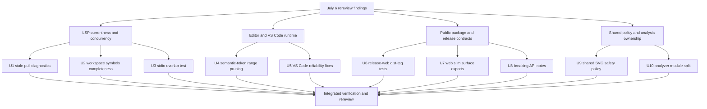

# PR20 Review Closure - Plan

## Goal Capsule

| Field | Value |
|---|---|
| Objective | Close the July 6 PR #20 rereview findings with root-cause fixes, structural cleanup, and contract tests across LSP, editor-core, VS Code, web packaging, analysis, release workflow, and public API documentation. |
| Authority | The July 6 rereview findings, current branch `feat/editor-core-language-intelligence`, repo instructions in `AGENTS.md`, current PR #20 source, and durable docs under `docs/lsp/`, `docs/adr/`, and `docs/knowledge/engineering/verification/`. |
| Execution profile | Deep cross-surface refactor on the current PR branch. Breaking changes are allowed for unreleased surfaces; proof-first or characterization-first tests should guard every behavior-bearing unit where practical. |
| Stop conditions | Stop only if implementation reveals a product-scope conflict, an external release/publish action would be required, or a platform gate cannot be replaced by a deterministic local/CI contract test. |
| Tail ownership | The active Codex goal owns implementation, focused verification, read-only review, incremental commits, and PR-branch push. It must not touch `main`, publish packages, or merge PR #20. |

---

## Product Contract

### Summary

PR #20's authoring stack is close to mergeable, but rereview found stale LSP responses, silent partial workspace symbols, unbounded range-token work, duplicated security policy, weak release tag tests, and public-surface ambiguity.
This plan fixes those issues at their owning boundaries rather than adding local patches: LSP owns currentness and request lifecycle, editor-core owns protocol-independent semantic-token pruning, shared security policy owns SVG sanitization, web surface generation owns subpath exports, and analysis modules own projection/recovery boundaries.

### Problem Frame

The branch adds editor intelligence across Rust core, `merman-analysis`, `merman-editor-core`, `merman-lsp`, VS Code, browser WASM packages, and release workflows.
Several rereview findings are correctness defects because clients can observe stale or incomplete results.
Other findings are architecture debt that would become public contract or security-maintenance debt if merged as-is.
The user has authorized fearless refactoring, breaking unreleased surfaces, and deleting obsolete code, so the right fix is to simplify the ownership graph and update tests to defend the new contracts.

### Requirements

**LSP correctness and protocol behavior**

- R1. `textDocument/diagnostic` must not return diagnostics computed for a stale document after a concurrent edit; stale commit checks must produce bounded recompute or the existing content-modified error.
- R2. `workspace/symbol` must not silently omit current open documents because snapshot refresh budget was exhausted; it must complete current open-document snapshots or fail/stale explicitly.
- R3. The real stdio LSP binary must be protected by an overlap/concurrency test that fails if handler concurrency regresses to serial request handling.

**Editor performance and VS Code reliability**

- R4. Range semantic-token requests must avoid converting semantic items whose absolute spans cannot overlap the requested line range, while preserving full-token and delta behavior.
- R5. VS Code preview invalidation must be idempotent while output is already stale, and server-backed commands must handle rejected LSP requests with user-visible failures instead of leaking raw promise rejections.

**Release and public package contracts**

- R6. `release-web` must have direct tests proving semver prerelease inputs map to `latest`, `alpha`, `beta`, and `rc` npm dist-tags.
- R7. Web slim subpaths must expose capability-specific exports rather than exporting unsupported wrappers that throw at runtime; docs, generator, contract checks, smoke tests, and changelog must agree.
- R8. The Rust `Error::DiagramParse` shape change may remain breaking, but the unreleased breaking change must be explicit in changelog/migration notes, and ABI version 2 must remain valid because it was not externally released.

**Maintainability and security policy ownership**

- R9. Web and VS Code SVG DOM safety must share one policy implementation with thin host wrappers; duplicated sanitizer source and parity-by-normalized-source checks should be removed.
- R10. `merman-analysis` must split analyzer orchestration from diagnostic projection, recovery merging, and support helpers without changing public analyzer behavior.
- R11. All behavior-bearing fixes must have focused tests or a deliberate replacement verification path, and obsolete tests or generated helpers that encode old contracts must be removed.

### Acceptance Examples

- AE1. When a pull-diagnostics request computes diagnostics for version 1 and version 2 arrives before state commit, the request does not return version-1 diagnostics.
- AE2. A first `workspace/symbol` request over more uncached open Mermaid documents than one refresh budget returns symbols from the later documents when the documents remain current.
- AE3. A stdio overlap test sends a long/blocking request and a lightweight request; the lightweight response arrives before the first request is unblocked.
- AE4. A range semantic-token request inside a large Markdown Mermaid fence returns only overlapping tokens and avoids creating tokens for out-of-range semantic items.
- AE5. Repeated document changes before the preview debounce window produce one stale webview invalidation, not one message per keystroke.
- AE6. `v1.2.3`, `v1.2.3-alpha.1`, `v1.2.3-beta.1`, and `v1.2.3-rc.1` produce `latest`, `alpha`, `beta`, and `rc` in `release-web` validation tests.
- AE7. Importing `@mermanjs/web/core` does not expose render/ascii/editor wrappers unsupported by the core preset; capability metadata remains available for discovery.
- AE8. A malicious SVG policy case fails identically through web and VS Code wrappers because both call the same shared sanitizer implementation.
- AE9. `Analyzer::analyze` and existing analysis tests pass after the file split, proving the refactor changed module ownership rather than behavior.
- AE10. Changelog or release documentation tells Rust callers that `Error::DiagramParse` now carries structured `ParseDiagnostic`.

### Scope Boundaries

- In scope: all July 6 rereview findings listed in this plan, adjacent contract tests, deletion of obsolete parity/generator/tests that preserve the old contract, focused docs/changelog updates, logical commits, rereview, and PR-branch push.
- In scope: breaking unreleased web subpath exports and Rust API notes when the new contract is clearer.
- Out of scope: merging PR #20, publishing crates/packages/extensions, broad Mermaid visual baseline refresh, changing ABI version solely because ABI v2 was never externally released, and unrelated cleanup outside files touched by these contracts.

---

## Planning Contract

### Assumptions

- The current checkout is already the PR branch and has a meaningful branch name, so implementation continues on `feat/editor-core-language-intelligence`.
- No external web research is load-bearing; the work is grounded in current source, rereview evidence, repo docs, and existing test patterns.
- `docs/solutions/` and `CONCEPTS.md` are absent, so institutional memory comes from `AGENTS.md`, ADRs, LSP docs, knowledge verification notes, and prior PR20 plans.
- Codex subagents in this environment share the same checkout unless proven otherwise; implementation subagents should be used for read-only review or serialized/disjoint edits.

### Key Technical Decisions

- KTD1. LSP currentness checks are part of request lifecycle, not diagnostic semantics. Stale pull diagnostics should reuse bounded recompute/content-modified behavior and must not duplicate `merman-analysis` recovery logic in LSP.
- KTD2. Workspace-symbol completeness is a contract for current open documents. Budgeting can batch work, but a successful response must not hide missing current documents.
- KTD3. Semantic-token range pruning belongs in `merman-editor-core`, because editor-core owns protocol-independent fence facts. LSP can still perform final range filtering and result encoding.
- KTD4. VS Code preview invalidation should be edge-triggered while stale. Render scheduling remains debounced; stale notification and queue cancellation become idempotent until a successful render clears the stale flag.
- KTD5. Release dist-tag logic stays in workflow validation, but tests must execute the exact validation branch or an extracted equivalent so publish routing cannot drift silently.
- KTD6. SVG safety policy has one source of truth. Web and VS Code wrappers may differ in host naming/error presentation, but allowlists, parsing, traversal, and rejection semantics live in shared code.
- KTD7. Slim web subpaths are capability contracts, not full API aliases. Generator and contract checks should make unsupported wrapper names absent rather than exported-and-throwing.
- KTD8. `merman-analysis` should be decomposed by responsibility while preserving the crate's public exports. `analyzer.rs` remains orchestration, and projection/recovery/support code moves behind internal modules.
- KTD9. The `DiagramParse` enum shape break is intentional for this prerelease branch. The correct closeout is migration documentation, not compatibility restoration, unless implementation discovers downstream generated bindings require a separate compatibility shim.

### High-Level Technical Design

### Risks and Mitigations

| Risk | Mitigation |
|---|---|
| Completing all workspace-symbol snapshots could increase first-request latency. | Batch refreshes and check currentness/cancellation between batches; prefer explicit stale error over partial success when the request cannot complete. |
| Stdio overlap tests can become timing-flaky. | Use a deterministic test hook or client request that waits on server-to-client interaction rather than fixed sleeps. |
| Shared SVG safety code can break package build boundaries. | Put the shared implementation where both TS builds can include it, or generate host-local wrappers from one source; keep contract tests on both wrappers. |
| Removing unsupported web surface exports is breaking. | The user authorized breaking; update README, release docs, smoke tests, and changelog so the smaller surface is the documented contract. |
| Analyzer splitting can create churn without improving ownership. | Move cohesive helper groups with tests unchanged first, then clean imports; do not rewrite behavior while moving code. |

### Sources and Research

- Rereview findings from July 6 subagents: correctness, performance, testing, maintainability, API contract, reliability, adversarial, security, previous-comments, and agent-native.
- Durable docs: `docs/lsp/DIAGNOSTIC_PROTOCOL.md`, `docs/lsp/CAPABILITIES.md`, `docs/adr/0070-diagnostics-first-analysis-contract.md`, `docs/adr/0071-editor-parser-semantic-seam.md`, `docs/adr/0069-wasm-package-surface-semantics.md`, `docs/knowledge/engineering/verification/2026-06-24-merman-lsp-semantic-tokens-delta-contract.md`, and `AGENTS.md`.
- Current code anchors: `crates/merman-lsp/src/server.rs`, `crates/merman-lsp/src/document_store.rs`, `crates/merman-editor-core/src/semantic_tokens.rs`, `tools/vscode-extension/src/preview-instance.ts`, `tools/vscode-extension/src/extension.ts`, `.github/workflows/release-web.yml`, `scripts/test_release_workflow_security.py`, `platforms/web/scripts/surface-manifest.mjs`, `platforms/web/scripts/build-surface-packages.mjs`, `scripts/assert-svg-safety-parity.mjs`, `platforms/web/src/svg-safety.ts`, `tools/vscode-extension/src/preview-svg-safety.ts`, `crates/merman-analysis/src/analyzer.rs`, and `crates/merman-core/src/error.rs`.

---

## Implementation Units

### U1. Guard Stale Pull Diagnostics At Response Commit

- **Goal:** Prevent `textDocument/diagnostic` from returning diagnostics for an older document when a concurrent edit lands after recomputation but before cache commit.
- **Requirements:** R1, R11; covers AE1.
- **Dependencies:** None.
- **Files:** `crates/merman-lsp/src/server.rs`, `crates/merman-lsp/src/document_store.rs`, `crates/merman-lsp/src/server/tests.rs`.
- **Approach:** Treat `DocumentStore::set_diagnostic_state_if_current` returning `false` as stale response evidence. Re-enter bounded latest-context recompute when practical or return `stale_diagnostic_recompute_error()`; do not fall through to `document_diagnostic_report` with uncommitted stale state.
- **Execution note:** Add the failing stale-after-recompute test before changing production code.
- **Patterns to follow:** Existing tests `stale_diagnostic_context_returns_content_modified_error`, `stale_initial_diagnostic_context_recomputes_latest_document`, and `diagnostic_pull_reuses_cached_previous_result`.
- **Test scenarios:** A document changes after diagnostics are computed but before state commit and the request returns content-modified or recomputed current diagnostics. Cached diagnostics still return unchanged reports when current. Missing documents still return an empty full report.
- **Verification:** LSP server tests prove stale commit failure is handled and existing diagnostic cache behavior still passes.

### U2. Make Workspace Symbols Complete Or Explicitly Stale

- **Goal:** Stop successful `workspace/symbol` responses from silently omitting current open documents beyond the first snapshot refresh budget.
- **Requirements:** R2, R11; covers AE2.
- **Dependencies:** None.
- **Files:** `crates/merman-lsp/src/server.rs`, `crates/merman-lsp/src/document_store.rs`, `crates/merman-lsp/src/server/tests.rs`.
- **Approach:** Replace the current one-budget build plan plus cached-only return with an iterative currentness loop. Build missing current snapshot batches until all eligible open documents have current snapshots, or fail explicitly if the request becomes stale.
- **Execution note:** Update the existing budget test so it rejects omission instead of pinning omission as success.
- **Patterns to follow:** Existing `workspace_symbols_respects_snapshot_budget_on_first_request`, snapshot context currentness helpers, and workspace-symbol structure helper tests.
- **Test scenarios:** More than one refresh batch of uncached open Mermaid documents returns symbols from late documents on the first request. A document changed during refresh does not return a stale symbol set. Already cached snapshots still avoid unnecessary rebuilds. Markdown and Mermaid document kinds remain eligible as before.
- **Verification:** LSP server tests prove completeness/currentness, and no test still asserts successful omission.

### U3. Pin Real LSP Handler Concurrency With Stdio Overlap

- **Goal:** Add integration coverage for the actual `main.rs` `concurrency_level` setting so future changes cannot make the stdio server serial again.
- **Requirements:** R3, R11; covers AE3.
- **Dependencies:** U1, U2 when overlap uses diagnostics or symbols.
- **Files:** `crates/merman-lsp/src/main.rs`, `crates/merman-lsp/tests/stdio_smoke.rs`, `crates/merman-lsp/src/server/tests.rs`.
- **Approach:** Extend stdio smoke coverage or expose a testable server builder that runs the same concurrency configuration as the binary. Use a deterministic overlapping request path that blocks on a client/server interaction or test hook, then prove a lightweight request responds before the blocked request completes.
- **Execution note:** Avoid sleep-based timing assertions; the test should fail deterministically if concurrency returns to one.
- **Patterns to follow:** Existing stdio framing tests and tower-lsp smoke tests.
- **Test scenarios:** Initialize stdio server, issue one intentionally blocked long request, issue a lightweight request, observe the lightweight response first, then unblock and complete shutdown. The test fails when handler concurrency is one.
- **Verification:** The stdio integration test protects the real binary entry path, not only helper functions.

### U4. Push Semantic-Token Range Pruning Into Editor Core

- **Goal:** Make range semantic-token generation proportional to requested lines plus overlapping items instead of the entire intersecting fence.
- **Requirements:** R4, R11; covers AE4.
- **Dependencies:** None.
- **Files:** `crates/merman-editor-core/src/semantic_tokens.rs`, `crates/merman-lsp/src/semantic_tokens.rs`, `crates/merman-lsp/src/server/tests.rs`.
- **Approach:** Thread an optional requested line range into core fence/item token generation. Compute item absolute spans cheaply and skip items whose line span cannot overlap before calling `token_pieces_for_span`. Keep full-token generation as the no-range path.
- **Execution note:** Add a core-level same-fence range test before implementation; existing LSP multi-fence filtering is not enough.
- **Patterns to follow:** Existing LSP semantic-token tests and `fence_overlaps_line_range` span mapping behavior.
- **Test scenarios:** A range inside a large single fence excludes tokens from earlier and later non-overlapping items in the same fence. Multi-line payload spans still split correctly when overlapping. Full semantic-token generation remains unchanged. LSP delta/result-id tests continue to pass.
- **Verification:** Editor-core and LSP semantic-token tests prove range pruning, full-token parity, UTF-16 spans, and delta behavior.

### U5. Coalesce VS Code Preview Invalidations And Handle Command Failures

- **Goal:** Remove per-keystroke webview invalidation churn and make server-backed commands fail with clear user-facing messages.
- **Requirements:** R5, R11; covers AE5.
- **Dependencies:** None.
- **Files:** `tools/vscode-extension/src/preview-instance.ts`, `tools/vscode-extension/src/preview.ts`, `tools/vscode-extension/src/extension.ts`, `tools/vscode-extension/src/server.ts`, `tools/vscode-extension/src/test/preview.test.ts`, `tools/vscode-extension/src/test/preview-manager.test.ts`, `tools/vscode-extension/src/test/extension.test.ts`.
- **Approach:** Make `invalidateRenderedOutput` a no-op when the preview is already stale and no new render request needs cancellation. Clear the stale state only after a successful render. Wrap `showRuleCatalog` and `showConfigSchema` LSP requests in one shared error handler that reports failure and handles stale/missing clients consistently.
- **Execution note:** Prefer tests that inspect message-posting and warning behavior through existing test doubles.
- **Patterns to follow:** Existing preview source-change tests, `preview-webview-client` tests, and restart language server command helpers.
- **Test scenarios:** Repeated document changes before debounce emit one `renderInvalidated` message. Manual setting changes that require a new invalidation still notify after a successful render clears stale state. Rejected rule catalog request shows a warning and does not throw. Rejected config schema request shows a warning and does not open a broken JSON document.
- **Verification:** VS Code extension tests prove invalidation coalescing and command reject handling.

### U6. Test Release-Web NPM Dist-Tag Branches

- **Goal:** Restore direct protection for stable and prerelease npm dist-tag routing after the standalone dist-tag helper test was removed.
- **Requirements:** R6, R11; covers AE6.
- **Dependencies:** None.
- **Files:** `.github/workflows/release-web.yml`, `scripts/test_release_workflow_security.py`.
- **Approach:** Extract and execute the validation script block from `release-web` or factor the dist-tag decision into a small script that both workflow and tests use. Assert exact `GITHUB_OUTPUT` `npm_dist_tag` values for stable, alpha, beta, and rc versions.
- **Execution note:** This is workflow safety; prefer script-level smoke tests over unit tests that reimplement the Bash branch in Python.
- **Patterns to follow:** Existing workflow security tests that parse jobs and assert safe `GITHUB_OUTPUT` wiring.
- **Test scenarios:** `v1.2.3` maps to `latest`. `v1.2.3-alpha.1` maps to `alpha`. `v1.2.3-beta.1` maps to `beta`. `v1.2.3-rc.1` maps to `rc`. Publish job still consumes `needs.validate-inputs.outputs.npm_dist_tag`.
- **Verification:** Python workflow security tests exercise the actual workflow decision path or a shared script invoked by the workflow.

### U7. Make Web Slim Surface Exports Capability-Specific

- **Goal:** Stop slim web subpaths from publishing unsupported wrappers as permanent public API.
- **Requirements:** R7, R11; covers AE7.
- **Dependencies:** None.
- **Files:** `platforms/web/scripts/surface-manifest.mjs`, `platforms/web/scripts/build-surface-packages.mjs`, `platforms/web/scripts/check-contracts.mjs`, `platforms/web/scripts/smoke.mjs`, `platforms/web/src/surface-runtime.ts`, `platforms/web/src/surfaces/core.ts`, `platforms/web/src/surfaces/render.ts`, `platforms/web/src/surfaces/ascii.ts`, `platforms/web/src/surfaces/full.ts`, `platforms/web/README.md`, `docs/release/PACKAGE_SURFACES.md`, `CHANGELOG.md`.
- **Approach:** Replace the single `surfaceRuntimeExportNames` list with per-surface export sets. Generate each subpath entry from its declared capability group and remove generated `export * from "../index.js"` from slim entries. Keep `./full` aligned with the full root API when appropriate. Update contract checks to assert unsupported names are absent for slim surfaces.
- **Execution note:** Breaking removal is allowed; update docs and smoke tests in the same commit so the new contract is explicit.
- **Patterns to follow:** Existing surface manifest, prepack checks, and smoke matrix.
- **Test scenarios:** `./core` exposes initialization, parse/analyze/editor core capabilities allowed by its preset and does not expose render/ascii wrappers. `./render` exposes render wrappers and omits ascii-only wrappers. `./ascii` exposes ascii wrappers and omits SVG render wrappers. `./full` remains the broad API. Contract checks fail if generator and surface docs drift.
- **Verification:** Web contract checks, smoke tests, and TypeScript build prove per-surface exports and documentation agree.

### U8. Document Intentional Rust API Break Without ABI Churn

- **Goal:** Make the `Error::DiagramParse` field shape change visible to Rust callers while preserving ABI version 2.
- **Requirements:** R8, R11; covers AE10.
- **Dependencies:** None.
- **Files:** `crates/merman-core/src/error.rs`, `CHANGELOG.md`, `README.md`, `docs/release` documentation if present.
- **Approach:** Keep `Error::DiagramParse { diagram_type, diagnostic }` unless implementation discovers a downstream compile issue that needs an additive helper. Add a migration note explaining replacement of `message` with structured `ParseDiagnostic` and explicitly state ABI v2 remains the prerelease ABI.
- **Execution note:** This unit is documentation-first; no test is needed unless code changes add a compatibility helper.
- **Patterns to follow:** Existing changelog breaking-change entries and core error docs.
- **Test scenarios:** Test expectation: none if only documentation changes; if a helper is added, unit tests prove callers can access the human-readable message through the helper.
- **Verification:** Changelog/migration text names the enum variant and field change directly.

### U9. Deduplicate SVG Safety Policy Into A Shared Implementation

- **Goal:** Replace duplicated web and VS Code SVG sanitizer policy with one shared implementation and host-specific wrappers.
- **Requirements:** R9, R11; covers AE8.
- **Dependencies:** None.
- **Files:** `platforms/web/src/svg-safety.ts`, `tools/vscode-extension/src/preview-svg-safety.ts`, `tools/vscode-extension/src/export-workflow.ts`, `tools/vscode-extension/src/preview-instance.ts`, `platforms/web/scripts/dom-safety-smoke.mjs`, `platforms/web/scripts/svg-safety-parity.test.mjs`, `tools/vscode-extension/scripts/svg-safety-parity.test.mjs`, `scripts/assert-svg-safety-parity.mjs`, `tools/vscode-extension/src/test/preview-svg-safety.test.ts`.
- **Approach:** Create one shared TypeScript policy source that both build systems can consume, or generate both host wrappers from one source if package boundaries require in-package files. Delete normalized-source parity checks once shared policy tests prove both wrappers call the same implementation.
- **Execution note:** Choose the simplest package-boundary-safe sharing mechanism after checking TypeScript `rootDir`/include constraints; do not keep copy-paste plus parity as the final architecture.
- **Patterns to follow:** Existing DOM safety smoke cases and preview SVG safety tests.
- **Test scenarios:** Web and VS Code wrappers reject the same unsafe SVG inputs. Safe SVG still passes in both hosts. Error messages remain host-appropriate. The deleted parity script is no longer referenced by workflows or path-filter tests.
- **Verification:** Web smoke, VS Code tests, and workflow path-filter tests pass without duplicated policy source.

### U10. Split Analyzer Responsibilities Without Behavior Drift

- **Goal:** Reduce `crates/merman-analysis/src/analyzer.rs` from a mixed-responsibility module into clear internal modules.
- **Requirements:** R10, R11; covers AE9.
- **Dependencies:** U1 if resource-rule helpers move through analyzer support code.
- **Files:** `crates/merman-analysis/src/analyzer.rs`, `crates/merman-analysis/src/analyzer/tests.rs`, `crates/merman-analysis/src/diagnostic_projection.rs`, `crates/merman-analysis/src/recovery.rs`, `crates/merman-analysis/src/source_limits.rs`, `crates/merman-analysis/src/lib.rs`.
- **Approach:** Keep `Analyzer`, `AnalysisOptions`, and public orchestration in `analyzer.rs`. Move parse/core error projection into `diagnostic_projection.rs`, recovery dedupe/span comparison into `recovery.rs`, and resource/source-limit helpers into `source_limits.rs` or a support module. Re-export only what existing crate API needs.
- **Execution note:** Move code under existing tests first; avoid behavior rewrites during the split.
- **Patterns to follow:** Existing `rules.rs` and `diagnostics` module organization, plus `analyzer/tests.rs` coverage.
- **Test scenarios:** Existing parse dedupe, source-mapped recovery, rule projection, resource limit, and config diagnostics tests pass unchanged. Public `Analyzer::new`, `Analyzer::with_options`, `analyze`, and `analyze_local` usage remains source-compatible except for intended breaking error shape outside this module.
- **Verification:** Analysis crate tests pass and the moved modules have cohesive private APIs.

---

## Verification Contract

| Gate | Applies to | Done signal |
|---|---|---|
| Rust formatting | U1, U2, U3, U4, U8, U10 | `cargo fmt` leaves no diff outside touched Rust files. |
| Rust focused tests | U1, U2, U3, U4, U10 | `cargo nextest run -p merman-lsp -p merman-editor-core -p merman-analysis` passes or narrower package-targeted nextest passes after each relevant unit. |
| Rust compile checks | U1, U2, U3, U4, U8, U10 | `cargo check -p merman-lsp -p merman-editor-core -p merman-analysis -p merman-core` passes. |
| VS Code tests | U5, U9 | Extension tests covering preview, commands, and SVG safety pass. |
| Web package checks | U7, U9 | Web contract checks, smoke/prepack tests, and TypeScript build pass. |
| Workflow tests | U6, U9 | Python workflow tests pass, including release-web dist-tag branches and path-filter updates. |
| Diff hygiene | All units | `git diff --check` reports no whitespace errors. |
| Review gate | All units | A final read-only code review reports no unresolved P1/P2 actionable findings or records accepted residuals with rationale. |

---

## Definition of Done

- Every implementation unit U1-U10 is either implemented or proven already satisfied by current code and tests.
- No old test asserts silent omission, duplicated SVG policy, exported unsupported slim wrappers, or untested dist-tag routing.
- New tests fail against the old behavior where practical and pass after implementation.
- Documentation and changelog match the final public contracts for web surfaces and `Error::DiagramParse`.
- The working tree contains no abandoned experimental code, stale generated surface entries, or obsolete parity scripts.
- Focused verification passes locally, CI-relevant skipped local gates are documented with replacement evidence, and the PR branch is pushed after commits.
