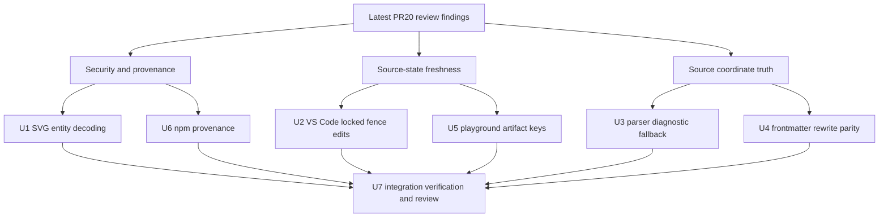

# PR20 Review Security and Stability Closure - Plan

## Goal Capsule

| Field | Value |
|---|---|
| Objective | Close the latest PR #20 review findings by fixing SVG sanitizer entity bypasses, stale locked-preview source tracking, parser diagnostic coordinate safety, frontmatter quick-fix parity, playground artifact freshness, and npm provenance. |
| Authority | The current PR #20 branch `feat/editor-core-language-intelligence`, the latest read-only review evidence, repo `AGENTS.md`, prior PR20 plans under `docs/plans/`, and checked-in tests/workflows. |
| Execution profile | Deep cross-surface security and correctness closure. Breaking unreleased PR behavior is allowed when it removes incorrect contracts; behavior-bearing units should start from failing tests or characterization evidence where practical. |
| Stop conditions | Stop only if implementation reveals a product-scope conflict, a safety-sensitive behavior cannot be proven with local or CI-bound tests, or a release/publish action would be required. |
| Tail ownership | The active Codex goal owns implementation, focused verification, read-only review, logical commits, and PR-branch updates. It must not touch `main`, publish packages, merge PR #20, or discard unrelated local changes. |

---

## Product Contract

### Summary

This plan closes the newest PR #20 review findings that remain after the earlier July 4-6 closure plans.
The common failure mode is stale or incorrectly trusted source state: the sanitizer trusts encoded CSS tokens the browser will decode, VS Code trusts an old locked snapshot after the selected fence is edited, core parse errors report parser-input offsets as original source offsets, analysis quick fixes recognize less frontmatter than the parser accepts, playground export buttons can use stale artifacts, and release automation omits npm provenance despite having OIDC permission.

### Problem Frame

PR #20 introduces editor intelligence and preview/export behavior across Rust core, `merman-analysis`, VS Code, browser web helpers, playground UI, and release workflows.
The branch is unreleased, so compatibility with interim behavior is less important than making source ownership and safety boundaries true.
The right closeout is to repair the shared contracts at their owning layer, regenerate generated copies, and add regression tests at every public entry point that can otherwise observe stale, unsafe, or misleading output.

### Requirements

**SVG DOM safety**

- R1. SVG DOM safety must reject URL-bearing CSS or attributes when `url`, `import`, protocol text, delimiters, or protocol separators are hidden behind browser-decoded character references, including no-semicolon numeric references and named references in URL-bearing contexts.
- R2. Web and VS Code sanitizer copies must stay byte-identical through the existing generator/checker, and both host surfaces must have regression coverage for the same encoded-bypass cases.

**VS Code preview source tracking**

- R3. A locked VS Code preview attached to a visible Markdown Mermaid fence must follow edits to that same fence's content instead of falling back to the last rendered snapshot.
- R4. A locked VS Code preview must still keep the old snapshot only when the selected source is no longer visible or the tracked fence truly disappeared.

**Rust parser and analysis coordinates**

- R5. Core parse errors produced from parser input that cannot be remapped to the original source must never be returned as precise original-source offsets.
- R6. Analysis quick fixes that rewrite Mermaid config frontmatter must understand the same indented frontmatter and body-dedent semantics as core preprocessing.

**Playground artifact freshness**

- R7. Playground copy/export actions must operate only on artifacts rendered from the current source, theme, Mermaid config, render options, and engine; stale artifacts must be disabled or re-rendered before export.

**Release provenance**

- R8. `release-web` npm publish must use GitHub OIDC trusted publishing with provenance when publishing public npm packages, and workflow security tests must guard that contract without requiring long-lived npm tokens.

### Acceptance Examples

- AE1. `<svg><text style="fill:u&#114l(https://example.com/a.svg#x)">x</text></svg>` is rejected by both web DOM safety smoke coverage and VS Code preview safety tests.
- AE2. `<svg></svg>` is rejected even though the numeric entity is missing a semicolon.
- AE3. After locking a preview to a Markdown Mermaid fence, editing only that fence's body re-renders or exports the new body and does not reuse the pre-edit snapshot.
- AE4. After locking a preview to a Markdown Mermaid fence, deleting that fence still keeps the previous locked snapshot instead of retargeting another fence with the old ordinal.
- AE5. A parse error after preprocessing that removes or normalizes content either maps to the correct original line/column or degrades to a fallback whole-source span with fallback diagnostic metadata.
- AE6. Moving an init directive into indented frontmatter preserves effective Mermaid config and updates the existing frontmatter block rather than inserting a duplicate top-level block.
- AE7. Changing playground source or config before an async render completes disables copy/export for the old SVG/ASCII result until the current render has produced a matching artifact.
- AE8. The trusted `release-web` publish job has OIDC permission, runs in the npm publishing environment, uses no npm publish token, does not disable provenance, and still avoids checkout/build/test steps in the publish job.

### Scope Boundaries

- In scope: all latest findings listed above, adjacent tests/smokes/generator updates needed to prove them, focused simplification of stale state models, and deletion of obsolete helper code that encodes the old contracts.
- In scope: breaking unreleased PR behavior where the new contract prevents stale output or unsafe DOM insertion.
- Out of scope: merging PR #20, publishing npm/crates/extensions, broad release-workflow permission audits unrelated to npm provenance, and unrelated Mermaid visual baseline refreshes.

#### Deferred to Follow-Up Work

- A full release-workflow permission minimization pass across workflows beyond `release-web` publish provenance, unless implementation touches the same job and can make a strictly local hardening without widening this plan.
- A general React component test framework for the playground. This plan should prefer extracting artifact-key logic into a testable helper over adding a heavy UI-test stack solely for one race.

---

## Planning Contract

### Assumptions

- The current checkout is already the PR branch and has a meaningful branch name, so implementation continues on `feat/editor-core-language-intelligence`.
- The user has authorized fearless refactoring, deletion of obsolete code, subagent review, incremental commits, and goal-mode execution after planning.
- `CONCEPTS.md`, `STRATEGY.md`, and `docs/solutions/` are absent, so local grounding comes from `AGENTS.md`, prior PR20 plans, current source, and checked-in tests.
- External research is load-bearing only for the sanitizer entity-decoding decision. The WHATWG HTML tokenizer treats missing semicolons after numeric character references as parse errors that still reach the numeric character reference end state, so sanitizer normalization must match browser behavior rather than XML-only semicolon rules.

### Key Technical Decisions

- KTD1. SVG sanitizer decoding follows browser-observed HTML tokenization for safety checks. XML-only decoding is insufficient because preview/playground insertion paths ultimately rely on browser DOM parsing semantics; if exact HTML named-reference decoding is not implemented, CSS and raw URL contexts must conservatively reject ambiguous non-whitelisted `&...` sequences rather than accepting them.
- KTD2. SVG policy remains canonical in `platforms/web/src/svg-safety-policy.ts`; the VS Code policy is regenerated through `scripts/svg-safety-policy.mjs` rather than hand-edited.
- KTD3. Preview source identity separates tracked fence continuity from content hash. Hash is useful to avoid retargeting deleted/replaced fences, but the continuity decision needs document-change evidence: locked Markdown previews should maintain a versioned tracked fence range, update that range when edits occur inside the fence body and delimiters still resolve, and fall back to the old snapshot when the tracked range can no longer be mapped to a visible Mermaid fence.
- KTD4. Parser diagnostics prefer honest fallback over false precision. If core cannot map parser-input byte offsets to original source bytes, it should clear or downgrade the span before analysis projects it into LSP/CLI/editor diagnostics.
- KTD5. Frontmatter rewrite parsing should reuse core frontmatter semantics where possible. If public API shape is not appropriate, introduce a narrow core helper that returns the frontmatter block spans and dedented YAML body without duplicating parser behavior in analysis.
- KTD6. Playground rendered artifacts carry an artifact key. Copy/export receives both payload and key, and the UI treats mismatched keys as stale rather than relying on React effect timing to clear strings.
- KTD7. npm provenance is a trusted-publishing contract, not a command-string preference. The job already uses GitHub-hosted runners, `environment: npm`, and `id-token: write`; the implementation should preserve plain trusted publishing and test the real preconditions, token absence, supported Node/npm path, and provenance-disable guards instead of making `--provenance` the primary proof.

### Priority Analysis

| Priority | Units | Rationale |
|---|---|---|
| Security and publish integrity | U1, U6 | DOM insertion bypasses and missing npm provenance affect untrusted input or published artifacts. |
| User-visible stale output | U2, U5 | Locked preview and playground export races can copy/export content the user did not ask for. |
| Diagnostic correctness | U3, U4 | False source coordinates and frontmatter rewrite drift create misleading editor fixes and diagnostics. |
| Integration tail | U7 | Cross-surface changes need regeneration, focused gates, and read-only review before the branch is considered closed. |

### High-Level Technical Design

The implementation order should close security/publish findings first, then stale source-state defects, then Rust coordinate/frontmatter fixes, unless test discovery shows two units share a file and should be serialized differently.

### System-Wide Impact

The plan touches TypeScript sanitizer policy shared by web and VS Code, VS Code preview session identity, Rust parser and analysis diagnostic projection, playground export UX, and GitHub release automation.
Review must check cross-surface parity: web and VS Code sanitizer behavior, parser and analysis coordinate language, playground Merman/Mermaid artifact handling, and workflow-security tests.

### Risks and Mitigations

| Risk | Mitigation |
|---|---|
| Entity decoding could accidentally permit a named-reference bypass not covered by numeric tests. | Add semicolon and no-semicolon numeric cases for decimal and hex, and either implement the needed named-reference decoding or reject ambiguous `&...` sequences in CSS and raw URL contexts. |
| Locked-preview identity could treat a deleted-and-recreated fence as an edit. | Keep hash as evidence when source range and source id both drift; preserve old snapshot when the old identity cannot be resolved to a visible same-source candidate. |
| Parser fallback spans could reduce useful precision for remappable preprocess cases. | Keep existing offset and CRLF/frontmatter remap tests green; only downgrade `ParserInputCoordinates` cases that cannot prove a source mapping. |
| Sharing frontmatter parsing across core and analysis could expose too much API. | Use a narrow crate-visible or public helper with a semantic name and tests, not a broad preprocessing API expansion. |
| Playground artifact keys could add state churn to an already large component. | Extract key construction and freshness checks into a small helper so the component change stays mechanical and testable. |

### Sources and Research

- Current code anchors: `platforms/web/src/svg-safety-policy.ts`, `tools/vscode-extension/src/preview-svg-safety-policy.ts`, `tools/vscode-extension/src/preview-source.ts`, `tools/vscode-extension/src/preview-session.ts`, `crates/merman-core/src/parse_pipeline.rs`, `crates/merman-core/src/preprocess/mod.rs`, `crates/merman-analysis/src/source_config_rewrite.rs`, `playground/src/components/Preview.tsx`, `.github/workflows/release-web.yml`, and `scripts/test_release_workflow_security.py`.
- Existing test anchors: `tools/vscode-extension/src/test/preview-svg-safety.test.ts`, `platforms/web/scripts/dom-safety-smoke.mjs`, `tools/vscode-extension/src/test/preview-session.test.ts`, `crates/merman-analysis/src/analyzer/tests.rs`, `crates/merman-analysis/src/source_config_rewrite.rs`, and `scripts/test_release_workflow_security.py`.
- WHATWG HTML parsing reference: numeric character reference states in `https://html.spec.whatwg.org/multipage/parsing.html` specify that non-semicolon terminators enter a missing-semicolon parse error and continue through numeric character reference completion.
- npm Trusted Publishing references: `https://docs.npmjs.com/trusted-publishers/` and `https://docs.npmjs.com/generating-provenance-statements/` describe GitHub OIDC trusted publishing, automatic provenance, and provenance-disable settings.
- Prior PR20 plans: `docs/plans/2026-07-04-005-refactor-pr20-post-review-refactor-plan.md`, `docs/plans/2026-07-05-003-refactor-pr20-ci-contract-closure-plan.md`, and `docs/plans/2026-07-06-001-refactor-pr20-review-closure-plan.md`.

---

## Implementation Units

### U1. Harden SVG Entity Decoding Across Web and VS Code

- **Goal:** Reject CSS and URL-bearing SVG bypasses hidden behind browser-decoded character references, including no-semicolon numeric references and named references in URL-bearing contexts.
- **Requirements:** R1, R2; covers AE1, AE2.
- **Dependencies:** None.
- **Files:** `platforms/web/src/svg-safety-policy.ts`, `tools/vscode-extension/src/preview-svg-safety-policy.ts`, `scripts/svg-safety-policy.mjs`, `scripts/generate-svg-safety-policy.mjs`, `platforms/web/scripts/dom-safety-smoke.mjs`, `tools/vscode-extension/src/test/preview-svg-safety.test.ts`, `platforms/web/scripts/svg-safety-policy.test.mjs`, `tools/vscode-extension/scripts/svg-safety-policy.test.mjs`.
- **Approach:** Update the canonical sanitizer decoder so safety normalization handles decimal and hex numeric character references without requiring a semicolon, and define a mandatory named-reference strategy for URL-bearing contexts: either decode the HTML references needed for URL/protocol/delimiter detection or reject ambiguous non-whitelisted `&...` sequences before accepting CSS URL, `@import`, or raw URL attributes. Keep semicolon-bearing behavior unchanged, regenerate the VS Code copy from the canonical policy, and make stale generated-policy checks continue to defend byte parity.
- **Execution note:** Start with failing web and VS Code regression tests for `u&#114l(...)` and `u&#x72l(...)` before changing sanitizer code.
- **Patterns to follow:** Existing CSS escape rejection tests in `tools/vscode-extension/src/test/preview-svg-safety.test.ts`, DOM smoke rejection cases in `platforms/web/scripts/dom-safety-smoke.mjs`, and generator parity tests under each package's `scripts/`.
- **Test scenarios:** Decimal no-semicolon numeric entity hiding `url` is rejected in style attributes and `<style>` content. Hex no-semicolon numeric entity hiding `url` is rejected in style attributes and `<style>` content. No-semicolon numeric entity hiding CSS `@import` is rejected. Encoded raw URL/protocol attributes such as `href="java&#115cript:..."` are rejected. Named-reference cases such as `javascript&colon;...`, `https&colon;&sol;&sol;...`, and CSS URL delimiters hidden behind named references are rejected or conservatively treated as unsafe when exact HTML named-reference emulation is not implemented. Existing local fragment `url(#id)` remains allowed. At least one regression exercises the actual DOM insertion parsing path rather than only direct scanner calls. Generated VS Code policy matches the canonical web policy after regeneration.
- **Verification:** Web DOM safety smoke, VS Code preview safety tests, and SVG policy generator parity tests all reject the bypass and preserve existing allowed local-reference behavior.

### U2. Track Locked Markdown Fence Edits As Current Source

- **Goal:** Keep locked VS Code previews on the same visible Markdown fence after its body changes, while preserving old snapshot fallback for deletion or non-visible editors.
- **Requirements:** R3, R4; covers AE3, AE4.
- **Dependencies:** None.
- **Files:** `tools/vscode-extension/src/preview-source.ts`, `tools/vscode-extension/src/preview-session.ts`, `tools/vscode-extension/src/preview-instance.ts`, `tools/vscode-extension/src/test/preview-session.test.ts`, `tools/vscode-extension/src/test/export.test.ts`, `tools/vscode-extension/src/test/preview-webview.test.ts`.
- **Approach:** Add a locked Markdown source tracker that uses VS Code document version and text-change ranges to map the remembered fence range across edits. Edits inside the tracked fence body update the range and allow resolution to the new body when the opening/closing fence still parse; deleting the tracked fence, replacing its delimiters, or failing to map the tracked range keeps the old snapshot instead of retargeting by ordinal. After a same-fence edit resolves, refresh the remembered identity to the new hash. Treat a same-fence edit as an updating state keyed to the new source: copy/export stay disabled or rejected until a matching render succeeds, a successful render replaces the snapshot and source hash, and a render failure is shown as the current source's error state rather than authorizing the old output. Keep old-snapshot fallback only for hidden editors or truly disappeared sources, and keep that fallback visibly stale for output guards.
- **Execution note:** Add a failing preview-session test for editing the locked fence body before updating resolver behavior.
- **Patterns to follow:** Existing tests for locked preview when the source editor is hidden, selected fence disappears, a new fence is inserted before it, and an old ordinal is replaced.
- **Test scenarios:** Locked fence body edit inside the tracked range returns a snapshot with the edited source and new `sourceHash`. Locked same-fence edit that inserts or deletes body lines maps the tracked range and stays attached to that fence. Locked same-fence edit disables or rejects copy/export until a render with the new source key succeeds. Locked same-fence render failure reports the current source error and does not clear stale output guards. Locked fence deletion or delimiter replacement keeps the old snapshot even when a new fence occupies the old ordinal. Inserting a fence before the locked one still resolves to the original body with the updated ordinal. Export/copy source-key guards do not authorize stale locked-source artifacts after the source changed.
- **Verification:** VS Code extension tests prove locked-session identity, export/copy guards, and webview source-key behavior across edited, deleted, inserted, and hidden-editor cases.

### U3. Downgrade Unmappable Parser-Input Diagnostic Spans

- **Goal:** Prevent parse errors from presenting parser-input offsets as precise original-source diagnostics when preprocessing cannot map offsets back.
- **Requirements:** R5; covers AE5.
- **Dependencies:** None.
- **Files:** `crates/merman-core/src/parse_pipeline.rs`, `crates/merman-core/src/error.rs`, `crates/merman-core/src/tests/sequence.rs`, `crates/merman-core/src/tests/misc.rs`, `crates/merman-analysis/src/diagnostic_projection.rs`, `crates/merman-analysis/src/analyzer/tests.rs`.
- **Approach:** Make `EditorSourceRemap::ParserInputCoordinates` an explicit degraded coordinate state for parse diagnostics. Existing remappable offset and CRLF-normalized cases keep exact spans; unmappable cases should clear the diagnostic span or mark it as fallback so analysis projects whole-source/fallback metadata instead of a false precise range.
- **Execution note:** Add or strengthen analysis tests that fail on the old no-op remap before changing `remap_parse_error`.
- **Patterns to follow:** Existing frontmatter and init-directive remap tests in `crates/merman-analysis/src/analyzer/tests.rs`, `ParseDiagnosticSpanKind::Fallback` projection behavior in `crates/merman-analysis/src/diagnostic_projection.rs`, and sequence editor-facts parser-input tests in `crates/merman-core/src/tests/sequence.rs`.
- **Test scenarios:** Frontmatter and init-directive parse failures that are remappable still report the expected original line and column. A preprocessed source that cannot be found in the original reports a fallback whole-source span or fallback metadata, not parser-input line/column as exact original coordinates. LSP/analysis projections keep related fallback messages for degraded diagnostics.
- **Verification:** `merman-core` and `merman-analysis` focused tests prove precise remaps remain precise and unmappable parser-input diagnostics degrade honestly.

### U4. Reuse Core Frontmatter Semantics In Analysis Quick Fixes

- **Goal:** Make analysis quick fixes rewrite the same frontmatter blocks that core preprocessing accepts, including indented `---` blocks with dedented YAML bodies.
- **Requirements:** R6; covers AE6.
- **Dependencies:** None.
- **Files:** `crates/merman-core/src/preprocess/mod.rs`, `crates/merman-core/src/lib.rs`, `crates/merman-core/src/tests/misc.rs`, `crates/merman-analysis/src/source_config_rewrite.rs`, `crates/merman-analysis/src/rules/tests.rs`.
- **Approach:** Extract a narrow core frontmatter block helper that returns opening/closing spans, YAML body span, dedented body text, indentation, and stripped source boundary needed by both preprocessing and rewrite code. Use it in analysis instead of byte-0 `strip_prefix("---")`, and preserve effective config through `Engine::parse_metadata_sync` before and after applying the fix.
- **Execution note:** Characterize current core indented-frontmatter behavior before changing analysis rewrite logic.
- **Patterns to follow:** Core `parse_indented_frontmatter_like_upstream` tests, existing `init_directive_migration_preserves_effective_diagram_config`, and rule tests around `prefer_frontmatter_config`.
- **Test scenarios:** Existing indented frontmatter receives updated `config` instead of a duplicate top-level block. Dedented YAML body parses identically before and after the quick fix. Existing non-indented frontmatter behavior and directive removal spans remain unchanged. Malformed or unclosed frontmatter still produces no unsafe quick fix.
- **Verification:** Core frontmatter tests and analysis source-config rewrite/rule tests prove parser and quick-fix semantics match.

### U5. Key Playground Rendered Artifacts To Current Inputs

- **Goal:** Prevent playground copy/export controls from using stale SVG or ASCII artifacts after source, theme, config, render options, or engine changes.
- **Requirements:** R7; covers AE7.
- **Dependencies:** U1 if artifact safety helper behavior changes.
- **Files:** `playground/src/components/Preview.tsx`, `playground/src/lib/render-artifact.ts`, `playground/scripts/render-artifact.test.mjs`, `playground/package.json`, `playground/src/components/SvgViewport.tsx`, `playground/src/lib/export.ts`.
- **Approach:** Introduce a small artifact-key helper for the inputs that define a render result. Store rendered SVG/ASCII payloads with their key, derive button disabled state from key equality, and require copy/export handlers to validate freshness before writing to clipboard or disk. Model control state explicitly: fresh artifacts enable copy/export and keep existing success/failure toasts; rendering or key mismatch disables stale output with an accessible stale/busy reason; render errors disable export for that artifact and show the current error; PNG export that re-renders the current source enters a pending state instead of rasterizing an old SVG. Keep `SvgViewport` safety checks in place for DOM insertion.
- **Execution note:** Prefer a pure helper test with Node's built-in test runner over adding a full React test stack for this race.
- **Patterns to follow:** Existing playground `node --test` semantic-token script pattern, current `requireSafeSvgArtifact` guard, and toolbar export behavior that re-renders current source on demand.
- **Test scenarios:** Changing source invalidates prior SVG and ASCII artifacts until a matching render completes. Changing theme/config/render options invalidates prior artifacts. Merman and Mermaid comparison artifacts are keyed separately. Stale or rendering artifacts expose disabled/busy state instead of silent no-op controls. Render errors keep copy/export disabled for the failed artifact and show the current error. PNG export that re-renders with the `resvg-safe` pipeline validates the current key before rasterizing.
- **Verification:** Playground helper tests, TypeScript build, and lint/build gates prove stale artifacts cannot be copied/exported from the main preview or comparison cards.

### U6. Guard Release-Web npm Trusted Publishing Provenance

- **Goal:** Ensure public npm packages are published through trusted publishing with provenance from the `release-web` publish job.
- **Requirements:** R8; covers AE8.
- **Dependencies:** None.
- **Files:** `.github/workflows/release-web.yml`, `platforms/web/package.json`, `.npmrc`, `platforms/web/.npmrc`, `scripts/test_release_workflow_security.py`, `docs/release/RELEASING.md`.
- **Approach:** Keep the publish job on GitHub-hosted runners with `environment: npm` and `id-token: write`, preserve npm's trusted-publishing path, and update workflow security tests to assert supported Node/npm setup, no `NPM_TOKEN`/`NODE_AUTH_TOKEN` fallback, and no provenance-disable setting in the publish job, package metadata, or relevant `.npmrc` files while build/checkout steps remain absent. Keep `docs/release/RELEASING.md` aligned with npm's trusted-publishing behavior.
- **Execution note:** This is workflow safety; test the workflow text directly rather than relying on a live publish.
- **Patterns to follow:** Existing `test_trusted_npm_publish_job_only_downloads_artifact_and_publishes` assertions and release-web dist-tag validation tests.
- **Test scenarios:** The publish job contains `environment: npm` and `id-token: write`, runs on GitHub-hosted Linux with the supported Node/npm setup, downloads the package artifact, uses the validated `NPM_DIST_TAG`, and publishes through trusted publishing without any provenance-disable config. The workflow, `platforms/web/package.json`, and relevant `.npmrc` files do not set `provenance=false`, `NPM_CONFIG_PROVENANCE=false`, or `publishConfig.provenance: false`. `platforms/web/package.json` keeps repository metadata aligned with this GitHub repository so npm provenance can be associated with the expected source. The publish job exposes no npm publish token and still does not checkout source, run npm scripts, install Rust tooling, or execute build/test commands.
- **Verification:** Python workflow security tests prove trusted-publishing provenance preconditions and publish-job isolation.

### U7. Integrated Verification, Simplification, And Read-Only Rereview

- **Goal:** Prove the integrated branch satisfies all plan units, generated artifacts are current, and no stale review finding remains.
- **Requirements:** R1, R2, R3, R4, R5, R6, R7, R8.
- **Dependencies:** U1, U2, U3, U4, U5, U6.
- **Files:** `docs/plans/2026-07-07-001-fix-pr20-review-security-stability-plan.md`, generated sanitizer copy, touched Rust/TypeScript/workflow files, and the focused test files named by U1-U6.
- **Approach:** Review recent diffs for simplification after the Rust/source-state and frontend/security clusters, remove abandoned exploratory code, run focused gates first, then broader package/workspace gates where practical. Use read-only subagents for final review across security, Rust analysis/core, VS Code, playground/web, and release workflow surfaces.
- **Execution note:** The orchestrator owns staging and commits. Review subagents are read-only and should not spawn child agents.
- **Patterns to follow:** Existing PR20 closure plans' integrated verification sections and repo instructions for `cargo nextest`, `cargo fmt`, precise staging, and no destructive rollback.
- **Test scenarios:** Test expectation: none beyond the verification gates; this unit validates integration and review rather than adding product behavior.
- **Verification:** All focused gates for U1-U6 pass or have exact blocker notes, generated SVG policy parity is current, formatting/linting is clean for touched areas, and read-only review produces no unresolved P1/P2 findings.

---

## Verification Contract

| Gate | Applies to | Done signal |
|---|---|---|
| `node --test platforms/web/scripts/*.test.mjs` and `npm run smoke:dom-safety` from `platforms/web` | U1 | Canonical web sanitizer policy is current, DOM safety smoke rejects encoded CSS URL bypasses, and local fragment references still pass. |
| `npm test` from `tools/vscode-extension` | U1, U2 | VS Code sanitizer, preview-session, export/source-key, and generated-policy tests pass. |
| Focused `cargo nextest` for `merman-core` and `merman-analysis` | U3, U4 | Parser diagnostic remap/fallback and frontmatter quick-fix parity tests pass without regressing existing analyzer behavior. |
| Playground Node helper tests, TypeScript build, and lint | U5 | Artifact-key freshness logic is covered and playground code type-checks/lints. |
| `python scripts/test_release_workflow_security.py` | U6 | Workflow security tests prove npm trusted-publishing provenance preconditions, no token fallback, no provenance-disable config, and publish-job isolation. |
| `node scripts/check-svg-safety-policy.mjs` | U1, U7 | Generated VS Code SVG safety policy exactly matches the canonical web policy. |
| `cargo fmt --all --check` and targeted TypeScript formatting/lint checks for touched packages | U3, U4, U5, U7 | Formatting and static checks are clean for touched Rust and TypeScript surfaces. |
| Read-only code review with focused subagents | U7 | Security, Rust core/analysis, VS Code, playground/web, and release workflow review finds no unresolved P1/P2 issues. |

If a platform gate cannot run locally, record the exact missing tool or failure mode and provide the nearest deterministic replacement test. Security-sensitive units U1 and U6 cannot be marked complete on vague manual inspection alone.

---

## Definition of Done

- Each U1-U6 behavior-bearing unit has a failing or characterization test observed before the production fix when practical, followed by passing focused verification.
- Web and VS Code SVG sanitizer policy files are synchronized through the generator, not hand-diverged.
- Locked VS Code preview/export/copy workflows use current edited fence content and still preserve stale-source fallback for deleted or hidden sources.
- Parser diagnostics no longer claim precise original-source positions for parser-input-only spans.
- Analysis quick fixes update indented frontmatter according to core preprocessing semantics.
- Playground copy/export buttons cannot act on stale render artifacts after source/config/theme/options changes.
- `release-web` publishes npm packages through trusted publishing with provenance, without long-lived npm tokens or disabled provenance settings.
- Abandoned exploratory code, obsolete tests for old behavior, and temporary diagnostics are removed before the final commit.
- Focused verification gates pass or exact blockers are reported; no unresolved read-only review finding remains at P1/P2.
