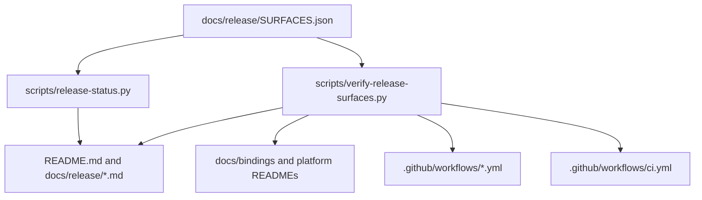

# Release Surface Readiness Hardening - Plan

## Goal Capsule

| Field | Value |
| --- | --- |
| Objective | Turn the post-`0.8.0-alpha.3` release blind spots into checked, user-facing release and package-surface contracts. |
| Authority | User request in this session, current release docs, package manifests, workflow behavior, and binding smoke tests. |
| Execution profile | Broad, breaking refactor allowed; delete or replace stale release/surface documentation when a checked source supersedes it. |
| Stop conditions | Stop only for external credential setup, registry-owner setup, or a required platform service that cannot be reached from the repository. |
| Tail ownership | The executor owns implementation, tests, review, commits, and final verification. |

---

## Product Contract

### Summary

Merman now publishes more surfaces than the project can safely describe from memory.
The release flow, package feature split, browser presets, FFI host fidelity, and extension publishing story need one checked source of truth so users know which dependency to choose and maintainers know what remains blocked by registry setup.

### Problem Frame

The current docs explain many surfaces, but the information is distributed across `README.md`, `docs/release/RELEASING.md`, `docs/release/PACKAGE_SURFACES.md`, binding docs, platform READMEs, and workflows.
That makes contradictions easy: `README.md` still says Python lacks host text-measurement callbacks even though the Python package, UniFFI docs, smoke script, and FFI publish verifier now require that callback surface.
The release process also still depends on manual operator judgment for status after tag publication and does not expose a single command that separates declared release readiness from observed version-specific publication results for channels that are `published`, `artifact-only`, `credential-blocked`, `registry-blocked`, `manual-registry`, `not-built`, or `not-applicable`.

### Requirements

**User-facing package choice**

- R1. Users can choose between Rust core/render/analysis/LSP, browser subpaths, native bindings, VS Code, Typst, and CLI from a single support matrix without reading every platform README.
- R2. The public package-choice matrix must make dependency weight visible with a compact signal such as size bucket, measured WASM size where available, ELK/license flag, host-dependency flag, and capability set.
- R3. Feature and preset names must remain explicit and stable enough for alpha users: `core-full`, `core-host`, `analysis`, `render`, `elk-layout`, `ascii`, `editor-language`, `ratex-math`, `cytoscape-layout`, `browser-core`, `browser-render`, `browser-render-only`, `browser-ascii`, `browser-full`, `browser-full-no-elk`, and `browser-ratex-math`.
- R4. The docs must continue to say there is no separate `@mermanjs/web/analysis` subpath because `@mermanjs/web/core` is the smallest analysis-capable browser artifact.

**Release operation**

- R5. Maintainers can run one local command to report release readiness by surface, workflow, package channel, required credentials, known follow-on work, and version-specific observed publication status when probes are requested.
- R6. CI must fail when the checked release/surface source of truth drifts from important docs, package manifests, or workflow files.
- R7. Manual platform workflows must keep unsafe dispatch input handling and publish-token isolation properties already covered by release workflow security tests.
- R8. Workflows that cannot publish without external registry setup must say so as a structured blocked state, not as stale prose.

**Distribution channels**

- R9. VS Code Marketplace publishing must become an explicit release lane or an explicitly checked blocker, instead of being only an artifact-packaging workflow.
- R10. Android Maven Central, remote SwiftPM binary targets, Typst registry submission, npm dist-tags, VS Code prerelease markers, and Homebrew stable-only behavior must be represented as first-class channel or release-kind conditions.
- R11. A future registry-enabling change must have a clear test and documentation entry point before credentials are added.

**FFI and host fidelity**

- R12. Python, C ABI, Android, Apple, and Flutter host text-measurement support must be documented and verified consistently with the actual binding APIs.
- R13. Host text measurement must be framed as a fidelity seam, not a promise of identical browser pixels across every platform.
- R14. The release verification suite must keep ABI constants, package-page metadata, smoke examples, and binding docs synchronized.

**Safety and contributor continuity**

- R15. Untrusted diagram rendering, SVG output, rasterization limits, and VS Code WebView preview safety must be discoverable from the user docs.
- R16. Contributors need a durable path for adding a new surface, changing browser presets/features, enabling a registry channel, or upgrading Mermaid.
- R17. Stale workstream docs that are replaced by checked release/surface contracts must be archived, deleted, or redirected so future agents do not treat them as current truth.

### Acceptance Examples

- AE1. A web user who only wants diagnostics can see that `@mermanjs/web/core` is the browser artifact to use and that it includes analysis without SVG render wrappers.
- AE2. A Python GUI user can see that Python UniFFI supports `MermanTextMeasurer`, and a release check fails if README reverts to saying Python lacks host callbacks.
- AE3. A maintainer preparing `0.8.0-alpha.4` can run the release status command with `--version 0.8.0-alpha.4` and see declared readiness plus observed registry/artifact status when `--probe` is available.
- AE4. A contributor proposing Marketplace or Maven Central publishing can find the required workflow, credential, and verifier changes in one place.
- AE5. A security-conscious editor integrator can find the untrusted-rendering policy and the VS Code preview safety policy from README-level navigation.
- AE6. A server-side Rust user who only wants diagnostics can choose `merman-analysis` or `merman-core` without pulling render, ELK, or host capabilities.
- AE7. A mobile integrator can compare Flutter, Android AAR, Apple XCFramework, and raw C ABI availability without confusing artifact-only channels with registry-installable packages.

### Scope Boundaries

- This plan does not configure repository secrets, npm/PyPI/pub.dev trusted publishers, Maven Central Portal ownership, VS Code Marketplace publisher ownership, Typst registry ownership, or Homebrew/core state.
- This plan does not force `@mermanjs/web` into multiple npm packages; the current one-package-plus-subpaths decision remains unless implementation proves it is harmful.
- This plan does not promise pixel-perfect host text measurement across browsers or native platforms.
- This plan does not delete historical ADRs that record decisions; it may archive or redirect stale workstream operational notes if they conflict with current checked contracts.

### Sources

- `README.md`
- `docs/release/RELEASING.md`
- `docs/release/PACKAGE_SURFACES.md`
- `docs/release/PUBLISH_ORDER.md`
- `docs/FEATURES.md`
- `docs/bindings/HOST_TEXT_MEASUREMENT.md`
- `docs/bindings/PYTHON_UNIFFI.md`
- `scripts/verify-ffi-publish-surface.py`
- `scripts/verify-platform-bindings.py`
- `scripts/test_release_workflow_security.py`
- `.github/workflows/release-*.yml`
- `.github/workflows/vscode-extension.yml`
- `.github/workflows/homebrew.yml`
- `crates/merman-wasm/Cargo.toml`
- `platforms/web/scripts/build-wasm.mjs`
- `platforms/web/scripts/surface-manifest.mjs`
- `platforms/web/src/surfaces`
- `tools/vscode-extension`

---

## Planning Contract

### Key Technical Decisions

- KTD1. Use a checked repository data file as the surface source of truth.
  Release docs and README prose can remain hand-written, but CI must verify both directions: every declared surface points to real workflows/manifests/docs, and every public workflow/package/export/feature source is declared or explicitly allowlisted as internal.
- KTD2. Add a local release-status command that works offline by default.
  Offline mode reports declared readiness; post-tag checks use `--version <version>` and best-effort `--probe` to add `observed_status` for registries, GitHub Release assets, workflow artifacts, and package channels.
- KTD3. Keep browser feature/preset names explicit instead of inventing friendly aliases.
  The current names communicate dependency weight and compiled capability; adding marketing aliases would create another translation layer and more drift.
- KTD4. Treat external publishing as a state machine.
  A surface or channel is `published`, `artifact-only`, `credential-blocked`, `registry-blocked`, `manual-registry`, `not-built`, or `not-applicable`; channel conditions such as stable-only Homebrew and prerelease npm dist-tags are modeled from the target version rather than prose.
- KTD5. Use the existing release workflow security tests as the guardrail for any workflow changes.
  New publish jobs must isolate write/id-token credentials from checkout/build jobs and must not interpolate dispatch inputs directly into shell blocks.
- KTD6. Promote host fidelity documentation from scattered binding notes to a support contract.
  Python callback support is now real enough to verify; the remaining boundary is whether a host measures with the same text stack that displays the SVG.
- KTD7. Delete or redirect stale operational docs only after a checked replacement exists.
  Historical ADRs stay; workstream TODOs or drafts that duplicate live release/surface contracts can be archived or trimmed.

### High-Level Technical Design

The data file is not a generator that owns every sentence.
It is a compact contract that gives scripts stable facts to check: surface names, package ids, workflows, channels, states, capabilities, feature profiles, credentials, blockers, docs, and gates.

### Sequencing

1. Build the checked release/surface contract and status command first because later docs and workflow changes need stable vocabulary.
2. Fix user-facing docs and binding contradictions next because they directly affect dependency choice.
3. Add or harden publish-lane CI for VS Code and blocked registry lanes after the contract exists.
4. Add safety/contributor playbooks and clean stale workstreams once the new contract can point future readers at current truth.
5. Run the release/security/platform tests and a subagent code review before finalizing.

### System-Wide Impact

This work touches release operations, public package documentation, CI workflow security, npm/browser package semantics, native binding documentation, and contributor onboarding.
The core renderer, parser, and ABI should not change unless implementation finds a real verifier gap.

### Risks And Dependencies

| Risk | Mitigation |
| --- | --- |
| Release status becomes another stale artifact | Make it data-backed and run a verification script in CI. |
| Publish workflow changes accidentally weaken security | Extend `scripts/test_release_workflow_security.py` before enabling any publish job. |
| Registry docs encode outdated provider behavior | Check current official docs before implementing marketplace, Maven Central, or SwiftPM publishing mechanics. |
| Data file becomes too verbose to maintain | Keep it to facts that CI can verify or release operators need. |
| Stale workstream cleanup removes useful history | Preserve ADRs and decision docs; delete only obsolete operational duplicates or add redirects. |

---

## Implementation Units

### U1. Release Surface Contract And Offline Status Command

- **Goal:** Add a checked source of truth for release surfaces and an offline release status command.
- **Requirements:** R1, R2, R5, R8, R10, AE3.
- **Dependencies:** None.
- **Files:** `docs/release/SURFACES.json`; `scripts/release-status.py`; `scripts/test_release_status.py`; `docs/release/RELEASING.md`; `docs/release/PACKAGE_SURFACES.md`.
- **Patterns to follow:** `scripts/release-version.py`; `scripts/verify-release-crate-order.py`; `scripts/test_verify_release_crate_order.py`; `docs/release/PACKAGE_SURFACES.md`.
- **Approach:** Create a compact JSON contract for public package-choice facts and maintainer release-status facts from the same data, but expose them as distinct views.
  Public rows carry job-oriented entry point, install availability, support level, dependency-weight signal, and recommended package.
  Maintainer rows carry workflows, channels, states, release-kind conditions, credentials, blockers, docs, and gates.
  Implement `scripts/release-status.py` to render a readable table and machine-readable JSON without network access, with `declared_state` always present and `observed_status` populated only when `--version <version> --probe` can inspect registries, GitHub Release assets, or workflow artifacts.
  Update release docs to route operators through this command before and after tag publication.
- **Test scenarios:** Status command rejects invalid states; every surface has a docs link and release state; public and maintainer views are separate; prerelease and stable versions evaluate channel conditions differently; command prints blocked registry lanes; JSON output separates `declared_state` from `observed_status`; docs mention the command.
- **Verification:** `python -m unittest scripts/test_release_status.py`.

### U2. Surface Drift Verifier In CI

- **Goal:** Fail CI when workflows, docs, manifests, or binding docs drift from the surface contract.
- **Requirements:** R3, R4, R6, R7, R12, R14, AE1, AE2.
- **Dependencies:** U1.
- **Files:** `scripts/verify-release-surfaces.py`; `scripts/test_verify_release_surfaces.py`; `.github/workflows/ci.yml`; `docs/release/SURFACES.json`; `README.md`; `docs/release/PACKAGE_SURFACES.md`; `docs/FEATURES.md`; `platforms/web/package.json`; `platforms/web/scripts/build-wasm.mjs`; `crates/merman-wasm/Cargo.toml`; `platforms/python/merman/README.md`.
- **Patterns to follow:** `scripts/verify-ffi-publish-surface.py`; `scripts/test_release_workflow_security.py`; `scripts/test_verify_platform_bindings.py`.
- **Approach:** Add structural checks rather than generated prose.
  Verify every workflow path exists, package manifest names match, docs mention each public surface, Python docs and README agree on host callbacks, browser subpaths match package exports, and `@mermanjs/web/core` remains the analysis-capable slim path.
  Add reverse inventory from `.github/workflows/release-*.yml`, `.github/workflows/homebrew.yml`, `.github/workflows/vscode-extension.yml`, `docs/release/PUBLISH_ORDER.md`, `docs/FEATURES.md`, web package exports, web build presets, wasm Cargo features, and binding package metadata; fail when a public item lacks a `SURFACES.json` entry or an intentional internal/out-of-scope allowlist entry.
  Wire the verifier into CI beside existing Python workflow tests.
- **Test scenarios:** Missing workflow fails; missing docs link fails; stale Python "does not expose host text-measurement callbacks" prose fails; missing browser subpath export fails; invalid feature profile fails; a public feature or preset present in `docs/FEATURES.md`, `build-wasm.mjs`, or `crates/merman-wasm/Cargo.toml` but absent from the contract fails.
- **Verification:** `python -m unittest scripts/test_verify_release_surfaces.py scripts/test_release_workflow_security.py scripts/test_verify_platform_bindings.py`.

### U3. User-Facing Surface And Feature Documentation Cleanup

- **Goal:** Make README and release docs answer dependency weight, feature names, and package choice without contradictions.
- **Requirements:** R1, R2, R3, R4, R12, R13, AE1, AE2, AE6, AE7.
- **Dependencies:** U1, U2.
- **Files:** `README.md`; `docs/release/PACKAGE_SURFACES.md`; `docs/FEATURES.md`; `platforms/web/README.md`; `platforms/web/pkg/README.md`; `platforms/web/pkg/core/README.md`; `platforms/web/pkg/render/README.md`; `platforms/web/pkg/render-only/README.md`; `platforms/web/pkg/ascii/README.md`; `platforms/web/pkg/full/README.md`; `docs/bindings/HOST_TEXT_MEASUREMENT.md`; `docs/bindings/PYTHON_UNIFFI.md`; `platforms/python/merman/README.md`.
- **Patterns to follow:** Current README "Which package should I use?" and "Feature flags" sections; `docs/adr/0069-wasm-package-surface-semantics.md`; `docs/adr/0066-ffi-binding-strategy.md`.
- **Approach:** Rewrite only the contradictory or high-friction sections.
  Keep exact feature names.
  Keep public job-oriented package choice separate from maintainer release status.
  Move the feature/dependency guidance high enough that Rustdoc/README readers see dependency-light integration paths before assuming Merman is heavy.
  Fix README's stale Python callback note.
  Ensure web docs describe analysis through `core`, not a nonexistent analysis subpath.
- **Test scenarios:** Verifier from U2 passes; README contains a concise package-choice matrix with non-web examples; Python support wording matches binding docs; web docs list public subpaths and unsupported wrappers; dependency-weight signals are visible without mixing in maintainer-only credential details.
- **Verification:** `python scripts/verify-release-surfaces.py`; focused markdown link/path spot check by `rg`.

### U4. VS Code Release Lane And Platform Registry State Hardening

- **Goal:** Make VS Code publishing and blocked registry lanes explicit and testable.
- **Requirements:** R7, R8, R9, R10, R11, AE4.
- **Dependencies:** U1, U2.
- **Files:** `.github/workflows/vscode-extension.yml`; optional `.github/workflows/release-vscode.yml`; `.github/workflows/release-android.yml`; `.github/workflows/release-apple.yml`; `tools/vscode-extension/README.md`; `docs/release/RELEASING.md`; `docs/release/PACKAGE_SURFACES.md`; `scripts/test_release_workflow_security.py`; `docs/release/SURFACES.json`.
- **Patterns to follow:** `release-web.yml` publish job isolation; `release-python.yml` trusted publish separation; existing VSIX verification scripts under `tools/vscode-extension/scripts`.
- **Approach:** First check current official provider docs before changing publish mechanics.
  For VS Code, either add a credential-gated publish job to the existing workflow with explicit `scripts/test_release_workflow_security.py` coverage, or add a separate `.github/workflows/release-vscode.yml` release lane that matches the release-workflow test glob.
  A credentialed publish lane must publish same-run verified VSIX artifacts or validate a selected run/tag/sha, verify checksums or attestations when available, and rerun `tools/vscode-extension/scripts/verify-vsix.mjs` with expected publisher, version, prerelease marker, repository URL, and target platform before invoking the Marketplace publisher.
  For Android, Apple, Typst, and Homebrew, encode current blocked/manual states in the surface contract and release docs; add workflow tests only when a workflow change is made.
- **Test scenarios:** Marketplace publish job, if added, has no checkout/build steps and only downloads verified artifacts; token use is isolated; dispatch inputs are validated; `vscode-extension.yml` is explicitly covered if it owns publish credentials; blocked registry lanes remain visible in release status.
- **Verification:** `python -m unittest scripts/test_release_workflow_security.py scripts/test_release_status.py scripts/test_verify_release_surfaces.py`.

### U5. FFI Host Fidelity And Binding Smoke Closure

- **Goal:** Verify native and UniFFI host fidelity surfaces match docs, especially Python text measurement.
- **Requirements:** R12, R13, R14, AE2.
- **Dependencies:** U2, U3.
- **Files:** `scripts/verify-ffi-publish-surface.py`; `scripts/test_verify_platform_bindings.py`; `scripts/build-python-uniffi-wheel.py`; `docs/bindings/HOST_TEXT_MEASUREMENT.md`; `docs/bindings/FFI_PROTOCOL.md`; `docs/bindings/PYTHON_UNIFFI.md`; `platforms/python/merman/examples/smoke.py`; `platforms/android/README.md`; `platforms/apple/README.md`; `platforms/flutter/README.md`.
- **Patterns to follow:** Existing Python wheel smoke `WHEEL_SMOKE`; UniFFI bindgen tests in `crates/merman-uniffi/tests/bindgen_smoke.rs`; Android wrapper smoke in `scripts/verify-platform-bindings.py`.
- **Approach:** Treat current Python callback support as real and close remaining verifier gaps.
  Extend checks only where they catch drift: docs contain callback lifecycle guidance, smoke scripts exercise set/clear/failing callback, and platform docs link back to host measurement guidance.
  Do not change ABI unless a real mismatch is found.
- **Test scenarios:** Python package docs cannot regress to "no callback"; smoke covers construction-time callback, setter callback, clear callback, and callback failure; platform docs link to host text measurement.
- **Verification:** `python scripts/verify-ffi-publish-surface.py`; `python -m unittest scripts/test_verify_platform_bindings.py`; `cargo nextest run -p merman-uniffi --cargo-quiet` if touched Rust binding tests.

### U6. Rendering Safety Discoverability

- **Goal:** Make untrusted rendering and VS Code preview safety discoverable from user-facing docs.
- **Requirements:** R15, AE5.
- **Dependencies:** U1, U2, U3.
- **Files:** `docs/security/THREAT_MODEL.md`; `docs/security/RENDERING_SECURITY.md`; `README.md`; `tools/vscode-extension/README.md`; `scripts/check-svg-safety-policy.mjs`; `scripts/svg-safety-policy.mjs`; `tools/vscode-extension/src/preview-svg-safety-policy.ts`.
- **Patterns to follow:** `docs/adr/0020-sanitization-and-security-level.md`; `tools/vscode-extension/src/preview-svg-safety-policy.ts`; `tools/vscode-extension/src/test/preview-svg-safety.test.ts`; `tools/vscode-extension/scripts/svg-safety-policy.test.mjs`.
- **Approach:** Add a user-facing rendering security guide that links to SVG sanitization, resource caps, VS Code preview policy, raster limits, and host responsibilities.
  Keep docs aligned with generated SVG safety policy files and WebView CSP/local-resource behavior.
- **Test scenarios:** README links the security guide; VS Code README links preview safety guidance; generated policy freshness checks pass when policy files are touched; extension safety tests run when preview safety docs or policy files change.
- **Verification:** `python scripts/verify-release-surfaces.py`; `node scripts/check-svg-safety-policy.mjs`; `npm test --prefix tools/vscode-extension` when VS Code safety docs or policy files are touched.

### U7. Contributor Playbooks And Stale Workstream Redirects

- **Goal:** Give contributors a current path for adding surfaces, enabling registries, upgrading Mermaid, and retiring stale operational notes.
- **Requirements:** R16, R17, AE4.
- **Dependencies:** U1, U2, U3, U4, U6.
- **Files:** `docs/release/ADDING_SURFACE.md`; `docs/release/MERMAID_UPGRADE_PLAYBOOK.md`; `docs/release/RELEASING.md`; `docs/release/PACKAGE_SURFACES.md`; candidate-only stale docs under `docs/workstreams/workspace-release-versioning`, `docs/workstreams/wasm-feature-surface-slimming`, `docs/workstreams/ffi-release-hardening`, and `docs/workstreams/uniffi-bindings`.
- **Patterns to follow:** `docs/alignment/STATUS.md`; existing workstream closeout docs; `docs/release/RELEASING.md`.
- **Approach:** Add concise playbooks for adding a package surface, enabling a blocked registry lane, and upgrading Mermaid.
  Treat workstream cleanup as a read-only scan first: edit, redirect, archive, or delete only explicitly identified TODO-style duplicates that conflict with `SURFACES.json`, `RELEASING.md`, or `PACKAGE_SURFACES.md`.
  Preserve ADRs and decision history.
- **Test scenarios:** Release surface verifier checks playbook existence; stale docs no longer contradict current release state; any deleted or redirected workstream file is named in the commit and has a checked replacement.
- **Verification:** `python scripts/verify-release-surfaces.py`; search README, docs, platforms, and tools for stale disabled-publishing wording or missing host text-measurement claims without letting the plan text self-match.

---

## Verification Contract

| Gate | Applies to | Done signal |
| --- | --- | --- |
| `python -m unittest scripts/test_release_status.py scripts/test_verify_release_surfaces.py` | U1, U2, U3, U4, U6 | New contract/status/verifier behavior is covered. |
| `python -m unittest scripts/test_release_workflow_security.py scripts/test_verify_platform_bindings.py scripts/test_verify_release_crate_order.py scripts/test_workflow_path_filters.py scripts/test_publish.py` | Release and CI workflow changes | Existing release security and workflow invariants still pass. |
| `python scripts/verify-release-surfaces.py` | Docs and surface contract | Public docs, workflows, package manifests, and binding claims match the surface contract. |
| `python scripts/verify-ffi-publish-surface.py` | FFI and binding docs | ABI, package metadata, and Python text-measurement docs stay synchronized. |
| `node scripts/check-svg-safety-policy.mjs` | SVG safety policy docs or generated policy changes | Generated policy artifacts remain current. |
| `npm test --prefix tools/vscode-extension` | VS Code extension docs, packaging, or safety policy changes | Extension preview, SVG safety, packaging, and language feature tests remain green. |
| `cargo fmt --check` | Rust edits | Rust formatting remains stable. |
| `cargo nextest run -p merman-uniffi --cargo-quiet` | UniFFI Rust edits only | Binding callback tests remain green if Rust binding code changes. |
| `npm run check:contracts --prefix platforms/web` | Web package export edits only | Browser subpaths and TypeScript wrapper contracts remain green if web exports change. |

Final integration is not its own implementation unit.
After U1-U7 are complete, review changed scripts for duplicated parsing and fragile string checks, run the applicable gates above, use subagents for release workflow security/docs/FFI review when file sets are stable, and commit only coherent finished units.

---

## Definition of Done

- D1. A maintainer can run the new release status command and understand declared readiness plus version-specific observed status without reading multiple docs.
- D2. CI includes a verifier that catches drift between the surface contract, workflows, package manifests, README, release docs, web subpaths, and Python text-measurement claims.
- D3. README no longer contains stale Python host text-measurement guidance and clearly explains dependency-light integration paths in a public package-choice view separate from maintainer release status.
- D4. `docs/release/PACKAGE_SURFACES.md` and `docs/release/RELEASING.md` distinguish `published`, `artifact-only`, `credential-blocked`, `registry-blocked`, `manual-registry`, `not-built`, and `not-applicable` states.
- D5. VS Code publishing is either implemented as a credential-gated release lane with security tests or explicitly represented as a checked blocker with a concrete enabling playbook.
- D6. Android Maven Central, Apple remote SwiftPM, Typst registry, and Homebrew stable behavior are represented in the surface contract and release docs with their enabling conditions.
- D7. FFI docs, Python package docs, smoke examples, and verifiers agree that Python UniFFI supports host text-measurement callbacks.
- D8. Rendering safety guidance is linked from README and points users to resource caps, SVG safety, VS Code preview safety, and host measurement responsibilities.
- D9. Stale operational docs that conflict with the new checked contract are removed, archived, or redirected only after a read-only candidate scan identifies exact files and checked replacements.
- D10. The verification gates in this plan pass, or any skipped gate is documented with a concrete reason and no hidden blocker.
- D11. Work is committed in logical Conventional Commit commits, staging only files changed for this plan.
