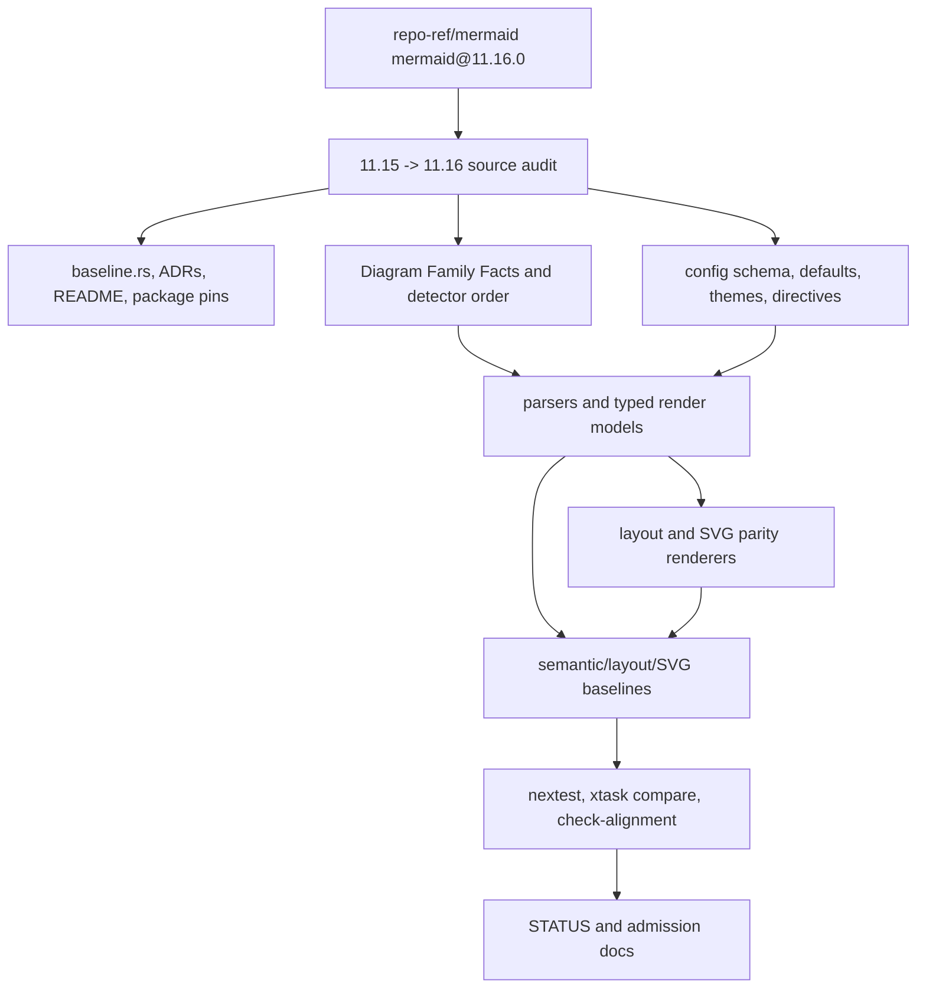

# Mermaid 11.16 Parity Upgrade - Plan

## Goal Capsule

| Field | Value |
| --- | --- |
| Objective | Move Merman's pinned Mermaid source, diagram registry, config/theme surface, fixtures, and SVG parity gates from `mermaid@11.15.0` to `mermaid@11.16.0`. |
| Authority | User request in this session, `repo-ref/mermaid` tags `mermaid@11.15.0` and `mermaid@11.16.0`, current parity policy ADRs, and local baseline/family/admission facts. |
| Execution profile | Broad, breaking refactor allowed; delete stale 11.15 assumptions, out-of-date exclusions, and brittle compatibility shims when the 11.16 source gives a cleaner contract. |
| Stop conditions | Stop only for missing upstream tag/source, external network/package installation failure that blocks official Mermaid SVG generation, or an implementation gap that requires a new architecture decision. |
| Tail ownership | The executor owns implementation, fixture refresh, focused parity fixes, review, commits, and final verification. |

---

## Product Contract

### Summary

Merman currently claims and encodes Mermaid `11.15.0` as the active upstream baseline.
Mermaid `11.16.0` adds new diagram families (`cynefin`, railroad variants, and swimlanes), changes detector registration order, expands config/schema/theme data, and modifies several existing families.
The upgrade should converge on the pinned upstream semantics first: source-backed parsing, registry facts, config behavior, layout/render semantics, fixture baselines, and documentation.

### Problem Frame

The current repository still treats `cynefin` and `railroad` as outside the pinned baseline, deletes their default config entries, and documents `mermaid@11.15.0` as the active source.
That was correct for the previous baseline but becomes active drift after `mermaid@11.16.0`.
The dangerous path is to only bump constants and regenerate SVGs: detector order, frontmatter stripping, schema defaults, treeView syntax, architecture alignment hints, swimlane layout, and existing-family parser deltas would remain subtly wrong.

### Requirements

**Baseline and source authority**

- R1. All baseline metadata, docs, helper package pins, generated schema provenance, and parity status pages must name `mermaid@11.16.0` as the active upstream baseline.
- R2. `repo-ref/mermaid` tag `mermaid@11.16.0` is the source authority for diagram registration, parser grammar, config defaults, theme variables, renderer DOM shape, and fixture import decisions.
- R3. Historical generated suffixes such as `11_12_2` may remain only where they truly describe legacy generated files; new code and docs must use baseline-neutral names or `11_16_0`.

**Diagram registry and detection**

- R4. Diagram Family Facts must mirror Mermaid 11.16 registration order, including `swimlane` before flowchart detectors, railroad family detectors, and `cynefin`.
- R5. Tiny/full profile gating must be source-backed; large-feature handling cannot accidentally hide a newly admitted 11.16 base diagram.
- R6. Known-type side effects and fast keyword detection must produce the same diagram id and config mutations as Mermaid 11.16.

**Config, directives, and theme**

- R7. Generated config schema/defaults must include 11.16 `swimlane`, `cynefin`, and `railroad` definitions and remove the 11.15-era local deletes for those families.
- R8. Root `htmlLabels` precedence, diagram-specific deprecated `htmlLabels`, secure-key filtering, sanitize-directive behavior, and frontmatter stripping must match Mermaid 11.16.
- R9. Theme variables added or changed in 11.16, including treeView icon/description/highlight roles and cynefin/railroad/swimlane roles, must be projected through family-owned render settings rather than raw ad hoc lookups.

**Existing family semantic deltas**

- R10. Architecture must support 11.16 `align row` and `align column` layout hints, validation rules, deterministic `architecture.seed` behavior, and source-backed layout/render propagation.
- R11. TreeView must support 11.16 box-drawing syntax, icons, annotations, descriptions, quoted and bare names, directory suffix semantics, and source-line diagnostics where applicable.
- R12. Existing families touched by 11.16 diffs must be audited and either implemented or explicitly documented as residuals: flowchart, ER, class, state, gantt, block, pie, quadrant, radar, sequence, treemap, venn, wardley detector behavior, and xychart.

**New 11.16 families**

- R13. Cynefin must be introduced as a first-class Mermaid family with detector, parser/model, config projection, fixtures, and a source-backed render admission decision.
- R14. Railroad must cover all 11.16 registered variants: `railroad`, `railroadEbnf`, `railroadAbnf`, and `railroadPeg`, with parser/model boundaries that do not collapse their grammar differences into one lossy syntax.
- R15. Swimlanes must follow upstream's architecture as a flowchart parser/renderer variant with `defaultLayout: "swimlane"` rather than a forked flowchart language.
- R16. New families may enter staged support only when the stage is explicit in admission inventory and docs; parser-only, layout-covered, SVG-covered, deferred, and primary-matrix states must be machine-checkable.

**Fixtures, baselines, and parity gates**

- R17. Semantic snapshots, layout snapshots, upstream SVG baselines, admission inventory, compare commands, and `compare-all-svgs` membership must be refreshed for 11.16.
- R18. Comparator normalization must remain narrow and semantic-preserving; do not add broad masks for layout drift, browser text metrics, RoughJS noise, or upstream D3 wrapper differences.
- R19. Existing primary matrix diagrams must stay green in structural SVG DOM parity after fixture refresh, unless a residual is source-backed, bounded, and documented outside the hidden comparator path.

**Docs and cleanup**

- R20. README, `CONTEXT.md`, ADR-0001, alignment dashboard, unsupported-family/admission docs, and release-facing coverage claims must stop claiming 11.15 as active.
- R21. 11.15-only exclusions, stale comments, dead tests, out-of-date fixture policy, and duplicated registry lists should be removed or replaced by source-backed 11.16 facts.
- R22. Implementation should favor fearless refactors that deepen the existing family-facts, parse-pipeline, headless-render, and admission-inventory architecture instead of layering temporary compatibility patches.

### Acceptance Examples

- AE1. `Engine::detect_type("cynefin-beta\ncomplex\n  A")` detects `cynefin` under the selected 11.16 profile and exposes a semantic/render-stage result consistent with the selected admission state.
- AE2. `railroad-beta`, `railroad-ebnf-beta`, `railroad-abnf-beta`, and `railroad-peg-beta` are separate registered diagram ids with grammar-specific snapshot coverage.
- AE3. `swimlane-beta` is detected before generic flowchart handling and reaches the flowchart semantic/render path with swimlane layout semantics.
- AE4. Architecture fixtures using `align row db1 db2 db3` and `align column api worker cache` parse, validate unknown/duplicate members like upstream, and influence layout deterministically.
- AE5. TreeView fixtures using box-drawing branches, `icon(...)`, `:::class`, and `## description` produce semantic snapshots and SVG DOM close to upstream 11.16 baselines.
- AE6. Frontmatter with indented opening/closing `---` is stripped only when closing indentation matches the opener, preserving indented `---` inside YAML scalar content.
- AE7. `crates/xtask/default_config_overrides.json` no longer removes `cynefin` or `railroad`, and generated config tests prove the 11.16 schema/defaults are active.
- AE8. `docs/alignment/STATUS.md` reports Mermaid `@11.16.0`, lists new 11.16 families with honest admission states, and no longer says railroad/cynefin are absent from the pinned source.

### Scope Boundaries

- This plan does not chase Mermaid commits after `mermaid@11.16.0`.
- This plan does not require browser pixel-perfect parity for text measurement, `getBBox()` floats, `foreignObject`, RoughJS, or hand-drawn output; those may remain documented residuals when the local semantic/SVG structure is correct.
- This plan does not treat a generated upstream SVG mismatch as permission to distort the semantic model or add broad comparator masks.
- This plan does not preserve 11.15 behavior behind a compatibility mode unless it is already part of a documented public API.

### Sources

- `repo-ref/mermaid/packages/mermaid/src/diagram-api/diagram-orchestration.ts`
- `repo-ref/mermaid/packages/mermaid/src/diagram-api/regexes.ts`
- `repo-ref/mermaid/packages/mermaid/src/diagram-api/types.ts`
- `repo-ref/mermaid/packages/mermaid/src/config.type.ts`
- `repo-ref/mermaid/packages/mermaid/src/defaultConfig.ts`
- `repo-ref/mermaid/packages/mermaid/src/schemas/config.schema.yaml`
- `repo-ref/mermaid/packages/mermaid/src/diagrams/cynefin/**`
- `repo-ref/mermaid/packages/mermaid/src/diagrams/railroad/**`
- `repo-ref/mermaid/packages/mermaid/src/diagrams/swimlanes/**`
- `repo-ref/mermaid/packages/mermaid/src/diagrams/architecture/**`
- `repo-ref/mermaid/packages/mermaid/src/diagrams/treeView/**`
- `repo-ref/mermaid/packages/parser/src/language/cynefin/**`
- `repo-ref/mermaid/packages/parser/src/language/railroad*/**`
- `CONTEXT.md`
- `README.md`
- `docs/adr/0001-upstream-baseline.md`
- `docs/adr/0014-upstream-parity-policy.md`
- `docs/alignment/STATUS.md`
- `crates/merman-core/src/baseline.rs`
- `crates/merman-core/src/family.rs`
- `crates/merman-core/src/detect/mod.rs`
- `crates/merman-core/src/diagram/mod.rs`
- `crates/xtask/default_config_schema.yaml`
- `crates/xtask/default_config_overrides.json`
- `crates/xtask/src/cmd/admission.rs`
- `crates/xtask/src/main.rs`
- `tools/mermaid-cli/package.json`

---

## Planning Contract

### Key Technical Decisions

- KTD1. Baseline facts move first.
  Update baseline constants, docs, helper package pins, upstream lock data, and generated config provenance before touching individual renderers so downstream tests fail against the correct source of truth.
- KTD2. Diagram Family Facts remain the registry authority.
  Detector order, semantic parser availability, render parser availability, metadata ids, headers, tiny/full profile filtering, and known-type side effects should be encoded once in `family.rs` projections rather than copied into CLI, analysis, or admission code.
- KTD3. New family admission is staged but not vague.
  `cynefin`, railroad variants, and swimlane can start at parser-only or layout/SVG-covered stages, but every stage must be reflected in admission inventory, fixture dirs, docs, and tests.
- KTD4. Swimlane is a flowchart layout variant.
  Follow upstream's `createFlowDiagram({ defaultLayout: "swimlane" })` model: reuse flowchart parsing/model code where possible and add a layout-mode seam instead of forking flowchart grammar.
- KTD5. Semantic snapshots come before SVG churn.
  Port grammar/config/model changes and prove them through semantic snapshots before regenerating upstream SVG baselines; SVG fixes should then target source-backed structural differences.
- KTD6. Config generation should remove stale local deletes.
  The current local removal of `cynefin` and `railroad` was a 11.15 scope decision. For 11.16, keep upstream keys unless a current security or runtime evidence file justifies a narrow override.
- KTD7. Architecture layout hints belong in the typed model.
  Store `align row/column` as validated layout hints in `ArchitectureDiagramRenderModel` and feed them into the FCoSE/manatee constraint path instead of adding renderer-only string parsing.
- KTD8. TreeView preprocessing must preserve source mapping.
  Box-drawing normalization should produce parser-friendly indentation while keeping original source spans usable for diagnostics and editor facts.
- KTD9. Frontmatter and directive sanitation should be shared.
  Detection, parse pipeline, analysis quick fixes, and source config rewrite should consume one 11.16-compatible preprocessing/sanitization helper, not parallel regexes.
- KTD10. Comparator changes require source evidence.
  Add only family-local, documented normalization for deterministic id/wrapper drift; any semantic DOM or geometry mismatch must be fixed or carried as an explicit residual.

### High-Level Technical Design

### Sequencing

1. Pin source metadata and generated config tooling to 11.16, then run focused baseline/config tests to expose drift.
2. Update registry facts and detector order, including new family ids and admission states.
3. Port preprocessing/config/theme changes that affect multiple families.
4. Implement high-risk existing-family deltas: Architecture alignment/seed and TreeView syntax/render settings.
5. Add new 11.16 families in staged slices: Cynefin, railroad variants, then Swimlane layout variant.
6. Refresh fixtures and upstream SVG baselines family-by-family, fixing structural renderer deltas before entering the global sweep.
7. Update docs/status/admission inventory and delete stale 11.15-only exclusions.
8. Run final verification, review, and commit in coherent milestones.

### System-Wide Impact

This work touches core detection, parser dispatch, semantic/render models, generated config data, theme projection, layout algorithms, SVG parity renderers, fixture import tooling, compare tooling, and user-facing alignment docs.
Public adapters should observe the new baseline through existing parse/layout/render facades; adapters should not grow separate diagram lists.

### Risks And Dependencies

| Risk | Mitigation |
| --- | --- |
| A constant-only baseline bump hides semantic drift | Start with detector/config/family-facts tests and source-backed snapshots before SVG regeneration. |
| New families become permanent parser-only half-support | Record admission stage and owner docs in `crates/xtask/src/cmd/admission.rs` and `docs/alignment/STATUS.md`; require fixture-backed gates for promotion. |
| Swimlane duplicates flowchart logic | Add a flowchart layout-mode seam and keep swimlane-specific behavior narrow. |
| Architecture align hints conflict with existing manatee/FCoSE approximation | Model hints explicitly, port upstream validation first, then apply constraints with focused architecture layout tests. |
| SVG fixture refresh creates large noisy diffs | Refresh family-by-family and commit coherent slices; compare DOM in `parity` mode before touching root viewport residuals. |
| Comparator hides real regressions | Require each normalization to cite source-backed wrapper/id behavior and keep it family-local. |

---

## Implementation Units

### U1. Baseline Pin And Source Tooling

- **Goal:** Make the repository's active upstream baseline unambiguously `mermaid@11.16.0`.
- **Requirements:** R1, R2, R3, R20, AE8.
- **Dependencies:** None.
- **Files:** `crates/merman-core/src/baseline.rs`; `tools/upstreams/REPOS.lock.json`; `tools/mermaid-cli/package.json`; `tools/mermaid-cli/package-lock.json`; `CONTEXT.md`; `README.md`; `docs/adr/0001-upstream-baseline.md`; `docs/alignment/STATUS.md`.
- **Patterns to follow:** `crates/merman-core/src/baseline.rs`; `docs/adr/0001-upstream-baseline.md`; `docs/rendering/UPSTREAM_SVG_BASELINES.md`.
- **Approach:** Update tag, semver, suffix, helper package pin, and source lock commit to the `mermaid@11.16.0` tag.
  Keep legacy generated suffix constants only for files that still exist with old names.
  Add or update focused tests that assert baseline constants, helper CLI package versions, and docs agree.
  Replace current-facing 11.15 prose in baseline docs while leaving historical notes explicitly historical.
- **Test scenarios:** Baseline constants report `mermaid@11.16.0`; helper package pins `@mermaid-js/mermaid-cli` and `mermaid` to `11.16.0`; ADR/status/README/CONTEXT do not claim 11.15 as current; source lock commit matches the local tag.
- **Verification:** `cargo nextest run -p merman-core baseline`; `node -e "const p=require('./tools/mermaid-cli/package.json'); if(p.overrides.mermaid!=='11.16.0') process.exit(1)"`.

### U2. Registry Facts, Detector Order, And Admission Inventory

- **Goal:** Align detector registration, family facts, headers, capability projections, and admission records with Mermaid 11.16.
- **Requirements:** R4, R5, R6, R13, R14, R15, R16, AE1, AE2, AE3.
- **Dependencies:** U1.
- **Files:** `crates/merman-core/src/family.rs`; `crates/merman-core/src/detect/mod.rs`; `crates/merman-core/src/diagram/mod.rs`; `crates/merman-core/src/lib.rs`; `crates/merman-core/src/tests/misc.rs`; `crates/merman-core/tests/snapshots.rs`; `crates/xtask/src/cmd/admission.rs`; `docs/alignment/ADMISSION_INVENTORY.md`; `docs/alignment/STATUS.md`.
- **Patterns to follow:** Existing `DetectorFact`, `SemanticParserFact`, `RenderParserFact`, `DiagramHeaderFact`, and admission inventory projections.
- **Approach:** Port Mermaid 11.16 diagram registration order from `diagram-orchestration.ts`.
  Add detector functions for `swimlane`, `railroad`, `railroadEbnf`, `railroadAbnf`, `railroadPeg`, and `cynefin` with upstream regex/header semantics.
  Add parser/render fact entries only when the backing implementation exists; otherwise record an explicit admission stage and keep fallback behavior honest.
  Extend header completion facts and fast keyword facts without duplicating lists outside `family.rs`.
  Update admission inventory so `cynefin` and railroad variants are no longer `NotInPinnedBaseline`.
- **Test scenarios:** Full detector ids match Mermaid 11.16 order; tiny profile excludes only source-backed large features; swimlane detects before flowchart; known-type `swimlane` does not become generic JSON fallback silently; unsupported-stage new families report explicit capability/admission facts; `xtask check-alignment` catches missing fixture dirs for promoted stages.
- **Verification:** `cargo nextest run -p merman-core detector family`; `cargo nextest run -p xtask admission`; `cargo run -p xtask -- check-alignment`.

### U3. Config, Frontmatter, Directive, And Theme Parity

- **Goal:** Refresh 11.16 config/schema/theme behavior and share preprocessing semantics across detection, parsing, and analysis.
- **Requirements:** R7, R8, R9, R21, AE6, AE7.
- **Dependencies:** U1, U2.
- **Files:** `crates/xtask/default_config_schema.yaml`; `crates/xtask/default_config_overrides.json`; `crates/xtask/src/cmd/generate.rs`; `crates/merman-core/src/config/mod.rs`; `crates/merman-core/src/detect/mod.rs`; `crates/merman-core/src/parse_pipeline.rs`; `crates/merman-core/src/tests/misc.rs`; `crates/merman-analysis/src/source_config_rewrite.rs`; `crates/merman-analysis/tests/analyzer.rs`; `crates/merman-render/src/svg/parity/theme.rs`; `crates/merman-render/src/svg/parity/theme/families.rs`; `crates/merman-render/src/svg/parity/theme/tests.rs`.
- **Patterns to follow:** Existing generated default config override tests; current `MermaidConfig::secure_filtered_overrides`; analysis span remapping tests for frontmatter/directives.
- **Approach:** Refresh schema/default data from Mermaid 11.16 and remove stale overrides that delete `cynefin` and `railroad`.
  Port Mermaid 11.16 frontmatter delimiter behavior, including same-indent opening/closing markers and protection for indented `---` inside YAML scalars.
  Port `sanitizeDirective.ts` behavioral changes into the existing config sanitization layer with depth/security tests intact.
  Project new/changed theme roles through `PresentationTheme` and family config views.
- **Test scenarios:** Generated default config includes `cynefin`, `railroad`, and `swimlane`; architecture seed default matches 11.16 source; root `htmlLabels` precedence still wins; frontmatter same-indent examples strip correctly; mismatched indentation is not stripped; indented YAML scalar `---` is preserved; secure keys remain protected; new theme roles resolve with defaults and overrides.
- **Verification:** `cargo nextest run -p merman-core config misc`; `cargo nextest run -p merman-analysis analyzer`; `cargo nextest run -p merman-render theme`; `cargo test -p xtask default_config`.

### U4. Architecture And TreeView 11.16 Existing-Family Deltas

- **Goal:** Port the largest source-backed existing-family changes before broad fixture refresh.
- **Requirements:** R10, R11, R12, AE4, AE5.
- **Dependencies:** U2, U3.
- **Files:** `crates/merman-core/src/diagrams/architecture.rs`; `crates/merman-render/src/architecture.rs`; `crates/merman-render/src/svg/parity/architecture/**`; `crates/merman-render/tests/architecture_layout_test.rs`; `crates/merman-render/tests/architecture_svg_test.rs`; `crates/merman-core/src/diagrams/tree_view.rs`; `crates/merman-render/src/svg/parity/tree_view/**`; `crates/merman-render/tests/tree_view_svg_test.rs`; `fixtures/architecture/**`; `fixtures/tree_view/**`; `docs/alignment/ARCHITECTURE_SVG_PARITY_GAPS.md`; `docs/alignment/TREEVIEW_MINIMUM.md`.
- **Patterns to follow:** Current architecture typed render model and manatee/FCoSE constraint path; current treeView parser/model/layout/SVG renderer; upstream `architecture.langium`, `architectureDb.ts`, `boxDrawingPreprocessor.ts`, and treeView renderer tests.
- **Approach:** Add `align row/column` to the architecture parser and typed render model with upstream validation: declared services/junctions only, at least two unique members, reserved-key handling, and ordered hints.
  Feed alignment hints into layout constraints without renderer-only parsing.
  Port treeView box-drawing preprocessing, icon/class/description annotations, quoted/bare names, directory suffix semantics, and theme roles.
  Preserve diagnostics/source mapping for editor facts where the source is normalized before parsing.
- **Test scenarios:** Architecture accepts valid row/column alignment and rejects ghost/duplicate members; alignment hints survive render-model parsing; layout tests show deterministic relative placement; treeView accepts standard/heavy box drawing branches; `icon(none)` suppresses icons; explicit icons render even when global icons are hidden; `## description` and `:::class` survive snapshots; quoted names preserve special characters.
- **Verification:** `cargo nextest run -p merman-core architecture tree_view`; `cargo nextest run -p merman-render architecture tree_view`; `cargo run -p xtask -- update-snapshots --diagram architecture`; `cargo run -p xtask -- update-snapshots --diagram tree_view`.

### U5. New Family Parsers And Models

- **Goal:** Add source-backed parser/model support for Cynefin and railroad variants, with honest admission stages.
- **Requirements:** R13, R14, R16, AE1, AE2.
- **Dependencies:** U2, U3.
- **Files:** `crates/merman-core/src/diagrams/mod.rs`; `crates/merman-core/src/diagrams/cynefin.rs`; `crates/merman-core/src/diagrams/railroad.rs`; `crates/merman-core/src/family.rs`; `crates/merman-core/src/diagram/mod.rs`; `crates/merman-core/src/tests/misc.rs`; `crates/merman-core/tests/snapshots.rs`; `fixtures/cynefin/**`; `fixtures/railroad/**`; `fixtures/railroad-ebnf/**`; `fixtures/railroad-abnf/**`; `fixtures/railroad-peg/**`; `docs/alignment/CYNEFIN_MINIMUM.md`; `docs/alignment/RAILROAD_MINIMUM.md`.
- **Patterns to follow:** `crates/merman-core/src/diagrams/packet.rs`; `crates/merman-core/src/diagrams/radar.rs`; `crates/merman-core/src/diagrams/treemap.rs`; existing fixture/golden naming conventions.
- **Approach:** Create minimal typed semantic models that reflect upstream DB structures rather than generic JSON.
  Cynefin parses domains, items, transitions, labels, and seed/config-relevant data from `cynefin-beta`.
  Railroad keeps separate parser entry points for base, EBNF, ABNF, and PEG inputs but may project into a shared syntax tree after variant-specific parsing.
  Add semantic snapshots before layout/SVG support; if layout/SVG is not implemented in this unit, mark admission as parser-only with owner docs and compare skip reasons.
- **Test scenarios:** Cynefin accepts `cynefin-beta` with and without colon; all five domains parse; transitions parse optional labels; invalid domains fail like upstream; base railroad parses function-form `sequence`, `choice`, `optional`, `oneOrMore`, `zeroOrMore`, `terminal`, `nonterminal`, `special`; EBNF parses `=`, `::=`, `|`, postfix `?/*/+`, grouping, and exceptions; ABNF/PEG each have variant-specific syntax snapshots.
- **Verification:** `cargo nextest run -p merman-core cynefin railroad`; `cargo run -p xtask -- update-snapshots --diagram cynefin`; `cargo run -p xtask -- update-snapshots --diagram railroad`.

### U6. Swimlane Flowchart Layout Variant

- **Goal:** Implement `swimlane-beta` as Mermaid 11.16's flowchart layout variant without duplicating flowchart grammar.
- **Requirements:** R15, R16, R18, AE3.
- **Dependencies:** U2, U3.
- **Files:** `crates/merman-core/src/diagrams/flowchart.rs`; `crates/merman-core/src/diagrams/flowchart/**`; `crates/merman-render/src/flowchart/**`; `crates/merman-render/src/svg/parity/flowchart/**`; `crates/merman-render/tests/flowchart_layout_test.rs`; `crates/merman-render/tests/flowchart_svg_test.rs`; `fixtures/swimlane/**`; `crates/xtask/src/cmd/compare/diagrams/**`; `crates/xtask/src/main.rs`.
- **Patterns to follow:** Current `flowchart-elk` known-type side effect; existing flowchart layout-mode/config handling; upstream `packages/mermaid/src/diagrams/swimlanes/swimlanesDiagram.ts`.
- **Approach:** Add a layout-mode field or equivalent typed signal to the flowchart render model so `swimlane-beta` can reuse flowchart parsing while selecting swimlane layout/render settings.
  Port 11.16 swimlane config keys such as `lineHops`, padding, lane ordering, and crossing/rank optimization toggles.
  Implement only source-backed swimlane layout behavior; if full DDLT/swimlane routing is too large for the first implementation slice, keep parser/model support and explicit SVG deferral instead of pretending generic flowchart layout is correct.
- **Test scenarios:** `swimlane-beta` does not detect as generic `flowchart-v2`; flowchart parser accepts normal flowchart statements under swimlane mode; render model records swimlane layout mode; config overrides change the swimlane layout view; promoted fixtures either match upstream DOM parity or are skipped with explicit parser-stage admission reason.
- **Verification:** `cargo nextest run -p merman-core flowchart`; `cargo nextest run -p merman-render flowchart`; `cargo run -p xtask -- update-snapshots --diagram swimlane`; focused swimlane compare command when SVG-covered.

### U7. Remaining Existing-Family 11.16 Audit And Fixes

- **Goal:** Close 11.16 deltas for existing families outside Architecture/TreeView/Swimlane.
- **Requirements:** R12, R17, R18, R19.
- **Dependencies:** U3, U4.
- **Files:** `crates/merman-core/src/diagrams/flowchart.rs`; `crates/merman-core/src/diagrams/er.rs`; `crates/merman-core/src/diagrams/class/**`; `crates/merman-core/src/diagrams/state/**`; `crates/merman-core/src/diagrams/gantt/**`; `crates/merman-core/src/diagrams/block.rs`; `crates/merman-core/src/diagrams/pie.rs`; `crates/merman-core/src/diagrams/quadrant_chart.rs`; `crates/merman-core/src/diagrams/radar.rs`; `crates/merman-core/src/diagrams/sequence/**`; `crates/merman-core/src/diagrams/treemap.rs`; `crates/merman-core/src/diagrams/venn.rs`; `crates/merman-core/src/diagrams/xychart.rs`; matching files under `crates/merman-render/src/**`; matching tests under `crates/merman-render/tests/**`; `fixtures/<diagram>/**`.
- **Patterns to follow:** Existing per-family parser tests and SVG tests; upstream Mermaid changed files under the same family directories.
- **Approach:** For each touched upstream family, classify the diff as parser/model/config/render/test-only.
  Port parser/model changes first, refresh snapshots, then fix layout/SVG drift only when fixtures prove a structural mismatch.
  Keep family-local changelog notes in alignment docs for significant residuals.
- **Test scenarios:** Each upstream-touched family has at least one 11.16 regression fixture when behavior changed; existing fixtures still parse; SVG renderer tests remain deterministic; no family silently falls back to JSON when it previously had typed render support.
- **Verification:** `cargo nextest run -p merman-core`; `cargo nextest run -p merman-render`; family-specific `cargo run -p xtask -- compare-<diagram>-svgs --check-dom --dom-mode parity --dom-decimals 3` for touched SVG families.

### U8. Fixture Import, SVG Baselines, Comparator, And Global Gates

- **Goal:** Refresh 11.16 semantic/layout/SVG evidence and keep global parity checks honest.
- **Requirements:** R17, R18, R19, R21.
- **Dependencies:** U1-U7.
- **Files:** `fixtures/**`; `fixtures/upstream-svgs/**`; `crates/xtask/src/cmd/generate.rs`; `crates/xtask/src/cmd/snapshots.rs`; `crates/xtask/src/cmd/compare/**`; `crates/xtask/src/svgdom.rs`; `crates/xtask/src/cmd/upstream_svg_policy.rs`; `docs/rendering/UPSTREAM_SVG_BASELINES.md`; `docs/alignment/STATUS.md`.
- **Patterns to follow:** Current `gen-upstream-svgs`, `update-snapshots`, `update-layout-snapshots`, `compare-all-svgs`, and admission inventory gates.
- **Approach:** Regenerate or import fixtures family-by-family from Mermaid 11.16 docs/specs/Cypress examples.
  Add compare commands for promoted new SVG families and wire them into `compare-all-svgs` only after family-local evidence is green.
  Update comparator normalization only for source-backed ID/wrapper changes introduced by 11.16.
  Do not hide browser-dependent root residuals; document them in status/residual docs.
- **Test scenarios:** Every promoted fixture has semantic golden, layout golden when layout-covered, and upstream SVG when SVG-covered; `check-alignment` catches missing evidence; new compare commands print useful skip/admission reasons; `compare-all-svgs` includes exactly primary-matrix diagrams.
- **Verification:** `cargo run -p xtask -- check-alignment`; `cargo run -p xtask -- compare-all-svgs --check-dom --dom-mode parity --dom-decimals 3`; focused compare commands for each newly promoted family.

### U9. Documentation, Cleanup, And Final Review

- **Goal:** Remove stale 11.15 assumptions and land the 11.16 upgrade as a durable baseline.
- **Requirements:** R20, R21, R22, AE8.
- **Dependencies:** U1-U8.
- **Files:** `README.md`; `CONTEXT.md`; `docs/adr/0001-upstream-baseline.md`; `docs/alignment/STATUS.md`; `docs/alignment/ADMISSION_INVENTORY.md`; `docs/alignment/UNSUPPORTED_FAMILY_ADMISSION_RUBRIC.md`; `docs/alignment/CYNEFIN_MINIMUM.md`; `docs/alignment/RAILROAD_MINIMUM.md`; `docs/alignment/SWIMLANE_MINIMUM.md`; `docs/alignment/CONFIG_FRONTMATTER_SUPPORT.md`; `docs/rendering/UPSTREAM_SVG_BASELINES.md`; any stale workstream docs that still name 11.15 as current.
- **Patterns to follow:** ADR-0014 parity policy; current STATUS dashboard style; admission inventory owner docs.
- **Approach:** Rewrite current-facing docs to 11.16 and mark remaining gaps by family/admission stage.
  Delete obsolete 11.15 scope exclusions and stale TODOs when the new source-backed plan supersedes them.
  Keep historical ADR context but add a new status/decision note or update ADR-0001 with the 11.16 tag/commit.
  Run a final doc grep for current-facing `11.15` claims and classify each as historical or stale.
- **Test scenarios:** Current-facing docs say `11.16.0`; unsupported family table no longer claims 11.16 families are absent from the pinned baseline; admission docs point to existing owner docs; no stale config override reason describes 11.15 as current.
- **Verification:** `rg -n "11\\.15|11_15_0|mermaid@11\\.15\\.0" README.md CONTEXT.md docs crates tools`; `cargo run -p xtask -- check-alignment`.

---

## Verification Contract

Run verification in widening rings; do not start with the global sweep when a focused unit is still failing.

1. Baseline/config ring:
   - `cargo nextest run -p merman-core baseline config detector family`
   - `cargo test -p xtask default_config`
2. Parser/admission ring:
   - `cargo nextest run -p merman-core`
   - `cargo nextest run -p xtask admission`
   - `cargo run -p xtask -- check-alignment`
3. Render ring:
   - `cargo nextest run -p merman-render`
   - Family-local compare commands for every touched SVG family, using `--check-dom --dom-mode parity --dom-decimals 3`.
4. Fixture/global ring:
   - `cargo run -p xtask -- compare-all-svgs --check-dom --dom-mode parity --dom-decimals 3`
   - Root viewport residual reports only when the touched family claims root parity.
5. Hygiene ring:
   - `cargo fmt`
   - Current-facing doc grep for stale 11.15 claims.
   - Subagent or independent review for registry/config/admission drift before final commit.

Expected residual policy:

- Browser-only measurement/root viewport drift may be documented as residual.
- Family-local parser/layout gaps may remain only if admission inventory marks them parser-only or deferred.
- Comparator masks are not accepted as a substitute for source-backed semantic/render fixes.

---

## Definition Of Done

- Baseline code, docs, helper packages, and lock files identify `mermaid@11.16.0`.
- Diagram Family Facts, detector order, known-type behavior, and admission inventory match Mermaid 11.16 registration semantics.
- Config/schema/theme/frontmatter/directive behavior is refreshed from 11.16 and covered by focused tests.
- Architecture alignment hints and TreeView 11.16 syntax are implemented with semantic and render evidence.
- Cynefin, railroad variants, and swimlane have explicit support stages backed by fixtures and docs.
- Existing-family 11.16 diffs are either implemented or documented as bounded residuals.
- Semantic/layout/SVG fixtures and compare gates are refreshed for promoted 11.16 surfaces.
- Stale 11.15 exclusions and current-facing docs are removed or rewritten.
- Focused nextest, xtask alignment, family compare, and global SVG parity gates are run or any unavailable gate is reported with a concrete blocker.

