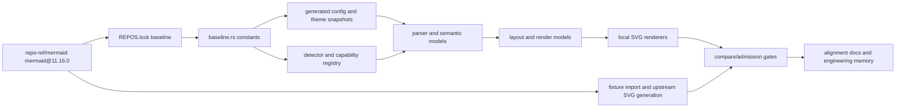

## Goal Capsule

Move Merman's headless Mermaid compatibility target from Mermaid `mermaid@11.15.0` to `mermaid@11.16.0` and make the repository internally consistent with that source baseline.

This is not a string-only version bump. Mermaid 11.16 adds new diagram families, changes parser and configuration behavior, and moves more layout/rendering behavior into source modules that Merman currently approximates. The implementation should prefer source-backed semantic and structural convergence over fixture-specific hacks. Fearless refactoring is allowed: delete stale 11.15-only code, rename generated artifacts when that reduces drift, and break local compatibility where the old behavior contradicts Mermaid 11.16.

## Product Contract

### Summary

Merman is a Rust, headless Mermaid reimplementation. The current implemented matrix targets Mermaid `mermaid@11.15.0`. The upstream reference source in `repo-ref/mermaid` now has tag `mermaid@11.16.0`; the tag object is `5e3c88ea6d937a89078a5e8f1b2a6fd0ea391a5c` and the peeled source commit is `7c0cafcf42e76bfaf79d0cbbd12edb986612f014`. The previous pinned lock points at `mermaid@11.15.0` commit `41646dfd43ac83f001b03c70605feb036afae46d`.

Mermaid 11.16 adds first-class `cynefin-beta`, `swimlane-beta`, and railroad variants, expands config/schema defaults, and changes several existing families. Merman should update its baseline authority, parser/model/render matrix, upstream fixture corpus, comparison gates, and alignment documentation so users see one coherent 11.16 compatibility story.

### Problem Frame

The repository currently encodes 11.15 in multiple layers:

- `crates/merman-core/src/baseline.rs` pins `mermaid@11.15.0`, `11.15.0`, and `11_15_0`.
- `tools/upstreams/REPOS.lock.json` pins the Mermaid source ref to `mermaid@11.15.0`.
- `tools/mermaid-cli/package.json` and lockfile install Mermaid CLI and Mermaid `11.15.0` for upstream SVG generation.
- `playground/src/lib/mermaid-runtime.ts` advertises `MERMAID_JS_VERSION = "11.15.0"`.
- generated and versioned artifacts include `theme_variables_11_15_0.json` and many root/text override modules with legacy suffixes.
- alignment docs currently say `railroad-*` and `cynefin-beta` are absent from the pinned baseline.
- tests and skip reasons contain 11.15-specific parse/render expectations.

If these layers are bumped independently, the repo can claim 11.16 while still generating baselines or admission decisions from 11.15. The upgrade needs one authority chain from upstream tag to generated data to registry facts to fixture evidence.

### Requirements

#### R1. Baseline Authority

- R1.1 Update the active Mermaid baseline constants to `mermaid@11.16.0`, `11.16.0`, and `11_16_0`.
- R1.2 Update `tools/upstreams/REPOS.lock.json` to the `mermaid@11.16.0` ref and commit.
- R1.3 Update the local Mermaid CLI install metadata to use Mermaid CLI / Mermaid `11.16.0` for upstream SVG generation.
- R1.4 Update runtime-facing labels, docs, and tests that report the active Mermaid version.
- R1.5 Decide whether generated 11.15/11.12 suffixes remain intentional legacy data or should be regenerated/renamed. Prefer removing or regenerating stale override tables when 11.16 baselines make them obsolete.

#### R2. Registry, Detection, and Capability Matrix

- R2.1 Mirror Mermaid 11.16 detector registration order from `packages/mermaid/src/diagram-api/diagram-orchestration.ts`.
- R2.2 Add detector and capability entries using Mermaid's 11.16 ids and headers:
  `swimlane` detects `swimlane-beta`, `cynefin` detects `cynefin-beta`, `railroad`
  detects `railroad-beta`, and `railroadEbnf`/`railroadAbnf`/`railroadPeg` detect
  `railroad-ebnf-beta`/`railroad-abnf-beta`/`railroad-peg-beta`.
- R2.3 Reclassify docs and admission inventory rows that said `cynefin-beta` and `railroad-*` were absent from the baseline.
- R2.4 Keep `BaselineRegistryProfile::Full` and `Tiny` behavior explicit; new full-profile families must not accidentally leak into tiny mode unless upstream tiny registration includes them.
- R2.5 Ensure unsupported or parser-only families remain explicit capability states, not silent detector gaps.

#### R3. Shared Parse and Config Semantics

- R3.1 Port Mermaid 11.16 frontmatter matching semantics: closing `---` must use the same indentation as the opening marker.
- R3.2 Refresh generated default config and schema-derived behavior from Mermaid 11.16 source instead of hand-editing default config JSON.
- R3.3 Add config fields introduced by 11.16, including `swimlane`, `cynefin`, `railroad`, pie `donutHole`/legend/highlight options, xychart `labelRotation`, architecture `seed`, and treeView icon config.
- R3.4 Preserve existing Rust extension behavior only when it is deliberately documented as an extension and does not contradict upstream 11.16 defaults.

#### R4. Existing Family Semantic Deltas

- R4.1 Flowchart: align `swimlane-beta` entry handling, subgraph `explicitDir` behavior, and 11.16 parser expectations for direction normalization.
- R4.2 ER: support 11.16 attribute parsing changes, including backtick blocks, comma tolerance, and nullable `?` suffixes.
- R4.3 State: match the new error behavior for multi-word state names followed by `{`.
- R4.4 XYChart: support labeled data points and axis label rotation config.
- R4.5 Architecture: support layout hints, deterministic seeded layout behavior, and clearer range errors.
- R4.6 Pie: carry new donut/legend/highlight config into model and render behavior.
- R4.7 TreeView: port box drawing preprocessing and icon config semantics where Merman exposes treeView.
- R4.8 Audit smaller touched families from the upstream diff (`block`, `class`, `gantt`, `quadrant-chart`, `radar`, `sequence`, `treemap`, `venn`, `wardley`) and add focused tests where the 11.16 source changed public behavior.

#### R5. New 11.16 Families

- R5.1 Treat `cynefin-beta` as an in-scope 11.16 family. Add detection, parser/model, render model, renderer, fixtures, admission metadata, and docs, unless implementation evidence proves a narrower staged admission is required.
- R5.2 Treat railroad variants as in-scope 11.16 families: `railroad`, `railroadEbnf`, `railroadAbnf`, and `railroadPeg`, with their corresponding beta headers.
- R5.3 Treat `swimlane-beta` as in-scope. Because upstream implements it through flowchart-compatible rendering and new swimlane layout utilities, prefer integrating it with the flowchart model/layout where source-backed.
- R5.4 Parser implementations must preserve editor/LSP value: source spans, recoverable diagnostics, partial AST/facts, and completion-friendly node/context data are part of the contract, not afterthoughts.
- R5.5 If a family cannot reach render parity in this workstream, it must still have a deliberate capability state, parser evidence, fixture evidence, and a documented residual reason. Do not leave it as an accidental detector miss.

#### R6. Layout and Rendering Parity

- R6.1 Preserve the repo policy: source-backed semantic and structural convergence first, narrow comparator normalization second, never broad magic-number tuning.
- R6.2 Port Mermaid 11.16 layout/render changes that affect structural SVG DOM shape before regenerating baselines.
- R6.3 For architecture, use a deterministic seed strategy that corresponds to upstream `architectureSeed.ts` behavior rather than relying on ambient `Math.random` assumptions.
- R6.4 For swimlane/flowchart, evaluate 11.16 DDLT/DOMUS/line-hop changes and either port the robust part or document bounded browser/layout residuals.
- R6.5 Keep browser-dependent residuals bounded and documented: text measurement, `getBBox()` floats, HTML labels, `foreignObject`, fonts, D3 wrapper noise, RoughJS output.

#### R7. Fixtures, Baselines, Comparator, and Docs

- R7.1 Regenerate or refresh upstream fixtures and SVG baselines against Mermaid 11.16 for all touched families.
- R7.2 Add compare/admission coverage for new 11.16 families that have renderers.
- R7.3 Update skip policies whose reason says "Mermaid 11.15" after validating whether 11.16 still fails.
- R7.4 Update `docs/alignment/*`, ADRs, upstream baseline docs, and status/backlog documents so they describe 11.16.
- R7.5 Remove stale 11.15-only workstream claims from current-facing docs, or move them to historical context when they still matter.

### Acceptance Examples

- AE1. `cynefin-beta` detects as upstream id `cynefin`, parses into a typed model, and reports either render support or a deliberate staged capability with fixtures and docs.
- AE2. `railroad-beta`, `railroad-ebnf-beta`, `railroad-abnf-beta`, and `railroad-peg-beta` detect as `railroad`, `railroadEbnf`, `railroadAbnf`, and `railroadPeg` respectively, with grammar-specific parser snapshots.
- AE3. `swimlane-beta` detects before generic flowchart handling and reaches a source-backed flowchart/swimlane model or layout path.
- AE4. Architecture fixtures using 11.16 alignment hints and seed config parse, validate unknown or duplicate members with upstream-shaped errors, and render deterministically for a fixed seed.
- AE5. TreeView fixtures using box-drawing input and icon annotations parse to the 11.16 model shape and render with documented icon behavior.
- AE6. Frontmatter with matching indented opening and closing `---` is stripped; mismatched indentation remains diagram text.
- AE7. Generated default config contains `swimlane`, `cynefin`, and `railroad` entries instead of deleting them as 11.15-era absent families.
- AE8. `docs/alignment/STATUS.md` reports Mermaid `@11.16.0` and no longer describes `railroad-*` or `cynefin-beta` as absent from the pinned source.

### Scope Boundaries

In scope:

- Active Mermaid baseline bump to 11.16 across source lock, generated config/theme data, runtime labels, tests, and current docs.
- Source-backed parser/model/layout/render changes for Mermaid 11.16 public behavior.
- New 11.16 families: cynefin, railroad variants, and swimlane.
- Fixture import/generation/comparison refresh and admission inventory updates.
- Fearless cleanup of obsolete 11.15-only code paths and stale documentation.

Deferred unless required by a failing gate:

- Pixel-perfect matching for browser-only effects that the project policy already treats as bounded residuals.
- Rebuilding all legacy root/text override infrastructure in one pass if it remains correct and explicitly marked legacy.
- Release packaging, publishing, or PR creation beyond local commits.
- External libraries not affected by Mermaid 11.16 unless tests prove their pinned versions now block parity.

Out of scope:

- Changing Merman's broader product strategy or supported public API beyond the 11.16 parity surface.
- Introducing brittle fixture-specific SVG rewrites to mask semantic or layout divergence.

## Planning Contract

### Key Technical Decisions

- KTD1. Make the baseline authority chain explicit before touching family behavior. The canonical order is `repo-ref/mermaid` tag -> `tools/upstreams/REPOS.lock.json` -> `baseline.rs` -> generated config/theme -> registry/capability facts -> fixtures/baselines/docs.
- KTD2. New Mermaid 11.16 families are first-class parity candidates. They may land in staged capability states only when implementation evidence justifies it.
- KTD3. Generated config/theme artifacts should be regenerated from Mermaid 11.16 source, not hand-patched.
- KTD4. Existing family changes should be tested as semantic deltas first. SVG baseline refresh happens after parser/model/layout behavior is source-backed.
- KTD5. Deterministic layout behavior belongs in model/layout code, not in comparator normalization.
- KTD6. `BaselineRegistryProfile` remains the central registry profile abstraction; avoid scattered 11.16-specific conditionals.
- KTD7. Current-facing docs should describe 11.16. Historical 11.15 docs may remain only when clearly labeled as historical workstream evidence.
- KTD8. Grammar tooling is acceptable only if it fits the LSP/editor contract. A parser generator such as LALRPOP must provide precise spans, useful recovery, and incremental-friendly partial facts before it replaces the current hand-written or parser-combinator style.

### Architecture Shape

### Risk Register

- Risk: New diagrams are real features, not simple detector additions.
  - Mitigation: admit them through the same parser/model/render/fixture/admission path used by mature families; allow staged capability only with evidence.
- Risk: Baseline refresh creates large SVG churn before semantics are correct.
  - Mitigation: implement semantic deltas and focused fixture probes before broad baseline generation.
- Risk: Architecture and swimlane layout behavior depends on randomness or browser measurement.
  - Mitigation: seed deterministic layout locally, keep measurement residuals documented, and avoid comparator broadening.
- Risk: Generated artifacts and legacy suffixes obscure which baseline is active.
  - Mitigation: either regenerate/rename or explicitly separate active 11.16 data from historical compatibility tables.
- Risk: Docs remain internally contradictory after code moves.
  - Mitigation: update status/admission/baseline docs in the same units that change capabilities.

### Execution Notes

- Before modifying Rust code, load the repo's Rust best-practices guidance.
- Prefer `cargo nextest` for Rust test gates and `cargo fmt` for formatting.
- Keep commits focused by logical unit, using Conventional Commits messages.
- Do not reset, restore, stash, or clean unrelated local/user changes while executing this plan.

## Implementation Units

### U1. Baseline Authority and Generated Data

Purpose: make the repository's active Mermaid version unambiguous before semantic work starts.

Touches:

- `crates/merman-core/src/baseline.rs`
- `tools/upstreams/REPOS.lock.json`
- `tools/mermaid-cli/package.json`
- `tools/mermaid-cli/package-lock.json`
- `playground/src/lib/mermaid-runtime.ts`
- `crates/merman-core/src/generated/default_config.json`
- `crates/merman-core/src/generated/theme_variables_11_15_0.json` or a new `theme_variables_11_16_0.json`
- `crates/merman-core/src/theme.rs`
- current-facing docs that name the active baseline

Work:

- Update baseline constants and upstream lock to 11.16.
- Install or lock Mermaid CLI and Mermaid 11.16 for upstream SVG generation.
- Regenerate default config and theme variables from the 11.16 source.
- Rename generated theme snapshot to 11.16 if the include path can be moved cleanly; otherwise add a clearly named 11.16 snapshot and delete stale active references.
- Update version-reporting tests and runtime labels.

Test scenarios:

- Baseline constants report `mermaid@11.16.0`, `11.16.0`, and `11_16_0`.
- The generated default config includes new `swimlane`, `cynefin`, and `railroad` sections.
- Theme loading reads the 11.16 snapshot.
- Upstream lock and CLI package metadata agree on 11.16.

### U2. Detector Registry and Admission Matrix

Purpose: make Mermaid 11.16 diagram discovery and capability reporting source-backed.

Touches:

- `crates/merman-core/src/family.rs`
- `crates/merman-core/src/detect/*`
- `crates/merman-core/src/diagrams/mod.rs`
- `crates/xtask/src/cmd/admission.rs`
- `docs/alignment/ADMISSION_INVENTORY.md`
- `docs/alignment/STATUS.md`
- `docs/alignment/UNSUPPORTED_FAMILY_ADMISSION_RUBRIC.md`

Work:

- Add detectors for Mermaid's 11.16 id/header pairs: `swimlane`/`swimlane-beta`, `cynefin`/`cynefin-beta`, `railroad`/`railroad-beta`, `railroadEbnf`/`railroad-ebnf-beta`, `railroadAbnf`/`railroad-abnf-beta`, and `railroadPeg`/`railroad-peg-beta`.
- Mirror upstream 11.16 registration order, including the `swimlanes` placement after sequence and before flowchart, and railroad placement near treemap/venn.
- Add capability rows for new families with explicit parser/render status.
- Remove "absent from pinned 11.15" statements from current-facing docs.

Test scenarios:

- Each new Mermaid 11.16 header detects to the expected upstream family id, not to the raw header token.
- Existing flowchart/state/class detection remains stable.
- Full vs tiny registry profile behavior is explicit and tested.
- Admission inventory fails if a new in-scope family lacks parser/render/fixture state.

### U3. Shared Parse Pipeline and Config Semantics

Purpose: align cross-family parsing and config behavior before family-specific fixtures are refreshed.

Touches:

- `crates/merman-core/src/config/*`
- `crates/merman-core/src/parse_pipeline.rs`
- `crates/merman-core/src/inline_config.rs`
- `crates/merman-core/src/yaml_config.rs`
- `crates/merman-core/src/sanitize.rs`
- related config/theme tests

Work:

- Port the 11.16 frontmatter indentation rule.
- Add strongly typed accessors or structured config coverage for new 11.16 config fields where existing code consumes diagram config.
- Ensure `sanitizeDirective` and directive parsing tests still reflect upstream behavior after the frontmatter regex change.
- Keep old config shims only when tests prove they are needed for documented compatibility.

Test scenarios:

- Frontmatter with mismatched closing indentation no longer parses as frontmatter.
- Frontmatter with matching indentation still parses.
- New diagram config sections round-trip through merged config.
- Existing directives and theme variable overrides remain stable.

### U4. Existing Family 11.16 Semantic Deltas

Purpose: port source-backed behavior changes for families Merman already supports.

Touches:

- Flowchart: `crates/merman-core/src/diagrams/flowchart/*`, `crates/merman-render/src/flowchart/*`
- ER: `crates/merman-core/src/diagrams/er.rs`, `crates/merman-core/src/diagrams/er_grammar.lalrpop`
- State: `crates/merman-core/src/diagrams/state/*`, `crates/merman-core/src/diagrams/state_grammar.lalrpop`
- XYChart: `crates/merman-core/src/diagrams/xychart.rs`, `crates/merman-render/src/xychart.rs`
- Architecture: `crates/merman-core/src/diagrams/architecture.rs`, `crates/merman-render/src/architecture.rs`
- Pie: `crates/merman-core/src/diagrams/pie.rs`, `crates/merman-render/src/pie.rs`
- TreeView: `crates/merman-core/src/diagrams/tree_view.rs`, `crates/merman-render/src/tree_view.rs`

Work:

- Flowchart: preserve raw explicit subgraph directions and normalize `TD` to `TB` only where upstream does.
- ER: port nullable attributes, comma/backtick lexing, and related golden fixtures.
- State: add the single-word state name error path.
- XYChart: model data points with optional labels and label rotation.
- Architecture: add layout hints and seed-aware deterministic layout.
- Pie: model/render donut, legend position, and slice highlight config.
- TreeView: port box drawing preprocessing and icon options.
- Audit smaller changed families and add focused regression tests where source changed observable behavior.

Test scenarios:

- One focused parser/model test per listed upstream semantic change.
- Existing 11.15 fixtures either continue to pass or are deliberately updated to 11.16 semantics.
- Render model JSON changes are intentional and reflected in golden files.

### U5. New Family Implementation

Purpose: promote 11.16-added families into Merman's parity matrix.

Touches:

- New core modules under `crates/merman-core/src/diagrams/`
- New render modules under `crates/merman-render/src/`
- `crates/merman-core/src/family.rs`
- `crates/merman-render/src/lib.rs` and SVG parity routing
- fixtures under `fixtures/cynefin`, `fixtures/railroad`, and `fixtures/swimlane` or the repo's chosen canonical family names
- compare/admission command wiring under `crates/xtask/src/cmd`
- family coverage docs under `docs/alignment`

Work:

- Implement `cynefin-beta` parser/model from `packages/mermaid/src/diagrams/cynefin` and `packages/parser/src/language/cynefin`.
- Implement railroad parsers/models for the default, EBNF, ABNF, and PEG variants from upstream parser sources, preserving upstream ids separately from beta header text.
- Implement `swimlane-beta` using source-backed flowchart/swimlane layout behavior.
- For every new parser, design the editor facts path at the same time as the render model path: AST nodes carry `SourceSpan`, diagnostics are recoverable where upstream permits, and completions can reason about the current header/statement context.
- Evaluate LALRPOP only for the railroad dialects after a spike proves span plumbing and error recovery are at least as good as the existing `SourceSpan`-centric parsers. Prefer hand-written or lightweight parser-combinator code for small line-oriented grammars such as cynefin and for swimlane flowchart reuse.
- Add initial renderers that produce structurally comparable SVG for simple and representative examples.
- Add parser-only or deferred states only when source complexity blocks robust rendering in this workstream; document why and keep capability explicit.

Test scenarios:

- Each new family has detection tests, parser/model snapshots, and at least one render fixture.
- Renderable new families participate in compare/admission gates.
- Parser-only/deferred new families are visible in capability output and docs.

### U6. Layout and SVG Parity Refresh

Purpose: align layout/render behavior after parser and model semantics are source-backed.

Touches:

- `crates/merman-render/src/architecture.rs`
- `crates/merman-render/src/flowchart/*`
- `crates/merman-render/src/svg/parity/*`
- generated root/text/font override modules
- `crates/xtask/src/cmd/overrides/*`
- `crates/xtask/src/cmd/upstream_svg_policy.rs`

Work:

- Port deterministic architecture seeding and layout hints.
- Evaluate and port robust parts of 11.16 line-hop/swimlane/DDLT layout behavior.
- Refresh root/text overrides from 11.16 only after local behavior is as close as source-backed implementation allows.
- Review skip reasons that mention 11.15 and revalidate against 11.16.
- Keep comparator normalization narrow and documented.

Test scenarios:

- Architecture output is deterministic for a fixed seed.
- Flowchart/swimlane examples have stable layout JSON and SVG structure.
- Compare gates do not gain broad new normalization to pass fixtures.

### U7. Fixture Import, Baseline Generation, and Compare Gates

Purpose: make evidence and gates reflect Mermaid 11.16 instead of stale 11.15 output.

Touches:

- `crates/xtask/src/cmd/import/*`
- `crates/xtask/src/cmd/compare/*`
- `crates/xtask/src/cmd/verify.rs`
- `fixtures/**`
- `fixtures/upstream-svgs/**`
- `docs/rendering/UPSTREAM_SVG_BASELINES.md`

Work:

- Re-run upstream docs/examples/html/cypress/pkg-tests import paths for touched families.
- Generate upstream SVGs with the 11.16 CLI install.
- Add compare commands for cynefin, railroad, and swimlane when renderers exist.
- Update `compare-all-svgs` and admission gates to include new renderable families.
- Move or delete stale fixtures that only represented 11.15 behavior.

Test scenarios:

- Upstream SVG generation uses Mermaid 11.16.
- Family-local compare commands pass or report documented residuals.
- `compare-all-svgs` includes the correct 11.16 family set.
- Admission inventory is internally consistent with fixtures and compare commands.

### U8. Documentation, Memory, and Final Cleanup

Purpose: land the upgrade as a coherent workstream, not a code-only migration.

Touches:

- `docs/adr/0001-upstream-baseline.md`
- `docs/alignment/*`
- `docs/workstreams/*` current-facing pages
- `docs/knowledge/engineering/*`
- `README.md` or other user-facing version statements if present

Work:

- Update current-facing documentation to 11.16.
- Mark historical 11.15 material as historical or remove it from current status pages.
- Record major decisions and verification in engineering wiki memory.
- Remove dead code and obsolete test expectations found during implementation.
- Make focused conventional commits after verified logical units.

Test scenarios:

- A targeted search for `11.15.0`, `11_15_0`, and `mermaid@11.15.0` leaves only historical or explicitly legacy references.
- `railroad-*` and `cynefin-beta` are no longer documented as absent from the active baseline.
- Engineering memory has a current-state entry for the 11.16 migration.

## Verification Contract

Run the smallest meaningful checks after each unit, then the broader gates before considering the plan complete.

Baseline and generation gates:

- `cargo run -p xtask -- verify-generated`
- `cargo run -p xtask -- verify-default-config`
- `cargo run -p xtask -- check-upstream-svgs` after upstream SVG refresh

Rust checks:

- `cargo fmt`
- `cargo nextest run -p merman-core`
- `cargo nextest run -p merman-render`
- `cargo nextest run -p xtask`

Parity gates:

- Run family-local compare commands for every touched existing family, at minimum flowchart, er, state, xychart, architecture, pie, treeView, and any smaller family with a source-backed 11.16 delta.
- Run new-family compare commands for cynefin, railroad, and swimlane when renderers are admitted.
- Run `cargo run -p xtask -- compare-all-svgs --check-dom --dom-mode parity-root --dom-decimals 3` before the final cleanup if runtime is practical.

Documentation and consistency gates:

- Search current-facing code/docs for stale active-baseline claims: `mermaid@11.15.0`, `11.15.0`, and `11_15_0`.
- Validate admission inventory and capability reporting.
- Validate engineering wiki memory after adding progress/handoff entries.

## Definition of Done

- Active baseline authority points to Mermaid `mermaid@11.16.0` everywhere production code, generation tooling, and current-facing docs claim the active upstream version.
- Generated default config and theme data are derived from Mermaid 11.16.
- Registry/detection/capability output includes Mermaid 11.16 families with deliberate full/tiny profile behavior.
- `cynefin-beta`, railroad variants, and `swimlane-beta` are either supported with parser/model/render/fixture/admission evidence or explicitly staged with source-backed residual documentation.
- Existing family semantic deltas from Mermaid 11.16 have focused parser/model/render tests.
- Upstream fixtures and SVG baselines for touched families are refreshed from the 11.16 CLI/source path.
- Comparator normalization remains narrow and source-backed; no broad magic-number or fixture-specific masking was added.
- Current-facing docs no longer say `railroad-*` or `cynefin-beta` are absent from the pinned baseline.
- Obsolete 11.15-only code and stale tests are deleted or relabeled as historical/legacy.
- Planned verification gates pass. Any accepted residual is narrow, source-backed, reflected in a skip/residual policy, and documented with the exact command, affected family, and next action; untriaged failures are not done.
- Engineering wiki memory records the migration state, key decisions, verification, commits, and any residual risks.

## Research Evidence

- Local upstream diff: `git -C repo-ref/mermaid diff --name-status mermaid@11.15.0 mermaid@11.16.0 -- packages/mermaid/src packages/parser/src`.
- The 11.16 tag object resolves locally to `5e3c88ea6d937a89078a5e8f1b2a6fd0ea391a5c`; the peeled source commit is `7c0cafcf42e76bfaf79d0cbbd12edb986612f014`.
- Major added upstream directories: `packages/mermaid/src/diagrams/cynefin`, `packages/mermaid/src/diagrams/railroad`, `packages/mermaid/src/diagrams/swimlanes`, and parser languages for cynefin and railroad variants.
- Major changed upstream areas: `diagram-api`, `config.type.ts`, `defaultConfig.ts`, `schemas/config.schema.yaml`, architecture, flowchart, ER, state, xychart, treeView, pie, and shared layout/render utilities.
- Local repository evidence: `baseline.rs`, `REPOS.lock.json`, `tools/mermaid-cli/package.json`, `family.rs`, `xtask` import/compare/admission commands, generated theme/config files, alignment docs, and existing fixture trees.
