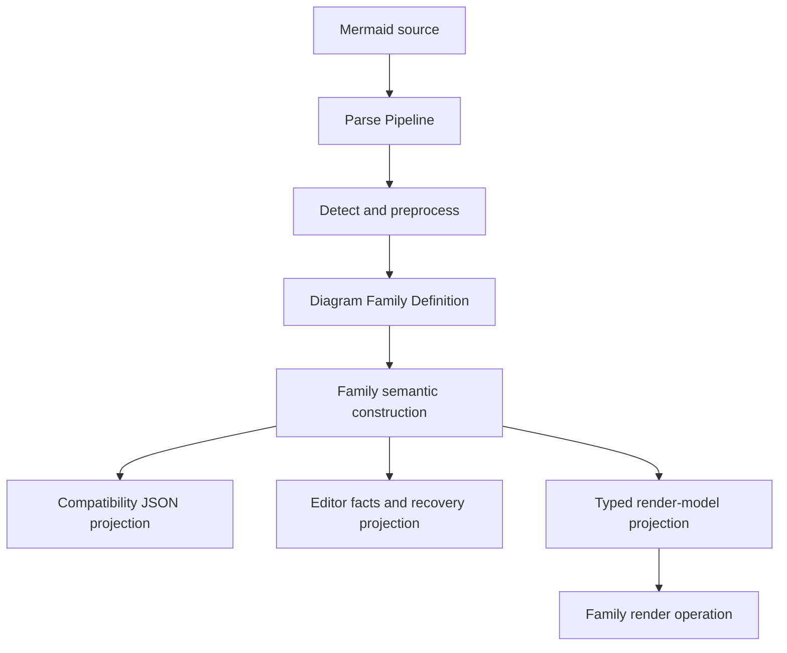
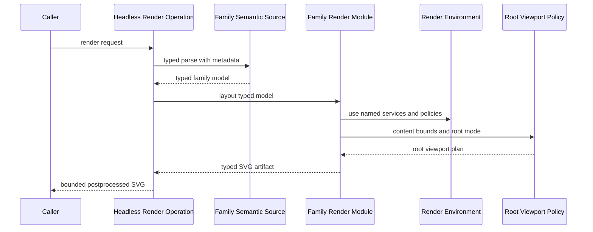
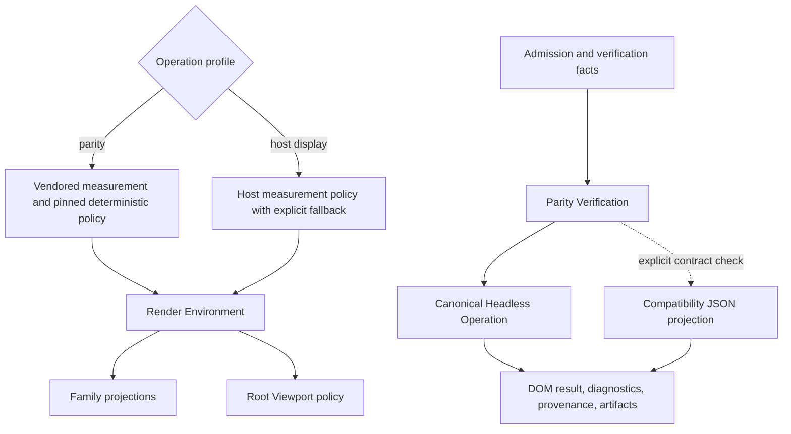

# Mermaid Family-Owned Architecture Refactor - Plan

## Goal Capsule

- **Objective:** Make each built-in Mermaid diagram family own one semantic construction and its editor, compatibility JSON, typed layout, and SVG projections, while shared operations own orchestration, render policy, root viewport policy, and parity verification.
- **Authority:** Pinned Mermaid `11.16.0@7c0cafcf` source is authoritative for grammar and observable behavior; this plan and the ADRs named below govern ownership; historical compatibility code has no authority when it conflicts with either.
- **Execution profile:** Fearless refactor. Breaking Rust APIs, serialized editor provenance, and internal module boundaries are allowed. Remove superseded code instead of keeping deprecated aliases or permanent dual paths.
- **Stop conditions:** Do not force a browser-only residual into parser or model semantics, broaden comparator normalization, grow fixture-specific overrides without source evidence, or guess when a change would contradict pinned Mermaid behavior.
- **Tail ownership:** Execute on a feature branch with focused Conventional Commits. Complete local verification and commits; do not push or open a PR unless separately requested.

---

## Product Contract

### Summary

Merman will converge on vertical diagram-family modules and a small set of deep cross-family operations. Successful parsing will construct family semantics once, rendering will use a typed and type-safe path, editor analysis will stop inventing body semantics through text scans, render dependencies will be selected once per operation, every SVG root will use one viewport policy, and parity tooling will verify the same canonical path users call.

### Problem Frame

The repository already has strong shared orchestration in `crates/merman-core/src/parse_pipeline.rs` and `crates/merman/src/render/operation.rs`, but family knowledge still leaks around those operations.

Core currently maintains separate semantic JSON and typed render parser registries, plus an editor parser match in the parse pipeline. Architecture interprets the same source three times for JSON, typed rendering, and editor facts. Langium families independently reimplement the shared `TitleAndAccessibilities` grammar, which has already produced a real Packet multiline `accDescr` parity failure. When parser facts are unavailable, analysis silently invokes a generic body scanner even though every admitted product family is documented as parser-backed.

Rendering repeats family dispatch across typed layout, JSON layout, raw JSON SVG, and typed SVG. The typed SVG path accepts independently constructed semantic and layout enums, so invalid family pairings remain representable until runtime. `SvgRenderOptions` mixes production dependencies with debug controls, while Architecture and Treemap bypass the operation-selected text measurer. Root viewport policy is shared by three families, but most families still compute root attributes directly and nine still call a mutable-string override helper.

The verification layer compounds the risk: all current per-family compare commands rebuild the legacy JSON parse-layout-render chain. None uses the canonical typed `HeadlessOperation`, so the main parity gate can remain green while the user-facing render operation regresses.

### Requirements

#### Semantic ownership

- R1. Every admitted built-in family must have one successful semantic construction that owns grammar interpretation, DB mutation order, validation, and source-backed spans.
- R2. Compatibility JSON, typed render models, and editor facts must be projections of family-owned semantics; recoverable editor parsing may use a partial path, but it must share the family's tokens and grammar facts rather than implement a second successful grammar.
- R3. Diagram family facts must be the single built-in catalog for detector order, aliases, registry profile, semantic parser, editor parser, typed render parser, render metadata, and authoring headers.
- R4. Families that import Mermaid's Langium `common.langium` must consume one span-rich common syntax module for title, accessibility title, and inline or block accessibility description behavior.
- R5. Parser-backed analysis must never synthesize body symbols from a generic text scan. Empty, unknown, unsupported, and failed inputs must expose honest absence or registered recovery facts while source-start diagram-header completion remains available independently.

#### Render ownership

- R6. The canonical built-in render path must remain typed from family semantics through layout and SVG; compatibility JSON must be a projection, never a second master render path. Custom semantic parsers may expose an explicit non-renderable JSON model boundary, while the built-in error family keeps its dedicated typed render path.
- R7. A type-safe family render artifact must make mismatched semantic-model and layout variants unrepresentable on the canonical path, while one thin exhaustive router delegates to family-owned layout and SVG behavior.
- R8. One render environment must select text-measurement phases, deterministic time and seed policy, math rendering, icon lookup, resource limits, and root-override policy once per operation. Family code must not instantiate hidden adapters or read process-global policy.
- R9. Every built-in family must route root bounds, sizing mode, override resolution, and root SVG emission through one Root Viewport module while retaining family-owned content bounds and source-specific root algorithms.

#### Verification and cleanup

- R10. Parity Verification must execute the canonical headless typed operation by default and report the actual render path, upstream provenance, DOM mode, normalization policy, accepted residuals, and root coverage.
- R11. Compatibility JSON projection checks must remain explicit and narrow. They must not be used as the SVG oracle for built-in families or duplicate canonical family behavior tests.
- R12. The final tree must contain no transitional dual dispatch, generic body TextScan, direct family root-override helper, family-local production measurer construction, or pass-through public SVG wrappers used only by legacy tooling.
- R13. Observable behavior must remain aligned with pinned Mermaid source, including aliases, tiny/full profiles, feature gates, sanitization, resource limits, accessibility fields, DOM structure, and documented browser-dependent residuals.

### Acceptance Examples

- AE1. Parsing one Architecture source produces compatibility JSON and a typed render model with identical title, accessibility, group, node, edge, ordering, and layout-hint semantics; editor facts for the same source use the same statement facts and exact original-source spans.
- AE2. An incomplete Architecture statement yields registered recovered editor facts and a precise diagnostic without running a separate editor-only grammar or generic body scan.
- AE3. `packet` with a multiline `accDescr { ... }` parses successfully, preserves all lines in compatibility JSON and the typed render model, and exposes the payload span through editor facts.
- AE4. Architecture, Cynefin, GitGraph, Info, Packet, Pie, and Radar agree on upstream `common.langium` behavior for inline values, multiline blocks, comments, CRLF input, empty values, and unterminated-block recovery; unsupported Wardley remains an explicit capability state rather than an accidental adapter.
- AE5. Every admitted family and alias has an explicit editor adapter in Diagram Family Facts for its selected profile. A custom parser without editor capability returns visible unavailability rather than guessed symbols.
- AE6. Empty source still offers diagram-header authoring choices, but malformed unknown source and parser failure never manufacture node identifiers, document symbols, references, or semantic tokens from body text.
- AE7. A built-in render request cannot pair a Packet semantic model with a Pie layout. Alias and feature-gated variants reach the correct family-owned adapter, the error family uses its dedicated renderer, and a registered custom semantic parser without a render family returns explicit unavailable layout/SVG capability.
- AE8. Layout JSON requested through the public high-level API is projected from the canonical typed layout; it does not invoke the removed JSON layout dispatcher.
- AE9. A counting host text measurer changes the documented host-measured Architecture and Treemap phases, while the default parity profile uses its named vendored phase. No family silently constructs another production measurer.
- AE10. Responsive and fixed SVG roots, explicit and generated overrides, disabled overrides, accessibility attributes, and family-specific attribute order are all emitted through Root Viewport policy without changing accepted DOM behavior.
- AE11. A per-family compare command and `compare-all-svgs` render through the canonical Headless Render Operation, preserve locks and upstream provenance checks, and retain only documented Flowchart, ER, Gantt, or other family-specific diagnostic hooks.
- AE12. The strict repository verification gate, workspace tests, formatting, clippy, override no-growth audit, structural DOM parity, normal parity, and parity-root all pass without broadening comparison rules.
- AE13. A registry-driven corpus proves every admitted family constructs successful semantics through one family-owned source and projects equivalent common fields, ordering, warnings, typed render data, and editor facts without a second successful parser.

### Scope Boundaries

#### In scope

- All six architecture opportunities accepted in the architecture review: family-owned vertical modules, Diagram Family Facts/editor convergence, all-family Root Viewport, Langium common facts, Parity Verification, and Render Environment policy.
- Breaking low-level Rust render APIs and serialized editor provenance where required to enforce the target invariants.
- Deleting obsolete adapters, registries, helpers, wrappers, tests, and docs after their behavior moves to the new owner.
- Updating direct callers across Rust, CLI, bindings, WASM, LSP/editor surfaces, examples, benchmarks, and `xtask`.

#### Out of scope

- Replacing all family parsers with one parser generator or forcing Jison-derived, hand-written, and Langium grammars through one shallow global parser.
- Splitting `ParsePipeline` or `HeadlessOperation`; both remain deep orchestration modules and should become smaller only because leaked family policy moves behind their interfaces.
- Implementing a browser, CSS cascade, or general SVG text-layout engine.
- Adding new Mermaid diagram families or expanding Wardley support as part of this architecture migration.
- Broad comparator normalization, model distortion, or magic-number tuning to make fixtures pass.
- Publishing, pushing, opening a PR, or releasing packages.

---

## Planning Contract

### Key Technical Decisions

- KTD1. **Deepen the existing family-facts seam instead of creating another registry.** A single built-in family definition will project the detector, JSON parser, editor parser, typed parser, alias/profile, header, and metadata registries. Custom registries remain explicit overlays with visible capability gaps.
- KTD2. **Prove family ownership with Architecture before generalizing it.** Architecture already has a DB with ordering and validation state plus three duplicated interpretation paths. Its family semantic source becomes the tracer for successful construction, projection, and recoverable editor facts.
- KTD3. **Model Mermaid common syntax narrowly.** The shared span-rich module covers only families that import upstream `common.langium`; Sequence, C4, ZenUML, and other grammars keep their source-specific title and accessibility syntax.
- KTD4. **Remove semantic guessing rather than renaming it.** `TextScan` body parsing is deleted. Parser-unavailable states become explicit, and source-start header completion reads static family facts without claiming body semantics.
- KTD5. **Use a static typed built-in router and keep custom capability honest.** Built-in variants, including the error family, remain exhaustively checked at compile time and delegate into family modules. Existing custom semantic/render-model parsers may produce a named JSON model, but high-level layout and SVG return explicit unsupported capability; this refactor does not invent a dynamic custom renderer registry without a current consumer.
- KTD6. **Pair typed semantics and layout in one family render artifact.** The canonical path does not pass independent enums to SVG dispatch. Compatibility layout JSON is derived from that artifact, and legacy low-level JSON layout/render entry points are removed.
- KTD7. **Separate environment services from render requests and debug controls.** The operation-owned environment carries adapters and deterministic policy; request data carries per-render values such as diagram id and viewport; debug overlays use a separate options view.
- KTD8. **Name text-measurement phases.** Default parity rendering uses the vendored profile selected at the operation boundary. Host rendering may provide a policy for layout, SVG bbox, computed-length, and visibility phases. Fixture-derived decorators remain version-pinned and visible; family code never chooses them implicitly.
- KTD9. **Make root overrides explicit inputs.** The render library does not read `MERMAN_DISABLE_ROOT_VIEWPORT_OVERRIDES`. `xtask` may translate its audit environment or CLI flag into an explicit Root Viewport policy before invoking the operation.
- KTD10. **Deepen the existing compare harness.** Fixture locking, provenance, I/O, DOM comparison, and reporting stay in the harness. Callback-heavy family glue and repeated CLI parse-layout-render loops are replaced by executable verification facts plus narrow exception hooks.
- KTD11. **Move verification to the canonical path before destructive migration.** Parity Verification is the first implementation unit so later deletion is guarded by the same typed operation users call. Compatibility projection checks are supplementary evidence, not the default SVG path.
- KTD12. **No permanent strangler layer.** Temporary dual evidence may exist within an implementation unit to characterize equivalence, but each unit deletes the superseded route before completion and the Definition of Done forbids transitional code.

### High-Level Technical Design

#### Semantic ownership

The Parse Pipeline continues to own preprocessing, source remapping, timing, sanitization, suppress-errors behavior, and common ordering. The family definition owns which adapters exist; the family semantic construction owns what the source means.

#### Canonical render sequence

The render crate may retain one exhaustive enum router, but it only validates and delegates. Layout and SVG behavior, including compatibility projection, live with the family module.

#### Render profiles and verification

Profile selection is observable and testable. Family-specific browser residuals remain data or policy inputs; they do not become hidden adapter construction inside renderers.

### System-Wide Impact

- **Core parsing:** `DiagramRegistry` and `RenderDiagramRegistry` become projections or overlays around one built-in family catalog. Custom parser behavior remains explicit, tested, and non-renderable unless a future separately designed renderer capability is registered.
- **Analysis and editor:** `FenceTextIndexSource` changes its serialized contract, and unavailable body semantics no longer produce heuristic items. Editor-core, WASM, and LSP tests must update together.
- **Render API:** Public low-level `LayoutedDiagram`, `layout_parsed`, raw JSON SVG helpers, and public option fields may be removed or replaced. High-level parse, layout JSON, SVG, raster, resource-limit, and postprocessing outcomes remain supported through the canonical operation.
- **Bindings and CLI:** Bindings continue to choose host measurers and deterministic inputs, but they construct one environment instead of mutating layout and SVG options separately. Generated binding APIs and documentation must describe the new policy.
- **Parity tooling:** Compare CLI flags and output remain recognizable, but execution comes from verification facts and the typed operation. Existing family locks, provenance validation, DOM policies, and accepted residuals are preserved.
- **Fixtures and generated data:** Existing fixture-derived overrides remain governed by ADR-0062. This refactor may delete stale tables but must not regenerate or grow them without source-backed evidence and the no-growth gate.
- **Contributors:** Adding a family or alias becomes one family-definition change plus family-owned projections and tests, rather than edits across central parser, layout, SVG, analysis, and compare matches.

### Risks and Mitigations

| Risk | Mitigation |
|---|---|
| The current parity gate validates the wrong render path. | Land U1 first and require all later family changes to pass canonical-operation parity verification. |
| Large enum and API changes cause broad compile failures. | Migrate one dependency layer at a time, keep each unit compiling, and update all direct callers before deleting its old API. |
| Family facts become a wide data table with shallow callbacks. | Keep the definition declarative and project registries from it; behavior remains in family modules, not in the table. |
| Editor recovery loses useful incomplete-input behavior when TextScan is removed. | Require registered recovered facts for every admitted family and add negative tests before deleting the scanner. |
| Custom diagrams accidentally inherit built-in assumptions. | Keep the existing custom semantic/render-model overlays explicit, return honest editor/layout/SVG unavailability, and do not create unneeded custom editor or renderer registries. |
| Host measurement changes parity or Architecture/Treemap bounds unexpectedly. | Name phases, preserve the default vendored parity profile, test host and parity profiles separately, and follow ADR-0057 evidence rather than substituting one metric everywhere. |
| Root migration changes attribute order or source-specific sizing. | Inventory root algorithms first, model them as explicit modes, and run family DOM plus global parity-root gates after each migration cluster. |
| Verification consolidation erases legitimate family diagnostics. | Retain narrow hooks for proven exceptions such as Flowchart, ER, and Gantt; require every hook to add information rather than rebuild the pipeline. |
| Temporary dual paths survive the refactor. | Each unit has a deletion criterion, U9 audits forbidden symbols and public wrappers, and the global DoD rejects deprecation shims or unused compatibility routes. |
| Historical fixture evidence encourages magic-number fixes. | Preserve comparator semantics and override budgets; treat browser-only drift as a documented residual unless a source-backed algorithmic fix exists. |

### Alternative Approaches Considered

- **Keep JSON and typed rendering as equal master paths.** Rejected because every family change remains a multi-dispatch coordination task and invalid semantic/layout combinations remain representable.
- **Replace all dispatch with trait objects and a runtime plugin registry.** Rejected for built-ins because the family set is known at compile time and benefits from exhaustive checks. Dynamic custom adapters stay at a separate boundary.
- **Create a universal title/accessibility parser for every Mermaid family.** Rejected because upstream grammars differ. The common module is limited to explicit `common.langium` imports.
- **Rename TextScan as a fallback capability.** Rejected because generic token splitting still invents semantics and conflicts with the parser-backed editor contract.
- **Pass one ever-growing options object through every renderer.** Rejected because it hides ownership and mixes environment services, request values, debug toggles, and root policy.
- **Rewrite the compare harness from scratch.** Rejected because its locking, provenance, fixture I/O, DOM comparison, and reporting already pass the deletion test. The correct change is to deepen its interface and remove shallow family glue.

### Dependencies and Sequencing

- Pinned upstream grammar and renderer source under `repo-ref/mermaid` is available locally; no network research or new production dependency is required.
- U1 must precede every destructive render change because it makes the canonical path observable.
- U2 proves the semantic-source pattern before U3 generalizes the family definition.
- U3, U4, and U10 must complete before U5 removes TextScan, so every admitted family has an explicit recovery capability and a single successful semantic source.
- U6 establishes environment policy before U7 changes renderer ownership or U8 migrates measurement-sensitive root behavior.
- U7 removes parallel built-in render masters after U10 closes core semantic duplication and before U8 completes all-family root ownership, so root policy is attached to the final family render seam.
- U9 runs only after all superseded paths are deleted and owns repository-wide contract documentation and final gates.

---

## Implementation Units

| Unit | Outcome | Primary files | Depends on |
|---|---|---|---|
| U1 | Canonical-path Parity Verification | `crates/xtask/src/cmd/compare/` | None |
| U2 | Architecture semantic-source tracer | `crates/merman-core/src/diagrams/architecture.rs` | U1 |
| U3 | Complete Diagram Family Facts catalog | `crates/merman-core/src/family.rs` | U2 |
| U4 | Span-rich Langium common facts | `crates/merman-core/src/diagrams/langium_common.rs` | U2, U3 |
| U10 | All-family semantic construction sweep | `crates/merman-core/src/diagrams/` | U2-U4 |
| U5 | TextScan deletion | `crates/merman-analysis/src/` | U3, U4, U10 |
| U6 | Operation-owned Render Environment | `crates/merman-render/src/environment.rs` | U1 |
| U7 | Family-owned typed render artifacts | `crates/merman-render/src/family.rs` | U2, U3, U6, U10 |
| U8 | All-family Root Viewport ownership | `crates/merman-render/src/svg/parity/root_svg.rs` | U6, U7 |
| U9 | Transition deletion, docs, and final gates | Repository-wide | U1-U8, U10 |

### U1. Make Parity Verification exercise the canonical operation

- **Goal:** Deepen the existing compare harness so all default family parity checks render through the typed Headless Render Operation before destructive refactoring begins.
- **Requirements:** R10, R11, R13; AE11, AE12.
- **Dependencies:** None.
- **Files:** Modify `crates/merman/src/render/operation.rs`, `crates/merman/src/render/mod.rs`, focused render-operation tests under `crates/merman/tests/`, `crates/xtask/src/cmd/compare/harness.rs`, `crates/xtask/src/cmd/compare/diagrams.rs`, `crates/xtask/src/cmd/compare/all.rs`, `crates/xtask/src/cmd/compare/diagrams/*.rs`, `crates/xtask/src/cmd/admission.rs`, `crates/xtask/src/cmd/upstream_svg_policy.rs`, `crates/xtask/src/cmd/compare/root_parity.rs`, and `crates/xtask/src/svgdom.rs`. Tests also live in the existing `#[cfg(test)]` modules in those files.
- **Approach:** First deepen `HeadlessOperation` into one prepared execution artifact that owns the parsed render model, typed layout, metadata, diagnostics, and its single SVG render action. Expose a read-only typed layout view and a narrow pre-SVG request-policy hook so Gantt can derive its pinned `today` input and specialist diagnostics can inspect the already-computed artifact without rebuilding parse or layout; U7 later replaces the artifact's internal pairing without changing this operation boundary. Replace repeated per-family argument parsing and JSON parse-layout-render closures with an executable verification plan derived from admission and family evidence. Preserve harness-owned locking, provenance, fixture I/O, DOM comparison, root snapshots, artifacts, and reports. Keep narrow family exception hooks only where they provide source-backed skip policy, request policy, or diagnostics. Add an explicit compatibility-projection assertion where the public JSON contract needs proof, but do not render built-in SVG through it.
- **Execution note:** Characterize existing report, provenance, skip, and residual behavior before changing the renderer. Observe at least one test that proves the old harness selects the JSON path, then make canonical-path identity part of the result.
- **Patterns to follow:** `crates/merman/src/render/operation.rs` for canonical ordering; the existing harness transaction and family-lock logic; `crates/xtask/src/cmd/compare/diagrams/generic_stage_b.rs` only as evidence of duplicated glue to remove.
- **Test scenarios:**
  - A normal Packet, Architecture, and Flowchart fixture records the typed Headless Operation as its render path and produces the same accepted DOM result as before.
  - A parse failure, resource-limit failure, missing upstream SVG, and provenance mismatch each retain their existing distinct diagnostic and artifact behavior.
  - A skipped fixture reports its source-backed reason without invoking render; a rendered fixture reports DOM mode, normalization policy, accepted residuals, and root coverage.
  - Flowchart/ER/Gantt specialist hooks consume the prepared canonical artifact; Gantt derives its pinned `today` request from the existing typed layout, and no hook parses, lays out, or renders the fixture a second time.
  - `compare-all-svgs` composes the same family locks and failure summary from executable verification facts rather than command strings.
- **Verification:** Focused harness and all-command tests prove path selection and report equivalence; representative family `parity`, `structure`, and `parity-root` comparisons remain green.

### U2. Build the Architecture family semantic source

- **Goal:** Parse successful Architecture input once and project compatibility JSON, typed render data, and editor facts from one family-owned semantic construction.
- **Requirements:** R1, R2, R13; AE1, AE2.
- **Dependencies:** U1.
- **Files:** Modify `crates/merman-core/src/diagrams/architecture.rs`, `crates/merman-core/src/tests/misc.rs`, `crates/merman-render/tests/architecture_layout_test.rs`, and `crates/merman-render/tests/architecture_svg_test.rs`.
- **Approach:** Introduce an internal Architecture semantic source or event trace around `ArchitectureDb`. It owns header handling, common fields, statement parsing, mutation order, validation, layout hints, and source spans. Compatibility JSON and `ArchitectureDiagramRenderModel` become projections. Editor facts consume the same statement facts and use a bounded recovery path for incomplete input. Delete duplicate successful parse loops and the independent editor statement grammar once projections are complete.
- **Execution note:** Add characterization coverage for JSON/render/editor equivalence and current error spans before moving code. The multiline Architecture accessibility case must expose the missing editor payload proof before implementation.
- **Patterns to follow:** `FlowchartSemanticSource` in `crates/merman-core/src/diagrams/flowchart.rs`; Architecture's existing DB ordering and exact-span errors; ADR-0010 and ADR-0071.
- **Test scenarios:**
  - A source containing nested groups, services, junctions, edges, `align`, title, `accTitle`, and multiline `accDescr` yields equivalent ordered JSON and typed projections plus exact editor payload spans.
  - Duplicate ids, invalid group membership, duplicate alignment members, unknown alignment members, and malformed edge endpoints retain their precise error messages and source ranges.
  - An incomplete group, service, edge, and accessibility block yields recovered facts without accepting invalid successful semantics.
  - Frontmatter/directive preprocessing remaps all Architecture fact spans back to original-source coordinates.
- **Verification:** Core Architecture tests prove a single source feeds all projections; layout and SVG tests prove the new source does not change accepted Architecture output.

### U3. Make Diagram Family Facts the complete built-in catalog

- **Goal:** Centralize all built-in family admission facts, including editor capability and aliases, and remove the Parse Pipeline's family-specific editor match.
- **Requirements:** R2, R3, R13; AE5.
- **Dependencies:** U2.
- **Files:** Modify `crates/merman-core/src/family.rs`, `crates/merman-core/src/diagram/mod.rs`, `crates/merman-core/src/parse_pipeline.rs`, `crates/merman-core/src/lib.rs`, `crates/merman-core/src/tests/registry.rs`, and `crates/merman-core/src/tests/misc.rs`.
- **Approach:** Define one declarative record per logical built-in family, with diagram ids, aliases, feature-gated variants, and profile membership stored as data. Project per-id detector, semantic, editor, typed-render, metadata, model-kind, header, and config-side-effect entries from that record. Normalize built-in editor adapters to a fallible function type, build the existing public registries from the projections, and retain only the existing custom semantic/render registries as explicit overlays. A custom parser without a built-in editor adapter reports unavailable editor capability; this refactor does not invent a custom editor registry without a current consumer. The Parse Pipeline looks up an editor adapter through the family interface and keeps only preprocessing, source mapping, finishing, timing, and error policy.
- **Execution note:** Start with a failing full/tiny registry gate that compares detected, semantic, editor, and typed-render capability sets. Include aliases and deliberate no-capability states.
- **Patterns to follow:** Existing projections in `crates/merman-core/src/family.rs`; detector ordering rules in `crates/merman-core/src/detect/mod.rs`; custom parser tests in `crates/merman-core/src/tests/misc.rs`.
- **Test scenarios:**
  - Full and tiny profiles expose the intended detector, semantic, editor, render, metadata, and header facts for every built-in id and alias.
  - Flowchart aliases, state/class/ER aliases, Railroad variants, ZenUML/Sequence sharing, and feature-gated Architecture/Mindmap resolve to the correct family behavior.
  - A custom semantic parser with no built-in editor adapter returns explicit unavailable capability and cannot accidentally inherit editor facts from an alias or another family.
  - Removing any admitted editor adapter causes a registry test failure before analysis can fall back.
- **Verification:** Registry and parse-pipeline tests prove there is one built-in catalog and no family id match remains in editor orchestration.

### U4. Add span-rich Langium common facts and fix Packet multiline accessibility

- **Goal:** Implement Mermaid's shared Langium title/accessibility grammar once and migrate all currently implemented importing families.
- **Requirements:** R1, R2, R4, R13; AE3, AE4.
- **Dependencies:** U2, U3.
- **Files:** Create `crates/merman-core/src/diagrams/langium_common.rs`. Modify `crates/merman-core/src/diagrams/mod.rs`, `crates/merman-core/src/common_db.rs`, `crates/merman-core/src/diagrams/architecture.rs`, `crates/merman-core/src/diagrams/cynefin.rs`, `crates/merman-core/src/diagrams/git_graph.rs`, `crates/merman-core/src/diagrams/info.rs`, `crates/merman-core/src/diagrams/packet.rs`, `crates/merman-core/src/diagrams/pie.rs`, `crates/merman-core/src/diagrams/radar.rs`, and `crates/merman-core/src/tests/misc.rs`. Keep focused tests in each family module.
- **Approach:** Port only `TitleAndAccessibilities`, `TITLE`, `ACC_TITLE`, `ACC_DESCR`, newline, and comment behavior from `repo-ref/mermaid/packages/parser/src/language/common/common.langium`. Produce owned values plus original-source spans and recovery diagnostics. Family parsers consume common facts while retaining their own headers and statements. Delete family-local title/accessibility scanner families after migration. Wardley remains explicitly unsupported.
- **Execution note:** Begin with the reproduced failing Packet multiline `accDescr` case, then add a common conformance table before migrating other families.
- **Patterns to follow:** Upstream `common.langium`; source-span and remapping conventions in `crates/merman-core/src/diagrams/scan.rs`; family semantic-source pattern proven by U2.
- **Test scenarios:**
  - Header-adjacent and following-line title/accessibility directives match upstream whitespace and newline rules.
  - Inline `accDescr: value` and multiline `accDescr { line one\nline two }` preserve values and exact spans in JSON, typed, and editor projections.
  - `%%` comments, CRLF, blank lines, empty values, closing brace on the same line, and trailing statements behave consistently across all migrated families.
  - An unterminated accessibility block marks editor facts recovered and makes strict successful parsing fail with a source-backed diagnostic.
  - Family-specific syntax such as Pie `showData`, GitGraph direction, and Architecture statements remains owned by the family parser.
- **Verification:** The common conformance matrix and all migrated family tests pass; the original Packet repro parses and renders; removed helper names no longer exist in those families.

### U10. Complete the all-family semantic construction sweep

- **Goal:** Audit every admitted family and eliminate any remaining separate successful JSON, typed-render, or editor grammar so the Architecture pattern becomes the repository-wide contract.
- **Requirements:** R1, R2, R3, R13; AE5, AE13.
- **Dependencies:** U2, U3, U4.
- **Files:** Modify family modules under `crates/merman-core/src/diagrams/`, including nested Flowchart, Sequence, State, Class, ER, Gantt, Mindmap, and Railroad parser modules where the audit finds independent successful interpretation. Modify `crates/merman-core/src/tests/misc.rs`, `crates/merman-core/src/tests/registry.rs`, and focused tests beside each changed family.
- **Approach:** Classify each family as already single-source, common-facts migrated, or still duplicated. Preserve family-local parser technology. For duplicated families, construct one internal AST/DB/semantic source, project compatibility JSON and typed render data from it, and derive complete editor facts from the same AST/token/event stream. Recovery may accept partial input but must reuse family lexical/statement facts and cannot become an independent grammar. Delete redundant parsers and helpers within the same family migration.
- **Execution note:** Use a registry-driven characterization matrix before editing. Migrate in coherent parser-technology clusters and require each cluster to delete its duplicate path before moving on.
- **Patterns to follow:** Architecture from U2; Flowchart's shared AST/semantic source; Sequence DB-to-render/compat projections; the Langium common facts from U4; ADR-0010 and ADR-0071.
- **Test scenarios:**
  - Every full/tiny admitted family parses a representative source through compatibility JSON, typed render, and editor-facts APIs with equivalent common fields, ordering-sensitive data, warnings, and sanitization outcomes.
  - Flowchart, Sequence, State, Class, ER, and other ordering-sensitive families retain source-backed call order, aliases, recovery, and exact spans after duplicate parser removal.
  - Payload-first families such as Info, Pie, Packet, and XYChart expose payload spans without inventing entity/reference semantics.
  - A malformed and incomplete source per parser-technology cluster returns either strict failure plus registered recovered facts or an explicit unsupported state; no cluster silently falls back to another successful grammar.
  - Custom and error diagrams remain outside the built-in semantic-source invariant and use only their named adapter contract.
- **Verification:** The registry-driven family matrix and all changed family tests pass; an audit of semantic/render/editor entry points shows each built-in family delegates to one successful semantic source.

### U5. Delete generic TextScan body semantics

- **Goal:** Make parser facts or honest unavailability the only editor semantic sources while preserving source-start header authoring.
- **Requirements:** R3, R5, R12, R13; AE5, AE6.
- **Dependencies:** U3, U4, U10.
- **Files:** Delete `crates/merman-analysis/src/editor/text_scan.rs`. Modify `crates/merman-analysis/src/editor.rs`, `crates/merman-analysis/src/analyzer.rs`, `crates/merman-analysis/src/result.rs`, `crates/merman-analysis/src/analyzer/tests.rs`, `crates/merman-analysis/src/editor/tests.rs`, `crates/merman-analysis/tests/analyzer.rs`, `crates/merman-editor-core/src/completion.rs`, `crates/merman-editor-core/src/context.rs`, `crates/merman-editor-core/src/semantic_tokens.rs`, `crates/merman-editor-core/src/structure.rs`, `crates/merman-editor-core/tests/*.rs`, `crates/merman-wasm/src/editor_language.rs`, and `crates/merman-lsp/src/document_store_tests.rs`.
- **Approach:** Replace `TextScan` provenance with an explicit unavailable/no-body-facts state. Empty or unknown input uses static Diagram Family header facts for source-start completion without constructing a `FenceTextIndex` from body text. Known malformed families use their registered recovery adapter. Delete generic node-id splitting, generic line classification, merge helpers, and scanner-only tests. Update serialized result and binding projections as an intentional breaking change.
- **Execution note:** Add negative regression tests first: parser panic, unsupported custom family, unknown header, and malformed body must not emit guessed ids or symbols.
- **Patterns to follow:** ADR-0071 parser provenance rules; `FenceTextIndex::from_core_facts`; the existing static `DiagramHeaderFact` completion path.
- **Test scenarios:**
  - Empty source and a cursor at source start offer full/tiny-profile header completions without body semantic items.
  - Unknown text containing identifier-like tokens emits no nodes, symbols, references, rename ranges, or semantic tokens.
  - A known incomplete family returns ParserRecovered facts; a parser error with no recovery adapter returns unavailable facts plus diagnostics.
  - A custom parser without editor capability remains visible as unavailable and cannot inherit built-in recovery or aliases.
  - WASM and analysis JSON serialize the new provenance consistently; LSP/editor-core consumers do not treat unavailable spans as editable.
- **Verification:** Analysis, editor-core, LSP, and WASM tests pass; no `TextScan`, `from_text` semantic scanner, or scanner helper remains in production code.

### U6. Introduce an operation-owned Render Environment

- **Goal:** Select all render services and deterministic policy once, expose named measurement phases, and separate production request data from debug controls.
- **Requirements:** R8, R13; AE9.
- **Dependencies:** U1.
- **Files:** Create `crates/merman-render/src/environment.rs`. Modify `crates/merman-render/src/lib.rs`, `crates/merman-render/src/text/measure.rs`, `crates/merman-render/src/svg/parity.rs`, `crates/merman-render/src/svg/parity/architecture/render.rs`, `crates/merman-render/src/svg/parity/treemap/render.rs`, other production call sites that construct `VendoredFontMetricsTextMeasurer`, `crates/merman/src/render/mod.rs`, `crates/merman/src/render/operation.rs`, `crates/merman-bindings-core/src/render/request.rs`, `crates/merman-cli/src/render/executor.rs`, `crates/merman-ffi/src/lib.rs`, `crates/merman-uniffi/src/lib.rs`, and `crates/merman-wasm/src/lib.rs`. Tests include `crates/merman-render/tests/architecture_svg_test.rs`, `crates/merman-render/tests/treemap_svg_test.rs`, `crates/merman-render/tests/flowchart_svg_test.rs`, and existing binding callback tests.
- **Approach:** Replace independently mutable layout/SVG service fields with an immutable environment plus per-render request and separate debug view. Define parity and host-display measurement policies with named layout, SVG bbox, computed-length, wrap, and visibility phases. Carry time, math, icons, resource limits, deterministic seed behavior, and root policy through narrow family projections. U6 establishes the stable operation/environment API and wires only services already consumed by the canonical operation; U7 and U8 own the full family and root projections so U6 does not create temporary plumbing through dispatch that those units delete. Make `HeadlessRenderer` fields private and enforce invariant-preserving builders; update all direct callers rather than retaining deprecated field aliases.
- **Execution note:** Characterize default parity SVGs and host callback counts first. Add failing Architecture and Treemap host-measurer tests before removing their hidden vendored constructors.
- **Patterns to follow:** `TextMeasurer` phase-specific methods; `HeadlessOperation` as the ordering owner; host fallback adapters in FFI, UniFFI, and WASM; ADR-0057's two-layer bbox evidence.
- **Test scenarios:**
  - Default parity rendering produces unchanged accepted Flowchart, Architecture, Treemap, Sequence, and Timeline DOM output with named vendored provenance.
  - A host policy is invoked in documented Architecture and Treemap layout/SVG phases and changes observable geometry at controlled boundaries.
  - A missing or failing host measurement uses the explicit fallback once and does not recursively call the host or instantiate a family-local adapter.
  - Fixed time, math renderer, icon registry, resource limits, and deterministic seed choices are identical across SVG and raster paths.
  - An explicit nondeterministic Architecture seed request is represented as a policy choice and is never used by parity verification without a pinned seed.
  - Debug edge/node/cluster overlays can be enabled without changing the production environment or public parity defaults.
- **Verification:** Render, merman, CLI, binding, FFI, UniFFI, and WASM tests prove one environment reaches all phases; production family code contains no hidden default measurer construction.

### U7. Collapse built-in render dispatch into family-owned typed artifacts

- **Goal:** Make the canonical render path type-safe and family-owned, derive layout JSON from it, and delete built-in JSON layout/raw SVG master dispatch.
- **Requirements:** R6, R7, R11, R12, R13; AE7, AE8.
- **Dependencies:** U2, U3, U6, U10.
- **Files:** Create `crates/merman-render/src/family.rs`. Modify `crates/merman-render/src/lib.rs`, `crates/merman-render/src/model.rs`, `crates/merman-render/src/svg/parity.rs`, family entry modules under `crates/merman-render/src/`, `crates/merman/src/render/mod.rs`, `crates/merman/src/render/operation.rs`, render examples and benchmarks, and direct callers found by the public API audit. Tests include `crates/merman-render/tests/layout_snapshots_test.rs`, all affected `crates/merman-render/tests/*_svg_test.rs`, and `crates/merman/tests/*_typed_render.rs`.
- **Approach:** Replace the prepared operation artifact's internals with family render artifact variants that pair typed semantics with their layout. The central router checks feature gates and delegates to family-owned layout and SVG entry points. High-level layout JSON serializes the typed layout projection. Remove `layout_json_by_type`, raw built-in SVG dispatch, semantic `Value::Null` placeholders, mismatched pair handling, shallow public family wrappers, and `LayoutedDiagram`/`layout_parsed` where the caller audit proves they are legacy. Preserve the dedicated built-in error renderer. Custom semantic/render-model parsers retain only their named JSON model boundary; canonical layout and SVG reject them as unsupported, and no custom renderer registry is added in this migration.
- **Execution note:** Migrate representative Architecture, Flowchart, Packet, and Pie families first, prove the artifact shape, then apply the mechanical family sweep. Do not retain both dispatch systems after the sweep.
- **Patterns to follow:** Family-local typed adapters already present in Sequence, Pie, TreeView, and Block; `RenderSemanticModel::supports_diagram_type`; resource-limit checks in current typed dispatch.
- **Test scenarios:**
  - Every built-in `RenderSemanticModel` variant and alias creates exactly one matching family render artifact and reaches its family-owned renderer.
  - Feature-disabled Architecture/Mindmap and ELK-disabled Flowchart/Class return the same explicit unsupported errors without falling back to JSON.
  - Flowchart/Class ELK selection, resource limits, title/math/measurer requirements, and alias metadata survive delegation.
  - Kanban, Sankey, Info, Treemap, QuadrantChart, XYChart, Ishikawa, and Event Modeling no longer use `Value::Null` to satisfy raw SVG signatures.
  - Public high-level layout JSON and SVG outputs remain compatible for representative families, while removed low-level APIs produce documented compile-time migration changes.
  - The error family reaches its dedicated typed renderer, while a registered custom semantic/render-model parser remains inspectable as JSON but returns explicit unsupported layout/SVG capability and cannot masquerade as a built-in family.
- **Verification:** Core/render/merman family matrices pass; canonical parity verification stays green; searches show no built-in JSON layout or raw SVG master match remains.

### U8. Complete all-family Root Viewport ownership

- **Goal:** Route every built-in family's root sizing, override resolution, and root element emission through one deep Root Viewport module.
- **Requirements:** R8, R9, R12, R13; AE10, AE12.
- **Dependencies:** U6, U7.
- **Files:** Modify `crates/merman-render/src/svg/parity/root_svg.rs`, delete root policy from `crates/merman-render/src/svg/parity/util.rs`, centralize generated lookup in `crates/merman-render/src/generated/`, and migrate root-emitting files under `crates/merman-render/src/svg/parity/`, including `architecture/root.rs`, `block/render.rs`, `c4/render.rs`, `class/root.rs`, `er/render.rs`, `error/render.rs`, `eventmodeling/render.rs`, `flowchart/document.rs`, `gantt/render.rs`, `gitgraph/render.rs`, `info/render.rs`, `ishikawa/render.rs`, `journey/render.rs`, `kanban/render.rs`, `mindmap/render.rs`, `packet/render.rs`, `pie/render.rs`, `quadrantchart/render.rs`, `radar/render.rs`, `requirement/render.rs`, `sankey/render.rs`, `sequence/root.rs`, `state/render.rs`, `timeline/render.rs`, `treemap/render.rs`, `venn/render.rs`, and `xychart/render.rs`, plus `cynefin.rs`, `railroad.rs`, and `tree_view/render.rs`. Tests live in `crates/merman-render/src/svg/parity/root_svg.rs` and affected family SVG tests.
- **Approach:** Inventory upstream root algorithms and encode explicit root modes rather than forcing every family into one formula. Families provide content bounds, padding, responsiveness config, root algorithm kind, accessibility/root chrome, and residual key. Root policy resolves explicit versus generated overrides, finite sizing, fixed/responsive attributes, style, viewBox, and attribute emission. Translate audit environment variables at the `xtask` boundary. Delete `apply_root_viewport_override` and prohibit direct root opening outside the root module.
- **Execution note:** Migrate root-attribute-only families first, then measurement-sensitive Flowchart, Architecture, Treemap, Timeline, State, ER, and Mindmap. Run focused parity-root after each cluster.
- **Patterns to follow:** Existing `RootViewportPlan` adopters TreeView, Cynefin, and Railroad; upstream `setupGraphViewbox.js` and `setupViewPortForSVG.ts`; ADR-0050, ADR-0057, and ADR-0062.
- **Test scenarios:**
  - Each root algorithm mode computes finite positive dimensions for empty, singleton, negative-origin, and large bounds.
  - Responsive `useMaxWidth` and fixed sizing emit the correct width, height, style, and viewBox without family-local branching.
  - Explicit override beats generated override, disabled policy uses computed bounds, and no override reads process state inside `merman-render`.
  - Family-specific accessibility attributes and attribute ordering remain DOM-compatible across all root emitters.
  - Generated override keys resolve only for the correct family and baseline; stale or cross-family keys cannot apply.
  - Full parity-root and disabled-override audits report no unexplained growth, while normal and structure DOM modes remain unchanged.
- **Verification:** Root module interface tests, all affected SVG tests, override no-growth/stale audits, and global parity-root pass; direct root emit and mutable override helpers are absent outside the module.

### U9. Remove transition code, publish the architecture contract, and close all gates

- **Goal:** Finish the fearless migration with no shadow paths, document breaking contracts, and verify the repository as one system.
- **Requirements:** R10, R11, R12, R13; AE12.
- **Dependencies:** U1-U8, U10.
- **Files:** Create `docs/adr/0073-family-owned-diagram-architecture.md`. Modify `docs/adr/0010-semantic-model-boundary.md`, `docs/adr/0057-headless-svg-text-bbox.md`, `docs/adr/0062-fixture-derived-overrides.md`, `docs/adr/0071-editor-parser-semantic-seam.md`, `docs/quality/ARCHITECTURE_ISSUES_2026-06-01.md`, `docs/lsp/CAPABILITIES.md`, `README.md`, `CHANGELOG.md`, public crate documentation, examples, benchmarks, and tests/audits that enforce forbidden legacy paths.
- **Approach:** Audit every removed public and internal symbol, delete unused modules and compatibility wrappers, update migration guidance for changed Rust and serialized APIs, close or rewrite architecture ledger items based on the final code, and add source-level architecture guards only where they enforce ownership rather than implementation spelling. Run formatting, clippy, workspace tests, strict verification, parity modes, and override audits from a clean feature branch.
- **Execution note:** Treat this as deletion and verification, not a place to defer unfinished migrations. Any remaining old path sends work back to its owning U-ID before this unit can complete.
- **Patterns to follow:** ADR-0014 upstream authority, ADR-0050 release gates, the repository's 11.16 upgrade playbook, and existing no-growth audits.
- **Test scenarios:**
  - Repository search and architecture tests reject generic TextScan, built-in JSON render dispatch, direct family root override mutation, hidden production measurer construction, and compare adapters that rebuild parse-layout-render.
  - All public examples, benchmarks, CLI paths, bindings, and feature combinations compile against the new environment and canonical render APIs.
  - Full/tiny core profiles, default/no-default render features, ELK/Cytoscape gates, and custom adapters preserve their declared capability behavior.
  - Documentation names Mermaid 11.16, the canonical typed operation, explicit compatibility boundaries, measurement profiles, and root override ownership without retaining stale instructions.
- **Verification:** Every Verification Contract gate passes, the worktree contains only intentional committed changes, no abandoned experiment remains, and the final diff has no transitional compatibility layer.

---

## Verification Contract

| Gate | Applies to | Done signal |
|---|---|---|
| `cargo fmt --all --check` | U1-U10 | All Rust changes are formatted. |
| `cargo nextest run -p xtask` | U1, U8, U9 | Canonical compare planning, report composition, root-policy translation, locks, and provenance behavior pass. |
| `cargo nextest run -p merman-core` | U2-U4, U7, U9, U10 | Family registry, semantic-source, common grammar, aliases, profiles, and custom adapters pass. |
| `cargo nextest run -p merman-analysis -p merman-editor-core -p merman-lsp` | U3-U5, U9 | Parser-backed recovery and no-TextScan editor behavior pass across analysis and protocol-neutral/LSP consumers. |
| `cargo nextest run -p merman-wasm` | U3-U7, U9, U10 | WASM parse, editor provenance, render-environment, and typed-render projections pass. |
| `cargo nextest run -p merman-render` | U6-U8, U9 | Typed family artifacts, render environment, measurement phases, and root viewport tests pass. |
| `cargo nextest run -p merman --features render` | U1, U6-U9 | Canonical Headless Operation, layout JSON, SVG, and resource-limit integration pass. |
| `cargo nextest run -p merman-bindings-core -p merman-cli -p merman-ffi -p merman-uniffi` | U6, U7, U9 | Host adapters, request projection, CLI execution, callbacks, and public binding contracts pass. |
| `cargo nextest run --workspace` | U9 | All workspace unit and integration tests pass. |
| `cargo clippy --workspace --all-targets --all-features -- -D warnings` | U9 | The full feature surface is warning-free. |
| `cargo run -p xtask -- report-overrides --check-no-growth` | U1, U6-U9 | Root/text override counts do not grow without an approved source-backed budget change. |
| `cargo run -p xtask -- audit-root-overrides --fail-on-stale` | U8, U9 | Generated root overrides have no stale fixture keys. |
| `cargo run --release -p xtask -- compare-all-svgs --check-dom --dom-mode structure --dom-decimals 3 --flowchart-text-measurer vendored` | U1-U4, U6-U10 | Structural SVG DOM parity passes through canonical verification after every semantic or render migration. |
| `cargo run --release -p xtask -- compare-all-svgs --check-dom --dom-mode parity --dom-decimals 3 --flowchart-text-measurer vendored` | U1-U4, U6-U10 | Normal DOM parity passes with unchanged comparator semantics after every semantic or render migration. |
| `cargo run --release -p xtask -- compare-all-svgs --check-dom --dom-mode parity-root --dom-decimals 3 --flowchart-text-measurer vendored` | U1-U4, U6-U10 | Root viewport parity passes after every semantic or render migration and through the shared root policy. |
| `cargo run -p xtask -- verify --strict` | U9 | Public feature matrix, generated data, clippy, tests, override governance, and parity release gates all pass. |
| `git diff --check` | U1-U10 | No whitespace errors or conflict markers remain. |

---

## Definition of Done

- U1-U10 satisfy their test scenarios and verification outcomes in dependency order.
- Every logical built-in family is declared once in Diagram Family Facts; its ids, aliases, variants, and profiles are data that project explicit semantic, editor, render, and metadata capabilities.
- Architecture and all migrated Langium common families construct successful semantics once and project JSON, editor facts, and typed render data without duplicated grammar loops.
- Generic TextScan body semantics and its serialized provenance are removed; source-start headers remain independently available.
- Built-in rendering, including the error family, is typed and type-safe end to end. Compatibility JSON is a projection; custom parser JSON models are explicit non-renderable capabilities and never a built-in SVG master path.
- Render Environment owns all production adapters and deterministic policy; no family silently constructs a measurer or reads process-global render policy.
- Every SVG root is emitted through Root Viewport policy; old mutable override and direct family root paths are deleted.
- Parity Verification renders the canonical Headless Operation, preserves provenance/locks/comparator semantics, and reports the actual policy used.
- Breaking API and serialized-contract changes have migration notes, updated examples, and updated bindings.
- Full workspace, feature-matrix, formatting, clippy, strict verification, DOM parity, parity-root, and override governance gates pass.
- Dead code, temporary dual paths, obsolete tests, unused wrappers, stale docs, generated experiments, and abandoned approaches are removed from the final diff.
- All intended changes are committed on the feature branch; no push, PR, or release is performed.

---

## Sources and Research

- `repo-ref/mermaid/packages/parser/src/language/common/common.langium` and importing Langium grammars define the common syntax boundary.
- `repo-ref/mermaid/packages/mermaid/src/diagram-api/types.ts` demonstrates upstream family-owned parser/DB/renderer/style definitions.
- `repo-ref/mermaid/packages/mermaid/src/setupGraphViewbox.js` and `repo-ref/mermaid/packages/mermaid/src/rendering-util/setupViewPortForSVG.ts` define shared root viewport behavior.
- `crates/merman-core/src/family.rs`, `crates/merman-core/src/parse_pipeline.rs`, and `crates/merman-core/src/diagrams/architecture.rs` expose the current parser/editor ownership leaks.
- `crates/merman-render/src/lib.rs`, `crates/merman-render/src/model.rs`, and `crates/merman-render/src/svg/parity.rs` expose parallel render masters and representable invalid pairings.
- `crates/xtask/src/cmd/compare/harness.rs` and `crates/xtask/src/cmd/compare/diagrams/*.rs` show that current parity commands render the compatibility JSON path rather than the canonical Headless Operation.
- `docs/adr/0004-public-api-and-headless-output.md`, `docs/adr/0010-semantic-model-boundary.md`, `docs/adr/0014-upstream-parity-policy.md`, `docs/adr/0050-release-quality-gates.md`, `docs/adr/0057-headless-svg-text-bbox.md`, `docs/adr/0062-fixture-derived-overrides.md`, and `docs/adr/0071-editor-parser-semantic-seam.md` constrain the target design.
- `docs/knowledge/engineering/2026-06-28-parser-backed-capability-matrix-gates-for-new-families.md` confirms that all admitted product families are parser-backed and TextScan is migration debt.
- `docs/workstreams/typed-render-dispatch/DESIGN.md` records the earlier alias-only consolidation and explicitly leaves full render ownership open.
- `docs/workstreams/mermaid-11-15-root-viewport-residuals/HANDOFF.md` records rejected measurement substitutions and source-backed root lessons that must not be rediscovered.
- `docs/quality/ARCHITECTURE_ISSUES_2026-06-01.md` keeps renderer-side family ownership open as ARCH-008.

External research was intentionally skipped because the pinned Mermaid source and repository ADRs are the governing contracts; an external technology choice does not shape this plan.
