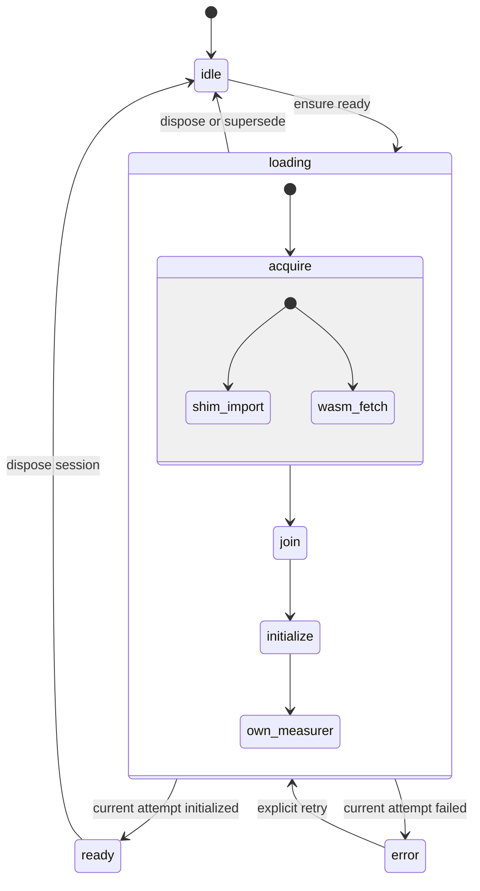
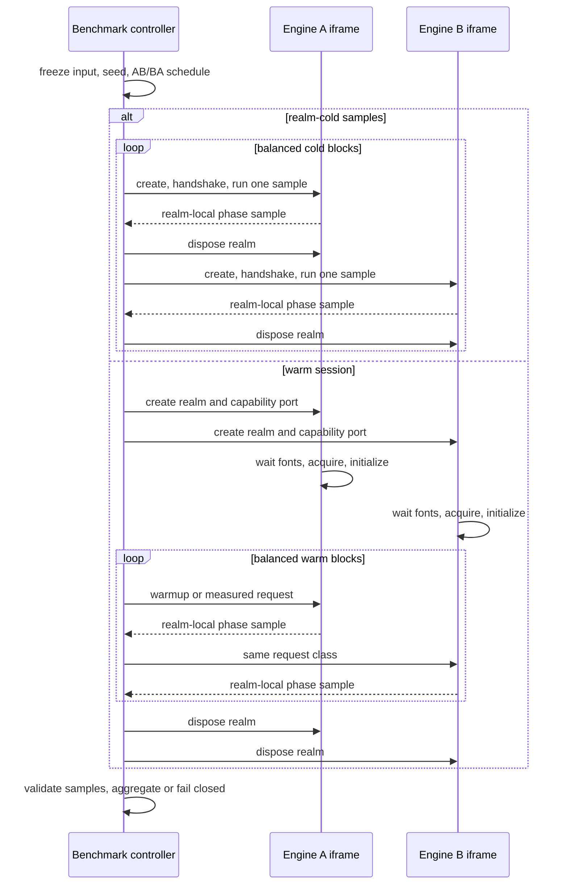
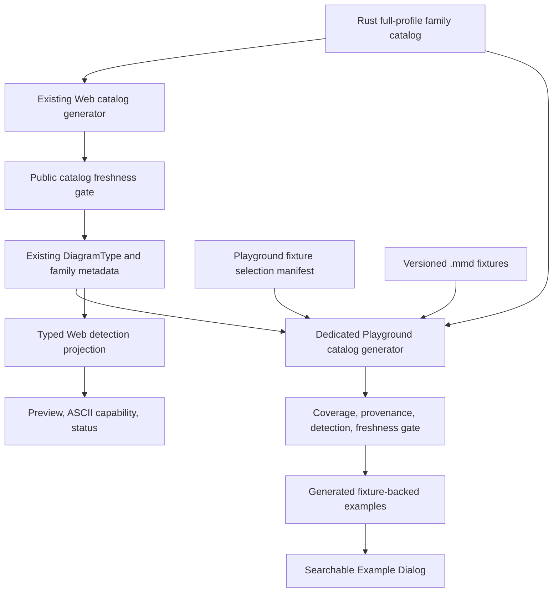

# Web Runtime, Benchmark, and Playground Hardening - Plan

## Goal Capsule

- **Objective:** Give `@mermanjs/web` and the Playground one explicit browser-runtime lifecycle, truthful loading and first-result behavior, a phase-correct and realm-isolated Mermaid/Merman benchmark, a generated 35-family example catalog, parser-backed diagram detection, a local and testable browser trust boundary, and a smaller accessible UI whose state and resources have named owners.
- **Authority:** The Merman family catalog and analysis facts schema `1`, pinned Mermaid `11.16.0@7c0cafcf`, browser standards, and the package boundaries in ADR-0069 are authoritative. Historical Playground warmups, caches, source scans, and component inventory have no compatibility authority.
- **Execution profile:** Fearless alpha refactor. Breaking TypeScript APIs, deleting `useMerman`, replacing the loader and benchmark protocol, removing examples/components/assets, and changing the browser text-measurer API are allowed. Delete superseded routes in the unit that replaces them; do not retain v1/v2 aliases or dual state machines.
- **Stop conditions:** Do not call a warm HTTP cache network-cold, sum overlapping timing intervals, hide failed benchmark samples, infer syntax or layout from source regexes, add a service worker/offline cache without an offline product requirement, expose a reusable public WASM engine without measured evidence, or change native ABI version `2`.
- **Tail ownership:** Implement and verify on the current feature branch with focused Conventional Commits. Do not push, open a PR, publish, or release unless separately requested.

---

## Product Contract

### Summary

The Playground becomes a real consumer of one browser runtime rather than six local views of a module-global loader. One explicit lifecycle state machine owns loading, retry, the ready facade, measurement-session ownership, teardown, and version metadata. Rendering and analysis consume that facade through a separate Render Coordinator, so request failures never become runtime lifecycle failures. Mermaid operations become atomic across load, external registration, initialization, recovery, and render. Product rendering stops pre-rendering synthetic diagrams and records the first actual source that reaches the defined presentation-ready boundary.

The benchmark becomes a separate browser product surface. It reports acquisition, initialization, first render/presentation, and warm render as distinct observations; runs each engine in an equivalent Window realm; balances AB/BA order; retains raw samples and failures; and never claims access to network detail the browser did not expose. Examples and type detection stop being handwritten parallel registries: an `xtask` manifest projects one fixture-backed example for every full-profile family, while the Web package projects canonical parser facts into a typed diagram result.

### Problem Frame

`playground/src/lib/wasm-loader.ts` currently mixes module loading, Cache Storage, a large snake-case adapter, singleton text measurement, product warmup, and most browser-facing Merman calls. Its WASM response is awaited before the shim import starts, so two independent acquisition paths are serialized. The response is written to Cache Storage before instantiation proves it valid; a bad entry is returned on every retry; and the cache duplicates the browser HTTP cache without an offline requirement. `playground/src/hooks/useMerman.ts` then gives each of six consumers its own `ready/loading/error/ref` state. Concurrent callers share an underlying promise by accident but can display contradictory states, cannot retry coherently, and never surface `loadError`.

The product path renders synthetic Flowchart sources in `App.tsx`, `Preview.tsx`, and Mermaid preparation. That intentionally made old timers exclude load cost, but it also means the displayed "first render" is neither the first request nor a fair comparison. Mermaid registration, `initialize`, warmup, and render mutate one realm-global object without an operation-wide queue. Preview and Bench can interleave different configs around Mermaid's own render-only queue, and a second wrapper in the same realm would still share the same module singleton.

`playground/src/lib/bench-runner.ts` runs all Merman samples and then all Mermaid samples, gives Mermaid an additional implicit preparation render, and compares different timer boundaries. It cannot observe an ESM-cold start by clearing module variables, has no realm protocol, and treats cancellation as only a loop check. The UI can therefore report precise-looking speed ratios for unlike work.

The examples file embeds 54 handwritten programs but covers only 25 of the 35 full-profile families. `diagram-detection.ts` scans the first line with `startsWith`; `mermaid-renderer.ts` separately uses source regexes to guess ZenUML and ELK requirements. These paths bypass the family catalog and effective config already computed by Rust. The UI also carries an unreachable component library, placeholder assets, hand-built dialog/tab semantics, stale system-theme state, a fixed `vh` shell, and the literal Merman version label `WASM`.

### Requirements

#### Runtime ownership and loading

- R1. The main Playground document must have exactly one Merman runtime state machine with the discriminated states `idle`, `loading`, `ready`, and `error`. It owns the current load attempt, ready facade, text-measurement resource, error metadata, retry, and teardown; React components only subscribe to stable selectors and invoke commands.
- R2. One idempotent load transaction must coalesce concurrent callers, start the wasm-bindgen shim import and hashed WASM `?url` fetch before the first await, classify failures by stage, and use a monotonic attempt id so a disposed or superseded task cannot commit late state.
- R3. Browser HTTP caching must be the only persistent byte-cache authority. Delete Playground Cache Storage. Keep Vite's hashed `?url` asset, validate status and WASM MIME, and permit at most one `cache: reload` recovery fetch after compile/instantiation rejects the first response. A second failure becomes a stable explicit error; dynamic-import failure offers reload rather than pretending the ESM module cache can be cleared.
- R4. Browser text measurement must be an explicitly owned lazy resource with an idempotent `dispose`. The owner removes every HTML/SVG probe and releases retained canvas state on retry replacement, explicit session disposal, iframe teardown, and Vite HMR.
- R5. Product rendering must contain no synthetic SVG warmup. A Render Coordinator outside the runtime lifecycle freezes source/config/theme/font/options, only publishes the latest coherent artifact batch, and traces a real user-visible source through safe SVG validation and the presentation boundary.
- R24. Document lifecycle handling must distinguish React root unmount, Vite HMR disposal, BFCache entry (`pagehide.persisted`), BFCache restoration (`pageshow.persisted`), non-persisted page exit, and final Window-realm destruction. BFCache entry suspends publication and invalidates active benchmark work without discarding a restorable main Merman session; restoration revalidates owned resources, recreates auxiliary realms lazily, and renders the latest request exactly once. Do not use `unload` or treat every `pagehide` as final disposal.

#### Mermaid operations and benchmark validity

- R6. One failure-resilient queue per Mermaid realm must atomically own load, external diagram/layout registration, site initialization, optional benchmark-only warmup, render, ZenUML recovery, and result validation. A failed operation must not poison the next operation.
- R7. Compare uses one persistent, replaceable same-origin Mermaid Window realm; a timeout poisons and destroys that realm before another operation may run. Benchmark uses separate short-lived same-origin Window realms with their own imported Mermaid singleton or Merman runtime. Separate wrappers over one realm-global Mermaid object do not count as isolation.
- R8. Benchmark results must keep acquisition/resource observations, module import/evaluation, initialize/register, first valid render, presentation-ready, and warm render distinct. Both adapters emit the same versioned realm-local raw event schema as monotonic offsets from one sample `t0`; the controller validates event order and derives every interval from those events. Overlapping intervals remain overlapping, unavailable or inapplicable fields remain `null`, and no adapter-supplied total or aggregate may invent a pure-download value.
- R9. The UI must name cold modes honestly. `realm-cold` means a fresh iframe/module map; HTTP-cache state is reported separately when observable. Only browser automation with a fresh context or cache bypass may claim network-cold evidence.
- R10. Measured work must use a recorded deterministic seed and balanced interleaved AB/BA blocks, equal real-source warmup counts, `document.fonts.ready`, realm-local clocks, raw sample retention, explicit cancellation/timeout/crash/environment-invalidated states, and fail-closed ratios when either engine has failed samples. A run may start only while the top document and engine realms are visible; any `visibilitychange` to hidden, `pagehide`, or supported page-freeze event invalidates and terminates the whole run so no aggregate spans a visibility boundary.
- R23. A completed benchmark must offer an explicit local download of a versioned JSON evidence report containing frozen input/options, seed/order, exact package/browser/protocol versions, environment and visibility transitions, phase observations, raw samples, failures, and terminal state. No result is uploaded or persisted remotely.
- R21. `mermaid@11.16.0`, `@mermaid-js/mermaid-zenuml@0.2.2`, and `@mermaid-js/layout-elk@0.2.1` must be exact lockfile dependencies emitted as lazy same-origin Vite chunks. Monaco must likewise use the lockfile-pinned local `monaco-editor` module and Vite-emitted language workers through an explicit `@monaco-editor/react` loader configuration; its default jsDelivr path is forbidden. Delete runtime CDN primary/fallback URLs and environment overrides. A tested production CSP must restrict executable, worker, network, and frame sources to the minimum local surface required by WASM, Monaco, and the owned realms.
- R22. Compare and Benchmark realm protocols must use a one-time authenticated Window handshake before transferring one MessagePort, then rely on port capability plus protocol/realm/run/request tokens. Parent and realm both enforce explicit source/config/message/SVG/sample/realm/time budgets, and the parent revalidates every returned SVG before DOM insertion. The iframe boundary is lifecycle isolation, not a security sandbox.

#### Catalog and parser-backed detection

- R11. Every one of the 35 full-profile logical families must have at least one fixture-backed Playground example selected by an explicit manifest. `xtask` must prove exact family coverage, fixture existence, source provenance, canonical detection, and generated-output freshness.
- R12. `DiagramType` must be generated from the Rust catalog. Web detection must project canonical analysis/parse metadata into a typed logical type, syntax id, and effective layout fact; Playground maps those facts to typed Mermaid external requirements. Empty, invalid, incomplete, unknown, or stale analysis yields explicit unknown/unavailable state; no first-line scan or source regex fallback remains.
- R13. The example browser must search title, category, logical type, aliases, and source text case-insensitively, preserve manifest order, expose an empty state, and select the exact generated fixture source. ASCII capability lookup uses `Example.diagramType` directly.

#### Product UI and repository cleanup

- R14. Example selection must use a real modal Dialog, and editor/config, mobile editor/preview, preview modes, and diagnostic views must use real Tabs where they are tabbed interfaces. Keyboard navigation, focus trapping/restoration, Escape, accessible names, and live status must be browser-tested.
- R15. The application shell and dialogs must use dynamic viewport constraints, safe-area insets, controlled overflow, and editor relayout on pane/visual-viewport changes. Desktop, narrow portrait, landscape, zoom, and soft-keyboard states must not hide or overlap primary controls.
- R16. The application store must own both selected and resolved UI theme, maintain one media-query subscription for `system`, and update DOM, Monaco, Preview, and render requests together. Merman UI version comes from `packageVersion()` and Mermaid version remains pinned and explicit.
- R17. Remove every unreachable UI module, duplicate hook/style, unused placeholder/public asset, obsolete runtime/benchmark helper, and corresponding dependency. Retain a primitive only when a production import or test proves it is reachable.
- R18. Unit, package smoke, generated-catalog, production-build, and real-browser gates must cover the new contracts. Chromium owns the full benchmark/responsive/network-cold matrix; Firefox and WebKit each run a focused startup/render/Compare/focus/theme/teardown smoke. Documentation must distinguish interactive first-result timing from benchmark phases and record the actual deployment cache headers without claiming immutable caching where the host does not provide it.
- R19. Native FFI ABI stays at `2`; analysis/facts and LSP schema stay at `1`. Additive WASM/TypeScript projection needed for canonical detection is allowed, but it must not create a second Rust semantic parser or change native ABI numbering.
- R20. A reusable public WASM engine is deferred. The new benchmark must first isolate initialization and per-render cost; only measured, reproducible construction cost can justify a separate API/ADR later.

### Key Flows

- F1. **Application startup:** the document bootstrap requests Merman once before React renders; concurrent consumers observe one loading attempt and converge on the same ready facade or one retryable staged error.
- F2. **Failure and retry:** network, response validation, shim import, instantiation, or measurement-session construction before readiness fails; the runtime applies only the recovery valid for that stage, rejects late completions, and cleans all partial resources. Lazy first-use probe/browser-call failures follow the measurement fallback and request-artifact contract without changing lifecycle state.
- F3. **Live render:** source/config/theme changes are snapshotted; Merman and optional Compare work runs; only the newest batch commits SVG, diagnostics, detected type, timing, and error state.
- F4. **Compare:** both engines consume the same snapshot and exact package versions; the Compare realm serializes Mermaid mutation and is replaced if poisoned; one side may fail without fabricating a speed comparison.
- F5. **Benchmark:** a visible document freezes its input, pauses competing live render scheduling, creates visible engine realms, executes balanced cold/warm blocks, handles cancel/crash/timeout/visibility invalidation, releases all realms, and resumes the latest live request.
- F6. **Examples and detection:** the user opens the dialog, searches 35-family generated data, chooses exact fixture source, and later edits it while canonical analysis updates or explicitly clears the detected type.
- F7. **Responsive keyboard use:** Dialog, Tabs, toolbar, editor, and preview remain reachable with keyboard/touch across theme and visual-viewport changes, and focus returns to the originating control.
- F8. **Document lifecycle and teardown:** React root unmount does not own the document session. HMR and non-persisted exit stop new work and dispose what can be explicitly owned; BFCache entry suspends the main session, invalidates Bench, and removes auxiliary realm activity; BFCache restoration validates or restarts resources and republishes only the latest request. Retry replacement and true realm teardown remove probes, iframes, channels, media listeners, and abortable work without duplicate subscriptions.

### Acceptance Examples

- AE1. Six concurrent consumers under React Strict Mode cause one shim import, one WASM acquisition, one initialization, and one browser text-measurement resource; all observe the same `ready` snapshot.
- AE2. Dispose or retry during fetch, import, or initialization prevents every old completion from changing the new state. Disposing a ready session releases its owned resources without claiming to unload the realm module. Lazy measurement-call failure remains a fallback/request result. A browser back/forward round trip preserves or restarts exactly one valid main session, recreates no duplicate probes/listeners/channels, and renders the latest source once; final cleanup leaves no hidden measurement nodes, iframes, media listeners, or message channels.
- AE3. A valid hashed WASM response initializes through streaming when MIME permits. Invalid first bytes trigger one reload fetch and either recover or end in a staged error; no Cache Storage is opened and no third automatic request occurs.
- AE4. A shim chunk import failure ends in an actionable reload state. It is not retried with a cache-busting module URL and does not leak a second runtime.
- AE5. Rapid source, config, theme, measurement-mode, and font changes with deliberately reordered completions publish only the latest Merman/Compare batch. The first SVG was rendered from the actual source, not a warmup fixture.
- AE6. Two concurrent Mermaid requests with different configs each render under their frozen config. One thrown initialize/render task does not poison the queue, and a benchmark run cannot mutate Compare registration or theme.
- AE7. Cold samples recreate the relevant engine iframe; warm samples reuse one realm per engine. AB/BA counts are balanced, both engines receive equal warmups using the same source, and all durations are calculated inside the realm.
- AE8. A benchmark report retains frozen input/options, order, seed, versions, browser metadata, visibility transitions, the versioned raw event stream, derived phase observations, raw samples, errors, and terminal state. It reports `realm-cold` and observed HTTP-cache evidence separately, never sums overlapping phases, and omits the ratio when either side is invalid. An explicit download produces the same versioned JSON evidence without network activity.
- AE9. Cancelling or timing out during handshake, loading, warmup, or rendering produces a terminal `cancelled` or `failed` run. Hiding, navigating, or freezing the page produces terminal `invalidated`, retains diagnostic events only, and produces no aggregates or ratio. Every path excludes partial samples, ignores late messages by run id, and removes all benchmark iframe resources before a rerun.
- AE10. Removing or duplicating any one of the 35 canonical manifest entries, choosing a missing fixture, or changing a fixture to another detected family fails generation/CI. Generated TypeScript embeds exact source and provenance.
- AE11. Empty, malformed, incomplete, frontmatter-wrapped, aliased, `flowchart-elk`, ZenUML, and config-selected ELK inputs use canonical facts. Unknown output clears the store type and never invokes `startsWith` or regular-expression source classification.
- AE12. Search finds examples by display name, category, logical type/alias, and source; empty search restores stable manifest order; no-result state is announced; selection writes the exact fixture contents and closes the dialog with focus restored.
- AE13. Dialog Tab/Shift+Tab trapping, Escape, focus return, Tab arrow/Home/End/manual activation, every icon button accessible name, and status announcements pass browser assertions and an axe scan.
- AE14. System theme changes update resolved store state, DOM, Monaco, and the next render together; explicit light/dark ignores system changes. Portrait, landscape, zoom, and visual-viewport shrink leave editor, preview, toolbar, and dialogs usable.
- AE15. Compare shows the exact Merman package version and pinned Mermaid version. Production output contains a hashed WASM asset with `application/wasm`; deployment evidence reports actual cache headers and documents any hosting residual honestly.
- AE16. Static reachability and dependency audits find no old hook/loader/warmup/detector, unreachable UI module, duplicate toast/theme helper, unused placeholder asset, or lockfile entry for a removed dependency.
- AE17. Production build resolves exact lockfile-pinned Mermaid/ZenUML/ELK chunks, the Monaco module, and required Monaco workers locally; configures `@monaco-editor/react` with that local instance before any editor mounts; and makes no jsDelivr or other runtime CDN request. Its CSP permits only intended WASM/Monaco-worker/realm work while blocking a synthetic external script/connect/frame/object/base attempt.
- AE18. Only an exact-origin/source one-time INIT can transfer a realm port. Repeated/replayed/out-of-order/over-budget messages fail closed; MessagePort validation never claims origin/source fields; the parent rejects an unsafe or oversized SVG before insertion and all realm resources return to zero.

### Scope Boundaries

#### In scope

- `@mermanjs/web` browser text-measurement ownership and a typed canonical detection projection.
- Playground Merman and Mermaid runtime ownership, loading, retry, rendering, first-result tracing, and teardown.
- Exact lockfile-pinned Mermaid `11.16.0`, ZenUML, and ELK dependencies emitted as lazy local chunks, plus a tested static-host-compatible CSP.
- Benchmark runtime protocol, iframe entry point, measurement model, statistics, cancellation, and UI.
- The 35-family fixture manifest, `xtask` generation, typed examples, search, and ASCII/type integration.
- Playground Dialog/Tabs semantics, theme resolution, viewport/safe-area behavior, exact version metadata, dead-code/assets/dependency deletion, browser tests, CI, docs, and an ADR.
- Additive browser-WASM/analysis facts when canonical effective layout cannot otherwise be projected without source scanning.

#### Out of scope

- Native FFI ABI changes or renumbering beyond `2`; LSP or analysis schema renumbering beyond `1`.
- A service worker, offline/PWA mode, general Cache Storage layer, or migration away from GitHub Pages/custom-domain hosting.
- A public reusable `BindingEngine`/WASM engine, worker-only Merman benchmark, or persistent cross-page runtime pool.
- Analytics ingestion, remote benchmark storage, a benchmark leaderboard, or claims about other users' hardware.
- Mermaid source changes, a Mermaid version upgrade beyond `11.16.0`, pixel-parity tuning, or browser emulation in Rust.
- Retaining deprecated runtime/UI adapters for compatibility, publishing packages, pushing, opening a PR, or releasing.

---

## Planning Contract

### Context and Research

- The closed Web workstream defines the existing layering as `merman-bindings-core -> merman-wasm -> platforms/web -> playground`; Playground state, Mermaid JS, and benchmark policy stay above the publishable package.
- Historical commit `a3bc50dfb` added synthetic warmup specifically to exclude module load from the first timer. This plan intentionally replaces that metric with separate load/init/first-real/warm phases.
- Historical commit `6c203b824` added Cache Storage to reduce WASM load time. Vite now emits a hashed WASM URL, browser HTTP cache already owns freshness, and the product has no offline contract; retaining two byte-cache authorities is no longer justified.
- Historical commit `b7731e996` added ZenUML lazy registration and retry. Those behaviors move inside the operation queue rather than being lost during consolidation.
- The current deployment serves a hashed asset with `Cache-Control: max-age=14400`, not `immutable`. The repository can guarantee hashed assets and MIME, but it must treat optimal immutable headers as a hosting configuration target/residual rather than emulate them with application cache.
- Playground currently has only two Node test lanes and no real-browser quality gate. Focus, viewport, iframe module maps, Resource Timing, real WASM, and DOM probe cleanup require Chromium coverage.
- The generated Web diagram catalog already contains 35 logical families; the handwritten examples cover 25 and omit Cynefin, Event Modeling, Ishikawa, four Railroad variants, Swimlane, Venn, and Wardley.

### Key Technical Decisions

- KTD1. **Use one document-owned Merman lifecycle runtime with a Zustand vanilla store.** **[session-settled: user-approved]** `main.tsx` starts the module singleton before React rendering; explicit document/HMR lifecycle handlers suspend, resume, or dispose it. React Strict Mode Effects and React root unmount never own acquisition or release. The module exports a stable read-only store/selector surface and domain commands; it privately owns only `idle/loading/ready/error`, the in-flight transaction, attempt id, package facade, retry, and session resources. Render/parse failures are request artifacts and never lifecycle transitions. Rejected: retaining component-local `useMerman()` state, a delayed reference-count lease around React cleanup, or lifecycle ownership of UI render batches.
- KTD2. **Keep engine mechanics below React state and respect realm lifetime.** A dependency-injectable realm-local transaction performs import/fetch/init and exposes domain operations; the main singleton store owns one session, while benchmark iframes construct their own realm-local transaction. A successfully published wasm-bindgen module remains initialized for that Window realm; session disposal releases measurers/listeners/request state but cannot unload or replace the module. True cold replacement destroys the iframe/page realm. This is an internal testable adapter, not a new public reusable WASM engine.
- KTD3. **Delete Cache Storage and make HTTP cache the sole byte-cache owner.** Keep Vite 8.0.15 `?url` hashing, start import and fetch concurrently, validate the response, and retry one failed instantiation with `cache: reload`. Rejected: retaining a read-through Cache API solely to compensate for host response headers; it duplicates storage and has no automatic freshness or offline product contract.
- KTD4. **Make browser measurement an owned object, not a callable with hidden DOM lifetime.** Replace `createBrowserTextMeasurer` with `createBrowserTextMeasurementSession`; the returned resource exposes the existing host measurement callback and idempotent disposal. The alpha API breaks cleanly; no compatibility alias remains. Native ABI remains `2` because this ownership contract is TypeScript/browser-only. **[session-settled: user-directed]** Rejected: bumping native ABI or leaving probes process-long.
- KTD5. **Put latest-wins publication in a separate Render Coordinator.** Fetch may be aborted, but dynamic import, synchronous Merman rendering, and an in-flight Mermaid operation may finish. The coordinator freezes request snapshots, debounces live work, pauses/resumes around Bench, discards stale results by request id, and atomically publishes Merman/Mermaid artifacts without changing runtime lifecycle state.
- KTD6. **Queue the entire Mermaid operation inside an owned realm.** The realm queue includes loading, external registration, initialize, benchmark-only warmup, render, ZenUML recovery, and safe-SVG validation. Its tail recovers after rejection. If an operation never settles, the controller marks the realm poisoned, destroys it, and creates a new realm; it never releases the queue while the old global object can still mutate. Rejected: relying on Mermaid's internal render queue or `Promise.race` over a shared main-document singleton.
- KTD7. **Replace all source classification heuristics with canonical facts.** **[session-settled: user-directed]** A typed Web projection maps parser syntax id, logical family, and effective layout. Playground derives a typed Mermaid external-requirement set from those facts. If current analysis facts omit effective layout, extend schema `1` additively from parse metadata; do not scan source in TypeScript. Rejected: preserving `diagram-detection.ts` or ZenUML/ELK regexes as fallbacks.
- KTD8. **Use same-origin Window realms as the shared browser-engine boundary.** Compare owns a persistent replaceable Mermaid realm; Bench owns distinct Merman/Mermaid realms. Mermaid needs DOM behavior, so benchmark engine classes use equivalent iframes. Cold samples recreate the realm/module map; warm samples retain one realm per engine. Rejected: a Merman Worker versus Mermaid Window comparison or any wrapper sharing a Mermaid singleton across controllers.
- KTD9. **Measure a versioned event vector, not one synthetic number.** Every sample uses a realm-local `t0 = performance.now()` and emits nullable monotonic offsets for `sample_start`, `fonts_wait_start/end`, `adapter_import_start/end`, `engine_import_start/end`, `resource_acquire_start/end`, `register_start/end`, `initialize_start/end`, `render_start`, `safe_svg_ready`, `dom_inserted`, `layout_box_ready`, `presentation_ready`, and `sample_end`. Inapplicable or unobservable events are `null`, never zero. The controller validates the event/ordering contract below while permitting documented overlap, then derives cold first-valid and presentation durations from `sample_start`, and warm valid/presentation durations from `render_start`; adapters cannot submit precomputed aggregate totals. Presentation-ready has one shared realm function: after fonts are ready, insert the safe SVG into the common attached host, read a nonempty finite layout box, and record the end in the next `requestAnimationFrame` callback. It means the browser reached a presentation opportunity, not that pixel paint was observed. Resource and User Timing are auxiliary evidence. The primary side-by-side outcomes are presentation-ready and warm render under the same input.
- KTD10. **Balance order deterministically and fail closed.** Each run records a seed and AB/BA schedule, all raw samples, errors, versions, and environment. Median/p95/CV are descriptive; the app does not use a heuristic stability verdict, silently drop errors, or show a ratio for incomparable sets.
- KTD11. **Generate examples through a dedicated Playground catalog.** Rust family facts own the exact family set; the Playground manifest owns presentation metadata and fixture choice; a separate `playground_catalog` xtask validates and generates TypeScript typed by the existing public `DiagramType`. The public Web catalog does not absorb UI titles/categories or change when curation changes, and inline example source is deleted.
- KTD12. **Use Radix for established interaction semantics.** Example Gallery becomes a controlled Dialog; actual mode selectors become Tabs with manual activation when panel work is perceptible. Upgrade retained Radix primitives to a current React 19-compatible patch and delete unused primitives/dependencies.
- KTD13. **Delete old product/UI structures without a compatibility layer.** **[session-settled: user-directed]** Remove old hooks, adapters, warmups, scanners, unreachable components, duplicate helpers, and placeholder assets in their owning units. Rejected: deprecation aliases in an alpha Playground.
- KTD14. **Require performance evidence before exposing a reusable WASM engine.** **[session-settled: user-approved]** The benchmark first isolates init and warm-render cost. A later engine API requires reproducible evidence, a separate ADR, and consumer analysis. Rejected: porting an engine/session abstraction merely because Mermaid JS has one.
- KTD15. **Build every executable editor/reference dependency into the Playground.** `mermaid@11.16.0`, `@mermaid-js/mermaid-zenuml@0.2.2`, and `@mermaid-js/layout-elk@0.2.1` become exact lockfile dependencies loaded as local lazy chunks. The existing lockfile-pinned `monaco-editor` is imported locally, its required language workers are emitted through Vite worker entries, and `@monaco-editor/react` receives that local Monaco instance before any editor mounts so its default jsDelivr loader is unreachable. This removes runtime CDN code execution, makes cache/version/build evidence reproducible, and lets CSP keep script/connect/worker sources local. Rejected: preserving CDN failover, the Monaco default CDN loader, or arbitrary `VITE_*_CDN_URL` overrides inside a same-origin iframe that is not a security boundary.
- KTD16. **Make realm ports capability-based and budgeted.** Only the initial Window handshake validates exact origin/source and transfers a single port using an unpredictable realm token; MessagePort events do not claim origin/source metadata. Subsequent messages require the owned port, token, protocol version, monotonic state, and run/request ids. Versioned protocol constants enforce the interactive 2 MiB source and 24 MiB SVG limits, 1 MiB config, 25 MiB encoded message, 200 warmups, 1,000 measured iterations, 2,000 retained samples, one active run, at most two live benchmark realms, 30 seconds per stage, and 10 minutes per run. Parent and realm both reject over-budget work before retaining or inserting it.
- KTD17. **Make document visibility a run-wide benchmark validity condition.** The controller checks the top document and both attached engine realms before START and observes `visibilitychange`, `pagehide`, and feature-detected page-freeze signals until terminal cleanup. Crossing a visibility boundary atomically invalidates the whole run, aborts/disposes both engine sides, records the transition in the evidence report, and suppresses every aggregate; it never tries to salvage samples from a throttled interval.
- KTD18. **Treat BFCache as suspension, not destruction.** On persisted `pagehide`, preserve the valid main Merman session but suspend publication, invalidate Bench, and tear down auxiliary Compare/Benchmark channels and realms. On persisted `pageshow`, revalidate session-owned resources and subscriptions, restart only if invalid, recreate auxiliary realms lazily, and schedule the latest request once. HMR remains an explicit dispose; non-persisted page exit stops new work and lets Window destruction provide the final reclamation backstop. Rejected: `unload`, disposing on every `pagehide`, or coupling document lifetime to React root lifetime.

### High-Level Technical Design

These sketches define ownership and observable boundaries. They do not prescribe exact TypeScript signatures or component structure.

#### Main Merman runtime lifecycle

The runtime starts import and fetch in the same turn, joins them at initialization, and publishes only if its attempt id is still current. The ready state owns the facade and lazy browser-measurement resource. Disposal releases the Playground session but does not claim to unload a wasm-bindgen module already initialized in the Window; cold replacement requires realm destruction. Render errors remain request artifacts and do not corrupt the global load state.

#### Canonical render and Mermaid queue

```mermaid
flowchart LR
    Input[Source, config, theme, font snapshot] --> Facts[Canonical Web detection facts]
    Facts --> Merman[Merman runtime operation]
    Facts --> Realm[Replaceable Compare Mermaid realm]
    Realm --> Queue[Realm-owned operation queue]
    Queue --> Load[Load and register required modules]
    Load --> Init[Initialize frozen site config]
    Init --> Render[Render and bounded recovery]
    Merman --> Safe[Safe SVG validation]
    Render --> Safe
    Safe --> Coord[Render Coordinator]
    Coord --> Batch[Latest request batch]
    Batch --> Present[Shared presentation-ready boundary]
```

Canonical facts drive both UI type state and Playground-owned external Mermaid requirements. The Render Coordinator owns the complete batch; stale success and stale failure are discarded together rather than partially updating the comparison. A hung Mermaid realm is destroyed before the coordinator starts replacement work.

#### Benchmark realm protocol

The reverse block runs B then A. Cold-runtime samples create and dispose new realms per engine sample; warm samples reuse engine-specific realms. Every realm is attached to a fixed-size, layout-participating measurement host shared by both engine classes; `display:none`, background-tab assumptions, hidden documents, and engine-specific viewport sizes are forbidden because they invalidate DOM, timer, and font geometry. Parent creates an unpredictable realm token, validates exact `event.origin` and `event.source` on one Window INIT, transfers one MessagePort with an exact target origin, then removes the Window listener. Port messages rely on capability ownership plus protocol/realm/run/request tokens and state order; they do not claim origin/source metadata. Durations are derived from validated offsets within one realm-local sample and never subtract timestamps from different realms.

#### Benchmark raw event and derived interval contract

All event values are finite nonnegative offsets from the sample's realm-local `t0`; `sample_start` is exactly `0`. A paired interval requires both endpoints or two `null` values. Every non-null `*_end` is at or after its matching `*_start`. `fonts_wait` and `adapter_import` start in the same task before the first await. After adapter import, Merman starts `engine_import` and `resource_acquire` together; Mermaid uses `engine_import` and leaves `resource_acquire` null. Required registration and initialization complete before `render_start`. From render onward the required order is `render_start <= safe_svg_ready <= dom_inserted <= layout_box_ready <= presentation_ready <= sample_end`; equal adjacent offsets remain valid under coarse timer resolution.

| Raw event pair/point | Exact boundary | Realm-cold first sample | Warm measured sample |
|---|---|---|---|
| `sample_start` | Accepted visible START after handshake/budget validation; defines `t0`. | `0` | `0` |
| `fonts_wait_start/end` | Immediately around awaiting `document.fonts.ready`. | Required | Required |
| `adapter_import_start/end` | Immediately around dynamic import/evaluation of the one selected benchmark adapter. | Required | `null` after realm initialization |
| `engine_import_start/end` | Immediately around dynamic import/evaluation of wasm-bindgen shim or pinned Mermaid package. | Required | `null` |
| `resource_acquire_start/end` | Merman WASM fetch/response acquisition controlled by the adapter; not inferred from Mermaid chunk size or Resource Timing. | Required for Merman; `null` for Mermaid | `null` |
| `register_start/end` | Mermaid external diagram/layout registration required by canonical facts. | Required for Mermaid even when it is a measured no-op; `null` for Merman | `null` |
| `initialize_start/end` | Engine/session initialization under frozen options after required code/bytes are ready. | Required | `null` |
| `render_start` | Immediately before invoking the engine render for the measured source. | Required | Required |
| `safe_svg_ready` | Render returned and realm-local SVG safety validation succeeded. | Required on success | Required on success |
| `dom_inserted` | Safe SVG replaced the contents of the common attached presentation host. | Required on success | Required on success |
| `layout_box_ready` | First finite, nonempty layout box was read from that attached SVG. | Required on success | Required on success |
| `presentation_ready` | Timestamp captured in the next `requestAnimationFrame` callback after `layout_box_ready`. | Required on success | Required on success |
| `sample_end` | Immutable event/resource/error evidence has been frozen for return. | Required | Required |

The controller, not either adapter, derives exactly these primary intervals:

| Derived interval | Formula | Applicability |
|---|---|---|
| Adapter import | `adapter_import_end - adapter_import_start` | Realm-cold only |
| Engine import | `engine_import_end - engine_import_start` | Realm-cold only |
| Resource acquisition | `resource_acquire_end - resource_acquire_start` | Merman realm-cold only; otherwise `null` |
| Registration | `register_end - register_start` | Mermaid realm-cold only; otherwise `null` |
| Initialization | `initialize_end - initialize_start` | Realm-cold only |
| First valid SVG | `safe_svg_ready - sample_start` | Successful realm-cold sample |
| First presentation-ready | `presentation_ready - sample_start` | Successful realm-cold sample |
| Warm valid SVG | `safe_svg_ready - render_start` | Successful warm measured sample |
| Warm presentation-ready | `presentation_ready - render_start` | Successful warm measured sample |

The controller may expose the paired raw spans and Resource Timing entries as diagnostics, but it never adds overlapping spans or accepts a serialized adapter total. Failure samples retain the event prefix reached before error, leave skipped phase events null, and still set `sample_end` when immutable error evidence is frozen; they never enter aggregates.

#### Generated example and detection chain

The family set and source meaning stay Rust-owned. The manifest owns only curation. Generated code is the only Playground example source; there is no independent inline registry or string detector.

### Interaction Contracts

#### Runtime status and recovery

| State | Visible behavior | Commands | Announcement and focus |
|---|---|---|---|
| `idle` | Document bootstrap has not started or page teardown has begun; no fabricated readiness. | Editor text remains available; render/export/Compare/Bench are disabled. | No announcement for the pre-bootstrap instant. |
| `loading` | Show the current acquisition/initialization stage without a synthetic progress percentage; retain source/config. | Editing remains enabled; one coalesced load is in flight; render/export/Compare/Bench and duplicate retry are disabled. | Polite stage changes only; never move focus. |
| `ready` | Hide loading error UI and expose exact package version/capabilities. | Enable each command according to capability and current request state. | Announce readiness once only when loading was perceptible; keep focus. |
| Recoverable pre-ready error | Show stage-specific network/response/instantiate error and a Retry command; retain source/config. | Editing and retry are enabled; render/export/Compare/Bench are disabled; repeated Retry coalesces one attempt. | One assertive error announcement; retry success is polite; focus remains unless the user moves it to Retry. |
| Reload-required chunk/CSP error | Explain that the current module map cannot be retried and offer Reload; retain source/config. | Editing and Reload are enabled; runtime-dependent commands and Retry are disabled. | One assertive error announcement; no automatic reload or focus jump. |
| Request-level render/analysis error while ready | Keep lifecycle `ready`; present the error in the owning artifact/batch state. | Retry happens through a new request, not runtime reload. | Use the relevant Preview/diagnostic status without duplicating the global runtime alert. |

#### Compare batch presentation

| Batch state | Pane content | Timing and actions | Publication rule |
|---|---|---|---|
| Empty | Neutral no-source state in both panes. | No timing/export actions. | No render request exists. |
| Pending without prior batch | Matching skeleton/progress state in both panes. | Artifact actions and ratios disabled. | Publish only the pending request key. |
| Updating with a prior batch | Prior pair may remain visible only with an explicit updating/stale treatment. | All prior artifact actions, timings, and comparisons disabled. | The prior pair cannot be mistaken for the current source. |
| Current success | Both current panes show safe SVG for the same frozen snapshot. | Current timings/actions enabled; any comparison uses only this pair. | Commit both artifacts atomically. |
| Current partial | Show the current successful pane; replace the failed pane's old SVG with its stage-specific error. | Suppress failed-side timing, ratio, and artifact actions; successful-side actions remain current-only. | Announce one concise partial result without moving focus. |
| Current failed | Replace both prior panes with current errors. | No timings, ratios, or artifact actions. | Commit the current failure batch so stale success cannot survive. |
| Superseded | No visible transition. | No action. | Discard success and error together by request id. |

#### Benchmark dialog and report hierarchy

| State | Primary surface | Secondary/detail surface | Close/reopen behavior |
|---|---|---|---|
| Pre-run | Frozen-source preview, mode/engine/iteration controls, Run. | Exact versions and resource-budget bounds. | Closing preserves no transient run. |
| Running | Current stage, engine, balanced block/sample progress, persistent Cancel. | Elapsed whole-run time and stale-source indicator; no provisional ratio. | Closing is an explicit cancellation, disposes realms, and records `cancelled`. |
| Cancelled | Clear terminal label and Run again. | Retained partial diagnostics marked excluded from aggregates. | Reopen shows the cancelled report until a new run or final document destruction. |
| Environment invalidated | Explain that page visibility/navigation/freeze changed during measurement and offer Run again only while visible. | Retain raw diagnostics and visibility transitions; suppress all aggregates and ratios. | Reopen retains the `invalidated` report; every old realm is already disposed. |
| Failed | Stage-specific terminal error and Run again/Reload where appropriate. | Raw failure/protocol details within budgets; no ratio. | Reopen retains the failed report. |
| Complete with errors | Presentation-ready and warm outcomes only for valid comparable sets, with an explicit incomplete label. | Acquisition/init/statistics/error counts plus expandable raw/error samples. | Reopen retains the report; local JSON download is enabled. |
| Successful | Presentation-ready and warm outcomes are visually primary; valid ratios are adjacent. | Acquisition/init and descriptive statistics are secondary; raw samples are expandable. | Reopen retains the report; local JSON download is enabled. |
| Source changed after freeze | Existing terminal/running view carries a stale-snapshot label and Run latest source action. | Frozen source/options remain inspectable in report details. | Never mutate the old report; the next run takes a new snapshot. |

Live regions announce benchmark stage transitions and one terminal outcome, not every sample. Raw errors and samples remain available to inspection/export without dominating the operational summary.

#### Responsive pane and Tab mapping

| Layout state | Navigation and mount policy | Scroll/relayout/focus policy |
|---|---|---|
| Wide (`>= 768px` layout viewport) | Editor and Preview remain a horizontal split. Code/Config, Preview modes, and Parse/Layout use named manual Radix tablists; selections live in the app store. | The app body does not scroll; each bounded panel/dialog owns its internal overflow. Resizing split panels triggers Monaco/viewport relayout. |
| Narrow (`< 768px`) | One top-level manual Editor/Preview tablist replaces the split while nested tab selections remain unchanged. Preserve the single editor model/instance; inactive expensive panels may stay mounted only when needed for state and must be non-interactive/hidden from accessibility. | Activating a pane, orientation/breakpoint change, and `visualViewport` resize trigger relayout. Toolbar/status remain reachable outside the content overflow and above safe-area insets. |
| Soft keyboard/zoom/safe area | The active pane retains its selected nested tabs; dialogs use visual-viewport-constrained internal scrolling. | If a breakpoint hides the focused pane, focus moves to its corresponding top-level tab; otherwise preserve focus. No control is obscured by bottom/side insets. |

#### Example search and filtering

- Query, selected category, and ASCII-only state intersect; results always retain manifest order.
- Query matching covers title, category, logical type, aliases, and source text case-insensitively. Clearing the query keeps category/ASCII filters.
- Reset restores empty query, All categories, and ASCII-only off. Closing the Dialog resets these transient filters.
- Result count/no-result announcements identify active constraints but are debounced so every keystroke does not create redundant speech.
- Selecting an example writes the exact generated fixture source, closes the Dialog, and restores focus to its trigger.

### System-Wide Impact

- **Published Web API:** `createBrowserTextMeasurer` is replaced by `createBrowserTextMeasurementSession`, an explicitly disposable browser measurement resource. Surface manifests, TypeScript declarations, slim exports, smoke tests, README examples, and package checks change together. The host callback type itself remains the narrow render input.
- **Analysis projection:** A typed detection helper is added to `@mermanjs/web`. If effective layout is missing, the analysis facts version `1` payload receives only the additive canonical metadata needed to avoid source scans; Rust parser/model ownership and native ABI remain unchanged.
- **Playground runtime:** `wasm-loader.ts` and `useMerman.ts` are deleted. All six consumers, ASCII capability lookup, diagnostics/editor calls, exact version, HMR, and document lifecycle hooks consume the new singleton lifecycle runtime. Render/parse/layout/analysis errors remain outside its state machine.
- **Document lifecycle:** React root lifetime is intentionally narrower than the page runtime. Persisted page exit suspends the main session and invalidates auxiliary work; restore revalidates one session/subscription set and lazily recreates realms. HMR explicitly disposes; non-persisted Window destruction remains the final cleanup backstop.
- **Render coordination:** A separate Render Coordinator owns debounce, frozen request keys, Merman/Compare invocation, coherent artifact publication, the shared presentation-ready trace, and Bench pause/resume. It may consume a ready runtime but cannot initialize, retry, or dispose that runtime.
- **Mermaid integration:** Mermaid `11.16.0`, ZenUML, and ELK become exact lockfile dependencies emitted as lazy local chunks; runtime CDN URLs/fallback/environment overrides are deleted. Browser-global shims and recovery move into a persistent replaceable same-origin Compare realm. Preload may acquire code; only benchmark mode may perform an explicit render warmup. `platforms/web` exposes neutral syntax/layout facts and contains no Mermaid package-loading policy.
- **Realm trust:** Compare/Bench iframes isolate lifecycle and module maps, not hostile code. A one-time exact-origin/source Window handshake transfers one capability port, all later messages validate tokens/state/budgets, and the parent repeats SVG safety validation after clone and before insertion. Static HTML entry points carry the tested local-only CSP required by WASM/Monaco/realms.
- **Rendering concurrency:** Every request freezes its input and has a publication key. Main Preview/Compare scheduling pauses while a benchmark measures to reduce same-page CPU/layout interference, then resumes the latest source. User edits remain accepted and mark the benchmark snapshot stale.
- **Benchmark data integrity:** The initial Window handshake alone validates exact origin/source and transfers one capability port. Port traffic validates realm/run/request tokens, protocol state, engine, raw event order, finite nonnegative offsets, and dual-ended resource budgets. The parent derives intervals from the versioned event schema and revalidates SVG after structured clone and before insertion. Partial, over-budget, replayed, foreign, or visibility-crossing work cannot enter aggregates; timeout/cancel/crash/invalidation tears down realms before a rerun.
- **Caching and deployment:** Vite content hashing and browser HTTP cache own bytes. The build gate requires a hashed WASM URL and correct MIME. Deployment evidence records `Cache-Control`; immutable hashed assets and revalidated HTML remain the recommended host contract, while current `max-age=14400` is documented until the hosting layer can change it.
- **Examples and generated data:** An explicit manifest references existing fixtures; a dedicated Playground xtask embeds exact source/provenance into generated TS. The existing Web generator remains independently responsible for public family types. Additional valuable examples must become versioned fixtures and manifest entries; duplicated handwritten examples are removed.
- **UI and state:** Theme resolution, modal state, tabs, live status, dynamic viewport, safe area, visual viewport, exact versions, and a locally owned Monaco module/worker bootstrap become testable contracts. Removing unused primitives shrinks dependencies and avoids carrying an unowned design system.
- **CI and contributor workflow:** Pages CI installs Chromium, runs package tests plus Playwright against the production build, verifies generated catalogs and WASM distribution, and retains strict Rust verification. Failures name the owning phase instead of surfacing as generic render errors.

### Risks and Mitigations

| Risk | Mitigation |
|---|---|
| A large runtime rewrite makes failures harder to localize. | Introduce stage-tagged errors, attempt ids, injectable dependencies, and target-state tests before migrating consumers; delete the old path only after all six use the new facade. |
| One automatic reload fetch repeats a non-cache-related initialization bug. | Retry only the response/compile/instantiate class once, record both attempts, and never retry import/config/link/runtime errors generically. |
| Removing Cache Storage worsens repeat visits under current four-hour host caching. | Preserve hashed URLs and native HTTP revalidation, measure acquisition separately, record deployed headers, and treat immutable host configuration as an operational optimization rather than adding a second cache authority. |
| A Mermaid operation hangs and never rejects. | Mark its Compare/Bench realm poisoned, destroy the iframe, reject late messages with realm/run tokens, and initialize a new realm before accepting further operations. Never advance a queue while the old global object can still mutate. |
| Benchmark iframe setup dominates the metric. | Report realm creation/handshake separately, calculate engine phases inside the realm, and compare only corresponding phase vectors. |
| Browser Resource Timing omits or coarsens a requested field. | Keep import wall time, record unavailable fields as null, and never infer network detail from bundle size or subtraction. |
| Fonts or live Preview load distort samples. | Await `document.fonts.ready`, pause live render scheduling during a run, balance AB/BA order, preserve raw samples, and expose environment metadata. |
| Background throttling or page lifecycle transitions corrupt `requestAnimationFrame` and elapsed-time samples. | Require visible top/realm documents, invalidate the entire run on visibility/pagehide/freeze, retain the transition as evidence, and never aggregate across it. |
| BFCache navigation duplicates listeners/resources or disposes a restorable runtime. | Model persisted page exit as suspend/resume, tear down only auxiliary realms, revalidate one main session on restore, and browser-test forward/back navigation separately from HMR/final exit. |
| New analysis metadata accidentally becomes a UI-specific core contract. | Project only canonical logical family/syntax/effective-layout facts already owned by parse metadata; keep Mermaid package/chunk choices in Playground. |
| A compromised realm or malformed protocol payload reaches parent DOM/resources. | Treat realms as lifecycle isolation only; pin local dependencies, apply CSP, authenticate port transfer once, enforce dual-ended budgets/state validation, and repeat parent-side SVG safety checks. |
| Fixture-backed examples become unreadable stress cases. | Curate one small representative upstream/local fixture per family and validate it, while keeping richer examples only when they add a distinct user workflow. |
| Radix or Playwright dependency updates create React 19/toolchain churn. | Pin lockfile versions known to support React 19 and Node 22, upgrade only retained primitives, and verify component and browser behavior before deleting old UI. |
| Local CSP blocks Monaco because `@monaco-editor/react` falls back to its CDN loader or a worker escapes the Vite graph. | Configure the loader with the local package before mount, emit only required workers locally, set the narrow tested `worker-src`, and fail browser tests on any jsDelivr/external request or worker startup error. |
| Visual viewport behavior differs by mobile browser. | Use standards-based `dvh`, safe-area, controlled scrolling, and relayout; test Chromium mobile profiles and document the remaining manual Safari/soft-keyboard check. |
| Dead-code deletion removes a dynamic-only import. | Build a static import inventory, exercise every dialog/mode in Playwright, and require production build plus full-text reachability audit before deletion is complete. |

### Open Questions

#### Resolved during planning

- **Should application Cache Storage remain because the current host lacks immutable headers?** No. HTTP cache remains the single cache authority; hosting headers are a separate operational concern. There is no offline contract that justifies Cache API lifecycle and duplicate storage.
- **Should cold benchmark mean an empty browser network cache?** No. The in-product mode is named `realm-cold`; only isolated browser automation may add a separately labeled network-cold run.
- **Should Merman use a Worker while Mermaid uses a Window?** No. Both use equivalent same-origin Window realms because Mermaid requires DOM and the comparison must not change host class.
- **Should every existing handwritten example be preserved?** No. Keep only examples represented by versioned fixtures and the manifest; promote genuinely valuable unique examples to fixtures and delete duplicates.
- **Should a reusable public WASM engine ship in this refactor?** No. Benchmark evidence and a separate API decision are prerequisites.
- **Should old runtime APIs remain as deprecated aliases?** No. The project and Playground are alpha, and the user explicitly selected clean breaking replacement.

#### Deferred to implementation evidence

- The exact host mechanism for immutable asset headers may be Cloudflare/custom-domain configuration outside this repository. Implementation must record the deployed response and documentation residual; it must not add a fake `_headers` file or reintroduce Cache Storage if that authority is unavailable.
- The exact additive canonical fact needed for ELK may already be reachable through existing parsed metadata. Use the smallest existing projection; extend analysis facts version `1` only if tests prove no source-backed path exists.
- The benchmark decides whether to display CV in the default table after usability testing, but raw samples, median, p95, errors, and no automatic stability verdict are fixed requirements.

### Dependency Order

- U1 establishes browser and deterministic failure-test infrastructure before runtime/UI behavior changes.
- U2 and U3 form one atomic delivery group: U2 defines/tests the disposable Web resource, U3 migrates every Playground consumer and deletes the old factory/loader, and only the combined Web plus Playground gates permit a commit. U6 then exposes neutral canonical typed facts without depending on Mermaid's mutable runtime.
- U4 consumes U6's facts to build the replaceable Compare realm and Render Coordinator without a heuristic transition.
- U5 builds the engine-neutral benchmark realm bootstrap and isolated adapters; U10 adds scheduling, statistics, controller, and UI only after the production build graph proves no eager engine preload.
- U9 independently generates the fixture-backed example catalog from Rust family facts; U7 consumes U9/U10 plus the stable runtime/realm boundaries to complete UI/state/accessibility cleanup.
- U8 runs only after all obsolete paths are deleted and owns ADR/docs, deployed-cache evidence, and repository-wide gates.

---

## Implementation Units

| Unit | Outcome | Primary files | Depends on |
|---|---|---|---|
| U1 | Browser and deterministic runtime test foundation | `playground/playwright.config.ts`, `playground/tests/` | None |
| U2 | Owned disposable browser text measurement | `platforms/web/src/index.ts` | U1 |
| U3 | Single Merman runtime and truthful loader | `playground/src/runtime/merman.ts` | U1, U2 |
| U6 | Neutral canonical Web detection facts | `platforms/web/src/index.ts` | U1, U3 |
| U4 | Replaceable Mermaid realm and Render Coordinator | `playground/src/runtime/mermaid-realm-controller.ts` | U1, U3, U6 |
| U5 | Engine-neutral benchmark realm and lazy adapters | `playground/src/benchmark/realm/` | U3, U4, U6 |
| U9 | Generated 35-family fixture example catalog | `crates/xtask/src/cmd/playground_catalog.rs` | U1, U3, U6 |
| U10 | Balanced benchmark controller, statistics, and UI | `playground/src/benchmark/controller.ts` | U5 |
| U7 | Accessible responsive UI and dead-code deletion | `playground/src/App.tsx` | U3-U6, U9, U10 |
| U8 | Architecture documentation and final gates | Repository-wide Web surfaces | U1-U7, U9, U10 |

### U1. Establish browser and deterministic runtime test foundations

- **Goal:** Add the smallest test infrastructure that can prove real WASM/DOM behavior and deterministic async state transitions before replacing runtime code.
- **Requirements:** R18, R24; F1-F8; AE1-AE4, AE7, AE9, AE13-AE15.
- **Dependencies:** None.
- **Files:** Modify `playground/package.json`, `playground/package-lock.json`, `.github/workflows/pages.yml`, and `playground/vite.config.ts`. Create `playground/playwright.config.ts`, shared helpers under `playground/tests/`, initial `playground/tests/playground.smoke.spec.ts`, and package-local Node test helpers under `playground/src/test/` only where production dependency injection needs them.
- **Approach:** Add package-local Playwright and axe dependencies, a production-build/preview web-server configuration, full Chromium desktop/mobile projects, focused Firefox/WebKit smoke projects, deterministic test ids only where semantic roles are insufficient, and leak-count/test hooks compiled out or hidden from normal product UI. Keep Node tests for pure schedule/state/cache/error logic and browser tests for module realms, real WASM, focus, viewport, and DOM resources. Pages CI installs the three pinned Playwright engines after `npm ci`, runs unit tests, build/dist verification, focused cross-engine smoke, then the full Chromium suite against the built artifact.
- **Execution note:** Do not characterize unfair timing values as expected output. This unit establishes infrastructure and a current production smoke only; U2-U7 add target contract assertions as their behavior lands.
- **Patterns to follow:** Existing `playground/src/lib/render-artifacts.test.ts`, package-local `node:test`, `platforms/web/scripts/dom-safety-smoke.mjs`, Pages production build, and Playwright role-based locators.
- **Test scenarios:**
  - Production preview loads the real hashed WASM artifact, renders the default source, and contains no console/page errors.
  - Desktop and mobile projects can edit source, select Preview, and observe a safe SVG without overflow hiding primary controls.
  - Firefox and WebKit each load the production artifact, initialize real WASM, render one source, run one Compare, restore Dialog focus, react to system theme, and tear down realm/probe resources.
  - The harness can count benchmark iframes and browser-measurement probes and returns to zero after final non-persisted document teardown.
  - The harness can drive same-document root remount, HMR hooks, persisted back/forward navigation, non-persisted navigation, visibility changes, and feature-detected freeze events without conflating their ownership semantics.
  - The harness can run an initial-page axe scan and exposes reusable focus/keyboard helpers; modal and tab assertions become required only when U7 lands their target semantics.
  - CI fails if the browser suite accidentally uses another package's dependencies or a dev-only unbuilt WASM path.
- **Verification:** Existing Node tests remain green; the new smoke passes against a production build in local Chromium and Pages CI.

### U2. Make browser text measurement an owned disposable resource

- **Goal:** Give `@mermanjs/web` callers explicit ownership of every browser measurement probe and make disposal observable and idempotent.
- **Requirements:** R4, R18, R19; F2, F8; AE1, AE2.
- **Dependencies:** U1.
- **Files:** Modify `platforms/web/src/index.ts`, `platforms/web/src/public-types.ts`, `platforms/web/src/surfaces/render.ts`, `platforms/web/src/surfaces/render-only.ts`, `platforms/web/src/surfaces/full.ts`, `platforms/web/scripts/surface-manifest.mjs`, `platforms/web/scripts/check-contracts.mjs`, `platforms/web/scripts/text-measurement.test.mjs`, `platforms/web/scripts/smoke.mjs`, and `platforms/web/README.md`.
- **Approach:** Replace `createBrowserTextMeasurer` with `createBrowserTextMeasurementSession`. Its owned session exposes a measurement callback compatible with `renderSvgWithTextMeasurer`/`layoutJsonWithTextMeasurer` and idempotent disposal that removes lazily created HTML/SVG probes and drops canvas references. A disposed session stays disposed rather than silently reattaching nodes. Update every package surface atomically and remove the old export/typing rather than adding a deprecated alias.
- **Execution note:** Begin with failing lazy-creation and disposal tests against the current permanent probes. Confirm non-DOM environments still return the documented fallback without allocating resources. U2 is not a standalone green commit: keep the new API and U3 consumer migration in one working delivery group, and remove the old export only when every Playground call site has moved.
- **Patterns to follow:** Existing lazy `createTextMeasureProbes`, public surface manifest/check scripts, and operation-owned resources introduced by the family architecture refactor.
- **Test scenarios:**
  - Creating a session allocates no probes until first measurement; repeated measurements reuse exactly one probe set.
  - HTML, SVG direct/tspan/wrap/formatted, canvas, unavailable DOM, and failed browser calls retain their current measurement/fallback behavior.
  - Disposal before first use, after use, and repeated disposal is safe; every attached node is removed and measurement after disposal cannot recreate it.
  - Full/render/render-only package surfaces expose the owned resource; core/ascii surfaces remain unchanged according to their manifests.
- **Verification:** During the atomic U2/U3 group, focused Web resource tests pass first. Completion requires U3's Web plus Playground gates to pass together with no old factory contract or loader import remaining; do not commit an intermediate broken Playground.

### U3. Replace loader and per-hook state with one Merman lifecycle runtime

- **Goal:** Make one deep Playground module own only Merman acquisition, initialization, ready domain facade, retry, package metadata, session resources, and teardown.
- **Requirements:** R1-R5, R16, R18-R20, R24; F1-F3, F8; AE1-AE5, AE15.
- **Dependencies:** U1, U2.
- **Files:** Create `playground/src/runtime/merman.ts` and focused `playground/src/runtime/merman.test.ts`. Modify `playground/src/main.tsx`, `playground/src/App.tsx`, `playground/src/components/Preview.tsx`, `playground/src/components/Editor.tsx`, `playground/src/components/Toolbar.tsx`, `playground/src/components/StatusBar.tsx`, `playground/src/components/BenchDialog.tsx`, `playground/src/hooks/use-ascii-capabilities.ts`, and related imports/tests. Delete `playground/src/hooks/useMerman.ts` and `playground/src/lib/wasm-loader.ts` after migration.
- **Approach:** Build a dependency-injectable realm-local transaction and one module-level Zustand vanilla store. Start the document session once from `main.tsx` before `createRoot`; register one document lifecycle adapter there, not in a component Effect. That adapter distinguishes HMR dispose, React root unmount, persisted `pagehide`/`pageshow`, non-persisted exit, `visibilitychange`, and optional freeze/resume events. Persisted entry suspends Render Coordinator publication, invalidates Bench, and disposes auxiliary realms while retaining the valid main Merman session; restoration revalidates measurement resources and subscriptions, restarts only if invalid, and schedules the latest request once. Non-persisted exit stops new work and performs best-effort explicit disposal without an `unload` handler; Window destruction owns unavoidable final reclamation. The transaction starts dynamic shim import and hashed `?url` fetch together, validates response status/MIME, calls `initMerman`, constructs the domain facade and owned measurer, and records phase observations. Store transitions use a monotonic attempt id, one coalesced promise, stable scalar selectors, explicit pre-ready retry, and idempotent session disposal. Fetch receives an AbortSignal; non-abortable late work is cleaned and discarded. On a compile/instantiate-class failure before module publication, retry once with `cache: reload`; other failures remain staged. Once initialized, the wasm-bindgen module remains realm-lifetime state; recreating a disposed Playground session may reuse it but cannot claim a cold module replacement. Project staged states/actions exactly through the Runtime status and recovery table. Move current render/parse/layout/analysis/editor/ASCII calls behind domain methods and use exact `packageVersion()` in the ready snapshot. Remove Cache Storage, snake-case adapter methods, unused `loadError`, module warmup fields, and all product Merman warmup calls.
- **Execution note:** Preserve the current full Web surface behavior, SVG safety assertion, config/font/text-measurement mapping, editor document URI, and ASCII capability fallbacks while deleting the adapter. Complete the atomic U2/U3 delivery by switching every call site and deleting the old text-measurer export/loader in the same green commit. Do not expose the underlying WASM module, add a public `createEngine`/`createRuntime` factory, or put debounce/latest-artifact/Compare state in the lifecycle store; U4 owns Render Coordinator publication.
- **Patterns to follow:** Zustand `createStore` plus React `useStore` selectors; `platforms/web` facade functions; current render-artifact request keys for stale-result rejection.
- **Test scenarios:**
  - Document bootstrap plus six concurrent consumers perform one import/fetch/init and observe one ready facade; React Strict Mode setup-cleanup-setup does not acquire or release the document session.
  - A real root unmount leaves the document session intact; HMR invokes one idempotent disposal; non-persisted exit stops publication/work without depending on `unload`.
  - Persisted `pagehide` suspends one ready session and removes Compare/Bench realms; persisted `pageshow` revalidates or restarts exactly once, restores one listener/probe set, and renders only the newest source after back/forward navigation.
  - Import and fetch begin before either settles; one may fail first without leaking the other attempt into a later retry.
  - HTTP 404, wrong MIME, malformed bytes, first instantiation failure then reload success, second failure, import failure, abort, and explicit retry produce the exact state/error/recovery contract with no automatic loop.
  - Retry/dispose before readiness invalidates late success/error; disposal after readiness releases session measurers/listeners but does not claim to unload the module; HMR invokes the same session cleanup path.
  - Render, ASCII, validate, parse, layout, analysis, editor calls, capability catalogs, themes, and exact package version remain available from the ready facade.
  - Render, parse, layout, analysis, and editor errors remain request results and never transition the lifecycle store from `ready` to `error`.
  - Each runtime state/error stage renders the table's retained content, enabled action, Retry-versus-Reload choice, announcement politeness, duplicate-action behavior, and focus contract.
  - A real initial render contains the default source and no warmup source exists in the product call trace.
- **Verification:** Runtime Node tests, all migrated component tests, Web smoke, U1 browser tests, Playground test/lint/build/dist checks pass; searches find no Cache Storage, old hook, snake-case adapter, or Merman warmup path.

### U6. Expose neutral canonical Web detection facts

- **Goal:** Make canonical Rust parser/family metadata the sole source of live diagram identity and effective layout without leaking Mermaid JS loading policy into `@mermanjs/web`.
- **Requirements:** R12, R18, R19; F3, F4, F6; AE11.
- **Dependencies:** U1, U3.
- **Files:** Modify `platforms/web/src/public-types.ts`, `platforms/web/src/index.ts`, relevant surface manifests/smoke tests, and, only if needed, canonical fact projection in `crates/merman-analysis/src/result.rs`, `crates/merman-wasm/src/editor_language.rs`, and their schema tests. Create `playground/src/runtime/mermaid-requirements.ts` and focused tests. Modify `playground/src/components/Preview.tsx`, `playground/src/store/index.ts`, and live ASCII capability consumers. Do not change `crates/xtask/src/cmd/web_catalog.rs` merely to generate another `DiagramType`; `platforms/web/src/public-catalog.ts` already derives that union from the existing generated family catalog.
- **Approach:** Add a typed Web detection projection over `analysisFacts`, `DiagramFamilyCapability`, and canonical parse metadata that returns only logical `DiagramType`, raw syntax id, effective layout id, and explicit unavailable. Preserve facts schema version `1`; add the smallest neutral parse-metadata field only if existing outputs cannot express config-selected ELK. Playground exhaustively maps those neutral facts to `MermaidExternalRequirements` in its own module. Replace live source-start detection with this projection and clear stale type state by request id. Enforce the package boundary through static, dynamic, export, and type-import dependency checks plus the package/build graph; do not infer ownership from private identifier names or source substrings.
- **Execution note:** Canonical detection must handle frontmatter/directives, aliases, incomplete input, `flowchart-elk`, class/ER ELK config, ZenUML, and all new 11.16 families without TypeScript source scans. Keep `DiagramType` owned by the existing Web public catalog; U9 owns example generation and Gallery search.
- **Patterns to follow:** Existing `public-catalog.ts` `DiagramType`/type guards, `diagramFamilyCapabilities`, core effective config metadata, analysis facts versioned payload tests, and package surface manifests.
- **Test scenarios:**
  - Existing generated logical types still exactly match the 35 full-profile family catalog and unknown runtime values fail the Web type guard.
  - Raw aliases normalize to the correct logical type; frontmatter/directives and site config produce the correct neutral syntax/effective-layout facts.
  - Playground maps flowchart/class/ER ELK and ZenUML facts to explicit external requirements without source regexes; ordinary families request no external module.
  - Empty, unknown, malformed, incomplete, stale async analysis, and unexpected schema/type produce explicit unavailable and clear previous live type state.
  - Analysis/facts version remains `1`, native ABI remains `2`, and no Mermaid JS/CDN policy enters Rust analysis or `platforms/web`.
- **Verification:** Analysis/WASM tests, Web smoke/types/contracts, Playground fact-mapping tests, and the Web architecture guard pass. U4 removes the remaining Mermaid renderer regexes when it consumes this projection.

### U4. Move Compare into an atomic replaceable Mermaid realm

- **Goal:** Consolidate Mermaid global mutation into one deep failure-safe queue and make live Compare publish one coherent latest request batch.
- **Requirements:** R5-R7, R12, R18, R21, R22; F3, F4, F8; AE5, AE6, AE11, AE17, AE18.
- **Dependencies:** U1, U3, U6.
- **Files:** Create `playground/compare-realm.html`, a versioned channel contract under `playground/src/runtime/realm/`, a realm-neutral bootstrap, `playground/src/runtime/realm/engines/mermaid.ts`, `playground/src/runtime/mermaid-realm-controller.ts`, and `playground/src/runtime/render-coordinator.ts`. Rewrite or absorb `playground/src/lib/mermaid-runtime.ts`, `playground/src/lib/mermaid-renderer.ts`, and `playground/src/lib/mermaid-external-diagrams.ts` as private realm-engine collaborators. Modify `playground/vite.config.ts`, `playground/package.json`, `playground/package-lock.json`, `playground/src/components/Preview.tsx`, `playground/src/lib/render-artifacts.ts`, `playground/src/lib/mermaid-config.ts`, environment declarations, and focused Node/browser tests. Remove obsolete CDN URL overrides, fallback errors, prewarm exports, and state.
- **Approach:** The main document never imports Mermaid. It creates one attached, layout-participating, same-origin Compare iframe sized from the preview measurement host. An unpredictable realm token, exact-origin/source one-time Window handshake, and transferred MessagePort establish the channel; all later traffic uses port capability plus token/state validation. Inside that realm, queue a frozen operation from lazy local adapter import through required external registration, stable site-config initialization, render, ZenUML recovery, and `assertSafeSvgForDom`. The parent repeats the same safety policy before insertion. The pinned local modules, browser compatibility shims, unique render ids, retry semantics, and R22 budgets remain realm-owned. The promise tail advances after rejection; timeout/hang poisons the realm, closes its channel, destroys the iframe, and requires a new realm before further work. Consume U6's typed Playground external requirements with no source regex fallback. A separate Render Coordinator freezes/debounces source/config/theme, invokes ready Merman plus the Compare controller, owns latest-wins batch publication and the shared presentation-ready trace, and pauses/resumes scheduling around Bench without changing Merman lifecycle state. It projects empty/pending/updating/success/partial/failed/superseded states exactly through the Compare batch presentation table. Resource preload may load local chunks or create the realm but cannot render a synthetic diagram.
- **Execution note:** Mermaid's own serial render queue does not cover initialize/registration. Never use `Promise.race` to release the queue while an old realm-global operation can still mutate, and never import a main-document Mermaid singleton for Compare or Bench.
- **Patterns to follow:** Existing `stableConfigSignature`, lazy external-registration promises, ZenUML refresh-on-specific-failure, and render-artifact freshness checks.
- **Test scenarios:**
  - Interleaved requests with different themes/configs/external requirements execute atomically in queue order and each uses its own frozen snapshot.
  - Load, registration, initialize, first render, ZenUML refresh, retry render, and SVG safety failures leave the next operation usable.
  - A never-settling import/initialize/render reaches the controller watchdog, poisons and destroys the old realm, ignores every late message by realm token, and succeeds only after a new realm handshake.
  - Wrong-origin/source, repeated INIT, token replay, out-of-order port state, over-budget source/config/message/SVG, and unsafe parent-side SVG all fail closed and destroy the realm.
  - A missing/corrupt local lazy chunk surfaces a staged actionable reload error without cache-busting imports or a runtime CDN fallback.
  - Rapid source/config/theme changes publish only the newest paired result; one-sided error is explicit and no stale result clears a newer success.
  - Every Compare batch state matches the table: prior updating artifacts are visibly stale/action-disabled, partial failure removes the failed pane's old SVG/timing, and superseded batches publish nothing.
  - Render/parse failures update the current artifact batch but leave the Merman lifecycle store `ready`; benchmark pause accepts edits and resumes exactly the newest request.
  - Preload performs no render, product code contains no warmup source, the main bundle does not eagerly import Mermaid, all reference-engine chunks are local and version-pinned, and Bench cannot access the Compare realm.
- **Verification:** Focused channel/queue/coordinator and Preview tests plus U1 browser Compare/hang-replacement flows pass; the production import graph and searches find no product prewarm, source regex requirement, runtime CDN URL/override, main-document Mermaid import, or initialize/register/render call outside the realm-owned engine.

### U5. Build an engine-neutral benchmark realm and lazy adapters

- **Goal:** Establish a versioned benchmark iframe protocol whose bootstrap cannot acquire either engine before the realm-local timer and requested engine kind authorize it.
- **Requirements:** R7-R10, R18, R20-R22; F5, F8; AE7-AE9, AE17, AE18.
- **Dependencies:** U3, U4, U6.
- **Files:** Create `playground/benchmark.html`, `playground/src/benchmark/realm/bootstrap.ts`, `playground/src/benchmark/realm/engines/merman.ts`, `playground/src/benchmark/realm/engines/mermaid.ts`, `playground/src/benchmark/protocol.ts`, `playground/src/benchmark/trace.ts`, and focused tests. Reuse or deepen the versioned channel primitives introduced by U4 without sharing a Compare realm. Modify `playground/vite.config.ts` and production-manifest/dist verification.
- **Approach:** Add an engine-neutral Vite HTML entry that statically imports only the channel/bootstrap code. The one-time exact-origin/source INIT transfers a capability port and realm token; the bootstrap refuses START unless its own document is visible, then captures realm-local `t0` only after a valid, in-order, within-budget request names one engine. It starts font readiness and selected-adapter dynamic import before the first await. `trace.ts` implements the versioned nullable event table, allowed order/overlap, cold/warm applicability, and pure interval derivation exactly as specified above. After adapter import, the Merman adapter starts shim import and WASM acquisition together before awaiting either; the Mermaid adapter imports the local engine, then emits registration and initialization. Both emit the same remaining render/safety/insertion/layout/presentation events, run in the same attached fixed-size layout host, enforce R22 budgets before work/return, and never return adapter-computed totals. The parent validates the trace, derives intervals, and repeats SVG validation. Resource Timing remains optional evidence with nullable fields. The adapters do not import each other, the main app, Compare controller, scheduler, statistics, or aggregate types.
- **Execution note:** Vite may otherwise add `modulepreload` links or merge statically reachable chunks before measurement. Treat the production HTML/manifest import graph as part of benchmark correctness. Realm creation/handshake remains outside engine phase timing.
- **Patterns to follow:** U4's versioned same-origin channel and poisoned-realm teardown, U3's realm-local Merman transaction, browser `performance.now`/User Timing/Resource Timing, and `document.fonts.ready`.
- **Test scenarios:**
  - Loading `benchmark.html` creates no Merman/Mermaid resource request before START; the built HTML has no modulepreload/import edge to either engine adapter.
  - START for one engine dynamically imports only that adapter inside the measured interval; adapter chunks do not import each other or the main application.
  - Both adapters contract-test the exact same trace schema. Import/fetch offsets may overlap and are never summed; inapplicable/unobservable events serialize as null; cold first-valid/presentation derive from `sample_start`, while warm valid/presentation derive from `render_start` and exclude acquisition/init.
  - Missing, negative, non-finite, out-of-order, duplicate, or forbidden-by-mode events fail protocol validation before any aggregate; an adapter-supplied duration/total field is rejected as schema drift.
  - Both adapters accept the same frozen source/options, wait for fonts, use the same attached fixed-size host rather than `display:none`, and emit finite realm-local observations with exact versions.
  - A hidden realm refuses START before `t0`/adapter import and reports a protocol-level environment invalidation; a later visible fresh realm can start cleanly.
  - Initial wrong-origin/source/repeated handshakes and port-level invalid token/protocol/state/run/realm/request/engine/phase messages, iframe failure, adapter error, disposal, and poisoned timeout close the channel and leave zero resources.
  - Every exact source/config/message/SVG/realm/time budget boundary accepts the limit and rejects one unit beyond it before unbounded allocation or DOM insertion.
- **Verification:** Protocol/adapter Node tests, production HTML/manifest guards, dist verification, and focused Playwright realm-isolation tests pass before scheduler/UI work begins.

### U9. Generate the complete fixture-backed Playground example catalog

- **Goal:** Cover all 35 full-profile families with one generated, typed, searchable example source while keeping UI curation separate from the public Web catalog.
- **Requirements:** R11-R13, R17, R18; F6; AE10-AE12, AE16.
- **Dependencies:** U1, U3, U6.
- **Files:** Create a curated manifest under `playground/examples/`, `crates/xtask/src/cmd/playground_catalog.rs` with focused tests and command wiring, and generated `playground/src/generated/examples.ts`. Modify `playground/src/lib/examples.ts` into a narrow generated-data/search facade or delete it, plus `playground/src/components/ExampleGallery.tsx`, ASCII capability consumers, package tests, and generated-data verification. Delete `playground/src/lib/diagram-detection.ts` after all Gallery consumers use typed entries. Leave `crates/xtask/src/cmd/web_catalog.rs` responsible only for the public Rust-to-Web family catalog.
- **Approach:** The manifest maps each logical family to a small versioned fixture plus title/category/order/aliases. The dedicated generator imports the canonical Rust family set, reads and detects every fixture, proves exact coverage/provenance, and emits source plus metadata typed against the existing `@mermanjs/web` `DiagramType`. It does not regenerate a second diagram union or place presentation metadata in Rust family facts. Replace inline examples with generated data, use `Example.diagramType` for ASCII filters, and implement the Example search/filter composition contract as a pure stable-order projection.
- **Execution note:** Audit the 54 current examples: move a genuinely unique useful source into fixtures and manifest, otherwise delete it. Choose readable representative fixtures rather than stress cases, and keep title/category edits isolated from the public Web catalog.
- **Patterns to follow:** Existing `web_catalog.rs` exact-set/freshness gate, full-profile family order, fixture provenance conventions, and generated-file headers, while giving Playground generation its own command and freshness gate.
- **Test scenarios:**
  - The manifest covers the exact 35 logical families; missing, duplicate-family, cross-family, missing-file, non-UTF-8, invalid, or stale output fails with an actionable path.
  - Generated examples import the existing public `DiagramType`; changing title/category/order does not alter `platforms/web/src/generated/diagram-catalog.ts`.
  - Gallery filters use typed data, search title/category/type/alias/source in stable order, announces counts/empty state, and writes exact fixture source on selection.
  - Each canonical example renders in Merman and reports the expected U6 neutral facts; the final U7 browser matrix also exercises Mermaid 11.16 where supported.
  - No inline canonical source, first-line detector, duplicate union, or stale handwritten extra remains.
- **Verification:** Dedicated xtask generation/freshness tests, Playground search/type tests, and 35-family Merman smoke pass; public Web catalog freshness remains independently green.

### U10. Add balanced benchmark scheduling, statistics, and UI

- **Goal:** Drive U5 realms with deterministic balanced work, honest aggregation, explicit terminal states, and complete controller cleanup.
- **Requirements:** R8-R10, R18, R20, R22, R23; F5, F8; AE7-AE9, AE18.
- **Dependencies:** U5.
- **Files:** Create `playground/src/benchmark/controller.ts`, `playground/src/benchmark/schedule.ts`, `playground/src/benchmark/statistics.ts`, `playground/src/benchmark/report.ts`, and focused tests. Modify `playground/src/components/BenchDialog.tsx`, `playground/src/runtime/render-coordinator.ts`, `playground/src/i18n/locales/en.json`, `playground/src/i18n/locales/zh.json`, and package scripts. Delete `playground/src/lib/bench-runner.ts` after migration.
- **Approach:** The controller validates R22 budgets and top-document visibility before freezing source/config/theme/font/options/versions, records a deterministic seed, builds balanced AB/BA blocks, asks the Render Coordinator to pause live work, and creates U5 realm sessions through authenticated capability ports. It verifies each attached realm is visible before START, permits one active run and at most two live benchmark realms, and owns listeners for `visibilitychange`, `pagehide`, and feature-detected freeze signals until terminal cleanup. Any visibility/lifecycle boundary marks the entire report `invalidated`, records the transition offset/reason, disposes both engine sides, retains raw diagnostics only, and suppresses all aggregates and ratios. Cold-runtime samples recreate a realm; warm runs retain one realm per engine and apply equal explicit real-source warmups. Per-stage/whole-run watchdogs, abort, Dialog close, and rerun poison/dispose affected realms before another run. The controller accepts only U5 raw traces, derives all intervals centrally, and retains raw/diagnostic samples within the sample/message limits; invalid/failed samples never enter aggregates. Statistics report median/p95/min/max/mean/CV without a stability verdict, and ratios require corresponding valid sets. A versioned report projection drives both the result view and an explicit local JSON download through a short-lived Blob URL that is revoked; no background persistence or upload exists. BenchDialog follows the defined pre-run/running/cancelled/environment-invalidated/failed/complete-with-errors/success/stale hierarchy and close/reopen retention. Completion resumes exactly the latest live request.
- **Execution note:** Resource Timing may be null without `Timing-Allow-Origin`; never infer network detail. A fresh browser context/cache-bypass automation run is the only evidence labeled network-cold; product UI says `realm-cold` and reports observed cache metadata separately.
- **Patterns to follow:** `createPreviewRenderKey` snapshot semantics, U4 Render Coordinator pause/resume and poisoned realm replacement, abortable Dialog behavior, and deterministic balanced interleaving rather than current per-engine loops.
- **Test scenarios:**
  - Schedule generation produces equal A-before-B and B-before-A blocks for supported counts, and the same seed reproduces exact order.
  - Both engines receive identical input and equal warmups; cold/warm realm counts match the selected mode; Compare state remains unchanged.
  - Handshake/load/warmup/render/presentation-ready timeout, iframe crash, invalid/stale message, Dialog close, cancellation at each phase, and immediate rerun each reach one terminal state and zero resources.
  - A hidden top document disables Run. Hiding, navigating, or freezing during either engine phase atomically yields `invalidated`, records the transition in JSON, excludes all samples from aggregates, closes every realm/port/listener, and permits a clean rerun only after visibility returns.
  - Failed samples remain visible in details but cannot enter aggregates or produce a speed ratio; overlapping phase intervals are never added.
  - Source/config/iteration/realm/message/SVG/sample/stage/run limits accept their exact maxima, reject overflow before dispatch/retention, and always release the paused coordinator.
  - Edits during a run mark its frozen snapshot stale, do not alter samples, and render the newest input once after resume.
  - Network-cold automation uses a fresh context/cache bypass and is never mixed into ordinary realm-cold aggregates.
  - Downloaded report JSON exactly matches the displayed run's frozen input, protocol/version/environment/visibility transitions, order, raw event traces, derived intervals, error samples, aggregates, and terminal state; download performs no network request and revokes its Blob URL.
- **Verification:** Schedule/controller/statistics Node tests and Playwright cold/warm/cancel/isolation/resume flows pass; the old runner and unilateral Mermaid preparation path are absent.

### U7. Rebuild the Playground shell around accessible state and delete unreachable UI

- **Goal:** Finish the product-facing migration with correct Dialog/Tabs/theme/viewport behavior, exact version/timing labels, and no unreachable design-system inventory.
- **Requirements:** R13-R18, R21, R24; F6-F8; AE12-AE17.
- **Dependencies:** U3-U6, U9, U10.
- **Files:** Create `playground/src/editor/monaco.ts`. Modify `playground/src/main.tsx`, `playground/src/App.tsx`, `playground/src/store/index.ts`, `playground/src/components/ExampleGallery.tsx`, `playground/src/components/BenchDialog.tsx`, `playground/src/components/Preview.tsx`, `playground/src/components/Editor.tsx`, `playground/src/components/ConfigEditor.tsx`, `playground/src/components/Toolbar.tsx`, `playground/src/components/StatusBar.tsx`, retained files under `playground/components/ui/`, the imported `playground/src/styles/globals.css`, `playground/index.html`, `playground/vite.config.ts`, both locale files, `playground/package.json`, and `playground/package-lock.json`. Delete the unreferenced duplicate `playground/styles/globals.css`, other unreachable UI modules/hooks/styles, and unused files under `playground/public/` except proven production assets.
- **Approach:** Configure `@monaco-editor/react` once before React mount with the lockfile-pinned local `monaco-editor` instance. `editor/monaco.ts` owns the explicit Vite worker constructors needed by the Mermaid text model and JSON config model; production startup must never reach the wrapper's default jsDelivr loader, and worker failures surface as test failures rather than silently falling back. Convert Example Gallery to controlled Radix Dialog with search and focus return. Convert genuine mode groups to Radix Tabs and implement the Responsive pane and Tab mapping table: one shared 768px threshold, stable store-owned selection, manual activation for expensive/lazy panels, one editor model/instance, bounded panel overflow, and explicit relayout/focus transitions. Give every icon-only button an accessible name and tooltip, add restrained live regions for load/error/benchmark/search state, and use semantic controls for binary/numeric/options. Replace `h-screen` with a stable `dvh` shell, add `viewport-fit=cover` and safe-area padding, constrain dialog/panel overflow, and relayout Monaco after pane/visual-viewport changes. Refactor theme into selected `uiTheme` plus derived `resolvedTheme`, owned by one media-query subscription with teardown; remove component-local theme checks. Display exact Merman/Mermaid versions and distinguish presentation-ready from warm benchmark labels. Build a fresh static reachability inventory, retain only imported primitives, then delete unreachable components, duplicate theme/toast/mobile helpers, duplicate styles, placeholders, and unused dependencies.
- **Execution note:** The prior audit found dozens of unreachable UI modules and eight unused public assets, but implementation uses the current import graph rather than a hard-coded count. Retain Tabs because it becomes reachable. Avoid replacing operational panels with decorative cards or adding explanatory marketing copy.
- **Patterns to follow:** Existing Bench Radix Dialog, retained button/tooltip primitives, store selectors, `useSvgViewport` relayout behavior, and the project's compact work-focused visual language.
- **Test scenarios:**
  - Example and Bench dialogs have accessible title/description, focus entry/trap, Escape, close/cancel names, focus restoration, and scroll correctly at mobile heights/zoom.
  - Every tablist exposes the correct roles/relations; arrow/Home/End navigate, Enter/Space activates manual tabs, and repeated switching preserves source/config/preview state and editor dimensions.
  - Every icon-only button has a stable accessible name independent of tooltip visibility; live regions announce only meaningful state transitions.
  - `system` media changes update resolved store, root class, Monaco, Preview, and next render; explicit themes ignore media changes; listeners are removed on teardown/HMR.
  - Mermaid and JSON Monaco models start their required locally emitted workers under production CSP; request tracing finds no jsDelivr/external Monaco URL, no worker startup error, and no eager editor dependency in Compare/Benchmark realm entries.
  - Desktop, mobile portrait/landscape, safe-area emulation, zoom, and visual-viewport shrink keep toolbar, editor, preview, dialogs, and primary actions reachable without overlap.
  - Compare and status display exact versions and truthful timing labels; no visible or hidden product warmup occurs.
  - Static imports, production build, and browser flow prove every retained UI/public asset is reachable; deleted modules/assets/dependencies have no references or lock entries.
- **Verification:** Playground test/lint/build/dist and full Playwright accessibility/responsive/theme flows pass; reachability audits find no stale component library, placeholder asset, duplicate helper, or old label.

### U8. Publish the Web architecture contract and close all gates

- **Goal:** Document the final ownership/measurement/cache contracts, remove every transitional path, and verify the repository and deployed surface without overstating evidence.
- **Requirements:** R17-R24; F1-F8; AE15-AE18.
- **Dependencies:** U1-U7, U9, U10.
- **Files:** Create `docs/adr/0074-browser-runtime-and-benchmark-ownership.md`. Modify `docs/adr/0069-wasm-package-surface-semantics.md`, `docs/workstreams/web-wasm-playground/DESIGN.md`, `MERMAID_COMPARE_MODE.md`, `platforms/web/README.md`, `docs/quality/ARCHITECTURE_ISSUES_2026-06-01.md`, `README.md`, `CHANGELOG.md`, `.github/workflows/pages.yml`, `playground/index.html`, `playground/compare-realm.html`, `playground/benchmark.html`, and architecture/generated-data/build-graph checks under `crates/xtask/` or package scripts. Delete superseded Web/Playground docs if rewriting them is clearer than retaining obsolete sections.
- **Approach:** Record the runtime state machine, BFCache suspend/resume ownership, resource ownership, operation queues, latest-wins publication, presentation-ready boundary, versioned benchmark raw-event schema and derivation formulas, visibility-invalidated semantics, realm-cold definition, raw/error/budget policy, HTTP-cache authority, deployed-header residual, generated example/detection ownership, realm trust model, and public-engine evidence threshold. Enforce durable boundaries with package/import graphs, generated-data freshness, closed runtime capabilities, CSP, built-artifact inspection, and browser request/resource evidence. Use source searches only to inventory obsolete loader/hook/cache/warmup/detector/runner files before deleting them; private symbols, literals, and substrings are not lasting architecture guards. Add a tested CSP to all production HTML entries that keeps scripts/connections/frames/workers local, permits only the explicit WASM/Monaco worker/style/image needs, and blocks objects/base changes; verify no runtime import escapes it and do not add `unsafe-eval` without a failing production test that proves it unavoidable. Verify built asset hash/MIME and capture current deployed cache headers; document immutable hashed assets plus revalidated HTML as the hosting target, but do not claim it is satisfied without evidence. Run all Web, Playground, xtask, Rust strict, and browser gates from the final tree.
- **Execution note:** This unit owns deletion and truthfulness, not unfinished migration. Any old path sends work back to its owner. If immutable headers require external host authority, record the exact residual and follow-up rather than adding an ineffective repository file.
- **Patterns to follow:** ADR-0069 surface ownership, ADR-0060 benchmark evidence principles, generated-data freshness gates, Pages production verification, and strict repository verification.
- **Test scenarios:**
  - Migration inventory proves old loader/hook/cache/warmup/detector/bench runner paths are deleted. Package/import graphs, closed realm capabilities, generated catalog freshness, CSP, built artifacts, and browser requests reject cross-owner Mermaid loading, public engine factories, handwritten canonical examples, and external runtime resources without depending on private spelling.
  - Production CSP permits the expected local Merman/Mermaid/ZenUML/ELK/Monaco-worker/realm workflows, rejects a synthetic external script/connect/frame/object/base attempt, records violations, and browser request logs prove Monaco never contacts jsDelivr or another external origin.
  - Background/foreground, freeze/resume, and back/forward navigation tests prove benchmark invalidation and BFCache restoration follow separate contracts with no sample, listener, probe, iframe, or MessagePort leakage.
  - Published Web surfaces and Playground production artifact compile against the disposable measurement and typed detection contracts with no deprecated alias.
  - CI runs unit, package smoke, generated catalog, build/dist, Firefox/WebKit focused smoke, full Chromium, and strict Rust gates in dependency order and preserves useful failure artifacts.
  - Built WASM and pinned reference-engine chunks are local/content-hashed, WASM returns `application/wasm`, no CDN/environment override remains, and deployed response headers are captured with matching documentation.
  - Documentation distinguishes interactive presentation-ready timing, realm-cold benchmark, network-cold automation, and browser-dependent residuals without speed claims unsupported by data.
- **Verification:** Every Verification Contract gate passes, final searches show only the intended architecture, the diff contains no transitional compatibility layer or abandoned asset, and all intended files are committed without push/PR/release.

---

## Verification Contract

| Gate | Applies to | Done signal |
|---|---|---|
| `npm run check:contracts --prefix platforms/web` | U2, U6, U8 | Public exports, types, and surface manifests match. |
| `npm run build:ts --prefix platforms/web` | U2, U6, U8 | Web TypeScript package builds against the breaking owned-resource/detection API. |
| `npm run smoke --prefix platforms/web` | U2, U3, U6, U8 | Full and slim surface behavior, DOM safety, version, analysis, detection, and text measurement pass. |
| `npm run prepack --prefix platforms/web` | U2, U6, U8 | Published package contents and generated WASM contracts are valid. |
| `npm test --prefix playground` | U1, U3-U7, U9, U10 | Pure runtime/document-lifecycle, queue, raw-event protocol/derivation, schedule, statistics, render-artifact, search, and semantic-token tests pass. |
| `npm run lint --prefix playground` | U1, U3-U10 | React hooks, selectors, TypeScript, and deleted imports are clean. |
| `npm run build --prefix playground` | U1, U3-U10 | Main, local Monaco workers, Compare realm, and benchmark HTML entries compile into the intended production chunks. |
| `npm run verify:dist --prefix playground` | U1, U3-U10 | Production WASM/Monaco/engine assets are local and content-hashed; realm entry points contain no forbidden eager engine preload or CDN URL. |
| `npm run test:browser:smoke --prefix playground` | U1-U10 | Focused Chromium, Firefox, and WebKit startup/render/Compare/focus/theme/teardown flows pass. |
| `npm run test:browser --prefix playground` | U1-U10 | Real WASM, replaceable Compare realm, iframe benchmark/raw traces/visibility invalidation, BFCache restoration, local Monaco workers, 35 examples, accessibility, theme, responsive layout, cancellation, and teardown pass in Chromium. |
| `cargo nextest run -p merman-analysis -p merman-wasm -p xtask` | U6, U8, U9 | Canonical detection/effective facts, schema `1`, generation, exact family set, and freshness gates pass. |
| `cargo run -p xtask -- verify-web-diagram-catalog` | U6, U8 | Committed public Web diagram catalog matches Rust family facts. |
| `cargo run -p xtask -- verify-playground-example-catalog` | U8, U9 | Fixture manifest, exact 35-family coverage, provenance, and committed Playground examples are fresh. |
| `cargo nextest run --workspace` | U8 | No Rust consumer regresses from additive browser facts or generated catalog changes. |
| `cargo clippy --workspace --all-targets --all-features -- -D warnings` | U8 | Full Rust feature surface remains warning-free. |
| `cargo run -p xtask -- verify --strict` | U8 | Repository feature, architecture, generated-data, parity, and release gates remain green. |
| Production response probe | U3, U8 | WASM status/MIME/hash and actual HTML/asset cache headers are recorded without invented immutable claims. |
| `git diff --check` | U1-U10 | No whitespace errors or conflict markers remain. |

### Required Browser Matrix

| Matrix | Required evidence |
|---|---|
| Chromium desktop | Startup/retry, live render, Compare queue, Bench cold/warm/cancel/background invalidation, BFCache back/forward, local Monaco workers/no external requests, examples/search, Dialog/Tabs, exact versions. |
| Chromium mobile portrait and landscape | Dynamic viewport, safe area, toolbar reachability, dialog scrolling, pane relayout, no overlap. |
| Firefox smoke | Production startup, one real render, Compare, Dialog focus return, system theme, and deterministic teardown. |
| Playwright WebKit smoke | Production startup, one real render, Compare, Dialog focus return, system theme, and deterministic teardown. |
| Fresh browser context with cache bypass | Separately labeled network-cold acquisition evidence; never mixed into normal product `realm-cold` results. |
| Manual Safari residual | Real Safari soft keyboard, safe-area insets, zoom, and text measurement are checked and documented because Playwright WebKit is not a complete Safari substitute. |

---

## Definition of Done

- U1-U10 satisfy every traced requirement, key flow, acceptance example, unit scenario, and verification outcome in dependency order.
- One main-document Merman lifecycle runtime owns loading, retry, ready facade, exact version, browser measurer, and session teardown; six local `useMerman` states and the old adapter are gone. It does not own render batches or claim to unload an initialized realm module.
- Shim import and hashed WASM fetch start concurrently; HTTP cache is the only persistent byte cache; one bounded reload recovery exists; Cache Storage and infinite/stale retry paths are absent.
- Browser text-measurement probes are lazy, explicitly owned, idempotently disposable, and proven leak-free through retry, explicit session/HMR disposal, final document destruction, and benchmark iframe disposal.
- React root unmount, HMR, persisted BFCache entry/restore, non-persisted exit, and final realm destruction have distinct tested ownership. Back/forward restoration leaves exactly one valid main session/subscription set and schedules the latest source once.
- Product rendering contains no synthetic Merman or Mermaid SVG warmup. A separate Render Coordinator is the only owner of frozen latest-wins batches, Bench pause/resume, and presentation-ready publication; request errors do not corrupt runtime lifecycle state.
- Mermaid load/register/initialize/recovery/render is one failure-resilient operation per realm; Compare uses a replaceable same-origin realm, Benchmark uses distinct realms, and a hung realm is destroyed before replacement work begins.
- Mermaid `11.16.0`, ZenUML, ELK, Monaco, and required Monaco workers are lockfile-pinned local Vite assets; `@monaco-editor/react` is preconfigured with the local instance, runtime CDN URLs/defaults/overrides are gone, and the tested production CSP admits only the local WASM/worker/realm requirements.
- Realm transfer uses one exact-origin/source Window handshake and one capability port; later messages use tokens/state rather than fake origin metadata. Both ends enforce the versioned resource budgets, and parent-side SVG validation runs immediately before insertion.
- Benchmark adapters emit one versioned raw event schema; the controller alone validates offsets and derives phase intervals. Realm-cold semantics, HTTP-cache observation, AB/BA ordering, equal warmups, raw/error samples, cancellation, visibility invalidation, watchdogs, ratios, and cleanup are truthful and browser-tested, with no aggregate spanning a hidden/frozen/navigation boundary.
- A completed benchmark can download one versioned local JSON evidence report matching the displayed frozen run; there is no analytics, upload, or remote persistence.
- All 35 full-profile families have generated fixture-backed examples from a dedicated Playground generator. Existing public `DiagramType`, neutral syntax/effective-layout facts, Playground-owned external requirements, ASCII lookup, status, and example filtering consume canonical facts; no source `startsWith` or regex detector remains.
- Example Dialog, real Tabs, keyboard/focus behavior, icon accessible names, live status, system theme, dynamic viewport, safe area, local Monaco worker startup, and Monaco relayout pass desktop/mobile browser checks without an external editor request.
- Every unreachable UI module, duplicate helper/style, placeholder/public asset, obsolete runtime/benchmark file, and unused dependency is deleted; no compatibility alias, eager benchmark preload, public engine factory, or abandoned transition remains.
- Native ABI remains `2`; analysis/facts and LSP schema remain `1`; no public reusable WASM engine is introduced without a later evidence-backed ADR.
- Web package contracts/smoke/prepack, Playground test/lint/build/dist, Firefox/WebKit smoke, full Chromium browser, 35-family generation, workspace nextest/clippy, strict xtask verification, deployment response evidence, and diff checks pass.
- ADR, workstream docs, benchmark guidance, Web README, architecture ledger, changelog, and user-facing labels describe the final architecture and current host cache behavior accurately.
- All intended changes are committed on the feature branch; no push, PR, package publication, or release is performed.

---

## Sources and Research

### Repository evidence

- `playground/src/lib/wasm-loader.ts`, `playground/src/hooks/useMerman.ts`, and their six consumers expose split state, serialized acquisition, Cache Storage poisoning, permanent probes, and synthetic warmup.
- `playground/src/lib/mermaid-runtime.ts`, `playground/src/lib/mermaid-renderer.ts`, and `playground/src/lib/mermaid-external-diagrams.ts` expose realm-global config/registration and source-regex requirements outside a complete operation queue.
- `playground/src/lib/bench-runner.ts` and `playground/src/components/BenchDialog.tsx` expose per-engine batching, unilateral Mermaid preparation, mixed timing boundaries, and shallow cancellation.
- `platforms/web/src/index.ts`, `platforms/web/src/runtime-state.ts`, and `platforms/web/src/surface-runtime.ts` define current package initialization, surface isolation, and hidden browser-probe lifetime.
- `crates/xtask/src/cmd/web_catalog.rs`, `platforms/web/src/generated/diagram-catalog.ts`, and `platforms/web/src/public-catalog.ts` provide the existing public 35-family authority that the separate Playground example generator must consume without absorbing UI metadata.
- `playground/src/lib/examples.ts`, `playground/src/lib/diagram-detection.ts`, `playground/src/components/ExampleGallery.tsx`, `playground/src/components/Preview.tsx`, `playground/src/store/index.ts`, and `playground/src/App.tsx` expose inline examples, heuristic detection, hand-built interaction semantics, stale theme state, and fixed viewport layout. `Editor.tsx`, `ConfigEditor.tsx`, and `Preview.tsx` import `@monaco-editor/react` without a local loader/worker bootstrap, leaving its default CDN path reachable under the proposed CSP.
- `docs/workstreams/web-wasm-playground/DESIGN.md`, `MERMAID_COMPARE_MODE.md`, ADR-0060, ADR-0069, and commit history `a3bc50dfb`, `6c203b824`, `b7731e996`, `9e674483d`, and `29501c9c4` explain the existing layer and the intent behind warmup, cache, Mermaid integration, and surface isolation.

### Browser and framework authority

- [Vite static asset handling](https://vite.dev/guide/assets) supports keeping WASM in the build graph through `?url` so the production URL is content-hashed.
- [MDN HTTP caching](https://developer.mozilla.org/en-US/docs/Web/HTTP/Guides/Caching), [Cache-Control immutable](https://developer.mozilla.org/en-US/docs/Web/HTTP/Reference/Headers/Cache-Control), and [Cache API](https://developer.mozilla.org/en-US/docs/Web/API/Cache) distinguish browser freshness from application-managed offline caches.
- [WebAssembly.instantiateStreaming](https://developer.mozilla.org/en-US/docs/WebAssembly/Reference/JavaScript_interface/instantiateStreaming_static) defines the streaming/MIME contract; [Request cache modes](https://developer.mozilla.org/en-US/docs/Web/API/Request/cache) defines the bounded reload recovery.
- [React Strict Mode](https://react.dev/reference/react/StrictMode), [Zustand `createStore`](https://zustand.docs.pmnd.rs/reference/apis/create-store), [Zustand `useStore`](https://zustand.docs.pmnd.rs/reference/hooks/use-store), and the [Zustand v5 migration guide](https://zustand.docs.pmnd.rs/reference/migrations/migrating-to-v5) support an idempotent vanilla external store with stable selectors.
- [Mermaid configuration](https://mermaid.js.org/config/configuration) and the [Mermaid 11.16 API](https://mermaid.js.org/config/setup/mermaid/interfaces/Mermaid.html) establish that site config and external registration mutate one Mermaid runtime.
- [Performance.now](https://developer.mozilla.org/en-US/docs/Web/API/Performance/now), [User Timing](https://developer.mozilla.org/en-US/docs/Web/API/Performance_API/User_timing), [Resource Timing](https://developer.mozilla.org/en-US/docs/Web/API/PerformanceResourceTiming), and [FontFaceSet.ready](https://developer.mozilla.org/en-US/docs/Web/API/FontFaceSet/ready) define the observable benchmark boundaries.
- [Page Visibility](https://developer.mozilla.org/en-US/docs/Web/API/Page_Visibility_API), [pagehide](https://developer.mozilla.org/en-US/docs/Web/API/Window/pagehide_event), and [pageshow](https://developer.mozilla.org/en-US/docs/Web/API/Window/pageshow_event) define benchmark invalidation and BFCache-aware document lifecycle signals; feature-detected freeze/resume events remain supplementary rather than portable authority.
- [JavaScript dynamic import](https://developer.mozilla.org/en-US/docs/Web/JavaScript/Reference/Operators/import) and the [HTML realm/module-map model](https://html.spec.whatwg.org/multipage/webappapis.html) support fresh realms instead of cache-busting module URLs.
- [Google Benchmark random interleaving](https://google.github.io/benchmark/random_interleaving.html) and its [user guide](https://github.com/google/benchmark/blob/main/docs/user_guide.md) support balanced interleaving, explicit warmup, and repeated raw measurement.
- [Radix Dialog](https://www.radix-ui.com/primitives/docs/components/dialog), [Radix Tabs](https://www.radix-ui.com/primitives/docs/components/tabs), [WAI-ARIA Dialog](https://www.w3.org/WAI/ARIA/apg/patterns/dialog-modal/), and [WAI-ARIA Tabs](https://www.w3.org/WAI/ARIA/apg/patterns/tabs/) define focus and keyboard behavior.
- [Playwright accessibility testing](https://playwright.dev/docs/accessibility-testing), [dynamic viewport units](https://developer.mozilla.org/en-US/docs/Web/CSS/Reference/Values/length#relative_length_units_based_on_viewport), and [safe-area environment variables](https://developer.mozilla.org/en-US/docs/Web/CSS/env) define browser verification and responsive constraints.
