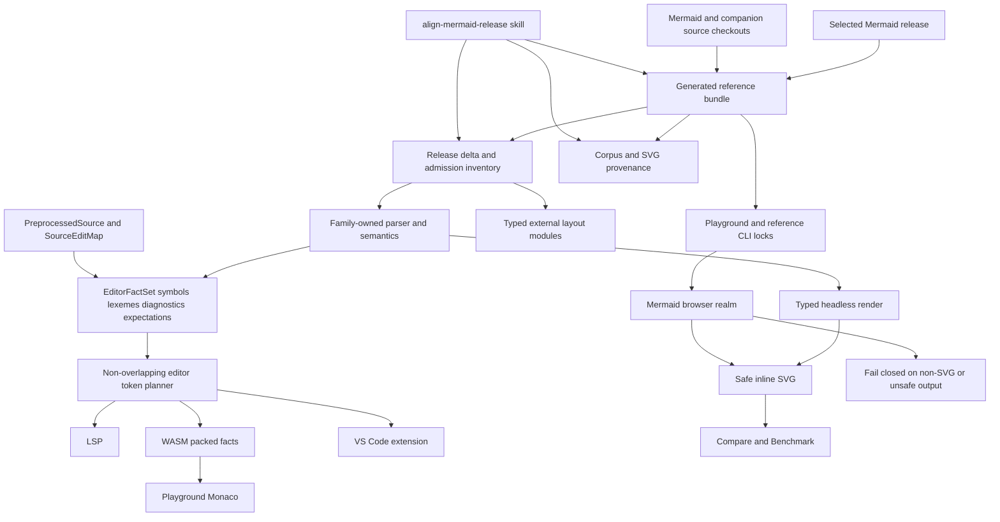

# Mermaid Parity, Editor Language, and Release Alignment - Plan

## Goal Capsule

- **Objective:** Make Mermaid compatibility one source-backed, repeatable capability across parser, semantic model, headless render, editor facts, LSP, Web, Playground, upstream evidence, and companion packages. Close the known Gantt, ZenUML, theme-color, Quadrant visibility, Block geometry, source-map, and semantic-token defects without preserving incorrect alpha-era architecture.
- **Authority:** The pinned Mermaid source checkout and its exact companion dependency graph are authoritative for behavior. Merman family-owned semantic construction, operation-owned rendering, native ABI `2`, and analysis/facts/LSP schema number `1` remain architectural constraints. Browser-dependent residuals must be explicit artifact contracts, never comparator exceptions or source heuristics.
- **Execution profile:** Fearless alpha refactor. Breaking internal Rust and TypeScript APIs, replacing the editor facts payload in-place under schema number `1`, changing the LSP semantic-token legend, deleting heuristic ZenUML parsing and sparse token projection, and removing stale Web runtime paths are allowed. Do not add v2 aliases, dual implementations, or compatibility shims for unpublished alpha surfaces.
- **Stop conditions:** Do not loosen canonical SVG safety to admit non-SVG or unsafe output, tune chart colors or edge endpoints with fixture-specific constants, use regex/Monarch fallbacks as a second parser, accept semantic comparator whitelists, hand-edit generated provenance, or split a Cargo feature without measured dependency and artifact evidence.
- **Tail ownership:** Implement and verify on the current feature branch using focused Conventional Commits. Do not push, open a PR, publish, or release unless separately requested.

---

## Product Contract

### Summary

Merman must not treat Mermaid compatibility as a renderer-only exercise. A Mermaid release is a graph of core source, parser packages, external diagrams, external layouts, generated defaults, fixtures, editor grammar, and browser behavior. One generated reference bundle will pin and project that graph into tooling, the Playground, the reference CLI, provenance, and version labels. A repository skill will make upgrading that graph repeatable and fail closed when any surface is stale.

The Playground will use one canonical render viewport and honest benchmark language, expose at least two source-backed examples for each supported family where useful, and execute external Mermaid modules in an opaque-origin realm. Every returned diagram must still pass the existing strict inline-SVG boundary; the current release graph does not gain a speculative second artifact format or sanitizer. The Rust ZenUML family will stop approximating the language with a line heuristic and instead own a grammar-derived semantic model aligned to the selected, exact compatible ZenUML Core source.

Editor support will become a real language surface. Preprocessing will retain an exact edit map, global syntax and each family will emit lexical facts, and one editor-core planner will merge lexical and semantic overlays into validated, sorted, non-overlapping tokens. LSP, WASM, Monaco, and the unpublished VS Code extension will consume the same descriptor and token plan. Completion, rename, structure, diagnostics, and render semantics remain family-owned and continue to share one parse pipeline.

### Problem Frame

The current branch has already established family-owned semantics, typed render artifacts, operation-owned environments, ABI `2`, schema `1`, and a generated 35-family Web catalog. It also fixed previously reported bypasses and panics: Flowchart complexity is checked before Dagre/ELK/Swimlane dispatch, system time zones preserve target-date DST rules, root SVG placeholders are replaced by recorded ranges, boundary dates return typed errors, ownership guards use closed types and compile-fail tests, text measurement is generated from one ABI descriptor, and Wardley has an independent admission record. Those are preserved invariants, not work to redo.

The remaining defects reveal deeper missing contracts:

- Mermaid Gantt derives ticks from its host width. Compare used a pane-derived width while Merman used an 800-by-600 canonical viewport, so the same source was compared under different layout inputs and labels overlapped.
- Advanced ZenUML is recoverably identified by Rust facts, but the Web projection discarded identity whenever full parsing failed. The JS plugin was not registered consistently. Source and executable evidence now show that Mermaid 11.16's plugin calls `@zenuml/core.renderToSvg` and returns native SVG that the existing strict inline-SVG validator accepts across the full fixture corpus; no `foreignObject` fallback is required. The local ZenUML parser also implements only a conservative Sequence subset and cannot parse official groups, stereotypes, starters, fragments, assignments, and expressions.
- Supplying only a font override enters Mermaid's user-theme-variable path. Merman currently performs only one color-scale derivation instead of reproducing constructor defaults, override calculation, color updates, and explicit-value replay. Radar, Kanban, Mindmap, and Timeline therefore share incorrect derived colors.
- Block layout allocates rectangular slots but non-rectangular rendering uses label-derived geometry. Edge intersection still clips against the slot, leaving visible gaps for circle-like and other non-rectangular shapes.
- Quadrant raw parity intentionally preserves Mermaid 11.16's invalid `hsl(...NaN%)`; browsers ignore it and inherit a dark point color. A stale Playground WASM artifact made the already-correct Rust fix appear absent, showing that build freshness is not proven by file existence.
- Editor facts contain sparse semantic symbols, not a lexical stream. Any non-delete preprocessing rewrite can degrade the whole source map and erase all facts. ZenUML can emit overlapping ranges. Monaco then performs additional JavaScript sorting and legend lookup, while LSP and WASM maintain parallel token mappings.
- Companion dependencies drift independently: Mermaid 11.16 contains ZenUML plugin `0.2.3` with a workspace lock at ZenUML Core `3.47.8`, while the published plugin range admits the newer compatible Core `3.50.1`; ELK layout `0.2.2` and tidy-tree layout `0.2.2` also differ from local consumers. The Playground and reference CLI do not currently project a deliberate, verified graph from one source.

### Requirements

#### Release reference and companion alignment

- **R1.** One machine-readable Mermaid reference bundle must pin the Mermaid tag and commit, core/parser packages, external diagram packages and their behavior-source repositories, external layout packages, npm tarball integrity and publish provenance, reference CLI inputs, and generated artifact schema. Handwritten version constants in Rust or TypeScript may only be generated projections of this bundle.
- **R2.** For the current `mermaid@11.16.0` baseline, the bundle must record both the normative upstream oracle and a candidate product graph. The oracle is `@mermaid-js/parser@1.2.0`, `@mermaid-js/mermaid-zenuml@0.2.3`, and Mermaid's workspace-resolved `@zenuml/core@3.47.8`. The candidate uses the newest version satisfying the plugin's declared major-compatible range, currently `@zenuml/core@3.50.1`, plus `@mermaid-js/layout-elk@0.2.2` and `@mermaid-js/layout-tidy-tree@0.2.2`. It becomes the selected product/reference/headless target only after U1's plugin-contract, corpus, semantic, render, strict-inline-artifact, execution-isolation, security, and resource matrix passes with every delta classified from source; otherwise the selected graph remains the oracle and the candidate is a failed admission. Playground and `tools/mermaid-cli` locks must resolve the resulting selected versions exactly; `tools/upstreams/REPOS.lock.json` must pin oracle and candidate source commits needed for evidence.
- **R3.** External runtime requirements must be typed sets of `externalDiagrams` and `layoutModules`, derived from canonical analysis/effective-config facts. Compare and Benchmark must share registration code and support ZenUML, ELK, and tidy-tree without source scans or independent booleans.
- **R4.** An alignment command must fail closed on source/lock/provenance/generated-output drift, detect added or removed Mermaid diagram and layout registrations, inventory parser/editor/render/Playground coverage, and identify companion dependencies that require source behavior ports. It must distinguish the Mermaid-compatible companion graph from each companion's latest stable release: a newer major outside the Mermaid plugin's declared range becomes a separate behavior-delta admission, never an implicit override. Dependency materialization defaults to disabled lifecycle scripts; package integrity and provenance are verified before an explicitly audited allowlist may run any required install action.
- **R5.** A new optional Cargo feature may be introduced only when a release adds a dependency whose platform, license, clean-build, or artifact-size cost cannot fit an existing semantic capability. The decision must use `cargo tree`, target support, license evidence, clean-build timing, and the existing WASM/package-surface budgets. Browser-only lazy companion chunks are typed runtime capabilities, not automatically Cargo features.

#### Playground rendering and user experience

- **R6.** Merman and Mermaid must receive the same immutable operation viewport. The default comparison and benchmark viewport is 800 by 600 CSS pixels; responsive panes scale presentation only and may not mutate layout inputs. Gantt must render non-overlapping date ticks for the canonical example in both engines.
- **R7.** The example catalog must contain at least one source-backed example for all 35 full-profile families and a second meaningful variant for each family where upstream/local fixtures provide distinct syntax or behavior. Search, family metadata, generated provenance, and exact source selection remain generated and tested.
- **R8.** Benchmark copy must call the cold mode `Fresh runtime` and the warm mode `Reused runtime` (localized equivalently). Help text/tooltips must explain fresh iframe/module-map scope and report HTTP-cache evidence separately; the product must not expose the implementation term `realm` as an unexplained user-facing label.
- **R9.** The Playground must project structured Rust/binding errors into concise messages and details; `[object Object]` is forbidden. Parse recovery may retain a canonical diagram identity while marking syntax/semantic validity separately, so external requirements can load for incomplete or independently supported syntax.
- **R10.** Pinned and provenance-verified Mermaid/external diagram code executes in an opaque-origin `sandbox="allow-scripts"` realm built as a self-contained local artifact. The realm has no `allow-same-origin`, parent DOM, origin-backed storage, credentials, or direct fetch/XHR/WebSocket/EventSource/beacon/worker/subresource capability; it may return only budgeted strings through an authenticated MessagePort. A normal browser sandbox cannot prevent a script from navigating its own frame before the parent observes the second load, so self-navigation is an explicit residual: the parent must detect it, poison the operation, and remove the frame, while absolute zero-egress execution remains a host capability for Electron/WebView/extension request interception or a server sandbox with enforced egress policy. Every returned Mermaid artifact in the selected release graph must be native SVG accepted by strict `assertSafeSvgForDom` before inline insertion; rejection is terminal for that render and may not fall back to a family-name exception or a generic sanitizer. A later release that introduces a genuinely different artifact format must fail admission until that concrete format earns a closed type, validator, presenter, resource budget, and browser evidence in a separate design.
- **R11.** UI changes for examples, benchmark results, external artifact failures, diagnostics, and syntax highlighting must follow the existing quiet workbench design, remain usable at desktop/mobile viewports, use accessible Dialog/Tabs/buttons, and avoid nested decorative cards or explanatory feature copy. Visual polish must not obscure artifact state, errors, versions, or capability limits.

#### ZenUML behavior alignment

- **R12.** The ZenUML family must replace its heuristic line parser with grammar-derived parsing based on U1's matrix-selected exact Core version (`3.50.1` only when admitted, otherwise the `3.47.8` oracle), its `sequenceLexer.g4`, `sequenceParser.g4`, and corresponding model behavior. Oracle/candidate delta evidence remains attached to the decision. It must support official participant annotations/colors/stereotypes, title, starter, comments, calls, creation, assignments, return values, groups, `par`, `opt`, `critical`, sections, references, `try/catch/finally`, alternatives, loops, and expressions with exact source ranges and recovery.
- **R13.** ZenUML must construct one family-owned semantic artifact consumed by detection, analysis, editor facts, completion/rename/structure, layout, and headless render. Do not translate it through Sequence JSON or retain the old compatibility parser.
- **R14.** The headless renderer must reproduce source-backed participant/message/fragment topology, labels, colors, and geometry from the selected exact ZenUML behavior. Browser JS comparison must use the plugin's strict validated native SVG; parser or renderer support metadata must not claim official coverage until corpus and behavior gates pass.

#### Theme, visible parity, and shape geometry

- **R15.** Theme resolution must model Mermaid's ordered stages: constructor/default snapshot, site/source overrides, calculate/update-colors, and explicit-value replay. Family renderers consume the resolved snapshot and may not rederive palette values independently.
- **R16.** Font-only site configuration must preserve upstream visible colors for Radar, Kanban, Mindmap, and Timeline across Default, Dark, Forest, Neutral, and Base themes. Tests must distinguish raw theme tokens, browser computed values, and resvg-safe values.
- **R17.** Quadrant must retain exact raw Mermaid 11.16 output where required by raw parity, render points with the same browser-computed inherited dark color, and produce an explicit valid fallback in resvg-safe output. No comparator whitelist or NaN/RGB semantic equivalence is allowed.
- **R18.** Block rendering and routing must share a typed `BlockShapeGeometry` (or an equally closed family-owned geometry artifact) containing allocated bounds and true render/intersection geometry. Circle, double-circle, stadium, cylinder, diamond, hexagon, trapezoid, and block-arrow endpoints must meet the visible boundary within numeric tolerance; rectangular shapes must not regress.

#### Parser, editor facts, LSP, and Monaco

- **R19.** Preprocessing must produce a `PreprocessedSource` with exact text and a composable edit map for every deletion, replacement, entity decode, quote normalization, directive/frontmatter removal, and Markdown fence transform. Mapping one invalid span may drop that span with a diagnostic, but may not degrade the entire document or erase unrelated facts.
- **R20.** `EditorFactSet` must contain family-owned symbols, lexemes, diagnostics, and expected syntax. Global preprocessing owns fences, frontmatter, directives, and global comments; each family owns body keywords, comments, arrows/operators, delimiters, identifiers, numbers, dates/durations, booleans, strings, styles, colors, and family-specific literals.
- **R21.** `merman-editor-core` must be the only token planner. It merges lexical facts with semantic overlays, validates UTF-8 ranges, maps through the edit map, resolves precedence, splits multiline ranges, converts to UTF-16, and emits sorted non-overlapping tokens. Overlapping family facts are rejected by tests before any transport sees them.
- **R22.** One generated token descriptor and legend must define token codes, names, modifiers, precedence, LSP legend indices, WASM packed representation, and TypeScript projection. LSP, Web, Monaco, and VS Code may not maintain parallel enums or perform their own sorting/index lookup.
- **R23.** All 35 full-profile families must meet a lexical richness and recovery corpus gate. The migration may proceed family by family internally, but the public LSP/WASM/Monaco switch is atomic; remove the sparse symbol-only projection and any Monarch/regex fallback in the same unit.
- **R24.** Completion, hover/symbol structure, rename, code actions, diagnostics, diagram detection, and semantic tokens must consume the same family parse snapshot. Syntax-highlighting changes may expand the unpublished LSP legend and replace the schema-`1` alpha payload shape, but native ABI remains `2`, schema numbers remain `1`, and no v1/v2 aliases are retained.
- **R25.** Playground Monaco and the unpublished VS Code extension must expose identical token meaning and recovery behavior for the same document. Browser worker cancellation must not claim to interrupt synchronous WASM; cancellation or true incremental parsing is either implemented with a real boundary or described as unavailable in code/API state.

#### Build freshness, evidence, and durable workflow

- **R26.** Playground/Web builds must prove the WASM artifact matches relevant Rust, Cargo, generated ABI, and build-script inputs using a content digest manifest. File existence alone is insufficient. A stale artifact must fail with one actionable rebuild command before Vite starts or builds.
- **R27.** Browser tests must inspect computed presentation for Gantt ticks, Quadrant points, shared theme colors, Block edge contact, opaque ZenUML execution plus strict inline publication, and 35-family semantic tokens. Structural/raw SVG tests remain separate and may not stand in for visible behavior.
- **R28.** Architecture regressions already fixed in HEAD remain gated: Flowchart complexity before all layout dispatch, full time-zone rules for target dates, range-owned root SVG finalization, checked boundary dates, closed family/report types, generated text-measurement ABI, no Quadrant comparator whitelist, and independent Wardley admission.
- **R29.** Add `.agents/skills/align-mermaid-release` as a model-invoked repository skill. It must guide an agent through release discovery, exact source/companion pinning, generated reference updates, family/layout admission, parser/editor/LSP/render/Playground work, feature-split evidence, parity gates, documentation, and a no-publish handoff. It must call repository commands and reference a concise checklist instead of duplicating implementation logic.
- **R30.** Documentation must update the Mermaid upgrade playbook, relevant ADRs, ZenUML/theme/editor alignment records, package surfaces, and Playground design. Generated status and provenance must remain readable and reproducible.

### Key Flows

- **F1. Release intake:** the maintainer selects a Mermaid release; the alignment workflow resolves the exact source commit and companion graph, updates one reference bundle, materializes sources under `repo-ref`, inventories behavior changes, and creates explicit admission work for every new diagram/layout/parser surface.
- **F2. Live editing:** one source enters preprocessing and the family parser once; exact facts feed diagnostics, completion, rename, structure, semantic tokens, detection, and render. Invalid local syntax preserves mappable facts around the error and never falls back to regex coloring.
- **F3. Compare:** one frozen source/config/viewport is sent to both engines. Typed external requirements register the exact companion modules in the opaque execution realm. Only strict-validated native SVG is published inline; any other artifact fails closed.
- **F4. Benchmark:** Fresh runtime and Reused runtime use identical source, config, viewport, registration, font readiness, and presentation boundaries. Raw evidence identifies exact reference-bundle versions and HTTP-cache observations.
- **F5. Headless parity:** the family semantic artifact drives geometry and SVG. Theme stages and shape geometry are shared by rendering and routing; browser-dependent raw/computed/resvg-safe differences are separately asserted.
- **F6. Build:** the Web/Playground build checks the WASM input digest, generated reference bundle, dependency locks, catalogs, token descriptor, and provenance before compiling UI assets. Stale artifacts fail before browser tests can produce misleading evidence.

### Acceptance Examples

- **AE1.** The provided Gantt source renders in Compare at 800 by 600 for both engines; adjacent date labels have no intersecting client rects at desktop or mobile presentation widths.
- **AE2.** A fresh page renders the provided advanced ZenUML source without a prior simple ZenUML render. Merman produces its typed headless artifact; Mermaid executes in an opaque realm and its native SVG passes strict parent-side validation before inline publication. No `foreignObject` or alternate sanitizer path is involved; invalid ZenUML reports a structured error and does not poison the next render.
- **AE3.** The provided Radar, Kanban, and font-only theme fixtures match pinned Mermaid computed colors. The provided Quadrant points compute to the inherited dark color in Chromium while raw and resvg-safe contracts remain explicit.
- **AE4.** For every non-rectangular Block shape, the final edge point lies on the actual rendered outline within tolerance under horizontal, vertical, diagonal, styled, and long-label cases.
- **AE5.** `classDef c fill:#f00` and the same source with a trailing semicolon retain equivalent unrelated tokens. A malformed middle statement keeps valid tokens before and after the error. ZenUML `new A1` and `new A2(args)` produce no overlapping semantic tokens.
- **AE6.** The same 35-family corpus produces the same token code/modifier/range sequence through editor-core, LSP, Web WASM, Playground Monaco, and VS Code projection after UTF-16 conversion.
- **AE7.** `npm ls` in Playground and the reference CLI reports exactly the current reference bundle. A tidy-tree Mindmap, an ELK subgraph with `mergeEdges`, and advanced ZenUML all render in Compare and Benchmark cold/reused modes.
- **AE8.** Editing a relevant Rust source after building Web causes the Playground freshness gate to fail; rebuilding updates the digest and restores production build/browser tests. A stale prebuilt WASM cannot masquerade as current Rust behavior.
- **AE9.** Invoking `align-mermaid-release` on a fixture release delta produces a complete inventory and command sequence, including a reasoned feature decision, and refuses completion when a new upstream diagram lacks parser/editor/render/Playground evidence.

---

## Planning Contract

### Established Invariants

The implementation must preserve these HEAD contracts while changing adjacent architecture:

- `family::prepare` checks Flowchart complexity before selecting Dagre, ELK, or Swimlane.
- Render sessions retain full `LocalTimeZone` rules; explicit fixed offsets remain a different type/choice.
- Root SVG finalization replaces recorded attribute ranges and never scans for placeholder text.
- CLI and bindings return typed invalid-argument errors for boundary-date overflow.
- Family artifacts, rooted SVG, and completed render reports are closed types guarded by compile-fail and runtime evidence tests.
- `abi/merman-v2.json` remains the single descriptor for the 19 text-measurement operations and platform projections.
- Structure comparison contains no Quadrant NaN/RGB whitelist.
- Wardley remains an admitted Mermaid 11.16 family with independent evidence, not an accidental architecture-migration exception.

### Key Technical Decisions

#### KTD1. Generate one Mermaid reference bundle

**Decision:** Add a human-reviewable source descriptor under `tools/upstreams/` and generate Rust/TypeScript/version projections from it. Lockfiles remain package-manager outputs, while `xtask` verifies their resolved graph against the descriptor.

**Why:** A version constant cannot prove the installed package graph or companion source. The descriptor names intent; package locks and provenance prove materialization.

**Rejected:** More handwritten constants in Playground, CLI, and `xtask`; treating `package-lock.json` as the only readable policy; overriding unrelated transitive packages without behavior evidence.

#### KTD2. Separate untrusted execution from strict artifact publication

**Decision:** Execute pinned Mermaid/external diagram code in an opaque-origin script-only realm, then accept exactly one current publication artifact: `SafeInlineSvg`, produced only after parent-side `assertSafeSvgForDom` succeeds. Mermaid 11.16's ZenUML plugin and the candidate Core corpus emit native SVG, so strict rejection is an operation failure rather than an invitation to guess a second format. A future non-SVG or otherwise non-inline artifact requires its own release-admission design before selection.

**Why:** Source inspection of `packages/mermaid-zenuml/src/zenumlRenderer.ts` and executable evidence across all 17 repository ZenUML fixtures prove that the selected plugin calls `renderToSvg`, returns no `foreignObject`, and already passes the strict inline validator. A generic rich sanitizer and second presentation iframe would have no producer in the selected graph while adding a large security and accessibility surface. Exact package provenance, opaque execution, and strict parent-side validation are complementary controls; containment still does not make the impossible claim that a DOM-capable browser iframe can execute arbitrary compromised code with absolute zero egress.

**Rejected:** Same-origin execution for external diagram code; globally allowing `foreignObject`; special-casing a ZenUML string after strict validation fails; a speculative generic sanitizer/presenter with no current producer; hiding the upstream side when its native SVG passes the existing boundary.

#### KTD3. Port ZenUML grammar and semantics, not JavaScript containers

**Decision:** Re-express the pinned ANTLR grammar and semantic behavior in Merman's existing parser/model architecture. Port behavior needed for headless semantics and rendering; do not reproduce incidental JavaScript `Set`, React store, DOM cache, or component state unless it changes observable parsing/layout/render behavior.

**Why:** Headless parity requires language and rendering behavior, not implementation-language containers. A grammar-derived Rust model removes the current heuristic and serves every downstream surface.

**Rejected:** Regex growth around the current parser; embedding a JavaScript runtime in Rust; translating ZenUML into Sequence as an intermediate representation.

#### KTD4. Exact source maps and family-owned lexemes precede transport changes

**Decision:** Preprocessing owns a composable edit map; families emit source-coordinate facts; editor-core alone resolves and encodes tokens. LSP, WASM, Monaco, and VS Code are projections.

**Why:** Transport-level highlighting cannot recover facts erased or overlapped upstream. Correctness belongs before UTF-16 and protocol encoding.

**Rejected:** Monaco Monarch fallback; LSP-specific token repair; all-or-nothing mapping; maintaining separate legends.

#### KTD5. Replace schema-1 alpha shapes atomically

**Decision:** Keep native ABI `2` and analysis/facts/LSP schema numbers at `1`, but replace unpublished alpha payload and legend shapes in one repository change. Regenerate every projection and delete old routes.

**Why:** Renumbering communicates a compatibility promise the project does not yet have. Dual shapes would create the very ambiguity this refactor removes.

**Rejected:** schema `2`; `v1`/`v2` aliases; transport adapters that synthesize old sparse facts.

#### KTD6. Theme resolution is an ordered state machine

**Decision:** Represent default construction, overrides, derived-color updates, and explicit replay as named stages producing one immutable resolved snapshot.

**Why:** Mermaid intentionally recomputes related palette fields after overrides. A flat map or one-time derivation cannot reproduce font-only and partial-theme behavior.

**Rejected:** Family-specific palette patches; magic lightness offsets; removing the Playground font override to hide the defect.

#### KTD7. Shape geometry is a render-routing contract

**Decision:** Layout allocates a slot, shape construction materializes true geometry, and both SVG emission and edge intersection consume the same typed geometry artifact.

**Why:** A bounding box is insufficient for circles, cylinders, diamonds, trapezoids, and arrows. Sharing the artifact prevents render and routing from drifting.

**Rejected:** Subtracting the observed ten-pixel gap; shape-name switches in the router; scanning rendered SVG to recover geometry.

#### KTD8. Fixed operation viewport, responsive presentation

**Decision:** Compare and Benchmark freeze an 800-by-600 render viewport with the request. Pane size changes only CSS presentation.

**Why:** Layout-sensitive engines must receive identical inputs for a valid comparison. Browser responsiveness is a viewer concern, not an implicit layout config.

**Rejected:** Reading whichever pane happens to be mounted; sizing both engines from one half of Compare; silently changing tick density with the device viewport.

#### KTD9. Feature splits require measured architectural evidence

**Decision:** Reuse `core-full`, `core-host`, `editor-language`, `elk-layout`, and `ratex-math` when their ownership fits. Add a feature only for a genuinely optional dependency boundary proven by target/license/build/size data and package-surface policy.

**Why:** Diagram count is not a feature boundary. Unnecessary flags multiply build combinations; a genuinely heavy or platform-constrained engine should not burden slim consumers.

**Rejected:** One feature per new Mermaid diagram; unconditional heavy dependencies; arbitrary byte thresholds disconnected from existing budgets.

#### KTD10. The repository skill orchestrates evidence, not implementation detail

**Decision:** `align-mermaid-release` invokes the generated bundle and `xtask` gates, links one concise admission checklist, and tells the agent how to decide and sequence work. It does not copy command implementations or carry hardcoded current versions.

**Why:** A skill should remain useful for the next release. Repository commands are testable; prose algorithms drift.

**Rejected:** A release-specific checklist frozen to 11.16; a second shell-script implementation of `xtask`; automatically publishing after alignment.

#### KTD11. Latest-compatible companions require admission

**Decision:** Treat the Mermaid workspace lock as the normative oracle and the highest version satisfying a published companion range as a candidate. Select the candidate only when the named compatibility matrix passes with no unexplained behavior delta; otherwise retain the oracle and fail the candidate admission.

**Why:** Semver expresses an intended compatibility range, not proof that parser, renderer, security, and resource behavior still match the host integration. This preserves reproducibility while allowing verified fixes from newer compatible releases.

**Rejected:** Always staying on the historical lock; always taking the range maximum; changing Merman semantics until an unexplained candidate delta appears to pass.

### Architecture



### Dependency Order

```text
U1 reference bundle and dependency graph --> U1A WASM freshness gate
 +--> U2 Playground viewport/examples/errors --> U3 external modules/opaque execution
 +--> U4 ZenUML grammar/model/render
 +--> U11 release alignment skill

U1A -----------------------> U2 and every later Playground build/browser gate
U1A -----------------------> U10 LSP/WASM/Monaco/VS Code switch

U5 theme state machine ----> U7 browser-visible artifact proof
U6 Block geometry ---------> U7 browser-visible artifact proof
U2 ------------------------> U7 browser-visible artifact proof
U3 ------------------------> U7 browser-visible artifact proof

U8 exact source map -------> U9 lexical facts and token planner
U4 ------------------------> U9 lexical facts and token planner
U9 ------------------------> U10 LSP/WASM/Monaco/VS Code switch

U1 + U1A + U7 + U10 + U11 -> U12 gates, docs, cleanup, review
```

### Supersession and Scope

This plan builds on `docs/plans/2026-07-18-001-refactor-web-runtime-benchmark-playground-hardening-plan.md`. It supersedes only that plan's assumptions that ZenUML `0.2.2` and ELK `0.2.1` are the current companion baseline, that incomplete parse facts cannot retain a diagram identity, that Compare may derive render width from its presentation pane, and that pinned Mermaid/external diagram code may execute in a same-origin realm authenticated by exact origin. Runtime ownership, benchmark event semantics, caching, accessibility, and lifecycle contracts remain authoritative; Mermaid execution now uses the opaque-origin source-window/token/MessagePort contract in R10 and U3.

The plan does not upgrade beyond Mermaid 11.16 as part of the current implementation. It creates the machinery and skill that make a later selected release a complete, reviewable admission rather than an ad hoc version bump. It also does not publish the VS Code extension or any package.

### Interaction Contracts

#### External artifact publication

| State | Visible content and actions | Publication, focus, and cleanup |
|---|---|---|
| `empty` | No artifact; render/export controls disabled. | No iframe exists. |
| `pending` | Bounded progress state; no prior artifact presented as current. | Request owns no published SVG until opaque execution and parent validation complete. |
| `updating-with-prior` | Prior SVG may remain only with explicit stale/updating treatment; its export actions are disabled. | Superseding publication replaces it atomically after validation. |
| `ready` | Current strict-validated SVG, exact engine/version, and safe supported actions. | Publish atomically for the current request id in the existing preview viewport. |
| `rejected` | Protocol, resource, non-SVG, or strict-validation reason with one retry action; no partial output. | Poison and destroy the execution realm when required; retain no candidate markup. |
| `timeout/replaced` | Timeout or poisoned-realm state and an explicit rerender action. | Destroy the execution realm before another request; ignore late messages by identity tokens. |
| `mixed-partial` | The successful engine remains current while the other side shows its current failure; no cross-side artifact action. | Publish one coherent current batch and remove every stale failed-side artifact. |
| `superseded` | No visible transition. | Discard the candidate response without stealing focus. |

Status, retry, export, zoom, and close controls remain in the parent document. One bounded outer viewer owns scrolling; keyboard/touch pan and zoom cannot trap focus, and replacement restores focus to the originating parent control. Desktop, narrow portrait, landscape, browser zoom, and soft-keyboard layouts must not create incoherent nested scrolling.

#### Monaco language service

| State | Editor behavior | Token and diagnostic rule |
|---|---|---|
| `initializing` | Plain-text editing remains available; language actions report not ready. | No stale semantic decorations are shown. |
| `ready` | Completion, structure, rename, diagnostics, and semantic tokens are available from one snapshot. | Publish only when document version and generated legend digest both match. |
| `reconnecting` | Editing remains available; language actions that require the worker are temporarily disabled with one status update. | Clear mismatched token/diagnostic decorations; never retain them as current. |
| `unavailable` | Plain-text editing remains available with an explicit Retry command; no regex fallback. | Clear semantic decorations and announce the terminal transition through the existing editor live region. |

Rapid edits, worker replacement, legend changes, and stale responses may only transition this state machine; they may not replace the editor model, move focus, or publish results for an older document/legend pair.

---

## Implementation Units

### U1. Create the Mermaid reference bundle and align companion dependencies

**Goal:** Make one descriptor the intent source for the pinned release graph and remove version drift across runtime, tools, provenance, and display.

**Files:**

- Create `tools/upstreams/MERMAID_REFERENCE_BUNDLE.json`.
- Modify `tools/upstreams/REPOS.lock.json` and `tools/upstreams/README.md`.
- Create or modify `crates/xtask/src/cmd/mermaid_reference.rs`, `crates/xtask/src/cmd/mod.rs`, and focused tests.
- Generate a Rust projection under `crates/xtask/src/generated/` or the existing generated-data owner.
- Generate `playground/src/generated/mermaid-reference.ts`.
- Modify `playground/package.json`, `playground/package-lock.json`, `tools/mermaid-cli/package.json`, and `tools/mermaid-cli/package-lock.json` through npm.
- Modify provenance generators and manifests that currently hardcode 11.16 package identities.

**Approach:**

1. Define a schema with core release/tag/commit, package name/version/range, source repository/ref/commit, tarball integrity, role (`core`, `parser`, `external-diagram`, `external-layout`, `reference-cli`), latest-stable observation, compatibility decision, and required surfaces.
2. Pin both ZenUML graphs from R2. Verify the `3.47.8` oracle at npm `gitHead` `c81406671c0833baebb9fac08a0cbcdc99b3907d`, and register compatible `3.50.1` at `38404ccc14243ed54ab45b804b2eb6f2ca73af36` as the candidate after tarball integrity checks. Account for the release-time package version rewrite instead of treating a source-tree version string alone as provenance.
3. Generate display/runtime constants; do not parse JSON ad hoc from browser code.
4. Run the candidate matrix against the same plugin and frozen inputs: official and regression syntax corpus, parser acceptance/recovery, participant/message/fragment semantics, native SVG structure and visible behavior, strict artifact validation, execution isolation, errors, resource limits, and startup/render budgets. Every delta must map to reviewed source behavior; any unexplained or breaking delta fails admission.
5. Resolve and update both locks with lifecycle scripts disabled and an exact override for the matrix-selected Core version, preventing later compatible-range drift. Verify tarball integrity/source records before any package code runs.
6. Inventory packages with lifecycle scripts. Permit only reviewed build-tool actions that are necessary after scriptless materialization, and invoke those actions explicitly rather than through an unrestricted install hook.
7. Make `xtask` verify installed/locked versions, source checkout commits, tarball integrity/publish evidence, matrix decision, provenance package-lock hashes, generated projections, and absence of handwritten duplicate constants.
8. Generate and verify an owned oracle-to-selected parser/model/render behavior-delta inventory whose implementation owner is U4. Record that ZenUML Core `4.2.0` is newer but excluded because both the published plugin range (`^3.47.0`) and pinned workspace range (`^3.47.8`) reject major version 4; produce a separate v4 delta/admission artifact rather than forcing it into Mermaid 11.16.
9. Record feature-split evidence for these companion changes; expected result is no new Cargo feature because they are browser/reference-tool packages.

**Requirements:** R1-R5, R30.

**Test scenarios:** candidate matrix success; parser/semantic/render/security/resource delta rejection retaining the oracle; one package version drift; missing source checkout; wrong companion commit; stale generated TS; unrelated transitive difference; a new external layout entry lacking surface ownership.

**Verification:** `cargo nextest run -p xtask mermaid_reference`; `cargo run -p xtask -- verify-mermaid-reference`; `npm ls` in Playground and reference CLI; `git diff --check`.

### U1A. Establish the WASM input-freshness gate

**Goal:** Make stale Web/Playground WASM impossible before any browser-facing implementation or evidence is trusted.

**Files:**

- Extend `platforms/web/scripts/build-wasm.mjs` and package scripts with a WASM input digest manifest.
- Add an `xtask` helper if Rust-side canonical input enumeration is needed.
- Modify Playground predev/prebuild/pretest entry points and focused build-graph tests.
- Document the digest contract next to the Web package build surface.

**Approach:**

1. Hash workspace manifests, the Rust lockfile, relevant Rust sources, generated ABI/catalog inputs, the build script, feature profile, target, and tool version into a deterministic manifest next to the WASM package.
2. Verify the manifest before Playground dev, build, unit tests that load WASM, and browser tests; print one exact cross-platform rebuild command on mismatch.
3. Define the canonical input set in repository code rather than a hand-maintained shell glob, and test additions/removals that should invalidate the artifact.
4. Make U2 and every later browser-facing unit depend on this gate before accepting production-build or Playwright evidence.

**Requirements:** R26, R27.

**Test scenarios:** stale Rust source, changed Cargo manifest/lock, changed feature set, changed generated ABI/catalog input, changed build script/tool version, current artifact, missing/corrupt manifest, irrelevant documentation edit.

**Verification:** Web build-graph/package tests; intentional stale-artifact failure; deterministic rebuild and manifest match; Playground predev/prebuild/pretest smoke.

### U2. Finish the canonical Playground viewport, examples, labels, and error contract

**Goal:** Make current Playground behavior truthful and stable before adding external runtime and language data.

**Files:**

- Modify `crates/xtask/src/cmd/playground_catalog.rs`, `playground/examples/manifest.json`, `playground/src/generated/examples.ts`, and example tests.
- Modify `playground/src/components/BenchDialog.tsx`, `playground/src/components/Preview.tsx`, and locale files.
- Create or modify `playground/src/runtime/render-viewport.ts`, `render-coordinator.ts`, `render-coordinator-browser.ts`, and tests.
- Modify `platforms/web/src/index.ts`, detection tests, and smoke tests.
- Modify `docs/adr/0074-browser-runtime-and-benchmark-ownership.md` and `docs/workstreams/web-wasm-playground/DESIGN.md`.

**Approach:**

1. Generate and verify the curated source-backed catalog with exact 35-family coverage. The current manifest contains 70 examples; that count is descriptive, while each example beyond the required family minimum must cite a distinct syntax, behavior, or workflow fixture and earn its place independently.
2. Freeze the canonical viewport in every Compare/Benchmark request and remove pane-width mutation from Preview.
3. Rename visible benchmark modes while retaining internal protocol identifiers where they remain precise.
4. Project recoverable diagram identity separately from validity and update requirement selection to consume it.
5. Normalize structured binding errors into a stable user error view with concise summary and inspectable detail.
6. Refine affected controls and status presentation to the existing workbench visual language without decorative layout churn.

**Requirements:** R6-R9, R11, R27.

**Test scenarios:** Gantt at wide and mobile presentation widths; exact 35-family example coverage and distinct-evidence validation for every additional example; malformed recoverable ZenUML identity; structured object error; benchmark mode localization; stale Compare result.

**Verification:** Playground unit tests, typecheck, lint, production build, and focused Playwright desktop/mobile tests.

### U3. Unify external module registration and isolate external execution

**Goal:** Support the exact ZenUML/ELK/tidy-tree browser graph without weakening inline SVG safety.

**Files:**

- Refactor `playground/src/runtime/mermaid-requirements.ts` and its tests.
- Modify Compare and Benchmark Mermaid engines under `playground/src/runtime/realm/engines/` and `playground/src/benchmark/realm/engines/`.
- Create a shared external module registrar under `playground/src/runtime/`.
- Keep render/realm protocols closed over strict validated native SVG and structured failures.
- Create the opaque execution artifact and focused protocol/security tests.
- Modify CSP/Vite/Playwright configuration only as required by the self-contained opaque realm.

**Approach:**

1. Replace boolean requirements with generated, sorted, deduplicated diagram/layout module identifiers.
2. Register modules through one operation-queued function used by Compare and Benchmark.
3. Add lazy local imports for ZenUML `0.2.3`, ELK `0.2.2`, and tidy-tree `0.2.2`.
4. Build the Mermaid realm as a self-contained HTML/script artifact with a hash-locked CSP. Run it under `sandbox="allow-scripts"` without `allow-same-origin`; authenticate the unique-origin bootstrap by exact `contentWindow`, an unguessable one-run token, and one transferred MessagePort. The realm receives only frozen bounded inputs. Prove CSP denial for direct fetch/XHR/WebSocket/EventSource/beacon/worker and external subresource paths; separately prove that a self-navigation attempt triggers immediate parent-side poisoning and frame removal, while recording that the browser may already have issued that first navigation request.
5. Define one `SafeInlineSvg` publication type with source/config/size budgets. Parent-side strict validation is mandatory even when the execution realm reports success; non-SVG and unsafe output are terminal structured failures.
6. Delete speculative rich-document sanitizer, presenter, and second-iframe code. Do not infer an alternate artifact from family names or validation failures.
7. Publish validated SVG through the canonical preview state contract. Keep export paths bound to the validated artifact and disable unsupported conversion explicitly.

**Requirements:** R3, R9-R11, R27.

**Test scenarios:** advanced ZenUML first render, reused render, invalid source recovery, opaque-origin proof, parent/origin-storage/credential access denial, CSP denial for direct network and subresource APIs, self-navigation detection and containment with the first-request residual documented, forged bootstrap/port messages, non-SVG output, unsafe/oversized SVG, external URL, script/event attribute, tidy-tree Mindmap, ELK `mergeEdges`, realm timeout and replacement.

**Verification:** runtime/protocol unit tests; production CSP build; Playwright cold/reused ZenUML and layout-module tests; full ZenUML corpus proof that returned native SVG passes the same strict parent-side validator with no alternate artifact path.

### U4. Replace the ZenUML compatibility parser with a grammar-derived family

**Goal:** Align parser, semantic model, editor facts, layout, and headless render to the selected exact ZenUML Core behavior.

**Files:**

- Replace `crates/merman-core/src/diagrams/zenuml.rs` with a cohesive `zenuml/` module.
- Add grammar/parser sources and family-owned AST/semantic/editor models under that module.
- Modify the ZenUML family registration in `crates/merman-core/src/family.rs` and render dispatch in `crates/merman-render`.
- Add or replace `docs/alignment/ZENUML_MINIMUM.md` and `ZENUML_UPSTREAM_TEST_COVERAGE.md` evidence.
- Add fixtures derived from selected ZenUML Core tests/examples, retaining the upstream-lock-to-selected delta provenance.

**Approach:**

1. Consume U1's admission decision and oracle/candidate delta inventory, then translate the matrix-selected lexer/parser grammar into the existing Rust parser-generator ecosystem, preserving rule boundaries, precedence, comments, Unicode, and recovery ranges.
2. Port every observable parser/model/render delta plus selected participant ordering, message ownership, fragments, assignments, returns, stereotypes, colors, and numbering semantics from the companion source.
3. Construct one typed ZenUML semantic artifact and route every downstream capability through it.
4. Port headless geometry/render behavior from ZenUML Core's SVG geometry modules where it is source-backed; use owned text measurement rather than guessed widths.
5. Remove the old line parser and any Sequence compatibility conversion once the new corpus passes.
6. Regenerate ZenUML parse/semantic/layout/render evidence from the matrix-selected graph and admit support levels by evidence, not by parser acceptance alone.

**Requirements:** R12-R14, R20, R24.

**Test scenarios:** the provided official advanced source; all grammar fragments; Unicode/emoji; nested fragments; participant colors/stereotypes; named/unnamed calls; assignments/returns; invalid recovery; malicious label escaping; parser/render resource limits.

**Verification:** focused core/render nextest suites; ZenUML corpus parse/semantic/layout/SVG gates; compare structure/root parity; editor capability tests.

### U5. Implement ordered Mermaid theme resolution

**Goal:** Reproduce Mermaid's theme calculation semantics once for every family.

**Files:**

- Refactor `crates/merman-core/src/theme.rs` and generated theme defaults.
- Refactor `crates/merman-render/src/theme.rs`, `svg/parity/theme.rs`, and family theme consumers.
- Update Radar, Kanban, Mindmap, Timeline, and shared theme tests/fixtures.

**Approach:**

1. Model named construction/override/calculate/replay stages with immutable snapshots and explicit provenance for each field.
2. Port pinned theme `updateColors` and `calculate` behavior using structured color operations; do not copy JavaScript container mechanics.
3. Make family config resolution consume the final snapshot only.
4. Add a matrix for no override, font-only, one palette field, multiple related fields, and every public theme.
5. Audit all other consumers of derived color scales so the same root cause cannot remain family-local.

**Requirements:** R15-R17.

**Test scenarios:** provided Radar and Kanban, Mindmap/Timeline color scales, Default/Dark/Forest/Neutral/Base, font-only and partial overrides, invalid colors, explicit replay precedence.

**Verification:** focused theme/render nextest; 35-family theme renderability smoke; structure/parity gates where applicable.

### U6. Introduce true Block shape geometry

**Goal:** Make layout, rendering, bounds, and edge clipping share one geometry source for every Block shape.

**Files:**

- Refactor `crates/merman-render/src/block.rs` and `crates/merman-render/src/svg/parity/block/`.
- Add geometry types/modules next to Block layout ownership.
- Update `crates/merman-render/tests/block_svg_test.rs` and upstream evidence.

**Approach:**

1. Inventory every Block shape and classify its true boundary representation.
2. Materialize typed geometry after label measurement and slot allocation.
3. Render paths/primitives and calculate edge intersections from that same geometry.
4. Preserve allocated bounds separately for layout spacing and root contribution.
5. Delete shape-name endpoint adjustments and any bbox approximation superseded by the geometry artifact.

**Requirements:** R18, R27.

**Test scenarios:** every shape, four edge directions plus diagonal, long/empty labels, styled stroke widths, self/multiple edges, nested blocks, zero/near-zero dimensions.

**Verification:** focused Block nextest; analytic boundary assertions; upstream structure/root compare; browser pixel/geometry checks for the provided circle case.

### U7. Separate raw, browser-visible, and resvg-safe artifact evidence

**Goal:** Prevent artifact-class confusion from hiding or fabricating visual parity after U1A has proven the build current.

**Files:**

- Extend Playground browser tests and relevant Quadrant/theme/Block fixtures.
- Update parity and resvg-safe documentation.

**Approach:**

1. Require a passing U1A digest before any browser evidence is collected.
2. Define evidence lanes: raw SVG/source parity, browser computed presentation, and resvg-safe normalized output.
3. Add computed-style/geometry browser assertions for Quadrant, theme families, Gantt, Block, and strict-validated ZenUML.
4. Keep comparator normalization narrow and prohibit semantic color equivalence exceptions.

**Requirements:** R16-R18, R27-R28.

**Test scenarios:** raw invalid Quadrant fill with dark computed point, valid resvg-safe fallback, font-only theme colors, Gantt tick geometry, Block endpoint contact, ZenUML opaque execution and strict inline publication, comparator-whitelist absence.

**Verification:** U1A freshness precondition; Playwright presentation matrix; resvg-safe renderer tests; compare gates.

### U8. Replace all-or-nothing preprocessing with exact edit maps

**Goal:** Preserve source identity and local facts through every preprocessing transformation.

**Files:**

- Refactor `crates/merman-core/src/parse_pipeline.rs` and `editor.rs`.
- Refactor `crates/merman-analysis/src/source_map.rs`, source rewrite/directive/Markdown modules, and tests.
- Add reusable edit-map types in the lowest correct owner without creating a core-analysis cycle.

**Approach:**

1. Define a composable monotonic edit representation supporting copied spans, deletions, replacements, and decoded/normalized spans with explicit mapping policy.
2. Make every preprocess stage return text plus edits and compose them in order.
3. Map facts independently; retain unaffected facts and attach a diagnostic when a transformed span cannot be represented exactly.
4. Prove UTF-8 boundaries, Markdown offsets, CRLF, entities, quotes, frontmatter, directives, and fences.
5. Delete degraded whole-document fallback and ParserInput coordinate mode once corpus tests pass.

**Requirements:** R19, R20, R24.

**Test scenarios:** trailing semicolon rewrite, comments/directives, entity decode of different byte length, quote normalization, CRLF, fenced diagrams, multiple edits, invalid span amid valid facts, Unicode before/inside/after edits.

**Verification:** analysis/core nextest; source-position property tests; 3,987-fixture regression with zero whole-document fact loss.

### U9. Add family-owned lexemes and one non-overlapping token planner

**Goal:** Turn editor facts into a complete grammar-backed lexical/semantic stream for all supported families.

**Files:**

- Extend `crates/merman-core/src/editor.rs` and each family editor implementation.
- Refactor `crates/merman-analysis/src/editor/core_facts.rs` and payload tests.
- Refactor `crates/merman-editor-core/src/semantic_tokens.rs` and tests.
- Add one token descriptor source and generated Rust/TS projections.

**Approach:**

1. Define lexeme kinds and modifiers based on Mermaid grammar concepts, not UI colors.
2. Have preprocessing emit global lexemes and family parsers/recovery journals emit body lexemes without reparsing text.
3. Define semantic overlay precedence and reject unresolved overlaps, invalid boundaries, unsorted data, or duplicate modifiers.
4. Build the editor-core planner with exact source mapping, line splitting, UTF-16 encoding, and a packed transport representation.
5. Migrate Flowchart/Swimlane and ZenUML first to validate both parser technologies, then Jison-derived and Langium-derived families, then remaining families.
6. Enforce per-family minimum lexical categories and malformed-source recovery through generated catalog/corpus gates.

**Requirements:** R20-R23.

**Test scenarios:** all 35 family headers; comments; directives/frontmatter/fences; keywords/operators/arrows/delimiters; numbers/dates/durations/colors/styles; declarations/references; multiline/Unicode; malformed middle token; ZenUML overlap repros.

**Verification:** core/analysis/editor-core nextest; descriptor generation/freshness; all-family lexical richness and non-overlap gate.

### U10. Atomically switch LSP, WASM, Monaco, and VS Code

**Goal:** Expose the same complete language facts in every editor without transport-owned heuristics.

**Files:**

- Refactor `crates/merman-lsp/src/semantic_tokens.rs` and server smoke tests.
- Refactor `platforms/web/src/surfaces/editor.ts` and generated declarations/smoke tests.
- Refactor `playground/src/lib/mermaid-language.ts`, editor worker protocol/client, Monaco bootstrap, and browser tests.
- Modify the existing VS Code extension token/legend consumers and tests.
- Delete superseded sparse token enums, sort/index code, and regex/Monarch providers.

**Approach:**

1. Generate LSP legend and Web/TypeScript descriptor from U9.
2. Return one validated packed sequence from WASM and decode it without reordering or name lookup.
3. Register Monaco semantic tokens from the generated legend and implement the Monaco language service state contract above, keyed by document version and legend digest.
4. Point VS Code at the same LSP meaning and add a cross-capability snapshot identity gate covering completion, hover/symbol structure, rename, code actions, diagnostics, diagram detection, and semantic tokens.
5. Verify identical sequences across transports and remove the old path in the same change.
6. Make synchronous-WASM cancellation semantics honest; do not add an unproven incremental parser to this unit.

**Requirements:** R11, R22-R25, R27.

**Test scenarios:** 35 valid families, incomplete source, Unicode UTF-16, multiline tokens, rapid edits/reconnect, stale worker response, legend-digest mismatch, explicit retry, no-regex unavailable state, completion/hover/structure/rename/code-action/diagnostic/detection/token snapshot identity before and after legend expansion, light/dark desktop/mobile presentation, VS Code snapshot equivalence.

**Verification:** LSP/editor-core/Web nextest and package tests; Playground worker/Monaco Playwright; VS Code extension tests; cross-surface token digest gate.

### U11. Add the repository Mermaid release-alignment skill

**Goal:** Make future Mermaid upgrades execute the complete compatibility workflow rather than only bumping a package.

**Files:**

- Create `.agents/skills/align-mermaid-release/SKILL.md` using the repository skill scaffold.
- Create `.agents/skills/align-mermaid-release/agents/openai.yaml`.
- Create `.agents/skills/align-mermaid-release/references/admission-checklist.md` only if the checklist cannot remain concise in `SKILL.md`.
- Update skill discovery documentation only if the repository requires it.

**Approach:**

1. Scaffold with `skill-creator`'s `init_skill.py` and generate deterministic interface metadata.
2. Give the skill a precise trigger description covering Mermaid release bumps, compatible companion upgrades, latest-stable companion delta audits, new diagrams/layouts, parser/LSP/editor/render parity, Playground updates, and feature-split decisions.
3. Route the workflow through U1's reference-bundle command, source materialization, delta inventory, admission evidence, exact dependency locks, parser/editor/render/UI gates, feature evidence, docs, review, and commit handoff.
4. State that new upstream diagrams and layouts require capability admission; parser-only is not release alignment. Require separate reporting for the dependency graph Mermaid actually supports and a newer companion major that falls outside that graph.
5. Keep current versions out of prose and forbid publish/push unless separately requested.
6. Add a forward test using a fixture bundle delta or validator test so missing required workflow sections fail.

**Requirements:** R4, R5, R29, R30.

**Test scenarios:** core-only patch release; compatible companion version change; latest companion major outside the plugin range; new external diagram; new built-in diagram; new heavy layout dependency; removed syntax; stale checkout; no feature split; justified feature split.

**Verification:** `quick_validate.py` for the skill; repository skill smoke/fixture test; manual trigger review against `writing-great-skills` quality criteria.

### U12. Integrate gates, documentation, cleanup, and final review

**Goal:** Prove every surface is aligned, remove superseded code, and leave a durable release-alignment architecture.

**Files:**

- Update `docs/release/MERMAID_UPGRADE_PLAYBOOK.md`, `docs/release/PACKAGE_SURFACES.md`, relevant ADRs/alignment docs, Playground design, and readable status outputs.
- Update strict `xtask verify`, CI workflows, and generated-freshness gates.
- Delete obsolete parsers, token mappings, version constants, requirement booleans, viewport observers, comparator exceptions, stale artifacts, and unreachable UI code identified by reachability checks.

**Approach:**

1. Add the reference bundle, companion graph, exact source map, lexical facts, token descriptor, WASM digest, opaque-execution/strict-artifact, visible-browser, and family admission checks to strict verification.
2. Run the architecture invariants in R28 and ensure no source-substring ownership guards return.
3. Audit all parser-only or analysis-only supported families against the pinned release and either admit full precise behavior or mark capability honestly with evidence.
4. Run reachability/dependency analysis and remove dead paths introduced or exposed by the refactor.
5. Perform a simplification pass, full structured code review, apply all actionable findings, and rerun the complete verification contract.
6. Commit in dependency-coherent Conventional Commit units; leave no publish or PR side effect.

**Requirements:** R1-R30.

**Test scenarios:** strict verification from a clean generated state; intentional stale descriptor/token/WASM/catalog/provenance; all family/parser/editor/render matrices; desktop/mobile browser; no-network local production build; architecture guard mutation tests.

**Verification:** the complete Verification Contract below.

---

## Verification Contract

### Focused Gates

| Surface | Required evidence |
|---|---|
| Reference bundle | Exact package/source graph, lock resolution, generated projections, provenance freshness, delta inventory |
| ZenUML | Grammar corpus, semantic snapshots, source ranges/recovery, headless layout/SVG, cold/reused opaque JS execution, full-corpus strict native-SVG validation and adversarial rejection corpus |
| Theme | Ordered-stage unit tests, font-only/partial override matrix, Radar/Kanban/Mindmap/Timeline raw and computed colors |
| Quadrant | Raw invalid-token parity, browser-computed dark point, valid resvg-safe fallback, no comparator whitelist |
| Block | Shape geometry unit tests, endpoint-on-boundary matrix, structure/root compare, browser contact assertion |
| Source mapping | Transformation property tests, UTF-8/CRLF/Markdown corpus, no whole-document degradation |
| Editor facts | 35-family lexical richness, malformed recovery, zero unresolved overlaps, exact source ranges |
| LSP/Web/Monaco/VS Code | Generated legend freshness, identical packed token digest, and one parse-snapshot identity across every R24 language capability for common fixtures |
| Playground | Exact 35-family example coverage plus evidence-backed variants, canonical viewport, structured errors, exact versions, external layouts, accessible/polished desktop/mobile flows |
| Build freshness | Relevant-input digest, stale failure, deterministic rebuild, production chunk/CSP validation |
| Existing invariants | Flowchart limits, DST, root ranges, date errors, closed types/reports, ABI descriptor, Wardley admission |

### Commands

The implementer must use repository-native commands discovered at execution time. At minimum the final run includes:

```bash
cargo fmt --all -- --check
cargo clippy --workspace --all-targets --all-features -- -D warnings
cargo nextest run --workspace
cargo test --workspace --doc
cargo run -p xtask -- verify --strict
cargo run -p xtask -- check-alignment
cargo run -p xtask -- verify-mermaid-reference
cargo run -p xtask -- verify-text-measurement-abi
cargo run -p xtask -- verify-web-diagram-catalog
cargo run -p xtask -- verify-playground-example-catalog
cargo run --release -p xtask -- compare-all-svgs --check-dom --dom-mode structure
cargo run --release -p xtask -- compare-all-svgs --check-dom --dom-mode parity
cargo run --release -p xtask -- compare-all-svgs --check-dom --dom-mode parity-root
git diff --check
```

Also run each affected JavaScript workspace's unit tests, typecheck, lint, production build, and Playwright desktop/mobile suites; run the unpublished VS Code extension's package tests; and validate the repository skill with `quick_validate.py`. If exact script names differ, record and use the package manifest's canonical equivalents rather than adding aliases solely for this plan.

### Fail-Closed Rules

- A missing source checkout, mismatched package lock, or stale generated reference projection fails before parity work starts.
- A new upstream diagram/layout/parser registration without an admission owner fails the release delta gate.
- An unmappable editor span drops only that span with evidence; unresolved overlap or invalid range fails token planning.
- External output that is non-SVG or fails strict validation, budgets, protocol checks, or execution CSP is not displayed and cannot fall back to a family-specific exception or alternate presenter.
- A stale WASM input digest fails dev/build/test before Vite serves the Playground.
- Browser-visible parity failures cannot be waived by raw comparator normalization.
- Unsupported environments may be reported with exact evidence, but Rust/Web/editor gates that can run locally must pass.

---

## Definition of Done

- The pinned Mermaid 11.16 reference graph and all companion packages are exact, generated, verified, and displayed from one descriptor.
- Gantt comparison uses one 800-by-600 operation viewport; the source-backed catalog covers all 35 families and retains only evidence-backed variants; benchmark labels and structured error projection are honest.
- Advanced official ZenUML parses and renders headlessly, and upstream native SVG is safely usable on first load through opaque execution and the unchanged strict inline-SVG boundary.
- Radar, Kanban, Mindmap, and Timeline share correct ordered theme calculation; Quadrant and Block match their explicit visible contracts.
- Preprocessing has exact composable edit maps, all 35 families emit rich lexical facts, and editor-core guarantees sorted non-overlapping tokens.
- LSP, Web WASM, Monaco, and VS Code consume one generated token descriptor and produce equivalent results; completion, hover/structure, rename, code actions, diagnostics, detection, and tokens prove the same parse-snapshot identity; old sparse/heuristic paths are deleted.
- Playground/Web builds cannot use stale WASM artifacts.
- `.agents/skills/align-mermaid-release` is scaffolded, validated, forward-tested, and describes the complete release/companion/admission/feature-decision workflow without hardcoded current versions.
- R28 architecture invariants remain green; no semantic comparator whitelist, brittle source-name guard, dual schema path, or unnecessary compatibility code is introduced.
- Full Rust, Web, Playground, VS Code, compare, browser, generation, formatting, lint, documentation, and diff checks pass, with any unavailable platform check reported precisely.
- Work is committed locally in reviewable Conventional Commits; nothing is pushed, published, released, or opened as a PR.

---

## Sources

- `repo-ref/mermaid` pinned at `mermaid@11.16.0` / `7c0cafcf`.
- `@zenuml/core@3.47.8` npm tarball/source at `c81406671c0833baebb9fac08a0cbcdc99b3907d` as the Mermaid workspace oracle, and compatible candidate `@zenuml/core@3.50.1` at `38404ccc14243ed54ab45b804b2eb6f2ca73af36`; U1's matrix decides the exact product/headless target, and release stamping plus the full delta remain verified evidence.
- `repo-ref/mermaid/packages/mermaid/src/themes/` for ordered theme calculation.
- `repo-ref/mermaid/packages/mermaid/src/diagrams/block/` for Block layout/render geometry.
- `repo-ref/mermaid/packages/mermaid/src/diagrams/gantt/ganttRenderer.js` for host-width tick behavior.
- `repo-ref/zenuml-core/src/g4/sequenceLexer.g4` and `sequenceParser.g4` for ZenUML syntax.
- `repo-ref/zenuml-core/src/parser/` and `src/svg/` for observable ZenUML semantic and geometry behavior.
- `docs/adr/0014-upstream-parity-policy.md`, `docs/adr/0069-wasm-package-surface-semantics.md`, `docs/adr/0073-family-owned-diagram-architecture.md`, and `docs/adr/0074-browser-runtime-and-benchmark-ownership.md`.
- `docs/release/MERMAID_UPGRADE_PLAYBOOK.md`, `docs/release/PACKAGE_SURFACES.md`, and `docs/release/WASM_SIZE_BUDGETS.json`.
- `docs/plans/2026-07-14-001-refactor-family-owned-architecture-plan.md` and `docs/plans/2026-07-18-001-refactor-web-runtime-benchmark-playground-hardening-plan.md`.
