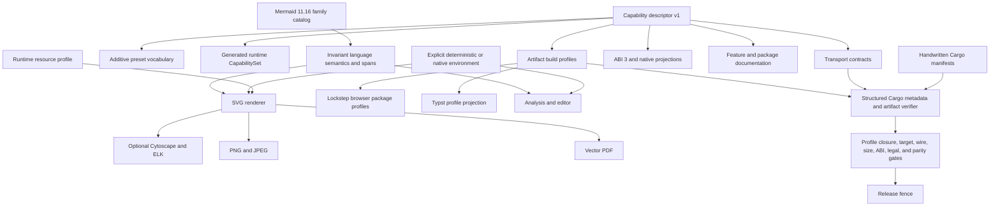

# Capability-Driven Feature and Distribution Architecture - Plan

## Goal Capsule

- **Objective:** Replace Merman's historical `full`, `tiny`, `core-full`, `core-host`, `render`, and `raster` feature graph with one capability-driven architecture that is complete for Mermaid 11.16 language tooling, ergonomic for editor, lint, static-site, CLI, SDK, browser, and Typst users, and materially excludes unselected heavy dependencies.
- **Authority:** The pinned Mermaid `11.16.0` source and companion behavior graph define language and rendering correctness. Cargo's additive feature semantics define compile-time composition. The canonical capability descriptor, ABI descriptor, package manifests, and measured dependency/artifact closures define release truth. Runtime environment and resource policies remain distinct from compiled capability.
- **Execution profile:** Fearless alpha refactor. Public Cargo features, defaults, C symbols, UniFFI records, package names, npm exports, CLI build profiles, and generated descriptors may break. Delete old aliases and phantom capabilities instead of carrying compatibility layers. Preserve one family-owned parser/semantic/editor path and source-backed behavior.
- **Stop conditions:** Do not create one feature per diagram, make parser or LSP coverage depend on a render backend, replace ICU or another semantic dependency with an approximation, claim npm subpaths reduce installation size, keep a feature with no callable API, generate Cargo manifests, or upgrade a behavior dependency without source and parity evidence.
- **Tail ownership:** Implement every unit, run the complete verification contract, simplify abandoned attempts, and create focused Conventional Commits on the current branch. Do not push, publish, tag, release, or open a PR without separate maintainer authorization.

---

## Product Contract

### Summary

Merman serves several different products from one codebase: an editor language service, a CI linter, a deterministic site renderer, an `mmdc` replacement, native SDKs, browser packages, a Typst plugin, and a future Node/SSG candidate. These users should choose an outcome they understand. They should not need to know that one diagram uses Manatee, one date path uses Jiff, or one output uses Krilla.

The canonical Mermaid language surface will therefore become invariant. Every build that parses Mermaid will recognize all 35 admitted Mermaid 11.16 families and expose the same canonical semantics, source spans, and family vocabulary. Optional analysis and editor products project that vocabulary for all families without reparsing. Cargo features will select only observable product APIs, outputs, heavy layout or math engines, system adapters, and tool-only capabilities. Named `preset-*` aggregates will provide recommended combinations for common workflows, while runtime policy will select determinism, time, randomness, text measurement, and resource limits for each operation.

Native bindings will replace the published alpha ABI 2 with ABI 3 so old hosts reject the new binary contract before calling it. Two repository-wide machine contracts will own capability identity and exact Cargo artifact recipes; each ABI, protocol, export surface, and package retains an independently testable authority at its natural owner instead of being copied into a central transport catalog. Browser delivery will replace one 47 MB multi-WASM npm tarball with lockstep packages that each carry exactly one intended artifact. Dependency maintenance will remove deprecated or accidental closures, migrate the LSP to the maintained Tower fork, and admit Cytoscape, RaTeX, and Jiff updates with behavior evidence.

### Problem Frame

The current branch already owns Mermaid 11.16 semantics, editor facts, typed rendering, resource profiles, ABI 2 text measurement, Web preset builds, Typst profiles, and cross-platform binding smoke tests. Its feature graph still reflects incremental implementation history rather than a stable product model:

- `full-registry` removes Architecture, Mindmap, and `flowchart-elk` from detection, analysis, and LSP while their parser modules still compile. It changes semantics without delivering a real compile-time family split.
- `core-full` mixes language configuration, sanitization, registry selection, and Cytoscape layout. Enabling one concern silently pays for or changes the others.
- `host-clock` mixes clock access, complete time-zone rules, browser JS support, and provenance hashing. Cargo feature unification can silently make a supposedly deterministic preset ambient.
- `render` and `raster` obscure the difference between SVG, bitmap allocation, JPEG encoding, vector PDF, system fonts, embedded images, and their resource models.
- `merman-cli --no-default-features` still pulls the full registry, raster/PDF stack, analysis, TLS/networking, Rayon, and completion generation. The measured normal dependency closure is 354 packages versus 404 for its default build.
- Binding crates forward `raster` without exposing PNG, JPEG, or PDF bytes. Runtime metadata omits important compiled capabilities and uses a fixed boolean struct that requires shotgun changes for every addition.
- `@mermanjs/web` publishes seven WASM files in one package. The generated `browser-full` root and `./full` artifacts are byte-identical. The current package is about 17 MB packed and 47.4 MB unpacked even when a consumer needs only analysis, rendering, or editor support.
- Clean downstream `merman-core` builds compile LALRPOP itself. `serde_yaml` is archived and remains for one analysis rewrite. UniFFI pulls Cargo metadata into runtime builds, Pulldown Cmark keeps unused default features, and Tokio is enabled as `full`.
- Mermaid 11.16 resolves Cytoscape 3.33.3 while Merman's source lock, ADR, notices, and Manatee provenance still name 3.33.1. RaTeX manifests declare 0.1.11 while the lock and legal projections contain 0.1.12.

### Actors

- A1. **Editor integrator:** needs complete, recoverable language intelligence without layout, raster, system time, or network dependencies.
- A2. **CI and site builder:** needs deterministic analysis or SVG output with stable bytes, explicit time inputs, vendored metrics, and bounded resource policy.
- A3. **CLI user:** expects an `mmdc` replacement to support Mermaid input, SVG, PNG, JPEG, PDF, ASCII, optional layouts, math, Markdown batches, and honest errors without learning Cargo internals.
- A4. **Native SDK integrator:** needs one stable ABI and ergonomic language wrappers, accurate capability discovery, binary outputs when compiled, and structured unsupported errors otherwise.
- A5. **Browser application author:** needs to install only the analysis, render, editor, ASCII, or full browser artifact used by the application.
- A6. **Maintainer:** needs one reviewable capability catalog, exact feature/package closure gates, source-backed dependency admission, and atomic version governance across release surfaces.
- A7. **Typst author:** needs one installable package with a stable document-facing API, deterministic pure-WASM behavior, useful diagnostics, and no requirement to understand maintainer build profiles.
- A8. **Node/SSG integrator:** needs a Node-native SVG path with an honest runtime boundary, predictable installation, bounded lifecycle, and no accidental browser-WASM fallback.

### Requirements

#### Language and capability semantics

- R1. Every parser-capable build must recognize all 35 admitted Mermaid 11.16 families and expose the same detector, parser, canonical semantic model, source spans, and family-owned fact vocabulary. Analysis, editor, and LSP APIs remain optional products, but whenever compiled they must project that same 35-family semantic catalog without reparsing or losing family coverage. Missing layout engines may make a render operation unsupported, but may not remove syntax, detection, analysis, or editor support from a product that includes those APIs.
- R2. Public Cargo features must represent additive, user-observable capabilities. Diagram names and incidental dependency crate names are not public feature boundaries; named layout and math engines are allowed when users select those Mermaid behaviors directly.
- R3. Remove `full`, `tiny`, `full-registry`, `core-full`, `core-host`, `render`, `raster`, `cytoscape-layout`, `elk-layout`, `ratex-math`, and negative profiles such as `*-no-elk`. Do not retain aliases outside a concise migration table.
- R4. Use intuitive kebab-case leaf names: `svg`, `analysis`, `editor`, `ascii`, `png`, `jpeg`, `pdf`, `layout-cytoscape`, `layout-elk`, `math`, `system-clock`, `system-timezone`, `system-random`, and `system-timing`. `math` names the user capability and hides RaTeX as its current implementation. Tool leaves such as `network-icons`, `parallel-markdown`, and `shell-completions` exist only where they control real compiled code.
- R5. Provide workflow aggregates with the `preset-` prefix so they cannot be confused with leaves. The required user entries are `preset-svg-basic`, `preset-native-svg`, `preset-static-svg`, `preset-editor`, `preset-ci-lint`, `preset-mmdc`, `preset-native-sdk`, and `preset-all`; browser artifact presets use the explicit `preset-web-*` namespace. Every preset is an additive Cargo bundle. `static` absence is promised only by an artifact build profile that uses `default-features = false`; deterministic output additionally requires the explicit deterministic runtime constructor.
- R6. Capability-bearing implementation and transport crates use empty defaults: `merman-core`, analysis, editor-core, ASCII, render/export, bindings-core, C FFI, UniFFI, WASM, Typst, layout helpers, and renderer helpers such as Roughr. Only user-facing product facades and binaries may provide useful defaults through named presets. Every release artifact nevertheless uses an explicit artifact recipe with `default-features = false`; no release claim is inferred from a crate default. A normal `merman` dependency must render complete native SVG without additional feature study.

#### Runtime policy and defaults

- R7. Compile-time capability and operation policy must be separate contracts. A deterministic renderer must remain deterministic even when another dependency enables system adapters through Cargo feature unification.
- R8. Provide explicit deterministic and native environment constructors. Deterministic mode fixes UTC/time-zone policy, clock input, seed, generated IDs, and vendored text metrics; native mode may use compiled system adapters. Fixed offsets and complete system time-zone rules remain different choices.
- R9. Keep the existing `interactive`, `constrained`, `trusted-native`, and `unbounded-for-trusted-input` resource profiles. Generate their availability and recommendations into every binding, and document which profile fits editor preview, public submission, local CLI, and trusted batch use. Cargo presets must not encode resource limits.
- R10. All default choices must fail closed when an unavailable engine or output is requested and must name the missing capability. No build may silently substitute a different layout, time-zone model, font measurement path, image policy, or output format.

#### Canonical descriptor and verification

- R11. Add one machine-readable capability descriptor that owns stable capability IDs, user descriptions, implication rules, additive presets, expected runtime capability sets, target restrictions, and public output IDs. Cargo manifests remain hand-written declarations and are verified against the descriptor through structured Cargo metadata.
- R12. Add machine-readable artifact build profiles for capability-bearing Cargo artifacts. Each profile names an exact package and target, Cargo profile, `default-features` setting, explicit feature set, build target, and expected capability/output set. Wheels, AARs, XCFrameworks, npm packages, and other bundles reference and test their compiled components at the owning release surface; artifact profiles do not duplicate package manifests, runtime policy, resource policy, or ABI layouts.
- R13. The descriptor and artifact-profile verifiers prove schema, feature implication, profile-to-preset resolution, target legality, Cargo package/target/feature existence, and absence of phantom features. Surface-owned executable gates separately prove callable APIs, commands, exports, symbols, runtime reports, dependency closures, package contents, and ABI/protocol behavior. An exclusion claim requires an explicit `default-features = false` recipe and a passing closure probe. Successful probes are evidence; no hand-maintained release-status or `observed` field can substitute for them.

#### Rust facade, CLI, and output backends

- R14. Split SVG, PNG, JPEG, and PDF into distinct public capabilities. PNG and JPEG may share an internal bitmap implementation, but selecting PNG must not pull the PDF backend and selecting PDF must not imply bitmap page output.
- R15. Mindmap tidy-tree must render without Cytoscape. `layout-cytoscape` adds Architecture FCoSE and Mindmap COSE-Bilkent; `layout-elk` adds ELK-backed rendering. Their absence preserves parsing and returns a typed render-capability error only for requests that need them.
- R16. ICU4X collation remains part of correct Swimlane SVG behavior and may not have an incorrect fallback. An en-US-only data provider may replace compiled data only after size and ordering evidence proves the generated artifact; this is internal optimization, not a public feature.
- R17. The CLI default `preset-mmdc` must remain the full user-facing replacement. A `preset-ci-lint` build exposes parse, detect, lint, fixes, and rule metadata without SVG, bitmap/PDF, layout engines, networking, Rayon, or completion generation. `network-icons`, `parallel-markdown`, and `shell-completions` each own their module, command/argument/help surface, callable code, and respectively Reqwest/TLS, Rayon, or `clap_complete` closure. Disabling one removes the whole user-visible tool path rather than leaving a runtime stub.
- R18. Network icon loading remains compiled and runtime-opt-in separately: even `preset-mmdc` must require the existing explicit network authorization before making requests.

#### Binding and ABI contract

- R19. Replace the published alpha ABI `2` with native ABI `3`. ABI 2 remains the identifier of the unsupported alpha.2/alpha.3 contract; every new native artifact, header, wrapper, function table, and probe reports 3 so an old host fails before crossing an incompatible struct or callback boundary. Exact package versions and descriptor digests provide provenance but never substitute for the ABI discriminator.
- R20. Replace format-specific low-level binding paths with one versioned render request and output result. Every public C struct begins with `struct_size`; callbacks receive request/result pointers instead of ABI-fragile by-value records. The request carries a stable format code plus versioned format-options JSON. The result carries status, format, borrowed media type, raw owned bytes, and owned metadata-or-error JSON, released exactly once by one result-free function. A caller-owned synchronous chunk sink is part of ABI 3 for large SVG/PDF output; byte-return conveniences are implemented on top. The sink callback returns a stable continue/abort/error code, receives ordered non-empty chunks borrowed only for the call, runs serially on the invoking thread, and is never called again after abort/error. Sink mode returns final status/metadata with an empty result-data buffer; partial host output remains caller-owned on failure. Re-entry into the same engine during a callback fails with a typed error. High-level Swift, Kotlin, Dart, Python, and Rust wrappers provide ergonomic `renderSvg`, `renderPng`, `renderJpeg`, `renderPdf`, `renderAscii`, and file/sink conveniences where the host supports them.
- R21. C and UniFFI symbols remain present across feature variants and return a structured unsupported-capability error when a requested output is not compiled. If a backend has no callable API and test, its feature must not exist.
- R22. Native ABI 3, diagnostics payload schema 1, facts payload schema 2, editor token descriptor 1, capability descriptor 1, text-measurement contract, resource contract, Typst transport ABI, and package version are independent fields. Changing one may not be used to hide a change in another. ABI layout and capability-catalog digests are reported separately: an additive unknown capability may be ignored, while an incompatible wire layout must be rejected.

#### Browser and Typst distribution

- R23. Supersede ADR-0069's multi-artifact single-package decision with one required full convenience package, `@mermanjs/web`, plus independently admitted browser-named slim candidates: `@mermanjs/web-analysis`, `@mermanjs/web-render`, `@mermanjs/web-editor`, and `@mermanjs/web-ascii`. A slim candidate is published only when it owns a direct workflow and clears R27 after the final dependency graph; otherwise that workflow uses `@mermanjs/web` and no redundant package is released. Each retained package contains exactly one intended WASM artifact and its matching wrapper, declarations, manifest, legal material, and input provenance. Browser package names must not imply Node or SSR support.
- R24. All admitted browser packages use one version and one release contract. Publishing uses a staged prerelease/dist-tag promotion flow that detects partial publication before moving the public tag; no package may silently depend on a different Merman version.
- R25. The Playground consumes the admitted render/editor candidates or the full package according to the measured two-realm decision and displays exact package/runtime capability metadata. Custom WASM initialization keeps the current wasm-bindgen `module_or_path` object contract so consumers do not need downstream patches.
- R26. Typst remains a distinct wasm-minimal-protocol transport. Its descriptor exposes only `bridge`, `svg`, and `publish` profiles; `publish` explicitly includes SVG, analysis, Cytoscape, and ELK while importing no system environment or browser capability. `math` is absent from the Typst target and publish profile until U11c proves the separate pure-WASM import, font, license, hostile-input, and parity admission.
- R27. Package and WASM evidence must measure the artifact a user installs after complete 35-family, ELK, Cytoscape, and math admission. `@mermanjs/web` must contain one WASM and no duplicate sibling artifact; its final packed and unpacked sizes must be published with an attributed comparison to the current roughly 47.4 MB multi-artifact package. The earlier 16 MB estimate is a planning forecast from the known one-artifact shape, not a correctness ceiling: no correct semantic, ICU, or backend behavior may be weakened merely to meet it. Each slim package must contain one WASM, be at least 15 percent smaller unpacked than the measured full package or be folded into it, and receive a new raw/gzip/brotli baseline only after U11a-U11c are final.

#### Dependencies, generation, and release integrity

- R28. Check generated LALRPOP Rust parsers into the source tree, move parser generation to an explicit maintainer/xtask command, and fail CI on grammar/generated drift. Published `merman-core` must not compile LALRPOP as a build dependency.
- R29. Replace the remaining `serde_yaml` use with stable `serde-saphyr`, remove unused direct dependencies, disable unused Pulldown Cmark and UniFFI defaults, narrow Tokio/tracing features to real LSP needs, and remove no-op or duplicate manifest entries.
- R30. Migrate `tower-lsp` to the maintained `tower-lsp-server` release as an independent behavior migration. Preserve URI encoding, pull diagnostics, cancellation, custom transport, stdio exit, and client capability behavior.
- R31. Align Jiff to the selected maintained 0.2 release with separate system clock/time-zone ownership; admit Cytoscape 3.33.3 against Mermaid 11.16 source; and upgrade the RaTeX crate family in lockstep only after its parser, SVG, embedded-font, size, legal, and hostile-input matrix passes.
- R32. Keep ICU4X, resvg/usvg, and Krilla when they remain the correct maintained backends. Only the PDF artifact profile may admit Krilla; disable backend defaults where supported and report any unavoidable `krilla-svg`/resvg/usvg/tiny-skia residual in measured closure output rather than claiming isolation that Cargo cannot provide. RustSec exceptions name the exact dependency path, affected profiles, upstream issue, owner, review date, and exit condition. Do not claim a local replacement until upstream behavior and parity can be preserved.
- R33. Regenerate license inventories, notices, release contracts, size budgets, feature documentation, package READMEs/changelogs, and migration guidance from the final graph. Normal CI runs capability and generated-projection freshness before expensive parity jobs; release verification rejects stale or ignored local artifacts.
- R34. Rewrite `docs/FEATURES.md` as the canonical user-facing selection guide and link it prominently from the root README. It must provide copyable Rust/Cargo, CLI install, Web/npm, native SDK, Typst, and any admitted Node examples organized by editor, lint/CI, basic SVG, static-site SVG, full CLI, SDK, and browser workflows; show exact preset inclusions and the artifact profile that proves exclusions; distinguish compiled capability from runtime environment/resource policy; name dependency/size/license consequences; explain typed missing-capability errors; and include the one-time old-to-new migration table. Keep public crate/package/platform READMEs concise and consistent by review; compile or execute examples where useful, but do not make prose tokens or documentation paths a machine release authority.
- R35. Presets are semantic inclusion bundles only. A public document or verifier may claim an excluded dependency, adapter, output, or engine only through an artifact build profile with `default-features = false` and a passing executable closure probe; a raw Cargo `features = ["preset-*"]` declaration never implies mutual exclusion.
- R36. Artifact build profiles cover capability-bearing Cargo components. Every C ABI, UniFFI, LSP, Web, Typst, JNI, Flutter, and package boundary keeps its own authoritative schema, generated API, manifest, or protocol implementation and an executable verifier at that owner. Do not introduce a central transport catalog or generic status database that repeats those contracts.
- R37. `layout-cytoscape`, `layout-elk`, and `math` imply `svg` semantically. Add `preset-svg-basic` for SVG without either layout engine or math; requests for omitted engines return the existing typed missing-capability contract rather than silently selecting a substitute.
- R38. The intermediate `merman-core` host default and `merman-render` Cytoscape default are not publishable feature surfaces. Release verification remains blocked until U5 replaces them with explicit artifact profile recipes and low-level empty defaults.
- R39. Consider a Node/SSG product only after ABI 3. Compare Node-targeted WASM and napi-rs behind the same `merman-bindings-core` contract; publish `@mermanjs/node` only when one transport clears corpus parity, cold/warm/RSS, installation, target, concurrency, and error-behavior evidence.
- R40. Admit any additional language transport only through a bounded evidence decision. It must demonstrate a real user workflow, direct `merman-bindings-core` ownership, capability/resource/error mapping, lifecycle and async/cancellation semantics, package delivery, target CI, generated-API drift protection, and a documented user benefit that justifies its incremental long-term maintenance cost over the incumbent transport. Keep one public transport per user surface; a rejected spike leaves no live package, generated API, or runtime dependency.
- R41. Close every current-HEAD item in the Fixed-Point Review Intake before dependency and distribution migration can obscure its cause. Security/resource defects, false-positive parity normalization, first-match parser semantics, runtime capability reporting, CI feature validity, and source-backed Mermaid behavior each require a focused regression test; rewriting the affected module later is not evidence that the defect disappeared.

### Key Flows

- F1. **Live editing:** source enters the canonical family parser once; analysis/editor facts drive LSP or browser editor APIs. No renderer, layout backend, rasterizer, system clock, or network stack is present.
- F2. **CI lint:** the lint preset parses the complete language under deterministic policy, emits schema-1 diagnostics/fixes, and exits with stable CLI codes without compiling presentation backends.
- F3. **Deterministic site render:** a site builder selects the `static-svg` artifact build profile, which invokes Cargo with `default-features = false` and `preset-static-svg`, constructs `DeterministicEnvironment`, supplies or accepts fixed operation inputs, and obtains byte-identical output across fresh processes even when a larger unified dependency graph compiled system adapters elsewhere.
- F4. **Full CLI render:** the default CLI detects input/output, selects the requested layout/math/output capability, applies the trusted-native resource profile, and writes SVG, PNG, JPEG, PDF, or ASCII while network access stays explicitly authorized.
- F5. **Native SDK output:** a host selects an artifact build profile and verifies the owning ABI's number, layout digest, and structure probes, records the capability-catalog digest as provenance, queries stable capability IDs, calls one output operation or sink, and receives raw bytes plus metadata or a typed unsupported error. Its language wrapper presents format-specific convenience methods.
- F6. **Browser installation:** an application installs one admitted `@mermanjs/web-*` workflow package when it provides a material saving, otherwise `@mermanjs/web`. The selected browser-only package initializes its sole matching WASM, verifies provenance and capabilities, and never downloads sibling artifacts.
- F7. **Maintainer admission:** a dependency or feature change updates the canonical descriptor or upstream lock, runs closure/parity/target/size/legal gates, regenerates projections, and fails if any package or runtime claim drifts.
- F8. **Typst document render:** an author installs the published Typst package, imports its stable document API, renders Mermaid source under the package's deterministic resource policy, receives source-oriented diagnostics for invalid or unsupported input, and upgrades the package without selecting the internal `bridge`, `svg`, or `publish` build profile. Math remains unavailable until the separate Typst math admission succeeds.
- F9. **Node/SSG evaluation:** after ABI 3, a maintainer drives the same source and options through private Node-targeted WASM and napi-rs candidates, compares artifact and runtime evidence, and only then admits or rejects an `@mermanjs/node` static-SVG product.

### Acceptance Examples

- AE1. An Architecture, Mindmap, `flowchart-elk`, Swimlane, and ZenUML corpus parses, analyzes, completes, renames, and tokenizes in `preset-editor` without Manatee or ELK in the normal dependency closure. Rendering an Architecture diagram without `layout-cytoscape` returns a typed missing-capability error; a tidy-tree Mindmap still renders.
- AE2. A `preset-ci-lint` CLI build has no `reqwest`, Rayon, resvg/usvg, Krilla, image encoder, Manatee, ELK, RaTeX, Jiff, UUID, or `clap_complete` normal dependency. Its help exposes only capability, detect, parse, lint, fix, and rule-catalog operations.
- AE3. Two fresh processes built with `preset-all` use the explicit deterministic environment to render the same Gantt and mixed-family corpus to byte-identical SVG. A native environment resolves New York winter and summer dates with complete DST rules rather than a sampled offset.
- AE4. The default CLI renders existing SVG, PNG, JPEG, PDF, ASCII, ELK, Cytoscape, RaTeX, Markdown batch, and large trusted-input fixtures. A build without PNG does not advertise PNG and returns a stable unsupported error if invoked through the generic binding operation.
- AE5. C, UniFFI/Python, Swift, Kotlin, and Dart consume the same generated ABI 3 transport plus shared semantic descriptors. ABI-2 hosts reject the library before any callback. PNG begins with its magic bytes, JPEG and PDF have their expected signatures, SVG/ASCII remain UTF-8, and metadata identifies the media type and selected runtime policy. Large SVG/PDF can stream through the caller-owned sink without an additional full FFI buffer.
- AE6. `npm pack --json` for every retained browser package lists exactly one `.wasm`. An admitted `@mermanjs/web-editor` cannot resolve renderer exports; an admitted `@mermanjs/web-render` does not install editor or ASCII WASM. A candidate below the 15-percent threshold is absent from the release contract and its documented workflow uses `@mermanjs/web`. The full package contains one WASM, not a duplicate `./full` artifact.
- AE7. The Typst publish artifact reports the descriptor-selected capabilities, has only the allowed wasm-minimal-protocol imports/exports, and renders the package examples without system clock, time-zone, random, browser, or host-font imports.
- AE8. YAML quick-fix goldens preserve quoting, nulls, multiline values, key order, document markers, and final newline after the `serde-saphyr` migration. LSP URI, pull-diagnostic, cancellation, refresh, loopback, and stdio fixtures remain wire-equivalent after the maintained fork migration.
- AE9. Cytoscape 3.33.3 Architecture/Mindmap probes and parity evidence pass with synchronized source lock, ADR, comments, provenance, notices, and legal hashes. RaTeX and Jiff selected versions pass their named behavior and target matrices before the lock is accepted.
- AE10. Structured Cargo and release verification finds no removed feature name in live manifests, generated catalogs, or release commands outside the migration table and superseded ADR history. Every artifact profile's resolved capability set equals its compiled runtime report when that artifact exposes one; a raw additive preset is never used as proof of absence. Documentation is reviewed for accuracy without source-substring release gates.
- AE11. A Cargo consumer that enables `preset-static-svg` without disabling defaults is not documented or verified as static. The `static-svg` artifact profile uses `default-features = false`, has no compiled `system-*` adapters in its measured closure, and still needs `DeterministicEnvironment` for deterministic output.
- AE12. Every shipped capability-bearing Rust component has one exact artifact build recipe. C ABI, UniFFI, LSP, Python, Android, Apple, Flutter, browser, and Typst surfaces pass their independently owned interface and package probes against the component capability/output report; every omitted callable capability produces the descriptor-derived typed error.
- AE13. Before U11c completes its Typst gate, the Typst publish artifact has no math capability, no RaTeX closure, and no browser import. A future re-admission changes the target, profile, provenance, and package evidence atomically only after the pure-WASM matrix passes.
- AE14. A private Node candidate uses `preset-static-svg` through either Node-targeted WASM or napi-rs, never falls back to browser WASM, uses a bounded queue and `dispose()`, and reports the same SVG/error behavior as the native bindings corpus. The selected transport exposes Promise APIs by default; `renderSvgSync()` is limited to explicit SSG use and AbortSignal is documented as non-preemptive.
- AE15. The fixed-point regression pack proves workflow feature names resolve before parity CI, label text remains comparator-visible, C handle lifetime cannot race free, embedded-image budgets cover SVG filter references and browser DOM insertion, detector order follows the supplied registry, ASCII honors shared source/model limits, Cytoscape is observable at runtime, and Wardley/Venn output and grammar match the pinned Mermaid source.

### Success Criteria

- Complete parser/analysis/editor coverage is invariant across every supported feature preset.
- Every public leaf either changes a callable capability/dependency closure or is deleted.
- The lean lint, editor, basic SVG, static SVG, default CLI, native SDK, browser package, and Typst dependency closures pass explicit artifact-profile inclusion and exclusion gates; deterministic evidence additionally exercises the explicit deterministic runtime constructor.
- Every npm package contains one WASM; the full convenience package has no duplicate sibling artifact and publishes an attributed packed/unpacked comparison against the current 47.4 MB multi-artifact package. Correctness takes precedence over an unproven absolute size forecast.
- The published-crate clean build no longer compiles LALRPOP, production UniFFI no longer includes Cargo metadata, and non-output users no longer include raster/PDF/math stacks.
- ABI, schema, capability, artifact-profile, transport, package, resource, and Mermaid baseline versions are independently observable and generated from their authorities.

### Scope Boundaries

This plan does not upgrade Mermaid beyond 11.16, add or remove diagram semantics, publish the new packages, or promise binary compatibility with earlier `0.8.0-alpha.*` snapshots. It does not replace ICU, resvg/usvg, Krilla, Rustybuzz, or ttf-parser with behaviorally weaker code. It does not introduce per-diagram Cargo features, platform-specific forks of the capability vocabulary, resource limits as compile-time features, a public Node package before evidence admission, or a browser package that claims Node/SSR support.

---

## Planning Contract

### Key Technical Decisions

#### KTD1. Feature names describe observable capabilities

**Decision:** Public leaves use output, engine, environment, or tool vocabulary. Presets use a uniform `preset-*` prefix. Incidental dependencies remain hidden with `dep:` forwarding.

A proposed public leaf is admitted only when all of the following are true: it changes a callable API, output, engine, or environment adapter that a user can name; disabling it produces a typed absence or removes that callable surface; it materially changes dependency, target, license, security, resource, build-time, or artifact-size closure; at least one artifact build profile includes it and another omits it; and measured build/artifact evidence verifies the distinction. A new diagram family alone never creates a feature. If an admitted family introduces a genuinely heavy companion dependency, the public boundary names the reusable backend capability rather than the diagram.

**Why:** Users choose editor intelligence, deterministic SVG, PDF, ELK, or a CLI workflow. They do not choose a Rust crate graph. This keeps names stable when an implementation dependency changes.

**Rejected:** One feature per diagram; exposing every optional dependency as a feature; keeping ambiguous `full`, `host`, `render`, and `raster` aliases.

#### KTD2. Mermaid language support is one invariant base

**Decision:** Compile and register every admitted detector, parser, canonical semantic model, source-span producer, configuration behavior, sanitization behavior, and family-owned fact vocabulary in every parser-capable build. Analysis and editor remain optional APIs and dependency closures; when enabled, they consume the invariant vocabulary and cover every family without constructing a second semantic path. Layout features affect render availability only.

**Why:** The current tiny registry does not remove parser compilation cost, but it does make valid syntax disappear from analysis and LSP. A Mermaid replacement must not make language meaning depend on a renderer backend.

**Rejected:** `registry-full`; features for new 11.16 families; coupling Architecture, Mindmap, or `flowchart-elk` detection to Manatee or ELK.

#### KTD3. Runtime policy is not a Cargo preset

**Decision:** Cargo features compile system adapters; explicit environment and resource objects select operation behavior. Deterministic constructors never inspect whether ambient adapters were unified into the binary.

**Why:** Cargo features are additive and unified across the graph. They cannot prove that a particular operation avoided ambient time, randomness, locale, fonts, or resource policy.

**Rejected:** Naming a compile aggregate `preset-deterministic-svg`; treating any preset alone as a runtime determinism guarantee; compile-time UTC branches scattered through parsers.

#### KTD4. Low-level defaults are empty; product defaults are named

**Decision:** Capability-bearing implementation and transport crates use empty defaults: core, analysis, editor-core, ASCII, render/export, bindings-core, FFI, UniFFI, WASM, Typst, layout helpers, and Roughr. The `merman` facade defaults to `preset-native-svg`; the CLI defaults to `preset-mmdc`. LSP, native bindings, browser packages, Typst, and every release build use an exact `default-features = false` artifact profile even when the owning product crate also has a convenience default.

**Why:** Empty implementation defaults prevent accidental feature unification. Named product presets keep common entry points usable without asking users to reconstruct an internal graph.

**Rejected:** Empty defaults at every public product surface; relying on dependency defaults inside release artifacts; hidden full builds.

The following table is normative. A preset not listed here is not public, and two presets with the same effective set must be merged rather than retained as aliases. The leaf set is an additive inclusion set only: a preset never proves that another Cargo feature is absent. Exact exclusions belong to a `default-features = false` artifact build profile and a passing dependency-closure probe.

| Preset | Additive public leaves | Intended consumer |
| --- | --- | --- |
| `preset-svg-basic` | `svg` | lightweight SVG users that accept typed layout/math absence |
| `preset-native-svg` | `svg`, `layout-cytoscape`, `layout-elk`, `math`, `system-clock`, `system-timezone`, `system-random`, `system-timing` | default `merman` facade and normal native Rust examples |
| `preset-static-svg` | `svg`, `layout-cytoscape`, `layout-elk`, `math` | static-site artifact profile using `DeterministicEnvironment` |
| `preset-editor` | `analysis`, `editor` | editor library consumers and LSP library build |
| `preset-ci-lint` | `analysis` | lean `merman-cli` lint artifact |
| `preset-mmdc` | `preset-native-sdk`, `network-icons`, `parallel-markdown`, `shell-completions` | default CLI, cargo-dist, Homebrew |
| `preset-native-sdk` | SVG, analysis, ASCII, PNG, JPEG, PDF, both layouts, math, and every `system-*` adapter | C, UniFFI, Android, Apple, Flutter, and Python artifacts |
| `preset-all` | every non-tool leaf: SVG, analysis, editor, ASCII, PNG, JPEG, PDF, both layouts, math, and every `system-*` adapter | exhaustive Rust/build/test matrix |

Browser and Typst mappings are also normative:

| Artifact preset | Additive public leaves | Product |
| --- | --- | --- |
| `preset-web-analysis` | `analysis` | `@mermanjs/web-analysis` |
| `preset-web-render` | `svg`, `layout-cytoscape`, `layout-elk`, `math`, browser time/random/timing adapters | `@mermanjs/web-render` |
| `preset-web-editor` | `analysis`, `editor` | `@mermanjs/web-editor` |
| `preset-web-ascii` | `ascii` | `@mermanjs/web-ascii` |
| `preset-web-full` | union of all four Web presets in one fused WASM | `@mermanjs/web` |
| Typst `bridge` | transport only | maintainer smoke artifact, not an end-user choice |
| Typst `svg` | `svg` without system adapters | maintainer render artifact |
| Typst `publish` | `svg`, `analysis`, `layout-cytoscape`, `layout-elk` without system adapters | published Typst package; math is withheld pending U11c |

Current single-artifact evidence makes all four slim candidates plausible: analysis 2.65 MB, ASCII 2.78 MB, editor 3.45 MB, and render 7.75 MB versus the 10.20 MB non-math full WASM. It does not pre-admit them. Final admission repeats the independent-workflow and 15-percent comparison after invariant language, math, and dependency upgrades; rejected candidates are not published. The Playground keeps editor and renderer in separate realms only when its gate beats the realistic two-realm full baseline across download, compile cache, initialization, peak memory, and failure isolation.

#### KTD5. The capability descriptor owns identity, not Cargo source

**Decision:** `capabilities/feature-surface-v1.json` exclusively owns capability and output semantic IDs, descriptions, implications, additive presets, and target legality. `capabilities/artifact-profiles-v1.json` owns exact Cargo recipes and expected capability/output sets for compiled components. Cargo manifests own compilation declarations. `abi/merman-v3.json` references semantic IDs and owns only native numeric discriminants, function-table entries, record layouts, ownership rules, and layout probes. UniFFI, LSP, Web exports, Typst, text measurement, resources, and release packages retain their own natural authorities. `xtask` compares structured authorities or executes their probes, but does not duplicate them in a transport catalog or infer contracts from documentation prose.

**Why:** Generating TOML would make ordinary Cargo tooling and reviews opaque. Treating every manifest and platform list as independent recreates shotgun surgery. The verifier is the contract between the two authorities.

**Rejected:** Parsing Rust or TOML with source substrings; generating complete Cargo manifests; using a preset's complement as an exclusion proof; or a descriptor that repeats dependency implementation details or ABI layout it cannot verify.

#### KTD6. Published ABI 2 is retired and native ABI 3 is the final alpha redesign

**Decision:** Assign native ABI 3 to the redesigned function table, pointer-based callbacks, generic output request/result, and sink contract. ABI 2 remains the identifier of the published alpha.2/alpha.3 generation and is unsupported by new artifacts. New hosts require ABI 3, validate the ABI-layout digest and probes, and treat the separate capability-catalog digest as provenance rather than an equality-based compatibility gate. Freeze normal ABI versioning rules now, before the first stable release.

**Why:** Prerelease SemVer permits the break, but the machine discriminator must still fail closed. Old ABI-2 hosts only know the integer and old layouts; they cannot discover a new digest before making an unsafe call. A new integer is the only reliable boundary, while split digests prevent a harmless additive capability from masquerading as a wire-layout break.

**Rejected:** Reusing 2 for incompatible published prerelease artifacts; pretending old alpha binaries remain compatible; carrying both old and new function sets. (session-settled: user-approved — the maintainer clarified ABI 2 was introduced in the 0.8 alpha line, explicitly allowed either outcome, and prioritized the most correct one-time break; published alpha inventory proved ABI 3 is required.)

#### KTD7. One binding operation transports every output

**Decision:** ABI 3 exposes a versioned function table. Its render request contains `struct_size`, format code, source slice, and versioned format-options JSON. Its result contains `struct_size`, status, format, a borrowed static media-type slice, one owned data buffer, and one owned metadata-or-error JSON buffer; one result-free function consumes both buffers. Every callback is pointer-based and size-tagged. A synchronous caller-owned chunk sink supports large SVG/PDF; byte-return and language conveniences collect that sink when requested. The sink record contains `struct_size`, `user_data`, and a write callback returning stable `continue`, `abort`, or `error` codes. Chunks are ordered and non-empty; their pointers are borrowed only until the callback returns. Callbacks are serial on the invoking thread, receive no final sentinel, and stop permanently after abort/error. The enclosing render call is the finalization boundary: success returns metadata with empty data, while abort/error returns a typed sink status and leaves any partial host output untouched. Calling the same engine recursively from its sink callback returns a typed re-entrancy error; separate engines remain independent. Feature-disabled formats use the same operation and return structured unsupported errors before allocating output buffers or invoking the sink.

**Why:** This keeps the native entry shape stable when a new output is added, avoids base64 and mandatory duplicate full-output buffers, and makes a compiled capability testable from every host. Pointer-based callbacks avoid the current by-value struct growth hazard.

**Rejected:** Empty raster features; separate C result layouts per format; encoding binary output inside JSON; requiring every release artifact to compile every backend.

#### KTD8. Browser installation size requires lockstep packages

**Decision:** Always publish the full browser package with one WASM. Build analysis, render, editor, and ASCII as lockstep candidates, but retain each package only if its final unpacked artifact is at least 15 percent smaller than full and it supports an independent workflow. Shared generation and release validation keep retained APIs aligned; the full package does not embed slim artifacts. Candidate rejection is a descriptor and documentation decision, not a hidden subpath alias.

**Why:** npm `exports` controls public entry points, while `files` controls the tarball. Subpaths cannot reduce the 47.4 MB installation. Package boundaries are the only reliable installation boundary.

**Rejected:** Another subpath-only redesign; one package per Cargo leaf; dynamically downloading undocumented sibling WASM from a full package.

#### KTD9. Output features follow resource and dependency boundaries

**Decision:** Keep SVG, PNG, JPEG, and PDF public and separate. Use internal shared conversion features where necessary, but report only callable formats. Expose system-font and embedded-image behavior through runtime policy/capability metadata unless measurements prove a separately useful public build choice.

**Why:** PNG/JPEG are bounded pixel allocations; PDF is vector output with separate filter/image budgets; SVG has a different safety pipeline. One `raster` flag hides these contracts.

**Rejected:** One umbrella output feature; splitting every codec or transitive crate into user-facing flags; silently dropping embedded images or text.

#### KTD10. Dependency updates are admissions, not housekeeping

**Decision:** Separate low-risk closure cleanup from behavior migrations. Jiff, Tower LSP, Cytoscape, and RaTeX each receive focused source/release-note evidence and behavior gates. ICU/resvg/Krilla remain when they are already correct and maintained.

**Why:** A green lockfile does not prove time-zone, URI, layout, math, font, target, or legal behavior. Separating migrations keeps failures attributable.

**Rejected:** Blind latest-version sweeps; preserving archived `serde_yaml`; replacing transitive font engines locally without upstream parity.

#### KTD11. Generated parsers are release source

**Decision:** Commit LALRPOP output, generate it through `xtask`, and verify freshness in CI. Grammar files remain the human authority and generated Rust remains a checked projection.

**Why:** Consumers should compile the parser, not the parser generator. A structured freshness gate preserves maintainability without adding downstream clean-build cost.

**Rejected:** Keeping LALRPOP in every published build; manually editing generated parser code; replacing source-backed grammars to save build time.

#### KTD12. Presets compose; artifact profiles prove closure

**Decision:** `preset-*` means an additive capability bundle and has no `excludes` semantics. An artifact build profile is a component-owned recipe with a root package, Cargo target and profile, exact Cargo feature list, `default-features` choice, build target, and expected capability/output report. A dependency or adapter may be claimed absent only when the profile disables defaults and its executable closure probe passes. (session-settled: user-directed — chosen over treating preset exclusions as Cargo exclusions: Cargo feature unification is additive.)

**Why:** A consumer can enable `preset-static-svg` while default features remain active. Modeling that configuration as static would make the release contract and user documentation false.

**Rejected:** Negative Cargo features; a separate feature per absence combination; relying on Cargo defaults or an `excludes` array to certify a product closure.

#### KTD13. Interface contracts stay with their natural owners

**Decision:** Keep two repository-wide catalogs only: capability semantics and exact Cargo artifact recipes. Native ABI, UniFFI, LSP, wasm-bindgen exports, Typst, JNI/Flutter wrappers, and release packages each keep their authoritative schema, generated API, manifest, or implementation at the owning surface. Each owner has focused executable probes against the relevant artifact profile and capability IDs. There is no central transport descriptor, generic release-state field, or source-substring/documentation gate. (session-settled: user-directed — chosen after the first U13 design duplicated independent wire authorities and allowed hand-written evidence to masquerade as proof.)

**Why:** Native wrappers, CLI, LSP, browser, Typst, and package delivery have different runtime and wire shapes. A Web-only mapping cannot detect a native artifact with the wrong closure or an ABI wrapper that reports stale capabilities.

**Rejected:** A universal JSON schema that duplicates ABI records; generated Cargo manifests; separate handwritten boolean matrices in each platform package.

#### KTD14. Typst math is an admission, not a promise

**Decision:** Keep `math` out of the Typst target and publish artifact until U11c proves a pure-WASM RaTeX path with allowed imports, font behavior, hostile-input limits, parity, size, and license evidence. U11c may propose one atomic re-admission only after that evidence exists.

**Why:** Declaring a capability in a descriptor before the target can safely ship it turns an intended experiment into a false public contract.

**Rejected:** Treating native or browser math success as Typst evidence; silently compiling RaTeX into the Typst package; a permanent unsupported exception with no admission path.

#### KTD15. Node is a separately admitted native product

**Decision:** After ABI 3, compare a Node-targeted WASM implementation and a napi-rs implementation that both call `merman-bindings-core`. If napi-rs wins, publish a small `@mermanjs/node` loader plus exact-version `@mermanjs/node-<target>` optional-dependency packages, each with one `.node` artifact. The initial product is `preset-static-svg`, Promise-first, has an explicit bounded queue and `dispose()`, and offers `renderSvgSync()` only for an explicit SSG path. It neither accepts JS text-measurement callbacks nor promises that AbortSignal interrupts work already executing.

**Why:** Satteri's patch demonstrates a Node/SSG transport boundary, not missing Mermaid semantics. A browser package with a corrected wasm-bindgen initialization call still is not a reliable Node product.

**Rejected:** Reusing the C ABI from JavaScript; publishing browser WASM as Node support; root packages containing every platform binary; postinstall downloads; silent browser-WASM fallback; or naming a nonexistent resource profile `default`.

#### KTD16. Transport admission prevents duplicate binding stacks

**Decision:** Treat ABI 3 as the lowest common compatibility anchor. Use generated C bindings through Dart `ffigen` plus a handwritten Dart facade for Flutter; use UniFFI for Apple Swift and Python; keep Android Kotlin on its single registered-JNI AAR path rather than publishing a second UniFFI Kotlin transport; evaluate napi-rs only through U14. A future Flutter Rust Bridge spike may call `merman-bindings-core` directly, never C ABI -> Rust, and must compare its generated API, async and cancellation model, object lifetime, package delivery, target CI, corpus behavior, artifact closure, and maintenance burden against ABI 3 + `ffigen`. It replaces the Flutter path only if it wins the whole admission matrix; otherwise the spike and dependency are deleted. PyO3/maturin and a .NET-specific Rust bridge are intentionally out of this plan: Python keeps UniFFI delivery, and a future .NET package consumes ABI 3 through source-generated `LibraryImport` only after real user demand.

**Why:** Convenience frameworks solve different transport and package-delivery problems. Adding one because its generated API is pleasant creates a permanent second semantic/error/resource path unless it demonstrably improves the user product enough to justify that cost.

**Rejected:** Replacing ABI 3 before it exists; emitting handwritten Dart FFI signatures beside the C header; keeping C ABI and Flutter Rust Bridge facades in parallel indefinitely; translating Rust through C and back into Rust; adding PyO3 merely for a more Pythonic spelling; or treating a framework's Node-API ABI as cross-target binary portability.

### High-Level Technical Design



The capability descriptor does not decide runtime behavior, exact Cargo absence, ABI layouts, or package composition. It declares the stable public vocabulary, implications, target legality, and additive presets. Artifact profiles carry exact Cargo build choices for compiled components. Cargo metadata proves the declared recipe; dependency-tree and build probes prove closure; family capability reports prove semantic/render admission; ABI/export tests prove callable interfaces; package manifests and pack/install probes prove distribution ownership. A status field or documentation claim cannot make a failing or absent probe publishable.

### Dependency Order

```text
U1 capability vocabulary and initial descriptor
 +--> U2 invariant language and checked-in parsers
       +--> U13 exact artifact build recipes
             +--> U16 fixed-point correctness and security blockers

U13 + U2 + U16 --> U3 system adapters and explicit runtime policy
U13 + U2 + U3 --> U4 renderer, layout, math, and output leaves
U13 + U2 + U3 + U4 --> U5 facade presets and CLI products
U13 + U2 + U3 + U4 --> U6 ABI 3 and native bindings

U13 + U1 + U2 + U16 --> U9 dependency hygiene and generation cleanup
U2 + U3 + U9 --> U10 maintained LSP migration
U3 --> U11a source-backed Jiff admission
U4 --> U11b source-backed Cytoscape admission
U4 --> U11c source-backed RaTeX admission

U13 + U1-U6 + U9-U11c --> U8 final browser and Typst artifact profiles
U8 + U11a-U11c --> U7 lockstep npm packages and Playground adoption
U6 + U7 + U11c + U13 --> U14 Node/SSG transport evidence and admission decision
U6 + U13 --> U15 Flutter transport evidence and admission decision
U1-U11c + U13-U16 --> U12 strict matrix, docs, legal projections, and cleanup
```

### System-Wide Impact

- **Language identity:** Removing `tiny/full-registry` changes every capability count and generated catalog, but makes parser/editor behavior stable across products.
- **Build graph:** Empty low-level defaults and explicit forwarding expose missing feature edges immediately. All workspace members, examples, benches, docs.rs metadata, release jobs, and platform build scripts must name their intended preset.
- **Product closure:** Additive presets describe only what a consumer requests. Artifact profiles, rather than a preset complement, record exact `default-features = false` builds; executable dependency and artifact probes prove absence before a release job can use the claim.
- **Runtime behavior:** Explicit environments prevent Cargo feature union from changing deterministic output. System time-zone support becomes a separate compiled adapter from clock access.
- **Bindings:** The published ABI-2 C symbol/result/callback shape is replaced by ABI 3. Every generated wrapper and packaged native library must move atomically; old hosts reject version 3, while new hosts separately verify ABI-layout and semantic-catalog provenance.
- **Interface ownership:** Native in-process, C ABI, UniFFI, Android JNI, wasm-bindgen browser, and Typst each retain their true interface authority and focused probes. No central catalog recreates ABI records, exports, or platform package manifests.
- **Distribution:** Multiple npm packages add release coordination but remove installation waste. Package status probes, dist tags, changelogs, and legal projections become a lockstep set.
- **Security and resources:** Output splitting narrows the dependency and attack surface for lint/editor/SVG consumers. Runtime resource profiles and network authorization remain mandatory and independent.
- **Evidence:** Source-backed layout/math/time updates alter upstream locks, provenance, notices, parity fixtures, and size baselines; each is admitted before the final lockfile is accepted.

### Risks and Mitigations

| Risk | Severity | Mitigation |
| --- | --- | --- |
| Full invariant language semantics increase the smallest parser artifact | Medium | Accept correctness as the base contract; measure the removed fake-tiny profile and optimize shared parser data internally rather than changing accepted syntax. |
| Cargo feature unification reintroduces ambient behavior | High | Deterministic environment is an explicit runtime object tested inside a `preset-all` build; capability reports separate compiled adapters from selected policy. |
| A preset complement is misrepresented as an exact product closure | High | Remove `excludes` from the capability descriptor. Require `default-features = false`, structured Cargo metadata, and executable dependency/artifact probes before documentation or a verifier claims absence. |
| An interface surface drifts from the compiled capability set | High | Keep the ABI, export list, generated binding, or protocol schema at its natural owner and validate its version, symbols, behavior, and typed missing-capability results against the named artifact profile. |
| A convenience bridge creates a permanent duplicate Flutter or Node API | High | Require U14/U15 evidence against the incumbent transport, retain one public path per surface, and delete the losing spike plus its generated/package closure. |
| Typst accidentally ships native/browser math closure | High | Keep math outside the Typst target and publish profile until U11c completes its pure-WASM import, font, hostile-input, parity, license, and size gate. |
| ABI-2 alpha snapshots are mistaken for compatible artifacts | High | Report ABI 3, remove ABI-2 live symbols/headers, require the generated ABI-3 function table and probes, and test old-host/new-library plus new-host/old-library rejection. |
| Multi-package npm publication or dist-tag promotion partially succeeds | High | Build and verify all tarballs first, publish under a staging tag, probe every exact version, then reconcile public tags from a recorded old/target set; restore and verify the old set on any promotion failure. |
| Output splitting creates invalid feature combinations | High | Generate a pairwise/leaf/preset feature matrix and assert closure through Cargo metadata plus runtime capability reports. |
| Checked-in parsers drift or create unreviewable churn | Medium | Keep grammars authoritative, generate deterministically through one xtask command, and review generated diffs with freshness and parser corpus gates. |
| Tower LSP migration changes URI or cancellation behavior | High | Isolate it in U10 and retain wire-level request/response, custom transport, rapid-edit, cancellation, and stdio exit fixtures. |
| Cytoscape, Jiff, or RaTeX upgrades move visible behavior | High | Use exact source diff, target matrix, family parity, provenance, legal, and size gates; reject an upgrade rather than tune Merman around unexplained deltas. |
| RustSec unmaintained transitive font crates remain | Medium | Keep them isolated behind output/math capabilities, retain reviewed deny exceptions, and track upstream resvg/Krilla/RaTeX migration rather than claiming an unsafe local swap. |

### Assumptions

- ABI 2 was distributed in the published `0.8.0-alpha.2`/`.3` prereleases; alpha compatibility may be broken, but those artifacts remain observable and must reject or be rejected by ABI 3 without crossing an unsafe call boundary.
- Mermaid 11.16 remains the selected behavior baseline for this plan.
- Current platform release workflows can be changed before the next formal release and no package publication occurs during implementation.
- Existing resource profiles and family-owned semantic architecture remain authoritative unless a unit identifies a direct correctness conflict.
- A future Node product is an evidence outcome, not a promised release surface: U14 may reject both candidate transports and record that no Node package is published.
- Flutter Rust Bridge is likewise a comparison candidate, not a promised dependency; ABI 3 plus `ffigen` remains the fallback and may be the final Flutter result.

### Fixed-Point Review Intake

This ledger records findings revalidated against the current branch after the original `2e74281b4` review anchor. It belongs to the implementation plan, not to `xtask` or a runtime descriptor. U16 closes every row with the named proof before later units may delete or replace the affected code.

| ID | Confirmed current defect | Required proof |
| --- | --- | --- |
| RV1 | CI still requests removed FFI feature `core-full` before parity jobs | Structured workflow/Cargo feature validation and a successful parity job setup |
| RV2 | `text-outer-tspan` normalization erases real label text | Comparator fixture where wrapping noise normalizes but `Alpha` and `Beta` remain unequal |
| RV3 | Raw Typst `analysis` without `render` accepts compilation and then rejects its own constrained options | Make the combination valid or reject it at compile/profile validation time |
| RV4 | Native raster/PDF preflight ignores data-backed `<feImage>` | Pre-usvg byte/pixel rejection fixtures for `<image>` and `<feImage>` |
| RV5 | Runtime capability metadata omits Cytoscape | Cross-profile report test that changes only with the actual backend owner probe |
| RV6 | Wardley headless output does not project Mermaid 11.16's scoped annotation CSS over the renderer's raw axis/white attributes | Distinct-role source-backed computed-style parity fixture |
| RV7 | Venn union preparation deduplicates repeated members that upstream preserves | `union A,A,B` semantic and geometry fixture |
| RV8 | `CONTEXT.md` still claims feature-profile family facts and facts schema 1 | Current semantic/facts contract documentation check |
| RV9 | Alignment status still describes full-profile families and an unfinished editor switch | Regenerated readable current status without historical live claims |
| RV10 | C engine entry dereferences a raw handle before registering the active call, allowing concurrent free | Adversarial begin/free race under a lifetime-safe handle design |
| RV11 | Detector fast path bypasses supplied registry order and makes an empty registry non-empty | First-match override and empty-registry tests through the public detector path |
| RV12 | Browser SVG insertion accepts unbounded raster data URLs | Encoded/decoded byte, dimension, pixel, and animation/frame policy tests before DOM insertion |
| RV13 | ASCII bindings parse but ignore shared source/model resource limits | Constrained source/cardinality rejection plus ASCII-grid limit tests |
| RV14 | Venn title parser accepts punctuation and delimiter forms rejected upstream | Pinned lexer boundary positive/negative fixtures |
| RV15 | Normal CI does not enforce capability/generated projection freshness | Early workflow gate that fails on descriptor/projection drift |

---

## Implementation Units

### Unit Index

| Unit | Title | Primary files | Depends on |
| --- | --- | --- | --- |
| U1 | Canonical capability vocabulary and descriptor | `capabilities/`, `crates/xtask/`, ADRs | none |
| U2 | Invariant language catalog and generated parsers | `crates/merman-core/` | U1 |
| U13 | Exact artifact build recipes and verifier boundaries | `capabilities/`, `xtask`, ADR-0076 | U1-U2 |
| U16 | Fixed-point correctness and security blockers | CI, core/render/FFI/Web/xtask parity paths | U2, U13 |
| U3 | System adapters and deterministic runtime policy | `merman-core`, `merman-render`, `merman` | U2, U13, U16 |
| U4 | Renderer, layout, math, and output leaves | `merman-render`, new `merman-export`, `merman` | U2-U3, U13 |
| U5 | Facade presets and CLI products | `merman`, `merman-cli` | U2-U4, U13 |
| U6 | Native ABI 3 and binding outputs | `abi/`, binding crates, platform wrappers | U2-U4, U13 |
| U7 | Lockstep npm package build and Playground adoption | `platforms/web`, `playground`, release workflows | U8, U11a-U11c |
| U8 | Browser and Typst artifact profiles | WASM crates, profile descriptors, `xtask` | U1-U6, U9-U11c, U13 |
| U9 | Dependency hygiene and parser build cleanup | workspace manifests, analysis, generation | U1-U2, U13, U16 |
| U10 | Maintained LSP transport migration | `merman-lsp`, VS Code/LSP docs | U2-U3, U9 |
| U11a | Jiff time admission | time adapters, target matrix, lock/provenance | U3 |
| U11b | Cytoscape 3.33.3 admission | upstream locks, Manatee, family parity | U4 |
| U11c | RaTeX admission | math integration, fonts, legal/size matrix | U4 |
| U14 | Node/SSG transport evidence and admission decision | Node candidate harness, package/release docs | U6, U7, U11c, U13 |
| U15 | Flutter transport evidence and admission decision | Flutter spike harness, generated binding/docs | U6, U13 |
| U12 | Strict matrix, user feature guide, release docs, legal sync, cleanup | CI, `docs/FEATURES.md`, READMEs/changelogs | U1-U11c, U13-U16 |

### U1. Establish the canonical capability vocabulary and descriptor

- **Goal:** Create one durable public capability model before changing manifests or package APIs.
- **Requirements:** R2-R6, R11, R13, R22, R33-R34.
- **Files:** Create `capabilities/feature-surface-v1.json`, `capabilities/README.md`, `docs/adr/0076-capability-driven-feature-and-package-surfaces.md`, and `crates/xtask/src/cmd/capability_surface.rs`; update `crates/xtask/src/cmd/mod.rs`, `docs/adr/0006-feature-flags-tiny-vs-full.md`, `docs/adr/0066-ffi-binding-strategy.md`, `docs/adr/0069-wasm-package-surface-semantics.md`, and `docs/adr/0074-browser-runtime-and-benchmark-ownership.md`.
- **Approach:** Define stable leaf IDs, preset IDs, descriptions, target restrictions, implications, typed absence IDs, and expected runtime sets. Mark conflicting feature and package-surface decisions as superseded by ADR-0076; revise only ADR-0074's package-surface projection and retain its realm, runtime, benchmark, cache, and lifecycle ownership. Implement descriptor schema/generation and fixture validation first. U2 migrates the invariant language consumer; U13 removes non-semantic `excludes`, surface build mappings, admission prose, manual evidence status, and implementation-plan bookkeeping. Generate Rust/TypeScript/native constants and reference Markdown, but keep Cargo manifests and interface contracts hand-written at their natural owners.
- **Test scenarios:** In schema/fixture mode, reject an unknown capability, implication cycle, duplicate ID, negative feature name, diagram-specific public feature, preset referencing an unavailable target, inconsistent runtime report, and any attempt to reintroduce surface mappings, admission state, or plan bookkeeping. Per-surface migration tests reject a manifest feature missing from the descriptor. U13 adds exact artifact-recipe fixtures; surface-owned executable probes reject implementation drift.
- **Verification:** The schema/generator/fixture verifier passes on the target descriptor and fails each malformed fixture with a path-specific error. Generated outputs are byte-stable. Each downstream unit enables its focused surface check, and U12 proves the final build/runtime/package matrix plus `git diff` freshness without a parallel transport or release-state catalog.

### U2. Make Mermaid language and editor semantics invariant

- **Goal:** Remove runtime registry profiles and make all 35 family parsers, semantics, spans, and downstream vocabulary available independently of render backends.
- **Requirements:** R1-R3, R10, R15, R22, R28; AE1, AE10.
- **Files:** `crates/merman-core/Cargo.toml`, `crates/merman-core/src/family.rs`, `crates/merman-core/src/diagrams/mod.rs`, `crates/merman-core/src/lib.rs`, `crates/merman-core/build.rs`, LALRPOP grammar/generated parser files, `crates/merman-analysis/Cargo.toml`, `crates/merman-analysis/src/payload.rs`, `crates/merman-editor-core/Cargo.toml`, facts projections/fixtures, family capability tests, and the parser generation command under `crates/xtask/src/cmd/`.
- **Approach:** Delete `full`, `full-registry`, `full-config`, and `full-sanitization`. Compile full configuration, sanitization, detector, canonical semantic, source-span, and family-vocabulary behavior as the base language. Keep analysis and editor as optional API layers that consume the base without reparsing. Separate family parser admission from typed render availability. Promote the incompatible facts payload to schema 2 while diagnostics remains schema 1; reject facts v1 at its version boundary and regenerate every consumer projection. Generate and commit all LALRPOP outputs through xtask, then remove the core build script and published LALRPOP build dependency.
- **Test scenarios:** Parse every admitted family through every parser-capable preset and analyze/edit every family through products that include those APIs; parse Architecture/Mindmap/`flowchart-elk` without layout backends; preserve full YAML/JSON5/sanitization behavior; reject a facts-v1 payload before deep deserialization and round-trip facts v2 across Rust/WASM/native projections; detect stale generated parsers after changing a grammar; reject edits to generated output that do not match the grammar.
- **Verification:** The family count, canonical semantic IDs, spans, and vocabulary are identical across parser-capable feature combinations; every enabled analysis/editor product reports the complete family set. `cargo tree` for published `merman-core` contains `lalrpop-util` but not `lalrpop`, and the complete parser/analysis/editor corpus remains green.

### U13. Define exact artifact build recipes and verifier boundaries

- **Goal:** Correct the initial descriptor boundary before public feature, ABI, or package migration: presets remain additive semantic bundles, exact Cargo artifacts get reproducible recipes, and every interface stays with its natural owner.
- **Requirements:** R5, R11-R13, R26, R33-R38; F3, F5-F9; AE10-AE13.
- **Files:** `capabilities/feature-surface-v1.json`, create `capabilities/artifact-profiles-v1.json`, `capabilities/README.md`, `docs/adr/0076-capability-driven-feature-and-package-surfaces.md`, `crates/xtask/src/cmd/capability_surface.rs`, create `crates/xtask/src/cmd/artifact_profiles.rs`, and command wiring under `crates/xtask/src/`.
- **Approach:** Remove `excludes`, surface mappings, admission prose, manual evidence state, and migration bookkeeping from `feature-surface-v1.json`; a preset carries only additive leaves and its implication-closed semantic set. Add the `layout-cytoscape -> svg`, `layout-elk -> svg`, and `math -> svg` implications and add `preset-svg-basic` with only `svg`. Keep Cargo feature edges handwritten. Record each current capability-bearing Cargo component in `artifact-profiles-v1.json` with only a profile ID, semantic target, exact Cargo package/manifest/profile/default/features/target/build target, and expected capability/runtime/output IDs. Do not add transport identity, release status, package bundle data, resource policy, evidence prose, documentation paths, or ABI layouts. C ABI, UniFFI, LSP, Web, Typst, JNI/Flutter, and package verifiers remain separate and consume the capability IDs and relevant artifact recipe directly.
- **Test scenarios:** Reject preset `excludes`, unknown implications, invalid target capabilities, profile-to-preset drift, unknown Cargo packages/features/targets/profiles/triples, incorrect crate kinds, outputs without their capabilities, duplicate/unsorted profiles, transport or release bookkeeping, and any manual `state`/`observed` field. Reject Typst math or RaTeX/browser closure through Typst's owning target/import/package gates before U11c. Confirm artifact recipes cannot contain a second diagram-to-layout or wire-contract table.
- **Verification:** Generated capability projections are byte-stable. `verify-capability-surface` validates semantic structure and freshness; `verify-artifact-profiles` validates exact recipes through structured Cargo metadata. Focused ABI/export/runtime/package/closure probes remain executable gates at their owners. U5-U8 update recipes as real manifests change; no manual status promotion is required. The final matrix proves no `excludes`, surface mappings, duplicate capability booleans, transport catalog, documentation gate, or default-derived exclusion claim remains.

### U16. Close fixed-point correctness and security blockers

- **Goal:** Resolve the revalidated review intake before feature and dependency movement can hide the original failure modes.
- **Requirements:** R1, R9-R13, R16, R33, R41; AE10, AE15.
- **Files:** `.github/workflows/ci.yml`, `crates/xtask/src/svgdom.rs`, `crates/merman-typst-plugin/`, `crates/merman/src/render/raster.rs`, `crates/merman-bindings-core/`, Wardley/Venn core and render modules, `crates/merman-ffi/src/lib.rs`, `crates/merman-core/src/detect/mod.rs`, `platforms/web/src/svg-safety-policy.ts`, ASCII bindings, `CONTEXT.md`, and `docs/alignment/STATUS.md`.
- **Approach:** Work directly from RV1-RV15. Fix lifetime/resource/security faults first, using ownership and pre-decode validation rather than timing assumptions or post-decode checks. Remove detector shortcuts that violate registry first-match semantics. Narrow comparator normalization to browser line-wrapping structure while preserving text content. Source Wardley/Venn behavior from the pinned Mermaid implementation. Make raw Typst feature combinations either compile-valid or structurally unavailable. Add Cytoscape to the backend-owned runtime report. Repair CI feature/freshness gates and rewrite stale current-facing docs; do not retain an obsolete term merely to satisfy a string-based guard.
- **Test scenarios:** Concurrent C begin/free race; embedded `<image>` and `<feImage>` data at byte/pixel boundaries; browser raster data URL size/dimension/frame rejection; custom and empty detector registries; `Alpha` versus `Beta` comparator signatures; Typst analysis-only feature validation; Cytoscape on/off reports; Wardley role separation; repeated-member Venn unions and title delimiters; ASCII constrained source/model input; stale generated projection; removed workflow feature.
- **Verification:** Every ledger row has a focused regression that fails on the pre-fix behavior and passes after the fix. Focused native/Web/xtask suites, sanitizer/resource tests, Wardley/Venn structure/parity fixtures, CI workflow contract tests, `git diff --check`, and normal capability-generation freshness pass. The three already closed findings (Typst math target, engine-to-SVG implications, and directive `themeVariables` allowlist) retain their existing regressions and are not reimplemented.

### U3. Separate system adapters from operation policy

- **Goal:** Make native convenience and deterministic reproducibility explicit, composable, and immune to feature union.
- **Requirements:** R7-R10, R31, R35-R38; F2-F5; AE3, AE9, AE11-AE12.
- **Files:** `crates/merman-core/Cargo.toml`, `crates/merman-core/src/time.rs`, `crates/merman-core/src/runtime.rs`, `crates/merman-render/Cargo.toml`, `crates/merman-render/src/environment.rs`, `crates/merman-render/src/host_time.rs`, `crates/merman/src/render/mod.rs`, `crates/merman/src/render/operation.rs`, and native/browser/Typst time tests.
- **Approach:** Replace `host`/`core-host` forwarding with `system-clock`, `system-timezone`, `system-random`, and `system-timing`. Make core, analysis, editor-core, ASCII, render/export, bindings-core, and transport crates default-empty before any facade preset is trusted. Configure Jiff with target-owned features instead of workspace-wide `js` plus defaults. Route generated IDs, UUID-like values, Roughr seeds, and operation randomness through the same explicit system/deterministic random provider, then delete UUID or other direct randomness dependencies that no longer own semantics. Add explicit deterministic/native environment constructors and attest the selected runtime policy separately from compiled capability.
- **Test scenarios:** System DST gap/fold and winter/summer resolution; fixed offset versus system rules; UTC behavior without system-timezone; browser JS time without native tzdb assumptions; Typst with no ambient imports; deterministic output in a build that also compiled all system adapters; boundary years and provenance digest stability.
- **Verification:** Artifact-profile closure tests, rather than a raw preset complement, prove deterministic/editor/lint/Typst products omit Jiff/UUID/web-time where intended. Cross-process deterministic SVG is byte-identical and existing time-zone regressions pass. Current transitional defaults remain release-blocking until U5 admits the profile recipes.

### U4. Split renderer, layout, math, and output capabilities

- **Goal:** Make each render capability callable, accurately reported, and isolated by real dependency/resource boundaries.
- **Requirements:** R4-R5, R10, R14-R16, R32, R35-R37; AE1, AE4-AE5, AE11-AE12.
- **Files:** `crates/merman-render/Cargo.toml`, `crates/merman-render/src/lib.rs`, `crates/merman-render/src/family.rs`, `crates/merman-render/src/mindmap.rs`, `crates/merman-render/src/swimlane/mod.rs`, new `crates/merman-export/`, `crates/merman/src/Cargo.toml`, `crates/merman/src/render/mod.rs`, removal of `crates/merman/src/render/raster.rs`, output tests, publish order/surfaces, size profiles, and docs.rs metadata.
- **Approach:** Rename layout leaves and expose the implementation-neutral `math` capability, each with an explicit semantic implication on `svg`; add `preset-svg-basic` as the SVG-only baseline and use typed unavailable-capability errors. Decouple tidy-tree from Manatee and replace facade `render` with `svg`. Move the 2,400-line SVG conversion/export implementation into a deep `merman-export` crate that accepts only validated `ResvgCompatibleSvg`, has empty defaults, and exposes real `png`, `jpeg`, and `pdf` operations with shared private internals. The `merman` facade forwards those leaves and owns Mermaid-source orchestration only. Only the PDF profile may admit Krilla; set resvg/usvg/Krilla defaults explicitly, retain required text/image behavior, and record any unavoidable `krilla-svg` residual rather than claiming a false exclusion. Keep ICU collation mandatory for SVG; admit a smaller provider only with exact source-backed ordering and artifact evidence.
- **Test scenarios:** Tidy-tree without Cytoscape; Architecture/COSE/ELK missing-capability errors; mixed-case/accent/CJK/emoji Swimlane ordering; leaf and pairwise builds; PNG/JPEG/PDF signatures; text/system-font/embedded-image fixtures; huge SVG remains vector while bitmap/PDF limits remain format-specific; RaTeX disabled/enabled behavior.
- **Verification:** Dependency closure proves PNG excludes Krilla/PDF, PDF does not imply bitmap output, analysis/editor exclude all render backends, and every reported output has a passing API test. SVG parity and resvg-safe suites remain green.

### U5. Build ergonomic facade and CLI presets

- **Goal:** Make common Rust and command-line workflows obvious while preserving a truly lean lint product.
- **Requirements:** R5-R6, R17-R18, R35-R38; F2-F4; AE2, AE4, AE11-AE12.
- **Files:** `crates/merman/Cargo.toml`, `crates/merman/src/lib.rs`, `crates/merman-cli/Cargo.toml`, `crates/merman-cli/src/cli.rs`, `crates/merman-cli/src/commands.rs`, command modules, `crates/merman-rustdoc/Cargo.toml`, Rustdoc expansion/runtime code, `dist-workspace.toml`, cargo-dist/Homebrew/release build configuration, CLI/Rustdoc tests, README, and shell completion docs.
- **Approach:** Default `merman` to the normative `preset-native-svg`. Define every native preset exactly as listed in KTD4, including `preset-svg-basic`, `preset-static-svg`, `preset-editor`, `preset-ci-lint`, `preset-native-sdk`, `preset-mmdc`, and `preset-all`; the static-site example must also select `DeterministicEnvironment`. Pair each product build with its U13 artifact profile using explicit `default-features` and exact Cargo features; a raw `preset-static-svg` consumer must never be documented as proving static absence. Refactor each CLI tool leaf so its dependency, module, command/argument, help, and completion projection disappear together; network icons own Reqwest/TLS, parallel Markdown owns Rayon, and shell completions own `clap_complete`. Add a deterministic `rustdoc-static-svg` artifact profile using `preset-static-svg` and `DeterministicEnvironment`, with no Jiff, UUID, networking, bitmap, or PDF closure. Expose `capabilities --json` from the canonical descriptor. Release CLI builds select the exact `preset-mmdc` recipe explicitly, and U6 native artifacts select the exact `preset-native-sdk` recipe explicitly. End U5 by replacing the transitional core/render defaults and making every affected build and closure probe pass.
- **Test scenarios:** Copyable default Rust SVG example; deterministic site example; lint-only help/exit codes/JSON/fixes/broken pipe; default mmdc format inference and compatibility; Markdown parallel and serial paths; shell completion presence only when compiled; network icon requests rejected until explicitly allowed.
- **Verification:** Machine closure assertions prove the lint artifact profile excludes every heavy dependency named in AE2. Default CLI compatibility, output, batch, performance, and resource tests pass; release manifests invoke an exact artifact recipe rather than relying on defaults.

### U6. Introduce native ABI 3 and expose real native output capabilities

- **Goal:** Establish the first formal-ready native ABI and ergonomic platform wrappers without phantom features.
- **Requirements:** R9, R11-R13, R19-R22, R35-R36, R40; F5; AE5, AE10, AE12.
- **Files:** create `abi/merman-v3.json`; split the current `abi/merman-v2.json` text-operation facts into an independently versioned text-measurement descriptor; generated ABI headers/projections; `crates/merman-bindings-core/`; `crates/merman-ffi/`; `crates/merman-uniffi/`; `platforms/android/`; `platforms/apple/`; `platforms/flutter/`; `platforms/python/merman/`; binding docs/changelogs; and platform smoke examples.
- **Approach:** Build every release binding from its U13 artifact profile with `preset-native-sdk`; do not infer a native product's feature closure from a facade default. Generate a size-tagged ABI-3 function table, pointer-based text-measurement callbacks, stable output codes that reference capability semantic IDs, the generic render request/result, a result-free function, and a caller-owned chunk sink. Replace fixed capability booleans with stable-ID lists. Generate resource profile IDs, availability, and recommended-use projections into every binding. Keep the ABI-3 function set present across feature variants and return structured unsupported errors. Remove every live ABI-2 header, symbol, wrapper, and generated constant in the same unit while retaining migration history. Android moves dynamic native lookup to `JNI_OnLoad` plus `RegisterNatives` and remains the sole public Kotlin/Android AAR path. Apple replaces the current C-backed Swift facade with direct UniFFI Swift generation and XCFramework packaging; Python remains a direct UniFFI consumer. Flutter keeps ABI 3 plus ffigen-generated low-level bindings and a handwritten Dart facade. No surface ships two public transports.
- **Test scenarios:** Old ABI-2 host/new library and new host/old library rejection before callback; ABI-layout versus capability-catalog digest behavior; every size/alignment/field-offset/function/discriminant probe; unknown additive capability; zero-length/binary buffers; raw byte and chunk-sink equality; large-output peak RSS/copy counts; UTF-8 SVG/ASCII; PNG/JPEG/PDF signatures/metadata; versioned format options; output disabled at compile time; reusable engine plus host measurement; callback failure; resource-profile projections; Android/Swift/Dart/Python lifecycle, threading, and package compilation.
- **Verification:** C compile/link/dynamic-load tests, UniFFI generation/wheel smoke, Kotlin/AAR, XCFramework/Swift, Flutter analyze/build, and cross-language examples consume ABI 3 and the generated semantic contracts. No platform keeps handwritten capability, output, resource, or measurement codes. The byte convenience path is proven to collect the same sink protocol rather than maintaining a second renderer.

### U7. Build one-WASM lockstep npm package surfaces

- **Goal:** Make browser installation size follow the capability a user chose.
- **Requirements:** R23-R25, R27, R33, R35-R36; F6; AE6, AE12.
- **Files:** `platforms/web/package.json`, new package manifests/directories under `platforms/web/packages/`, Web build/smoke/prepack scripts, TypeScript wrappers and public types, `playground/package.json`, Playground runtime imports, `.github/workflows/release-web.yml`, `docs/release/SURFACES.json`, release status/verifier scripts, package READMEs/changelogs, and legal projections.
- **Approach:** Turn `platforms/web` into a private workspace/build owner and generate the required full package plus four browser-named slim candidates: `@mermanjs/web-analysis`, `@mermanjs/web-render`, `@mermanjs/web-editor`, and `@mermanjs/web-ascii`. Each wrapper binds one U13 artifact profile and one WASM; only candidates clearing the independent-workflow and 15-percent gates enter the public release contract. Delete public `./core`, `./render`, `./render-only`, `./ascii`, `./editor`, and `./full` multi-artifact exports from `@mermanjs/web`. Implement prerelease staging and dist-tag promotion as idempotent reconciliation: record old/target tags, verify every exact version, update and probe each tag, and restore the prior set on failure. This plan tests the workflow with dry runs or an isolated local registry only; it never mutates the real npm registry. Keep Playground editor/render in separate realms only after comparing split artifacts with the realistic two-realm full baseline. Browser package documentation explicitly rejects Node/SSR use rather than suggesting a loader workaround.
- **Test scenarios:** Package file ownership, independent-workflow and 15-percent size admission, cross-version rejection, one-WASM invariant, absent sibling exports, custom `module_or_path` initialization, stale/corrupt cache retry, capability mismatch, partial publication and mid-promotion recovery, legal drift, Playground split/full download/compile/init/heap evidence, editor/render startup and failure isolation, and the current msfjarvis.dev loader-patch regression.
- **Verification:** Build/test/smoke every package, run `npm pack --json` per package, enforce packed/unpacked/file-count and post-U11a-U11c measured WASM regression budgets, run Playground unit/build/browser smoke, and verify release contracts/status probes. The full package has one WASM and no duplicate full artifact; every retained slim package clears admission. Record and explain the final package-size delta rather than weakening correct behavior to meet the provisional 16 MB forecast. Registry operations stop at dry-run or isolated local-registry evidence.

### U8. Project capability presets into browser WASM and Typst

- **Goal:** Make generated browser and Typst artifacts exact projections of the shared capability model.
- **Requirements:** R11-R13, R24-R27, R35-R38; F8; AE6-AE7, AE12-AE13.
- **Files:** `crates/merman-wasm/Cargo.toml`, `crates/merman-wasm/src/lib.rs`, `crates/merman-typst-plugin/Cargo.toml`, remove `crates/merman-typst-plugin/build.rs`, `crates/merman-typst-plugin/wasm-profiles.json`, generated checked-in Typst ABI constants, Typst package manifests/wrappers, `platforms/web/web-surface-descriptor.json`, WASM build scripts, `crates/xtask/src/cmd/wasm_size_matrix.rs`, and size budgets.
- **Approach:** Replace repeated feature/capability booleans with references to the exact U13 artifact build profiles. Keep browser wasm-bindgen and Typst wasm-minimal-protocol transports separate. Generate package-specific browser artifacts after U11a-U11c finalize their dependency graphs. Delete Typst `core-host`, its build script, and the build-time Serde JSON parser; generate its ABI constant as a checked-in projection through xtask. Reduce Typst maintainer artifacts to `bridge`, `svg`, and `publish`; end users install one published package and do not choose these internal profiles. Reject system adapters, Jiff, browser imports, and `math`/RaTeX closure from Typst until U11c makes an atomic re-admission through the capability target, Typst artifact profile, transport evidence, provenance, package contents, licenses, and size budget.
- **Test scenarios:** Every artifact profile builds with its exact `default_features` choice and reports the expected stable IDs; editor omits renderer exports; render omits editor/ASCII exports; Typst bridge has only protocol support; publish has exact callable/linker exports but no math/RaTeX/browser import before U11c; the installed package's documented Typst API renders valid input and returns source-oriented errors for invalid/unsupported input without exposing profile names; wrong-profile artifact assembly fails; size provenance digest changes when an input changes.
- **Verification:** Browser and Typst size matrices, wasm import/export gates, wasmi operation smoke, Typst package compile/preview/error fixtures, artifact-profile validation, and the no-math Typst gate pass before U7 packages assemble.

### U9. Remove accidental dependencies and generation costs

- **Goal:** Eliminate confirmed dead, deprecated, default-only, and build-time dependency leakage before behavior migrations obscure the graph.
- **Requirements:** R28-R29, R32; AE8, AE10.
- **Files:** root `Cargo.toml`/`Cargo.lock`, `crates/merman-analysis/Cargo.toml`, `crates/merman-analysis/src/source_config_rewrite.rs`, `crates/merman-lsp/Cargo.toml`, `crates/merman-fixture-render-context/Cargo.toml`, `crates/merman-elk-layered/Cargo.toml`, UniFFI and Pulldown consumers, deny/advisory documentation, and closure tests.
- **Approach:** Move to stable `serde-saphyr` with only required serialization/deserialization features and prove the serializer-only Typst/WASM closure before adoption; delete `serde_yaml`, analysis `json5`, unused LSP direct/dev dependencies, duplicate SHA-2, xtask's unused Syn edge, fuzz's redundant direct core edge, bindings-core's unnecessary direct render edge, and no-op ELK/font-generation flags. Disable `lalrpop-util`, Pulldown Cmark, and production UniFFI defaults; narrow Tokio, Futures, and tracing-subscriber features based on compiled use; remove redundant RaTeX standalone forwarding; and preserve genuine runtime requirements. Evaluate replacing Manatee's narrow Nalgebra use and Roughr's host-random forwarding only after floating-point/parity and seed-zero evidence; neither is a precommitted deletion. Record RustSec unmaintained font dependency paths and review conditions. Apply ordinary patch upgrades only after this graph is stable.
- **Test scenarios:** YAML rewrite golden matrix; Markdown/MDX parsing and labels; UniFFI runtime without Cargo metadata and bindgen with it; LSP runtime/stdio feature pairs; minimal and all-feature builds; deny exceptions tied to exact paths; generated parser freshness from U2.
- **Verification:** Cargo metadata and tree assertions show each removed closure is absent from the intended products. Focused analysis, Markdown, LSP, UniFFI, ELK, and license tests pass before the behavior migrations begin.

### U10. Migrate to the maintained Tower LSP implementation

- **Goal:** Move the transport adapter to `tower-lsp-server` without changing Merman editor semantics or wire behavior.
- **Requirements:** R30; F1-F2; AE8.
- **Files:** root dependencies, `crates/merman-lsp/Cargo.toml`, `crates/merman-lsp/src/server.rs`, transport/refresh/protocol modules, all LSP smoke tests, VS Code extension runtime integration, and LSP docs.
- **Approach:** Adopt the maintained fork's current stable API and URI type deliberately. Keep editor-core transport-neutral. Replace removed async-trait and Tower APIs, preserve custom loopback/refresh ownership, and isolate stdio dependencies behind `stdio`.
- **Test scenarios:** URI percent encoding and non-file schemes; initialize/capabilities; incremental change; pull diagnostics and stale snapshots; completion/rename/tokens; cancellation and content-modified responses; refresh sequencing; loopback backpressure; shutdown/exit; stdio framing; unpublished VS Code extension smoke.
- **Verification:** Existing wire fixtures remain equivalent, new fork-specific migration cases pass, the library builds without `stdio`, and the extension packages the correct LSP binary.

### U11a. Admit the maintained Jiff baseline

- **Goal:** Align time behavior and target-owned Jiff features without coupling the decision to layout or math upgrades.
- **Requirements:** R31; AE3, AE9.
- **Files:** root dependency versions/lock, time adapter manifests/code/tests, target closure fixtures, provenance, and notices.
- **Approach:** Upgrade Jiff to the selected stable 0.2 release with workspace defaults disabled and the U3 system-clock/system-timezone split. `system-clock` must not imply time-zone rules. Native `system-timezone` owns the selected system or bundled tzdb path. Browser JS can identify the browser's IANA zone but does not supply transition rules; the browser artifact therefore retains a measured complete tzdb closure or admits a real host rules adapter before claiming DST gap/fold behavior. Deterministic, editor, lint, and Typst artifact profiles have no Jiff closure unless their explicit environment contract requires it.
- **Test scenarios:** Native/browser/Typst feature trees, DST gaps/folds and winter/summer dates, fixed offset versus zone rules, edge years, deterministic provenance, and absent-system capability errors.
- **Verification:** Target closures, exact version/provenance/legal records, and focused time behavior pass independently before the Jiff lock change is committed.

### U11b. Admit Cytoscape 3.33.3 source behavior

- **Goal:** Align Merman's Cytoscape-derived layout source graph with the version resolved by Mermaid 11.16.
- **Requirements:** R15-R16, R31-R32; AE1, AE9.
- **Files:** `tools/upstreams/REPOS.lock.json`, `tools/upstreams/MERMAID_REFERENCE_BUNDLE.json`, `docs/adr/0053-cytoscape-layout-ports.md`, Manatee provenance/comments/tests, third-party components, notices, and source licenses.
- **Approach:** Materialize and diff Cytoscape 3.33.3 plus relevant FCoSE/COSE companions, port only observable source behavior, and regenerate provenance. Keep tidy-tree independent and retain ICU-backed ordering.
- **Test scenarios:** Architecture constraints/seeds/alignment, Mindmap COSE and tidy-tree-without-Cytoscape, adversarial graph limits, primary parity, source-hash drift, and unexplained upstream delta rejection.
- **Verification:** Source locks, comments, provenance, legal inventory, capability report, size closure, and family parity agree before this admission is committed.

### U11c. Admit the maintained RaTeX baseline

- **Goal:** Upgrade the lockstep RaTeX family behind the public `math` capability with attributable behavior, size, and legal evidence.
- **Requirements:** R26, R31-R32, R37; AE4, AE9, AE13.
- **Files:** root manifests/lock, `merman-render` math integration, Web/Typst/native artifact profiles, math fixtures, size budgets, third-party components, notices, and font licenses.
- **Approach:** Review the selected stable RaTeX release and update every RaTeX crate in lockstep. Keep embedded fonts and standalone SVG only where the product contract requires them; do not expose backend crate names as public features. Treat Typst as a separate re-admission decision: until its pure-WASM import, font, hostile-input, parity, size, and license evidence passes, the Typst target and publish profile remain math-free even when native and browser math are admitted.
- **Test scenarios:** Parser and SVG semantics, embedded/external font behavior, hostile input, native/browser targets, raw/gzip/brotli and native size, license payloads, and math-disabled typed errors. For a proposed Typst re-admission, additionally test allowed imports only, no browser dependency, font behavior, complete hostile-input/resource limits, corpus parity, legal payload, package contents, and exact profile/runtime report changes.
- **Verification:** The exact lock, runtime report, generated legal material, package contents, size matrix, and math parity pass independently before browser package budgets are frozen. Typst math is not declared or packaged unless the separate pure-WASM matrix succeeds atomically.

### U14. Evaluate and admit a Node/SSG transport only on evidence

- **Goal:** Determine whether Node-targeted WASM or napi-rs provides a trustworthy Node/SSG SVG product, without pretending the browser package is a Node runtime or committing to a transport before comparative evidence exists.
- **Requirements:** R9-R13, R19-R22, R34, R39-R40; F5, F9; AE5, AE12, AE14.
- **Files:** create a private candidate harness under `platforms/node/` or an equivalent non-public workspace area; candidate package manifests/build scripts; `crates/merman-bindings-core/` integration seams; package/release contract fixtures; `capabilities/artifact-profiles-v1.json` only after admission; Node README/changelog/release-surface documentation only if a product is selected.
- **Approach:** Exercise the same `merman-bindings-core` requests/options/resource profile through a Node-targeted WASM candidate and a napi-rs candidate. Measure complete corpus parity, cold start, warm calls, RSS, packed/unpacked installation size, real target support, concurrent queue behavior, error behavior, and lifecycle. Do not publish a package merely because one candidate compiles. If napi-rs is selected, use an `@mermanjs/node` loader with exact-version `@mermanjs/node-<target>` optional dependencies, each containing one `.node`; the root package contains only the loader, declarations, and JS API. It has no postinstall download, no all-target binary bundle, and no silent browser-WASM fallback. The initial artifact recipe uses `preset-static-svg` after U11c, with Promise APIs by default, explicit `dispose()`, a genuinely bounded queue, and an explicit SSG-only `renderSvgSync()` convenience. It does not expose JavaScript text measurement callbacks, promise preemptive cancellation of executing work, or invent a `default` resource profile. Node-API ABI compatibility is tested on each actual OS/CPU/libc target and is never represented as universal binary portability.
- **Test scenarios:** Candidate corpus parity against the native binding corpus; a controlled cold/warm/RSS benchmark; `npm pack` ownership and optional-dependency resolution on each selected target; unsupported-target and missing-native-package errors; queue saturation, disposal, concurrent requests, process shutdown, non-preemptive AbortSignal documentation/behavior, text-measurement rejection, typed missing output/engine errors, and explicit `preset-static-svg` resource-profile use. Simulate a corrupt browser WASM package and verify no candidate silently falls back to it. If neither candidate clears the gate, verify no public Node surface remains in descriptors, release contracts, or user docs.
- **Verification:** Record a reproducible comparison report with inputs, target matrix, version/digest provenance, corpus outcomes, timing/RSS distributions, package contents, and error/lifecycle results. Admit exactly one Node implementation only when its exact artifact recipe, generated/exported API, package manifest, install probes, and all selected target tests pass; otherwise commit the rejection evidence and leave Node out of the release surface. This evidence decision, not a predetermined package, completes U14.

### U15. Evaluate Flutter Rust Bridge without weakening ABI 3

- **Goal:** Decide, with a bounded direct comparison, whether Flutter Rust Bridge solves a real Flutter product problem that ABI 3 plus generated `ffigen` bindings and the handwritten Dart facade cannot solve economically.
- **Requirements:** R9-R13, R19-R22, R34, R40; F5; AE5, AE12.
- **Files:** `platforms/flutter/` ABI-3 header/ffigen configuration/facade/tests; a private, removable Flutter Rust Bridge spike under `platforms/flutter/spikes/` or another non-public workspace area; `crates/merman-bindings-core/` only for a direct candidate seam; platform build/CI fixtures; Flutter docs/release surfaces only if the spike is admitted.
- **Approach:** First make ABI 3 plus `ffigen` the real baseline: generate raw Dart FFI declarations from the published C header, keep resource policy, engine lifecycle, capability querying, errors, and ergonomic output methods in one handwritten Dart facade, and eliminate handwritten raw signatures. Then build a private Flutter Rust Bridge candidate that calls `merman-bindings-core` directly. It is not allowed to call through C ABI or create a second semantic model. Compare the same requests, resources, output bytes, missing-capability errors, engine lifecycle, async scheduling, cancellation semantics, streaming/large-output path, package delivery, Android/iOS/macOS/Linux/Windows matrix, code-generation drift, artifact size, and CI maintenance cost. Do not expose a public bridge package or retain the candidate dependency before the evidence decision.
- **Test scenarios:** Header-to-`ffigen` freshness and a zero-handwritten-raw-signature check; Dart facade capability/resource/error behavior against ABI 3 fixtures; UI-isolate responsiveness for bounded CPU work; dispose/reuse/queue saturation; large-output byte/sink behavior; platform package installation; candidate callback/async cancellation and object lifetime behavior; corpus equality with the existing Flutter path; generated API diff on an ABI change; candidate removal proving no production closure or release documentation remains when it loses.
- **Verification:** Publish a repository-local comparison report with measurable inputs and per-target results. Promote Flutter Rust Bridge only if it passes all ABI-3 behavior gates and demonstrates a documented user-facing advantage that outweighs a second transport's package and CI cost. Otherwise delete the spike, keep ABI 3 + `ffigen` as the sole Flutter path, and leave no Flutter Rust Bridge feature, package, generated code, or release contract in the tree. This evidence decision completes U15.

### U12. Enforce the strict matrix and finish migration documentation

- **Goal:** Prove the new architecture across every product surface and remove all obsolete feature/package/ABI paths.
- **Requirements:** R1-R41; F1-F9; AE1-AE15.
- **Files:** CI workflows, `crates/xtask/src/cmd/verify.rs`, capability/feature matrix fixtures, `docs/FEATURES.md`, `docs/development/PARSER_GENERATION.md`, `docs/release/PACKAGE_SURFACES.md`, release/security/upgrade docs, root and package READMEs/changelogs, platform docs, status generation, old workstreams, and every stale feature reference found by structured validation.
- **Approach:** Add a bounded leaf, pairwise, preset, artifact-profile, target, dependency-exclusion, runtime-report, package, ABI/export, size, parity, and legal matrix to executable verification. Reject an exclusion claim unless its artifact recipe has `default-features = false` and its structural Cargo metadata, dependency closure, target build, and executable probe agree. Verify removed feature names twice: structured Cargo metadata must show no live feature/alias, and a temporary downstream consumer must fail specifically with Cargo's unknown-feature diagnostic for every retired name. Run capability and generated-projection freshness in normal CI before parity. Rewrite `docs/FEATURES.md` as the workflow-first user guide required by R34 and link it from the root README. The root README keeps real rendered proof but routes Rust, CLI, browser, editor, lint, SDK, Typst, and an admitted Node user to the one workflow guide; it does not duplicate feature graphs. Each public package README contains only installation, one minimal successful example, surface-specific lifecycle/limits, and links to the authority; ABI field tables, capability lists, and text-measurement operations are generated or centralized under `docs/bindings/`. Compile or run public examples where practical, but do not gate release on prose tokens, document paths, heading structure, or cross-file substring matches. U6 rewrites FFI/native examples from ABI 3 rather than editing ABI 2 fields in place. U7 replaces the single-package multi-WASM README with lockstep browser-package installation docs and an explicit browser-versus-Node/SSR boundary. U8 removes internal Typst profile choice and pre-admission math claims from end-user docs. U14 adds Node documentation only for an admitted product; U15 either retains one admitted Flutter implementation or removes the spike. Keep implementation/source-provenance READMEs unless a real public contract changed. Add `docs/development/PARSER_GENERATION.md` as the maintained source for grammar regeneration and freshness verification, linked from core and contribution documentation. Delete obsolete aliases, old Web surface artifacts, ABI-2 live symbols, unreachable commands, superseded build scripts, and migration code made obsolete by U1-U16.
- **Test scenarios:** Every actor flow and acceptance example; user-guide examples compile/run; clean checkout generation; ignored/stale artifact rejection; all supported targets; missing package/feature/runtime capability; raw-preset versus exact-profile distinction; each compiled component has an exact recipe and each interface/package passes its owner-specific probe; release preflight without credentials; previous package imports produce actionable migration errors. Documentation review confirms no unavailable VS Code Marketplace release or unsupported package is claimed, without turning prose into a schema.
- **Verification:** The Verification Contract passes from a clean tree, `git diff --check` is clean, generated projections are stable, and code/docs/build/release paths made obsolete or unreachable by U1-U16 are removed. Unrelated historical cleanup is not a completion blocker.

---

## Verification Contract

### Core Rust gates

```bash
cargo fmt --all -- --check
cargo nextest run --workspace --no-fail-fast
cargo clippy --workspace --all-targets --all-features -- -D warnings
cargo test -p merman --doc
cargo run -p xtask -- verify-generated
cargo run -p xtask -- verify-capability-surface
cargo run -p xtask -- verify-artifact-profiles
cargo run -p xtask -- verify-feature-matrix --strict
cargo run -p xtask -- verify --strict
```

The feature matrix must build every public leaf alone where valid, every named preset, all backend/policy pairs, and a bounded pairwise set. It must compare Cargo metadata, dependency exclusions, family capabilities, runtime capability IDs, package manifests, artifact profiles, owner-specific ABI/export/protocol probes, and generated projections. It must distinguish an additive preset from a `default-features = false` artifact profile and derive missing-capability behavior from the capability descriptor. It must not rely on source substrings, documentation wording, private names, or manual status fields.

### Behavior and upstream gates

```bash
cargo run -p xtask -- check-alignment
cargo run -p xtask -- verify-mermaid-reference
cargo run --release -p xtask -- compare-all --mode structure
cargo run --release -p xtask -- compare-all --mode parity
cargo run --release -p xtask -- compare-all --mode parity-root
cargo deny check
cargo audit
```

Architecture/Mindmap Cytoscape, Gantt time-zone, Swimlane collation, RaTeX math, output-format, deterministic-render, and all-family parser/editor fixtures must also pass their focused nextest slices before the aggregate matrix.

### Browser and package gates

```bash
npm run check:contracts --prefix platforms/web
npm run build --prefix platforms/web
npm run test --prefix platforms/web
npm run smoke --prefix platforms/web
npm run pack:all --prefix platforms/web
npm run test --prefix playground
npm run build --prefix playground
npm run smoke:browser --prefix playground
cargo run -p xtask -- wasm-size-matrix --budget-file docs/release/WASM_SIZE_BUDGETS.json
```

Each `npm pack --json` result must contain exactly one WASM, exact legal/provenance inputs, the artifact-profile-selected wrapper, and no sibling surface artifact. After U11a-U11c, `@mermanjs/web` publishes its measured packed/unpacked delta from the current multi-artifact package; the 16 MB forecast is not an acceptance ceiling. Each retained slim package must remain at least 15 percent smaller unpacked than the measured full package and receives raw/gzip/brotli regression budgets from the final graph rather than a guessed percentage. Browser package tests explicitly prove that none claims a Node/SSR runtime.

### Typst and native binding gates

```bash
cargo run --locked -p xtask -- build-typst-package --profile publish
cargo run --locked -p xtask -- typst-plugin-smoke --profile publish
cargo run --locked -p xtask -- typst-package-smoke --profile publish --skip-wasm-build
python scripts/verify-ffi-publish-surface.py
python scripts/verify-release-surfaces.py
```

Run the existing C header/link/dynamic-load suite, Python wheel generation and isolated smoke, Kotlin/Android package smoke, Apple XCFramework plus Swift smoke, Flutter analyze/build/package checks, and every ABI output/capability fixture. The native gate records peak RSS and copy counts for representative large SVG/PDF byte and sink paths and proves the convenience buffer is a collector over the same sink protocol. It also verifies the C ABI, UniFFI, Android JNI, Flutter, and Apple/Python contract references rather than inferring transport from package names. Missing optional local toolchains must be reported explicitly and may not be represented as passing.

### Node candidate gate

U14 runs only after ABI 3 and the static-SVG profile exist. It executes both candidate implementations against the same corpus/options/resource-profile fixtures and records cold/warm latency, RSS, package footprint, target installs, queue/dispose behavior, and typed errors. A public Node package exists only if the selected candidate has an exact artifact recipe plus passing export, package, install, and runtime probes for every shipped target; otherwise the comparison report is the gate output and the release contract rejects `@mermanjs/node` references.

### Flutter transport gate

U15 first validates generated `ffigen` bindings from the ABI-3 header and the handwritten Dart facade against the common ABI fixtures. Its private Flutter Rust Bridge comparison uses the same bindings-core corpus and records isolate responsiveness, lifecycle, async/cancellation semantics, streamed output, target packaging, generated-code drift, artifact footprint, and CI maintenance. It admits at most one Flutter transport; a losing candidate is deleted before the strict release gate runs.

### Closure and cleanup gates

- Parser/editor/lint closures contain no render, bitmap/PDF, layout, math, network, system-time, random, or package-generator dependencies beyond the exact artifact-profile contract.
- SVG-only closures contain no image encoder or Krilla PDF backend. PNG contains no PDF backend. Production UniFFI contains no Cargo metadata. Published core contains no LALRPOP generator.
- Every browser package contains one WASM; no root/full duplicate remains; Typst contains no browser/system or pre-admission math imports.
- Every capability-bearing compiled component has one exact artifact recipe, and every interface or release bundle passes its natural owner-specific probe. A raw `preset-*` declaration, a default-derived profile, a status field, documentation prose, or source-text evidence is insufficient for publication.
- Old feature/package/ABI names are absent from live code, manifests, generated artifacts, package READMEs, and release commands. Explanatory occurrences remain allowed only in the migration table, changelog, this plan, and explicitly superseded ADR history.
- `git diff --check` and generated-file freshness checks pass after all formatters and generators.

---

## Definition of Done

- R1-R41 and AE1-AE15 are satisfied with repository evidence, not documentation claims alone.
- U1-U16 each meet their test scenarios and verification outcome in dependency order.
- Complete Mermaid 11.16 detector/parser/semantic/span/vocabulary behavior is invariant across every parser-capable preset; whenever analysis, editor, or LSP is compiled, it covers that same full catalog without a second semantic path.
- Feature names are intuitive, additive, and capability-based; removed aliases and fake profiles are absent from live surfaces.
- Runtime policy remains explicit and deterministic under an all-capabilities build.
- ABI 3 has one canonical wire descriptor, layout digest, probe set, generic output/sink operation, and synchronized platform wrappers; it references the separate capability catalog, while live ABI-2 shapes are deleted and old/new hosts reject each other before unsafe calls. Diagnostics remains schema 1 and incompatible facts use schema 2 with explicit boundary tests.
- CLI lint and default mmdc products have measured, enforced artifact-profile dependency closures and truthful help/capability output.
- Browser users install one intended browser-only WASM package, Typst remains a closed pure-WASM transport without math until separately admitted, and package/size/release probes are exact. Node is either admitted from U14 evidence with target-specific packages or explicitly absent.
- Deprecated/dead dependencies and downstream parser generation are removed; maintained dependency migrations and upstream ports have source, parity, target, legal, and size evidence.
- All executable strict, platform, package, parity, security, legal, generated-file, and public-example gates pass, or any unavailable external tool is named with the successful lower-level evidence that remains. Ordinary prose receives review rather than a substring gate.
- Abandoned approaches, temporary compatibility shims, duplicate descriptors, stale generated artifacts, obsolete docs, and dead code made obsolete, touched, or replaced by U1-U16 are removed before the final commit set; unrelated repository archaeology is not a completion blocker.
- No push, package publication, tag, release, or PR is created by this plan's execution.
