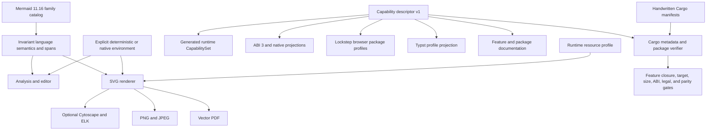

# Capability-Driven Feature and Distribution Architecture - Plan

## Goal Capsule

- **Objective:** Replace Merman's historical `full`, `tiny`, `core-full`, `core-host`, `render`, and `raster` feature graph with one capability-driven architecture that is complete for Mermaid 11.16 language tooling, ergonomic for editor, lint, static-site, CLI, SDK, browser, and Typst users, and materially excludes unselected heavy dependencies.
- **Authority:** The pinned Mermaid `11.16.0` source and companion behavior graph define language and rendering correctness. Cargo's additive feature semantics define compile-time composition. The canonical capability descriptor, ABI descriptor, package manifests, and measured dependency/artifact closures define release truth. Runtime environment and resource policies remain distinct from compiled capability.
- **Execution profile:** Fearless alpha refactor. Public Cargo features, defaults, C symbols, UniFFI records, package names, npm exports, CLI build profiles, and generated descriptors may break. Delete old aliases and phantom capabilities instead of carrying compatibility layers. Preserve one family-owned parser/semantic/editor path and source-backed behavior.
- **Stop conditions:** Do not create one feature per diagram, make parser or LSP coverage depend on a render backend, replace ICU or another semantic dependency with an approximation, claim npm subpaths reduce installation size, keep a feature with no callable API, generate Cargo manifests, or upgrade a behavior dependency without source and parity evidence.
- **Tail ownership:** Implement every unit, run the complete verification contract, simplify abandoned attempts, and create focused Conventional Commits on the current branch. Do not push, publish, tag, release, or open a PR without separate maintainer authorization.

---

## Product Contract

### Summary

Merman serves several different products from one codebase: an editor language service, a CI linter, a deterministic site renderer, an `mmdc` replacement, native SDKs, browser packages, and a Typst plugin. These users should choose an outcome they understand. They should not need to know that one diagram uses Manatee, one date path uses Jiff, or one output uses Krilla.

The canonical Mermaid language surface will therefore become invariant. Every build that parses Mermaid will recognize all 35 admitted Mermaid 11.16 families and expose the same canonical semantics, source spans, and family vocabulary. Optional analysis and editor products project that vocabulary for all families without reparsing. Cargo features will select only observable product APIs, outputs, heavy layout or math engines, system adapters, and tool-only capabilities. Named `preset-*` aggregates will provide recommended combinations for common workflows, while runtime policy will select determinism, time, randomness, text measurement, and resource limits for each operation.

Native bindings will replace the published alpha ABI 2 with ABI 3 so old hosts reject the new binary contract before calling it. Separate descriptors will own capability identity, native wire layout, text-measurement semantics, resource policy, and facts payloads; generated projections and a composite runtime contract will bind them without duplicating authority. Browser delivery will replace one 47 MB multi-WASM npm tarball with lockstep packages that each carry exactly one intended artifact. Dependency maintenance will remove deprecated or accidental closures, migrate the LSP to the maintained Tower fork, and admit Cytoscape, RaTeX, and Jiff updates with behavior evidence.

### Problem Frame

The current branch already owns Mermaid 11.16 semantics, editor facts, typed rendering, resource profiles, ABI 2 text measurement, Web preset builds, Typst profiles, and cross-platform binding smoke tests. Its feature graph still reflects incremental implementation history rather than a stable product model:

- `full-registry` removes Architecture, Mindmap, and `flowchart-elk` from detection, analysis, and LSP while their parser modules still compile. It changes semantics without delivering a real compile-time family split.
- `core-full` mixes language configuration, sanitization, registry selection, and Cytoscape layout. Enabling one concern silently pays for or changes the others.
- `host-clock` mixes clock access, complete time-zone rules, browser JS support, and provenance hashing. Cargo feature unification can silently make a supposedly deterministic preset ambient.
- `render` and `raster` obscure the difference between SVG, bitmap allocation, JPEG encoding, vector PDF, system fonts, embedded images, and their resource models.
- `merman-cli --no-default-features` still pulls the full registry, raster/PDF stack, analysis, TLS/networking, Rayon, and completion generation. The measured normal dependency closure is 354 packages versus 404 for its default build.
- Binding crates forward `raster` without exposing PNG, JPEG, or PDF bytes. Runtime metadata omits important compiled capabilities and uses a fixed boolean struct that requires shotgun changes for every addition.
- `@mermanjs/web` publishes seven WASM files in one package. The generated `browser-full` root and `./full` artifacts are byte-identical. The current package is about 17 MB packed and 47.4 MB unpacked even when a consumer needs only analysis, rendering, or editor support.
- Clean downstream `merman-core` builds compile LALRPOP itself. `serde_yaml` is archived and remains for one analysis rewrite. UniFFI pulls Cargo metadata into runtime builds, Pulldown Cmark keeps unused default features, and Tokio is enabled as `full`.
- Mermaid 11.16 resolves Cytoscape 3.33.3 while Merman's source lock, ADR, notices, and Manatee provenance still name 3.33.1. RaTeX manifests declare 0.1.11 while the lock and legal projections contain 0.1.12.

### Actors

- A1. **Editor integrator:** needs complete, recoverable language intelligence without layout, raster, system time, or network dependencies.
- A2. **CI and site builder:** needs deterministic analysis or SVG output with stable bytes, explicit time inputs, vendored metrics, and bounded resource policy.
- A3. **CLI user:** expects an `mmdc` replacement to support Mermaid input, SVG, PNG, JPEG, PDF, ASCII, optional layouts, math, Markdown batches, and honest errors without learning Cargo internals.
- A4. **Native SDK integrator:** needs one stable ABI and ergonomic language wrappers, accurate capability discovery, binary outputs when compiled, and structured unsupported errors otherwise.
- A5. **Browser application author:** needs to install only the analysis, render, editor, ASCII, or full browser artifact used by the application.
- A6. **Maintainer:** needs one reviewable capability catalog, exact feature/package closure gates, source-backed dependency admission, and atomic version governance across release surfaces.
- A7. **Typst author:** needs one installable package with a stable document-facing API, deterministic pure-WASM behavior, useful diagnostics, and no requirement to understand maintainer build profiles.

### Requirements

#### Language and capability semantics

- R1. Every parser-capable build must recognize all 35 admitted Mermaid 11.16 families and expose the same detector, parser, canonical semantic model, source spans, and family-owned fact vocabulary. Analysis, editor, and LSP APIs remain optional products, but whenever compiled they must project that same 35-family semantic catalog without reparsing or losing family coverage. Missing layout engines may make a render operation unsupported, but may not remove syntax, detection, analysis, or editor support from a product that includes those APIs.
- R2. Public Cargo features must represent additive, user-observable capabilities. Diagram names and incidental dependency crate names are not public feature boundaries; named layout and math engines are allowed when users select those Mermaid behaviors directly.
- R3. Remove `full`, `tiny`, `full-registry`, `core-full`, `core-host`, `render`, `raster`, `cytoscape-layout`, `elk-layout`, `ratex-math`, and negative profiles such as `*-no-elk`. Do not retain aliases outside a concise migration table.
- R4. Use intuitive kebab-case leaf names: `svg`, `analysis`, `editor`, `ascii`, `png`, `jpeg`, `pdf`, `layout-cytoscape`, `layout-elk`, `math`, `system-clock`, `system-timezone`, `system-random`, and `system-timing`. `math` names the user capability and hides RaTeX as its current implementation. Tool leaves such as `network-icons`, `parallel-markdown`, and `shell-completions` exist only where they control real compiled code.
- R5. Provide workflow aggregates with the `preset-` prefix so they cannot be confused with leaves. The required user entries are `preset-native-svg`, `preset-static-svg`, `preset-editor`, `preset-ci-lint`, `preset-mmdc`, `preset-native-sdk`, and `preset-all`; browser artifact presets use the explicit `preset-web-*` namespace. `static` means the compiled closure omits system adapters; deterministic output additionally requires the explicit deterministic runtime constructor.
- R6. Low-level implementation crates must not rely on dependency defaults for capability ownership. `merman-core`, `merman-render`, and transport-neutral helper crates use empty defaults; product facades and binaries provide useful defaults through named presets. A normal `merman` dependency must render complete native SVG without additional feature study.

#### Runtime policy and defaults

- R7. Compile-time capability and operation policy must be separate contracts. A deterministic renderer must remain deterministic even when another dependency enables system adapters through Cargo feature unification.
- R8. Provide explicit deterministic and native environment constructors. Deterministic mode fixes UTC/time-zone policy, clock input, seed, generated IDs, and vendored text metrics; native mode may use compiled system adapters. Fixed offsets and complete system time-zone rules remain different choices.
- R9. Keep the existing `interactive`, `constrained`, `trusted-native`, and `unbounded-for-trusted-input` resource profiles. Generate their availability and recommendations into every binding, and document which profile fits editor preview, public submission, local CLI, and trusted batch use. Cargo presets must not encode resource limits.
- R10. All default choices must fail closed when an unavailable engine or output is requested and must name the missing capability. No build may silently substitute a different layout, time-zone model, font measurement path, image policy, or output format.

#### Canonical descriptor and verification

- R11. Add one machine-readable capability descriptor that owns stable capability IDs, user descriptions, implication rules, presets, expected runtime capability sets, target restrictions, and surface projections. Cargo manifests remain hand-written declarations and are verified against the descriptor through structured Cargo metadata.
- R12. Generate Rust capability constants, runtime metadata, TypeScript declarations, C and UniFFI constants, platform projections, package preset manifests, and human-readable feature tables from the descriptor. Delete independent boolean catalogs and source-substring architecture guards.
- R13. The descriptor verifier must prove feature implication, package-to-preset mapping, family/render admission, target legality, absence of phantom features, and dependency closure exclusions. A feature or package that claims a capability without its API, backend, or family evidence fails closed.

#### Rust facade, CLI, and output backends

- R14. Split SVG, PNG, JPEG, and PDF into distinct public capabilities. PNG and JPEG may share an internal bitmap implementation, but selecting PNG must not pull the PDF backend and selecting PDF must not imply bitmap page output.
- R15. Mindmap tidy-tree must render without Cytoscape. `layout-cytoscape` adds Architecture FCoSE and Mindmap COSE-Bilkent; `layout-elk` adds ELK-backed rendering. Their absence preserves parsing and returns a typed render-capability error only for requests that need them.
- R16. ICU4X collation remains part of correct Swimlane SVG behavior and may not have an incorrect fallback. An en-US-only data provider may replace compiled data only after size and ordering evidence proves the generated artifact; this is internal optimization, not a public feature.
- R17. The CLI default `preset-mmdc` must remain the full user-facing replacement. A `preset-ci-lint` build exposes parse, detect, lint, fixes, and rule metadata without SVG, bitmap/PDF, layout engines, networking, Rayon, or completion generation. Commands and help text for uncompiled capabilities must be absent rather than failing after selection.
- R18. Network icon loading remains compiled and runtime-opt-in separately: even `preset-mmdc` must require the existing explicit network authorization before making requests.

#### Binding and ABI contract

- R19. Replace the published alpha ABI `2` with native ABI `3`. ABI 2 remains the identifier of the unsupported alpha.2/alpha.3 contract; every new native artifact, header, wrapper, function table, and probe reports 3 so an old host fails before crossing an incompatible struct or callback boundary. Exact package versions and descriptor digests provide provenance but never substitute for the ABI discriminator.
- R20. Replace format-specific low-level binding paths with one versioned render request and output result. Every public C struct begins with `struct_size`; callbacks receive request/result pointers instead of ABI-fragile by-value records. The request carries a stable format code plus versioned format-options JSON. The result carries status, format, borrowed media type, raw owned bytes, and owned metadata-or-error JSON, released exactly once by one result-free function. A caller-owned synchronous chunk sink is part of ABI 3 for large SVG/PDF output; byte-return conveniences are implemented on top. The sink callback returns a stable continue/abort/error code, receives ordered non-empty chunks borrowed only for the call, runs serially on the invoking thread, and is never called again after abort/error. Sink mode returns final status/metadata with an empty result-data buffer; partial host output remains caller-owned on failure. Re-entry into the same engine during a callback fails with a typed error. High-level Swift, Kotlin, Dart, Python, and Rust wrappers provide ergonomic `renderSvg`, `renderPng`, `renderJpeg`, `renderPdf`, `renderAscii`, and file/sink conveniences where the host supports them.
- R21. C and UniFFI symbols remain present across feature variants and return a structured unsupported-capability error when a requested output is not compiled. If a backend has no callable API and test, its feature must not exist.
- R22. Native ABI 3, diagnostics payload schema 1, facts payload schema 2, editor token descriptor 1, capability descriptor 1, text-measurement contract, resource contract, Typst transport ABI, and package version are independent fields. Changing one may not be used to hide a change in another. ABI layout and capability-catalog digests are reported separately: an additive unknown capability may be ignored, while an incompatible wire layout must be rejected.

#### Browser and Typst distribution

- R23. Supersede ADR-0069's multi-artifact single-package decision with one required full convenience package, `@mermanjs/web`, plus independently admitted slim candidates: `@mermanjs/analysis`, `@mermanjs/render`, `@mermanjs/editor`, and `@mermanjs/ascii`. A slim candidate is published only when it owns a direct workflow and clears R27 after the final dependency graph; otherwise that workflow uses `@mermanjs/web` and no redundant package is released. Each retained package contains exactly one intended WASM artifact and its matching wrapper, declarations, manifest, legal material, and input provenance.
- R24. All admitted browser packages use one version and one release contract. Publishing uses a staged prerelease/dist-tag promotion flow that detects partial publication before moving the public tag; no package may silently depend on a different Merman version.
- R25. The Playground consumes the admitted render/editor candidates or the full package according to the measured two-realm decision and displays exact package/runtime capability metadata. Custom WASM initialization keeps the current wasm-bindgen `module_or_path` object contract so consumers do not need downstream patches.
- R26. Typst remains a distinct wasm-minimal-protocol transport. Its descriptor exposes only `bridge`, `svg`, and `publish` profiles; `publish` explicitly includes SVG, analysis, Cytoscape, and ELK while importing no system environment or browser capability.
- R27. Package and WASM evidence must measure the artifact a user installs after complete 35-family, ELK, Cytoscape, and math admission. `@mermanjs/web` must contain one WASM and no duplicate sibling artifact; its final packed and unpacked sizes must be published with an attributed comparison to the current roughly 47.4 MB multi-artifact package. The earlier 16 MB estimate is a planning forecast from the known one-artifact shape, not a correctness ceiling: no correct semantic, ICU, or backend behavior may be weakened merely to meet it. Each slim package must contain one WASM, be at least 15 percent smaller unpacked than the measured full package or be folded into it, and receive a new raw/gzip/brotli baseline only after U11a-U11c are final.

#### Dependencies, generation, and release integrity

- R28. Check generated LALRPOP Rust parsers into the source tree, move parser generation to an explicit maintainer/xtask command, and fail CI on grammar/generated drift. Published `merman-core` must not compile LALRPOP as a build dependency.
- R29. Replace the remaining `serde_yaml` use with stable `serde-saphyr`, remove unused direct dependencies, disable unused Pulldown Cmark and UniFFI defaults, narrow Tokio/tracing features to real LSP needs, and remove no-op or duplicate manifest entries.
- R30. Migrate `tower-lsp` to the maintained `tower-lsp-server` release as an independent behavior migration. Preserve URI encoding, pull diagnostics, cancellation, custom transport, stdio exit, and client capability behavior.
- R31. Align Jiff to the selected maintained 0.2 release with separate system clock/time-zone ownership; admit Cytoscape 3.33.3 against Mermaid 11.16 source; and upgrade the RaTeX crate family in lockstep only after its parser, SVG, embedded-font, size, legal, and hostile-input matrix passes.
- R32. Keep ICU4X, resvg/usvg, and Krilla when they remain the correct maintained backends. Isolate RustSec-unmaintained transitive font crates behind output/math capabilities and document their exact dependency paths; do not claim a local replacement until upstream behavior and parity can be preserved.
- R33. Regenerate license inventories, notices, release contracts, size budgets, feature documentation, package READMEs/changelogs, and migration guidance from the final graph. Release verification must reject stale or ignored local artifacts.
- R34. Rewrite `docs/FEATURES.md` as the canonical user-facing selection guide and link it prominently from the root README. It must provide copyable Rust/Cargo, CLI install, Web/npm, native SDK, and Typst examples organized by editor, lint/CI, static-site SVG, full CLI, SDK, and browser workflows; show exact preset contents and exclusions; distinguish compiled capability from runtime environment/resource policy; name dependency/size/license consequences; explain typed missing-capability errors; and include the one-time old-to-new migration table. Generate or verify matching concise sections in every public crate/package/platform README rather than maintaining divergent prose.

### Key Flows

- F1. **Live editing:** source enters the canonical family parser once; analysis/editor facts drive LSP or browser editor APIs. No renderer, layout backend, rasterizer, system clock, or network stack is present.
- F2. **CI lint:** the lint preset parses the complete language under deterministic policy, emits schema-1 diagnostics/fixes, and exits with stable CLI codes without compiling presentation backends.
- F3. **Deterministic site render:** a site builder compiles `preset-static-svg`, constructs `DeterministicEnvironment`, supplies or accepts fixed operation inputs, and obtains byte-identical output across fresh processes even when a larger unified dependency graph compiled system adapters elsewhere.
- F4. **Full CLI render:** the default CLI detects input/output, selects the requested layout/math/output capability, applies the trusted-native resource profile, and writes SVG, PNG, JPEG, PDF, or ASCII while network access stays explicitly authorized.
- F5. **Native SDK output:** a host verifies ABI number, ABI-layout digest, and structure probes, records the capability-catalog digest as provenance, queries stable capability IDs, calls one output operation or sink, and receives raw bytes plus metadata or a typed unsupported error. Its language wrapper presents format-specific convenience methods.
- F6. **Browser installation:** an application installs one admitted workflow-specific package when it provides a material saving, otherwise the full package. The selected package initializes its sole matching WASM, verifies provenance and capabilities, and never downloads sibling artifacts.
- F7. **Maintainer admission:** a dependency or feature change updates the canonical descriptor or upstream lock, runs closure/parity/target/size/legal gates, regenerates projections, and fails if any package or runtime claim drifts.
- F8. **Typst document render:** an author installs the published Typst package, imports its stable document API, renders Mermaid source under the package's deterministic resource policy, receives source-oriented diagnostics for invalid or unsupported input, and upgrades the package without selecting the internal `bridge`, `svg`, or `publish` build profile.

### Acceptance Examples

- AE1. An Architecture, Mindmap, `flowchart-elk`, Swimlane, and ZenUML corpus parses, analyzes, completes, renames, and tokenizes in `preset-editor` without Manatee or ELK in the normal dependency closure. Rendering an Architecture diagram without `layout-cytoscape` returns a typed missing-capability error; a tidy-tree Mindmap still renders.
- AE2. A `preset-ci-lint` CLI build has no `reqwest`, Rayon, resvg/usvg, Krilla, image encoder, Manatee, ELK, RaTeX, Jiff, UUID, or `clap_complete` normal dependency. Its help exposes only capability, detect, parse, lint, fix, and rule-catalog operations.
- AE3. Two fresh processes built with `preset-all` use the explicit deterministic environment to render the same Gantt and mixed-family corpus to byte-identical SVG. A native environment resolves New York winter and summer dates with complete DST rules rather than a sampled offset.
- AE4. The default CLI renders existing SVG, PNG, JPEG, PDF, ASCII, ELK, Cytoscape, RaTeX, Markdown batch, and large trusted-input fixtures. A build without PNG does not advertise PNG and returns a stable unsupported error if invoked through the generic binding operation.
- AE5. C, UniFFI/Python, Swift, Kotlin, and Dart consume the same generated ABI 3 transport plus shared semantic descriptors. ABI-2 hosts reject the library before any callback. PNG begins with its magic bytes, JPEG and PDF have their expected signatures, SVG/ASCII remain UTF-8, and metadata identifies the media type and selected runtime policy. Large SVG/PDF can stream through the caller-owned sink without an additional full FFI buffer.
- AE6. `npm pack --json` for every retained browser package lists exactly one `.wasm`. An admitted `@mermanjs/editor` cannot resolve renderer exports; an admitted `@mermanjs/render` does not install editor or ASCII WASM. A candidate below the 15-percent threshold is absent from the release contract and its documented workflow uses `@mermanjs/web`. The full package contains one WASM, not a duplicate `./full` artifact.
- AE7. The Typst publish artifact reports the descriptor-selected capabilities, has only the allowed wasm-minimal-protocol imports/exports, and renders the package examples without system clock, time-zone, random, browser, or host-font imports.
- AE8. YAML quick-fix goldens preserve quoting, nulls, multiline values, key order, document markers, and final newline after the `serde-saphyr` migration. LSP URI, pull-diagnostic, cancellation, refresh, loopback, and stdio fixtures remain wire-equivalent after the maintained fork migration.
- AE9. Cytoscape 3.33.3 Architecture/Mindmap probes and parity evidence pass with synchronized source lock, ADR, comments, provenance, notices, and legal hashes. RaTeX and Jiff selected versions pass their named behavior and target matrices before the lock is accepted.
- AE10. Structured verification finds no removed feature name in live manifests, generated catalogs, package docs, or release commands outside the migration table and superseded ADR history. Every preset's declared capability set equals its compiled runtime report.

### Success Criteria

- Complete parser/analysis/editor coverage is invariant across every supported feature preset.
- Every public leaf either changes a callable capability/dependency closure or is deleted.
- The lean lint, editor, static SVG, default CLI, native SDK, browser package, and Typst dependency closures pass explicit inclusion and exclusion gates; deterministic evidence additionally exercises the explicit deterministic runtime constructor.
- Every npm package contains one WASM; the full convenience package has no duplicate sibling artifact and publishes an attributed packed/unpacked comparison against the current 47.4 MB multi-artifact package. Correctness takes precedence over an unproven absolute size forecast.
- The published-crate clean build no longer compiles LALRPOP, production UniFFI no longer includes Cargo metadata, and non-output users no longer include raster/PDF/math stacks.
- ABI, schema, capability, package, resource, and Mermaid baseline versions are independently observable and generated from their authorities.

### Scope Boundaries

This plan does not upgrade Mermaid beyond 11.16, add or remove diagram semantics, publish the new packages, or promise binary compatibility with earlier `0.8.0-alpha.*` snapshots. It does not replace ICU, resvg/usvg, Krilla, Rustybuzz, or ttf-parser with behaviorally weaker code. It does not introduce per-diagram Cargo features, platform-specific forks of the capability vocabulary, or resource limits as compile-time features.

---

## Planning Contract

### Key Technical Decisions

#### KTD1. Feature names describe observable capabilities

**Decision:** Public leaves use output, engine, environment, or tool vocabulary. Presets use a uniform `preset-*` prefix. Incidental dependencies remain hidden with `dep:` forwarding.

A proposed public leaf is admitted only when all of the following are true: it changes a callable API, output, engine, or environment adapter that a user can name; disabling it produces a typed absence or removes that callable surface; it materially changes dependency, target, license, security, resource, build-time, or artifact-size closure; at least one supported product preset includes it and one excludes it; and measured build/artifact evidence verifies the distinction. A new diagram family alone never creates a feature. If an admitted family introduces a genuinely heavy companion dependency, the public boundary names the reusable backend capability rather than the diagram.

**Why:** Users choose editor intelligence, deterministic SVG, PDF, ELK, or a CLI workflow. They do not choose a Rust crate graph. This keeps names stable when an implementation dependency changes.

**Rejected:** One feature per diagram; exposing every optional dependency as a feature; keeping ambiguous `full`, `host`, `render`, and `raster` aliases.

#### KTD2. Mermaid language support is one invariant base

**Decision:** Compile and register every admitted detector, parser, canonical semantic model, source-span producer, configuration behavior, sanitization behavior, and family-owned fact vocabulary in every parser-capable build. Analysis and editor remain optional APIs and dependency closures; when enabled, they consume the invariant vocabulary and cover every family without constructing a second semantic path. Layout features affect render availability only.

**Why:** The current tiny registry does not remove parser compilation cost, but it does make valid syntax disappear from analysis and LSP. A Mermaid replacement must not make language meaning depend on a renderer backend.

**Rejected:** `registry-full`; features for new 11.16 families; coupling Architecture, Mindmap, or `flowchart-elk` detection to Manatee or ELK.

#### KTD3. Runtime policy is not a Cargo preset

**Decision:** Cargo features compile system adapters; explicit environment and resource objects select operation behavior. Deterministic constructors never inspect whether ambient adapters were unified into the binary.

**Why:** Cargo features are additive and unified across the graph. They cannot prove that a particular operation avoided ambient time, randomness, locale, fonts, or resource policy.

**Rejected:** Naming a compile aggregate `preset-deterministic-svg`; treating any preset alone as a runtime determinism guarantee; compile-time UTC branches scattered through parsers.

#### KTD4. Low-level defaults are empty; product defaults are named

**Decision:** Core/render/export/helper crates use empty defaults. The `merman` facade defaults to `preset-native-svg`; the CLI defaults to `preset-mmdc`; LSP, native bindings, browser packages, and Typst name their intended preset explicitly in their artifact descriptor.

**Why:** Empty implementation defaults prevent accidental feature unification. Named product presets keep common entry points usable without asking users to reconstruct an internal graph.

**Rejected:** Empty defaults at every public product surface; relying on dependency defaults inside release artifacts; hidden full builds.

The following table is normative. A preset not listed here is not public, and two presets with the same effective set must be merged rather than retained as aliases.

| Preset | Exact public leaves | Default consumer | Explicitly excludes |
| --- | --- | --- | --- |
| `preset-native-svg` | `svg`, `layout-cytoscape`, `layout-elk`, `math`, `system-clock`, `system-timezone`, `system-random`, `system-timing` | default `merman` facade and normal native Rust examples | ASCII, analysis/editor APIs, PNG/JPEG/PDF, CLI-only tools |
| `preset-static-svg` | `svg`, `layout-cytoscape`, `layout-elk`, `math` | static-site/native build examples using `DeterministicEnvironment` | every `system-*` adapter, other outputs, analysis/editor, CLI tools |
| `preset-editor` | `analysis`, `editor` | editor library consumers and LSP library build | SVG/export/layout/math/system/network/parallel/completions |
| `preset-ci-lint` | `analysis` | lean `merman-cli` lint binary | every renderer/export/layout/math/system/network/parallel/completion capability |
| `preset-mmdc` | `preset-native-sdk`, `network-icons`, `parallel-markdown`, `shell-completions` | default CLI, cargo-dist, Homebrew | editor API; network remains runtime-disabled until authorized |
| `preset-native-sdk` | SVG, analysis, ASCII, PNG, JPEG, PDF, both layouts, math, and every `system-*` adapter | C, UniFFI, Android, Apple, Flutter, and Python release artifacts | editor API, CLI-only tools, and browser/Typst transports |
| `preset-all` | every non-tool leaf: SVG, analysis, editor, ASCII, PNG, JPEG, PDF, both layouts, math, and every `system-*` adapter | exhaustive Rust/build/test matrix only | CLI-only tools and transport-specific glue |

Browser and Typst mappings are also normative:

| Artifact preset | Exact public leaves | Product |
| --- | --- | --- |
| `preset-web-analysis` | `analysis` | `@mermanjs/analysis` |
| `preset-web-render` | `svg`, `layout-cytoscape`, `layout-elk`, `math`, browser time/random/timing adapters | `@mermanjs/render` |
| `preset-web-editor` | `analysis`, `editor` | `@mermanjs/editor` |
| `preset-web-ascii` | `ascii` | `@mermanjs/ascii` |
| `preset-web-full` | union of all four Web presets in one fused WASM | `@mermanjs/web` |
| Typst `bridge` | transport only | maintainer smoke artifact, not an end-user choice |
| Typst `svg` | `svg` without system adapters | maintainer render artifact |
| Typst `publish` | `svg`, `analysis`, `layout-cytoscape`, `layout-elk`, `math` without system adapters | published Typst package |

Current single-artifact evidence makes all four slim candidates plausible: analysis 2.65 MB, ASCII 2.78 MB, editor 3.45 MB, and render 7.75 MB versus the 10.20 MB non-math full WASM. It does not pre-admit them. Final admission repeats the independent-workflow and 15-percent comparison after invariant language, math, and dependency upgrades; rejected candidates are not published. The Playground keeps editor and renderer in separate realms only when its gate beats the realistic two-realm full baseline across download, compile cache, initialization, peak memory, and failure isolation.

#### KTD5. The capability descriptor owns identity, not Cargo source

**Decision:** A new `capabilities/feature-surface-v1.json` exclusively owns capability and output semantic IDs, descriptions, implications, presets, expected reports, and surface mappings. Cargo manifests own compilation declarations. `abi/merman-v3.json` references those semantic IDs and owns only native numeric discriminants, function-table entries, record layouts, ownership rules, and layout probes. The text-measurement and resource descriptors retain their independent semantic IDs and versions. `xtask` compares these authorities through structured metadata, while generated runtime/platform/docs projections carry separate digests plus a composite provenance digest.

**Why:** Generating TOML would make ordinary Cargo tooling and reviews opaque. Treating every manifest and platform list as independent recreates shotgun surgery. The verifier is the contract between the two authorities.

**Rejected:** Parsing Rust or TOML with source substrings; generating complete Cargo manifests; a descriptor that repeats dependency implementation details it cannot verify.

#### KTD6. Published ABI 2 is retired and native ABI 3 is the final alpha redesign

**Decision:** Assign native ABI 3 to the redesigned function table, pointer-based callbacks, generic output request/result, and sink contract. ABI 2 remains the identifier of the published alpha.2/alpha.3 generation and is unsupported by new artifacts. New hosts require ABI 3, validate the ABI-layout digest and probes, and treat the separate capability-catalog digest as provenance rather than an equality-based compatibility gate. Freeze normal ABI versioning rules now, before the first stable release.

**Why:** Prerelease SemVer permits the break, but the machine discriminator must still fail closed. Old ABI-2 hosts only know the integer and old layouts; they cannot discover a new digest before making an unsafe call. A new integer is the only reliable boundary, while split digests prevent a harmless additive capability from masquerading as a wire-layout break.

**Rejected:** Reusing 2 for incompatible published prerelease artifacts; pretending old alpha binaries remain compatible; carrying both old and new function sets. (session-settled: user-approved — the maintainer clarified ABI 2 was introduced in the 0.8 alpha line, explicitly allowed either outcome, and prioritized the most correct one-time break; published alpha inventory proved ABI 3 is required.)

#### KTD7. One binding operation transports every output

**Decision:** ABI 3 exposes a versioned function table. Its render request contains `struct_size`, format code, source slice, and versioned format-options JSON. Its result contains `struct_size`, status, format, a borrowed static media-type slice, one owned data buffer, and one owned metadata-or-error JSON buffer; one result-free function consumes both buffers. Every callback is pointer-based and size-tagged. A synchronous caller-owned chunk sink supports large SVG/PDF; byte-return and language conveniences collect that sink when requested. The sink record contains `struct_size`, `user_data`, and a write callback returning stable `continue`, `abort`, or `error` codes. Chunks are ordered and non-empty; their pointers are borrowed only until the callback returns. Callbacks are serial on the invoking thread, receive no final sentinel, and stop permanently after abort/error. The enclosing render call is the finalization boundary: success returns metadata with empty data, while abort/error returns a typed sink status and leaves any partial host output untouched. Calling the same engine recursively from its sink callback returns a typed re-entrancy error; separate engines remain independent. Feature-disabled formats use the same operation and return structured unsupported errors before allocating output buffers or invoking the sink.

**Why:** This keeps the native entry shape stable when a new output is added, avoids base64 and mandatory duplicate full-output buffers, and makes a compiled capability testable from every host. Pointer-based callbacks avoid the current by-value struct growth hazard.

**Rejected:** Empty raster features; separate C result layouts per format; encoding binary output inside JSON; requiring every release artifact to compile every backend.

#### KTD8. Browser installation size requires lockstep packages

**Decision:** Always publish the full browser package with one WASM. Build analysis, render, editor, and ASCII as lockstep candidates, but retain each package only if its final unpacked artifact is at least 15 percent smaller than full and it supports an independent workflow. Shared generation and release validation keep retained APIs aligned; the full package does not embed slim artifacts. Candidate rejection is a descriptor and documentation decision, not a hidden subpath alias.

**Why:** npm `exports` controls public entry points, while `files` controls the tarball. Subpaths cannot reduce the 47.4 MB installation. Package boundaries are the only reliable installation boundary.

**Rejected:** Another subpath-only redesign; one package per Cargo leaf; dynamically downloading undocumented sibling WASM from a full package.

#### KTD9. Output features follow resource and dependency boundaries

**Decision:** Keep SVG, PNG, JPEG, and PDF public and separate. Use internal shared conversion features where necessary, but report only callable formats. Expose system-font and embedded-image behavior through runtime policy/capability metadata unless measurements prove a separately useful public build choice.

**Why:** PNG/JPEG are bounded pixel allocations; PDF is vector output with separate filter/image budgets; SVG has a different safety pipeline. One `raster` flag hides these contracts.

**Rejected:** One umbrella output feature; splitting every codec or transitive crate into user-facing flags; silently dropping embedded images or text.

#### KTD10. Dependency updates are admissions, not housekeeping

**Decision:** Separate low-risk closure cleanup from behavior migrations. Jiff, Tower LSP, Cytoscape, and RaTeX each receive focused source/release-note evidence and behavior gates. ICU/resvg/Krilla remain when they are already correct and maintained.

**Why:** A green lockfile does not prove time-zone, URI, layout, math, font, target, or legal behavior. Separating migrations keeps failures attributable.

**Rejected:** Blind latest-version sweeps; preserving archived `serde_yaml`; replacing transitive font engines locally without upstream parity.

#### KTD11. Generated parsers are release source

**Decision:** Commit LALRPOP output, generate it through `xtask`, and verify freshness in CI. Grammar files remain the human authority and generated Rust remains a checked projection.

**Why:** Consumers should compile the parser, not the parser generator. A structured freshness gate preserves maintainability without adding downstream clean-build cost.

**Rejected:** Keeping LALRPOP in every published build; manually editing generated parser code; replacing source-backed grammars to save build time.

### High-Level Technical Design



The descriptor does not decide runtime behavior and does not duplicate implementation dependencies. It declares the stable public vocabulary and expected closure. Cargo metadata proves the compiled feature graph, family capability reports prove semantic/render admission, package manifests prove artifact ownership, and runtime reports prove the active artifact.

### Dependency Order

```text
U1 capability vocabulary and descriptor
 +--> U2 invariant language and checked-in parsers
 +--> U3 system adapters and explicit runtime policy

U2 + U3 --> U4 renderer, layout, math, and output leaves
U2 + U3 + U4 --> U5 facade presets and CLI products
U1 + U2 + U3 + U4 --> U6 ABI 3 and native bindings

U1 + U2 --> U9 dependency hygiene and generation cleanup
U2 + U3 + U9 --> U10 maintained LSP migration
U3 --> U11a source-backed Jiff admission
U4 --> U11b source-backed Cytoscape admission
U4 --> U11c source-backed RaTeX admission

U1-U6 + U9-U11c --> U8 final browser and Typst artifact profiles
U8 + U11a-U11c --> U7 lockstep npm packages and Playground adoption
U1-U11c --> U12 strict matrix, docs, legal projections, and cleanup
```

### System-Wide Impact

- **Language identity:** Removing `tiny/full-registry` changes every capability count and generated catalog, but makes parser/editor behavior stable across products.
- **Build graph:** Empty low-level defaults and explicit forwarding expose missing feature edges immediately. All workspace members, examples, benches, docs.rs metadata, release jobs, and platform build scripts must name their intended preset.
- **Runtime behavior:** Explicit environments prevent Cargo feature union from changing deterministic output. System time-zone support becomes a separate compiled adapter from clock access.
- **Bindings:** The published ABI-2 C symbol/result/callback shape is replaced by ABI 3. Every generated wrapper and packaged native library must move atomically; old hosts reject version 3, while new hosts separately verify ABI-layout and semantic-catalog provenance.
- **Distribution:** Multiple npm packages add release coordination but remove installation waste. Package status probes, dist tags, changelogs, and legal projections become a lockstep set.
- **Security and resources:** Output splitting narrows the dependency and attack surface for lint/editor/SVG consumers. Runtime resource profiles and network authorization remain mandatory and independent.
- **Evidence:** Source-backed layout/math/time updates alter upstream locks, provenance, notices, parity fixtures, and size baselines; each is admitted before the final lockfile is accepted.

### Risks and Mitigations

| Risk | Severity | Mitigation |
| --- | --- | --- |
| Full invariant language semantics increase the smallest parser artifact | Medium | Accept correctness as the base contract; measure the removed fake-tiny profile and optimize shared parser data internally rather than changing accepted syntax. |
| Cargo feature unification reintroduces ambient behavior | High | Deterministic environment is an explicit runtime object tested inside a `preset-all` build; capability reports separate compiled adapters from selected policy. |
| ABI-2 alpha snapshots are mistaken for compatible artifacts | High | Report ABI 3, remove ABI-2 live symbols/headers, require the generated ABI-3 function table and probes, and test old-host/new-library plus new-host/old-library rejection. |
| Multi-package npm publication or dist-tag promotion partially succeeds | High | Build and verify all tarballs first, publish under a staging tag, probe every exact version, then reconcile public tags from a recorded old/target set; restore and verify the old set on any promotion failure. |
| Output splitting creates invalid feature combinations | High | Generate a pairwise/leaf/preset feature matrix and assert closure through Cargo metadata plus runtime capability reports. |
| Checked-in parsers drift or create unreviewable churn | Medium | Keep grammars authoritative, generate deterministically through one xtask command, and review generated diffs with freshness and parser corpus gates. |
| Tower LSP migration changes URI or cancellation behavior | High | Isolate it in U10 and retain wire-level request/response, custom transport, rapid-edit, cancellation, and stdio exit fixtures. |
| Cytoscape, Jiff, or RaTeX upgrades move visible behavior | High | Use exact source diff, target matrix, family parity, provenance, legal, and size gates; reject an upgrade rather than tune Merman around unexplained deltas. |
| RustSec unmaintained transitive font crates remain | Medium | Keep them isolated behind output/math capabilities, retain reviewed deny exceptions, and track upstream resvg/Krilla/RaTeX migration rather than claiming an unsafe local swap. |

### Assumptions

- ABI 2 was distributed in the published `0.8.0-alpha.2`/`.3` prereleases; alpha compatibility may be broken, but those artifacts remain observable and must reject or be rejected by ABI 3 without crossing an unsafe call boundary.
- Mermaid 11.16 remains the selected behavior baseline for this plan.
- Current platform release workflows can be changed before the next formal release and no package publication occurs during implementation.
- Existing resource profiles and family-owned semantic architecture remain authoritative unless a unit identifies a direct correctness conflict.

---

## Implementation Units

### Unit Index

| Unit | Title | Primary files | Depends on |
| --- | --- | --- | --- |
| U1 | Canonical capability vocabulary and descriptor | `capabilities/`, `crates/xtask/`, ADRs | none |
| U2 | Invariant language catalog and generated parsers | `crates/merman-core/` | U1 |
| U3 | System adapters and deterministic runtime policy | `merman-core`, `merman-render`, `merman` | U1 |
| U4 | Renderer, layout, math, and output leaves | `merman-render`, new `merman-export`, `merman` | U1-U3 |
| U5 | Facade presets and CLI products | `merman`, `merman-cli` | U1-U4 |
| U6 | Native ABI 3 and binding outputs | `abi/`, binding crates, platform wrappers | U1-U4 |
| U7 | Lockstep npm package build and Playground adoption | `platforms/web`, `playground`, release workflows | U8, U11a-U11c |
| U8 | Browser and Typst artifact profiles | WASM crates, profile descriptors, `xtask` | U1-U6, U9-U11c |
| U9 | Dependency hygiene and parser build cleanup | workspace manifests, analysis, generation | U1-U2 |
| U10 | Maintained LSP transport migration | `merman-lsp`, VS Code/LSP docs | U2-U3, U9 |
| U11a | Jiff time admission | time adapters, target matrix, lock/provenance | U3 |
| U11b | Cytoscape 3.33.3 admission | upstream locks, Manatee, family parity | U4 |
| U11c | RaTeX admission | math integration, fonts, legal/size matrix | U4 |
| U12 | Strict matrix, user feature guide, release docs, legal sync, cleanup | CI, `docs/FEATURES.md`, READMEs/changelogs | U1-U11c |

### U1. Establish the canonical capability vocabulary and descriptor

- **Goal:** Create one durable public capability model before changing manifests or package APIs.
- **Requirements:** R2-R6, R11-R13, R22, R33-R34.
- **Files:** Create `capabilities/feature-surface-v1.json`, `capabilities/README.md`, `docs/adr/0076-capability-driven-feature-and-package-surfaces.md`, and `crates/xtask/src/cmd/capability_surface.rs`; update `crates/xtask/src/cmd/mod.rs`, `docs/adr/0006-feature-flags-tiny-vs-full.md`, `docs/adr/0066-ffi-binding-strategy.md`, `docs/adr/0069-wasm-package-surface-semantics.md`, and `docs/adr/0074-browser-runtime-and-benchmark-ownership.md`.
- **Approach:** Define stable leaf IDs, preset IDs, descriptions, target restrictions, implications, admission evidence, and expected runtime sets. Mark conflicting feature and package-surface decisions as superseded by ADR-0076; revise only ADR-0074's package-surface projection and retain its realm, runtime, benchmark, cache, and lifecycle ownership. Implement descriptor schema/generation and fixture validation first. U2-U8 migrate one consumer at a time, deleting that consumer's old catalog when its generated projection becomes live; a migration ledger makes unmigrated surfaces explicit without treating either catalog as a second authority. U12 removes the ledger and enables the strict whole-repository descriptor-to-manifest/runtime/package gate. Generate Rust/TypeScript/native constants and documentation, but keep Cargo manifests hand-written.
- **Test scenarios:** In schema/fixture mode, reject an unknown capability, implication cycle, duplicate ID, negative feature name, diagram-specific public feature, preset referencing an unavailable target, descriptor leaf with no API/runtime evidence, and an invalid migration ledger. Per-surface migration tests reject a manifest feature missing from the descriptor and a package mapping whose compiled report differs from its preset. Strict mode rejects any remaining ledger entry or old catalog.
- **Verification:** U1's schema/generator/fixture verifier passes on the target descriptor and fails each malformed fixture with a path-specific error; it does not claim current manifests have already migrated. Generated outputs are byte-stable. Each U2-U8 unit enables its surface-local structured check, and U12 proves the final strict mode plus `git diff` freshness with no parallel live catalog.

### U2. Make Mermaid language and editor semantics invariant

- **Goal:** Remove runtime registry profiles and make all 35 family parsers, semantics, spans, and downstream vocabulary available independently of render backends.
- **Requirements:** R1-R3, R10, R15, R22, R28; AE1, AE10.
- **Files:** `crates/merman-core/Cargo.toml`, `crates/merman-core/src/family.rs`, `crates/merman-core/src/diagrams/mod.rs`, `crates/merman-core/src/lib.rs`, `crates/merman-core/build.rs`, LALRPOP grammar/generated parser files, `crates/merman-analysis/Cargo.toml`, `crates/merman-analysis/src/payload.rs`, `crates/merman-editor-core/Cargo.toml`, facts projections/fixtures, family capability tests, and the parser generation command under `crates/xtask/src/cmd/`.
- **Approach:** Delete `full`, `full-registry`, `full-config`, and `full-sanitization`. Compile full configuration, sanitization, detector, canonical semantic, source-span, and family-vocabulary behavior as the base language. Keep analysis and editor as optional API layers that consume the base without reparsing. Separate family parser admission from typed render availability. Promote the incompatible facts payload to schema 2 while diagnostics remains schema 1; reject facts v1 at its version boundary and regenerate every consumer projection. Generate and commit all LALRPOP outputs through xtask, then remove the core build script and published LALRPOP build dependency.
- **Test scenarios:** Parse every admitted family through every parser-capable preset and analyze/edit every family through products that include those APIs; parse Architecture/Mindmap/`flowchart-elk` without layout backends; preserve full YAML/JSON5/sanitization behavior; reject a facts-v1 payload before deep deserialization and round-trip facts v2 across Rust/WASM/native projections; detect stale generated parsers after changing a grammar; reject edits to generated output that do not match the grammar.
- **Verification:** The family count, canonical semantic IDs, spans, and vocabulary are identical across parser-capable feature combinations; every enabled analysis/editor product reports the complete family set. `cargo tree` for published `merman-core` contains `lalrpop-util` but not `lalrpop`, and the complete parser/analysis/editor corpus remains green.

### U3. Separate system adapters from operation policy

- **Goal:** Make native convenience and deterministic reproducibility explicit, composable, and immune to feature union.
- **Requirements:** R7-R10, R31; F2-F5; AE3, AE9.
- **Files:** `crates/merman-core/Cargo.toml`, `crates/merman-core/src/time.rs`, `crates/merman-core/src/runtime.rs`, `crates/merman-render/Cargo.toml`, `crates/merman-render/src/environment.rs`, `crates/merman-render/src/host_time.rs`, `crates/merman/src/render/mod.rs`, `crates/merman/src/render/operation.rs`, and native/browser/Typst time tests.
- **Approach:** Replace `host`/`core-host` forwarding with `system-clock`, `system-timezone`, `system-random`, and `system-timing`. Configure Jiff with target-owned features instead of workspace-wide `js` plus defaults. Add explicit deterministic/native environment constructors and attest the selected runtime policy separately from compiled capability.
- **Test scenarios:** System DST gap/fold and winter/summer resolution; fixed offset versus system rules; UTC behavior without system-timezone; browser JS time without native tzdb assumptions; Typst with no ambient imports; deterministic output in a build that also compiled all system adapters; boundary years and provenance digest stability.
- **Verification:** Closure tests prove deterministic/editor/lint/Typst presets omit Jiff/UUID/web-time where intended. Cross-process deterministic SVG is byte-identical and existing time-zone regressions pass.

### U4. Split renderer, layout, math, and output capabilities

- **Goal:** Make each render capability callable, accurately reported, and isolated by real dependency/resource boundaries.
- **Requirements:** R4-R5, R10, R14-R16, R32; AE1, AE4-AE5.
- **Files:** `crates/merman-render/Cargo.toml`, `crates/merman-render/src/lib.rs`, `crates/merman-render/src/family.rs`, `crates/merman-render/src/mindmap.rs`, `crates/merman-render/src/swimlane/mod.rs`, new `crates/merman-export/`, `crates/merman/src/Cargo.toml`, `crates/merman/src/render/mod.rs`, removal of `crates/merman/src/render/raster.rs`, output tests, publish order/surfaces, size profiles, and docs.rs metadata.
- **Approach:** Rename layout leaves and expose the implementation-neutral `math` capability, decouple tidy-tree from Manatee, and use typed unavailable-capability errors. Replace facade `render` with `svg`. Move the 2,400-line SVG conversion/export implementation into a deep `merman-export` crate that accepts only validated `ResvgCompatibleSvg`, has empty defaults, and exposes real `png`, `jpeg`, and `pdf` operations with shared private internals. The `merman` facade forwards those leaves and owns Mermaid-source orchestration only. Set resvg/usvg/Krilla defaults explicitly and retain required text/image behavior. Keep ICU collation mandatory for SVG; admit a smaller provider only with exact source-backed ordering and artifact evidence.
- **Test scenarios:** Tidy-tree without Cytoscape; Architecture/COSE/ELK missing-capability errors; mixed-case/accent/CJK/emoji Swimlane ordering; leaf and pairwise builds; PNG/JPEG/PDF signatures; text/system-font/embedded-image fixtures; huge SVG remains vector while bitmap/PDF limits remain format-specific; RaTeX disabled/enabled behavior.
- **Verification:** Dependency closure proves PNG excludes Krilla/PDF, PDF does not imply bitmap output, analysis/editor exclude all render backends, and every reported output has a passing API test. SVG parity and resvg-safe suites remain green.

### U5. Build ergonomic facade and CLI presets

- **Goal:** Make common Rust and command-line workflows obvious while preserving a truly lean lint product.
- **Requirements:** R5-R6, R17-R18; F2-F4; AE2, AE4.
- **Files:** `crates/merman/Cargo.toml`, `crates/merman/src/lib.rs`, `crates/merman-cli/Cargo.toml`, `crates/merman-cli/src/cli.rs`, `crates/merman-cli/src/commands.rs`, command modules, `dist-workspace.toml`, cargo-dist/Homebrew/release build configuration, CLI tests, README, and shell completion docs.
- **Approach:** Default `merman` to the normative `preset-native-svg`. Define every native preset exactly as listed in KTD4: `preset-static-svg`, `preset-editor`, `preset-ci-lint`, `preset-native-sdk`, `preset-mmdc`, and `preset-all`; the static-site example must also select `DeterministicEnvironment`. Refactor CLI commands into capability-owned modules, generate help from compiled commands, and expose `capabilities --json` from the canonical descriptor. Release CLI builds select `preset-mmdc` explicitly, and U6 native artifacts select `preset-native-sdk` explicitly.
- **Test scenarios:** Copyable default Rust SVG example; deterministic site example; lint-only help/exit codes/JSON/fixes/broken pipe; default mmdc format inference and compatibility; Markdown parallel and serial paths; shell completion presence only when compiled; network icon requests rejected until explicitly allowed.
- **Verification:** Machine closure assertions prove the lint preset excludes every heavy dependency named in AE2. Default CLI compatibility, output, batch, performance, and resource tests pass; release manifests name the preset rather than relying on defaults.

### U6. Introduce native ABI 3 and expose real native output capabilities

- **Goal:** Establish the first formal-ready native ABI and ergonomic platform wrappers without phantom features.
- **Requirements:** R9, R11-R13, R19-R22; F5; AE5, AE10.
- **Files:** create `abi/merman-v3.json`; split the current `abi/merman-v2.json` text-operation facts into an independently versioned text-measurement descriptor; generated ABI headers/projections; `crates/merman-bindings-core/`; `crates/merman-ffi/`; `crates/merman-uniffi/`; `platforms/android/`; `platforms/apple/`; `platforms/flutter/`; `platforms/python/merman/`; binding docs/changelogs; and platform smoke examples.
- **Approach:** Build every release binding with `preset-native-sdk`. Generate a size-tagged ABI-3 function table, pointer-based text-measurement callbacks, stable output codes that reference capability semantic IDs, the generic render request/result, a result-free function, and a caller-owned chunk sink. Replace fixed capability booleans with stable-ID lists. Generate resource profile IDs, availability, and recommended-use projections into every binding. Keep the ABI-3 function set present across feature variants and return structured unsupported errors. Remove every live ABI-2 header, symbol, wrapper, and generated constant in the same unit while retaining migration history.
- **Test scenarios:** Old ABI-2 host/new library and new host/old library rejection before callback; ABI-layout versus capability-catalog digest behavior; every size/alignment/field-offset/function/discriminant probe; unknown additive capability; zero-length/binary buffers; raw byte and chunk-sink equality; large-output peak RSS/copy counts; UTF-8 SVG/ASCII; PNG/JPEG/PDF signatures/metadata; versioned format options; output disabled at compile time; reusable engine plus host measurement; callback failure; resource-profile projections; Android/Swift/Dart/Python lifecycle, threading, and package compilation.
- **Verification:** C compile/link/dynamic-load tests, UniFFI generation/wheel smoke, Kotlin/AAR, XCFramework/Swift, Flutter analyze/build, and cross-language examples consume ABI 3 and the generated semantic contracts. No platform keeps handwritten capability, output, resource, or measurement codes. The byte convenience path is proven to collect the same sink protocol rather than maintaining a second renderer.

### U7. Build one-WASM lockstep npm package surfaces

- **Goal:** Make browser installation size follow the capability a user chose.
- **Requirements:** R23-R25, R27, R33; F6; AE6.
- **Files:** `platforms/web/package.json`, new package manifests/directories under `platforms/web/packages/`, Web build/smoke/prepack scripts, TypeScript wrappers and public types, `playground/package.json`, Playground runtime imports, `.github/workflows/release-web.yml`, `docs/release/SURFACES.json`, release status/verifier scripts, package READMEs/changelogs, and legal projections.
- **Approach:** Turn `platforms/web` into a private workspace/build owner and generate the required full package plus four slim candidates. Each wrapper binds one `preset-web-*` and one WASM; only candidates clearing the independent-workflow and 15-percent gates enter the public release contract. Delete public `./core`, `./render`, `./render-only`, `./ascii`, `./editor`, and `./full` multi-artifact exports from `@mermanjs/web`. Implement prerelease staging and dist-tag promotion as idempotent reconciliation: record old/target tags, verify every exact version, update and probe each tag, and restore the prior set on failure. This plan tests the workflow with dry runs or an isolated local registry only; it never mutates the real npm registry. Keep Playground editor/render in separate realms only after comparing split artifacts with the realistic two-realm full baseline.
- **Test scenarios:** Package file ownership, independent-workflow and 15-percent size admission, cross-version rejection, one-WASM invariant, absent sibling exports, custom `module_or_path` initialization, stale/corrupt cache retry, capability mismatch, partial publication and mid-promotion recovery, legal drift, Playground split/full download/compile/init/heap evidence, editor/render startup and failure isolation, and the current msfjarvis.dev loader-patch regression.
- **Verification:** Build/test/smoke every package, run `npm pack --json` per package, enforce packed/unpacked/file-count and post-U11a-U11c measured WASM regression budgets, run Playground unit/build/browser smoke, and verify release contracts/status probes. The full package has one WASM and no duplicate full artifact; every retained slim package clears admission. Record and explain the final package-size delta rather than weakening correct behavior to meet the provisional 16 MB forecast. Registry operations stop at dry-run or isolated local-registry evidence.

### U8. Project capability presets into browser WASM and Typst

- **Goal:** Make generated browser and Typst artifacts exact projections of the shared capability model.
- **Requirements:** R11-R13, R24-R27; F8; AE6-AE7.
- **Files:** `crates/merman-wasm/Cargo.toml`, `crates/merman-wasm/src/lib.rs`, `crates/merman-typst-plugin/Cargo.toml`, `crates/merman-typst-plugin/wasm-profiles.json`, Typst package manifests/wrappers, `platforms/web/web-surface-descriptor.json`, WASM build scripts, `crates/xtask/src/cmd/wasm_size_matrix.rs`, and size budgets.
- **Approach:** Replace repeated feature/capability booleans with references to the exact KTD4 artifact presets. Keep browser wasm-bindgen and Typst wasm-minimal-protocol transports separate. Generate package-specific browser artifacts after U11a-U11c finalize their dependency graphs. Reduce Typst maintainer artifacts to `bridge`, `svg`, and `publish`; end users install one published package and do not choose these internal profiles. Reject system adapters and unexpected imports in Typst.
- **Test scenarios:** Every preset builds alone and reports the expected stable IDs; editor omits renderer exports; render omits editor/ASCII exports; Typst bridge has only protocol support; publish has exact callable/linker exports; the installed package's documented Typst API renders valid input and returns source-oriented errors for invalid/unsupported input without exposing profile names; wrong-preset artifact assembly fails; size provenance digest changes when an input changes.
- **Verification:** Browser and Typst size matrices, wasm import/export gates, wasmi operation smoke, Typst package compile/preview/error fixtures, and descriptor freshness checks pass before U7 packages assemble.

### U9. Remove accidental dependencies and generation costs

- **Goal:** Eliminate confirmed dead, deprecated, default-only, and build-time dependency leakage before behavior migrations obscure the graph.
- **Requirements:** R28-R29, R32; AE8, AE10.
- **Files:** root `Cargo.toml`/`Cargo.lock`, `crates/merman-analysis/Cargo.toml`, `crates/merman-analysis/src/source_config_rewrite.rs`, `crates/merman-lsp/Cargo.toml`, `crates/merman-fixture-render-context/Cargo.toml`, `crates/merman-elk-layered/Cargo.toml`, UniFFI and Pulldown consumers, deny/advisory documentation, and closure tests.
- **Approach:** Move to stable `serde-saphyr` with only required serialization/deserialization features; delete `serde_yaml`, analysis `json5`, unused LSP direct dependencies, duplicate SHA-2, and no-op ELK flags. Disable Pulldown Cmark and UniFFI defaults, narrow Tokio and tracing-subscriber features based on compiled use, and preserve genuine futures/tracing requirements. Record RustSec unmaintained font dependency paths and review conditions.
- **Test scenarios:** YAML rewrite golden matrix; Markdown/MDX parsing and labels; UniFFI runtime without Cargo metadata and bindgen with it; LSP runtime/stdio feature pairs; minimal and all-feature builds; deny exceptions tied to exact paths; generated parser freshness from U2.
- **Verification:** Cargo metadata and tree assertions show each removed closure is absent from the intended products. Focused analysis, Markdown, LSP, UniFFI, ELK, and license tests pass before the behavior migrations begin.

### U10. Migrate to the maintained Tower LSP implementation

- **Goal:** Move the transport adapter to `tower-lsp-server` without changing Merman editor semantics or wire behavior.
- **Requirements:** R30; F1-F2; AE8.
- **Files:** root dependencies, `crates/merman-lsp/Cargo.toml`, `crates/merman-lsp/src/server.rs`, transport/refresh/protocol modules, all LSP smoke tests, VS Code extension runtime integration, and LSP docs.
- **Approach:** Adopt the maintained fork's current stable API and URI type deliberately. Keep editor-core transport-neutral. Replace removed async-trait and Tower APIs, preserve custom loopback/refresh ownership, and isolate stdio dependencies behind `stdio`.
- **Test scenarios:** URI percent encoding and non-file schemes; initialize/capabilities; incremental change; pull diagnostics and stale snapshots; completion/rename/tokens; cancellation and content-modified responses; refresh sequencing; loopback backpressure; shutdown/exit; stdio framing; unpublished VS Code extension smoke.
- **Verification:** Existing wire fixtures remain equivalent, new fork-specific migration cases pass, the library builds without `stdio`, and the extension packages the correct LSP binary.

### U11a. Admit the maintained Jiff baseline

- **Goal:** Align time behavior and target-owned Jiff features without coupling the decision to layout or math upgrades.
- **Requirements:** R31; AE3, AE9.
- **Files:** root dependency versions/lock, time adapter manifests/code/tests, target closure fixtures, provenance, and notices.
- **Approach:** Upgrade Jiff to the selected stable 0.2 release with the U3 system-clock/system-timezone split. Native owns system tzdb features; browser enables only the required JS adapter at the final artifact; deterministic and Typst products have no Jiff closure.
- **Test scenarios:** Native/browser/Typst feature trees, DST gaps/folds and winter/summer dates, fixed offset versus zone rules, edge years, deterministic provenance, and absent-system capability errors.
- **Verification:** Target closures, exact version/provenance/legal records, and focused time behavior pass independently before the Jiff lock change is committed.

### U11b. Admit Cytoscape 3.33.3 source behavior

- **Goal:** Align Merman's Cytoscape-derived layout source graph with the version resolved by Mermaid 11.16.
- **Requirements:** R15-R16, R31-R32; AE1, AE9.
- **Files:** `tools/upstreams/REPOS.lock.json`, `tools/upstreams/MERMAID_REFERENCE_BUNDLE.json`, `docs/adr/0053-cytoscape-layout-ports.md`, Manatee provenance/comments/tests, third-party components, notices, and source licenses.
- **Approach:** Materialize and diff Cytoscape 3.33.3 plus relevant FCoSE/COSE companions, port only observable source behavior, and regenerate provenance. Keep tidy-tree independent and retain ICU-backed ordering.
- **Test scenarios:** Architecture constraints/seeds/alignment, Mindmap COSE and tidy-tree-without-Cytoscape, adversarial graph limits, primary parity, source-hash drift, and unexplained upstream delta rejection.
- **Verification:** Source locks, comments, provenance, legal inventory, capability report, size closure, and family parity agree before this admission is committed.

### U11c. Admit the maintained RaTeX baseline

- **Goal:** Upgrade the lockstep RaTeX family behind the public `math` capability with attributable behavior, size, and legal evidence.
- **Requirements:** R31-R32; AE4, AE9.
- **Files:** root manifests/lock, `merman-render` math integration, Web/Typst/native artifact profiles, math fixtures, size budgets, third-party components, notices, and font licenses.
- **Approach:** Review the selected stable RaTeX release and update every RaTeX crate in lockstep. Keep embedded fonts and standalone SVG only where the product contract requires them; do not expose backend crate names as public features.
- **Test scenarios:** Parser and SVG semantics, embedded/external font behavior, hostile input, native/browser/Typst targets, raw/gzip/brotli and native size, license payloads, and math-disabled typed errors.
- **Verification:** The exact lock, runtime report, generated legal material, package contents, size matrix, and math parity pass independently before browser package budgets are frozen.

### U12. Enforce the strict matrix and finish migration documentation

- **Goal:** Prove the new architecture across every product surface and remove all obsolete feature/package/ABI paths.
- **Requirements:** R1-R34; F1-F8; AE1-AE10.
- **Files:** CI workflows, `crates/xtask/src/cmd/verify.rs`, capability/feature matrix fixtures, `docs/FEATURES.md`, `docs/release/PACKAGE_SURFACES.md`, release/security/upgrade docs, root and package READMEs/changelogs, platform docs, status generation, old workstreams, and every stale feature reference found by structured validation.
- **Approach:** Add a bounded leaf, pairwise, preset, target, dependency-exclusion, runtime-report, package, ABI, size, parity, legal, and docs matrix to strict verification. Rewrite `docs/FEATURES.md` as the workflow-first user guide required by R34, link it from the root README, and generate/verify concise surface-specific projections. Delete obsolete aliases, old Web surface artifacts, ABI-2 live symbols, unreachable commands, superseded build scripts, and migration code made obsolete by U1-U11c.
- **Test scenarios:** Every actor flow and acceptance example; user-guide examples compile/run; clean checkout generation; ignored/stale artifact rejection; all supported targets; missing package/feature/runtime capability; old-name allowlist limited to live surfaces while allowing explanatory references in this plan, the migration table, changelog, and superseded ADR history; release preflight without credentials; previous package imports produce actionable migration errors.
- **Verification:** The Verification Contract passes from a clean tree, `git diff --check` is clean, generated projections are stable, and code/docs/build/release paths made obsolete or unreachable by U1-U11c are removed. Unrelated historical cleanup is not a completion blocker.

---

## Verification Contract

### Core Rust gates

```bash
cargo fmt --all -- --check
cargo nextest run --workspace --no-fail-fast
cargo clippy --workspace --all-targets --all-features -- -D warnings
cargo test -p merman --doc
cargo run -p xtask -- verify-capability-surface --strict
cargo run -p xtask -- verify-feature-matrix --strict
cargo run -p xtask -- verify-feature-docs --strict
cargo run -p xtask -- verify --strict
```

The feature matrix must build every public leaf alone where valid, every named preset, all backend/policy pairs, and a bounded pairwise set. It must compare Cargo metadata, dependency exclusions, family capabilities, runtime capability IDs, package manifests, and generated projections. It must not rely on source substrings or feature names alone.

### Behavior and upstream gates

```bash
cargo run -p xtask -- check-alignment
cargo run -p xtask -- verify-mermaid-reference
cargo run --release -p xtask -- compare-all --mode structure
cargo run --release -p xtask -- compare-all --mode parity
cargo run --release -p xtask -- compare-all --mode parity-root
cargo deny check
cargo audit
```

Architecture/Mindmap Cytoscape, Gantt time-zone, Swimlane collation, RaTeX math, output-format, deterministic-render, and all-family parser/editor fixtures must also pass their focused nextest slices before the aggregate matrix.

### Browser and package gates

```bash
npm run check:contracts --prefix platforms/web
npm run build --prefix platforms/web
npm run test --prefix platforms/web
npm run smoke --prefix platforms/web
npm run pack:all --prefix platforms/web
npm run test --prefix playground
npm run build --prefix playground
npm run smoke:browser --prefix playground
cargo run -p xtask -- wasm-size-matrix --budget-file docs/release/WASM_SIZE_BUDGETS.json
```

Each `npm pack --json` result must contain exactly one WASM, exact legal/provenance inputs, the descriptor-selected wrapper, and no sibling surface artifact. After U11a-U11c, `@mermanjs/web` publishes its measured packed/unpacked delta from the current multi-artifact package; the 16 MB forecast is not an acceptance ceiling. Each retained slim package must remain at least 15 percent smaller unpacked than the measured full package and receives raw/gzip/brotli regression budgets from the final graph rather than a guessed percentage.

### Typst and native binding gates

```bash
cargo run --locked -p xtask -- build-typst-package --profile publish
cargo run --locked -p xtask -- typst-plugin-smoke --profile publish
cargo run --locked -p xtask -- typst-package-smoke --profile publish --skip-wasm-build
python scripts/verify-ffi-publish-surface.py
python scripts/verify-release-surfaces.py
```

Run the existing C header/link/dynamic-load suite, Python wheel generation and isolated smoke, Kotlin/Android package smoke, Apple XCFramework plus Swift smoke, Flutter analyze/build/package checks, and every ABI output/capability fixture. The native gate records peak RSS and copy counts for representative large SVG/PDF byte and sink paths and proves the convenience buffer is a collector over the same sink protocol. Missing optional local toolchains must be reported explicitly and may not be represented as passing.

### Closure and cleanup gates

- Parser/editor/lint closures contain no render, bitmap/PDF, layout, math, network, system-time, random, or package-generator dependencies beyond the exact preset contract.
- SVG-only closures contain no image encoder or Krilla PDF backend. PNG contains no PDF backend. Production UniFFI contains no Cargo metadata. Published core contains no LALRPOP generator.
- Every browser package contains one WASM; no root/full duplicate remains; Typst contains no browser/system imports.
- Old feature/package/ABI names are absent from live code, manifests, generated artifacts, package READMEs, and release commands. Explanatory occurrences remain allowed only in the migration table, changelog, this plan, and explicitly superseded ADR history.
- `git diff --check` and generated-file freshness checks pass after all formatters and generators.

---

## Definition of Done

- R1-R34 and AE1-AE10 are satisfied with repository evidence, not documentation claims alone.
- U1-U12 each meet their test scenarios and verification outcome in dependency order.
- Complete Mermaid 11.16 detector/parser/semantic/span/vocabulary behavior is invariant across every parser-capable preset; whenever analysis, editor, or LSP is compiled, it covers that same full catalog without a second semantic path.
- Feature names are intuitive, additive, and capability-based; removed aliases and fake profiles are absent from live surfaces.
- Runtime policy remains explicit and deterministic under an all-capabilities build.
- ABI 3 has one canonical wire descriptor, layout digest, probe set, generic output/sink operation, and synchronized platform wrappers; it references the separate capability catalog, while live ABI-2 shapes are deleted and old/new hosts reject each other before unsafe calls. Diagnostics remains schema 1 and incompatible facts use schema 2 with explicit boundary tests.
- CLI lint and default mmdc products have measured, enforced dependency closures and truthful help/capability output.
- Browser users install one intended WASM package, Typst remains a closed pure-WASM transport, and package/size/release probes are exact.
- Deprecated/dead dependencies and downstream parser generation are removed; maintained dependency migrations and upstream ports have source, parity, target, legal, and size evidence.
- All strict, platform, package, parity, security, legal, and documentation gates pass, or any unavailable external tool is named with the successful lower-level evidence that remains.
- Abandoned approaches, temporary compatibility shims, duplicate descriptors, stale generated artifacts, obsolete docs, and dead code made obsolete, touched, or replaced by U1-U11c are removed before the final commit set; unrelated repository archaeology is not a completion blocker.
- No push, package publication, tag, release, or PR is created by this plan's execution.
