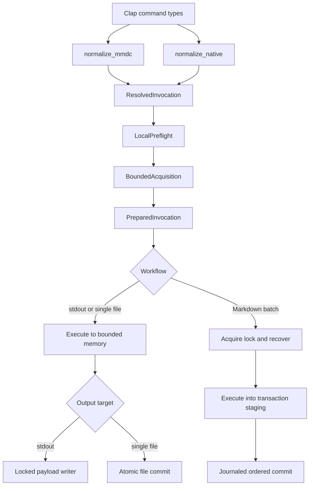
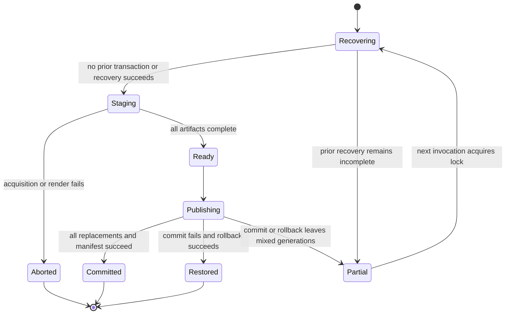
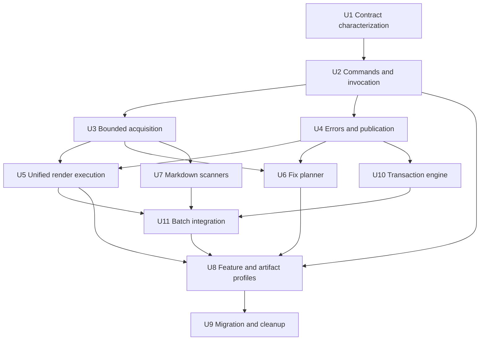

# CLI Invocation and Execution Contracts - Plan

## Goal Capsule

| Field | Contract |
|---|---|
| Objective | Replace the current flattened CLI and side-effectful `RenderPlan` with explicit native and `mmdc` command contracts, bounded acquisition, typed execution, and staged publication. |
| Authority | The latest maintainer direction wins, followed by Product Contract requirements, Key Technical Decisions, repository capability contracts, and implementation-unit detail. |
| Execution profile | Breaking refactor is authorized. Remove obsolete paths and compatibility aliases instead of preserving them behind deprecation shims. |
| Stop conditions | Stop only for a scope-changing contradiction, an unsatisfied cross-platform data-integrity contract, or overlapping user changes that cannot be merged without choosing which behavior to keep. |
| Verification posture | Characterize invariants first, test boundary values and failure phases, then run the full CLI and exact artifact-profile matrices. |
| Tail ownership | `ce-work` owns implementation, simplification, review, focused local commits, and final verification. Do not push or open a pull request unless separately requested. |

---

## Product Contract

### Summary

Merman will expose separate commands for strict `mmdc` compatibility, native single-diagram rendering, and native Markdown batch rendering.
All commands will normalize into a shared typed execution model before reading input, accessing the network, creating directories, or writing output.
The refactor preserves the useful process contracts and additive capability leaves already present while removing ambiguous arguments, silent no-ops, unbounded acquisition, partial batch output, and duplicate render paths.

### Problem Frame

The current CLI combines root-level `mmdc` arguments and native subcommands in one Clap structure.
When a subcommand is present, root arguments can parse successfully and then be ignored.
Rendering uses a wide `RenderPlan` that contains options for every format and performs filesystem and network work during planning.
Resource limits begin after unbounded strings have already been allocated, single-file writes truncate targets directly, Markdown exports publish each diagram before the batch succeeds, and the ASCII-only build maintains a second execution implementation.
These defects make the CLI harder to learn, unsafe under constrained profiles, and difficult to keep correct across slim feature combinations.

### Actors

- A1. Interactive users need a discoverable command, sensible file defaults, and help instead of a blocked terminal.
- A2. Automation and CI users need stable exit classes, payload-only stdout, bounded stdin, deterministic ordering, and no partial successful-looking output.
- A3. Package distributors need every compiled feature leaf to expose callable behavior without carrying unrelated dependencies.
- A4. `mmdc` migrants need an explicit compatibility surface with documented parity and deliberate divergences.

### Requirements

**Command and input contracts**

- R1. The root command requires a subcommand and groups concise help by user task: native rendering (`render`, `batch`), analysis (`lint`, `fix`), compatibility (`mmdc`), then capability and tooling commands, with one-line cues that distinguish the three rendering workflows.
- R2. `mmdc` owns the upstream-compatible argument names, defaults, theme values, Markdown detection, and output naming for the pinned `mmdc@11.16.0` baseline.
- R3. `render` owns native single-diagram rendering and rejects Markdown input.
- R4. `batch` owns native Markdown rendering and writes into a tool-owned output directory.
- R5. Native commands read omitted input from a non-terminal stdin, show command help for an omitted terminal stdin, and always read stdin when `-` is explicit.
- R6. Native `render` writes a named input to a sibling file with the selected format extension by default and writes stdin input to stdout by default.
- R7. Native `batch` defaults to `<input-stem>.merman/`, writes the rewritten document under its source file name, and requires both `--stdin-file-name` and `--output-dir` for stdin.
- R8. Raw SVG conversion is native-only, inferred from a named `.svg` input or selected for stdin with `--input-kind svg`; content sniffing is not part of the contract.
- R9. Every command rejects irrelevant, unavailable, conflicting, or ambiguous arguments before reading stdin, accessing the network, creating output directories, or rendering; an upstream option retained as a documented `mmdc` compatibility no-op is relevant only on that command.
- R36. The `mmdc` contract is a versioned compatibility snapshot pinned by each Merman release; it changes only through Mermaid baseline alignment with an updated compatibility register and migration note.
- R37. Removed root-level render flags produce a targeted usage error that exits `2` and points to `merman-cli mmdc`; they are neither parsed as a compatibility shim nor executed.
- R38. Missing required terminal input at the root, `render`, or `batch` prints concise help to stderr and exits `2`; explicit `--help` prints help to stdout and exits `0`.
- R39. A native `batch` input with zero eligible charts is a valid empty generation: publish the document and manifest, produce no image artifacts, and remove only stale artifacts owned by the prior validated manifest. Strict `mmdc` behavior remains pinned separately.

**Resource and side-effect boundaries**

- R10. Primary source, configuration, CSS, Puppeteer compatibility files, local icon packs, remote icon bodies, Markdown chart count, aggregate staged output, aggregate render working set, parallel jobs, redirects, and network duration are bounded before untrusted allocation or work.
- R11. One resolved resource policy derives the complete acquisition and backend budget from `--resource-profile`; advanced limit flags override one named budget without silently disabling the others.
- R12. `unbounded-for-trusted-input` removes policy budgets but retains hard protocol guards, integer overflow checks, backend capabilities, redirect bounds, and finite network timeouts.
- R13. Pure normalization and local metadata preflight have no externally visible side effects.
- R14. A primary-input resource rejection exits as a content failure; `lint --format json` represents it as a structured resource diagnostic, while auxiliary-input limit violations are invalid invocation/configuration failures.
- R35. CLI-owned default budgets are calibrated from recorded fixture and artifact high-water marks plus a documented margin, and regression evidence prevents a default from being reduced below that workload envelope without review.

**Output integrity**

- R15. Rendering refuses an output that aliases primary input, configuration, CSS, Puppeteer configuration, or a local icon source by lexical path, canonical path, symlink target, or existing file identity.
- R16. A single file target retains its old complete contents until the replacement is fully written and committed in the target directory.
- R17. `fix --write` follows an input symlink to its canonical target, preserves ordinary permission bits where the platform supports them, and documents that replacing one directory entry does not preserve hard-link identity, ACLs, extended attributes, ownership, or timestamps.
- R34. `fix --write` refuses to commit when the canonical target's file identity or complete bounded contents differ from the acquired source snapshot.
- R18. Markdown rendering completes every render into staging before final publication begins, publishes the rewritten Markdown last, and reports a distinct partial-publication failure only when commit or rollback leaves an incompletely restored generation.
- R19. Markdown cleanup removes only stale files recorded in the prior tool-owned manifest and never discovers deletion candidates by wildcard.
- R20. Markdown publication opens the stable reserved `.merman.lock` file beneath the canonical output root, rejects a symlink or non-regular lock object, and acquires it with non-blocking `std::fs::File::try_lock` before recovery inspection and through staging, commit, rollback, manifest update, and cleanup. The lock file is never replaced or removed; abrupt termination may leave owned recovery files, but another invocation never cleans a live transaction.
- R40. After acquiring the output-root lock, every batch invocation resolves an incomplete prior transaction before starting new work; failed recovery exits `3`, retains recovery evidence, and creates no new transaction.
- R41. Journals and manifests are versioned, untrusted inputs containing only strict transaction identifiers, generated filenames, and normalized root-relative target component arrays. Recovery reconstructs paths beneath the canonical output root and rejects absolute roots, parent traversal, invalid or empty components, unexpected symlinks, and unsupported versions before reading, replacing, or deleting files.
- R42. Native `batch` uses its owned output directory as the transaction root. Strict `mmdc` uses the rewritten Markdown target's parent as the transaction root and requires every artefact target to resolve beneath that root on the same filesystem; a split-root or nested-mount layout is a documented compatibility divergence rejected before directory creation, locking, network access, or rendering.

**Fix workflow**

- R21. Fix candidates are deterministic alternative edit sets, deduplicated by canonical edits across diagnostics; alternatives are never flattened into one edit list.
- R22. Default fix selection applies one preferred, unique, non-conflicting candidate per diagnostic and reports skipped conflicts with stable rule and fix identifiers.
- R23. `fix` removes `--all`, adds repeatable `--rule` and exact repeatable `--fix <stable-fix-id>` selectors, and exposes mutually exclusive stdout, `--check`, `--diff`, `--write`, and `--output` modes. Unknown, ambiguous, ineligible, or conflicting selections fail before publication.
- R24. `fix --check` and `fix --diff` exit `1` exactly when the selected edit plan would change the source, while successful stdout, file, and write modes exit `0` after applying the selected plan; `lint` remains the command that reports post-fix diagnostic validity.

**Errors and process behavior**

- R25. Usage and configuration errors exit `2`, content and rendering failures exit `1`, local or remote operational failures exit `3`, success exits `0`, and a closed stdout pipe remains successful.
- R26. Errors identify the failed operation and safe path, chart index, or fence location. Remote endpoints are represented only by sanitized scheme, host, and explicit port; URL user information, path, query, and fragment are never logged.
- R27. Stdout carries only the requested payload, non-error informational and timing diagnostics honor `--quiet`, errors remain visible, and JSON payloads serialize directly to a locked writer instead of first materializing a second complete string.
- R28. Explicit network authorization remains required, and no local fallback implicitly performs HTTP requests. `--allow-network` permits operator-supplied HTTP(S) public destinations; loopback, private, link-local, multicast, and unspecified destinations require the additional `--allow-private-network`. URL credentials are rejected, and every redirect is resolved, classified, and pinned before the next request.

**Capabilities and distribution**

- R29. Existing additive public leaves remain the ownership boundary for analysis, outputs, layouts, math, icons, Markdown, networking, parallelism, completions, and system adapters.
- R30. Each individual `system-clock`, `system-timezone`, `system-random`, and `system-timing` leaf has a callable CLI flag; `--runtime native` is only a CLI shortcut when the required leaves are compiled, not a new Cargo preset.
- R31. The default distributed CLI remains the complete local product, while `--no-default-features` recipes remain the mechanism for exact slim artifacts.
- R32. Every supported slim combination has a real process-level smoke test for help, capability reporting, and its primary workflow instead of relying only on `cargo check` or full-feature tests.
- R33. Capability output, completions, README examples, and compatibility documentation describe only commands and options compiled into that artifact.

### Key Flows

- F1. Native single render
  - **Trigger:** A1 or A2 invokes `render`.
  - **Steps:** Normalize arguments, preflight paths, acquire bounded inputs, prepare one typed output, execute, then write stdout or atomically replace one file.
  - **Outcome:** One complete artifact is visible, or no target change occurs.
  - **Covered by:** R3, R5-R6, R8-R16, R25-R28
- F2. Compatibility render
  - **Trigger:** A4 invokes `mmdc`.
  - **Steps:** Parse the strict compatibility contract, normalize documented compatibility behavior, enforce the single-root Markdown divergence when applicable, then use the shared acquisition and execution pipeline.
  - **Outcome:** Supported successful-path behavior matches the pinned upstream baseline, and every divergence is visible in the compatibility register.
  - **Covered by:** R2, R9-R16, R18-R20, R25-R28
- F3. Native Markdown batch
  - **Trigger:** A1 or A2 invokes `batch`.
  - **Steps:** Acquire one bounded document, scan native fences as borrowed spans, acquire the transaction lock and recover, render within bounded concurrency into transaction staging, and commit with a manifest.
  - **Outcome:** Render failures leave the previous generation untouched; publication failures expose recovery state instead of claiming atomicity; the next invocation recovers before starting new work.
  - **Covered by:** R4, R7, R10-R16, R18-R20, R25-R28, R39-R42
- F4. Source repair
  - **Trigger:** A1 or A2 invokes `fix`.
  - **Steps:** Acquire bounded source, analyze, plan deterministic edits, select rules or exact fixes and one output mode, then optionally atomically replace the canonical input target after a best-effort concurrent-modification check.
  - **Outcome:** Duplicate document-wide fixes apply once, alternatives remain alternatives, and automation can distinguish “would change” from operational failure.
  - **Covered by:** R14, R16-R17, R21-R27

### Acceptance Examples

- AE1. Given a terminal stdin, when `merman-cli`, `merman-cli render`, or `merman-cli batch` lacks required input, then concise task-oriented help is printed to stderr, the process exits `2`, and it does not wait for EOF; explicit `--help` prints to stdout and exits `0`.
- AE2. Given a pipe, when `merman-cli render` omits input, then bounded stdin is rendered to stdout; an explicit `-` behaves the same regardless of terminal detection.
- AE3. Given `merman-cli render --pdf-filter-scale 2 -e svg input.mmd`, then argument resolution fails before the input file is opened.
- AE4. Given a chunked icon response without `Content-Length`, when its body reaches the selected limit plus one byte, then acquisition stops, the sanitized endpoint is reported, and no output directory exists.
- AE5. Given an output path that is a hard link or symlink alias of the source or CSS input, when preflight runs, then rendering is rejected without modifying either file.
- AE6. Given an existing output and an injected staging write failure, when single-file publication fails, then the original bytes remain readable.
- AE7. Given three Markdown charts where the third render fails, when `batch` or `mmdc` executes, then no final document or numbered artifact changes.
- AE8. Given a failure after one staged Markdown artifact has been published, when rollback cannot fully restore the prior generation, then exit `3` names the partial publication and recovery files without claiming atomic success.
- AE9. Given repeated diagnostics carrying the same full-document frontmatter fix, when `fix` runs, then the edit set is applied exactly once.
- AE10. Given one diagnostic with two alternative fixes, when `fix` runs without selection, then only the preferred unique candidate is applied; `--rule` filters eligible rules and `--fix` selects exact stable fix identifiers without ever flattening alternatives.
- AE11. Given a source with one selected fix, when `fix --check` or `fix --diff` runs, then it exits `1`; when no selected edit changes the source, it exits `0` even if separate non-fixable lint diagnostics remain.
- AE12. Given strict `mmdc` mode, then unsupported theme values, MDX-only extensions, tilde fences, case variants, long fences, and unclosed fences follow the pinned upstream behavior rather than the native scanner.
- AE13. Given a build with only `system-clock`, then help exposes the individual clock flag and not `--runtime native`; the flag produces a runtime policy without timezone or random adapters.
- AE14. Given analysis-only, SVG-only, ASCII-only, local-icons, Markdown-only, parallel-PDF, and complete artifacts, then each binary executes its advertised primary workflow and omits unavailable commands and dependency closures.
- AE15. Given a URL with user information, path secrets, a query token, and a fragment, when validation or a request fails, then stderr contains only the sanitized scheme, host, and explicit port.
- AE16. Given two processes targeting one Markdown output root, when the first holds the transaction lock, then the second exits with an operational lock-contention error without inspecting recovery state or modifying final files.
- AE17. Given a file changed, renamed, or relinked after `fix` acquires it but before the final comparison, when `fix --write` reaches publication, then it exits with an operational concurrent-modification error and preserves the newer target; the documented compare-to-rename race remains a filesystem limitation rather than a claimed compare-and-swap guarantee.
- AE18. Given removed root-level render flags, when parsing fails, then exit `2` identifies the breaking migration and suggests `merman-cli mmdc` without executing a legacy path.
- AE19. Given an interrupted owned transaction, when the next batch invocation acquires the lock, then it restores or completes that transaction before new staging; if recovery cannot complete, no new transaction is created.
- AE20. Given a forged or unsupported manifest or journal containing traversal, absolute paths, invalid generated names, or symlink substitution, when recovery begins, then it exits `3` without touching any path outside the canonical output root.
- AE21. Given an authorized public URL that redirects to a loopback or private address, when only `--allow-network` is set, then the redirect is rejected before a request reaches that destination and the error reveals no path or credential.
- AE22. Given a native Markdown document with zero eligible charts, when `batch` runs, then it publishes the document and manifest, emits no image artifacts, and removes only stale files named by the validated prior manifest.
- AE23. Given strict `mmdc` Markdown output whose explicit artefacts directory lies outside the rewritten document's parent tree or crosses a nested filesystem mount, when preflight runs, then exit `2` documents the single-root divergence and no directory, lock, network request, or render is created.

### Success Criteria

- No production CLI input path uses unbounded `read_to_string`, `read_to_end`, `Response::text`, or an equivalent unbounded collector.
- No render or network side effect occurs while constructing a raw or resolved invocation.
- No final Markdown artifact is written before every chart has rendered successfully.
- No new Markdown transaction begins until any prior owned recovery state is validated and resolved.
- No journal or manifest value can name a path outside the canonical output root, and cleanup never follows an unexpected symlink.
- No Markdown generation spans transaction roots or filesystems; incompatible `mmdc --artefacts` layouts fail before side effects.
- No format-specific option survives in a resolved output variant where it has no effect.
- No backend starts without a conservative aggregate working-set reservation, and parallel near-limit jobs cannot exceed the resolved policy.
- No authorized public network request can redirect to a non-public destination without the additional private-network authorization, and no URL path or credential reaches diagnostics.
- CLI-owned resource defaults cite measured high-water evidence and a margin rather than only satisfying synthetic limit boundary tests.
- `crates/merman-cli/src/ascii_render.rs` and the old wide `RenderPlan` no longer exist.
- Full and slim process tests pass on the supported host matrix, and exact artifact dependency exclusions remain true.
- User-facing docs contain a breaking migration from root-level export to `mmdc`, `render`, or `batch`.

### Scope Boundaries

- Diagram parsing, layout, rendering parity, and browser-dependent residuals are unchanged except where the CLI calls existing APIs correctly.
- This plan does not add Chromium, Puppeteer, a JavaScript fallback, or a browser backend.
- This plan does not redesign workspace-wide diagram features, FFI surfaces, or the canonical positive-leaf capability model.
- This plan does not promise filesystem-wide atomicity for multiple paths or crash-proof cleanup after an uncatchable termination.
- Signal forwarding and platform-native signal exit codes remain unchanged unless a regression test exposes a defect caused by this refactor.
- The binary and crate remain named `merman-cli`.

### Sources

- `docs/plans/2026-07-02-001-refactor-cli-rust-best-practices-plan.md` records the process contracts that already landed; its unbounded-input deferral is superseded.
- `docs/plans/2026-06-23-001-refactor-cli-functional-parity-ergonomics-plan.md` records the original native versus compatibility split.
- `docs/plans/2026-07-22-001-refactor-capability-driven-feature-and-distribution-architecture-plan.md` governs positive leaves and exact artifact profiles.
- `docs/alignment/CLI_COMPATIBILITY.md` is the current `mmdc@11.16.0` compatibility inventory.
- `crates/xtask/src/cmd/import/fixture_files.rs` is the repository precedent for staged replacement, rollback, and cleanup reporting.
- [Clap command settings](https://docs.rs/clap/latest/clap/struct.Command.html) and [argument groups](https://docs.rs/clap/latest/clap/struct.ArgGroup.html) define the parser mechanisms used for conflicts and output-mode exclusivity.
- [Command Line Interface Guidelines](https://clig.dev/) informs terminal detection, stdout/stderr separation, and automation behavior.
- [atomic-write-file 0.3.0](https://docs.rs/atomic-write-file/0.3.0/atomic_write_file/) provides the cross-platform single-file commit primitive and documents its metadata and symlink limitations.
- [similar 3.1.1](https://docs.rs/similar/3.1.1/similar/) provides dependency-free text and unified diff generation.

---

## Planning Contract

### Key Technical Decisions

- KTD1. **Separate explicit command dialects.** `mmdc`, `render`, and `batch` use different Clap argument types and concrete normalization functions before converging on shared resolved types. The root has no rendering shorthand. (session-settled: user-approved — chosen over a shared flattened command surface: compatibility behavior and native ergonomics must evolve independently.)
- KTD2. **Delete replaced contracts in the same migration.** Remove root export arguments, the old `RenderPlan`, ASCII-only execution, legacy merge helpers, and superseded compatibility tests after their replacement is proven. Do not retain aliases or parallel implementations. (session-settled: user-directed — chosen over incremental compatibility shims: this refactor may break callers to reach the correct long-term architecture.)
- KTD3. **Use a staged type-state pipeline.** The common lifecycle is `RawInvocation -> ResolvedInvocation -> LocalPreflight -> AcquiredInvocation -> PreparedInvocation`. Stdout and single-file work then becomes `ExecutedOutput -> Publication`; Markdown work becomes `LockedRecoveredTransaction -> TransactionStaging -> ReadyTransaction -> Commit`. Local preflight may read filesystem metadata without mutation, acquisition alone reads input payloads or accesses the network, the transaction branch mutates only tool-owned lock/recovery/staging state before commit, and publication or commit alone mutates final targets.
- KTD4. **Make invalid combinations unrepresentable.** `ResolvedOutput::{Svg, Text, Png, Jpeg, Pdf}` and `ResolvedWorkflow::{Single, MarkdownBatch}` contain only their applicable options. A compatibility no-op with an auxiliary path remains a typed resolved input through preflight and bounded acquisition, then its validated contents are discarded with a documented diagnostic before preparation.
- KTD5. **Inject process context at the application boundary.** A thin `CliApp` receives terminal detection, current directory, stdin/stdout/stderr, network acquisition, and publication interfaces. Production uses system adapters; unit tests inject deterministic contexts without making the internal modules public.
- KTD6. **Derive one CLI policy from canonical resource profiles.** Primary source and SVG limits come from `InputResourcePolicy` and `RenderResourcePolicy`. A CLI-owned descriptor adds auxiliary-file, icon aggregate, chart-count, staged-byte, job, redirect, and timeout budgets with tested monotonic profile relationships. U3 records fixture and artifact high-water marks and the margin used for each workload class before setting these non-ABI defaults.
- KTD7. **Use purpose-built file identity and atomic replacement dependencies.** Add `same-file` for existing-file identity checks and `atomic-write-file` for same-directory single-file commit. These dependencies are activated by `analysis` and file-output leaves (`svg`, `ascii`, `png`, `jpeg`, `pdf`, or `markdown`) that call them; no-default parse/detect artifacts do not carry them.
- KTD8. **Adopt explicit link and metadata semantics.** Render targets reject existing symlinks and every input alias. `fix --write` canonicalizes its input first so an input symlink remains intact. Replacement preserves ordinary mode bits where supported and makes no stronger metadata promise than R17.
- KTD9. **Treat Markdown publication as recoverable, not globally atomic.** Open the stable reserved `.merman.lock` regular file beneath the canonical output root and use Rust 1.95's `std::fs::File::try_lock`; never replace or clean that file. After acquiring it, resolve any prior incomplete transaction, then render into a hidden transaction directory under the final output filesystem. Persist versioned owner-only transaction state containing only validated identifiers, generated filenames, and normalized root-relative component arrays; reconstruct contained paths beneath the output root, commit files in deterministic order with the document last, and use atomic single-file writes for rollback. Exit with a partial-publication operational error when recovery is incomplete.
- KTD10. **Plan fixes as canonical edit sets.** Sort edits by byte range and replacement, hash the canonical set into a stable fix identifier for deduplication and exact selection, rank preferred candidates deterministically, and detect conflicts across chosen sets before applying anything. `similar` is owned by `analysis` and is used only when `--diff` is requested.
- KTD11. **Preserve positive feature leaves and exact artifact profiles.** Do not introduce diagram-per-feature switches, a `native-runtime` Cargo preset, or negative features. Each system adapter gains a cfg-owned flag and the all-native CLI shortcut is compiled only when its required adapters exist. (session-settled: user-approved — chosen over convenience preset proliferation: users select additive capabilities and published artifacts own exact combinations.)
- KTD12. **Keep the distributed default complete.** Default features remain the release artifact set because binary users expect all local functionality; dependency-sensitive builders use `default-features = false` and documented leaf recipes. (session-settled: user-approved — chosen over making the default binary minimal: complete installation ergonomics and exact custom builds are separate products.)
- KTD13. **Preserve the useful process contract while deepening errors.** Retain exit classes, BrokenPipe success, explicit network authorization, deterministic runtime defaults, and payload-only stdout. Route all informational and timing diagnostics through a quiet-aware sink and serialize JSON directly to the destination writer.
- KTD14. **Authorize and pin network destinations per hop.** Reject URL credentials, resolve and classify every initial and redirected HTTP(S) destination, require separate private-network authorization for non-public address classes, pin the approved addresses for the request, and expose only scheme, host, and explicit port in diagnostics.
- KTD15. **Use one filesystem transaction root.** Native batch owns its output directory. Compatibility Markdown derives the root from the rewritten document parent and accepts `--artefacts` only when every resolved target remains beneath that root on the same filesystem. This deliberate divergence is preferred over a multi-root protocol that cannot honestly guarantee coordinated recovery.

### High-Level Technical Design

### Assumptions

- The pinned compatibility authority remains `mmdc@11.16.0` throughout this work.
- Current uncommitted capability, CI, and feature-document changes belong to another active workstream; U8 and U9 must re-read and merge with them instead of overwriting them.
- Supported CLI hosts provide a filesystem when file output is requested; stdout-only parse, detect, and render paths remain usable without publication dependencies.
- Profile-specific CLI adjunct budgets may be tuned during U3 using existing fixture and artifact evidence as long as their monotonic relationships and R10-R14 behavior remain fixed.
- No external API needs to instantiate internal invocation or transaction types.

### Implementation Constraints

- Use `PathBuf` or `OsString` for local paths through parsing, preflight, errors, and publication; convert to UTF-8 only where a downstream format requires it.
- Keep network acquisition behind `network-icons` and explicit authorization. Resolve, classify, and pin the approved destination on every hop; stream at most limit plus one byte; cap redirects; and sanitize URLs before constructing errors.
- Borrow Markdown chart bodies by byte span from the acquired source instead of allocating one `String` per fence.
- Bound parallel jobs by the resolved policy and actual chart count. Before backend execution, reserve a conservative upper-bound working-set permit derived from SVG, raster, PDF, embedded-image, and staged-byte limits; release it after publication or artifact disposal.
- Persist transaction targets only as validated root-relative component arrays, never absolute or parent-relative paths. Validate manifest and journal versions, identifiers, components, path containment, filesystem identity, and symlink state before recovery or cleanup.
- Keep mode normalizers concrete; do not introduce an adapter trait that has only two implementations and no independent consumer.
- Keep new code valid under every cfg combination represented by the artifact matrix.
- Re-read an acquired file and compare its `same_file::Handle` plus complete bounded bytes immediately before `fix --write`; metadata timestamps and lengths alone are not sufficient. Document and fault-test the residual compare-to-rename window instead of claiming atomic compare-and-swap semantics.
- Use `apply_patch` for source edits, `cargo fmt` for formatting, `cargo nextest` for Rust test execution, and focused staging for commits.

### Risks and Mitigations

| Risk | Mitigation |
|---|---|
| Compatibility users depend on root-level flags | Ship the command migration, completion changes, examples, changelog, and explicit `mmdc` replacement in the same release. |
| Cross-platform replacement semantics differ | Use `atomic-write-file`, make link and metadata behavior explicit, and run target-specific unit tests where behavior differs. |
| Multi-file publication fails after the first commit | Journal prior and staged state, publish the document last, attempt deterministic rollback, and expose a partial-publication error with recovery paths. |
| Concurrent batch publishers corrupt each other's state | Use `std::fs::File::try_lock` on a stable reserved regular lock file beneath the canonical output root, retain it for the root's lifetime, and fail the second publisher without inspecting transaction state. |
| Forged recovery state escapes the output root | Persist only strictly validated identifiers and root-relative component arrays, reconstruct contained paths, reject symlink substitutions, and never execute absolute or parent-relative paths from a journal or manifest. |
| Compatibility output and artefacts span filesystems | Reject the layout during local preflight, document the deliberate divergence, and keep one honest recovery domain instead of simulating a multi-root transaction. |
| `fix --write` overwrites a newer editor save | Record source identity and bytes during acquisition, compare both immediately before commit, reject a changed target, and document the unavoidable compare-to-rename race. |
| Authorized network access reaches local services through DNS or redirects | Classify and pin every resolved hop, require `--allow-private-network` for non-public address classes, reject credentials, and redact all URL path data. |
| New resource budgets reject legitimate large local work | Keep `trusted-native` generous, expose scoped overrides, retain an explicit trusted unbounded profile, and test boundary values. |
| Resolver types become cfg-fragmented | Keep shared enums small, gate variants and constructors at their capability owner, and execute slim runtime smoke tests in CI. |
| Fix selection changes source unexpectedly | Canonicalize, deduplicate, rank, and conflict-check the complete plan before producing output; expose rule selection and diff/check modes. |
| New dependencies undermine slim builds | Assign `atomic-write-file`, `same-file`, and `similar` only to leaves that call them and verify exact dependency closures. |
| Active user edits overlap CI and capability files | Inspect the latest diff before U8/U9, patch only the required clauses, and never restore or replace the files wholesale. |

---

## Implementation Units

### Execution Priority

1. **P0 boundary foundation — U1-U4.** Establish green process contracts, explicit commands, bounded acquisition, contextual failures, alias rejection, and atomic single-file publication. These units remove the current pre-limit allocation and direct-truncation hazards and provide the primitives every later workflow needs.
2. **P0 mutation integrity — U6 and U10.** Repair `fix` selection/writeback and introduce locked, recoverable multi-file publication as soon as their U3/U4 prerequisites exist. These address known source-corruption and mixed-generation failures.
3. **P1 execution convergence — U5, U7, and U11.** Replace the duplicate render paths, separate Markdown dialects, and connect them through the transaction engine. U5 may proceed before or alongside U6/U10 only when file ownership is disjoint; canonical integration remains serial.
4. **P1 distribution proof — U8.** Verify that every additive leaf exposes callable behavior and that exact slim artifacts retain their promised dependency exclusions.
5. **P2 migration and cleanup — U9.** Remove the final legacy surfaces and publish the breaking contract only after all replacement commands and verification recipes are green.

### U1. Characterize preserved and breaking CLI contracts

- **Goal:** Replace the monolithic full-feature test as the sole contract with focused tests that distinguish invariants from intentionally removed root behavior.
- **Requirements:** R25-R28, R31-R33
- **Files:** `crates/merman-cli/tests/cli_compat.rs`, new `crates/merman-cli/tests/cli_contract.rs`, new `crates/merman-cli/tests/process_contract.rs`, `docs/alignment/CLI_COMPATIBILITY.md`
- **Approach:** Extract currently green tests for exit classes, stdout/stderr, BrokenPipe, explicit networking, deterministic ordering, pinned `mmdc` defaults, and compiled help. Record intentionally breaking root behavior in the plan and migration document; add each new red contract only inside the implementation unit that will make it green before that unit is committed.
- **Test scenarios:** Existing payload-only stdout, BrokenPipe success, quiet diagnostics, explicit network authorization, deterministic ordering/runtime defaults, compiled capability help, and exit `0/1/2/3` behavior that the breaking contract preserves.
- **Verification:** Run the extracted characterization tests against the current implementation and commit only a green baseline.
- **Dependencies:** None.

### U2. Introduce explicit commands and pure invocation normalization

- **Goal:** Make the public syntax and resolved job model unambiguous before changing execution.
- **Requirements:** R1-R9, R29-R33, R36-R38
- **Files:** `crates/merman-cli/src/main.rs`, `crates/merman-cli/src/cli.rs`, `crates/merman-cli/src/commands.rs`, new `crates/merman-cli/src/app.rs`, new `crates/merman-cli/src/invocation.rs`, `crates/merman-cli/src/config.rs`
- **Approach:** Require a subcommand, add explicit `mmdc` and `batch`, narrow every command-specific argument type, use `PathBuf`, and implement concrete native and compatibility normalizers that return typed inputs, outputs, workflows, and runtime selections. Add an injectable application context, ensure normalization is pure, group help by task, and emit the targeted root-flag migration diagnostic without retaining a legacy parser.
- **Test scenarios:** AE1-AE3, AE18, native file/stdin defaults, explicit-help channel and exit behavior, task-oriented help grouping, strict theme sets, raw SVG input-kind rules, icon option arity, conflicting lint rule configuration, and all output/option validity combinations.
- **Verification:** `cargo nextest run --locked -p merman-cli --all-features --test cli_contract --test process_contract`
- **Dependencies:** U1.

### U3. Enforce bounded acquisition and one resolved resource policy

- **Goal:** Apply budgets before allocations and before any external side effect.
- **Requirements:** R10-R14, R28, R35
- **Files:** `crates/merman-cli/src/io.rs`, `crates/merman-cli/src/config.rs`, `crates/merman-cli/src/render/icons.rs`, new `crates/merman-cli/src/input.rs`, new `crates/merman-cli/src/resources.rs`, new `crates/merman-cli/tests/resource_limits.rs`
- **Approach:** Resolve canonical and CLI adjunct budgets once, record representative fixture and artifact high-water marks with explicit margins, introduce limited UTF-8 readers that stop at limit plus one, stream HTTP response chunks, validate and pin each authorized redirect destination, and carry acquisition context into errors. Add bounded Markdown chart, staged-byte, aggregate backend working-set, and concurrency accounting without duplicating backend resource policies.
- **Test scenarios:** AE4, AE21, every byte limit at exactly limit and limit plus one, one representative near-high-water workload per bounded profile, invalid UTF-8, stdin overflow, local icon aggregate overflow, chunked remote body overflow, public-to-private redirect rejection, credential rejection, DNS/address pinning, redirect cap, timeout, Markdown chart-count overflow, aggregate staging and render-working-set overflow, parallel near-limit jobs, and structured lint resource diagnostics.
- **Verification:** `cargo nextest run --locked -p merman-cli --all-features --test resource_limits`
- **Dependencies:** U2.

### U4. Add contextual errors, alias preflight, and atomic single-file publication

- **Goal:** Prevent source/output corruption and make failures actionable without leaking secrets.
- **Requirements:** R13, R15-R17, R25-R27
- **Files:** `Cargo.toml`, `Cargo.lock`, `crates/merman-cli/Cargo.toml`, `crates/merman-cli/src/error.rs`, `crates/merman-cli/src/io.rs`, new `crates/merman-cli/src/output.rs`, new `crates/merman-cli/src/diagnostics.rs`, new `crates/merman-cli/tests/output_integrity.rs`
- **Approach:** Add leaf-owned `atomic-write-file` and `same-file`, model error category plus operation context, reduce remote endpoint diagnostics to scheme/host/port, reject input/output identity collisions, implement the R17 link policy, stream JSON to locked stdout, and route informational output through a quiet-aware sink.
- **Test scenarios:** AE5-AE6, AE15, symlink and hard-link aliases, fix-through-symlink, missing parent, permission failure, target replacement failure, permission-bit preservation, metadata non-guarantees, BrokenPipe, and quiet system timing.
- **Verification:** `cargo nextest run --locked -p merman-cli --all-features --test output_integrity --test process_contract`
- **Dependencies:** U2.

### U5. Unify render execution and remove the ASCII branch

- **Goal:** Execute all compiled output variants through one prepared render path.
- **Requirements:** R3, R6, R8-R13, R15-R18, R27, R29-R32
- **Files:** `crates/merman-cli/src/render.rs`, `crates/merman-cli/src/render/plan.rs`, `crates/merman-cli/src/render/executor.rs`, `crates/merman-cli/src/render/export.rs`, `crates/merman-cli/src/render/svg_pipeline.rs`, `crates/merman-cli/src/config.rs`, delete `crates/merman-cli/src/ascii_render.rs`, new `crates/merman-cli/tests/svg_smoke.rs`
- **Approach:** Replace `RenderPlan` with prepared single-render requests and output variants, move encoding budgets outside raster-only args, reserve the resolved conservative backend working set before execution, keep raw SVG conversion native-only, and adapt SVG, text, PNG, JPEG, and PDF backends to return executed artifacts before publication. Delete duplicated ASCII merging, inference, terminal color, and output code.
- **Test scenarios:** SVG pipeline selection, raw SVG extension and stdin input-kind, ASCII-only output, Unicode terminal defaults, PNG/JPEG limits, PDF-only plus parallel capability compilation, conservative working-set reservation and release, and rejection of every irrelevant format option.
- **Verification:** Run `svg_smoke`, `ascii_smoke`, `png_smoke`, `jpeg_smoke`, `pdf_smoke`, and `ratex_math` with their exact features.
- **Dependencies:** U3, U4.

### U6. Replace fix flattening with a deterministic edit planner

- **Goal:** Make fixes safe, selectable, and scriptable.
- **Requirements:** R14, R16-R17, R21-R27, R29-R32, R34
- **Files:** `Cargo.toml`, `Cargo.lock`, `crates/merman-cli/Cargo.toml`, `crates/merman-cli/src/cli.rs`, `crates/merman-cli/src/commands.rs`, new `crates/merman-cli/src/fix.rs`, new `crates/merman-cli/tests/fix_cli.rs`
- **Approach:** Add leaf-owned `similar`, canonicalize and fingerprint edit sets into stable identifiers, deduplicate cloned document fixes, rank alternatives, detect cross-set conflicts, add rule and exact-fix filtering plus mutually exclusive output modes, and use U4 publication for file output. Capture a `same_file::Handle` and source bytes during acquisition, then compare a bounded reread immediately before `--write`.
- **Test scenarios:** AE9-AE11, AE17, insertion ranges, adjacent edits, UTF-8 boundaries, repeated whole-document fixes, two alternatives, preferred ties, cross-diagnostic conflicts, unknown rule and fix selection, ineligible or conflicting exact selections, stdin write rejection, concurrent content replacement, rename and relink races, injected compare-to-rename timing, unified diff formatting, and all mode exit codes.
- **Verification:** `cargo nextest run --locked -p merman-cli --no-default-features --features analysis --test fix_cli`
- **Dependencies:** U3, U4.

### U7. Split strict and native Markdown scanners

- **Goal:** Preserve an honest pinned compatibility dialect while giving native Markdown a documented ergonomic dialect without per-fence source copies.
- **Requirements:** R2, R4, R10-R13, R36
- **Files:** `crates/merman-cli/src/markdown.rs`, new `crates/merman-cli/src/markdown/strict.rs`, new `crates/merman-cli/src/markdown/native.rs`, new `crates/merman-cli/tests/markdown_scanner.rs`
- **Approach:** Implement separate strict and native scanners over borrowed byte spans. Encode `mmdc@11.16.0` fence rules as a versioned compatibility snapshot and keep native extensions explicit.
- **Test scenarios:** AE12, zero charts, one and many charts, fence location reporting, source span borrowing, CRLF, malformed and unclosed fences, and every documented strict/native divergence.
- **Verification:** `cargo nextest run --locked -p merman-cli --no-default-features --features markdown --test markdown_scanner`
- **Dependencies:** U2, U3.

### U10. Implement the recoverable transaction engine

- **Goal:** Provide a path-contained, single-writer publication primitive that can recover an interrupted generation before admitting new work.
- **Requirements:** R16, R18-R20, R39-R41
- **Files:** `Cargo.toml`, `Cargo.lock`, `crates/merman-cli/Cargo.toml`, new `crates/merman-cli/src/transaction.rs`, new `crates/merman-cli/tests/transaction.rs`
- **Approach:** Use Rust 1.95's standard-library file locking, create or open the reserved `.merman.lock` regular file beneath the canonical output root, reject symlink/non-file substitutions, and call non-blocking `std::fs::File::try_lock`. Keep the lock file for the root's lifetime; while holding it, validate and recover any prior transaction, stage under the output filesystem, persist owner-only versioned state containing only strict identifiers and filenames, publish in stable order with the document last, restore prior bytes on failure, and retain evidence only when recovery remains incomplete.
- **Test scenarios:** AE8, AE16, AE19-AE20, two competing processes, lock-file symlink/non-file substitution, non-blocking contention, persistent lock-file behavior for an otherwise empty generation, malicious and unsupported state, transaction symlink substitution, ENOSPC in staging, failure at every commit position, rollback failure, successful recovery, failed recovery, stale owned cleanup, and unowned file preservation.
- **Verification:** `cargo nextest run --locked -p merman-cli --no-default-features --features markdown --bin merman-cli -E 'test(~transaction::tests::)'`
- **Dependencies:** U4.

### U11. Integrate native batch and strict `mmdc` Markdown execution

- **Goal:** Connect both Markdown dialects to bounded rendering and the transaction engine while preserving their distinct naming and zero-chart contracts.
- **Requirements:** R2, R4, R7, R10-R13, R18-R20, R25-R28, R36, R39-R42
- **Files:** `crates/merman-cli/src/render/markdown_export.rs`, new `crates/merman-cli/src/batch.rs`, `crates/merman-cli/src/commands.rs`, new `crates/merman-cli/tests/markdown_cli.rs`
- **Approach:** Build borrowed-span render jobs, then ask U10 to acquire the output-root lock and complete prior recovery before new work. Execute within resolved job and working-set permits directly into that transaction's staging area, then ask U10 to commit. Keep native output layout and empty-generation cleanup separate from pinned `mmdc` naming and scanning behavior.
- **Test scenarios:** AE7, AE12, AE22-AE23, one and many charts, bounded parallel ordering, render failure at every chart position, native stdin requirements, compatibility naming, strict `mmdc` zero-chart exit/log/output behavior from the pinned register, and document-last publication.
- **Verification:** `cargo nextest run --locked -p merman-cli --no-default-features --features markdown,parallel-markdown,pdf --test markdown_cli`
- **Dependencies:** U5, U7, U10.

### U8. Make every feature leaf callable and test exact artifacts

- **Goal:** Preserve a complete default binary while proving useful slim binaries at runtime.
- **Requirements:** R29-R33
- **Files:** `crates/merman-cli/Cargo.toml`, `crates/merman-cli/src/cli.rs`, `crates/merman-cli/src/config.rs`, `crates/merman-cli/src/capabilities.rs`, new `crates/merman-cli/tests/profile_contract.rs`, new `scripts/verify_cli_process_matrix.py`, new `scripts/test_verify_cli_process_matrix.py`, `scripts/artifact_profile_recipe.py`, `scripts/test_artifact_profile_recipe.py`; conditionally `capabilities/artifact-profiles-v1.json`, `.github/workflows/ci.yml`, `scripts/artifact_dependency_approvals.py`, and `scripts/test_verify_artifact_dependency_closures.py`
- **Approach:** Own CLI flags, callable capability output, slim process smokes, host-target recipe execution, and replacement of the invalid bin-only `--lib` owner test. Consume the current artifact-profile descriptor as authority and add a profile or absence claim only when the new CLI contract genuinely requires one. After inspecting the exact per-target `cargo tree` changes, merge updated `cli-analysis` and `cli-release` closure fingerprints into the active approval catalog while preserving every slim exclusion. Re-read and merge active user changes in conditional shared files; do not redesign the workspace capability schema in this plan.
- **Test scenarios:** AE13-AE14 and every row in the Exact slim process matrix, including base, analysis, each output, layouts, math, local and network icons, Markdown, parallel Markdown, completions, each individual system adapter, and complete release. Verify host-target resolution, rejection of a host outside a descriptor target set, all descriptor target command projections, and reviewed closure fingerprints for both CLI artifact profiles.
- **Verification:** Run the Exact slim process matrix gate after U8; defer artifact recipes, dependency-closure verification, and the workspace strict feature matrix to the full post-U9 Verification Contract.
- **Dependencies:** U2, U5, U6, U11.

### U9. Remove legacy surfaces and publish the breaking migration

- **Goal:** Leave one documented CLI architecture with no obsolete code or contradictory compatibility claims.
- **Requirements:** R1-R9, R18-R20, R25-R33, R36-R42
- **Files:** `crates/merman-cli/README.md`, `docs/alignment/CLI_COMPATIBILITY.md`, `docs/FEATURES.md`, `README.md`, `CHANGELOG.md`, `scripts/release_readme.py`, `scripts/test_release_readme.py`, `docs/plans/2026-06-23-001-refactor-cli-functional-parity-ergonomics-plan.md`, `docs/plans/2026-07-02-001-refactor-cli-rust-best-practices-plan.md`, remaining `crates/merman-cli/src/**/*.rs`, remaining `crates/merman-cli/tests/*.rs`
- **Approach:** Document the three command dialects, task-oriented help, defaults, exit classes, versioned `mmdc` lifecycle, resource and network policy, recovery flow, exact feature recipes, and migration commands. Mark old plans superseded, split or delete the old monolithic compatibility test, regenerate completion/readme projections where owned, and remove dead helpers, cfg branches, and abandoned experiments.
- **Test scenarios:** Documentation command snippets, release README projection, help snapshots for full and slim artifacts, and absence of root export examples or claims of globally atomic Markdown publication.
- **Verification:** Run documentation/script tests, search for removed symbols and root-level examples, then execute the full Verification Contract.
- **Dependencies:** U1-U8, U10-U11.

---

## Verification Contract

### Exact Slim Process Matrix

`scripts/verify_cli_process_matrix.py --locked` runs `profile_contract` once per row with exactly the listed features (and once with all features for the release row). Each invocation asserts compiled help and capability JSON, then executes the named primary workflow rather than stopping at compilation.

| Case | Exact features | Required process workflow |
|---|---|---|
| Base | none | Detect and parse stdin; unavailable commands are absent. |
| Analysis | `analysis` | Lint and fix stdin without render dependencies. |
| SVG | `svg` | Render one SVG to stdout and to an atomic file target. |
| ASCII | `ascii` | Render ASCII/Unicode through the shared executor without SVG. |
| Local icons | `icons` | Load a bounded local icon pack and render it. |
| Markdown | `markdown` | Run sequential native batch publication and recovery smoke. |
| Parallel Markdown | `parallel-markdown` | Render a multi-chart SVG Markdown batch with bounded parallel scheduling. |
| Network icons | `network-icons` | Reject unauthorized/private loopback, then load from an authorized bounded local HTTP fixture. |
| PNG | `png` | Render and validate one PNG. |
| JPEG | `jpeg` | Render and validate one JPEG. |
| PDF | `pdf` | Render and validate one PDF. |
| Parallel PDF | `parallel-markdown,pdf` | Render a multi-chart Markdown batch with bounded parallel scheduling. |
| Cytoscape layout | `layout-cytoscape` | Render a family that calls the compiled Cytoscape layout. |
| ELK layout | `layout-elk` | Render a family that calls the compiled ELK layout. |
| Math | `math` | Render one RaTeX expression. |
| Completions | `shell-completions` | Generate one completion script with only compiled commands. |
| System clock | `system-clock` | Invoke the individual clock adapter flag; `--runtime native` is absent. |
| System timezone | `system-timezone` | Invoke the individual timezone adapter flag; `--runtime native` is absent. |
| System random | `system-random` | Invoke the individual random adapter flag; `--runtime native` is absent. |
| System timing | `system-timing` | Invoke the individual timing adapter flag; `--runtime native` is absent. |
| Default | Cargo defaults, with no feature flags | Exercise the distributed command surface and prove its help/capabilities equal the `cli-release` descriptor. |
| Release | all features | Exercise every cfg branch and the `--runtime native` shortcut. |

| Gate | Command | Proves |
|---|---|---|
| Formatting | `cargo fmt --all --check` | Rust formatting is stable. |
| All-feature CLI | `cargo nextest run --locked -p merman-cli --all-features` | Every cfg branch and all focused contracts pass. |
| Default CLI | `cargo nextest run --locked -p merman-cli --test profile_contract` | Cargo defaults expose the same complete command and capability set as the `cli-release` artifact profile. |
| Base CLI | `cargo nextest run --locked -p merman-cli --no-default-features --test profile_contract` | Parse/detect/capability behavior works without output or analysis dependencies. |
| Analysis CLI | `cargo nextest run --locked -p merman-cli --no-default-features --features analysis --test profile_contract --test fix_cli` | Analysis and fix behavior works without render dependencies. |
| SVG CLI | `cargo nextest run --locked -p merman-cli --no-default-features --features svg --test profile_contract --test svg_smoke` | Basic SVG rendering works without optional layouts, math, raster, or tools. |
| ASCII CLI | `cargo nextest run --locked -p merman-cli --no-default-features --features ascii --test profile_contract --test ascii_smoke` | Text rendering uses the shared pipeline without SVG. |
| Markdown scanners and transaction | Run `cargo nextest run --locked -p merman-cli --no-default-features --features markdown --test markdown_scanner`, then `cargo nextest run --locked -p merman-cli --no-default-features --features markdown --bin merman-cli -E 'test(~transaction::tests::)'` | Dialect divergence, path-contained recovery, and sequential publication primitives work without networking or parallelism. |
| Tool leaves | `cargo nextest run --locked -p merman-cli --no-default-features --features icons,markdown --test profile_contract --test markdown_cli` | Offline icons and sequential Markdown are callable without network or parallel dependencies. |
| Parallel PDF | `cargo nextest run --locked -p merman-cli --no-default-features --features parallel-markdown,pdf --test profile_contract --test markdown_cli --test pdf_smoke` | Encoding budgets and cfg ownership work without PNG or JPEG. |
| Exact slim process matrix | `python3 scripts/verify_cli_process_matrix.py --locked` | Every supported leaf/profile combination exposes accurate help/capabilities and executes its primary workflow. |
| Lints | `cargo clippy --locked -p merman-cli --all-targets --all-features -- -D warnings` | New modules and all cfg branches satisfy lint policy. |
| Analysis host artifact recipe | `python3 scripts/artifact_profile_recipe.py cli-analysis --build-host --locked` | The published slim CLI recipe builds for the current descriptor-owned host target. |
| Release host artifact recipe | `python3 scripts/artifact_profile_recipe.py cli-release --build-host --locked` | The published complete CLI recipe builds for the current descriptor-owned host target. |
| CLI target-set recipes in CI | On a matching runner for each descriptor target, run both recipe commands with `--build-host --locked` | All four declared Apple, Windows, and Linux targets validate the current host against the descriptor before using its exact build command; local verification is not expected to cross-link unavailable targets. |
| Dependency closures | `python3 scripts/verify_artifact_dependency_closures.py --profile cli-analysis --profile cli-release` | Slim exclusions and release closure fingerprints remain valid. |
| Feature architecture | `cargo run --locked -p xtask -- verify-feature-matrix --strict` | Capability leaves, forwarding, artifact profiles, and strict builds agree. |
| Projection tests | `python3 -m unittest scripts/test_artifact_profile_recipe.py scripts/test_verify_artifact_dependency_closures.py scripts/test_verify_cli_process_matrix.py scripts/test_release_readme.py` | CI recipes, the executable CLI matrix, and generated documentation contracts agree with source descriptors. |
| Removed architecture | `rg -n "RenderPlan|ascii_render|subcommand_precedence_over_arg|Apply every non-conflicting fix|top-level.*mmdc" crates/merman-cli docs README.md` | Obsolete implementation and user-facing contracts are absent; any intentional historical reference is reviewed. |

Run targeted unit gates after each implementation unit.
Run the full CLI, clippy, artifact, dependency, feature-matrix, and projection gates only after U9 to avoid repeated full-workspace builds.

---

## Definition of Done

- Every R-ID is implemented and covered by at least one named test or verification gate.
- Every acceptance example passes on the feature combinations that expose it.
- Each implementation unit is committed as a focused Conventional Commit without staging unrelated worktree changes.
- The default CLI remains complete, and exact slim artifacts execute their advertised workflow with the expected dependency exclusions.
- Input acquisition is bounded at the reader, output aliases are rejected before work, single files use atomic commit, and Markdown publication reports its real recovery state.
- Aggregate backend working set is reserved before execution, network authorization is destination-aware on every hop, and transaction state cannot escape its canonical output root.
- Compatibility and native behavior have separate parsers, defaults, Markdown scanners, tests, and documentation before they converge on shared resolved types.
- `RenderPlan`, `ascii_render.rs`, root-level export mode, `fix --all`, format no-ops in native mode, and superseded duplicate helpers are removed.
- Error messages carry safe context, remote endpoints reveal no path data, stdout remains payload-only, quiet covers timing, and BrokenPipe remains successful.
- README, compatibility matrix, completion output, capability JSON, changelog, and release projections agree with the compiled command surface.
- `cargo fmt`, targeted and full `cargo nextest`, clippy, exact artifact builds, dependency-closure checks, strict feature matrix, and projection tests pass.
- A final simplification and code-review pass finds no abandoned experiments, compatibility shims, dead cfg branches, duplicated execution paths, or unresolved high-confidence findings.
