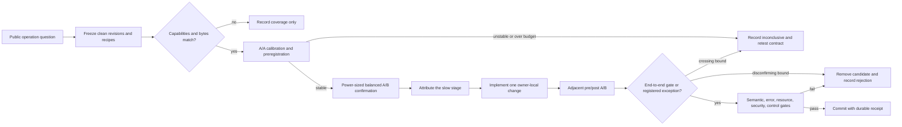
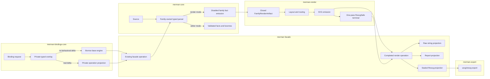

# Runtime Performance Architecture - Plan

## Goal Capsule

| Field | Contract |
|---|---|
| Objective | Turn the post-alpha.3 performance backlog into decision-grade measurement infrastructure and remove proven fixed, repeated, and superlinear work from parsing, layout, rendering, bindings, reporting, and Resvg-safe finalization. |
| Authority | The latest maintainer direction wins, followed by Product Contract requirements, session-settled Key Technical Decisions, Mermaid source-backed semantics, security/resource contracts, and implementation-unit detail. |
| Execution profile | Fearless refactoring is authorized. Breaking internal and public Rust APIs may be replaced, and obsolete helpers, compatibility paths, and duplicate implementations must be deleted after their replacements pass. |
| Stop conditions | Stop only for a scope-changing semantic contradiction, a security/resource invariant that cannot be preserved, or overlapping user changes that require choosing which behavior to keep. A measured hypothesis that misses or cannot decide its preregistered gate is classified with evidence rather than treated as a program blocker. |
| Verification posture | Establish clean, capability-matched baselines first; measure adjacent before/after commits in alternating order; require semantic, error, resource, and security equivalence; then run package and cross-surface regression gates serially. |
| Tail ownership | `ce-work` owns implementation, simplification, review, focused Conventional Commits, and final verification. Do not push, open a pull request, tag, publish, or bump a version unless separately requested. |

---

## Product Contract

### Summary

Merman will gain a trustworthy same-host A/B contract and dedicated benchmark lanes for the runtime paths that existing evidence does not measure.
Qualified hotspots will be removed at their owning boundaries: Flowchart adapter indexing, render-only parser bookkeeping, Kanban label preparation, binding request overlays, string-only report materialization, and Resvg-safe validation.
Every candidate either lands with reproducible latency and correctness receipts, closes as a documented rejected hypothesis, or remains explicitly inconclusive with a bounded retest contract; neither non-accepted result retains speculative production code.

### Problem Frame

The current performance backlog is directionally strong but cannot yet be executed as one reliable optimization program.
`tools/bench/compare_self.py` hard-codes the current `svg` feature for both revisions even though `v0.8.0-alpha.3` uses `render`, reads its corpus only from the head checkout, runs base then head once, and classifies percent-only changes.
Its reports therefore cannot provide decision-grade release-range evidence or distinguish order bias, fixture drift, capability drift, and ordinary noise.

Several benchmark names also overstate what they measure.
The current `parse_known_type` lane exercises the compatibility JSON path instead of the typed render-model parser; the render lane bypasses facade report materialization; text measurement bypasses the production routing/recording layer; Flowchart stress repeats fixed fixtures without a size/density curve; and there are no direct lanes for Swimlane, request-level binding overlays, explicit SVG pipelines, or raster preparation/encoding.

The source review found concrete avoidable work behind those blind spots.
Flowchart cluster adaptation repeatedly scans all edges and performs linear descendant membership checks; Kanban converts, sanitizes, and measures the same labels across layout and SVG emission; several typed render parsers build editor facts and lexeme journals that are discarded; a version-only binding request reparses and reconstructs a complete engine; string-only SVG APIs materialize reports they discard; and Resvg-safe terminal validation parses the complete XML twice before downstream rendering parses it again.
These costs must be removed without changing Mermaid layout algorithms, stable traversal, SVG DOM semantics, parser recovery, resource limits, or the fail-closed rendering boundary.

### Actors

- A1. Native preview, editor, CI, and documentation users need lower warm latency and predictable large-diagram responsiveness without embedding a browser.
- A2. Binding and Node users need request-level options that do not reconstruct unrelated engines when the request changes no behavior.
- A3. Raster and security-sensitive consumers need Resvg-compatible output that cannot regain external-resource, malformed-XML, or resource-limit hazards through a fast path.
- A4. Maintainers need reproducible evidence that separates release-range comparison, adjacent-change causality, stage attribution, cross-runner context, rejected hypotheses, and inconclusive retest work.

### Requirements

**Evidence and admission**

- R1. Every durable performance result names exact base and candidate commits, dirty-state disposition, host/CPU/OS, Rust toolchain, lock digest, Cargo profile/features/codegen flags, executable digest, fixture digest, logical operations/bytes/elements per estimate, warm-up/measurement settings, run order, and raw per-round estimates. Candidate artifacts are built from a private immutable checkout of the named commit, not the mutable worktree. The receipt binds a validator-owned complete local-source scope, Cargo resolve closure, build-controller inputs, Cargo configuration search path, selected tool executables, environment contract, and published artifact tree; same-output concurrent builds are rejected for the complete build lifecycle.
- R2. Same-host comparisons map equivalent capabilities independently for each revision, verify byte-identical inputs before computing a ratio, and classify missing or semantically changed fixtures as coverage rather than speed.
- R3. A decision-grade adjacent-change comparison prebuilds both candidates, then uses a fresh, even, order-balanced AB/BA confirmation schedule whose pair count is derived under R5 and is never fewer than eight. One normalized Criterion point estimate per side within one AB/BA pair is the independent observation. Canonical signed statistics are `r = log(head/base)` and `d = head - base`, so positive values mean regression; the report also renders their negated improvement view. It retains every observation and gives deterministic one-sided 95% confirmation bounds plus order/stability diagnostics. One to four pairs remain diagnostic and cannot admit or reject a candidate.
- R4. Release-range measurements from `v0.8.0-alpha.3` to a frozen clean candidate are historical context. Strict semantic equivalence is required on each optimization's adjacent pre-change/post-change pair, not across unrelated release evolution.
- R5. Before candidate work, the complete runner performs at least eight balanced same-binary A/A pairs and preregisters the exploratory schedule, maximum confirmation budget, minimum detectable effects, and decision rule. For both paired log ratio and absolute delta it estimates A/A dispersion, then computes the next even pair count at or above `max(8, ceil(((z_(1-alpha/family) + z_power) * sigma / MDE)^2))`; an unadjusted one-sided 95% family retains `z_(1-alpha)=1.645`, while a simultaneous family uses its preregistered Bonferroni component quantile. The larger metric-specific count wins. A multi-row suite uses the maximum required count across every required comparable row; a row whose count exceeds the registered cap remains inconclusive. A/A is stable only when identity/zero lies inside its two-sided simultaneous intervals, the complete intervals remain inside the registered equivalence margins, order-effect intervals include zero and remain inside those margins, and the required count fits the cap. Confirmation uses observations not used for exploration. Per row, regression is confirmed only when the lower bounds of both canonical R3 statistics clear their positive thresholds; non-regression is confirmed when the upper bound of either statistic cannot clear its corresponding positive threshold; otherwise regression status is inconclusive. Candidate improvement is the mirrored test: both upper bounds clear the negative thresholds. A deterministic finite paired bootstrap allocates a separate preregistered Monte Carlo failure budget to every simultaneous bound and uses the conservative exact-binomial order-statistic rank; if the registered resample count cannot support that rank, the result is inconclusive rather than using a weaker empirical percentile. Accepted means that improvement test and every mandatory semantic, error, resource, security, host, and control gate pass. Rejected means either the mirrored bounds disconfirm at least one improvement conjunct or a mandatory non-performance gate fails; the receipt records the exact reason. Unstable A/A, a crossing performance interval, or exhausted measurement capability without a mandatory correctness failure is inconclusive. Rejected hypotheses close; inconclusive hypotheses retain an open queue entry, retest conditions, and the next maximum budget. Neither result retains production candidate code. Suite exit priority is fixed as evidence-contract failure `2`, confirmed regression `1`, any required inconclusive row `3`, then complete diagnostic advisory or conclusive non-regression `0`.
- R6. The ordinary admission gate is a greater-than-10-percent and greater-than-50-microsecond normalized end-to-end improvement on the same public operation and input, with both one-sided confirmation lower bounds clearing their thresholds. For Node binding work, that operation is the installed revision-owned product's asynchronous `createNodeEngine().executeOperation()` surface under independently calibrated cold and reused-engine schedules; direct `NativeEngine`/`WasmEngine` timing is owner attribution only and cannot admit production code. A preregistered workload exception must name real call volume, total CPU/wall budget or throughput target, control-noise floor, and memory budget. The current 16.7 ms Flowchart value is an experimental 60 Hz reference, not a product SLO or standalone admission gate. Before it can become an exception, a receipt must freeze the production call-chain evidence, generated input, host state, warm/cold contract, logical operation, and one-sided 95% upper bound over candidate absolute latency; otherwise Flowchart uses the ordinary gate and merely reports distance from the reference.
- R7. Stage and microbench results locate a cause but do not independently admit production code; fixed-repeat stress estimates are normalized by logical operation and are trend/throughput evidence only. A candidate that misses R6 is reverted or never applied, and its durable receipt records whether it was rejected or inconclusive.
- R8. Every accepted change has paired model/layout/SVG or output evidence, deterministic repeated output, exact error-class and first-error evidence, resource-limit evidence, and the applicable DOM, raster, host-measurement, report, or binding contract evidence. Native memory uses a separate instrumented executable with a counting system allocator; latency binaries remain uninstrumented. The live-byte counter runs from process start. After input construction the harness snapshots current live bytes, resets cumulative allocation count/bytes, and sets the peak watermark to current live, so the reported peak is operation-owned live growth over that snapshot. Each registered scale (`1x`, `2x`, `4x`, `10x`, `32x`, `100x`) runs in a fresh process at least five times and pairs each scale/seed/repeat with a zero-work subprocess. Allocation count/bytes and peak growth use paired subtraction; each scale is summarized by the median adjusted repeat. The preregistered slope is ordinary least squares over log scale versus log median, with a deterministic seeded bootstrap that resamples matched repeat vectors and uses its 95th percentile as the upper bound. The absolute cap compares the corresponding deterministic one-sided 95% upper bound of the adjusted `100x` median. A valid non-positive adjusted point, which cannot enter the log fit, is inconclusive (`exit 3`); counter overflow/underflow, allocator protocol damage, unmatched pairs, or malformed output is an evidence-contract failure (`exit 2`). Node binds `process.memoryUsage().rss` and `process.resourceUsage().maxRSS` before product or artifact loading, collects outside timing before every measurement lane, and records both lane-local sampled-current retained growth and a process-global fresh-process envelope spanning load plus execution. Batch-reused, base-size-cold, and base-size-reused curves use the maximum observed process value for `log1p` retained-growth slope, absolute retained growth, and paired head-minus-base regression; a finite Monte Carlo tail may not weaken these bounds. The fresh-process envelope separately caps absolute growth and paired regression, and a historical-max-minus-current gap above one MiB at startup or before any measurement lane is inconclusive because it can hide a transient peak. Native allocator evidence remains mandatory for operation-owned transient attribution. CPU wins may not hide an upper slope above the owner contract, an absolute-cap breach, a regression-budget breach, an unobservable transient, or a scale the harness cannot measure; such evidence is inconclusive, never silently omitted.

**Benchmark coverage**

- R9. Benchmark names distinguish compatibility JSON parsing from typed render-model parsing, reused engines from cold engines, prepared layout from SVG emission, string-only output from report output, and pipeline finalization from raster parsing/encoding.
- R10. Dedicated coverage includes Swimlane, Markdown-heavy and many-card Kanban, production-routed and recording text measurers, binding requests with empty/version-only/real overlays, ResvgSafe finalization with size and data-image curves, raster preparation/encoding, and preregistered six-point Flowchart curves. Flowchart varies nodes, edges, clusters, and depth one factor at a time with fixed controls, plus separate sparse/dense topology cases; it does not collapse those dimensions into one ambiguous scale.
- R11. Native Criterion, Node N-API, Node-WASM, browser-WASM, and cross-renderer measurements remain separate lanes. No geomean or ratio combines different transports, algorithms, capabilities, fixture bytes, or output-quality contracts. Owner-local stage probes remain crate-private or bench/test-only and never expand public APIs or recreate the pipeline outside its owner. Binding attribution stays in the existing Rust lanes; public admission extends the existing installed-product Node worker with isolated processes, schedules, samples, and A/A budgets. Public timing alone supplies the admission statistic; raw semantic and memory status remain mandatory blockers.

**Runtime optimization**

- R12. Large Flowchart work is attributed between adapter preprocessing, Dugong layout, routing, measurement, and SVG emission. Qualified adapter work derives a stable DFS ordinal and subtree interval from Graphlib's compound parent tree for `O(1)` descendant membership, and derives ordered active-edge/incident indexes from original edge ordinals for mutation-safe lookup. Build those indexes once per declared graph phase, update deletions by incident degree, and assign reinsertions their preserved ordinal plus a monotonic current-order tie-breaker; never rebuild the full indexes after each node mutation. Existing descendant vectors remain traversal authority where Mermaid order is observable. Let `D` be total required descendant visits and `M` the total incident-update/ordered-reinsertion work across graph mutations. Membership/boundary/index construction and added index space are `O(V+E+C)`; complete adapter work is charged explicitly as `O(V+E+C+D+M)` rather than pretending the observable `D`/`M` terms disappeared. The design preserves edge order, cluster recursion, geometry, and resource accounting; it does not replace or tune the layout algorithm with fixture-specific constants.
- R13. For every family candidate admitted under R6, typed render parsing does not allocate, sort, deduplicate, validate, or retain editor-only facts and lexeme journals. Each family-owned semantic constructor decides whether to emit its editor projection; render and editor paths retain one family parser, and editor facts, recovery, spans, and errors remain identical. No repository-wide parser/fact framework is introduced.
- R14. Qualified Kanban work prepares each logical section/card label, wrap decision, sanitized XHTML fragment, and measurement once per render operation. Inside `FamilyRenderArtifact`, the private `BuiltinFamilyArtifact::Kanban` variant carries a `FamilyPair<KanbanDiagramRenderModel, KanbanPreparedArtifact>` parallel to Requirement; the prepared type projects unchanged public layout JSON and owns SVG-only label plans. Strict sanitizer behavior remains, and no cross-family label-plan trait, global cache, or syntax classifier is introduced.
- R15. If the binding candidate is admitted under R6, request options are parsed once into a typed overlay owned by `merman-bindings-core`. A valid schema-version-only overlay reuses the immutable base engine; real overlays tighten resources and rebuild only a bindings-private operation projection that still executes through existing facade capabilities. Runtime-policy, URI/operation validation order, option errors, and transport schemas remain unchanged; no bindings-specific public facade executor is added.
- R16. If the no-report candidate is admitted under R6, string-only SVG and no-report pipeline/export entrypoints do not materialize and discard a `RenderOperationReport`. Only report projection/materialization may be skipped: parsing, sanitization, measurement recording, resource accounting, pipeline finalization, error selection, and sealed-type construction execute through the same completed operation as report-returning APIs. No-report terminals may not consume an earlier intermediate or construct a sealed output directly.
- R17. Qualified ResvgSafe work performs general XML/resource validation and terminal Resvg-contract validation in one streaming traversal. Error equivalence covers the complete structured error tuple and preserves global general-validation precedence plus baseline order within each phase. Security decisions use resolved namespace URI plus local name, never prefixes/local names alone; XML/entity and CSS escape interpretation precede one policy-equivalent URL classifier; every reader/resolution/unescape/CSS/URL/data/accounting failure is explicit and fail-closed. All existing byte/depth/element/attribute/text/style/URL work charges, observed values, and bounded buffers remain active after a buffered lower-priority error. Downstream `usvg` parsing is not removed.
- R18. Residual Requirement cost is profiled after the existing operation-scoped label fix. Only a named local operation that clears R6 may change; strict sanitization, public layout JSON, custom measurers, Dugong semantics, and Requirement goldens remain authoritative.

**Lifecycle and cleanup**

- R19. Replaced benchmark meanings, byte-level request merge paths, duplicate render helpers, report-discard terminals, and duplicate final-validation traversal are deleted in the same owning unit that proves their replacement. No deprecated alias or hidden alternate implementation remains.
- R20. `docs/performance/PERF_PLAN.md`, `RUNBOOK.md`, and `BENCHMARKING.md` become consistent with the final tools, accepted changes, rejected hypotheses, inconclusive retest contracts, and current queue. Decision-relevant receipts are checked in; bulky raw output remains under `target/bench`.
- R21. Cargo build/test/bench work runs serially and reuses the normal target directory. Formal sampling begins only after both clean committed candidates are built one at a time from private committed source snapshots with frozen recipes and executable digests; build time and artifact churn never enter runtime ratios, and unrelated dirty files are neither staged nor modified. The builder process and host are trusted: receipts detect ordinary source, recipe, and artifact drift without adding adversarial publication or process-hardening machinery.

### Key Flows

- F1. Decision-grade candidate admission
  - **Trigger:** A maintainer proposes a performance change.
  - **Steps:** Freeze clean revisions and recipes, prebuild/digest executables, verify capabilities and fixture bytes, calibrate A/A noise, measure the public operation in balanced paired rounds, attribute the changed stage, apply the candidate, repeat adjacent A/B, then run equivalence and control gates.
  - **Outcome:** The change is accepted with causal evidence, rejected with disconfirming bounds and no production residue, or marked inconclusive with no production residue plus an open retest contract.
  - **Covered by:** R1-R11, R19-R21

F2-F4 describe the accepted implementation branch. A rejected or inconclusive candidate follows the same public trigger through the reviewed baseline implementation and retains no candidate-only runtime path.

- F2. Native render operation
  - **Trigger:** A1 requests SVG, layout, a report, an explicit pipeline, or raster output.
  - **Steps:** In the accepted branch, detect or accept the type, parse the typed render model without admitted editor-only work, prepare admitted family artifacts, emit SVG, optionally finalize Resvg compatibility, and return only the requested output/evidence.
  - **Outcome:** Accepted repeated work is absent while model, geometry, SVG, errors, limits, and requested report evidence remain correct; otherwise the baseline path remains authoritative.
  - **Covered by:** R8-R10, R12-R18
- F3. Reusable binding request
  - **Trigger:** A2 executes an operation on an existing binding engine.
  - **Steps:** In the accepted branch, resolve operation/URI, parse one typed request overlay, borrow the base engine when behavior is unchanged or construct the one affected operation projection, then execute and serialize stable metadata.
  - **Outcome:** Accepted version-only calls avoid full-engine reconstruction, real overrides retain ceilings and exact errors, and every transport inherits one implementation; otherwise the recursive baseline merge remains authoritative.
  - **Covered by:** R8, R10-R11, R15, R19
- F4. Fail-closed Resvg/raster output
  - **Trigger:** A3 requests Resvg-compatible SVG or a raster/PDF output.
  - **Steps:** In the accepted branch, run ordered sanitizer stages, perform one terminal streaming validation, construct the sealed SVG type, then let the export owner parse/render it.
  - **Outcome:** Accepted valid large SVG avoids one complete validation traversal while malformed, unsafe, external-resource, namespace, and over-budget inputs fail exactly as before; otherwise the reviewed two-pass baseline remains authoritative.
  - **Covered by:** R8-R11, R16-R17, R19

### Acceptance Examples

- AE1. Given alpha.3's `render` feature and the candidate's `svg` feature with byte-identical Flowchart input, the self-comparison runs both recipes, records their manifests/digests, and computes a ratio; using `svg` for alpha.3 fails as a recipe/coverage error rather than reporting a timing.
- AE2. Given same-named fixtures with different bytes or a fixture available on only one revision, the report retains coverage facts and emits no performance ratio for that row.
- AE3. Given an A/A-derived requirement of twelve confirmation pairs, execution order contains six base/head and six head/base pairs using observations not seen during exploration, every raw estimate and pair delta is retained, and classification uses both one-sided bounds. A four-pair run is labeled diagnostic and cannot accept or reject the candidate.
- AE4. Given `parse_known_type/kanban_medium`, compatibility JSON and typed render-model lanes execute different documented entrypoints; the typed lane does not serialize compatibility JSON.
- AE5. Given an admitted Kanban, Mindmap, or Requirement parser candidate and valid/recovering inputs, render-only parsing constructs no editor facts/lexeme batches, while editor parsing returns byte-for-byte-equivalent serialized facts, spans, completeness, and first errors. A rejected or inconclusive family retains the original production parser path.
- AE6. Given an admitted Flowchart candidate and nested clusters with backedges, ports, copied nodes, and repeated descendants, indexed adaptation preserves stable layout JSON, SVG structure/geometry, edge order, work-limit outcomes, and repeated output while its curve removes the attributed superlinear adapter term.
- AE7. Given an admitted Kanban preparation candidate plus Markdown, entities, raw HTML, Unicode, wrapping, ticket/assigned text, strict security, and a recording host measurer, prepared rendering preserves output and logical measurement values/order while intentionally deleting proven duplicate callback invocations and reporting the reduced work truthfully.
- AE8. Given an admitted binding candidate plus empty request options, `{\"version\":1}`, a stricter resource override, a forbidden runtime override, an unknown version, invalid UTF-8, and a missing document URI, bindings preserve validation/error order; the first two borrow the base engine and real overrides construct only the selected operation projection.
- AE9. Given an admitted no-report candidate and the same prepared diagram, string-only SVG equals the SVG bytes inside the report-returning result, pipeline/Resvg-compatible outputs remain equal, report APIs expose the same provenance, and the string path does not call report materialization.
- AE10. Given an admitted ResvgSafe candidate and one SVG containing both an early Resvg-contract violation and a later malformed XML/resource error, fused validation returns the same complete structured error tuple, pass, limit, observed value, and precedence as the two-pass baseline while retaining every work charge.
- AE11. Given an admitted ResvgSafe candidate plus safe fragments, navigation links, namespace aliases, inline raster data images, malformed data images, external file/network resources, deep trees, and oversized SVGs, acceptance/rejection and sealed output are unchanged before and after fusion.
- AE12. Given Requirement medium and a named residual candidate, the change is retained only when adjacent end-to-end A/B clears R6 and all Requirement/custom-measurer/layout/SVG/raster gates pass. A disconfirming upper bound closes it as rejected; a crossing interval removes candidate code but keeps an inconclusive queue entry and retest contract.
- AE13. Given a concurrent dirty security patch in SVG pipeline files, performance commits stage only their own reviewed hunks and do not overwrite, hide, or include the pre-existing changes; if behavior cannot be reconciled, only the overlapping unit stops for maintainer direction.

### Success Criteria

- A same-host comparison can honestly compare `v0.8.0-alpha.3` and a current clean revision despite their different feature vocabularies, and its report contains an A/A noise calibration, a power-derived confirmation count of at least eight balanced pairs, one-sided bounds, fixture/capability/lock/executable provenance, and both absolute and relative gates.
- Every benchmark group measures the entrypoint named by its label; typed parsing, facade report cost, bindings, ResvgSafe, raster, Swimlane, host measurement, and Flowchart scaling no longer rely on proxy benches.
- The representative Flowchart large workload reports a frozen absolute-latency statistic and its one-sided upper bound against the experimental 16.7 ms reference. An admitted adapter candidate clears the ordinary or evidence-backed workload gate; a rejected/inconclusive candidate leaves no production residue and does not claim the end-to-end reference was met.
- Every admitted Kanban, Mindmap, or Requirement parser candidate performs no editor-fact finalization in render mode, while the complete editor fixture matrix remains identical; rejected/inconclusive families retain no production fast-path code.
- An admitted Kanban preparation candidate performs conversion/sanitization/measurement once with no layout/SVG regression; rejection or inconclusive evidence retains the original artifact and no duplicate candidate implementation.
- An admitted binding candidate makes `{\"version\":1}` reuse the base engine and preserves deep-overlay ceilings/errors; rejection or inconclusive evidence retains the original merge path and an honest queue result.
- An admitted no-report candidate skips only discarded report projection while report APIs remain exact; rejection or inconclusive evidence retains the original terminal and no alternate path.
- An admitted ResvgSafe candidate performs one `quick_xml` traversal with the complete security/resource/error contract; rejection or inconclusive evidence restores the reviewed two-pass production path and leaves only reusable lanes plus the required receipt/queue state.
- Requirement residual work has a named profile and an accepted improvement, a disconfirming rejection receipt, or an open inconclusive retest contract; the completed Mindmap, Sequence, config-clone, and Requirement-label fixes are not reimplemented.
- No accepted candidate regresses its preregistered cross-family/control fixtures beyond the measured noise floor, and no obsolete alternate implementation remains.

### Scope Boundaries

- Do not replace Dagre/Dugong/COSE algorithms, change default layout configuration, weaken Mermaid-source-backed semantics, or tune magic numbers to one fixture.
- Do not add a global label/model cache, family allow-list, syntax heuristic, browser fallback, or new public reusable engine solely for benchmark results.
- Do not treat `mermaid-rs-renderer` or Mermaid.js ratios as quality-adjusted rankings or as causal proof for a Merman change.
- Do not redesign binding wire schemas, native ABI versions, transport packaging, or public report payloads beyond migrations strictly required by deleting an obsolete Rust API.
- Do not remove `usvg` parsing or move strict sanitization outside its security owner.
- Do not combine sanitizer-to-terminal data-image decode reuse with U8. That cross-owner optimization requires a separate security model, immutable input identity proof, and independent admission plan.
- Do not include release versioning, changelog finalization, package publication, tag creation, push, or pull-request creation.
- Existing unrelated dirty work, especially the in-progress SVG external-resource hardening, is input to integrate with rather than scope to revert or silently absorb.

### Sources

- `docs/performance/PERF_PLAN.md` is the current triage queue and records the completed Mindmap and Requirement-label optimizations.
- `docs/performance/RUNBOOK.md` and `docs/performance/BENCHMARKING.md` define the current measurement loop and its known release-range feature limitation.
- `docs/performance/renderer_comparison_2026-07-28_75c9fd156_vs_mmdr.md` records the latest committed cross-runner stage context; it is not a current-HEAD A/B.
- `docs/release/ALPHA3_TO_ALPHA4_REFACTORING_REPORT.md` records the historical alpha.3 comparison and capability evolution.
- `tools/bench/compare_self.py`, `tools/bench/test_perf_contracts.py`, `tools/bench/corpus.json`, and `crates/merman/benches/pipeline.rs` are the current self-comparison contract and primary native benchmark surface.
- `crates/merman-render/src/flowchart/layout.rs` and `repo-ref/mermaid/packages/mermaid/src/rendering-util/layout-algorithms/dagre/mermaid-graphlib.js` define the cluster-adaptation behavior and ordering constraints.
- `crates/merman-core/src/diagrams/{kanban.rs,mindmap/parse.rs,requirement.rs}` and `crates/merman-core/src/editor.rs` expose the shared semantic-construction and discarded editor-fact work.
- `crates/merman-render/src/kanban.rs`, `crates/merman-render/src/svg/parity/kanban/render.rs`, and `crates/merman-render/src/requirement.rs` expose the duplicate work and the prepared-artifact precedent.
- `crates/merman-bindings-core/src/{common.rs,engine.rs,operation.rs}` plus `platforms/node/benchmark/corpus.json` expose the version-only request overlay cost.
- `crates/merman/src/svg/{mod.rs,operation.rs}`, `crates/merman-render/src/environment.rs`, and `crates/merman-render/src/svg/pipeline/{mod.rs,final_validation.rs}` expose report materialization and terminal double validation.
- Repository-local multi-agent reviews on 2026-07-28 covered benchmark contracts, parser/model work, layout/render work, bindings/reporting, and end-user/error flows. Durable verification learnings belong in the existing `docs/knowledge/engineering/verification/` hierarchy.

---

## Planning Contract

### Key Technical Decisions

- KTD1. **Measure before changing production code.** Benchmark fidelity and candidate-specific lanes land before runtime optimizations. Each later unit owns an adjacent pre/post A/B and may close with a rejection receipt when its gate fails, or an inconclusive receipt and explicit retest contract when the evidence budget cannot decide. (session-settled: user-approved - chosen over speculative optimization: the maintainer approved the measurement-first performance review and asked to implement its full program.)
- KTD2. **Delete superseded architecture in the same migration.** Breaking Rust API changes, helper removal, benchmark renames, and compatibility-path deletion are authorized once replacement tests pass. (session-settled: user-directed - chosen over compatibility-preserving incremental patches: the maintainer authorized fearless refactoring, breaking changes, and deletion of obsolete code.)
- KTD3. **Make comparison recipes two-sided and evidence complete.** Base and head each own package, bench, feature, toolchain, target, and fixture provenance. The runner prebuilds and digests both executables, calibrates balanced same-binary A/A pairs, derives an even confirmation count with the R5 one-sided alpha/power rule, and spends a fixed maximum budget. It reports deterministic seeded paired-bootstrap one-sided 95% bounds over normalized per-pair absolute deltas and log-ratios, applies Bonferroni family allocation plus exact-binomial conservative ranks to finite Monte Carlo quantiles, retains all inputs, keeps exploration and confirmation disjoint, and never infers equivalence from a shared current CLI flag or samples until a favorable outcome appears.
- KTD4. **Separate release history from optimization causality.** The alpha.3 range establishes context and finds candidates. An adjacent clean-commit pair proves each optimization and carries the strict equivalence gate, preventing unrelated Mermaid parity evolution from being mislabeled as a regression or fix.
- KTD5. **Preserve ordered semantics while indexing Flowchart membership.** Keep existing descendant vectors and edge ordinals as Mermaid/Dagre traversal authority. Add a private stable DFS ordinal/subtree-range index over the compound parent tree for membership plus original-order active-edge/incident indexes for lookup. Build one complete index per declared graph phase; within a phase update deletions by incident degree and give reinsertions a preserved ordinal plus monotonic current-order tie-breaker, never a per-node full rebuild. Charge required descendant traversal as `D` and mutation updates/reinsertions as `M`; only membership/boundary/index construction and added space claim `O(V+E+C)`. This avoids one membership set per cluster, whose added space would grow with total descendant incidence. Rejected: replacing Dugong, relying on hash iteration order, hiding `D`/`M`, or weakening work accounting.
- KTD6. **Keep conditional fact emission family-owned.** Each proven family adds the smallest disabled/no-op emission mode at its existing semantic-constructor boundary while retaining common tokenization, recovery, spans, and errors. Kanban, Mindmap, and Requirement are admitted and migrated independently. Rejected: a second render parser, a shared performance crate, or a repository-wide fact-sink framework.
- KTD7. **Prepare Kanban labels inside the existing closed render artifact.** Replace the layout side of private `BuiltinFamilyArtifact::Kanban` with a Kanban prepared artifact, following `RequirementPreparedArtifact`, and project its public layout separately from SVG-only sanitized XHTML, wrapping, metrics, and associations. Duplicate host callbacks may disappear; retained logical callbacks and errors stay deterministic and reports describe the reduced work. Rejected: a new public artifact type, cross-family label traits, global caches, public layout-shape changes, or sanitizer bypasses.
- KTD8. **Represent binding request changes as a bindings-private typed overlay.** Before deletion, the existing recursive JSON merge is a test-only differential oracle. The typed overlay preserves missing/null/value for every nested field, recursive object merge, non-object replacement, analysis/merman wrapper normalization, unknown/duplicate-field behavior, runtime-policy rejection, and resource-ceiling order. `merman-bindings-core` borrows the engine for no-op overlays and builds only a private selected-operation projection for real overrides that still executes existing facade capabilities. Rejected: a bindings-specific facade executor, exact-byte/string shortcuts, and production merge-serialize-reparse cycles.
- KTD9. **Skip only facade-owned report projection.** No-report facade terminals consume the same fully completed operation, security checks, resource accounting, measurement recording, and sealed-output construction as report-returning terminals; only `RenderOperationReport` projection/materialization is omitted. An uninstrumented render environment or earlier-intermediate shortcut is a separate hypothesis and cannot ride along.
- KTD10. **Fuse terminal validation without collapsing security phases.** After an immutable security baseline is reviewed, one streaming state machine performs general XML/resource and Resvg checks, resolves expanded names before policy decisions, decodes XML/CSS escapes before one URL classifier, preserves every resource charge, and buffers lower-priority violations while continuing higher-priority accounting. The complete structured error tuple and historical within-phase/global precedence are differential-oracle contracts. Rejected: deleting terminal validation, treating `usvg` as the validator, silently accepting parse/resolution failures, or sharing a parsed tree across crates without separate evidence.
- KTD11. **Keep accepted, rejected, and inconclusive distinct.** Accepted candidates clear both performance bounds and every mandatory semantic, error, resource, security, host, and control gate, then land. A rejected candidate either has disconfirming performance bounds or fails a mandatory non-performance gate, records that exact reason, leaves no production code, and closes its hypothesis. An inconclusive candidate has undecided statistical or measurement evidence without such a correctness failure and also leaves no production code, but its queue item stays open with the unstable condition, retest trigger, and next maximum budget. Completing an execution unit never upgrades inconclusive evidence into rejection.
- KTD12. **Keep commits attributable in a shared dirty worktree.** Snapshot overlapping diffs before editing, work serially, stage exact files/hunks only, and commit each independently verified unit. Clean A/B checkouts derive from one immutable owner manifest: common commit tree, ordered patch digests when an explicitly approved dirty patch is unavoidable, fixture/error snapshot digests, and resulting tree digest. Both sides use the same non-candidate patch stack. If that manifest cannot be approved and reproduced, the overlapping unit waits for the authoritative change to be committed. No reset, restore, stash, clean, branch switch, or automatic merge may disturb the maintainer's current worktree.
- KTD13. **Separate binding admission from owner attribution without duplicating harness infrastructure.** Keep the raw `NativeEngine`/`WasmEngine` request-overlay lane as non-admission attribution. Reuse the existing installed-product worker and candidate assembly path to measure asynchronous public `createNodeEngine().executeOperation()` in separate processes and schedules, with revision-owned facade sources and no browser fallback. Share receipt, statistics, and report-contract helpers instead of creating a second provenance stack. Public timing alone decides the performance conjunct; raw semantic, counter, and memory failures remain mandatory blockers.

### High-Level Technical Design

These sketches define ownership and evidence flow. They do not prescribe exact Rust types or signatures.

#### Candidate lifecycle



#### Runtime ownership after refactoring

This diagram is the conditional accepted target. Rejected or inconclusive units keep their reviewed baseline node/path and do not expose the candidate-only node shown here.



Dependency direction remains `merman-bindings-core -> merman facade -> merman-render -> merman-core`, with `merman facade -> merman-export -> merman-render` for export. Optimization helpers stay inside their owning crate; no shared performance crate or public performance-only API is introduced.

### Assumptions

- A clean pre-optimization baseline can be frozen at or after commit `7580d5d24d84369451e15058fe22c6f51cdb6710`; this is an unvalidated starting point and every receipt must replace it with the actual committed candidate used.
- The current macOS host is stable enough for decision-grade same-host runs when Cargo activity is serialized. U1's A/A calibration determines a fixed exploratory and confirmation schedule within a preregistered maximum budget; noise above the detectable effect produces an inconclusive result rather than extra sampling or a relaxed gate.
- Binding schema version `1` without other fields is behaviorally identical to an empty request after it has been validated. U6 must disprove this assumption with contract tests before using the borrow path.
- Removing proven duplicate Kanban host-measurer callbacks is an intentional operational breaking change; the callback contract is logical measurement, not a guarantee of redundant invocation count.
- The in-progress SVG external-resource hardening will remain authoritative. U8 is hard-blocked until that behavior has an immutable reviewed baseline: either a commit, or a maintainer-approved exact diff plus fixture and structured-error snapshots. Any overlapping change after that freeze invalidates U8's evidence and requires a new baseline.
- There is no release-stability requirement for obsolete Rust-only helpers or benchmark names. Transport wire versions, security types, and documented output behavior remain governed contracts.

### Implementation Constraints

- Use `apply_patch` for manual edits and keep code/document comments in English.
- Preserve insertion/traversal order explicitly; never expose `HashMap`/`HashSet` iteration as output order.
- New indexes must be included in Flowchart work-unit and memory curves so CPU wins cannot silently bypass resource policy.
- Structured options and XML must be handled by `serde` and `quick_xml`, not ad hoc string inspection.
- Candidate-specific instrumentation stays test/bench-only or behind existing report mechanisms; no timing branch may affect deterministic output.
- Avoid new dependencies unless existing crates cannot express the measured solution and the dependency/size cost is included in the receipt.
- Run `cargo fmt`, `nextest`, Clippy, and benchmarks serially; do not start multiple Cargo processes or use a second repository target directory for ordinary development.
- Existing user changes are never reverted or hidden. If an implementation touches a dirty file, preserve an initial diff and stage only the new reviewed delta.

### Risks and Mitigations

| Risk | Consequence | Mitigation |
|---|---|---|
| Order, thermal, or concurrent-build bias | A false performance win lands. | Prebuilt digested binaries, same-binary A/A calibration, balanced paired rounds, serial Cargo, confidence/order diagnostics, and a preregistered maximum budget that returns inconclusive when noise is material. |
| Fixture/capability drift | A ratio compares different work. | Per-side recipes, byte digests, manifest/lock provenance, coverage-only classification, and adjacent-candidate equivalence. |
| Flowchart indexes increase memory or change order | Large diagrams move differently or exceed resource ceilings. | Ordered vectors remain authoritative, private membership/index structures are memory-measured, and exact layout/SVG/work-limit fixtures gate the change. |
| Disabled fact sinks skip parser behavior | Render and editor errors diverge. | One constructor, no-op emissions only, paired recovering/invalid fixtures, serialized editor-fact snapshots, and construction counters. |
| Prepared Kanban labels change stateful host behavior | Geometry or host callback failures change. | Define logical callback semantics, use recording/failing measurers, preserve retained call order/results, and document intentional duplicate-call removal. |
| Typed request overlay changes validation order | Bindings expose different status/error behavior or weaken ceilings. | Characterize operation/URI/options ordering first; property/boundary tests cover empty, version-only, malformed, unknown, runtime, and resource overlays across one-shot and reusable engines. |
| Fused validation changes the first error | Unsafe or malformed SVG is misclassified. | Dual-invalid precedence fixtures, buffered lower-priority violations, unchanged pass identifiers, hostile corpus, and raster smoke tests. |
| Fast paths skip security, reporting, or accounting work | Successful bytes look equal while failure or evidence semantics change. | Compare complete stage traces and structured errors; no-report may skip only facade projection, and fused validation must retain all charges after a buffered error. |
| CPU improvements hide allocation or peak-memory growth | Large inputs improve latency but exhaust memory or resource budgets. | Use the isolated native allocator harness at `1x`, `2x`, `4x`, `10x`, `32x`, and `100x`; require owner-specific slope and absolute bounds before admission. |
| Concurrent dirty security work overlaps U8 | A performance commit absorbs or overwrites unrelated behavior. | Execute U8 last among overlapping owners, snapshot the initial diff, integrate only after behavior is stable, and stop that unit if exact hunk ownership cannot be proven. |

### Open Questions

#### Resolved During Planning

- Breaking changes and deletion are authorized; KTD2 governs the migration.
- The full reviewed performance program is in scope; KTD1 and KTD11 govern measured acceptance and rejection.
- The ordinary threshold is end-to-end `>10% AND >50 us`. A complete public operation with a frozen baseline below 500 us may preregister the noise-adaptive low-latency formula from `BENCHMARKING.md`; this is the reachable gate for operations whose total baseline is itself below 50 us. Flowchart or another workload-specific exception still requires an explicit call-volume/throughput/CPU/memory contract and the complete production call-chain, input, host, lifecycle, statistic, and confidence-bound evidence required by R6; otherwise 16.7 ms remains a reference only.
- Duplicate Kanban host callbacks may be removed; logical measurement and error semantics remain.
- Report skipping covers every public no-report string/sealed-output path, but does not automatically disable measurement collection.
- Resvg optimization starts inside `merman-render`; cross-crate parsed-tree reuse requires a separate qualifying profile.
- Sanitizer-to-terminal data-image decode reuse is excluded from this program because it crosses security ownership and requires an independent identity/TOCTOU design.

#### Deferred to Implementation Evidence

- The exact Flowchart adapter term and index memory crossover are resolved by U4's owner-local curves.
- Whether Mindmap and Requirement also clear the render-only fact-emission gate is resolved independently by U11 and U12; Kanban remains the mandatory U3 experiment.
- The exact Requirement residual operation is resolved by U9's owner-local profiling; no implementation choice is authorized before that evidence.

---

## Implementation Units

### Execution Priority

| Order | Unit | Depends on | Exit |
|---:|---|---|---|
| 1 | U1. Decision-grade self-comparison contract | none | Tool tests prove two-sided recipes, A/A calibration, balanced pairs, byte gates, confidence bounds, and dual thresholds. |
| 2 | U2. Shared lane, provenance, and memory contracts | U1 | Common naming/manifests and an isolated native memory harness are executable; owner candidates are not globally blocked on unrelated lanes. |
| 3 | U4. Flowchart adapter scaling | U2 | Accepted work removes the qualified term and passes memory/equivalence gates, or rejected/inconclusive work leaves only evidence and an exact reference-budget status. |
| 4 | U3. Kanban render-only fact emission | U2 | An accepted candidate skips bookkeeping with identical editor behavior; rejection/inconclusive evidence leaves the original parser and no candidate code. |
| 5 | U11. Mindmap render-only fact emission | U2 | An accepted candidate lands independently; rejection closes it and inconclusive evidence keeps an open retest contract, both without candidate code. |
| 6 | U12. Requirement render-only fact emission | U2 | An accepted parser candidate lands independently; rejection/inconclusive evidence leaves no candidate code. |
| 7 | U5. Kanban operation-scoped preparation | U2 | Accepted preparation removes duplicate work with exact output/memory/host contracts; rejection/inconclusive evidence leaves the original artifact only. |
| 8 | U6. Typed binding request overlays | U1, U2 | Accepted overlays pass the differential oracle and preserve its proven semantics while staying operation-local; rejection/inconclusive evidence leaves the original production merge only. |
| 9 | U7. No-report SVG terminals | U2 | An accepted facade path skips only report projection; rejection/inconclusive evidence leaves the original terminal only. |
| 10 | U8. One-pass ResvgSafe validation | U2, immutable reviewed security baseline | An accepted traversal preserves every contract; rejection/inconclusive evidence restores the two-pass production path and removes candidate code. |
| 11 | U9. Requirement residual closure | U2 | A qualified fix lands, a rejected hypothesis closes, or an inconclusive hypothesis keeps an explicit retest contract; no unqualified code remains. |
| 12 | U10. Integration, documentation, and review | U3-U9, U11-U12 | Aggregate evidence, docs, full tests, review, and staging audit close the program; production cleanup remains owner-unit work. |

### U1. Make self-comparison decision-grade

- **Requirements:** R1-R8, R19-R21; AE1-AE3
- **Files:** `tools/bench/compare_self.py`, `tools/bench/compare_mermaid_renderers.py`, `tools/bench/corpus_utils.py`, `tools/bench/render_perf_comment.py`, `tools/bench/test_perf_contracts.py`, `.github/workflows/performance.yml`, `docs/performance/BENCHMARKING.md`, `docs/performance/RUNBOOK.md`.
- **Approach:** Replace the shared hard-coded runner recipe with explicit base/head package, bench, feature, toolchain, target, and corpus roots. Reuse structured Criterion discovery and byte helpers. Prebuild/digest both clean candidates and exclude builds. Add balanced A/A, the R5 power-derived fresh confirmation schedule, fixed cap, logical-operation normalization, paired one-sided bootstrap bounds, and three result classes. Apply R5's canonical per-row regression/non-regression/inconclusive rules and suite-wide sample count. Define the process contract with strict aggregate precedence: exit `2` for any recipe/digest/fixture/runner/no-comparable contract failure, else `1` for any confirmed regression, else `3` for any required statistically inconclusive row, else `0` for a complete diagnostic advisory or suite-wide conclusive non-regression. Diagnostic timing movement never changes the exit code, but contract failures remain nonzero in every mode. Candidate admission consumes each row's mirrored confirmed-improvement fields rather than inferring acceptance from suite exit `0`. Update the PR comment consumer to render schema version, evidence quality, absolute/relative bounds, and accepted/rejected/inconclusive wording rather than old geomean/mid-estimate claims.
- **Test scenarios:** Alpha.3 `render` versus head `svg`; prebuild/digest mismatch; A/A identity/order/width pass and fail; power-derived counts below/at/above cap; reversed starting side; invalid odd/unbalanced schedules; diagnostic one-to-four-pair schedules; independent confirmation samples; accepted/rejected/inconclusive relative-and-absolute boundaries; fixed-repeat normalization; no comparable rows; one failed pair; fixture mismatch; missing bench; invalid recipe; lock digest change; report schema upgrade/unknown version; Markdown and sticky-comment state/exit-code matrix.
- **Verification:** Python contract tests pass; report fixtures demonstrate exact recipes, A/A calibration, derived sample count, pair-level raw data, one-sided bounds, normalization, and every exit state; a dry discovery against alpha.3 lists shared benches using `render` without timing the suite; workflow inputs and sticky summary expose both threshold dimensions and evidence quality without turning diagnostic timing noise into a PR failure.
- **Deletion:** Remove hard-coded `features="svg"`, single-run-only report fields, percent-only classification, and prose that treats quick mode as sufficient evidence.

### U2. Establish shared lane, provenance, and native memory contracts

- **Requirements:** R1, R5, R8-R11, R19-R21
- **Files:** `crates/merman/benches/pipeline.rs`, a dedicated native memory bench binary and support module under `crates/merman/benches/`, `crates/merman/Cargo.toml`, `tools/bench/corpus.json`, `tools/bench/corpus_utils.py`, a native memory subprocess driver under `tools/bench/`, `tools/bench/perf_runner.py`, `tools/bench/test_perf_contracts.py`, and a frozen baseline manifest under `docs/performance/`.
- **Approach:** Define canonical lane names and metadata for public operation, owner-local diagnostic stage, cold/reused lifecycle, fixed-repeat divisor, size vector, output dimensions, and transport. Rename existing compatibility `parse_known_type` history to its JSON meaning without yet adding candidate lanes. Add a separate native instrumented binary whose counting `System` allocator implements R8's live-byte snapshot, cumulative-counter reset, incremental peak watermark, checked accounting, and machine-readable protocol. The driver launches matched operation/zero-work subprocesses for every scale/seed/repeat, validates six fixed scales and at least five repeats, pairs and subtracts them, computes per-scale medians, deterministic seeded-bootstrap OLS slope UCB, and the max-scale absolute-cap UCB; latency runs use a different uninstrumented executable. Freeze the common pre-optimization commit/patch-stack manifest and common A/A recipe. Each owner unit then begins with only its own public lane, private probe, scale generator, memory bound, and experiment-qualification receipt; no candidate waits for unrelated Node, raster, or family coverage, and only its adjacent confirmation decides final admission.
- **Test scenarios:** Existing misleading parse name migrates without losing history; lane metadata rejects missing public operation, ambiguous lifecycle, zero divisor, or mixed transports; instrumented and latency binaries are distinct; live-byte snapshot and peak reset exclude input setup; matched scale/seed/repeat zero-work subtraction; fresh-process isolation; six scale points and repeat count; deterministic median/bootstrap/OLS fixtures; valid non-positive adjustment returns inconclusive; counter overflow/underflow, unmatched pairs, and malformed protocol return contract failure; slope and absolute-cap pass/fail/inconclusive; manifest commit/patch/fixture/tree digest mismatch; owner-local probes cannot expand public APIs.
- **Verification:** Python contract tests and benchmark-list smoke pass; native memory fixtures prove exact checked allocation/live/peak output, paired subtraction, per-scale medians, seeded slope and max-scale UCBs, and fail-closed protocol handling; the frozen manifest records actual SHA/recipe/executable and patch-stack digests. U2 reports experiment infrastructure readiness, not candidate admission, and owner units can add/run their lanes independently.
- **Deletion:** Remove or rename shared misleading benchmark meanings and fixed-repeat code that lacks a logical-operation divisor; candidate-specific obsolete lanes are deleted only by their owner unit.

### U4. Remove superlinear Flowchart adapter scans

- **Requirements:** R6-R8, R12, R19-R21; AE6
- **Files:** `crates/merman/benches/flowchart_stress.rs`, Flowchart fixtures/generators and public-operation memory registration, `crates/merman-render/src/flowchart/layout.rs`, owner-local adapter/Dugong stage probes and tests, Flowchart resource/work-unit accounting, layout/parity tests, and the dated candidate receipt.
- **Approach:** First add the Flowchart public curve, owner-local adapter/Dugong attribution probe, one-factor six-point generators, memory bounds, and experiment-qualification receipt. For a qualified candidate, compute stable DFS ordinals/subtree intervals from the compound parent tree so descendant membership does not copy one set per cluster. Build original-order edge ordinals plus active/incident indexes once per declared graph phase, update node deletion by incident degree, and preserve mutation-sensitive reinsertion order with the original ordinal plus a monotonic current-order tie-breaker; never perform a full index rebuild after each node mutation. Use a tree-difference or equivalent linear pass for cluster boundary facts rather than a cluster-by-edge scan. Keep existing descendant vectors where traversal order is semantic, charge `D` and `M` separately under R12, and include all construction/work/memory costs. Accept only a candidate that clears R6/R8; rejection or inconclusive evidence removes the indexes and leaves the lane/receipt. Report 16.7 ms only as the frozen experimental reference unless U4 records the production SLO evidence required by R6.
- **Test scenarios:** Empty/single/nested clusters; siblings; deep chains; dense cross-cluster edges; backedges; ports; copied nodes; synthetic cluster IDs; safe-anchor selection; repeated edge labels; work-limit boundary; deterministic repeated layouts; small/medium controls; memory crossover at low and high cluster counts.
- **Verification:** Exact layout JSON and SVG structure/geometry signatures match the adjacent baseline; full Flowchart family/parity/resource tests pass; six-point allocation/peak curves stay within the registered slope/absolute bounds; the power-sized confirmation clears the public-operation gate for accepted code and always reports the reference upper bound exactly; no control crosses its noise budget.
- **Deletion:** For accepted code, remove linear membership helpers, repeated full-edge discovery loops, stale work estimates, and temporary probes. For rejected/inconclusive code, remove the entire production candidate and retain only reusable lanes plus the correct receipt/queue state.

### U3. Disable Kanban editor bookkeeping in typed render parsing

- **Requirements:** R6-R10, R13, R19-R21; AE4-AE5
- **Files:** `crates/merman/benches/pipeline.rs`, Kanban parse/end-to-end fixtures and memory registration, `crates/merman-core/src/editor.rs` only for an existing Kanban-owned seam, `crates/merman-core/src/diagrams/kanban.rs`, owner-local emission counters, Kanban parser/editor tests, and the candidate receipt.
- **Approach:** First add truthful typed-model parse and public end-to-end lanes, owner-local fact/finalization counters, six-point memory bounds, and an experiment-qualification receipt. If qualified, add at Kanban's existing semantic constructor the smallest family-owned fact-emission mode that makes lexeme/fact push, allocation, sorting/deduplication, overlap validation, cloning, and recovery annotation no-ops for typed render output while keeping tokenization, semantics, recovery, spans, and editor projection common. Do not generalize it into a shared parser framework; rejected/inconclusive evidence removes the mode and U11/U12 decide independently.
- **Test scenarios:** Valid, empty, Unicode, comments/directives, malformed header, mid-document recovery, unterminated block, overlapping/invalid lexeme protection on editor mode, exact serialized facts and first errors, single-construction counters, render-mode fact/finalization counters at zero, JSON and typed model equality where their projections overlap.
- **Verification:** `merman-core`, analysis/editor integration, and Kanban parser suites pass; accepted typed parse/end-to-end confirmation clears R6; six-point memory curves pass R8; cold/reused lanes agree and controls remain within noise. Rejected/inconclusive results prove the original production path is restored.
- **Deletion:** For accepted code, remove Kanban wrappers that construct/discard facts, duplicate semantic-source adapters, and unreachable branches. Otherwise remove all production candidate code and probes not retained as reusable evidence.
- **Outcome (2026-07-29):** Rejected. A temporary family-local no-fact upper-bound probe saved about 1.0 us (2.49%) on the accepted 40.71 us public path, below the 4.07 us and 10% low-latency thresholds. The candidate was removed; see `docs/performance/runtime_hypothesis_closures_2026-07-29.md`.

### U11. Qualify Mindmap render-only fact emission independently

- **Requirements:** R6-R10, R13, R19-R21; AE5
- **Files:** `crates/merman/benches/pipeline.rs`, Mindmap parse/end-to-end fixtures and memory registration, `crates/merman-core/src/diagrams/mindmap/parse.rs`, owner-local counters, Mindmap parser/editor tests, and the candidate receipt.
- **Approach:** First add Mindmap public typed parse/end-to-end lanes, owner-local fact/finalization counters, six-point memory bounds, and an experiment-qualification receipt distinct from the completed simple-label fast path. If it clears R6 or a specified high-volume contract, add only a Mindmap-owned emission mode at the existing constructor while retaining one tokenizer, recovery path, span calculation, and editor projection. Do not reuse Kanban types solely for consistency. Rejection closes the hypothesis; inconclusive evidence keeps an open retest contract; neither retains the mode.
- **Test scenarios:** Valid roots and deep trees; indentation variants; icons/classes/Markdown; Unicode; comments/directives; malformed/recovering lines; unterminated constructs; exact serialized facts, lexemes, spans, completeness, and first errors; render-mode emission/finalization counters at zero; typed model equality; simple-label control.
- **Verification:** Mindmap core/editor/integration suites pass; accepted work clears the power-sized public confirmation and six-point memory bounds; rejected/inconclusive results leave no production branch or generic sink and carry the correct queue state.
- **Deletion:** Remove only Mindmap-owned discarded-fact wrappers or unreachable branches proven obsolete; remove all rejected/inconclusive production instrumentation.
- **Outcome (2026-07-29):** Rejected by upper bound. The complete 11.956 us typed parser is smaller than the public path's optimistic 15.526 us minimum saving, so its fact subset cannot qualify. No candidate or tests were added; see `docs/performance/runtime_hypothesis_closures_2026-07-29.md`.

### U12. Qualify Requirement render-only fact emission independently

- **Requirements:** R6-R10, R13, R19-R21; AE5
- **Files:** `crates/merman/benches/pipeline.rs`, Requirement parse/end-to-end fixtures and memory registration, `crates/merman-core/src/diagrams/requirement.rs`, owner-local counters, Requirement parser/editor tests, and the candidate receipt.
- **Approach:** Separate parser bookkeeping from U9's render/layout residual. First add truthful public typed parse/end-to-end lanes, counters, six-point memory bounds, and an experiment-qualification receipt. If the typed parse or specified high-volume operation clears R6, add the smallest Requirement-owned emission mode so render-only parsing does not allocate/finalize editor facts. Preserve semantic events, recovery, spans, errors, and editor output; do not couple this unit to label preparation or Dugong. Rejected/inconclusive results remove the mode and differ only in queue closure.
- **Test scenarios:** Requirement, element, relationship, and property variants; long descriptions; Unicode; comments/directives; malformed blocks and recovery; exact facts/lexemes/spans/completeness/first errors; render-mode emission/finalization counters at zero; typed model equality; existing prepared-label controls.
- **Verification:** Requirement core/editor/integration suites pass; accepted parser work clears the power-sized public confirmation and six-point memory gates without changing U9 render profiles; rejected/inconclusive work leaves no production mode or shared abstraction.
- **Deletion:** Remove only Requirement parser wrappers or branches made obsolete by the accepted family-owned path; remove all rejected/inconclusive candidate code and probes.
- **Outcome (2026-07-29):** Rejected by upper bound. The complete 5.487 us typed parser is smaller than the public path's optimistic 18.155 us minimum saving, so its fact subset cannot qualify. No candidate or tests were added; see `docs/performance/runtime_hypothesis_closures_2026-07-29.md`.

### U5. Prepare Kanban labels once per operation

- **Requirements:** R6-R10, R14, R19-R21; AE7
- **Files:** the existing `pipeline` lane, `crates/merman-render/src/kanban.rs`, `crates/merman-render/src/family.rs`, `crates/merman-render/src/svg/parity/kanban/render.rs`, existing Kanban render tests, and the candidate receipt.
- **Approach:** Characterize the existing public lane and host calls first. If qualified, change private `BuiltinFamilyArtifact::Kanban` to `FamilyPair<KanbanDiagramRenderModel, KanbanPreparedArtifact>`; retain only cross-stage section/card-title XHTML and compact geometry, project the unchanged public layout, and measure SVG-only ticket/assigned labels once inside SVG emission. Do not duplicate raw source or add a cache, cross-family trait, benchmark runner, or artificial scale fixture.
- **Test scenarios:** Reuse existing Markdown, HTML/sanitizer, wrapping, Unicode, ticket/assigned, Look/theme, viewport, host-measurer, empty-label, and canonical layout/SVG coverage. Extend an existing test only when the new ownership boundary creates a previously uncovered invariant.
- **Verification:** Existing Kanban semantic/layout/SVG/Look/security tests pass; the recording host path proves one detail measurement per logical label; the power-sized public confirmation clears the low-latency gate; the artifact has a bounded operation-local representation and does not move SVG-only measurements into layout. A rejected/inconclusive candidate restores the original artifact.
- **Deletion:** For accepted code, remove duplicate SVG-side Markdown/sanitizer/measurement helpers and the unprepared family branch. Otherwise remove the prepared type and every candidate-only helper.

### U6. Replace binding JSON merge/rebuild with typed request overlays

- **Requirements:** R6-R8, R10-R11, R15, R19-R21; AE8
- **Files:** `crates/merman-bindings-core/src/common.rs`, `engine.rs`, `operation.rs`, operation-owned render/analysis/ascii request modules, focused unit/contract tests, the existing installed-product `platforms/node/scripts/benchmark/worker.mjs` and `run.mjs`, private Criterion/allocation probes, memory registration, and the dated candidate receipt.
- **Approach:** Keep Rust Criterion and allocation lanes for empty, version-only, and real overlay attribution. Add one request-overlay mode to the existing installed-product worker and reuse its candidate assembly, build receipts, statistics, and report validation; do not create another manifest, runner, worker, receipt format, or provenance stack. Product assembly, semantic preflight, request-object creation, and disposal stay outside the declared interval; public request validation/encoding, async settlement, wire decode, and result projection stay inside it. Preserve the recursive JSON merge as a test-only differential oracle with explicit missing/null/value semantics. If the public candidate qualifies and mandatory raw gates pass, store validated typed base options/ceiling alongside the immutable engine. Parse request bytes once into a private request-overlay type, borrow the base engine for empty/version-only overlays, and build only a bindings-private operation projection for a real resource delta. Keep operation and URI validation order, one-shot behavior, errors, and transport schemas unchanged.
- **Test scenarios:** Empty and whitespace-free version-only requests; reordered/pretty JSON; recursive object merge and scalar/array/null replacement; top-level versus analysis/merman wrappers; unknown/future/missing/duplicate fields as governed; invalid UTF-8/JSON; forbidden runtime policy; top-level and wrapped resources; null/unknown/out-of-scope/widening/tightening limits; host measurer propagation; every operation kind; document URI missing/invalid; one-shot versus reusable errors; N-API and WASM output/error signature equality; request-size and base-engine-size isolation.
- **Verification:** Bindings-core and transport contract suites pass; one table-driven differential oracle covers missing/null/value merge behavior and representative error classes; allocation/construction counters prove no merged serialization or replacement engine for version-only. The existing public worker uses committed facade sources plus the receipt-bound artifact digest and rejects browser fallback. One delayed-Promise test proves timing awaits settlement; existing transport suites retain broad semantic/error coverage. Raw timing never sets admission, and a raw semantic or memory failure blocks a public latency win. Accepted work clears the power-sized public confirmation and bounded request/base-size memory curves; rejected or inconclusive work removes candidate production code and records the result.
- **Deletion:** Remove the duplicate request-overlay Node manifest, runner, worker, receipt schema, and their large contract suite. For accepted production code, also remove `merge_request_options`, stored raw base JSON where no longer authoritative, repeated parse/serialize/reparse helpers, whole-engine request reconstruction, and the temporary oracle. For rejected/inconclusive code, remove the typed overlay and candidate-only helpers while retaining the original production merge.

### U7. Add no-report terminals for string and sealed outputs

- **Requirements:** R6-R10, R16, R19-R21; AE9
- **Files:** `crates/merman/benches/pipeline.rs`, `crates/merman/src/svg/operation.rs`, `crates/merman/src/svg/mod.rs`, facade/prepared-render/report/export tests, direct Swimlane public-operation fixtures, private report-projection counters, memory registration, and the dated candidate receipt.
- **Approach:** First add public string/report/pipeline/Resvg-compatible operation lanes, with a direct Swimlane end-to-end lane as facade coverage/control, plus private report-projection counters, six-point memory curves, and an experiment-qualification receipt. If qualified, trace every public no-report SVG/pipeline/Resvg-compatible/export entrypoint to the same fully completed facade operation used by its report-returning peer. Add facade-owned terminal projections that move out the already-final SVG/sealed output directly and reserve `RenderOperationReport` construction for APIs that return or expose it. Parsing, sanitization, measurement recording, resource accounting, pipeline finalization, error selection, and sealed-type construction remain identical and in the same order. Do not add a render-environment mode or consume an earlier intermediate. Atomic-counter/session instrumentation is a separate future hypothesis.
- **Test scenarios:** Raw SVG, prepared SVG, direct Swimlane SVG/report control, custom environment, explicit readable/ResvgSafe pipeline, sealed Resvg output, PNG/JPEG/PDF handoff, success/failure, custom time/runtime providers, host measurer, report provenance/counts, repeated byte equality, and compile-time sealed-type restrictions.
- **Verification:** Facade, prepared-render, pipeline, export, and report suites pass; success/failure stage traces match exactly except for final report projection; instrumentation proves report materialization is absent only on no-report paths. An accepted candidate clears the power-sized public-operation confirmation and six-point memory gates. Rejected/inconclusive evidence restores the original terminal, removes candidate-only code, and retains reusable lanes plus the correct receipt/queue state.
- **Deletion:** For accepted code, remove report-then-discard conversions, redundant extraction wrappers, and temporary counters. For rejected/inconclusive code, remove the no-report candidate and its production-only helpers.
- **Outcome (2026-07-29):** Rejected. The minimal raw-string terminal saved 0.391 us (9.76%) on the smallest public Info path, below the 1 us and 10% low-latency minima. The candidate was removed without expanding terminals or tests; see `docs/performance/runtime_hypothesis_closures_2026-07-29.md`.

### U8. Fuse ResvgSafe terminal validation

- **Requirements:** R6-R11, R17, R19-R21; AE10-AE11, AE13
- **Files:** `crates/merman/benches/pipeline.rs`, `crates/merman-render/src/svg/pipeline/final_validation.rs`, `mod.rs`, `preset.rs`, applicable sanitizer helpers only when required by the qualified design, pipeline/resource/security tests, `crates/merman/tests/resvg_safe_fixture_smoke.rs`, export tests, raster size/data-image lanes, private traversal counters, memory registration, and the dated candidate receipt.
- **Approach:** Hard-block until the external-resource hardening has the immutable reviewed baseline required by KTD10/KTD12: a committed tree or an explicitly approved ordered patch-stack manifest whose commit, patch, fixture/error-snapshot, and resulting-tree digests are identical on both A/B sides. First add explicit public pipeline, ResvgSafe, and raster size/data-image lanes, traversal counters, six-point memory curves, and an experiment-qualification receipt without changing the dirty production validator. If qualified, preserve the old two-pass implementation as a test-only differential oracle while building one `NsReader` traversal that performs well-formedness, depth/element/attribute/text/resource accounting, expanded-name resolution/root balance, style accumulation, XML/CSS escape decoding, policy-equivalent URL classification, and Resvg attribute/CSS/resource checks. Record the first lower-priority Resvg violation but continue every general-validation charge so later general failures retain precedence; return the buffered Resvg error only after a generally valid document closes. Use checked or saturating accounting and bounded buffers; map every reader, namespace, unescape, CSS, URL, data, and accounting failure explicitly. Keep the standalone general validator for general-only callers and downstream `usvg` parsing. Data-image decode sharing is out of scope.
- **Test scenarios:** Every event kind; declaration/doctype/PI/comment/text/CDATA; multiple/missing/unclosed roots; prefix rebinding, default namespaces, shadowing, aliases, and duplicate expanded attributes; deep tree; excessive elements/attributes/text/style/URL work/SVG bytes; invalid numeric/style/animation; XML entities and CSS escapes; safe fragments/navigation; malformed/approved data images; external local/network/protocol-relative resources; reader/unescape/resolution/accounting failures; dual-invalid permutations after buffered violations; idempotent finalization; raster output signatures.
- **Verification:** Pipeline, final-validation, security regression, Resvg fixture, large-vector, and export/raster suites pass; an exhaustive differential matrix matches the immutable baseline's complete structured error tuple, pass, limit, observed value, and precedence. An accepted candidate counts one terminal `quick_xml` traversal and clears the power-sized public confirmation plus six-point allocation/peak-memory curves. Rejected/inconclusive evidence restores the two-pass production path, removes the fused candidate and temporary oracle, and retains only reusable lanes plus the correct receipt/queue state.
- **Deletion:** For accepted code, remove the production nested `validate_well_formed_svg` call, second reader, obsolete duplicated state/accounting, and the temporary test oracle. For rejected/inconclusive code, remove the fused production state machine and temporary oracle. Never add or retain a data-image cache experiment.
- **Outcome (2026-07-29):** Partially accepted on adversarial complexity, rejected on ordinary latency. Transparent duplicate-ID groups reduce reference dependency construction from `O(D * R)` to `O(D + R)`, and hash membership reduces expanded-attribute validation from `O(A^2)` to expected `O(A)`. A consuming one-worker PNG candidate saved only 0.78%, while a conservative single-reader validator regressed by 0.57%; both candidates and their temporary API/test code were removed. The two narrow public benchmark lanes remain; see `docs/performance/resvg_pipeline_candidates_2026-07-29.md`.

### U9. Close residual Requirement performance with evidence

- **Requirements:** R4-R11, R18-R21; AE12
- **Files:** `crates/merman/benches/pipeline.rs`, `crates/merman-render/src/requirement.rs`, `crates/merman-render/src/svg/parity/requirement/render.rs`, Dugong integration only if named by profile, Requirement tests/fixtures, owner-local layout/SVG/raster probes and generators, memory registration, and a dated candidate receipt.
- **Approach:** First add public layout/SVG/raster lanes, owner-local probes, one-factor six-point generators, memory bounds, and an experiment-qualification receipt. Profile layout and SVG construction separately after the existing prepared-label artifact. Record model size, nodes/edges, SVG bytes/elements, allocations, peak memory, path/DOM string construction, custom measurer behavior, and raster evidence across the preregistered size curve. Implement only the smallest named owner-local change that clears R6, such as eliminating a proven repeated lookup/allocation or carrying an already-computed operation-owned value; do not revisit label measurement, replace Dugong, move sanitization, or imitate mmdr's smaller output. If no local candidate qualifies, classify the result as rejected or inconclusive under KTD11, update the queue accordingly, and close U9 without production changes.
- **Test scenarios:** Existing medium fixture; dense relationships; long Markdown/body lines; classes/styles; edge labels; custom/failing measurer; strict security; public layout JSON; prepared node/edge identity; repeated SVG/raster signatures; resource boundaries.
- **Verification:** Focused Requirement, Look, prepared-render, full render, and raster suites pass for an accepted change; the power-sized adjacent confirmation and six-point memory curves clear R6/R8. Rejected and inconclusive paths require the same complete profile/provenance, no retained candidate code, and respectively a closed hypothesis or explicit retest trigger/budget.
- **Deletion:** Remove temporary probes and all rejected/inconclusive candidate code; retain only reusable benchmark coverage and the durable decision receipt.
- **Outcome (2026-07-29):** Rejected. The sampling profile places 96.6% of prepare samples in excluded text/label and Dugong owners; the residual is dispersed and far below the public threshold. No production candidate or new test remains; see `docs/performance/runtime_hypothesis_closures_2026-07-29.md`.

### U10. Integrate evidence, document, and review the complete program

- **Requirements:** R1-R21; AE1-AE13
- **Files (editable):** Integration/contract tests, benchmark/tooling/docs/workflow integration files, `docs/performance/PERF_PLAN.md`, `RUNBOOK.md`, `BENCHMARKING.md`, dated outcome reports, and a dated durable learning under `docs/knowledge/engineering/verification/`.
- **Review scope (read-only here):** The complete performance-program diff and every changed core/render/facade/binding/Node module. Any production correction returns to its owning implementation unit or attributable owner follow-up.
- **Approach:** Re-run accepted candidates together against the frozen pre-optimization baseline and alpha.3 context, preserving lane separation. Reconcile docs with actual commands/schemas; capture the reusable A/B method in `BENCHMARKING.md`, and record accepted mechanisms, closed rejected hypotheses, open inconclusive retest contracts, semantic/security boundaries, and noise lessons in the existing verification-knowledge hierarchy. Run focused correctness, performance, API, security, maintainability, and test-coverage review agents. Route every production simplification, deletion, or fix back to its owning U3-U9/U11-U12 commit or a clearly attributable owner follow-up; U10 itself owns no runtime candidate. U10 owns only integration tests, aggregate evidence, documentation, review receipts, and exact staging/commit-range audit.
- **Test scenarios:** Report schema backward/forward failures; benchmark workflow quick versus decision mode; all affected package suites; exact family/control fixtures; binding transports; pipeline/raster security; generated docs/contracts; stale queue entries; dead helpers; dirty-worktree staging audit.
- **Verification:** The full Verification Contract passes serially; final performance reports reconcile every claim to raw/provenance artifacts; code review has no unresolved P0/P1 findings; `git diff --check`, formatting, Clippy, and exact status/staging inspection are clean for this program.
- **Deletion:** Remove only stale or duplicate benchmark documentation, superseded aggregate receipts, temporary aggregate outputs, and resolved queue entries. Production helpers, APIs, alternate implementations, and shims are deleted in their owning implementation unit, never opportunistically in U10.

---

## Verification Contract

### Fast Contract Gates

Run these serially after their owning units:

```bash
python3 -m unittest tools/bench/test_perf_contracts.py
cargo fmt --all -- --check
CARGO_BUILD_JOBS=1 cargo nextest run -p merman-core
CARGO_BUILD_JOBS=1 cargo nextest run -p merman-render
CARGO_BUILD_JOBS=1 cargo nextest run -p merman --features complete-svg
CARGO_BUILD_JOBS=1 cargo nextest run -p merman-bindings-core --all-features
npm --prefix platforms/node test
```

Use focused filters during iteration, but a unit is not complete until its package owner gate passes.
Do not run these Cargo commands concurrently.

### Decision-Grade Performance Gates

- Use clean committed base/candidate checkouts, prebuild both sides, verify executable digests, and use the U1 two-sided recipes; build work is excluded from samples.
- Run same-binary A/A calibration with at least eight balanced pairs before exploration. Derive the fresh confirmation count from R5, round it to the next even value, require at least eight independent AB/BA pairs, and stop at the fixed maximum budget; retain raw pair-level JSON under `target/bench` and check in a concise dated Markdown decision receipt. One-to-four-pair runs are diagnostic only.
- Measure the same public operation first, then the owner-local stage lanes defined by the candidate unit.
- Normalize fixed-repeat estimates by their declared logical operation count. Apply one-sided 95% bounds and either the ordinary `>10% AND >50 us` end-to-end gate or, for a frozen complete-operation baseline below 500 us, the preregistered noise-adaptive low-latency formula from `BENCHMARKING.md`. Any other exception requires a real workload contract with call volume, CPU/wall or throughput target, control-noise floor, and memory budget. Flowchart's 16.7 ms value is an experimental 60 Hz reference only unless U4 freezes such production SLO evidence.
- Record model size, SVG bytes/elements, output signatures, fixture hashes, lock/toolchain/build recipes, executable digests, logical-operation divisor, raw pairs, confidence method, run order, and host details.
- For an unbounded cache, retained global state, or scale-sensitive allocation change, measure native allocation count/bytes and peak live heap with the separate instrumented binary at `1x`, `2x`, `4x`, `10x`, `32x`, and `100x`. Launch each point in a fresh process at least five times after input construction, subtract the zero-work harness baseline, and enforce the preregistered upper slope and absolute cap. Use the frozen Node worker lifecycle/RSS method for Node-owned candidates. For small bounded operation-local state, document the structural bound and representative artifact delta, then escalate to the six-point lane only when those controls expose scale risk.
- Re-run control fixtures in the same schedule and reject a change whose control regression exceeds its registered noise budget.
- Aggregate exit precedence is `2 > 1 > 3 > 0`: evidence-contract failure first, then any confirmed regression, then any required inconclusive row, otherwise a complete diagnostic advisory or suite-wide conclusive non-regression. Never collapse an unstable A/A run into rejection, and never infer candidate admission from exit `0` without the mirrored improvement fields.

### Correctness and Security Gates

- Parser/model: exact typed model or serialized compatibility projection, recovery diagnostics, spans, editor facts, and deterministic repeated output.
- Layout/render: exact public layout JSON, SVG structural and geometry signatures, family goldens, Look/theme/config behavior, and resource work limits.
- Host measurement/reporting: recording and failing measurers, retained logical request order/results, accurate reduced call counts, report provenance, string/report byte equality, and identical complete operation traces except report projection.
- Bindings: one-shot/reusable engines, all operation kinds, URI/options error precedence, resource-ceiling monotonicity, runtime-policy immutability, and N-API/WASM transport fixtures.
- Resvg/raster: hostile resource/expanded-namespace/XML-escape/CSS-escape/data-image/depth/size corpus, exact complete structured error tuple and precedence, every work charge/observed value, fail-closed internal failures, sealed-type construction, idempotence, and raster output signatures.

### Final Review Gates

```bash
CARGO_BUILD_JOBS=1 cargo clippy --workspace --all-targets --all-features -- -D warnings
git diff --check
```

Also inspect the complete program commit range, staged files, and current status.
Missing optional external toolchains must be reported explicitly and are never represented as passing.

### Traceability Matrix

| Requirement set | Primary units | Verification owner |
|---|---|---|
| R1-R8 evidence/admission/equivalence | U1, U2, U10 | Bench contract tests, A/A calibration, memory curves, and dated paired A/B receipts |
| R9-R11 coverage/lane ownership | U2, U3-U9, U11-U12 | Shared lane contracts, owner-unit public-operation traces, and owner-local probes |
| R12 Flowchart | U4 | Flowchart size/memory curves and layout/SVG/resource suites |
| R13 typed parsers | U3, U11, U12 | Family-owned core/editor tests and typed parse lanes |
| R14 Kanban | U5 | Closed prepared artifact, existing label/host coverage, structural state bound, artifact delta, and Kanban A/B |
| R15 bindings | U6 | Bindings-core, Node lifecycle/scale lanes, transports, and overlay contracts |
| R16 reporting | U7 | Facade complete-operation traces, report/export tests, and paired lanes |
| R17 ResvgSafe | U8 | Differential error oracle, pipeline/security/raster tests, and size/memory curves |
| R18 Requirement | U9 | Profile, Requirement suites, and accepted/rejected/inconclusive receipt |
| R19-R21 cleanup/docs/workflow | U1-U12 | Owner-unit deletion, docs/contracts, staging audit, and final gates |

---

## Definition of Done

- [ ] U1-U12 are complete in dependency order; an evidence-gated unit may close without a production diff under KTD11 with either a durable rejection receipt or an inconclusive receipt plus an open retest trigger and fixed next budget.
- [ ] The alpha.3/current comparison is capability- and byte-matched, decision-grade, and honest about unavailable or semantically changed rows.
- [ ] Every accepted optimization has stable same-binary A/A calibration, a power-derived minimum of eight balanced adjacent A/B pairs with one-sided confirmation bounds, and passing semantic, error, resource, security, host, and control gates proportional to its changed surface. Unbounded caches, retained global state, or scale-sensitive allocation changes require six-point allocation/peak-memory evidence; small bounded operation-local state may use a structural bound plus representative artifact and throughput controls.
- [ ] Flowchart either ships an ordered adapter whose membership/boundary/index construction and added space are `O(V+E+C)`, whose retained observable descendant and mutation terms are separately charged as `D` and `M`, and whose public confirmation/memory bounds pass, or retains the original adapter with a rejected/inconclusive receipt. The frozen workload reports 16.7 ms as a reference unless production SLO evidence was admitted.
- [ ] Each qualified typed-parser family either ships a family-owned no-fact mode with identical editor output, or retains the original parser with a rejected/inconclusive receipt and no candidate residue.
- [ ] Kanban either ships one private operation-scoped prepared artifact with no duplicate label preparation, or retains its original artifact with complete rejected/inconclusive evidence and no candidate residue.
- [ ] Bindings either ship a typed private overlay whose version-only path borrows the base engine and whose real overlays preserve all ceilings/errors, or retain the original recursive merge with complete rejected/inconclusive evidence and no candidate residue.
- [ ] Facade no-report terminals either skip only discarded report projection, or retain the original terminals with complete rejected/inconclusive evidence; report-returning APIs remain complete in either branch.
- [ ] ResvgSafe either ships one terminal XML traversal with all expanded-name, escape-decoding, internal-failure, security/resource/error-precedence contracts, or retains the immutable two-pass baseline with complete rejected/inconclusive evidence; downstream rendering parse remains.
- [ ] Requirement residuals are materially improved with proof, explicitly rejected with a complete profile, or marked inconclusive with a bounded retest contract; no unqualified candidate residue remains.
- [ ] Completed Mindmap, Sequence, config-clone, and Requirement-label optimizations were not duplicated or weakened.
- [ ] `PERF_PLAN.md`, `RUNBOOK.md`, `BENCHMARKING.md`, CI contracts, dated receipts, and the new verification learning agree with the shipped implementation and measured non-implementation decisions.
- [ ] Obsolete helpers, shims, misleading benchmark names, temporary probes, and alternate implementations are deleted.
- [ ] Formatting, Clippy, focused and full package tests, Node tests, performance gates, diff review, and dirty-worktree staging audit are complete.
- [ ] Only intentional program files/hunks are committed with focused Conventional Commits; unrelated user changes remain untouched and uncommitted by this work.
