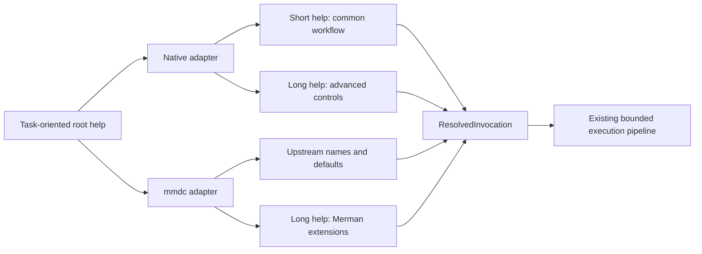
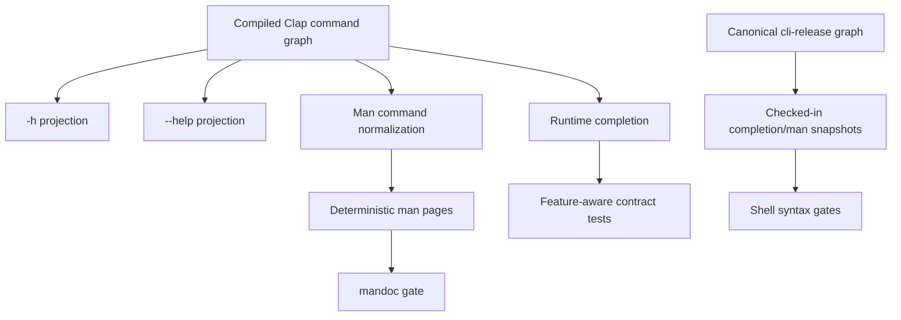
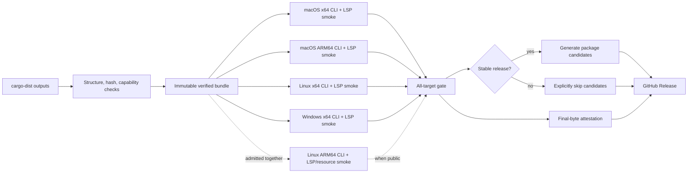

# CLI Ergonomics and Distribution - Plan

## Goal Capsule

| Field | Contract |
|---|---|
| Objective | Make the complete Merman CLI easy to discover and install while preserving its capability-driven slim-build model, explicit `mmdc` compatibility surface, bounded execution, and artifact integrity. |
| Authority | The latest maintainer direction wins, followed by this Product Contract, Key Technical Decisions, repository capability descriptors, and implementation-unit detail. |
| Execution profile | A breaking refactor is authorized. Remove obsolete CLI internals and stale documentation. Preserve the permanent explicit `mmdc` adapter; retain temporary compatibility bridges only when their removal release is explicit. |
| Stop conditions | Stop only for a scope-changing contradiction, an unresolvable guarantee for a currently advertised final artifact, or overlapping user edits that require choosing which behavior to keep. External credentials/registries remain out of scope, and a conditional target whose admission evidence does not close is recorded and left unadvertised rather than stopping mandatory work. |
| Verification posture | Characterize the public process contract first, verify feature-aware help and generated assets, then prove the exact release archives on native runners before publication. |
| Tail ownership | `ce-work` owns implementation, simplification, focused commits, review, and local/CI contract closure. Pushing, opening a PR, signing binaries, and submitting external package-manager pull requests require separate authority. |

---

## Product Contract

### Summary

Merman will keep one complete, batteries-included CLI release and one capability-driven Cargo
package. Interactive users get a concise task-oriented interface; advanced users retain the full
resource, backend, and compatibility controls through long help. Native commands use native names
and defaults, while the explicit `mmdc` subcommand remains a pinned compatibility adapter.

The repository will own deterministic completion and man-page assets, explicit cargo-binstall
metadata, stable-release Scoop and WinGet candidate generation, a reusable Nix source package, and
proof that the final CLI and LSP archives execute their own native smoke contract on every
advertised target. External registries remain operator-owned publication surfaces and are never
described as available before their submissions are accepted.

### Problem Frame

The previous CLI refactor fixed the most serious execution defects: unbounded primary input,
side effects during planning, format options that silently did nothing, destructive writes,
partially published Markdown batches, duplicated ASCII execution, and ambiguous root/subcommand
ownership. That foundation should not be replaced.

The remaining user-facing and distribution gaps are different:

- short help exposes most advanced controls and makes common workflows hard to scan;
- native option names still leak `mmdc` terminology;
- native themes are accepted as arbitrary strings and can silently fall back;
- `detect` exposes configuration and runtime controls that cannot affect detection;
- `lint` defaults to JSON even for an interactive command;
- native and compatibility migrations do not always point to an executable replacement;
- generated man pages contain malformed metadata and are not linted;
- completion assets are checked for drift but not for shell syntax or capability semantics;
- cargo-binstall has no explicit archive contract;
- Homebrew installs only the binary, while Scoop and WinGet have no repository-owned candidate
  generation;
- release archives are structurally checked centrally, but only Linux x86_64 is executed after
  packaging;
- published bytes do not yet receive a provenance attestation after all verification gates;
- Linux ARM64 and Nix users lack first-party, evidence-backed installation paths.

### Actors

- A1. An interactive user wants to render one Mermaid file without learning backend internals.
- A2. An automation user wants deterministic output, stable exit classes, and explicit machine
  formats.
- A3. An `mmdc` user wants a faithful compatibility command and actionable migration guidance.
- A4. A Cargo user wants a complete default and a documented way to compile only selected
  capabilities.
- A5. A binary-install user wants a verified archive for the host platform without a Rust
  toolchain.
- A6. A package maintainer wants generated completion/man assets and exact immutable URLs/hashes.
- A7. A release maintainer wants one verified byte set flowing into GitHub Release, attestations,
  and package-manager candidates.

### Requirements

#### CLI discovery and contract

- R1. Keep the current explicit native command model: `render`, `batch`, `parse`, `detect`,
  `lint`, `lint-rules`, `fix`, `layout`, `capabilities`, `completion`, and `mmdc` appear only when
  their compiled capability makes them usable.
- R2. Keep the default distributed CLI complete. Cargo remains the supported customization
  mechanism for slim builds; do not publish multiple precompiled feature SKUs.
- R3. Root `-h` and `--help` remain concise and task-oriented. For option-heavy leaf commands,
  `-h` exposes common workflow controls and `--help` exposes every available advanced control.
- R4. Short help ends with a compact cue that advanced resource, security, backend, and
  compatibility controls are available through `--help`.
- R5. `render`, `batch`, `lint`, `fix`, `completion`, and `mmdc` include short, copyable examples.
  Examples must not mention a command, format, or option absent from the compiled artifact.
- R6. Native `render` and `batch` use `-f/--format`. During the rest of `0.8.x`, native `-e`
  remains a hidden, detectable deprecated spelling that warns and maps to `-f`; it is removed in
  `v0.9.0`. Supplying old and new spellings together is a usage conflict regardless of ordering
  and exits `2` before input acquisition.
- R7. Explicit `mmdc -e/--outputFormat` remains part of the pinned upstream compatibility
  contract and never emits the native deprecation warning.
- R8. The already documented hidden root-level `mmdc` bridge remains through `0.8.x` and is
  removed in `v0.9.0`; it is not reintroduced into help or completion.
- R9. Native `--theme` accepts exactly the themes reported by the compiled runtime catalog.
  Unknown values fail with exit `2` before input acquisition. `mmdc --theme` remains restricted to
  the four upstream CLI themes.
- R10. `detect` exposes only input acquisition and resource controls that can affect reading the
  source. Remove theme, Mermaid configuration, rendering runtime, and other no-op controls.
- R11. `lint` defaults to stable human-readable text. Machine consumers opt into
  `--format json`; `lint-rules` remains JSON by default.
- R12. Bare `lint --pretty` fails with a targeted instruction to use
  `--format json --pretty`; the explicit JSON output schema does not change.
- R13. A compatibility request for native-only JPEG, ASCII, or Unicode output explains the
  equivalent `render` invocation when that capability is compiled. A slim build never recommends
  a capability it does not have.
- R14. Remove `mmdc` wording from native help headings and descriptions unless the option
  intentionally describes compatibility behavior.
- R15. Increment `cli_contract_version` from `2` to `3` for the native short-option, lint-default,
  and detect-surface changes. Keep the capability document schema version unchanged.
- R16. Preserve the current bounded input, resolved invocation, typed output, atomic single-file
  writes, Markdown transaction, error-class, stdout, and network-policy contracts.

#### Completion and man pages

- R17. Runtime completion reflects only the commands, options, values, and themes compiled into
  the current binary.
- R18. Repository completion and man-page snapshots are generated only from the canonical
  `cli-release` profile and are documented as complete-profile assets.
- R19. Use the supported `clap_complete::aot` API. Generated Bash, Zsh, Fish, PowerShell, and
  Elvish completion assets must pass their available native parser or syntax checker in CI.
- R20. Completion tests prove that native `-f` exists, deprecated native `-e` is absent,
  `mmdc -e` remains present, and the complete runtime theme catalog is suggested.
- R21. Generate man pages with explicit title, deterministic `YYYY-MM-DD` date, source/version,
  and manual metadata through `clap_mangen` APIs. A version-controlled `CLI_MANPAGE_DATE` constant
  is the only date source; it changes only when the generated manual contract changes and never
  reads the wall clock.
- R22. The short-help hiding policy must not produce empty option descriptions in man pages.
  Normalize the cloned command tree for man generation or provide complete long descriptions.
- R23. Every generated man page must render and pass `mandoc -T lint -W warning` with no warnings
  or errors. Style-only line-width concerns are non-blocking unless they affect rendering.

#### Installation surfaces

- R24. Add explicit cargo-binstall metadata that maps every published target to the exact
  cargo-dist archive URL, archive format, wrapper directory, binary name, and extension. Preserve
  cargo-binstall's source-build fallback.
- R25. State accurately that cargo-dist shell/PowerShell installers and cargo-binstall install
  the executable only. They do not install the completion or man files bundled in archives.
- R26. Keep runtime `completion <shell>` as the universal fallback. Package managers may install
  the checked-in complete-profile assets into their conventional locations.
- R27. The Homebrew integration check verifies binary behavior at all supported formula versions.
  Formula versions below `0.8.0` may lack support assets; version `0.8.0` and later must install
  completion and man files. Keep the threshold as one tested workflow constant so unknown future
  versions fail closed into the stronger contract.
- R28. Generate Scoop and WinGet candidates only from a stable version and the SHA-256 of the
  final verified Windows x86_64 archive. URLs are immutable `vVERSION` release URLs.
- R29. Scoop candidates declare only the actually published Windows x86_64 architecture.
  WinGet candidates use the current multi-file schema with ZIP plus nested portable installer
  semantics.
- R30. Candidate manifests are schema/semantic tested in the repository but remain
  `manual-registry` until external repositories accept them. README and surface metadata must not
  advertise central install commands prematurely.
- R31. Provide a reusable Nix derivation for the canonical complete `cli-release` feature set,
  with a thin flake wrapper. It installs the binary, complete-profile completion assets, and man
  pages without copying large repository-only reference trees into the source closure.
- R32. Nix is a source-build installation path, not a claim that the precompiled GNU archive runs
  on NixOS. Flakes are an optional frontend, not the only reusable Nix interface.

#### Release evidence and targets

- R33. Preserve central archive structure, checksum, capability, legal-file, and asset checks.
  Central verification publishes one immutable verified-artifact bundle for downstream jobs.
- R34. Every advertised release target downloads the exact verified CLI and LSP archives on a
  matching native OS/architecture runner. The CLI executes `--version`, `capabilities --json`,
  minimal SVG render, completion generation, and format smokes justified by runner support. The
  LSP archive passes safe extraction and identity checks, then completes
  `initialize -> shutdown -> exit` over stdio JSON-RPC.
- R35. A native CLI or LSP archive failure prevents package-manager candidate generation,
  attestation, and GitHub Release publication.
- R36. Attest the final archives, checksums, and installers only after central and native
  verification. Use a dedicated least-privilege job and `actions/attest@v4`; the publication job
  must consume the same attested bytes.
- R37. Document `gh attestation verify <asset> -R Latias94/merman` as the verification path.
- R38. Admit `aarch64-unknown-linux-gnu` only together with cargo-dist planning, artifact-profile
  ownership, release-surface patterns, native ARM64 execution, TLS/system-certificate smoke, font
  discovery smoke, and an explicit glibc support statement.
- R39. Do not use cargo-dist `min-glibc-version` as proof of binary compatibility. The declared
  glibc floor must be determined by the controlled build environment and execution on the oldest
  supported environment.
- R40. Keep musl and Windows ARM64 experimental until their full render/resource behavior can be
  executed on real targets. Do not advertise build-only targets.

#### Documentation and governance

- R41. Update the root README, CLI README, compatibility register, migration guide, CHANGELOG,
  capability contract, release surface contract, and release documentation from the same
  version/capability facts.
- R42. Explain why the native break exists: clearer command ownership, fewer silent no-ops,
  useful interactive defaults, and a versioned compatibility boundary.
- R43. Distinguish all installation statuses through the canonical mapping below: published
  channel, GitHub artifact, generated candidate, external submission pending,
  credential-blocked, and experiment.
- R44. Keep Mermaid parity claims scoped to the explicit `mmdc` adapter. Native ergonomic
  differences are intentional and documented, not treated as upstream parity defects.
- R45. Do not add a second `mmdc` executable, self-updater, automatic shell-profile mutation,
  MSI, Chocolatey, AUR, Nushell, macOS notarization, Windows Authenticode, or per-feature release
  archives in this plan.

### Key Flows

- F1. Interactive native render
  - **Trigger:** A1 invokes `merman-cli render -h`, then renders a file.
  - **Steps:** Short help exposes input/output/format/theme; argument resolution validates the
    theme and output before input acquisition; execution uses the existing typed pipeline.
  - **Outcome:** The common path is visible without hiding advanced capability from `--help`.
  - **Covered by:** R1-R6, R9, R14, R16
- F2. Compatibility migration
  - **Trigger:** A3 invokes a root compatibility flag, explicit `mmdc`, or native `-e`.
  - **Steps:** The bounded `0.8.x` bridge or hidden native spelling is detected; the command emits
    an exact migration warning; explicit `mmdc` remains warning-free.
  - **Outcome:** Existing automation has a migration window without preserving ambiguous public
    syntax into `v0.9.0`.
  - **Covered by:** R6-R8, R13, R15, R42, R44
- F3. Machine lint
  - **Trigger:** A2 invokes `lint --format json`.
  - **Steps:** Argument resolution selects JSON, optional pretty output is validated, bounded
    analysis executes, and the existing schema is serialized.
  - **Outcome:** Interactive defaults improve while machine contracts remain explicit and stable.
  - **Covered by:** R11-R12, R15-R16
- F4. Shell/manual integration
  - **Trigger:** A4 or A6 generates or installs support assets.
  - **Steps:** The compiled command graph generates feature-aware completion; the complete release
    graph generates deterministic snapshots; parsers and `mandoc` validate the results.
  - **Outcome:** Runtime-generated and package-installed assets are truthful for their profiles.
  - **Covered by:** R17-R23, R25-R27, R31
- F5. Stable Windows package candidate
  - **Trigger:** A7 prepares a stable release.
  - **Steps:** Central and native checks approve the immutable Windows archive; a generator reads
    its version, URL, and checksum; repository tests validate Scoop and WinGet candidates.
  - **Outcome:** A maintainer can submit evidence-backed manifests without rebuilding or hashing a
    different artifact.
  - **Covered by:** R28-R30, R33-R35, R43
- F6. Verified publication
  - **Trigger:** cargo-dist produces all release archives.
  - **Steps:** Central structural checks create one verified bundle; target-native CLI jobs execute
    exact files from that bundle; stable releases require package candidate generation while
    prereleases explicitly skip it; a dedicated job attests the same files; the host job uploads
    them.
  - **Outcome:** Published bytes are structurally valid, executable on advertised targets, and
    independently verifiable.
  - **Covered by:** R33-R40

### Acceptance Examples

- AE1. `merman-cli render -h` omits advanced resource, network, raster, PDF, and backend controls;
  `merman-cli render --help` shows every compiled control.
- AE2. `batch -h` and `mmdc -h` apply the same progressive-help rule and point to `--help`;
  top-level help stays concise.
- AE3. Help examples never mention SVG in an analysis-only build or PNG/PDF in a build without
  those output features.
- AE4. Every supported native runtime theme parses and appears in completion; an unknown theme
  exits `2` before opening the input or creating output.
- AE5. `mmdc` continues to accept only its four upstream themes.
- AE6. `render -f png` and `batch -f pdf` work in a complete build. Native `-e` works only during
  `0.8.x`, warns with the `-f` replacement, and does not appear in help or completion. Supplying
  `-e` with `-f` or `--format`, in either order, exits `2` before reading input.
- AE7. Explicit `mmdc -e` remains visible and emits no native deprecation warning.
- AE8. The hidden root-level bridge behaves as documented through `0.8.x`; tests and migration
  docs fix its removal at `v0.9.0`.
- AE9. Bare `lint` emits text. `lint --format json` preserves the current JSON schema.
  `lint-rules` remains JSON by default.
- AE10. `lint --pretty` says to use `--format json --pretty`; that explicit form succeeds.
- AE11. `detect` no longer accepts theme/config/runtime flags and still identifies representative
  diagrams with frontmatter and directives.
- AE12. `mmdc -o out.jpg` and `mmdc -e jpg|ascii|unicode` either recommend an executable native
  command supported by the binary or explain that the needed feature is unavailable.
- AE13. Capabilities report CLI contract `3`; the binary, archive verifier, tests, Homebrew
  checks, and documentation agree.
- AE14. Five completion snapshots are drift-free and pass available shell syntax checks; native
  `-f`, hidden native `-e`, explicit `mmdc -e`, and dynamic theme values have assertions.
- AE15. Every man page renders, has valid deterministic metadata, gives every public option a
  description, and produces no `mandoc -T lint -W warning` output.
- AE16. cargo-binstall resolves each supported target to the exact cargo-dist archive and binary
  path and installs a binary whose capabilities match `cli-release`.
- AE17. Homebrew versions below `0.8.0` may pass without support assets; `0.8.0` and later verify
  installed completion and man files.
- AE18. Scoop/WinGet candidates reject prerelease versions, moving URLs, missing hashes, incorrect
  target names, and unverified archives.
- AE19. Before external registry acceptance, no central Scoop/WinGet install command appears in
  public docs or a `published` surface.
- AE20. `nix-build` or the reusable derivation builds the canonical complete profile; `nix run`
  reports capabilities matching `cli-release`; the installed output contains completion and man
  files.
- AE21. Every advertised target executes its exact final CLI and LSP archives on a matching
  runner. CLI workflow smokes and LSP JSON-RPC lifecycle smokes must both pass; any failure blocks
  attestation and publication.
- AE22. The Linux ARM64 target is absent from public descriptors until its archive, execution,
  TLS, font, and glibc evidence all pass together.
- AE23. Attestations cover the same archives, checksums, and installers uploaded by the host job;
  no later job repackages them.
- AE24. README, CLI README, compatibility guide, migration guide, CHANGELOG, artifact profiles,
  and release surfaces agree on command names, version boundaries, target support, and installation
  status.

### Success Measures

- `render -h`, `batch -h`, and `mmdc -h` are materially shorter than their current approximately
  120-line outputs while `--help` loses no valid option.
- A fresh complete-profile user can discover a valid single-file render command from root and
  leaf short help alone. Every documented installation path reaches a successful `--version`,
  capability query, and first SVG render in its channel smoke test.
- Every advertised CLI capability is reachable from help, completion, or a documented command;
  no accepted native option is a silent no-op.
- All checked-in completion and man assets are generated, drift-free, and parser/linter clean.
- Every advertised target executes the final CLI and LSP archives on a matching runner before
  publication.
- The complete default remains one installable product, while existing analysis-only and selected
  feature recipes remain truthful and buildable.
- Package-manager documentation contains no aspirational central-install command.
- CLI and channel contract tests execute the first-use task rather than counting help lines or
  checking file presence alone.

### Scope Boundaries

**In scope**

- Native and compatibility CLI parsing, validation, help, diagnostics, and contract versioning.
- Completion/man generation, snapshot tests, and syntax/lint gates.
- cargo-binstall metadata.
- Homebrew integration verification and upstream-ready guidance.
- Stable-only Scoop/WinGet candidate generation and repository validation.
- Reusable Nix derivation plus thin flake.
- Existing release-target final-archive execution, provenance attestation, and Linux ARM64
  admission when all evidence closes.
- Documentation and release-surface truth.

**Out of scope**

- Submitting or merging changes in Homebrew Core, Scoop Main, or the WinGet community repository.
- Actions requiring Apple/Windows signing credentials or external registry credentials.
- A self-updater, shell-profile mutation, separate `mmdc` executable, or multiple feature-specific
  release archives.
- musl or Windows ARM64 public support without real execution evidence.
- Redesigning the renderer, analysis engine, bounded acquisition, transaction, or artifact-profile
  architecture already completed by the prior CLI refactor.

### Sources

#### Repository sources

- `crates/merman-cli/src/cli.rs`
- `crates/merman-cli/src/app.rs`
- `crates/merman-cli/src/invocation.rs`
- `crates/merman-cli/src/commands.rs`
- `crates/merman-cli/src/app/distribution_assets.rs`
- `crates/merman-cli/src/capabilities.rs`
- `crates/merman-cli/tests/cli_contract.rs`
- `crates/merman-cli/tests/cli_native_contract.rs`
- `crates/merman-cli/tests/process_contract.rs`
- `crates/merman-cli/tests/distribution_assets.rs`
- `crates/merman-cli/Cargo.toml`
- `capabilities/artifact-profiles-v1.json`
- `docs/release/SURFACES.json`
- `dist-workspace.toml`
- `.github/workflows/release.yml`
- `.github/workflows/homebrew.yml`
- `scripts/generate_cli_assets.py`
- `scripts/verify_cli_release_archive.py`
- `docs/plans/2026-07-27-001-refactor-cli-invocation-execution-contracts-plan.md`

#### External primary sources

- [Clap `hide_short_help`](https://docs.rs/clap/latest/clap/builder/struct.Arg.html#method.hide_short_help)
- [Clap command help APIs](https://docs.rs/clap_builder/latest/clap_builder/builder/struct.Command.html)
- [Clap possible-value parser](https://docs.rs/clap/latest/clap/builder/struct.PossibleValuesParser.html)
- [clap_complete ahead-of-time API](https://docs.rs/clap_complete/latest/clap_complete/)
- [clap_mangen metadata API](https://docs.rs/clap_mangen/latest/clap_mangen/struct.Man.html)
- [cargo-binstall package support metadata](https://github.com/cargo-bins/cargo-binstall/blob/main/SUPPORT.md)
- [cargo-dist shell installers](https://axodotdev.github.io/cargo-dist/book/installers/shell.html)
- [cargo-dist configuration reference](https://axodotdev.github.io/cargo-dist/book/reference/config.html)
- [Homebrew formula completion helpers](https://docs.brew.sh/rubydoc/Formula.html)
- [Scoop app manifest schema](https://github.com/ScoopInstaller/Scoop/wiki/App-Manifests)
- [WinGet package manifest schema](https://learn.microsoft.com/en-us/windows/package-manager/package/manifest)
- [GitHub artifact attestations](https://github.com/actions/attest)
- [Nix flakes](https://nix.dev/concepts/flakes.html)

---

## Planning Contract

### Key Technical Decisions

1. **One complete release binary, Cargo features for customization.**
   *(session-settled: user-approved; rejected alternative: multiple precompiled feature SKUs)*
   This is user-settled. It avoids a package-SKU matrix whose combinations would multiply archive,
   documentation, security, and support obligations. The complete release optimizes first use;
   Cargo feature leaves optimize embedded or specialized use.

2. **Native UX and `mmdc` compatibility are separate versioned contracts.**
   *(session-settled: user-approved; rejected alternative: make every native command preserve
   upstream `mmdc` ergonomics)*
   This is user-settled. Native commands may choose clearer names and defaults. The explicit
   `mmdc` command keeps upstream names and semantics. A compatibility claim never forces native
   commands to inherit upstream ergonomics.

3. **Use a bounded deprecation bridge instead of permanent aliases.**
   *(session-settled: user-approved; rejected alternative: remove compatibility syntax
   immediately or retain it indefinitely)*
   Root compatibility forwarding and native `-e` survive only through `0.8.x`, remain hidden from
   discovery, produce exact replacement guidance, and have tests fixing removal at `v0.9.0`.
   This preserves migration time without creating two permanent ways to express the same native
   operation.

4. **Version the behavioral break.**
   The native interface changes increment `cli_contract_version` to `3`. Capability JSON schema
   remains at `2` because its structure does not change. The later root-bridge removal is a
   separate contract event.

5. **Generate package-manager candidates from verified bytes.**
   Scoop, WinGet, and provenance consume checksums and archives from the post-verification bundle.
   They never rebuild, fetch a moving URL, or hash a different copy.

6. **Keep GitHub installers binary-only.**
   cargo-dist and cargo-binstall intentionally install only the executable. The project documents
   runtime completion generation; package managers that own integration directories install
   checked assets. Merman does not mutate shell profiles.

7. **Publish only target support that can execute.**
   A successful cross-build is insufficient. A target enters public descriptors only with final
   archive execution and its platform-specific resource smokes.

8. **Treat Nix as a source package with a reusable non-Flake core.**
   A thin flake improves discovery but does not make an experimental frontend the only interface.
   The derivation consumes the canonical complete feature set and installs support assets.

### Assumptions

- The work runs on the current branch and incorporates concurrent user changes without reverting
  or rewriting them.
- The complete CLI remains the default for `cargo install merman-cli`; this plan does not change
  the feature architecture selected in the capability-driven distribution plan.
- `v0.8.x` is the migration window and `v0.9.0` is the earliest removal release for the hidden
  root bridge and native `-e`.
- External Homebrew/Scoop/WinGet repositories, package signing identities, and registry
  credentials are not available to this execution. Repository-owned candidates and evidence are
  the completion boundary.
- GitHub-hosted native runners exist for the currently advertised macOS and Windows targets.
  Linux ARM64 is admitted only if the workflow can obtain a matching runner and close every
  requirement in R38.
- Complete-profile static completion/man files remain included in the crate and release archives;
  slim Cargo builds should generate their own completion at runtime.
- Existing `cli-release` and `cli-analysis` capability descriptors remain the source of truth.
  A Nix expression or workflow must derive or verify against them rather than silently duplicating
  an unchecked feature list.
- The first implementation pass may defer public Linux ARM64 admission if glibc, runner, TLS, or
  font evidence cannot be made truthful; that is a verified scope result, not permission to
  advertise partial support.
- Public target admission is a separate release-surface decision from the mandatory ergonomics and
  packaging work. Failure to close Linux ARM64 evidence does not block CLI contract `3`, generated
  asset quality, or existing-target archive verification.

### High-Level Design

#### CLI discovery and execution boundary



The help surface changes, but the execution boundary remains `ResolvedInvocation`. Validation,
deprecation detection, and feature-aware suggestions happen before that boundary so the renderer
does not acquire compatibility knowledge.

#### Help and generated-document projection



Short-help hiding is a display projection only. It must not remove options from parsing,
completion, long help, or man pages.

#### Release evidence flow



No downstream job is allowed to rebuild or repack the verified subjects.

#### Installation responsibility matrix

| Channel | Binary | Completion/man | Feature choice | Repository completion boundary |
|---|---:|---:|---:|---|
| `cargo install` | source build | runtime generation | yes | Manifest recipes and tests |
| cargo-binstall | verified archive binary | no | no; complete profile | Exact metadata and archive checks |
| cargo-dist installer | verified archive binary | no | no; complete profile | Accurate docs and final archive checks |
| Direct archive | yes | bundled | no; complete profile | Archive structure and native execution |
| Homebrew | source/bottle | formula-owned install | no; complete profile | Version-gated integration checks and upstream-ready instructions |
| Scoop/WinGet | verified archive binary | channel-specific | no; complete profile | Stable candidate generation and validation |
| Nix | source build | derivation installs both | no; complete profile | Reusable derivation, thin flake, checks |

#### Installation status mapping

| User-visible state | `SURFACES.json` state | Required evidence | Public install command |
|---|---|---|---|
| Published channel | `published` | External registry entry is accepted and probed | yes |
| GitHub artifact only | `artifact-only` | Verified GitHub Release archive/installer | direct release command only |
| Generated candidate | `manual-registry` plus `candidate_stage: generated` | Validated immutable manifest | no central-registry command |
| External submission pending | `manual-registry` plus `candidate_stage: submitted` | Submission URL or identifier | no central-registry command |
| Credential blocked | `credential-blocked` | Named missing credential/environment | no |
| Experiment | `not-built` or `not-applicable` with an admission record | Explicit non-public evidence | no |

`candidate_stage` is valid only for `manual-registry` channels. Absence means no candidate has
been generated; validators reject it once a manifest is present.

### Sequencing

1. Freeze CLI contract `3` with process tests before changing help or defaults.
2. Refactor help, native names/defaults, validation, and compatibility diagnostics.
3. Repair completion/man generation and add parser/linter gates.
4. Add cargo-binstall metadata and correct install-channel documentation.
5. Add stable Scoop/WinGet generators and version/hash tests without wiring them into publication.
6. Add a reusable Nix package and thin flake, without changing release target claims.
7. Rewire release evidence so final CLI and LSP archives run their own smoke contracts on every
   currently advertised native target.
8. Wire stable candidates after the native aggregate gate, then add post-verification
   attestation and stable/prerelease publication branches.
9. Evaluate Linux ARM64 and, only if every gate closes, admit it across CLI and LSP descriptors;
   otherwise record the blocker and leave all public target sets unchanged.
10. Run holistic review, simplify, update documentation/migration records, and commit coherent
    units.

### Risks and Mitigations

| Risk | Consequence | Mitigation |
|---|---|---|
| `hide_short_help` leaks into man generation | Empty option descriptions | Normalize a cloned command graph for man output and assert every option description |
| A hidden Clap alias cannot be detected | No deprecation warning | Retain a hidden detectable field or pre-parser normalization with contract tests |
| Dynamic theme validation diverges from config semantics | Valid config files rejected | Limit validation to CLI `--theme`; leave source/config parsing in the engine |
| Text-default lint breaks automation | Unexpected non-JSON output | Contract version bump, CHANGELOG/migration note, explicit JSON examples |
| Candidate manifests imply registry availability | Misleading install instructions | `manual-registry` state and no public central command until external acceptance |
| Package metadata guesses the wrong archive layout | Failed cargo-binstall install | Test URL, archive suffix, wrapper path, binary extension for every advertised CLI target |
| Static assets misrepresent slim builds | Invalid completion/help | Label them complete-profile assets; runtime generation remains authoritative for slim builds |
| Native runner checks use a rebuilt binary | False publication evidence | Download only the central verified bundle and compare checksums before execution |
| Attestation covers pre-verification bytes | Meaningless provenance | Dedicated post-gate job attests the exact bundle consumed by `host` |
| Linux target is built against an accidental glibc floor | Runtime failures on common distributions | Declare the build environment, execute on the chosen floor, and avoid false `min-glibc-version` claims |
| Nix source filtering captures `repo-ref` or build output | Huge, impure closure | Explicit source allowlist and evaluation tests |
| Concurrent user edits overlap plan files | Lost work | Add a new plan, inspect every touched diff, and never restore/reset/stash user changes |

---

## Implementation Units

### U1. CLI Contract 3 and Characterization

**Purpose:** Establish the intended break and migration window before behavior changes.

**Files:**

- Modify: `crates/merman-cli/src/capabilities.rs`
- Modify: `crates/merman-cli/tests/cli_contract.rs`
- Modify: `crates/merman-cli/tests/cli_native_contract.rs`
- Modify: `crates/merman-cli/tests/process_contract.rs`
- Modify: `scripts/verify_cli_release_archive.py`
- Modify: tests that assert archived CLI capability metadata

**Work:**

- Add failing contract tests for `-f`, the hidden/warning-producing native `-e`, unchanged explicit
  `mmdc -e`, lint text default, explicit lint JSON, narrowed detect options, theme rejection, and
  native-only migration suggestions.
- Increment only `cli_contract_version` to `3`.
- Make archive verification require the new contract version without changing capability schema
  version.
- Preserve tests for the root bridge and make the `v0.9.0` removal boundary explicit.

**Verification:**

- Focused CLI parsing and process tests fail for the intended reasons before U2 and pass after U2.
- Capability snapshots distinguish CLI contract version from document schema version.

### U2. Progressive Help and Native Ergonomics

**Purpose:** Make common workflows understandable without reducing capability.

**Files:**

- Modify: `crates/merman-cli/src/cli.rs`
- Modify: `crates/merman-cli/src/app.rs`
- Modify: `crates/merman-cli/src/invocation.rs`
- Modify: `crates/merman-cli/src/commands.rs`
- Modify: `crates/merman-cli/tests/cli_contract.rs`
- Modify: `crates/merman-cli/tests/cli_native_contract.rs`
- Modify: `crates/merman-cli/tests/process_contract.rs`
- Delete: obsolete CLI compatibility helpers made unreachable by the typed adapters

**Work:**

- Classify every leaf option as common or advanced. Hide advanced resource, security, raster,
  PDF, backend, and compatibility controls from short help only.
- Add compact, feature-aware examples and long-help cues.
- Rename native format short options to `-f`; retain a hidden detectable `-e` migration spelling
  through `0.8.x`.
- Reject old and new native format spellings together in both orders before input acquisition.
- Build native theme values from the runtime catalog and keep `mmdc` theme values separate.
- Remove no-op engine/config/theme controls from `detect`.
- Change `lint` default to text and add a targeted `--pretty` diagnostic.
- Add feature-aware native migration guidance for compatibility-only format errors.
- Remove compatibility wording from native headings.
- Preserve early validation: invalid arguments must fail before source reads or output effects.

**Verification:**

- Snapshot short and long help separately for complete and representative slim profiles.
- Run process tests for warnings, exit codes, stdout/stderr separation, no-input TTY, and
  pre-acquisition rejection.
- Assert no valid long-help option disappears from parsing or completion.

### U3. Completion and Man-Page Quality

**Purpose:** Turn generated shell/manual assets into validated release interfaces.

**Files:**

- Modify: `crates/merman-cli/src/app/distribution_assets.rs`
- Add: `crates/merman-cli/tests/distribution_assets.rs`
- Modify: `scripts/generate_cli_assets.py`
- Add or modify: cross-platform asset-validation script and tests
- Regenerate: `crates/merman-cli/assets/completions/*`
- Regenerate: `crates/merman-cli/assets/man/*`
- Modify: relevant CI workflow

**Work:**

- Migrate generation to `clap_complete::aot`.
- Separate runtime graph generation from complete-profile snapshot generation.
- Normalize the cloned command graph for man output so short-help hiding never erases
  descriptions.
- Set deterministic man title, date, source/version, and manual metadata through APIs.
- Store the last substantive manual-contract date in `CLI_MANPAGE_DATE`, validate its shape, and
  prove generation is identical across timezone and wall-clock changes.
- Add semantic assertions for `-f`, hidden native `-e`, explicit `mmdc -e`, and theme values.
- Add parser/syntax checks where each shell is natively available and a mandatory `mandoc` lint
  gate for all man pages.
- Keep generated files reproducible under the existing `--check` workflow.

**Verification:**

- `scripts/generate_cli_assets.py --check` reports no drift.
- Shell syntax/parser matrix and `mandoc -T lint -W warning` are clean.
- Complete and slim runtime completion tests report only compiled capabilities.

### U4. Cargo-binstall and Installation Truth

**Purpose:** Make binary installation predictable without overstating support-asset behavior.

**Files:**

- Modify: `crates/merman-cli/Cargo.toml`
- Modify: `crates/merman-cli/README.md`
- Modify: `README.md`
- Add: `docs/releasing/CLI.md`
- Add or modify: metadata contract tests
- Modify: `.github/workflows/homebrew.yml`

**Work:**

- Add explicit current cargo-binstall URL, archive suffix, binary extension, and archive-layout
  metadata for Unix and Windows.
- Test the metadata against cargo-dist names and the archive verifier.
- Document the binary-only behavior of cargo-binstall and cargo-dist installers.
- Keep runtime completion instructions and direct-archive support-asset paths explicit.
- Make Homebrew checks version-aware: verify core binary behavior now; require installed
  completion/man only after the formula reaches the packaging contract version.
- Produce upstream-ready Homebrew formula guidance without editing or submitting external
  repositories.

**Verification:**

- Manifest tests cover every advertised CLI target and preserve source-build fallback.
- Homebrew workflow logic has tests for both pre-support-assets and post-support-assets formula
  versions.

### U5. Stable Scoop and WinGet Candidates

**Purpose:** Produce trustworthy Windows package inputs without claiming external publication.

**Files:**

- Add: repository-owned candidate templates
- Add: cross-platform candidate generator
- Add: generator unit tests and fixture checksums
- Modify: `.github/workflows/release.yml`
- Modify: `docs/release/SURFACES.json`
- Modify: release-status schema/validation only where needed for `manual-registry`
- Modify: `docs/releasing/CLI.md`

**Work:**

- Read version, repository URL, exact Windows archive name, and SHA-256 from the verified bundle.
- Reject prereleases, absent/unverified assets, moving URLs, unexpected targets, and malformed
  versions.
- Render a Scoop x86_64 manifest with immutable URL, hash, binary, checkver, and autoupdate
  contract.
- Render current multi-file WinGet manifests for ZIP plus nested portable installer.
- Validate JSON structurally and run `winget validate` on Windows CI.
- Publish candidates as release-maintainer evidence or workflow artifacts, not as an assertion
  that central commands already work.
- Keep the generator and its tests independently runnable before U7. Wire it into the release
  workflow only after U7 provides the native aggregate gate: stable releases require candidate
  success; prereleases take an explicit successful skip branch.

**Verification:**

- Golden and adversarial generator tests cover version/hash/target boundaries.
- Release workflow proves candidates consume the same verified Windows archive.
- Surface and README language remains `manual-registry` until external acceptance.

### U6. Reusable Nix Package

**Purpose:** Offer a first-party source-build path for Nix users without changing GNU archive
claims.

**Files:**

- Add: `package.nix` or `nix/package.nix`
- Add: `default.nix`
- Add: `flake.nix`
- Add: `flake.lock`
- Add: Nix source-filter and profile-contract tests
- Modify: CI workflow
- Modify: `README.md`
- Modify: `crates/merman-cli/README.md`

**Work:**

- Create a reusable derivation that builds the exact canonical `cli-release` profile from locked
  sources.
- Install the binary, checked complete-profile completion files, and man pages.
- Wrap it with a minimal flake for `nix build`, `nix run`, and `nix profile install`.
- Filter out `target`, `repo-ref`, `.git`, and unrelated generated/local state.
- Verify the installed capability set against the artifact descriptor.
- Label Nix as source-build support and avoid claiming Flakes are the only interface.

**Verification:**

- `nix-build` or equivalent reusable-derivation test succeeds.
- `nix flake check` and `nix run .# -- --version` succeed in CI.
- Installed support assets match checked snapshots.

### U7. Final CLI and LSP Archive Native Verification and Attestation

**Purpose:** Prove and attest the exact CLI and LSP bytes users download.

**Files:**

- Modify: `.github/workflows/release.yml`
- Modify: `scripts/verify_cli_release_archive.py`
- Add: `scripts/verify_lsp_release_archive.py`
- Add: `scripts/test_verify_lsp_release_archive.py`
- Add or modify: workflow security and topology tests
- Modify: `docs/releasing/CLI.md`

**Work:**

- Keep one central job responsible for structure, checksums, capability closure, and archive
  identity.
- Upload one immutable verified bundle.
- Add target-native matrix jobs that download only that bundle and recheck checksums. CLI
  archives execute version, capabilities, completion, SVG, and viable raster/PDF smokes. LSP
  archives undergo safe extraction, legal-file/binary identity checks, and a complete stdio
  JSON-RPC initialize/shutdown/exit lifecycle.
- Add an aggregate gate required by stable candidates, attestation, and `host`.
- Add a dedicated least-privilege post-verification `actions/attest@v4` job for final archives,
  checksums, and installers.
- Ensure `host` uploads the identical files without repacking.
- Document user-side GitHub attestation verification.

**Verification:**

- Workflow topology tests prove every advertised CLI and LSP target reaches the native gate.
- Failure-injection tests prove host/candidate/attestation jobs cannot run after a failed target.
- Security tests prove untrusted build jobs do not receive publication permissions.

### U8. Conditional Linux ARM64 Admission

**Purpose:** Evaluate the highest-value missing precompiled target and admit it only with a
complete support claim.

**Files:**

- Add or modify for both outcomes: `docs/release/CLI_TARGET_ADMISSION.md`
- Admission branch only: modify `dist-workspace.toml`
- Admission branch only: modify `capabilities/artifact-profiles-v1.json`
- Admission branch only: modify `docs/release/SURFACES.json`
- Admission branch only: modify `.github/workflows/release.yml`
- Admission branch only: modify exact CLI and LSP archive verification tests
- Modify: installation and platform-support documentation

**Work:**

- Add `aarch64-unknown-linux-gnu` consistently for both cargo-dist packages and their artifact
  profiles; do not create a CLI/LSP descriptor mismatch.
- Use a matching native ARM64 runner for final archive execution.
- Exercise TLS/system-certificate access, system font discovery, SVG, and supported bitmap/PDF
  paths.
- Define and prove a glibc floor through build-environment control and oldest-environment
  execution. Do not substitute `min-glibc-version` metadata for evidence.
- If any requirement cannot be proven, keep the target absent and record the exact admission
  blocker in `docs/release/CLI_TARGET_ADMISSION.md`; do not weaken the public contract.

**Verification:**

- cargo-dist plan, descriptor validation, exact archive patterns, native execution, resource
  smokes, and glibc evidence pass together.
- CLI and LSP release surfaces expose the same supported target set.
- The non-admission branch proves all public target descriptors are unchanged and the admission
  record names the failed gate, evidence gathered, and next retry condition.

### U9. Documentation, Migration, and Cleanup

**Purpose:** Leave one coherent user story and remove superseded CLI material.

**Files:**

- Modify: `README.md`
- Modify: `crates/merman-cli/README.md`
- Modify: `CHANGELOG.md`
- Modify: `docs/alignment/CLI_COMPATIBILITY.md`
- Modify: CLI migration and release documentation
- Modify: `docs/release/SURFACES.json`
- Delete: duplicated or contradicted CLI usage passages and obsolete internal helpers

**Work:**

- Present the three primary paths first: complete binary install, native `render`, and explicit
  `mmdc`.
- Explain the `0.8.x` warnings, `v0.9.0` removals, native `-f`, lint default, and CLI contract `3`.
- Explain why native behavior diverges and what users gain.
- Publish a channel matrix that distinguishes binary-only installers, bundled assets, source
  builds, candidates, and externally published channels.
- Remove the incorrect claim that root `-i/-o` compatibility is already gone.
- Keep feature/custom-build guidance linked rather than repeating the full feature catalog in
  every README.
- Remove obsolete implementation paths once characterization proves they are unreachable.

**Verification:**

- Documentation examples execute against the matching feature profile.
- First-use contract tests start from root help and prove the advertised install-to-render path,
  not only the leaf command implementation.
- Release surface/status validation finds no unsupported or aspirational public channel.
- Link and terminology scans find no stale native `-e`, lint-default, target, or bridge claim.

---

## Verification Contract

### Focused local gates

Run sequentially in the repository's normal target directory:

```text
cargo fmt --all -- --check
cargo nextest run --locked -p merman-cli
python3 scripts/generate_cli_assets.py --check
python3 -m unittest scripts/test_verify_cli_release_archive.py
python3 -m unittest scripts/test_release_workflow_security.py
python3 -m unittest scripts/test_verify_release_surfaces.py
python3 scripts/verify-release-surfaces.py
```

Add and run the package-manifest, completion-syntax, man-lint, workflow-topology, and Nix tests
introduced by their implementation units. If an optional local tool is absent, the corresponding
CI job remains mandatory; the final report must identify what was verified locally versus only by
static workflow tests.

### Capability and slim-profile gates

```text
python3 scripts/verify_artifact_dependency_closures.py --profile cli-analysis --profile cli-release --profile lsp-stdio-release
python3 scripts/artifact_profile_recipe.py cli-analysis --check-host --locked
python3 scripts/artifact_profile_recipe.py cli-release --check-host --locked
python3 scripts/artifact_profile_recipe.py lsp-stdio-release --check-host --locked
```

Representative feature tests must additionally prove:

- analysis-only help/completion contains no render formats;
- SVG-only native examples contain no bitmap/PDF claims;
- output-specific migration suggestions appear only when compiled;
- complete release help/completion/man covers every declared capability.

### Generated-asset gates

- Bash and Zsh syntax checks run on Unix CI.
- Fish and Elvish parsers run in their installed CI environments.
- PowerShell parses the generated completion on Windows.
- `mandoc -T lint -W warning` runs over every generated man page.
- A clean regeneration produces no diff.

### Release gates

- Central archive verification succeeds for every descriptor-declared target.
- Every advertised final CLI and LSP archive executes on a matching native runner.
- Stable package candidates are generated only after those jobs pass; prereleases explicitly skip
  candidate generation without bypassing native verification or attestation.
- Attestation subjects and host-upload inputs have identical names and SHA-256 values.
- The release host job has no path around the aggregate native gate.
- Linux ARM64 becomes required only in the same change that adds all descriptor and execution
  evidence.

### Review gates

- Correctness review: parsing order, migration detection, feature-aware suggestions, generated
  assets, and release job dependencies.
- Maintainability review: no second command graph, no duplicate feature list without a verifier,
  and no package-manager-specific logic inside render execution.
- Testing review: negative paths, slim builds, prerelease rejection, archive identity, and
  native-runner failure propagation.
- Security/reliability review: untrusted archive extraction, URL/hash pinning, least-privilege
  attestation, no credentials in build jobs, and no unverified publication.
- Simplicity review: remove obsolete helpers and avoid building a generic package-manager
  framework for two concrete formats.

---

## Definition of Done

- CLI contract `3` is implemented, reported, tested, and documented.
- Common short help is concise; long help retains every compiled control.
- Native `-f`, bounded native `-e` migration, explicit `mmdc -e`, theme validation, detect
  narrowing, lint text default, and migration diagnostics behave exactly as specified.
- Completion and man snapshots are deterministic and parser/linter clean.
- cargo-binstall metadata is explicit and verified.
- Homebrew integration behavior is version-gated and truthful.
- Stable Scoop/WinGet candidates are generated from verified Windows bytes and remain marked
  manual until external acceptance.
- The reusable Nix derivation and thin flake build the canonical complete profile and install
  support assets.
- Every advertised CLI and LSP release archive executes its format-specific smoke contract on a
  matching native runner before publication.
- Final archives, checksums, and installers are attested after verification and uploaded without
  repacking.
- Linux ARM64 is either fully admitted with all required evidence or explicitly remains out of
  the public matrix with its admission blocker recorded; the latter does not make the mandatory
  CLI and existing-target work incomplete.
- README, CLI README, compatibility guide, migration guide, CHANGELOG, artifact profiles, and
  release surfaces agree.
- Focused tests, full CLI tests, profile checks, generated-asset checks, workflow tests, and
  applicable platform checks are green.
- Code review finds no unresolved P0/P1 correctness, security, reliability, contract, or
  maintainability issue.
- Coherent implementation units are committed locally with Conventional Commit messages; no
  unrelated user change is staged.
