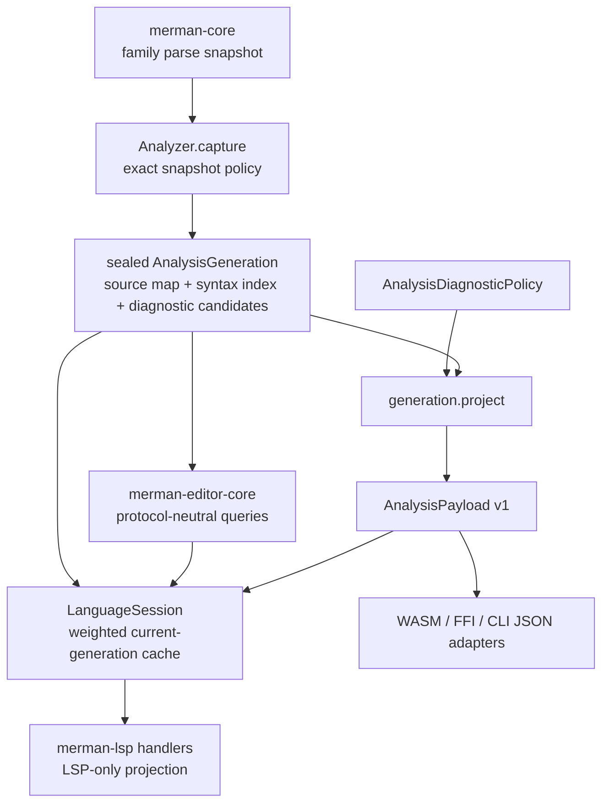
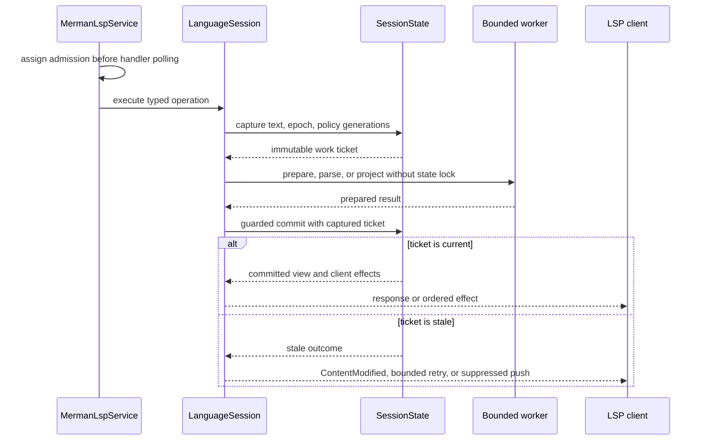
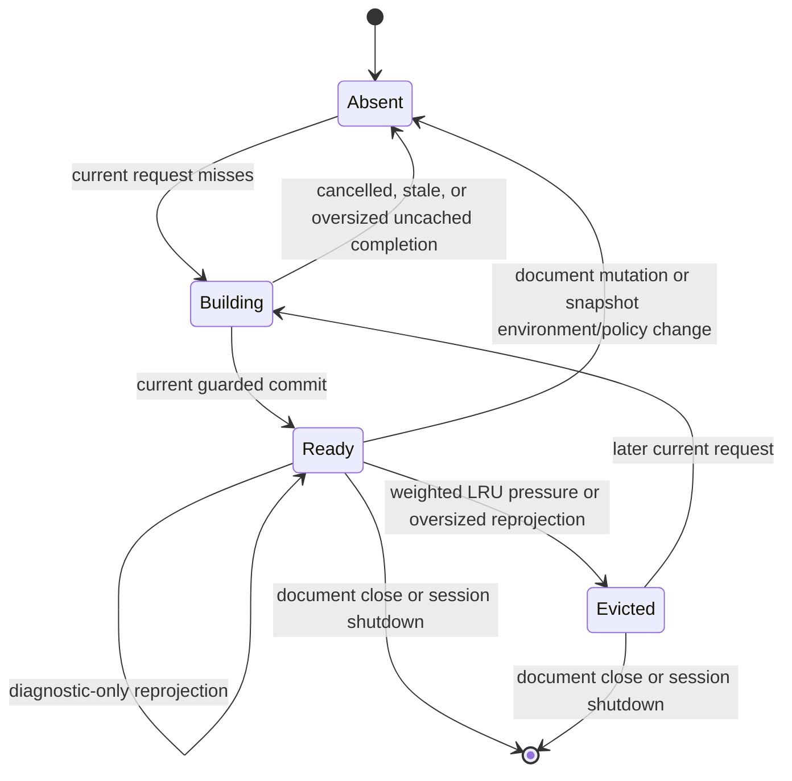
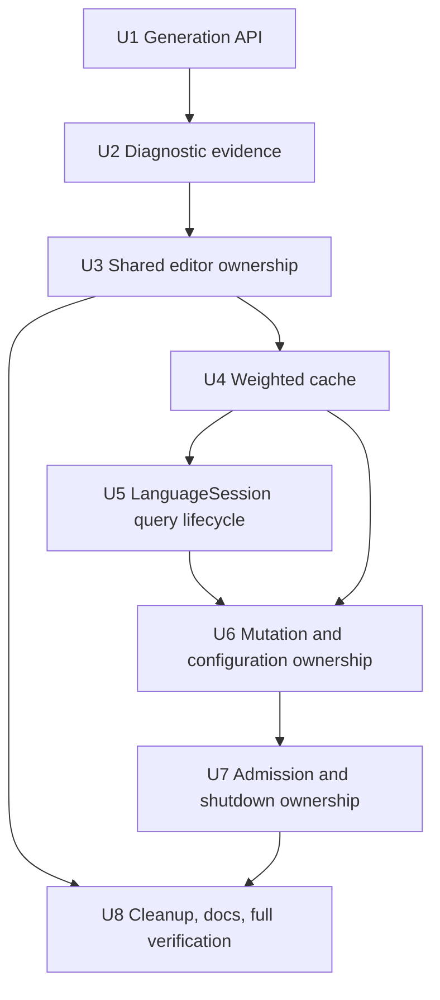

# Analysis Generation and LSP Session Ownership - Plan

## Goal Capsule

- **Objective:** Finish the analysis and LSP architecture around one diagnostic-policy-neutral analysis generation bound to an exact snapshot environment and policy, plus one session-owned state machine; bound retained analysis and editor point-query work, then delete the transaction glue and duplicate retained data that those deep modules replace.
- **Authority:** The accepted analysis, editor, lint-governance, and family-ownership ADRs govern semantics. The maintainer has approved breaking alpha APIs, deleting obsolete code, and performing a fearless refactor when that produces a simpler global design.
- **Execution profile:** Deep, cross-crate Rust refactor with characterization coverage before public contract changes and deterministic concurrency tests before state ownership moves.
- **Stop conditions:** Stop if a change alters Mermaid family semantics without pinned-source evidence, moves language meaning into LSP, introduces a second parser or editor-facts path, or requires discarding unrelated working-tree changes.
- **Tail ownership:** The implementation owns focused verification, simplification, review, migration notes for intentional API breaks, and reviewable commits. It does not own a release, push, or pull request unless separately requested.

---

## Product Contract

### Summary

Merman will expose a sealed, immutable `AnalysisGeneration` whose snapshot-affecting environment is exact and whose diagnostics are projections rather than retained parser state.
`merman-lsp` will own document sequencing, bounded analysis, guarded commits, cache policy, client effects, and shutdown through one `LanguageSession` boundary instead of asking handlers to coordinate store internals.

### Problem Frame

The recent analysis and LSP refactors fixed the urgent correctness failures: custom parser cancellation reaches overlays, analyzer site config is replaced exactly, text edits prepare outside the store lock, duplicate analyses share one job, incoming reads wait for earlier mutations, stdio writes are bounded, and `SourceMap` uses ASCII and sparse Unicode metrics.

The remaining architecture still exposes its implementation protocol. `AnalysisResult` stores a policy-specific payload alongside raw compatibility JSON and core editor facts so diagnostics can be reprojected later, even though the editor index and flowchart facts have already been built. `merman-lsp::DocumentStore` separately owns documents, analyzer configuration transactions, source-limit reclassification, diagnostic reprojection, analysis jobs, snapshot generations, cache entries, semantic-token state, and diagnostic state. `server.rs` and `snapshot_context.rs` must understand capture, blocking compute, stale detection, retry, and commit rules to use it correctly.

That shape makes the next correctness or memory change cross several modules. It also leaves cache-owned complete analysis memory proportional to the number and complexity of open documents without a retained-entry budget. Alpha is the right point to close these contracts rather than preserve another transition layer.

### Requirements

**Canonical analysis generation**

- R1. A rich capture of one source, one immutable analyzer environment, and one exact snapshot policy must produce one sealed immutable analysis generation containing parser disposition, source mapping, editor facts, and policy-neutral diagnostic evidence. The generation retains the opaque environment identity and source metadata, but not the heavyweight site/runtime/source-limit inputs or an initial policy-specific payload. Payload-only diagnostics adapters must reuse the private capture and projection pipeline without constructing a complete generation.
- R2. Diagnostic policy changes must reproject from a generation without parsing again and without retaining the complete compatibility JSON model or core editor-facts graph solely for reprojection.
- R3. `None` site config must restore pinned defaults, explicit site config must replace prior overrides, and custom detector/parser registries must survive environment replacement.
- R4. Cancellation and source rejection must remain outcomes outside a ready generation, and cancelled work must never become a parse diagnostic or a cache entry.
- R5. Rust API names and constructors must describe generation ownership directly; superseded `AnalysisResult` and clone-only convenience APIs must be removed without deprecated aliases.

**Editor and memory ownership**

- R6. Editor and LSP views must share generation-owned indexes, source text, and source maps rather than deep-copy them. Each projected context separately shares one replaceable `Arc<AnalysisPayload>`; no payload is owned by the generation itself.
- R7. A session must enforce a total weighted budget for complete cached analysis entries, including the generation, current projected payload, indexes, source-map growth allowance, and entry-owned snapshot allocations; an entry that cannot fit may be returned to its requester but must not make the cache exceed its budget.
- R8. Cache eviction must not close documents or corrupt committed diagnostic and semantic-token result identity; a later request may rebuild an evicted generation from current document state.
- R9. Point queries over semantic items and reference spans must avoid scanning every item once a generation has already built their indexes, while preserving current selection order exactly.

**LSP session semantics**

- R10. Every inbound message must receive ordering admission before concurrent polling; reads must observe every earlier mutation after it commits or aborts, while independent reads may overlap.
- R11. `LanguageSession` must hide text preparation, analyzer reconfiguration, analysis singleflight, aggregate analysis admission, diagnostic reprojection, stale retry, guarded commit, cache admission, waiter-aware job cancellation, and session cancellation behind typed operations. Preserve the current maximum of two CPU-consuming analyses and eight distinct running-or-waiting jobs unless a later measured policy change replaces those internal constants.
- R12. Parsing, Rope mutation, whole-source scans, diagnostic projection, and protocol serialization must run without holding the session state mutex.
- R13. A guarded commit must validate the document epoch plus every relevant snapshot or diagnostic generation before publishing state or returning a stateful result.
- R14. Exit, EOF, dropped service/socket halves, and stalled output must cancel session work and finish transport shutdown within the existing bounded deadlines.

**Architecture preservation and cleanup**

- R15. `merman-core` remains the family-owned parser boundary, `merman-analysis` remains the semantic/diagnostic boundary, `merman-editor-core` remains protocol-neutral, and `merman-lsp` remains a transport and session projection.
- R16. Current diagnostic JSON, analysis-facts JSON, LSP capability, rule-governance, and parser-backed editor behavior must remain stable unless an intentional Rust-only alpha API break is named in migration documentation.
- R17. Removed transaction types, synchronous production escape hatches, unused workspace helpers, stale aliases, and abandoned experimental code must not remain in the final tree.
- R18. Deterministic tests must cover ordering, cancellation, stale commits, cache eviction, policy-only reprojection, shared ownership, and bounded shutdown without sleep-based race assertions.

### Acceptance Examples

- AE1. Given a custom engine whose site config selects ELK, capturing with a snapshot policy whose site config is `None` uses pinned defaults while the custom parser registry remains installed.
- AE2. Given one captured flowchart generation, projecting core, recommended, disabled-rule, and severity-override policies changes only diagnostics; a parser counter remains at one and editor storage retains pointer identity.
- AE3. Given an analysis cancelled inside a custom overlay or built-in family loop, the caller receives cancellation, no parse diagnostic is fabricated, and the generation cache remains unchanged. Given two waiters sharing a job, cancelling one detaches it without failing the other; the underlying job is cancelled only after the last waiter leaves or the session cancels.
- AE4. Given a `didChange` followed immediately by completion, the completion observes the committed new document or receives `ContentModified`; it never returns a successful result from the older text.
- AE5. Given an analysis that finishes after the document or snapshot policy changes, the guarded commit rejects it and no diagnostic, semantic-token, or analysis cache state is repopulated from that result.
- AE6. Given more current generations than a small injected cache budget can retain, least-recently-used generations are evicted, open documents remain present, cache ownership of displaced generations is released, and requesting an evicted document rebuilds it once through singleflight. Request-local handles may remain valid after eviction and release their final ownership when dropped.
- AE7. Given a writer that remains pending forever, receiving `exit` or EOF terminates the stdio session within the configured write/drain bound and cancels pending handlers.
- AE8. Given a Markdown document with multiple Mermaid fences, generation facts, diagnostic reprojection, editor queries, and LSP ranges preserve the same fence ids and host-document coordinates.

### Success Criteria

- A diagnostic-only policy change performs zero parser calls and allocates no replacement editor snapshot.
- Cached analysis generations never exceed the configured session weight in deterministic cache tests.
- Production LSP handlers no longer call public capture/prepare/commit transaction types from `DocumentStore` or free functions in `snapshot_context.rs`.
- The final public Rust docs contain one canonical generation name and no compatibility alias for the removed prerelease API.
- Focused analysis, editor-core, LSP, binding compile, formatting, and lint gates pass.

### Scope Boundaries

**In scope**

- Breaking Rust API cleanup in `merman-analysis` and affected in-repo callers.
- Protocol-neutral editor snapshot ownership required by the new generation.
- Deterministic point-query indexes that replace confirmed full semantic-item and reference-span scans while preserving current selection semantics.
- LSP session state, cache, sequencing, analysis execution, configuration, client-effect, and shutdown ownership.
- Binding and web adapter changes required to preserve existing JSON contracts after Rust API changes.
- Documentation and tests for the new ownership and migration boundary.

**Deferred to follow-up work**

- Configurable end-user tuning of the internal LSP analysis-cache budget.
- Empirical latency or RSS tuning beyond the deterministic memory, point-query complexity, and execution invariants in this plan.
- New family-specific semantic indexes whose need is not demonstrated by current editor queries.

**Outside this product change**

- New Mermaid syntax, layout, SVG, or pixel-parity behavior.
- `workspace/diagnostic`, `workspace/symbol`, unopened-file indexing, or a new project-wide database.
- A new parser framework, generic dependency ports around in-process Rust crates, or a giant actor command enum.
- FFI wire-format redesign, VS Code marketplace work, CLI ergonomics, Node release tooling, or unrelated benchmark changes.

---

## Planning Contract

### Assumptions

- The current branch includes commits `0cec37a3b`, `5984e7406`, `7f7213b16`, and `6dd54629e`; their cancellation, ordering, source-map, resource, and lifecycle guarantees are baseline behavior to preserve rather than work to recreate.
- The Rust public API is still alpha, so direct migration is preferable to deprecated aliases or a parallel compatibility generation type.
- The LSP analysis cache may evict derived generations because open document text and version remain the authoritative rebuild source.
- The 64 MiB cache limit is an internal default for cache-owned strong references, not a promise to cap total process RSS. Request-local `Arc` clones may outlive eviction; cache accounting becomes zero only after the cache releases its owner.
- The 64 MiB session-cache budget and 256 KiB per-generation source-map metric allowance are initial internal hypotheses, not empirically claimed optima. Before merge, deterministic retained-weight calibration must show that the production cache default admits at least one complete entry for representative family fixtures at the 4 MiB source-limit boundary; adjust the internal default if that corpus does not fit. Constructors remain injectable for deterministic tests, and cache statistics permit later tuning without changing ownership contracts. Pathological legal inputs may still be returned uncached rather than weakening the hard budget.
- Existing repository patterns and accepted ADRs provide stronger guidance than generic external concurrency or cache advice, so no external research is load-bearing for this plan.
- Unrelated dirty files may change concurrently; implementation stages and commits only files owned by this plan.

### Key Technical Decisions

- KTD1. **Make `AnalysisGeneration` the one deep analysis module.** (session-settled: user-approved — chosen over exposing separate captured-evidence and projection-session lifecycles: one immutable generation makes invalid evidence/source/environment pairings unrepresentable.) The generation owns source mapping, parser disposition, normalized editor facts, flowchart facts, and policy-neutral diagnostic candidates, but no initial payload. `Analyzer::analyze_generation*` returns `AnalysisCaptureOutcome::{Ready, Rejected}`; `AnalysisGeneration::project*` accepts only `AnalysisDiagnosticPolicy`. A projected editor/LSP context pairs `Arc<AnalysisGeneration>` with `Arc<AnalysisPayload>` as a replaceable view. Existing payload-only `Analyzer::analyze*` adapters use the same private parser capture and candidate projection but retain the current diagnostics-only materialization mode, so they do not build or retain editor indexes or expose a second rich ownership type.
- KTD2. **Use synchronous admission plus a typed `LanguageSession` execution boundary.** (session-settled: user-approved — chosen over a giant session actor and over handler-owned capture/compute/commit transactions: admission remains provable at the Tower boundary while expensive work stays concurrent and state protocols stay private.)
- KTD3. **Freeze analyzer environment, snapshot policy, and diagnostic policy separately.** `Analyzer` owns custom registries plus an opaque `Arc`-backed environment identity token. Clones and diagnostic-policy-only derivatives preserve the token; constructing a different parser environment or snapshot policy replaces it. Each capture applies the exact `AnalysisSnapshotPolicy`, then the generation retains the token and source metadata rather than keeping heavyweight parse-only policy inputs alive. Projection receives only `AnalysisDiagnosticPolicy`. The aggregate options transport may remain where JSON/config decoding needs it, not as the internal ownership model.
- KTD4. **Normalize diagnostics before retaining a generation, then project in semantic order.** Parser/core errors, source rules, warning facts, recovery facts, fixes, and spans become compact policy-neutral candidates. Each candidate retains its owning rule, suppressor ids, parse-location class, recovery kind, stable emission ordinal, status/code, message/help, diagram type, ordered related locations, and all-or-nothing ordered fixes. Candidate projection runs `rule/profile filtering -> rule-family dominance -> parse/recovery merge and deduplication -> severity resolution -> payload summary` in that order. Markdown candidates and every nested span/fix are remapped to host coordinates once during capture. Raw compatibility JSON, core editor facts, and local fence source maps are then dropped.
- KTD5. **Share immutable data by identity.** `FenceTextIndex`, source text, source maps, canonical generations, and unchanged payloads use `Arc`-backed ownership. APIs expose borrowed views or shared handles, not clone-producing `into_parts` paths.
- KTD6. **Bound source-map metrics, then use a weighted LRU for complete derived LSP entries.** Replace `SourceMap`'s unbounded per-line metric `HashMap` with a private 256 KiB weighted cache; oversized individual metrics are returned uncached. This makes its retained lazy growth finite. The LSP's initial internal budget is 64 MiB, with a test-only constructor for smaller deterministic limits. `CachedAnalysisEntry` accounts for its generation, current payload, indexes, the full source-map metric allowance, and entry-owned snapshot allocations. Source text already owned by the document table is not double-counted. Diagnostic reprojection atomically changes entry weight and enforces eviction; a newly oversized current entry is returned to the requester but removed from the cache.
- KTD7. **Keep concrete dependency direction.** `merman-lsp` calls concrete `merman-analysis` and `merman-editor-core` types. No parser/analyzer/editor port traits are introduced because these are in-process workspace dependencies, not replaceable infrastructure.
- KTD8. **Break cleanly and delete transition code.** (session-settled: user-directed — chosen over compatibility aliases and dual paths: the maintainer authorized alpha breaks so the final architecture does not preserve the refactor scaffolding.)
- KTD9. **Preserve bounded WASM one-shot reuse without making it an analysis ownership model.** Migrate the existing one-entry same-input cache to a generation-backed context and keep `WasmEditorSession` as the explicit multi-call lifetime API. A cache-key mismatch replaces the sole entry and releases its old generation when no caller holds it; no multi-document or policy cache is introduced.

The public rich lifecycle has one exact shape; concrete shared-document and cancellable variants follow the same ownership contract:

```rust
pub enum AnalysisCaptureOutcome {
    Ready(AnalysisGeneration),
    Rejected(AnalysisRejection),
}

impl Analyzer {
    pub fn analyze_generation(&self, source: &str) -> AnalysisCaptureOutcome;
    pub fn with_diagnostic_policy(&self, policy: AnalysisDiagnosticPolicy) -> Self;
    pub fn with_snapshot_policy(&self, policy: AnalysisSnapshotPolicy) -> Self;
}

impl AnalysisGeneration {
    pub fn project(&self, policy: &AnalysisDiagnosticPolicy) -> AnalysisPayload;
}
```

Cancellation remains a distinct result around `AnalysisCaptureOutcome`, and shared-source entry points return the same generation type rather than a second shared wrapper. The existing diagnostics-only `Analyzer::analyze*` surface remains a payload API, not an alias for the rich lifecycle.
`with_diagnostic_policy` clones the configured engine and preserves its environment identity token. `with_snapshot_policy` clones the same custom registries, applies the exact new snapshot policy, and installs a new token. `with_engine` remains the explicit custom-engine/registry replacement path and also installs a new token.

### High-Level Technical Design

#### Implemented baseline to preserve

| Existing guarantee | Current anchor | Plan responsibility |
|---|---|---|
| Snapshot and diagnostic policies are distinct | `AnalysisSnapshotPolicy`, `AnalysisDiagnosticPolicy` | Freeze them in the final generation/project API; do not recreate the split. |
| Site config replacement is exact and custom registries survive it | `Engine::with_exact_site_config`, analyzer custom-engine tests | Add environment identity and preserve the existing replacement behavior. |
| Capture is cancellable through custom and built-in parsers | `ParseControl`, controlled capture tests | Keep cancellation outcomes outside ready generations and cache commits. |
| Reprojection parses once and preserves editor identity | analyzer and editor-core reprojection tests | Replace raw evidence with candidates while retaining these tests as characterization. |
| `FenceTextIndex` storage is already `Arc`-backed | `FenceTextIndexData` | Put new point indexes in the existing shared allocation rather than wrapping it again. |
| LSP admission, bounded work, sparse source maps, and output deadlines are implemented | commits named in Assumptions | Move ownership without weakening the existing deterministic guarantees. |

#### Compatibility oracles

| Surface | Required baseline and equality rule |
|---|---|
| Diagnostic and analysis-facts JSON | Capture the pre-change representative fixture corpus before deleting the old evidence path; compare complete structural output, including array order, ids, status/code, ranges, related locations, fixes, summary, validity, and schema versions. |
| Rule governance and reprojection | Drive every registered diagnostic rule with a representative applicable fixture; compare fresh analysis under each policy with projection from one generation and require one parser invocation. |
| Parser-backed editor behavior | Keep existing editor fixtures and use the prior linear point-query implementations as test-only per-offset differential oracles until indexed behavior matches exactly. |
| LSP protocol | Preserve capability snapshots plus diagnostic, semantic-token, stale-result, admission, and shutdown contract tests; Rust ownership names are not part of the protocol oracle. |
| Binding, WASM, CLI, and web adapters | Preserve existing serialized fixtures and TypeScript contracts; CLI/xtask compilation covers Rust-only name migration. |

#### Ownership topology



#### Ordered request and guarded commit sequence



#### Generation cache lifecycle



### Output Structure

```text
crates/merman-lsp/src/
  session.rs                    # LanguageSession ownership and Tower admission facade
  session/
    analysis.rs                 # bounded acquire/project/guarded-commit operations
    cache.rs                    # weighted current-generation LRU
    documents.rs                # text mutation and document epoch state
    lifecycle.rs                # cancellation, client effects, and shutdown ownership
```

The exact split may tighten during implementation, but `server.rs` must consume the deep session API rather than the submodules.

### Dependency And Delivery Order



### System-Wide Impact

- `crates/merman-core` keeps family construction and controlled parser overlays; only generation capture consumes its closed snapshot differently.
- `crates/merman-analysis` changes its public Rust ownership vocabulary and internal diagnostic pipeline while keeping serialized payload versions stable.
- `crates/merman-editor-core` becomes a borrowed/shared view over one generation and loses unused multi-snapshot and clone-only helpers.
- `crates/merman-lsp` moves from handler-orchestrated transactions to a session-owned state machine and introduces a bounded derived-generation cache.
- Affected bindings, WASM, CLI/xtask, and web consumers adapt to renamed Rust APIs while current JSON and TypeScript result contracts remain stable.
- Maintainers gain one place to reason about state generations, cache eviction, cancellation, and guarded commits.

### Risks And Mitigations

| Risk | Consequence | Mitigation |
|---|---|---|
| Candidate normalization changes diagnostic behavior | Pull/push/CLI/binding payloads drift despite no intended product change | Characterize representative parse, recovery, warning, fix, Markdown remap, and severity cases before replacing raw evidence; compare full payloads across policies. |
| The new generation API causes a wide mechanical diff | Review becomes difficult and hidden semantic changes slip in | Land the type/API boundary separately from candidate compaction and keep JSON contracts unchanged. |
| Weighted eviction causes repeated expensive analysis | Large workspaces trade memory pressure for latency spikes | Use LRU recency, retain only current document generations, preserve singleflight, and expose deterministic cache statistics for tests. |
| Weight estimates undercount shared or lazy allocations | The nominal budget does not bound cache-owned memory | Account at `CachedAnalysisEntry`, reserve maximum lazy source-map growth, reweigh payload reprojection, and avoid double-counting document-owned source text. |
| Public generation naming collides with LSP's numeric `AnalysisGeneration` | Imports become ambiguous and a state epoch is mistaken for semantic data | Rename the private LSP counter to `AnalysisJobGeneration` before importing the public generation type. |
| `LanguageSession` becomes another god object | The refactor merely renames `DocumentStore` | Keep a narrow facade over private document, analysis, cache, and lifecycle submodules; server handlers cannot reach submodule transaction types. |
| Ordering tests become scheduler dependent | Concurrency regressions become flaky or invisible | Reuse admission gates, cancellation tokens, pending writers, and deterministic test hooks; do not assert timing through arbitrary sleeps. |
| Concurrent unrelated work overlaps touched files | User changes are lost or accidentally committed | Re-read diffs before edits and commits, preserve foreign changes, and stage only plan-owned paths. |

### Alternative Approaches Considered

- **Keep the current sealed `AnalysisResult` and patch individual clones.** Rejected because policy-specific payload plus raw reprojection evidence remains a confused ownership model and cache accounting stays opaque.
- **Expose `CapturedEvidence` and `ProjectionSession` as separate public phases.** Rejected by KTD1 because callers could pair evidence, source maps, environments, and policies incorrectly.
- **Move the entire LSP into one actor command loop.** Rejected by KTD2 because a large command/reply enum would serialize unrelated work and duplicate Tower's typed request surface.
- **Leave capture/compute/commit plans public inside the crate.** Rejected because every caller would continue to own epoch and retry correctness.
- **Use entry-count cache limits.** Rejected because a tiny diagram and a near-limit Markdown document have materially different retained weight.
- **Add abstraction traits for parser, analyzer, and editor layers.** Rejected by KTD7 because they add indirection without an alternate implementation or process boundary.

### Sources And Research

- `docs/adr/0070-diagnostics-first-analysis-contract.md` owns canonical diagnostics, source mapping, and binding projection.
- `docs/adr/0071-editor-parser-semantic-seam.md` owns sealed parser-backed facts and the analysis/editor/LSP dependency direction.
- `docs/adr/0072-lint-rule-governance.md` owns rule enablement, severity, and authority policy.
- `docs/adr/0073-family-owned-diagram-architecture.md` owns family-local semantics and controlled custom parser overlays.
- `docs/plans/2026-07-02-001-refactor-analysis-editor-snapshot-seams-plan.md` and `docs/plans/2026-07-02-002-refactor-lsp-interleaving-hardening-plan.md` establish the implemented analyzer invalidation and stale-state contracts this plan preserves.
- `crates/merman-analysis/src/analyzer.rs`, `crates/merman-analysis/src/result.rs`, and `crates/merman-analysis/src/source_map.rs` are the current generation, reprojection, and coordinate anchors.
- `crates/merman-lsp/src/session.rs`, `crates/merman-lsp/src/document_store.rs`, `crates/merman-lsp/src/snapshot_context.rs`, and `crates/merman-lsp/src/analysis_executor.rs` demonstrate the correct recent primitives and the transaction protocol that remains exposed.

---

## Implementation Units

### U1. Establish The Sealed Analysis Generation API

- **Goal:** Replace result-shaped ownership with an exact snapshot engine and a sealed immutable generation.
- **Requirements:** R1, R3, R4, R5, R15, R16
- **Dependencies:** None
- **Files:** `crates/merman-analysis/src/analyzer.rs`, `crates/merman-analysis/src/result.rs`, `crates/merman-analysis/src/document.rs`, `crates/merman-analysis/src/lib.rs`, `crates/merman-analysis/src/options_json.rs`, `crates/merman-analysis/src/analyzer/tests.rs`, `crates/merman-analysis/tests/analyzer.rs`, `crates/merman-analysis/README.md`, `crates/merman-core/src/lib.rs`, `crates/merman-editor-core/src/workspace.rs`, `crates/merman-lsp/src/snapshot.rs`, `crates/merman-lsp/src/analysis_request.rs`, `crates/merman-lsp/src/analysis_executor.rs`
- **Approach:** Keep `Analyzer` as the configured parser facade, rename the rich canonical output to `AnalysisGeneration`, and replace rich `AnalysisOutcome` with `AnalysisCaptureOutcome`. `Analyzer::analyze_generation*` applies its opaque environment identity and exact `AnalysisSnapshotPolicy`; the sealed generation retains the identity and source metadata while releasing parse-only site/runtime/source-limit inputs. `AnalysisGeneration::project*` accepts `AnalysisDiagnosticPolicy` and returns a payload view without mutating the generation. During U1, payload-only adapters retain the existing private diagnostics-mode capture/projection path so the API migration compiles without anticipating U2's candidate representation. Keep source rejection and cancellation outside the ready type, rename LSP's numeric `AnalysisGeneration` counter to `AnalysisJobGeneration`, migrate every direct Rust type reference in this unit, and then delete old names without aliases so U1 lands compiling.
- **Execution note:** Add characterization assertions for current payload and parser-count behavior before changing the public ownership types.
- **Patterns to follow:** `Engine::with_exact_site_config`, sealed `DiagramParseSnapshot`, `AnalysisOutcome::Ready/Rejected`, and the existing controlled-capture tests.
- **Test scenarios:**
  1. A custom registry survives construction of an engine with default snapshot policy.
  2. `None` site config clears an engine's earlier nested site overrides; a partial explicit config does not inherit unspecified prior override fields.
  3. Runtime policy, source descriptor, and max-source budget are frozen in the capture request; only the source descriptor remains inspectable through generation metadata after parsing.
  4. Identical snapshot policies on analyzers with different custom parser registries have different environment identities and cannot be treated as interchangeable generations; analyzer clones and diagnostic-policy-only derivatives preserve identity.
  5. Source rejection returns its compact rejection payload and does not construct a ready generation.
  6. Cancellation before, during, and after family parsing returns cancellation and no ready generation.
  7. Payload-only diagnostics preserve `AnalysisMode::Diagnostics` materialization and do not build a `FenceTextIndex` or complete generation.
  8. `Analyzer::analyze_generation`, its cancellable/shared document equivalents, and `AnalysisGeneration::project` are the only rich capture/projection lifecycle; public compile examples use the new vocabulary and old names are absent rather than deprecated.
  9. `with_diagnostic_policy` preserves custom registries and environment identity, while `with_snapshot_policy` preserves custom registries but replaces identity and exact site/runtime/source-limit policy; neither path rebuilds from `Engine::new()`.
- **Verification:** A caller can capture and inspect a generation without access to constructors or parser evidence, and every in-repo Rust consumer compiles against the new ownership API.

### U2. Retain Policy-Neutral Diagnostic Evidence

- **Goal:** Reproject diagnostics without retaining complete parser JSON models or core editor-facts graphs after generation construction.
- **Requirements:** R1, R2, R4, R6, R16, R18
- **Dependencies:** U1
- **Files:** `crates/merman-analysis/src/analyzer.rs`, `crates/merman-analysis/src/result.rs`, `crates/merman-analysis/src/payload.rs`, `crates/merman-analysis/src/rules.rs`, `crates/merman-analysis/src/diagnostic_projection.rs`, `crates/merman-analysis/src/recovery.rs`, `crates/merman-analysis/src/source_config_rewrite.rs`, `crates/merman-analysis/src/document.rs`, `crates/merman-analysis/src/analyzer/tests.rs`, `crates/merman-analysis/src/rules/tests.rs`, `crates/merman-analysis/tests/payload_schema.rs`
- **Approach:** Introduce a crate-private diagnostic-candidate representation carrying every field and arbitration input named by KTD4. Build and host-remap all candidates plus editor syntax projections during the controlled capture, switch the payload-only adapters to the shared candidate projection while retaining diagnostics-only materialization, then drop raw compatibility JSON and core editor facts. Change frontmatter migration fixes to consume the already captured `ParseMetadata.config` instead of reparsing through the global `migration_engine`; no ready-generation path may invoke a second `Engine`. Projection follows KTD4's fixed order and emits the same stable diagnostic order and full payload fields as the current pipeline.
- **Patterns to follow:** Existing `RuleDescriptor`, parser warning facts, `AnalysisRecoveryDiagnostic`, diagnostic fix metadata, and Markdown remapping helpers.
- **Test scenarios:**
  1. Core, recommended, disabled-rule, and severity-override projections from one generation match the current complete payload shapes and parse only once.
  2. Exact parser spans, fallback related locations, recovery deduplication, and insertion-point diagnostics survive candidate normalization.
  3. Flowchart warning facts, git-graph duplicate ids, block width warnings, source directives, and internal projection failures preserve ids, categories, fixes, and diagram types.
  4. Markdown fence candidates reproject to host-document spans once and do not rebuild fence-local source maps.
  5. Unknown warning rule ids still produce the internal registry-gap diagnostic independent of host rule policy.
  6. The four enabled/disabled combinations of `prefer_frontmatter_config` and `prefer_init_directive` preserve current precedence, absence, severity, and fix behavior from one parse generation.
  7. The four enabled/disabled combinations of `diagram_parse` and `recovered_editor_facts` independently emit or merge recovery diagnostics exactly as today.
  8. Full-payload comparisons preserve diagnostic ordinal, status/code name, help, diagram type, related-location order, fix title/preferred flag, replacement order, summary, and `valid`.
  9. A counting custom engine proves frontmatter fix capture, initial projection, and later reprojection still use one parser call.
  10. Test-only introspection proves a ready generation retains neither a policy-specific payload nor a full semantic JSON `Value` or `EditorSemanticFacts` solely for diagnostics.
  11. A table-driven corpus covers every registered diagnostic rule and every family that currently emits governed diagnostics; fresh-policy output and projection from one generation are structurally identical under the compatibility oracle, and the parser count remains one.
- **Verification:** Diagnostic reprojection is a candidate-to-payload operation with no parser/model dependency, and the diagnostics/facts wire snapshots remain version-compatible.

### U3. Make Editor And Adapter Views Share Generation Storage

- **Goal:** Ensure editor-core, LSP, and one-shot adapters share the immutable generation and remove clone-producing convenience layers.
- **Requirements:** R5, R6, R9, R15, R17
- **Dependencies:** U2
- **Files:** `crates/merman-analysis/src/editor.rs`, `crates/merman-analysis/src/editor/core_facts.rs`, `crates/merman-analysis/src/result.rs`, `crates/merman-editor-core/src/snapshot.rs`, `crates/merman-editor-core/src/workspace.rs`, `crates/merman-editor-core/src/structure.rs`, `crates/merman-editor-core/src/lib.rs`, `crates/merman-editor-core/tests/document_workspace.rs`, `crates/merman-editor-core/tests/structure.rs`, `crates/merman-lsp/src/snapshot.rs`, `crates/merman-wasm/src/editor_language.rs`, `crates/xtask/src/cmd/editor_token_descriptor.rs`
- **Approach:** Make editor document and fence snapshots lightweight views over one coarse-grained `Arc<AnalysisGeneration>` plus private generation-local diagram ordinals and indexed item ids instead of cloning diagram descriptors and strings. Put start-ordered interval indexes with subtree maximum ends for semantic items and reference spans inside the existing `Arc<FenceTextIndexData>` allocation; indexes contain integer item ids and interval metadata, not duplicate semantic items or names. Preserve the current smallest-span/selection/name semantic tie-break, post-selection Entity filtering, and BTree group/span reference order exactly, using old linear implementations as test-only differential oracles. Let the LSP build its projected context directly so it does not first allocate editor diagnostics that are immediately discarded. Remove `DocumentAnalysisContext::into_parts`, snapshot-only static builders, and the unused multi-snapshot workspace-symbol helper; migrate xtask and the bounded WASM one-entry cache to the canonical generation-backed context builder.
- **Patterns to follow:** The existing `Arc<FenceTextIndexData>`, shared `Arc<AnalysisPayload>` ownership, single-document `search_document_symbols`, and explicit WASM editor sessions.
- **Test scenarios:**
  1. Analysis, editor, and LSP views of one fence share text-index allocation identity.
  2. The first projected diagnostic payload is shared by its context consumers; diagnostic-only reprojection replaces only the payload view and preserves generation/editor identity.
  3. Nested and overlapping semantic spans return the same smallest-item result before and after indexed lookup, preserving half-open non-empty spans, exact empty spans, and the complete tie-break order.
  4. Entity lookup still selects the globally smallest semantic item first and only then filters its role; an inner non-Entity continues to hide an outer Entity.
  5. Reference point lookup preserves current group and span order for overlapping, adjacent, and empty spans while avoiding a full group/span scan.
  6. Differential tests compare every byte boundary against old linear semantic/reference oracles, while test-only visited-node counts prove logarithmic pruning on non-overlapping data without timing assertions.
  7. Repeated one-shot WASM calls with the same source, URI, and options reuse one generation; a key mismatch replaces the sole cache entry, and `Weak` lifetime assertions show the displaced generation is released after outstanding callers drop it.
  8. The LSP path does not materialize an editor diagnostic collection before creating its protocol view.
  9. Single-document symbol, references, rename, completion, hover, folding, selection, and semantic-token tests remain parser-fact backed.
  10. Removed public helpers have no production references or re-exports.
  11. One multi-fence Markdown document preserves each fence's generation order, source identity, and host range across generation facts, first and reprojected diagnostics, editor queries, and LSP range conversion.
- **Verification:** Pointer-identity tests prove shared immutable storage, query behavior remains stable, and no clone-only compatibility facade remains.

### U4. Bound The LSP Analysis Generation Cache

- **Goal:** Enforce a deterministic budget for cache-owned complete analysis entries with rebuild-on-miss behavior.
- **Requirements:** R6, R7, R8, R13, R18
- **Dependencies:** U3
- **Files:** `crates/merman-analysis/src/result.rs`, `crates/merman-analysis/src/payload.rs`, `crates/merman-analysis/src/editor.rs`, `crates/merman-analysis/src/source_map.rs`, `crates/merman-lsp/src/session.rs`, `crates/merman-lsp/src/session/cache.rs`, `crates/merman-lsp/src/snapshot.rs`, `crates/merman-lsp/src/document_store.rs`, `crates/merman-lsp/src/document_store_tests.rs`, `crates/merman-lsp/src/analysis_executor.rs`
- **Approach:** First implement KTD6's bounded weighted line-metric cache and charge its full allowance in every retained generation. Then give all generation and payload components saturating retained-weight estimates based on owned capacities and replace the URI map with a `CachedAnalysisEntry` LRU over complete contexts. Only a guarded use of the current epoch/generation touches recency. Diagnostic reprojection atomically reweighs entries without changing unaffected recency order; stale batches and `HashMap` iteration order cannot influence eviction. Evict derived entries only, admit an oversized result as uncached, and keep document text, committed diagnostic ids, semantic-token baselines, in-flight work, and request-local `Arc` handles explicitly outside this cache-owned budget. Expose test-visible hit, miss, eviction, oversized-entry, current-weight, and high-water statistics so the initial 64 MiB/256 KiB policies can be calibrated against representative documents without making them public protocol.
- **Execution note:** Treat 64 MiB as a starting value. Generate retained-weight reports for representative flowchart, Markdown, and high-fact-count family fixtures near the LSP source limit; keep the hard uncached-oversized behavior, but raise the internal default before merge if the representative single-document corpus cannot be retained.
- **Patterns to follow:** Existing source byte preflight, sparse `SourceMap` checkpoints, `AnalysisExecutor` singleflight placeholders, and guarded cache insertion.
- **Test scenarios:**
  1. Dense ASCII lines, many short Unicode lines, and one oversized Unicode line cannot retain more than the 256 KiB source-map metric allowance after every line is queried; oversized metrics remain correct while uncached.
  2. A tiny injected budget evicts least-recently-used generations in deterministic order.
  3. Touching an entry changes the next eviction victim without changing document epochs.
  4. A complete entry larger than the whole budget is returned but not retained, and total cached weight remains within budget.
  5. Eviction preserves open documents and token/diagnostic result state; a later request rebuilds through one singleflight execution.
  6. Stale or cancelled results contribute no cache weight and cannot evict current entries.
  7. A larger reprojected payload updates weight before commit, triggers deterministic eviction or uncaching, and never lets total cache weight exceed the budget.
  8. Zero budget, equal weights, saturating arithmetic overflow, stale completion, and batch reprojection in different map orders produce deterministic admission, touch, and eviction behavior.
  9. `Weak` lifetime tests show eviction releases cache ownership while request-local handles remain valid and are freed only after their holders drop.
  10. The production default admits one complete entry for every representative source-limit-boundary calibration fixture; synthetic entries above the calibrated default remain correct and uncached.
- **Verification:** Cache statistics expose entry count and total weight for tests, and every mutation keeps total weight at or below the configured limit.

### U5. Move Snapshot Acquisition Behind LanguageSession

- **Goal:** Make `LanguageSession` the only handler-facing owner of analysis capture, singleflight, reprojection, retry, and guarded snapshot commit.
- **Requirements:** R10, R11, R12, R13, R15, R18
- **Dependencies:** U4
- **Files:** `crates/merman-lsp/src/lib.rs`, `crates/merman-lsp/src/session.rs`, `crates/merman-lsp/src/session/analysis.rs`, `crates/merman-lsp/src/document_store.rs`, `crates/merman-lsp/src/snapshot_context.rs`, `crates/merman-lsp/src/analysis_request.rs`, `crates/merman-lsp/src/server.rs`, `crates/merman-lsp/src/snapshot_context_tests.rs`, `crates/merman-lsp/src/server/tests.rs`
- **Approach:** Introduce `LanguageSession` as the sole handler-facing analysis/query facade and provide typed snapshot operations for diagnostics, code actions, semantic tokens, and structure. Move the complete lock-capture, worker-compute, bounded-retry, guarded-commit lifecycle into the session analysis submodule. Until U6, document mutation and configuration state may remain a private implementation dependency behind that facade; handlers may not access it. Delete `snapshot_context.rs` and make request keys and commit tickets private implementation details.
- **Patterns to follow:** Current `MermanLspService` admission, `AnalysisExecutor`, `SnapshotContextKind` stale policy, and post-compute currentness checks.
- **Test scenarios:**
  1. Concurrent identical snapshot requests share one analysis and return shared context identity.
  2. A document edit during analysis rejects the old commit; structure returns `ContentModified`, pull diagnostics use their bounded latest-context behavior, and push work is suppressed.
  3. A diagnostic-only policy change reprojects an existing generation without rebuilding editor facts.
  4. A snapshot-affecting policy change invalidates cached generations and cancels older analysis.
  5. Cache eviction followed by concurrent queries starts one rebuild.
  6. Server handlers cannot bypass `LanguageSession` to insert a built analysis or test currentness manually.
  7. At most two analyses consume CPU and at most eight distinct jobs run or wait; a ninth distinct request waits for capacity while duplicate keys still join their existing job.
  8. Cancelling one of multiple waiters detaches only that waiter, the remaining waiter can receive and commit the current result, and dropping the last waiter cancels and removes unfinished work without cache admission.
- **Verification:** Production request handlers consume session operations and no longer orchestrate executor/store transaction types.

### U6. Move Text And Configuration Transactions Behind LanguageSession

- **Goal:** Complete `LanguageSession` as the sole owner of document mutation, analyzer reconfiguration, analysis, and derived session state.
- **Requirements:** R10, R11, R12, R13, R17, R18
- **Dependencies:** U4, U5
- **Files:** `crates/merman-lsp/src/lib.rs`, `crates/merman-lsp/src/session.rs`, `crates/merman-lsp/src/session/documents.rs`, `crates/merman-lsp/src/session/analysis.rs`, `crates/merman-lsp/src/document_store.rs`, `crates/merman-lsp/src/server.rs`, `crates/merman-lsp/src/document_store_tests.rs`, `crates/merman-lsp/src/server/tests.rs`
- **Approach:** Move open/change/close, source-limit reclassification, diagnostic reprojection, and analyzer replacement behind typed session operations. Keep Rope work and full-source spans on blocking workers, then commit through private epoch/configuration tickets. Diagnostic-policy-only updates use `Analyzer::with_diagnostic_policy` to preserve the existing `Arc` environment identity and reproject current generations; snapshot-affecting updates use `Analyzer::with_snapshot_policy`, while explicit custom-engine replacement uses `Analyzer::with_engine`, and both install a new identity that invalidates old generations. Collapse per-URI document text, epoch, current generation, and derived state into one private document entry, relocate the remaining tests under session ownership, then delete `document_store.rs` and its module declaration. Remove synchronous production escape hatches and exported plan/batch/request types.
- **Patterns to follow:** Existing `TextChangePlan::prepare`, `PreparedDocumentText`, analyzer configuration request ids, diagnostic-only reprojection, and current no-op configuration behavior.
- **Test scenarios:**
  1. Full replacement and valid ranged changes prepare outside the state lock and commit in admission order.
  2. Invalid ranges produce the current full-sync-required state; a later full replacement recovers it.
  3. Oversized replacements discard source after computing an honest span; lowering and raising the limit reclassifies only current epochs.
  4. A newer document edit or configuration request makes an older prepared result stale without mutating the document.
  5. Unchanged options preserve cache, diagnostic state, token state, and client effects.
  6. Diagnostic-only options preserve generation/editor identity; snapshot-affecting options invalidate derived state atomically.
  7. Repeated diagnostic-policy-only updates retain one environment identity and never parse again, while replacing a custom parser registry creates a distinct identity even when snapshot policy values are equal.
- **Verification:** The session mutex protects only short state transitions, and server handlers contain no Rope, source-limit, reprojection, or configuration transaction choreography.

### U7. Consolidate Admission, Effects, And Session Shutdown

- **Goal:** Put the ordering fence, client-effect queue, cancellation tree, backend lifetime, and bounded transport drain under one session lifecycle.
- **Requirements:** R10, R11, R14, R18
- **Dependencies:** U6
- **Files:** `crates/merman-lsp/src/session.rs`, `crates/merman-lsp/src/session/lifecycle.rs`, `crates/merman-lsp/src/server.rs`, `crates/merman-lsp/src/transport.rs`, `crates/merman-lsp/src/server/tests.rs`, `crates/merman-lsp/tests/stdio_smoke.rs`, `crates/merman-lsp/README.md`
- **Approach:** Retain admission at `Service::call`, but make the admitted backend and all child work share one `LanguageSession` lifetime. Move the current clone-lifetime holder and effect cancellation into that owner. Ensure control messages can stop admission/work and transport timeouts cover write, flush, and shutdown without waiting for an undriven socket half.
- **Patterns to follow:** `InputOrder`, task-local mutation completion, latest-wins `ClientEffectDispatcher`, session cancellation children, and existing output write/shutdown timeouts.
- **Test scenarios:**
  1. Pipelined initialize, notification, shutdown, and read requests route according to admission rather than future polling order.
  2. Dropped or rejected mutations complete their sequence slot and cannot deadlock later reads.
  3. Independent reads overlap after their admission prerequisites are satisfied.
  4. Dropping service or socket ownership cancels analysis and queued effects exactly once.
  5. Permanently pending output write, flush, and shutdown each terminate within the bounded session deadline after exit or EOF.
  6. Exit stops new work, cancels active handlers, and does not require draining undeliverable output.
- **Verification:** Lifecycle tests have deterministic gates and pending I/O fakes, all session tasks terminate, and no separate backend lifetime shim remains.

### U8. Remove Superseded APIs And Publish The Ownership Contract

- **Goal:** Delete migration residue, update all internal consumers, and document the final architecture and intentional alpha breaks.
- **Requirements:** R5, R15, R16, R17, R18
- **Dependencies:** U3, U7
- **Files:** `crates/merman-analysis/README.md`, `crates/merman-editor-core/README.md`, `crates/merman-lsp/README.md`, `docs/adr/0070-diagnostics-first-analysis-contract.md`, `docs/adr/0071-editor-parser-semantic-seam.md`, `docs/lsp/README.md`, `docs/lsp/DIAGNOSTIC_PROTOCOL.md`, `crates/merman-bindings-core/src/engine.rs`, `crates/merman-wasm/src/lib.rs`, `crates/merman-wasm/src/editor_language.rs`, `crates/merman/src/lib.rs`, `platforms/web/src/runtime-analysis.ts`, `platforms/web/src/runtime-editor.ts`
- **Approach:** Finish adapter documentation and migration prose after direct callers have already moved in their owning units, then remove residual re-exports, aliases, unused helper constructors, transaction structs, and test-only production methods. Preserve serialized contracts and TypeScript result naming where they are wire/API concepts rather than Rust ownership types.
- **Patterns to follow:** ADR updates that record current accepted architecture, versioned payload contract tests, and direct alpha migration notes without compatibility shims.
- **Test scenarios:**
  1. Binding, WASM, and web analysis fixtures serialize the same diagnostics and facts versions after Rust API migration; CLI and xtask consumers compile against the new Rust names.
  2. LSP capability and diagnostic protocol docs match implemented methods and do not claim workspace diagnostics or symbols.
  3. Rust-source symbol searches find no definitions, re-exports, imports, or production uses of removed ownership names, transaction types, workspace helpers, duplicate site-config comparisons, or legacy uncancellable parser aliases; migration documentation and preserved TypeScript wire/API names are explicit exclusions.
  4. Public documentation examples compile with the new analysis API.
  5. The final diff contains no dead branches, temporary adapters, ignored failing tests, or unrelated generated-file churn.
- **Verification:** All consumers use one generation and one LSP session ownership model, and documentation names the breaking migration without preserving the old code path.

---

## Verification Contract

| Gate | Applies To | Done Signal |
|---|---|---|
| `cargo fmt --all --check` | U1-U8 | All touched Rust code is formatted and formatting creates no unrelated diff. |
| `cargo nextest run -p merman-analysis -p merman-editor-core --no-fail-fast` | U1-U4 | Analysis and editor behavior pass together. |
| `cargo nextest run -p merman-lsp --features stdio --no-fail-fast` | U1, U3-U7 | Store, session, server, transport, and stdio behavior compile and pass with the non-default stdio surface enabled. |
| `cargo nextest run -p merman-core -E 'test(parse_control) or test(diagram_registry) or test(parse_diagram_snapshot)'` | U1-U2 | Controlled parser and custom overlay contracts remain intact. |
| `cargo nextest run -p merman-bindings-core --features analysis --no-fail-fast` | U1-U3, U8 | The non-default binding analysis surface compiles and preserves public serialized behavior. |
| `cargo nextest run -p merman-wasm --features editor --no-fail-fast` | U1, U3, U8 | The non-default WASM editor and analysis surfaces compile and preserve one-shot/session contracts. |
| `cargo nextest run -p merman --no-default-features --features editor --no-fail-fast` | U1, U3, U8 | The facade's non-default analysis/editor surface compiles without relying on unrelated SVG defaults. |
| `cargo check -p merman-cli -p xtask --all-targets` | U1, U3, U8 | CLI and repository tooling compile against the final public analysis/editor APIs without expanding their product scope. |
| `cargo test -p merman-analysis --doc` | U1, U8 | Public analysis examples compile against the new API. |
| `cargo clippy -p merman-analysis -p merman-editor-core --all-targets --no-deps -- -D warnings` | U1-U4, U8 | The refactored analysis/editor crates are warning-free without unrelated dependency lint debt. |
| `cargo clippy -p merman-lsp --features stdio --all-targets --no-deps -- -D warnings` | U4-U8 | The LSP library, binary, stdio integration test, and transport code are warning-free with their production feature enabled. |
| Focused web editor and analysis contract tests | U3, U8 | Existing TypeScript payload and editor-session contracts remain stable if adapter files change. |
| Static architecture audit | U8 | Removed names and transaction escape hatches are absent, dependency direction matches ADRs, and only plan-owned files are staged. |
| Deep code review | U1-U8 | Correctness, concurrency, performance, API-contract, and maintainability reviewers have no unresolved P0/P1 findings. |

---

## Definition of Done

- U1 is done when `Analyzer` plus sealed `AnalysisGeneration` are the sole rich Rust analysis ownership model and old names are deleted.
- U2 is done when diagnostic policy projection needs only normalized candidates and a ready generation retains no raw parser model or core editor-facts graph for reprojection.
- U3 is done when editor/LSP adapters share generation storage, indexed point queries preserve behavior, and unused clone-only APIs are gone.
- U4 is done when the LSP derived-generation cache enforces its weighted budget and deterministic rebuild-on-eviction tests pass.
- U5 is done when snapshot acquisition, singleflight, reprojection, retry, and guarded commit are private `LanguageSession` behavior.
- U6 is done when document and configuration transactions run expensive work outside the session lock and expose no production escape hatch.
- U7 is done when admission, effects, cancellation, backend lifetime, and bounded stdio drain terminate as one session lifecycle.
- U8 is done when every in-repo consumer and architecture document reflects the final contract while serialized payload versions and supported LSP capabilities remain stable.
- Every acceptance example is covered by a named deterministic test or an existing contract test cited by the implementing unit.
- Every Verification Contract gate applicable to touched files passes serially; failures caused by unrelated concurrent work are isolated with evidence rather than hidden.
- No abandoned attempt code, compatibility alias, dead helper, temporary test hook, ignored regression, or unrelated user change remains in the plan-owned diff.
