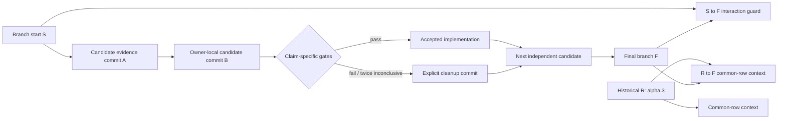

# Headless Performance Hardening - Plan

## Goal Capsule

| Field | Contract |
|---|---|
| Objective | Remove the clearest remaining input-amplified, retained-memory, repeated-construction, transport, transaction, and editor-analysis costs in the Rust headless Mermaid implementation, then perform one bounded current-HEAD hotspot scan while producing evidence that distinguishes structural repairs from measured latency wins. |
| Authority | The latest maintainer direction wins, followed by Product Contract requirements, session-settled Key Technical Decisions, pinned Mermaid 11.16 source semantics, resource/security/error contracts, and implementation-unit detail. |
| Execution profile | Fearless refactoring is authorized. Internal and public Rust APIs may break, obsolete helpers and journal formats may be deleted, and owner boundaries may move when that is the cleanest correct design. Failed performance candidates must be removed rather than retained behind dormant switches. |
| Reference model | `R` is `v0.8.0-alpha.3`; `S` is branch-start commit `8e9f38cf8`; each candidate uses adjacent clean commits `A -> B`; `F` is the final branch head. `R -> S` and `R -> F` are historical context, `A -> B` is causal evidence, and `S -> F` is the aggregate branch regression guard. |
| Stop conditions | Stop a mandatory accepted outcome only for a scope-changing semantic contradiction, a resource/security invariant that cannot be preserved, a required platform contract that cannot be proved, or overlapping user edits that require choosing behavior. Failure to prove the optional U10 compact-persistence durability contract rejects and removes that subcandidate without blocking the mandatory target index or later independent units. A rejected or inconclusive independent candidate does not block later units after its production code is removed. |
| Verification posture | Run Cargo work serially. Establish counters, curves, fixtures, and clean candidate boundaries before production changes. Preserve semantic, error, resource, host-callback, transaction-recovery, cache-lifecycle, and deterministic-output contracts. |
| Tail ownership | `ce-work` owns implementation, candidate cleanup, simplification, focused review, Conventional Commits, final evidence, and goal completion. Do not push, open a pull request, tag, publish, or bump a release version unless separately requested. |

---

## Product Contract

### Summary

This program hardens Merman's Rust headless runtime around three priority classes. P0 removes user-controlled superlinear work, missing resource bounds, unbounded retained state, and the CLI transaction target-lookup `O(N^2)` term. P1 removes repeated construction and transport work with either existing strong evidence or a narrow adjacent A/B. P2 evaluates the independently rejectable compact CLI persistence topology and editor/analysis allocation only after their crash, diagnostic, ABI, and recovery contracts are explicit.

The program deliberately does not reopen previously rejected Resvg, no-report, render-parser no-facts, Requirement residual, or old Flowchart index candidates. Current-HEAD measurements may establish a new problem, but an old rejected implementation is not a starting point. Every in-scope candidate finishes with one or more accepted claim labels (`accepted-structural`, `accepted-latency`, `accepted-memory`, `accepted-artifact`), or as `rejected` / `deferred-blocked`; the final tree contains no failed experimental production path.

### Problem Frame

The alpha.3-to-current review found meaningful improvements since `v0.8.0-alpha.3`, but it also found that the checked-in release-range timing ends at an earlier checkpoint rather than current `HEAD`. The existing evidence is therefore sufficient to identify concrete repeated work and complexity risks, but not to claim that current `HEAD` is globally faster or slower than alpha.3.

Several remaining costs are directly reachable from public inputs or long-lived headless processes. Rich styled HTML text layout repeatedly rescans inline runs and clones growing line candidates. Architecture accepts effectively unbounded `numIter` work. Flowchart applies one adapter estimate to different Dagre and ELK kernels, while ELK `SeparateChildren` recursively clones and rescans deep graph suffixes. State Rough rendering retains process-global maps without a bound. Dugong still removes two classes of transient nodes one at a time. CLI publication repeatedly scans targets and serializes the full transaction journal. Diagnostics-only analysis constructs editor projections it discards, and semantic token planning allocates a finalist vector for every active interval.

Other candidates are fixed repeated costs rather than amplification risks. Fresh `Engine` construction rebuilds immutable registries despite a measured, unmerged `OnceLock + COW` candidate. Browser-WASM host text measurement deserializes the same callback result twice. Sequence and other family render paths have operation-scoped metric-reuse candidates that must be revalidated on the current text/layout architecture.

These costs cross semantic boundaries where a naive fast path is unsafe. Text width may depend on style, kerning, wrapping, fonts, and an opaque host measurer. Layout ordering is visible in geometry and SVG. Resource-limit failures intentionally differ from upstream browser behavior for hostile inputs. State Rough consumes random streams when unseeded. CLI durability depends on journal promotion, frontier persistence, file identity, `fsync`, and recovery. Diagnostics depend on recovery facts and Flowchart projection validation. The implementation must improve the owning architecture instead of adding syntax heuristics, broad global caches, or fixture-specific tuning.

### Actors

- A1. Native headless rendering users need predictable large-input behavior, bounded retained memory, and lower repeated render latency.
- A2. Browser-WASM and binding users need host measurement bridges that avoid duplicate transport work without assuming callbacks are pure or idempotent.
- A3. CLI Markdown and batch users need publication cost to scale with the number of outputs while preserving atomicity, durability, recovery, and concurrent-tamper protection.
- A4. Editor, LSP, and WASM language-service users need diagnostics and semantic tokens without discarded projections or interval-local heap churn.
- A5. Maintainers need causal candidate receipts, honest release-range context, explicit failure cleanup, and no accumulation of benchmark-only production abstractions.

### Requirements

**Evidence, classification, and cleanup**

- R1. Every candidate declares one primary claim class before production edits: `structural`, `latency`, `memory`, or `artifact`. Transient allocation is a `memory` subclaim rather than a fifth claim class. A candidate may claim more than one class only when each class has its own preregistered evidence and gate. Structural or memory evidence never becomes a latency claim by implication.
- R2. `R -> S` and `R -> F` compare only capability- and byte-compatible common rows and remain historical context. Every optimization claim uses an adjacent clean `A -> B` pair. `S -> F` protects against interactions among accepted candidates and must not materially regress representative normal fixtures beyond the active noise-aware control budget.
- R3. Latency confirmation follows the checked-in benchmarking contract: stable balanced A/A on both sides, a fresh even AB/BA schedule of at least eight pairs, fixed thresholds and maximum budget, exact raw pairs, and all semantic/resource/control gates. Structural work names input variables, reachable old/new time and space bounds, and an exact work counter or isolated one-factor scale curve. When the suspected term multiplies two variables, such as rich-text runs by break segments, the evidence also uses a preregistered orthogonal cross-matrix rather than inferring the interaction from two independent one-factor curves.
- R4. A rejected or twice-inconclusive latency candidate retains no production implementation, cache, switch, compatibility path, or candidate-only instrumentation. Cleanup uses an explicit inverse edit or revert commit, never reset/restore/checkout/stash/clean. Reusable general benchmark coverage may remain only when independently justified.
- R5. Benchmark rows fail closed when parse/layout/render fails or output identity is absent. Decision receipts record model or output hashes, SVG bytes/elements where applicable, host/callback counts, fixture digest, commit IDs, host/toolchain/profile, and claim boundaries. New families absent in alpha.3 are measured only on `S -> F` or candidate-local lanes.

**Text and rendering ownership**

- R6. Rich inline HTML line planning no longer scans all runs for every break segment or clones and remeasures a growing run vector. Let `B` be text bytes, `R` styled runs, and `K` break segments. Rust-side segmentation and line-planning work becomes `O(B + R + K)` plus explicitly counted text-measurer work, with bounded temporary space. Width, min-content width, wrapping, line count, Markdown/HTML/entity/Unicode behavior, and style boundaries remain source-backed.
- R7. Opaque host measurers are not assumed pure. Generic text work may reduce Rust allocation and duplicate decoding, but it may reuse width results or reduce callback calls only through an operation-owned measurement policy tied to a concrete deterministic built-in route and complete request/profile identity. Do not add a broad `is_cacheable()` promise to arbitrary `TextMeasurer` implementations. `RenderSessionReport::measurement()` continues to count actual backend invocations; passing an already-produced prepared measurement downstream creates no synthetic invocation or cache hit. Host/fallback routes preserve exact callback order and counts unless a separately versioned public contract proves otherwise.
- R8. Qualified Sequence, Requirement, and Mindmap metric-reuse candidates remain family/operation scoped. They carry already-computed measurements through the existing prepared artifact or operation plan, never create a global text cache, and retain fallback measurement when wrap content, style, environment, or host profile differs. Each family candidate has an independent upper-bound check and adjacent decision.

**Layout resource safety and complexity**

- R9. Architecture charges configured FCoSE iterations and graph work to the same render-owned `OperationWorkMeter` used by the operation without creating a reverse crate dependency. Lower layout crates expose an owner-local neutral work-control callback or observer and a neutral interruption error; `merman-render` adapts that callback to its private meter and maps failure to the existing resource error. Preflight availability checks do not consume budget; adapter work charged directly is not charged again by the kernel; each actual work tranche charges exactly once before execution. All size/work arithmetic uses checked operations, and arithmetic overflow is resource exhaustion even when the configured user ceiling is unlimited. `numIter` is never silently clamped and the algorithm is never changed to meet a budget.
- R10. Flowchart work accounting distinguishes adapter, Dagre/Dugong, and ELK owners. A shared optimistic formula may not represent different kernels. Budget failures use the existing `max_layout_work_units` contract and occur before unbounded allocation or recursion where possible.
- R11. ELK `SeparateChildren` hierarchy planning does not recursively clone the remaining full graph or rescan all nodes for every ancestor. Every source node belongs to exactly one direct hierarchy scope, every source edge has exactly one owning scope using the lowest-common-ancestor or an equivalent source-backed rule, and a parent frame references collapsed child layout results rather than copying descendant collections. A stable hierarchy index and explicit postorder plan preserve child order, graph scope, direction, labels, nested layout merge order, and source-backed output while bounding unique wrapper storage and materialization to `O(V + E + H)` time and `O(V + E)` additional space, where `H` is the number of hierarchy nodes visited. Counters distinguish unique indexed items, total scope materialization, and kernel input work; linear frame visits alone are insufficient evidence.
- R12. Dugong removes edge-label proxy and self-edge dummy nodes through `Graph::remove_nodes` after result extraction. For `T` transient nodes, repeated adjacency reconstruction changes from `O(T * (V + E))` to `O(T + V + E)` with existing batch atomicity and edge-order semantics. The previously rejected Flowchart DFS/subtree/edge-index candidate is not restored; a future adapter redesign requires new current-HEAD dominance evidence and a new plan.

**Cache and runtime lifecycle**

- R13. State Rough rendering has no process-global or thread-local cache whose retained entries outlive a render operation. `StateRenderCtx` owns all deterministic seeded reuse for that operation; unseeded random rendering preserves random-stream consumption and bypasses reuse where required. Operation success, ordinary `Result::Err`, and unwind release cached paths, and retained memory after operation completion is independent of the number of distinct prior renders. The current synchronous render API exposes no render cancellation control or checkpoint, so cancellation is explicitly not applicable to this unit until such a production surface exists; a test-only cancellation sentinel must not be used as substitute evidence.
- R14. If the pinned-registry candidate is accepted, detector, semantic-parser, and render-parser baselines are initialized once per process and returned through the existing `Arc` copy-on-write isolation. Custom per-engine mutation detaches and cannot alter the pinned baseline. The claim applies to repeated fresh `Engine` construction after the first process-local initialization, not first-process startup. If its latency/isolation gate fails, the implementation is removed.
- R15. If the Browser-WASM host candidate is accepted, one callback value is deserialized once into the complete protocol result, `handled: false` selects fallback, and validation delegates to the transport-neutral decoder. Callback count, input bytes, errors, and decoded measurements remain identical. If its public browser gate fails, the implementation is removed.

**CLI, editor, and analysis**

- R16. CLI transaction planning builds an immutable target-to-index map, removing stage-slot `O(N^2)` target lookup; this outcome is mandatory. The independently decidable persistence candidate uses two immutable stages because prior evidence is not known at initial staging: a staging/backing-up plan record is durable first; after every backup and old-generation verification succeeds, a sealed recovery manifest containing entries and prior evidence is atomically written and synchronized. Only then do compact alternating phase/frontier slots advance. Every slot binds the transaction ID, manifest format version, and manifest content digest, so recovery cannot pair a frontier with different immutable evidence. Per-entry progress persistence remains `O(1)` bytes with respect to entry count. Unsupported or corrupt evidence is preserved rather than destructively cleaned. Durable frontier `fsync`, dual-slot promotion, directory synchronization, writer locking, target identity, rollback, and recovery remain active. If durability equivalence cannot be proved, the persistence candidate is removed while the target index remains.
- R17. CLI publication verifies every target before it is modified, detects concurrent or external tampering, publishes the commit point last, and never deletes or overwrites a path it cannot prove belongs to the transaction. Crash failpoints cover journal preparation/promotion, file sync, replacement, directory sync, frontier persistence, rollback, and cleanup. `fsync` reduction and frontier coalescing are not admitted by this plan.
- R18. If the semantic-token candidate is accepted, candidate selection performs one active-set reduction without allocating a finalists vector per interval. It preserves origin precedence, narrowest-span selection, fail-closed conflicting kinds, modifier OR across all active candidates, token ordering, range clipping, legend indices, and packed WASM/LSP ABI. A broader sweep-line rewrite is out of scope unless reachable overlap depth proves the active scans are the dominant term. If the registered latency/transient-memory gate fails, the candidate is removed.
- R19. If the diagnostics-only candidate is accepted, analysis does not build navigation, semantic-token, symbol, text-index, or full Flowchart fact projections that the public diagnostics operation cannot observe. It still performs parser recovery, source-map remapping, dropped-span diagnostics, Flowchart schema validation, fix-candidate generation, cancellation checkpoints, and resource accounting. Rich-facts analysis remains complete and byte-compatible. If the registered latency/transient-memory gate fails, the specialization is removed.

**Integration and documentation**

- R20. Before final integration, run one fixed-budget current-HEAD attribution pass across representative native rendering, browser-WASM host measurement, CLI batch publication, and editor/analysis lanes. Record stage attribution, absolute cost, estimated upper bound, claim class, and priority for remaining hotspots. Admit at most two new owner-local candidates only when they fit the existing semantic scope and gates and their upper bound can clear the registered threshold; each admitted candidate follows R1-R5. Queue every other finding with evidence rather than extending the program indefinitely. Final integration then runs representative `S -> F` controls and capability-matched `R -> F` context, records every candidate state and adjacent evidence, and updates performance documentation without presenting historical aggregate movement as causal proof.
- R21. Cargo work runs serially with the existing target directory. Only program-owned files and hunks are staged. Existing untracked `rust_out/` and `test-results/`, unrelated user edits, rejected candidate code, temporary probes, stale helpers, and superseded formats remain untouched or are removed only when owned by this program.

### Key Flows

- F1. Structural repair
  - **Trigger:** Code inspection identifies user-controlled superlinear work, missing work accounting, recursion amplification, or unbounded retained state.
  - **Steps:** Freeze one input variable, add exact counters/curves and semantic controls, implement the owner-local repair, prove old/new bounds, run representative latency non-regression, and record the structural claim separately.
  - **Outcome:** A mandatory U4-U8 repair lands with a bounded complexity/memory statement or blocks the goal if its invariant cannot be preserved. An optional structural subcandidate may be rejected or deferred-blocked after cleanup. A latency statement exists only when its separate A/B passes.
  - **Covered by:** R1-R7, R9-R13, R20-R21

- F2. Ordinary latency candidate
  - **Trigger:** Repeated fixed work has a credible public-operation upper bound.
  - **Steps:** Establish clean `A`, preregister controls and thresholds, implement one causal change in `B`, run semantic gates and fresh AB/BA, then accept or explicitly remove the candidate.
  - **Outcome:** The candidate is accepted-latency with bounded claim scope, rejected with no production residue, or rejected after one identical-protocol confirmation remains inconclusive.
  - **Covered by:** R1-R8, R14-R15, R18, R20-R21

- F3. CLI publication
  - **Trigger:** A3 publishes `N` rendered outputs under one root.
  - **Steps:** Recover under the writer lock and build an indexed plan as the mandatory P0 outcome. Independently, evaluate the P2 persistence candidate by durably recording the staging/backing-up plan, staging and syncing owned files, sealing the verified entry/prior recovery manifest, publishing each entry with target-generation verification and a manifest-bound compact durable frontier, publishing the commit point last, then cleaning up.
  - **Outcome:** Target lookup scales linearly in `N`. If compact persistence is accepted, all targets are old or all are new after success/recovery; mixed or unknown states retain recovery evidence and a typed failure, and metadata work that depends only on journal cardinality also scales linearly. If it is rejected, the original durable journal remains with the mandatory target index.
  - **Covered by:** R16-R17, R20-R21

- F4. Editor diagnostics and tokens
  - **Trigger:** A4 requests diagnostics, rich facts, full semantic tokens, or range semantic tokens.
  - **Steps:** Select the analysis projection mode before fact finalization; if the independent parser-side candidate qualifies, pass the `merman-core` diagnostic capture policy through the combined parser and affected family builders; retain every diagnostics-observable recovery/schema fact; and resolve token overlaps without interval-local finalists allocations.
  - **Outcome:** Public diagnostics and packed tokens are byte/field equivalent, cancellation and errors remain exact, and allocations/work fall in the qualified lanes.
  - **Covered by:** R18-R19, R20-R21

- F5. Final evidence closure
  - **Trigger:** All mandatory structural outcomes are accepted and all optional candidates are accepted, rejected, or genuinely deferred-blocked.
  - **Steps:** Remove failed experiments, perform the bounded four-lane current-HEAD hotspot scan, admit at most two qualifying owner-local candidates through R1-R5, queue the rest, run `S -> F`, run common-row `R -> F`, execute serial quality gates, review the complete commit range, and reconcile durable receipts and queue state.
  - **Outcome:** The branch has no unexplained normal-path regression, no failed candidate residue, no claim whose evidence belongs to a different comparison lane, and a finite evidence-backed disposition for the most obvious remaining current-HEAD costs.
  - **Covered by:** R1-R5, R20-R21

### Acceptance Examples

- AE1. Given fixed-byte lines spanning an orthogonal matrix of styled-run count and browser-like break-segment count, segment extraction visits each byte/run a bounded number of times, fragment copies do not contain an `R * K` term, submitted measurer work is reported separately, and widths/lines match the reference corpus.
- AE2. Given an opaque recording host measurer whose return value changes by call count, generic text refactoring preserves the exact callback sequence; built-in operation-policy reuse does not leak into the host or fallback path.
- AE3. Given `architecture.numIter = 10_000_000` and a low work ceiling, the operation returns the existing layout-work resource error before FCoSE allocates or loops; given sufficient budget, the configured iteration semantics are unchanged rather than clamped.
- AE4. Given an ELK chain of 256 directed `SeparateChildren` subgraphs with no edges, hierarchy preparation completes on a small-stack thread without recursive suffix-graph clones, reports linear hierarchy work, and preserves nested geometry and labels.
- AE5. Given many Dugong label proxies or self-loops, transient deletion performs one batch adjacency rebuild, preserves output and edge order, and reports the structural bound without claiming end-to-end speed unless A/B passes.
- AE6. Given thousands of seeded State diagrams with distinct sizes and seeds in one long-lived process, retained State Rough entries return to zero after each operation and process-owned cache state does not grow with prior requests; repeated shapes within one operation still reuse paths.
- AE7. Given two fresh default engines, pinned registries share immutable storage; after a custom detector/parser mutation, only that engine detaches. The current-base cold Info parse confirmation reproduces a material low-latency improvement while reused-engine parsing remains a control.
- AE8. Given `{ handled: false }`, nullish, valid handled, malformed, non-finite, and out-of-range browser callback values, the WASM bridge performs zero deserializations for nullish fallback and exactly one for every non-nullish callback value, returning the same fallback, measurement, or typed error as the baseline.
- AE9. Given 1, 16, 64, and 256 CLI outputs, target lookup scales linearly. If the compact persistence candidate is accepted, manifest/frontier bytes also scale linearly; exhaustive small-transaction and representative large-transaction crash injection yields entirely old, entirely new, or retained typed evidence, and foreign/tampered files are never removed.
- AE10. Given an accepted semantic-token candidate and overlapping candidates with different precedence, equal narrowness, conflicting kinds, and modifiers on lower-priority candidates, the allocation-free reducer returns the same winner/error and OR-ed modifier bits as the reference planner.
- AE11. Given valid, recoverable malformed, fatal, custom malformed Flowchart, Markdown multi-fence, and cancellation inputs, diagnostics-only output matches kind/code/severity/order/span/notes/fixes while rich facts remain unchanged and the diagnostics path constructs no retained navigation/token projection.
- AE12. Given a candidate that misses its gate, a later commit explicitly removes its implementation and candidate-only hooks; the durable receipt retains `A/B` IDs and rejection reason, while final production code contains no dormant branch.
- AE13. Given the final branch, `S -> F` controls show no material aggregate regression and `R -> F` reports only common capabilities. Neither report is used in place of the accepted candidates' adjacent evidence.

### Success Criteria

- Styled HTML run segmentation and line planning have a checked linear Rust-side work bound and preserve text/layout/SVG behavior across built-in and opaque host measurers.
- Architecture and Flowchart layouts charge backend-owned work, reject hostile work before expensive kernels where possible, and never silently tune user configuration or switch algorithms.
- Deep ELK hierarchy preparation is iterative and no longer retains recursive suffix-graph clones.
- Dugong's two remaining transient retirement paths use the existing batch API with exact graph and order equivalence.
- State Rough rendering retains no cache across operations, including success, ordinary error, and unwind paths; render cancellation is explicitly not applicable because no production control or checkpoint exists.
- The current branch contains the pinned registry `OnceLock + COW` design only if current-base decision-grade confirmation and isolation tests pass.
- The WASM host measurement bridge decodes each callback value once only if its browser-WASM candidate clears the registered gate; otherwise the baseline path remains and the rejection is documented.
- CLI target lookup no longer contains an `N^2` term. The sealed-manifest/compact-frontier design also removes full-state per-frontier byte amplification only if its durability subcandidate qualifies.
- An accepted semantic-token candidate removes per-interval finalists allocations without changing packed output or conflict behavior; a rejected candidate leaves the baseline planner intact.
- An accepted diagnostics-only candidate avoids non-observable projection construction while preserving the complete diagnostics and recovery contract; a rejected candidate leaves the reference path intact.
- Every candidate has a final state and claim class; rejected code is gone, documentation matches the final tree, and the final comparison lanes are not conflated.
- One bounded final attribution pass covers native rendering, browser-WASM, CLI batch, and editor/analysis. At most two newly discovered owner-local candidates enter this program; all other remaining hotspots are recorded with absolute cost, upper bound, and next action.

### Scope Boundaries

- Do not reopen the rejected Flowchart DFS/subtree/edge-index implementation. Rebaseline current Flowchart large behavior for context, but require a separate new plan if a different adapter design becomes dominant after this program.
- Do not reopen Kanban, Mindmap, or Requirement render-parser no-facts candidates, no-report SVG terminals, Resvg single-reader validation, consuming one-worker PNG, or closed Requirement residual micro-optimizations.
- Do not add global text, label, model, layout, or arbitrary render-result caches. The only process-global cache admitted by design is an immutable pinned registry baseline with COW instance isolation.
- Do not assume a host text measurer is deterministic, pure, idempotent, or thread-safe. Only a concrete built-in operation policy may authorize result reuse in this plan.
- Do not clamp `numIter`, replace Dagre/Dugong/FCoSE/ELK algorithms, change default layout configuration, or tune fixture-specific magic numbers or pixels.
- Do not reduce CLI durable frontiers, dual journal slots, file/directory synchronization, target identity checks, rollback, or recovery merely to improve timing. `fsync` and frontier coalescing are explicitly out of scope.
- Do not optimize the fixed two-pass Mermaid-compatible preprocessing or policy-neutral lint scans in this program. They are bounded `O(N)` source-backed behavior and require a separate profile-backed plan if they become dominant.
- Do not optimize React preview mounting, browser UI projection, external Mermaid.js, or mmdr in this headless runtime branch. Browser-WASM host text measurement is in scope because it is a Rust runtime boundary.
- Do not add performance timing to regular CI, publish packages, change versions, create tags, push the branch, or open a pull request.

### Sources

- `docs/plans/2026-07-28-001-refactor-runtime-performance-architecture-plan.md` records the completed prior program, accepted patterns, rejected hypotheses, and evidence discipline inherited here.
- `docs/performance/PERF_PLAN.md`, `docs/performance/BENCHMARKING.md`, and `docs/performance/RUNBOOK.md` define the active queue, same-host admission rules, memory contracts, and serial workflow.
- `docs/performance/kanban_prepared_labels_candidate_2026-07-29.md` is the strongest operation-scoped prepared-artifact precedent.
- `docs/performance/flowchart_u4_dugong_batch_preregistration_2026-07-28.md` proves the batch-removal complexity pattern and its claim boundary.
- Commit `b56e1ae81` and receipt commit `2d2e891c7` on `perf/high-confidence-candidates` provide the unmerged pinned-registry implementation and measured prior; they are reference material, not current-base admission.
- Commits `b389f8724`, `573fbbb55`, and `650aee080` provide unmerged Sequence, Requirement, and Mindmap text-reuse hypotheses. They must be re-derived against current ownership and measured independently.
- `crates/merman-render/src/text/metrics.rs`, `architecture.rs`, `resources.rs`, `flowchart/layout.rs`, and `svg/parity/state/rough_cache.rs` expose the current text, work-budget, and retained-cache risks.
- `crates/merman-layout-elk/src/lib.rs`, `crates/manatee/src/algo/fcose/mod.rs`, `crates/dugong/src/pipeline/layout.rs`, `crates/dugong/src/self_edges.rs`, and `crates/dugong-graphlib/src/graph/core.rs` define the affected layout kernels and batch mutation API.
- `crates/merman-cli/src/transaction.rs`, `crates/merman-editor-core/src/token_planner.rs`, `crates/merman-analysis/src/analyzer.rs`, and `crates/merman-wasm/src/lib.rs` expose the batch, editor, diagnostics, and host transport work.
- `repo-ref/mermaid` at the pinned Mermaid 11.16 baseline remains the semantic and structural source for text, layout, SVG, configuration, and parser behavior.

---

## Planning Contract

### Key Technical Decisions

- KTD1. **Use distinct reference planes and claim classes.** `R -> F` is release history, `S -> F` is branch interaction control, and adjacent `A -> B` is candidate causality. Structural, latency, memory, and artifact claims are independently gated. (session-settled: user-approved - chosen over treating the broad alpha.3 comparison as sufficient proof for every candidate: the maintainer approved the review's evidence distinctions and requested the complete program.)
- KTD2. **Refactor at the owning boundary and delete superseded paths.** Public and internal Rust APIs, cache layers, journal formats, and helper ownership may break once replacements pass; failed candidates are explicitly removed. (session-settled: user-directed - chosen over compatibility-preserving incremental patches: the maintainer authorized fearless refactoring, breaking changes, and deletion of obsolete code.)
- KTD3. **Execute the full prioritized program, with mandatory P0 outcomes and evidence-gated optional hypotheses.** U4-U8 are safety/complexity outcomes and must land with their structural or memory contracts; inability to preserve their invariants blocks the goal rather than converting them into ordinary rejected experiments. U10's target index is also mandatory. U2, U3, U9, U11, U12, and U10's compact-journal subcandidate may be rejected after their registered evidence and cleanup. Independent optional rejection does not stop later units. (session-settled: user-approved - chosen over implementing only the easiest subset: the maintainer asked to develop the planned findings and continue looking for obvious gains.)
- KTD4. **Prefer structural proof for amplification risks.** Rich-text planning, layout work limits, ELK hierarchy, Dugong batch deletion, State retained memory, and CLI cardinality may land on reachable complexity/resource proof plus representative non-regression even when normal fixtures do not clear a latency gate. Their release wording remains structural unless separately timed.
- KTD5. **Treat opaque measurers, measurement reports, and random streams as observable.** Text-result reuse is limited to a concrete built-in operation policy; arbitrary host/fallback measurers remain opaque. The public measurement report records actual backend invocations, not synthetic logical requests or cache hits. Unseeded Rough rendering preserves random consumption. Allocation-linear refactoring may not change host callback count or result ordering by accident.
- KTD6. **Keep the operation meter at the render boundary and pass neutral work control downward.** `OperationWorkMeter` remains private to `merman-render`. Manatee and ELK expose owner-local neutral callbacks/observers and interruption errors; render adapters charge the same operation meter and map failures. Availability preflight is non-consuming, actual work is charged once before execution, and checked overflow fails independently of the configured ceiling. Budget refusal is explicit and deterministic rather than a layout-quality downgrade.
- KTD7. **Delete cross-operation State Rough caches.** The existing `StateRenderCtx` operation cache is the sole reuse owner. This is chosen over adding a weighted global LRU because historical warm-cache data does not justify retained global state, global locking, TLS duplication, or more invalidation policy.
- KTD8. **Reuse immutable registries, not whole engines.** Port the narrow `OnceLock<Registry> + Arc::make_mut` design rather than inventing an `EngineTemplate`, global mutable registry, or preconstructed engine singleton.
- KTD9. **Use two immutable CLI stages before compact mutable progress.** Persist a staging/backing-up plan first. Once backups and old-generation verification complete, atomically seal and synchronize the entry/prior recovery manifest. Compact alternating phase/frontier slots then bind the transaction ID, manifest version, and manifest digest. Keep existing `fsync`, dual-slot promotion, lock, identity, and recovery semantics; data-structure and journal-byte complexity are the target, not weaker durability.
- KTD10. **Split diagnostics optimization at the parser/analysis ownership seam.** Analysis first omits post-parse projections it owns. A separately qualified parser-side candidate uses a `merman-core`-owned capture policy threaded through combined-parser signatures and family fact builders so diagnostics-only requests retain every diagnostic/recovery/schema fact while omitting navigation/token/symbol-only facts. Rich-facts and ordinary core parsing retain the complete path. This does not introduce an analysis-to-core reverse dependency or reopen rejected render-parser no-facts modes.
- KTD11. **Keep evidence infrastructure minimal and owner-local.** Extend existing Criterion, compare-self, native-memory, browser host, transaction failpoint, and crate-test surfaces. Exact work counters stay test/bench-only unless they are the production resource meter; no general benchmark framework is introduced.
- KTD12. **Use serial candidate commits.** Each causal candidate has an evidence/baseline boundary, implementation boundary, focused tests, decision, and cleanup before the next overlapping candidate. Final integration may simplify across accepted candidates only after their individual evidence is durable.

### High-Level Technical Design

The design is a candidate pipeline rather than one monolithic refactor:



The runtime ownership after accepted work is:

- Render operation owns text prepared metrics, State Rough paths, and the single authoritative work meter.
- Immutable process scope owns only pinned parser/detector registry baselines.
- Layout kernels expose neutral work-control hooks, own stable hierarchy/index state, and request charges before derived work without depending on render types.
- CLI persistence moves from a durable staging plan to a sealed recovery manifest, then to manifest-bound compact mutable frontier slots.
- Analysis owns post-parse diagnostics projection; an independently qualified `merman-core` capture policy may suppress parser facts that diagnostics cannot observe.
- WASM transport decodes once and delegates semantic validation to bindings-core.

### Assumptions

- The branch starts from clean commit `8e9f38cf8`; existing untracked `rust_out/` and `test-results/` belong to the user and remain untouched.
- The pinned `repo-ref/mermaid` checkout is the correct Mermaid 11.16 semantic reference for this branch.
- The maintainer accepts breaking Rust APIs and on-disk transaction-format replacement when the new format passes complete recovery tests; migration compatibility for abandoned in-flight development journals is not required unless current code advertises it publicly, but every shipped public break still requires an explicit inventory and upgrade/release documentation.
- The host is macOS for local decision-grade measurements. Cross-platform correctness remains covered by portable code/tests. The optional compact-persistence candidate additionally requires passing Linux, macOS, and Windows durability evidence before acceptance.
- Host text measurement callbacks are opaque and potentially stateful. Built-in text measurers are deterministic for a complete request and may use operation-local reuse.
- A latency candidate that remains inconclusive after one identical-protocol confirmation is removed and classified as rejected for this program rather than consuming an unbounded sample budget.
- Structural-repair controls use at least eight balanced pairs. Define `noise` as the larger of the absolute A/A paired-delta median and `1.4826 * MAD` of those deltas. If `noise > 3%`, the run is inconclusive rather than widening the gate. Otherwise the relative regression budget is `min(10%, max(5%, 3 * noise))`; each unit also preregisters an owner-appropriate absolute cap. Both the observed paired median and its 95% bootstrap upper bound must remain within the registered caps. Exceeding them triggers one redesign attempt; a remaining material regression blocks a mandatory structural unit rather than silently trading normal performance for adversarial bounds.
- Cache-capacity tuning is not a product decision because State cross-operation caches are deleted. Any small operation-local map is bounded by diagram cardinality and released with the render context.

### Implementation Constraints

- Use `apply_patch` for source edits. Do not reset, restore, checkout, stash, clean, or delete unrelated user files.
- Run `cargo nextest`, `cargo fmt`, Clippy, benches, and xtask commands serially with `CARGO_BUILD_JOBS=1` where Cargo builds.
- Reuse the normal `target` directory. Use immutable temporary worktrees only when two revisions must coexist for A/B, and remove them through the benchmark tool's owned cleanup path.
- Keep candidate counters behind tests/benches or existing timing/resource instrumentation so release paths do not pay for evidence-only bookkeeping.
- Preserve exact array/traversal order wherever Mermaid/source parity makes order observable. Comparator normalization remains narrow and non-semantic.
- Do not reduce callback calls, random calls, cancellation checkpoints, resource charges, `fsync`, or validation steps unless the owning unit explicitly proves equivalence.
- Do not add new dependencies unless the owning unit proves the existing standard-library/rustc-hash/indexmap tools cannot express the required bounded structure.
- Stage exact owned paths for every commit. Plan, docs, tests, production code, and evidence for one candidate should remain attributable.

### Risks and Mitigations

- **Risk: broad program hides candidate interactions.** Mitigation: adjacent candidate commits, one overlapping candidate at a time, final `S -> F` controls, and per-unit cleanup before proceeding.
- **Risk: rich-text linearization changes width because arbitrary string widths are not additive.** Mitigation: preserve full-request measurement for opaque measurers, isolate built-in deterministic reuse, and compare width/line/custom-host traces across adversarial text/style fixtures.
- **Risk: resource accounting rejects inputs earlier than current behavior.** Mitigation: treat the timing and typed resource error as an explicit contract change, use checked arithmetic, test exact boundaries, and preserve all budget-valid Mermaid semantics.
- **Risk: iterative ELK planning changes merge or child order.** Mitigation: build a stable hierarchy index in original node order, use postorder frames, retain graph scopes/labels/directions, and compare layout JSON/SVG on nested direction fixtures.
- **Risk: removing State caches regresses repeated cross-operation State renders.** Mitigation: require operation-internal repeated-geometry reuse and gate independent-request cold/normal controls. Measure the intentionally removed cross-operation warm benefit only as a trade-off, not as an acceptance blocker. Prove retained entries/owned bytes directly rather than relying on RSS to fall.
- **Risk: compact CLI journals weaken crash recovery.** Mitigation: persist the staging plan and sealed recovery manifest as separate states, define a deterministic recovery-authority table, bind every compact slot to the sealed manifest, preserve every frontier and synchronization step, run exhaustive small-transaction failpoints, and require Linux/macOS/Windows durability evidence. Missing platform evidence rejects the optional candidate. No `fsync` reduction is admitted by this plan.
- **Risk: diagnostics optimization drops recovery-derived errors.** Mitigation: separate editor recovery candidates from rich projections, retain validation-only Flowchart decoding, and compare complete public diagnostic payloads for valid/malformed/cancelled inputs.
- **Risk: benchmark cost becomes unbounded.** Mitigation: run upper-bound checks first, use fixed A/A-derived budgets, allow one confirmation retry, and classify rather than sampling indefinitely.

### System-Wide Impact

- **Public APIs and callers:** Work-meter propagation, measurer capabilities, registry construction, core parser capture policy, analysis capture modes, and transaction state may break Rust APIs. Each owner unit must update every workspace caller and include compile-level integration coverage; transport JSON/ABI shapes remain stable unless the owning requirement explicitly says otherwise. U13 inventories all surviving breaks and updates the applicable upgrade guide/release projection.
- **Failure propagation:** Architecture and Flowchart may return a resource error earlier for hostile work, while budget-valid output remains source-compatible. CLI preserves typed recovery evidence instead of converting uncertain states into cleanup success. Diagnostics and WASM retain existing typed error surfaces.
- **State lifecycle:** State Rough paths and family text metrics become operation-owned and drop on success, ordinary error, or unwind. Render cancellation remains outside this claim because the synchronous renderer has no production cancellation control/checkpoint. Pinned registries are immutable process state with COW overlays. No other new retained process state is introduced.
- **Persistent data:** The CLI transaction journal is the only persistent format changed. The staging plan, sealed recovery manifest, and mutable frontier slots are independently versioned and identity-bound; frontier slots also bind the manifest digest. Unsupported, mixed, or corrupt evidence is retained and never causes uncertain files to be deleted.
- **Concurrency:** Registry initialization is one-time and thread-safe; render caches are isolated per operation; host callbacks keep their current calling thread/ordering contract; CLI retains one writer per root; editor/analysis operations preserve cancellation and generation isolation.
- **Resource policy:** One render-owned operation meter spans owners through neutral lower-crate callbacks. Non-consuming preflight and actual charges are not double-counted; checked overflow fails even under an unlimited user ceiling; failed charges do not partially advance state.
- **Observability and evidence:** Production timing/counters remain opt-in where already supported. Exact work probes stay test/bench-only. `RenderSessionReport::measurement()` continues to expose actual backend invocations, and public reports continue to expose resource failures rather than hiding work behind cache hits or fallback algorithms.
- **Artifacts and dependencies:** The program should add no dependency closure or feature-surface expansion. U3 must confirm Web-WASM artifact/import size does not materially change; U10 must not add a platform-specific journal dependency.

### Open Questions

#### Resolved During Planning

- **Full scope or only P0?** Full prioritized scope is included, but every ordinary latency hypothesis remains evidence-gated. Basis: explicit maintainer approval to implement the complete plan.
- **Compatibility-preserving patches or owner-boundary refactors?** Owner-boundary fearless refactoring. Basis: explicit authorization for breaking changes and deletion.
- **Retain failed fast paths for future experiments?** No. Failed production code and candidate-only hooks are removed; durable receipts preserve the learning.
- **Bound State global caches or delete them?** Delete global and TLS layers; retain only operation-owned reuse. Basis: existing operation-cache pattern and lack of adequate warm-cache evidence for cross-operation retention.
- **May CLI reduce durability for speed?** No. The plan targets lookup and journal byte complexity; frontier durability remains mandatory.

#### Deferred to Implementation Evidence

- Whether each Sequence, Requirement, or Mindmap operation-scoped metric candidate clears its independent public-operation gate. This is non-blocking; failed family candidates are removed without stopping others.
- Whether the CLI sealed-manifest/compact-frontier subcandidate qualifies after Linux/macOS/Windows durability testing. It may be rejected while the mandatory target index remains. Missing supported-platform evidence is a rejection rather than an external-limitation pass. `fsync` ordering is unchanged and is not an admitted optimization in this plan.
- Whether current Flowchart large remains above the historical 16.7 ms reference after post-plan Dugong changes. The result is context only and does not reopen the rejected adapter index design.

---

## Implementation Units

### Unit Index

| Unit | Title | Primary files | Depends on |
|---|---|---|---|
| U1 | Freeze evidence and current baselines | `tools/bench/`, `crates/merman/benches/`, `docs/performance/` | none |
| U2 | Cache pinned registry baselines | `merman-core` registries | U1 |
| U3 | Decode WASM host measurements once | `merman-wasm`, web protocol tests | U1 |
| U4 | Delete cross-operation State Rough caches | State SVG parity renderer/tests | U1 |
| U5 | Enforce Architecture and Flowchart work budgets | render resources, Architecture, Flowchart | U1 |
| U6 | Linearize ELK hierarchy preparation | `merman-layout-elk`, Flowchart ELK tests | U5 |
| U7 | Batch remaining Dugong transient deletion | Dugong pipeline/self-edge paths | U1 |
| U8 | Linearize rich inline HTML planning | render text metrics/tests/bench | U1 |
| U9 | Reuse qualified operation-scoped text metrics | Sequence/Requirement/Mindmap render paths | U8 |
| U10 | Linearize CLI transaction metadata work | CLI transaction state/tests | U1 |
| U11 | Remove semantic-token finalists allocations | editor-core, LSP/WASM token tests | U1 |
| U12 | Specialize diagnostics-only capture | analysis/core parser/capture/projection paths/tests | U1 |
| U13 | Discover remaining hotspots, integrate, simplify, and document | affected crates, benchmark docs, final receipts | U2-U12 |

### Execution Priority

1. U1 establishes current evidence and a clean branch-start reference.
2. U4, U5, U8, and the mandatory U10 target index address the P0 retained-state, missing-budget, public-input amplification, and CLI lookup contracts first.
3. U6 completes the ELK P0 hierarchy repair after U5; U7 is an independent low-risk batch structural repair and must not wait on work-meter propagation.
4. U2 and U3 then evaluate the narrow repeated-construction and transport candidates; U8 unlocks the independent U9 family candidates.
5. U10's optional sealed-manifest/compact-frontier subcandidate proceeds only after the P0 index is closed. U11 and U12 then proceed serially because each changes a distinct public correctness boundary.
6. U13 performs one bounded four-lane hotspot scan, admits at most two new qualifying owner-local candidates, and runs aggregate controls only after every mandatory structural outcome has landed, every optional candidate has a final state, and failed code is gone.

### U1. Freeze evidence and current baselines

- **Candidate status:** Non-candidate evidence infrastructure and historical context only.
- **Requirements:** R1-R5, R20-R21; AE12-AE13
- **Files:** `tools/bench/compare_self.py`, `tools/bench/test_perf_contracts.py`, `tools/bench/corpus.json`, `crates/merman/benches/pipeline.rs`, only the minimal missing representative fixtures under `crates/merman/benches/fixtures/`, and a dated branch-start receipt under `docs/performance/`.
- **Approach:** Record `R`, `S`, host/toolchain/profile/lock/fixture digests, dirty-state exclusions, and supported common rows. Extend the existing preflight only enough that required rows record successful output identity, bytes/elements where relevant, and cannot become faster by silently skipping failed work. Add one representative fixture for each currently admitted family missing from the native cross-family corpus rather than a tiny/medium/stress matrix. Capture current `flowchart_large`, `class_medium`, `requirement_medium`, and nearby controls as branch-start context. Each later owner unit adds its own smallest work curve or allocation probe; U1 does not become a universal performance framework.
- **Test scenarios:** Alpha.3 feature mapping; missing/failed row; output hash mismatch; new family absent on alpha.3; current-only row classification; common-row output receipt; representative cross-family corpus discovery; branch-start public controls.
- **Verification:** Performance contract tests pass; dry discovery lists every required row; branch-start receipt names which rows are causal candidates, historical-only, current-only, or structural; no timing claim is made from diagnostic samples.
- **Failure cleanup:** Remove any one-candidate harness that cannot express its contract; retain only reusable owner-local coverage.
- **Deletion:** Remove temporary discovery probes, duplicate fixture registrations, and evidence fields that cannot be validated fail-closed.
- **Commit boundary:** One evidence-only commit before production candidates.

### U2. Cache pinned registry baselines

- **Primary claim:** latency.
- **Requirements:** R1-R5, R14, R20-R21; AE7, AE12
- **Files:** `crates/merman-core/src/detect/mod.rs`, `crates/merman-core/src/diagram/mod.rs`, `crates/merman-core/src/lib.rs`, existing registry tests, `crates/merman/benches/pipeline.rs`, and a dated decision receipt.
- **Approach:** Re-derive the narrow `b56e1ae81` design on current `HEAD`: one `OnceLock` for each immutable pinned registry and the existing `Arc::make_mut` COW path for customization. Do not cherry-pick blindly or introduce a whole-engine singleton. Run an upper-bound check, then current-base A/A and adjacent AB/BA for `parse_cold_engine/info_medium`; use reused-engine parsing as a non-regression control.
- **Test scenarios:** Shared storage before mutation; detector/parser/render-parser customization detaches; mutations in one engine never appear in another; concurrent baseline initialization; first initialization; repeated fresh engines; reused engine control; invalid custom registration behavior.
- **Verification:** `merman-core` tests pass; current-base low-latency confirmation clears the preregistered relative/absolute thresholds; control remains within its noise budget; receipt limits the claim to repeated fresh engines in one process.
- **Failure cleanup:** If current evidence no longer clears the gate or isolation changes, explicitly remove the cache implementation and candidate-only tests while keeping the receipt.
- **Deletion:** Remove superseded per-engine pinned-registry reconstruction only for an accepted candidate; remove every candidate-only cache path on rejection.
- **Commit boundary:** Candidate implementation and, if needed, a separate cleanup/decision commit.

### U3. Decode WASM host measurements once

- **Primary claim:** latency.
- **Secondary evidence:** transport work attribution; no separate artifact claim is implied.
- **Requirements:** R1-R5, R7, R15, R20-R21; AE2, AE8, AE12
- **Files:** `crates/merman-wasm/src/lib.rs`, `crates/merman-bindings-core/src/text_measurement.rs` only if protocol ownership requires adjustment, `platforms/web/scripts/text-measurement.test.mjs`, browser-WASM smoke tests, and a dated decision receipt.
- **Approach:** Add `handled` to the complete deserialized callback result and call `serde_wasm_bindgen::from_value` once. Preserve nullish fallback before decode and delegate semantic validation to the existing bindings-core decoder. Measure in a real Chromium/browser-WASM host-measurer lane, recording callback count, returned byte size, decode count, and wall time; native Rust microbenchmarks are attribution only.
- **Test scenarios:** Null/undefined; `{handled:false}` with and without extra fields; valid handled width/height/lines; missing fields; wrong types; non-finite/negative/overflow values; thrown callback; repeated measurements; custom callback state proving callback count is unchanged.
- **Verification:** WASM and web protocol tests pass; callback traces and typed errors match; each non-nullish callback result records one deserialization; the public browser lane clears its registered gate or the candidate is removed.
- **Failure cleanup:** Remove production changes and candidate-only counters if browser timing is disconfirming or protocol behavior changes.
- **Deletion:** Remove the redundant non-nullish deserialization and superseded protocol wrapper only for an accepted candidate; remove all candidate-only transport hooks on rejection.
- **Commit boundary:** One transport-local candidate commit plus its receipt/cleanup decision.

### U4. Delete cross-operation State Rough caches

- **Primary claim:** memory.
- **Secondary claim:** structural lifecycle, with optional latency attribution decided independently.
- **Requirements:** R1-R5, R13, R20-R21; AE6, AE12
- **Files:** `crates/merman-render/src/svg/parity/state/rough_cache.rs`, `node.rs`, `mod.rs`, `crates/merman-render/tests/state_svg_test.rs`, `crates/merman-render/tests/hand_drawn_seed_svg_test.rs`, native memory harness registration, and a dated structural receipt.
- **Approach:** Delete the process-global `OnceLock<Mutex<FxHashMap<...>>>` caches, TLS maps, `Arc`-sharing branches, and lookup precedence that outlives the operation. Retain one operation-owned map in `StateRenderCtx`, keyed by complete seeded Rough geometry inputs. Ensure unseeded rendering consumes the same random stream and does not reuse paths across logically distinct draws. Add a long-lived process probe that varies sizes/seeds and reports post-operation retained entries/bytes.
- **Test scenarios:** Seeded repeated nodes within one render; seeded distinct renders; unseeded repeated renders; ordinary error after cache population; explicit no-render-cancellation claim boundary; unwind/drop; concurrent renders on different threads; circle/path keys; hand-drawn SVG determinism; prior global/TLS hit cases.
- **Verification:** State/hand-drawn SVG tests pass; post-operation retained State cache entries/owned bytes are zero; retained memory does not grow with request count; operation-internal repeated geometry still hits the operation cache; independent-request cold/normal controls stay within the structural regression budget. Historical cross-operation warm behavior is measured as the consciously removed trade-off and is not an acceptance gate. RSS is supporting context only.
- **Failure cleanup:** If operation-only ownership cannot preserve random or output semantics, stop as deferred-blocked; do not restore an unbounded cache or add a global LRU without a new plan.
- **Deletion:** Remove the global/TLS functions, constants, imports, timing branches, and tests that assert cross-operation hits.
- **Commit boundary:** One lifecycle refactor commit and one structural receipt commit if documentation is material.

### U5. Enforce Architecture and Flowchart work budgets

- **Primary claim:** structural resource bound.
- **Requirements:** R1-R5, R9-R10, R20-R21; AE3, AE12
- **Files:** `crates/merman-render/src/resources.rs`, `crates/merman-render/src/architecture.rs`, `crates/merman-render/src/lib.rs`, `crates/merman-render/src/flowchart/layout.rs`, `crates/merman-render/src/flowchart/elk.rs`, `crates/manatee/src/algo/fcose/mod.rs`, `crates/merman-layout-elk/src/lib.rs`, the relevant `crates/merman-elk-layered/src/` import/processor owners, `crates/merman-render/tests/architecture_layout_test.rs`, `flowchart_layout_test.rs`, Manatee/ELK-layer tests, stress benches, and a dated structural receipt.
- **Approach:** Keep `OperationWorkMeter` private to `merman-render` and define an owner-neutral lower-crate `WorkControl`-style interface with checked `charge`/`check` callbacks and a neutral interruption error; the concrete name may follow existing crate vocabulary. Thread it through Manatee and the `merman-layout-elk` to `merman-elk-layered` import/processor call path without introducing a reverse dependency. `merman-render` alone adapts it to the private operation meter and maps interruption to the existing typed `max_layout_work_units` error. Architecture performs a checked, non-consuming graph-size/configured-iteration availability preflight; the adapter charges predictable work once, and Manatee requests charges exactly once before derived iteration tranches. Split Flowchart estimates by backend and charge adapter, Dagre/Dugong, ELK wrapper, import, and processor work at their owners through the same render meter. Use checked arithmetic for every product/sum and treat overflow as resource exhaustion even with an unlimited configured ceiling. Do not clamp configuration or substitute algorithms.
- **Test scenarios:** `numIter` 1/default/large/fractional/non-finite/overflow; empty and two-node Architecture; exact budget below/equal/above; cancellation; Dagre versus ELK; no-edge deep clusters; dense edges; work arithmetic overflow; error timing before kernel allocation; valid-budget layout equality.
- **Verification:** Resource and cross-crate owner tests prove non-consuming preflight, exact once-only charges, non-advancing failed charges, overflow failure under limited and unlimited profiles, error mapping/timing, actual iteration counts, backend-specific accounting, and unchanged valid outputs. One-factor work curves match the documented bounds; representative normal fixtures meet the structural regression budget.
- **Failure cleanup:** Remove experimental estimates that cannot upper-bound their owner; do not leave a false sense of coverage. A kernel may retain independently correct exact runtime charging when a coarse preflight is removed, but the goal remains blocked until every mandatory Architecture/Flowchart owner has a sound bound or exact pre-work charge.
- **Deletion:** Remove the shared optimistic Flowchart formula and any duplicate Architecture-only work-limit path superseded by the operation meter.
- **Commit boundary:** Resource-contract commit before U6 production refactors; U7 remains independent and may land earlier.

### U6. Linearize ELK hierarchy preparation

- **Primary claim:** structural complexity.
- **Secondary claim:** peak memory, with optional latency decided independently.
- **Requirements:** R1-R5, R10-R11, R20-R21; AE4, AE12
- **Files:** `crates/merman-layout-elk/src/lib.rs`, source graph dump recursion if affected, ELK crate tests, `crates/merman-render/src/flowchart/elk.rs`, Flowchart ELK tests/fixtures, stress benches, native memory registration, and a dated decision receipt.
- **Approach:** Build stable parent-to-children indexes once in original node order and assign every source edge to one owning scope using the lowest-common-ancestor or an equivalent source-backed rule. Replace recursive `prelayout_separate_children_under` and suffix-graph cloning with explicit postorder frames carrying direct scope membership, inherited hierarchy handling/direction, root label/spacing, and child results. Each source node appears in one direct scope; a parent materializes only its direct members and scope-owned edges, while already-laid-out child groups appear as collapsed nodes sized from their child result. Reuse or extract the existing hierarchical external-port representation so an original descendant-to-external or sibling-crossing edge becomes stable per-scope segments with explicit boundary ports; after child layouts complete, merge those segments exactly once into the original edge in original edge/transform order. Descendant node/edge collections are never copied into ancestor scopes. Charge unique indexed items, total scope materialization, boundary segments, and kernel input work separately through U5's neutral meter adapter and retain source-backed nested merge order.
- **Test scenarios:** Empty/leaf groups; mixed inherit/separate handling; 8/16/32/64/128/256 depth chains; wide siblings; descendant-to-external edges; sibling `SeparateChildren` cross-edges; multi-boundary edges; cross-subtree edges; labels and direction overrides; nested graph dumps; source import failure; low work budget; small-stack thread; repeated deterministic layout.
- **Verification:** ELK and Flowchart ELK suites pass; exact layout/geometry/SVG signatures match; every node/edge has one verified scope owner; unique indexed items and total wrapper materialization scale linearly in isolated depth/width while kernel input work is reported separately; recursive frame depth no longer consumes call stack; peak clone/materialization bytes meet the registered bound; normal controls meet the structural regression budget. Linear frame visits alone do not qualify the unit.
- **Failure cleanup:** If stable order or geometry cannot be preserved after one owner-boundary redesign, explicitly remove the iterative candidate and mark the goal blocked with evidence; do not retain dual production implementations or misclassify this mandatory P0 outcome as an ordinary rejection.
- **Deletion:** Remove recursive hierarchy walkers, repeated descendant scans, and full suffix-graph clone helpers made obsolete by the accepted plan.
- **Commit boundary:** One ELK-owner refactor commit plus structural receipt.

### U7. Batch remaining Dugong transient deletion

- **Primary claim:** structural complexity.
- **Secondary claim:** optional latency decided independently.
- **Requirements:** R1-R5, R10, R12, R20-R21; AE5, AE12
- **Files:** `crates/dugong/src/pipeline/layout.rs`, `crates/dugong/src/self_edges.rs`, existing batch helpers in `crates/dugong-graphlib/src/graph/core.rs`, Dugong tests/bench, Flowchart controls, and a dated structural receipt.
- **Approach:** Follow `normalize.rs` and `pipeline/compound.rs`: finish rank/point/edge restoration, collect proxy/dummy node IDs in stable order, and call `Graph::remove_nodes` once per retirement phase. Include defensive leftovers only when their semantics match the batch preconditions. Do not restore the rejected Flowchart adapter indexes or mechanically batch `copy_cluster` mutations whose edge rebinding is order-dependent.
- **Test scenarios:** No proxies; many edge-label proxies; caller-provided proxy collisions; self-loops; multiple self-loops per node; defensive leftovers; parented dummy nodes; edge order before/after; batch validation failure leaves graph unchanged; exact rank/point writeback.
- **Verification:** Dugong/Graphlib and Flowchart controls pass; exact adjacency-rebuild counters change from per-node to one per phase; structural bound is documented; public latency is claimed only if adjacent A/B passes.
- **Failure cleanup:** Remove an invalid batch conversion before redesigning it. Do not replace it with a new graph index experiment or make this unit depend on unrelated work-meter changes. If the existing batch API cannot preserve graph/order semantics after one redesign, mark the mandatory unit and goal blocked.
- **Deletion:** Remove sequential retirement loops and duplicate cleanup branches superseded by the batch call.
- **Commit boundary:** One Dugong structural commit and receipt.

### U8. Linearize rich inline HTML planning

- **Primary claim:** structural complexity.
- **Secondary claim:** transient-memory reduction, with optional latency decided independently.
- **Requirements:** R1-R7, R20-R21; AE1-AE2, AE12
- **Files:** `crates/merman-render/src/text/metrics.rs`, `font_metrics.rs` or measurer capability owner if required, `crates/merman-render/src/text/tests.rs`, `crates/merman/benches/text_measure_stress.rs`, affected family SVG/layout controls, and a dated decision receipt.
- **Approach:** Replace concatenated-text/segment-by-all-runs rescans with one indexed walk that maps break offsets to run fragments. Replace cloned growing candidate vectors with a mutable line plan containing compact fragment references. The render operation selects an explicit built-in-versus-opaque measurement route once and transfers that operation-owned route/profile token together with prepared measurements through the text plan; only the built-in route may reuse an exact complete request/profile identity, while host/fallback routes preserve backend calls and order. Recompute only the changed merged tail where exact width requires it. Do not add a broad measurer cacheability trait. Prepared measurements passed downstream do not synthesize measurement-report events. Delete duplicate wrapping helpers only after all callers share the source-backed planner.
- **Test scenarios:** Empty/plain/single run; thousands of alternating bold/italic/code runs; many spaces/breaks; one huge unbreakable token; same-style fragments crossing breaks; kerning-sensitive strings; CRLF; combining marks/emoji/RTL; entities; Markdown and raw HTML; FontAwesome/math; custom recording/stateful/failing measurers; no-wrap and max-width boundaries.
- **Verification:** Text unit tests and cross-family controls pass; exact widths/min-content/line counts/layout/SVG and public measurement reports match their stated backend-invocation semantics. Use an orthogonal `R x K` matrix with fixed total text bytes plus isolated `R` and `K` curves. Record run visits, fragment copies, temporary bytes, callback requests, and cumulative bytes submitted to the measurer. The unit proves `O(B + R + K)` Rust planning; it claims an end-to-end measurer bound only if cumulative submitted bytes/calls also satisfy that bound. Opaque host callback traces remain exact; latency requires adjacent public end-to-end evidence.
- **Failure cleanup:** Remove any width cache or capability that cannot state a complete key/observability contract. Retain a narrower allocation-linear planner only if it independently removes the mandatory rescans/clones and proves the structural claim; otherwise mark the goal blocked after failed experimental paths are removed.
- **Deletion:** Remove `split_inline_runs_at_html_breaks` rescans, growing `Vec` clone path, and superseded duplicate family wrappers.
- **Commit boundary:** One shared text-owner structural commit before family reuse candidates.

### U9. Reuse qualified operation-scoped text metrics

- **Primary claim:** latency, independently per family.
- **Requirements:** R1-R8, R20-R21; AE2, AE12
- **Files:** Sequence files under `crates/merman-render/src/sequence/` and `sequence.rs`; Requirement and Mindmap owners only when their upper-bound checks qualify; `crates/merman-render/src/family.rs`; corresponding SVG/layout tests; pipeline fixtures; and one receipt per family candidate.
- **Approach:** Start with Sequence's `b389f8724` pattern: carry actor-spacing message bound metrics through the operation plan and remeasure only when wrapping or style changes. Evaluate `573fbbb55` and `650aee080` as separate current-base hypotheses after U8; do not merge all three into one causal diff. Every reused value is operation-owned and keyed by complete text/style/wrap/measurer context. Host/fallback callbacks are never reduced; only the concrete built-in operation policy may reuse a result.
- **Test scenarios:** Zero/medium/high repetition; unique text control; wrapped/unwrapped messages; Markdown/HTML/entities/Unicode; style/theme changes; custom host measurer; failure/cancellation; concurrent renders; public layout/SVG equality; existing prepared Requirement/Kanban controls.
- **Verification:** Each family runs an upper-bound check, focused correctness suite, adjacent A/B, allocation/callback attribution, and an unaffected control. Accepted families clear their public gate; rejected/twice-inconclusive families leave no production reuse path.
- **Failure cleanup:** Apply independently per family. One accepted family does not justify retaining another failed candidate or introducing a common global cache abstraction.
- **Deletion:** Remove duplicate family remeasurement helpers only for accepted owners; delete rejected candidate fields, branches, and tests.
- **Commit boundary:** Separate candidate and decision boundaries for Sequence, Requirement, and Mindmap.

### U10. Linearize CLI transaction metadata work

- **Primary claim:** structural complexity.
- **Secondary claim:** batch throughput decided independently; durability is a blocker only for the optional compact-persistence subcandidate.
- **Requirements:** R1-R5, R16-R17, R20-R21; AE9, AE12
- **Files:** `crates/merman-cli/src/transaction.rs`, `crates/merman-cli/src/transaction/tests.rs`, relevant app/output integration tests, CLI batch test support, a cardinality subprocess probe, and a dated decision receipt.
- **Approach:** First add target-to-index ownership when the transaction plan is validated and make stage-slot issuance `O(1)` expected lookup without weakening duplicate-target detection; this subcandidate is mandatory. Then evaluate a separate persistence topology: keep a durable staging/backing-up plan while prior states are discovered, atomically write and synchronize a sealed recovery manifest after every backup and old-generation verification succeeds, and only then advance compact alternating slots containing sequence, phase, frontier, transaction ID, manifest version, and manifest digest. Persist every frontier with the current pending-promotion, file sync, directory sync, and dual-slot contract. Recovery follows one explicit authority table: the staging plan is authoritative until a sealed manifest is durable; a valid sealed manifest plus the highest valid manifest-bound frontier is authoritative afterward; a sealed manifest without a valid frontier resumes from its defined initial frontier; digest/version/transaction mismatches or no valid evidence fail closed and preserve every artifact; a valid commit record is honored only through the same manifest binding. Legacy/unknown formats follow an explicit supported-upgrade or typed-preservation row and are never guessed. Avoid cloning/encoding immutable entries per step. Keep target-generation verification and rollback. `fsync` coalescing or frontier reduction is out of scope for this plan.
- **Test scenarios:** 0/1/16/64/256 writes/deletes; duplicate/alias/symlink/nested-filesystem targets; stage slot outside plan or issued twice; sequence overflow/corruption/truncation; mismatched transaction/manifest digest/version; old/new/mixed generations; crash before/after the staging plan, every backup, sealed-manifest write/sync/promotion, and every frontier promotion step; commit-point last; concurrent writer; external tamper before current/future entry; rollback failure; cleanup failure; recovery idempotence; unsupported old journal-format discovery.
- **Verification:** The mandatory target index passes CLI transaction and integration suites independently. Deterministic counters separately prove target lookup count, manifest/frontier encoded bytes, and actual bytes submitted for writes are linear in `N`; filesystem wall time is integration context rather than structural proof. Exhaustively enumerate all failpoints for small transactions, then run representative failpoints at `N = 16, 64, 256`. The matrix proves all-old/all-new or retained typed recovery evidence, every recovery input combination maps to one authority-table row, no frontier can bind a different manifest, and no foreign path is removed. The compact-persistence subcandidate is accepted only after its OS-conditioned transaction/crash/tamper matrix passes on Linux, macOS, and Windows CI. Missing or failing evidence on any supported platform rejects and removes compact persistence rather than using an external-limitation exception; the target index may remain. Batch throughput is claimed only if its registered timing gate passes.
- **Failure cleanup:** The index subcandidate and compact-journal subcandidate have separate decisions. If compact state cannot preserve durability, remove it while retaining an independently correct target index. Do not reduce `fsync` to rescue the result.
- **Deletion:** Remove linear target lookup, full-state per-frontier clone/encode/write, and obsolete journal helpers/format variants owned by the accepted design.
- **Commit boundary:** Mandatory target-index commit, independently decidable sealed-manifest/compact-frontier commit, and decision receipts. No `fsync` optimization commit is part of this plan.

### U11. Remove semantic-token finalists allocations

- **Primary claim:** latency.
- **Secondary claim:** transient-memory reduction decided independently.
- **Requirements:** R1-R5, R18, R20-R21; AE10, AE12
- **Files:** `crates/merman-editor-core/src/token_planner.rs`, `crates/merman-editor-core/tests/token_planner.rs` and family token tests, LSP semantic-token tests, `crates/merman-wasm/src/editor_language.rs` packed-token tests, an owner-local benchmark/allocation probe, and a dated decision receipt.
- **Approach:** Replace the three-pass `top_precedence -> narrowest -> finalists Vec` selection with one scan that tracks top precedence, narrowest span, first winning kind/span, conflict evidence, and modifier OR across all active candidates. Represent candidate modifiers as the existing packed bits as early as ownership allows. Preserve active-set behavior; do not introduce a new sweep-line/tree until a reachable overlap-depth benchmark proves the broader term dominates.
- **Test scenarios:** Empty/single candidate; precedence changes; equal narrowness; conflicting kinds; modifier-only lower-priority candidates; range boundaries; adjacent token merge; multiline Unicode/UTF-16; every family token planner; cancellation/invalid spans; LSP and WASM packed ABI digest.
- **Verification:** Editor-core, LSP, and WASM token suites pass; differential property/corpus tests match planned tokens/errors. Finalist allocation count is zero only for an accepted candidate; full/range public lanes must clear the registered low-latency or transient-memory gate, otherwise the production candidate is removed and the unit closes as rejected.
- **Failure cleanup:** Remove any broader active-set abstraction that does not qualify. A narrowly correct single-scan reducer may remain only if it passes its own evidence.
- **Deletion:** Remove the finalists `Vec`, redundant precedence/narrowness passes, and modifier small vectors superseded by packed bits.
- **Commit boundary:** One planner-local candidate commit and decision receipt.

### U12. Specialize diagnostics-only capture

- **Primary claim:** latency.
- **Secondary claim:** transient-memory reduction decided independently; both subcandidates carry high semantic risk.
- **Requirements:** R1-R5, R19-R21; AE11-AE12
- **Files:** `crates/merman-analysis/src/analyzer.rs`, `crates/merman-analysis/src/result.rs`, `crates/merman-core/src/parse_pipeline.rs`, `crates/merman-core/src/family.rs`, `crates/merman-core/src/diagram/mod.rs`, affected combined-parser and family fact-builder owners such as `crates/merman-core/src/diagrams/flowchart/`, registry/core tests, analysis tests/fixtures, editor/LSP/WASM diagnostics integration tests, a diagnostics benchmark/allocation probe, and a dated decision receipt.
- **Approach:** Treat this as two independently decidable candidates. First, specialize analysis projection after parsing: instrument editor-fact finalization, recovery-candidate construction, text-index projection, and Flowchart facts projection separately, then add a diagnostics-only finishing path that keeps all diagnostic-bearing facts but skips navigation/token/symbol projection. Second, if parser-side allocation remains a qualified upper bound, define a `merman-core`-owned diagnostic capture policy and thread it through `parse_pipeline`, the combined-parser registry/signature, and affected family fact builders. That policy must retain parser recovery anchors, source spans and remapping inputs, dropped-span evidence, diagnostic/fix candidates, cancellation/resource checkpoints, and every family-specific fact required for diagnostics, while allowing navigation/token/symbol-only facts to be omitted. For Flowchart, validate the same deserialization/schema and retain candidates/errors without materializing the rich `Vec`/map projection. `RichFacts` and full core parsing continue through the complete reference path and remain the differential oracle; do not let the analysis crate define a reverse parser dependency.
- **Test scenarios:** Valid Flowchart and non-Flowchart; large Flowchart; malformed custom Flowchart model; recoverable and fatal parser errors; dropped editor fact spans; Markdown multiple fences; frontmatter/directives; Unicode spans; fixes/notes; cancellation at every chunk; resource limits; diagnostics-only versus rich-facts serialization; concurrent generations.
- **Verification:** `merman-core`, `merman-analysis`, editor-core, LSP, CLI analysis, and WASM diagnostics suites pass; combined-parser registry/signature tests cover every migrated family; malformed, recoverable, fatal, and valid corpora preserve diagnostic order, code, severity, span, notes, fixes, and termination behavior; rich facts and full core parse snapshots match. Allocation/work counters separately prove skipped post-parse projections and skipped parser fact construction only for accepted candidates. If either public diagnostics lane misses its registered latency or transient-memory gate, remove that production specialization independently.
- **Failure cleanup:** Analysis-projection, parser-capture, and Flowchart-validation slices decide independently. Remove any policy or family migration that changes recovery/error behavior; do not leave a partially routed capture mode or reopen family render-parser no-facts experiments.
- **Deletion:** Remove diagnostics branches that build and immediately discard rich projections, plus temporary differential oracle hooks after acceptance.
- **Commit boundary:** Separate analysis-projection, core parser-policy/family-migration, and Flowchart-validation candidate commits with independent decisions.

### U13. Discover remaining hotspots, integrate, simplify, and document

- **Candidate status:** Non-candidate integration/discovery owner. It may register at most two new owner-local subcandidates, each with its own primary claim and R1-R5 evidence.
- **Requirements:** R1-R21; AE1-AE13
- **Files (editable):** Accepted owner files only for attributable review fixes or at most two admitted hotspot candidates, shared integration tests, `docs/performance/PERF_PLAN.md`, `BENCHMARKING.md`, `RUNBOOK.md`, dated accepted/rejected receipts, the next applicable upgrade guide (currently `docs/release/ALPHA3_TO_ALPHA4_UPGRADE_GUIDE.md`), release/changelog projection when public behavior breaks, and this plan only for factual reference corrections rather than progress tracking.
- **Review scope (read-only first):** Complete branch commit range, every accepted runtime owner, evidence tooling, recovery/security/resource boundaries, public API breaks, and all candidate cleanup commits.
- **Approach:** Ensure every mandatory structural outcome is accepted, every optional candidate is accepted/rejected/genuinely deferred-blocked, and failed code is absent. Run one fixed-budget attribution pass across representative native render stages, browser-WASM host measurement, CLI batch publication, and editor/analysis operations. Record absolute cost, stage owner, reachable upper bound, claim class, and priority. Admit at most two owner-local candidates only when they fit the existing semantic scope and evidence gates; execute them through R1-R5 and queue all other findings without extending the program. Run code simplification in the owning modules, then correctness, performance, reliability, security/resource, API-contract, data-integrity/transaction, and test-coverage review. Route production fixes back to the owning unit. Inventory every public Rust API, resource/error behavior, WASM/browser protocol, and CLI transaction-format break. If the inventory is non-empty, update the applicable upgrade guide and release/changelog projection; otherwise record an explicit no-public-break conclusion. Run representative `S -> F` controls and common-row `R -> F` historical context with explicit claim labels. Reconcile benchmark docs and queue state; do not convert current-only fixtures into alpha.3 comparisons.
- **Test scenarios:** Cross-family render controls; normal/adversarial layout; custom measurer; State long-lived process; browser host measurement; CLI crash/tamper matrix; diagnostics/token integration; public API compile callers; rejected candidate residue search; dirty/untracked staging audit; report schema and missing-row failures.
- **Verification:** The complete Verification Contract passes serially; the bounded hotspot report covers all four lanes and every finding is admitted, queued, or rejected with evidence; every accepted claim links to adjacent raw evidence and correct claim class; `S -> F` has no unexplained material regression; `R -> F` is common-capability historical context; breaking inventory and migration/release documentation agree with the final public surface; review has no unresolved P0/P1 finding; final status shows only intentional program changes plus untouched user files.
- **Failure cleanup:** A discovered candidate that fails or remains twice inconclusive is removed before integration. A final review regression is routed to its owning unit and either fixed with fresh evidence or its optional candidate is removed; mandatory invariant failure blocks goal closure rather than being documented away.
- **Deletion:** Remove temporary counters, rejected implementations, dormant switches, duplicate helpers, superseded cache/journal formats, stale queue entries, and non-reproducible aggregate prose. Keep only reusable benchmark coverage and concise decision receipts.
- **Commit boundary:** Focused review fixes followed by one documentation/evidence closure commit.

---

## Verification Contract

### Fast Contract Gates

Run serially as units reach their owner boundary:

```bash
python3 tools/bench/test_perf_contracts.py
CARGO_BUILD_JOBS=1 cargo nextest run --locked -p merman-core
CARGO_BUILD_JOBS=1 cargo nextest run --locked -p merman-render
CARGO_BUILD_JOBS=1 cargo nextest run --locked -p merman-layout-elk
CARGO_BUILD_JOBS=1 cargo nextest run --locked -p manatee
CARGO_BUILD_JOBS=1 cargo nextest run --locked -p dugong
CARGO_BUILD_JOBS=1 cargo nextest run --locked -p merman-cli
CARGO_BUILD_JOBS=1 cargo nextest run --locked -p merman-editor-core
CARGO_BUILD_JOBS=1 cargo nextest run --locked -p merman-analysis
CARGO_BUILD_JOBS=1 cargo nextest run --locked -p merman-wasm --all-features
npm --prefix platforms/web test
```

Use focused filters while iterating. Do not run these Cargo commands concurrently. If a target/feature combination is not supported on native macOS, run the crate's documented host-compatible tests and the browser/Web package owner tests instead of representing the unsupported command as passing.

### Decision-Grade Performance and Structural Gates

- Create an ignored experiment ledger under `target/bench/experiments/<candidate>/experiment.yaml` before each production candidate. Record revisions, dirty-state exclusions, host/toolchain/profile/lock/fixture digests, primary claim, thresholds, controls, raw commands, and final state.
- Latency candidates use clean adjacent commits, prebuilt digested executables, stable balanced A/A on both sides, and fresh alternating AB/BA confirmation with at least eight pairs. Use the ordinary `>10% AND >50 us` end-to-end gate or the checked-in low-latency formula for complete operations below the active cutoff.
- A latency candidate gets at most one identical-protocol confirmation after an inconclusive result. A second inconclusive outcome closes the candidate as rejected for this program and triggers cleanup.
- Structural candidates define named input variables and isolated one-factor curves. A suspected multiplicative term also uses an orthogonal cross-matrix. Use exact work counters when possible: run/segment visits and submitted measurer bytes, FCoSE iterations/work charges, unique ELK scope ownership/total materialization/kernel inputs, adjacency rebuilds, retained cache entries/owned bytes, transaction lookup/encoded/written bytes, finalists allocations, and projection objects.
- Structural controls use at least eight balanced pairs. Compute `noise = max(abs(median(A/A paired deltas)), 1.4826 * MAD(A/A paired deltas))`; `noise > 3%` is inconclusive. Otherwise require both the paired median and its 95% bootstrap upper bound to stay below `min(10%, max(5%, 3 * noise))` and the unit's preregistered absolute cap. Structural work may land without an ordinary latency win, but its receipt must not claim one.
- Unbounded/retained-state work runs fresh-process or long-lived-process probes as appropriate. State specifically proves zero retained renderer cache after operation completion and no request-count growth.
- CLI scale curves use `N = 1, 16, 64, 256` and separately record lookup count, manifest/frontier encoded bytes, actual write bytes, sync operations, wall time, and exact recovery outcomes. Exhaust all failpoints only at small `N`; larger `N` runs representative phase boundaries. Sync count is a fixed control because no durability-relaxation candidate is admitted.
- Browser-WASM host measurement runs in real Chromium with callback count, decode count, payload bytes, output/error digest, and wall time. Keep browser-WASM separate from Node-WASM and native Rust.
- Rich-text structural lanes include fixed-byte isolated `R` and `K` curves plus an orthogonal `R x K` matrix, recording cumulative bytes submitted to the measurer. Text-reuse lanes cover low, medium, and high repetition plus unique-text controls. Host callback and public measurement-report traces are correctness blockers, not merely diagnostic counters.
- Raw output remains under `target/bench`; check in one concise dated Markdown receipt per decision.

### Correctness, Resource, and Durability Gates

- Text: Markdown/HTML/entities/Unicode/RTL/combining/FontAwesome/math, wrapping/min-content, fonts/styles, custom recording/stateful/failing measurers, callback order, cancellation, and exact layout/SVG.
- Layout: exact public layout JSON, stable node/edge/cluster order, geometry/SVG signatures, work-limit boundaries, checked overflow, deterministic repeated output, small-stack deep hierarchy, and valid-budget parity.
- State: seeded determinism, unseeded random consumption, success/error/unwind lifetime, the explicit no-render-cancellation claim boundary, concurrent render isolation, and post-operation retained state.
- Registries: baseline content/order, concurrent initialization, COW detach, custom registry isolation, and unchanged public errors.
- WASM: nullish/fallback/valid/malformed protocol values, typed errors, callback count, and browser smoke.
- CLI: lock and path identity, symlink/nested-filesystem rejection, dual-slot/pending promotion, file and directory sync, target-generation checks, commit point last, rollback, recovery idempotence, corruption, concurrent writers, external tamper, and no foreign-file deletion.
- Editor/analysis: exact tokens, modifier bits, conflicts, range/UTF-16, legend/packed ABI, complete diagnostics fields/order/spans/fixes, recovery, cancellation, resource limits, and rich-facts parity.

### Integration and Final Review Gates

```bash
CARGO_BUILD_JOBS=1 cargo run -p xtask -- verify --strict
CARGO_BUILD_JOBS=1 cargo run -p xtask -- compare-all-svgs --check-dom --dom-mode parity-root --dom-decimals 3
CARGO_BUILD_JOBS=1 cargo clippy --workspace --all-targets --all-features -- -D warnings
cargo fmt --all -- --check
git diff --check
```

Also run the relevant web/browser protocol and smoke tests for U3, the CLI process/integration tests for U10, and the final benchmark receipts. Missing optional external toolchains are reported explicitly and are never represented as passing.

For U3 after building the current Web-WASM package surface, run the package smoke with the full surface and the targeted text-measurement protocol tests. Keep build time outside the measured callback lane.

### Traceability Matrix

| Requirement set | Primary units | Verification owner |
|---|---|---|
| R1-R5 evidence/cleanup | U1, U13 | Performance contracts, ledgers, receipts, residue search, final comparisons |
| R6-R8 text ownership | U8, U9 | Text curves, custom-host traces, family layout/SVG and adjacent A/B |
| R9-R12 layout safety | U5-U7 | Work meter, deep ELK curves, Dugong counters, layout/SVG/resource tests |
| R13 State lifecycle | U4 | Long-lived retained-state probe and State/hand-drawn SVG tests |
| R14 registries | U2 | Registry isolation tests and cold-engine confirmation |
| R15 WASM decode | U3 | Web protocol tests, browser smoke, real host callback lane |
| R16-R17 CLI | U10 | Cardinality counters, failpoint matrix, recovery/tamper integration tests |
| R18 token planner | U11 | Editor/LSP/WASM differential tokens and allocation lane |
| R19 diagnostics | U12 | Complete diagnostics/rich-facts differential corpus and allocation lane |
| R20-R21 discovery/integration | U13 | Bounded four-lane hotspot report, serial full gates, `S -> F`, common-row `R -> F`, migration inventory, review and staging audit |

---

## Definition of Done

- [ ] U1-U13 are completed in dependency order. Mandatory U4-U8 outcomes and the U10 target index carry their required accepted claim labels; inability to land any of them leaves the goal blocked. Every optional candidate has one or more accepted claim labels (`accepted-structural`, `accepted-latency`, `accepted-memory`, `accepted-artifact`), or is `rejected` / `deferred-blocked` with a genuine invariant/platform reason.
- [ ] Every accepted latency claim has stable A/A, at least eight fresh balanced adjacent AB/BA pairs, passing absolute/relative thresholds, raw evidence, and complete semantic/resource/control gates.
- [ ] Every accepted structural or memory claim names input variables, reachable old/new bounds, added space, exact counter/curve evidence, and a representative normal-path regression result; it does not claim latency without a separate pass.
- [ ] Rich inline HTML planning no longer has per-segment all-run rescans or growing-vector clones, and opaque host measurer observability is preserved.
- [ ] Architecture `numIter` and Flowchart backend work are fail-closed under the single render-owned operation meter through neutral lower-crate work-control hooks, with no reverse dependency, double charge, silent clamping, algorithm substitution, or unchecked overflow.
- [ ] ELK hierarchy preparation is iterative, bounded, small-stack safe, and source/order equivalent.
- [ ] Dugong edge-label proxy and self-edge dummy retirement use batch deletion with exact graph/order equivalence.
- [ ] State Rough rendering retains no cache across operations and preserves seeded/unseeded semantics.
- [ ] Pinned registries use process-local immutable `OnceLock + COW` only if current-base confirmation and isolation gates pass.
- [ ] The WASM host candidate either deserializes each non-nullish callback result once with unchanged callback/protocol behavior and accepted evidence, or is removed with a rejection receipt.
- [ ] CLI stage lookup scales linearly in transaction cardinality. The sealed-manifest/compact-frontier subcandidate either proves linear metadata bytes plus the complete recovery-authority table and durability/recovery/tamper/foreign-file invariants on Linux, macOS, and Windows, or is removed while the target index remains.
- [ ] The semantic-token candidate either has no interval-local finalists allocation and preserves every public token/error/ABI contract, or is removed with a rejection receipt.
- [ ] The independently gated diagnostics-only analysis projection and core parser-capture candidates either avoid discarded rich work while preserving complete diagnostics, recovery, cancellation, resource, full core parse, and RichFacts behavior, or are removed with rejection receipts.
- [ ] Each qualified Sequence, Requirement, and Mindmap metric candidate is independently accepted or removed; no global text cache or failed family residue remains.
- [ ] Previously rejected Flowchart index, parser no-facts, no-report, Resvg, PNG, and Requirement residual directions were not reopened.
- [ ] One fixed-budget attribution pass covers native rendering, browser-WASM, CLI batch, and editor/analysis. At most two newly discovered owner-local candidates were admitted through R1-R5; every other remaining hotspot records its absolute cost, reachable upper bound, owner, priority, and queued/rejected disposition.
- [ ] `S -> F` controls and common-row `R -> F` context are complete and correctly labeled; no broad comparison is used as candidate causality.
- [ ] Every surviving public Rust API, resource/error, WASM/browser protocol, or CLI transaction-format break appears in a breaking inventory and the applicable upgrade guide/release projection; if no public break survives, the closure receipt states that explicitly.
- [ ] `PERF_PLAN.md`, `BENCHMARKING.md`, `RUNBOOK.md`, dated receipts, code, tests, and claim wording agree.
- [ ] Abandoned attempts, temporary probes, dormant switches, obsolete helpers, superseded cache/journal paths, and candidate-only abstractions are removed.
- [ ] Formatting, Clippy, strict verification, SVG DOM parity, affected package tests, browser protocol tests, CLI recovery tests, performance gates, review, and `git diff --check` pass or have explicit external-tool limitations. External limitations cannot substitute for the Linux/macOS/Windows evidence required to accept compact CLI persistence.
- [ ] Conventional Commits contain only intentional program files/hunks. Existing `rust_out/`, `test-results/`, and unrelated user changes remain untouched and uncommitted.
