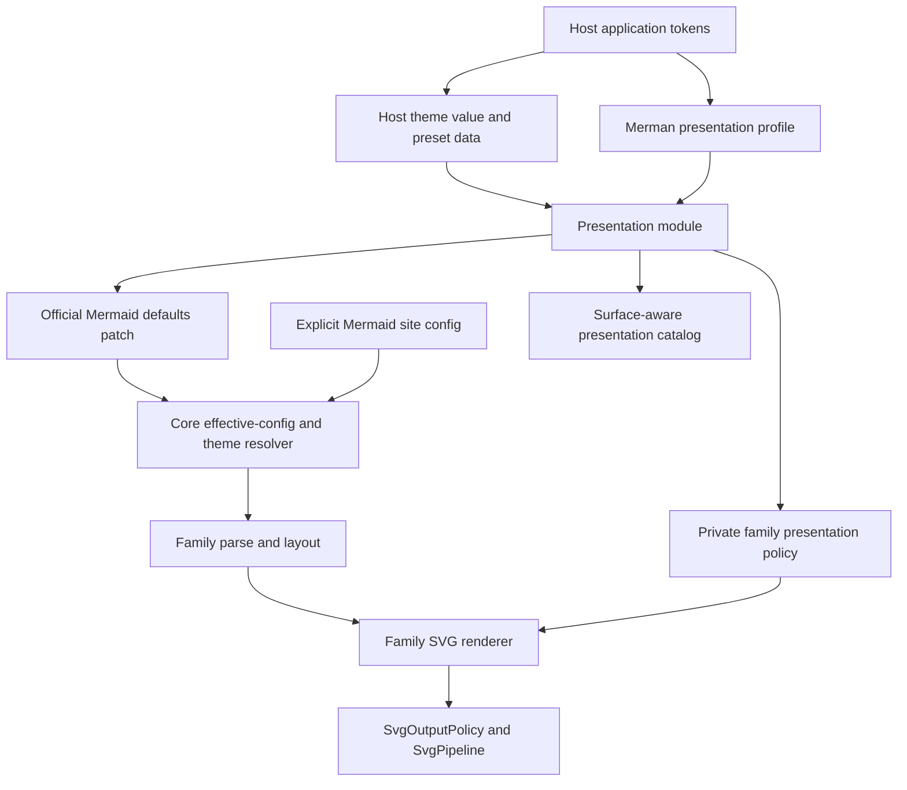
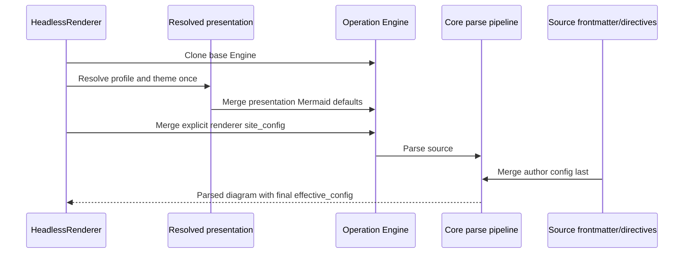
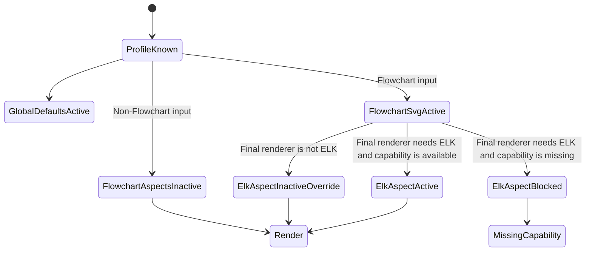

# Presentation and Theme Architecture - Plan

## Goal Capsule

| Field | Contract |
| --- | --- |
| Objective | Replace the mixed `HostThemeProfile` surface with a small presentation module that separates host theme tokens, official Mermaid config, Merman-owned presentation policy, and SVG output policy while preserving PR #28 correctness. |
| Authority | The pinned Mermaid 11.16 behavior and accepted ADRs own parity semantics; this plan owns the new alpha.4 source API and migration; native ABI 3 remains unchanged. |
| Execution profile | Implement in `.worktrees/theme-system` on `refactor/theme-system`, use focused characterization tests before deletion, and commit reviewable units with Conventional Commit messages. |
| Stop conditions | Stop if the design requires a generic plugin DSL, a new code generator, a parser or analysis/LSP rewrite, a Native ABI 4 change, or an unapproved default-parity change. |
| Tail ownership | Finish implementation, simplification, review, tests, documentation, and local commits in this branch; do not publish, tag, merge, or modify the occupied main worktree without explicit authorization. |

---

## Product Contract

### Summary

Merman needs one clear public model for product-owned presentation without turning Mermaid config, rendering policy, and SVG cleanup into one preset object. The new model keeps Mermaid parity as the zero-configuration path, preserves the seven useful editor theme presets, promotes `merman-modern` into a first-party presentation profile, and moves Merman-only Flowchart geometry out of the Mermaid configuration namespace.

### Problem Frame

`HostThemeProfile` currently owns unrelated concerns: semantic host colors, Mermaid `themeVariables`, arbitrary `site_config`, the SVG output pipeline, root background policy, scoped CSS, and the `merman-modern` product recipe. This makes configuration precedence depend on Rust builder call order, makes editor themes silently select `resvg-safe` output, advertises a Flowchart profile as an ordinary theme preset, and exposes `flowchart.edgeCornerRadius`, `flowchart.edgeLabelPadding`, and `flowchart.compactEdgeCorners` as if they were Mermaid configuration.

PR #28 also introduced valuable source-backed ELK, Neo, routing, shape, and rendering corrections. The refactor must preserve those corrections while moving only product-specific compact corners, padded label masks, and related private geometry into a typed Merman owner.

### Actors

- A1. A Rust host embeds Merman in an editor, documentation tool, or application and wants reusable theme and presentation configuration.
- A2. A Web or native SDK consumer uses Options JSON and runtime discovery instead of Rust types.
- A3. A Mermaid document author supplies frontmatter or directives and expects them to retain Mermaid-compatible precedence.
- A4. A Merman maintainer adds future theme roles or first-party presentation profiles without expanding a preset lattice or hand-maintaining transport-specific lists.

### Requirements

#### Ownership and default behavior

- R1. Rendering with no inherited or selected presentation must preserve the existing default Mermaid-parity config, SVG DOM, and output pipeline. An empty presentation layer contributes no override: it preserves parity when no lower layer exists and inherits the lower layer in a reusable-engine request.
- R2. Host theme tokens, official Mermaid config, Merman-owned presentation policy, and SVG output policy must have separate public owners and must not be nested inside one mixed profile object.
- R3. Rust configuration precedence must be independent of builder call order and must resolve as engine/base config, presentation profile defaults, explicit host theme data, explicit renderer or binding `site_config`, then diagram frontmatter and directives.
- R4. `SvgOutputPolicy` and `SvgPipeline` must remain the sole owners of parity, readable, resvg-safe, scoped CSS, CSS override, background, and duplicate-fallback behavior.
- R5. The seven existing editor presets must remain available as theme-only data and must no longer select an SVG output pipeline implicitly.

#### Presentation profiles and Flowchart behavior

- R6. `merman-modern` must be represented as a first-party presentation profile rather than a host theme preset, and absence of a profile must represent Mermaid defaults instead of a separate `mermaid` preset. Its stable ID guarantees the profile's named intent, aspect model, and override boundaries rather than pixel-identical output; a materially different bundle requires a new profile ID.
- R7. The `merman-modern` profile must retain its Redux/slate theme defaults, Neo look, Flowchart ELK default, and PR #28 private Flowchart styling while allowing explicit theme, site config, and source config to override its official Mermaid fields. For an ordinary `flowchart`, explicitly selecting a non-ELK `flowchart.defaultRenderer` disables only the ELK-default aspect; the applicable private Flowchart SVG policy remains active.
- R8. The Merman-only `flowchart.edgeCornerRadius`, `flowchart.edgeLabelPadding`, and `flowchart.compactEdgeCorners` values must become typed private policy and must not be read from `effective_config` or documented as Mermaid config.
- R9. The private Flowchart policy must travel with the prepared render operation to the Flowchart SVG renderer, while official `theme`, `look`, `flowchart.defaultRenderer`, `layout`, and `elk.*` values continue through the existing effective-config and layout paths.
- R10. Selecting a known profile must not fail during Options parsing or renderer construction solely because `layout-elk` is absent; capability admission must depend on the final detected family and effective renderer selection. The explicit `flowchart-elk` source type always requires ELK.
- R11. A non-Flowchart operation using a renderer configured with `merman-modern` must not require ELK, while an ordinary Flowchart that still resolves to ELK and every `flowchart-elk` source must return the existing typed missing-capability error when ELK is unavailable.

#### Public APIs and discovery

- R12. The Rust API must expose a small immutable presentation value with private fields, an orthogonal host-theme value, non-exhaustive semantic theme-role identifiers, and one first-party profile enum; it must not expose a generic strategy registry or arbitrary options DSL.
- R13. Options JSON schema 2 must replace `host_theme` with a narrow `presentation` group, keep raw Mermaid overrides at top-level `site_config`, keep output under `svg`, reject unknown fields and `null` presentation values, and return a migration-oriented error for the removed `host_theme` group. In reusable-engine requests, an omitted or empty `presentation` object contributes no override and therefore inherits constructor presentation; callers that need parity create or use an engine without a base presentation.
- R14. Runtime discovery must expose a surface-aware `presentation-catalog` that distinguishes known entries from full availability, reports aspect-specific capability requirements and applicability, and derives availability from the transport's `ArtifactCapabilitySurface`. A profile that is not fully available must remain selectable when its unavailable aspect is not required by the current operation.
- R15. Web and native SDK helpers must consume runtime discovery without rejecting a producer merely because it knows a newer presentation ID; bundled known-ID constants may remain convenience data but must not be treated as the runtime authority.
- R16. Native ABI 3 layout, function slots, operation codes, ownership rules, and discovery symbol must remain unchanged; presentation discovery must use the existing generic metadata channel and Options JSON operation path.
- R17. Render planning or result metadata must report the selected presentation profile and independently report its global-default, family-SVG, and optional-layout aspect states as active, inactive for the current family or effective config, or blocked by a missing capability.

#### Migration, proof, and maintainability

- R18. Alpha.3 users of presets, custom roles, raw host-theme config, host-theme output, and `CompiledHostTheme` must have direct migration guidance to the new theme, top-level `site_config`, `svg`, and reusable presentation APIs.
- R19. PR #28's source-backed ELK processor validation, model ordering, Neo sizing, route cutting, and canonical rendering corrections must remain in their current owners and retain focused regression coverage.
- R20. The implementation must use Rust-owned static descriptors and existing metadata dispatch rather than adding a descriptor generator, a source parser, a mini compiler, or duplicated proof scripts.
- R21. The separate review of CI and release-script oververification must remain deferred until the presentation refactor is complete and must not expand this change set.
- R22. First-party consumers must migrate to the new axes without private config keys: the CLI must offer a direct presentation-profile selector, the Playground must expose theme, profile, and SVG output as separate controls, and the Typst package must project its host-theme abstraction to `presentation.theme` while keeping output policy separate.

### Key Flows

- F1. Reusable Rust host rendering
  - **Trigger:** A1 constructs one renderer for multiple Mermaid documents.
  - **Actors:** A1, A3
  - **Steps:** The host selects a presentation profile and optional theme, adds explicit site config and SVG output policy, then renders documents whose frontmatter may override official Mermaid fields.
  - **Outcome:** Builder order does not alter precedence, mixed diagram families render through one reusable renderer, and only applicable profile aspects affect each operation.
  - **Covered by:** R1-R12, R17
- F2. Binding and Web rendering
  - **Trigger:** A2 sends Options JSON schema 2 through a reusable or one-shot render operation.
  - **Actors:** A2, A3
  - **Steps:** The binding validates `presentation`, compiles the same Rust presentation value, applies top-level `site_config`, admits capabilities after parsing, renders, and returns operation metadata.
  - **Outcome:** Rust and binding callers receive the same presentation semantics and error classification.
  - **Covered by:** R3, R7-R17
- F3. Runtime catalog discovery
  - **Trigger:** A2 builds a settings UI or generic SDK against a slim or full artifact.
  - **Actors:** A2, A4
  - **Steps:** The consumer reads runtime capabilities, discovers `presentation-catalog`, displays known themes and profiles with availability, and submits stable IDs through Options JSON.
  - **Outcome:** A slim artifact can report `merman-modern` as known, show exactly which aspects are available, and still permit operations that do not activate a missing aspect.
  - **Covered by:** R10-R17, R20
- F4. Alpha.3 migration
  - **Trigger:** A1 or A2 upgrades code that used `HostThemeProfile` or `host_theme`.
  - **Actors:** A1, A2
  - **Steps:** The user maps theme data to the new theme value, moves Mermaid overrides to `site_config`, moves output choices to `svg` or `SvgOutputPolicy`, and replaces `MermanModern` with the presentation profile.
  - **Outcome:** The migration is explicit, does not preserve misleading aliases indefinitely, and documents the intentional output-policy change.
  - **Covered by:** R5-R8, R13, R18
- F5. First-party product migration
  - **Trigger:** A maintainer or user selects presentation through the CLI, Playground, or Typst package.
  - **Actors:** A1, A2, A4
  - **Steps:** The CLI selects a stable profile ID directly, the Playground sends separate theme/profile/output values, and Typst translates document typography and `host-theme` data into `presentation.theme` without changing its explicit SVG settings.
  - **Outcome:** Repository-owned products exercise the public contract instead of private Mermaid config keys or the removed `host_theme` wire group.
  - **Covered by:** R3-R7, R13-R18, R22

### Acceptance Examples

- AE1. With no presentation configured, the same source and render options produce the same raw SVG bytes and capability plan as the baseline branch.
- AE2. `with_site_config(...).with_presentation(...)` and the reverse call order produce the same effective config, with explicit site config and source frontmatter winning over presentation defaults.
- AE3. A One Dark theme changes colors and typography but keeps parity SVG output until the caller separately selects `resvg-safe` and an explicit root background color.
- AE4. A full artifact renders a Flowchart with `merman-modern`, retaining Redux/slate defaults, Neo geometry, ELK layout, compact routed corners, and padded edge-label masks.
- AE5. A non-Flowchart diagram renders successfully with `merman-modern` on an artifact without ELK; the operation may apply supported global theme/look defaults while reporting both Flowchart aspects as inactive instead of returning missing-capability.
- AE6. An ordinary Flowchart configured with `merman-modern` fails with typed `layout-elk` missing-capability on a slim artifact, but succeeds when explicit site or source config selects a non-ELK `flowchart.defaultRenderer`; the private Flowchart SVG aspect remains active while the ELK-default aspect reports inactive-by-override. A `flowchart-elk` source remains blocked without ELK regardless of that override.
- AE7. Options JSON containing `host_theme` fails with an error that points users to `presentation`, top-level `site_config`, and `svg` instead of reporting an unknown field without migration context.
- AE8. A slim runtime catalog includes `merman-modern` as known, marks only its ELK-default aspect unavailable when `layout-elk` is missing, and leaves both theme presets and non-ELK profile use selectable.
- AE9. The final `effective_config` and generated config support matrix contain no `edgeCornerRadius`, `edgeLabelPadding`, or `compactEdgeCorners` Merman extension keys.
- AE10. A Web runtime accepts catalog IDs as open runtime strings, derives bundled convenience IDs separately, and does not fail initialization when the producer advertises an unknown future profile.
- AE11. The modern Flowchart CLI showcase selects `merman-modern` through a dedicated profile option and keeps its JSON file limited to official Mermaid configuration.
- AE12. The Playground can independently select a theme preset, `merman-modern`, and `resvg-safe` output, while Typst `host-theme` values serialize under `presentation.theme` and never select output implicitly.

### Success Criteria

- The default parity characterization suite shows no presentation-induced output changes.
- Every public Rust, Options JSON, Web, and native metadata entry has one owner and one migration path.
- `merman-modern` is conditionally capability-aware and no longer appears in a flat host-theme preset list.
- No new generator or verification script is required to maintain the presentation surface.
- The focused and cross-layer verification gates in this plan pass before the branch is handed back for PR review.

### Scope Boundaries

#### In Scope

- Public Rust presentation and host-theme source API replacement before alpha.4.
- Options JSON schema 2 presentation migration and platform type updates.
- Surface-aware presentation metadata through the existing generic metadata mechanism.
- Typed ownership for PR #28's Merman-only Flowchart SVG policy.
- First-party CLI, Playground, and Typst migration to the new public contract.
- Migration documentation, changelog, ADR, examples, and focused cross-layer tests.

#### Outside This Refactor

- Parser, SourceMap, analysis, editor, LSP, Native ABI, or family semantic rewrites.
- A public plugin trait, strategy registry, generic style DSL, theme marketplace, or user-defined renderer backend.
- Per-diagram Cargo features, a presentation preset lattice, or new binary SDK flavors.
- New theme packs beyond the seven existing editor presets and the one `merman-modern` profile.
- Pixel-perfect adoption of Zed, modern-mermaid, or beautiful-mermaid product styling.

#### Deferred to Follow-Up Work

- CI and release-script simplification after this refactor has stable owners and tests.
- Additional first-party presentation profiles after a second real use case proves the extension seam.
- Richer catalog localization or UI hints beyond stable IDs, capability requirements, applicability, and availability.
- Any future private layout policy; the current private policy has only SVG consumers and must not preemptively enter every layout interface.

### Dependencies and Assumptions

- PR #28 is merged at baseline `029e92f1f7ca3a8dffda08bbc46c7f6daaaf8f31`.
- Options JSON schema 2 and the final alpha.4 high-level SDK surfaces are still allowed to take source-breaking corrections.
- Native ABI 3 remains the binary compatibility anchor and already provides a generic metadata collection path.
- The seven editor theme presets are user-visible alpha.3 behavior and require migration rather than silent deletion.
- `layout-elk` remains optional, so profile selection and operation capability admission cannot be collapsed into one constructor-time check.

---

## Planning Contract

### Key Technical Decisions

- KTD1. **Perform a bounded fearless source refactor before alpha.4.** Break the Rust and high-level SDK source surfaces that encode the wrong ownership, but retain Native ABI 3 and the existing parser, family, and output pipeline architecture. (session-settled: user-directed — chosen over extending PR #28 or accumulating compatibility patches: the user wants the long-term interface corrected during the current alpha break window.) Governs R2, R6, R8, R12, R13, R16, R18.
- KTD2. **Design around user-controlled axes instead of the merged feature.** Model host colors and typography, official Mermaid config, first-party Merman presentation, and output compatibility as separate axes that can be combined. (session-settled: user-directed — chosen over a PR-specific theme switch: the user asked for an abstraction based on future host needs and comparable Mermaid products.) Governs R2-R9, R12-R15.
- KTD3. **Use one small deep presentation module.** The module owns validation, preset expansion, profile resolution, private policy, and catalog descriptors, but does not expose registries, provider traits, arbitrary strategy options, or a descriptor generator. (session-settled: user-approved — chosen over a generic `PresentationSpec` DSL and plugin registry: those designs added abstractions without a second implementation and repeated the repository's oververification problem.) Governs R12, R20.
- KTD4. **Make configuration layers structural.** `HeadlessRenderer` stores its base engine, presentation, explicit site-config overlay, and SVG output policy separately, then materializes an operation engine in the R3 order. `with_presentation` and `with_site_config` never mutate the same stored config layer. Governs R1, R3, R7, R18.
- KTD5. **Separate a theme value from the first-party presentation profile.** The theme value contains optional appearance, font, semantic role map, and series palette; the profile enum initially contains only `MermanModern`. Explicit theme data overlays profile theme defaults, while top-level site and source config remain final authorities for official Mermaid fields. Governs R5-R7, R12, R18.
- KTD6. **Keep `MermanModern` honest about independent profile aspects and stable intent.** Redux/slate theme and Neo look are global profile defaults consumed by families that support them; the private compact-routing and label policy is a Flowchart SVG aspect; `flowchart.defaultRenderer=elk` is a separate optional-layout aspect. Non-Flowchart operations never require ELK, result metadata reports each aspect independently, and the stable profile ID permits source-backed visual evolution inside those semantic boundaries rather than freezing pixels forever. Governs R6, R7, R10, R11, R17.
- KTD7. **Thread only consumed private policy.** A resolved private Flowchart presentation policy travels from the facade operation through `PreparedSemantic` and `FamilyRenderArtifact` to the Flowchart SVG renderer. It does not enter `LayoutExecution` because current private fields affect SVG edge paths, label masks, and viewBox only; official effective config continues to drive Neo sizing and ELK layout. Governs R8, R9, R19.
- KTD8. **Resolve capability requirements after effective configuration exists without inventing new precedence.** Profile IDs are syntactically validated early, but ELK admission uses the parsed diagram type and final effective Flowchart renderer. An explicit non-ELK `flowchart.defaultRenderer` disables the profile's ELK-default aspect for ordinary `flowchart` sources without disabling the separate private Flowchart SVG aspect; `flowchart-elk` sources remain ELK-required. Root `layout` is not treated as an escape hatch because the pinned detector derives Flowchart layout from the renderer selection. Governs R10, R11, R17.
- KTD9. **Use a surface-aware static runtime catalog.** Presentation-owned Rust descriptors define known theme presets, presentation profiles, applicable family/aspect IDs, and capability requirements. Each transport projects availability from its `ArtifactCapabilitySurface`; no platform owns a second runtime list. Semantic role IDs remain owned by the Rust and Options schema until a real runtime-discovery consumer exists. Governs R14, R15, R20.
- KTD10. **Keep ABI 3 stable and migrate source APIs directly.** Add `presentation-catalog` through the existing `metadata_collect` slot and carry presentation selection through Options JSON. The old metadata ID is not part of the frozen ABI 3 table or minimum semantics, so delete it and let the generic dispatcher reject it as an unknown ID; do not preserve a deprecated empty catalog. Remove or reject the old Rust and schema-level mixed owners instead of retaining parallel long-term implementations. Governs R13-R16, R18.
- KTD11. **Do not preserve editor-theme output coupling.** Theme presets no longer imply `resvg-safe`, root background, CSS override, or fallback cleanup. Migration examples show the explicit `SvgOutputPolicy` or `svg.*` values needed to reproduce the old editor-preview result. Governs R4, R5, R18.
- KTD12. **Review CI simplification only after the architecture lands.** This branch first establishes real owner tests; a separate follow-up may delete duplicate or compiler-like scripts based on the new proof boundaries. (session-settled: user-directed — chosen over mixing script cleanup into the theme refactor: the user requested both efforts but asked that the architectural work continue first.) Governs R20, R21.
- KTD13. **Make first-party products consume the same public axes.** The CLI receives a direct presentation-profile option, the Playground stores theme/profile/output independently, and Typst retains its useful document-level `host-theme` vocabulary while projecting it into `presentation.theme`. None may depend on private Flowchart config keys or restore theme/output coupling. Governs R3-R7, R13-R18, R22.

### High-Level Technical Design

The diagrams describe ownership and sequencing rather than exact public signatures.







### Public Model Shape

The public Rust surface should use private fields and constructor or builder methods rather than public record literals.

- `Presentation` is an immutable reusable value that combines an optional first-party profile with an optional host theme.
- `PresentationProfile` is non-exhaustive and initially contains only `MermanModern`.
- `HostTheme` owns appearance, font family, font size, semantic tokens, and series palette.
- `HostThemePreset` retains only `editor-light`, `editor-dark`, `one-dark`, `gruvbox-light`, `gruvbox-dark`, `ayu-light`, and `ayu-dark`.
- `ThemeRole` is non-exhaustive and covers the existing host-neutral roles without exposing one optional public field per role.
- `ResolvedPresentation` and `FlowchartPresentationPolicy` remain crate-private and carry the Mermaid patch, selected IDs, and private SVG policy.
- Existing render-side `PresentationTheme` keeps its ADR-0068 meaning as the view over final Mermaid `themeVariables`; it is not renamed or reused for host input.

### Options JSON Shape

The schema remains version 2 because the final alpha.4 schema is not yet released.

```json
{
  "version": 2,
  "presentation": {
    "profile": "merman-modern",
    "theme": {
      "preset": "one-dark",
      "appearance": "dark",
      "font_family": "Inter, system-ui, sans-serif",
      "roles": {
        "canvas": "#282c34",
        "text": "#abb2bf",
        "line": "#61afef"
      },
      "series_palette": ["#61afef", "#98c379", "#e5c07b"]
    }
  },
  "site_config": {
    "themeVariables": {
      "fontFamily": "Inter"
    }
  },
  "svg": {
    "pipeline": "resvg-safe",
    "root_background_color": "#282c34"
  }
}
```

### Alternatives Considered

| Alternative | Benefit | Rejection reason |
| --- | --- | --- |
| Keep extending `HostThemeProfile` | Small immediate diff and no migration | It preserves mixed ownership, call-order precedence, output coupling, and a misleading flat preset list. |
| Generic `PresentationSpec` strategy DSL with registries | Maximum hypothetical extensibility | It freezes provider, fallback, options-map, and registry abstractions before a second real implementation exists. |
| One `VisualIntent::modern()` API plus generated descriptor | Very ergonomic common case | It hides significant layout and family behavior behind a vague name and adds a generator for a surface that Rust static descriptors can own. |
| Theme-only cleanup without a presentation profile | Simplest theme API | It leaves PR #28's private modern geometry in fake Mermaid config and cannot report conditional ELK behavior honestly. |
| Move all presentation policy into `merman-core` | One configuration engine | It violates ADR-0068 by mixing Mermaid parity state with product presentation and SVG-only policy. |

### System-Wide Impact

- Public Rust source compatibility changes in `merman-render` and the `merman` facade.
- Options JSON schema 2 changes shape but keeps its version and strict unknown-field behavior.
- Web, Android, Apple/UniFFI, Flutter, Python, WASM, and C metadata smoke tests move from a flat preset list to a detailed catalog.
- Native ABI 3 stays binary-compatible because the existing operation and generic metadata functions carry the new data.
- `HeadlessRenderer` gains stable config-layer semantics that may alter callers that relied on builder call order; the upgrade guide must call this out.
- Editor theme presets intentionally stop selecting output cleanup; consumers must opt into the same output behavior explicitly.
- CLI showcase assets, Playground state and controls, and Typst option serialization move to the same public presentation contract used by external consumers.
- No new runtime I/O, global cache, scripting language, or generated descriptor is introduced.

### Risks and Mitigations

| Risk | Consequence | Mitigation |
| --- | --- | --- |
| Presentation defaults accidentally mutate the no-profile path | Mermaid parity regression | Start with byte-level no-op characterization and keep `None` and empty presentation as separate tested fast paths. |
| Config precedence changes a caller that embedded site config in a custom Engine | Unexpected theme/layout result | Define base Engine as the lowest host layer, provide explicit renderer `site_config` for winning overrides, and document the source break. |
| `MermanModern` appears wholly unavailable in a slim artifact | Hosts disable a profile whose global or non-ELK aspects are usable | Keep catalog and operation metadata aspect-specific, accept known IDs during parse, and calculate ELK admission from final family and effective config. |
| Private policy leaks back into Mermaid config | Future parity and schema confusion | Add negative tests against effective config, generated config support, and binding options. |
| Profile/theme/output combinations create a preset lattice | Public API growth and unclear precedence | Keep one profile axis, one theme axis, one independent output axis, and no combined enum variants. |
| Runtime catalog drifts across transports | SDKs advertise unavailable behavior | Project every catalog from `ArtifactCapabilitySurface` and remove platform-owned runtime lists. |
| Migration tests duplicate implementation details | Brittle maintenance and slower CI | Test observable precedence, catalog projection, capability states, and rendered signals rather than parsing source files or reconstructing a call graph. |

### Sources and Research

- `docs/adr/0064-host-styling-svg-postprocessors.md` defines product styling and SVG output as separate contracts.
- `docs/adr/0068-render-side-presentation-theme-view.md` defines final Mermaid theme resolution and the renderer-facing `PresentationTheme` owner.
- `docs/plans/2026-06-09-001-refactor-host-theme-profile-plan.md` records the alpha.3 host-theme goals and the API decisions this plan supersedes.
- `crates/merman-render/src/svg/theme_profile.rs`, `crates/merman/src/svg/mod.rs`, and `crates/merman-bindings-core/src/render/request.rs` show the current mixed owner and Rust/binding precedence divergence.
- `crates/merman-render/src/svg/parity/flowchart/render_config.rs` and `crates/merman-render/src/svg/parity/flowchart/edge_geom` identify the current SVG-only private policy consumers.
- `repo-ref/mermaid` is the pinned authority for Mermaid theme, look, layout, detector, and ELK semantics.
- `repo-ref/zed/crates/mermaid_render` demonstrates that host semantic tokens, product styling, and resvg-safe output are distinct integration needs.
- `repo-ref/modern_mermaid` and beautiful-mermaid research show that users primarily customize base colors, fonts, theme, look, layout, and a small set of product-level presentation choices rather than arbitrary renderer strategy graphs.

---

## Implementation Units

### U1. Freeze current behavior and write the ownership ADR

- **Goal:** Establish the baseline contracts and record the new ownership before deleting public surfaces.
- **Requirements:** R1-R11, R19
- **Dependencies:** None
- **Files:** `docs/adr/0077-presentation-theme-and-output-ownership.md`, `crates/merman/src/svg/mod.rs`, `crates/merman-bindings-core/src/render.rs`, `crates/merman-render/tests/flowchart_svg_test.rs`, `crates/merman/tests/theme_profile_coverage.rs`
- **Approach:** Inventory and retain the existing preset, modern-profile, Flowchart SVG, and binding coverage before adding tests. Add only the missing characterization for no-profile parity, mixed-family rendering, and full versus no-ELK admission. Record the known builder-order defect as an ADR invariant and a U3 regression specification instead of committing an intentionally failing test. The ADR must define the four owners, configuration precedence, conditional capability state, and the reason private policy stays outside layout APIs.
- **Test scenarios:** No presentation is byte-identical; existing PR #28 and preset tests continue to preserve their source-backed behavior without duplicate fixtures; existing single-layer renderer calls retain their behavior; non-Flowchart profile use does not require ELK.
- **Verification:** Characterization tests pass on already-correct behavior and establish stable fixtures for the source-breaking units that follow.

### U2. Introduce the deep presentation and host-theme module

- **Goal:** Replace the mixed profile data model with the small immutable model in KTD3 and KTD5.
- **Requirements:** R2, R5-R8, R12, R20
- **Dependencies:** U1
- **Files:** `crates/merman-render/src/presentation/mod.rs`, `crates/merman-render/src/presentation/theme.rs`, `crates/merman-render/src/presentation/presets.rs`, `crates/merman-render/src/presentation/profile.rs`, `crates/merman-render/src/lib.rs`, `crates/merman-render/src/svg.rs`, `crates/merman-render/src/svg/theme_profile.rs`
- **Approach:** Move preset data and role-to-Mermaid mapping into the new module; replace `HostThemeRoles` public fields with a semantic role map; resolve profile defaults before explicit theme data; return an internal Mermaid config patch and private policy; define the static theme/profile/aspect catalog descriptors beside those owners; delete output, raw theme variables, and raw site config from the theme owner.
- **Test scenarios:** All seven preset mappings retain representative role and palette signals; custom semantic roles override preset values; explicit theme data overrides `MermanModern` theme defaults; empty presentation resolves to no patch and no private policy; invalid IDs or CSS values return typed input errors.
- **Verification:** The module has no dependency on `SvgPipeline`, no plugin traits or registry hooks, and no generated descriptor file.

### U3. Make renderer config layering order-independent

- **Goal:** Turn R3 into a `HeadlessRenderer` invariant shared by reusable and request-scoped operations.
- **Requirements:** R1, R3, R7, R12, R18
- **Dependencies:** U2
- **Files:** `crates/merman/src/svg/mod.rs`, `crates/merman/src/svg/operation.rs`, `crates/merman/src/lib.rs`, `crates/merman/tests/theme_profile_coverage.rs`
- **Approach:** Store base Engine, resolved presentation, explicit site-config overlay, and output pipeline separately; construct the operation Engine once in the fixed order; replace host-theme and compiled-theme helpers with presentation helpers that share the same resolution path and cache reusable values.
- **Test scenarios:** Both builder orders produce identical effective config and SVG; repeated `with_site_config` calls merge within the explicit layer; frontmatter and directives win over profile defaults; request-scoped and reusable presentation paths agree; a custom base Engine remains lower priority than explicit presentation and renderer site config.
- **Verification:** No `with_presentation` path directly calls `Engine::with_site_config` on stored renderer state, and no second binding-only precedence implementation remains.

### U4a. Introduce the typed Modern Flowchart policy and carrier

- **Goal:** Give Merman-only Flowchart geometry one typed owner without breaking existing consumers during the migration.
- **Requirements:** R6-R11, R17, R19
- **Dependencies:** U2, U3
- **Files:** `crates/merman/src/svg/operation.rs`, `crates/merman-render/src/family.rs`, `crates/merman-render/src/svg/parity.rs`, `crates/merman-render/src/svg/parity/flowchart/mod.rs`, `crates/merman-render/src/svg/parity/flowchart/render_config.rs`, `crates/merman-render/src/svg/parity/flowchart/edge_geom`, `crates/merman-render/src/svg/parity/flowchart/render/edge_label.rs`, `crates/merman-render/src/svg/parity/flowchart/viewbox.rs`, `crates/merman-render/tests/flowchart_svg_test.rs`
- **Approach:** Carry the resolved private policy beside the parsed/prepared artifact and pass it only to the Flowchart SVG path. During this unit, keep one crate-private adapter from the three legacy effective-config keys to the typed policy so the old binding and showcase remain functional until U5 and U9a migrate. Derive independent global-default, Flowchart-SVG, and ELK-default aspect states from family plus final official renderer config. Keep Neo node sizing and ELK layout on their current official config path.
- **Test scenarios:** Modern compact corners and padded labels remain visible under both ELK and an explicit non-ELK Flowchart renderer; ELK-only endpoint adaptation remains conditional on actual ELK layout; ordinary Mermaid rounded curves keep their existing radius behavior; no-ELK non-Flowchart operations succeed; ordinary Flowchart capability failure, explicit non-ELK renderer override, and `flowchart-elk` behave as AE5 and AE6; layout JSON remains governed only by official config.
- **Verification:** PR #28 regression fixtures remain green through the typed carrier, and the temporary legacy-key adapter is crate-private and named for deletion in U4b.

### U5. Replace the binding schema owner and extend SVG planning evidence

- **Goal:** Make Options JSON schema 2 compile the same presentation value as Rust and expose resolution evidence through the existing SVG planning owner.
- **Requirements:** R3, R7-R13, R17, R18
- **Dependencies:** U3, U4a
- **Files:** `crates/merman-render/src/family.rs`, `crates/merman-bindings-core/src/common.rs`, `crates/merman-bindings-core/src/render/request.rs`, `crates/merman-bindings-core/src/render.rs`, `crates/merman-bindings-core/src/svg_plan.rs`, `docs/bindings/OPTIONS_JSON.md`
- **Approach:** Add strict `presentation.profile` and `presentation.theme` DTOs; map semantic role keys through the Rust owner; remove output, raw theme variables, and nested site config; reject `host_theme` with a targeted migration message; extend `RenderCapabilityPlan` and the existing `svg-plan-json` payload with the selected profile and independently resolved aspect states rather than creating a second generic-result authority.
- **Test scenarios:** The documented JSON compiles; Rust and JSON produce equivalent SVG and plan metadata; unknown profile/role fields fail closed; old `host_theme` reports the migration; slim artifacts accept the known profile ID and defer capability admission; explicit `svg.*` wins independently.
- **Verification:** Binding materialization no longer stores `host_theme_site_config` or assembles output from theme data, and presentation state has one planning owner rather than duplicate generic-result metadata.

### U9a. Migrate the CLI consumer and modern showcase

- **Goal:** Give CLI users a direct presentation-profile entry point without encoding private policy in Mermaid config files.
- **Requirements:** R3-R7, R13, R18, R22
- **Dependencies:** U5
- **Files:** `crates/merman-cli/src/cli.rs`, `crates/merman-cli/src/config.rs`, `crates/merman-cli/src/render/prepare.rs`, `docs/assets/modern-flowchart/README.md`, `docs/assets/modern-flowchart/merman-modern.json`
- **Approach:** Add a stable `--presentation-profile` selector to render-capable CLI workflows, compose it with `-c` through the fixed renderer layers, and keep the modern showcase JSON limited to official Mermaid config.
- **Test scenarios:** Profile selection composes with `-c` regardless of argument order; unknown IDs fail with CLI-native validation; the modern showcase retains its rendered signals without private keys.
- **Verification:** CLI tests exercise profile-only, config-only, and combined requests, and the showcase command no longer relies on Merman extension keys.

### U4b. Delete the private Mermaid-config compatibility path

- **Goal:** Complete the ownership move after every repository-owned producer can construct the typed policy directly.
- **Requirements:** R6-R11, R17-R19
- **Dependencies:** U5, U9a
- **Files:** `crates/merman-render/src/svg/parity/flowchart/render_config.rs`, `crates/merman-render/src/svg/parity/flowchart/edge_geom`, `crates/merman-render/src/svg/parity/flowchart/render/edge_label.rs`, `crates/merman-render/src/svg/parity/flowchart/viewbox.rs`, generated config support claims, `docs/assets/modern-flowchart/merman-modern.json`
- **Approach:** Remove the U4a legacy-key adapter and every read or claim for `flowchart.edgeCornerRadius`, `flowchart.edgeLabelPadding`, and `flowchart.compactEdgeCorners`; accept private policy only from the prepared render artifact. Raw Mermaid site config cannot activate private policy.
- **Test scenarios:** Typed profile rendering retains compact corners and padded labels; raw site config using any removed key has no private-policy effect; effective config and generated support contain none of the three keys; the migrated showcase remains visually characterized through its profile selector.
- **Verification:** Repository search finds the three keys only in migration documentation and negative tests, while PR #28 behavior remains green.

### U6. Add surface-aware presentation discovery across transports

- **Goal:** Replace flat preset discovery with one artifact-projected catalog.
- **Requirements:** R14-R16, R20
- **Dependencies:** U2, U4b, U5
- **Files:** `crates/merman-bindings-core/src/metadata.rs`, `crates/merman-bindings-core/src/lib.rs`, `crates/merman-wasm/src/lib.rs`, `crates/merman-ffi/src/lib.rs`, `crates/merman-ffi/tests/c_consumer_smoke.c`, `crates/merman-android-jni/src/lib.rs`, `crates/merman-uniffi/src/lib.rs`, `platforms/web/src/runtime-render.ts`, `platforms/web/src/public-catalog.ts`, `platforms/web/src/public-types.ts`, `platforms/web/src/index.ts`, `platforms/web/scripts/surface-manifest.mjs`, `platforms/web/scripts/smoke.mjs`, `platforms/android/src/main/kotlin/io/merman/MermanEngine.kt`, `platforms/flutter/lib/src/merman_ffi.dart`, `platforms/python/merman/tests/test_runtime_catalog.py`, `platforms/apple/Sources/Merman/Generated/Merman.swift`
- **Approach:** Project and dispatch the presentation-owned static descriptors from U2; add a surface-aware metadata dispatcher; make FFI, JNI, UniFFI, and WASM pass their actual `ArtifactCapabilitySurface`; project `known`, `fully_available`, aspect-level availability, and `missing_capability_ids`; expose one `presentationCatalog` convenience per high-level transport; make Web runtime IDs open; delete the prerelease `supported-host-theme-presets` metadata ID and every high-level wrapper while preserving the generic ABI 3 metadata slot.
- **Test scenarios:** Full and slim artifact surfaces produce different aspect availability from the same known catalog; a no-ELK surface still permits operations that do not activate the ELK aspect; analysis-only surfaces advertise no callable presentation entries; Web accepts an injected future ID; transport smoke tests read the same schema and stable ordering; the deleted metadata ID returns the ordinary unknown-ID error.
- **Verification:** No platform maintains a separate runtime availability list and no new metadata function slot or native symbol is added.

### U9b. Migrate the Playground consumer

- **Goal:** Let the Playground expose the three user-facing choices independently without inventing a combined preset lattice.
- **Requirements:** R3-R7, R13-R18, R22
- **Dependencies:** U5, U6
- **Files:** `playground/src/store/index.ts`, `playground/src/components/Toolbar.tsx`, `playground/src/runtime/merman-operation-input.ts`, `playground/src/runtime/merman-core.ts`, `playground/src/App.tsx`, relevant Playground unit and browser tests
- **Approach:** Replace flat host-theme state with separate theme preset, presentation profile, and explicit SVG output values; populate known/available choices from the Web presentation catalog while preserving open runtime IDs internally.
- **Test scenarios:** Requests can vary each axis independently; the profile remains selected while state moves among fully available, missing-but-inapplicable, inactive-by-explicit-renderer, blocked-for-current-operation, and unknown-future-ID cases; unavailable catalog aspects are explained without disabling valid non-ELK uses; the current explicit resvg-safe preview behavior is preserved; unknown future runtime IDs do not crash initialization.
- **Verification:** Playground tests cover state serialization, catalog transitions after source or site-config changes, the rendered request shape without `host_theme`, and accessible controls whose non-color status text is programmatically associated without stealing focus.

### U9c. Migrate the Typst consumer

- **Goal:** Preserve Typst's document-oriented theming vocabulary while emitting the new binding contract.
- **Requirements:** R3-R5, R13, R18, R22
- **Dependencies:** U5
- **Files:** `packages/typst/merman/src/options.typ`, `packages/typst/merman/src/render.typ`, `packages/typst/merman/tests`, `packages/typst/merman/README.md`
- **Approach:** Keep the user-facing `host-theme` and document typography helpers, but serialize their resolved value through `presentation.theme`; keep profile and SVG output choices explicit and independent.
- **Test scenarios:** Direct options, reusable Typst profiles, and context-derived typography emit the new wire shape; explicit host theme still wins over inferred typography; theme selection never changes SVG output implicitly.
- **Verification:** Typst source and smoke fixtures contain no `host_theme` wire field, and the README explains the distinction between Typst host context and Merman presentation profiles.

### U7. Remove obsolete APIs and close migration documentation

- **Goal:** Finish the alpha source break without leaving parallel owners or misleading docs.
- **Requirements:** R5, R6, R12, R13, R18, R21, R22
- **Dependencies:** U4b, U5, U6, U9a-U9c
- **Files:** `crates/merman-render/src/svg/theme_profile.rs`, `crates/merman/src/svg/mod.rs`, `crates/merman-render/src/svg.rs`, `docs/rendering/host-theme-profiles.md`, `docs/rendering/presentation-themes.md`, `docs/release/ALPHA3_TO_ALPHA4_UPGRADE_GUIDE.md`, `docs/alignment/CONFIG_FRONTMATTER_SUPPORT.md`, `docs/rendering/diagram-theme-coverage.md`, `CHANGELOG.md`, relevant crate and platform README files and examples
- **Approach:** Delete `HostThemeProfile`, `CompiledHostTheme`, mixed output types, `MermanModern` and `Mermaid` theme preset variants, duplicate request-scoped helpers, and stale static catalog checks; replace the old guide with the four-axis model and copyable Rust/JSON migrations; update modern Flowchart assets to use official config plus the profile entry point rather than private keys.
- **Test scenarios:** Documentation examples compile or pass smoke tests; every removed symbol or JSON field is named in the upgrade guide; prose is not manually hard-wrapped; README installation and first-render examples remain correct.
- **Verification:** Repository search finds no active mixed owner, stale preset claim, or documentation that says theme selection controls SVG cleanup.

### U8. Run proportional cross-layer verification and simplify the final diff

- **Goal:** Prove the new ownership across Rust, bindings, Web, and native metadata without adding redundant proof machinery.
- **Requirements:** R1-R22
- **Dependencies:** U1-U3, U4a, U4b, U5-U7, U9a-U9c
- **Files:** All changed files plus focused tests selected by the Verification Contract
- **Approach:** Run formatting and focused suites first, then the relevant multi-crate and platform gates; inspect failures before broadening; remove dead compatibility branches, duplicate DTO mappings, experimental abstractions, and tests that only restate another owner.
- **Test scenarios:** Default parity, preset migration, profile capability states, config precedence, private-policy isolation, catalog projection, Options migration, first-party product migration, Web open discovery, and native metadata collection all pass in their owning suites.
- **Verification:** The final diff contains no abandoned attempt, unused compatibility alias, new generator, or test that parses Rust source to prove runtime behavior.

---

## Verification Contract

Run commands sequentially and reuse the worktree target directory. Use `cargo clean` only if disk pressure blocks progress.

| Gate | Command | Proves |
| --- | --- | --- |
| Formatting | `cargo fmt --all --check` | Rust source formatting after public API and module moves. |
| Presentation owner | `cargo nextest run --locked -p merman-render presentation` | Preset expansion, semantic roles, profile resolution, and private policy defaults. |
| Flowchart policy | `cargo nextest run --locked -p merman-render --test flowchart_svg_test modern` | PR #28 modern routing, labels, Neo, and ELK behavior after private-key removal. |
| Rust facade | `cargo nextest run --locked -p merman presentation` | Renderer layer precedence, request-scoped parity, and migration-facing Rust API. |
| Binding contract | `cargo nextest run --locked -p merman-bindings-core presentation` | Options schema 2, migration errors, result metadata, and artifact capability admission. |
| Native metadata | `cargo nextest run --locked -p merman-ffi -p merman-uniffi metadata` | ABI3 generic metadata collection and high-level native projections. |
| WASM/Web unit contracts | `npm test --prefix platforms/web` | Surface manifest, package ownership, and runtime catalog helpers. |
| Web build and smoke | `npm run build --prefix platforms/web && npm run smoke --prefix platforms/web` | Generated WASM exports, TypeScript types, package assembly, open-ID discovery, and browser-independent smoke behavior. |
| CLI consumer | `cargo nextest run --locked -p merman-cli presentation` | Direct profile selection, config composition, and modern showcase request construction. |
| Playground consumer | `npm test --prefix playground` | Independent theme/profile/output state and Options JSON request construction. |
| Typst plugin | `cargo nextest run --locked -p merman-typst-plugin --no-default-features` | Rust-side Typst request handling without broad optional capabilities. |
| Typst package | `cargo run --locked -p xtask -- build-typst-package --profile publish` | Published Typst source serializes the new presentation contract; the existing CI smoke supplies the external Typst binary. |
| Python projection | `python3 -m pytest platforms/python/merman/tests/test_runtime_catalog.py` | Python runtime catalog and legacy metadata compatibility. |
| Flutter projection | `dart test` from `platforms/flutter` | Dart catalog parsing and cached metadata behavior. |
| Android projection | `platforms/android/gradlew -p platforms/android testDebugUnitTest --stacktrace` | Kotlin catalog API and Android metadata smoke behavior when the native test artifact is available. |
| Relevant broad Rust gate | `cargo nextest run --locked -p merman-render -p merman -p merman-bindings-core -p merman-wasm -p merman-ffi -p merman-uniffi` | Cross-crate regressions across the complete touched Rust surface. |
| Diff hygiene | `git diff --check` | Whitespace errors and accidental manual-wrap damage. |

When a platform gate requires unavailable SDK tooling or a prebuilt native artifact, record the exact unmet prerequisite and rely on the corresponding CI job rather than weakening or replacing the test.

---

## Definition of Done

### Global Completion Criteria

- All R1-R22 requirements and AE1-AE12 examples are represented by implementation and owning tests.
- Default raw SVG parity remains unchanged without presentation selection.
- The new public model has one small presentation module and four independent user-controlled axes: host theme, presentation profile, top-level Mermaid `site_config`, and SVG output policy.
- `merman-modern` capability admission is correct for full, slim, Flowchart, non-Flowchart, and explicit override cases.
- Private Flowchart policy no longer travels through Mermaid config.
- Rust, Options JSON, Web, and native metadata expose the same stable IDs and semantics.
- Native ABI 3 remains unchanged.
- The alpha.3 to alpha.4 upgrade guide covers every intentional source and JSON break.
- Focused gates and all available broad gates pass, with unavailable external-tool gates recorded for CI.
- Abandoned experiments, redundant compatibility code, duplicated tests, stale docs, and unused generated artifacts are absent from the final diff.
- Logical milestones are committed with precise staging and Conventional Commit messages; nothing is published, tagged, or merged without explicit approval.

### Unit Completion Matrix

| Unit | Done signal |
| --- | --- |
| U1 | ADR and passing characterization tests freeze the intended baseline; the call-order defect is specified for U3. |
| U2 | The new module owns theme/profile resolution and the old mixed data model is no longer needed by new code. |
| U3 | Renderer configuration order is structural and reusable/request-scoped APIs agree. |
| U4a | Modern private policy is typed, operation-owned, SVG-consumed, and temporarily reachable from one crate-private legacy adapter. |
| U4b | The private policy is absent from Mermaid config and every repository-owned consumer constructs it through the new owner. |
| U5 | Options JSON schema 2 and operation metadata use the Rust presentation owner with targeted migration errors. |
| U6 | Every transport reads a surface-aware catalog from shared Rust descriptors without a new ABI slot or runtime list. |
| U9a | CLI and modern showcase assets use the profile entry point without private config keys. |
| U9b | Playground theme, profile, and output controls remain independent and catalog-aware. |
| U9c | Typst preserves its host-context vocabulary while emitting `presentation.theme` and explicit output. |
| U7 | Old symbols, stale presets, mixed docs, and implicit output coupling are removed with complete migration guidance. |
| U8 | Proportional focused and broad verification passes and the final diff is simplified to maintained owners only. |
