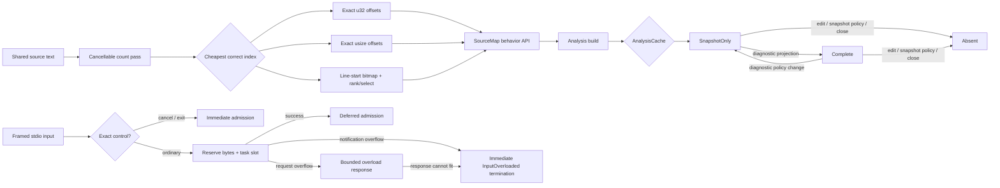
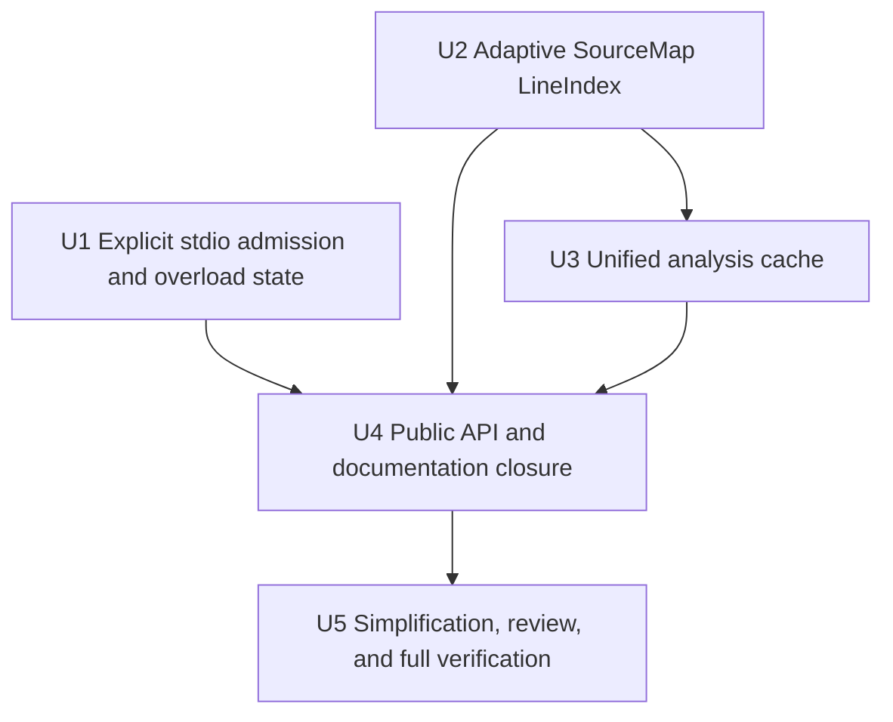

# Analysis and LSP Residual Hardening - Plan

## Goal Capsule

- **Objective:** Close the remaining ownership, overload, and pathological-memory gaps after the completed analysis-generation and `LanguageSession` refactor: make all reusable snapshots live in one weighted cache, replace stdio's fail-closed control lane with explicit admission and bounded overload semantics, replace `SourceMap`'s dense `usize` line-start array with an adaptive private index, and finish the alpha.3-to-alpha.4 Rust migration contract.
- **Authority:** The maintainer has explicitly approved breaking prerelease Rust APIs, deleting superseded code, performing a fearless refactor, using an isolated worktree, and committing coherent implementation units without intermediate approval.
- **Baseline:** Implement from committed HEAD `efc5efc24384014207b2245f2a846b199ac875c9` in worktree `.worktrees/analysis-lsp-hardening`. The completed U1-U7 work in `2026-07-29-002-refactor-analysis-lsp-generation-session-plan.md` is baseline behavior and must be verified, not recreated.
- **Execution profile:** Cross-crate Rust refactor with deterministic concurrency tests, representation-level memory invariants, exact public migration notes, serial Cargo verification, and reviewable Conventional Commits.
- **Stop conditions:** Stop if a change alters Mermaid parsing or editor semantics without source-backed evidence, introduces a second snapshot/cache owner, silently drops a document mutation while claiming the session remains healthy, guesses future semantics by polling an arbitrary admitted future, requires touching unrelated render/performance/release-script work, or requires discarding user changes.
- **Tail ownership:** The implementation owns simplification, independent code review, focused and full verification, migration documentation, and local commits. It does not own pushing, opening a pull request, or releasing alpha.4 unless separately requested.

---

## Product Contract

### Summary

Merman will have three deep residual-hardening modules with explicit invariants:

1. a private adaptive `LineIndex` behind `SourceMap` behavior APIs;
2. one session-owned `AnalysisCache` whose entries progress from snapshot-only to complete analysis under one weight budget; and
3. a private Merman stdio admission scheduler that distinguishes immediate protocol controls, deferred ordinary work, recoverable request overload, and unrecoverable notification input loss.

The public Rust surface will describe these final ownership and overload contracts directly. No deprecated aliases, weak-cache transition paths, or obsolete control-lane constants remain.

### Problem Frame

The previous refactor correctly established immutable `AnalysisGeneration`, policy-only diagnostic projection, shared editor snapshots, bounded analysis execution, ordered `LanguageSession` operations, and a weighted complete-analysis LRU. Three residual mismatches remain:

- snapshot-only language queries retain only a `Weak<DocumentSnapshot>`, so sequential completion, hover, structure, and semantic-token requests can repeat parsing unless a diagnostics/code-action request happens to create a complete cache entry;
- stdio stops reading on the first admission overflow, so a later cancellation or `exit` is unreachable despite documentation claiming control reachability under ordinary saturation; the current method-name-only control classification also lets ID-bearing `$/cancelRequest` messages enter the reserved path;
- `SourceMap` publicly exposes `Arc<[usize]>` line starts and can retain roughly 32 MiB for a legal 4 MiB all-newline document, with additional geometric construction amplification before the weighted LRU can admit or reject the result.

The remaining alpha migration guide also describes the broad new architecture without mapping several exact removed methods, ownership changes, strict/permissive JSON seams, semantic-token names, and the transport changes introduced by this plan.

### Requirements

**Adaptive source mapping**

- R1. `SourceMap` must preserve byte, Unicode scalar, UTF-16, CR, LF, CRLF, empty-tail-line, clamped line-end, span, and cancellation behavior for every valid UTF-8 boundary.
- R2. Line indexing must be private and adaptive: compact offsets for ordinary sources, a rank/select bitmap when line density makes it smaller, and a correct wide fallback for standalone sources beyond the `u32` address range. The general `SourceMap` API must not inherit the LSP's 4 MiB source limit.
- R3. Index construction must use two cancellable passes with exact final allocation, no per-line geometric-growth buffer, and no boxed-slice-to-`Arc<[T]>` copy. Both passes must checkpoint at bounded byte intervals.
- R4. Remove `SourceMap::line_starts()`. Expose behavior-oriented `line_count()` and `line_start(index)` alongside the existing `line_bounds()` and position APIs. Keep the cancellable constructor crate-private for analysis/LSP pipelines; document the public synchronous `SourceMap::new` convenience boundary without adding an unproven host-facing lifetime contract.
- R5. Retained-weight accounting must charge the selected representation and its rank/select metadata conservatively while continuing to reserve the bounded line-metric cache allowance.
- R6. `SharedTextSlice::from_range` must have direct table-driven characterization for full, empty, valid shared subslices, reversed and out-of-bounds ranges, non-character boundaries, source-`Arc` identity, deref/as-ref behavior, and explicit owned copying.

**One analysis cache owner**

- R7. `LanguageSession` must have one weighted `AnalysisCache` entry per URI and current snapshot stamp. An entry is either snapshot-only or complete; both states hold strong references and participate in the same recency order and total budget.
- R8. Successful snapshot builds whose snapshot-only weight fits the cache budget enter the cache before request-local leases are released. Oversized snapshots follow R10's request-local-only rule. Sequential snapshot-only queries must reuse the same `AnalysisGeneration` while the admitted entry remains resident, without diagnostics being requested.
- R9. A request hit touches recency once. Snapshot-only-to-complete promotion and background diagnostic reprojection replace the current entry without an additional recency touch; a new build is inserted as most-recently used.
- R10. Promotion must preserve `AnalysisGeneration` pointer identity. If the complete state exceeds the cache budget while the snapshot-only state fits, return the complete result to the current requester but retain the snapshot-only entry. If the snapshot-only state itself cannot fit, return it request-locally and cache neither state.
- R11. Diagnostic-only configuration changes must preserve analyzer environment identity and custom registries through `Analyzer::with_diagnostic_policy`, immediately release obsolete cached payloads, keep reusable snapshots, and commit only projections for the latest diagnostic generation. Snapshot-affecting changes, text edits, close, source rejection, cancellation, and stale builds remove or reject both cache states as appropriate.
- R12. Cache admission, promotion, reprojection, invalidation, and eviction must be private operations of a dedicated deep module. Remove weak snapshot state, complete-only cache choreography, and origin flags that only distinguish the superseded two-owner model.
- R13. Cache eviction must never close documents, change document epochs, resurrect stale generations, or corrupt diagnostic/semantic-token result identity. Every admitted entry must carry a cache-local incarnation token; promotion/reprojection may replace only the still-resident incarnation they started from, because URI/epoch/generation identity alone cannot distinguish an entry that was evicted and later targeted by stale work. Cancelled, stale, and evicted-in-flight work must contribute zero cache entries and zero retained weight.

**Explicit stdio admission and overload semantics**

- R14. Merman's private stdio adapter must produce an explicit immediate-or-deferred admission outcome. It must never infer control completion by polling an arbitrary future once, and it must never locally discard a future after admission while continuing the same healthy session. The public `StdioService` trait is removed; custom transports continue to drive `MermanLspService` through Tower's `Service<Request>` contract and own their own bounded scheduling.
- R15. Only a precisely validated, ID-less, size-bounded `$/cancelRequest` notification and a valid ID-less, size-bounded `exit` notification may use private immediate control admission. ID-bearing, malformed, oversized, or method-spoofed messages use the ordinary deferred contract and retain their JSON-RPC response behavior. An ID-bearing `$/cancelRequest` is an invalid request, not a cancellation: neither Merman's pre-poll admission registry nor tower-lsp-server's running-request registry may observe a cancellation side effect from it.
- R16. Before the private adapter admits an ordinary message, the transport must acquire its encoded-byte permit and one permit from a 96-token retained-deferred admission budget. That single permit stays attached to the task through queued and running states and is the sole per-message capacity token; four-way ordinary poll concurrency remains a consumer-side execution limit and has no second capacity reservation. The private handoff may be physically unbounded only because every published task already owns one of those 96 permits. Once a deferred future has been admitted, publishing it must not have a capacity-failure path; it may thereafter complete or be dropped only as part of whole-session termination.
- R17. Ordinary request overload before admission must produce a bounded JSON-RPC server-overload response and continue reading while the session remains synchronized, but only when the complete serialized error response fits the count-and-byte-bounded overload lane. If a large string ID or output backpressure prevents admission of that response, the transport must terminate with `InputOverloaded`; it must not truncate the ID, exceed the budget, or continue without answering the request.
- R18. Ordinary notification overload is immediate input-integrity loss. The transport must cancel ordinary in-flight work, stop reading/admitting further data-plane messages, begin the existing bounded output shutdown, and return `InputOverloaded`. It must not silently drop a possible `didChange`, resume the session, or maintain a second control-drain state for a semantically invalid connection.
- R19. Exact controls bypass ordinary handler and byte budgets only while the input session is healthy. Multiple exact cancellation notifications may complete immediately while ordinary work is saturated, and exact `exit` may terminate the healthy session; after notification input loss or an unreportable request overload, immediate `InputOverloaded` termination supersedes later unread frames. Documentation must state this bounded guarantee rather than promise control reachability after an arbitrary hostile prefix.
- R20. Add `InputOverloaded` to the public termination contract. Output close/timeout remains the dominant return reason when it races protocol termination; this priority must be documented and deterministically tested. Successful exit admission does not hide a failed stdout.
- R21. The private immediate control contract replaces the public `StdioService` trait, control handler queue, control semaphore, aggregate control-byte budget, and public control/total handler-concurrency constants. Keep only the public Merman stdio entry points, ordinary handler concurrency, the ordinary request-byte budget, the maximum frame size, and a small single-control-frame size limit.

**Public API and migration closure**

- R22. Preserve and document the existing deliberate JSON split: root `AnalysisOptionsJson` decoding is forward-compatible with unknown fields, while direct decoding of public nested option types remains strict. Add contract tests and migration text so embedders choose the intended entry point without changing this behavior in the residual-hardening plan.
- R23. The alpha.3-to-alpha.4 guide must include exact migrations for borrowed cancellable generation analysis, rejection accessors, shared text ownership, `SourceMap` line APIs, nested JSON decoding, semantic-token planning names, removed parser-only text-scan symbols, analyzer engine construction, LSP dependency/type namespaces, removal of public `StdioService`, removed control constants, overload termination, and retained wire/schema names.
- R24. TypeScript and serialized schema-v1 names such as wire-level `AnalysisResult` remain unchanged. No Rust compatibility alias or deprecated transition shim is added for removed prerelease APIs.
- R25. README, ADR, changelog, rustdoc, compile fixtures, and tests must describe the same final contracts. `LanguageSession`, cache internals, line-index representations, and overload scheduling remain implementation details rather than new product configuration surfaces.

### Acceptance Examples

- AE1. Given `a\r\n😀b\rc\n`, every valid UTF-8 boundary produces the same line, character, UTF-16, line-bound, and round-trip behavior before and after the index replacement; the terminating newline produces an empty final line.
- AE2. Given a 4 MiB source containing only LF, only CR, or CRLF pairs, `SourceMap` selects the compact bitmap representation, retained line-index storage remains below 1 MiB, and cancellation during either scan returns no partial map.
- AE3. Given two sequential structure/semantic-token requests and no diagnostics request, the parser runs once while the snapshot-only entry remains resident. A later code-action request promotes the same generation to complete analysis without parsing again.
- AE4. Given a cache budget between snapshot-only and complete weight, complete projection succeeds for the current request, the cache retains the snapshot-only generation, total cached weight remains within budget, and a later snapshot query still avoids parsing.
- AE5. Given a diagnostic-only update during promotion, the old request-local lease may finish, but only a payload for the newest diagnostic generation may become complete. Given an edit or snapshot-policy update, the old entry cannot be promoted back into the cache.
- AE6. Given 96 retained ordinary deferred messages, a 97th ID-bearing request whose error response fits the overload lane receives a bounded overload response without entering the service; following exact cancel and exit frames are still read. Given a 97th notification, the transport cancels the session and returns `InputOverloaded` without admitting the notification or reading later ordinary/control frames.
- AE7. Given several exact, size-bounded, ID-less cancels followed by exact exit while ordinary work is saturated but no notification has been lost, each control is admitted immediately and exit terminates the session. Given an ID-bearing `$/cancelRequest`, it does not bypass ordinary admission, returns the normal invalid-request response, cancels neither a pre-poll nor already-running target request, and leaves no orphaned Tower pending entry.
- AE8. Given blocked stdout while overload errors or normal responses are pending, queued response bytes remain bounded, all admitted tasks are cancelled or drained by one deadline, and the returned termination reports output failure with its documented priority.
- AE9. Given unknown fields at the root or inside `lint`, root analysis-options decoding ignores them. Given direct `serde_json::from_value::<LintOptionsJson>`, unknown nested fields remain an error; the guide explains that callers wanting forward-compatible JSON must decode through the root.

### Success Criteria

- Snapshot-only and complete analysis share one strong-reference weighted LRU with no `WeakDocumentSnapshot`, `DocumentRecord.snapshot`, or complete-only cache owner.
- Sequential snapshot-only query tests demonstrate one parse; stale/cancelled tests demonstrate zero cache admission.
- Dense 4 MiB line-index retained storage is below 1 MiB, sparse line starts use 32-bit offsets when possible, and no public API exposes a contiguous `usize` slice.
- Stdio has no control future queue and no post-admission fallible enqueue. Exact controls remain reachable after a bounded ordinary overflow, while lost notifications explicitly terminate semantic service health.
- Migration documentation and external-style compile tests cover every intentional Rust break introduced by this plan.
- All focused and full verification gates pass serially, and independent review reports no unresolved P0/P1 correctness, concurrency, memory, API-contract, or maintainability finding.

### Scope Boundaries

**In scope**

- `merman-analysis` source-map representation, behavior API, internal cancellation, retained weight, option JSON contract tests, and docs.
- `merman-editor-core` migration from line-start representation access to behavior APIs.
- `merman-lsp` analysis cache ownership, promotion/reprojection/invalidation, stdio admission and overload state, termination contract, tests, docs, and in-repo callers.
- Alpha.3-to-alpha.4 migration guide, changelog, ADR/README alignment, and public compile fixtures affected by these changes.

**Deferred**

- Empirical cache-budget tuning beyond deterministic retained-weight and eviction invariants.
- Runtime cache telemetry or user-configurable analysis-cache policy.
- A full client-driven resynchronization protocol after lost notifications; this plan terminates semantic health instead.
- General-purpose transport framework extraction; custom transports keep using the public Tower service and are not coupled to Merman's private stdio scheduler.

**Outside this change**

- Mermaid syntax, parser-family semantics, layout, SVG, rendering, formatting, FFI, CLI ergonomics, workspace indexing, VS Code marketplace work, release workflows, benchmark scripts, or unrelated performance work.
- Replacing source text with Rope inside `SourceMap`, introducing a global database, or adding a new LSP actor architecture.

---

## Planning Contract

### Assumptions

- The current worktree is clean at `efc5efc24384014207b2245f2a846b199ac875c9`; unrelated primary-worktree render/performance and release-script changes belong to other sessions and must remain untouched.
- The repository remains prerelease alpha.4, so direct public breakage is preferable to compatibility aliases.
- The existing `WeightedLru`, `AnalysisExecutor`, guarded session commits, cancellation tokens, and shared generation/snapshot ownership are sound foundations to deepen rather than replace wholesale.
- The default 64 MiB session cache is an internal retained-reference budget, not a total RSS promise. Request-local `Arc` handles may outlive eviction.
- A bounded sequential byte stream cannot simultaneously preserve every notification, retain bounded resources, and guarantee control reachability after an arbitrary unbounded prefix. The selected overload state makes this tradeoff explicit.
- No external research is load-bearing. Repository code, ADRs, current tests, tower-lsp-server 0.23 source, and the prior implementation plan are the semantic authority.

### Key Technical Decisions

- KTD1. **Treat this as residual hardening, not a second architecture rewrite.** (session-settled: user-approved — preserve the completed U1-U7 foundations rather than recreating them.) Preserve `AnalysisGeneration`, `LanguageSession`, singleflight execution, ordered admission, and weighted-LRU foundations from the July 29 plan; replace only the remaining split ownership and incorrect overload/representation seams.
- KTD2. **Use one private adaptive line index.** A small `Arc<LineIndex>` owns exact-capacity boxed storage. Sparse sources use `u32` starts while the source fits that address space, wide sources fall back to `usize`, and dense sources use line-start bits plus sparse rank/select metadata when that total is smaller. Representation choice follows a cancellable counting pass; a second pass fills already-sized storage.
- KTD3. **Expose source-map behavior, not representation.** `line_count`, `line_start`, `line_bounds`, offset lookup, and span conversion are the supported public surface. Analysis keeps its cancellable construction path private; the contiguous `usize` slice contract is deleted.
- KTD4. **Use one analysis-cache state machine.** Each URI maps to `SnapshotOnly` or `Complete` plus document epoch, snapshot generation, analysis-job generation, a cache-local incarnation token, and—only for complete state—diagnostic generation. The module owns weight calculation, recency, promotion, downgrade, guarded replacement, and invalidation. Promotion/reprojection must prove that the exact starting incarnation is still resident; matching semantic stamps without presence is insufficient after capacity eviction.
- KTD5. **Prefer reusable parse evidence when payload cannot fit.** Oversized complete projection remains request-local while a fitting snapshot-only entry stays cached. This keeps the hard budget and avoids reparsing without pretending the payload was retained.
- KTD6. **Separate explicit admission from execution inside the bundled transport.** A private Merman adapter returns immediate control completion or a deferred handler. One 96-token semaphore bounds queued plus running ordinary work; its owned permit is acquired before service admission and travels with the task through an unbounded private handoff whose logical size therefore cannot exceed 96. Admitted deferred work is never guessed, re-polled for classification, or locally dropped after a capacity failure. Public embedded hosts remain coupled only to `MermanLspService`'s Tower contract.
- KTD7. **Classify overload by semantic risk.** Requests can be rejected locally because no mutation is lost, but only if their exact error response fits the bounded output lane. Notifications cannot be rejected over JSON-RPC and may mutate authoritative document state, so overflow terminates immediately as `InputOverloaded` rather than preserving a semantically invalid session.
- KTD8. **Keep control reachability bounded and honest.** Only exact small control notifications bypass ordinary resources while input integrity is intact. Notification loss or an overload response that cannot be retained terminates the connection immediately; documentation does not promise exit after an arbitrary hostile prefix.
- KTD9. **Keep output failure dominant.** `StdioTermination` is a dominant stop reason, not a full event history. `OutputClosed` wins races because the host cannot successfully deliver required responses or shutdown output; `InputOverloaded` distinguishes input-integrity loss when output remains healthy.
- KTD10. **Document both intentional JSON entry points.** Root decoding remains forward-compatible for configuration transports, while direct nested decoding remains strict for callers that deliberately validate one nested value. Contract tests and migration prose prevent the two behaviors from being mistaken for drift.
- KTD11. **Break cleanly.** (session-settled: user-directed — prerelease APIs may break and obsolete code may be deleted.) Delete obsolete types, flags, constants, tests, docs, and re-exports in the same unit that replaces them. Do not retain deprecated aliases or dual paths.

### High-Level Technical Design

### Dependency And Delivery Order

U1 and U2 are architecturally independent. Execute them serially to avoid parallel Cargo pressure; complete U2 before U3 so cache weights are calibrated against the final source-map representation.

### Stdio Defensive Policy

These are internal bundled-transport defaults, injectable in deterministic tests and not exposed as end-user tuning:

| Policy | Default | Exhaustion behavior |
| --- | ---: | --- |
| Maximum encoded frame | 32 MiB | Existing frame-level rejection/recovery rules apply. |
| Ordinary retained deferred admission | 96 queued-or-running messages | ID-bearing request: bounded overload response if possible; notification: `InputOverloaded`. |
| Ordinary future poll concurrency | 4 | Consumer polling pauses; it does not consume another admission token. |
| Aggregate retained ordinary bytes | 128 MiB | Same request-versus-notification behavior as queue exhaustion. |
| Exact immediate control frame | 4 KiB | Larger/malformed/id-bearing pseudo-controls use ordinary admission. |
| Overload response queue | 4 responses and 64 KiB serialized total | `InputOverloaded`; no truncation and no unanswered healthy continuation. |
| Overload JSON-RPC error | code `-32099`, message `Server overloaded` | Stable public wire behavior for a locally rejected ID-bearing request. |
| Output write/drain | Existing single 30-second absolute deadline | `OutputClosed` dominates any concurrent protocol stop. |

`InputOverloaded` maps to process failure in the bundled binary. `InputClosed` and clean exit-after-shutdown retain their existing success mapping; exit-without-shutdown and output failure remain failures.

### System-Wide Impact

| Surface | Change | Preserved invariant |
| --- | --- | --- |
| `merman-analysis` | Private adaptive line index, public behavior API, explicit root-versus-nested JSON decode contract | Diagnostic, source-span, UTF-16, wire schema, parser semantics |
| `merman-editor-core` | Use `line_count` rather than inspecting representation | Token planning order and packed token output |
| `merman-lsp::LanguageSession` | One strong weighted cache with snapshot/complete states | Ordering, singleflight, stale guards, document authority |
| `merman-lsp` stdio | Private immediate/deferred admission, bounded request rejection, immediate input-loss termination | Frame preservation, request cancellation, bounded shutdown |
| Embedded Rust hosts | Removed public `StdioService` and control constants; changed `SourceMap` APIs; explicitly documented the existing root-permissive/nested-strict JSON split | Public Tower service remains the custom-transport boundary; stable JSON/LSP protocol behavior where explicitly retained |
| Docs/tests | Exact alpha migration and deterministic edge cases | No hidden compatibility layer |

### Risks And Mitigations

| Risk | Severity | Mitigation |
| --- | --- | --- |
| Rank/select off-by-one changes CRLF or terminal-empty-line behavior | High | Differential oracle over every valid boundary, representation-boundary tests, explicit CR/LF/CRLF cases |
| Dense bitmap improves memory but regresses common lookup latency | Medium | Select representation only when smaller; rank metadata bounds scans to a small fixed block; preserve binary search for offset arrays |
| Complete promotion double-counts shared generation/source storage | High | Centralize weight calculation in `AnalysisCache`; test budgets between snapshot and complete weights and pointer identity |
| Async projection resurrects an evicted or stale entry | High | Commit with URI, epoch, snapshot generation, analysis-job generation, diagnostic generation, and generation identity |
| Capacity eviction occurs while promotion/reprojection is running | Critical | Capture a cache-local entry incarnation at start and replace only that still-resident incarnation; test eviction between start and commit without reinsertion or recency corruption |
| Request overload response retains a huge string ID | High | Charge serialized response bytes and count before enqueue; return `InputOverloaded` rather than truncate, exceed budget, or continue unanswered |
| Dropping admitted Tower futures leaks pending request state | Critical | Pre-reserve all deferred slots; the Merman adapter invokes only precisely classified response-less cancel/exit routes whose side effects occur synchronously in `Service::call`; lock this tower-lsp-server 0.23 behavior with before-first-poll and running-request cancellation tests |
| Notification overflow leaves later controls unread | Critical | Treat the first lost notification as semantic input-integrity loss; admit nothing further, cancel ordinary work, and terminate after the existing bounded output shutdown |
| Public break is under-documented | High | External-style compile fixtures plus exact alpha.3-to-alpha.4 replacement table and static removed-symbol audit |
| Unrelated concurrent changes contaminate commits | High | Work only in isolated worktree, inspect each diff, and stage exact plan-owned files |

### Alternatives Considered

- **Keep the weak snapshot side table and lengthen lease lifetime:** rejected because cache ownership and budget remain split and correctness depends on incidental request lifetime.
- **Add a second snapshot-only LRU:** rejected because one URI would have two recency orders, two budgets, and promotion choreography.
- **Always cache complete analysis or evict everything when complete is too large:** rejected because diagnostic payload size should not force repeated parsing when the reusable snapshot fits.
- **Use only `u32` line starts:** improves ordinary memory but still retains 16 MiB for a 4 MiB all-newline file; adaptive bitmap is materially better for pathological legal input.
- **Keep `line_starts()` by materializing a temporary vector:** rejected because it recreates the memory amplification and makes a borrowed slice lifetime impossible without retained duplication.
- **Publish the existing cancellable SourceMap constructor:** deferred because current cancellable consumers are internal analysis pipelines and this hardening does not establish a separate host-facing construction contract.
- **Remove strict nested JSON decoding:** rejected as unrelated behavior churn; the root-permissive/nested-strict split is deliberate and becomes explicit documentation plus tests.
- **Poll an admitted future once to discover immediate controls:** rejected because first-poll readiness is not a semantic contract and dropping a pending ID-bearing future can leak Tower pending state.
- **Maintain a control-drain state after notification loss:** rejected because the language session is already untrustworthy and the additional deadline/byte/client-response state only preserves protocol ceremony, not user-visible recovery. Immediate `InputOverloaded` termination is simpler and honest.
- **Fail closed as generic `InputClosed` on every admission overflow:** bounded but conflates EOF with overload and cannot reject recoverable ID-bearing requests while preserving a healthy session.
- **Drop overloaded notifications and continue:** rejected because losing `didChange` makes document state permanently divergent.
- **Expose runtime cache and overload tuning:** deferred; these are defensive internal policies, not alpha.4 product configuration.

### Sources And Research

- `docs/plans/2026-07-29-002-refactor-analysis-lsp-generation-session-plan.md` — completed architecture and non-regression baseline.
- `docs/adr/0071-editor-parser-semantic-seam.md` — one weighted session entry and layered ownership decision.
- `docs/adr/0070-diagnostics-first-analysis-contract.md` — policy split, forward-compatible payload governance, and source-map ownership.
- `crates/merman-analysis/src/source_map.rs` and `retained_weight.rs` — current dense line starts, metric cache, cancellation checkpoints, and weight accounting.
- `crates/merman-lsp/src/session/{analysis.rs,documents.rs,documents/analysis_state.rs,cache.rs}` — current weak snapshot plus complete LRU split.
- `crates/merman-lsp/src/transport.rs`, `transport/lifecycle.rs`, and transport tests — current control lanes, fail-closed overflow, and termination precedence.
- `tower-lsp-server 0.23.0` local source, especially `service/pending.rs` and `service/layers.rs` — synchronous pending registration and future-drop risk.
- Independent repository, architecture, and specification-flow subagent audits completed on 2026-08-02.

---

## Implementation Units

### U1. Replace Stdio Control Lanes With Private Explicit Admission And Honest Overload Termination

- **Priority:** P0 correctness and lifecycle integrity.
- **Dependencies:** None.
- **Primary files:**
  - `crates/merman-lsp/src/transport.rs`
  - `crates/merman-lsp/src/transport/lifecycle.rs`
  - `crates/merman-lsp/src/transport/tests.rs`
  - `crates/merman-lsp/src/session.rs`
  - `crates/merman-lsp/src/main.rs`
  - `crates/merman-lsp/tests/stdio_smoke.rs`
- **Approach:**
  1. Characterize exact cancel, exit, ID-bearing pseudo-control, pending-future, output-backpressure, and saturation behavior before changing the trait.
  2. Remove the public `StdioService` trait. Introduce private immediate/deferred admission and a Merman-specific adapter that performs known synchronous cancel/exit routing without polling arbitrary user futures. Keep `MermanLspService`'s Tower interface as the public custom-transport seam.
  3. Introduce precise transport message classification including request ID, params validity, and encoded size. Remove method-name-only `bounded_cancel` logic.
  4. Make cancellation side effects depend on the same exact notification classification at both Merman and Tower boundaries. An ID-bearing pseudo-cancel must reach ordinary invalid-request routing without touching either cancellation registry.
  5. Replace the ordinary semaphore-plus-bounded-channel choreography with one 96-token retained-deferred semaphore. Acquire its owned permit before admission, retain it inside the queued/running task, publish through an unbounded private handoff whose logical occupancy is therefore at most 96, and keep four-way polling solely in the consumer. A closed handoff means whole-session termination, not recoverable local task rejection.
  6. Add the four-response/64 KiB overload lane for ID-bearing requests rejected before admission. Emit JSON-RPC `-32099` with message `Server overloaded`, charge the complete serialized response including string IDs, and terminate as `InputOverloaded` if the response cannot fit or be queued.
  7. On ordinary notification overflow, cancel ordinary tasks, stop input admission immediately, begin bounded output shutdown, and return `InputOverloaded`; do not add a post-desynchronization control-drain state.
  8. Delete the control handler queue, control handler semaphore, aggregate control-byte budget, corresponding builders/constants, and fail-closed tests that encode the old model.
  9. Add `InputOverloaded`; document and test output-failure precedence and main-process exit-code mapping.
- **Tests:**
  - ordinary handler and byte saturation followed by request, cancel, and exit;
  - notification overflow immediately returns `InputOverloaded` and never admits or scans later frames;
  - exact small cancel/exit bypass, malformed/oversized/ID-bearing variants do not;
  - ID-bearing pseudo-cancel returns invalid request and cancels neither a pre-poll nor an already-running target;
  - multiple exact controls remain immediate under admitted ordinary saturation while input integrity is intact;
  - admitted deferred future is never locally discarded;
  - exact cancel reaches both Merman's pre-poll admission registry and tower-lsp-server's already-running pending registry synchronously before the returned response-less future is dropped;
  - huge string request ID cannot exceed overload-response byte budget;
  - EOF, overload, output-close, pending write/flush/shutdown, and session cancellation are deterministic under paused time/duplex/oneshot control;
  - no sleep-based race assertions.
- **Definition of done:** Stdio has one ordinary deferred lane, private explicit immediate controls, bounded request rejection, immediate honest input-loss termination, no post-admission fallible enqueue, and no public `StdioService` or control/total concurrency constants.

### U2. Replace Dense Line Starts With An Adaptive SourceMap LineIndex

- **Priority:** P0 pathological-memory safety; dependency for accurate cache weighting.
- **Dependencies:** None.
- **Primary files:**
  - `crates/merman-analysis/src/source_map.rs`
  - `crates/merman-analysis/src/retained_weight.rs`
  - `crates/merman-analysis/src/lib.rs`
  - `crates/merman-analysis/README.md`
  - `crates/merman-editor-core/src/token_planner.rs`
- **Approach:**
  1. Add direct `SharedTextSlice` range/ownership characterization before changing map construction.
  2. Introduce a private `LineIndex` with exact-capacity `u32`, wide `usize`, and bitmap/rank-select representations. Keep representation selection deterministic and based on total retained bytes.
  3. Split construction into cancellable count/selection and exact-fill passes with 4 KiB checkpoints. Store the index behind one small shared owner without converting a boxed slice into an unsized Arc.
  4. Implement representation-independent line count, indexed start lookup, offset location, bounds, and retained-weight methods.
  5. Replace all `SourceMap` internals with the behavior API, remove `line_starts()`, add `line_count()`/`line_start()`, and keep cancellable construction crate-private.
  6. Migrate editor-core token planning and every test/caller. Delete the old Vec builder and dense-slice assertions.
- **Tests:**
  - differential oracle across every valid UTF-8 boundary for mixed CR/LF/CRLF and astral Unicode;
  - empty input, terminal newline, bare CR, CRLF at bitmap block boundaries, line-end clamping, and UTF-16 reverse lookup;
  - forced representation and threshold-boundary tests, including simulated wide-selection logic without allocating 4 GiB;
  - 4 MiB LF/CR/CRLF retained index below 1 MiB and exact allocation length/capacity invariants;
  - cancellation during count and fill passes publishes no partial map;
  - weight estimate covers selected storage, metadata, Arc/Box overhead, mutex, and line-metric allowance.
- **Definition of done:** SourceMap semantics are unchanged, dense line-index memory is bounded by the compact representation, common sparse sources use 32-bit offsets, and no public or internal path requires a contiguous `usize` line-start slice.

### U3. Unify Snapshot-Only And Complete Analysis In One Weighted Cache

- **Priority:** P0 repeated-analysis and ownership correctness.
- **Dependencies:** U2.
- **Primary files:**
  - new private cache module under `crates/merman-lsp/src/session/`
  - `crates/merman-lsp/src/session/documents.rs`
  - `crates/merman-lsp/src/session/documents/analysis_state.rs`
  - `crates/merman-lsp/src/session/analysis.rs`
  - `crates/merman-lsp/src/session/analysis/request.rs`
  - `crates/merman-lsp/src/session/analysis/executor.rs`
  - `crates/merman-lsp/src/snapshot.rs`
  - `crates/merman-lsp/src/session/{analysis_tests,documents_tests}.rs`
- **Approach:**
  1. Introduce a private `AnalysisCache` wrapping `WeightedLru` and a single entry state for snapshot-only or complete analysis plus all currentness stamps and a monotonically issued cache-local incarnation token.
  2. Centralize snapshot/complete weight calculation and shared-allocation accounting. Admit a successful snapshot before releasing the request/executor strong references only when its snapshot-only weight fits; otherwise preserve the request-local-only result required by R10.
  3. Route all snapshot and complete lookups through typed cache methods that own recency touches and currentness validation.
  4. Promote snapshot-only to complete using the same generation and snapshot. Commit by replacing only the exact still-resident starting incarnation, without a second recency touch; preserve snapshot-only when the payload makes complete state oversized.
  5. On diagnostic-only configuration changes, derive the analyzer with `with_diagnostic_policy`, cancel obsolete projections, downgrade complete entries to snapshot-only, release old payloads, and eagerly/lazily reproject only under the latest diagnostic generation required by existing push/pull behavior.
  6. On snapshot-affecting configuration, edit, close, source rejection, cancellation, or stale result, invalidate through the cache module and prevent async promotion from resurrecting removed entries.
  7. Delete `WeakDocumentSnapshot`, `DocumentRecord.snapshot`, weak-upgrade cleanup, complete-only cache entry types, `DiagnosticProjectionOrigin`, and caller-visible `WeightedReplacement` choreography.
- **Tests:**
  - sequential completion/hover/structure/tokens parse once without diagnostics;
  - concurrent build/projection remains singleflight;
  - snapshot-only participates in weight, touch order, deterministic eviction, and close/invalidation;
  - promotion preserves generation pointer and correct recency, can evict other entries, and falls back to retained snapshot-only when complete is oversized;
  - oversized snapshot-only is request-local only;
  - diagnostic-only update causes zero parse, preserves custom registry/environment identity, releases old payload, and commits only the newest diagnostic generation;
  - edit, snapshot-policy change, close, last-waiter cancellation, and stale completion cannot repopulate cache;
  - capacity eviction between promotion/reprojection start and commit cannot reinsert the evicted entry or disturb the newer recency order;
  - external request leases remain valid after eviction and release final ownership on drop.
- **Definition of done:** One weighted strong-reference cache owns all reusable derived analysis; sequential language queries reuse parse evidence, every mutation stays within budget, and all weak/two-owner transition code is gone.

### U4. Close Public Rust APIs, Migration Documentation, And Architecture Text

- **Priority:** P1 prerelease contract integrity.
- **Dependencies:** U1-U3.
- **Primary files:**
  - `crates/merman-analysis/src/options_json.rs`
  - `crates/merman-analysis/src/lib.rs`
  - `crates/merman-analysis/README.md`
  - `crates/merman-lsp/src/lib.rs`
  - `crates/merman-lsp/README.md`
  - `docs/lsp/README.md`
  - `docs/adr/0071-editor-parser-semantic-seam.md`
  - `docs/release/ALPHA3_TO_ALPHA4_UPGRADE_GUIDE.md`
  - `CHANGELOG.md`
  - focused public API compile fixtures/tests
- **Approach:**
  1. Add explicit contract tests for permissive root analysis-option decoding and strict direct nested decoding; preserve both behaviors and document which entry point embedders should choose.
  2. Add public compile coverage for root/nested JSON contracts, new SourceMap line APIs, shared-text ownership, rejection accessors, semantic-token planning names, and stdio admission/termination.
  3. Expand the upgrade guide with exact alpha.3 symbols and replacements, including removed no-replacement parser text-scan APIs and intentionally retained wire names.
  4. Update LSP README/ADR language from reserved public control futures to private immediate control admission plus immediate input-loss termination. Document request-vs-notification overload, control size limits, `InputOverloaded`, output-failure priority, public `StdioService` removal, and the Tower service seam for custom transports.
  5. Delete stale public re-exports, constants, examples, comments, and tests. Do not touch protocol schema names or add compatibility aliases.
- **Definition of done:** Public docs, rustdoc, compile fixtures, changelog, and architecture records match the final code exactly; every intentional break has an explicit migration and no obsolete symbol remains discoverable.

### U5. Simplify, Review, Verify, And Commit The Final Architecture

- **Priority:** Release-quality closure.
- **Dependencies:** U1-U4.
- **Approach:**
  1. Run a code-simplification pass at each substantial implementation cluster and delete incidental abstractions, duplicated guards, dead tests, and unused imports without changing behavior.
  2. Run independent correctness, concurrency/reliability, performance/memory, API-contract, and maintainability review over the full branch diff.
  3. Resolve all valid P0/P1 findings; add focused regression tests before fixes where behavior is not already characterized.
  4. Run serial focused-to-broad verification, inspect the final diff/status, and commit only plan-owned files in coherent Conventional Commits.
- **Definition of done:** Review is clean at P0/P1, verification is green, the worktree contains no unrelated change, and the branch history communicates transport, SourceMap, cache, and API/doc value separately.

---

## Verification Contract

Run all Cargo commands serially in `.worktrees/analysis-lsp-hardening`.

| Gate | Units | Expected result |
| --- | --- | --- |
| `cargo fmt --all --check` | U1-U5 | All touched Rust is formatted with no unrelated diff. |
| `cargo nextest run -p merman-analysis -p merman-editor-core --no-fail-fast` | U2-U4 | Source mapping, shared text, token planning, and analysis contracts pass. |
| `cargo nextest run -p merman-lsp --features stdio --no-fail-fast` | U1, U3-U5 | Session, cache, transport, lifecycle, smoke, and public stdio behavior pass. |
| `cargo check -p merman-lsp --no-default-features` | U1, U3-U5 | The embedded Tower service seam compiles without the bundled stdio feature. |
| `cargo nextest run -p merman-bindings-core --features analysis --no-fail-fast` | U2, U4 | Binding analysis JSON construction/serialization remains compatible. |
| `cargo nextest run -p merman-wasm --all-features --no-fail-fast` | U2-U4 | Browser analysis/editor adapters compile and preserve schema behavior. |
| `cargo check -p merman-wasm --all-features --target wasm32-unknown-unknown` | U2-U4 | The actual wasm32 analysis/editor bindings compile. |
| `cargo check -p merman --no-default-features --features editor` | U2-U4 | Facade editor/analysis API compiles without rendering defaults. |
| `cargo test -p merman-analysis --doc` | U2, U4 | Public analysis examples compile. |
| `RUSTDOCFLAGS="-D warnings" cargo doc -p merman-analysis -p merman-editor-core --no-deps` | U2-U5 | Analysis/editor docs and intra-doc links are warning-free. |
| `RUSTDOCFLAGS="-D warnings" cargo doc -p merman-lsp --features stdio --no-deps` | U1, U3-U5 | LSP docs and intra-doc links are warning-free. |
| `cargo clippy -p merman-analysis -p merman-editor-core --all-targets --no-deps -- -D warnings` | U2-U5 | Analysis/editor changes are lint-clean. |
| `cargo clippy -p merman-lsp --features stdio --all-targets --no-deps -- -D warnings` | U1, U3-U5 | LSP/session/transport changes are lint-clean. |
| Static removed-symbol audit | U1-U5 | No `WeakDocumentSnapshot`, `DocumentRecord.snapshot`, `DiagnosticProjectionOrigin`, public `line_starts`, control handler queue/budget, or removed control/total constants remain. |
| Git scope audit | U1-U5 | Only plan-owned analysis/editor/LSP/docs files are changed and staged. |
| Independent deep review | U1-U5 | No unresolved P0/P1 finding. |

## Definition of Done

- U1 is done when stdio has private explicit immediate/deferred admission, bounded overload responses, immediate input-loss termination, honest termination semantics, and no public/custom control future lane.
- U2 is done when SourceMap uses a private adaptive index with exact cancellable construction, dense retained storage below 1 MiB at the LSP source ceiling, and behavior-only public APIs.
- U3 is done when snapshot-only and complete states share one strong weighted LRU, sequential queries avoid repeat parsing, promotion/invalidation races are guarded, and weak-cache transition code is deleted.
- U4 is done when root-permissive and nested-strict JSON decoding are explicit, tested contracts and every analysis/editor/LSP Rust break has exact migration, compile evidence, and aligned docs.
- U5 is done when simplification and independent review are complete, every applicable verification gate passes serially, and coherent local commits contain no unrelated work.
- The final branch preserves Mermaid parser/editor semantics and wire schemas while materially improving LSP maturity, memory safety, overload honesty, and maintainability.
