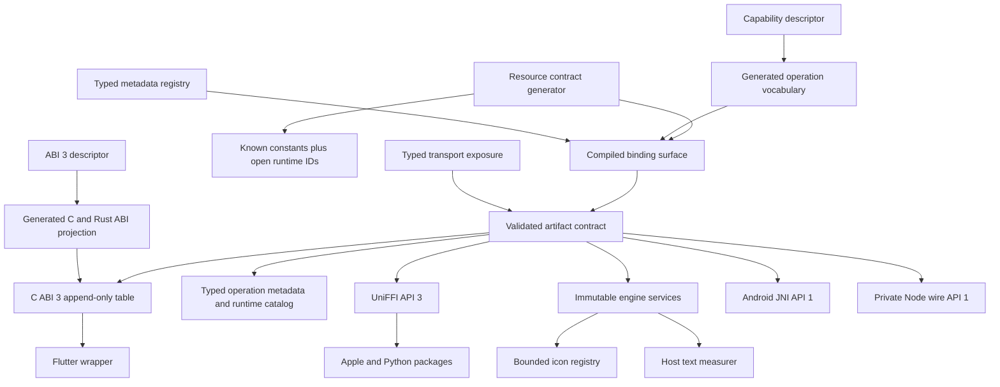
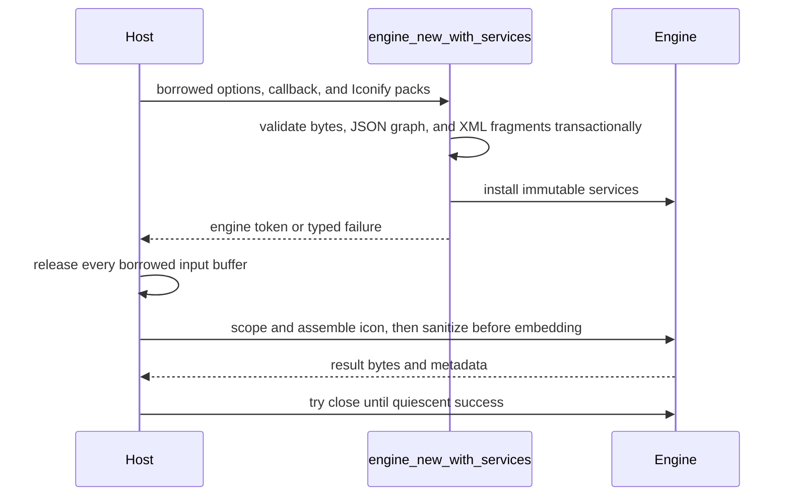

# FFI Contract Alignment and Native SDK Ergonomics - Plan

## Goal Capsule

- **Objective:** Finish the pre-release FFI redesign so Rust, C ABI 3, UniFFI, Android, Flutter, Apple, Python, and the private Node candidate expose one coherent native SDK contract with evolvable vocabularies, exact runtime discovery, constructor-owned host services, preserved result metadata, and bounded icon-pack support.
- **Authority:** `abi/merman-v3.json` owns the C wire contract. `capabilities/feature-surface-v1.json` owns operation and capability identity. `crates/merman-bindings-core` owns shared request, result, error, service, options, and runtime-catalog semantics. Generated projections and transport-owned tests prove each language surface. `v0.8.0-alpha.3` is the released comparison baseline; exact commit `5117c0ae12da2c0346b47061642286174cea3f5f` is the fixed same-revision implementation and dependency-attribution baseline.
- **Execution profile:** Fearless coordinated pre-release refactor. Rust and language source APIs may break. Delete closed or misleading abstractions instead of preserving compatibility shims. Keep native ABI 3 and its published six-slot prefix intact; add new C capabilities only through descriptor-owned records and appended function-table slots.
- **Stop conditions:** Do not create ABI 4, UniFFI API 4, Android transport API 2, Options JSON schema 3, a second native SDK SKU, an `icons` Cargo feature, per-request icon JSON, filesystem or network icon loading, arbitrary runtime callbacks, editor APIs, cancellation, or a parallel hand-written capability vocabulary unless implementation evidence proves an existing contract cannot express the required behavior.
- **Tail ownership:** Implement every unit in dependency order, regenerate owned artifacts, run the complete verification contract sequentially, remove abandoned designs and obsolete APIs, and create focused Conventional Commits in the isolated worktree. Do not push, open a pull request, publish packages, create a tag, or create a release.

---

## Product Contract

### Summary

The alpha.3-to-alpha.4 work replaced a broad legacy FFI surface with a canonical generic operation path, native ABI 3, reusable engines, runtime catalogs, resource contracts, host text measurement, generated language bindings, and default-empty capability features. The architecture is substantially better, but several contracts still disagree at their boundaries.

The remaining work is not another transport rewrite. It is a final contract-shaping pass before alpha.4 freezes. The C ABI needs semantic freeze enforcement and stronger misuse resistance without losing its append-only ABI 3 design. The Rust facade needs constructor-owned services and future-proof public data types. Language wrappers need open runtime vocabularies, accurate metadata discovery, complete named operations, and result APIs that do not hide resource-driven output plans. Native hosts also need Mermaid-compatible Iconify packs without importing CLI, filesystem, network, or async dependencies.

### Problem Frame

- ABI 3 verification freezes record and function-slot layout, but semantic descriptions, ownership text, resolved operation meaning, lifecycle rules, and the hard-coded opaque token scalar can drift while the compatibility check still passes.
- Engine and result tokens occupy independent registries but share the same numeric domain, so accidental cross-kind token use can target an unrelated live object.
- The defined `NONE` operation sentinel is reported as an unknown executable operation instead of being rejected as a non-executable sentinel.
- A constructor-provided host text callback silently overrides an explicit `environment.text_measurement` option in both baseline and request-overlay paths.
- `BindingOperationRequest` exposes public fields, and several public result and descriptor types remain easier to construct or exhaustively match than their evolution policy permits.
- Rust rendering supports `IconRegistry`, but native SDKs cannot install Iconify data into reusable engines.
- The runtime catalog always advertises all six metadata IDs and does not report accepted option groups or constructor-owned host services. Some transports cannot call everything they advertise.
- Flutter models append-only native operations as a closed enum. Android, Flutter, and Python model additive runtime resource-limit IDs as closed enums.
- Binary convenience methods discard operation metadata, including effective raster and PDF output plans after resource limiting.
- Named convenience methods omit `analysis-facts-json` and `svg-plan-json` on several transports.
- UniFFI reports a caller-supplied integer that exceeds host `usize` as an internal failure instead of invalid input.
- The private Node candidate advertises metadata it cannot collect, permits an unusable native runtime policy in TypeScript, validates response envelopes incompletely, hides its invalid-transport error type, and does not declare a Node engine floor.

### Actors

- A1. **C embedder:** discovers a size-tagged API, creates reusable engines, installs optional host services, executes generic operations, and owns explicit close/free lifecycles.
- A2. **Rust binding author:** composes immutable engines from validated options and services without relying on transport-specific structs or overriding user intent.
- A3. **Swift or Python integrator:** consumes generated UniFFI objects, named operations, runtime metadata, typed errors, and binary output plans.
- A4. **Kotlin or Flutter integrator:** consumes package-owned wrappers over JNI or C ABI while retaining lifecycle safety, open runtime vocabularies, and generated constants.
- A5. **Node or SSG evaluator:** uses the private static-SVG candidate through a strictly validated JavaScript transport and an honest runtime catalog.
- A6. **Maintainer:** evolves operations, resources, metadata, features, and generated packages from one canonical source without creating hidden dependency or compatibility costs.

### Requirements

#### ABI compatibility and lifecycle semantics

- R1. Native ABI 3 must retain its current minimum prefix, published six-slot prefix, numeric status and operation codes, error-kind vocabulary, record layouts, and ownership/lifecycle meaning; additions use appended records and function-table slots. Descriptor-owned unsafe-caller preconditions must state that every provided record/buffer is suitably aligned or deliberately read unaligned, fully readable, alive, and immutable for the call, with no concurrent mutation. Runtime validation returns typed errors only for detectable shape/range/overlap faults; dangling or unreadable pointers remain C caller violations that no ABI can safely probe.
- R2. CI must freeze a canonical ABI 3 semantic projection that covers minimum semantic rules, ownership rules, published call signatures, public record field ownership, opaque scalar and handle definitions, status/error mappings, and resolved operation ID, capability, media type, and URI requirements without changing the existing minimum-layout digest's responsibility. Verification must compare stable-keyed descriptor entries monotonically against the fixed baseline: existing items cannot be deleted, reordered, or changed even if snapshots are regenerated, while new records, fields, and slots are accepted only at descriptor-defined append points.
- R3. Native engine and result-allocation tokens must use disjoint opaque numeric domains while remaining nonzero, monotonic within each domain, non-reused, and compatible with the existing `uint64_t` representation. Domain tagging must preserve the sign bit so generated signed-64 language projections never turn valid handles negative; tokens are misuse-hardening identifiers, not an authorization or untrusted-tenant isolation boundary.
- R4. `MERMAN_NATIVE_OPERATION_NONE` must be rejected as a defined non-executable sentinel with invalid-argument semantics; unknown numeric values remain unknown operations.
- R5. Every native status with a specialized error kind must serialize the matching kind, and the frozen old-consumer fixture must exercise discovery, catalog collection, engine creation, execution, result release, close retry behavior, and successful quiescent close.

#### Rust facade and constructor-owned services

- R6. `BindingOperationRequest` must use constructors and fluent option/URI setters instead of public struct literals, and public extensible result, metadata, service, capability, and resource types must prevent downstream exhaustive construction or matching where additions are allowed.
- R7. Reusable-engine host services must be installed only during construction through one transport-neutral service configuration; request DTOs remain source, URI, operation, and options only. Every high-level engine that can retain a foreign callback must expose a deterministic, retryable close operation. Quiescent success must mark and detach engine/services under the admission lock, release every lock, and only then drop foreign callbacks; busy or reentrant close must leave the complete service graph intact for retry. Constructors must not invoke text-measure callbacks, and publication/allocation failure must roll back tokens before releasing services outside locks.
- R8. A host text measurer must conflict with any explicit baseline or request-local `environment.text_measurement` selector and return invalid argument instead of silently overriding the selector.
- R9. UniFFI and other high-level transports must classify caller-controlled range conversion failures as invalid argument or options input, never internal error. The frozen five-value C error-kind vocabulary remains unchanged; richer SDK exceptions derive from canonical status plus structured details rather than extending that wire enum.

#### Bounded icon registry

- R10. Native SDKs must accept standard IconifyJSON collections, whether complete packs or host-curated subsets, through a bounded builder that publishes an immutable reusable registry. High-level SDKs expose one immutable pack value (`json` plus optional registration-name/prefix override) and one transactional `MermanIconRegistry.fromPacks`-shaped factory with no public mutation methods. Rust and high-level binding service objects may share the immutable registry across engines; C, JNI, and Flutter constructors borrow pack buffers only for the constructor call and return only after the engine owns the parsed state. Merman performs no acquisition or slicing; full collections are supported when they fit the published limits, and hosts must pre-trim larger collections.
- R11. Icon registry construction must enforce pack count and byte limits before UTF-8 or JSON parsing, then bound JSON depth/member work, retained body bytes, icon and alias entries, identifier/body lengths, alias depth/edges/fan-out, and total resolution work before untrusted amplification. It must use a schema-aware borrowed deserializer or bounded visitor that skips unknown fields without materializing an arbitrary `serde_json::Value`; all accumulation and size arithmetic must be checked. Prefixes and names must use the admitted Iconify ASCII grammar, dimensions must be finite and positive with bounded coordinate magnitudes, and aliases must resolve through an iterative bounded graph algorithm that reserves retained-body budget before cloning. Invalid UTF-8/JSON/XML, malformed Iconify structure, normalization collisions, duplicate canonical keys, cycles, and limit-plus-one inputs fail the entire builder transaction with structured errors that never echo complete bodies or packs. `merman-render` owns this common ingestion policy and performs the single JSON parse; CLI acquisition reuses it rather than defining a second copy. Constructor ceilings are fixed compiled service-resource descriptors, not public caller-tunable limits; their exact defaults and absolute maxima must be calibrated and frozen before generating the C records from representative real Iconify packs plus synthetic worst-case graphs. Per-operation icon expansion must pre-charge the existing SVG-byte and operation-work meters for repeated ID scoping, assembly, sanitization, and output growth before cloning or allocation.
- R12. Host-provided Iconify packs are untrusted for parsing, resource accounting, and SVG-fragment handling even though the host chooses their source. The registry may retain the validated original body, but insertion must mirror pinned Mermaid ordering: perform XML-aware deterministic ID scoping and icon-SVG assembly, then apply the effective-`MermaidConfig` sanitization path immediately before embedding the result. Malformed XML fragments, DTDs, processing instructions, or sanitizer-invalid output fail closed; the external-pack path must not fall back from XML-aware ID scoping to textual rewriting. The SDK performs no path lookup, package resolution, environment lookup, network access, or per-render acquisition. Documentation must distinguish Merman's lack of acquisition I/O from downstream loading of policy-allowed external references and must not claim that parity/readable SVG is safe for direct browser DOM insertion without `SafeInlineSvg`, CSP, or sandboxing.
- R13. Icon registry support belongs to the existing `svg` capability and dependency closure. It must not add an `icons` Cargo feature, CLI dependencies, Reqwest, Tokio, filesystem helpers, or a second native artifact profile.

#### Runtime discovery and metadata

- R14. The runtime catalog must report the exact metadata IDs callable on the concrete transport, the exact canonical option-group IDs accepted by the compiled artifact, and the constructor-owned host service IDs accepted by that transport. A `ValidatedArtifactContract` is the validated selection formed from a descriptor-derived `CompiledBindingSurface` plus typed `TransportExposure`; it does not redefine the canonical capability, operation, resource, metadata, option-group, or service vocabularies owned by their existing descriptors/registries.
- R15. Metadata IDs, capability requirements, availability, and handlers must live in one authoritative typed `MetadataSpec` registry. Runtime catalogs and contract-constrained dispatch derive from that registry; every advertised ID must succeed, known but unavailable IDs return one documented caller error, and transports cannot publish raw-string side lists or call a wider global dispatcher.
- R16. Runtime catalog additions remain additive under schema 1. Fields that existed in the original schema-1 producer remain required; newly added option-group and constructor-service sections are optional on decode and normalize conservatively to legacy exposure when absent. Validators preserve unknown future fields and unknown discovery IDs, including metadata IDs, while dispatch remains restricted to known IDs selected by the current `ValidatedArtifactContract`; strict cross-field validation applies whenever new sections are present.

#### Evolvable language APIs and operation ergonomics

- R17. Additive runtime vocabularies must use string-backed or value-object representations with generated known constants; closed input vocabularies such as resource profiles and overridable resource IDs remain enums or literal unions.
- R18. Flutter `MermanOperation` must become a generated non-enum value object with generated numeric code, operation ID, URI requirement, known constants, and known-values iteration; it must reject construction of codes not present in the loaded generated ABI projection. Runtime catalog decoders may preserve unknown future operation IDs for discovery, but C and Flutter invocation of a newly appended numeric operation explicitly requires an updated header or SDK; this work does not add a second string-dispatch ABI slot.
- R19. Full runtime resource-limit IDs in Kotlin, Dart, Python, Swift helpers, and TypeScript must permit unknown future IDs while preserving generated known constants and metadata. Resource override IDs remain closed because they are accepted input vocabulary.
- R20. Shared operation metadata must be a public typed Rust model with a stable machine-readable `operation_metadata_contract()` projection consumed by generators rather than relying on Rust reflection. Raster and PDF output plans must have typed high-level projections while C ABI continues to carry versioned metadata JSON. Schema-1 decoders must preserve unknown output-plan discriminants and the original metadata JSON instead of failing or discarding future variants.
- R21. Binary convenience APIs must retain their byte-returning forms and add result-returning forms that expose operation metadata and effective output plans.
- R22. Android, Flutter, UniFFI, Apple, Python, and Node must expose named `analysis-facts-json` and `svg-plan-json` helpers when their artifact supports those operations, while generic execute remains the authoritative complete path for operations known to that SDK. Native packages that expose both entry styles use one consistent source model: `Merman` is the discovery and one-shot facade, while `MermanEngine` is reusable, constructor-configured, and explicitly closeable; delete the misleading `MermanReusableEngine` naming rather than keeping aliases. The package-scoped Node candidate likewise exports its reusable class as `MermanEngine` without adding a second one-shot facade.

#### Node candidate and dependency discipline

- R23. The private Node static-SVG candidate must advertise only callable metadata, expose a generic metadata method, reject `runtime_policy=native` in its public types and normalization layer, and validate native and WASM package identity/version as compatibility checks before using either transport. Package metadata and catalog digests are not origin authentication because module code has already executed. The text-only wire must accept JSON strings rather than direct objects, enforce raw byte, structural-depth, member/token-work, and field-length limits before or during parsing for requests, catalogs, success/error envelopes, and nested metadata, validate all required schemas and operation/media/error relations, and reject cyclic or over-depth non-wire option values through a bounded traversal. Binary outputs require a future deliberate wire break.
- R24. `MermanInvalidTransportError` must be exported and declared, and the package must declare the repository-supported Node engine floor without changing the candidate's private admission status.
- R25. Existing default-empty binding features, positive capability forwarding, the single full native SDK SKU, and the `merman-export -> merman-render` validated-SVG ownership boundary must remain intact.
- R26. Before changing Cargo manifests or implementation code, capture normalized package/version/enabled-feature/normal-build-proc-macro-role closures and representative stripped native artifact sizes from exact commit `5117c0ae12da2c0346b47061642286174cea3f5f`. Final checks compare against that immutable attribution baseline, not a movable branch or regenerated expectation. Semantic-only builds must not gain SVG/icon dependencies; SVG builds must gain no new third-party closure or heavier tuple solely for icon registries; UniFFI bindgen remains opt-in; native packages retain descriptor-owned recipes. Add non-published synthetic no-SVG probes without creating SKUs. Native-profile denylists reject CLI/tooling, acquisition/network/async, parallel-markdown, and production bindgen packages while preserving documented renderer/export residuals. Report same-recipe stripped artifact deltas as a second, user-visible weight signal: semantic artifacts fail above the larger of 1% or 64 KiB, full native artifacts require explicit review above the larger of 2% or 512 KiB, and clean-build/link timing is reported with provenance but gates only when repeated matched runs exceed the measured noise floor by 10%.

#### Generated artifacts, migration, and parity

- R27. Operation, resource, ABI, text-measurement, runtime-catalog, and language projections must be generated from their current owners through the authority matrix in this plan; no new hand-written numeric or exhaustive runtime vocabulary may remain. Generation must run in a fixed topological order, be byte-deterministic, and leave no diff on a second pass.
- R28. One bindings-core-owned shared operation matrix must cover all 13 canonical operations with expected operation ID, media type, metadata schema, URI requirement, and capability-gated missing-capability outcome. C, high-level native packages, and Node consume the same fixture rather than maintaining partial hand-written lists.
- R29. Binding docs, package READMEs, changelogs, examples, and migration notes must describe every source break, the open-vocabulary model, engine service ownership, icon input/sanitization/browser-safety boundaries and limits, metadata/result APIs, and unchanged protocol versions. Swift, Python, Kotlin, Dart, and the private Node package each maintain a compiled or executed golden usage example for zero-configuration one-shot use, reusable construction with optional services, metadata/result inspection, and idiomatic deterministic close.

### Key Flows

- F1. **Discover and select:** A host loads the artifact, validates the transport and package contract, reads exact operations, metadata IDs, option groups, services, resources, and output contracts, then selects only advertised behavior. Covers R1-R2 and R14-R16.
- F2. **Construct with services:** A host supplies bounded Iconify packs and an optional text measurer to one service-aware constructor. The constructor transactionally validates and builds immutable services without invoking callbacks, the caller may release all borrowed pack buffers when it returns, and the reusable engine executes through its owned services. Each icon insertion performs XML-aware ID scoping and SVG assembly, then sanitizes the result under the effective request configuration immediately before embedding. Rust and UniFFI service objects may reuse the same immutable registry across engines. Covers R7-R13.
- F3. **Execute and inspect:** A host submits a canonical operation request, receives bytes plus typed or JSON metadata, observes any resource-adjusted output plan, and releases or drops the result according to the transport. Covers R4-R5 and R20-R22.
- F4. **Fail and recover:** Invalid options, service conflicts, unknown operations, the `NONE` sentinel, resource limits, callback failures, re-entry, busy close, stale handles, and transport corruption return the correct typed failure without leaks or silent fallback. A failed or busy close preserves the complete engine for retry; successful close releases retained callbacks and services. Covers R3-R5, R7-R9, R11, and R23-R24.
- F5. **Evolve vocabularies:** A future release appends an operation or resource-limit ID and regenerates known constants without turning additive runtime outputs into exhaustive enums. Older clients preserve unknown discovery data, while invocation of a newly appended C numeric operation requires upgrading the header or SDK. Closed caller-input vocabularies remain strict. Covers R17-R19 and R27-R29.

### Acceptance Examples

- AE1. Given the frozen alpha.4 ABI 3 descriptor, changing only an ownership rule, callback lifecycle statement, published function signature, opaque handle scalar/domain rule, status-kind mapping, or resolved media type causes `verify-native-abi` to fail and instructs the maintainer to introduce a new ABI version.
- AE2. Given a current library and the frozen six-slot header fixture, an old C consumer discovers only its known prefix, creates an engine, executes semantic JSON, frees every result, retries a busy close, and closes successfully without reading appended slots.
- AE3. Given a live result token whose numeric counter matches a live engine counter, passing it to an engine API is rejected because token domains differ.
- AE4. Given operation code `NONE`, execution returns invalid argument and a generic error kind; given an unknown numeric code, execution returns unsupported operation and unknown-operation.
- AE5. Given constructor options or request options containing `environment.text_measurement=deterministic` and a host callback, engine construction or request execution fails before rendering and names the conflict.
- AE6. Given two bounded Iconify packs, a reusable engine renders Flowchart, Architecture, or Tree View icons from both packs after the service-aware constructor returns and the caller releases every input buffer; a high-level immutable registry can also be reused by a second engine without reparsing.
- AE7. Given calibrated real full-collection and curated-subset fixtures within the published fixed limits, construction succeeds and a high-level registry is reusable across engines. Given the same input at any limit plus one, construction fails without retaining a partial or reusable builder state; no transport can loosen the compiled ceiling.
- AE8. Given an SVG-only artifact, its runtime catalog omits analysis and ASCII metadata IDs, reports only compiled option groups, and reports host text measurement and icon registry only on transports that accept them.
- AE9. Given a future resource-limit ID in runtime catalog JSON, Kotlin, Dart, Python, Swift, and TypeScript decoders preserve the ID and metadata instead of throwing an unknown-enum error.
- AE10. Given a resource-limited PNG request, `renderPng` still returns bytes and `renderPngResult` returns the same bytes plus a typed raster plan whose effective scale reflects the applied limit.
- AE11. Given any row in the shared 13-operation matrix, every relevant transport consumes the same expected operation ID, media type, metadata schema, URI rule, and capability-gated failure instead of maintaining a partial local list.
- AE12. Given malformed Node transport JSON, a false success envelope, an error without required fields, mismatched operation identity, or missing operation-metadata schema, the public facade throws the exported `MermanInvalidTransportError`.
- AE13. Given a callback object that holds a reference back to its UniFFI engine, busy or reentrant close preserves the complete cycle for retry, while successful close detaches state under lock and drops the callback after releasing locks. A callback destructor that re-enters the SDK cannot deadlock, two concurrent closes have one deterministic winner, and publication or result-token exhaustion rolls back before out-of-lock destruction.
- AE14. Given a newer runtime catalog containing an unknown operation ID, an older generated Flutter or C wrapper preserves it for discovery but has no typed numeric mapping and reports that an SDK/header upgrade is required; a raw unknown numeric call still returns the frozen unknown-operation failure. An updated generated SDK invokes the appended code without changing ABI version.
- AE15. Given a new wrapper and an old six-slot producer whose catalog lacks newly additive schema-1 sections, decoding succeeds with conservative legacy exposure. Actual discovered table capacity controls service availability: empty services fall back to `engine_new`, while non-empty icon services fail explicitly and are never ignored.
- AE16. Given the fixed `5117c0ae12da2c0346b47061642286174cea3f5f` dependency/size snapshots, the verifier fails if a semantic-only probe gains `merman-render` or icon acquisition closure, if an SVG profile changes package/version/features/role solely for icon exposure, or if same-recipe stripped artifact growth crosses its declared review budget.
- AE17. Given external icon bodies containing script, event attributes, style elements, `foreignObject`, dangerous `href`/`xlink:href`, malformed XML, DTDs, or processing instructions, construction or render-time sanitization fails closed or produces the same safe fragment class as pinned Mermaid under strict and loose configurations. Sanitizer-invalid output returns one transport-consistent invalid-input execution failure without placeholder fallback. Repeating one maximum admitted icon pre-charges aggregate SVG bytes and work at the exact limit and fails at plus one across SVG and export paths. No malformed external fragment reaches textual ID scoping, and parity/readable SVG remains documented as unsafe for direct browser DOM insertion without the safe-inline contract.
- AE18. Given safely allocated but misaligned C service records, the implementation either copies with deliberate unaligned reads or rejects before typed access. Given shape-valid storage, the frozen contract requires readable, live, immutable memory for the call; tests and docs never claim dangling memory or concurrent mutation can be converted into a typed error.
- AE19. Given Node request, catalog, response, or metadata JSON at each raw byte/depth/work boundary, both native and WASM paths accept the exact limit and reject plus one before unbounded parsing/allocation while throwing the exported invalid-transport error.

### Success Criteria

- ABI 3's frozen prefix and new semantic projection both pass without a version bump.
- ABI comparison is monotonic against the immutable published-six and current-full ABI 3 snapshots; regenerating a snapshot from the implementation HEAD cannot legitimize a semantic mutation.
- Every transport reports only callable metadata, accepted option groups, and accepted constructor services.
- Original runtime-catalog schema-1 producers remain decodable, while unknown future discovery IDs and output-plan kinds round-trip without becoming callable by accident.
- Host callback conflicts and integer overflows are classified as caller errors.
- Complete Iconify collections within fixed calibrated limits and host-curated subsets work across C, UniFFI, Android, Flutter, Apple, and Python without new third-party runtime dependencies.
- Flutter operations and runtime resource IDs no longer create exhaustive-source compatibility traps.
- Binary result APIs expose effective output plans while existing byte conveniences remain usable.
- Service-bearing high-level engines are explicitly closeable, and successful close releases callbacks rather than relying on ARC or garbage collection.
- All canonical operations are covered by one shared 13-operation matrix plus compiled or executed language usage examples.
- Dependency tuples and same-recipe stripped artifacts stay within the budgets measured from exact commit `5117c0ae12da2c0346b47061642286174cea3f5f`.
- Node contract tests pass with bounded string framing on native and WASM paths while the package remains private and unadmitted.

### Scope Boundaries

**In scope**

- Rust binding-core API hardening and service composition.
- ABI 3 descriptor verification, one appended service-aware constructor slot, token domains, and frozen consumer coverage.
- UniFFI, Apple, Python, Android JNI/Kotlin, Flutter C/Dart, and private Node API alignment.
- Runtime catalog, metadata dispatch, open runtime vocabularies, typed operation metadata, named operations, generation, documentation, and dependency gates.
- WASM and Typst compatibility-only migration for shared catalog call sites and exact-catalog tests; no public API redesign or new package commitment on those transports.

**Out of scope**

- Mermaid editor/LSP APIs in native SDKs.
- Cancellation after native work starts.
- Runtime installation of arbitrary clock, timezone, random, math, postprocessor, filesystem, or network callbacks.
- Icon package discovery, npm resolution, URL fetching, caching, or per-request icon payloads.
- New Cargo capabilities or additional native distribution SKUs.
- Node package admission, publication, or benchmark policy changes beyond contract correctness.
- Version, tag, release, or pull-request operations.

---

## Planning Contract

### Key Technical Decisions

- KTD1. Preserve native ABI 3 and append new slots after `metadata_collect`. Freeze existing semantics with stable-key monotonic comparison against the exact implementation baseline so regenerating a snapshot cannot legitimize mutation; only descriptor-defined append points evolve current-full ABI3. (session-settled: user-approved — chosen over blanket ABI/version bumps: the reviewed defects are semantic-verification and additive-service gaps, while the published prefix remains structurally valid.) Governs R1-R5 and R10-R16.
- KTD2. Break pre-release Rust and language source APIs where they encode the wrong evolution model, and delete obsolete closed types rather than layering deprecated aliases. (session-settled: user-directed — chosen over compatibility shims: the maintainer explicitly authorized fearless refactoring, source breaks, and deletion before alpha.4 freezes.) Governs R6-R9 and R17-R24.
- KTD3. Replace `ArtifactCapabilitySurface` as the runtime-catalog input with a two-stage `CompiledBindingSurface + TransportExposure -> ValidatedArtifactContract` model. Capability, output, operation, resource, metadata, option-group, provider, and service vocabularies remain owned by their existing descriptors or typed registries; the artifact contract owns only the validated selection for one compiled artifact and transport. `TransportExposure` accepts typed keys, not public raw-string lists, so transports cannot compose inconsistent or unknown IDs. Governs R14-R16 and R23.
- KTD4. Introduce one constructor-owned, immutable, transport-neutral `BindingEngineServices` value in `merman-bindings-core`, but keep foreign admission and callback lifetime in transport wrappers. The deep module boundary is the single `BindingEngine::from_options_and_services` construction and render-plan materialization path, which applies host text measurement and icon registries to both baseline and request overlays and validates conflicts before work. Delete post-construction service mutators. Governs R7-R8 and R10-R13.
- KTD5. Replace the renderer's publicly mutable icon registry with a consuming fallible builder and an immutable sealed registry. `merman-render` owns transport-neutral ingestion policy: pack/input bytes, JSON work, identifiers, parsed entries, retained bodies, SVG-fragment validation, alias graph, and total work are enforced with one bounded parse; render-time expansion charges existing output/work ledgers. CLI acquisition retains its distinct local/remote body, path, download, timeout, and aggregate-fetch limits and maps admitted bytes into the renderer builder rather than exporting CLI resource IDs to SDKs. Bindings wrap the sealed registry without depending on CLI. High-level SDKs construct reusable registries from immutable pack records; lower-level C-family transports ingest borrowed packs transactionally during engine construction. Compiled limits are discoverable but not caller-loosenable, so the C ABI needs no separate icon-limit configuration record. (session-settled: user-approved — chosen over filesystem/network or per-request icon loading: native SDKs need reusable Mermaid icon behavior without duplicated policy, CLI acquisition dependencies, or repeated parsing.) Governs R10-R13.
- KTD6. Use sign-bit-preserving, low-bit-domain-tagged `uint64_t` counters for C engine and result-allocation tokens. The tag is transport-internal and the remaining counter bits retain process-lifetime monotonic issuance without reuse; it is not an authorization boundary. Do not add a public C service or registry token: append one service-aware engine constructor whose icon buffers are fully consumed before return while callback/user-data lifetime remains governed by the existing engine contract. Governs R3-R5 and R10.
- KTD7. Treat operation IDs and full runtime resource-limit IDs as additive output/runtime vocabularies, but keep resource profiles and override IDs closed because callers send them as schema-governed input. Older C/Flutter clients may discover unknown operation IDs but require regenerated numeric-code projections to invoke them; no parallel string dispatcher is added. The frozen C error-kind enum likewise stays closed, while high-level exception categories derive from status and structured details. (session-settled: user-approved — chosen over closed enums everywhere or a second operation wire: append-only catalogs must not force downstream exhaustive-switch breaks, while invalid input and the existing ABI remain precise.) Governs R9 and R17-R19.
- KTD8. Make typed operation metadata the Rust authority and expose a stable machine-readable metadata contract that generators consume; do not assume reflection over ordinary Rust structs. C carries the authoritative JSON projection, UniFFI projects public records, and Kotlin/Dart decoders are generated from the contract. Unknown future output-plan kinds preserve their raw JSON. Keep existing byte conveniences, and add result-returning methods instead of changing every simple call into a heavyweight envelope. (session-settled: user-approved — chosen over discarding output plans or breaking every byte convenience: users can choose the simple or inspectable path without duplicating rendering.) Governs R20-R22.
- KTD9. Keep options schema 2, runtime-catalog schema 1, Android transport API 1, and UniFFI API 3. The alpha.4 language bindings are unreleased and may converge on their final API-3 shape without inventing another compatibility epoch. (session-settled: user-approved — chosen over version inflation: additive catalog fields and pre-release source reshaping do not invalidate the existing wire discriminators.) Governs R14-R16, R20-R24, and R29.
- KTD10. Do not add an `icons` feature or split `merman-export` from `merman-render` ownership. Icon parsing is already part of the SVG renderer closure, and export's validated SVG type is a security boundary rather than accidental weight. (session-settled: user-approved — chosen over finer but misleading feature and crate splits: neither split removes a third-party dependency or creates a clearer user capability.) Governs R13 and R25-R26.
- KTD11. Keep the Node candidate private. Harden its Rust wire, JavaScript facade, declarations, and package contract, but do not interpret correctness work as admission evidence or publication authorization. Governs R23-R24 and R29.
- KTD12. Use `Merman` for discovery and one-shot conveniences and `MermanEngine` for reusable constructor-owned execution across high-level packages. Add deterministic close wherever foreign callbacks can be retained, and delete the transitional `MermanReusableEngine` name rather than preserving aliases. Governs R7 and R22.
- KTD13. Replace the independent metadata ID list and dispatch `match` with one typed `MetadataSpec` registry containing ID, capability requirements, availability, and handler. Artifact contracts select from it, catalogs enumerate the selection, and transports dispatch only through their contract. Governs R14-R16.
- KTD14. Assign one generator authority to every projection: capability generator for semantic operation IDs/specs; native ABI generator for C codes/records/slots and Flutter numeric invocation mapping; resource generator for runtime and override IDs; bindings-core metadata contract for output-plan decoders; UniFFI bindgen for Swift/Python records; and `ffigen` after header generation for Flutter low-level ABI. Units must follow this topological order and may not co-own a generated file. Governs R20 and R27-R29.
- KTD15. Treat the private Node boundary as bounded text framing, not merely JSON validation: native and WASM paths share pre-parse byte/depth/work limits and exact string envelopes. Report public-native readiness and Node-candidate readiness separately, while the user-requested full goal still requires both. Governs R23-R24 and R29.

### High-Level Technical Design

The diagram is directional, not a prescription for exact type or method names.

### Authority and Generation Matrix

| Contract vocabulary or projection | Sole authority | Generated consumers |
| --- | --- | --- |
| Capability, semantic operation identity, output availability, adapter identity | `capabilities/feature-surface-v1.json` via capability generator | Rust/TypeScript/C/Markdown semantic projections and `CompiledBindingSurface` |
| C status/operation numeric codes, records, function slots, ownership text | `abi/merman-v3.json` via native ABI generator | C header, generated Rust ABI, Flutter numeric invocation mapping, frozen ABI projections |
| Runtime resource limits, profiles, and override IDs | bindings-core resource contract via resource generator | Rust/C/Dart/Kotlin/Python/TypeScript resource projections |
| Metadata IDs, capability requirements, availability, and handlers | typed bindings-core `MetadataSpec` registry | `ValidatedArtifactContract`, catalogs, and contract-constrained dispatch |
| Option groups, text-measurement providers, and constructor service IDs | existing typed bindings-core registries/descriptors selected by `CompiledBindingSurface` | artifact catalogs and transport exposure validation |
| Operation metadata and output-plan schema | typed Rust models plus `operation_metadata_contract()` | C JSON fixtures, Kotlin/Dart decoders, and UniFFI record projections |
| Swift/Python object model | UniFFI public records and bindgen | generated Swift/Python bindings |
| Flutter low-level ABI | generated C header followed by `ffigen` | Dart FFI declarations |

`ValidatedArtifactContract` owns only one artifact/transport's checked selection from these authorities. No transport may construct a public raw-string list that becomes a second vocabulary.

The C icon lifecycle is append-only and handle-free:

### System-Wide Impact

- **Public source compatibility:** Rust struct literals, Flutter operation switches, and resource-limit enum switches intentionally break. Migration helpers replace them with constructors, known constants, and open-value decoding.
- **Wire compatibility:** C ABI 3's published prefix remains byte-compatible. New records and slots are discoverable only when the returned table prefix includes them. Existing hosts neither read nor call them.
- **Generated code:** Native ABI, resource contract, Flutter operation values, UniFFI bindings, Swift, and Python generated packages change together. Generator freshness becomes part of every affected unit.
- **Lifecycle:** C-family callers gain no third token registry or independent service close path. Borrowed icon packs live only for the constructor call; successful engines own immutable services until quiescent close. Rust and UniFFI wrappers may clone an `Arc`-backed registry across engines. UniFFI, Swift, and Python expose deterministic close that detaches state under lock and destroys foreign callbacks after releasing locks so callback cycles and reentrant destructors do not depend on ARC or GC behavior.
- **Error behavior:** Explicit configuration conflicts and host-width overflows move from silent override or internal error to typed caller errors. Node transport corruption becomes a public error type.
- **Security and resources:** Icon ingestion treats host-provided packs as untrusted input, enforces pre-parse byte/count limits plus bounded schema/graph/XML work, and charges render-time scoping/sanitization/output amplification to existing operation ledgers. The SDK performs no acquisition I/O, but raw parity/readable SVG is not a browser-safe DOM contract and policy-allowed external references may still be loaded by downstream consumers.
- **Dependency and artifact weight:** All new Rust implementation lives behind the existing `svg` capability and reuses dependencies already compiled by `merman-render`. Semantic-only and analysis-only closures must remain unchanged, and same-recipe stripped artifact deltas are measured against exact commit `5117c0ae12da2c0346b47061642286174cea3f5f` so unchanged dependency identities cannot hide code-size growth.
- **Release surfaces:** Package APIs and migration docs change, but package versions, transport versions, native SKU count, and Node admission state do not change in this plan.

### Assumptions

- ABI 3 and UniFFI API 3 on the current branch are alpha.4 implementation contracts; alpha.3 shipped ABI/API 2. Preserving ABI 3 is a deliberate forward-compatibility investment, not a claim that alpha.3 consumers can load it.
- The icon service accepts standard IconifyJSON complete collections and curated subsets. Merman does not acquire or slice packs; a complete collection is supported only when it fits the published fixed ceilings, and documentation shows hosts how to pre-trim larger inputs before construction.
- Initial pack-count and byte targets come from the CLI interactive policy, but no public C record or high-level API is generated until a calibration gate measures representative real packs, synthetic alias/fragment worst cases, constructor latency, peak transient memory, and retained memory. The resulting values, margins, exact/plus-one cases, default/hard semantics, and target-width conversions are frozen in renderer-owned descriptors and cannot be loosened by callers.
- Hosts choose the source of icon packs, but Merman treats their bytes, JSON shape, alias graph, and SVG bodies as untrusted input. Validated original bodies may be retained for configuration-aware render-time sanitization; no public constructor or mutation path may bypass the bounded builder.
- Mermaid-aligned icon sanitization reduces active-content risk but does not upgrade parity/readable SVG into a browser-DOM-safe contract. Browser insertion still requires `SafeInlineSvg`, CSP, or sandboxing, and permitted external references can trigger downstream I/O even though Merman itself performs none.
- Unknown runtime metadata and resource IDs are preserved. Unknown input options, resource profiles, override IDs, ABI codes, and required wire fields still fail closed.
- Unknown future operation IDs are discoverable but are not invocable by an older numeric-code SDK. Generic execute is complete for the operation vocabulary generated into that SDK, not a promise of forward invocation across unknown ABI codes.
- Node's package engine floor follows the repository's existing maintained Node policy and is verified against CI and package tests before it is written.

### Sequencing

1. Capture fixed dependency and same-recipe artifact-size baselines from commit `5117c0ae12da2c0346b47061642286174cea3f5f` before implementation changes.
2. Freeze and harden ABI semantics, then establish binding-core request/result/service, validated artifact-surface, metadata-registry, and shared-operation-matrix foundations.
3. Run the independent contract branch: exact catalogs and metadata, open vocabularies/generators, then private Node wire hardening. This branch does not wait for icon ingestion.
4. Run the icon/service branch: calibrate and build the bounded renderer registry, append the C service constructor, then integrate UniFFI/JNI/Flutter services and deterministic close.
5. Converge both branches in high-level product APIs, generated packages, language-native golden examples, and cross-transport fixtures.
6. Finish with dependency/artifact reports, migration documentation, final simplification/review, and the full sequential verification matrix. Report public-native and private-Node readiness as separate rows even though the full goal requires both.

### Risks and Mitigations

| Risk | Consequence | Mitigation |
| --- | --- | --- |
| Semantic freeze hashes documentation wording instead of behavior. | Harmless prose edits appear to require ABI 4. | Freeze only descriptor-owned normative semantics and resolved wire meaning; keep explanatory prose outside the canonical projection. Review projection diffs rather than only an opaque digest. |
| A maintainer edits both descriptor semantics and their generated snapshot. | A self-consistent regenerated snapshot can silently approve ABI drift. | Compare stable-keyed existing entries against the fixed baseline and permit only descriptor-defined append operations; test mutation-plus-regeneration as a failure. |
| C pointers satisfy shape checks but violate memory preconditions. | Typed Rust reads can invoke undefined behavior before a typed status is returned. | Freeze alignment/readability/lifetime/immutability obligations, use deliberate unaligned copies where supported, and document that dangling or concurrently mutated memory is outside runtime-detectable validation. |
| Iconify JSON expands before post-parse limits run. | A bounded input can consume disproportionate memory or CPU in generic JSON trees, strings, or alias cloning. | Enforce bytes before parsing, use bounded schema-aware deserialization, checked arithmetic, iterative alias resolution, and reserve retained-body work before cloning. Test exact and plus-one byte, depth, token, graph, and retained-body limits. |
| A valid large icon is referenced repeatedly. | Per-occurrence ID scoping and sanitization multiply CPU, transient memory, and output before final SVG checks. | Pre-charge expanded bytes and work through the existing operation meters before cloning/assembly, then test repeated references at exact and plus-one aggregate limits across SVG and exports. |
| Malformed or active icon content reaches SVG output. | Textual ID-rewrite fallback or unsanitized bodies can preserve scriptable markup. | Validate XML fragments transactionally, reject DTDs/processing instructions and malformed bodies, perform XML-aware ID scoping and SVG assembly, sanitize the assembled icon with the effective Mermaid configuration before embedding, and remove public mutation paths that bypass the builder. |
| Sanitized parity SVG is mistaken for a browser-safe contract. | Policy-allowed URLs or downstream browser behavior can still create network or active-content exposure. | Document the separate `SafeInlineSvg`/CSP/sandbox boundary and distinguish Merman acquisition I/O from downstream resource loading. |
| A callback or registry service is applied inconsistently to request overlays. | Baseline and overridden operations render differently or ignore user intent. | Materialize all render plans through one service application path and run conflict checks after every merged option projection. |
| Open value objects lose ergonomics. | Users replace simple enum constants with raw strings everywhere. | Generate static known constants, metadata, equality, lookup, and `knownValues` collections while allowing unknown decoded values. |
| Generic metadata availability still drifts by transport. | Runtime catalog remains untrustworthy. | Make metadata IDs part of the validated artifact contract and require each advertised ID to pass through the transport's generic dispatcher. |
| A new wrapper treats newly added schema-1 sections as required. | It rejects an old producer before reaching the required legacy constructor fallback. | Keep original schema-1 fields required, decode new sections as optional conservative exposure, and derive service availability from the discovered function-table prefix. |
| UniFFI service composition creates constructor combinations. | Swift and Python APIs become hard to discover and evolve. | Expose one service configuration or builder-shaped construction path and delete combinatorial callback/icon constructors after generated bindings prove the replacement. |
| A foreign callback retains its engine or re-enters during destruction. | ARC or GC cannot collect a cycle, or a callback finalizer deadlocks on an engine lock. | Provide retryable explicit close, detach state under the admission lock, drop callbacks/services only after all locks are released, preserve the complete graph on busy/reentrant close, and test destructor re-entry and concurrent close. |
| Node hardening accidentally implies admission. | A private experimental package gains unsupported release expectations. | Keep manifests private, leave admission docs unchanged, and limit changes to contract correctness and test coverage. |
| Oversized Node string envelopes bypass object-traversal guards. | Parsing requests, catalogs, or metadata can consume unbounded memory/CPU before core limits apply. | Enforce shared native/WASM raw-byte, structural-depth, member/token-work, and field-length limits before or during parsing. |
| Broad generated changes hide dependency or code-size growth. | Native packages gain unintended runtime weight through new packages, heavier features/build roles, or more monomorphized code in the same closure. | Compare fixed package/version/feature/role snapshots plus same-recipe stripped artifact sizes before final review; reject or explicitly justify every delta over the pre-registered budget. |

---

## Implementation Units

### U1. Freeze ABI 3 semantics and harden lifecycle invariants

- **Goal:** Make ABI 3 reject semantic drift and accidental cross-domain misuse before appending new capabilities.
- **Requirements:** R1-R5; AE1-AE4 and AE18.
- **Files:** `abi/merman-v3.json`, `abi/README.md`, `crates/xtask/src/cmd/native_abi.rs`, `crates/merman-ffi/src/lib.rs`, `crates/merman-ffi/tests/abi3_minimum_consumer.c`, `crates/merman-ffi/tests/fixtures/abi3-minimum/merman.h`, a new frozen current-six-slot header and consumer fixture, `crates/merman-ffi/tests/c_consumer_smoke.c`, and native ABI documentation.
- **Approach:** Move opaque scalar, handle, and unsafe caller-memory preconditions into descriptor-owned data. Add readable canonical semantic projections beside the existing layout digests: an immutable `published-six` snapshot for the current public prefix and a `current-full-abi3` snapshot that every appended record and slot must update and freeze. Compare descriptor entries by stable key against exact baseline commit `5117c0ae12da2c0346b47061642286174cea3f5f`; regeneration cannot modify, delete, or reorder existing records/fields/slots/statuses/operations and can add only at declared append points. Do not change the existing minimum or published-six layout digests. Include resolved operations and normative ownership/lifecycle fields. Introduce sign-bit-preserving, low-bit domain-tagged token issuance for existing engine and result registries, documenting that tokens prevent accidental cross-kind use but do not authorize untrusted tenants. Enforce the documented zero-initialized `out_engine` precondition before allocation, centralize status-kind construction, reject the `NONE` sentinel separately from unknown codes, and expand frozen consumers to cover the complete old-prefix lifecycle without importing the current header.
- **Test scenarios:** Mutate each frozen semantic and opaque-handle category without changing layout; mutate an existing item and regenerate every snapshot to prove monotonic comparison still fails; append a valid current-full-only item without affecting published-six; evolve descriptor schema without redefining either projection; mutate docs-only prose outside the projection; supply a nonzero `out_engine`; exhaust engine tokens and result-allocation tokens independently; on result-token exhaustion assert no result/token leak and that the engine/service graph remains usable; collide engine and result counters; verify every generated signed-64 projection remains positive; pass a token to the wrong API; execute `NONE`; execute an unknown code; serialize busy and reentrant failures; discover with exact, truncated, and appended table capacities; run engine create/execute/free/busy-close/success-close through frozen five-slot and six-slot headers.
- **Verification:** `verify-native-abi` accepts the committed descriptor and rejects every semantic mutation fixture. Focused `merman-ffi` tests and the compiled old C consumer pass under the minimum and full explicit feature profiles.
- **Dependencies:** None.

### U2. Deepen the Rust binding-core API and engine service boundary

- **Goal:** Establish future-proof request, result, artifact, and constructor-service abstractions that every transport can share.
- **Requirements:** R6-R9, R14-R16, R20, R25, R28; AE5, AE8, and AE11.
- **Files:** `crates/merman-bindings-core/src/operation.rs`, `engine.rs`, `common.rs`, `metadata.rs`, `render.rs`, `render/request.rs`, `lib.rs`, a focused new service/icon module if warranted, one shared 13-operation fixture/contract module, and binding-core tests and README.
- **Approach:** Replace public request fields with constructors and setters. Promote operation metadata and output plans to public non-exhaustive typed models with stable JSON serialization plus the machine-readable metadata contract. Replace the capability-only catalog input with the two-stage artifact contract from KTD3. Delete public raw-list artifact constructors and the post-construction `with_host_text_measurer` mutator. Add one private-field immutable engine-service value that owns optional text measurement and icon registry state, and one deep `BindingEngine::from_options_and_services` path that applies services through the same render-plan materialization for both baseline and request overlays. Preserve whether `environment.text_measurement` was explicitly supplied before defaults/normalization so callback conflicts reject only explicit selectors. Reject conflicts before work begins and prohibit callback invocation during construction. Core exposes only transport-neutral quiescence/state transitions; foreign callback wrapping, retention, and out-of-lock destruction remain transport-wrapper responsibilities. Add caller-error constructors and the authoritative 13-operation expectation matrix consumed by transport tests.
- **Test scenarios:** Request construction with and without URI/options; external-style construction barriers; no public raw-string artifact list or post-construction service mutator; omitted versus explicit default/deterministic text-measurement selectors; baseline and overlay callback conflicts; callback-free and callback-enabled admission; construction never invokes the callback; service cloning; core quiescence transitions preserve complete state on busy/reentrant outcomes; typed metadata JSON round trip; known and unknown output-plan variants preserve raw JSON; artifact-contract sorting, duplication, unknown typed keys, unavailable metadata, option groups, and service/provider inconsistencies; transport exposure cannot inject an uncompiled or unknown ID; every shared operation row includes URI and capability-gated expectations.
- **Verification:** Binding-core focused nextest suites pass with no default features, semantic-only, SVG, analysis, ASCII, and full native feature selections. Public API examples compile against constructors and getters rather than struct literals.
- **Dependencies:** U1 for final status and token semantics consumed by C.

### U3. Add bounded, sanitized immutable icon registries to the shared renderer boundary

- **Goal:** Turn the existing renderer Iconify support into a safe reusable binding service without adding acquisition dependencies.
- **Requirements:** R10-R13, R25-R26; AE6-AE7 and AE17.
- **Files:** `crates/merman-render/src/svg/icon_registry.rs`, `crates/merman-render/src/environment.rs`, `crates/merman-render/src/resources.rs`, `crates/merman-cli/src/resources.rs`, `crates/merman-bindings-core` service/icon and resource-contract modules, calibration fixtures/reports, resource generator/projection tests, and security/binding documentation.
- **Approach:** Begin with a calibration checkpoint using representative real Iconify complete collections, curated subsets, and synthetic worst-case alias/body graphs; measure constructor latency, peak transient memory, retained memory, and render amplification, then freeze renderer-owned defaults/hard maxima before any public record generation. Delete or restrict `IconRegistry::new/insert/register_*` and `IconSvg::new` paths that bypass policy. Replace them with a consuming fallible builder that checks pack bytes before decoding; uses a custom borrowed `Deserialize` visitor/streaming `MapAccess` instead of arbitrary `Value`; detects duplicate raw JSON keys before a map can overwrite them; records JSON depth/member, pack, input-byte, retained-body-byte, identifier/body, entry, alias-edge/fan-out/depth, and total-work ledgers with checked arithmetic; validates finite bounded geometry and Iconify ASCII identifiers; resolves aliases once with iterative three-color memoized graph traversal; reserves body budget before cloning; validates every SVG body with an XML parser mode that rejects DTD/entity declarations, processing instructions, and external resolution; and publishes an immutable `Arc` only after all packs succeed. A failed build consumes or permanently poisons the builder. Retain validated original bodies only so rendering can mirror Mermaid: XML-aware deterministic ID scoping, icon-SVG assembly, then `merman_core::sanitize::sanitize_text` under the effective config immediately before embedding; revalidate sanitizer output and return one invalid-input execution failure on invalid output, never a placeholder. Remove the textual parse-failure fallback. Charge projected icon bytes through `max_svg_bytes` and scoping/sanitizer work through the existing operation work meter before each clone/assembly. Define only transport-neutral ingestion resource IDs; keep CLI acquisition IDs in CLI. Attach the registry through the binding service path and report fixed SDK ingestion/sanitization limits in the catalog.
- **Test scenarios:** Complete collection and curated-subset usability; multiple prefixes/overrides; ASCII grammar and Unicode-confusable rejection; finite/positive/bounded geometry; aliases, deep chains, cycles, edge/fan-out bombs, and deterministic memoized resolution; duplicate raw JSON keys, case/normalization collisions, icon/alias conflicts, and cross-pack canonical collisions; exact and plus-one pack/input-byte/JSON-depth/member/identifier/body/retained-byte/entry/edge/work limits; checked-arithmetic overflow; malformed UTF-8/JSON/Iconify/XML, DTD/entity, external-resolution, and processing-instruction rejection; errors do not echo pack bodies; partial failure leaves no reusable state; catalogs contain no CLI acquisition IDs and no caller-loosenable service limit; script, event attribute, style, `foreignObject`, and dangerous URL fragments under strict and loose configs against pinned Mermaid behavior; sanitizer-invalid output maps consistently; one maximum body repeated at aggregate SVG/work exact and plus-one limits across SVG/PNG/JPEG/PDF; no external fragment reaches textual fallback; supported diagram families; borrowed buffers dropped; shared high-level registry; deterministic repeated rendering.
- **Verification:** Renderer and binding-core icon tests pass with `svg`, including pinned-source sanitizer differentials and the calibration report. Dependency closure is unchanged by package/version/feature/role tuple for SVG profiles and unchanged for non-SVG profiles; same-recipe artifact-size results remain within R26 budgets.
- **Dependencies:** U2.

### U4. Append handle-free engine-service support to C ABI 3

- **Goal:** Expose U3 through the append-only native table while preserving every existing ABI 3 consumer.
- **Requirements:** R1-R5, R10-R16, R27-R28; AE2-AE8, AE11, AE15, and AE18.
- **Files:** `abi/merman-v3.json`, `crates/xtask/src/cmd/native_abi.rs`, generated `crates/merman-ffi/include/merman.h` and `src/generated/abi3.rs`, `crates/merman-ffi/src/lib.rs`, C examples, header tests, consumer smoke tests, Flutter discovery code, and FFI docs.
- **Approach:** Append size-tagged icon-pack and engine-services-config records after the existing nine records plus one code-6 `engine_new_with_services` slot after `metadata_collect`; fixed compiled limits make a separate icon-config record unnecessary. Embed or reference the existing `MermanNativeEngineConfig` instead of redefining options/callback fields. Keep `engine_new` and route both constructors through one core path. The new call borrows icon slices only until return while callback/user data remain retained until successful close; it builds services without invoking callbacks and publishes a token only after success. Check count before `count * sizeof(record)`, use checked ranges, validate pointer/count, callback/user-data, `struct_size`, and alignment before typed reads or deliberately copy unaligned fields. Freeze the caller obligation that all reachable memory is readable, live, and immutable for the call; do not claim shape validation can detect dangling memory or concurrent mutation. Reject unsafe overlap with writable outputs/config but allow read-only pack overlap. On publication failure, roll back and destroy foreign services after releasing locks. Update current-full semantics while published-six remains unchanged. Consume the shared operation fixture in C tests, report the largest complete prefix, and add no registry handle/free function.
- **Test scenarios:** Old/partial/missing table capacity; null/malformed nested arrays; wrong sizes; safely allocated misalignment; count multiplication and pointer-range overflow; read-only overlap and unsafe writable overlap; documented mutation/lifetime precondition fixtures; exact and plus-one fixed limits; non-SVG artifact; nonzero outputs; callback plus icons/conflict; constructor never calls callback; buffers released after success; token/publication failure publishes nothing and drops outside locks; complete shared 13-operation C matrix; panic boundaries; every result freed.
- **Verification:** Generated C/Rust artifacts are fresh, C and C++ header smoke tests pass, old and new consumers pass, Flutter can discover both the legacy prefix and appended service prefix, the published-six snapshots/digests remain unchanged, and the reviewed current-full snapshot includes the appended records and code-6 slot.
- **Dependencies:** U1-U3.

### U5. Make runtime catalogs and metadata dispatch exact on every transport

- **Goal:** Ensure runtime discovery is an executable contract rather than a superset of possible shared metadata.
- **Requirements:** R14-R16, R23, R27; AE8 and AE12.
- **Files:** `crates/merman-bindings-core/src/metadata.rs`, all `runtime_catalog_for` callers in C, UniFFI, JNI, WASM, Typst, and Node, transport metadata entrypoints, runtime-catalog validators and fixtures, and binding docs.
- **Approach:** Build catalogs only from the validated artifact contract. Replace the metadata ID array and wide dispatch `match` with one typed `MetadataSpec` registry containing ID, capabilities, availability, and handler. Derive option groups from compiled features, accept typed transport exposures, and dispatch only through the contract; delete the global wide dispatcher. U5 owns the shared registry/contract plus Rust transport endpoints, including Node's Rust metadata/catalog endpoints and compatibility-only WASM/Typst call-site migration. Later service units extend their own transport exposure after icon services exist; U8 consumes Node endpoints rather than redefining them. Decode original schema-1 fields as required but new option-group/service sections as optional conservative legacy exposure. Preserve unknown metadata/resource/service/operation discovery IDs and raw fields while making them non-callable unless selected by the current contract. Project fixed constructor limits with service scopes outside request overrides.
- **Test scenarios:** Semantic-only, SVG-only, analysis-only, ASCII-only, full native, Node static-SVG, WASM, and Typst exact catalog snapshots; every advertised metadata ID calls successfully; known-but-unadvertised IDs return one caller error; absent feature metadata omitted; old schema-1 catalogs without new sections decode conservatively; unknown future metadata/root/nested/resource/service/operation IDs preserve and reserialize but cannot dispatch; malformed lists/cross-relations rejected; no transport constructs unknown raw metadata/service/option-group IDs.
- **Verification:** Core and transport catalog tests pass for every artifact profile used by CI. No catalog advertises a metadata ID without a passing dispatcher test.
- **Dependencies:** U2. C/JNI/Flutter service-exposure extensions are owned by U4/U7 after U3, so catalog and Node work do not wait on icon ingestion.

### U6. Generate open runtime vocabularies and correct caller-error classifications

- **Goal:** Remove closed-type compatibility traps while keeping schema input safe and ergonomic.
- **Requirements:** R6, R9, R17-R19, R27, R29; AE9 and AE14.
- **Files:** `crates/xtask/src/cmd/native_abi.rs`, `crates/xtask/src/cmd/resource_contract.rs`, generated Rust/C/Dart/Kotlin/Python/TypeScript resource and operation projections, public package exports, and generator tests.
- **Approach:** Follow the authority matrix and assign each generated file to one owner: capability generation produces semantic operation specs; native ABI generation produces numeric C codes and Flutter invocation mappings; resource generation produces runtime/profile/override projections; bindings-core's metadata contract produces Kotlin/Dart output-plan decoders; UniFFI and `ffigen` remain downstream in U7. Generate Flutter operations as a value object with known constants and lookup metadata. Preserve unknown catalog operation IDs for discovery but require generated numeric mappings for invocation. Replace full resource-limit enums or literal unions with open string-backed values plus generated known constants and known-value collections, deleting the closed runtime-ID types in this unit. Keep resource profiles and override IDs closed. Add non-exhaustive protection to Rust extensible enums and records. Change UniFFI host-width overflow mapping to invalid argument, keep the five wire error kinds frozen, and audit other generated caller-controlled conversions.
- **Test scenarios:** Known operation and resource constants; unknown decoded operation/resource IDs and output-plan kinds preserve raw JSON; upgrade-required invocation for an unknown operation; invalid Flutter numeric operation construction; future generated additions do not break exhaustive switches; closed override inputs reject unknown IDs; maximum host-width values and overflow; high-level resource exception derived from status/details; authority changes affect only their owned projection set; fixed-order generation run twice leaves the second worktree diff empty.
- **Verification:** Capability, resource, artifact-profile, and ABI generators pass their fixture suites, generated artifacts are clean after deterministic regeneration, and public package smoke tests compile without exhaustive runtime enums.
- **Dependencies:** U1-U2 and U5.

### U7. Align UniFFI, Apple, Python, Android, and Flutter product APIs

- **Goal:** Give native SDK users one discoverable service, operation, metadata, and result model across supported languages.
- **Requirements:** R7-R22, R27-R29; AE5-AE11 and AE13-AE15.
- **Files:** `crates/merman-uniffi/src/lib.rs`, UniFFI generated helpers and bindgen smoke tests, Apple and Python generated packages/helpers, `crates/merman-android-jni/src/lib.rs`, Android Kotlin sources/tests/examples, Flutter Dart wrapper/tests/examples, package exports, compiled golden usage examples, READMEs, and changelogs.
- **Approach:** Rename the one-shot/discovery facade to `Merman` and the reusable type to `MermanEngine`, deleting `MermanReusableEngine`. Expose one direct `MermanEngine(options, services)`-shaped constructor; delete the facade factory, callback-specialized constructor, and combinatorial overloads. Generate an immutable `MermanIconPack`-shaped value with UTF-8 JSON and optional registration-name/prefix override, plus a transactional reusable `MermanIconRegistry.fromPacks`-shaped factory. Services accept the sealed registry and optional text measurer. Add generic metadata, typed operation metadata/output plans, result-returning binary methods, named analysis-facts/SVG-plan methods, and preserve simple conveniences. Rust/UniFFI share registries; JNI/Flutter borrow packs during construction. Extend each transport exposure only after its constructor exists. Generate Kotlin and Dart transport-exposure projections from the bindings-core registry, and make their runtime-catalog validators enforce both required payload schemas and any present option/service sections without handwritten transport vocabularies. For old C producers, derive availability from discovered table capacity: empty services use legacy construction, non-empty services fail explicitly. Retryable UniFFI close detaches under synchronization and destroys after unlock; busy/reentrant outcomes move nothing. High-level close is idempotent, so among concurrent close calls one detaches/drops and later observers succeed without a second drop; the frozen C stale-token behavior remains unchanged. Regenerate Swift/Python and add package decoders where needed.
- **Test scenarios:** Generated UniFFI/Swift/Python surfaces expose exactly one reusable-engine constructor and one immutable icon registry factory; each public Swift/Python/Kotlin/Dart README golden path compiles or runs for one-shot, reusable optional services, metadata/result inspection, and deterministic close; every transport consumes the shared 13-operation matrix; named helper parity; bytes equal result bytes; limited and unknown future output plans; metadata dispatch; complete/full and curated icon packs; registry reuse; borrowed buffers released; callback/service conflicts; constructor performs no callback; callback-engine cycle; busy/reentrant retry; close-vs-admission linearization; two concurrent high-level closes are idempotent with one drop; destructor re-entry has no deadlock; post-close methods fail; token/publication exhaustion rolls back; old six-slot producer empty/non-empty service branches; unknown runtime IDs; exports/checksums.
- **Verification:** UniFFI nextest and bindgen smoke, Python package tests, Apple smoke, Android unit/instrumentation tests, Flutter ABI/semantic fixture tests, and `scripts/verify-platform-bindings.py` pass through their repository-owned workflows.
- **Dependencies:** U3-U6.

### U8. Harden the private Node static-SVG contract

- **Goal:** Make the Node facade honest and fail-closed without changing its private candidate status.
- **Requirements:** R14-R16, R22-R24, R27, R29; AE8, AE11-AE12.
- **Files:** `crates/merman-node/src/wire.rs`, `napi_transport.rs`, `wasm_transport.rs`, `platforms/node/src/engine.mjs`, `errors.mjs`, `index.mjs`, `index.d.ts`, package manifests, candidate wrappers, and Node contract tests.
- **Approach:** Rename the package-scoped reusable facade from `MermanNodeEngine` to `MermanEngine` without an alias. Consume U5's Rust metadata/catalog endpoints and validate their exact IDs rather than creating a second collection path. Restrict options to deterministic runtime policy and reject native policy before creation. Treat native/WASM identity and version as compatibility checks, not authentication. Accept only JSON strings. Define shared private transport constants for request, catalog, response, nested metadata byte lengths, structural depth, member/token work, and field lengths; enforce raw bytes before `JSON.parse`/Serde and bounded structure during parsing on both native and WASM paths. Validate every success/error field, preserve unknown future metadata, verify operation/media identity, and export invalid-transport errors. Make non-wire validation iterative/cycle-aware. Keep text-only and reject binary admission. Add the maintained Node engine range without admission/publication.
- **Test scenarios:** Every shared operation row either executes or returns its capability-gated error; valid async/sync admitted operations and named SVG-plan helper; U5 metadata/catalog consumption; native policy rejection; native/WASM identity/version mismatch; direct-object rejection; cyclic/deep options; exact and plus-one request/catalog/response/metadata byte, depth, token-work, and field limits on both transports; attempted binary operation; missing schemas; malformed success/error envelopes; operation/media/metadata mismatch; unknown future fields; missing package; unsupported target; disposed/saturated queue; package engine range; compiled/executed Node golden usage; no authentication claims.
- **Verification:** `npm test --prefix platforms/node`, package assembly/verification tests, candidate Rust wire tests, and release-projection tests pass. Private flags and admission documentation remain unchanged.
- **Dependencies:** U2 and U5-U6.

### U9. Close documentation, dependency, generation, and release-surface parity

- **Goal:** Leave one reviewable final contract with no stale APIs, generated drift, dependency regressions, or undocumented breaks.
- **Requirements:** R25-R29; all acceptance examples.
- **Files:** Binding protocol and migration docs, Rust crate READMEs, Android/Apple/Flutter/Python/Node READMEs and changelogs, examples, `capabilities/artifact-profiles-v1.json` only if callable surfaces require recipe corrections, platform verification scripts, CI path filters, legal/dependency projections, and removal of superseded source files.
- **Approach:** Before code changes, store normalized dependency tuples and representative stripped artifact-size baselines from exact commit `5117c0ae12da2c0346b47061642286174cea3f5f` in a reproducible report directory with toolchain/target provenance. Document migrations and unchanged wire versions, including Iconify complete-pack/subset expectations, fixed limits, sanitization/browser boundary, and callback destruction. Verify U2-U8 deletions left no stale enums/names/constructors/dispatchers/icon mutators/XML fallback/dead projections. Refresh artifacts through sole owners. Add synthetic semantic-only/transport-minimum dependency probes, compare against the immutable baseline before legal refresh, measure stripped artifact deltas against R26 budgets, and record clean-build/link timing as evidence. Keep one full native SKU. Final reporting has separate public-native and private-Node readiness rows; both must be green to complete this goal, but a Node-only failure is not misreported as a public-native API regression.
- **Test scenarios:** Baseline snapshot accidentally regenerated from HEAD; stale generated/docs/API names or unsafe claims; alpha.3 migration; artifact recipe drift; non-SVG probe gains renderer; SVG closure tuple changes; same closure but artifact size crosses budget; UniFFI normal build gains bindgen; synthetic probe appears as SKU; package export omission; release workflow misses generated input; public-native green/Node red and inverse status reporting remain truthful.
- **Verification:** Generation, docs, dependency closure, legal material, package projection, path-filter, release-process, and full platform verification commands in the Verification Contract all pass with a clean worktree except intentional commits.
- **Dependencies:** U1-U8.

---

## Verification Contract

Run Cargo commands sequentially and reuse the normal workspace target directory.

### Fixed baseline evidence

- Capture dependency tuples and representative stripped semantic/full native artifacts from exact revision `5117c0ae12da2c0346b47061642286174cea3f5f` before implementation changes, or from a separate read-only worktree at that exact revision.
- Capture normalized JSON reports under `target/ffi-contract-baseline/`, then review and promote the immutable reports and finalized lock under `abi/ffi-contract-baseline/`. Record Rust/Cargo/tool versions, target triple, artifact recipe, stripping command, and measurement boundary.
- Final verification must name and consume those exact reports. Regenerating the baseline from the implementation HEAD is a test failure.

### Static and generation gates

- `cargo fmt --all --check`
- `cargo run --locked -p xtask -- verify-capability-surface`
- `cargo run --locked -p xtask -- verify-artifact-profiles`
- `cargo run --locked -p xtask -- verify-native-abi`
- `cargo run --locked -p xtask -- verify-resource-contract`
- `cargo run --locked -p xtask -- verify-feature-matrix --strict`
- `python3 scripts/test_verify_platform_bindings.py`
- `python3 scripts/test_artifact_profile_recipe.py`
- `python3 scripts/test_verify_artifact_dependency_closures.py`
- `python3 scripts/verify_artifact_dependency_closures.py --baseline abi/ffi-contract-baseline/dependency-closures.json`
- `python3 scripts/test_verify_native_artifact_sizes.py`
- `python3 scripts/verify_native_artifact_sizes.py --baseline abi/ffi-contract-baseline/native-artifact-sizes.json`
- `python3 scripts/test_release_projection.py`
- `python3 scripts/test_release_process.py`
- `python3 scripts/test_workflow_path_filters.py`

Run `gen-capability-surface`, `gen-native-abi`, and `gen-resource-contract` in authority-matrix order after their inputs stabilize, then run the same sequence again. The second pass must produce no generated-file delta before the static verification commands above.

### Rust contract gates

- `cargo nextest run --locked -p merman-bindings-core --no-default-features`
- `cargo nextest run --locked -p merman-bindings-core --no-default-features --features svg`
- `cargo nextest run --locked -p merman-bindings-core --no-default-features --features analysis`
- `cargo nextest run --locked -p merman-bindings-core --no-default-features --features ascii`
- `cargo nextest run --locked -p merman-bindings-core --no-default-features --features 'svg,analysis,ascii,png,jpeg,pdf,layout-cytoscape,layout-elk,math,system-clock,system-timezone,system-random'`
- `cargo nextest run --locked -p merman-render --no-default-features`
- `cargo nextest run --locked -p merman-ffi --no-default-features`
- `cargo nextest run --locked -p merman-ffi -p merman --no-default-features --features 'merman-ffi/svg,merman-ffi/analysis,merman-ffi/ascii,merman-ffi/png,merman-ffi/jpeg,merman-ffi/pdf,merman-ffi/layout-cytoscape,merman-ffi/layout-elk,merman-ffi/math,merman-ffi/system-clock,merman-ffi/system-timezone,merman-ffi/system-random,merman/complete-svg'`
- `cargo nextest run --locked -p merman-uniffi --no-default-features`
- `cargo nextest run --locked -p merman-uniffi -p merman --no-default-features --features 'merman-uniffi/svg,merman-uniffi/analysis,merman-uniffi/ascii,merman-uniffi/png,merman-uniffi/jpeg,merman-uniffi/pdf,merman-uniffi/layout-cytoscape,merman-uniffi/layout-elk,merman-uniffi/math,merman-uniffi/system-clock,merman-uniffi/system-timezone,merman-uniffi/system-random,merman/complete-svg'`
- `cargo nextest run --manifest-path crates/merman-node/Cargo.toml --locked --no-default-features --features 'svg,layout-cytoscape,layout-elk,math,transport-napi,merman-bindings-core/png,merman-bindings-core/system-clock,merman-bindings-core/system-timezone,merman-bindings-core/system-random' --lib --cargo-quiet`
- `python3 platforms/android/build-android.py --targets aarch64-linux-android x86_64-linux-android`

The implementer may narrow a failing command to focused tests during development, but every listed final gate must pass or be replaced by the exact descriptor-owned command used by current CI with the replacement recorded in the plan implementation handoff.

### Language and package gates

- `npm test --prefix platforms/node`
- `platforms/android/gradlew -p platforms/android testDebugUnitTest --stacktrace`
- `python3 scripts/verify-platform-bindings.py`
- `python3 scripts/verify-platform-bindings.py --only-android-instrumentation-smoke`
- `python3 scripts/build-python-uniffi-wheel.py --run-smoke`
- `bash scripts/build-apple-xcframework.sh`
- `swift run --package-path platforms/apple/examples/smoke MermanAppleSmoke`
- Flutter ABI 3 and semantic fixture tests through `scripts/verify-platform-bindings.py` or their release workflow command.
- Swift, Python, Kotlin, Dart, and Node README golden usage examples compile or execute through their package-owned smoke workflows.

### Dependency and artifact assertions

- The no-default-feature binding crates retain empty defaults and no transport enables a backend outside its named positive feature.
- Semantic-only binding profiles do not contain `merman-render`, raster/PDF encoders, Iconify acquisition libraries, Reqwest, Tokio, JNI, N-API, or UniFFI bindgen dependencies unless the profile owns that transport.
- Every native binding profile rejects `merman-cli`, `reqwest`, `hickory-resolver`, `tokio`, `rayon`, `clap`, `clap_complete`, and production `cargo_metadata`/`uniffi_bindgen`; documented renderer/export residuals such as URL normalization, system-font discovery, JPEG's PNG-format residual, and PDF raster support are reviewed rather than blanket-denied.
- SVG native profiles contain no new third-party package, package version, enabled feature, or normal/build/proc-macro role solely because icon registries became public.
- Semantic stripped artifacts stay within the larger of 1% or 64 KiB of the fixed baseline; full native stripped artifacts above the larger of 2% or 512 KiB require an explicit report that attributes and accepts the delta before completion.
- Clean-build/link timing uses matched repeated runs with toolchain/machine provenance. A median regression above 10% and above the measured noise floor requires explicit review; it is not hidden by a green dependency closure.
- `merman-uniffi` includes bindgen and Cargo metadata only with `bindgen-smoke`.
- Android, Apple, Flutter, and Python remain one full native SDK SKU each, built from their descriptor-owned exact feature recipe.
- Node remains private and unadmitted.

### Review gates

- Review the final diff for correctness, API contract compatibility, security/resource handling, dependency weight, generated-source ownership, and cross-language parity.
- Run a simplification pass that removes compatibility shims, duplicated constructors, dead JSON adapters, abandoned token designs, and handwritten vocabularies superseded by generators.
- Confirm `git diff --check` passes and no unrelated user changes or untracked files were modified.

---

## Definition of Done

### Global completion

- Every R-ID is implemented and traced to at least one completed U-ID and verification gate.
- Native ABI 3 keeps its frozen layout and semantic contracts while exposing icon registries through complete appended slots.
- Existing ABI entries compare monotonically by stable key against immutable published-six and current-full snapshots; output handles must start at zero, both engine and result token exhaustion are tested, and the frozen old consumer completes create/execute/free/close lifecycle paths.
- Rust, C, UniFFI, Android, Flutter, Apple, Python, and Node agree on operations, errors, metadata, option groups, resource vocabularies, and service availability for their actual artifact profile.
- C records document and enforce every detectable size/alignment/range/overlap precondition without promising to diagnose dangling or concurrently mutated caller memory.
- No advertised metadata ID or host service is uncallable.
- Runtime-catalog schema 1 still decodes original producers without the additive option-group/service sections, and unknown discovery IDs are preserved but never dispatched unless the current artifact contract selects a known ID.
- No explicit text-measurement selection is silently overridden by a callback.
- No host-provided icon body bypasses calibrated construction limits, bounded schema/XML validation, per-operation SVG/work precharging, or effective-config Mermaid-aligned sanitization, and no public API implies parity/readable SVG is browser-DOM safe.
- No foreign callback is invoked during construction or destroyed while an engine admission/state lock is held.
- No binary result path loses effective output-plan metadata when the caller chooses a result-returning API.
- No closed runtime vocabulary remains where future additive IDs are allowed.
- One bindings-core-owned 13-operation matrix drives C and high-level transport parity checks, and Swift, Python, Kotlin, Dart, and Node golden usage examples compile or execute in package-owned smoke workflows.
- Node native and WASM paths enforce identical raw-byte, structural-depth, member/token-work, and field-length bounds for request, catalog, success/error, and nested metadata strings.
- No new public Cargo feature, native SKU, filesystem/network behavior, async runtime, or unjustified third-party dependency was added.
- Fixed dependency tuples, stripped artifact sizes, and build/link provenance are captured from exact commit `5117c0ae12da2c0346b47061642286174cea3f5f`; final checks consume that immutable evidence and report public-native and private-Node readiness separately.
- All generated files, examples, docs, changelogs, package exports, dependency reports, and legal projections match the final code.
- All Verification Contract gates pass sequentially.
- Abandoned implementations, compatibility aliases, duplicate constructors, dead helpers, debug output, temporary files, and stale generated files are removed.
- The isolated worktree contains focused local Conventional Commits and no push, PR, tag, package publication, or release side effect.

### Unit completion

- **U1:** Stable-key monotonic semantic comparison rejects mutation, output-engine preconditions and both token-exhaustion paths are covered, old five/six-slot consumers complete their lifecycle, token domains reject cross-kind misuse, and `NONE` is distinct from unknown operations.
- **U2:** Requests use constructors, explicit text selectors survive defaulting long enough to conflict correctly, extensible public types are future-proof, typed metadata and the shared 13-operation matrix are authoritative, artifact contracts are exact, and service conflicts fail closed.
- **U3:** Calibrated bounded immutable icon registries accept complete-within-limit and curated packs, validate untrusted inputs, sanitize fragments under the effective Mermaid configuration, charge repeated expansion to operation limits, render supported icon diagrams without acquisition I/O, expose no unsafe mutation bypass, and add no dependency closure.
- **U4:** New C records and the single service-aware constructor slot are append-only, fully generated, handle-free, pointer-preconditioned, misuse-resistant, and invisible to old table prefixes.
- **U5:** Every runtime catalog exactly describes callable metadata, accepted option groups, providers, and constructor services; original schema-1 producers remain compatible, future IDs round-trip without dispatch, and WASM/Typst call sites use the same contract without product expansion.
- **U6:** Flutter operations and runtime resource IDs use generated open values, closed input IDs remain closed, caller conversions report caller errors, and deterministic generation has one owner per projection.
- **U7:** UniFFI, Apple, Python, Android, and Flutter expose the `Merman`/`MermanEngine` model, immutable icon factories, composed services, complete operations, generic metadata, typed plans, compiled golden examples, old-producer fallback, and deterministic idempotent callback-safe lifecycles with lock-free foreign destruction.
- **U8:** Node consumes U5 metadata endpoints and the shared operation matrix, strictly validates its bounded string-only wire and cycle-aware option traversal, exports all public errors, treats identity/version as compatibility rather than authentication, declares its engine floor, and remains private.
- **U9:** Documentation, migration, generation, dependency, legal, package, workflow, and release projections are current; immutable baseline and artifact-size reports are consumed; public-native and private-Node readiness are independently green.

---

## Appendix

### Primary Repository Evidence

- `docs/adr/0066-ffi-binding-strategy.md`
- `docs/adr/0076-capability-driven-feature-and-package-surfaces.md`
- `docs/plans/2026-07-22-001-refactor-capability-driven-feature-and-distribution-architecture-plan.md`
- `docs/release/ALPHA3_TO_ALPHA4_REFACTORING_REPORT.md`
- `docs/release/PACKAGE_SURFACES.md`
- `docs/bindings/FFI_PROTOCOL.md`
- `docs/bindings/OPTIONS_JSON.md`
- `abi/merman-v3.json`
- `capabilities/feature-surface-v1.json`
- `capabilities/artifact-profiles-v1.json`
- `crates/xtask/src/cmd/native_abi.rs`
- `crates/xtask/src/cmd/resource_contract.rs`
- `crates/merman-bindings-core/src/operation.rs`
- `crates/merman-bindings-core/src/engine.rs`
- `crates/merman-bindings-core/src/metadata.rs`
- `crates/merman-render/src/svg/icon_registry.rs`
- `crates/merman-ffi/src/lib.rs`
- `crates/merman-uniffi/src/lib.rs`
- `crates/merman-android-jni/src/lib.rs`
- `platforms/flutter/lib/src/merman_ffi.dart`
- `crates/merman-node/src/wire.rs`
- `platforms/node/src/engine.mjs`

### Rejected Alternatives

- **ABI 4 for every fix:** rejected because the published prefix remains valid and the missing capabilities are append-only; semantic drift gets a separate freeze gate.
- **Per-request icon JSON:** rejected because it repeats parsing, complicates resource accounting, and mixes engine services into operation DTOs.
- **Filesystem or network icon loading in native SDKs:** rejected because it imports CLI policy, security, I/O, and dependency concerns into a deterministic library boundary.
- **A new `icons` feature:** rejected because it removes no existing renderer dependency and would advertise a capability whose implementation already belongs to SVG.
- **Closed enums for all generated IDs:** rejected because runtime catalogs and operation tables are additive; only caller input vocabularies remain closed.
- **Replacing every convenience method with generic results:** rejected because simple text and byte calls remain valuable; result-returning counterparts expose metadata without making the common path cumbersome.
- **A second slim native SKU:** rejected until same-revision artifact measurements and concrete user demand justify the additional build, package, legal, CI, and support matrix.
- **Splitting export's renderer dependency:** rejected because `ResvgCompatibleSvg` is an ownership and safety boundary, not incidental coupling.
- **Admitting Node during this work:** rejected because API correctness is necessary but not sufficient admission evidence.
