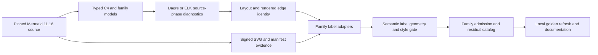

## Goal Capsule

Restore source-backed Mermaid `11.16.0` parity for relation labels and the layout paths that place
them. Fix the confirmed C4 semantic defects, close the SVG comparison blind spot that hid a
100-pixel label error, and repair the confirmed Requirement, State, Class, Flowchart ELK, and
Architecture parity gaps without fixture-specific offsets.

The authority order is: signed behavior from Mermaid commit
`7c0cafcf42e76bfaf79d0cbbd12edb986612f014`, source at that commit, independent source-phase
comparisons, current implementation tests, then historical documentation. Local semantic and layout
goldens are evidence only after independent assertions pass. Existing upstream SVG baselines remain
immutable during implementation.

Execution is correctness-first and may break local compatibility. Stop rather than guess if pinned
source behavior cannot be reproduced, a label cannot be matched to a semantic edge without
ambiguity, or a proposed tolerance would accept an unexplained large displacement. The executor owns
implementation, focused commits, simplification, review, and final verification. No PR or push is
required by this plan.

## Product Contract

### Summary

Replace permissive, geometry-blind parity with typed C4 semantics and edge-aware label verification.
Use the new evidence to repair shared and family-local layout defects, remove obsolete incorrect
implementations, and leave all affected diagram families behind source-backed regression gates.

### Problem Frame

The reported C4Dynamic label is not a browser font residual. Mermaid applies `offsetX=-40` and
`offsetY=60`; Merman currently records `offsetX=60` and no `offsetY`. The resulting label anchor is
about `+100.308px` on X and `-55px` on Y while both browser text boxes are exactly
`155.484 x 17`. Four committed C4 fixtures contain semantic or layout goldens polluted by the same
named-argument bug.

The current parity comparator normalizes geometry attributes, ignores ordinary text and style
payloads, and can sort sibling nodes. All 51 C4 fixtures therefore pass even with the visible error.
Its label report also pairs labels by DOM order, which can misdiagnose an edge-order change as a
label-placement change.

The audit found additional source-backed defects. C4 accepts invalid boundary and `direction`
statements, preserves omitted fields across redeclarations, and emits boundaries in a different
paint order. Requirement has a label displacement near `19px` with an almost unchanged path.
State and Class have layout-wide displacements up to hundreds of pixels after recent Dugong ordering
and Brandes-Kopf performance refactors. One Flowchart ELK case appears to swap parallel-edge routes,
but its identity must be rechecked with a stable matcher. Architecture already has signed labeled
stress baselines; the gap is that the parity gate does not consume their label geometry.

### Requirements

#### C4 semantics and grammar

- R1. Preserve every C4 macro argument as an ordered typed value so positional, sparse named, and
  mixed arguments follow pinned Mermaid side-effect order without a JSON sentinel representation.
- R2. Make `UpdateRelStyle` bind `$offsetX`, `$offsetY`, `$textColor`, and `$lineColor` by their
  actual keys, with pinned behavior for omission, repetition, unknown keys, arity, negative values,
  zero, and JavaScript `parseInt` inputs.
- R3. Parse C4 boundaries transactionally and reject missing braces, extra braces, empty bodies,
  invalid nesting, and `direction` as a C4 body statement while preserving editor recovery facts.
- R4. Make redeclarations clear omitted optional fields exactly as pinned Mermaid does. Preserve
  stable insertion order, parent membership, type changes, and existing relation references.

#### C4 rendering

- R5. Emit C4 shapes, nested boundaries, current boundary outlines, and final relations in pinned
  recursive paint order without recursive call-stack risk for deeply nested diagrams.
- R6. Port the complete pinned common Neo selector block through the shared style emitter. Compare
  raw selector/property and presentation-attribute signatures in Rust, then verify active relation
  text and line computed styles in the existing Chromium presentation lane for default and
  non-default themes.

#### Cross-family label and layout behavior

- R7. Match labels to semantic edges using stable family identity. DOM order or label text alone is
  insufficient, and ambiguous repeated-text or parallel-edge matches must fail closed.
- R8. Apply pinned `positionEdgeLabel` and `calcLabelPosition` behavior after path updates. Reuse one
  source-backed geometry implementation where family behavior is equivalent and delete superseded
  copies after characterization tests pass.
- R9. Restore source-equivalent Dagre behavior for State, Class, Requirement, ER, and Dagre-backed
  Flowchart inputs. Preserve insertion order, named multiedge identity, tie-breaking, dummy-node
  lifecycle, compound structure, self-loops, disconnected components, and rank direction.
- R10. Preserve Flowchart ELK source edge ordinal, model order, unique id, label, and routed path as
  one identity chain through import, dummy processing, ordering, routing, and export.
- R11. Admit existing signed Architecture labeled-edge fixtures into the semantic label gate. Add a
  new probe only if the existing corpus lacks a confirmed pinned behavior such as repeated labels on
  true same-endpoint parallel edges.

#### Evidence, residuals, and cleanup

- R12. The label gate must be orthogonal to `DomComparisonProfile` and detect mutations to text,
  world-space position, nested transforms, semantic edge identity, raw presentation attributes, and
  required CSS rules. Browser computed-style evidence remains a separate presentation gate. An
  unfiltered run for a registered labeled family must fail if it extracts zero semantic samples.
- R13. Exact semantic fields must compare exactly. Geometry defaults to three-decimal comparison
  with a maximum quantization error of `0.0005`; any larger accepted value must be a fixture and
  semantic-key-specific rounded residual signature bound to pinned hashes and evidence. The gate
  must reject the known `19px`, `77px`, `100px`, and `300px` failures.
- R14. Refresh only local semantic and layout goldens whose source-backed behavior changed. Never
  regenerate signed Mermaid SVGs with the currently installed Mermaid `11.15.0` toolchain.
- R15. Remove obsolete compatibility branches, duplicate edge-label geometry, incorrect optimized
  ordering paths, stale coverage claims, and abandoned experimental code once their replacements
  pass parity and performance verification.
- R16. Re-run relevant performance benchmarks after correctness is restored. A median regression
  greater than 15 percent across five comparable Windows samples must be corrected or supported by
  a new source-equivalent optimization before completion.

### Acceptance Examples

- AE1. Covers R1-R2. The reported C4Dynamic input records `offsetX=-40`, `offsetY=60`, and
  `textColor=red`; its `Calls isAuthenticated() on` label remains attached to the `c2 -> c3`
  relation and the new gate rejects the pre-fix `(+100.308,-55)` displacement.
- AE2. Covers R1-R2. Positional, arbitrary named order, sparse named, mixed, repeated-key, and
  `parseInt`-compatible C4 arguments match pinned behavior; a test does not rely on map iteration
  order.
- AE3. Covers R3. A complete non-empty nested boundary parses, while missing or extra braces, an
  empty boundary, and `direction LR` after a C4 header fail rendering without leaving partial DB
  mutations. Editor recovery still returns bounded facts.
- AE4. Covers R4. Redeclaring an element without `sprite`, `tags`, or `link` clears the old values
  while keeping pinned source order and relation references.
- AE5. Covers R5-R6. Nested C4 output paints direct shapes, child boundary subtrees, and the current
  outline in pinned order, then paints relations. Default and themed relation colors are effective
  in the rendered SVG.
- AE6. Covers R7-R8. The Requirement `<<traces>>` label follows the pinned updated-path calculation.
  Empty, one-point, degenerate, polyline, curve, and negative-half rounding cases are deterministic.
- AE7. Covers R9. The known State concurrency and Class note fixtures match the same JS Dagre input
  and output phases, while currently-correct ER fixtures remain unchanged.
- AE8. Covers R7 and R10. Three same-endpoint ELK edges with distinct or repeated labels retain
  source identity through path and label export, including mixed unlabeled, reverse, and compound
  endpoint cases.
- AE9. Covers R11-R13. Existing signed Architecture fixtures containing `reads`, `writes`, and
  `caches` labels participate in the gate even though the upstream label groups lack a direct
  `data-id`.
- AE10. Covers R12-R13. Comparator mutation tests fail for changed text, X/Y, nested transform,
  presentation attribute, CSS rule, or edge association. Chromium tests separately fail changed
  computed color, and only exact residual signatures can admit documented browser-size noise.

### Scope Boundaries

In scope:

- Confirmed C4 parser, model, layout, paint-order, relation-label, and CSS parity defects.
- Shared edge-label geometry and identity infrastructure needed by the affected families.
- Dugong and family graph construction defects that explain State, Class, Requirement, ER, or
  Dagre-backed Flowchart differences.
- Flowchart ELK parallel-edge identity and ordering after stable evidence confirms the earliest
  divergent phase.
- Architecture labeled-edge admission using existing signed evidence.
- Test, golden, residual-catalog, and current-facing documentation cleanup required by these fixes.

Out of scope:

- Mermaid changes after commit `7c0cafcf42e76bfaf79d0cbbd12edb986612f014`.
- Pixel-perfect correction of browser font rendering, `getBBox()` floats, `foreignObject`, KaTeX,
  RoughJS, or hand-drawn noise without a robust pinned-source fix.
- Unrelated diagram families that have no label or layout evidence from this audit.
- Replacing an entire layout engine merely to match one fixture.
- Publishing, pushing, or opening a pull request.

### Success Criteria

- The reported C4 semantic model is correct and its visible label no longer has the 100-pixel error.
- Every confirmed non-browser outlier has either converged to pinned behavior or been disproved by a
  stable identity-aware diagnostic with the evidence recorded.
- The semantic label gate fails on all known pre-fix errors and is enabled for every affected family.
- All affected package tests and family compare gates pass against the signed Mermaid 11.16 corpus.
- Correctness changes do not leave an unexplained performance regression above R16.

## Planning Contract

### Key Technical Decisions

- KTD1. Source-backed parity outranks local compatibility and retained optimizations.
  `(session-settled: user-directed - chosen over preserving obsolete compatibility and incorrect performance shortcuts: Mermaid 11.16 behavior is the product contract.)`
- KTD2. Replace the C4 `SpannedArg -> serde_json::Value` sentinel path with an ordered typed
  resolver. Keep compatibility JSON only as an explicit projection if a public consumer still needs
  it. This prevents key loss and makes arity, coercion, and mutation order one coherent contract.
- KTD3. Validate C4 statements before mutating `C4Db`. Use an explicit boundary stack and a staged
  statement result so parser recovery cannot leak invalid semantic state.
- KTD4. Derive C4 paint order inside the renderer from source order and `parent_boundary` links.
  Do not add a public `paint_order` field only to drive one renderer. Use an iterative traversal so
  the existing deep-boundary safety property remains intact.
- KTD5. Add an edge-aware semantic label comparison beside the existing DOM comparator. It has
  separate counts and reports and cannot be disabled by StructureOnly or browser-wrapping DOM
  profiles. `--check-dom` may invoke both gates, but `DomComparisonProfile` does not own label
  semantics.
- KTD6. Label identity is family-adapted and fail-closed. Compare complete key sets as an ordered
  map from semantic key to a multiset of signatures; never truncate to the shorter side or pair by
  global DOM order. Dagre and ELK keys bind `data-id` back to a path. C4 keys bind relation number
  and label role. Architecture keys bind the path owner in the same direct group to a label
  multiset. Orphans, ambiguity, non-finite geometry, and missing labels fail.
- KTD7. Port shared `positionEdgeLabel` geometry once and migrate only source-equivalent consumers.
  Characterize each existing family before deleting its local implementation; family-specific
  translation remains in the adapter, not in the shared geometry kernel.
- KTD8. Locate Dagre regressions by comparing identical serialized input and the earliest divergent
  output phase. Recent ordering-workspace and BK-index commits are a bisect range, not proof. Delete
  or replace an optimization only when it changes pinned iteration or tie-break semantics.
- KTD9. Fix ELK edge identity at the phase where it first diverges. Never relabel a different route,
  reverse all parallel edges, or sort final SVG labels to hide an importer or ordering defect.
- KTD10. Residual acceptance is a versioned evidence record, not a family-wide tolerance. A row is
  keyed by fixture, semantic edge, and rounded signature and records Mermaid version and commit,
  input and SVG hashes, comparator revision, evidence kind, and source-backed reason. New drift and
  stale rows fail.
- KTD11. Signed upstream SVGs remain immutable. Corrupted local goldens are refreshed only after
  semantic assertions and identity-aware label comparisons pass, and their diff remains separately
  reviewable.

### Assumptions

- The committed baseline manifests and SVG hashes are the available behavior oracle. The current
  local Mermaid CLI is `11.15.0` and will not be used to refresh upstream evidence.
- Architecture production label rendering may already be correct. U8 changes production code only
  if the new gate proves a source-backed mismatch.
- A C4 residual near a few pixels may remain after the argument fix, but no tolerance is accepted
  until correct samples establish its browser-measurement cause and distribution.
- State, Class, and Requirement may not share one root cause. Their common Dugong dependency defines
  investigation order, not a predetermined fix.

### High-Level Technical Design

The evidence path is deliberately orthogonal to rendering. A family adapter extracts a semantic
edge key, text, world-space owner anchor, explicit label-box corners, affine basis, and raw style
facts from both SVGs. World-space geometry composes SVG affine transforms as
`M_parent * M_self`; the root viewBox is not applied a second time. The `xtask` implementation uses
its own `svgtypes`-backed transform path rather than a production renderer helper. The matcher either
produces a complete unique key/multiset comparison or reports ambiguity; it never silently falls
back to DOM order.

Layout repairs use phase diagnostics. For Dagre, the same graph input is serialized to Rust Dugong
and the pinned JS harness, then compared after ordering, dummy restoration, and final positioning.
For ELK, source ordinal and unique edge id are traced through importer, intermediate graph, ordering,
routing, and export. SVG work starts only after the first divergent phase is known.

### Sequencing and Priority

- P0: U1-U3. The current comparator cannot detect the reported bug, and C4 semantic goldens are
  actively wrong. Establish evidence, then correct the model before any golden refresh.
- P1: U5-U6, then U4 and U7. State/Class have the largest shared layout blast radius, so the shared
  Dagre result must be repaired before Requirement's final SVG-label phase is changed. Flowchart ELK
  has a confirmed high-delta candidate that needs stable identity.
- P2: U8-U9. Admit existing Architecture evidence, freeze bounded residuals, refresh local artifacts,
  and close documentation and performance contracts after production behavior is correct.

### System-Wide Impact

- Parser/model: C4 argument representation and invalid-input behavior change. Any internal caller
  that consumes the dynamic C4 DB representation must move to the typed contract or an explicit
  compatibility projection.
- Layout: Dugong is shared infrastructure. State, Class, Requirement, ER, and Dagre-backed
  Flowchart are mandatory non-regression consumers for ordering or BK changes.
- Rendering: shared label geometry affects multiple SVG families. Family-specific coordinate frames
  and HTML/SVG label shapes remain at adapter boundaries.
- Tooling: compare reports gain semantic identity and world-space geometry. Existing DOM modes keep
  their structural meaning; the new label gate becomes an additional admission result.
- Browser presentation: computed CSS remains owned by
  `playground/tests/render.presentation.spec.ts`; raw Rust comparison must not claim computed-style
  evidence.
- Fixtures: signed upstream evidence stays unchanged. Local semantic/layout snapshots and residual
  catalogs change only after independent gates pass.
- Performance: correctness may remove recent indexes. Benchmark evidence gates any replacement
  optimization so performance work cannot silently change deterministic ordering again.

### Risks and Dependencies

- Risk: A label matcher can create false confidence by pairing repeated text incorrectly.
  Mitigation: require stable ids or a unique family composite key and fail on ambiguity.
- Risk: Fixing Dugong to one fixture regresses another family or direction.
  Mitigation: compare identical JS/Rust graphs across tie, multiedge, dummy, compound, self-loop,
  disconnected, and TB/BT/LR/RL cases before family SVG refresh.
- Risk: Removing incorrect indexes causes a material runtime regression.
  Mitigation: retain a pre-change benchmark baseline, restore semantics first, then reintroduce only
  order-preserving indexes and enforce R16.
- Risk: Local goldens can make the current implementation self-confirming.
  Mitigation: enforce KTD11 and review golden changes separately from production fixes.
- Risk: Pinned source grammar tokens can be misread as reachable behavior.
  Mitigation: use actual pinned render results and manifest exclusions. In particular,
  `direction LR` is not a valid C4 body statement in the pinned runtime.
- Dependency: `repo-ref/mermaid` may be checked out at a newer develop commit. Every source claim
  must use `git show 7c0cafcf42e76bfaf79d0cbbd12edb986612f014:<path>` or an equivalent pinned read.

## Implementation Units

### U1. Semantic Label Evidence Core

Goal: make known label errors observable before changing production behavior.

Requirements: R7, R12, R13.

Dependencies: none.

Files:

- `crates/xtask/src/cmd/compare/labels.rs`
- `crates/xtask/src/cmd/compare/harness.rs`
- `crates/xtask/src/svgdom.rs`
- `crates/xtask/Cargo.toml`
- family compare adapters under `crates/xtask/src/cmd/compare/diagrams/`

Approach:

- Replace DOM-order-only reporting and shorter-side truncation with complete semantic-key and
  signature-multiset comparison. Samples contain family edge identity, normalized text, world-space
  anchor and box geometry, transform provenance, and raw style facts.
- Add family adapter hooks and a separate admission result without changing existing DOM
  normalization semantics or sharing production transform helpers.
- Start as a diagnostic and mutation-tested contract. Prove it catches the current C4 error before
  enabling admission in U8.

Test scenarios:

- Nested translate/scale transforms produce the same world-space anchor as an equivalent flat SVG.
- Reordered DOM nodes with stable edge ids still pair correctly.
- Repeated text, mixed labeled/unlabeled edges, or missing ids either resolve uniquely through the
  family adapter or fail as ambiguous.
- Mutating text, X/Y, transform, edge identity, text color, line color, or a required CSS property
  produces a focused mismatch.
- The pre-fix C4Dynamic sample reports approximately `(+100.308,-55)` rather than passing.

Verification:

- Focused `xtask` label and SVG DOM unit tests pass.
- A C4 compare report contains stable relation identity and the known pre-fix mismatch.

### U2. Typed C4 Semantic Model

Goal: remove the representation flaw that loses named argument keys and align C4 mutation semantics.

Requirements: R1-R4.

Dependencies: U1.

Files:

- `crates/merman-core/src/diagrams/c4.rs`
- C4 semantic and parser fixtures under `fixtures/c4/`
- relevant `merman-core` C4 tests

Approach:

- Keep `SpannedArgValue::Text` and `KeyValue` typed and ordered through macro resolution. Delete the
  single-key JSON-object sentinel path and fixed-slot integer assignment.
- Centralize pinned argument coercion and `parseInt` behavior without converting the whole parser
  into a JavaScript compatibility layer.
- Stage statement effects, validate arity and boundary transitions, then commit to `C4Db`.
- Make redeclaration updates explicit per field so omission clears stale state.

Test scenarios:

- AE1-AE4 pass, including arbitrary named order, sparse and mixed forms, repetition, negative and
  zero values, coercible suffixes, unknown keys, and invalid arity.
- Missing, extra, empty, nested, and sibling boundary cases match pinned render behavior.
- Invalid input does not leave a partial boundary or element in the render DB; editor facts remain
  recoverable and source-spanned.
- Existing relation direction, indexing, reverse-edge, and dynamic numbering tests remain stable.

Verification:

- Focused C4 `merman-core` tests pass.
- The user sample serializes the exact offset and color semantics from AE1.

### U3. C4 Paint Order and Effective Style

Goal: align C4 SVG structure, paint order, and active relation CSS with pinned Mermaid.

Requirements: R5-R6.

Dependencies: U2.

Files:

- `crates/merman-render/src/c4/layout.rs`
- `crates/merman-render/src/svg/parity/c4/render.rs`
- `crates/merman-render/src/svg/parity/css.rs`
- C4 renderer tests and layout snapshots
- `playground/tests/render.presentation.spec.ts`
- `docs/alignment/C4_UPSTREAM_TEST_COVERAGE.md`

Approach:

- Build an iterative boundary traversal from existing parent and source-order data. Emit direct
  shapes, child subtrees, and the current outline in pinned order, then emit relations.
- Emit the full pinned common Neo block from the shared style layer and compare selector/property
  meaning rather than CSS formatting. Use Chromium only for active computed-style assertions.
- Preserve the existing relation offset formula after U2 supplies the correct X/Y values.

Test scenarios:

- Nested and sibling boundaries have pinned DOM order with and without fill overlap.
- A 1500-level boundary stress input renders without stack overflow.
- Relation text and line colors match default and themed configurations.
- The C4 coverage document treats header-following `direction LR` as a pinned negative case.

Verification:

- C4 renderer, layout snapshot, semantic label, and family compare gates pass.

### U4. Shared Updated-Path Label Geometry

Goal: port pinned edge-label post-processing and fix the Requirement label outlier.

Requirements: R8.

Dependencies: U1, U6.

Files:

- a focused internal module under `crates/merman-render/src/svg/parity/`
- `crates/merman-render/src/requirement.rs`
- Requirement SVG parity code and tests
- equivalent Class, State, Flowchart, and ER geometry helpers where characterization proves parity

Approach:

- Port `isLabelCoordinateInPath`, path update detection, JavaScript rounding, and
  `calcLabelPosition` from the pinned rendering utilities.
- Separate path-frame geometry from family translations and label DOM emission.
- Recheck Requirement after U6 has aligned its raw edge-label dummy. Then compare prepared-label
  association, root translation, and SVG output before applying the shared geometry. Migrate and
  delete duplicate helpers only where outputs are proven equivalent.

Test scenarios:

- Empty, one-point, degenerate, polyline, curve, updated and unchanged paths match pinned results.
- Negative-half and decimal rounding matches JavaScript behavior.
- The `<<traces>>` canary follows AE6 and preserves its semantic edge identity.
- Migrated families retain current correct label results.

Verification:

- Focused shared-geometry and Requirement tests pass.
- Requirement semantic label comparison passes for the five duplicate-source fixtures without an
  offset override.

### U5. Dagre Differential Coverage for State and Class

Goal: distinguish family graph-construction defects from shared Dugong defects before editing the
layout kernel.

Requirements: R9.

Dependencies: U1.

Files:

- `crates/xtask/src/cmd/debug/dagre.rs`
- `crates/xtask/src/cmd/debug/dagre_reference.rs`
- `crates/merman-render/src/state/layout.rs`
- `crates/merman-render/src/class.rs`
- `tools/dagre-harness/run.mjs`

Approach:

- Extend the existing State JS Dagre graph producer and comparison path to Class rather than
  creating a second reference framework.
- Capture the same serialized input for Rust and JS and report the earliest divergent ordering,
  dummy restoration, or position phase.
- Add minimal cases for every ordering invariant in R9 and retain known State/Class/ER fixtures as
  family canaries.

Test scenarios:

- Equal barycenter ties, insertion order, named multiedges, label dummies, compound nodes,
  self-loops, disconnected components, four rank directions, and transient-node retirement compare
  by stable id.
- Known State and Class fixtures identify whether divergence begins in graph construction or
  Dugong.
- Currently-correct ER and simple State/Class inputs remain non-divergent.

Verification:

- The differential command supports State and Class and produces deterministic phase evidence.
- Every large known outlier has a named earliest divergent phase before U6 starts.

### U6. Source-Equivalent Dugong Ordering and Positioning

Goal: repair shared Dagre semantics and remove any optimization that cannot preserve them.

Requirements: R9, R15, R16.

Dependencies: U5.

Files:

- `crates/dugong/src/order/`
- `crates/dugong/src/position/bk/`
- `crates/dugong/src/normalize.rs`
- `crates/dugong-graphlib/src/graph/`
- Dugong tests and benchmarks
- affected State, Class, Requirement, ER, and Flowchart family tests

Approach:

- Use the phase evidence to audit changes introduced by `4da48915e`, `ef448eaad`, `e6d61eca7`,
  `e995b0b5a`, and transient-node retirement. Restore pinned iteration and tie-break semantics at the
  responsible abstraction.
- Delete indexed workspaces or retained conflict indexes when they cannot express stable source
  order. Do not retain a fallback implementation.
- After parity is green, add only measured order-preserving indexes needed to satisfy R16.

Test scenarios:

- All U5 minimal differentials match the JS reference.
- Known State concurrency and Class mirror canaries converge without renderer offsets.
- Requirement, ER, and Dagre Flowchart consumers retain edge and label identities.
- Benchmarks cover representative small, medium, dense, compound, and multiedge graphs.

Verification:

- `dugong` and `dugong-graphlib` tests pass.
- State, Class, ER, and relevant Flowchart compares pass their semantic label gates. Requirement's
  raw Dagre phases match and its final updated-path label admission remains owned by U4.
- Five-sample benchmark medians satisfy R16.

### U7. Flowchart ELK Parallel-Edge Identity

Goal: prove and repair the ELK edge phase that swaps or misbinds a parallel route and label.

Requirements: R7, R10.

Dependencies: U1.

Files:

- `crates/merman-render/src/flowchart/elk.rs`
- `crates/merman-layout-elk/src/lib.rs`
- `crates/merman-elk-layered/src/importer.rs`
- `crates/merman-elk-layered/src/intermediate.rs`
- `crates/merman-elk-layered/src/p3order.rs`
- `crates/merman-elk-layered/src/p3order/sweep.rs`
- Flowchart ELK debug, compare, and admission tests

Approach:

- First re-evaluate the `-77.699px` report with U1 identity matching. Keep the existing fixture that
  already proves `l1` below `l2` as a non-regression canary.
- Trace ordinal, model order, unique id, label, and route through source-phase diagnostics.
- Change only the earliest phase that loses identity or source ordering. Preserve model-order
  heuristics for unrelated nodes and ports.

Test scenarios:

- AE8 passes for distinct labels, repeated labels, mixed unlabeled edges, reverse edges, different
  label widths, and compound endpoints with a fixed operation seed.
- Path and label are asserted through the same edge id; swapping labels between routes fails.
- Existing multiple-edge and inline-label thickness tests remain stable.

Verification:

- `merman-layout-elk`, `merman-elk-layered`, and focused Flowchart tests pass.
- `check-flowchart-elk-parity` and the affected Flowchart family compare pass.

### U8. Family Admission and Residual Contract

Goal: enable the semantic label gate for all affected families and consume existing signed
Architecture evidence.

Requirements: R7, R11-R13.

Dependencies: U3, U4, U6, U7.

Files:

- family compare adapters under `crates/xtask/src/cmd/compare/diagrams/`
- `crates/xtask/src/cmd/compare/harness.rs`
- `crates/xtask/src/cmd/compare/all.rs`
- `crates/xtask/src/cmd/upstream_svg_policy.rs`
- `fixtures/_verification/` residual contracts
- Architecture fixtures only if a confirmed coverage combination is absent

Approach:

- Enable label identity, geometry, and effective-style admission for C4, Requirement, State, Class,
  Flowchart, ER non-regression, and Architecture.
- Build the Architecture adapter from existing edge order/model data because upstream label groups
  lack `data-id`. Use the signed labeled stress fixtures before adding a new source-derived probe.
- Keep the R13 exact default and record only browser-dependent fixture/key signatures through
  KTD10. Root residual policy cannot suppress a label failure.

Test scenarios:

- Existing signed Architecture parallel-label and port-label fixtures produce unique semantic pairs.
- A repeated-text ambiguity fails until the family adapter supplies a unique edge association.
- Selector or DOM drift that causes a registered family to extract zero label samples fails rather
  than reporting a vacuous pass.
- Every known large pre-fix displacement fails even if ordinary DOM parity passes.
- A documented bounded browser metric residual passes without normalizing world-space position.

Verification:

- All affected family compares report structural and semantic-label results.
- Residual-catalog schema, hash validation, stale-entry, mutation, and root-policy-isolation tests
  pass.

### U9. Golden Refresh, Documentation, and Full Verification

Goal: remove polluted local artifacts and obsolete claims after independent behavior is green.

Requirements: R14-R16.

Dependencies: U2-U8.

Files:

- affected local `fixtures/c4/*.golden.json` and `*.layout.golden.json`
- affected local layout goldens for repaired families
- `docs/alignment/C4_UPSTREAM_TEST_COVERAGE.md`
- relevant parity, residual, and verification documentation
- dead code identified by U2-U8

Approach:

- Refresh only independently proven local semantic and layout snapshots. Keep signed upstream SVGs
  and manifests byte-identical.
- Delete stale compatibility code, duplicate helpers, disabled assertions, obsolete residual entries,
  and unsuccessful implementation experiments.
- Correct the C4 `direction` coverage claim and document the label gate, Dugong cause, benchmark
  result, and any bounded browser residual.

Test scenarios:

- No local golden contains the old C4 X/Y misbinding.
- Manifest and upstream SVG hashes are unchanged unless a separately justified pinned evidence gap
  was added with the correct 11.16 toolchain.
- Current-facing docs agree with executable negative and admission tests.
- Clean-checkout verification does not depend on ignored reports or temporary diagnostics.

Verification:

- The full Verification Contract passes.
- The final diff contains no abandoned code, broad geometry normalization, fixture-name production
  branches, or unexplained residual allowance.

## Verification Contract

Run focused tests after each unit and the following gates before completion. Use Windows PowerShell
and native executables; do not use Bash or WSL.

Formatting and Rust tests:

- `cargo fmt --all -- --check`
- `cargo nextest run -p merman-core`
- `cargo nextest run -p merman-render`
- `cargo nextest run -p dugong -p dugong-graphlib`
- `cargo nextest run -p merman-layout-elk -p merman-elk-layered`
- `cargo nextest run -p xtask`

Family parity:

- `cargo run -p xtask -- compare-c4-svgs --check-dom --dom-mode parity --dom-decimals 3`
- `cargo run -p xtask -- compare-requirement-svgs --check-dom --dom-mode parity --dom-decimals 3`
- `cargo run -p xtask -- compare-state-svgs --check-dom --dom-mode parity-root --dom-decimals 3`
- `cargo run -p xtask -- compare-class-svgs --check-dom --dom-mode parity-root --dom-decimals 3`
- `cargo run -p xtask -- compare-flowchart-svgs --check-dom --dom-mode parity --dom-decimals 3`
- `cargo run -p xtask -- check-flowchart-elk-parity`
- `cargo run -p xtask -- compare-er-svgs --check-dom --dom-mode parity --dom-decimals 3`
- `cargo run -p xtask -- compare-architecture-svgs --check-dom --dom-mode parity-root --dom-decimals 3`
- `cargo run -p xtask -- compare-all-svgs --check-dom --dom-mode parity-root --dom-decimals 3`

Evidence and consistency:

- Run the C4 user sample through semantic, layout, SVG, and label-gate assertions.
- Run State and Class JS Dagre differential canaries and Flowchart ELK source-phase canaries.
- Run upstream manifest/hash validation and confirm untouched signed SVGs remain byte-identical.
- Validate residual catalog schema, stale entries, comparator version, and input/upstream SVG hashes.
- Run the existing generated-artifact and alignment consistency gates affected by changed docs or
  fixtures.

Performance:

- Capture five comparable Windows benchmark samples before the responsible Dugong edit and after
  final correctness changes.
- Compare representative Dugong layout benchmarks and Merman State, Class, Requirement, and
  Flowchart pipeline fixtures against R16.

## Definition of Done

- R1-R16 and AE1-AE10 are satisfied by executable tests or signed comparison evidence.
- U1-U9 each meet their Verification section; no unit is declared complete through a refreshed
  golden alone.
- The new semantic label gate catches every known pre-fix failure and is active in all affected
  family admission paths.
- C4 typed semantics, grammar, redeclaration, paint order, and effective styles match pinned Mermaid.
- Requirement updated-path labels match pinned geometry without a magic offset.
- State and Class large layout regressions are repaired at the family graph or Dugong source phase
  that caused them, with ER and other shared consumers remaining green.
- Flowchart ELK labels remain bound to their own routed edge identity.
- Existing signed Architecture labeled fixtures are enforced by the new gate.
- No broad comparator relaxation, fixture-name production branch, dual incorrect/correct layout
  implementation, stale compatibility layer, duplicate superseded geometry helper, or abandoned
  experiment remains.
- Signed upstream SVGs remain unchanged except for a separately proven missing pinned evidence case
  generated with the correct toolchain and manifest metadata.
- All Verification Contract gates pass, and benchmark medians satisfy R16.
- Changes are organized into focused Conventional Commit commits. The branch is ready for maintainer
  review without requiring a push or PR.

## Appendix

### Research Evidence

- Pinned Mermaid source commit:
  `7c0cafcf42e76bfaf79d0cbbd12edb986612f014` (`mermaid@11.16.0`).
- C4 model and parser: `crates/merman-core/src/diagrams/c4.rs` and pinned
  `packages/mermaid/src/diagrams/c4/` sources.
- C4 renderer: `crates/merman-render/src/svg/parity/c4/render.rs` and pinned C4 renderer source.
- Label comparator: `crates/xtask/src/cmd/compare/labels.rs`,
  `crates/xtask/src/cmd/compare/harness.rs`, and `crates/xtask/src/svgdom.rs`.
- Shared edge-label source: pinned `packages/mermaid/src/rendering-util/rendering-elements/edges.js`
  and `packages/mermaid/src/utils.ts`.
- Dagre evidence: `crates/xtask/src/cmd/debug/dagre.rs`,
  `crates/xtask/src/cmd/debug/dagre_reference.rs`, and `tools/dagre-harness/run.mjs`.
- Historical green State verification:
  `docs/knowledge/engineering/verification/2026-07-10-state-1116-svg-dom-layout-parity.md`.
- Suspect Dugong change window: commits `4da48915e`, `ef448eaad`, `e6d61eca7`, and `e995b0b5a`.
- Requirement change window: commits `c3130d4dc` and `8d45b8634`.
- ELK evidence: `crates/merman-layout-elk/src/lib.rs`, `crates/merman-elk-layered/src/`, and
  `crates/xtask/src/cmd/debug/flowchart.rs`.
- Architecture signed evidence:
  `fixtures/upstream-svgs/architecture/_baseline-manifest.json`, including
  `stress_architecture_batch3_parallel_edges_and_labels_057` and
  `stress_architecture_parallel_labeled_edges_038`.

### Research Corrections

- C4 `direction` tokens exist in the pinned grammar, but `direction LR` is not a valid statement
  after a C4 header in the pinned runtime. The baseline manifest excludes that render case.
- Architecture has signed labeled-edge baselines. Its confirmed gap is semantic label admission and
  stable association, not the absence of labeled SVG evidence.
- Recent performance commits define a high-probability investigation window. They do not establish
  a root cause until source-phase differentials identify the first divergence.
