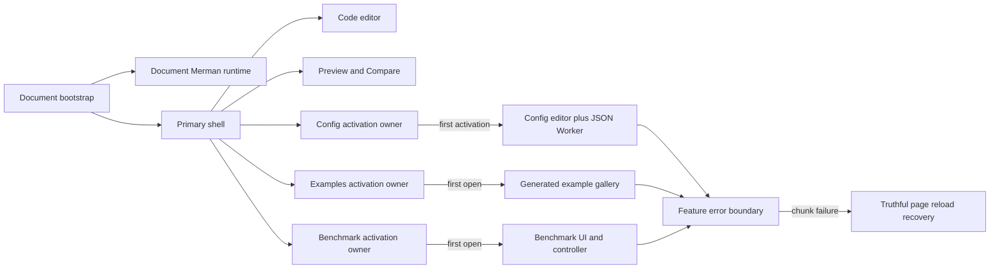
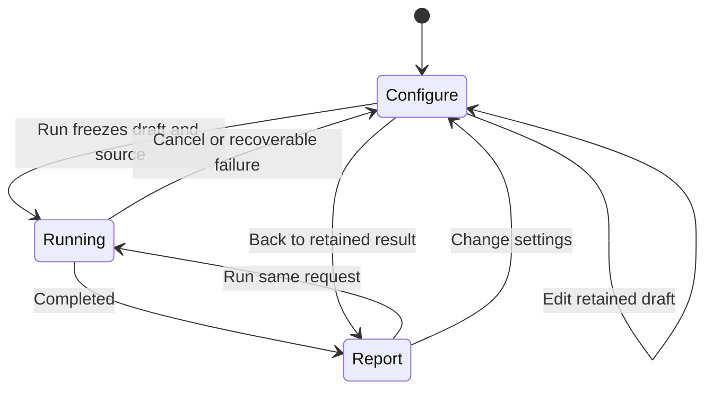
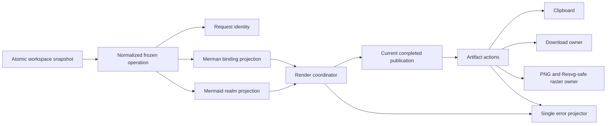
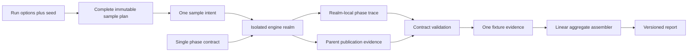
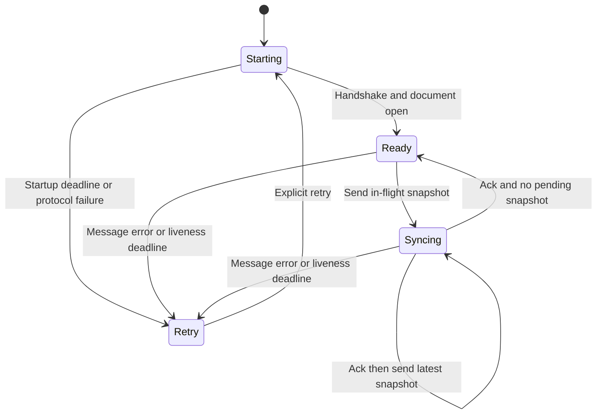
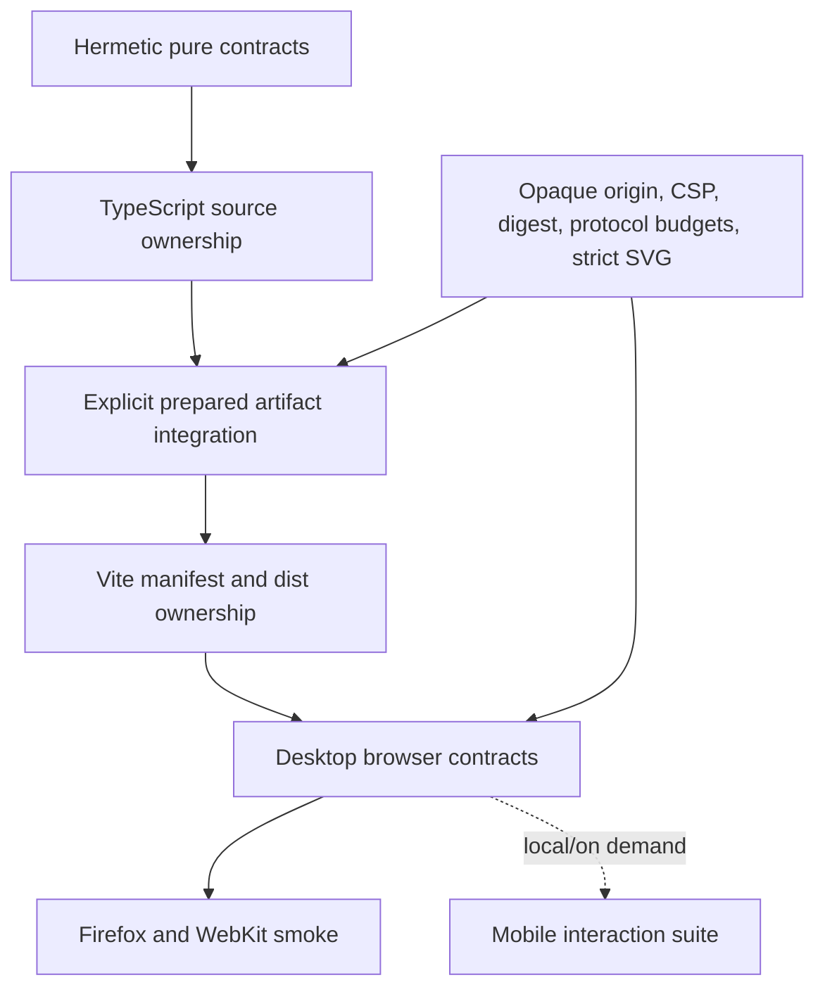

# Playground Architecture and Tooling Simplification - Plan

## Goal Capsule

| Field | Contract |
|---|---|
| Objective | Make the Playground easier to operate and maintain by fixing the irreversible benchmark flow, making optional workbenches truly activation-owned, deepening render/benchmark/Worker ownership boundaries, deleting home-grown or private-spelling validation, right-sizing browser CI, and bringing the supported frontend toolchain onto current compatible releases. |
| Authority | The maintainer's decisions in this session, this Product Contract, accepted ADRs, the pinned Mermaid `11.16.0` source under `repo-ref/mermaid`, emitted artifact manifests, and browser security contracts are authoritative in that order. |
| Execution profile | Fearless coordinated refactor. Breaking internal Playground TypeScript interfaces and benchmark/editor protocols is allowed. Delete obsolete helpers, shims, duplicate gates, and unused dependencies in the unit that proves their replacement. Do not preserve parallel compatibility paths. |
| Stop conditions | Stop only for a scope-changing product contradiction, a security or Mermaid-parity invariant that cannot be preserved, an editor-artifact measurement that invalidates both documented choices, or overlapping user changes that require choosing which behavior survives. |
| Verification posture | Prefer hermetic unit and manifest contracts during development; keep the narrow opaque-realm, CSP, digest, protocol-budget, strict-SVG, package-surface, and dependency-security gates; use desktop browser coverage in CI and keep expanded mobile coverage explicit but on demand. |
| Tail ownership | `ce-work` owns implementation, simplification, review, focused Conventional Commits, and final verification on a feature branch. Do not push, open a pull request, publish, release, or change the pinned Mermaid baseline unless separately requested. |

---

## Product Contract

### Summary

The Playground will expose reversible, touch-reachable workflows while loading optional tools only when the user activates them. Benchmark configuration, execution, and results become one explicit state machine. Config, Examples, and Benchmark own their first-load seams; chunk failures have a visible reload recovery path. High-frequency SVG interaction remains inside the viewport owner rather than rerendering the entire Preview or Compare surface.

The runtime architecture will converge around immutable operation and artifact boundaries. One frozen render operation owns the normalized input, identity, snapshot, and binding projections. One artifact-action layer owns copy/download/raster preparation from a completed publication, while the existing error-projection owner becomes the only cross-realm error normalizer. Sharing restores one coherent workspace atomically and ordinary share commands do not run the startup decoder lifecycle.

Benchmark phases, sample scheduling, evidence assembly, and document lifecycle become explicit contracts instead of repeated arrays and counters. The editor Worker validates query-specific results, avoids copying source for read-only queries, applies bounded latest-wins synchronization, and cannot stay silently ready forever after losing liveness. Opaque-realm artifacts become one small data plan consumed by build and verification adapters.

Validation will test owned behavior and emitted structure rather than source spellings. Focused tests run from a clean checkout without hidden `.runtime` prerequisites. TypeScript's resolver and Vite's manifest replace the partial handwritten module resolver. Mobile browser tests remain available as a deliberate local command but do not duplicate the mandatory Chromium CI suite. Vite stays on version 8, receives its supported patch upgrade, and unnecessary plugins and stale dependencies are removed.

### Problem Frame

The current Playground has several shallow boundaries. `BenchDialog.tsx` derives its screen from independent booleans and result presence, so a completed report cannot return to its preserved settings. Closing and reopening the dialog keeps the report and still offers no adjustment path. `React.lazy` wrappers exist, but Example Gallery is mounted while closed, Config is force-mounted with a second Monaco contribution, and Toolbar statically imports the benchmark implementation. Those wrappers change syntax without making user activation own resource acquisition.

`SvgViewportController` exports most of its implementation state and handlers. Pointer movement updates React state across that wide interface, which causes the large Preview and each Compare pane to participate in high-frequency interaction. `useShare` combines one-time hash restoration with a routine copy command, so Toolbar starts a decoder lifecycle it does not need and App applies restored workspace axes through separate setters.

The render path repeatedly reconstructs configured operation input to derive request identity, snapshots, and binding options. Toolbar and Preview separately understand current completed batches, Resvg-safe rerendering, export preparation, and error mapping. The benchmark repeats one phase topology across trace validation, progress/watchdog logic, realm bootstrap, and tests; its schedule owns only AB/BA shuffling while controllers and reports reconstruct the remaining sample plan. Corpus automation intentionally uses a fresh browser process per fixture, but each page materializes placeholder evidence for the complete catalog, producing quadratic evidence work.

The editor Worker validates message envelopes but resolves query-specific `unknown` payloads before checking their shape. Query callers still read the complete Monaco model even though only URI/version cross the protocol. Full-source changes are retained in an unbounded FIFO, and a ready Worker has no post-initialization liveness deadline. Documentation, package selection, and tests also disagree over whether the Worker should load the full or editor artifact.

The artifact and validation toolchain repeats opaque realm identities, entries, output names, CSP ownership, and manifest rules across scripts. `benchmark-build-graph.mjs` has grown into a partial TypeScript resolver with a large local test matrix, yet cannot be authoritative for `moduleResolution: bundler`. Several focused tests read generated `.runtime` files during module import, so they fail from a clean checkout. Other gates assert private import strings or source spellings that do not represent product or security contracts. Browser CI then runs the entire Chromium suite again as Pixel 7 emulation, adding minutes without a distinct acceptance boundary.

### Actors

- A1. Playground users need to revise benchmark parameters, retain prior evidence while doing so, and reach all primary controls with mouse, keyboard, and touch.
- A2. Maintainers need one owner for render input, benchmark samples, Worker messages, artifacts, and errors so changes do not require synchronized edits across unrelated files.
- A3. Security-sensitive consumers need opaque origins, authenticated channels, CSP hashes, digests, strict SVG projection, and resource budgets to remain fail closed.
- A4. Contributors need focused tests that work from a clean checkout and validation failures that describe stable behavior rather than private implementation spelling.
- A5. Release and CI maintainers need a supported Node/Vite/React/Playwright stack, auditable locks and licenses, and browser coverage proportional to risk and runtime.

### Requirements

**User workflows and optional activation**

- R1. Benchmark UI state must be a closed discriminated flow: configure a retained draft, run one frozen request, and inspect one retained report. Draft and report lifetimes are independent from lazy dialog content; closing or reopening cannot reset the draft, strand the user, or silently discard the last completed report. From a report, Run again retains mode/iterations/warmups but freezes the current workspace and generates a new seed; it is not an exact replay. The user can instead return to the draft, change it, and start a new run. Closing during execution cancels and releases the realm while preserving the draft and last completed report.
- R2. The benchmark dialog, toolbar overflow, Example Gallery, Config editor, preview controls, and dialogs must remain reachable and dismissible at `320x568`, `568x320`, a common mobile portrait/landscape profile, zoom, and simulated visual-viewport shrink. Scroll ownership and sticky actions must not overlap content or safe areas; the page must not gain horizontal overflow and the active caret, dialog close control, and primary action remain reachable.
- R3. Examples, Benchmark, and Config-specific editor support must not enter the initial static module closure or mount before first user activation. Config may remain mounted after first activation to preserve Monaco model, selection, and undo history; Examples and Benchmark may release closed component state except for explicitly retained product state.
- R4. Every lazy feature boundary must expose an accessible load state and a chunk-load failure recovery that performs a truthful page reload. Do not add manual preload or chunk-name/byte magic numbers.
- R5. SVG pan/zoom pointer frequency must be owned inside the viewport module. Parent Preview and Compare surfaces receive stable commands and low-frequency observable readouts, and do not commit once per pointer-move frame. `pointercancel`, lost capture, and Window blur end dragging; new artifacts auto-fit under the existing contract, hidden-to-visible viewports remeasure, and Compare panes stay independent.
- R6. Sharing must validate, decode, and narrowly migrate a legacy or current URL before root rendering, then apply one bounded atomic workspace snapshot before the first coordinator input. Invalid required fields or size limits reject the whole hash; missing optional fields inherit defaults; no partial axis is published. Copying a share URL is a pure serialization/clipboard command over a supplied snapshot, may update the address with `history.replaceState`, and does not decode, subscribe, or notify the store. Preserve the public `migrateLegacyHostTheme` behavior; only internal duplicate paths are deletable.

**Runtime, artifacts, and errors**

- R7. One immutable normalized render operation must own source, config, theme, font, measurement, pipeline, viewport, capability, and exact version axes. Request identity, coordinator snapshot, Merman binding input, Mermaid input, and completed publication metadata derive from that value without repeated configuration projection.
- R8. One artifact-action owner must select a current completed publication and prepare SVG copy/download, ASCII copy/download, ordinary PNG, and Resvg-safe PNG actions. UI adapters do not read the facade, rerender for export, or duplicate stale/missing/current checks. Browser Blob, Canvas, and download mechanics remain in the existing export owners.
- R9. `runtime/error-projection.ts` must be the only owner of already-projected recognition, bounded unknown-error normalization, hostile/cyclic input handling, and cross-realm payload validation. Realm/channel adapters may attach boundary context but do not implement competing projection rules.
- R10. Frozen plans and publications that cross hooks, callbacks, stores, or realms must use type-specific immutable projectors. Do not introduce a generic recursive freezer or treat `structuredClone` as immutability.

**Benchmark and editor protocols**

- R11. One immutable benchmark phase contract must derive trace topology, applicable events, predecessors, watchdog stage mapping, progress, and validation. One complete sample plan must derive setup, cold, warmup, measured block/order, session reuse, exact sample budget, report metadata, and aggregation eligibility. Protocol/report schemas advance when their wire shapes change.
- R12. Fresh-process corpus isolation remains. Each page executes and returns evidence for exactly one requested fixture plus stable catalog identity; a shared evidence assembler creates per-fixture and aggregate reports in linear catalog work without fabricated placeholder rows.
- R13. Benchmark browser lifecycle must be exposed as typed transitions shared by benchmark adapters while Compare and Benchmark continue to own separate realms, queues, clocks, and failure domains. Realm-local and parent-local clocks remain separate evidence. Cancellation, timeout, child-process crash, and environment invalidation still emit one structured failure evidence row for the requested fixture.
- R14. Editor protocol boundaries must validate every request and query-specific result at runtime, preserve supported TypedArray structured clones, reject malformed payloads before Monaco projection, and distinguish request-local failures from connection-poisoning protocol failures.
- R15. Read-only editor queries must identify the Worker-owned document by URI/version without reading or transferring the full source, and wait until that version is acknowledged. Document synchronization retains at most one in-flight full snapshot and one latest pending snapshot; superseded intermediate waiters resolve as stale without sending their sources. Cancellation/obsolete results are silently discarded, valid operation rejection remains request-local, while result-shape mismatch, sync/query timeout, transport decode error, unknown/duplicate response id, or tombstone violation poisons and disposes the connection into Retry. Every timer and cancellation listener is cleared on response, cancellation, poison, or disposal.
- R16. The full-versus-editor Worker artifact choice must be resolved by two same-commit whole-site build variants under cold and warm cache. Both must pass exact behavior for all 11 query kinds and all 35 families. Record total transferred bytes, Worker ready, first diagnostics, main-preview first result, compile/initialize time, and peak memory. Select the editor artifact only when it reduces cold total bytes, does not increase peak memory, and no primary latency regresses by more than both 5% and 20 ms; otherwise retain the current full artifact and record why. The selected package, ADR, workstream design, manifest, lock, license report, source import, WASM-input verification, and package gate must then agree.

**Artifacts, validation, CI, and dependencies**

- R17. One small declarative opaque-realm artifact plan must own engine identity, source entry, generated output, bootstrap, realm kind, manifest, CSP/document builder, and resource policy. Node scripts consume it directly; browser code consumes a statically generated TypeScript projection so Vite retains analyzable imports.
- R18. Source ownership and emitted ownership remain two distinct graphs. TypeScript's configuration/module resolver proves source and type-only boundaries; Vite's production manifest proves initial static closure, dynamic reachability, realm isolation, and emitted asset ownership. A small policy layer owns allowed edges. Delete the handwritten partial resolver and its implementation-detail tests.
- R19. Every focused unit/script test must run hermetically from a clean checkout. Pure CSP, protocol, graph-policy, and manifest parsers use in-memory or temporary fixtures; prepared-artifact integration tests are named separately and fail closed when explicitly invoked without artifacts.
- R20. Maintain a migration ledger mapping every removed gate to its replacement evidence and land the replacement first. Delete validation that asserts private import names, source marker strings, or duplicate implementation spellings only after its structural or behavioral replacement passes. TypeScript/Vite graphs replace the partial resolver, importable Worker-core tests plus real Worker smoke replace the VM/transpile harness, and structured package exports/lock evidence replaces source spelling. Keep `</script` injection defense, opaque-origin isolation, CSP hashes, digest-before-import, authenticated channel/budgets, strict SVG projection, single-chunk/no-external-asset realm rules, WASM/package capability manifests, dependency audit, and license gates.
- R21. CI must run the full desktop Chromium contract and focused Firefox/WebKit smoke. Mobile emulation and expanded 320 px/landscape/soft-keyboard checks remain an explicit local/on-demand command and are not a mandatory CI gate. Do not add a 35-family browser matrix.
- R22. Raise both Playground Node engine contracts to `^22.13.0 || >=24.0.0`; keep CI on Node 24. Apply audited lock/security patches and current compatible Vite 8, React 19, ESLint 10, TypeScript-ESLint, Tailwind 4, i18n, and Playwright releases as atomic peer groups.
- R23. Migrate reachable grouped major dependencies deliberately: Radix packages together, Monaco with its React adapter and workers, `react-resizable-panels` v4 through the local wrapper, Lucide v1, Sonner v2, and `tw-animate-css` 1.4. Delete unused dependencies and compatibility code. Keep Mermaid `11.16.0`, ZenUML, DOMPurify, TypeScript 5, and `@types/node` 22 pinned unless their dedicated alignment or security workflow is invoked.
- R24. Vite remains on version 8 and advances to the supported patch release; Vite 7 is a downgrade and is forbidden. Remove `vite-plugin-wasm` after proving that the existing static `new URL(..., import.meta.url)`/explicit-fetch pipeline, caching, cancellation, WASM URL, CSP, and realm behavior are unchanged under Vite's native asset handling.

### Key Flows

- F1. **Benchmark adjustment:** Open Bench, edit a draft, run a frozen request, inspect/download the report, return to the same draft, change one field, run again, and optionally return to the previous report before replacement. Run again keeps benchmark settings but uses the current workspace and a new seed; exact replay is not offered.
- F2. **Optional activation:** Startup loads the primary code editor and preview. First Config selection loads JSON support and preserves it thereafter. First Examples or Bench action loads only that feature; a failed chunk shows a reload action.
- F3. **Mobile operation:** At narrow portrait or landscape, open the overflow menu, switch editor/preview, open and scroll Examples or Bench, run/cancel/close, pan/zoom/reset the preview, and return focus without horizontal page overflow or hidden actions.
- F4. **Atomic restore/share:** Before root render, startup validates one current or legacy hash into one bounded workspace snapshot and applies it once. Invalid required content rejects the entire hash and renders defaults. Later copy-share serializes the current snapshot without rerunning restore logic.
- F5. **Live render and export:** A normalized operation enters the coordinator, both engines consume derived projections, the latest coherent batch publishes once, and UI artifact commands consume the bound publication without a second render.
- F6. **Benchmark sample:** The sample plan chooses setup/warmup/measured intent and realm reuse, the phase contract validates realm-local events, the parent validates publication evidence, and the report admits only eligible measured samples.
- F7. **Corpus execution:** The CLI launches one isolated process for one fixture, receives one bounded evidence envelope, and the aggregate assembler verifies catalog coverage and ordering in linear work.
- F8. **Editor synchronization:** A source change sends one current full snapshot; bursts collapse to the latest pending version. Queries name URI/version, malformed results fail at the protocol seam, stale results are ignored within a bounded policy, and a hung Worker transitions to Retry.
- F9. **Clean-checkout validation:** Focused pure tests create their own inputs; prepared integration tests generate or explicitly consume artifacts; source ownership is resolved by TypeScript and emitted ownership by Vite.

### Acceptance Examples

- AE1. Given a completed benchmark report, selecting Change settings shows the exact retained mode, iterations, and warmups while keeping the report available; Back to result restores the report. Run again uses those settings plus the current workspace and a new seed, and a new Run replaces the visible report only after execution starts successfully.
- AE2. Given a running benchmark, Close/Cancel releases the active realm and returns a coherent next-open screen; a late completion cannot overwrite a newer draft or report.
- AE3. Before Config, Examples, or Benchmark activation, the production initial static manifest closure contains none of their feature implementation modules and no JSON Worker is created. After activation each feature is dynamically reachable and works.
- AE4. Given a lazy chunk rejection, the nearest feature boundary renders an accessible failure and Reload action. Retrying by ordinary component rerender is not presented as meaningful recovery.
- AE5. Given 100 pointer-move events during pan, Preview and the owning Compare pane do not commit per event; pan, wheel/pinch zoom, reset, fit, pointer cancellation/lost capture/blur, hidden-to-visible remeasurement, and presentation-ready behavior remain correct.
- AE6. Given a valid legacy or current share hash, the first coordinator request already contains one coherent restored workspace rather than defaults or intermediate source/config/theme states, including under Strict Mode. Given an invalid required field or oversized hash, the whole hash is rejected and defaults remain. Clicking Share performs no decode, restore subscription, or store notification.
- AE7. Given rapidly reordered render completions, only the latest operation identity publishes. SVG/ASCII/PNG commands consume exactly that publication; Resvg-safe export performs no duplicate UI-owned render.
- AE8. Given cyclic, throwing, cross-realm, already-projected, and oversized error values, one projector produces bounded stable payloads and the coordinator, realm, benchmark, and export surfaces agree.
- AE9. Given every applicable benchmark phase, the contract derives one valid success path and every legal failure prefix; trace, progress, watchdog, protocol, and report code contain no second phase list.
- AE10. Given the same seed/options, the generated sample plan has exact setup/warmup/measured counts, balanced AB/BA measured blocks, valid realm reuse, and identical progress/report metadata. Illegal purpose/role/mode combinations cannot be represented.
- AE11. Given 35 catalog fixtures, corpus execution produces 35 fixture rows rather than approximately 1,225 placeholder row operations, while each fixture still runs in a fresh browser process and missing/duplicate coverage fails closed.
- AE12. Given malformed results for each editor query kind, the client rejects them before Monaco mapping with the documented request-local or poisoned state. Valid semantic token typed arrays survive structured clone.
- AE13. Given 100 rapid edits while one synchronization is blocked, at most one in-flight and one latest pending full source are retained; intermediate waiters become stale, a query waits for the final requested version, the final version becomes queryable, and a nonresponsive ready Worker reaches Retry with all timers/listeners released.
- AE14. From a clean checkout, every focused pure test command runs without a pre-existing `.runtime` directory. Explicit prepared integration tests still verify real hashes, manifests, and generated files.
- AE15. Desktop Chromium remains mandatory; Firefox/WebKit smoke remains mandatory; the mobile suite is callable independently but absent from the Pages CI dependency chain.
- AE16. The installed dependency tree has no known production vulnerability, the complete audit meets the repository threshold, peer groups are coherent, locks/licenses are current, Vite reports 8.x, and no production/runtime code depends on `vite-plugin-wasm`.

### Success Criteria

- Benchmark settings are reversible, retained, and usable on narrow touch viewports without stale-result races.
- Optional feature code and workers are absent from the initial static closure and load only after activation, with truthful chunk-failure recovery.
- Preview/Compare high-frequency viewport interaction no longer rerenders parent surfaces per pointer frame.
- Render input, artifact actions, share restoration, error projection, benchmark phases/samples/evidence, Worker protocol/synchronization, and opaque artifacts each have one named owner and no duplicate competing implementation.
- Corpus evidence assembly is linear in fixture count while preserving fresh-process isolation.
- Focused validation is hermetic and smaller; security and behavior gates remain at least as strict; mobile browser duplication and private-spelling gates are gone.
- Current supported Vite 8, React 19, ESLint 10, Playwright, and approved UI dependency groups build and test with synchronized locks/licenses and the declared Node floor.
- Obsolete scripts, tests, dependencies, compatibility branches, and source-string gates are deleted in the same units that replace their evidence.

### Scope Boundaries

- Do not change Mermaid semantic, parser, layout, render, SVG DOM, config, or theme behavior merely to satisfy Playground refactoring. `repo-ref/mermaid` and the pinned baseline remain parity authority.
- Do not change native Rust ABI, Web package capability profiles, or the Mermaid baseline. Resolving the editor artifact choice may change only the Playground package selection and its aligned documentation/gates after measurement.
- Do not merge Compare and Benchmark realms, queues, clocks, or channels. Do not weaken opaque origin, CSP, digest, strict SVG, resource, or protocol boundaries.
- Do not add a service worker, remote telemetry, uploaded benchmark evidence, arbitrary chunk byte budget, manual Vite chunk names, or a full 35-family browser gate.
- Do not require mobile browser emulation in CI. Local mobile verification remains part of implementation evidence and an explicit maintainer command.
- Do not upgrade TypeScript to 7, `@types/node` to a new major, Mermaid, DOMPurify, ZenUML, or capability-profile packages under ordinary dependency maintenance.
- Do not push, create a pull request, publish packages, bump the release version, or edit release notes in this program.

### Assumptions

- Internal Playground TypeScript interfaces and versioned benchmark/editor payloads may break together because no compatibility consumer has been identified outside this repository.
- GitHub Pages remains the deployment target and the browser HTTP cache remains the only persistent byte-cache authority.
- The exact compatible patch selected during installation may advance within the approved major after this plan date, but pinned security/parity packages remain exact.
- Mobile emulation is useful regression evidence but not an adequate substitute for real iOS/Android keyboard and browser-chrome behavior; those residuals are documented rather than turned into a slow gate.
- No historical `docs/solutions/` learnings exist for this work; current ADRs, code, emitted artifacts, official framework documentation, and the completed architecture review are the evidence base.

### Sources

- `CONTEXT.md`, `docs/adr/0074-browser-runtime-and-benchmark-ownership.md`, `docs/adr/0076-browser-package-and-capability-projection.md`, `docs/adr/0077-presentation-theme-and-output-ownership.md`, and `docs/workstreams/web-wasm-playground/DESIGN.md` define current owners and known documentation drift.
- `playground/src/components/BenchDialog.tsx`, `Toolbar.tsx`, `Preview.tsx`, `SvgViewport.tsx`, `PreviewArtifactViews.tsx`, `playground/src/App.tsx`, and `playground/src/hooks/useShare.ts` expose the current user-flow and component ownership problems.
- `playground/src/runtime/RenderCoordinatorBridge.tsx`, `render-coordinator.ts`, `merman-operation-input.ts`, `merman-browser.ts`, `error-projection.ts`, and `playground/src/lib/export.ts` expose operation, output, and error duplication.
- `playground/src/benchmark/{trace,schedule,protocol,controller,corpus,corpus-browser}.ts`, `playground/src/benchmark/realm/`, and `playground/tests/run-benchmark-corpus.mjs` expose phase, sample, lifecycle, and evidence duplication.
- `playground/src/editor/{protocol,worker-client,merman-language.worker}.ts` and `playground/src/lib/mermaid-language.ts` expose unvalidated query results, source-bearing query interfaces, and unbounded synchronization.
- `playground/scripts/{build-opaque-realm,verify-opaque-realm,verify-dist-wasm,benchmark-build-graph,opaque-realm-csp}.mjs`, `playground/vite.config.ts`, and `.github/workflows/pages.yml` expose artifact duplication and validation cost.
- [React state structure](https://react.dev/learn/choosing-the-state-structure), [React effects guidance](https://react.dev/learn/you-might-not-need-an-effect), and [React lazy](https://react.dev/reference/react/lazy) support explicit state machines, event-owned transitions, and error-bound lazy recovery.
- [Vite 8 migration](https://vite.dev/guide/migration.html), [Vite WebAssembly and static asset URLs](https://vite.dev/guide/features.html#webassembly), [Vite manifest integration](https://vite.dev/guide/backend-integration.html), and [Vite 8.2 changelog](https://github.com/vitejs/vite/blob/v8.2.0/packages/vite/CHANGELOG.md) support Vite 8 patching, native WASM/static URL handling, and emitted graph validation.
- [Playwright projects](https://playwright.dev/docs/api/class-testproject), [emulation](https://playwright.dev/docs/emulation), and [browser management](https://playwright.dev/docs/browsers) support distinct desktop, smoke, and on-demand mobile commands.
- [TypeScript module resolution](https://www.typescriptlang.org/docs/handbook/modules/reference), [ESLint 10 Node support](https://eslint.org/blog/2026/02/eslint-v10.0.0-released/), and [Node release status](https://nodejs.org/en/about/previous-releases) ground resolver and runtime-support decisions.
- [High Resolution Time](https://www.w3.org/TR/hr-time-3/), [structured clone](https://developer.mozilla.org/en-US/docs/Web/API/Web_Workers_API/Structured_clone_algorithm), and [Object.freeze](https://developer.mozilla.org/en-US/docs/Web/JavaScript/Reference/Global_Objects/Object/freeze) constrain clock comparison, Worker payloads, and immutable boundary design.

---

## Planning Contract

### Key Technical Decisions

- KTD1. **Execute one coordinated breaking refactor and delete replacements immediately.** Internal APIs, protocol versions, component ownership, scripts, and tests may break together; each owning unit removes the old path after its replacement passes. Rejected: a compatibility layer, dual protocol, or follow-up cleanup backlog. (session-settled: user-directed - chosen over incremental preservation because the maintainer explicitly authorized fearless breaking refactoring and deletion.)
- KTD2. **Keep security and behavior gates; remove implementation-spelling gates.** Opaque origin, CSP hash, source digest, authenticated bounded protocols, strict SVG, capability/package manifests, audit, and licenses remain. Private import strings, marker spellings, duplicate phase lists, and custom resolver behavior do not. (session-settled: user-approved - chosen after the architecture review identified overvalidation and the maintainer approved its recommendations.)
- KTD3. **Mobile validation is explicit and on demand, not mandatory CI.** Desktop Chromium carries the complete browser contract; Firefox/WebKit carry smoke; mobile carries a focused local interaction suite and manual real-device residual checklist. Rejected: rerunning the complete Chromium suite under Pixel 7 or adding a 35-family browser matrix. (session-settled: user-directed - the maintainer explicitly rejected a slow browser-dependent mobile gate.)
- KTD4. **Stay on Vite 8.** Patch Vite and its React plugin as an atomic group, validate multi-entry/CSP/WASM output, and remove `vite-plugin-wasm` because the application uses Vite-supported static URL plus explicit initialization semantics. Rejected: downgrading to Vite 7, switching to implicit WASM instantiation, manual chunking, or hard-coded bundle sizes. (session-settled: user-approved - the repository is already on Vite 8 and the maintainer approved the review's Vite conclusion.)
- KTD5. **Make user activation the optional-module lifetime owner.** Conditional rendering, not a `lazy()` wrapper alone, determines first load. Config retains state after first activation; Examples and Bench load at first open; chunk failure requires reload. Rejected: startup preloading, `forceMount` before activation, or custom chunk retry promises.
- KTD6. **Deepen existing runtime owners rather than introduce a generic framework.** Frozen render operation, artifact actions, error projection, viewport, benchmark contract, Worker client, and artifact plan each absorb their existing leaked policy. Rejected: a universal freezer, event bus, generic engine, shared Compare/Benchmark realm, or cross-feature lifecycle framework.
- KTD7. **One phase contract and one complete sample plan are benchmark authorities.** Trace validation, progress, watchdog, realm bootstrap, exact budget, scheduling, report metadata, and aggregation eligibility derive from them. Fresh-process corpus isolation stays while evidence assembly becomes per fixture and linear; every terminal outcome still emits one fixture row. Rejected: another array adapter, placeholder evidence rows, or silently dropping crashed fixtures.
- KTD8. **Use a bounded mailbox for Worker synchronization.** One in-flight and one latest full document snapshot preserve monotonic final state without retaining every intermediate version. Queries no longer carry source; query-specific projectors validate results. A liveness deadline poisons the connection into explicit Retry. Rejected: unbounded Promise FIFO, fake cancel messages for synchronous WASM, or unchecked `unknown` results.
- KTD9. **Measure before settling the editor artifact authority conflict.** Compare two same-commit whole-site builds for current full-artifact two-realm behavior and a dedicated editor Worker artifact. Require exact 11-query/35-family equivalence; choose editor only under R16's bytes, latency, and peak-memory rule, otherwise keep full. Then make ADR, workstream, package, import, WASM-input gate, lock, license, and manifest agree. Nominal raw WASM size alone cannot decide compilation sharing, transfer cache, latency, or peak memory.
- KTD10. **Keep source and emitted graph evidence distinct and authoritative.** TypeScript resolution owns source/type-only edges; Vite manifest owns shipped static/dynamic closure; one small policy module owns allowed relationships. Rejected: a partial hand-built resolver, source regex, chunk filename assertion, or merging both graphs into an invented abstraction.
- KTD11. **Upgrade dependencies in risk-isolated peer groups.** Land security locks and Node floor first, structural refactors against current APIs next, then migrate grouped majors and Vite/React/Playwright with focused verification and one synchronized license refresh. Exact Mermaid/security pins and TypeScript 5 stay. Rejected: one blind `npm update`, unrelated baseline changes, or retaining unused compatibility dependencies.
- KTD12. **Keep mobile/browser support claims honest.** Source and emulation tests must cover 320 px, portrait, landscape, and viewport shrink, while real soft-keyboard/browser-chrome behavior remains a documented residual. Do not convert an emulation check into a broad device-support claim.

### High-Level Technical Design

The following sketches define ownership and state flow. They do not prescribe exact TypeScript signatures.

#### Application and optional feature topology



#### Benchmark UI state



#### Frozen operation and artifact flow



#### Benchmark evidence flow



#### Editor Worker synchronization



#### Validation tiers



### Implementation Unit Index

| Order | Unit | Depends on | Primary exit |
|---:|---|---|---|
| 1 | U1. Hermetic validation and security dependency baseline | none | Focused pure tests work from a clean checkout; Node/audit baseline is coherent. |
| 2 | U2. Reversible and responsive Benchmark workflow | U1 | Configure, run, result, adjust, cancel, reopen, and narrow-screen flows are explicit and tested. |
| 3 | U3. Activation-owned optional workbenches | U1, U2 | Config, Examples, and Bench are absent from the initial static closure and recover truthfully from lazy failure. |
| 4 | U4. Deep viewport and atomic share ownership | U1 | Pointer frequency stays local and share restoration publishes one workspace state. |
| 5 | U5. Frozen render operation, artifact actions, and errors | U1 | One operation and one output/error path replace UI/coordinator duplication. |
| 6 | U6. Benchmark phase, sample, lifecycle, and evidence contracts | U1, U5 | One phase/sample plan drives execution and per-fixture evidence is linear. |
| 7 | U7. Bounded and validated editor Worker | U1 | Query results fail closed, source sync is bounded, and artifact authority is reconciled from measurements. |
| 8 | U8. Canonical opaque artifacts and authoritative build graphs | U3, U6, U7 | One artifact plan and two authoritative graph adapters replace repeated data and the partial resolver. |
| 9 | U9. Right-size CI and mobile verification | U2-U4, U8 | CI runs desktop plus non-Chromium smoke; mobile remains a focused on-demand workflow. |
| 10 | U10. Dependency migrations, documentation, and integration | U2-U9 | Approved peer groups are current, obsolete code/deps are gone, docs match reality, and all final gates pass. |

---

## Implementation Units

### U1. Make focused validation hermetic and establish the security baseline

- **Requirements:** R19-R20, R22; AE14, AE16
- **Dependencies:** none
- **Files:** `playground/scripts/csp-policy.test.mjs`, `opaque-realm-csp.mjs`, focused script tests and fixtures, `playground/package.json`, `playground/package-lock.json`, `playground/tests/package.json`, `playground/tests/package-lock.json`, dependency/license scripts, and only the minimum test-script wiring needed to separate pure from prepared integration.
- **Approach:** Split pure parser/policy tests from explicit generated-artifact integration. Pure tests create bounded in-memory or temporary manifests and hashes; prepared tests read the real `.runtime` outputs only under a clearly named prepared command. Raise both Node engine declarations, refresh the known vulnerable transitive locks/overrides, and verify that production audit remains zero before architecture changes. Preserve fail-closed production loading.
- **Execution note:** This is the foundation commit. It must not redesign the artifact plan or build graph; U8 owns that replacement after the tests can run independently.
- **Patterns:** Follow existing pure protocol tests under `src/runtime/realm/*.test.ts`; use temporary fixtures rather than checked-in generated output; keep production loader behavior separate from test fixture construction.
- **Test scenarios:** No `.runtime` directory; valid/invalid CSP hashes; malformed manifest; explicitly missing prepared artifact; vulnerable override refreshed; Node 22.12 rejected and Node 22.13/24 accepted by package metadata; production and complete audits; stale license hash detection.
- **Verification:** Focused pure script tests pass on a clean checkout; explicit prepared integration fails with an actionable missing-artifact error before preparation and passes after preparation; dependency trees resolve without peer errors; production audit is zero and complete audit meets the configured threshold.
- **Deletion:** Remove module-load reads of generated `.runtime` files from pure tests, obsolete test setup, and superseded vulnerable override entries.

### U2. Implement a reversible and responsive Benchmark workflow

- **Requirements:** R1-R2; F1, F3; AE1-AE2
- **Dependencies:** U1
- **Files:** `playground/src/components/BenchDialog.tsx`, benchmark dialog subcomponents created only when they deepen the state boundary, `playground/src/i18n/locales/en.json`, `zh.json`, component/unit tests, and `playground/tests/benchmark.controller.spec.ts` plus focused mobile-tagged interactions.
- **Approach:** Replace boolean/result-derived rendering with the configure/running/report state machine. Keep the draft in the lightweight retained Bench owner and the report in the controller so lazy content may unmount without resetting either. Freeze source/settings only on Run. Add Change settings, Back to result, Run again, Cancel, and coherent close/reopen transitions. Run again retains the benchmark settings but samples the current workspace with a new seed. Give the dialog body one bounded scroll owner and keep actions reachable above safe-area insets at narrow and shortened viewports.
- **Execution note:** Do not reset the benchmark controller merely to navigate views. A new successful start supersedes the displayed report; cancellation and late completion follow the existing run identity rather than UI booleans. Exact replay is intentionally absent and must not be implied by labels.
- **Patterns:** Follow Radix Dialog focus ownership and existing benchmark controller cancellation/run tokens. Put user actions in event transitions rather than Effects.
- **Test scenarios:** First open; configure and run; report to settings and back; change settings and rerun; Run again after workspace edit with a new seed; close/reopen without draft loss; failure and retry; cancel then reopen; close during run and late response; Escape/focus restoration; `320x568`; `568x320`; common mobile landscape; shortened visual viewport; long translated labels; scroll to every action with touch.
- **Verification:** Unit state-transition tests and browser benchmark flows pass; retained settings/report behavior matches AE1; no overlapping dialog content/footer is visible at the target viewports; controller realm cleanup remains exact.
- **Deletion:** Remove the old mutually dependent booleans, report-as-screen shortcut, unreachable footer branches, and text/control variants superseded by the explicit transitions.

### U3. Make optional workbenches activation-owned

- **Requirements:** R3-R4, R18; F2; AE3-AE4
- **Dependencies:** U1, U2
- **Files:** `playground/src/App.tsx`, `playground/src/components/Toolbar.tsx`, Bench/Examples/Config lazy entry modules, feature error boundary/loading UI, `playground/src/editor/monaco.ts` and Config-specific Monaco contribution/worker setup, Vite manifest verification, and affected browser/UI tests.
- **Approach:** Move loading and first mount behind the action or tab that activates each optional feature. Keep the primary code editor eager. Split Config-specific JSON contribution/worker ownership from Monaco core, mount it on first Config selection, then retain it to preserve model/undo state. Load Examples and Bench on first open. Add a feature-level error boundary whose only honest recovery for cached `lazy()` rejection is page reload. Extend emitted-graph policy to prove absence from the initial static closure and dynamic reachability without chunk names or byte thresholds.
- **Execution note:** Measure raw/gzip and Resource Timing before and after for observation, not admission. Do not add manual preload, `manualChunks`, or custom lazy-promise reset machinery.
- **Patterns:** Follow existing Compare realm dynamic activation and Vite manifest traversal; use a minimal `hasActivated` owner at the feature trigger.
- **Test scenarios:** Cold startup before each activation; first and repeated Config selection with undo/selection retention; Example open/close/reopen; Bench open/close/cancel; lazy resolve and reject; Strict Mode; manifest static and dynamic closure; Worker count before/after Config.
- **Verification:** Production manifest and browser Resource Timing prove AE3; feature behavior and focus remain correct; a synthetic chunk rejection reaches the accessible reload state; initial bundle observation is recorded without a brittle budget.
- **Deletion:** Remove unconditional closed Example mount, pre-activation `forceMount`, Toolbar's static Bench implementation import, combined Monaco JSON/core setup, and lazy wrappers that no longer own a real boundary.

### U4. Deepen SVG viewport ownership and make sharing atomic

- **Requirements:** R5-R6; F3-F4; AE5-AE6
- **Dependencies:** U1
- **Files:** `playground/src/components/SvgViewport.tsx`, `Preview.tsx`, `CompareView.tsx`, `PreviewArtifactViews.tsx`, viewport tests/browser flows, `playground/src/hooks/useShare.ts`, App/store workspace commands, Toolbar share action, and share/store tests.
- **Approach:** Keep DOM refs, pointer handlers, transient transform, gesture bookkeeping, cancellation/lost-capture/blur cleanup, visibility remeasurement, and animation-frame scheduling inside the viewport owner. Expose stable commands plus only the low-frequency readouts controls require. Apply visual transforms without forcing Preview/Compare parent commits for every pointer event, while preserving fit/reset/presentation measurement. Move bounded legacy/current hash validation and migration before root rendering, add one store command that applies the complete snapshot before coordinator subscription, and split pure serialization/copy from restore lifecycle.
- **Execution note:** Preserve accessible zoom values, `migrateLegacyHostTheme`, and presentation-ready semantics; high-frequency locality must not make controls stale or bypass React ownership of durable state. Required-field or size failure rejects the whole hash; optional omissions use defaults.
- **Patterns:** Deepen the existing viewport module rather than adding a global interaction store. Follow the store's existing command/subscription conventions for atomic restore.
- **Test scenarios:** Mouse/touch pan; wheel/pinch zoom; pointer cancel/lost capture/Window blur; reset/fit; new artifact auto-fit; hidden-to-visible resize; Compare two-pane independence; 100 pointer events and parent commit count; keyboard controls; current/legacy/invalid-required/optional-missing/oversized hash; Strict Mode first coordinator input; atomic subscriber snapshot; repeated Share command without decode or store notification.
- **Verification:** Profiler/instrumented tests demonstrate no per-pointer parent commit; browser gestures and presentation tests pass; share tests demonstrate one coherent notification and stable roundtrip.
- **Deletion:** Remove the wide controller surface, parent-owned DOM event forwarding, duplicate share hook instance/lifecycle, and multi-setter startup restoration.

### U5. Freeze render operations and centralize artifact actions and errors

- **Requirements:** R7-R10; F5; AE7-AE8
- **Dependencies:** U1
- **Files:** `playground/src/runtime/merman-operation-input.ts`, `RenderCoordinatorBridge.tsx`, `render-coordinator.ts`, `merman-browser.ts`, completed publication/snapshot types, `runtime/error-projection.ts` and a dedicated test, `playground/src/lib/export.ts`, `png-export-plan.ts`, a new or deepened artifact-action module, `Toolbar.tsx`, `Preview.tsx`, and focused runtime/export/browser tests.
- **Approach:** Normalize and shallow-freeze each type-specific operation axis once, then derive identity, coordinator request, Merman binding options, Mermaid realm input, and publication metadata from that authority. Deepen completed publication so artifact actions can validate currentness and select already-bound outputs. Freeze PNG plans and limits before observer callbacks. Move hostile/cyclic/cross-realm and already-projected logic into the existing error owner. UI adapters become command invokers and notification presenters.
- **Execution note:** Preserve runtime/coordinator/realm separation, SafeInlineSvg provenance, strict projection, latest-only publication, export Blob/Canvas ownership, and distinct ordinary versus Resvg-safe pipelines.
- **Patterns:** Follow existing immutable capability/artifact profiles and presentation status. Use small type-specific projectors at trust/callback boundaries.
- **Test scenarios:** Reordered completions; changed config/theme/font/pipeline; equal/different operation identity; stale/missing publication; SVG/ASCII copy/download; ordinary and Resvg-safe PNG; observer mutates a received plan; hostile/cyclic/throwing/cross-realm errors; already projected payload; bounded oversized values.
- **Verification:** Runtime/coordinator/export tests prove one normalization and one action per command; UI browser tests show identical downloads/errors; no UI module imports the runtime facade solely for export; strict SVG/security tests remain unchanged or stronger.
- **Deletion:** Remove repeated configured-operation construction, duplicate snapshot/binding projection, UI-owned facade reads/rerenders for export, duplicate error guards, and superseded helpers/tests.

### U6. Unify benchmark phases, samples, lifecycle, and evidence

- **Requirements:** R11-R13; F6-F7; AE9-AE11
- **Dependencies:** U1, U5
- **Files:** `playground/src/benchmark/trace.ts`, `schedule.ts`, `protocol.ts`, `controller.ts`, `sample-budget.ts`, `publication.ts`, `report.ts`, `corpus.ts`, `corpus-browser.ts`, `realm/stage-watchdog.ts`, realm bootstrap/controller/engine files, typed document lifecycle adapter, `playground/tests/run-benchmark-corpus.mjs`, benchmark unit/browser tests, and protocol/report docs/fixtures.
- **Approach:** Define one closed phase contract with applicability, event order, predecessor/failure-prefix rules, progress labels, and watchdog mapping. Deepen scheduling into a complete immutable sample plan that represents setup, warmup rounds, measured cold/warm blocks, engine order, realm reuse, and budget. Derive controller requests, progress, report metadata, and aggregation eligibility. Make one page execute one requested fixture and always return one success or structured failure envelope; share one assembler between page and CLI aggregation. Project browser events through a typed lifecycle adapter without sharing realms or clocks.
- **Execution note:** Advance protocol/report schema versions when shapes change and delete old schemas in the same unit. Keep fresh process per corpus fixture, balanced order, frozen operation input, explicit failures, raw samples, and no overlapping-span sums.
- **Patterns:** Follow closed protocol validators and current deterministic seed/order behavior. Use discriminated sample intents so illegal role/purpose/mode combinations are unrepresentable.
- **Test scenarios:** Every phase applicability/success/failure prefix; null inapplicable events; watchdog timeout mapping; setup/warmup/measured counts; deterministic seed; balanced AB/BA; cold/warm realm reuse; cancellation/hidden/freeze/pagehide; failed samples excluded; schema rejection; one/missing/duplicate corpus fixture; 35-fixture aggregation; realm versus parent clock evidence.
- **Verification:** Focused benchmark tests pass without duplicate phase vectors; exact plan budget equals emitted work; browser controller/realm/corpus tests pass; corpus report contains one row per fixture and preserves fresh-process isolation; report fixture/docs match the new schema.
- **Deletion:** Remove repeated event arrays/maps, shallow shuffle-only schedule, controller/report budget reconstruction, placeholder catalog evidence, duplicate CLI merge/status logic, raw DOM lifecycle branching, and old protocol/report compatibility.

### U7. Bound and validate the editor Worker, then settle artifact authority

- **Requirements:** R14-R16; F8; AE12-AE13
- **Dependencies:** U1
- **Files:** `playground/src/editor/protocol.ts`, `worker-client.ts`, `merman-language.worker.ts`, an importable Worker runtime/core if needed, `playground/src/lib/mermaid-language.ts`, Worker/semantic/Monaco tests, `playground/package.json`, package-entrypoint gate, ADR-0074/workstream/package docs, artifact measurement fixture/report, and license/manifest projections if the selected package changes.
- **Approach:** Add precise runtime request/result projectors for every query kind and record the expected projector with each pending request. Validate both sides of the Worker seam, `null` sync acknowledgments, message decode errors, request ids, and bounded tombstones. Narrow read-only queries to URI/version and wait for version acknowledgment. Replace the full-source Promise FIFO with one in-flight plus one latest mailbox, stale intermediate waiters, and explicit liveness deadlines/retry with complete timer/listener cleanup. Move behavior out of VM/transpile script harnesses into importable TypeScript tests before deleting those scripts. Build and measure the two R16 whole-site variants and align every authority to the deterministic selection result.
- **Execution note:** Preserve stale-result suppression, monotonic versions, TypedArray transfer/clone behavior, Monaco legend digest, parser-backed Rust semantics, and distinction between request-local failure and poisoned transport. Do not add a cancel message that cannot interrupt synchronous WASM.
- **Patterns:** Deepen the existing WorkerClient and protocol modules. Use the established runtime lifecycle's explicit error/retry model rather than a second generic worker framework.
- **Test scenarios:** Valid and malformed request/result for every query; request-local operation rejection; wrong sync result; semantic token typed array; messageerror; unknown/duplicate/late/cancelled id and bounded tombstone; 100-edit burst and stale intermediate waiters; query waits for version acknowledgment; source read count; hung sync/query; retry/disposal timer cleanup; cold/warm full versus editor whole-site transfer/Worker-ready/first-diagnostics/main-first-result/compile/init/peak-memory matrix; 11-query/35-family equivalence.
- **Verification:** Native focused Worker tests and real Monaco Worker browser smoke pass; query paths do not call `model.getValue()` without a source change; mailbox memory/message count is bounded; hung transport becomes Retry; the measurement receipt and every package/document/gate agree on one artifact choice.
- **Deletion:** Remove unchecked generic query results, source-bearing query snapshots, unbounded sync FIFO, obsolete VM/transpile semantic harness, contradictory package spelling gates, and the losing artifact dependency/path.

### U8. Canonicalize opaque artifacts and replace the partial build resolver

- **Requirements:** R17-R20; F9; AE14
- **Dependencies:** U3, U6, U7
- **Files:** a canonical artifact-plan module under `playground/scripts/`, generated browser projection under `playground/src/runtime/realm/`, `build-opaque-realm.mjs`, `verify-opaque-realm.mjs`, `opaque-realm-csp.mjs`, `verify-dist-wasm.mjs`, runtime/benchmark artifact loaders, `benchmark-build-graph.mjs` and tests, TypeScript graph adapter/policy, Vite manifest adapter/policy, ESLint config and Node script coverage, and focused/prepared integration tests.
- **Approach:** First create a checked migration ledger naming each legacy gate, the stable invariant it intended to protect, its replacement evidence, and the unit/test that proves that evidence. Centralize the finite artifact inventory as pure data, then have builder, verifier, CSP/document generator, dist verifier, and static browser projection consume it. Keep literal/static browser imports generated for Vite analysis. Replace custom resolution with TypeScript configuration/resolution APIs for source and type-only edges. Traverse Vite's emitted manifest for static/dynamic closure and artifact reachability. Share only ownership predicates and diagnostics. Make `.mjs` scripts linted or typechecked under an explicit Node-tooling config. Delete each old gate only after its ledger replacement passes.
- **Execution note:** Preserve single-chunk/no-extra-asset rules where required, digest-before-import, CSP hash, opaque sandbox, bounded document/source, authenticated channel, and Merman benchmark's same-origin WASM resource URL exception.
- **Patterns:** Follow existing generated descriptor/projection patterns and the capability profile manifests; keep adapters small and policy data closed.
- **Test scenarios:** Add/remove/rename each artifact; stale generated projection; duplicate engine/output; malformed plan; injected `</script`; wrong CSP hash/digest; static/dynamic closure allowed and forbidden edges; type-only edge; package exports/paths/extensionless resolution; missing manifest entry; initial optional-feature exclusion; prepared dist corruption.
- **Verification:** The gate migration ledger has no unmapped deletion; pure policy/adapter tests pass from a clean checkout; prepared artifact and production manifest/dist tests pass; TypeScript agrees with compile resolution; optional features are absent from initial closure and realms remain isolated; focused commands have no hidden preparation prerequisite; retained `</script`, CSP, digest, opaque-origin, strict-SVG, budget, and single-chunk/no-external-asset gates pass.
- **Deletion:** Delete `benchmark-build-graph.mjs`'s partial resolver and parser-oriented tests, repeated artifact tables, private source/import marker checks, stale generated-name constants, and unlinted orphan script paths.

### U9. Right-size browser CI and preserve explicit mobile QA

- **Requirements:** R2, R21; F3; AE15
- **Dependencies:** U2-U4, U8
- **Files:** `playground/tests/playwright.config.ts`, `playground/tests/package.json`, root Playground browser scripts, targeted mobile test annotations/specs, `.github/workflows/pages.yml`, and browser testing documentation.
- **Approach:** Name separate desktop Chromium, non-Chromium smoke, and mobile commands. Keep the complete desktop suite in Pages CI and preserve the focused Firefox/WebKit smoke. Remove mobile from the aggregate CI dependency chain. Give mobile a compact interaction suite covering overflow, tabs, dialogs, scrolling, touch gestures, safe areas, and viewport shrink, plus a manual real-device residual checklist.
- **Execution note:** Existing mobile behavior branches remain product code and retain focused coverage. This unit removes mandatory duplication, not mobile support.
- **Patterns:** Use Playwright project selection/tags and existing device profiles; assert reachable controls and overflow rather than screenshots or device-specific pixels.
- **Test scenarios:** Desktop full selection; Firefox/WebKit smoke selection; mobile command selection only; 320 px portrait; Pixel portrait; landscape; shortened visual viewport; tap rather than click; dialog focus/close; toolbar overflow; preview controls; no page-level horizontal overflow.
- **Verification:** CI workflow contains no mobile project invocation; local mobile command runs only the intended interaction tests; desktop and smoke commands retain their expected coverage; browser runtime reduction is recorded from comparable runs without turning duration into a functional gate.
- **Deletion:** Remove ambiguous aggregate Chromium scripts, full-suite Pixel duplication, stale browser instructions, and redundant desktop/mobile assertions that test the same contract.

### U10. Complete dependency migrations, documentation, cleanup, and integration

- **Requirements:** R20, R22-R24; AE16 and all prior acceptance examples
- **Dependencies:** U2-U9
- **Files:** `playground/package.json`, both Playground lock trees, UI wrappers and call sites affected by grouped major upgrades, Vite config, license report, dependency gates, `CONTEXT.md`, ADR-0074 and related workstream/package docs, browser/tooling documentation, and only integration tests needed to close cross-unit behavior.
- **Approach:** Upgrade in isolated peer groups: audited transitive locks; Vite 8/plugin-react and removal of `vite-plugin-wasm`; React/ReactDOM; ESLint/TypeScript-ESLint/globals and script coverage; Tailwind pair/i18n compatible releases; Playwright pair and browsers; then reachable grouped major UI dependencies through local wrappers. Keep React pairs and Playwright pairs exact/coherent. Regenerate licenses once final production dependencies settle. Reconcile benchmark protocol/report versions, editor artifact authority, Node floor, validation tiers, Vite 8, and mobile CI posture across docs. Run simplification and review across the complete range, routing fixes back to their owner or an attributable final integration commit.
- **Execution note:** Structural refactors intentionally precede major UI migrations so removed code is not migrated. `target: esnext` and `Promise.withResolvers` remain an explicit browser-support contract unless a separate support decision changes both code and WebKit evidence.
- **Patterns:** Migrate Radix as one exact group; use the existing resizable-panel wrapper as the v4 compatibility boundary and delete it only if v4 makes it valueless; use icon imports that preserve tree shaking; retain exact Mermaid/ZenUML/DOMPurify/capability pins.
- **Test scenarios:** Every peer group install; unused dependency reachability; Vite multi-entry/manifest/CSP/WASM single-request behavior; React lazy failure boundary; all dialogs/tabs/panels/toasts/icons; Monaco workers; Tailwind output; Playwright project discovery/browser install; audit and license digest; stale ADR/schema/package choice.
- **Verification:** Dependency trees and audits pass; production build contains correct WASM/realm artifacts without `vite-plugin-wasm`; all focused and aggregate unit tests pass; lint/build/browser gates in the Verification Contract pass; docs and emitted/package contracts agree; review has no unresolved P0/P1 finding.
- **Deletion:** Remove unused dependencies, `vite-plugin-wasm`, old wrapper/API branches, superseded protocol/schema docs, stale private-spelling gates, compatibility shims, temporary measurements, and any obsolete code identified by final reachability/review.

---

## System-Wide Impact

### Interfaces and ownership

- Bench UI gains an explicit local state contract while retaining the existing controller as execution owner.
- Render Coordinator inputs, completed publications, artifact actions, and error projections change together; UI call sites become narrower.
- Benchmark protocol and report schema are expected to advance; all realm, parent, report, fixture, and browser consumers migrate atomically.
- Editor Worker request/result and synchronization contracts change atomically; Monaco remains the only production consumer.
- Opaque artifact names and policies become generated projections from one Node-owned plan; browser imports remain statically analyzable.
- Package and lock metadata, licenses, Node support, Vite configuration, browser binaries, and documentation move as explicit integration surfaces.

### State and lifecycle

- Benchmark draft, in-flight request, retained result, and dialog visibility are independent named state.
- Config activation is monotonic for the document lifetime; Example and Bench visibility remain reversible.
- Viewport transient gesture state does not enter global/store state; durable presentation state and commands remain observable.
- URL restoration is a single startup transaction; subsequent sharing is stateless apart from clipboard notification.
- Worker synchronization is bounded and latest-wins; protocol/liveness failure produces explicit retry and disposal.
- Benchmark fixture execution stays process-isolated while aggregation stops rebuilding the full catalog per process.

### Failure propagation

- Lazy feature import failure terminates at a feature error boundary with reload recovery.
- Render/export/realm errors normalize once and retain boundary context without unbounded hostile values.
- Malformed Worker results fail before Monaco projection; only protocol-fatal categories poison the connection.
- Artifact policy/build errors fail in pure or prepared layers with named evidence rather than private source-string diagnostics.
- Dependency/toolchain failure remains isolated to its peer-group migration commit and does not weaken security pins.

### Performance and resource effects

- Optional Bench, Examples, and Config JSON code/workers leave startup closure.
- Viewport pointer work no longer commits the Preview/Compare tree per frame.
- Share avoids duplicate decode/subscription and intermediate workspace renders.
- Benchmark corpus evidence work becomes `O(N)` in catalog size while retaining `N` fresh browser processes.
- Worker edit bursts retain `O(current + latest source)` snapshot bytes rather than `O(K * source)`.
- Build verification delegates module semantics to TypeScript/Vite and deletes the cost of maintaining a partial compiler front end.

### Security and parity

- No Mermaid semantic/layout/render behavior is intentionally changed.
- Opaque-origin isolation, CSP hashes, digest-before-import, authenticated bounded channels, strict SVG projection, resource limits, and exact security pins remain non-negotiable.
- Deleting source-string checks is allowed only after structural or behavioral ownership evidence exists.
- Vite native WASM handling must preserve explicit fetch, validation, initialization, cache, cancellation, and realm semantics.

---

## Verification Contract

### Fast hermetic gates

Run focused gates serially during their owning units:

```bash
npm run verify:dependencies --prefix playground
npm run lint --prefix playground
npm run test:build-graph --prefix playground
npm run test:editor-worker --prefix playground
npm run test:runtime --prefix playground
npm run test:export --prefix playground
npm run test:benchmark --prefix playground
```

The exact script names may be clarified by U1/U8, but their contracts must remain directly runnable from a clean checkout. A pure gate may not build or read prepared artifacts implicitly.

### Prepared artifact and production build gates

```bash
npm run prepare:browser-runtime --prefix playground
npm run test:prepared --prefix playground
npm run build:prepared --prefix playground
npm run verify:dist --prefix playground
```

- Verify static and dynamic Vite manifest closure, opaque artifact identity, CSP hash, source digest, no extra realm asset, correct WASM URL/MIME/request behavior, package capability surface, and current license digest.
- Record initial raw/gzip module observations before and after U3; do not make arbitrary byte totals a pass/fail budget.
- Verify the final dependency tree, production audit at zero, configured complete-audit threshold, exact pinned packages, and synchronized lock/license hashes.

### Browser gates

Mandatory CI:

```bash
npm run test:browser:chromium:desktop:built --prefix playground
npm run test:browser:smoke:non-chromium:built --prefix playground
```

Local/on-demand implementation evidence:

```bash
npm run test:browser:mobile:built --prefix playground
```

- Desktop covers startup, render, Compare, Bench, Config, Examples, sharing, export, Worker, error recovery, focus, and teardown.
- Firefox/WebKit cover startup, render, Compare, focus, theme, and teardown smoke.
- Mobile covers 320 px, common portrait, landscape, viewport shrink, touch overflow/tabs/dialogs/preview controls, and absence of page-level horizontal overflow. Real soft-keyboard/browser-chrome behavior remains a manual residual.

### Integration and review gates

```bash
npm test --prefix playground
npm run build --prefix playground
git diff --check
```

- Run the complete test/build sequences serially; do not run multiple heavyweight preparation/build commands concurrently.
- Inspect the production manifest and dependency/license deltas, not only command exit codes.
- Run frontend browser QA against a production-like built server at desktop and mobile viewports.
- Run simplification and code review over the complete plan commit range; resolve every P0/P1 finding and document any lower-severity residual.
- Inspect exact staged/committed files after each unit so unrelated user work is never included or reverted.

### Traceability Matrix

| Requirement set | Primary units | Verification owner |
|---|---|---|
| R1-R2 Bench/mobile UX | U2, U9 | State tests, benchmark browser flow, on-demand mobile interactions |
| R3-R4 optional activation | U3, U8 | Vite manifest closure, Resource Timing, lazy failure browser flow |
| R5-R6 viewport/share | U4 | Commit-count instrumentation, gesture browser tests, store/share tests |
| R7-R10 render/artifact/error | U5 | Runtime/coordinator/export/error unit tests and browser downloads |
| R11-R13 benchmark contracts | U6 | Phase/sample/report unit tests and realm/controller/corpus browser tests |
| R14-R16 editor Worker | U7 | Protocol/client/runtime tests, Monaco Worker smoke, artifact measurement receipt |
| R17-R20 artifacts/validation | U1, U8 | Hermetic pure tests, TypeScript graph, prepared artifacts, Vite/dist manifests |
| R21 browser CI | U9 | Workflow inspection and project-selection receipts |
| R22-R24 dependencies/Vite | U1, U10 | Engines, locks, audit, licenses, build, WASM/CSP/realm browser evidence |

---

## Risks and Dependencies

- **Protocol blast radius:** Benchmark and Worker schemas have many test consumers. Mitigation: establish single source contracts first, migrate all consumers in the same unit, and delete old versions rather than serving two.
- **Security regression from validation deletion:** Private-spelling checks may currently mask a real invariant. Mitigation: name the invariant, land TypeScript/Vite/behavior replacement evidence first, and retain the old gate until that evidence passes once.
- **Lazy-loading state loss:** Conditional mount can destroy Monaco or report state. Mitigation: specify per-feature retention, test undo/selection/report behavior, and keep retained product state outside ephemeral dialogs where needed.
- **Vite/WASM behavior drift:** Removing the plugin can change emitted URLs or initialization. Mitigation: isolate the removal, inspect manifests/network requests, and retain explicit fetch/validation/initialization semantics.
- **Worker mailbox correctness:** Collapsing versions can mishandle queries or acknowledgments. Mitigation: Worker already accepts monotonic version jumps; test blocked sync, final version, query ordering, stale responses, tombstones, timeout, and disposal.
- **Editor artifact conflict:** Current ADR and implementation disagree. Mitigation: make the same-commit dual-build equivalence and R16 selection receipt a hard U7 exit; keep full when editor does not dominate under the declared rule, and stop only if neither variant satisfies security/resource/liveness contracts.
- **Dependency major migrations:** Radix, panels, Monaco, icons, and toast APIs may move together with styling/accessibility behavior. Mitigation: perform them after deleting obsolete UI, migrate via local wrappers, and verify each peer group before the next.
- **Browser runtime:** Even a right-sized suite is slower and more variable than unit tests. Mitigation: keep browser gates at user-visible/security boundaries, make pure gates hermetic, and remove only the mobile duplicate from mandatory CI.
- **Parallel worktree edits:** The maintainer or other agents may edit overlapping files. Mitigation: shared-workspace implementation is serial, status/diffs are inspected before each edit/commit, and no reset/restore/stash/clean operation is used.

## Resolved During Planning

- Vite 7 is not an upgrade target; the repository already uses Vite 8 APIs. U10 advances Vite 8 and validates Rolldown output.
- Mobile coverage is retained but removed from mandatory CI, per the maintainer's explicit direction.
- A complete 35-family browser gate is unnecessary; family parity remains owned by source/model/layout/render matrices and focused browser product flows.
- Benchmark Change settings changes the dialog view and retained draft, not controller ownership or the old report.
- Run again retains mode/iterations/warmups, reads the current workspace, and creates a new seed. Exact source/options/seed replay is not part of this UI.
- Legacy share hashes, including `migrateLegacyHostTheme`, remain supported through one bounded migration. Invalid required data rejects the full hash; optional omissions use defaults.
- Fresh process per corpus fixture is retained; only quadratic placeholder evidence is removed.
- TypeScript source resolution and Vite emitted resolution are complementary and remain separate.
- `vite-plugin-wasm` is expected to be deleted, but only in the isolated Vite group after emitted/runtime equivalence is proven.
- The editor artifact choice is deterministic under R16: editor wins only with exact semantic coverage, lower cold bytes, no peak-memory regression, and no latency regression beyond both 5% and 20 ms; otherwise full remains authoritative.

## Deferred Beyond This Plan

- Any Mermaid baseline alignment or upstream parity change; use the dedicated Mermaid release-alignment workflow.
- A service worker, offline application contract, telemetry, hosted benchmark evidence, or cross-device benchmark comparison.
- A broad minimum-browser change away from the current `target: esnext`; that requires a separate product support decision.
- Real-device lab automation for iOS/Android soft keyboards and browser chrome. This plan records manual residuals and keeps emulation on demand.
- Public reusable WASM engine APIs or changes to native/web capability profiles unrelated to the measured editor artifact selection.

---

## Definition of Done

- [ ] U1-U10 are complete in dependency order with focused, reviewable Conventional Commits; old paths are deleted in their owning unit.
- [ ] Bench settings/result navigation, current-workspace/new-seed rerun semantics, cancellation, reopen behavior, and responsive touch interaction satisfy R1-R2 and AE1-AE2.
- [ ] Config, Examples, and Bench are activation-owned, absent from the initial static closure, and have truthful lazy failure recovery.
- [ ] Viewport interaction is local at pointer frequency and covers cancellation/visibility transitions; bounded legacy/current share restoration completes atomically before the first coordinator input.
- [ ] One frozen render operation, artifact-action owner, and error projector replace repeated coordinator/UI logic without weakening SafeInlineSvg or pipeline provenance.
- [ ] One benchmark phase contract and complete sample plan drive protocol, watchdog, progress, budget, execution, and reports; corpus evidence is linear and process isolation remains.
- [ ] Worker query shapes fail closed, source synchronization/query ordering is bounded/latest-wins, liveness reaches Retry without leaked timers/listeners, and the R16 measured artifact choice is authoritative everywhere.
- [ ] One opaque artifact plan, TypeScript source graph, and Vite emitted graph replace repeated tables and the partial resolver; the gate migration ledger has no unmapped deletion and focused tests are hermetic.
- [ ] Mandatory CI runs desktop Chromium plus Firefox/WebKit smoke and no mobile project; the focused mobile command and manual residual checklist remain available.
- [ ] Node, security locks, Vite 8, React, ESLint, Playwright, Tailwind/i18n, and approved major UI groups are coherent; exact Mermaid/security/tooling pins remain; `vite-plugin-wasm` and unused dependencies are gone.
- [ ] Audit, licenses, lint, focused tests, prepared tests, production build/dist verification, desktop browser, non-Chromium smoke, and on-demand mobile verification pass as defined.
- [ ] ADRs, workstream docs, package manifests, protocol/report versions, CI documentation, and implementation agree.
- [ ] Simplification and code review have no unresolved P0/P1 findings; `git diff --check` passes; unrelated user changes remain untouched and uncommitted.
