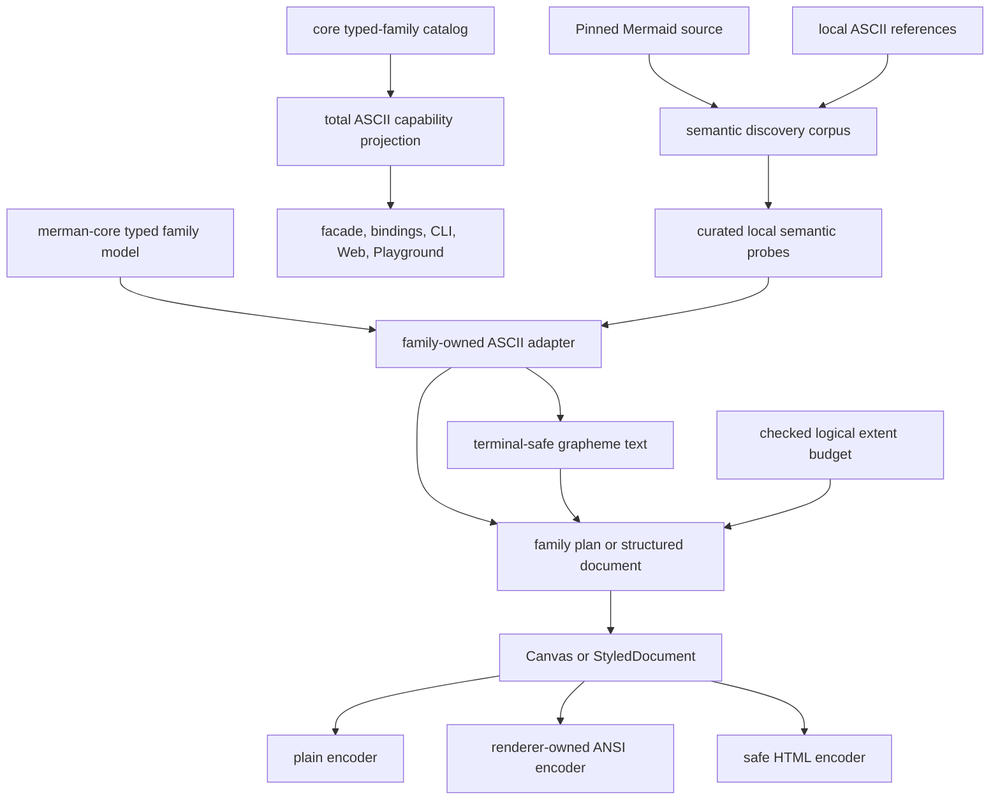

# ASCII Semantic Depth and Common Diagram Parity - Plan

## Goal Capsule

- **Objective:** Make `merman-ascii` the most semantically complete and operationally safe terminal renderer for common Mermaid diagrams, with Flowchart and Sequence first, Class/ER/State/XYChart second, evidence-based retain/deepen/deprecate decisions for existing terminal projections third, and only demonstrably useful diagrammatic new families admitted after those gates pass.
- **Authority:** Mermaid 11.16.1 semantics pinned in `tools/upstreams/REPOS.lock.json`, the installed pinned package used by oracle tooling, and imported upstream fixtures are normative. The implementation chain `Mermaid semantics -> parser/AST -> merman-core typed render model -> ASCII projection` must be audited at both boundaries; the current typed model is not treated as independently authoritative when it demonstrably loses upstream facts. The current `repo-ref/mermaid` checkout is supplementary because it is not at the same release. `repo-ref/mermaid-ascii` supplies a pinned exact oracle plus a moving discovery corpus. `repo-ref/beautiful-mermaid` supplies capability prior art, never parser or byte-output authority.
- **Execution profile:** Deep, phased refactor across `merman-core`, `merman-ascii`, the `merman` facade, binding metadata, CLI/Web capability surfaces, fixtures, and ASCII support documentation. Internal APIs may break and obsolete code may be deleted; public contract changes require explicit migration coverage.
- **Ordering gate:** No new ASCII family implementation begins until terminal text safety, grapheme correctness, logical resource budgeting, truthful capability metadata, and the common existing-family acceptance gates are green.
- **Stop conditions:** Stop a proposed implementation if it copies a reference parser, derives layout from SVG coordinates, silently drops a typed semantic field, weakens a resource limit, or adds fixture-specific geometry without a family-local semantic rule.
- **Tail ownership:** Each behavioral unit updates its capability evidence, support note, gap registry entry, and tests in the same commit. Final closeout includes comparison evidence and independently reviewed full verification.

---

## Product Contract

### Summary

`merman-ascii` already has broader family coverage than both local ASCII references and has strong typed-model ownership, terminal color roles, explicit unsupported errors, Class/ER relation summaries, lifecycle-aware Sequence output, and several terminal-native families.
It cannot yet claim overall superiority because common-path semantics and shared terminal invariants remain incomplete: Flowchart rejects valid marker/shape combinations and is declaration-order sensitive; Sequence supports only part of Mermaid's message model; text storage splits grapheme clusters and allows terminal control injection; the advertised grid budget is not universal; and capability metadata omits unsupported typed families while overstating some supported ones.

This plan measures success by common Mermaid meaning retained under terminal constraints, not by family count or visual imitation.

### Priority Model

| Priority | Scope | Why it comes here |
| --- | --- | --- |
| P0 | Terminal-safe text, grapheme cells, checked extent/resource budgeting, exhaustive capability truth | Every family inherits these correctness and security properties. |
| P1 | Flowchart and Sequence | They are common terminal workflows and contain the largest verified semantic gaps. |
| P2 | Class, ER, State, and XYChart | They are common structured diagrams and already have strong implementations worth deepening rather than replacing. |
| P3 | Gantt, GitGraph, Journey, Kanban, Mindmap, Packet, Timeline, and TreeView | First decide whether each output earns Diagrammatic, StructuredText, deprecation, or Unsupported status; deepen only the retained high-value surface. |
| P4 | Railroad, Requirement, Ishikawa, and Quadrant candidates | Evaluate their terminal usefulness after P0-P3; implement only candidates whose spatial projection beats StructuredText for a concrete user task. |

### Target Projection Classification

| Primary projection | Families | Contract |
| --- | --- | --- |
| Diagrammatic, existing/provisional | Flowchart, Sequence, State, Class, ER, XYChart, Mindmap, TreeView | Spatial topology, order, hierarchy, or coordinates carry meaning; every family still requires executable topology-recovery and terminal-usefulness evidence, with Mindmap/TreeView re-admitted during U15 rather than grandfathered by current output. |
| Diagrammatic, existing candidate upgrade | Packet, Gantt, GitGraph, Kanban, Timeline | Must pass the terminal-usefulness rubric and become a real packet grid/timeline/lane/board/spine before contributing to ASCII diagram coverage. Until then their current output is StructuredText. |
| StructuredText, intentional | Journey | The ordered score/actor report is useful terminal output, but it is not counted as an ASCII diagram. |
| Diagrammatic, gated new | Railroad, Requirement, Ishikawa, Quadrant | Requires a rail/relation/tree-or-fishbone/grid plan and the U17 admission gate. |
| Deferred | Pie, Cynefin, EventModeling, Architecture, Block, C4, ZenUML, Sankey, Radar, Treemap, Venn, Wardley, Info | No summary-only family is added for coverage; potentially diagrammatic families need a later evidence-backed spatial design. |

### Requirements

**Shared terminal contract**

- R1. Every visible user-authored text surface, including labels, titles, participants, sections, axes, notes, aliases, members, attributes, selected metadata, and human-facing diagnostics, must pass through one terminal-safe normalization boundary before measurement, layout, display, logging, or binding transport. Structural LF is the only authored control used as layout, and renderer-owned ANSI escapes are the only raw terminal controls allowed in ANSI output. Errors expose stable codes, spans, and bounded safe fields rather than embedding complete source text by default.
- R2. Measurement, family-defined local text truncation, wrapping, placement, overwrite, continuation ownership, styling, and emission must operate on Unicode grapheme clusters rather than scalar `char` values. Families own whether and where local text may be truncated; the shared terminal mechanism executes that policy without splitting a grapheme.
- R3. Combining marks, variation selectors, ZWJ emoji, regional-indicator sequences, CJK, zero-width graphemes, and wide graphemes at the last column must have deterministic, non-corrupting behavior in ASCII and Unicode charsets. `TerminalWidthProfile::Unicode` is the stable default and `TerminalWidthProfile::Cjk` treats East Asian ambiguous characters as wide; measurement, family-defined local text truncation, continuation ownership, budgeting, and emission all consume the same profile, whose table version follows the pinned `unicode-width` dependency. A zero-width scalar remains attached when it belongs to a positive-width grapheme; a standalone or line-leading zero-width grapheme is converted, scalar by scalar, to deterministic `\u{HEX}` visible escapes before measurement. U+061C, U+200E/U+200F, U+202A-U+202E, and U+2066-U+2069 are visibly escaped through one exhaustive bidi-control classifier; legal ZWJ/ZWNJ and variation selectors remain part of grapheme semantics.
- R4. `max_ascii_grid_cells` must be a hard checked logical terminal extent contract for every grid-backed renderer and every color mode. Overflow or excess always returns a structured resource error before allocation or row materialization; it never silently changes the projection to StructuredText. `max_ascii_layout_work_units` independently bounds route expansion and plan/tree work. Rust keeps a typed ASCII limit id and count context; every public binding failure maps it into the existing `BindingResourceErrorDetails` schema as stable `limit_id`, `phase`, `actual`, `max`, and `profile` fields rather than introducing a second public error shape.
- R5. Non-grid output and zero-width/high-byte graphemes must not bypass resource accounting. `max_ascii_document_cells`, `max_ascii_output_bytes`, `max_ascii_grapheme_bytes`, and `max_ascii_nesting_depth` have stable descriptors and profile values; checked accounting occurs before glyph-arena insertion, document materialization, recursive descent, and Plain/ANSI/HTML emission. `UnboundedForTrustedInput` is the only profile that may explicitly disable overridable limits. No ASCII resource limit produces a partial successful render: exceeding a limit returns a structured resource error; post-render response truncation or delivery-channel artifact fallback belongs to the host.

Initial ASCII profile values, calibrated from the current grid contract and existing core model-depth profiles, are part of the public resource contract and may be changed only with evidence plus generated-binding updates:

| Stable id | Interactive | Constrained | TrustedNative | UnboundedForTrustedInput |
| --- | ---: | ---: | ---: | ---: |
| `max_ascii_grid_cells` | 250,000 | 125,000 | 1,000,000 | unbounded |
| `max_ascii_layout_work_units` | 2,000,000 | 1,000,000 | 8,000,000 | unbounded |
| `max_ascii_document_cells` | 250,000 | 125,000 | 1,000,000 | unbounded |
| `max_ascii_output_bytes` | 16 MiB | 8 MiB | 64 MiB | unbounded |
| `max_ascii_grapheme_bytes` | 4 KiB | 2 KiB | 64 KiB | unbounded |
| `max_ascii_nesting_depth` | 256 | 128 | 1,024 | unbounded |

**Capability truth and public surfaces**

- R6. ASCII capability metadata must exhaustively cover every concrete built-in typed render family. Each record has `semantic_coverage: Option<Full|Partial>`, `primary_projection: Diagrammatic|StructuredText|None`, and an independent `structured_text_fallback` flag. Evidence must trace both upstream Mermaid semantics to parser/AST/typed-model preservation or intentional omission, and typed-model fields to rendered/unsupported/metadata disposition. Legacy output-availability lists may filter available records, but diagram-support counts and comparison claims include only `primary_projection = Diagrammatic`.
- R7. Dispatch must explicitly handle every `RenderSemanticModel` variant so a new typed family cannot be silently hidden behind a wildcard arm.
- R8. Quality level and projection kind must be separate contracts. Unsupported records use `semantic_coverage = None` and `primary_projection = None`; available records use `Some(Full|Partial)`. Existing `AsciiSupportLevel`/`supportLevel` remains a derived compatibility projection for this release: None maps to Unsupported, StructuredText maps to Summary, and Diagrammatic maps to Full/Partial from semantic coverage. Flowchart and Sequence remain Partial until their acceptance gates pass.
- R9. The `merman` facade, binding metadata, CLI/Web catalog, Playground fallback data, README, support matrix, and family support notes must report one consistent ASCII contract.

**Flowchart**

- R10. Flowchart edges must independently preserve source and target markers for none, point, circle, and cross forms, including bidirectional combinations, dotted/thick/open variants, and invisible constraint edges.
- R11. Every pinned Mermaid v11 typed shape name must appear in one canonical terminal shape disposition registry with implemented/approximate/unsupported status, fidelity, sizing, decoration, and port semantics. Flowchart Full requires the documented common-shape set without semantically distinct shapes silently collapsing to rectangles; browser-only shapes or metadata remain explicit. Ordinary Flowchart node labels use a Flowchart-owned, configurable terminal-cell wrapping policy before shape sizing and routing; explicit authored breaks and every grapheme remain intact, measurement and materialization consume the same safe wrap plan, and no SVG pixel coordinate or `wrappingWidth` value is quantized into terminal columns.
- R12. Rank assignment must reuse the repository's Dagre-compatible `dugong` acyclic/nesting/ranker semantics, select the pinned Mermaid ranker policy, honor `minlen` and compound groups, remain direction-correct, and preserve reversed-edge ownership through cycle handling. ASCII supplies stable semantic ordering before ranking so permutations of equivalent edge declarations preserve rank/topology where Mermaid ordering is not itself semantic; author ordering that Mermaid treats as semantic remains intact.
- R13. Route, group, label, lane, and marker placement must use scene-level occupancy and deterministic candidate selection so later edges cannot overwrite earlier routes or labels. The recent same-rank direct and bottom-lane fixes remain regression cases until the new allocator subsumes them.

**Sequence**

- R14. Sequence must preserve Mermaid-valid solid/dotted, open/filled/cross/point/half, forward/reverse, bidirectional, asynchronous, self-message, and central-connection semantics through a typed source/target marker model rather than raw numeric matches spread across render code.
- R15. Sequence central marker records must not create phantom activation state, message rows, or autonumber increments; inline and explicit activation/deactivation must remain distinct and stack correctly.
- R16. Control structures must be represented as a recursive typed tree with explicit sections. Empty, leading-empty, trailing-empty, repeated-empty, nested, note-only, and state-only sections must render deterministically without clipping content or inventing participants.
- R17. Notes, frames, participant spans, lifecycle visibility, actor anchors, actor types, Mermaid-valid actor names, aliases, links, and actor properties must each have an explicit terminal policy. Harmless SVG/interaction metadata is accepted and intentionally omitted rather than rejected.
- R18. Autonumber visibility, next value, and step must be independent state so `off` followed by bare `autonumber` resumes Mermaid semantics.
- R19. The Mermaid-valid Sequence discovery corpus must render with semantic completeness; reference-only private syntax stays in a separate, explicitly non-parity category.

**Class, ER, State, and XYChart**

- R20. Class and ER must retain every meaningful typed node, compartment, attribute/member, annotation, namespace, relationship, independent source/target marker, endpoint label, cardinality including `MD_PARENT`, identifying kind, declaration order, direction, self-edge, and parallel-edge fact in routed output or an explicit structured fallback.
- R21. The shared relation graph must have one source of truth for styled rows, checked extent across stacked/namespace/summary/routed paths, component ownership, direction-neutral coordinates, four-sided ports, routing, overlays, bounded crossings, and fallback reasons; family marker/cardinality semantics remain in Class and ER adapters.
- R22. State must preserve simple/composite states, start/end, choice, fork/join, divider/concurrency regions, every note as an independently anchored annotation, titled compartments, transition labels, boundary transitions, explicit direction inheritance including local RL/BT, and terminal-safe styling through explicit state-to-graph projections.
- R23. XYChart must preserve vertical/horizontal orientation, band/linear axes, each series' typed x/y sample coordinates and point labels, explicit ranges including negative/reversed/degenerate ranges, grouped bar/line/mixed and multiple series, display policy, legends, clipping, exact data disclosure, collision policy, and deterministic compact scaling.

**Existing terminal summaries and full families**

- R24. Gantt task ids, explicit start/end constraints including multi-id `after` and `until`, dependency/order semantics, flags, sections, and meaningful date-time precision must be available to summary output through typed core data; capability records must never claim fields the renderer ignores.
- R25. GitGraph, Journey, Kanban, Mindmap, Packet, Timeline, and TreeView must first complete typed-field and terminal-usefulness inventories, then receive an explicit retain-as-Diagrammatic, retain-as-StructuredText, deprecate, or Unsupported decision. Mindmap and TreeView retain their provisional Diagrammatic classification only with executable topology-recovery and 80/100/120-column evidence; tree prefixes alone are not sufficient. Retained outputs either render, intentionally omit, explicitly reject, or classify every field as metadata-only. GitGraph must expose branch/parent topology rather than raw implementation flags; Kanban cannot silently drop orphan cards; TreeView must distinguish node types and honor charset connectors; Packet must provide packet-row structure before claiming Diagrammatic or Full.
- R26. Shared hierarchy/document primitives may remove duplicated wrapping, tree-prefix, style, HTML/ANSI finalization, and safe-text code, but diagram meaning remains family-owned and summaries must stop bypassing `AsciiRenderOptions`.

**Evidence and measured advantage**

- R27. The existing copied `mermaid-ascii` v1 byte oracle remains immutable and provenance-pinned.
- R28. A separate moving discovery lane must record local reference commit, fixture identity, Mermaid-valid/private classification, admission status, and the semantic feature exercised; it must not require `repo-ref/` in release CI.
- R29. Reference-inspired cases become curated local semantic probes before they become support claims. Exact spacing from `beautiful-mermaid` is never a contract.
- R30. The final comparison may claim an advantage only when every reference capability is covered, intentionally different with a source-backed reason, or explicitly unsupported, and when local safety/resource contracts have executable evidence. StructuredText families are reported separately and never inflate the ASCII diagram count.

**Gated family expansion**

- R31. A new ASCII diagram family must own a typed adapter, spatial plan, terminal projection that conveys more than a list/table, capability record, support note, field inventory, resource behavior, and semantic tests before it is advertised as Diagrammatic. A StructuredText report is a separate product decision and does not satisfy this gate.
- R32. After P0-P3 pass, Railroad, Requirement, Ishikawa, and Quadrant undergo terminal-usefulness admission in that default order. An admitted candidate receives a complete vertical slice; a rejected candidate remains Unsupported with evidence. The plan is complete when every candidate has an implemented or rejected disposition, not only when all four are implemented.
- R33. An admitted Quadrant combines a bounded grid with an exact point table; Ishikawa preserves cause/effect topology through a real tree/fishbone projection; Railroad and Requirement preserve branch/relation topology. None may claim browser geometry parity, and none may pass admission with a summary-only fallback as its primary behavior.
- R34. Diagrammatic admission, for existing upgrades and new candidates, must name a representative user task and demonstrate at typical 80-120-column terminal widths that spatial structure is scannable, topology is recoverable, and information gain exceeds StructuredText. Dense/narrow failure behavior must be explicit; candidates that fail remain StructuredText, enter deprecation, or remain Unsupported.

### Acceptance Examples

- AE1. Given a rendered label or failed-input diagnostic containing ESC, CSI/OSC fragments, C0/C1 controls, DEL, or any enumerated bidi formatting control, plain/CLI output contains a deterministic visible escape, ANSI output contains only renderer-owned style sequences, binding errors expose safe structured fields without complete source text, and HTML contains context-safe escaped content; width is computed from normalized text.
- AE2. Given `e` plus a combining accent, a ZWJ emoji such as a technologist, a flag, and CJK text, each survives wrap and paint as a complete grapheme, owns the correct continuation cells, and is not truncated into an invalid fragment. Given Issue #53's long Flowchart nodes, the default and configured terminal-cell widths wrap before node sizing, preserve every authored label and edge, and produce the same topology in ASCII and Unicode without deriving the width from SVG pixels.
- AE3. Given any public ASCII rendering path and a measured resource usage of `N`, the matching stable limit set to `N` succeeds and `N-1` fails before oversized allocation or materialization. At binding boundaries the failure uses the existing `{limit_id, phase, actual, max, profile}` payload. Grid-backed families behave identically across Plain, ANSI16, ANSI256, TrueColor, and HTML; document, grapheme, nesting, layout-work, and final-output limits also cover StructuredText and direct typed-model APIs.
- AE4. Given `A o--x B`, `A x--o B`, a double-ended point edge, or an invisible Flowchart constraint edge, the source/target marker and visibility semantics remain distinct and labels do not overwrite markers.
- AE5. Given equivalent acyclic Flowcharts with edges declared in different orders, node ranks and route connectivity remain invariant where author order is non-semantic; given a cycle, Dagre-compatible edge reversal/ranking is deterministic, original endpoint ownership is restored, and every edge remains traceable.
- AE6. Given a same-rank skip edge from the recent four-commit regression set, the new scene allocator preserves the direct route when clear and selects a collision-free lane when blocked without using declaration-order overwrites.
- AE7. Given visible Sequence signal kinds 0/1/3/4/5/6/24/25/33/34/41-48/51-58 in left-to-right, right-to-left, and self forms, the terminal output preserves stroke and both endpoint semantics; undefined 49/50 returns a precise unknown-type error.
- AE8. Given central records 59-61 adjacent to activation records and autonumber, central decorations render once, the records do not become ordinary message rows, activation depth changes only for actual state events, and numbering counts only visible messages.
- AE9. Given empty and nested `loop`, `alt`, `par`, `critical`, `break`, `opt`, and `rect` sections with notes at the leftmost actor, the recursive plan preserves content, a lifeline row, frame boundaries, participant span, and note gutters.
- AE10. Given an actor destroyed before a later note, the note may use the actor's static anchor while later messages still obey lifecycle visibility.
- AE11. Given Class `<|--|>`, `*--*`, `o--o`, or other double-ended relations, both semantic terminals survive direction/layout transforms; given ER `PROJECT u--o{ TEAM_MEMBER`, `MD_PARENT` renders in routed and fallback forms. TB/LR/BT/RL change relative placement while preserving endpoint ownership, and dense topology loses no box, label, order, cardinality, or marker.
- AE12. Given a State with left and right notes on the same node, both texts appear exactly once at their requested side; given an outer LR composite with no inner direction declaration, the child inherits LR, while explicit nested RL/BT remains locally mirrored. Titled state descriptions retain title/body compartments.
- AE13. Given an XYChart with sparse and dense series on a linear x-axis, each point uses its own typed x coordinate; horizontal lines remain connected, grouped bars stay distinguishable, point labels remain visible or disclosed, and values such as `0.75` and `0.001` are not rounded into different data.
- AE14. Given a Gantt task with multiple `after` dependencies, an `until` constraint, and time-of-day precision, the typed model and summary preserve those facts and capability metadata cites a test that proves them.
- AE15. Given capability metadata, all 31 concrete built-in typed families appear exactly once; output availability, semantic quality, and projection kind remain distinguishable; diagram capability counts exclude StructuredText; and Web/Playground fallback data agrees.
- AE16. Given the pinned exact corpus, its inputs, reference bytes, and provenance never change; a source-backed local rendering difference is recorded as an intentional difference with an independent semantic probe rather than rewriting the oracle. Given the moving corpus, every Mermaid-valid case has a tracked semantic disposition.
- AE17. Given a new-family phase begins, the P0-P3 gate report is green and the family ships as a complete vertical slice rather than a dispatcher-only string summary.

### Host Integration Boundary

Merman owns provider-neutral terminal rendering mechanisms and their stable contracts: charsets,
terminal-width profiles, color modes, family options, renderer resource profiles and limits,
capability metadata, and typed errors.

Hosts own runtime environment detection and policy-level composition of those options, provider and
tool protocol envelopes, token and context budgets, artifact delivery or delivery-channel fallback,
and post-render response truncation. A host-modified response is outside the complete Merman render
contract and must not be represented as a complete renderer result.

This plan does not introduce an `AgentPreset`, a coding-agent-specific adapter, an MCP/provider
integration, or coding-agent task benchmarks. Renderer resource handling remains
complete-output-or-structured-error: when a limit is exceeded, Merman returns a structured resource
error rather than a partial rendered document. This boundary does not remove the terminal-usefulness
evidence in U17/R34 or the renderer performance and amplification evidence in U25.

### Scope Boundaries

In scope:

- Shared terminal text, cell, styling, and resource infrastructure used by ASCII output.
- Truthful field inventories and retention decisions for all 14 current output families, with deep semantic alignment only for projections that remain useful in a terminal.
- Parser/core fixes required to preserve Mermaid-valid typed semantics consumed by ASCII.
- Exhaustive capability metadata and downstream public catalog consistency.
- A gated first wave of genuinely diagrammatic terminal-suitable families with family-owned projections.
- Deletion of obsolete internal route, cell, summary, and adapter code after replacement tests prove it is redundant.

Deferred until after this plan:

- Pie and Cynefin summary-only projections; a bar/table report is not admitted as a Pie diagram and a grouped list is not admitted as a Cynefin diagram.
- EventModeling, Architecture, Block, C4, ZenUML, Kanban/Timeline upgrades not completed by the existing-family gate, and other potentially diagrammatic families that need a real lane/board/graph design first.
- Sankey, Radar, Treemap, Venn, Wardley, and Info ASCII projections, whose defining visual encodings are terminal-hostile or not useful as diagrams.
- Terminal image protocols, browser interaction, links/callback execution, SVG CSS fidelity, and pixel-perfect output.
- Private `mermaid-ascii` syntax that pinned Mermaid 11.16.1 does not accept.

Outside this product's identity:

- Copying a reference parser or maintaining an ASCII-only Mermaid grammar.
- Quantizing browser/SVG coordinates into terminal cells.
- A universal diagram semantic model that erases family ownership.
- Comparator normalization that hides semantic differences.

---

## Planning Contract

### Key Technical Decisions

- KTD1. **Common diagrams before breadth** (session-settled: user-directed — chosen over expanding family count first: users benefit more from deep support for frequent terminal diagrams). P0-P3 are hard prerequisites for P4. Governs R1-R34.
- KTD2. **The semantic authority is a verified chain.** Pinned Mermaid defines behavior; parser/AST and `merman-core` typed models are audited projections that may need deepening before ASCII consumes them. Reference repositories can reveal cases and algorithms, but no reference parser or output snapshot overrides pinned Mermaid semantics. Governs R10-R33.
- KTD3. **Breaking internal refactors are allowed; public changes are explicit.** Replace `char` cells, numeric message branching, duplicated relation documents, and special-case route paths when the replacement is demonstrably simpler and stronger. Public Rust/binding changes require migration tests and documentation. Governs R1-R26.
- KTD4. **Normalize unsafe text before measurement or diagnosis.** Split authored multiline content into logical lines first, then convert non-structural C0/C1/ESC/DEL and the exhaustive bidi-control set in R3 to deterministic ASCII-visible escapes. Human-facing errors carry bounded safe fields; ANSI styling is added only by the final encoder. Governs R1-R3.
- KTD5. **A terminal cell owns a grapheme without penalizing scalar text.** Select a compact scalar-or-arena/interned representation through the U2 prototype gate; ASCII/single-scalar glyphs allocate no per cell, while complex clusters use bounded shared storage. Use `unicode-segmentation` and one profile-aware `unicode-width` iterator/API. No renderer may loop over authored text with `.chars()` for layout. Governs R2-R3.
- KTD6. **Budget every amplification dimension, not a particular allocation.** A shared fallible ASCII resource context uses checked addition and multiplication for grid extent, layout work, document cells, output bytes, grapheme bytes, and nesting before any glyph-arena entry, `Canvas`, sequence row, plot, mirror, relation scene, document, or encoded output is materialized. Governs R4-R5.
- KTD7. **Capabilities are a total, two-dimensional projection.** Derive ASCII records from the core typed-family catalog plus explicit ASCII overrides, default to Unsupported, and make semantic coverage plus projection kind the source of truth. Keep `AsciiSupportLevel` and binding `supportLevel` as a derived compatibility view for this release; filter output-available and diagrammatic lists deliberately, and enumerate dispatcher variants. Governs R6-R9.
- KTD8. **Family semantics and physical terminal geometry are separate.** Flowchart/State and Class/ER retain distinct topology, marker, cardinality, and fallback semantics, while a narrow geometry kernel may share physical ports, occupancy masks, bounded orthogonal search, crossing composition, overlays, direction transforms, and work accounting. Governs R10-R13 and R20-R22.
- KTD9. **Reuse Dagre rank semantics, then route as a terminal scene.** Expose or adapt the existing `dugong` acyclic/nesting/ranker phase (network-simplex/tight-tree/longest-path as selected by pinned Mermaid policy) into a discrete rank plan; ASCII owns only terminal coordinates and routes. Do not flatten cycles into one SCC rank or mask rank errors with more same-rank fallbacks. Governs R12-R13.
- KTD10. **Sequence planning is recursive.** Convert flat typed events into a family-owned item/control tree before layout; plan participant spans, notes, activation, and frame bounds recursively, then paint once. Governs R14-R19.
- KTD11. **Every semantic field has a two-stage disposition.** Family inventories first classify each pinned upstream semantic as preserved in parser/AST/typed model or intentionally omitted, then classify every typed field as rendered, intentionally omitted, explicit unsupported, or metadata-only in ASCII. A support level is derived from both stages rather than from whether a string was produced. Governs R8 and R20-R26.
- KTD12. **Exact and discovery evidence remain separate.** Preserve the old copied byte oracle; maintain the current reference as a non-CI discovery manifest and promote selected cases into local semantic probes. Governs R27-R30.
- KTD13. **New ASCII diagram families are complete spatial vertical slices.** Reuse terminal mechanisms, never family semantics. Summary/table output can be a useful StructuredText product, but it neither counts as diagram support nor satisfies new-family admission. Governs R31-R34.
- KTD14. **XYChart plans one orientation-neutral logical scene.** `AxisPlan` and per-series typed samples feed a topology/occupancy grid, then orientation is a transform. Data-value formatting remains lossless while tick formatting is scale-aware. Governs R23.
- KTD15. **Renderer contracts stop at the host integration boundary.** Merman owns provider-neutral rendering mechanisms and stable contracts; hosts own runtime detection, policy-level option composition, protocol envelopes, task budgets, delivery-channel artifact policy, and post-render response policy. Renderer resource excess remains complete-output-or-structured-error, and this plan adds no agent- or provider-specific adapter or task benchmark. Governs R2 and R4-R5.

### High-Level Technical Design

The shared layer owns terminal mechanics only: safe authored text, grapheme measurement, styled cells/documents, checked extents, and encoders.
Flowchart/State own graph semantics; Class/ER own relation semantics; Sequence owns temporal/control semantics; XYChart owns scale/plot semantics; summaries own family-specific documents.

### Execution Phases and Gates

| Phase | Units | Entry condition | Exit gate |
| --- | --- | --- | --- |
| Phase 0: Truth baseline | U1 | Current branch builds and existing ASCII suite is characterized | All typed families appear in capability data; false Full claims are removed; recent regressions are pinned. |
| Phase 1: Shared terminal substrate | U2-U3 | U1 complete | Grapheme/control/budget matrices pass for all current families, public rendering paths, projection kinds, and output modes. |
| Phase 2A: Highest-frequency diagrams | U4-U9 | U2-U3 complete | Flowchart and Sequence gates, capability evidence, support notes, regressions, and independent review pass as a separately shippable milestone. |
| Phase 2B: Common structured diagrams | U10-U14 | Phase 2A complete | Class, ER, State, and XYChart family gates pass with no silent typed-field loss. |
| Phase 3: Existing-family truth | U15, U26-U29, U16 | Phase 2B complete | All 14 current families have field inventories, evidence, docs, and truthful support levels; current reference discovery is dispositioned. |
| Phase 4: Gated breadth | U17-U20, U22 | Phase 3 complete and independently reviewed | Each candidate receives either a complete diagrammatic vertical slice or a source-backed Unsupported disposition; no prior common gate regresses. |
| Phase 5: Structural closeout | U30 | All semantic, capability, and evidence units complete | Oversized implementation and test modules are split by semantic ownership with no public-surface or behavior change; superseded helpers are removed. |
| Phase 6: Closeout | U25 | U30 complete | Full verification, comparison scorecard, cleanup, docs, and independent review pass. |

### Assumptions

- The user's direction to prioritize diagrams people commonly use supersedes breadth-first ordering; it does not remove the later terminal-suitable family phase.
- Internal compatibility is intentionally secondary to correctness and maintainability. Public behavior may change where current output is semantically wrong, but every such change receives a migration/re-admission note.
- The untracked `fixtures/{class,er,sequence}/*.txt` files present or generated outside this plan are user-owned and are not plan inputs, tracked fixtures, or staging targets. Curated tests must be added under owned testdata paths.
- Local `repo-ref/` checkouts are research inputs and remain absent from release builds and CI.
- No internet research is load-bearing; the pinned local sources are the authoritative baseline.
- Cargo work runs serially (`-j 1`) and reuses the workspace target directory.

### Alternatives Considered

| Alternative | Benefit | Cost/risk | Decision |
| --- | --- | --- | --- |
| Continue adding route/message special cases | Small diffs and limited snapshot churn | Preserves declaration-order bugs, duplicated numeric semantics, and overwrite behavior | Rejected after the recent four-commit audit. |
| Preserve the `char` cell and patch combining/emoji cases | Avoids a central internal break | Cannot make measurement, family-defined local text truncation, style ownership, and emission agree for grapheme clusters | Rejected. |
| Build one universal terminal graph/layout model | Maximum apparent reuse | Erases temporal, cardinality, chart-scale, and family-specific semantics; repeats rejected architecture | Rejected. |
| Quantize Mermaid SVG coordinates | Fast visual approximation | Browser/font dependent, violates headless semantic boundary, and inherits unstable geometry | Rejected. |
| Copy latest reference fixtures as a new exact oracle | Easy parity number | Treats private syntax and reference spacing as Mermaid authority | Rejected; use moving discovery plus curated probes. |
| Deepen common typed families, then admit family-owned terminal projections | Correctness, maintainability, honest claims | Larger initial refactor and deliberate snapshot changes | Selected. |

### Risks and Dependencies

| Risk | Impact | Mitigation |
| --- | --- | --- |
| Grapheme cells cause broad snapshot churn | Legitimate changes become hard to review | Land characterization first, separate correctness changes by unit, and require semantic plus focused snapshot review. |
| Safe-text expansion changes local renderer output | Existing exact-oracle comparisons may stop matching | Keep copied inputs, reference bytes, and provenance immutable; record source-backed renderer differences separately and admit them with semantic probes. |
| Fallible Canvas and multi-dimensional limits affect many call sites | Error propagation becomes noisy or inconsistent | Introduce one typed ASCII resource context and structured resource error, then migrate backing primitives before family integrations. |
| Longest-path ranking diverges from expected Mermaid layout | Common Flowcharts become less readable despite order invariance | Compare pinned Mermaid/Dagre semantics, preserve stable sibling hints, and use topology/readability metamorphic tests rather than coordinate imitation. |
| Global route occupancy becomes another incomplete layout engine | Complexity grows faster than value | Keep candidate set bounded, family-local, deterministic, and driven by explicit collision semantics; delete superseded special paths. |
| Sequence tree reconstruction mis-nests events | Frames, lifecycle, or numbering regress | Add an adapter-tree test layer before layout and cover every control/activation event transition. |
| The local Mermaid checkout differs from the pinned 11.16.1 baseline | A convenient source path can provide the wrong semantics | Prefer `REPOS.lock`, the installed pinned package, imported fixtures, and alignment evidence; label current checkout evidence by version. |
| Capability totality changes metadata array length | Bindings or consumers assume supported-only rows | Keep the legacy supported-list API filtered, version/document the richer endpoint, and add binding/Web contract tests. |
| StructuredText families overclaim fields | Users trust missing dependency/order facts or mistake a report for a diagram | Field inventories, projection-kind metadata, and parser-backed semantic tests precede support claims. |
| New family phase dilutes common-family completion | Breadth resumes too early | U17 is a hard gate report; U18-U20 and U22 cannot begin without Phase 0-3 evidence and independent review. |

### System-Wide Impact

- **Rust consumers:** Internal `merman-ascii` APIs change substantially. Public `AsciiCapability` results become exhaustive and may add records; the supported-list compatibility API remains filtered.
- **Bindings and CLI:** Resource-limit errors become consistent across formats/families. Capability JSON and facade exports become complete.
- **Web and Playground:** Static fallback catalogs stop claiming unsupported ZenUML and must mirror runtime support levels, including newly admitted families only after their vertical slices land.
- **Security:** Authored terminal controls no longer reach terminal output raw.
- **Performance and reliability:** Checked logical extents prevent integer overflow and unbounded grid allocations. Grapheme strings may increase per-cell overhead, so representative benchmark and allocation checks are part of closeout.
- **Maintainers:** Family support claims become traceable to field inventories, support notes, fixtures, and capability evidence rather than duplicated prose.

---

## Implementation Units

### Unit Index

| Unit | Title | Primary files | Depends on |
| --- | --- | --- | --- |
| U1 | Establish truthful capability and characterization baseline | `capability.rs`, `lib.rs`, support matrix, public catalogs | None |
| U2 | Replace scalar terminal text with safe grapheme text | `terminal.rs`, `text.rs`, `canvas.rs`, Cargo manifests | U1 |
| U3 | Enforce typed ASCII amplification budgets | `options.rs`, resource context, planners/documents/encoders | U1; integrates after U2 |
| U4 | Preserve Flowchart edge and shape semantics | `graph/model.rs`, `adapter.rs`, `shape.rs`, `draw.rs` | U2-U3 |
| U5 | Reuse pinned Dagre rank semantics for terminal graphs | `dugong` rank seam, `graph/layout/*`, conformance tests | U4 |
| U6 | Route graph scenes with global occupancy | `graph/routing/*`, `draw.rs`, route tests | U4-U5 |
| U7 | Type and render all common Sequence signals | core Sequence model/parser, `sequence/model.rs`, `events.rs` | U2-U3 |
| U8 | Rebuild Sequence controls as a recursive plan | `sequence/control.rs`, `plan.rs`, `notes.rs`, `boxes.rs` | U7 |
| U9 | Complete Sequence actor, lifecycle, activation, and numbering semantics | core Sequence lexer/model, `validate.rs`, `layout.rs`, tests | U7-U8 |
| U10 | Deepen and modularize the shared relation graph | `relation_graph*`, shared geometry/document modules | U6, U9 phase gate |
| U11 | Complete Class terminal semantics | `class/*`, core Class model/tests | U10 |
| U12 | Complete ER terminal semantics | `er/*`, core ER model/tests | U10 |
| U13 | Revalidate State on the new graph substrate | `state/*`, graph projection, state tests/docs | U6, U9 phase gate |
| U14 | Complete common XYChart semantics | `xychart/*`, core XYChart tests/docs | U9 phase gate |
| U15 | Build shared terminal documents and field inventories for existing summary/full families | summary/full family modules and tests | U11-U14 phase gate |
| U26 | Preserve Gantt constraints and conditionally add a terminal timeline | core Gantt model, `gantt.rs`, tests | U15 disposition |
| U27 | Conditionally upgrade GitGraph to terminal lanes | core GitGraph model, `git_graph.rs`, tests | U15 disposition |
| U28 | Evaluate TreeView and conditionally upgrade Packet | `packet.rs`, `tree_view.rs`, tests | U15 disposition |
| U29 | Correct Journey and conditionally deepen Mindmap/Kanban/Timeline | family modules and tests | U15 disposition |
| U16 | Establish exact/discovery evidence lanes and common-family gate report | fixture manifests, comparison/gap/support docs | U4-U15, U26-U29 |
| U17 | Enforce the new-family admission gate and vertical-slice contract | capability tests, family template/docs | U16 |
| U18 | Evaluate and conditionally add Railroad terminal projection | new `railroad/*`, tests/support note | U17 |
| U19 | Evaluate and conditionally add Requirement terminal projection | new `requirement/*`, relation primitives/tests | U18; may reuse U10 |
| U20 | Evaluate and conditionally add Ishikawa terminal projection | new `ishikawa/*`, hierarchy primitives/tests | U19; may reuse U15 |
| U22 | Evaluate and conditionally add Quadrant terminal projection | new `quadrant/*`, plot primitives/tests | U20; may reuse U14 |
| U30 | Split oversized modules by semantic ownership | Sequence lexer/planner/tests, `relation_graph*`, family-local deep modules | U16, U18-U20, U22 |
| U25 | Prove measured advantage and close the refactor | full suite, benchmarks, docs, review | U30 |

### U1. Establish truthful capability and characterization baseline

- **Goal:** Freeze current behavior and make every public support claim honest before changing rendering internals.
- **Requirements:** R6-R9, R27-R30
- **Dependencies:** None
- **Files:** `crates/merman-core/src/family.rs`, `crates/merman-core/src/diagram/mod.rs`, `crates/merman-ascii/src/capability.rs`, `crates/merman-ascii/src/lib.rs`, `crates/merman/src/ascii.rs`, `crates/merman-bindings-core/src/metadata.rs`, `crates/merman-uniffi/src/lib.rs`, `crates/merman-wasm`, generated binding surfaces, `platforms/web/src/public-catalog.ts` and runtime capability normalizer, `playground/src/lib/{ascii-support.ts,ascii-support.test.ts}`, `playground/package.json`, `docs/rendering/ASCII_SUPPORT_MATRIX.md`, `crates/merman-ascii/README.md`, family support notes and baseline tests.
- **Approach:** Expose or add a narrow public typed-family catalog projection from core; build exactly one ASCII capability per concrete built-in typed family with `semantic_coverage`, `primary_projection`, and `structured_text_fallback` invariants. Derive the legacy support-level field, retain an output-available list for compatibility, and add a diagrammatic-only list for product counts/filtering. Make dispatcher matches exhaustive, restore the missing `render_state` facade export, remove the stale ZenUML support claim from static catalogs, and synchronize binding/UniFFI/WASM/Web/Playground records plus generated ABI surfaces. Temporarily classify Flowchart and Sequence as Partial, classify current report-only families as StructuredText, and correct the Gantt dependency claim. Record current defects as non-blocking discovery entries or explicitly ignored tests with gap ids and owner units; implementation units convert them to ordinary passing regression tests. Never commit a red default suite.
- **Test scenarios:** Exactly 31 built-in typed families appear once; Error/Custom are handled explicitly but are not advertised as built-in families; output-available and diagrammatic lists have the intended different membership; legacy support level is a deterministic projection; binding JSON, Web runtime data, and the Playground fallback agree in a dedicated `ascii-support` contract test; no capability claims a semantic field without evidence; recent four-commit Flowchart cases are captured with stronger connectivity/marker assertions.
- **Verification:** Capability, binding, facade, generated ABI, WASM, Web catalog, Playground fallback, and TypeScript checks fail on a missing family or stale projection; the default affected-package suite remains green; known-gap entries demonstrate the intended future red-green cases without depending on user-owned untracked fixtures.

### U2. Replace scalar terminal text with safe grapheme text

- **Goal:** Establish one secure and Unicode-correct text representation for every ASCII family and encoder.
- **Requirements:** R1-R3, R26
- **Dependencies:** U1
- **Files:** workspace and `crates/merman-ascii/Cargo.toml`, `crates/merman-ascii/src/terminal.rs`, `text.rs`, `canvas.rs`, family text/wrap modules, ASCII facade/binding/CLI diagnostic adapters, terminal primitive tests and a focused cell-representation benchmark.
- **Approach:** Add `unicode-segmentation`. Before full migration, compare the current scalar cell, compact scalar-or-glyph-arena, and a compact interned alternative on cell size, ASCII/CJK/emoji allocation count, paint/clone/finalize throughput, and arena remapping during clone/mirror/composition; select the simplest representation that keeps the scalar fast path allocation-free and within the recorded regression thresholds. Add stable `TerminalWidthProfile::{Unicode,Cjk}` options and binding values; one grapheme iterator performs normalization, segmentation, and profile-specific width lookup for measurement, wrapping, family-defined local text truncation, placement, budgets, and emission. Create one idempotent safe authored-text/diagnostic API that first recognizes CRLF/LF structural lines, then visibly escapes non-structural C0/C1/ESC/DEL, tab, carriage return, and every R3 bidi control without breaking legal ZWJ/ZWNJ/variation-selector graphemes. Route every visible text surface in all 14 existing families plus ASCII parse/detect/validate/unsupported errors through normalization, writing, mirroring, ANSI, HTML, CLI `Display`, and binding transport. Diagnostics expose bounded code/span/field payloads and do not embed complete source by default. Remove authored-text `.chars()` layout loops and scalar-width helpers after all call sites migrate. Keep renderer-owned border/connector glyph construction explicit and safe.
- **Test scenarios:** Both width profiles, including East Asian ambiguous characters with different expected widths; combining marks, ZWJ/ZWNJ sequences, emoji modifiers, variation selectors, flags, CJK, zero-width-only input, each R3 bidi control plus nested/unpaired combinations, CRLF/LF, tab/CR, normalization idempotence, grapheme overwrite, continuation overwrite, last-column rejection, wrap/budget boundaries, every visible family text surface, detect/parse/unknown-node/invalid-model/unsupported diagnostics, ANSI style ownership, HTML context escaping, C0/C1/ESC/DEL normalization, and renderer-owned ANSI escape isolation.
- **Verification:** The prototype thresholds and chosen representation are recorded before broad migration. A repository search finds no authored-text layout loop using `.chars()` outside explicitly documented single-codepoint renderer glyph construction; the chosen scalar path uses no per-cell heap allocation and stays within the accepted size/throughput envelope; all 14 existing families and direct/facade/binding/CLI error paths pass safe-text tests in ASCII/Unicode and all color modes.

### U3. Enforce typed ASCII amplification budgets

- **Goal:** Make every ASCII resource limit reliable before text, plans, grids, documents, or encoded output amplify input.
- **Requirements:** R4-R5
- **Dependencies:** U1; final integration follows U2
- **Files:** `crates/merman-ascii/src/options.rs`, `error.rs`, `canvas.rs`, `lib.rs`, new resource-context/extent module, `graph/draw.rs`, `sequence/{layout,plan,render}.rs`, `relation_graph*`, `xychart/render.rs`, document/encoder paths, facade/binding/UniFFI/WASM/CLI generated resource contracts and tests.
- **Approach:** Add an `AsciiResourceLimitId`-style typed contract for R4-R5 with stable ids, phases, and profile values, and deepen `AsciiError` with typed resource identity plus `actual`/`max` context. Map it one-to-one into the existing public `BindingResourceErrorDetails { limit_id, phase, actual, max, profile }`; do not add a competing binding error schema. Introduce checked width/height/area types and a validated internal resource context shared by direct family APIs, typed-model dispatch, facade, and bindings. Make glyph-arena insertion, Canvas construction, plan/tree traversal, document materialization, and final encoders fallible; replace saturating arithmetic with checked operations at the earliest informed phase. Budget logical extents for primary, mirrored, temporary, sequence-row, stacked/namespace/relation, and complete XYChart canvases consistently; debit route expansion and every plan item against layout work, nesting before descent, document display cells before row materialization, per-grapheme bytes before arena insertion, and actual final bytes while encoding each output mode. Every resource excess returns the structured error without returning a partial rendered document; post-render response truncation or delivery-channel artifact fallback belongs to the host. RelationGraph may fall back only for non-resource readability reasons. Direct APIs use explicit options or documented default-profile values rather than becoming unbounded accidentally.
- **Test scenarios:** Exact limit and limit-minus-one for every resource id and affected family; huge combining/ZWJ graphemes; zero-width high-byte text; wide/deep trees; overflow-shaped dimensions; mirror/transform canvases; title/legend/disclosure/document rows; per-mode output expansion; direct family APIs versus dispatcher/facade/binding/UniFFI/WASM/CLI; Class/ER hard error on grid limit; dense graph aggregate work; stable `limit_id`/`phase`/`actual`/`max`/`profile` round trips; no allocation, runaway search, recursion overflow, partial Plain/ANSI/HTML result, or panic before rejection.
- **Verification:** Every ASCII descriptor has a profile value and stable binding/generated enum entry; errors preserve resource identity and counts across all public surfaces without relying on descriptor position; each path rejects at the earliest accountable phase and reports the same logical count for the same resource/mode.

### U4. Preserve Flowchart edge, shape, and node-label semantics

- **Goal:** Stop rejecting, collapsing, or making terminal-hostile common Mermaid Flowchart edge, shape, and node-label semantics before layout begins.
- **Requirements:** R10-R11
- **Dependencies:** U2-U3
- **Files:** `crates/merman-core/src/diagrams/flowchart/*` as needed, `crates/merman-ascii/src/options.rs`, `crates/merman-ascii/src/graph/{model,adapter,shape,charset,draw,label,style}.rs`, `crates/merman-ascii/src/graph/layout/grid.rs`, ASCII facade/binding/UniFFI/WASM/Web option projections, `tests/flowchart_model.rs`, local semantic fixtures including Issue #53, Flowchart support docs, and public-option migration notes.
- **Approach:** Replace the single arrow enum with independent start/end marker kinds and independent stroke/visibility semantics. Preserve `FlowEdge.id` plus `is_user_defined_id` in `AsciiGraphEdge`, using only explicit ids as cross-declaration stable identity and treating generated ids as provenance. Centralize marker footprint/painting and reserve both endpoints around labels. Replace the adapter/shape/draw triple match with a canonical shape projection registry containing aliases, terminal primitive/decorators, size rules, ports, and fidelity policy. Add a non-zero `flowchart_node_label_wrap_width` terminal-column option with a documented default calibrated against 80/100/120-column use; project it only onto ordinary Flowchart nodes, reuse one grapheme-safe `GraphLabel` plan for pre-layout measurement and post-admission materialization, and size shapes and ports from the wrapped dimensions. Do not change State labels, edge labels, or subgraph-title policy, and do not convert Mermaid's SVG pixel width into terminal cells. Treat invisible edges as layout constraints without visible route paint.
- **Test scenarios:** Marker cross-product for none/point/circle/cross, double-ended and reversed edges, explicit versus generated edge identity, open/dotted/thick/invisible strokes, labels adjacent to both markers, self/back/same-rank edges, ASCII/Unicode glyphs, a disposition assertion for every pinned Mermaid v11 canonical/alias shape, complete semantic tests for the admitted common-shape set, and explicit unsupported browser-only shapes/metadata. Node-label cases include Issue #53, default/custom/zero widths, whitespace-preferred and unbroken-token wrapping, explicit ` `/model line breaks, combining/CJK/emoji-ZWJ text under both width profiles, representative shapes and subgraphs, TD/LR/RL/BT routing, plain/ANSI/HTML text equivalence, and grid/document/output/layout-work exact versus limit-minus-one rejection before row materialization.
- **Verification:** All Mermaid-valid latest `mermaid-ascii` graph marker fixtures have semantic parity or a source-backed intentional difference; no marker/shape is silently downgraded. The tracked Issue #53 fixture is substantially narrower under the documented default, every label and edge remains recoverable, measured and painted rows agree, topology is unchanged, and the public option round-trips through Rust, binding JSON snake/camel aliases, generated platforms, WASM, and Web types.

### U5. Reuse pinned Dagre rank semantics for terminal graphs

- **Goal:** Obtain source-backed discrete ranks and cycle handling from the existing Dagre-compatible implementation instead of inventing an ASCII-only ranker.
- **Requirements:** R12
- **Dependencies:** U4
- **Files:** `crates/dugong` narrow rank-plan seam, `crates/merman-ascii/Cargo.toml`, `crates/merman-ascii/src/graph/{topology,layout}.rs`, `graph/layout/{grid,groups}.rs`, focused Dagre-rank conformance and metamorphic tests.
- **Approach:** Add or expose the smallest `dugong` API that runs its existing cycle-breaking, nesting/compound constraints, and configured ranker but returns discrete node ranks plus reversed-edge identity before coordinate assignment. Build the ASCII indexed topology in stable semantic order, preserve Mermaid-significant sibling/order hints separately, and adapt Flowchart/State defaults/config to the pinned Mermaid ranker choice. Keep terminal spacing, orientation transforms, and route geometry in `merman-ascii`; do not consume or quantize SVG coordinates.
- **Test scenarios:** Pinned Mermaid/Dagre rank cases for network-simplex, tight-tree, and longest-path; disconnected components; fan-in/fan-out; multiple paths and `minlen`; invisible constraints; weighted cycles/self-loops with restored edge ownership; nested/compound groups; local direction overrides; LR/TD/RL/BT transforms; equivalent edge permutations; and stable repeated runs.
- **Verification:** A rank-only conformance gate agrees with existing `dugong`/pinned Mermaid semantics for rank, `minlen`, compound constraints, and cycle reversal. Recent top-down skip-edge defects no longer depend on an ASCII-only rank workaround, and equivalent input order changes do not alter results unless the upstream ordering contract is explicitly semantic.

### U6. Route graph scenes with global occupancy

- **Goal:** Make routes, labels, markers, groups, and lanes coexist without declaration-order overwrites.
- **Requirements:** R13
- **Dependencies:** U4-U5
- **Files:** new narrow `crates/merman-ascii/src/geometry/*`, `graph/routing*.rs`, `graph/routing/*`, `graph/draw.rs`, route-plan tests and Flowchart snapshots.
- **Approach:** First establish a family-neutral physical geometry kernel limited to occupancy grids, physical ports, bounded orthogonal path search, connection/crossing masks, overlay phases, direction transforms, and U3 work accounting; it owns no graph topology, rank, markers, cardinalities, or fallback policy. Extend Flowchart route planning into a family-owned scene allocator that reserves nodes, group borders/titles, endpoint markers, accepted routes, labels, and candidate lanes. Generate all route requests before committing occupancy, then sort by a canonical key over endpoint rank/span, semantic endpoint ids, explicit edge id when present, label, stroke/marker style, and parallel equivalence class. Derive parallel indices after sorting; indistinguishable duplicate edges are verified as a route multiset rather than by declaration position. Define legal group-boundary ports and route junction/shared-segment ownership separately from illegal border, title, node, label, and marker overwrites. Use heap-based bounded search, append-then-reverse reconstruction, and precomputed occupancy rather than repeated full-node scans. Generate bounded direct/bent/bottom/back-edge candidates, score collisions and length deterministically, and commit occupancy after selection. Preserve stroke kind through corners/junctions and define mixed-stroke crossings. Absorb or delete fixed same-rank/direct/bottom special paths only after their regression cases pass through the new allocator.
- **Test scenarios:** Parallel and indistinguishable duplicate edge multisets, explicit ids, duplicate/bidirectional labels, blocked same-rank spans, legal group-port crossings, illegal group-title/border overwrites, marker-label collisions, legal route junctions/shared segments, late-edge overwrites, lane reuse, thick/dotted corners and crossings, route declaration permutations, bounded dense DAG/cycle searches, and semantic connectivity after rendering.
- **Verification:** Topology/marker ownership and readable edge identity remain invariant across declaration orders; routes cross groups only through declared ports, and no paint overwrites a reserved node, title, marker, label, or non-port group cell.

### U7. Type and render all common Sequence signals

- **Goal:** Preserve the complete Mermaid-valid Sequence message vocabulary without scattered numeric magic.
- **Requirements:** R14-R15, R18-R19
- **Dependencies:** U2-U3
- **Files:** `crates/merman-core/src/diagrams/sequence/{lexer,ast,db,render_model}.rs`, relevant SVG consumer mappings, `crates/merman-ascii/src/sequence/{model,events,text}.rs`, Sequence tests/support docs.
- **Approach:** Add a source-backed typed message semantics projection owned by the Sequence family: stroke, source marker, target marker, direction, and central decoration. Migrate ASCII and other affected consumers away from duplicated raw `i32` matches. Correct open arrows, async point, bidirectional, central, half-arrow, dotted self-message, marker-record suppression, and autonumber counting. Keep central geometry distinct from activation state.
- **Test scenarios:** Visible message types 0/1/3/4/5/6/24/25/33/34/41-48/51-58 in forward/reverse/self forms; solid/dotted and source/target marker combinations; central records 59-61 as non-message decorations; ASCII/Unicode; autonumber; adjacent explicit/inline activation; undefined 49/50 and unsupported future types return precise errors.
- **Verification:** The typed mapping is exhaustive for pinned Mermaid message constants and both ASCII and existing renderer tests agree on semantic classification.

### U8. Rebuild Sequence controls as a recursive plan

- **Goal:** Eliminate frame-after-row overlays that clip notes and cannot represent empty control sections.
- **Requirements:** R16-R17
- **Dependencies:** U7
- **Files:** `crates/merman-ascii/src/sequence/{model,control,plan,notes,boxes,layout,render}.rs`, adapter-tree and layout tests.
- **Approach:** Convert flat render events into `SequenceItem`/`SequenceControl`/`SequenceSection` trees before layout. Use an explicit-stack iterative post-order planner, debit every item against `max_ascii_layout_work_units`, and reject depth beyond `max_ascii_nesting_depth` before descent. Compute descendant participant spans, left/right note gutters, label widths, empty-section lifeline rows, child frame bounds, and height without call-stack amplification; materialize rows/cells only after the plan is complete. Remove post-hoc frame overlays and saturating note offsets.
- **Test scenarios:** Empty whole controls and empty alternatives, consecutive separators, every control kind, one-to-three-level nesting plus the supported depth boundary and boundary-plus-one failure, notes left of the leftmost actor, wide/spanning notes, controls containing only lifecycle events, local versus whole-diagram participant spans, nested boxes/rects, and no content clipping.
- **Verification:** Structural plan tests prove bounds before paint; rendered frame borders never replace note/message text and every empty section remains visibly distinguishable.

### U9. Complete Sequence actor, lifecycle, activation, and numbering semantics

- **Goal:** Close the remaining common parser/model/visibility behavior after the signal and control refactors.
- **Requirements:** R15, R17-R19
- **Dependencies:** U7-U8
- **Files:** core Sequence lexer/parser/render model, `crates/merman-ascii/src/sequence/{validate,layout,model,events,notes,render}.rs`, `tests/sequence_model.rs`, curated discovery fixtures.
- **Approach:** Accept Mermaid-valid actor identifiers/names with spaces where upstream does, without adopting reference-private quoted/spaced-alias syntax. Accept and intentionally omit actor links/properties that are presentation metadata. Separate static actor anchors from message lifecycle visibility, make activation state depend only on actual state events, preserve stacked activation, and split autonumber visibility from next/step state.
- **Test scenarios:** Eight actor types, aliases, spaces/dashes/equals, links/properties, create/destroy/recreate, destroy-then-note, invalid later message, explicit and inline stacked activation/underflow, autonumber on/off/resume/start/step/decimal across controls and central markers, oversized spacing/labels under budget.
- **Verification:** The 322-case local Sequence corpus is dispositioned as 321 Mermaid-valid cases that parse and render plus one intentional-invalid stress case that is rejected; promoted semantic probes own the stated behavior. Latest `mermaid-ascii` Mermaid-valid Sequence cases pass, while private extensions are listed separately rather than accepted accidentally.

### U10. Deepen and modularize the shared relation graph

- **Goal:** Give Class and ER one maintainable relation-layout/document substrate without erasing their marker semantics.
- **Requirements:** R20-R21
- **Dependencies:** U6 and the U9 Phase 2A gate
- **Files:** `crates/merman-ascii/src/relation_graph.rs`, `relation_graph/*`, shared `geometry/*`, new document/component/self-loop/summary modules, shared tests.
- **Approach:** Split document assembly, component discovery, self/parallel edges, layered planning, drawing, and fallback policy into explicit modules. Consume U6's physical geometry kernel for ports, occupancy, bounded paths, crossing masks, transforms, and work accounting, while keeping relation topology, semantic source/target, cardinality/marker projection, and fallback decisions family-owned. Introduce `RelationDirection` plus direction-neutral logical coordinates and four-sided ports. Keep one styled-row source of truth, route-first/overlay-last ownership, checked extents before box construction on stacked/namespace/summary/routed paths, and structured fallback reasons. Replace the hard `crossing == 0` requirement with bounded lane/crossing planning where topology remains readable. Narrow the generic adapter to semantic endpoint/edge projection and family-owned marker/fallback policy. Delete internal-only legacy vertical/parallel/self-loop entry points only after formal paths cover their tests.
- **Test scenarios:** Independent components, chains/stars/diamonds/cycles, TB/LR/BT/RL, parallel/reverse/self and double-ended edges, multiline labels, namespace/container scenes, legal group ports, overlays, bounded crossings, non-resource route/overlay fallbacks, hard grid-budget errors, declaration order, grapheme labels, and color modes.
- **Verification:** Shared tests prove that every relation is either routed or included exactly once in a structured fallback, semantic source/target terminals survive orientation transforms, all allocation paths honor U3, and no family marker knowledge moves into the generic planner.

### U11. Complete Class terminal semantics

- **Goal:** Close Class-specific typed-field gaps and make Partial/Full evidence accurate.
- **Requirements:** R20-R21
- **Dependencies:** U10
- **Files:** `crates/merman-core/src/diagrams/class/*`, `crates/merman-core/src/models/class_diagram*`, `crates/merman-ascii/src/class/*`, `tests/class_model.rs`, Class support note/capability evidence.
- **Approach:** Create a field disposition matrix for classes, labels, annotations, members/methods, visibility/classifier/parameters/returns, generics, notes, namespaces, styles, links/callback metadata, relation kinds, independent source/target terminals, endpoint labels, and lollipop/interface forms. Replace the single-terminal adapter and rejection branch with independent terminals mapped to physical ports after direction planning. Reconstruct canonical member display text or validate the typed invariant when `display_text` is absent. Keep empty namespaces visible as independent containers without forcing unrelated root relationships into summary form, distinguish endpoint-label ownership from relation titles even on self-loops, and reject relationships whose typed endpoints are absent instead of returning an empty document. Render meaningful fields in boxes/routes or structured fallbacks; accept harmless interaction metadata; return precise errors for unrepresentable semantic constructs. Extend group-aware routing across namespace/container boundaries where a readable route exists.
- **Test scenarios:** All 251 imported Class fixtures; `<-->`, `<..>`, `<|--|>`, `<|..|>`, `*--*`, `o--o`; TB/LR/BT/RL; namespace-local/cross-namespace relations; empty and nested namespaces; annotations; generic/multiline/CJK members; notes; endpoint cardinalities/labels and self-loop title-role collisions; self/parallel/cyclic/dense topology; lollipop/interface nodes; aliases; styles; missing display-text typed models; missing-endpoint direct models; and metadata-only fields.
- **Verification:** All Mermaid-valid Class fixtures render; parser-backed tests cover every disposition category and capability evidence links to those tests; double-ended terminals and dense/container fallback lose no class or relation fact.

### U12. Complete ER terminal semantics

- **Goal:** Close ER-specific typed-field gaps while preserving cardinality and relationship identity exactly.
- **Requirements:** R20-R21
- **Dependencies:** U10
- **Files:** `crates/merman-core/src/diagrams/er/*`, `crates/merman-ascii/src/er/*`, `tests/er_model.rs`, ER support note/capability evidence.
- **Approach:** Inventory entity aliases, attributes, types/names, PK/FK/UK combinations, comments, relationship labels, both cardinalities including `MD_PARENT`, identifying/non-identifying kinds, direction/order, styles, and metadata. Preserve author insertion order in the typed model (migrating the current sorted map to an insertion-ordered representation while retaining compatibility JSON behavior). Add a width-aware attribute table with a compact exact fallback whose role markers make keys and comments distinguishable even when their authored text is identical. Reject relationships whose typed endpoint entities are absent instead of returning an empty document. Keep cardinality/identity projection family-owned and ensure routed and fallback forms disclose the same facts.
- **Test scenarios:** All 101 imported ER fixtures and latest reference ER corpus; `MD_PARENT`; declaration order and serialization round-trip; TB/LR/BT/RL; composite keys/comments including identical key/comment text; aliases; every cardinality pair; identifying kinds; self/parallel/reverse/cyclic/dense relations; missing-endpoint direct models; attribute table width fallback; multiline/CJK/emoji labels; styles; hard budget errors; and unknown typed values.
- **Verification:** All Mermaid-valid imported/latest-reference ER cases pass semantically; author order is stable; `MD_PARENT`, routed, and fallback variants preserve identical relation facts.

### U13. Revalidate State on the new graph substrate

- **Goal:** Ensure graph-core changes strengthen State without flattening state-specific semantics.
- **Requirements:** R22
- **Dependencies:** U6 and the U9 Phase 2A gate
- **Files:** `crates/merman-ascii/src/state/*`, graph projection seams, `tests/state_model.rs`, `STATE_SUPPORT.md`, capability evidence.
- **Approach:** Build a field disposition matrix, migrate State edge/node projections to the new marker/shape/rank/scene APIs, and keep start/end, fork/join, choice, concurrency divider, composite boundary, note, link, and style policies explicit. Preserve every upstream note child as an independent annotation with a side constraint instead of collapsing note groups. Apply a local direction only when `explicit_dir` is true, inherit the nearest explicit ancestor otherwise, and mirror local RL/BT in the group coordinate system. Add title/body compartment content for `rectWithTitle` and typed Node/GroupBoundary endpoint policies. Add State-specific topology tests rather than relying on Flowchart snapshots.
- **Test scenarios:** Simple and composite states, multiple left/right notes on one state, multiline notes, title/body descriptions, nested groups with inherited versus explicit LR/TD/RL/BT, boundary entry/exit/sibling/self relations, choices, forks/joins, divider regions, cycles, styles, links, graphemes, control safety, budgets, and declaration-order invariance where semantics are equivalent.
- **Verification:** State parser-backed suite passes across charsets/color modes; both notes in the known multi-note fixture survive; explicit direction inheritance and the composite-boundary matrix pass; each typed field has a disposition and no internal implementation id leaks into output.

### U14. Complete common XYChart semantics

- **Goal:** Make compact terminal charts semantically reliable under common axes, values, and density.
- **Requirements:** R23
- **Dependencies:** U9 Phase 2A gate
- **Files:** core XYChart model/parser tests, `crates/merman-ascii/src/xychart/{plot,render}.rs`, `tests/xychart_model.rs`, support docs/capability evidence.
- **Approach:** Replace the asymmetric vertical/horizontal row builders with one orientation-neutral `TerminalChartPlan`. `AxisPlan` owns Band/Linear domains, coordinate mapping, distinct nice ticks, and scale-aware tick formatting. `SeriesPlan` consumes each plot's typed `data` samples as the x/y source of truth and carries title, point label, and bar lane. A topology grid stores line connection masks, bar/series occupancy, crossings, and collisions before glyph resolution; horizontal output is a coordinate transform, so it cannot drop connecting segments. Group bars inside category lanes or fall back to explicit disclosure when space is insufficient. Keep a shortest-roundtrip data formatter separate from tick formatting. A label/disclosure plan preserves full categories, point labels, clipped values, and collision identities. Budget the final title, legend, gutters, plot, labels, and disclosure extent through U3. Reuse terminal grapheme primitives, not SVG coordinates, and keep the pinned Mermaid domain baseline rather than copying `beautiful-mermaid`'s zero baseline.
- **Test scenarios:** Positive/negative/mixed/zero/degenerate/reversed/tiny ranges; `0.75`, `-2.5`, and `0.001..0.005` precision; explicit and inferred axes; sparse/dense unequal-length series on a linear x-axis; band labels; hidden lines with visible ticks; connected horizontal lines; grouped inverse bar series; line/bar/mixed/multi-series crossings; Mermaid 11.16 point labels; duplicate/long/grapheme categories with unambiguous disclosure; narrow/wide plot options; labels inside/outside bars; clipping; values rows; plain/ANSI/HTML equivalence; and complete-extent budget edges.
- **Verification:** Semantic plan tests prove that every point uses `plot.data`, horizontal paths are connected, grouped series remain recoverable, data formatting is lossless, and every visible/invisible display-policy field is honored. The 73 imported XYChart fixtures remain smoke-green, with representative semantic assertions replacing exit-status-only confidence.

### U15. Build shared terminal documents and field inventories for existing summary/full families

- **Goal:** Give existing document-style outputs one structured finalization path and an explicit semantic/terminal-usefulness accounting model.
- **Requirements:** R24-R26, R34
- **Dependencies:** U11-U14 Phase 2B gate
- **Files:** a new shared terminal-document module, `crates/merman-ascii/src/{gantt,git_graph,journey,kanban,mindmap,packet,timeline,tree_view}.rs`, `tests/new_family_models.rs`, family field inventories/support notes.
- **Approach:** Consume the safe authored-text and encoder boundary already migrated across all 14 families in U2; do not create a second normalizer. Introduce a fallible `TerminalDocument`/styled-line finalizer for document structure, styles, charset-aware connectors, option handling, and plain/ANSI/HTML completion without pretending a document is a two-dimensional grid. Replace remaining direct `String` assembly and duplicate wrap constants where the family contract allows. Build a typed-field disposition and run R34 for all eight families before any spatial upgrade. Mindmap and TreeView must prove topology recovery and scannability at 80/100/120 columns to retain Diagrammatic; Journey must record why StructuredText is the intentional product. Record a binding retain-as-Diagrammatic, retain-as-StructuredText, deprecate, or Unsupported decision for each; downgrade unsupported Full claims before their family units run. Consume R5's shared document-cell, output-byte, grapheme-byte, nesting-depth, and layout-work descriptors; never account document output as `max_ascii_grid_cells`.
- **Test scenarios:** Plain/ANSI16/ANSI256/TrueColor/HTML text equivalence, HTML escaping, no raw controls, Mermaid label line breaks, grapheme wrapping, ASCII/Unicode connectors, deterministic family ordering, invalid direct typed models, an unclassified-field test failure, and representative topology-recovery/scannability tasks at 80/100/120 columns for Mindmap and TreeView as well as every candidate upgrade.
- **Verification:** No summary family directly emits untrusted strings or ignores relevant options; capabilities never list an unclassified/ignored semantic field. Every existing family has a recorded R34 disposition, and Mindmap/TreeView retain Diagrammatic only when their executable terminal-usefulness evidence passes.

### U26. Preserve Gantt constraints and conditionally add a terminal timeline

- **Goal:** Make the Gantt core model retain real scheduling constraints and render a terminal timeline rather than counting a task table as diagram support.
- **Requirements:** R24, R34
- **Dependencies:** U15
- **Files:** `crates/merman-core/src/diagrams/gantt/{model,parse,tests}.rs`, compatibility projection as needed, `crates/merman-ascii/src/gantt.rs`, model/parser tests and Gantt support evidence.
- **Approach:** Regardless of projection, deepen the typed task model so explicit start/end constraints retain multi-id `after`, `until`, fixed/relative start, and meaningful date-time precision independently of the convenience `prev_task_id`, and make StructuredText lossless. Only if U15 admits Gantt as Diagrammatic, build a family-owned date scale and task-row plan with section headers, bars, milestones, status markers, and dependency connectors under a configurable bounded document width. Preserve ids/constraints in an exact task disclosure and use it as a narrow/dense fallback, not as the basis for a diagrammatic claim. Classify includes/excludes, tick/top-axis, display mode, and browser geometry fields explicitly. If admission fails, keep Gantt StructuredText and defer spatial timeline work.
- **Test scenarios:** Both dispositions share single/multiple `after`, `until`, chained/fan-in dependencies, explicit/fixed start/end, milestones, active/done/critical flags, ids, empty sections, classes, includes/excludes, time-of-day precision, deterministic local-time handling, and invalid/cyclic constraint references. The admitted branch additionally covers aligned bars, overlapping tasks, dependency connectors, 80/100/120-column views, and narrow fallback; the rejected branch asserts lossless StructuredText, non-Diagrammatic capability metadata, and an evidence-backed deferred timeline.
- **Verification:** In both branches, parser-to-typed-to-output tests prove every scheduling constraint and id survives. An admitted Gantt passes the common timeline matrix with aligned bars and traceable dependencies; a rejected Gantt stays StructuredText with the rejected R34 disposition and no spatial implementation requirement.

### U27. Conditionally upgrade GitGraph to terminal lanes

- **Goal:** Render Git topology as a compact deterministic lane graph instead of a raw event log.
- **Requirements:** R25-R26, R34
- **Dependencies:** U15
- **Files:** core GitGraph model if projection helpers are needed, `crates/merman-ascii/src/git_graph.rs` or new `git_graph/*`, tests and support evidence.
- **Approach:** First make the ordered StructuredText projection lossless and stop exposing raw `customType`/`customId` implementation flags. Only if U15 admits GitGraph as Diagrammatic, build a family-owned lane planner from typed branch order, commit sequence, branch, parents, merge, cherry-pick, tags, and ids; allocate stable lanes and route fork/merge/cherry edges. Retain the ordered report as a narrow/dense fallback. If admission fails, keep GitGraph StructuredText and defer lane geometry.
- **Test scenarios:** Both dispositions cover branch/create/checkout, fork, merge, cherry-pick, tags, custom ids/types, multiple parents, direction/order, graphemes, colors, and deterministic lossless reporting. The admitted branch additionally covers lane reuse, fork/merge topology recovery, 80/100/120-column views, and narrow fallback; the rejected branch asserts StructuredText capability metadata and an evidence-backed deferred lane graph.
- **Verification:** No raw implementation boolean leaks into user output. An admitted GitGraph makes every parent relation traceable in the lane graph or fallback; a rejected GitGraph keeps the relation-complete ordered report, the rejected R34 disposition, and no lane-geometry requirement.

### U28. Evaluate TreeView and conditionally upgrade Packet

- **Goal:** Earn or correct their current Full classifications with terminal-native structure.
- **Requirements:** R25-R26, R34
- **Dependencies:** U15
- **Files:** `crates/merman-ascii/src/{packet,tree_view}.rs` or family submodules, tests and support evidence.
- **Approach:** Make Packet's current StructuredText range report exact first. Only if U15 re-admits TreeView as Diagrammatic, deepen its hierarchy projection with charset-specific connectors, folder/file/other distinction, descriptions, empty-directory visibility, an explicit icon policy, and iterative validated traversal. A TreeView rejected as Diagrammatic receives only the safe/lossless fixes required by its selected StructuredText, deprecation, or Unsupported disposition. Only if U15 admits Packet as Diagrammatic, add bounded proportional cells, row boundaries, range/ruler disclosure, label wrapping, and a compact exact fallback; otherwise defer packet geometry and keep the truthful report.
- **Test scenarios:** Both TreeView dispositions cover node identity/type/description preservation, missing endpoints/duplicate ids, safe graphemes, and capability truth. Its admitted branch additionally covers files/folders/empty directories/icons/deep topology, both charsets, topology recovery at 80/100/120 columns, and deterministic fallback; its rejected branch asserts the selected StructuredText/deprecation/Unsupported contract without requiring spatial output. Both Packet dispositions cover exact gaps/overlaps/row splits/wide ranges/long labels; the admitted branch additionally covers proportional cells, ruler/row structure, 80/100/120-column views, and compact fallback, while the rejected branch asserts StructuredText metadata and deferred grid evidence.
- **Verification:** An admitted TreeView exposes node type/description and passes its topology and R34 evidence; a rejected TreeView applies the selected capability downgrade and has no spatial-deepening requirement. Packet ranges remain exact in both branches; an admitted Packet passes the spatial row/grid matrix, while a rejected Packet remains StructuredText without a geometry requirement.

### U29. Correct Journey and conditionally deepen Mindmap/Kanban/Timeline

- **Goal:** Remove silent loss and implementation-field leakage, upgrade Kanban/Timeline when real spatial output is viable, and keep Journey honestly StructuredText.
- **Requirements:** R25-R26, R34
- **Dependencies:** U15
- **Files:** `crates/merman-ascii/src/{mindmap,kanban,timeline,journey}.rs`, shared hierarchy/document modules, tests and support evidence.
- **Approach:** Only if U15 re-admits Mindmap as Diagrammatic, make traversal iterative/validated, preserve ordered hierarchy, classify shape/icon/section semantics, and reject missing endpoints and duplicate ids explicitly; otherwise apply only the safe/lossless fixes and capability downgrade required by its selected StructuredText, deprecation, or Unsupported disposition. Make Kanban StructuredText lossless with stable card identity, assignments/metadata, a deterministic `Unassigned` group for unknown or absent parents, and validation errors for duplicate card/group ids. Only if U15 admits Kanban as Diagrammatic, add bounded columns and retain the grouped document as narrow fallback. Remove Timeline's parser-internal constant score and make its ordered report truthful; only if U15 admits Timeline, add an ordered spine with sections/events and explicit direction policy. Keep Journey's already-honest semantic summary while adding safe finalization and explicit actor/color policy; do not count Journey as Diagrammatic.
- **Test scenarios:** Both Mindmap dispositions cover identity, hierarchy facts, shapes/icons/sections, invalid edges/ids, and capability truth; its admitted branch additionally covers ` `, deep topology recovery, and 80/100/120-column scannability, while its rejected branch asserts the selected non-Diagrammatic contract without spatial requirements. Both Kanban dispositions cover orphan/unknown parent, duplicate labels/ids, assignments/metadata, and lossless grouping; its admitted branch additionally covers multi-column boards and narrow fallback. Both Timeline dispositions cover sections/events/directions without score leakage; its admitted branch additionally covers spine continuity and 80/100/120-column views. Journey covers sections/tasks/actors/scores and its intentional StructuredText rationale. All branches cover grapheme/control/color/charset behavior.
- **Verification:** No reachable typed item silently disappears and output contains no upstream bookkeeping field that lacks user meaning. An admitted Mindmap passes its topology and R34 evidence; a rejected Mindmap applies the selected capability downgrade without a spatial-deepening requirement. Admitted Kanban/Timeline pass their board/spine gates, while rejected branches stay truthful StructuredText without spatial requirements; Journey remains explicitly StructuredText.

#### U29 delivery slices

U29 is intentionally delivered as independent semantic slices so a report-only family can become
lossless without being mistaken for a diagrammatic upgrade:

1. **U29-S1 Gantt:** preserve section declarations, task ids, raw start/end constraints,
   multi-parent dependencies, and time-of-day precision in the structured report. Do not add a
   date-scale canvas until an explicit R34 decision admits it.
2. **U29-S2 Mindmap/Kanban:** validate duplicate ids and edge endpoints before traversal,
   preserve node/card identity and typed metadata, and retain the deterministic disconnected and
   `Unassigned` policies. This slice must not change the projection kind.
3. **U29-S3 Timeline/GitGraph/Journey:** remove parser bookkeeping from user text, disclose
   direction and relation facts where they are typed, and record the intentional StructuredText
   boundary for Journey/GitGraph/Timeline before considering any spatial lane or spine.

Each slice owns its parser-backed/direct-model tests and capability evidence. A slice may be
committed independently; later slices must not depend on a successful diagrammatic admission of an
earlier one.

### U16. Establish exact/discovery evidence lanes and common-family gate report

- **Goal:** Turn local comparisons into repeatable admission evidence without moving the pinned byte oracle.
- **Requirements:** R27-R30
- **Dependencies:** U4-U15, U26-U29
- **Files:** `crates/merman-ascii/tests/testdata/mermaid-ascii/*`, `tests/testdata/local-semantic/*`, new discovery manifest/report tooling under an appropriate cross-platform Rust/Python path, `fixture_inventory.rs`, `ASCII_REFERENCE_COMPARISON.md`, `ASCII_GAP_REGISTRY.md`, support matrix and family notes.
- **Approach:** Keep the `6fffb8e` exact inputs, reference-output bytes, and provenance immutable. Record source-backed changes in Merman output as separate intentional-difference entries with independent semantic probes; never rewrite the copied oracle to make a refactor green. Record current local reference SHAs and classify each moving fixture as Mermaid-valid, private extension, admitted semantic probe, intentional difference, or remaining gap. Keep generation/report tooling narrow: inventory and classification, not parser emulation. Produce a Phase 0-3 gate report covering terminal safety, budgets, capabilities, Flowchart/Sequence corpus results, field inventories, terminal-usefulness decisions, and recent regressions.
- **Test scenarios:** Pinned fixture count/provenance cannot drift unnoticed; moving manifest has unique fixture ids and a disposition; every promoted probe is tracked under owned testdata; unsupported/private cases cite source evidence; docs and runtime support levels agree.
- **Verification:** A maintainer can reproduce the scorecard from tracked tests plus optional local references, while CI remains independent of `repo-ref/`.

### U17. Enforce the new-family admission gate and vertical-slice contract

- **Goal:** Prevent dispatcher-only breadth and ensure common-family depth cannot regress during expansion.
- **Requirements:** R31-R34
- **Dependencies:** U16
- **Files:** capability/catalog tests, a concise new-family checklist or test helper, support-matrix generation/validation, `ASCII_GAP_REGISTRY.md`.
- **Approach:** Encode two stages. Evaluation names a representative user task, representative small/typical/dense fixtures, 80/100/120-column views, the spatial fact a user can recover, comparative information gain over StructuredText, and narrow/dense behavior. Only an admitted candidate proceeds to the supported-family artifacts: exhaustive dispatch, family module, typed field inventory, support level/limits/evidence, parser/model semantic tests, safe text, resource behavior, charsets/color policy, facade/binding/Web visibility, and docs. Verify the U16 gate report is green before enabling any new family record.
- **Test scenarios:** A candidate with only a list/table or unrecoverable topology is rejected; a missing capability, dispatcher arm, support note, semantic test registration, or public catalog entry fails admission; an Unsupported family remains visible in exhaustive metadata but absent from supported lists.
- **Verification:** U18-U20 and U22 each finish with either a complete admitted vertical slice or a source-backed evaluation record that keeps the family Unsupported, without copying family semantics or requiring a universal layout model.

### U18. Evaluate and conditionally add Railroad terminal projection

- **Goal:** Admit Railroad only if a terminal rail preserves grammar choices better than a structured grammar report, then implement that projection completely.
- **Requirements:** R31-R34
- **Dependencies:** U17
- **Files:** Evaluation evidence/support matrix first; only if admitted, core Railroad typed model, new `crates/merman-ascii/src/railroad/*`, dispatcher/capability/facade/bindings, semantic tests, and `RAILROAD_ASCII_SUPPORT.md`.
- **Approach:** First run the U17 usefulness evaluation. If admitted, project terminals, nonterminals, sequences, choices, optionals, and repetitions with an iterative/depth-bounded rail planner; use a StructuredText grammar report only as explicit narrow/dense fallback. Do not parse railroad syntax in ASCII. If rejected, add no dispatcher renderer and retain an evidence-backed Unsupported record.
- **Test scenarios:** Admission examples at 80/100/120 columns; nested sequence/choice/optional/repetition, empty alternatives, long/grapheme labels, supported depth/work boundaries, ASCII/Unicode, budgets, deterministic fallback, and every typed variant when admitted.
- **Verification:** Either the complete rail slice preserves grammar order/cardinality and passes U17, or the evaluation evidence explains why a rail adds insufficient value and capability remains Unsupported.

### U19. Evaluate and conditionally add Requirement terminal projection

- **Goal:** Admit Requirement only if a terminal relation graph makes traceability materially easier than a structured requirement report, then implement that projection completely.
- **Requirements:** R31-R34
- **Dependencies:** U18; reuse U10 where appropriate
- **Files:** Evaluation evidence/support matrix first; only if admitted, core Requirement model, new `requirement/*`, relation adapters, public surfaces, semantic tests, and support note.
- **Approach:** First run the U17 usefulness evaluation. If admitted, preserve requirement id/text/type/risk/verification method and all typed relation kinds. Reuse relation mechanisms for geometry only; keep Requirement markers/labels family-owned and provide a structured relation fallback. If rejected, add no dispatcher renderer and retain an evidence-backed Unsupported record.
- **Test scenarios:** Every requirement field and relationship kind, aliases, self/parallel/cyclic topology, long/grapheme text, budgets, summaries, metadata-only styling.
- **Verification:** Either every typed requirement/relation fact appears exactly once in a complete graph/fallback slice that passes U17, or the evaluation keeps Requirement Unsupported with source-backed evidence.

### U20. Evaluate and conditionally add Ishikawa terminal projection

- **Goal:** Admit Ishikawa only if a connected terminal tree/fishbone preserves cause/effect topology better than a structured outline, then implement that projection completely.
- **Requirements:** R31-R34
- **Dependencies:** U19; reuse U15 hierarchy mechanics where appropriate
- **Files:** Evaluation evidence/support matrix first; only if admitted, core Ishikawa model, new `ishikawa/*`, hierarchy primitives, public surfaces, semantic tests, and support note.
- **Approach:** First run the U17 usefulness evaluation. If admitted, build an iterative/depth-bounded connected spatial tree that identifies the effect/spine and nested cause branches, adding bounded fishbone geometry only where collision-free. A plain indented/list outline is StructuredText fallback and cannot satisfy Diagrammatic admission. If rejected, add no dispatcher renderer and retain an evidence-backed Unsupported record.
- **Test scenarios:** Admission examples at 80/100/120 columns; multiple branch pairs, deep nesting plus depth/work boundaries, empty/long causes, order, graphemes, charsets, budgets, connected-tree recovery, and StructuredText fallback.
- **Verification:** Either connected topology and typed ownership/order survive a complete admitted slice, or the evaluation keeps Ishikawa Unsupported; an indentation-only outline never passes U17.

### U22. Evaluate and conditionally add Quadrant terminal projection

- **Goal:** Admit Quadrant only if a bounded grid makes point position/quadrant membership easier to inspect than an exact table, then implement that projection completely.
- **Requirements:** R31-R34
- **Dependencies:** U20; reuse U14 plot primitives where appropriate
- **Files:** Evaluation evidence/support matrix first; only if admitted, core Quadrant model, new `quadrant/*`, plot primitives, public surfaces, semantic tests, and support note.
- **Approach:** First run the U17 usefulness evaluation. If admitted, normalize typed coordinates into a configurable bounded grid, reserve axes/labels, disambiguate collisions deterministically, and emit a point table with exact coordinates and quadrant assignment so compact geometry cannot hide data. If rejected, add no dispatcher renderer and retain an evidence-backed Unsupported record.
- **Test scenarios:** Corners/axes/center, colliding points, out-of-range policy, all labels/titles, long/grapheme text, tiny/large grids, color modes, budgets.
- **Verification:** Either every point is disclosed exactly once and the deterministic grid passes U17 at 80/100/120 columns, or the evaluation keeps Quadrant Unsupported with source-backed evidence.

### U30. Split oversized modules by semantic ownership

- **Goal:** Make the settled implementation easier to navigate, review, and change without reopening semantic or public-contract decisions.
- **Requirements:** R1-R34 remain unchanged; this is a behavior-preserving structural gate.
- **Dependencies:** U16 and completed dispositions from U18-U20 and U22
- **Files:** `crates/merman-core/src/diagrams/sequence/lexer.rs`, `crates/merman-ascii/src/sequence/{plan,events,validate}.rs`, `crates/merman-ascii/src/relation_graph.rs`, their existing submodules, and oversized integration-test modules changed by this plan.
- **Approach:** Use characterization and semantic tests as a fixed boundary, then extract deep modules by ownership rather than line count. Separate Sequence lexical modes/scanners from token iteration, control/event/document planning from paint, and relation document/component/scene/port/fallback planning from family-owned semantics. Split integration tests by semantic domain and keep shared fixtures/helpers private to the test tree. Preserve existing public exports unless a deliberate migration record already exists, avoid pass-through modules and one-function files, and delete obsolete shallow helpers only after repository search proves the extracted owner is the sole replacement. Do not combine this unit with new rendering behavior, fixture re-admission, or capability promotion.
- **Test scenarios:** Before/after output equality for the already-admitted semantic corpus, private API visibility checks, direct-model and parser-backed paths, exact resource boundaries, all charsets/color modes, and repository searches for duplicate/superseded owners.
- **Verification:** Each extracted module has one coherent reason to change, dependency direction follows adapter -> plan -> paint, no new public API is introduced accidentally, affected-package tests and Clippy pass before and after the split, and diff review shows only moves, visibility narrowing, caller rewiring, and deletion of proven-dead code.

#### U30 extraction order

The structural work follows the semantic ownership boundaries established by U29 and the common
diagram gates:

1. extract shared relation document/component/scene planning only after its descriptor tests are
   green;
2. split Sequence lexer contexts and event/control planning without moving typed semantics into
   the ASCII crate;
3. split family-local StructuredText renderers into `model_disposition`, `plan`, and `encode`
   modules only where a second reason to change is visible in the current file;
4. remove superseded helpers and stale compatibility shims after repository-wide reference
   searches, then run the complete affected-package matrix.

U30 closeout disposition: the Sequence actor scanner now has its own lexical-syntax owner, the
relation graph has separate document and self-loop planning modules, and Class namespace ownership
has a dedicated renderer module. The Sequence and Flowchart integration suites are split into
semantic test modules while their shared parser/options helpers remain private in one parent.
`sequence/plan.rs` and `sequence/control.rs` remain intentionally cohesive: row planning,
`SequenceExtentLedger` reservations, control-frame lifetimes, and final paint ordering form one
admission protocol and currently have no stable internal seam that would avoid exposing mutable row
state or creating pass-through modules. The Class, ER, and XYChart integration suites remain
family-level executable field inventories: their cases share one public parser/model/render harness,
and no second stable fixture owner emerged during this work. Splitting those inventories only by
line count would add pass-through modules without reducing dependency or semantic ownership; a
future split should follow an extracted family fixture/plan owner. A future Sequence production
split should likewise follow a new plan/paint descriptor rather than a line-count target.

No extraction is allowed to introduce a new support claim, alter a fixture classification, or hide
an unresolved semantic failure behind a fallback.

### U25. Prove measured advantage and close the refactor

- **Goal:** Demonstrate that the new surface is safer, deeper on common diagrams, broader only where justified, and maintainable.
- **Requirements:** R1-R34
- **Dependencies:** U30
- **Files:** full tests/benchmarks, all ASCII docs/capabilities, comparison scorecard, changelog/migration notes if public contracts changed.
- **Approach:** Run the complete serial verification matrix, benchmark representative large Flowchart/Sequence/Class/ER/XYChart cases before/after where a baseline is available, audit allocations and panic paths, run independent code review, remove only plan-owned experiments and directly superseded code proven caller-free, and update every support claim. Record exact versus semantic versus intentional-difference results for both references.
- **Test scenarios:** Full workspace-affected tests, all charsets/color modes, direct/facade/binding/CLI entry points, resource profiles, unsupported families, new families, fixture inventory, doc/catalog consistency, and performance smoke cases.
- **Verification:** The Definition of Done is satisfied, independent review has no unresolved P0/P1 findings, and the final scorecard supports every comparative claim with a tracked path.

---

## Verification Contract

### Unit-Level Commands

Run Cargo commands serially and reuse the workspace target directory.

| Scope | Command | Applies to |
| --- | --- | --- |
| Format | `cargo fmt --all -- --check` | Every Rust unit before commit |
| ASCII crate | `cargo nextest run -p merman-ascii -j 1` | Every implementation unit |
| Core family changes | `cargo nextest run -p merman-core -j 1` | U1, U4, U7, U9, U11-U15, U18-U20, U22, U26-U29 |
| Dagre rank seam | `cargo nextest run -p dugong -p dugong-graphlib -j 1` | U5 and any later `dugong` change |
| SVG typed-model consumers | `cargo nextest run -p merman-render -j 1` | U5, U7, U9, U11-U12, U18-U20, U22, U26, and any core render-model change |
| Facade ASCII | `cargo nextest run -p merman --features ascii -j 1` | U1-U3, every capability/public-surface change, U17-U20, U22, U25 |
| Binding core ASCII | `cargo nextest run -p merman-bindings-core --features ascii -j 1` | U1-U3, every capability/public-surface change, U17-U20, U22, U25 |
| UniFFI/WASM ASCII | `cargo nextest run -p merman-uniffi --features ascii -j 1` and `cargo nextest run -p merman-wasm --features ascii -j 1` | U1-U3, every capability/public-surface change, U17-U20, U22, U25 |
| CLI ASCII | `cargo nextest run -p merman-cli --no-default-features --features ascii -j 1` | U1-U3, every capability/public-surface change, U17-U20, U22, U25 |
| Rust lint: render path | `cargo clippy -p dugong -p dugong-graphlib -p merman-core -p merman-ascii -p merman-render -p merman-cli --all-targets -j 1 -- -D warnings` | Phase gates and U25 |
| Rust lint: ASCII bindings | `cargo clippy -p merman -p merman-bindings-core -p merman-uniffi -p merman-wasm --all-targets --features merman/ascii,merman-bindings-core/ascii,merman-uniffi/ascii,merman-wasm/ascii -j 1 -- -D warnings` | U1-U3, public-surface phase gates, and U25 |
| Generated/platform bindings | `cargo run --locked -p xtask -- verify-generated` and `python3 scripts/verify-platform-bindings.py` | U1-U4 and public ASCII option/capability/resource DTO/ABI changes |
| Web contracts | `npm --prefix platforms/web run check:contracts`, `npm --prefix platforms/web test`, `npm --prefix platforms/web run build:ts`, and `npm --prefix platforms/web run build:wasm:ascii` | Public ASCII option/capability/catalog changes |
| Playground capability and catalog | Add `test:ascii-support` and `typecheck` scripts, then run `npm --prefix playground run test:ascii-support`, `npm --prefix playground run typecheck`, `npm --prefix playground run test:examples`, and `cargo run -p xtask -- verify-playground-example-catalog` | U1, U4, every public ASCII option/capability change, new family/public example changes |

U30 additionally reruns every affected package and lint command before and after extraction; a targeted test alone cannot establish behavior preservation for a module move.

Targeted nextest expressions should run during red-green iteration, but no unit is complete until its full affected-package command passes.

### Behavioral Gates

- **Terminal safety gate:** No raw authored C0/C1/ESC/DEL or R3 bidi control reaches rendered output or human-facing diagnostics; ANSI sequences are typed renderer-owned SGR with a final reset, HTML text is context-escaped, and both width-profile grapheme matrices pass.
- **Resource gate:** Every grid-backed family and color mode agrees on grid extent; every family, StructuredText/fallback path, plan traversal, glyph arena, and encoder honors its relevant R4-R5 limits at exact and limit-minus-one boundaries with stable error payloads.
- **Flowchart gate:** Latest reference Mermaid-valid marker cases pass semantically; edge declaration permutations preserve rank/connectivity/marker ownership; all pinned exact fixtures are dispositioned. The tracked Issue #53 case and long grapheme/word variants wrap to the documented terminal-cell policy before layout while preserving complete label text, ports, edges, and topology under both charsets and width profiles.
- **Sequence gate:** The 322-case discovery corpus is 321 Mermaid-valid fixtures that parse and render plus one intentional-invalid fixture that is rejected; promoted parser-backed probes own semantic claims. All latest reference Mermaid-valid fixtures pass; private extensions remain separately classified.
- **Class/ER/State/XYChart gate:** Field inventories are complete, common/parser-backed matrices pass, and no dense fallback silently loses semantic facts.
- **Existing-family gate:** All 14 existing families have truthful capability records, support notes, field disposition evidence, and consistent public catalogs.
- **Expansion gate:** U18-U20 and U22 begin only after the prior gates pass and an independent review finds no unresolved P0/P1 issue; StructuredText cannot satisfy the diagrammatic admission gate.
- **Advantage gate:** Comparative claims are evidence-backed; reference-valid cases are covered or intentionally different; safety and resource behavior exceed both references without relying on output imitation; StructuredText coverage is reported separately from ASCII diagram coverage.

### Review and Commit Discipline

- Commit cohesive units or phase milestones with English Conventional Commit messages.
- Stage only files changed for this plan; never stage the pre-existing untracked `fixtures/{class,er,sequence}/*.txt` sets.
- Review snapshot churn by semantic cause and keep source-backed correctness changes separate from unrelated formatting.
- Run an independent subagent code review at each phase gate and resolve P0/P1 findings before continuing.
- Do not delete legacy paths until replacement tests cover their behavior and repository search proves no remaining callers.

---

## Definition of Done

### Global

- All R1-R34 requirements and AE1-AE17 examples have tracked executable evidence or a source-backed documented terminal limitation.
- P0-P3 complete before any P4 implementation commit; the gate report records this ordering.
- Capability metadata contains every concrete typed family exactly once, public surfaces agree, and no supported-semantic claim points to missing behavior.
- Flowchart and Sequence regain `Full` only if their stated common-semantics gates pass; otherwise they remain truthfully Partial with explicit residuals.
- No user-authored terminal control sequence or bidi-formatting control can execute or visually reorder content through rendered output, CLI diagnostics, bindings, or HTML.
- Grapheme clusters survive every shared text operation and family projection without scalar splitting under both declared terminal-width profiles.
- Every glyph, plan, grid, document, and encoder amplification path uses checked arithmetic and its stable public resource limit consistently.
- All 14 pre-existing families have complete field dispositions; Gantt dependencies and other previously false/ignored claims are corrected.
- Railroad, Requirement, Ishikawa, and Quadrant each satisfy the diagrammatic vertical-slice admission contract or remain Unsupported if source evidence invalidates the planned projection; no partial dispatcher stub or summary-only implementation is accepted.
- The pinned exact oracle remains provenance-stable, the moving discovery lane is reproducible, and the final comparison scorecard distinguishes exact, semantic, private-extension, intentional-difference, and unsupported outcomes.
- `cargo fmt`, affected-package nextest, Clippy, Web/Playground contract checks, phase reviews, and final independent review pass with no unresolved P0/P1 findings.
- Within paths changed by this plan, plan-owned experiments, directly superseded route/cell/summary adapters, duplicate field sources, caller-free helpers made obsolete by their replacement unit, and stale support claims are removed; no unrelated user-owned files are modified or staged.
- Oversized files changed by this plan are either split into ownership-coherent deep modules during U30 or retained with a written reason showing that extraction would weaken cohesion; line count alone is not an acceptance criterion.

### Per-Unit Completion

- The unit's approach is implemented through the public/model-driven path, not only an internal test hook.
- Every affected upstream semantic has a parser/AST/typed-model preservation or intentional-omission disposition, and every resulting typed field has a rendered/omitted/unsupported/metadata disposition.
- Character sets, color modes, safe text, and resource behavior are tested wherever applicable.
- Capability evidence, support documentation, gap registry, and public catalogs are updated in the same unit when behavior changes.
- Targeted tests and the full affected-package test command pass serially.
- The commit contains only the unit's intended files and uses a Conventional Commit message.

---

## Appendix

### Source Evidence

- `crates/merman-ascii/src/lib.rs`: typed-model dispatch and direct family APIs.
- `crates/merman-ascii/src/capability.rs`: current 14-record capability table despite an Unsupported enum.
- `crates/merman-core/src/diagram/mod.rs`: 31 concrete built-in typed render families plus Error/Custom variants.
- `crates/merman-core/src/family.rs`: catalog-owned family projection suitable for exhaustive capability validation.
- `crates/merman-ascii/src/terminal.rs`, `text.rs`, and `canvas.rs`: scalar `char` cells, `.chars()` placement, raw emission, and saturating allocation.
- `crates/merman-ascii/src/graph/adapter.rs`, `model.rs`, `layout/grid.rs`, and `routing/*`: current marker/shape restrictions, declaration-order ranking, and per-edge route planning.
- `crates/merman-ascii/src/sequence/*` and `crates/merman-core/src/diagrams/sequence/*`: current message subset, flat control planning, activation/central conflation, actor validation, and unchecked row construction.
- `crates/merman-ascii/src/relation_graph*`, `class/*`, and `er/*`: existing layered relation planner and explicit summary-fallback architecture.
- `crates/merman-ascii/src/xychart/*`: existing compact plot policy and partial budget integration.
- `crates/merman-ascii/src/gantt.rs` and core Gantt model: claimed dependencies versus currently omitted `prev_task_id` semantics.
- `docs/adr/0065-ascii-output-boundary.md`: typed model, terminal-native layout, explicit degradation, and semver-sensitive output.
- `docs/adr/0073-family-owned-diagram-architecture.md`: family catalog authority and family-owned semantics.
- `docs/workstreams/ascii-architecture-deepening/HANDOFF.md` and `docs/workstreams/ascii-class-er-layered-planner/HANDOFF.md`: established adapter-plan-paint and shared-mechanism boundaries.
- `crates/merman-ascii/tests/testdata/local-semantic/README.md`: semantic probe versus copied oracle policy.
- `tools/upstreams/REPOS.lock.json`, the installed Mermaid 11.16.1 package used by local oracle tooling, imported fixtures, and `docs/alignment/*`: authoritative pinned-baseline evidence. The current `repo-ref/mermaid` checkout is Mermaid 11.15.0 supplementary source and must be version-labeled.
- `repo-ref/mermaid-ascii` at `b1b35f67d6a5dd0699ccfc968c00a763db573076`: moving capability discovery; initial exact oracle remains `6fffb8e2714acab2c4cb41c78894fabbc62cee56`.
- `repo-ref/beautiful-mermaid` at `2ac8bbbb060ca0a65a6a21f3200bd99b1587b488`: capability and terminal-product prior art only.

### Audit Baseline

- Recent commits `6da4c854`, `a660b5b0`, and `de968e6` plus merge `07fb6b71` repair top-down same-rank route existence, natural ports, bottom-lane fallback, and label/arrow preservation, but leave rank and scene occupancy declaration-order sensitive.
- Existing `merman-ascii` suite baseline: 453 tests passing before this plan's implementation work.
- Mermaid 11.16 Sequence discovery baseline: 291/322 successful; 31 failures cluster in message kinds, actor properties, activation/central interpretation, empty controls, endpointless control messages, and lifecycle visibility.
- Mermaid 11.16 Flowchart discovery baseline: 907/1156 successful; 249 failures cluster in non-rectangular shapes, non-point arrows, unroutable graphs, and non-normal strokes.
- Imported Class discovery baseline: 219/251 successful; all 32 failures are double-ended relation markers. Imported ER baseline: 99/101 successful; both failures are `MD_PARENT` cardinality. Both renderers currently ignore typed direction, and ER currently sorts away author declaration order.
- Latest `mermaid-ascii` baseline: Flow/Unicode/multibyte 79/87 successful after excluding no cases; five valid bidirectional-marker gaps and three reference option preambles explain the observed failures. ER is 81/81 successful. Sequence is 45/68 successful, with Mermaid-valid and private-extension cases requiring separate classification.
- Verified shared defects: raw ESC reaches output, combining text misaligns, a ZWJ emoji is split, Sequence bypasses the advertised grid budget, and Gantt claims dependencies without rendering them.
