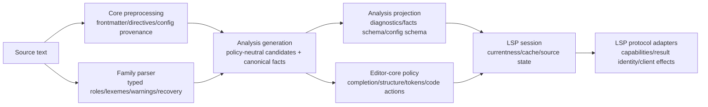
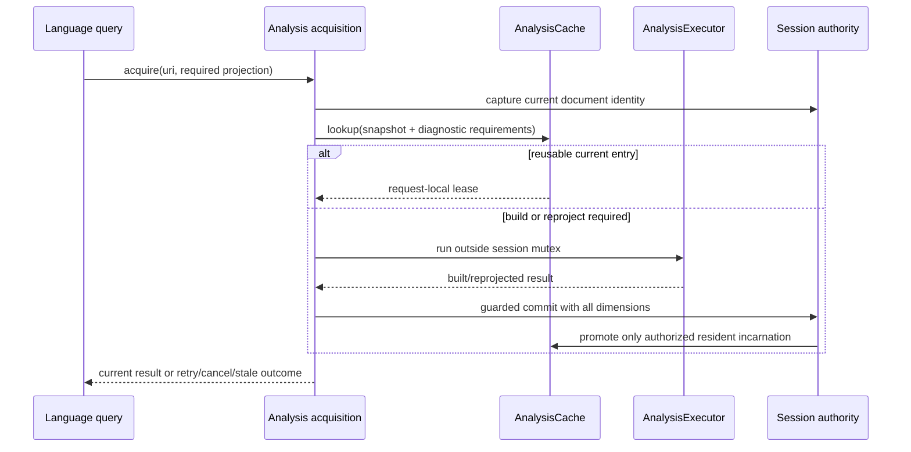
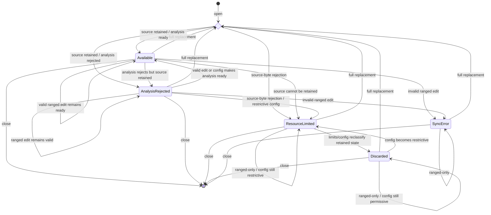
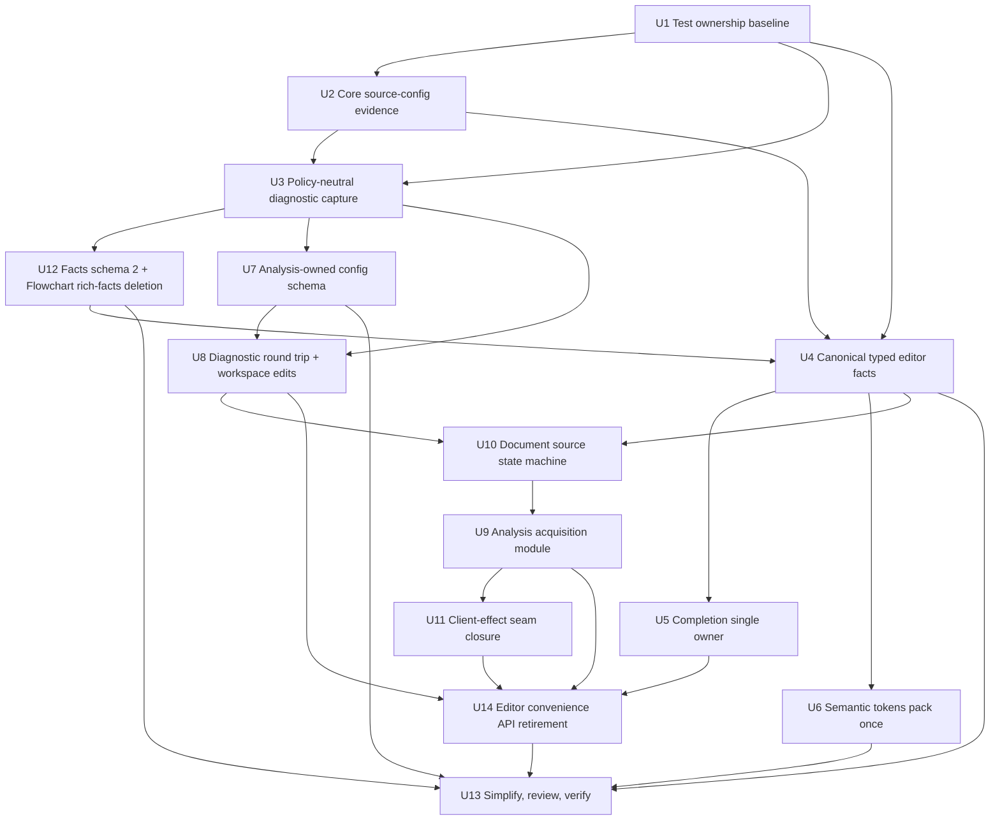

# Analysis and LSP Architecture Convergence - Plan

## Goal Capsule

- **Objective:** Finish the analysis/editor/LSP ownership model by moving grammar and semantic meaning to their existing authoritative modules, deleting duplicate materializations and protocol policy, deepening the remaining session state machines, and deliberately retiring prerelease public surfaces that no longer have a real owner or consumer.
- **Authority:** The maintainer has approved the complete audited scope, deliberate prerelease Rust and facts-wire breaks, deletion without compatibility shims, fearless refactoring in the isolated worktree, and coherent intermediate Conventional Commits.
- **Baseline:** Implement from committed HEAD `f3eab7f71dfade3155642edc79ccbde2654c92e0` on branch `refactor/analysis-lsp-architecture` in `.worktrees/refactor/analysis-lsp-architecture`. The completed analysis-generation, singleflight executor, weighted cache, ordered session admission, adaptive source mapping, and transport hardening work are foundations to preserve, not projects to recreate.
- **Execution profile:** Cross-crate Rust refactor with owner-local characterization, direct deletion of superseded paths, serial Cargo verification, exact public migration notes, and no general-purpose validation framework.
- **Stop conditions:** Stop and redesign any unit that introduces a second frontmatter/directive/body grammar, infers machine semantics from display strings, collapses distinct currentness counters, makes diagnostics-only capture retain rich editor state, serializes independent client-effect lanes, changes Mermaid behavior without pinned-source evidence, or requires a script to understand Rust/grammar semantics instead of calling production owners or the compiler.
- **Tail ownership:** Implementation owns simplification, independent code review, focused and full verification, documentation, and local commits. It does not own push, pull request creation, release preparation, or publishing unless separately requested.

---

## Product Contract

### Summary

Merman will expose one semantic path through each layer:

1. core preprocessing and family parsers own grammar evidence and typed parser facts;
2. analysis owns policy-neutral diagnostics, canonical facts, configuration decoding/schema, and facts-wire projection;
3. editor-core owns completion, structure, code-action, and semantic-token language policy;
4. LSP owns capability negotiation, protocol identity, session currentness, document-source recovery, and client effects without redefining language semantics.

Every superseded mirror, scanner, heuristic, lease/ticket wrapper, public convenience type, and duplicated test proof is deleted when its replacement becomes authoritative. The result favors deep modules with small interfaces over compatibility layers or new framework abstractions.

### Problem Frame

Previous work established the correct large-scale foundations: immutable `AnalysisGeneration`, policy-only diagnostic reprojection, shared editor snapshots, bounded singleflight execution, weighted analysis caching, typed session operations, and hardened admission/currentness. The remaining complexity is now concentrated in seams that still expose or duplicate implementation detail:

- analysis reparses source directives and frontmatter already parsed by core;
- diagnostic producers materialize final diagnostics under a fake strict policy before converting them back into candidates;
- family parser facts are copied into analysis-owned mirror taxonomies and multiple materialized views, with display strings and family names used as machine semantics;
- completion policy is split between analysis and editor-core, while semantic tokens are packed in editor-core and then reinterpreted and packed again in LSP;
- LSP hand-builds analysis configuration schema and guesses deprecation from strings;
- analysis acquisition, document-source state, and client-effect scheduling expose shallow choreography across multiple session modules;
- LSP tests reproduce family semantics and internal transactions instead of testing stable owners;
- Flowchart-only rich facts, `DocumentAnalysisOutcome`, and stateful `DocumentWorkspace` remain public despite lacking a justified production owner.

The refactor must remove these paths without damaging the deep modules and concurrency invariants that recent hardening commits established.

### Requirements

**Core preprocessing and analysis capture**

- R1. Core preprocessing is the sole parser for Mermaid frontmatter delimiters, directives, directive JSON5, frontmatter YAML, global preprocessing comments, and source-backed configuration spans/provenance. Markdown/MDX host-fence extraction remains owned by document analysis and maps fence-local evidence through `SourceMap`. Evidence is captured by the outer pass that first consumes user configuration, survives the current double-preprocessing pipeline, and remains available on preprocessing failure as well as success.
- R2. Core evidence includes directive keyword, source kind, configuration key path, original source span, ordering, and rewrite-safety. It reuses parser-produced spans and shared values without cloning the full source or retaining a second syntax tree. Analysis rules and source-config fixes consume it and map Markdown/MDX fence-local spans through the analysis `SourceMap`; `merman-analysis/src/source_directives.rs`, its grammar tests, and all fallback rescanning are deleted without losing malformed/unterminated-input diagnostics.
- R3. Document and diagram analysis share one internal capture orchestration for dispatch, preflight, source mapping, operation lifetime, and cancellation while retaining distinct low-retention diagnostics-only and rich-generation storage modes.
- R4. Built-in parser warnings remain typed from family/core capture through analysis candidate construction. Only the real custom-parser extension boundary may retain a narrow JSON adapter.
- R5. Diagnostic producers emit policy-neutral meaning plus canonical rule metadata. Remove fake all-enabled strict configuration, final-diagnostic-to-candidate adapters, duplicate rule lookup, and clone-then-overwrite severity materialization.
- R6. Diagnostic-only policy changes reproject an existing generation without reparsing, rebuilding editor facts, or changing generation identity; initial projection and every adapter remain cancellable.

**Canonical parser and editor facts**

- R7. Family parsers express entity, class-definition, outline, payload, reference, token, recovery, and provenance meaning through typed roles. Display `detail` text and family-name strings never determine machine behavior.
- R8. `FenceTextIndex` retains one canonical semantic-item representation. Node/class lookup, references, outline schema output, symbols, and memory weight are derived projections rather than independently sorted, cloned stores.
- R9. Core lexeme kinds, modifier bitsets, failures, and producer provenance cross the in-process seam directly. Delete the analysis mirror lexeme taxonomy and per-lexeme modifier vectors.
- R10. Canonical-fact changes preserve deterministic ordering, source spans, UTF-8/UTF-16 mapping, recovery facts, cancellation, retained-weight correctness, and the distinction between an outline/payload role and an entity role.

**Editor query ownership**

- R11. Editor-core is the only completion-policy owner. Analysis exposes parser/preprocessing evidence, spans, expected syntax, and provenance but no `FenceCursorCompletionKind`, candidate selection, helper list, or editor behavior policy.
- R12. Delete the public `CompletionContext` wrapper and its accessor-heavy test surface. Final completion queries preserve CR, LF, CRLF, EOF insertion, Unicode boundaries, malformed input recovery, and the Flowchart EOF recovery semantics fixed by `048c701aa`.
- R13. The generated token descriptor and editor-core token planner are the sole token legend, negotiated filtering/index projection, range filtering, ordering, overlap, UTF-16, modifier, and five-word packing authority. Client-supported type/modifier subsets are represented as a protocol-neutral planner input; filtering happens before relative deltas are computed, and LSP does not rebuild legend indices or relative encoding.
- R14. LSP retains semantic-token capability negotiation, full/range/delta protocol state, result IDs, stale suppression, and Tower types. Full and range output must be canonical, and delta must compare the already canonical packed representation.

**Configuration, diagnostics, and protocol adapters**

- R15. Analysis owns one explicit typed configuration contract for accepted roots, wrapper exclusion, field constraints, profiles, severities, rule IDs, defaults, compatibility classification, and JSON Schema projection. Runtime decoding and schema/catalog projections consume that contract rather than merely living beside one another; constraints that cannot share one descriptor are named and covered by paired cases from the same corpus.
- R16. Schema and runtime behavior agree for direct versus wrapped roots, mutual exclusion, root permissiveness, nested strictness, unknown fields, removed `parse`, resource descriptors, and rule metadata. LSP and the VS Code manifest consume/project the analysis contract instead of maintaining handwritten semantic copies; the reserved `Strict` profile remains even while it has no profile-exclusive rules.
- R17. Rule descriptors carry explicit protocol-neutral diagnostic tags such as deprecation. LSP deletes rule-id/help-text heuristics and projects only canonical metadata; client-visible `Diagnostic.data` remains limited to server-owned diagnostic identity and document version rather than becoming a metadata/fix trust channel.
- R18. One cohesive diagnostic round-trip module owns server diagnostic identity, version/currentness checks, client-returned diagnostic validation, fix provenance, shared-fix identity, and stale/forged rejection while preserving `merman.lsp.document_sync_lost` as the protocol-owned integrity diagnostic. Its server-side identity binds URI incarnation, document epoch/version, and immutable analysis result identity so close/reopen ABA or a reused client version cannot select a different current fix; client-visible `Diagnostic.data` remains the existing ID/version pair.
- R19. Rename and code actions share one LSP workspace-edit projection for `documentChanges` versus `changes`, URI/range conversion, and client encoding. Protocol adapters remain narrow and do not absorb language semantics.

**LSP session depth**

- R20. One private analysis-acquisition module owns current-snapshot lookup, cache reuse, build, diagnostic reprojection, retry, and guarded commit. Its typed operations preserve request-purpose outcomes: stale/missing push diagnostics suppress output, pull diagnostics retain bounded recomputation before `ContentModified`, and structure/code-action/semantic-token requests retain their current stale-document errors. Delete duplicate preparation, lease, ticket, key-forwarding, and caller-visible promotion choreography that no longer hides independent complexity.
- R21. Document epoch, snapshot generation, diagnostic generation, analysis-job generation/admission claim, cache incarnation, and result identity remain distinct dimensions with their current invalidation semantics; they are never collapsed into one version.
- R22. Expensive work remains outside the session mutex. Stale, cancelled, closed, edited, reconfigured, evicted, superseded, or terminated work cannot repopulate cache, alter recency incorrectly, publish stale push diagnostics, or resurrect an old result. Pull diagnostics retain their current maximum of three bounded recomputations before `ContentModified`, and a stale semantic-token snapshot overrides an earlier planner error or empty result.
- R23. One document-source module owns source retention, analysis availability, ranged-edit eligibility, full-replacement recovery, resource-limit reclassification, synchronization error, discarded state, configuration revision, document epoch, URI-local open tickets, and unavailable-diagnostic projection. Its explicit transition table covers stale versions, empty change sets, invalid/reversed UTF-16 ranges, and a full replacement appearing later in a change batch followed by additional ranged edits.
- R24. Delete `CapturedDocumentSource`, `UnavailableSourceState`, mutation/update mirror enums, converter chains, and server-side variant probing. Preserve the distinction that analysis rejection retains source and allows ranged edits, resource-limited state discards source, a later permissive configuration can only reclassify discarded metadata until a full replacement arrives, and unavailable ranged edits preserve lightweight state while projecting `merman.lsp.document_sync_lost`.
- R25. The `OpenDocumentTracker` absent/present/absent ABA and ticket-drop invariant remains inside the deeper document-source owner.
- R26. One client-effect module owns push diagnostics, republish, log, semantic-token refresh, and diagnostic refresh scheduling. Server callers request domain effects rather than choosing generic keys, booleans, or arbitrary futures.
- R27. Fire-and-forget push/log effects retain their serial/coalescing queue, while semantic-token and diagnostic refresh remain independent response-bearing parallel lanes with existing response routing, timeout, late-response suppression, backpressure, cancellation, panic isolation, socket-close handling, idle, and termination behavior. Do not introduce a general scheduler framework or place both refresh lanes into the serial dispatcher.

**Tests and deliberate public breaks**

- R28. Tests live with the behavior owner. Move unique family/recovery evidence into core/analysis/editor-core, keep only representative LSP seam sentinels, and delete duplicate family matrices, `SessionStateTestExt`, hand-built transaction helpers, and unnecessary production `cfg(test)` escape hatches after replacement coverage exists.
- R29. Remove Flowchart-only rich facts from the public analysis facts contract. Publish facts schema 2 without the Flowchart graph field/types, parse only the envelope needed to reject any non-2 version before typed nested-facts deserialization, update bindings-core, WASM, UniFFI, TypeScript, facade, xtask, public smoke fixtures, and ADRs, and provide no compatibility decoder or alias. Raw JSON parsing remains governed by existing transport/input limits; this unit does not introduce a streaming JSON parser. Delete the now-source-less `merman.internal.flowchart_facts_projection` rule, descriptor, diagnostics, and catalog tests. Diagnostics schema 1 remains unchanged.
- R30. Delete `DocumentAnalysisOutcome` and the stateful `DocumentWorkspace` map/convenience surface. Relocate one-shot document-context construction to an honestly named narrow API, preserve outer cooperative cancellation versus inner resource rejection, keep shared `Arc<str>` input without hidden full cloning, retain Markdown/MDX host-fence analysis, update all Rust/WASM/xtask/facade callers, and provide no deprecated shim.
- R31. Update public Rust exports, compile fixtures, README/rustdoc, migration guide, changelog, facts schema documentation, web public types, and architecture ADRs in the same units as their breaks.
- R32. Verification is behavior- and contract-based: focused owner tests, serial `nextest`, compiler/clippy/doc gates, existing web contract/smoke commands, and simple removed-symbol search. No new script parses Rust names, call graphs, YAML/JSON5, Mermaid, or LSP semantics.
- R33. Mermaid behavior remains source-backed against the pinned `repo-ref/mermaid` baseline. This plan changes ownership and representation, not accepted Mermaid syntax or browser-dependent rendering behavior.

### Acceptance Examples

- AE1. Given nested frontmatter/directive configuration containing comments, block scalars, JSON5 keys, CRLF, overlapping fixes, or malformed/unterminated input, the outer preprocessing pass emits all recoverable source evidence exactly once even when preprocessing fails or an inner pass runs later; analysis maps Markdown fence spans correctly and no analysis scanner runs. Cooperative cancellation returns through the outer control channel and publishes neither a partial preprocessing outcome nor derived analysis state.
- AE2. Given a diagnostic-only rule/severity change, parser invocation count remains zero, `AnalysisGeneration` identity is unchanged, disabled rules disappear, enabled rules receive the requested severity, and cancellation before projection publishes nothing.
- AE3. Given built-in Flowchart, Block, or GitGraph warning facts, source remapping preserves typed warning identity and ranges without a JSON decode/re-encode round trip. A custom parser still works through its documented JSON adapter.
- AE4. Given class definitions whose human-readable detail text changes, completion and symbols remain unchanged because typed roles, not suffix matching, own the meaning.
- AE5. Given semantic items with outline, payload, reference, and entity roles, only the appropriate projections include each item; wire ordering and source ranges remain deterministic without a second stored outline vector.
- AE6. Given incomplete Flowchart at EOF, malformed family syntax, CR/LF/CRLF, and an astral Unicode prefix, completion offers and replacement ranges match the existing final editor behavior while analysis exposes no completion-policy enum.
- AE7. Given a client that supports only a subset or reordered set of semantic token types/modifiers, including a filtered token between two supported tokens on the same line and a range cutting through that line, editor-core filters and repacks the negotiated canonical five-word stream once; LSP full/range output matches it and delta/fallback operates on that stream without a second encoder.
- AE8. Given direct config, one wrapped root, both wrappers, or wrapped plus direct fields, the runtime decoder and published schema consume the same typed contract and agree on acceptance/rejection; every catalog rule/profile/severity appears exactly once in the projected schema and VS Code contract.
- AE9. Given a deprecated diagnostic whose help text and rule ID contain no word `deprecated`, LSP still emits the deprecation tag from explicit metadata. Given a non-deprecated rule containing that word, it does not.
- AE10. Given stale, forged, wrong-version, wrong-range, duplicate, close/reopen ABA, or reused-version client-returned diagnostics, code actions reject them while valid shared fixes preserve snapshot-bound identity and produce the same workspace edits for both supported client encodings.
- AE11. Given a cache hit, cache miss, diagnostic-only reproject, edit during build, eviction during promotion, last-waiter cancellation, close/reopen ABA, or session termination, analysis acquisition returns or commits only the currently authorized result and never resurrects an evicted generation. Push, pull, structure, code-action, and semantic-token callers retain their distinct stale/missing behavior.
- AE12. Given `Available`, `AnalysisRejected`, `ResourceLimited`, `Discarded`, and `SyncError` document states, ranged changes, a later full replacement plus following ranged changes in one batch, configuration reclassification, stale/empty/invalid changes, push/pull diagnostics, and recovery follow the explicit observable transition table through one state-machine owner.
- AE13. Given simultaneous semantic-token and diagnostic refresh requests plus repeated push/republish intent, effects coalesce within their own lanes, the two lanes may run in parallel, termination cancels both, and server code never submits an arbitrary future or scheduler key.
- AE14. Given facts payload schema 1, bindings reject it after reading the envelope version and before typed nested-facts deserialization. Given schema 2, no Flowchart-only rich field, type, projection diagnostic, or catalog rule exists, generic semantic facts remain available, diagnostics payload version remains 1, and Rust/bindings-core/WASM/UniFFI/TypeScript contracts agree.
- AE15. Given an external Rust caller, `DocumentAnalysisOutcome`, `DocumentWorkspace`, and `CompletionContext` no longer compile, while the documented one-shot analysis/query path compiles, preserves distinct resource rejection and cooperative cancellation, avoids cloning shared source text, and analyzes Markdown/MDX through the host fence pipeline without a compatibility alias.

### Success Criteria

- Core is the only frontmatter/directive/source-config grammar owner; the analysis duplicate scanner and mirrored tests are gone.
- Analysis capture produces policy-neutral diagnostics and typed built-in warnings without fake policy or JSON round trips.
- Parser facts cross the in-process seam in typed form with one canonical semantic-item store and no display/family string inference.
- Completion and semantic-token decisions each have one editor-core owner; LSP contains no second token legend or encoder.
- Analysis configuration schema and diagnostic metadata are generated/projected from runtime authorities rather than hand-maintained in LSP.
- LSP acquisition, document-source, and client-effect modules expose domain operations while preserving every currentness, cache, recovery, and lane invariant.
- Duplicate LSP family/transaction test surfaces and production test escape hatches are deleted after owner-level coverage replaces them.
- Facts schema 2, public Rust API deletions, TypeScript/WASM mirrors, migration docs, and compile fixtures agree with no compatibility shim.
- All focused and broad verification passes serially, and independent review reports no unresolved P0/P1 correctness, concurrency, API, or maintainability finding.

### Scope Boundaries

**In scope**

- `merman-core`, `merman-analysis`, `merman-editor-core`, `merman-lsp`, `merman-wasm`, the `merman` facade, relevant xtask callers, web public types/contracts, focused tests, migration docs, changelog, and ADR updates required by R1-R33.
- Direct deletion or renaming of prerelease Rust APIs and facts schema 1 as explicitly authorized.
- Coherent intermediate commits after each independently verified implementation cluster.

**Deferred**

- New editor features, new analysis rules, workspace-wide indexing, cross-document symbol search, cache telemetry/tuning, or public session configuration.
- General-purpose parser-fact framework extraction beyond the typed roles needed by current family owners.
- General-purpose effect scheduler or actor framework.
- Further wire-schema cleanup unrelated to the Flowchart-only facts removal.

**Outside this change**

- Mermaid layout/render/SVG parity, browser text measurement, FFI redesign, CLI UX, release automation, dependency upgrades, or unrelated performance work.
- Replacing `AnalysisGeneration`, `AnalysisExecutor`, `AnalysisCache`/`WeightedLru`, `SourceMap`, `SessionLifecycle`, `InputOrder`, `AdmissionCancellationRegistry`, token planner, or the LSP protocol adapters that pass the deletion test.
- Push, pull request creation, release publication, or adding Compound Engineering badges.

---

## Planning Contract

### Assumptions

- The dedicated worktree is clean at the recorded baseline and is the only checkout modified by implementation. The primary checkout's unrelated changes remain untouched.
- The maintainer's “all findings are approved” instruction settles the audited scope, including the facts-wire break and removal of the three public convenience surfaces; implementation details may still be simplified when they preserve R1-R33.
- Execution is serial even when subagents are used because units overlap shared Rust contracts and the machine may host other Cargo jobs.
- Repository code, ADRs, committed history, existing tests, and pinned Mermaid source are load-bearing evidence. No external technology choice requires web research.
- The facts wire break is intentionally limited to `AnalysisFactsPayload` schema 2. Diagnostics payload schema 1 and unrelated serialized names remain stable.
- Exact public replacement function/type names may be chosen during the owning unit after caller review, but the replacement must be one-shot, narrow, and must not recreate a stateful document map.
- Test or differential-oracle code may temporarily compare old and new paths inside the owning crate, but the old production path and temporary oracle are deleted before the unit completes.

### Key Technical Decisions

- KTD1. **Execute the complete audited convergence, not a subset.** (session-settled: user-approved — chosen over landing only the smallest semantic-token or public-API cleanups: the maintainer explicitly approved every audited item.) Sequence the work by ownership dependency so the breadth does not create simultaneous dual authorities.
- KTD2. **Deepen existing owners rather than rewrite stable foundations.** `AnalysisGeneration`, `AnalysisExecutor`, `AnalysisCache`/`WeightedLru`, `SourceMap`, `LanguageSession`, ordered admission, and lifecycle guards remain. This plan deletes the shallow choreography around them.
- KTD3. **Follow the semantic owner chain.** Global preprocessing and family parsers produce source-backed typed facts; analysis captures/projects them; editor-core chooses editor behavior; LSP projects protocol types. A downstream layer never compensates for a missing upstream fact with raw-text or display-string inference.
- KTD4. **Make diagnostic candidates the construction model.** Producers provide rule identity, meaning, spans, metadata, and fixes without policy. Projection is the only place that applies enabled state and severity, so policy changes cannot require a parse or diagnostic reconstruction.
- KTD5. **Use one canonical typed fact graph in process.** Family-owned roles and core lexeme types survive until the real editor projection. Secondary views are computed at the boundary that needs them rather than stored and independently sorted.
- KTD6. **Let editor-core own completion policy.** Analysis may expose exact preprocessing slots, family expected syntax, recovery facts, spans, and provenance, but it cannot name completion offer categories or duplicate candidate lists.
- KTD7. **Negotiate then pack once in editor-core.** LSP supplies the supported token capability profile; the existing planner/descriptor chooses canonical indices, filters, sorts, validates, and packs. LSP owns result lifecycle only.
- KTD8. **Project configuration and diagnostic metadata from analysis authorities.** One typed analysis contract describes configuration roots, exclusions, constraints, defaults, rule metadata, and compatibility classification. Runtime decoding, JSON Schema, the rule catalog, LSP, and VS Code are projections or adapters of that contract; any deliberately non-shared constraint is explicit and tested from the common corpus.
- KTD9. **Model analysis acquisition as purpose-typed guarded operations, not one error or one version.** Consolidate lookup/build/reproject/commit control flow while preserving each currentness dimension, the existing cache-incarnation/admission-authority rules, and the different stale/missing outcomes required by push diagnostics, pull diagnostics, and interactive language queries.
- KTD10. **Model document source as retention × analysis availability × synchronization capability.** One deep state machine owns transitions and observable unavailability; the server requests outcomes rather than probing variants.
- KTD11. **Present one domain-facing client-effects subsystem without replacing the proven schedulers.** Domain-specific operations hide server-selected keys/futures/booleans, while the existing latest-wins dispatcher and response-bearing refresh machinery remain deep private collaborators. Semantic-token and diagnostic refresh keep separate lanes.
- KTD12. **Break and delete cleanly.** (session-settled: user-approved — chosen over deprecated aliases, dual facts decoders, or compatibility shims: the repository is prerelease and the maintainer explicitly authorized breaking deletion.) Facts schema 1, Flowchart-only rich facts, `DocumentAnalysisOutcome`, stateful `DocumentWorkspace`, and public `CompletionContext` are removed with exact migration evidence.
- KTD13. **Treat interfaces as the test surface.** Family semantics are proved by family/analysis/editor tests, deep session modules by focused interfaces, and cross-layer behavior by `LanguageSession`/protocol sentinels. Tests do not reproduce private transactions.
- KTD14. **Keep verification proportionate and serial.** (session-settled: user-directed — chosen over expanding xtask/static-analysis scripts: the maintainer requested correctness without scripts exceeding their legitimate capability.) Use the compiler and production owners as authorities, run Cargo serially, and commit only plan-owned files.

### High-Level Technical Design

The diagrams describe ownership and state, not exact Rust signatures.

### Document Source Transition Contract

| Current state/input | Transition or observable outcome | Retention and recovery invariant |
| --- | --- | --- |
| `Available` + analysis rejection that is not a source-byte limit | `AnalysisRejected` | Retain `Arc<str>` and allow later ranged edits/reanalysis. |
| `Available`/`AnalysisRejected` + source-byte rejection | `ResourceLimited` | Discard source text, retain canonical size/limit/span metadata, require a future full replacement. |
| `ResourceLimited` + configuration still below source size | `ResourceLimited` | Update current limit metadata only; do not invent source text. |
| `ResourceLimited` + configuration now permits the old size | `Discarded` | Record that the old source would fit but is gone; still require a full replacement. |
| `Discarded` + configuration becomes restrictive again | `ResourceLimited` | Reclassify metadata without pretending analysis can resume. |
| Any unavailable state + ranged-only batch | Corresponding sync-loss outcome | Keep lightweight unavailable state and project `merman.lsp.document_sync_lost`; do not apply a guessed edit. |
| Any retained/unavailable state + batch containing a later full replacement | Analyze from the last full replacement, then apply following ranged edits | Earlier batch entries are superseded; invalid following ranges produce `SyncError`. |
| `Available`/`AnalysisRejected` + invalid or reversed UTF-16 range | `SyncError(InvalidIncrementalRange)` | Stop trusting retained source and require full replacement. |
| Any present state + stale version | No mutation | Return the existing stale-version outcome without changing epoch/source/cache. |
| Any present state + empty change set | No mutation | Return the existing empty-change outcome without changing epoch/source/cache. |
| Any state + valid full replacement within limits | `Available` or `AnalysisRejected` after preflight | Advance document identity exactly once, invalidate old analysis, and retain the replacement text when allowed. |
| Open/close/reopen with an in-flight ticket | Commit only if URI revision, configuration revision, and expected document epoch remain current | Preserve absent→present→absent ABA and ticket-drop cleanup. |

### System-Wide Impact

| Surface | New owner or deletion | Preserved invariant |
| --- | --- | --- |
| Core preprocessing | Source-backed frontmatter/directive/config evidence; typed built-in warning retention | Pinned Mermaid preprocessing behavior and spans |
| Analysis generation | Policy-neutral candidates, shared capture orchestration, canonical facts | Diagnostics-only low retention, cancellation, generation identity |
| Analysis public facts | Schema 2 without Flowchart-only rich facts | Generic node/reference/semantic facts and deterministic wire projection |
| Editor-core | Completion policy and negotiated token packing | Query behavior, UTF-16 ranges, token ordering/overlap |
| LSP protocol | Capability/result lifecycle and one workspace-edit adapter | Full/range/delta, stale protection, client encoding |
| LSP session | Deep acquisition, document-source, and client-effect modules | Singleflight, weighted cache, multi-dimensional currentness, push/pull differences |
| WASM/web/facade | Migrate to final facts and one-shot editor analysis APIs | Existing product behavior except explicit prerelease breaks |
| Tests/docs | Owner-local evidence and exact migration | No hidden dual path or script-owned semantics |

### Risks And Mitigations

| Risk | Severity | Mitigation |
| --- | --- | --- |
| Core source evidence misses an edge case handled by the duplicate scanner | High | Establish owner-local nested/comment/block-scalar/CRLF/range/fix characterization before deletion; compare temporarily, then remove old scanner |
| Core evidence inflates the shared parse/render path | High | Reuse parser-produced spans and shared values, retain no second tree or full-source copy, account evidence in retained weight, and assert bounded growth at representative/configured-limit inputs; if the compact representation still regresses the hot path materially, make evidence collection request-scoped while preserving the single core grammar |
| Shared capture orchestration forces rich allocation into diagnostics-only analysis | High | Make retention mode an explicit internal input and test retained fields/parse counts for both modes |
| Typed-role migration accidentally promotes payload/outline facts into entities | High | Table-driven role matrix across representative families and wire/query projections |
| Completion consolidation regresses EOF or Unicode replacement ranges | High | Preserve final-query characterization including malformed input and `048c701aa` recovery cases |
| Token consolidation ignores client subsets or changes delta identity | Critical | Pass negotiated capability profile into the planner and compare canonical full/range/delta streams for subset/reordered legends |
| Schema projection and runtime decoder drift | High | Make both consume the typed analysis configuration contract, validate one accepted/rejected corpus with a standard Draft 2020-12 validator, and explicitly pair-test any constraint that cannot share a descriptor |
| Diagnostic round-trip cleanup weakens forged/stale protection | Critical | Keep client-returned identity/version/range tests and shared-fix pointer identity at the cohesive adapter boundary |
| Acquisition consolidation reintroduces ABA or cache resurrection | Critical | Preserve cache incarnation and admission authority; deterministic barriers/oneshots around eviction, promotion, close, edit, and cancellation |
| Document-state consolidation loses source-retention or recovery distinctions | Critical | Table-driven transition matrix for all states, ranged/full edits, config reclassification, and push/pull diagnostics |
| Client-effect seam cleanup replaces recently hardened schedulers or serializes refresh lanes | High | Keep the latest-wins dispatcher and response-bearing refresh machinery as private deep collaborators; change only domain-facing ownership, preserve separate lane tests, and reject a generic scheduler |
| Facts schema/public API break leaves a stale consumer | High | External-style compile fixtures, WASM/web build and smoke, simple removed-symbol audit, migration table, ADR/changelog updates |
| Large shared diff hides incidental complexity | Medium | Serial dependency units, simplification after each cluster, focused commits, independent full-diff review |

### Alternatives Considered

- **Keep the analysis source scanner as a safety oracle:** rejected because it remains a second grammar and guarantees future drift. A temporary owner-local differential test is acceptable only until core evidence is complete.
- **Move all raw completion grammar into editor-core unchanged:** rejected because it would relocate duplication rather than preserve the distinction between preprocessing/family facts and editor policy.
- **Let LSP continue repacking for client subsets:** rejected because capability negotiation can be passed to the canonical planner; a second legend/encoder violates the existing ownership ADR.
- **Generate schema by scanning Rust source or tests:** rejected because the runtime decoder and rule catalog can project their own contract directly; source scanning would create another partial compiler.
- **Collapse all session stamps into one revision:** rejected because document, snapshot, diagnostic, job, cache-incarnation, and result identities invalidate different operations.
- **Inline `WeightedLru`, `AnalysisExecutor`, or `OpenDocumentTracker` because they have few callers:** rejected by the deletion test; each hides independent correctness and would spread invariants into session callers.
- **Create a generic async effect scheduler:** rejected because the current effects have domain-specific coalescing and two intentionally parallel refresh lanes.
- **Retain facts schema 1 or Rust aliases for migration:** rejected by the maintainer-approved prerelease breaking policy; exact migration documentation and compile evidence replace compatibility code.
- **Delete only tests to reduce line count:** rejected. Unique evidence moves to the behavior owner before duplicate LSP or white-box transaction tests are removed.

### Sources And Research

- `docs/adr/0070-diagnostics-first-analysis-contract.md` — policy-neutral generation, projection, JSON and diagnostic ownership.
- `docs/adr/0071-editor-parser-semantic-seam.md` — preprocessing/family/editor/LSP ownership, token packing, session currentness, and cache contracts.
- `docs/adr/0072-lint-rule-governance.md` — rule catalog and LSP projection governance.
- `docs/adr/0073-family-owned-diagram-architecture.md` — typed family facts, recovery, and schema boundaries.
- `docs/plans/2026-07-29-002-refactor-analysis-lsp-generation-session-plan.md` and `docs/plans/2026-08-02-002-refactor-analysis-lsp-residual-hardening-plan.md` — completed foundations and historical non-regression constraints.
- `crates/merman-core/src/preprocess/{mod.rs,source_edit_map.rs}`, `editor.rs`, `family.rs`, `parse_pipeline.rs`, and family parsers — current grammar/fact authorities, original-coordinate mapping, and warning round trip.
- `crates/merman-analysis/src/{source_directives.rs,diagnostic_projection.rs,rules.rs,analyzer.rs,document.rs,editor.rs,editor/core_facts.rs,options_json.rs,result.rs}` — duplicate grammar, policy, facts, schema, and public-wire seams.
- `crates/merman-editor-core/src/{context.rs,completion.rs,token_planner.rs,structure.rs,diagnostics.rs,workspace.rs}` — editor policy, token, structure, diagnostic, and public convenience surfaces.
- `crates/merman-lsp/src/{client_profile.rs,semantic_tokens.rs,protocol.rs,diagnostics.rs,code_actions.rs,structure.rs,server.rs}` and `session/**` — protocol duplication, round trip, acquisition, document state, tests, and client-effect seams.
- `crates/merman-bindings-core`, `crates/merman-uniffi`, `platforms/web/src/public-types.ts`, `platforms/web/scripts/smoke.mjs`, WASM adapters, facade exports, xtask descriptor callers, and migration documentation — public consumers requiring deliberate migration.
- Repository-history review of cancellation propagation, cache resurrection/promotion ABA, and deferred control admission fixes (`834a10f8b`, `284fd651a`, `b0dfa8314`, `7ae50bbc4`).
- Independent analysis-core, editor-core, LSP-feature, LSP-session, repository-pattern, institutional-learning, and specification-flow audits performed for this plan.

---

## Implementation Units

### Unit Index

| Unit | Priority | Outcome |
| --- | --- | --- |
| U1 | P0 | Re-anchor characterization and test ownership before production seams move |
| U2 | P0 | Core owns source-config evidence; analysis duplicate scanner is deleted |
| U3 | P0 | Diagnostic capture is policy-neutral and typed with shared orchestration |
| U12 | P0 | Facts schema 2 removes Flowchart-only rich facts across every binding |
| U4 | P0 | One canonical typed parser/editor fact representation remains |
| U5 | P1 | Completion has one editor-core policy owner |
| U6 | P1 | Semantic tokens are negotiated and packed once |
| U7 | P1 | Analysis owns runtime configuration schema and catalog projection |
| U8 | P1 | Diagnostic/code-action round trip and workspace edits have cohesive adapters |
| U10 | P2 | LSP document source is one explicit state machine |
| U9 | P2 | LSP analysis acquisition is one guarded deep module |
| U11 | P2 | LSP client-effect server seams close around proven private schedulers |
| U14 | P3 | Obsolete public editor workspace/outcome surfaces are removed with migration |
| U13 | P3 | Final simplification, independent review, serial verification, and clean commits |

Execution follows dependency order rather than numeric order. U-IDs are stable references: run U12 before U4, and U10 before U9.

### U1. Re-Anchor Characterization And Test Ownership

- **Priority:** P0 refactor safety and locality.
- **Dependencies:** None.
- **Primary files:**
  - `crates/merman-analysis/src/editor/tests.rs`
  - `crates/merman-analysis/tests/analyzer.rs`
  - `crates/merman-editor-core/tests/{completion.rs,semantic_facts.rs,token_planner.rs}`
  - `crates/merman-lsp/src/session/{analysis_tests.rs,documents_tests.rs}`
  - focused core family/preprocessing tests touched by unique cases
- **Approach:**
  1. Inventory the LSP family matrix and transaction helpers against owning core/analysis/editor/session tests; identify genuinely unique recovery, role, range, or provenance evidence without performing a wholesale test move before APIs change.
  2. Add compact table-driven characterization for source-config spans/fixes, final completion behavior, token subset packing, diagnostic metadata/round trip, document-source transitions, and acquisition currentness where an owning test does not already exist.
  3. Establish a small representative LSP seam set for identity/range/provenance/capability/currentness. Each later owning unit moves its unique evidence and deletes the corresponding duplicated LSP proof in the same change, avoiding two rounds of test churn.
  4. Do not delete transaction escape hatches yet if U9/U10 still need them; record each remaining helper against the unit that removes it so U13 can verify none survive accidentally.
- **Test scenarios:**
  - representative successful/recovery facts for Flowchart, Sequence, State/Class/ER, Gantt, and Mindmap remain covered by their owner;
  - LSP sentinels prove cached/session projection preserves URI, range, role, and provenance without re-proving every family;
  - characterization includes CR/LF/CRLF, EOF, Unicode, cancellation, stale version, and source-retention branches relevant to later units.
- **Definition of done:** Every later refactor has a stable owner-level observable contract and a clear per-unit test-migration map; only duplication whose owner coverage is already complete is deleted here, and no new global oracle or script is introduced.

### U2. Move Source-Config Evidence Into Core Preprocessing And Delete The Second Grammar

- **Priority:** P0 semantic ownership and largest deletion.
- **Dependencies:** U1.
- **Primary files:**
  - `crates/merman-core/src/preprocess/mod.rs`
  - `crates/merman-core/src/preprocess/source_edit_map.rs`
  - `crates/merman-core/src/parse_pipeline.rs`
  - `crates/merman-analysis/src/source_directives.rs` (delete)
  - `crates/merman-analysis/src/rules.rs`
  - `crates/merman-analysis/src/source_config_rewrite.rs`
  - related preprocessing/rule/fix tests
- **Approach:**
  1. Follow the existing `PreprocessedSource`/`source_edit_map` original-coordinate pattern. Capture typed frontmatter/directive boundaries, source-backed config paths/values, keyword/config spans, source kind, ordering, and rewrite-safety in the outer pass that first consumes user configuration.
  2. Introduce an operation-owned preprocessing capture outcome. The outer `ParseControlResult` remains the sole cooperative-cancellation channel; the inner outcome carries outer-pass source-config evidence plus either the successful preprocessed source or the Mermaid preprocessing error. Cancellation publishes no partial outcome.
  3. Preserve that outcome through the current outer/inner preprocessing sequence and closed parse handoff, so malformed or unterminated configuration keeps its current analysis diagnostics without giving analysis a parser. Do not delete the analysis scanner until both success and error paths consume the new handoff.
  4. Preserve one grammar implementation for YAML/JSON5 and existing size/cancellation limits. Represent evidence with parser-produced spans, compact indexes, and shared values; retain no second syntax tree or full-source clone, account its retained weight, and make collection request-scoped only if the compact always-on form materially regresses the shared parse/render path.
  5. Migrate lint and rewrite consumers to core evidence, keeping bounded materialization/edit/output policy in `source_config_rewrite.rs` and mapping Markdown/MDX fence-local spans through the host `SourceMap`.
  6. Delete `source_directives.rs`, all analysis YAML/JSON5 scanning helpers, fallback rescans, duplicate consistency tests, and module exports.
- **Test scenarios:**
  - nested mappings/objects, comments, quoted keys, block scalars, malformed/unterminated input, repeated directives, double preprocessing, CRLF/UTF-8, and cancellation produce the expected outer-source spans and rule/fix output;
  - fix ordering and non-overlap remain stable when frontmatter and directives coexist;
  - parser/capture instrumentation proves one source-config parse and no analysis rescan;
  - preprocessing errors retain evidence in the inner outcome, cooperative cancellation returns only through the outer channel, and neither path leaks partial analysis state;
  - retained-weight and configured-limit cases prove evidence grows with the number of source-config facts without copying the complete input or retaining a second tree.
- **Definition of done:** Core preprocessing is the only source-config grammar, the failure/cancellation handoff is explicit, evidence has bounded ownership cost, all analysis consumers use typed evidence, and the roughly 1.8K-line duplicate module is gone rather than relocated.

### U3. Make Diagnostic Capture Policy-Neutral And Keep Built-In Warnings Typed

- **Priority:** P0 analysis-generation integrity.
- **Dependencies:** U1, U2.
- **Primary files:**
  - `crates/merman-analysis/src/{diagnostic_projection.rs,rules.rs,analyzer.rs,document.rs}`
  - `crates/merman-core/src/diagram/mod.rs`
  - `crates/merman-core/src/family.rs`
  - `crates/merman-core/src/parse_pipeline.rs`
  - warning-producing family modules and analysis compatibility tests
- **Approach:**
  1. Extend `CombinedSemanticParse`/`DiagramParseSnapshot` with operation-owned typed built-in warning facts, remap them once in core, and preserve only the narrow custom-parser JSON adapter.
  2. Redesign candidate construction around rule identity, canonical metadata, meaning, source ranges, related information, tags, and fix provenance before policy is applied.
  3. Make projection the only enabled/severity materialization step; remove `capture_rule_config`, `candidates_from_diagnostics`, duplicate registry lookups, and clone/overwrite severity paths.
  4. Consolidate document/diagram dispatch, preflight, source-map, operation, and cancellation orchestration while keeping rich and diagnostics-only retention explicit.
- **Test scenarios:**
  - recommended/strict/custom rule profiles enable, disable, and override severity without parsing again;
  - initial and reprojected diagnostics are structurally equal where policy is equal and preserve fix/shared identity;
  - built-in warnings remap typed ranges correctly; malformed custom JSON is handled only at the extension adapter;
  - diagnostics-only capture does not retain editor-only facts and cancellation at capture/projection boundaries publishes nothing.
- **Definition of done:** No diagnostic producer needs policy, no built-in warning traverses JSON internally, capture orchestration has one control flow per source kind/storage mode, and generation/reprojection contracts remain intact.

### U4. Converge On Canonical Typed Editor Facts

- **Priority:** P0 foundation for completion, tokens, and public facts.
- **Dependencies:** U1, U2, U12.
- **Primary files:**
  - `crates/merman-core/src/editor.rs`
  - affected `crates/merman-core/src/diagrams/**` fact producers
  - `crates/merman-analysis/src/editor.rs`
  - `crates/merman-analysis/src/editor/core_facts.rs`
  - `crates/merman-analysis/src/result.rs`
  - `crates/merman-editor-core/src/{structure.rs,token_planner.rs,completion.rs}`
- **Approach:**
  1. Add/normalize typed family roles required for entity/class/outline/payload/reference semantics and remove `detail` suffix and family-name switches from consumers.
  2. Retain one canonical semantic-item collection with deterministic ordering. Derive node/class lookup and outline/wire views at their consumption boundaries.
  3. Delete in-process `FenceLineItem`/`outline_items` materialization, duplicate sorting, duplicate retained-weight accounting, and public accessors that expose the redundant view.
  4. Pass core lexeme kind/modifier bitset/failure/provenance through the closed analysis snapshot; delete analysis mirror enums, mapping functions, and per-token modifier allocation.
  5. Consume the schema-2 boundary established by U12; canonical generic projections must not recreate the removed Flowchart-only graph or its internal diagnostic rule.
  6. Move and then delete the corresponding family-semantic LSP tests as each role/lexeme behavior becomes owner-tested; retain only the representative session projection sentinels established by U1.
- **Test scenarios:**
  - changing human-readable detail strings does not change class/entity completion or symbol kinds;
  - role matrices preserve payload-only, outline-only, entity, class, reference, and recovery semantics across representative families;
  - outline and semantic wire ordering remain deterministic while retained in-process weight drops;
  - token planner receives producer provenance and bitsets without analysis mirror allocation.
- **Definition of done:** Machine meaning is typed and family-owned, one semantic-item store feeds all projections, core lexeme types survive to token planning, and the mirror taxonomies/views are deleted.

### U5. Make Editor-Core The Single Completion Policy Owner

- **Priority:** P1 editor architecture and public API cleanup.
- **Dependencies:** U4.
- **Primary files:**
  - `crates/merman-analysis/src/editor.rs` and tests
  - `crates/merman-editor-core/src/{context.rs,completion.rs,lib.rs}` and completion tests
  - `crates/merman-lsp/src/{completion.rs,server.rs}`
  - WASM/facade callers if they expose the context
- **Approach:**
  1. Reduce analysis cursor evidence to source position, preprocessing slots, family expected syntax/recovery facts, prefix spans, and provenance.
  2. Move all offer/category/list/edit-range policy into the final editor-core completion query, using typed evidence rather than a second body grammar.
  3. Delete `FenceCursorCompletionKind`, analysis candidate mappings/helper lists, public `CompletionContext`, shallow boolean/accessor wrappers, duplicate directive/helper lists, and tests of intermediate policy.
  4. Keep LSP completion as a Tower/snippet/markdown/client-capability adapter; align trigger characters with the one editor policy without duplicating semantic lists.
  5. Replace intermediate-context tests with final completion-query tests and delete the related LSP/internal policy duplication only after final behavior is covered.
- **Test scenarios:**
  - headers, directives, frontmatter, node/class/style/interaction/helper/operator positions retain current final offers;
  - EOF and malformed/recovery inputs do not guess unsupported body semantics;
  - CR/LF/CRLF, empty insertion ranges, astral Unicode, snippets, and markdown/plaintext clients preserve output;
  - old public context symbols fail external compile fixtures.
- **Definition of done:** There is one completion decision point in editor-core, analysis exposes evidence only, and no public/intermediate completion context survives.

### U6. Negotiate And Pack Semantic Tokens Once

- **Priority:** P1 explicit ADR conformance.
- **Dependencies:** U4.
- **Primary files:**
  - `crates/merman-editor-core/src/{token_planner.rs,generated/token_descriptor.rs}`
  - `crates/merman-editor-core/tests/token_planner.rs`
  - `crates/merman-lsp/src/{client_profile.rs,semantic_tokens.rs}` and tests
  - token equivalence fixtures and WASM editor-token adapters
- **Approach:**
  1. Represent the negotiated supported token type/modifier profile as an input to the canonical planner/descriptor without exposing LSP protocol types to editor-core.
  2. Perform client type/modifier filtering and range filtering before canonical negotiated index selection and relative delta computation; then apply modifier masking, sorting, overlap resolution, UTF-16 splitting, validation, and five-word packing exactly once in editor-core.
  3. Make LSP project the packed words into Tower token values and retain only full/range/delta/result-ID lifecycle.
  4. Delete LSP legend-index remapping, modifier rebuilding, relative encoder, and equivalence tests whose only purpose was proving the two encoders matched.
- **Test scenarios:**
  - full canonical legend, subsets, reordered client declarations, unsupported modifiers, a dropped middle token on the same line, multiline Unicode, overlap, range boundaries, and empty output produce valid canonical streams;
  - full and range return planner output exactly; delta round-trips additions/removals, fallback-to-full, and stale result IDs correctly;
  - WASM/canonical descriptor equivalence remains intact without LSP semantic ownership.
- **Definition of done:** One generated descriptor/planner owns all semantic-token semantics and packing, while LSP owns only negotiation input and protocol/result lifecycle.

### U7. Make Analysis The Configuration Schema Authority

- **Priority:** P1 runtime/schema correctness.
- **Dependencies:** U3.
- **Primary files:**
  - `Cargo.toml` and `crates/merman-analysis/Cargo.toml` for the test-only schema validator
  - `crates/merman-analysis/src/{options_json.rs,rules.rs,lib.rs}`
  - `crates/merman-lsp/src/{protocol.rs,server.rs}`
  - VS Code configuration/schema manifests and contract tests
  - related README/ADR text
- **Approach:**
  1. Define one typed, machine-readable analysis contract for root selection, direct/wrapped mutual exclusion, accepted fields, nested constraints, defaults, profiles, severities, rule IDs, and compatibility classification. Runtime decoding and JSON Schema/catalog projection consume this contract instead of maintaining adjacent hand-built definitions.
  2. Preserve root-forward-compatible versus nested-strict decoding and diagnostic-only versus snapshot-affecting change classification. Name any constraint that cannot be expressed by the shared descriptor and drive both sides from paired cases in the common corpus.
  3. Replace the handwritten LSP schema with a transport projection of the analysis-owned accepted shape plus host-specific defaults/descriptions only; host defaults never redefine acceptance.
  4. Add a workspace-pinned, test-only standard JSON Schema validator with Draft 2020-12 support for the shared accepted/rejected corpus. Do not implement a schema evaluator in production code or scripts.
  5. Delete duplicated date/profile/severity/rule/root shape definitions from `protocol.rs` and align VS Code manifest generation/contract checks.
- **Test scenarios:**
  - one accepted/rejected corpus covers direct, `merman`, `analysis`, both wrappers, mixed direct/wrapped, removed `parse` in direct/wrapped forms, root/lint forward compatibility, strict resource nesting, dates, profiles, severities, resource descriptors, and rule overrides;
  - runtime decoder and schema validator agree for every corpus case;
  - custom schema method and VS Code contract contain every rule exactly once and classify changes correctly.
- **Definition of done:** Runtime decoding and published configuration schema consume the same typed analysis contract, explicitly paired residual constraints pass the standard validator corpus, and LSP contains no independent analysis schema.

### U8. Deepen Diagnostic Round Trip And Share Workspace-Edit Projection

- **Priority:** P1 protocol integrity and locality.
- **Dependencies:** U3, U7.
- **Primary files:**
  - `crates/merman-analysis/src/{rules.rs,result.rs}`
  - `crates/merman-editor-core/src/{diagnostics.rs,code_actions.rs}`
  - `crates/merman-lsp/src/{diagnostics.rs,diagnostics_tests.rs,code_actions.rs,structure.rs,protocol.rs,server.rs}`
- **Approach:**
  1. Add explicit rule tags/metadata in the analysis catalog and carry them through analysis/editor DTOs.
  2. Consolidate LSP diagnostic serialization, identity data, snapshot/version checks, client-return validation, fix lookup, and shared-fix dedup into one cohesive round-trip owner. Bind each server-side diagnostic record to URI incarnation, document epoch/version, immutable analysis result identity, canonical range/code/message, and fix provenance. Keep `Diagnostic.data` limited to server diagnostic ID and document version; tags and fixes remain server-owned projections.
  3. Delete deprecation string heuristics and repeated payload-to-editor reconstruction where the round-trip owner can retain/request the canonical index safely.
  4. Extract one internal workspace-edit protocol adapter used by rename and code actions; keep language edit planning in editor-core.
- **Test scenarios:**
  - explicit deprecated/non-deprecated metadata projects correctly independent of strings;
  - stale, forged, wrong-version, wrong-code/message/range, duplicate, close/reopen ABA, reused-version, and valid diagnostics follow the current security/integrity contract;
  - shared fix identity deduplicates without accepting client-authored edits;
  - rename and code actions match for both `documentChanges` and `changes` clients;
  - `merman.lsp.document_sync_lost` remains protocol-owned and available.
- **Definition of done:** One LSP round-trip module owns diagnostic identity/fix provenance, one workspace-edit adapter serves both callers, and no string heuristic or duplicate encoder remains.

### U9. Deepen LSP Analysis Acquisition And Delete Transaction Choreography

- **Priority:** P2 concurrency/currentness architecture.
- **Dependencies:** U4, U8, U10.
- **Primary files:**
  - `crates/merman-lsp/src/session/analysis.rs`
  - `crates/merman-lsp/src/session/analysis/{request.rs,executor.rs}`
  - `crates/merman-lsp/src/session/documents/analysis_state.rs`
  - `crates/merman-lsp/src/session/{analysis_cache.rs,analysis_tests.rs,documents_tests.rs}`
  - `crates/merman-lsp/src/snapshot.rs`
- **Approach:**
  1. Introduce purpose-typed private acquisition operations for current snapshot, current complete analysis, push diagnostic projection, and pull diagnostic projection rather than one generic acquisition error/result.
  2. Move lookup, build/reproject selection, retry, request-local leasing, cache promotion, and guarded commit behind that interface while keeping executor and weighted cache as deep collaborators.
  3. Preserve separate document epoch, snapshot generation, diagnostic generation, job/admission claim, cache incarnation, snapshot/result identity, silent stale push suppression, three-attempt pull recomputation, interactive `ContentModified`, and stale-over-planner-error precedence.
  4. Delete redundant `AnalysisPreparation`, snapshot/cache lease overlap, diagnostic projection tickets/keys, forwarding structs, impossible output-mismatch branches made unnecessary by operation typing, and caller-visible promotion logic.
  5. Replace white-box transaction tests with focused acquisition/cache/executor tests plus `LanguageSession` behavior; delete `SessionStateTestExt`, manual commit helpers, and obsolete test accessors owned by this unit.
- **Test scenarios:**
  - cache hit/miss, build singleflight, diagnostic reprojection, three-attempt pull retry, stale push suppression, interactive `ContentModified`, stale semantic-token precedence, and cancellation preserve parse counts and result identity;
  - edit/close/reopen/configuration/eviction between start and commit cannot publish or repopulate stale work;
  - eviction during promotion cannot resurrect an entry or corrupt recency/multi-victim accounting;
  - request-local handles remain usable after eviction but have no write-back authority;
  - expensive work never holds the session mutex.
- **Definition of done:** Language features acquire current analysis through one deep operation owner, all currentness dimensions remain explicit internally, and shallow transaction wrappers/test escape hatches are gone.

### U10. Consolidate Document Source Into One Recovery State Machine

- **Priority:** P2 document integrity.
- **Dependencies:** U4, U8.
- **Primary files:**
  - `crates/merman-lsp/src/session/documents.rs`
  - `crates/merman-lsp/src/session/documents/{analysis_state.rs,configuration.rs}`
  - `crates/merman-lsp/src/session/documents_tests.rs`
  - `crates/merman-lsp/src/{server.rs,diagnostics.rs}`
- **Approach:**
  1. Encode the `Document Source Transition Contract` table as the focused state-machine interface that directly answers retention, analysis availability, permitted mutation, recovery, and unavailable-diagnostic questions.
  2. Route open/change/full replacement/configuration reclassification/close through state transitions owned by the module.
  3. Keep `OpenDocumentTracker` and its ABA/ticket-drop invariant inside this owner.
  4. Replace server variant probes with domain outcomes and delete captured/unavailable/prepared/change/update mirror enums and converter chains.
  5. Convert the large variant-oriented tests into a compact transition table plus representative server push/pull smoke, including stale/empty changes, invalid/reversed UTF-16 ranges, configuration revision, later full replacement within a batch, and ABA tickets.
- **Test scenarios:**
  - every state handles ranged edit, full replacement, close, and stricter/looser configuration as specified by AE12;
  - analysis rejection retains text/ranged-edit recovery; resource-limited/discarded/sync-error require full replacement where expected;
  - invalid range produces synchronization diagnostics without corrupting later recovery;
  - close/reopen ABA and dropped tickets cannot mutate the replacement document.
- **Definition of done:** One module owns document source and recovery semantics, the server does not inspect variants, and duplicate state representations/conversions are deleted.

### U11. Close Client-Effect Server Seams Without Replacing Proven Schedulers

- **Priority:** P2 async effect locality.
- **Dependencies:** U9, U10.
- **Primary files:**
  - `crates/merman-lsp/src/session/client_effects.rs`
  - `crates/merman-lsp/src/refresh_coordinator.rs`
  - `crates/merman-lsp/src/{session.rs,server.rs}`
  - channel/mock client effect tests
- **Approach:**
  1. Expose domain operations for push diagnostics, republish, log, semantic-token refresh, and diagnostic refresh.
  2. Move server-selected keys, arbitrary future construction, boolean refresh selection, and domain intent routing behind one subsystem facade while retaining the existing latest-wins dispatcher, refresh coordinator/transport, and their hardened worker algorithms as private collaborators where they pass the deletion test.
  3. Preserve the serial/coalescing fire-and-forget queue and separate response-bearing semantic-token and diagnostic refresh lanes, including response routing, late-response ignore, socket-close cancellation, timeout, idle, and termination waiting.
  4. Delete only the duplicated server-facing ownership and wrapper state that no longer hides independent behavior; do not merge the two refresh lanes or rewrite proven queue algorithms.
- **Test scenarios:**
  - latest push/republish intent wins, bounded queue behavior remains, panics are isolated, and termination drops pending work;
  - repeated refresh requests coalesce within each lane, follow-up refresh is not lost, and the two lanes can overlap;
  - unsupported client capabilities result in no protocol call without leaking pending state; late responses and socket close retire pending requests correctly;
  - tests use the existing channel/mock adapter and assert behavior, not worker IDs or map layout.
- **Definition of done:** Server code requests named effects through one subsystem facade, the proven dispatcher/refresh collaborators retain their depth, two refresh lanes retain their semantics, duplicated server-facing ownership is deleted, and no generic scheduler abstraction is introduced.

### U12. Publish Facts Schema 2 And Delete Flowchart-Only Rich Facts

- **Priority:** P0 deliberate cross-binding wire migration and prerequisite for canonical facts.
- **Dependencies:** U3.
- **Primary files:**
  - `crates/merman-analysis/src/{payload.rs,result.rs,rules.rs,analyzer.rs,diagnostic_projection.rs,lib.rs}` and schema/serialization tests
  - `crates/merman-bindings-core/src/lib.rs`
  - `crates/merman-wasm/src/lib.rs`
  - `crates/merman-uniffi/src/lib.rs`
  - `platforms/web/src/public-types.ts`
  - `platforms/web/scripts/{check-contracts.mjs,smoke.mjs}` and package fixtures
  - `crates/merman/src/lib.rs` and affected xtask/facade exports
  - `docs/adr/{0070-diagnostics-first-analysis-contract.md,0071-editor-parser-semantic-seam.md,0072-lint-rule-governance.md,0073-family-owned-diagram-architecture.md}`
  - analysis/bindings README, migration guide, and changelog
- **Approach:**
  1. Remove `AnalysisFlowchartFacts` and every Flowchart-only rich DTO, JSON walker, retained-weight path, projection error, TypeScript mirror, and smoke assertion.
  2. Delete `merman.internal.flowchart_facts_projection`, its descriptor/catalog tests, candidate/diagnostic construction, and ADR text because no production operation can produce that failure after the projection is removed.
  3. Increment `ANALYSIS_FACTS_PAYLOAD_VERSION` to 2. Read the envelope discriminator first and reject every non-2 version before typed nested-facts deserialization; raw JSON parsing remains subject to existing transport/input bounds. Serialize generic facts only, keep diagnostics payload version 1 unchanged, add no dual decoder, and do not introduce a streaming parser solely for this break.
  4. Migrate bindings-core, WASM, UniFFI, TypeScript, facade/xtask references, fixtures, README/rustdoc, migration table, ADRs, and changelog in the same commit cluster. Use a simple repository text search to include any Android, Python, Flutter, LSP, or historical public documentation/fixture reference that the primary-file list does not enumerate; do not turn that audit into a validator script.
  5. Delete stale aliases, schema-1 facts fixtures, and historical instructions that imply the Flowchart graph remains available.
- **Test scenarios:**
  - schema 2 serializes/deserializes generic facts and schema 1 fails after envelope discrimination but before typed nested-facts decoding;
  - diagnostics payload version 1 remains accepted and structurally unchanged;
  - no Flowchart-only public field/type/projection rule appears in analysis, bindings-core, WASM, UniFFI, TypeScript, facade, or catalog output;
  - web TypeScript build, contract checks, public smoke, and binding JSON tests agree on version 2.
- **Definition of done:** Facts schema 2 is the only facts contract, Flowchart-only rich projection and its internal rule are fully deleted across every binding/document, and no compatibility decoder or alias remains.

### U14. Retire Stateful DocumentWorkspace And DocumentAnalysisOutcome

- **Priority:** P3 deliberate prerelease Rust API closure.
- **Dependencies:** U5, U8-U11.
- **Primary files:**
  - `crates/merman-editor-core/src/{workspace.rs,lib.rs}` and public compile fixtures/tests
  - `crates/merman-wasm/src/editor_language.rs`
  - `crates/merman/src/lib.rs` and facade feature-surface tests
  - `crates/xtask/src/cmd/editor_token_descriptor.rs`
  - affected LSP snapshot/session tests
  - editor-core/facade README and rustdoc
  - migration guide and changelog
- **Approach:**
  1. Define the exact one-shot Rust API, cancellable result shape, WASM/facade projections, and external compile fixture first; use that frozen replacement path for every caller migration in this unit. The API accepts shared text and preserves Markdown/MDX host-fence processing.
  2. Preserve non-cancellable `Result<DocumentAnalysisContext, AnalysisRejection>` semantics and cancellable outer `AnalysisCancelled` versus inner `AnalysisRejection`; do not collapse them into one opaque error.
  3. Verify the shared `Arc<str>` path does not clone the complete source at the public boundary and that cancellation publishes no snapshot, diagnostic payload, or cache entry.
  4. Migrate WASM, xtask, facade, LSP tests, examples, and public compile fixtures to the one-shot owner.
  5. Delete `DocumentAnalysisOutcome`, the stateful `DocumentWorkspace` `HashMap`, analyzer replacement/document CRUD methods, public re-exports, tests, examples, aliases, and stale migration text in the same breaking unit.
- **Test scenarios:**
  - normal ready and resource-rejected analysis use the inner result channel; cooperative cancellation uses only the outer channel;
  - cancelled construction produces no ready context or retained derived state;
  - shared-source pointer/ownership evidence proves no boundary-wide source clone;
  - Diagram, Markdown, and MDX inputs use their correct source descriptor/fence pipelines;
  - external-style compile fixtures use the new path, while removed workspace/outcome/context symbols are absent.
- **Definition of done:** The one-shot editor analysis API is the only public construction seam, cancellation and rejection remain distinct, every caller/doc is migrated, and no stateful workspace/outcome compatibility surface remains.

### U13. Simplify, Independently Review, Verify, And Commit The Final Architecture

- **Priority:** P3 release-quality closure without release activity.
- **Dependencies:** U1-U12, U14.
- **Approach:**
  1. Run a simplification pass after each cluster and once across the full diff; delete incidental wrappers, unused helpers, redundant tests, stale comments, and over-general abstractions.
  2. Run independent correctness, concurrency/reliability, API/schema, and maintainability review of the complete branch diff.
  3. Resolve every valid P0/P1 finding and add a focused regression test before a fix when behavior is not already owned by a test.
  4. Run the serial verification contract, simple removed-symbol searches, final diff/status/scope audit, and commit only plan-owned files in coherent Conventional Commits.
- **Definition of done:** The final code has one owner per semantic decision, every superseded path/test/public surface is deleted, review is clean at P0/P1, all gates pass serially, and branch history contains no unrelated change.

---

## Verification Contract

Run Cargo commands serially from `.worktrees/refactor/analysis-lsp-architecture`, preferably with `CARGO_BUILD_JOBS=1` when a command would otherwise fan out aggressively. Focused gates run after their unit; broad gates run after U12, U14, and U13.

| Gate | Units | Expected result |
| --- | --- | --- |
| `cargo fmt --all -- --check` | U1-U14 | All touched Rust is formatted and the formatter introduces no unrelated change. |
| `cargo nextest run -p merman-core -p merman-analysis --no-fail-fast` | U1-U5, U7, U8, U12 | Preprocessing, typed facts/warnings, policy-neutral generation, completion evidence, diagnostic metadata, schema, and facts-wire contracts pass. |
| `cargo nextest run -p merman-editor-core --no-fail-fast` | U1, U4-U6, U8, U14 | Completion, structure, diagnostics/code actions, one-shot analysis, and token planning pass. |
| `cargo nextest run -p merman-lsp --features stdio --no-fail-fast` | U1, U5-U11, U13, U14 | Completion transport, protocol, session, cache, document recovery, effects, semantic tokens, diagnostics, and smoke pass. |
| `cargo check -p merman-lsp --no-default-features` | U6-U11 | The embedded Tower service seam still compiles without bundled stdio. |
| `cargo nextest run -p merman-bindings-core -p merman-uniffi --features analysis --no-fail-fast` | U12 | Native binding JSON contracts agree on facts schema 2 and diagnostics schema 1. |
| `cargo nextest run -p merman-wasm --all-features --no-fail-fast` | U5-U8, U12, U14 | Host-side WASM adapter tests and schema/editor contracts pass. |
| `cargo check -p merman-wasm --all-features --target wasm32-unknown-unknown` | U5-U8, U12, U14 | The actual wasm32 bindings compile against the final public APIs. |
| `cargo check -p merman --no-default-features --features editor` | U5, U6, U8, U12, U14 | The facade compiles with the final editor surface and no removed exports. |
| `npm run test:wasm-inputs --prefix platforms/web` | U12 | Existing generated-WASM input contracts remain valid. |
| `npm run build:ts --prefix platforms/web` | U7 | TypeScript configuration/schema projections and contract checks compile during the focused schema unit. |
| `npm run build --prefix platforms/web` | U12, U13 | Fresh WASM, TypeScript, and assembled package artifacts compile with facts schema 2 and the final public APIs. |
| `npm run smoke --prefix platforms/web` | U12, U13 | Public web package behavior and analysis/editor smoke pass against the freshly built artifacts without Flowchart-only facts. |
| `cargo test -p merman-analysis -p merman-editor-core --doc` | U5, U7, U12, U14 | Public Rust examples and migration-facing rustdoc compile. |
| `RUSTDOCFLAGS="-D warnings" cargo doc -p merman-analysis -p merman-editor-core -p merman-lsp --no-deps` | U7-U14 | Public docs and intra-doc links match the final APIs. |
| `cargo clippy -p merman-core -p merman-analysis -p merman-editor-core -p merman-lsp -p merman-bindings-core -p merman-uniffi -p merman-wasm --all-targets -- -D warnings` | U2-U14 | Changed Rust crates and binding adapters are lint-clean without requiring a new validator. |
| `cargo nextest run --workspace --no-fail-fast` | U13 | The repository-wide default-feature test suite passes after all ownership and public changes. |
| Simple removed-symbol audit | U2-U14 | No deleted scanner, mirror taxonomy/view, fake policy, second token encoder/schema, lease/ticket/mirror state, test escape hatch, Flowchart rich fact/projection rule, `CompletionContext`, `DocumentAnalysisOutcome`, or `DocumentWorkspace` remains outside intentional historical text. |
| `git diff --check` and final scope/status audit | U1-U14 | No whitespace errors, unrelated files, accidental generated output, or primary-worktree changes are included. |
| Independent full-diff review | U13 | No unresolved P0/P1 correctness, concurrency, API/schema, or maintainability finding remains. |

## Definition of Done

- U1-U4 are complete when core/analysis have one source grammar, policy-neutral typed capture, canonical typed facts, and owner-local tests without duplicate LSP family proof.
- U5-U8 are complete when editor-core exclusively owns completion and token semantics, analysis owns schema/rule metadata, and LSP contains only cohesive protocol adapters for diagnostics and edits.
- U10, U9, and U11 are complete when document source precedes analysis acquisition, both are deep domain modules, and the client-effect subsystem closes only duplicated server seams while preserving the hardened dispatcher/refresh machinery, currentness, recovery, cache, cancellation, push/pull, and parallel-lane invariants.
- U12 is complete when facts schema 2 is the only facts contract, diagnostics schema 1 remains stable, every binding/doc/fixture is migrated, and the Flowchart-only projection plus internal rule are gone without a compatibility decoder.
- U14 is complete when the one-shot editor analysis API preserves distinct rejection/cancellation and shared-source semantics, every consumer/document is migrated, and no stateful workspace/outcome compatibility surface survives.
- U13 is complete when simplification and independent review are done, every applicable verification gate passes serially, coherent local commits contain only plan-owned work, and the worktree remains safe for continued fearless refactoring.
- The final branch preserves pinned Mermaid parsing/editor behavior except for the explicitly approved public contract breaks, materially reduces code and duplicated ownership, and introduces no validation script or abstraction whose responsibilities exceed the production feature it verifies.
