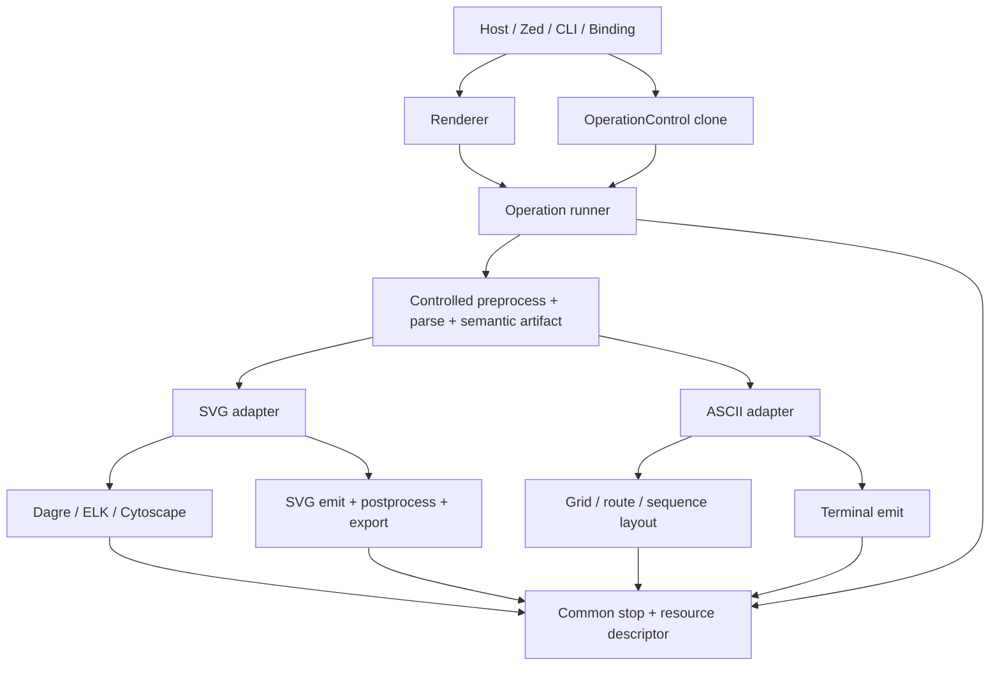

# refactor: Unify operation-scoped rendering and cancellation

## Goal Capsule

| Field | Contract |
|---|---|
| Objective | Replace the split SVG/ASCII render orchestration with one operation-owned execution boundary that supports cooperative cancellation, an optional monotonic deadline, deterministic resource termination, and typed target requests while preserving Mermaid semantic and output behavior. |
| Authority | The latest maintainer direction wins, followed by this Product Contract, the session-settled decisions below, accepted ADRs, pinned Mermaid source behavior, and existing security/resource contracts. |
| Execution profile | Fearless alpha refactoring is authorized. Public Rust APIs, feature-gated surfaces, bindings, generated contracts, and internal ownership may break. Obsolete facades, aliases, pseudo-async wrappers, and failed migration paths must be deleted rather than retained as compatibility layers. |
| Stop conditions | Stop and surface a blocker if the new operation boundary cannot preserve typed semantic ownership, resource/error separation, SVG security/pipeline ordering, or an external ABI contract that must remain stable for this release. Cooperative cancellation is not upgraded into hard thread termination; opaque host callbacks are documented as bounded non-cancellable windows. |
| Tail ownership | The goal executor owns implementation, focused verification, simplification, code review, cleanup of abandoned attempts, and Conventional Commits. Do not push, publish, tag, or open a pull request unless separately requested. |
| Product Contract preservation | Product Contract bootstrapped from the maintainer request; no upstream requirements artifact exists. The scope below is unchanged from the request, with technical boundaries made explicit. |

## Product Contract

### Summary

Merman already bounds layout work with `max_layout_work_units`, but a synchronous render still cannot be stopped by its host. SVG and ASCII also own separate parsing/orchestration, resource, and error paths. The result is that a stale Zed task can continue consuming CPU after a document is closed or replaced, while adding cancellation to only one renderer would deepen the split.

The product change is an operation control plane, not a shared geometry engine. One operation captures source, runtime context, cancellation/deadline, common admission, and termination reporting. SVG and ASCII remain format-local adapters with their own layout and emission semantics.

### Problem Frame

The current implementation has several independent lifecycles:

- `merman-core::ParseControl` covers selected parser/editor paths but not render-model parsing.
- `merman-render::RenderSession` owns SVG-only measurement, math, icons, policy, and work accounting.
- `merman/src/ascii.rs` creates a second engine/context/resource operation and `HeadlessAsciiRenderer` exposes another facade.
- SVG, ASCII, export, and bindings expose method matrices and wrappers that duplicate the same source-to-output orchestration.
- CPU-bound `async fn` render wrappers execute synchronously and do not yield, which makes the API appear cancellable/runtime-friendly when it is not.
- ASCII grid limits and errors are target-local, while the host needs one structured way to distinguish cancellation from resource exhaustion.

The desired behavior is cooperative: a host-owned control can be cloned into a synchronous worker and cancelled from another task or thread. The worker observes the request at checkpoints in parsing, layout, emission, postprocessing, and export. Cancellation and deadline expiration remain separate from `ResourceLimitExceeded`; no partial output is returned.

### Requirements

- R1. A cloneable operation control supports atomic cancellation, an optional monotonic deadline, and parent/child propagation where existing parser composition needs it. Cancellation is sticky for the lifetime of the operation.
- R2. Every controlled stage can report the phase and cancellation reason (`requested` or `deadline`) through a structured `Cancelled` result. A cancellation result is never converted to a syntax error, layout overflow, or `ResourceLimitExceeded`.
- R3. The canonical source-to-output path captures one operation context, control, and resource view. SVG, ASCII, and export adapters receive narrow projections of that operation and do not create hidden replacement contexts.
- R4. The public facade exposes a `Renderer` and typed target request instead of SVG/ASCII method combinations. A one-shot render and any supported semantic preparation use the same internal operation runner.
- R5. `PreparedSemantic` becomes a format-neutral `SemanticArtifact`. SVG-only `PreparedRender` and other public paired semantic/layout artifacts are hidden or removed so callers cannot recombine a family model with an unrelated layout.
- R6. SVG retains its own text measurement, math, icon, Dagre, ELK, Cytoscape, SVG DOM, postprocessing, and export implementations. ASCII retains its own grid, character-width, routing, and terminal emission implementations. No universal `Layout`, `Canvas`, or public backend-plugin trait is introduced.
- R7. `charge()` performs a control/deadline checkpoint before checked work accounting. Neutral interruption from Dagre, ELK, or Cytoscape is mapped using the sticky operation termination cause rather than guessed as arithmetic overflow.
- R8. Render-model parsing has a controlled entrypoint and uses the same operation cancellation channel as other parser paths. Analysis may keep a domain-specific newtype, but it must delegate to the shared state rather than duplicate atomics or deadlines.
- R9. ASCII grid allocation and output loops observe the operation control, and ASCII grid exhaustion becomes the common structured resource error while `AsciiRenderOptions` contains output semantics rather than safety budgets.
- R10. SVG pipeline passes, validation, custom postprocessors, and export preparation/encoding check the operation at their boundaries. Opaque host callbacks and single-call raster/PDF backends are documented as cooperative before/after boundaries, not falsely advertised as preemptible.
- R11. `HeadlessRenderer`, `HeadlessAsciiRenderer`, `HeadlessAsciiError`, duplicate facade error wrappers, public per-family ASCII pass-throughs, and CPU-bound render async wrappers are removed or replaced by the new seam. No permanent compatibility layer is retained.
- R12. Bindings, CLI, WASM, FFI, and host integration map typed target requests and structured cancellation/resource outcomes consistently. Single-threaded WASM documents its event-loop limitation; a host that needs hard termination must isolate the worker/process.
- R13. Successful SVG, ASCII, raster, PDF, semantic, diagnostic, and parity behavior remains source-backed and deterministic. Cancellation tests prove no partial artifact is returned and resource-limit tests prove the two termination classes remain distinguishable.
- R14. The final tree contains no abandoned migration code, stale aliases, duplicate operation owners, or test-only production hooks introduced by this refactor.

### Actors

- A1. Zed and other desktop hosts need stale render work to stop at the next cooperative boundary when content is replaced, archived, or closed.
- A2. Rust library users need one discoverable rendering facade with typed target options and no misleading CPU-bound async contract.
- A3. ASCII/Unicode and SVG consumers need independent format semantics without duplicated source parsing or runtime policy.
- A4. Binding, CLI, WASM, and FFI maintainers need one operation/error vocabulary that can be projected into transport-specific contracts.
- A5. Merman maintainers need a deep seam that allows future output adapters without exposing family internals or preserving migration-era API combinations.

### Key Flows

- F1. A host creates an operation control, passes a clone into a synchronous render request, and calls `cancel()` after a document lifecycle event. The worker returns `Cancelled` at the next checkpoint and never publishes partial output.
- F2. A request with a monotonic deadline reaches a checkpoint after expiry. The operation reports `Cancelled` with the deadline reason, even when a resource limit would also be close to exhaustion.
- F3. A request exceeds a configured work, source, SVG-byte, ASCII-grid, or export quota without cancellation. The adapter returns `ResourceLimitExceeded` with its stable limit identity and phase.
- F4. A normal `Renderer::render` request and an advanced `Renderer::prepare`/`SemanticArtifact` request traverse the same controlled parse and operation runner. SVG and ASCII then diverge only at target-local layout and emission.
- F5. A custom SVG postprocessor or export adapter observes cancellation before or after its opaque synchronous callback. The API reports cooperative behavior honestly and does not claim to interrupt code that never checks the control.

### Acceptance Examples

- AE1. Cancelling a flowchart render while the parser or recursive cluster layout is active returns `Cancelled { phase, reason }`, not `ResourceLimitExceeded` or a parser failure.
- AE2. Expiring a fake monotonic deadline during an ASCII sequence/grid loop returns the deadline form of `Cancelled` and returns no string.
- AE3. A flowchart that exceeds `max_layout_work_units` without cancellation still returns the existing structured resource failure, with its limit identity and phase intact.
- AE4. The same source can be submitted through `RenderTarget::Svg` or `RenderTarget::Ascii` without either target constructing a second hidden engine operation.
- AE5. Existing parity fixtures and ASCII golden fixtures produce the same successful artifacts after migration, aside from intentional public API and structured-error changes.
- AE6. A binding/CLI caller can distinguish explicit cancellation, deadline cancellation, resource exhaustion, parse failure, and unsupported target without string matching.

### Success Criteria

- One operation control and one operation runner are the only sources of cancellation/deadline state for parse, SVG, ASCII, and export.
- `charge()` and all identified long-running loops have control checkpoints with tests at parse, layout, ASCII, SVG pipeline, and export boundaries.
- The public facade no longer exposes the old Headless/ASCII orchestration or render method matrix, and no replacement path duplicates the canonical runner.
- Structured cancellation/resource tests pass across default SVG, ASCII, and relevant feature-gated export/binding surfaces.
- Existing Mermaid parity, security, deterministic-runtime, and ASCII output gates remain green.

### Scope Boundaries

#### In Scope

- Core operation control, deadline clock seam, shared termination primitives, common resource-error descriptor, and controlled render-model parsing.
- Canonical `merman::Renderer`, typed target requests, common operation/artifact ownership, and root facade error mapping.
- SVG layout adapter, `RenderSession`/environment visibility, Dagre/ELK/Cytoscape interruption mapping, SVG emission, pipeline, validation, and export checkpoints.
- ASCII operation projection, grid admission, layout/emission checkpoints, resource-error migration, and removal of independent root orchestration.
- Removal of non-yielding render async wrappers and duplicate public facade methods.
- Bindings-core, CLI, FFI, UniFFI, WASM, and generated operation/error contract migration where the current workspace owns the surface.
- Focused docs, ADR references, compile-fail/public-surface tests, cancellation/resource fixtures, and cleanup of superseded code.

#### Out of Scope

- A universal SVG/ASCII geometry, `Layout`, `Canvas`, or scene abstraction.
- Hard-killing a Rust thread, an uncooperative callback, `resvg`, or a single monolithic encoder call from inside the synchronous API.
- Changing Mermaid parsing/layout semantics, output styling, security policy, or parity tolerances except where a compile-time/API migration requires test updates.
- Renaming the `merman-ascii` crate to `merman-terminal`, introducing a new output format, or creating a general third-party backend plugin system.
- Modifying the Zed repository itself. Merman documents and exposes the host contract; Zed integration can adopt it in its own repository.

#### Deferred to Follow-Up Work

- Worker/process isolation for hard cancellation and watchdog enforcement.
- A public multi-stage typed layout/export API beyond `SemanticArtifact` if concrete callers demonstrate the need after the primary facade lands.
- A symbolic terminal scene that reuses one layout for multiple terminal encodings; this is a separate output-model refactor, not a cancellation prerequisite.
- Removing parser-only async compatibility methods that are not part of render orchestration and still have external consumers.

## Planning Contract

### Key Technical Decisions

- KTD1. **Put the control primitive in `merman-core`, not in `merman-render`.** `merman-core` is the common dependency of parser, SVG, ASCII, export, and analysis. This is session-settled: user-approved — chosen over an SVG-only `RenderControl` because ASCII and controlled parsing would otherwise require a second state owner.
- KTD2. **Unify the operation lifecycle, not layout semantics.** The common seam stops at the typed semantic model and carries control, deadline, context, budget projections, and error/report ownership. SVG and ASCII remain independent adapters. This is session-settled: user-approved — chosen over a lowest-common-denominator geometry abstraction because ADR-0065 and ADR-0073 require family-local meaning and target-local layout.
- KTD3. **Use `Renderer + RenderRequest + RenderTarget` as the public facade.** `Renderer::render` is the normal entrypoint; a narrow `Renderer::prepare`/`SemanticArtifact` path is retained only for existing metadata/admission use cases. This is session-settled: user-approved — chosen over rebuilding the current `run_svg_*`/`render_ascii_*` method matrix.
- KTD4. **Make cancellation and resource exhaustion disjoint terminal classes.** The shared control reports `Cancelled` with a requested/deadline reason; target quotas report `ResourceLimitExceeded` with stable descriptor data. The first termination cause observed at a checkpoint wins and remains sticky for that operation.
- KTD5. **Keep target quotas local behind a common descriptor and ledger projection.** Shared work admission and error shape live in the common operation layer, while SVG bytes/elements, ASCII grid cells, and export pixels retain target-specific policy ownership. This avoids a giant target enum while preventing duplicate safety envelopes.
- KTD6. **Make the internal operation runner canonical and consume old stages.** One runner performs controlled preprocess/parse/semantic admission, then dispatches to a target adapter. One-shot and preparation paths delegate to it; old Headless operations and public SVG `PreparedRender` are removed rather than kept as a second master path.
- KTD7. **Use cooperative checkpoints with an explicit opaque-callback contract.** Tight loops may amortize deadline reads, but every `charge()` checks control first. Custom postprocessors and third-party encoders are checked before/after invocation only; hard stop is a host isolation concern.
- KTD8. **Delete obsolete public API after migration, without aliases.** Alpha status and ADR-0073's rejection of permanent compatibility layers justify breaking `HeadlessRenderer`, `HeadlessAsciiRenderer`, `HeadlessAsciiError`, `ParseControl`, `PreparedRender`, and pass-through helpers once replacement tests are green.
- KTD9. **Keep analysis cancellation as a domain projection, not a new state.** `AnalysisCancellationToken` may remain as a narrow semantic wrapper if callers need it, but it delegates to `OperationControl` and cannot own another atomic flag or deadline.

### High-Level Technical Design



The operation runner owns one runtime snapshot, control, deadline clock, common work ledger, and report builder. It gives each adapter a narrow execution projection. The SVG projection additionally owns text measurement, math, icons, and SVG pipeline services; the ASCII projection owns charset, character width, grid, and terminal policy. No adapter receives the other format's session.

The termination state machine is:

```text
Active
  ├─ checkpoint observes cancel request  -> Cancelled(Requested)
  ├─ checkpoint observes expired deadline -> Cancelled(DeadlineExceeded)
  ├─ charge observes checked quota failure -> ResourceLimitExceeded
  └─ successful terminal emit             -> Completed
```

Once a terminal state is observed it is sticky. A cancellation observed at a checkpoint is not rewritten as a later resource failure; a resource failure observed without cancellation remains a resource failure. A failed operation returns no partial target artifact.

### Priority and Sequencing

| Priority | Outcome | Why first | Exit gate |
|---|---|---|---|
| P0 | Core control/deadline, controlled render-model parse, common stop/error primitives | Every later adapter depends on one state owner; without this, API cleanup creates parallel cancellation paths. | Unit and integration tests prove explicit cancel, deadline, parent/child propagation, and parse-model cancellation. |
| P0 | Canonical operation runner and typed `Renderer` request | Establishes the new master path before deleting old facades. | SVG and ASCII both execute through one runner with no hidden engine/context creation. |
| P1 | SVG adapter checkpoints and interruption mapping | SVG is the largest existing consumer and owns `max_layout_work_units`, pipeline, and export seams. | Layout, pipeline, postprocess, and export tests distinguish cancellation/resource errors. |
| P1 | ASCII adapter checkpoints and resource migration | Removes the second operation owner and makes the user-requested ASCII behavior real. | Grid/sequence/layout/output tests cover cancellation and structured grid limits. |
| P1 | Public API deletion and async cleanup | Only safe after the replacement path and tests exist. | No stale Headless/PreparedRender/pass-through/CPU-bound render async symbols remain. |
| P2 | Bindings, CLI, WASM, FFI, generated contracts | External surfaces need the settled Rust seam and error taxonomy first. | Feature matrix and transport smoke tests consume typed target/status mappings. |
| P2 | Documentation, final simplification, and evidence | Prevents stale architecture guidance and removes abandoned migration artifacts. | ADR/docs/source scans and final parity/resource/security gates pass. |

### Assumptions

- The current alpha branch can accept a coordinated breaking migration across workspace crates and generated binding contracts.
- A host that invokes synchronous rendering is responsible for running it off its latency-sensitive thread; `OperationControl` supplies cooperative stop, not scheduling.
- `ResourceLimitExceeded` may be represented by a common descriptor type while each adapter keeps its own policy and stable limit ids.
- Existing tests and fixtures are authoritative for successful behavior; tests that only assert old names or old wrapper topology will be rewritten or deleted.

### Alternatives Considered

- **Add `RenderControl` only to `merman-render`.** Rejected because it leaves ASCII, render-model parsing, export, and bindings with independent lifecycles and makes future cancellation fixes repeat the same work.
- **Expose a public `RenderBackend` trait.** Rejected because associated output types, feature gates, lifetimes, and backend errors would leak family internals into a shallow extension contract. A private adapter seam is sufficient for the closed built-in target set.
- **Expose every typed stage as the primary API.** Rejected for bindings and ordinary callers; stage handles would externalize lifecycle and ownership complexity. Keep the primary request API deep and retain only the semantic preparation seam that has concrete callers.
- **Keep old names as deprecated aliases.** Rejected because alpha compatibility shims would preserve duplicate master paths and violate the repository's family-owned architecture decision.

### System-Wide Impact

- **Core/parser:** roughly 67 current control references and the render-model parser surface migrate to the common operation primitive.
- **SVG/render:** roughly 27 current `RenderSession` consumers receive an operation projection; Dagre/ELK/Cytoscape neutral interruptions gain cause-preserving mapping.
- **ASCII:** the root crate stops owning a second Engine/resource operation; low-level model rendering remains in `merman-ascii` and keeps independent layout semantics.
- **Facade/API:** `merman` feature gates and examples move from Headless/method matrices to typed targets; compile-fail and docs tests change deliberately.
- **Export:** PNG/JPEG/PDF preparation and encoding inherit the same control and common error mapping while retaining pixel/filter quotas.
- **Bindings/transport:** operation kinds, cancellation handles/tokens, error payloads, generated ABI/schema, and WASM capability notes change together.
- **Performance:** checkpoints add a small atomic fast path; deadline clock reads are amortized. No checkpoint is allowed to replace existing work accounting or alter layout algorithms.
- **Security/parity:** SVG pipeline ordering, resvg sealing, source sanitization, measurement provenance, deterministic runtime context, and Mermaid output behavior remain protected.

### Risks and Mitigations

| Risk | Mitigation |
|---|---|
| Cancellation is added at facade boundaries but not in a long family loop. | Maintain a phase/checkpoint inventory per adapter; add targeted cancellation tests that trigger inside parser, recursive layout, grid, pipeline, and export loops. |
| A neutral backend `Interrupted` loses its actual cause. | Use an operation-owned sticky rejection and map only the recorded cause; add resource-vs-cancel race tests. |
| Moving ASCII grid limits changes output options or resource profiles silently. | Separate output options from `AsciiResourcePolicy`, preserve stable limit ids, and test every profile and structured error projection. |
| Public `Renderer` becomes a mega-enum with feature-gated complexity. | Keep target request types narrow, use private adapters, and include only currently owned built-in outputs. |
| Opaque callback or raster code still runs after cancellation. | Document cooperative boundaries, check before/after calls, and do not promise hard interruption in Rust API or WASM. |
| Deleting old APIs leaves hidden consumers in examples, bindings, or docs. | Run workspace symbol inventory after each migration unit; update or delete every owned reference before removing the old module. |
| Operation context is accidentally recreated by an adapter. | Make adapter constructors require the operation projection and test runtime timestamp/seed provenance across SVG and ASCII. |
| Large mechanical rename obscures semantic regressions. | Land units in dependency order, keep focused commits, run parity and deterministic fixtures at each boundary, and simplify only after green gates. |

### Documentation Plan

- Update the root facade documentation and examples to teach `Renderer`, typed targets, and host-owned cancellation.
- Update the resource/security documentation to state the difference between deterministic resource bounds, cooperative cancellation, and hard isolation.
- Add an ADR or amend the relevant accepted ADRs only if the final public surface materially differs from the decisions recorded here; do not duplicate this plan as a second architecture authority.
- Keep `docs/research/zed-render-cancellation.md` as research evidence and link it from the final plan/implementation notes without importing Zed code or license-specific implementation.
- Remove references to deleted Headless/PreparedRender/ASCII orchestration APIs from active docs, examples, and generated surface descriptions.

## Implementation Units

### U1. Establish core operation control, deadline, and common termination primitives

**Goal:** Replace parser-specific cancellation state with a target-neutral operation control and add the common sticky stop/error primitives required by every adapter.

**Requirements:** R1, R2, R3, R7, R8, R13; KTD1, KTD4, KTD9.

**Dependencies:** None.

**Files:**

- `crates/merman-core/src/operation.rs` (new common operation module)
- `crates/merman-core/src/parse_control.rs` (replace/remove after migration)
- `crates/merman-core/src/runtime.rs`
- `crates/merman-core/src/resources.rs`
- `crates/merman-core/src/lib.rs`
- `crates/merman-core/src/tests/operation.rs` (new)
- `crates/merman-core/src/tests/mod.rs`
- `crates/merman-analysis/src/cancellation.rs`
- `crates/merman-analysis/src/editor.rs`
- `crates/merman-analysis/src/analyzer.rs`
- `crates/merman-analysis/src/tests.rs` and focused cancellation/public-API tests

**Approach:**

1. Define cloneable `OperationControl` with atomic cancel, optional monotonic deadline, parent/child observation, and a phase-aware checkpoint result.
2. Define `CancelReason`, `OperationPhase`, and target-neutral structured `ResourceLimitExceeded`/stop data without introducing SVG or ASCII dependencies into core.
3. Add a narrow operation ledger/projection for checked shared work charging; retain target-specific quota policy in adapters.
4. Migrate `ParseControl`/`ParseCancelled`/`ParseControlResult` callers to operation naming and remove the old public names once all consumers compile.
5. Make any analysis cancellation newtype delegate to the shared control rather than owning another state object.

**Execution note:** Add characterization tests for the existing parent/child cancellation semantics before changing names or return channels.

**Patterns to follow:** Existing `ParseControl` parent propagation and `RuntimePolicy` clock abstraction; `merman-core` feature gating for native versus WASM time.

**Test scenarios:**

- A cloned control observes a cancellation requested by another clone and returns the requested-cancel reason at the next checkpoint.
- A child control can be cancelled independently, while cancellation of its parent reaches all descendants.
- A fake monotonic clock expires a deadline and returns the deadline reason without consulting wall-clock Mermaid semantics.
- An operation with no deadline performs only the atomic cancellation fast path and remains deterministic.
- Checked work charging rejects arithmetic overflow and quota exhaustion without advancing the committed counter.
- Cancellation and quota exhaustion requested concurrently resolve according to the first termination state observed at the checkpoint and remain sticky.
- An analysis wrapper delegates cancellation to the shared control and cannot diverge from its state.

**Verification:** Core tests prove the new control/error semantics, no production references to the old parser-specific state remain, and native/WASM feature configurations compile with the selected clock implementation.

### U2. Add controlled render-model parsing and the common operation runner

**Goal:** Make source admission, preprocessing, detection, typed semantic parsing, runtime capture, and operation reporting one reusable path for all output targets.

**Requirements:** R3, R4, R5, R8, R13; KTD2, KTD3, KTD6.

**Dependencies:** U1.

**Files:**

- `crates/merman-core/src/parse_pipeline.rs`
- `crates/merman-core/src/lib.rs`
- `crates/merman/src/operation.rs` (new common operation runner)
- `crates/merman/src/render.rs` (new public request/output facade module)
- `crates/merman/src/lib.rs`
- `crates/merman/tests/render_operation.rs` (new)
- `crates/merman/tests/controlled_render_parse.rs` (new)

**Approach:**

1. Add controlled detection and render-model parse entrypoints, including known-type variants, using the shared operation control and preserving parse/resource errors.
2. Capture one runtime operation context and common admission ledger before parsing; prohibit adapters from silently beginning a replacement operation.
3. Introduce the internal `Operation` runner and public `Renderer`, `RenderRequest`, `RenderTarget`, `RenderOutput`, and common facade error envelope.
4. Make `SemanticArtifact` the only format-neutral prepared result; expose metadata/family facts needed for admission, but keep family layout artifacts private to their adapter.
5. Route one-shot rendering and semantic preparation through the same runner; do not implement a second shortcut path.

**Technical design:** The public request is target-driven, while the internal runner performs `source -> controlled parse -> SemanticArtifact -> private target adapter -> validated output`. The request owns operation-scoped control and target options; `Renderer` owns long-lived engine defaults and host services only.

**Test scenarios:**

- A normal SVG and ASCII request capture one operation context each and never create a second hidden context inside the target adapter.
- A controlled render-model parse cancelled during preprocessing or family parsing returns the common cancellation result rather than an ordinary parse error.
- A known-type request skips detection but still observes source admission, control, and runtime capture.
- A `SemanticArtifact` exposes metadata and family identity while preventing construction of an unrelated layout artifact.
- One-shot `Renderer::render` and `Renderer::prepare` produce equivalent successful semantic/output behavior for the same request.
- A cancelled operation returns no `RenderOutput` or partial artifact.

**Verification:** New facade tests exercise both targets through the same runner, compile-fail/public-surface checks show that old paired semantic/layout combinations are unrepresentable, and existing canonical operation parity tests can be redirected without duplicating parse/layout logic.

### U3. Migrate SVG to the common operation projection and preserve adapter-local behavior

**Goal:** Thread the common operation control, deadline, ledger, and structured stop mapping through SVG layout, pipeline, postprocessing, and export without exposing SVG session state to ASCII.

**Requirements:** R3, R6, R7, R10, R13; KTD4, KTD5, KTD7.

**Dependencies:** U1, U2.

**Files:**

- `crates/merman-render/src/environment.rs`
- `crates/merman-render/src/resources.rs`
- `crates/merman-render/src/layout_work.rs`
- `crates/merman-render/src/family/**`
- `crates/merman-render/src/flowchart/layout.rs`
- `crates/merman-render/src/svg/pipeline.rs`
- `crates/merman-render/src/svg/**`
- `crates/merman-render/src/lib.rs`
- `crates/merman-export/src/lib.rs`
- `crates/merman-render/src/tests/operation_cancellation.rs` (new)
- `crates/merman-export/src/tests/operation_cancellation.rs` (new)

**Approach:**

1. Reduce `RenderSession` to a private SVG session or `SvgSession` projection that receives the common operation scope and only exposes SVG services.
2. Make `OperationWorkMeter`/layout work control check the common control before each charge and preserve the existing checked overflow/resource semantics.
3. Instrument flowchart recursive cluster work, family loops, Dagre/ELK/Cytoscape adapters, SVG DOM/validation passes, and pipeline/postprocessor boundaries.
4. Replace neutral backend interruption guesses with sticky operation-cause mapping; preserve existing resource-limit descriptors and SVG byte/element policies.
5. Pass the same operation control into export preparation/encoding. Check opaque callbacks before/after invocation and preserve structured cancellation/error payloads through wrapping.

**Execution note:** Use targeted cancellation tests at the deepest available checkpoints before broad fixture re-runs; this makes missing instrumentation visible without relying on timing.

**Patterns to follow:** ADR-0043 layout adapter boundary, ADR-0063 postprocessor ordering/sealing, `max_layout_work_units` accounting, and existing operation report provenance.

**Test scenarios:**

- Cancelling during flowchart recursive cluster work returns `Cancelled` with a layout phase and does not become a resource failure.
- Cancelling an ELK, Dagre, or Cytoscape operation maps its neutral interruption to the sticky requested/deadline cause.
- A layout work quota or checked overflow still returns `ResourceLimitExceeded` with the original stable limit and cause.
- Cancelling before and after each built-in SVG pipeline pass prevents a finalized artifact from being returned.
- A custom postprocessor that requests cancellation through its context returns the cancellation unchanged rather than a generic postprocess error.
- Export preparation observes cancellation at XML/image traversal boundaries and does not return a partially encoded raster/PDF artifact.
- Existing deterministic measurement, root viewport, resvg-safe, and parity fixtures remain byte/structure compatible on successful requests.

**Verification:** SVG and export tests prove phase coverage and error separation; feature-gated Dagre/ELK/Cytoscape/math/export builds compile; parity/security/resource suites remain green.

### U4. Migrate ASCII to the common operation projection and delete root orchestration

**Goal:** Make `merman-ascii` a model-level target adapter that consumes the common operation projection, while removing `crates/merman/src/ascii.rs` as an independent operation owner.

**Requirements:** R3, R6, R9, R11, R13; KTD2, KTD5, KTD8.

**Dependencies:** U1, U2.

**Files:**

- `crates/merman-ascii/src/lib.rs`
- `crates/merman-ascii/src/options.rs`
- `crates/merman-ascii/src/error.rs`
- `crates/merman-ascii/src/canvas.rs`
- `crates/merman-ascii/src/relation_graph/**`
- `crates/merman-ascii/src/sequence/**`
- `crates/merman-ascii/src/**` family modules and tests
- `crates/merman/src/ascii.rs` (delete)
- `crates/merman/src/lib.rs`
- `crates/merman/tests/ascii_render_operation.rs` (new or migrated)
- `crates/merman-ascii/src/tests/operation_cancellation.rs` (new)

**Approach:**

1. Remove `max_grid_cells` from `AsciiRenderOptions` and introduce an operation/resource projection for grid admission.
2. Replace `AsciiError::RenderLimitExceeded` with the common structured resource error while retaining ASCII-specific invalid-option and unsupported-feature errors.
3. Thread checkpoints and bounded charges through graph conversion, layered routing, sequence control, canvas allocation, row emission, and other identified long loops.
4. Keep `AsciiRenderer::render_model` as the model-level backend entrypoint; make family-specific free `render_*` functions private or delete them when no internal caller remains.
5. Delete `HeadlessAsciiRenderer`, `HeadlessAsciiError`, `render_ascii_sync`/`render_ascii`, duplicate engine/runtime/resource glue, and root `ascii` orchestration. `Renderer` dispatches the ASCII target directly.

**Test scenarios:**

- A flowchart grid allocation that exceeds the configured cell budget returns the common `ResourceLimitExceeded` descriptor and no string.
- Cancelling during layered graph routing, sequence frame traversal, canvas allocation, and output row emission returns the correct phase-specific `Cancelled` result.
- ASCII and Unicode output for representative flowchart, sequence, class, ER, state, Gantt, mindmap, timeline, journey, kanban, packet, tree, and xychart fixtures remains unchanged when not cancelled.
- Output options validate independently of resource policy; moving the grid limit does not alter charset, color, spacing, or direction semantics.
- The low-level model-level backend rejects unsupported typed models through `AsciiError` without manufacturing a second operation state.
- A root `RenderTarget::Ascii` request uses the caller's control/runtime context and never calls `Engine::begin_operation` a second time.

**Verification:** ASCII crate tests and root facade tests cover all supported target families and failure classes; repository search confirms no root ASCII orchestration or old limit/error symbols remain.

### U5. Replace the public SVG/ASCII API matrix and remove non-yielding render async wrappers

**Goal:** Complete the breaking facade migration after both adapters use the canonical runner, reducing the public surface to typed requests and stable output/error artifacts.

**Requirements:** R4, R5, R11, R13, R14; KTD3, KTD6, KTD8.

**Dependencies:** U2, U3, U4.

**Files:**

- `crates/merman/src/lib.rs`
- `crates/merman/src/render.rs`
- `crates/merman/src/svg/mod.rs`
- `crates/merman/src/svg/operation.rs`
- `crates/merman-render/src/lib.rs`
- `crates/merman-ascii/src/lib.rs`
- `crates/merman/tests/prepared_render.rs` (migrate/delete as appropriate)
- `crates/merman/tests/public_surface.rs` (new or migrated)
- `crates/merman/examples/**` and docs referencing old APIs

**Approach:**

1. Rename the root public concept from `HeadlessRenderer` to `Renderer` and route all supported output requests through `RenderTarget`.
2. Remove `PreparedRender`, SVG-only public `RenderOperationReport` wrappers, `RenderSvgError`, `HeadlessError`, and `HeadlessAsciiError` where the common facade can own the envelope.
3. Keep format-specific option and sealed artifact types where they are real adapter contracts; do not flatten them into a universal output enum with backend internals.
4. Delete CPU-bound render `async fn` wrappers and duplicate `_sync`/pipeline/readable/export combinations whose behavior is now request data. Preserve only genuinely asynchronous APIs with actual suspension or an independently justified transport contract.
5. Update examples and compile-fail tests to prove the new surface and delete tests whose only purpose was to protect removed names.

**Test scenarios:**

- A normal SVG, ASCII, PNG, JPEG, and PDF request selects a typed target and returns the expected output/error variant through one facade.
- Invalid target options and unsupported feature combinations fail before backend execution with structured request errors.
- A caller cannot construct or pass a public SVG `PreparedRender` detached from its operation-owned semantic artifact.
- The public API contains no CPU-bound render async wrapper and no duplicate target-specific method matrix.
- Existing one-shot convenience behavior, including no-diagram handling and explicit SVG id selection, is preserved through request constructors or documented replacements.

**Verification:** Public-surface/compile-fail tests, examples, docs builds, and feature combinations compile against the new API; symbol inventory confirms deleted names are absent from active code.

### U6. Migrate bindings, CLI, WASM, FFI, and host-facing operation contracts

**Goal:** Project the canonical typed target and structured operation outcomes into every workspace transport that currently owns rendering requests or status mapping.

**Requirements:** R4, R11, R12, R13; KTD3, KTD4, KTD7.

**Dependencies:** U1, U2, U3, U4, U5.

**Files:**

- `crates/merman-bindings-core/src/operation.rs`
- `crates/merman-bindings-core/src/render.rs`
- `crates/merman-bindings-core/src/render/request.rs`
- `crates/merman-bindings-core/src/ascii.rs`
- `crates/merman-bindings-core/src/engine.rs`
- `crates/merman-bindings-core/src/{artifact_contract,operation_contract,transport_contract}.rs`
- `crates/merman-cli/src/render.rs`
- `crates/merman-cli/src/render/execute.rs`
- `crates/merman-cli/src/render/prepare.rs`
- `crates/merman-cli/src/render/admission.rs`
- `crates/merman-cli/src/render/svg_pipeline.rs`
- `crates/merman-cli/src/output.rs`
- `crates/merman-cli/src/error.rs`
- `crates/merman-ffi/src/lib.rs`
- `crates/merman-uniffi/src/**`
- `crates/merman-wasm/src/lib.rs`
- generated ABI/contract files owned by these crates, including current
  `src/generated/*` and `include/*` surfaces
- transport and binding integration tests/fixtures

**Approach:**

1. Replace internal SVG/ASCII request-plan forks with one target catalog that maps transport operation ids to typed root requests.
2. Add operation-control handles/tokens only where the transport can safely call cancellation from another execution context; map the common `Cancelled` reason and resource descriptor without string parsing.
3. Keep CLI synchronous execution explicit and connect SIGINT/deadline policy at the host boundary rather than adding a fake async Rust renderer.
4. Update FFI/UniFFI generated contracts and status mappings as an intentional breaking change; preserve ownership and release semantics for returned buffers.
5. Document that single-threaded WASM cannot run a host abort callback in the middle of a synchronous Rust call, while deadline checkpoints remain available.

**Test scenarios:**

- Binding requests for SVG and ASCII produce the same successful artifacts as direct Rust requests for matching options.
- A binding/FFI control cancelled from another thread or transport callback returns the structured cancelled status and does not leak a buffer.
- Resource-limit, deadline-cancel, explicit-cancel, parse, unsupported-target, and backend failures map to distinct transport status/payloads.
- CLI SIGINT/deadline handling stops at a cooperative boundary while preserving its existing output transaction and error behavior.
- WASM tests/documentation distinguish cooperative deadline checks from unavailable mid-call abort callbacks.
- Generated ABI/schema checks reject stale request/error shapes and accept the new target catalog.

**Verification:** Native binding, CLI, UniFFI, FFI, and WASM feature/smoke gates pass serially; generated contract diffs are intentional and documented; no transport retains an independent render operation owner.

### U7. Delete migration leftovers, refresh documentation, and close the verification contract

**Goal:** Remove abandoned code and stale architecture claims, then prove the final workspace has one canonical operation path and preserves successful behavior.

**Requirements:** R11, R13, R14; KTD6, KTD8.

**Dependencies:** U3, U4, U5, U6.

**Files:**

- `docs/adr/0073-family-owned-diagram-architecture.md` and related accepted ADRs when wording needs correction
- `docs/adr/0008-async-and-runtime.md`
- `docs/adr/0063-extensible-svg-output-pipeline.md`
- `docs/adr/0065-ascii-output-boundary.md`
- `docs/security/RENDERING_SECURITY.md`
- `docs/security/CLI_RESOURCE_POLICY.md`
- root README/examples and active API documentation
- workspace source/test files identified by final symbol inventory
- `docs/research/zed-render-cancellation.md` (reference link only; preserve research content)

**Approach:**

1. Run a final owned-symbol inventory for old control/facade/error/stage names and remove only program-owned leftovers.
2. Delete temporary probes, duplicate tests, compatibility aliases, and failed migration code; preserve unrelated user files and historical records.
3. Update docs to distinguish operation cancellation, deadlines, deterministic resource budgets, and hard isolation limitations.
4. Exercise the canonical operation through parity, deterministic runtime, security, ASCII, export, binding, and feature-surface gates.
5. Simplify the final diff and record any intentionally deferred transport or process-isolation work for a follow-up plan.

**Test scenarios:**

- A full successful SVG/ASCII/export fixture matrix passes after old API deletion.
- Cancellation/resource structured-error tests pass through direct Rust and at least one binding transport.
- Security and resvg-safe pipeline tests prove that cancellation/error wrapping does not bypass sealing or sanitization.
- Public docs/examples contain only the new renderer/request vocabulary and accurately describe cooperative limits.
- A clean build with each supported feature closure has no duplicate operation or stale alias warnings.

**Verification:** `cargo fmt` is clean, serial nextest/workspace gates and feature checks pass, parity/security/resource/ABI smoke evidence is recorded, `git diff --check` is clean, and abandoned code is absent from the final diff.

## Verification Contract

### Fast Contract Gates

- Rust formatting and repository diff hygiene are clean.
- Core, facade, SVG, ASCII, export, bindings, CLI, FFI, UniFFI, and WASM crates compile in their supported feature closures without parallel Cargo load.
- Focused operation-control, controlled-parse, SVG, ASCII, export, facade, and binding tests pass through the repository's serial nextest workflow.

### Behavioral Gates

- Explicit cancellation is observed in parse, SVG layout, ASCII layout/emission, SVG postprocessing, and export preparation.
- Optional deadlines use a fake monotonic clock in tests and never depend on wall-clock Mermaid semantics.
- `charge()` checks control/deadline before accounting and preserves checked overflow/resource behavior.
- Cancellation and `ResourceLimitExceeded` remain distinct in direct Rust, facade, and transport projections.
- No partial SVG, string, raster, or PDF artifact is returned after an operation terminates.
- Successful Mermaid parity, deterministic runtime, SVG security/sealing, ASCII golden, export, and feature-surface gates remain green.

### Public Surface Gates

- Active code and generated contracts no longer expose `ParseControl`, `ParseCancelled`, `HeadlessRenderer`, `HeadlessAsciiRenderer`, `HeadlessAsciiError`, public `PreparedRender`, or CPU-bound render async wrappers.
- `Renderer`, typed target requests, `SemanticArtifact`, and common error/status projections are documented and used by examples/tests.
- `merman-ascii` exposes a model-level backend without public per-family pass-through orchestration.

### Evidence and Review Gates

- Each implementation unit has a focused commit or an explicit reason it was combined with its dependency.
- Review checks correctness, API contract, maintainability, performance/checkpoint coverage, security/pipeline ordering, and test completeness.
- Any rejected or abandoned candidate code is removed before the next unit and does not survive in comments, feature flags, or dormant aliases.
- Existing untracked user files, including the Zed research note, are not staged or modified unless explicitly owned by this work.

## Definition of Done

### Global

- [ ] U1-U7 outcomes are implemented in dependency order, or a genuine scope-changing blocker is reported.
- [ ] One common operation control/state owner spans controlled parse, SVG, ASCII, and export.
- [ ] The public `Renderer`/typed-target facade is the only master source-to-output path.
- [ ] SVG and ASCII retain independent layout/emission modules and do not exchange SVG-only session services.
- [ ] Cancellation/deadline and resource-limit errors are structured, phase-aware, and never conflated.
- [ ] No partial target output is returned after cancellation, deadline, or resource termination.
- [ ] All identified long-running loops and charge sites have checkpoints with focused tests.
- [ ] Old facades, pseudo-async render wrappers, duplicate errors, stale aliases, and abandoned experiments are deleted.
- [ ] Parity, deterministic runtime, security, ASCII, export, binding, feature, formatting, and diff hygiene gates pass.
- [ ] The final diff contains only intended files; unrelated user changes remain untouched.

### Per-unit

- U1 is done when core control/deadline/ledger tests pass and parser/analysis callers use the shared state.
- U2 is done when controlled render-model parse and the common operation runner are canonical and tested.
- U3 is done when SVG/layout/pipeline/export checkpoints and cause-preserving interruption mapping pass without successful-output regressions.
- U4 is done when ASCII uses the common operation projection, grid limits are structured resource errors, and root ASCII orchestration is gone.
- U5 is done when `Renderer`/typed target requests replace the old public method matrix and non-yielding render async wrappers are removed.
- U6 is done when bindings/CLI/WASM/FFI/UniFFI consume the new target and outcome contracts with transport tests.
- U7 is done when docs, symbol inventory, cleanup, and full verification prove there is no duplicate operation path.

## Appendix

### Research and source breadcrumbs

- `docs/adr/0073-family-owned-diagram-architecture.md` requires one canonical typed rendering operation and rejects permanent compatibility layers.
- `docs/adr/0065-ascii-output-boundary.md` requires ASCII to remain a first-class target with independent character-cell layout and no dependency on SVG geometry.
- `docs/adr/0063-extensible-svg-output-pipeline.md` defines SVG pipeline ordering, custom postprocessor boundaries, and sealed resvg output.
- `docs/adr/0008-async-and-runtime.md` keeps runtime neutrality but does not make a synchronous CPU-bound function cancellable; this plan removes misleading render wrappers rather than adding a runtime dependency.
- `crates/merman-core/src/parse_control.rs` is the existing cooperative cancellation pattern to generalize.
- `crates/merman-core/src/lib.rs` currently lacks a controlled render-model parse entrypoint and contains synchronous implementations behind several async parser facades.
- `crates/merman/src/ascii.rs` currently owns a second Engine/context/resource orchestration and `HeadlessAsciiRenderer`.
- `crates/merman/src/svg/operation.rs` currently owns SVG-only `HeadlessOperation`, `PreparedSemantic`, `PreparedRender`, and `RenderSession` reporting.
- `crates/merman-render/src/resources.rs` and `crates/merman-render/src/layout_work.rs` own layout/resource accounting and adapter interruption mapping.
- `crates/merman-ascii/src/options.rs`, `error.rs`, `canvas.rs`, and relation/sequence modules own grid limits and long output loops.
- `docs/research/zed-render-cancellation.md` records the Zed stale-task lifecycle and the cooperative-cancellation limitation of synchronous background execution.
- Repository inventory at planning time found approximately 67 files referencing parser control names, 46 HeadlessRenderer references, 7 HeadlessAsciiRenderer references, 27 RenderSession references, and 16 ASCII grid-limit/error files. These counts guide sequencing, not a completion claim.

### Implementation-time unknowns

- Exact public type names and feature-gated target variants should be selected after compiling the first facade slice; the plan fixes the ownership and behavior, not a copy-paste signature.
- The final monotonic clock adapter may use the workspace's existing native/WASM time feature pattern after U1 confirms the lowest-dependency implementation.
- Binding transport status constants and generated file locations may differ by target; U6 owns the authoritative generated contract migration.
