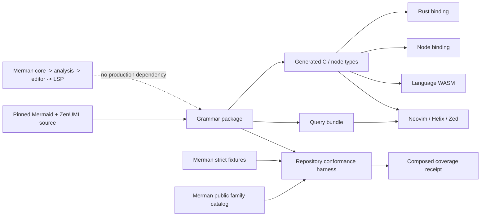
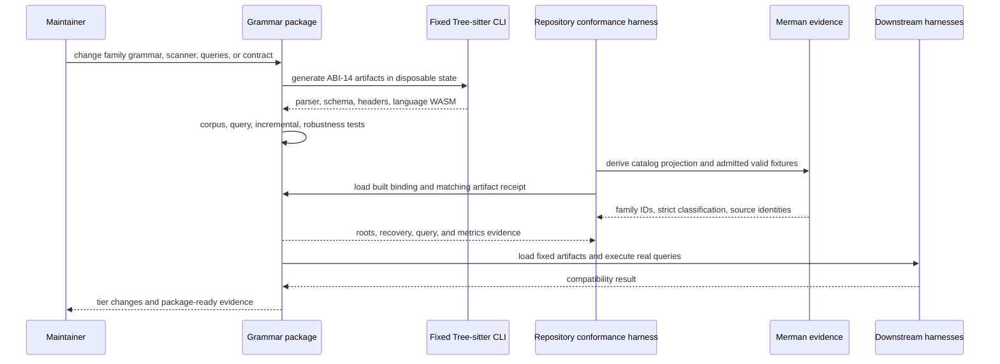

# Tree-sitter Mermaid Language Surface - Plan

## Goal Capsule

- Objective: Build an independently versioned, package-ready `tree-sitter-mermaid` language distribution that exposes a useful tolerant CST and editor queries for all 35 public Mermaid diagram families pinned by Merman, while Merman's existing parsers, IR, analysis, editor core, and LSP remain the strict semantic authority.
- Authority: Mermaid `11.16.1` at commit `7ecca0cd7f1658ef74f4e7e91f925724ef403bbf` owns accepted source syntax; the pinned ZenUML companion owns ZenUML behavior; Merman's public family catalog and strict fixtures provide a one-way conformance oracle; the new package owns its CST schema, queries, bindings, metadata, generated artifacts, and release readiness.
- Execution profile: Fearless pre-1.0 refactor inside the new grammar surface. Break node and capture schemas when a better coherent design is proven, remove broad fallbacks and superseded scaffolding, and commit coherent units. Use characterization-first family work, fixed generators, package-local tests, and serial Cargo execution where practical.
- Stop conditions: Do not add Tree-sitter to the production dependency closure of `merman-core`, `merman-analysis`, `merman-editor-core`, or `merman-lsp`; claim Merman semantic validity from CST shape; mark a family structured while valid statements are consumed by a generic fallback; keep external scanner state that cannot be completely serialized; accept unbounded conflict, parser-size, memory, or input-amplification growth; delete an existing semantic parser without full replacement evidence and a superseding ADR; publish, push, transfer repository ownership, or mutate external editor registries without separate authorization.
- Tail ownership: Complete all active units in the isolated feature worktree, make focused Conventional Commits as units settle, and leave package and downstream changes locally verified and ready for review. External registry publication, repository transfer, downstream pull requests, and remote branch operations remain separately authorized follow-ups.

## Product Contract

### Summary

Mermaid already has Tree-sitter implementations and editor adoption, but the active ecosystem is pinned to incomplete grammars, has weak release ownership, and lacks a source-backed 35-family conformance contract. Merman can close that gap because it already tracks the exact Mermaid source baseline, all public diagram families, strict parsers, recovery facts, fixtures, analysis spans, and editor behavior.

This work creates a neighboring syntax product rather than replacing Merman's semantic core. The grammar accepts editing intermediates and exposes stable, family-specific structure. Merman continues to decide whether a diagram is semantically valid, how source mutates family databases, what IR is produced, and which navigation or refactoring operations are safe.

### Problem Frame

- The widely integrated `monaqa/tree-sitter-mermaid` grammar covers eight families and has not moved since 2024.
- Newer grammars cover more headers, but several families remain line-level fallbacks and their registry or release claims are incomplete.
- Neovim, Helix, Zed extensions, Emacs, and language packs prove a consumption path, yet most remain pinned to old commits and highlights-only queries.
- Mermaid's parser implementations are heterogeneous: Jison, Langium/Chevrotain, a shared Flowchart parser, indentation-sensitive languages, multiline CSV, parser-state lexer feedback, and external ZenUML grammar behavior.
- A broad `unknown_statement` can make every file parse while providing no useful structure. Completion therefore needs a machine-readable maturity lattice and oracle, not a README family count.
- Replacing Merman's LALRPOP or handwritten parsers would discard strict semantic behavior without reducing the need for a tolerant CST. The viable architecture is two products with one-way evidence, not two semantic owners.

### Actors

- A1. Editor user: expects responsive incremental parsing, localized recovery, and accurate highlighting, folding, indentation, outline, and navigation structure while typing incomplete Mermaid.
- A2. Grammar consumer: needs generated C, Rust, Node, and language WASM entry points with explicit ABI and baseline compatibility.
- A3. Grammar maintainer: needs family-local modules, deterministic generation, executable support tiers, and precise failures when Mermaid evolves.
- A4. Merman maintainer: needs the existing semantic architecture protected from a second parser dependency while reusing catalog and fixture evidence without duplication.
- A5. Downstream editor maintainer: needs a migration path from the monaqa node/query schema and fixed-version compatibility evidence.
- A6. Release and legal reviewer: needs independent versions, complete package contents, source provenance, license attribution, and dry-run evidence before any publication is authorized.

### Planning Contract

#### Assumptions

- The language package lives at `distribution/tree-sitter-mermaid/` in this monorepo so grammar changes, Merman oracle changes, and Mermaid baseline changes can be reviewed atomically.
- The initial package version is `0.1.0`; public node and capture schemas are explicitly experimental until a later stability decision.
- Generated language ABI 14 is the initial compatibility target. The CLI, Rust runtime, and `web-tree-sitter` are pinned to `0.26.12`; the source-built Node consumer is tested with the separately versioned `tree-sitter` Node runtime `0.25.1` until that package publishes a compatible newer line.
- The first delivery includes generated C, a Rust binding crate, a source-built Node binding, and a language WASM. Platform-specific Node prebuilds are excluded.
- The public package identity is `tree-sitter-mermaid` and the language symbol is `mermaid` for local development. Final registry ownership or a scoped npm fallback is an external release decision.
- Fixed supported editor versions are selected during implementation from current stable Neovim and Helix releases; Zed receives extension manifest, query, and ABI smoke. Latest-version probes are scheduled and non-blocking.
- All nine query surfaces in R9 ship, with per-family `not_applicable` evidence where a surface has no coherent Mermaid meaning.
- A 10 MiB generated `parser.c` limit and 5 MiB stripped language-WASM limit are hard stop thresholds. Real-corpus performance uses the 35 baselines plus admitted fixtures; synthetic adversarial performance uses single-variable 64, 128, 256, 512 KiB, and 1 MiB doubling series. A two-second fresh-process watchdog on fixed Linux CI protects liveness for 1 MiB stress inputs but is not a portable latency claim.
- The user explicitly authorized breaking changes, aggressive refactoring, deletion of replaced code, and intermediate commits. This does not grant remote publication, pushes, downstream PRs, or deletion of unrelated user work.

#### In Scope

- An independent grammar package, generated artifacts, metadata, bindings, language WASM, queries, tests, docs, legal provenance, CI ownership, and release dry-runs.
- A versioned cross-consumer support contract sourced from the 35 public Merman families and exact Mermaid baseline.
- Family-specific structured CST coverage for all 35 public families, including accepted aliases and editing intermediates.
- One-way Merman fixture and strict-parser conformance evidence, incremental/fresh equivalence, malformed-input recovery, fuzz regressions, and downstream editor smokes.
- Narrow repository tooling and documentation changes needed to own, generate, verify, audit, and independently version this package.
- Deletion of generic fallback rules, duplicated family manifests, temporary mechanics-spike scaffolding, stale generated artifacts, and other new-package code proven superseded.

#### Out of Scope

- Replacing Merman's LALRPOP or handwritten family parsers, IR, renderer, analysis facts, semantic tokens, diagnostics, navigation, rename, or LSP.
- Treating a Tree-sitter parse without `ERROR` as proof of Mermaid semantic validity.
- Parsing entire Markdown or MDX documents; host grammars own fence injection and pass the Mermaid body to this grammar.
- Publishing to npm, crates.io, editor registries, or a canonical external repository; changing remote governance; or promising unowned package names.
- Python, Go, Swift, or platform-specific Node prebuilt bindings in the initial delivery.

### Requirements

#### Architecture and authority

- R1. The grammar is a top-level, independently versioned package and must not enter any Merman production dependency closure.
- R2. A new ADR must define Tree-sitter as an external tolerant CST/query product. Merman remains the only owner of validity, semantic construction, DB mutation ordering, IR, diagnostics, navigation identity, and refactoring safety.
- R3. The package must pin and report the exact Mermaid, ZenUML companion, Merman oracle, Tree-sitter CLI, Rust runtime, Node runtime, web runtime, language ABI, grammar version, node-schema version, and query-schema version identities. Each generation emits one immutable receipt that binds those identities to parser, schema, query, binding, and WASM digests; every package carries the same receipt and rejects incompatible node/query schema pairs.
- R4. One machine-readable contract must cover exactly the 35 public families without becoming a second catalog. Public IDs, internal variants, and suggested authoring headers are generated read-only projections of Merman's family catalog. Complete accepted headers and aliases come from the pinned Mermaid and ZenUML syntax authorities and are proved by grammar corpus evidence, with public-family ownership cross-checked against Merman. Grammar-owned fields are family roots, CST/query schema, evidence, and support tier. A composed receipt binds both authority digests, and internal variants or aliases never inflate the count.

#### Grammar and CST

- R5. Empty, BOM-prefixed, comment-only, preamble-only, frontmatter-only, directive-only, header-only, unknown-header, LF, CRLF, bare-CR, Unicode, and invalid-byte inputs must have explicit no-crash and recovery contracts. Supported source is valid UTF-8; arbitrary bytes need only remain memory-safe and bounded.
- R6. Every accepted public header and legacy/version alias must select exactly one public family root. Changing the header through an incremental edit must replace the family subtree rather than retain stale structure.
- R7. All 35 public families must reach `structured`: valid source exposes named declarations/statements, identifiers/references, keywords, operators/delimiters, literals, and structural blocks. Family-specific free text, HTML, Markdown, or external payload may remain an opaque named leaf.
- R8. Valid structured source must not be swallowed by a generic `unknown_statement`, `raw_line`, `catch_all_body`, or equivalent. Recovery nodes must be localized, finite, named where useful, and must preserve unaffected sibling structure.

#### Queries and editor behavior

- R9. The package must provide compile-tested `highlights`, `folds`, `indents`, `injections`, `locals`, `tags`, `brackets`, `outline`, and `textobjects` query surfaces. Portable Tree-sitter captures are separated from Neovim, Helix, and Zed adapter profiles; every `family x surface x profile` cell must produce asserted captures or explicit `not_applicable` metadata with rationale.
- R10. Capture names, public named nodes, fields, and family roots form a versioned experimental interface. Schema snapshots and migration notes must make breaking changes intentional; no compatibility shim is required before 1.0.
- R11. Incremental parsing after exact UTF-8 byte/point edits must produce the same normalized named tree as fresh parsing of the final text, including CRLF, header switches, indentation moves, multiline quotes, nested blocks, frontmatter, and directives.

#### Distribution and generation

- R12. Tree-sitter `0.26.12` must deterministically generate committed `parser.c`, `grammar.json`, `node-types.json`, headers, ABI-14 language WASM, and the R3 receipt. A clean regeneration in disposable state must detect missing, extra, modified, or cross-version generated artifacts.
- R13. The generated C API, Rust crate, source-built Node binding, and language WASM must load the same language, carry the same R3 receipt, report compatible ABI/metadata, parse a representative source from every public family, and expose the matching query profiles.
- R14. The package must be consumable without the generator: Cargo packaging, npm packing/install, C compilation, Node loading, and WASM loading use committed artifacts and explicit file allowlists.

#### Conformance and robustness

- R15. Support tiers are executable and monotonic:
  - `recognized`: accepted header maps to the correct public family root; body structure may be incomplete and is never claimed otherwise.
  - `structured`: R7-R8 pass for the family's admitted legal corpus.
  - `query-complete`: structured plus every R9 surface has capture assertions or explicit N/A evidence.
  - `conformant`: query-complete plus correct-root/no-unexpected-error checks for every admitted Merman-valid fixture, family recovery cases, incremental/fresh equivalence, schema snapshots, and bounded robustness gates.
- R16. The release-readiness gate requires all 35 public families to be `conformant`. The oracle admits every Merman-strict-valid fixture under the repository's deterministic public-family filters plus all 35 family baselines; an exclusion requires an individual source-backed reason and source digest. Residual exceptions must be individual, source-backed, digest-bound, and may not permit a broad fallback.
- R17. External scanner state must be minimal, versioned, and losslessly serialized in at most Tree-sitter's 1,024-byte buffer. The state protocol defines its family/mode discriminator, indentation representation, maximum encodable state, reset behavior, and deterministic localized overflow recovery. It must never report success after truncating state that affects future tokens. Tests cover every external-token restart, maximum and maximum-plus-one state, zero/corrupt buffers, reuse, cancellation, header switches, CRLF/UTF-8 boundaries, malformed input, deep nesting, long lines, large indentation, and unclosed payloads.
- R18. A continuous metrics ratchet at the mechanics, graph, stateful, final-structure, query, and release checkpoints must record generated C/WASM size, parser states and large states, symbols, fields, conflicts, generation/compile time, fresh and incremental parse work, query time, native peak RSS, and WASM memory pages. Real-corpus and synthetic doubling lanes are separate. Any 10/5 MiB hard-limit breach, unlossy scanner-state impossibility, sustained local edit behavior approaching full-file reads on 256 KiB or larger files, two consecutive at-least-threefold time/memory increases on input doubling, or unexplained grammar-table jump is a stop-and-investigate result rather than an accepted residual. Regression fuzz starts at U2, edit-sequence fuzz precedes stateful scanner admission, and arbitrary-tree query fuzz completes at U9.

#### Repository, lifecycle, and downstream adoption

- R19. The repository must have a first-class grammar CI owner covering generation, corpus, queries, bindings, WASM, packages, fuzz regressions, legal material, and dependency-closure absence without forcing unrelated renderer/platform work for grammar-only changes.
- R20. The package must be independently versioned and release-ready, with provenance for pappasam-derived MIT code, Mermaid/ZenUML translations, and any other borrowed rule/query. Dry-runs are required; actual publication remains outside this plan.
- R21. Package support tiers bind the grammar release's selected Mermaid and ZenUML baselines. When the repository baseline moves independently, `repositoryAlignment` becomes `mermaid_drifted`, `zenuml_drifted`, or both and blocks any whole-repository alignment claim without rewriting historical package tiers. When the grammar selects a new baseline, affected families are demoted until detector/header, grammar, fixtures, queries, companion behavior, generated artifacts, metadata, and upgrade documentation are realigned.
- R22. A fixed Neovim/Helix/Zed downstream matrix must load the grammar and execute its real queries. The existing monaqa grammar is a compatibility reference, not the node-schema authority; migration fixtures may change downstream queries rather than preserve a weak schema.
- R23. Existing semantic parser code may be deleted only after a separate superseding ADR and full strict-parse, recovery, DB-order, IR, render, analysis, and editor equivalence evidence. This plan expects no such deletion; fearless deletion applies to proven-replaced new grammar/tooling paths.

### Key Flows

- F1. Package consumption: install or compile an owner binding -> verify ABI and metadata -> load `mermaid` -> parse source -> traverse one public family root -> load queries -> distinguish load/build failures from source recovery nodes.
- F2. Incremental editing: parse empty or existing source -> apply an exact byte/point edit -> edit the old tree -> reparse with reuse -> preserve unaffected siblings and localize errors -> compare the normalized result with a fresh parse.
- F3. Family admission: register the public family row -> prove every accepted header -> add named family structure and corpus -> add query captures/N/A evidence -> add recovery and edit traces -> run the Merman-valid fixture oracle -> promote one tier only when its gates pass.
- F4. Generation: use fixed package-local tooling -> generate all artifacts in disposable state -> validate the complete artifact set and ABI -> compare bytes -> install the set transactionally -> require a clean second generation.
- F5. Merman oracle: derive the exact public family catalog and family-baseline fixtures -> select only admitted non-private fixtures -> classify them with Merman's strict parser -> parse raw source with Tree-sitter -> verify family root, structured nodes, errors, queries, and tier without feeding Tree-sitter results back into Merman.
- F6. Mermaid upgrade: change the selected reference -> diff detectors, grammar sources, ZenUML companion, and fixtures -> invalidate affected support rows -> update family grammar/queries/corpus -> regenerate -> restore conformance explicitly.
- F7. Release preparation: validate version and provenance -> build/package C, Rust, Node, and WASM from committed artifacts -> inspect exact package contents -> install/load/parse each artifact -> emit local evidence without publishing.
- F8. Downstream compatibility: build the local grammar -> install it into fixed editor harnesses -> compile and execute editor-native queries -> verify representative files -> report latest-editor drift separately from the blocking fixed matrix.

### Acceptance Examples

- AE1. `flowchart`, `flowchart-v2`, and `graph` headers all select the Flowchart public root, but coverage still counts one public family.
- AE2. Replacing a Flowchart header with `sequenceDiagram` through one edit yields a Sequence root; no Flowchart declaration survives in the reused tree.
- AE3. A half-typed edge or missing block terminator creates a localized recovery node while preceding declarations and later siblings remain queryable.
- AE4. A valid family fixture containing named statements cannot pass `structured` if its body is captured only as a raw line or generic unknown statement.
- AE5. Mindmap and Kanban indentation changes, Sankey quoted newlines, Venn parser-state transitions, Flowchart mode boundaries, and ZenUML nesting all produce incremental trees equivalent to fresh parses.
- AE6. A query surface that has no coherent local-variable meaning for Pie records `not_applicable` with rationale; an empty `locals.scm` alone cannot make Pie query-complete.
- AE7. Regenerating with the fixed CLI produces the committed ABI-14 C, JSON, headers, and WASM artifacts byte-for-byte and rejects an extra stale generated file.
- AE8. Rust, Node, C, and WASM consumers parse one fixture for every public family and observe compatible metadata and family roots without installing the generator.
- AE9. A Mermaid-valid admitted fixture with an unexpected `ERROR`, `MISSING`, wrong root, or generic fallback blocks `conformant`; a malformed fixture may remain queryable without matching Merman's strict rejection point.
- AE10. Changing Merman's selected Mermaid reference leaves the independently versioned grammar on its old truthful baseline until all affected rows pass again; it cannot silently report the new baseline.
- AE11. A grammar-only query change selects the grammar CI owner, while a contract, workspace, or baseline change selects every affected owner and still proves no production Tree-sitter dependency.
- AE12. `cargo package`, `npm pack`, source-built Node installation, and language-WASM loading succeed locally, but no registry or downstream repository is mutated.
- AE13. An attempted removal of a Merman family parser fails the boundary gate unless the separate semantic replacement evidence in R23 exists.

## Key Technical Decisions

### KTD1. Keep Tree-sitter adjacent to the semantic core

- Status: `session-settled:user-approved`
- Governs: R1-R2, R23.
- Decision: Build an independently distributed tolerant CST/query product. Merman remains the strict semantic owner and never consumes this grammar in the current plan.
- Rationale: Tree-sitter optimizes incremental concrete syntax and recovery; Merman's parsers also reproduce Mermaid DB mutation order, validation, defaults, IR, diagnostics, and editor facts. Replacing the latter would duplicate or lose behavior rather than simplify it.
- Rejected alternative: Replace LALRPOP and handwritten parsers with Tree-sitter. It has no current equivalence evidence and conflicts with existing semantic-boundary ADRs.

### KTD2. Ship one public grammar with family-local modules

- Status: `session-settled:user-approved`
- Governs: R5-R8, R18.
- Decision: Expose one `mermaid` language and factor source ownership into shared lexical rules plus family-local modules. Header-gated parser states must make a family's body rules unreachable until its unique header branch is selected; broad global lexical rules may not leak tokens across families. Run continuous mechanics ratchets before and during family expansion.
- Rationale: Editors and existing integrations expect one grammar identity; separate per-family languages would force a detector and language swap into every consumer. JavaScript modules improve ownership and review, while header-gated reachability, not source-file separation, contains cross-family conflicts in the generated LR automaton.
- Rejected alternative: Publish a bundle of 35 grammar languages. It shifts Mermaid detection and incremental root switching into editor adapters and fragments queries.

### KTD3. Use a minimal global extras policy

- Status: `planning-settled`
- Governs: R5-R8, R11, R17.
- Decision: Keep global extras to universally ignorable bytes only. Newlines, indentation, comments, quoted multiline payload, and other structural whitespace belong to family-local rules or narrowly scoped external tokens.
- Rationale: Global newline/comment skipping destroys indentation trees and multiline CSV boundaries. The scanner can honor parser-valid symbols without inventing semantic state.

### KTD4. Seed from pappasam with exact provenance, then remove its broad fallback

- Status: `planning-settled`
- Governs: R7-R8, R20, R22.
- Decision: Use the MIT-licensed pappasam grammar as the preferred implementation seed, preserve commit/path provenance, and refactor it aggressively. Use monaqa as downstream compatibility evidence and singularity only as a source-reviewed reference unless copied with separate provenance.
- Rationale: pappasam has the broadest modern family and query scaffolding, but its line-level recovery cannot satisfy structured/conformant. monaqa's eight-family schema should not freeze a new 35-family design.

### KTD5. Use raw-source outer structure and exactly one family root

- Status: `planning-settled`
- Governs: R5-R8, R10.
- Decision: Preserve BOM, frontmatter, directives, comments, and recovery around one selected family root. The family root owns the header and body; host Markdown fences remain outside the grammar.
- Rationale: This makes editor spans faithful, permits header replacement, and avoids reconstructing source from Merman IR, which has already discarded comments, whitespace, incomplete text, and alternate spellings.

### KTD6. Make support maturity executable

- Status: `session-settled:user-approved`
- Governs: R4, R15-R16, R21.
- Decision: Govern each public family and selected package baseline with the four-tier lattice in R15 and require 35/35 conformant for release readiness. Track current repository alignment as a separate Mermaid/ZenUML drift state. A temporary recognized-only body rule is permitted during construction and must be deleted before the final gate.
- Rationale: Header recognition, useful CST structure, query behavior, and conformance are different claims. Explicit tiers prevent a catch-all grammar from advertising false coverage.

### KTD7. Pin each runtime line and generate ABI 14

- Status: `planning-settled`
- Governs: R3, R12-R14, R22.
- Decision: Pin the CLI, Rust runtime, and web runtime to `0.26.12`, the separately released Node runtime to `0.25.1`, and target generated ABI 14. Commit generated C/JSON/headers/WASM and verify each runtime plus fixed editor consumers.
- Rationale: The Tree-sitter ecosystem does not version every runtime package in lockstep. Explicit per-consumer pins prevent a nonexistent Node version from blocking installation, while ABI 14 retains compatibility with common Neovim, Helix, and Zed paths. Build success alone is not compatibility evidence.

### KTD8. Keep the external scanner small and serializable

- Status: `planning-settled`
- Governs: R11, R17-R18.
- Decision: Add scanner state only for mechanics that cannot be expressed reliably in grammar rules, encode it under a versioned protocol within 1,024 bytes, and serialize every bit used by future token decisions. Define a maximum state and localized overflow token path; prefer parser-valid-symbol-driven modes over a growing parallel lexer.
- Rationale: Incremental parsing can resume a scanner at arbitrary tree boundaries. Hidden, truncated, or unbounded state causes incremental/fresh divergence and makes WASM/editor use unreliable.

### KTD9. Treat CST and query schemas as experimental pre-1.0 interfaces

- Status: `session-settled:user-directed`
- Governs: R9-R10, R22.
- Decision: Favor a coherent family-complete schema over preserving existing monaqa or intermediate package shapes. Record schema versions, snapshots, and migration notes; use major-version discipline once stability is declared.
- Rationale: Compatibility with an incomplete schema would permanently constrain the richer CST. The user explicitly authorized breaking refactors and deletion.

### KTD10. Keep generation, queries, packaging, and release evidence package-owned

- Status: `planning-settled`
- Governs: R12-R14, R19-R21.
- Decision: Package-local scripts run official Tree-sitter/npm/WASM operations. A repository-side conformance harness in `xtask` or integration tests consumes both Merman evidence and built grammar bindings; the package never calls or path-depends on Merman. `xtask` only projects Merman-owned contract fields, selects oracle fixtures, coordinates receipts/freshness, and enforces repository boundaries.
- Rationale: Historical cleanup removed an overgrown JavaScript evaluator from `xtask`; rebuilding partial grammar, query, package-manager, or Tree-sitter interpreters there would repeat that failure.

### KTD11. Delete only after replacement evidence

- Status: `session-settled:user-directed`
- Governs: R8, R12, R23.
- Decision: Delete broad grammar fallbacks and superseded new-package paths as soon as their family-local replacements pass. Preserve existing semantic parsers because no replacement evidence exists in this product boundary.
- Rationale: Fearless refactoring means optimizing for the target architecture, not deleting load-bearing behavior because deletion is permitted.

### KTD12. Separate portable queries from editor profiles

- Status: `planning-settled`
- Governs: R9-R10, R13, R22.
- Decision: Define portable highlights, injections, locals, and tags captures separately from host adapter profiles for Neovim, Helix, and Zed. Folds, indents, brackets, outline, and textobjects live in the profiles that consume those conventions; applicability is a three-dimensional family/surface/profile contract.
- Rationale: These editors do not share one query ABI. Treating every file and capture as universally portable would produce a false compatibility contract and prevent editor-specific improvements.

## Context & Research

### Repository Evidence

- `crates/merman-core/src/family.rs` and `crates/merman-core/tests/editor_lexemes.rs` establish the exact 35-public-family catalog, aliases, 35 baseline examples, and strict-parse oracle pattern.
- `playground/examples/manifest.json` already marks exactly one `family-baseline` fixture per public family.
- `tools/upstreams/MERMAID_REFERENCE_BUNDLE.json` pins Mermaid `11.16.1`, its source commit, and the external ZenUML behavior graph.
- `docs/adr/0071-editor-parser-semantic-seam.md` and `docs/adr/0073-family-owned-diagram-architecture.md` keep one semantic owner and reject a universal semantic parser.
- `crates/xtask/src/cmd/lalrpop_parsers.rs` provides transactional generated-artifact patterns; `crates/xtask/src/cmd/editor_language_contract.rs` provides deterministic projection/freshness patterns.
- `contracts/README.md` defines `contracts/` as the owner for machine-readable cross-consumer authorities.
- `scripts/ci_plan.py`, `scripts/test_ci_plan.py`, and `.github/workflows/ci.yml` define owner-classified same-workflow CI and currently treat unknown `grammars/` paths broadly.
- `scripts/release_projection.py`, independent-package metadata, package legal verifiers, and release workflows define the changes needed for an independently versioned workspace crate.
- The repository has 4,003 `.mmd` fixtures and a much larger mixed fixture tree; the oracle must reuse private-directory filters or an explicit manifest rather than copy or recurse indiscriminately.

### Upstream and Ecosystem Evidence

- Mermaid `11.16.1` uses 18 Jison families, 15 Langium/Chevrotain families plus adapters, Flowchart reuse for Swimlane, and an external ANTLR4 ZenUML parser.
- Flowchart has roughly 20 lexer modes; Venn feeds parser state back into lexing; Sankey accepts multiline RFC-4180-like CSV; Mindmap and Kanban are indentation-sensitive.
- `monaqa/tree-sitter-mermaid` is the pinned compatibility baseline for Neovim, Helix, Zed extensions, Emacs, and language packs but covers eight families.
- `pappasam/tree-sitter-mermaid` recognizes about 27 families and has the broadest current query scaffolding, but multiple families rely on broad line fallback.
- Tree-sitter official documentation defines generated ABI targeting, scanner serialization, incremental parsing, static node types, query syntax, highlighting, and code navigation.

## High-Level Technical Design

These sketches define boundaries and observable flow. They are not exact implementation syntax.

### Component Boundary



### CST Shape

```text
document
  optional_bom
  preamble*
    frontmatter | directive | comment
  family
    <family-specific root>
      header
      declaration | statement | block | opaque_family_payload
  trailing_recovery*

Invariant: a recognized document has at most one selected family root;
valid structured statements never pass through a generic body fallback.
```

### Family Maturity

```mermaid
stateDiagram-v2
  [*] --> Recognized: all accepted headers choose the public root
  Recognized --> Structured: family-specific named CST; no valid generic fallback
  Structured --> QueryComplete: asserted captures or explicit N/A for every surface
  QueryComplete --> Conformant: full valid oracle + recovery + incremental + bounds
  Conformant --> Recognized: package selects a new source baseline
```



`repositoryAlignment` is orthogonal to this package-bound maturity state. A Merman baseline change marks Mermaid drift, ZenUML drift, or both without rewriting the release's historical support tier.

### Generation and Conformance Sequence



## Output Structure

```text
contracts/tree-sitter/mermaid-language-v1.json
distribution/tree-sitter-mermaid/
  Cargo.toml
  LICENSE
  README.md
  package.json
  package-lock.json
  tree-sitter.json
  grammar.js
  grammar/
    common.js
    families/*.js
  metadata/
    provenance.json
    support.json
    schema-version.json
    artifact-receipt.json
  src/
    grammar.json
    node-types.json
    parser.c
    scanner.c
    tree_sitter/
  queries/
    portable/*.scm
    neovim/*.scm
    helix/*.scm
    zed/*.scm
  bindings/
    c/
    node/
    rust/
  test/
    corpus/families/*.txt
    edits/families/*.json
    queries/<profile>/<surface>/*
    downstream/*
  tests/
    metadata.rs
    conformance.rs
    incremental.rs
    queries.rs
    adversarial.rs
  wasm/
    smoke.mjs
crates/xtask/src/cmd/tree_sitter_mermaid.rs
docs/adr/0082-tree-sitter-language-boundary.md
docs/development/TREE_SITTER_MERMAID.md
docs/release/TREE_SITTER_MERMAID.md
```

The exact generated header subpaths follow the fixed CLI output. Provenance and package allowlists decide which generated files are committed and shipped; build caches and native outputs remain ignored.

## Implementation Unit Index

| Unit | Outcome | Depends on |
| --- | --- | --- |
| U1 | Boundary, package skeleton, identities, contract, provenance, and CI ownership | None |
| U2 | Unified-grammar mechanics checkpoint and deterministic artifact/binding pipeline | U1 |
| U3 | Eight lower-state-complexity families structured | U2 |
| U4 | Seven declarative Jison families structured | U3 |
| U5 | Seven graph/entity families structured | U4 |
| U6 | Eight stateful, multiline, or indentation families structured | U5 |
| U7 | Four Railroad dialects and ZenUML structured; generic body fallback deleted | U6 |
| U8 | Complete query contract, captures, schema snapshots, and downstream migration | U7 |
| U9 | Full oracle, incremental, malformed, fuzz, performance, and tier enforcement | U8 |
| U10 | Native/WASM/package smokes, release dry-run, final cleanup, and cross-surface review | U9 |

## Implementation Units

### U1. Establish the boundary, package owner, contract, and lifecycle

- Goal: Create the independent deep module and make its authority, versioning, legal provenance, CI owner, and non-dependency boundary executable before grammar complexity grows.
- Requirements: R1-R4, R19-R23; F3, F6-F7; AE10-AE13.
- Dependencies: None.
- Files: `Cargo.toml`, `Cargo.lock`, `.gitignore`, `.gitattributes`, `.github/workflows/ci.yml`, `.github/workflows/release-independent-crate.yml`, `.github/dependabot.yml`, `scripts/ci_plan.py`, `scripts/test_ci_plan.py`, `scripts/release_projection.py`, `scripts/test_release_projection.py`, `scripts/verify_artifact_dependency_closures.py`, `scripts/test_verify_artifact_dependency_closures.py`, `scripts/verify-independent-crate-version-bumps.py`, its tests, `scripts/test_release_workflow_security.py`, `contracts/tree-sitter/mermaid-language-v1.json`, `contracts/README.md`, `distribution/tree-sitter-mermaid/Cargo.toml`, `distribution/tree-sitter-mermaid/package.json`, `distribution/tree-sitter-mermaid/package-lock.json`, `distribution/tree-sitter-mermaid/tree-sitter.json`, `distribution/tree-sitter-mermaid/metadata/{support,provenance,schema-version}.json`, `distribution/tree-sitter-mermaid/LICENSE`, `distribution/tree-sitter-mermaid/README.md`, `docs/adr/0082-tree-sitter-language-boundary.md`, `docs/development/CI.md`, `docs/release/PUBLISH_ORDER.md`, `docs/release/THIRD_PARTY_COMPONENTS.json`.
- Approach: Add the grammar as an explicit workspace member and independent package. Make Merman's family catalog and the grammar package's `metadata/support.json` the only editable owners of their respective R4 fields; generate the composed 35-row contract and published metadata deterministically, with both input digests. Seed provenance records for pinned Mermaid, ZenUML, pappasam, monaqa, and singularity sources before copying code. Add a first-class grammar CI owner and an absence assertion for Merman production profiles. Keep release workflows dry-run capable and make registry identity unresolved but non-blocking.
- Execution note: The contract begins with every row below `conformant`; no bootstrap value may overstate capability. The ADR must distinguish external syntax distribution from the editor-only semantic parser prohibited by existing ADRs.
- Patterns: Follow independent-package projection in the workspace, structured cross-consumer contracts under `contracts/`, CI owner classification in `scripts/ci_plan.py`, and existing third-party component relationships.
- Test scenarios: Duplicate/missing public family; internal variant counted as public; unknown tier; claimed query without applicability; Mermaid or ZenUML identity drift; grammar-only CI path; unknown grammar path; root workspace change; production profile containing Tree-sitter; missing MIT license/provenance; attempted publish configuration without a dry-run boundary.
- Verification: The contract contains exactly the expected 35 public IDs and 35 unique family roots. CI selects the grammar owner precisely, package metadata is independently versioned, legal checks find every derived source, and production Merman dependency closures contain no Tree-sitter package.

### U2. Prove unified grammar mechanics and deterministic distribution artifacts

- Goal: Build the outer CST, all header dispatch, shared lexical rules, minimal scanner, deterministic generation, and initial C/Rust/Node/WASM loading before expanding all family bodies.
- Requirements: R5-R6, R11-R14, R17-R18; F1-F4; AE1-AE3, AE7-AE8.
- Dependencies: U1.
- Files: `distribution/tree-sitter-mermaid/grammar.js`, narrowly proven shared modules under `distribution/tree-sitter-mermaid/grammar/`, final hard-family modules under `distribution/tree-sitter-mermaid/grammar/families/`, `distribution/tree-sitter-mermaid/src/{parser.c,grammar.json,node-types.json,scanner.c}`, generated headers, `distribution/tree-sitter-mermaid/bindings/c/{tree-sitter-mermaid.h,tree-sitter-mermaid.pc.in}`, Node entry/build files, `distribution/tree-sitter-mermaid/bindings/rust/{build.rs,lib.rs}`, package-local cross-platform scripts, committed language WASM, `distribution/tree-sitter-mermaid/metadata/artifact-receipt.json`, `distribution/tree-sitter-mermaid/test/corpus/outer.txt`, hard-family corpus/edit files in their final per-family paths, `distribution/tree-sitter-mermaid/tests/{metadata,incremental,adversarial}.rs`, initial grammar/scanner fuzz targets and seeds, `crates/xtask/src/cmd/tree_sitter_mermaid.rs`, `crates/xtask/src/cmd/mod.rs`, `crates/xtask/src/main.rs`.
- Approach: Import only provenance-covered seed code, then establish the raw-source document/preamble/family shape. Recognize every accepted header but initially permit an explicitly named, tier-limited `unstructured_body` for unfinished families. Implement retained vertical mechanics slices in the final Flowchart, Sankey, Venn, Mindmap or Kanban, Tree View/Treemap, Event Modeling, and ZenUML modules; delete spike-only helpers before this unit closes. Generate the complete artifact set and R3 receipt in disposable state, load it through all first-delivery bindings, add arbitrary-byte and scanner-restart fuzz regressions, and record the first metrics snapshot.
- Execution note: This is a fail-fast architecture checkpoint. If conflict count, generated C/WASM size, scanner serialization, or incremental/fresh behavior violates R18, stop and record a new design decision instead of hiding the problem in precedence or broad recovery.
- Patterns: Use package-local official CLI commands; adapt the transactional artifact-set pattern from LALRPOP generation; keep `xtask` limited to Merman contract/oracle coordination.
- Test scenarios: Empty/BOM/preamble/header-only/unknown-header inputs; every alias; LF/CRLF/bare CR; Unicode; invalid bytes; Flowchart mode transition; Sankey quoted newline; Venn state transition; Mindmap/Kanban/Treemap indentation; Tree View box-drawing/decorative lines; Event Modeling unclosed multiline data block; ZenUML nested edit; scanner serialize/deserialize; stale/extra/mixed-version generated file; ABI mismatch; C/Rust/Node/WASM representative load; arbitrary bytes and restart fuzz seeds.
- Verification: All headers select header-gated family roots, hard-mechanics vertical slices stay within hard budgets, incremental trees equal fresh trees, local-edit work is measured separately, scanner state round-trips under R17, a clean regeneration and receipt are byte-stable, and every binding carries the same receipt and parses the same representative trees. Any temporary `unstructured_body` is visible as `recognized`, never `structured`.

### U3. Structure the lower-state-complexity families

- Goal: Replace temporary bodies with useful family-specific CSTs for Architecture, Cynefin, GitGraph, Info, Packet, Pie, Radar, and Wardley.
- Requirements: R7-R8, R15; F3, F5; AE3-AE4, AE9.
- Dependencies: U2.
- Files: corresponding `distribution/tree-sitter-mermaid/grammar/families/<slug>.js`, `distribution/tree-sitter-mermaid/test/corpus/families/<slug>.txt`, `distribution/tree-sitter-mermaid/test/edits/families/<slug>.json`, initial `distribution/tree-sitter-mermaid/test/queries/portable/highlights/<slug>.*`, public node/field snapshots, package support metadata, full generated artifact set, and metrics receipt.
- Approach: Translate pinned upstream rules family by family, naming declarations, identifiers, references, literals, operators, and blocks while retaining opaque leaves only for genuinely free-form payload. Each family lands with its baseline and admitted-valid oracle slice, legal/malformed/query/incremental evidence, highlights, one capture golden, node/field assertions, regenerated artifact set, and attributed metrics delta.
- Execution note: Central grammar dispatch, generated artifacts, composed contracts, and receipts are integrated serially in unit order even when family-local modules are researched in parallel. Shared syntax is extracted only after at least two consumers prove the same token language.
- Patterns: Keep grammar modules family-owned, reuse shared tokens only after two or more consumers prove an identical token language, give graph/Railroad/Langium helpers narrowly scoped names, and bind source translation provenance at file/rule level.
- Test scenarios: One complete and one minimal valid diagram per family; every supported statement class; duplicate or optional clauses; incomplete declaration; Unicode labels; free-text payload; CRLF; line insertion/deletion; invalid keyword between valid siblings; representative Merman-valid fixtures.
- Verification: All eight rows are `structured`; their baseline and admitted-valid slices expose family-specific named statements, preserve siblings under malformed edits, contain no generic body fallback, and leave a clean generated artifact/metrics receipt.

### U4. Structure the declarative Jison families

- Goal: Complete family-specific CSTs for Gantt, Ishikawa, Journey, Quadrant Chart, Requirement, Timeline, and XY Chart.
- Requirements: R7-R8, R15; F3, F5; AE3-AE4, AE9.
- Dependencies: U3.
- Files: corresponding per-family grammar, corpus, edit, highlight golden, node/field snapshot, support metadata, full generated artifact set, and metrics receipt paths established by U3.
- Approach: Preserve line and section boundaries where upstream Jison semantics depend on them. Model dates, axes, constraints, scores, tasks, events, relationships, and attribute lists as named fields rather than flattened lines. Use family-specific error alternatives only around known synchronization tokens.
- Execution note: Date/time and numeric tokens remain syntactic; the grammar does not reproduce Merman semantic validation or normalize values.
- Patterns: Follow upstream lexer precedence and family-owned CST fields; prefer explicit repeatable statement nodes over a permissive universal line rule.
- Test scenarios: Section ordering; optional metadata; dates and ranges; quoted/unquoted labels; negative and decimal values; comments; missing delimiters; malformed row between valid rows; header-only edits; representative valid fixtures and legacy headers.
- Verification: All seven rows reach `structured`, their per-family oracle slices and four evidence classes pass, legal statements have stable named fields, invalid rows recover locally, and the attributed generation delta stays within the ratchet.

### U5. Structure graph and entity families

- Goal: Complete Block, C4, Class, ER, Flowchart, State, and Swimlane CSTs without conflating public families, internal variants, or shared upstream parsers.
- Requirements: R6-R8, R11, R15, R18; F2-F5; AE1-AE5, AE9.
- Dependencies: U4.
- Files: corresponding per-family grammar, corpus, edit, highlight golden, node/field snapshot, support metadata, full generated artifact set, metrics receipt, and graph helper modules only where at least two families prove identical token languages.
- Approach: Model nodes/entities, ports, edges/relationships, labels, styles/classes, directions, subgraphs/namespaces, notes, stereotypes, and family-specific declarations. Share lexical fragments only where the accepted token language matches. Give Swimlane a distinct public root while reusing deliberate Flowchart subrules.
- Execution note: Flowchart's lexer modes are the dominant conflict and scanner risk. Avoid reproducing Jison's lexer as a hidden second engine; expose syntax boundaries through parser-valid tokens and bounded opaque label leaves.
- Patterns: Preserve family ownership from Merman's catalog and upstream sources, use named fields for graph identities and endpoints, and test each legacy/version header explicitly.
- Test scenarios: Chained edges; nested subgraphs/blocks; quoted identifiers; HTML/Markdown labels; style/class syntax; C4 variants; ER cardinalities; State v2; Swimlane constructs; malformed edge in valid graph; mode-boundary edits; header family switches; deep but bounded nesting.
- Verification: All seven public roots and aliases are correct, no internal variant is double-counted, per-family oracle/evidence slices pass, valid graph/entity fixtures expose endpoints and declarations, Flowchart/Swimlane incremental trees remain fresh-equivalent, and the U5 metrics ratchet has no unexplained table/build jump.

### U6. Structure stateful, multiline, and indentation-sensitive families

- Goal: Complete Event Modeling, Kanban, Mindmap, Sankey, Sequence, Tree View, Treemap, and Venn with bounded scanner mechanics and edit-stable CSTs.
- Requirements: R5-R8, R11, R15, R17-R18; F2-F5; AE3-AE5, AE9.
- Dependencies: U5.
- Files: corresponding per-family grammar, corpus, edit, highlight golden, node/field snapshot, support metadata, full generated artifact set and metrics receipt, `distribution/tree-sitter-mermaid/src/scanner.c`, scanner protocol/tests, `distribution/tree-sitter-mermaid/tests/{incremental,adversarial}.rs`, edit-sequence fuzz target and seeds.
- Approach: Represent indentation levels as bounded external tokens, Sankey records as multiline field structure, Venn constructs without unsaved parser feedback, and Sequence nesting/activation/messages as explicit blocks and relationships. Serialize every state bit affecting a future token and compare reused/fresh trees after adversarial edit traces.
- Execution note: Scanner state size and behavior are release blockers. If a family cannot fit the shared scanner contract, redesign its syntax boundary rather than introduce unbounded stacks or global mutable state.
- Patterns: Follow official external-scanner serialization requirements, use valid-symbol dispatch, preserve UTF-8 byte/point accuracy, and reuse repository fuzz regression/scheduled-discovery lifecycle.
- Test scenarios: Indent/dedent and mixed indentation; maximum and maximum-plus-one scanner depth; moving an entire subtree; blank/comment lines inside indentation; Tree View box drawing and decorative lines; Treemap indentation; Event Modeling unclosed multiline blocks; quoted Sankey commas/newlines/escaped quotes; truncated CSV; Venn expression edits; Sequence nested alt/loop/critical/parallel blocks; activation imbalance; unclosed labels; header-switch reset; corrupt/empty scanner buffers; cancellation and deserialization at every external-token boundary.
- Verification: All eight rows reach `structured`; their oracle/evidence slices pass; every scanner state round-trips losslessly within 1,024 bytes or takes the specified overflow-recovery path; edit-sequence fuzz preserves incremental/fresh equivalence; malformed and large inputs remain localized and bounded; the U6 metrics ratchet passes.

### U7. Structure Railroad dialects and ZenUML, then delete the generic body fallback

- Goal: Complete Railroad IR, Railroad ABNF, Railroad EBNF, Railroad PEG, and ZenUML, leaving every public family structurally represented and removing construction-only fallback paths.
- Requirements: R7-R8, R15-R18, R20-R21; F2-F6; AE3-AE5, AE9-AE10.
- Dependencies: U6.
- Files: corresponding per-family grammar, corpus, edit, highlight golden, node/field snapshot, support metadata, full generated artifact set and metrics receipt; Railroad helpers with proven shared consumers; ZenUML provenance; outer grammar rules containing temporary body fallback.
- Approach: Give each Railroad dialect its own public root and dialect-specific productions while sharing only verified expression primitives. Translate the pinned ZenUML companion grammar into a tolerant family CST with explicit nesting and message/control constructs. Delete `unstructured_body` and any equivalent whole-body fallback after all 35 rows have family-specific structure.
- Execution note: Syntax translations must bind both Mermaid and external companion source identities. A source-level difference may be intentional tolerance, but it must be represented in corpus and provenance rather than hidden in a generic token.
- Patterns: Prefer a small shared Railroad expression vocabulary with dialect-local entry rules; use family-specific opaque leaves only for payloads whose internal language is owned elsewhere.
- Test scenarios: Rules, choices, repetition, grouping, terminals, references, comments, and malformed expressions for all four dialects; ZenUML participants, calls, nesting, control blocks, annotations, incomplete statements, Unicode, header switches, and companion baseline drift.
- Verification: All five rows and their oracle/evidence slices reach `structured`, the composed contract proves all 35 public rows are structured, no valid body is accepted by a generic whole-line/body fallback, provenance covers every translated external rule, and the post-fallback-removal metrics ratchet remains viable.

### U8. Complete queries, capture contracts, and real downstream migration

- Goal: Make the structured CST useful across all promised editor query surfaces and validate migration from existing ecosystem consumers without freezing their weak schema.
- Requirements: R9-R10, R13, R15, R22; F1, F3, F8; AE6, AE8, AE12.
- Dependencies: U7.
- Files: `distribution/tree-sitter-mermaid/queries/{portable,neovim,helix,zed}/*.scm`, query applicability in package support metadata, per-profile/per-surface family goldens, `distribution/tree-sitter-mermaid/tests/queries.rs`, final node/capture snapshots, generated artifact/metrics receipt, migration notes, and downstream harnesses under `distribution/tree-sitter-mermaid/test/downstream/*`.
- Approach: Consolidate the per-family highlights/goldens created in U3-U7 into a portable capture vocabulary, then complete editor-profile surfaces and family/surface/profile N/A evidence. Compile each profile against generated node types, replay representative monaqa consumer queries to identify migration changes, and execute the local profiles in fixed Neovim/Helix harnesses while validating Zed configuration/ABI/query compatibility.
- Execution note: Schema changes remain experimental and may break during this unit. Freeze the unit's final snapshots only after all families are structured and downstream query ergonomics have been exercised.
- Patterns: Use standard Tree-sitter capture conventions where they express the same semantics; keep editor-specific query files package-owned and avoid mapping them onto Merman semantic token contracts.
- Test scenarios: Every highlight class per family; nested folds; indentation begin/end/alignment; HTML/Markdown injection payloads; definitions/references where applicable; tags/outline names; paired delimiters; textobjects; explicit N/A rows; stale node names; unmatched captures; fixed editor load/query execution; migration from monaqa representative files.
- Verification: Every profile query compiles, every applicable family/surface/profile cell has asserted captures, every N/A has a checked rationale, node/query schema and receipt digests match, fixed downstream consumers execute only their declared profile, and the U8 query/generation metrics ratchet passes.

### U9. Enforce full conformance, incremental correctness, and robustness budgets

- Goal: Turn 35-family claims into a complete one-way oracle and block release readiness on correctness, recovery, incremental equivalence, fuzz regressions, and bounded resource behavior.
- Requirements: R4-R18, R21; F2-F6; AE1-AE11.
- Dependencies: U8.
- Files: `crates/xtask/src/cmd/tree_sitter_mermaid.rs`, fixture selection metadata established in U1-U2, `distribution/tree-sitter-mermaid/tests/{conformance,incremental,queries,adversarial}.rs`, all per-family corpus/edit/query paths, `fuzz/Cargo.toml`, grammar/scanner/edit/query fuzz targets and corpus, `.github/workflows/fuzz.yml`, `scripts/test_fuzz_config.py`, `docs/security/FUZZING.md`, package support metadata, composed contract, artifact/metrics receipts, Mermaid upgrade playbook and alignment skill.
- Approach: Aggregate the family-local oracle slices already running since U3, execute the complete admitted fixture set, and reject wrong roots, unexpected errors/missing nodes, generic fallbacks, query-contract gaps, stale schemas, or receipt mismatches. Run fixed single-variable doubling matrices for sibling statements, long labels/lines, nesting, ambiguous prefixes, unclosed constructs, indentation stairs, Sankey multiline CSV, Flowchart chains/mode alternation, Venn expressions, and ZenUML blocks. Measure fresh parse, representative incremental work/read bytes/changed ranges, applicable query profiles, native peak RSS, WASM instantiate/edit-loop memory, and build/artifact metrics separately; add query-on-arbitrary-tree fuzz and all-family seeds.
- Execution note: The oracle compares claims, not ASTs or validity policies. It must not normalize three third-party grammars, derive Mermaid semantics from CST, or punish useful Tree-sitter recovery merely because Merman rejects an editing intermediate.
- Patterns: Reuse the 35-baseline strict-parse test pattern, private fixture filtering, exact source digests, and existing fuzz lifecycle. Keep detailed grammar logic in the package, not `xtask`.
- Test scenarios: All 35 baselines; every admitted valid fixture; unexpected error/missing/fallback mutation; wrong family mapping; empty and invalid files; UTF-8 and CRLF edit traces; header switches; scanner restart points; deep nesting; megabyte labels/lines; unclosed strings/comments/blocks; doubling-series inputs; randomized scanner/parser fuzz; baseline and companion drift.
- Verification: Every row reaches `conformant`; valid admitted fixtures have correct roots and no unexpected recovery/fallback; family recovery and incremental correctness/cost cases pass; fixed and scheduled fuzz ownership is complete; artifacts remain within hard budgets; no local leaf edit persistently approaches full-file work at scale; no doubling series has two unexplained consecutive at-least-threefold time or memory increases.

### U10. Finish packaging, release readiness, cleanup, review, and commits

- Goal: Prove package installation from committed artifacts, remove superseded scaffolding, run the final cross-surface gates, and leave a cohesive locally committed implementation.
- Requirements: R1-R23; F1-F8; AE1-AE13.
- Dependencies: U9.
- Files: package allowlists/manifests and final artifact/metrics receipt; source-free install fixtures; `docs/development/TREE_SITTER_MERMAID.md`; `docs/release/TREE_SITTER_MERMAID.md`; explicit deletion inventory; final review and commit metadata.
- Approach: Run source-free package smokes for C, Rust, Node, and language WASM; inspect package allowlists/versions/receipts; exercise the already-owned independent release workflow in dry-run mode; rerun dependency absence, legal, fixed downstream, and full conformance gates. Record clean C/Rust build, package, cache, and grammar-owner CI cost. Inventory and delete all temporary bodies, duplicated manifests, obsolete query variants, stale generated files, and mechanics-spike helpers. Perform correctness, maintainability, standards, tests, security, performance, and adversarial reviews and repair findings.
- Execution note: Do not publish or mutate downstream repositories. Node prebuilds and additional language bindings remain documented future surfaces rather than hidden partial deliverables.
- Patterns: Follow owner-local package validation, independent crate version rules, generated clean-diff checks, and evidence-first deletion.
- Test scenarios: Clean clone/build without generator; Cargo package contents/install/load; npm pack contents/source-build install/load; C compile/load; WASM instantiate/parse; query bundle load; all 35 representative parses in every applicable binding; fixed downstream smokes; license/provenance omissions; version mismatch; stale artifact; production dependency leak; deleted-path caller inventory.
- Verification: All Definition of Done evidence passes from committed files, packages contain only intended sources/artifacts/legal material, every promised consumer loads all 35 roots, no transitional fallback or active caller of deleted scaffolding remains, local commits are reviewable, and no external publication or repository mutation occurred.

## System-Wide Impact

### Dependency and Interface Surface

- Root Cargo metadata gains one independent crate, but Merman product crates retain their existing dependency graphs.
- The public language interfaces are the C symbol, Rust `LANGUAGE`, Node loading entry point, language WASM, generated named-node/field schema, query captures, and metadata contract.
- The repository conformance harness consumes Merman catalog/fixtures and a built grammar binding independently. The published grammar package has no callback, path dependency, semantic fact, cache state, or runtime parser relationship with Merman.
- Merman-owned catalog fields and grammar-owned support fields are composed into a digest-bound projection. README/package metadata are generated views, not additional writable authorities.
- A Mermaid baseline update can leave the grammar truthfully pinned to an older baseline. Separate Mermaid and ZenUML alignment states block only current-repository alignment claims until the grammar deliberately selects and admits the new baselines.
- The immutable artifact receipt binds parser, node schema, query schema/profiles, bindings, WASM, and source/tool identities; every consumer validates that it did not mix artifacts from different generations.

### State and Failure Propagation

- Scanner serialization is the only external-parser state that survives an incremental tree boundary. State is versioned, bounded by 1,024 bytes, reset on family changes, and either lossless or routed through deterministic overflow recovery; incomplete or silently truncated state is a correctness failure.
- Header replacement invalidates the selected family subtree. Preamble and unaffected source regions may be reused when byte/point edits permit.
- Generator, ABI, native build, Node load, WASM load, source recovery, query compilation, and Merman strict validity are separate failure classes in tests and documentation.
- Support tiers fail closed on missing evidence. A baseline identity change demotes affected rows until their full gates pass again.

### CI, Release, and Operations

- Grammar-only paths select the grammar owner plus shared hygiene/security jobs. Workspace, contract, baseline, workflow, or lock changes select their additional owners.
- Fixed generator and package-manager locks are committed. Generated outputs are reviewed and freshness-tested; consumer builds do not require the generator.
- PR gates own fixed deterministic smokes; scheduled jobs own latest-editor probes and randomized fuzz discovery; release workflows own final package dry-runs and, only with later authorization, publication.
- Package size and representative latency are evidence fields, not promises of semantic parity or fixed microbenchmark numbers across hosts.
- Although Merman production crates do not depend on Tree-sitter, the new workspace member still adds generated-C compilation, checkout/package bytes, Cargo/npm cache pressure, and grammar-owner CI time. U2, U5, U6, U7, U8, and U10 record those costs so dependency isolation is not mistaken for zero repository cost.

### Security and Data Integrity

- The generated C parser and scanner process untrusted input, so no-crash, ASan/fuzz, cancellation, deep nesting, and input-amplification tests are release evidence.
- No source input, parse tree, or fixture data is persisted outside repository/test artifacts. There is no network runtime or credential surface in the grammar.
- Provenance binds copied, modified, translated, generated, and reference-only relationships to exact source commits and licenses.

## Risks and Dependencies

| Risk | Consequence | Mitigation / stop condition |
| --- | --- | --- |
| Unified grammar conflicts or size explode | Editors cannot compile or load the language | U2 mechanics gate measures conflicts, C/WASM size, and hard families before expansion; stop for an explicit architecture decision if thresholds fail. |
| Scanner state is incomplete or unbounded | Incremental trees diverge or memory grows with input | Minimal valid-symbol-driven scanner, complete serialization tests, arbitrary restart traces, and hard state-size rejection. |
| Grammar-table or build cost jumps late | A fallback-era spike passes but the final grammar becomes too large or slow to maintain | Ratchet parser/build/package metrics at U2, U5, U6, U7, U8, and U10; stop on hard limits or unattributed jumps. |
| Incremental parses are correct but effectively full reparses | The grammar passes equality tests but provides little editor benefit | Measure input callback bytes, changed ranges, and incremental/fresh work by edit class; investigate sustained near-full reads for local edits at 256 KiB and above. |
| Queries amplify parse cost or leak memory | Highlighting large or malformed files stalls native/WASM editors | Run applicable query profiles over each doubling family, record native RSS and WASM pages, fuzz queries on arbitrary trees, and reject repeated threefold growth. |
| Broad fallback creates false coverage | README says 35/35 but editors get no useful CST | R15 tiers, valid-fixture fallback mutation tests, and deletion of the construction-only body fallback in U7. |
| Merman and Tree-sitter become competing semantic owners | Diagnostics/refactors disagree and architecture drifts | Boundary ADR, dependency-closure absence test, one-way oracle, and explicit prohibition on consuming CST as semantic facts. |
| Baseline sources drift independently | Conformance metadata becomes false | Exact Mermaid, ZenUML, Merman, generator, and fixture identities; baseline changes invalidate affected tiers. |
| Existing grammar code brings unclear ownership | Release cannot be licensed confidently | Provenance before copying, MIT package license, file/rule relationships, and legal verifier coverage. |
| Schema freezes too early | 35-family design inherits an incomplete eight-family shape | Experimental pre-1.0 versioning, downstream migration tests, and snapshot freeze only after U8. |
| Full fixture oracle becomes slow or unstable | Grammar work triggers unrelated broad CI cost | Deterministic admitted manifest, family-local PR selection, fixed full release/schedule lane, no copied 161 MiB fixture tree. |
| Real downstream demand is weaker than implementation scope | High maintenance cost with limited adoption | Keep runtime architecture isolated, publish only after separate governance/adoption decision, and require fixed real-consumer smokes before release readiness. |
| Registry/package name is unavailable | Local deliverable cannot publish under expected identity | Keep language identity canonical, make packaging ready, and resolve unscoped/scoped ownership separately before publication. |
| Node prebuild or extra binding scope expands silently | Cross-platform release matrix overwhelms grammar work | Initial contract is source-built Node plus language WASM; new bindings/prebuilds require separate requirements and owners. |
| Shared grammar helpers become a universal lexer | Family-local syntax ownership erodes and cross-family conflicts spread | Extract only identical token languages with at least two proven consumers; keep graph, Railroad, and Langium common syntax in narrowly named modules. |

## Resolved During Planning

- Tree-sitter complements rather than replaces Merman's LALRPOP/handwritten semantic parsers.
- The delivery target is all 35 public families, not a permanent pilot, and completion means 35 `conformant` rows under R15.
- One unified public language remains the default; U2 is an explicit evidence gate, not permission to silently fragment the package.
- pappasam is the preferred code seed with provenance; monaqa is the downstream compatibility baseline, not the schema owner.
- Query completeness includes nine package surfaces with explicit per-family N/A evidence.
- Initial distribution includes C, Rust, source-built Node, and language WASM, but no platform Node prebuilds.
- Generated ABI is 14 with Tree-sitter `0.26.12` tooling/runtime verification.
- Actual registry publication, canonical repository transfer, and downstream changes are not authorized by this implementation run.
- Existing core parser deletion is outside the evidence boundary even though aggressive deletion is authorized elsewhere.

## Deferred External Decisions

- Whether publication continues the existing unscoped `tree-sitter-mermaid` identities or uses a Merman-scoped npm name.
- Who owns the canonical external grammar repository and registry namespaces after local release readiness.
- Which exact current stable Neovim and Helix versions become the first supported fixed matrix. Implementation records the selected versions and rationale; changing product scope is not required.
- Whether maintainers of an existing downstream integration will trial and adopt the package. Local harness evidence is required now; external coordination remains separate.

## Verification Contract

### Package and generation gates

```bash
npm ci --prefix distribution/tree-sitter-mermaid
npm run generate:check --prefix distribution/tree-sitter-mermaid
npm run metrics:check --prefix distribution/tree-sitter-mermaid
npm test --prefix distribution/tree-sitter-mermaid
npm run test:queries --prefix distribution/tree-sitter-mermaid
npm run build:wasm --prefix distribution/tree-sitter-mermaid
npm run test:wasm --prefix distribution/tree-sitter-mermaid
npm pack ./distribution/tree-sitter-mermaid --dry-run --json
```

The fixed package scripts own official generator/query/WASM behavior. Freshness must detect changed, missing, and extra artifacts and leave the caller worktree unchanged on handled failure.

### Rust and repository integration gates

```bash
cargo fmt --all -- --check
cargo nextest run --locked -p tree-sitter-mermaid --no-fail-fast
cargo nextest run --locked -p xtask --no-fail-fast
cargo run --locked -p xtask -- verify-tree-sitter-mermaid
cargo clippy --locked -p tree-sitter-mermaid -p xtask --all-targets -- -D warnings
python3 -m unittest scripts.test_ci_plan scripts.test_audit_plan
git diff --check
```

Run package/family-local gates while developing each unit. Run Cargo commands serially unless the observed host load clearly allows otherwise.

### Conformance and robustness gates

```bash
npm run test:corpus --prefix distribution/tree-sitter-mermaid
npm run test:incremental --prefix distribution/tree-sitter-mermaid
npm run test:downstream --prefix distribution/tree-sitter-mermaid
npm run test:adversarial --prefix distribution/tree-sitter-mermaid
npm run fuzz:regression --prefix distribution/tree-sitter-mermaid
cargo nextest run --locked -p tree-sitter-mermaid --test conformance --test incremental --test queries --test adversarial
cargo run --locked -p xtask -- verify-tree-sitter-mermaid --all-fixtures
```

The full fixture oracle is required before final readiness. ASan/fuzz regressions run in their existing owner lifecycle; randomized discovery and latest-editor probes may remain scheduled when local platform tooling is unavailable, but fixed regressions and fixed downstream smokes are blocking.

### Package, legal, and dependency gates

```bash
cargo package --locked -p tree-sitter-mermaid --list
cargo package --locked -p tree-sitter-mermaid
python3 scripts/verify_crate_package_legal_materials.py
python3 scripts/verify_artifact_dependency_closures.py
cargo run --locked -p xtask -- verify --strict
```

Package installation smokes must consume the produced Cargo/npm artifacts and committed generated sources, not the source tree through implicit relative paths. No publish command is part of this contract.

### Final workspace gates

```bash
cargo nextest run --locked --workspace --no-fail-fast
cargo test --locked --workspace --doc
```

Expensive platform, sanitizer, scheduled fuzz, and latest-editor evidence that cannot run locally must be named explicitly in the handoff and owned by CI. A missing local tool is reported, never represented as a pass.

## Definition of Done

- The repository contains one independently versioned, license-complete `tree-sitter-mermaid` package with deterministic ABI-14 generated C/JSON/header/WASM artifacts and no generator requirement for consumers.
- The composed machine contract contains exactly 35 projected public Merman family IDs, truthful aliases/internal variants, grammar-owned roots/evidence/query applicability, both authority digests, exact source/tool identities, and all 35 rows at `conformant` under R15.
- Every admitted Merman-valid fixture selects the correct family root, contains family-specific named structure, and has no unexpected `ERROR`, `MISSING`, or generic whole-body/whole-line fallback.
- Every family has legal, malformed, query, and incremental evidence; hard mechanics include scanner restart/serialization, UTF-8 byte/point, CRLF, family switching, indentation, multiline payload, lexer-mode, and external-companion cases.
- Portable and editor-profile implementations of all nine query surfaces compile; highlights cover all families; every other family/surface/profile cell has asserted captures or checked N/A rationale; schema and capture snapshots are versioned and migration notes exist.
- Incremental parsing is normalized-tree equivalent to fresh parsing for all recorded edits; local edits demonstrate bounded changed ranges and read work; scanner state is lossless within 1,024 bytes or takes explicit overflow recovery; malformed/adversarial/fuzz inputs stay localized, bounded, cancellable, and memory-safe.
- Generated parser C and language WASM remain within hard release budgets; staged grammar/build/package metrics have no unattributed jump; real-corpus and synthetic parsing/query/native-memory/WASM-memory lanes have no unexplained repeated amplification; any threshold adjustment is evidence-backed.
- C, Rust, source-built Node, and language WASM packages carry one immutable artifact receipt, reject mixed node/query generations, load committed artifacts, expose compatible metadata/query profiles, and parse representative sources for all 35 families.
- Fixed Neovim and Helix harnesses execute real package queries; Zed extension configuration/query/ABI smoke passes; latest probes are clearly non-blocking.
- Grammar-only changes have a first-class CI owner, baseline/workspace changes select all affected owners, npm audit/dependency updates cover the package, and Merman production dependency profiles remain Tree-sitter-free.
- Provenance and legal metadata cover every copied, modified, translated, generated, and reference-only source; Cargo/npm pack dry-runs contain intended files and required licenses.
- The baseline upgrade workflow distinguishes repository Mermaid/ZenUML drift from package support tiers, demotes affected tiers only when the grammar selects a new baseline, and documents how to restore alignment across detectors, companion behavior, grammar, queries, fixtures, generated artifacts, and metadata.
- Temporary `unstructured_body`, broad valid-source fallbacks, duplicated family manifests, stale artifacts, superseded spike helpers, and other replaced new-package code are deleted; no active caller references removed paths.
- Existing Merman LALRPOP/handwritten parsers, IR, analysis, editor core, and LSP remain intact because they still own strict semantics; the new ADR and executable closure gate preserve this boundary.
- All local verification gates that are available pass, unavailable CI-owned gates are named, focused Conventional Commits are present, and no registry, remote repository, downstream project, or user-owned worktree state was mutated.

## Sources and References

### Repository

- `crates/merman-core/src/family.rs`
- `crates/merman-core/tests/editor_lexemes.rs`
- `crates/merman-core/src/tests/registry.rs`
- `playground/examples/manifest.json`
- `tools/upstreams/MERMAID_REFERENCE_BUNDLE.json`
- `docs/adr/0002-parser-strategy.md`
- `docs/adr/0022-parsing-library-selection.md`
- `docs/adr/0071-editor-parser-semantic-seam.md`
- `docs/adr/0073-family-owned-diagram-architecture.md`
- `docs/adr/0076-capability-driven-feature-and-package-surfaces.md`
- `docs/development/PARSER_GENERATION.md`
- `docs/release/ADDING_SURFACE.md`
- `docs/release/MERMAID_UPGRADE_PLAYBOOK.md`
- `crates/xtask/src/cmd/lalrpop_parsers.rs`
- `crates/xtask/src/cmd/editor_language_contract.rs`
- `scripts/ci_plan.py`
- `scripts/release_projection.py`
- `scripts/verify_artifact_dependency_closures.py`

### Official Tree-sitter documentation

- https://tree-sitter.github.io/tree-sitter/cli/generate.html
- https://tree-sitter.github.io/tree-sitter/cli/build.html
- https://tree-sitter.github.io/tree-sitter/creating-parsers/4-external-scanners.html
- https://tree-sitter.github.io/tree-sitter/using-parsers/3-advanced-parsing.html
- https://tree-sitter.github.io/tree-sitter/using-parsers/queries/1-syntax.html
- https://tree-sitter.github.io/tree-sitter/3-syntax-highlighting.html
- https://tree-sitter.github.io/tree-sitter/4-code-navigation.html
- https://tree-sitter.github.io/tree-sitter/using-parsers/6-static-node-types.html

### Existing grammars and downstreams

- `monaqa/tree-sitter-mermaid` at `90ae195b31933ceb9d079abfa8a3ad0a36fee4cc`
- `pappasam/tree-sitter-mermaid` at `1a11e2d8cf11afcfdb768f537c1a9bde294c24f9`
- `singularity-ng/singularity-parser-mermaid` at `f5ac2752fbf0f74f9c836014b87e511303d2abae`
- nvim-treesitter Mermaid parser configuration
- Helix Mermaid language configuration
- Zed Mermaid extension configuration
