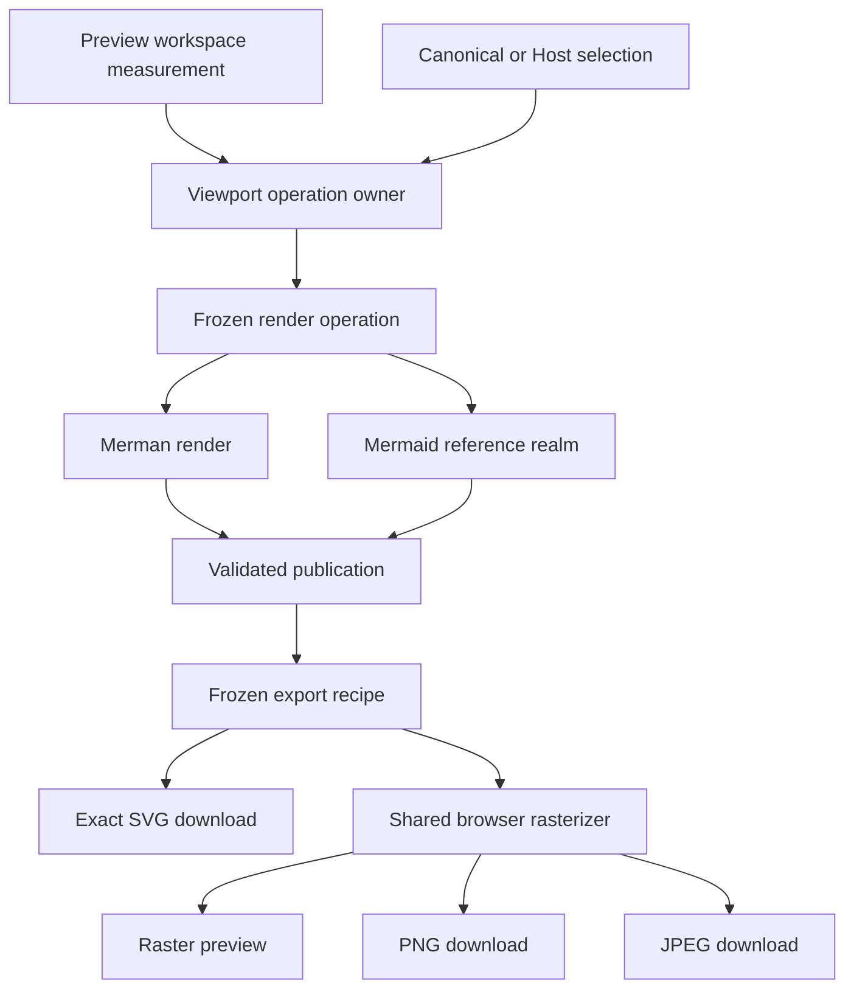
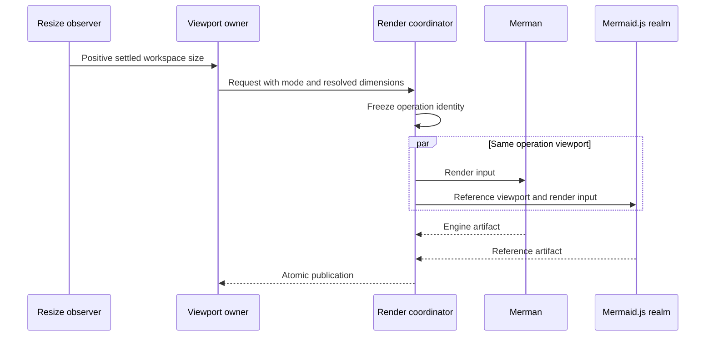
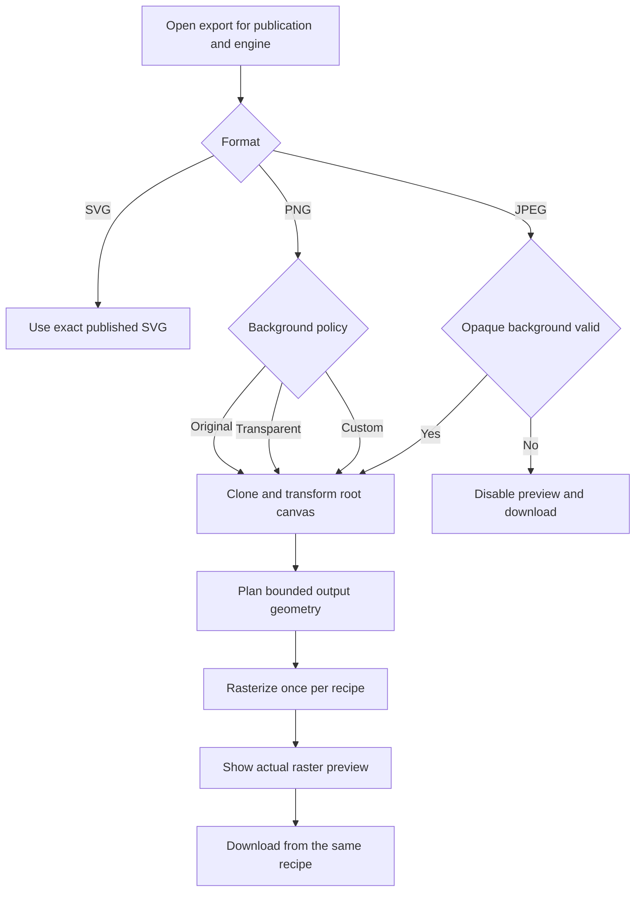
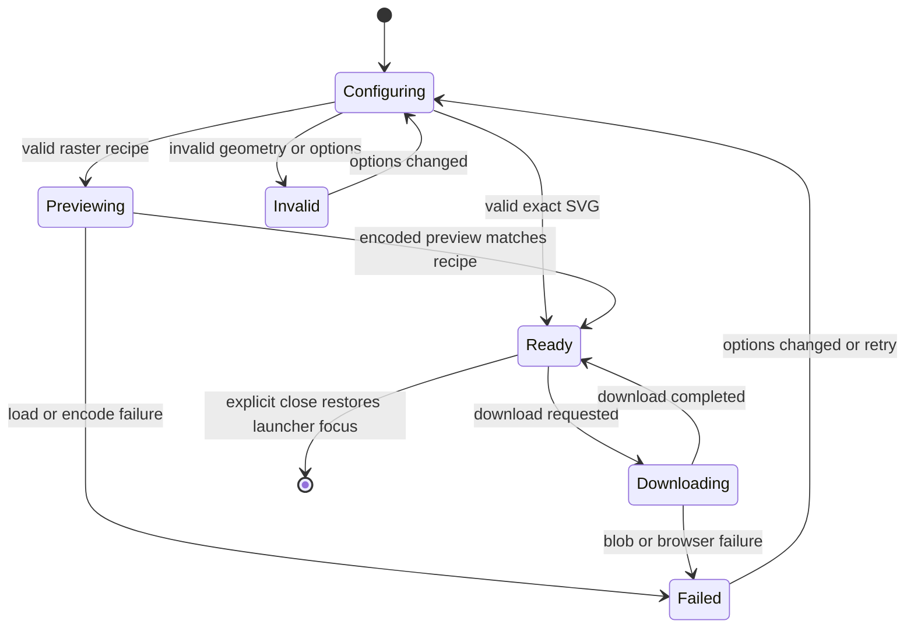
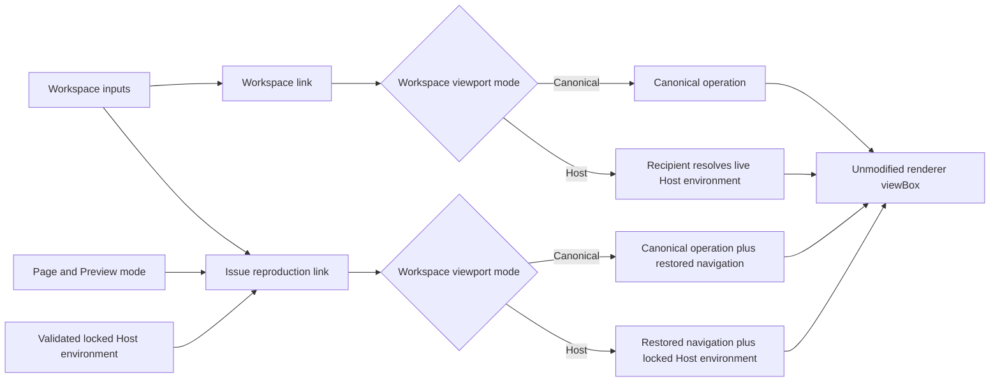

# Playground Host Viewport and Export Workbench - Plan

## Goal Capsule

| Field | Contract |
|---|---|
| Objective | Let Playground users compare Merman and Mermaid.js under either a deterministic canonical viewport or one shared host-sized viewport, export the current validated artifact as SVG, transparent or backed PNG, and backed JPEG, and share either a portable workspace or a controlled issue-reproduction context from a mobile-safe workflow. |
| Authority | Product requirements and session-settled decisions in this plan override implementation preferences. Pinned Mermaid behavior and existing parity contracts override visual convenience. |
| Execution profile | Deep cross-cutting frontend refactor with proof-first unit coverage, browser integration coverage, responsive visual inspection, and incremental Conventional Commits. |
| Stop conditions | Stop if both engines cannot receive the same frozen Playground-controlled layout environment, if export or Host presentation would mutate the current publication, or if transparency requires changing semantic diagram fills. |
| Tail ownership | The original Host/Export units landed through PR #66; `ce-work` owns U7 implementation, simplification, review, verification, and local commits on `feat/playground-share-view`. |

---

## Product Contract

### Summary

Add an explicit Canonical/Host viewport mode and replace the direct export shortcuts with one artifact-aware export workbench. Preserve deterministic parity by default while making host-sized integrations, raster consumer behavior, backgrounds, mobile export, and issue reproduction links explicit and reproducible.

### Problem Frame

The Playground currently freezes `800x600` as the render input while responsively fitting the resulting SVG into the visible pane. That separation is correct for parity and benchmarks, but users cannot deliberately render both engines against the dimensions of a real host container. Integrator defects can therefore be harder to reproduce even though presentation is responsive.

SVG and PNG downloads already exist, but PNG uses a fixed scale and inherits whatever root background the SVG happens to paint. Export ownership is split across toolbar handlers, per-engine Preview handlers, an artifact action union, a PNG-only planner, and browser Canvas helpers. This shape cannot express guaranteed transparency, custom backgrounds, JPEG encoding, a faithful raster preview, or mobile resource limits without multiplying paths.

The current share contract serializes raw JSON through Base64 and permits multi-megabyte workspace payloads, so a valid workspace can produce an impractical URL. The replacement therefore needs compression and a hard encoded envelope budget as part of the product contract, not merely as a transport optimization.

### Key Decisions

- **Keep Canonical and add Host as explicit modes.** (session-settled: user-approved — chosen over an unbounded or Host-only canvas: deterministic parity remains the default while integration sizing becomes inspectable.) Governs R1-R5.
- **Use one shared Host viewport for both Compare engines.** (session-settled: user-directed — chosen over measuring each Compare pane: per-pane dimensions would compare different layouts.) Governs R2-R3, R14.
- **Keep renderer `viewBox` ownership separate from Host and export sizing.** (session-settled: user-approved — chosen over a freely editable `viewBox`: Host presentation and export canvases may resize without mutating the engine-owned content coordinate system or hiding upstream clipping.) Governs R5, R16-R17.
- **Offer workspace links and issue-reproduction links as different promises.** (session-settled: user-approved — chosen over serializing every transient UI state into one link: ordinary sharing stays portable while issue links can lock the page, mode, and controlled Host environment needed to reproduce a defect.) Governs R18-R20.
- **Ship SVG, PNG, and JPEG in the same export workbench.** (session-settled: user-directed — chosen over deferring JPEG: the user authorized the complete format set with explicit background handling.) Governs R6-R11.
- **Treat mobile behavior as part of the feature.** (session-settled: user-approved — chosen over desktop-first follow-up work: viewport and export states must remain usable on supported narrow and landscape layouts.) Governs R12-R15.
- **Preserve pinned Mermaid renderer semantics.** (session-settled: user-approved — chosen over locally expanding Sequence title bounds: inherited upstream clipping stays visible rather than being hidden by a Merman-only semantic divergence.) Governs R16.

### Requirements

**Viewport modes**

- R1. Canonical mode remains the default and renders with a frozen `800x600` operation viewport.
- R2. Host mode captures one valid Preview workspace content size and freezes it into each render operation.
- R3. Compare mode passes the same frozen Host width and height to Merman and the Mermaid.js reference realm.
- R4. Benchmark operations always use the canonical viewport regardless of the interactive mode.
- R5. The UI exposes the selected mode and the effective dimensions without coupling presentation zoom or pan to layout input.

**Export artifacts**

- R6. SVG export downloads the current engine's validated published SVG without presentation-layer scaling or mutation.
- R7. PNG export supports Original, Transparent, and Custom background policies and produces an alpha-bearing file for Transparent.
- R8. JPEG export requires an opaque Original or Custom background, exposes integer quality from `1` through `100` with default `90`, labels the format as lossy, and never relies on implicit Canvas alpha conversion.
- R9. Raster export supports either a bounded scale or an explicit pixel-width, pixel-height, or fit box with locked aspect ratio, and displays the final planned dimensions before download.
- R10. Raster preview uses the same authority-resolved raster source, background policy, geometry plan, and encoded Blob as download.
- R11. Every export is bound to a current publication and selected engine; stale or failed publications cannot be downloaded under a newer result's identity.

**Responsive workflow and reliability**

- R12. Desktop uses one focused export dialog; narrow and landscape-mobile layouts use the same state model in a full-screen presentation.
- R13. Export format, background, quality, raster sizing, validation, busy, success, and failure states remain keyboard- and screen-reader-accessible.
- R14. Host resizing, workspace tab changes, Compare activation, and mobile orientation changes cannot mix viewport dimensions or artifacts across operations.
- R15. Raster planning rejects invalid geometry, caps side length and total pixels before allocation, and reports downscaling or browser encoding failure without crashing the page.
- R16. Viewport and export work preserve pinned Mermaid renderer semantics and do not add a Merman-only root-bounds workaround to hide inherited title clipping.
- R17. Host presentation constrains the mounted SVG to the bounded host with responsive width and height while preserving its engine-owned `viewBox`; changing Host or export dimensions never rewrites the published artifact's content bounds.
- R18. A workspace link contains render-affecting workspace inputs but omits device-specific Host pixels and transient navigation, so opening it resolves Host dimensions from the receiving device.
- R19. An explicit reproduction link adds the current workspace pane, editor tab, Preview mode, and a validated locked render environment when the shared workspace already selects Host. The lock includes Host width, Host height, and browser `screen.availWidth`; reopening the link feeds those same Playground-controlled inputs to both engines while documenting that browser/font residuals may remain.
- R20. Workspace and view state are independently versioned, compact, size-bounded, and atomically validated. Existing Base64 workspace hashes remain readable; an invalid or future view descriptor is rejected as a whole, restores documented local navigation/live-Host defaults, and exposes a non-blocking accessible warning instead of pretending exact restoration succeeded.

### Key Flows

- F1. Shared Host comparison
  - **Trigger:** A user selects Host viewport and opens Visual or Compare.
  - **Steps:** The workspace owner captures a valid size; the coordinator freezes it; Merman and Mermaid.js render from the same operation; the UI reports the effective dimensions.
  - **Outcome:** Layout differences are engine differences rather than pane-size differences.
  - **Covered by:** R1-R5, R14, R16.
- F2. Configured artifact export
  - **Trigger:** A user opens Export for the current engine artifact.
  - **Steps:** The dialog freezes the publication and engine; validates format-specific options; creates a bounded preview; then downloads that same recipe.
  - **Outcome:** The preview and file agree on geometry, background, format, and dimensions.
  - **Covered by:** R6-R11, R13, R15.
- F3. Narrow-screen editing and export
  - **Trigger:** A user edits while Preview is hidden, rotates the device, then opens Preview or Export.
  - **Steps:** The last valid Host size remains coherent; the visible workspace is measured after layout settles; a changed size creates a new operation; the dialog adapts without hiding controls.
  - **Outcome:** No zero-sized render, stale download, horizontal page overflow, or inaccessible action occurs.
  - **Covered by:** R2, R5, R11-R15.
- F4. Share a reproducible view
  - **Trigger:** A user needs another person to open the same Compare or diagnostic context used to report a defect.
  - **Steps:** The user chooses the reproduction-link action; the Playground serializes the workspace separately from an atomically validated view descriptor; the recipient hydrates both before React/render startup and then executes one operation using the locked environment when present.
  - **Outcome:** The recipient starts on the same page and Playground-controlled render context without inheriting operation identifiers or a rewritten SVG `viewBox`; unavoidable browser/font residuals remain visible rather than being misrepresented as deterministic.
  - **Covered by:** R17-R20.

### Acceptance Examples

- AE1. Covers R1, R4. Given Canonical mode in Compare, when the Preview pane is resized, both engines continue to receive `800x600` and Bench results are unchanged.
- AE2. Covers F1 / R2-R3, R5. Given Host mode and a `960x540` Preview workspace, when Compare renders, both engine snapshots report `960x540` even though their visible panes occupy different widths.
- AE3. Covers F3 / R2, R14. Given Host mode on mobile while Editor is visible, when source changes and Preview later becomes visible, no zero dimension is published and any changed workspace size produces one coherent rerender.
- AE4. Covers F2 / R6-R7. Given an SVG with a white root canvas and white semantic node fills, when Transparent PNG is selected, the root canvas becomes transparent while the node fills remain white.
- AE5. Covers F2 / R8-R10. Given transparent source pixels and a custom JPEG background, when preview and download run, both composite the selected color before encoding and produce matching dimensions.
- AE6. Covers F2 / R9, R15. Given a very large or long SVG and a `4x` request, when planning runs, the result stays within side and pixel limits, preserves aspect ratio, and visibly reports downscaling.
- AE7. Covers F2 / R10-R11. Given a dialog opened for publication A while publication B completes, when the user downloads, preview and file remain bound and visibly attributed to A until the dialog is explicitly closed; B never replaces the target in place.
- AE8. Covers F3 / R12-R15. Given `320x568` and `568x320` viewports, when every format and background state is exercised, controls remain reachable, preview remains bounded, and the document has no horizontal overflow.
- AE9. Covers F2 / R9. Given intrinsic geometry and a requested width, height, or fit box, when raster planning runs, the unspecified axis preserves aspect ratio and the preview/download recipe uses the displayed output dimensions.
- AE10. Covers F1 / R2-R3, R16. Given the long Sequence title reported in Zed issue 62410, when Host Compare renders it, Merman and pinned Mermaid.js receive the same operation viewport and expose the same upstream root-viewBox clipping behavior; the Playground does not hide it with a Merman-only bounds workaround.
- AE11. Covers F4 / R18-R19. Given Host Compare at `640x480` with `screen.availWidth=1512`, when the user copies a workspace link and an issue-reproduction link, the workspace link resolves the recipient's live Host environment while the reproduction link opens Compare and gives both engines the locked `640x480` and `1512` inputs.
- AE12. Covers F4 / R19-R20. Given a legacy hash, an unsupported view version, or invalid/oversized view fields, when the Playground opens the link, the workspace remains backward compatible, the complete view descriptor is rejected before store mutation, local navigation/live-Host defaults apply, and an accessible warning explains that the reproduction context was not restored.
- AE13. Covers R17. Given an SVG whose title extends outside the engine-owned `viewBox`, when Canonical, Host, and export sizing change, the published SVG `viewBox` is unchanged and the Playground does not imply that responsive sizing repaired the renderer bounds.

### Success Criteria

- Visual and Compare browser tests prove both viewport modes with operation-level dimension assertions.
- Export tests inspect SVG text, PNG alpha/background pixels, JPEG MIME/dimensions/background pixels, and oversized-plan behavior.
- Mobile browser tests exercise the complete export path, not only opening the menu.
- Desktop and mobile screenshots show no overlap, clipped controls, or layout shift across mode and export state changes.
- Current Canonical Compare, Benchmark, SVG download, PNG download, share-link, and viewport gesture tests remain green or are replaced by stronger equivalent coverage.
- Workspace and issue-reproduction links are visibly distinct, legacy links remain readable, and one browser test proves a locked layout environment on a differently sized recipient viewport without claiming cross-browser pixel identity.

### Scope Boundaries

**In scope**

- Breaking and deleting Playground-internal viewport, export action, planner, feedback, and UI APIs when the replacement has one clear owner.
- Backward-compatible decoding of existing share hashes, with Canonical as the default for hashes that predate viewport mode.
- A versioned compact share envelope, explicit current-view reproduction state, and responsive Host presentation that preserves renderer-owned SVG bounds.
- Real-browser validation in Chromium plus the existing non-Chromium smoke lane.

**Outside this product's identity**

- Changing Merman parser, layout, renderer, or pinned Mermaid semantics to conceal an upstream SVG root-bound defect.
- Adding PDF, WebP, print layout, cloud storage, upload, telemetry, or a general image editor.
- Adding a server-backed short-link service, automatically syncing every pan/zoom gesture into browser history, or exposing raw `viewBox` editing as a normal Playground control.
- Claiming pixel parity between browser Canvas encoders, native `resvg`, and Mermaid's browser rendering.

---

## Planning Contract

### Key Technical Decisions

- KTD1. **Viewport mode is operation input.** The selected mode, effective dimensions, and Host-measuring fallback state are captured before debounce/execution and participate in operation identity; presentation ResizeObserver updates never mutate an in-flight operation. Before the first positive Host measurement, selecting Host creates a new `mode=host`, `effective=800x600`, `measuring=true` operation rather than retaining an older publication; the first positive measurement creates the next Host operation. Implements R1-R5 and R14.
- KTD2. **One workspace measurement owner feeds both engines.** Host mode measures the unsplit Preview workspace allocation, not Merman/Mermaid panes, and retains the last positive finite size through hidden-tab and transient zero-size states. (session-settled: user-directed — chosen over per-pane measurement: Compare requires identical layout inputs.) Implements R2-R3 and R14.
- KTD3. **Benchmark owns its canonical constant.** Interactive viewport selection does not enter benchmark corpus or benchmark realm inputs. Implements R4.
- KTD4. **Export freezes a typed recipe behind artifact authority.** One recipe binds publication, engine, format, background policy, raster sizing, JPEG quality, authority-resolved raster source, and planned output geometry before preview or download. Exact SVG uses the validated publication artifact; Merman raster uses a `resvg-safe` derivative of that publication's frozen operation, while Mermaid.js raster uses its validated publication artifact. The dialog never retargets after opening; later publications leave this labeled snapshot intact until explicit close. Implements R6-R11 and R15.
- KTD5. **Root background transformation is narrow, structured, and browser-owned.** Export clones and parses the SVG with browser DOM APIs, changes only the root canvas background, and never rewrites descendant fills or the published artifact. Implements R6-R8 and AE4.
- KTD6. **One raster planner replaces PNG-only planning.** Format-neutral geometry planning mirrors native scale, width, height, and fit-box sizing, retains the Rust planner's rounding and aspect-ratio behavior, and enforces the authoritative `4096` side and `16,777,216` pixel limits before Canvas allocation. Implements R9, R10, R15, and AE9.
- KTD7. **One browser rasterizer serves preview, PNG, and JPEG.** It loads a transformed SVG Blob, draws into a bounded Canvas, explicitly paints opaque JPEG backgrounds, checks the returned Blob MIME, revokes object URLs, and returns typed failures. Implements R7-R10 and R15.
- KTD8. **The export dialog owns configuration and lifecycle.** Toolbar and per-engine Compare controls launch the dialog with an artifact target; they no longer contain format-specific download handlers or busy sets. Implements R10-R13. (session-settled: user-directed — chosen over incrementally extending direct handlers: broad internal breaking refactors and obsolete-code deletion are authorized.)
- KTD9. **Responsive UI is one component tree.** Desktop dialog and mobile full-screen presentation share state, validation, and action ownership; CSS and media queries change composition without duplicating export logic. Implements R12-R13.
- KTD10. **Share has separate workspace and view contracts.** Workspace links serialize the render-affecting workspace, including Canonical/Host intent, and let Host pixels resolve locally. Issue-reproduction links add an optional view descriptor containing workspace pane, editor tab, Preview mode, and a locked environment only when the workspace already selects Host. `renderViewportMode` remains workspace-owned and is never duplicated in the view descriptor. (session-settled: user-approved — chosen over one all-purpose link: portable sharing and controlled issue reproduction need different promises.) Implements R1-R2, R5, and R18-R20.
- KTD11. **Responsive presentation never owns content bounds.** Host mode mounts a validated presentation clone into a bounded contain-style surface using `width`, `height`, `max-width`, and `max-height` constraints. A valid engine `viewBox` is preserved byte-for-byte; an SVG lacking one may receive a preview-only intrinsic width/height fallback, but presentation never calls browser bounds or widens content to hide clipping, and the published/export artifact is unchanged. (session-settled: user-approved — chosen over editable `viewBox` sizing: presentation must not conceal pinned Mermaid behavior.) Implements R5, R16-R17, and AE13.
- KTD12. **New workspace and view wire formats are independently versioned.** New workspace fragments use the externally visible `#s2:` prefix and a synchronous URL-safe zlib/Base64URL envelope backed by the audited `fflate@0.8.2` runtime dependency. The encoded workspace envelope is capped at `512 KiB`; decoded fields remain constrained by `SHARE_LIMITS`. View state uses a separate `rv=1` query version. Each workspace version owns an immutable complete default snapshot; decoders never borrow future application defaults. Legacy uncompressed Base64 JSON remains a separate decode path. Implements R18-R20.
- KTD13. **Share decoding is bounded before publication.** Startup synchronously decodes and atomically applies workspace, view, and any lock before React mounts. Compressed input is rejected above the `512 KiB` encoded cap, streaming decompression stops before the existing `SHARE_LIMITS.jsonBytes` decoded budget, malformed workspace writes nothing, and malformed/future view state discards the whole optional view layer with one accessible warning. Implements R19-R20 and AE12.
- KTD14. **Live measurement and reproduction lock have separate owners.** ResizeObserver always updates the latest positive live Host environment, while an optional reproduction lock wins only for effective operation capture. Host measuring disables issue-reproduction copying; clearing a lock atomically switches to the cached live environment and produces exactly one new operation. Temporary Canonical selection does not destroy a Host lock; only the explicit return-to-live action does. Implements R2, R14, R19, and AE11.
- KTD15. **A reproduction lock covers all controlled layout inputs.** The descriptor locks Host width, Host height, and `screenAvailableWidth`; the opaque Mermaid realm receives the same emulated `screen.availWidth` before Mermaid loads. If that reference environment cannot be established, the operation fails visibly rather than comparing engines under different inputs. Browser/font/text-measurement residuals remain documented and are not labeled exact. Implements R3, R19, and AE11.
- KTD16. **Copying a link is a pure command.** Workspace and issue-reproduction actions construct and copy their canonical URLs without mutating the current address bar or runtime state. Returning a loaded lock to live Host is the only flow that removes reproduction parameters with `history.replaceState`, keeping URL and effective owner coherent. Implements R18-R20.

### Assumptions

- SVG remains an exact-artifact export with no background override; background controls apply only to PNG and JPEG derivatives.
- The existing Merman `resvg-safe` raster-source preparation remains part of artifact authority so browser rasterization does not regress supported `<foreignObject>` fallbacks or artifact-version checks.
- Original is the default PNG background policy. JPEG defaults to quality `90`; when the source root is not provably opaque, the UI explicitly selects Custom `#ffffff` rather than silently changing Original semantics.
- Raster sizing defaults to Scale `2x`, offers bounded `1x`, `2x`, `3x`, and `4x` choices, and also offers Width, Height, and Fit box pixel modes. Width/Height edit one axis and derive the other; Fit box edits both maximum axes; aspect ratio is always locked. Format switches preserve valid sizing drafts, while temporary invalid input retains the last successful preview and disables download.
- Host mode reacts to a settled workspace resize with one debounced rerender; it does not continuously scale layout during pointer-driven pane resizing.
- A reproduction link with a locked environment temporarily owns the Host operation inputs until the user explicitly returns to live Host measurement; a workspace link never locks recipient dimensions.
- Camera pan/zoom remains presentation-only and is not required in the first reproduction-link schema; it may be added later as an optional view field without changing the workspace contract.
- The first share-view schema restores workspace pane, editor tab, and Preview mode but not diagnostic sub-tabs, editor cursor/scroll, or viewport camera.
- Browser rasterization uses platform APIs and existing dependencies. A new production image-encoding or DOM simulation dependency is unnecessary unless implementation proves a required browser cannot satisfy R7-R10.

### High-Level Technical Design

### System-Wide Impact

- **Render identity:** Viewport mode, effective Host dimensions, and `screenAvailableWidth` become first-class operation inputs and must remain coherent across Merman, Mermaid.js, diagnostics, and publication guards.
- **Share compatibility:** Workspace and view state become separate contracts; legacy hashes remain readable, workspace links keep Host pixels local, and issue-reproduction links may intentionally lock a validated Host environment.
- **Artifact authority:** Global toolbar and Compare pane actions converge on the same artifact action owner and publication guard.
- **Resource posture:** Raster previews and downloads share explicit pixel budgets, cleanup, cancellation, and error projection.
- **Accessibility and localization:** New labels, errors, format choices, dimensions, share promises, locked/live ownership, and background controls require English and Chinese strings, distinct accessible descriptions, one-shot announcements, and focus restoration.

### Risks and Mitigations

| Risk | Mitigation |
|---|---|
| ResizeObserver feedback creates render loops | Measure a stable workspace owner, compare normalized dimensions, debounce settled changes, and keep presentation fit outside operation identity. |
| Hidden mobile Preview reports zero dimensions | Ignore non-positive measurements and retain the last valid workspace snapshot until a positive visible measurement arrives. |
| Compare panes accidentally receive different widths | Resolve viewport once above Compare and assert equality in coordinator and browser tests. |
| A shared link silently changes meaning across releases | Version the workspace and view contracts independently, omit unsupported optional view state, and retain legacy decode fixtures. |
| Locked Host dimensions are confused with live measurement | Label reproduction-owned dimensions, provide an explicit return-to-live action, and keep workspace links dimension-free. |
| Responsive CSS is mistaken for a renderer-bounds fix | Assert the published SVG `viewBox` is unchanged across Canonical, Host, and export presentation paths. |
| Compressed input expands beyond the workspace budget | Route by an external version prefix, use streaming synchronous decompression, and abort before decoded bytes exceed the existing JSON budget. |
| Recipient `screen.availWidth` changes C4 despite locked Host dimensions | Capture one locked render environment and emulate the same screen width in the opaque Mermaid realm before engine load. |
| Copying one link type changes the active lock or URL | Keep both copy actions pure; only the explicit return-to-live transition rewrites current view parameters. |
| Transparent export removes semantic white fills | Transform only the root SVG canvas style/attribute on a parsed clone and verify descendant pixels. |
| JPEG transparency becomes black | Paint the validated opaque background before `drawImage` and test pixel output. |
| Huge raster requests exhaust browser memory | Enforce the native `4096` side and `16,777,216` pixel limits before allocation, show downscaling, and project an earlier platform failure when a browser is more restrictive. |
| Publication changes while Export is open | Keep the visibly labeled dialog target frozen to its opening publication and engine; never retarget it in place, and release it only on explicit close. |
| Browser encoder silently falls back to PNG | Validate Blob MIME against the requested format and project a typed unsupported-format error. |

### Sources and Research

- `docs/adr/0074-browser-runtime-and-benchmark-ownership.md` owns immutable render-operation and reference-realm inputs.
- `docs/plans/2026-07-19-001-refactor-mermaid-parity-editor-release-alignment-plan.md` fixes Canonical Compare and Benchmark at `800x600` while presentation remains responsive.
- `docs/plans/2026-08-05-001-refactor-playground-architecture-tooling-plan.md` centralizes artifact action ownership and defines the mobile workbench contract.
- `docs/adr/0059-raster-output-strategy.md` and `docs/rendering/RASTER_OUTPUT.md` define bounded raster planning and opaque JPEG behavior.
- `docs/rendering/SVG_OUTPUT_PIPELINE.md` defines host-owned root canvas background semantics.
- `docs/workstreams/web-wasm-playground/MOBILE_QA.md` defines supported narrow, landscape, touch, and visual-viewport checks.
- [HTML Canvas bitmap serialization](https://html.spec.whatwg.org/multipage/canvas.html#serialising-bitmaps-to-a-file) requires explicit non-alpha compositing behavior.
- [MDN Canvas limits](https://developer.mozilla.org/en-US/docs/Web/HTML/Reference/Elements/canvas) documents mobile allocation constraints.
- [Mermaid Live export actions](https://github.com/mermaid-js/mermaid-live-editor/blob/develop/src/lib/components/Actions.svelte) separate export dimensions and backgrounds from preview pan/zoom.
- [Mermaid Live state serialization](https://github.com/mermaid-js/mermaid-live-editor/blob/develop/CLAUDE.md) uses a compressed URL fragment and carries navigation/pan-zoom state, establishing compressed client-only links as viable prior art.
- [tldraw deep links](https://tldraw.dev/sdk-features/deep-links) separate page/viewport targeting from document content, informing the workspace-versus-view contract.
- [draw.io publish and embed options](https://www.drawio.com/doc/faq/embed-html-options) expose page and zoom/fit choices explicitly, informing the separate reproduction-link action instead of silently serializing every transient gesture.
- [Graphviz JPEG output](https://graphviz.org/docs/outputs/jpg/) records JPEG's lossy text and line tradeoff, which informs default quality and format labeling.

---

## Implementation Units

### U1. Make viewport mode a frozen render input

**Goal:** Replace the fixed interactive viewport constant with a typed Canonical/Host resolution boundary while preserving the canonical benchmark contract.

**Requirements:** R1-R5, R14; KTD1-KTD3.

**Dependencies:** None.

**Files:**

- Modify `playground/src/runtime/render-viewport.ts`.
- Modify `playground/src/runtime/render-coordinator-browser.ts`.
- Modify `playground/src/runtime/render-coordinator.ts`.
- Modify `playground/src/runtime/merman-operation-input.ts`.
- Modify `playground/src/runtime/RenderCoordinatorBridge.tsx`.
- Modify `playground/src/runtime/render-coordinator.test.ts`.
- Modify `playground/src/runtime/merman.test.ts` when its operation fixtures require the new viewport contract.
- Modify `playground/src/benchmark/corpus-browser.ts`.
- Modify `playground/src/components/BenchDialog.tsx`.
- Modify `playground/tests/playground.smoke.spec.ts`.

**Approach:**

1. Introduce normalized viewport mode and resolved viewport values at the render-operation boundary. Round ResizeObserver width/height to integer CSS pixels, then reuse `validateRealmViewport` and its `4096` side / `16,777,216` pixel budget before either engine receives the value.
2. Keep one canonical viewport constant while making Benchmark select it independently from interactive mode.
3. Make operation equality and publication snapshots include mode and dimensions.
4. Reject invalid Host dimensions before execution and retain the previous valid request rather than publishing a zero-sized operation.

**Execution note:** Strengthen coordinator characterization tests before changing operation identity and observe the expected failure for a Host-mode request.

**Patterns to follow:** Immutable snapshot construction in `playground/src/runtime/render-coordinator.ts`; layout-environment normalization in `playground/src/runtime/merman-operation-input.ts`; benchmark input ownership in `playground/src/benchmark/corpus-browser.ts`.

**Test scenarios:**

1. Canonical requests remain `800x600` and compare equal across repeated pane resizes.
2. Host requests with a positive finite size change operation identity and reach both Merman layout environment and Mermaid reference viewport.
3. Width or height values that round below one, are negative, `NaN`, infinite, or exceed the realm layout budget never create a Host-sized operation and leave the Host measuring fallback/last valid request intact.
4. Two Compare engine requests from one operation contain identical viewport dimensions.
5. Benchmark corpus requests remain canonical while the interactive store is in Host mode.

**Verification:** Focused runtime tests prove operation normalization, equality, invalid-size handling, and benchmark isolation without requiring browser layout.

### U2. Add shared Host measurement and viewport controls

**Goal:** Let users select Canonical or Host and see the effective shared dimensions across desktop, Compare, share links, and hidden mobile workspaces.

**Requirements:** R1-R5, R14, R16; KTD1-KTD2.

**Dependencies:** U1.

**Files:**

- Modify `playground/src/App.tsx`.
- Refactor `playground/src/components/Preview.tsx`.
- Modify `playground/src/components/ToolbarControls.tsx`.
- Create `playground/src/components/RenderViewportControl.tsx`.
- Modify `playground/src/lib/workspace-snapshot.ts`.
- Modify `playground/src/lib/share.ts`.
- Modify `playground/src/lib/share.test.ts`.
- Modify `playground/src/store/index.ts`.
- Modify `playground/src/store/index.test.ts`.
- Modify `playground/src/i18n/locales/en.json`.
- Modify `playground/src/i18n/locales/zh.json`.
- Modify `playground/tests/viewport-workspace.spec.ts`.
- Modify `playground/tests/mobile.interactions.spec.ts`.

**Approach:**

1. Replace duplicated Preview early-return panel wrappers with one stable panel owner that remains above Visual/Compare pane splitting.
2. Measure that stable Preview workspace allocation and use Canonical as the initial fallback until the first positive Host measurement exists; expose this as a Host measuring state rather than implying `800x600` is already host-derived.
3. Feed settled positive dimensions to the coordinator and preserve the last valid value through hidden or transient layouts.
4. Present Canonical/Host as a compact segmented mode control with the effective dimensions adjacent to the selection. While Host has no positive measurement, retain the Host selection and announce that Canonical `800x600` is the current fallback; announce the effective Host dimensions when they arrive.
5. Serialize the mode in portable workspace links and decode absent mode as Canonical without serializing measured pixels; U7 adds a separate explicit reproduction descriptor.

**Execution note:** Prove desktop resize, hidden mobile Preview, and legacy share behavior before replacing the fixed capture path.

**Patterns to follow:** Existing workspace Tabs in `playground/src/App.tsx`; store snapshot selection in `playground/src/store/index.ts`; backward-compatible optional fields in `playground/src/lib/share.ts`; ResizeObserver cleanup in `playground/src/components/SvgViewport.tsx`.

**Test scenarios:**

1. Selecting Host captures the full Preview workspace and reports the same dimensions in Visual and Compare.
2. Side-by-side Compare pane widths differ visually but engine operation dimensions remain identical.
3. Rapid pane resizing publishes only the settled effective size and does not loop.
4. Hidden mobile Preview never overwrites the last valid Host dimensions with zero, and first use exposes a Host measuring / Canonical fallback state until a positive measurement exists.
5. Rotating from `320x568` to `568x320` triggers one coherent Host rerender after layout settles.
6. Share hashes that predate viewport mode load Canonical; Base64 links that already contain the mode preserve it and resolve current-device Host pixels, while U7 separately proves locked issue-reproduction links.
7. Keyboard and screen-reader users can select either mode and read the effective dimensions.
8. The Zed issue 62410 long-title fixture renders both engines with one Host operation viewport and retains the pinned Mermaid root-viewBox behavior without a renderer workaround.

**Verification:** Store/share unit tests and Playwright viewport tests prove persistence, resize behavior, Compare equality, accessibility, and no page overflow.

### U3. Replace PNG-only planning with typed export recipes

**Goal:** Centralize format, background, geometry, quality, publication, and engine decisions before any browser side effect.

**Requirements:** R6-R11, R15; KTD4-KTD6.

**Dependencies:** None.

**Files:**

- Create `playground/src/lib/raster-export-plan.ts`.
- Create `playground/src/lib/raster-export-plan.test.ts`.
- Keep `playground/src/lib/png-export-plan.ts` as a temporary compatibility entry until U4 migrates its browser caller.
- Keep `playground/src/lib/png-export-plan.test.ts` only until equivalent planner coverage passes through the new module.
- Modify `playground/src/runtime/artifact-actions.ts`.
- Modify `playground/src/runtime/artifact-actions.test.ts`.
- Modify `playground/package.json` test targets.

**Approach:**

1. Generalize the existing raster geometry planner to the native scale/width/height/fit-box contract with fixed `4096` side and `16,777,216` pixel limits.
2. Define discriminated sizing, format, and background policies so invalid geometry, JPEG transparency, out-of-range quality, and ambiguous derived axes are unrepresentable after validation.
3. Freeze export recipes from the current publication and selected engine before browser IO, preserving Merman's operation-bound `resvg-safe` preparation and Mermaid.js's validated publication artifact path.
4. Move pure planning and artifact-action callers to the new recipe while leaving a narrow compatibility entry for `export.ts`; U6 removes it after U4 migrates the browser caller.

**Execution note:** Start with planner and recipe tests, including red tests for explicit-width, explicit-height, and fit-box requests.

**Patterns to follow:** Current publication guards in `playground/src/runtime/artifact-actions.ts`; bounded planning in `playground/src/lib/png-export-plan.ts`; root-only transformation semantics in `crates/merman-render/src/svg/pipeline/builtin/root_background.rs`.

**Test scenarios:**

1. SVG recipes retain the exact validated artifact and reject raster-only options.
2. PNG accepts Original, Transparent, and valid Custom colors.
3. JPEG rejects Transparent, rejects Original for a source without a provably opaque root background, and rejects quality outside integer `1..=100` or invalid background inputs.
4. Scale, width, height, and fit-box sizing preserve aspect ratio and report the exact final dimensions.
5. Raster planning preserves native rounding and caps huge/skinny/pixel-budget behavior at `4096` and `16,777,216` pixels for PNG and JPEG.
6. A stale publication or unavailable engine artifact fails before browser transformation or allocation.

**Verification:** Node tests prove recipe validation, artifact identity, stale-publication rejection, and parity with existing planner fixtures; root-only DOM mutation remains browser-owned in U4.

### U4. Build one bounded browser rasterizer

**Goal:** Produce real preview, PNG, and JPEG blobs through one cleanup-safe browser pipeline with explicit background and MIME behavior.

**Requirements:** R7-R11, R15; KTD4-KTD7.

**Dependencies:** U3.

**Files:**

- Refactor `playground/src/lib/export.ts`.
- Refactor `playground/src/lib/svg-geometry.ts` for cloned root-canvas preparation.
- Modify `playground/src/runtime/artifact-actions-browser.ts`.
- Modify `playground/src/runtime/artifact-actions.ts`.
- Modify `playground/src/runtime/artifact-actions.test.ts`.
- Modify `playground/tests/svg-geometry.spec.ts`.
- Modify `playground/tests/render.presentation.spec.ts`.
- Modify `playground/tests/cross-browser.smoke.spec.ts`.

**Approach:**

1. Deepen the existing `export.ts` browser boundary around DOMParser, Blob, Image, Canvas, object URL, preview, and download effects; keep pure recipe/planning work in U3 rather than adding single-consumer browser wrappers.
2. Clone and transform only the SVG root canvas in the browser, with Playwright as the authoritative DOM/background proof.
3. Allocate Canvas only after a bounded plan exists and explicitly paint the JPEG background before drawing SVG pixels.
4. Return a reusable encoded preview result keyed by the frozen recipe so download does not silently use different options.
5. Validate encoder MIME, revoke every URL, dispose stale preview work, and project load, taint, allocation, and encoding failures.
6. Keep exact SVG download outside the rasterizer but behind the same publication authority.

**Execution note:** Use browser integration tests as the authoritative proof for alpha and JPEG pixel behavior; DOM mocks alone are insufficient.

**Patterns to follow:** Existing Blob/Image cleanup in `playground/src/lib/export.ts`; error projection in `playground/src/runtime/error-projection.ts`; current huge-SVG browser test in `playground/tests/render.presentation.spec.ts`.

**Test scenarios:**

1. Transparent PNG contains alpha-zero root pixels and preserves opaque semantic fills.
2. Original PNG matches the source root background.
3. Custom PNG and JPEG contain the selected corner background pixel.
4. JPEG output has `image/jpeg`, expected dimensions, and no transparent-to-black fallback.
5. Browser root transformation preserves white semantic descendant fills under Transparent output.
6. A browser MIME fallback is detected and reported instead of downloaded under a false extension.
7. Oversized and long diagrams are bounded before allocation and report the actual dimensions.
8. Replacing a recipe cancels or ignores stale preview completion and revokes its object URLs.
9. Chromium and non-Chromium smoke paths can encode the supported formats or surface a deliberate unsupported error.

**Verification:** U3 unit tests prove pure planning and validation once; Playwright provides the authoritative cleanup-visible behavior, downloads, decoded pixels, MIME, and dimensions in real browsers.

### U5. Replace direct actions with the export workbench

**Goal:** Give global Visual and per-engine Compare artifacts one coherent, accessible dialog for format, preview, background, raster sizing, quality, and download.

**Requirements:** R5-R13, R15; KTD4, KTD8, KTD9.

**Dependencies:** U2, U3, U4.

**Files:**

- Create `playground/src/components/ExportDialog.tsx`.
- Create `playground/src/components/ExportPreview.tsx`.
- Modify `playground/src/App.tsx` to own one dialog target/provider above Toolbar and Preview.
- Modify `playground/src/components/ToolbarControls.tsx`.
- Refactor `playground/src/components/ToolbarArtifactActions.tsx`.
- Refactor `playground/src/components/Preview.tsx`.
- Refactor `playground/src/components/CompareView.tsx`.
- Delete or replace `playground/src/components/png-export-feedback.ts` with format-neutral feedback.
- Modify `playground/src/i18n/locales/en.json`.
- Modify `playground/src/i18n/locales/zh.json`.
- Modify `playground/tests/playground.ui.spec.ts`.
- Modify `playground/tests/render.presentation.spec.ts`.

**Approach:**

1. Install one App-level export workbench owner and launch it with a frozen engine/publication target from the global toolbar or a Compare pane.
2. Use format tabs, background segmented choices, a color swatch/input, Scale/Width/Height/Fit sizing modes with permanently locked aspect ratio, and a `1`-to-`100` JPEG quality slider with concise lossy-format text. Preserve valid sizing drafts across format switches; keep separate PNG and JPEG background drafts so JPEG's explicit white does not overwrite a PNG Transparent choice.
3. Show intrinsic and final dimensions, downscaling, busy state, actual raster preview, and actionable validation/errors without shifting the dialog layout. Temporary invalid drafts retain the last successful preview, disable download, and associate the error with the first invalid control.
4. Keep copy-code, copy-Markdown, copy-SVG, ASCII, Mermaid Live, and share actions outside the image export configuration surface.
5. Remove format-specific callbacks and busy-state sets from Toolbar, Preview, and Compare after the dialog owns them.

**Execution note:** Add interaction tests against the old direct-action contract first, then replace them with dialog-level behavior and remove obsolete handlers in the same unit.

**Patterns to follow:** Existing Radix Dialog/Tabs/Input components under `playground/components/ui`; artifact-target actions in `playground/src/components/CompareView.tsx`; focus restoration and toast conventions in `playground/src/components/ToolbarArtifactActions.tsx`.

**Test scenarios:**

1. Global Export opens for the current Merman publication, defaults to exact SVG, and does not auto-download.
2. Compare Export opened from Merman or Mermaid displays and downloads that engine's artifact only.
3. PNG background and sizing choices update the actual preview and dimensions without rerendering the diagram.
4. JPEG disables Transparent, explicitly selects Custom white when Original is not provably opaque, and exposes quality with an accessible value.
5. Changing source, Host size, or orientation while the dialog is open does not retarget it; preview and download remain visibly bound to the opening publication until explicit close.
6. Download success stays Ready with a polite status; encoder failure stays inside the dialog with an alert and retry focus. Escape or explicit close restores focus to the launching control.
7. Long dimensions, translated labels, and errors remain inside the dialog at desktop widths.
8. Previewing and Downloading expose `aria-busy`; final dimensions, downscaling, and success use one polite status region; invalid controls use `aria-describedby`; encoding failure exposes one alert without duplicating the error in another live region.

**Verification:** Component-facing Playwright tests prove engine targeting, format controls, preview/download agreement, stale target handling, keyboard navigation, and focus restoration.

### U6. Finish responsive behavior, documentation, and regression coverage

**Goal:** Make the complete viewport and export workflow reliable at supported mobile dimensions and leave no obsolete implementation or documentation behind.

**Requirements:** R2, R5, R9-R15; KTD2, KTD8, KTD9.

**Dependencies:** U1-U5.

**Files:**

- Modify `playground/src/App.tsx` as needed for stable mobile workspace measurement.
- Modify `playground/src/styles/globals.css`.
- Modify `playground/src/components/ExportDialog.tsx`.
- Modify `playground/src/runtime/render-artifact.ts`.
- Modify `playground/src/runtime/render-artifact.test.ts`.
- Delete `playground/src/lib/png-export-plan.ts`.
- Delete `playground/src/lib/png-export-plan.test.ts`.
- Modify `playground/tests/mobile.interactions.spec.ts`.
- Modify `playground/tests/render.presentation.spec.ts`.
- Modify `playground/tests/cross-browser.smoke.spec.ts`.
- Modify `docs/workstreams/web-wasm-playground/MOBILE_QA.md`.
- Modify `docs/workstreams/web-wasm-playground/MERMAID_COMPARE_MODE.md`.
- Modify `docs/workstreams/web-wasm-playground/DESIGN.md`.

**Approach:**

1. Present the dialog as a bounded desktop surface and a full-screen mobile workflow with safe-area padding and scrollable settings/preview regions.
2. Verify portrait, landscape, shortened visual viewport, orientation changes, and touch interactions without changing the shared state model.
3. Add real download assertions on mobile and retain manual iOS Safari/Android Chrome residuals where automation cannot prove browser chrome or share-sheet behavior.
4. Delete old PNG-only planner, direct image export handlers, unused translations, and compatibility adapters after all tests use the new contract.
5. Update durable Playground docs to distinguish Canonical operation viewport, Host operation viewport, responsive presentation, and export dimensions.

**Execution note:** Treat screenshots and pixel checks as acceptance evidence; code-level responsive review is not sufficient for this unit.

**Patterns to follow:** Existing mobile workspace contract in `playground/src/App.tsx`; safe-area and viewport rules in `playground/src/styles/globals.css`; test matrix and manual residual format in `docs/workstreams/web-wasm-playground/MOBILE_QA.md`.

**Test scenarios:**

1. At `320x568`, every export format, background control, preview, dimension warning, and download action remains reachable without page overflow.
2. At `568x320`, the dialog scrolls internally, primary action stays reachable, and no text overlaps adjacent controls.
3. A shortened visual viewport does not overwrite valid Host dimensions or hide dialog actions.
4. Orientation changes update Host dimensions coherently and keep an open export recipe bound to its publication.
5. Touch pan/pinch in the diagram remains independent from dialog scrolling and export preview interaction.
6. Mobile PNG and JPEG downloads satisfy MIME, dimensions, and pixel-background assertions within the fixed browser limits.
7. Legacy direct export controls, `exportFormats` capability fields, unused PNG translations, PNG feedback helpers, handlers, and busy sets are absent from source and tests.

**Verification:** The mobile Playwright lane, desktop Chromium lane, non-Chromium smoke lane, screenshots, and source searches prove the final responsive contract and cleanup.

### U7. Add workspace and issue-reproduction share links

**Goal:** Preserve portable workspace sharing while allowing issue reports to reopen the same page, editor tab, Preview mode, and controlled locked Host environment without exposing renderer `viewBox` editing.

**Requirements:** R17-R20; KTD10-KTD16.

**Dependencies:** U1, U2, U6.

**Files:**

- Create `playground/src/lib/share-view.ts`.
- Create `playground/src/lib/share-view.test.ts`.
- Refactor `playground/src/lib/share.ts`.
- Modify `playground/src/lib/share.test.ts`.
- Modify `playground/src/main.tsx`.
- Modify `playground/src/store/index.ts`.
- Modify `playground/src/store/index.test.ts`.
- Modify `playground/src/App.tsx`.
- Modify `playground/src/components/ToolbarArtifactActions.tsx`.
- Modify `playground/src/components/RenderViewportControl.tsx`.
- Modify `playground/src/components/SvgViewport.tsx` only where the responsive presentation contract needs one owner.
- Modify `playground/src/runtime/RenderCoordinatorBridge.tsx`.
- Modify `playground/src/runtime/render-viewport.ts`.
- Modify `playground/src/runtime/render-viewport.test.ts`.
- Modify `playground/src/runtime/realm/channel-protocol.ts`.
- Modify `playground/src/runtime/realm/channel-protocol.test.ts`.
- Modify `playground/src/runtime/realm/browser-realm-channel.ts`.
- Modify `playground/src/runtime/realm/browser-realm-channel.test.ts`.
- Modify `playground/src/runtime/realm/compare-bootstrap.ts`.
- Modify `playground/src/runtime/realm/compare-bootstrap.test.ts`.
- Modify `playground/src/lib/svg-geometry.ts`.
- Modify `playground/src/i18n/locales/en.json`.
- Modify `playground/src/i18n/locales/zh.json`.
- Modify `playground/package.json` to include `share-view.test.ts` in `test:runtime` and add the codec dependency.
- Modify `playground/package-lock.json` for `fflate@0.8.2`.
- Regenerate `playground/public/THIRD_PARTY_LICENSES/npm-production-dependencies.txt`.
- Modify `playground/tests/viewport-workspace.spec.ts`.
- Modify `playground/tests/playground.smoke.spec.ts`.
- Modify `playground/tests/render.presentation.spec.ts`.
- Modify `playground/tests/svg-geometry.spec.ts`.
- Modify `playground/tests/mobile.interactions.spec.ts`.
- Modify `docs/workstreams/web-wasm-playground/DESIGN.md`.
- Modify `docs/workstreams/web-wasm-playground/MERMAID_COMPARE_MODE.md`.

**Approach:**

1. Split the share boundary into a `#s2:` workspace envelope and an independently versioned `rv=1` view descriptor. Keep the workspace in the fragment and represent current-view fields as explicit URL parameters so navigation changes do not require rewriting or recompressing the diagram payload. Bind omitted fields to an immutable `WORKSPACE_V2_DEFAULTS` snapshot rather than current application defaults.
2. Encode new workspace links synchronously with `fflate@0.8.2` zlib plus Base64URL, enforce the `512 KiB` encoded cap and existing decoded field budgets during decompression, and retain the complete raw Base64 JSON decoder as the legacy path. Reject unsupported versions, malformed bytes, and budget overflow before any partial store mutation. Keep the dependency because the current raw multi-megabyte envelope cannot produce reliably shareable URLs; require representative compressed links to be no longer than legacy output and a repetitive `100 KiB` source fixture to shrink by at least `50%`.
3. Replace the ambiguous single Share command with one menu containing `Copy workspace link` / `复制工作区链接` and `Copy issue reproduction link` / `复制问题复现链接`. Their descriptions say respectively that the recipient uses its live Host environment or that the current controlled environment is locked. Copy is a pure clipboard command and never mutates the current URL or active lock.
4. Define three honest reproduction states. Canonical can always create an issue link without a Host lock. Resolved Host can create one showing its dimensions. Host measuring disables that menu item with visible `Waiting for Host size` help and `aria-describedby`; it never serializes the canonical fallback as if measured.
5. Decode the workspace and the complete optional view descriptor synchronously before React mounts, then atomically seed the store so the first published operation already owns the restored page, editor tab, Preview mode, and lock. Invalid/future view state keeps the valid workspace, applies documented navigation defaults (`workspacePane=editor`, `editorMode=code`, `previewMode=svg`) and live Host ownership, and exposes one non-blocking accessible warning.
6. Keep live Host measurement and an optional shared lock as separate store owners. ResizeObserver continues updating the positive live cache while the lock wins effective operation capture. `RenderViewportControl` distinguishes `Canonical · 800×600`, `Live Host · W×H`, and `Shared lock · W×H`; `Use live Host size` / `使用实时 Host 尺寸` atomically clears the lock, adopts the cached live environment, removes `rv` view parameters with one `history.replaceState`, and causes exactly one new operation. Temporary Canonical selection preserves the dormant Host lock.
7. Lock the complete Playground-controlled layout environment: Host width, Host height, and `screenAvailableWidth`. Propagate it through both operation inputs and configure the opaque Mermaid realm's emulated `screen.availWidth` before Mermaid loads; fail visibly if both engines cannot receive the same environment.
8. Centralize responsive SVG presentation as contain-style `width`/`height` and maximum-size constraints. Preserve a valid engine `viewBox` byte-for-byte; for SVG without a `viewBox`, permit only a preview-local intrinsic width/height fallback. Never use browser bounds to synthesize content bounds, mutate the publication/export artifact, or imply that responsive presentation repairs title clipping.
9. Keep pan/zoom, diagnostic sub-tabs, editor cursor/scroll, publication IDs, transient errors/loading state, DPR, user-agent, and export-dialog drafts outside the first reproduction schema.
10. Keep one accessible interaction contract across desktop and mobile: distinct names and descriptions, Tab plus Enter/Space activation, Escape and focus return for the menu, polite copy-success announcements, alert semantics for copy/decode failure, and a one-shot locked/live ownership announcement.

**Execution note:** Characterize the existing legacy share decoder first, then land the new codec and view contract with one focused browser reproduction before expanding UI copy. Do not duplicate every share field across unit and browser suites.

**Patterns to follow:** Existing bounded optional-field decoding in `playground/src/lib/share.ts`; operation viewport normalization in `playground/src/runtime/render-viewport.ts`; stable navigation state in `playground/src/store/index.ts`; explicit deep-link page/viewport separation used by mature canvas tools.

**Test scenarios:**

1. Covers AE11. A workspace link created in Host Compare contains no locked pixels; opening it at a different browser size resolves that recipient's live Host environment.
2. Covers AE11. An issue-reproduction link created in Host Compare at `640x480` with `screen.availWidth=1512` opens Compare and gives both Merman and Mermaid.js the same three locked inputs on a differently sized recipient viewport.
3. Covers AE12. Every existing legacy hash fixture decodes unchanged, while `#s2:` round-trips Unicode workspace state, `rv=1` independently restores workspace pane/editor tab/Preview mode, and omitted fields use immutable v2 defaults even when application defaults differ.
4. Covers AE12. Unsupported view versions, negative, non-finite, oversized, or over-budget fields discard the entire view descriptor, keep the workspace, apply documented live/navigation defaults, and expose one accessible warning before any locked operation is published.
5. Startup hydration proves the first observable publication already contains the restored view and lock; no canonical/live intermediate operation escapes.
6. Copying either link from a loaded lock leaves the address bar, active lock, and runtime state unchanged; each copied URL represents the selected promise rather than inheriting unrelated current query state.
7. Returning from `Shared lock · 640×480` to live Host measurement produces one coherent new operation, updates the visible owner to `Live Host`, removes the view parameters once, and leaves the workspace hash unchanged. Switching temporarily through Canonical does not destroy the lock.
8. Host measuring visibly disables issue-reproduction copying instead of locking `800x600`; Canonical issue sharing remains enabled without Host fields.
9. Covers AE13. Canonical, live Host, locked Host, workspace-link restoration, issue-link restoration, and export presentation preserve the published SVG `viewBox` for the long Sequence-title fixture; a missing-`viewBox` fixture only receives preview-local intrinsic sizing.
10. The `#s2:` envelope rejects input beyond `512 KiB` encoded or `SHARE_LIMITS.jsonBytes` decoded, never partially mutates state, is no longer than legacy output for representative fixtures, and shrinks a repetitive `100 KiB` source by at least `50%`.
11. Keyboard and screen-reader assertions cover distinct menu descriptions, disabled measuring help, focus return, copy announcements, decode warning, and locked/live ownership without duplicate announcements.
12. On portrait and `844x390` landscape mobile layouts, both share actions and `Use live Host size` remain reachable, the menu respects safe areas, and a locked issue link creates no page overflow.

**Verification:** Focused share/store tests prove codec compatibility and validation; one desktop browser scenario proves cross-device locked reproduction; the existing mobile and presentation suites prove reachability and immutable `viewBox` ownership.

---

## Verification Contract

| Gate | Command or evidence | Proves |
|---|---|---|
| Type and unit behavior | `npm --prefix playground run test:browser:typecheck` | Browser-test types remain valid. |
| Runtime ownership | `npm --prefix playground run test:runtime` | Frozen viewport, share codec/view state, publication, and action contracts. |
| Export planning | `npm --prefix playground run test:export` | Format-neutral scale, width, height, and fit-box geometry, fixed limits, and validation. |
| Full Playground tests | `npm --prefix playground test` | Existing runtime, realm, benchmark, share, and export regressions. |
| Static quality | `npm --prefix playground run lint` | React, TypeScript, accessibility-adjacent lint, and source quality. |
| Production build | `npm --prefix playground run build` | WASM preparation, opaque realm, CSP, licenses, TypeScript, and Vite output. |
| Desktop browser | `npm --prefix playground run test:browser:chromium:desktop:built` | Host Compare, locked reproduction links, immutable published `viewBox`, export dialog, alpha/JPEG pixels, stale publication, and desktop layout. |
| Mobile browser | `npm --prefix playground run test:browser:mobile:built` | Portrait, landscape, visual viewport, touch, export, and overflow behavior. |
| Cross-browser smoke | `npm --prefix playground run test:browser:smoke:non-chromium:built` | Blob, Canvas, PNG, and JPEG behavior outside Chromium. |
| Visual evidence | Playwright screenshots at `1440x900`, `390x844`, `320x568`, and `568x320` | No overlap, clipping, blank preview, or unreachable control. |
| Repository hygiene | `git diff --check` and targeted searches for removed PNG-only/direct-action symbols | Clean diff and completed breaking cleanup. |

The implementation should run the smallest focused gate that can fail for each unit. At the final boundary, reuse any still-valid result from the unchanged commit and run only the aggregate or browser gates not already covered; do not rerun an identical command merely to duplicate evidence. Build-dependent browser commands run serially so existing artifacts are reused and concurrent Cargo work is not introduced.

---

## Definition of Done

- U1 is done when viewport mode and resolved dimensions are immutable operation identity, Compare shares them, and Bench remains canonical.
- U2 is done when users can select and inspect Host mode across desktop/mobile; hashes that predate viewport mode default to Canonical, while Base64 links that already contain a valid mode preserve it.
- U3 is done when one typed export recipe and format-neutral planner replace every PNG-only planning/action contract.
- U4 is done when real-browser PNG/JPEG preview and downloads share one bounded raster path with verified alpha, background, MIME, dimensions, cleanup, and failure behavior.
- U5 is done when global and per-engine export use one accessible dialog and obsolete direct image-download handlers are removed.
- U6 is done when supported mobile layouts pass complete export interactions, documentation reflects the new contracts, and abandoned or compatibility-only code from the refactor is absent.
- U7 is done when workspace links remain device-portable; issue-reproduction links atomically restore workspace pane, editor tab, Preview mode, viewport intent, and the complete validated Host lock when applicable; legacy links remain readable; copying is pure; live ownership can be restored coherently; and responsive presentation never rewrites the published SVG `viewBox`.
- All Verification Contract gates pass, or a platform-specific manual residual is documented with concrete evidence and does not mask a failed automated contract.
- The final diff contains no renderer-semantic workaround for the inherited Mermaid Sequence title viewBox behavior.
- The code-review workflow has no unresolved actionable finding, and every logical implementation unit is represented by a reviewable Conventional Commit.
