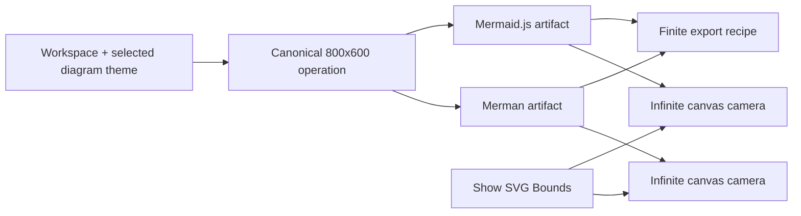
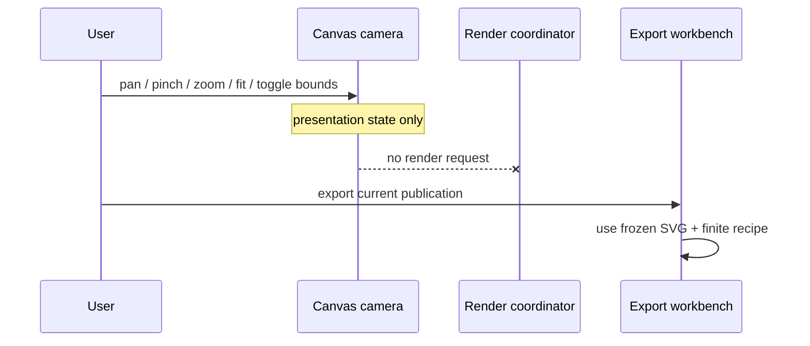

# Replace Playground Host viewport with infinite canvas

## Goal Capsule

Make the Playground preview behave like Mermaid Live's canvas: the whole available preview surface is the navigable workspace, the rendered SVG has no decorative paper/card boundary, and users can pan, pinch, zoom, fit, and optionally inspect the exact SVG root bounds. Keep rendering deterministic at the existing canonical `800×600` environment for both engines, keep exports finite and artifact-owned, and remove the Playground-only Host measurement and locked-environment contracts that no longer serve the clarified product goal.

Success means the Visual and Compare views use the infinite-canvas presentation on desktop and mobile; an optional SVG Bounds overlay exposes rather than repairs root `viewBox` clipping; current workspace and issue links remain bounded and usable; legacy Host-bearing links safely degrade to canonical rendering; focused runtime/share/browser checks, lint, typecheck, build, and required PR CI pass.

This plan supersedes only the Playground-specific Host viewport, live measurement, and locked reproduction environment decisions in `docs/plans/2026-08-15-2329-feat-playground-host-export-plan.md`. Its export workbench, exact-artifact ownership, responsive SVG clone, and portable sharing decisions remain in force.

---

## Product Contract

### Problem

The current Playground already has a presentation camera, but it renders the SVG inside a rounded white card and also exposes Canonical versus Host as render-input modes. That makes the preview look like a finite page and conflates two independent concepts:

- the renderer's finite layout environment, which must stay controlled for a meaningful Merman/Mermaid.js comparison; and
- the user's presentation camera, which may move over an effectively unbounded workspace without changing layout or output geometry.

The Host mode does not resolve the Zed title-clipping report. When Mermaid.js publishes content outside its root `viewBox`, the SVG viewport clips that content regardless of the outer host's CSS size. The Playground should make this behavior easy to inspect, not hide it with a Merman-only bounds rewrite.

### Requirements

**Canvas and render semantics**

- **R1 — Infinite canvas by default.** Visual and Compare preview panes use their entire available area as the canvas. The rendered diagram has no paper background, padding, rounded card, or drop shadow imposed by the Playground. The responsive presentation clone suppresses Merman's known default white root background so the grid remains the canvas, while the published/exported artifact and non-default renderer backgrounds remain unchanged.
- **R2 — Presentation and rendering stay separate.** Pan, pinch, wheel zoom, reset, fit, canvas resize, and bounds visibility are presentation state only. They do not trigger rendering, alter operation identity, mutate published SVG, or change export dimensions.
- **R3 — Deterministic render environment.** Interactive Merman and Mermaid.js operations both use the same canonical `800×600` container environment and canonical `screenAvailableWidth=800`. Benchmark continues to own its canonical environment independently.
- **R4 — SVG Bounds is diagnostic.** A user can show or hide a lightweight overlay aligned to the mounted SVG root. The overlay changes neither the root `viewBox` nor intrinsic dimensions, serialized artifact, hit testing, navigation, fit geometry, or export.
- **R5 — Preserve renderer semantics.** The responsive presentation clone preserves a valid engine-owned `viewBox` byte-for-byte. The Playground does not call `getBBox()` or widen bounds to conceal clipping inherited from pinned Mermaid.js.

**Host removal and sharing migration**

- **R6 — Remove the obsolete Host product surface.** Canonical/Host controls, live Host measurement, Host-measuring status, locked reproduction environment, return-to-live action, and their active UI/store/runtime/current-encoder/i18n contracts are deleted from the Playground. Only isolated, labeled legacy decoder branches and compatibility fixtures may still recognize removed wire fields.
- **R7 — Keep lower-level capability.** The Web/core render APIs that accept `containerWidth`, `containerHeight`, or related layout environment fields remain available to embedders and tests. This refactor removes only automatic Playground ownership.
- **R8 — Share the useful view state.** Workspace links continue to capture render-affecting workspace data. Issue links continue to capture workspace pane, editor tab, and Preview mode, and additionally capture SVG Bounds visibility. They do not capture live element size or the camera's x/y/zoom in this iteration.
- **R9 — Legacy links degrade safely.** Existing legacy and branch-generated links containing `renderViewportMode=host` or Host lock parameters restore all valid workspace/view fields, ignore the removed Host state, and render canonically without mutating the address bar during hydration.

**Export authority**

- **R10 — Finite export authority.** SVG/PNG/JPEG preview and download continue to derive from the frozen publication and its finite intrinsic/viewBox geometry, never from canvas extent, camera position, zoom, or bounds-overlay state.

**Cross-surface UX**

- **R11 — Theme-aware canvas.** The full preview surface supplies a stable contrast canvas for the effective Mermaid diagram theme after valid config overrides in both light and dark application themes; removing the white card must not make diagram strokes disappear against the application background. Arbitrary user `themeVariables` or `themeCSS` remain renderer-owned and are not an automatic contrast guarantee.
- **R12 — Mobile parity.** Narrow layouts retain workspace tabs, safe-area protection, one-finger pan, two-finger pinch, fit/reset/zoom controls, and non-overlapping Preview/export controls without horizontal document overflow.
- **R13 — Accessible controls and status.** The SVG Bounds toggle has pressed state, a translated accessible name, and a visible diagnostic style that does not rely only on color. Removing Host status must not leave empty toolbar landmarks or stale announcements.

### Acceptance Examples

- **AE1 — Default Visual canvas (R1-R5, R11).** Given a newly opened Playground, when a diagram renders in Visual, then the grid fills the preview pane, the diagram floats directly on the canvas, Fit centers it with breathing room, and no finite white card is visible.
- **AE2 — Presentation-only camera (R2-R3, R10).** Given a valid publication, when the user pans, zooms, resizes the Preview, or opens it on a host with a different `screen.availWidth`, then no presentation action changes the operation, both engines retain the same canonical environment, and exported dimensions remain unchanged.
- **AE3 — Bounds diagnosis (R4-R5, R13).** Given an SVG whose title or content reaches or crosses its root `viewBox`, when SVG Bounds is enabled, then a dashed outline exactly marks the root viewport while the same clipping remains visible; disabling it restores the same artifact and camera.
- **AE4 — Compare parity (R1-R5).** Given Compare mode, both panes use the same infinite-canvas presentation and canonical render input. Their cameras may be controlled independently, but neither pane's allocated width becomes renderer input.
- **AE5 — Legacy Host link (R6, R8-R9).** Given an old URL containing a Host workspace field and a complete locked environment, when it loads, then code/config/theme/page/editor/Preview mode are restored, the removed Host fields are ignored, no warning is shown solely because they are legacy, and rendering uses `800×600`.
- **AE6 — Current issue link (R8-R9, R13).** Given Preview/Compare with SVG Bounds enabled, when the user copies and opens an issue link, then the recipient opens Preview/Compare with bounds enabled and no Host environment query fields are emitted.
- **AE7 — Finite exports (R4, R10).** Given a diagram panned far away and zoomed in, when PNG, JPEG, or SVG is exported, then its bytes and geometry match the publication recipe and do not include canvas grid, bounds outline, or camera transforms.
- **AE8 — Mobile canvas (R1-R4, R12).** Given a phone-sized viewport, when the user switches to Preview, pinches, pans, fits, toggles bounds, and opens export, then gestures remain usable, controls remain reachable inside safe areas, and the document has no horizontal overflow.

### Scope Boundaries

**In scope**

- Breaking and deleting Playground-internal Host state, measurement hooks, lock validation, controls, tests, and translations.
- Refactoring the existing `SvgViewport` shell into an infinite-canvas presentation without introducing a new canvas dependency.
- A presentation-only SVG Bounds toggle in Visual and both Compare panes.
- Revising the unmerged `s2`/`rv=1` share implementation so new links omit Host fields while old Host-bearing payloads degrade safely.
- Updating the open PR description, focused tests, screenshots/assertions, and documentation for the clarified product contract.

**Out of scope**

- Changing parser, layout, renderer, root `viewBox`, title bounds, or pinned Mermaid.js semantics.
- Editable `viewBox`, arbitrary layout viewport controls, synchronized Compare cameras, minimaps, selection tools, or a scene graph.
- Serializing camera x/y/zoom, automatically updating URL/history for camera gestures, or adding a server-backed short-link service.
- Infinite-page export, grid export, or deriving raster size from the visible canvas.
- Removing lower-level layout-environment APIs from Rust, WASM, Web, Node, CLI, or benchmark code.

---

## Planning Contract

### Key Technical Decisions

- **KTD1 — One canonical Playground render input.** `CANONICAL_RENDER_VIEWPORT` remains the only interactive Playground viewport, and its width is also the canonical `screenAvailableWidth`. Operation capture creates one frozen `800×600×800` layout environment for both engines; no selected mode, live measurement, or browser screen geometry participates in operation identity. (session-settled: user-directed — chosen over retaining Host as a visible or hidden advanced mode after the user clarified that the desired behavior is an infinite presentation canvas.) Governs R2-R3, R6-R7.
- **KTD2 — Infinite canvas is the existing camera with a different shell.** Reuse `SvgViewport`'s established transform, fitting, pointer, wheel, anchor-suppression, and responsive clone machinery. Remove the finite paper decoration and suppress only the known renderer-default white root background in the presentation clone; do not rewrite the published artifact or any non-default root background. Add a canvas-level theme contract without a new canvas library or second gesture implementation. (session-settled: user-approved — chosen over adding another Canvas/ViewBox mode because the existing camera already supplies the required unbounded navigation; source-confirmed against Mermaid Live's transparent rendered SVG over its grid canvas.) Governs R1-R2, R10-R12.
- **KTD3 — Bounds belongs to presentation state.** Store one `showSvgBounds` preference for the Preview workspace and pass it into every `SvgViewport`. Implement the visual with a non-interactive outline on the exact content/root host so it follows camera transforms but contributes no layout insets. (session-settled: user-approved — chosen over editable `viewBox`, which would change or conceal the renderer behavior under investigation.) Governs R2, R4-R5, R13.
- **KTD4 — Share versions keep bounded, explicit migration.** Because `s2` and `rv=1` exist only on the open branch, keep their visible prefixes while redefining the pre-merge current contract. Isolated legacy decoding covers three existing Host-bearing shapes: the original Base64 workspace hash, the `s2` workspace envelope, and the `rv=1` query lock. Each path validates within its existing budget, discards only removed environment fields, and returns the new canonical snapshot/view without warning when all remaining fields are valid. New encoders never emit Host fields. Governs R6, R8-R9.
- **KTD5 — Canvas contrast follows the effective diagram theme, not only app chrome.** Reuse Mermaid config parsing/precedence to resolve the valid effective theme, classify every `SUPPORTED_THEMES` value into a light or dark canvas family, and keep the grid, status text, focus treatment, and Bounds outline legible. The SVG remains responsible for its own explicit background and arbitrary `themeVariables`/`themeCSS`; the Playground supplies only the surrounding presentation surface. Governs R1, R11.
- **KTD6 — Export remains publication-owned.** Export recipes continue to consume the validated/frozen SVG and existing raster planner. Camera and diagnostic state are deliberately absent from recipe keys and serializers. Governs R2, R4, R10.
- **KTD7 — Delete obsolete ownership rather than hiding it.** Remove `RenderViewportControl`, Host observer plumbing, store actions, lock helpers, Host translations, and stale browser assertions. Do not retain a hidden advanced Host mode; a future explicit layout-viewport tool would be a new, named feature with numeric inputs. (session-settled: user-directed — broad internal breaking refactors and deletion of unnecessary code are authorized.) Governs R6-R7.
- **KTD8 — Minimum sufficient verification.** Unit-test pure canonical/share migrations and use a small number of real-browser scenarios for appearance, transforms, legacy hydration, export isolation, and mobile gestures. Chromium owns the detailed desktop/mobile matrix; one WebKit mobile smoke covers layout, tap activation, and the shared pointer-handler state machine, while real-device QA owns native touch delivery. Do not add duplicate DOM simulation, exhaustive screenshots, or per-theme browser cases. Governs R1-R13.
- **KTD9 — Runtime, display state, and sharing migrate atomically.** U1-U3 describe a dependency order, but their removal of shared Host types cannot form three independently compiling commits: current sharing and toolbar owners consume the store/runtime fields U1 removes. Implement them as one atomic compile slice, then run the combined runtime/share/typecheck gates before committing; internal sequencing still follows U1 → U2 → U3. Governs R3-R9, R11-R13.

### Assumptions

- The full-surface grid already owned by `App` remains the canvas background; implementation may move that styling into a dedicated Preview canvas wrapper if this produces a clearer owner.
- A single bounds preference for the whole Preview is preferable to separate Merman/Mermaid toggles because it represents a diagnostic display layer, not engine state.
- Independent Compare cameras remain intentional and are sufficient for this change.
- Legacy Host-bearing `s2` and `rv=1` URLs have no released compatibility promise, but preserving their useful fields is cheap and prevents confusing local/issue links during PR review.
- Effective theme resolution should reuse `buildMermaidConfig` precedence. A small exhaustive `SUPPORTED_THEMES` light/dark-family mapping is sufficient; custom theme variable contrast is outside the automatic guarantee.

### High-Level Design

### System-Wide Impact

- **Playground state:** becomes smaller; workspace snapshots no longer own viewport mode, and current-view state gains `showSvgBounds`.
- **Runtime orchestration:** loses Host-measurement inputs and lock precedence; both engines still receive the same canonical layout environment.
- **Sharing:** keeps portable workspace and issue-view concepts while removing a misleading promise of browser-host reproduction.
- **Exports:** no behavioral change; tests guard against accidental inclusion of canvas presentation.
- **Core/Web embedders:** no API removal or behavior change.
- **Documentation and support:** issue reproduction becomes more honest: the link reproduces source/config/theme/view, while SVG Bounds reveals root clipping without claiming cross-browser pixel identity.

---

## Implementation Units

### U1 — Collapse Playground render environment to canonical

**Goal:** Remove Host as a Playground operation input while preserving the lower-level layout environment contract.

**Requirements:** R2-R3, R6-R7; KTD1, KTD7, KTD9.

**Dependencies:** None.

**Files:**

- Modify `playground/src/runtime/render-viewport.ts` and `playground/src/runtime/render-viewport.test.ts`.
- Modify `playground/src/runtime/RenderCoordinatorBridge.tsx`, `playground/src/runtime/render-coordinator.ts`, and focused coordinator tests.
- Modify `playground/src/store/index.ts`, `playground/src/store/index.test.ts`, and `playground/src/lib/workspace-snapshot.ts`.
- Delete `playground/src/components/RenderViewportControl.tsx`.
- Modify `playground/src/App.tsx` and `playground/src/components/Preview.tsx` to remove Host UI and measurement ownership.

**Approach:**

1. Replace mode-based resolution with one canonical capture helper that freezes width `800`, height `600`, and `screenAvailableWidth=800` for both realms. Preserve the canonical viewport export consumed by benchmark code and share the screen-width constant without making runtime depend on the benchmark module.
2. Remove `renderViewportMode`, `liveHostRenderViewport`, `sharedRenderEnvironmentLock`, their actions, and Host observer inputs from Zustand and coordinator request construction.
3. Keep `MermanLayoutEnvironment`, realm viewport validation, and embedder-facing container sizing untouched outside Playground ownership.
4. Remove the now-empty viewport control region from the Preview header; retain a stable header owner for the new diagnostic control in U2.

**Test scenarios:**

- Every interactive render request captures `800×600×800` for Merman and Mermaid.js, independent of the host's `screen.availWidth`.
- Changing Preview pane dimensions does not change operation identity or enqueue another render.
- Store snapshots and startup hydration contain no Host state.
- Benchmark viewport behavior remains unchanged.

**Definition of done:** Evaluated with U2-U3 at the atomic-slice boundary: no active Playground UI, store, runtime, operation, or current encoder refers to Host mode, Host measuring, live Host size, or locked render environment; only explicitly labeled legacy share decoders/fixtures may recognize removed viewport wire fields, and focused runtime/store tests pass.

### U2 — Turn `SvgViewport` into the infinite-canvas presentation

**Goal:** Remove the finite paper shell and add a presentation-only SVG Bounds diagnostic.

**Requirements:** R1-R5, R11-R13; KTD2, KTD3, KTD5, KTD9.

**Dependencies:** U1.

**Files:**

- Modify `playground/src/components/SvgViewport.tsx`.
- Modify `playground/src/components/Preview.tsx`, `playground/src/components/CompareView.tsx`, and `playground/src/components/PreviewArtifactViews.tsx` as needed to thread the shared display preference.
- Modify `playground/src/store/index.ts` and `playground/src/store/index.test.ts` for the single Preview-owned `showSvgBounds` preference.
- Modify `playground/src/App.tsx` and `playground/src/styles/globals.css` for the owned canvas surface/theme tokens.
- Modify locale resources under `playground/src/i18n/locales/`.

**Approach:**

1. Keep the viewport container full-size and overflow-hidden, remove `bg-white`, padding, rounded corners, and shadow from the diagram wrapper, and remove only a default `background-color: white` declaration from the responsive presentation clone. Preserve the frozen artifact and any non-default renderer background for copy/export.
2. Preserve the existing camera state machine and fit margin. Recalculate only code that assumed paper padding; do not rewrite gesture logic.
3. Add `showSvgBounds` to the Preview-owned store state and expose one native pressed button in a stable toolbar position whenever SVG or Compare mode is selected, including loading, empty, error, source, and stale-publication states. The preference remains toggleable before an SVG mounts; its translated label explains that it applies to all mounted Visual panes. Preview resolves the canvas family and passes both controlled values to CompareView, which forwards them to its two `SvgViewport` instances; components do not introduce a second direct-store ownership path.
4. Render a pointer-transparent dashed outline on the exact mounted SVG host/wrapper, following camera transforms without adding box size or changing fit calculations.
5. Resolve the effective theme through existing Mermaid config precedence, map all supported themes to a light/dark canvas family, and apply family tokens for surface, grid, status content, focus, and Bounds. Cover the config-overrides-toolbar case without attempting to infer arbitrary custom theme-variable contrast.
6. Preserve one-finger pan inside each mobile canvas. Keep the Compare scroll owner reachable through pane headers/gutters and verify the second engine remains reachable without weakening canvas gestures.

**Test scenarios:**

- Visual and Compare contain no finite card classes and still fit/zoom/pan.
- Bounds toggling uses a translated native button with `aria-pressed`; Enter and Space update only the preference/diagnostic style and do not replace the mounted artifact or alter reported zoom.
- Anchor navigation suppression and gesture promotion still work.
- Every supported effective theme maps to a canvas family; a config `theme=dark` overrides a toolbar `default` selection for canvas contrast.
- On a narrow Compare view, users can still scroll from a pane header/gutter to the second engine while one-finger drags inside a canvas continue to pan it.

**Definition of done:** The canvas fills every Preview pane, SVG Bounds is accessible and non-semantic, and existing camera behavior remains intact.

### U3 — Simplify share contracts and migrate Host-bearing links

**Goal:** Keep reproducible workspace/view links without serializing a removed render environment.

**Requirements:** R6, R8-R9, R13; KTD3, KTD4, KTD7, KTD9.

**Dependencies:** U1-U2.

**Files:**

- Modify `playground/src/lib/share.ts`, `playground/src/lib/share.test.ts`, `playground/src/lib/share-view.ts`, and `playground/src/lib/share-view.test.ts`.
- Modify `playground/src/lib/workspace-snapshot.ts`, `playground/src/store/index.ts`, and focused hydration tests.
- Modify `playground/src/components/ToolbarArtifactActions.tsx` and share-related translations/help text.

**Approach:**

1. Remove viewport mode from newly encoded workspace snapshots and remove lock fields from newly encoded issue views.
2. Add `showSvgBounds` to the bounded current-view descriptor with an immutable default of `false`.
3. Accept each existing Host-bearing wire shape as a legacy variant: original Base64 workspace hash, `s2` workspace envelope, and `rv=1` query lock. Validate each within the existing budgets, ignore the removed mode/environment, and retain code/config/theme/presentation/page/editor/Preview fields.
4. Delete issue-link gating that required Host plus a complete lock, and delete return-to-live URL mutation.
5. Update copy labels and failure messages so issue links promise current Playground view, not browser-host geometry reproduction.

**Test scenarios:**

- New workspace and issue URLs contain no Host keys; the workspace URL remains render-workspace-only, while the issue URL round-trips pane/editor/Preview/Bounds state.
- Original Base64, `s2`, and `rv=1` Host-bearing links each hydrate canonically without an avoidable warning when their supported fields are valid.
- Malformed/future view state remains atomic and bounded.
- Copy remains a pure clipboard command and does not mutate runtime or history.

**Definition of done:** New links express only supported state, old Host links degrade predictably, and no lock validation/runtime dependency remains in sharing code.

### U4 — Browser validation and cleanup

**Goal:** Prove the clarified experience on desktop/mobile with minimal durable coverage and remove obsolete artifacts.

**Requirements:** R1-R13; KTD6-KTD8.

**Dependencies:** U1-U3.

**Files:**

- Modify `playground/tests/render.presentation.spec.ts`, `playground/tests/mobile.interactions.spec.ts`, and only the smallest additional smoke specs needed.
- Modify relevant Playground documentation.
- Delete obsolete Host-only helpers, assertions, translations, and screenshots discovered by source search.

**Approach:**

1. Replace Host mode browser cases with one desktop infinite-canvas/bounds/share scenario and one mobile gesture/safe-area scenario.
2. Assert export isolation using existing export coverage rather than duplicating encoder tests.
3. Run focused unit tests first, then lint/typecheck/build and the affected Chromium desktop/mobile suites. Run non-Chromium smoke only if changed behavior crosses its existing lane.

**Test scenarios:**

- Desktop Visual/Compare show full-surface canvas, bounds toggle, canonical render metadata, and usable share links.
- Mobile Preview supports pan/pinch/fit/bounds/export without overflow or safe-area collision; a single WebKit mobile smoke covers layout, tap activation, and shared pointer-handler state, without claiming native touch delivery.
- PNG/JPEG/SVG output excludes grid, bounds, and camera transforms.
- Source search finds no stale active Host product strings or dead viewport ownership outside the labeled legacy decoder/fixture compatibility points.

**Definition of done:** Focused local gates pass, and the branch contains no obsolete active Host-viewport code outside labeled compatibility points. Existing `hostThemePreset`/`migrateLegacyHostTheme` display-theme migration remains because it is unrelated to Host viewport ownership.

---

## Verification Contract

Run in dependency order and avoid redundant full-suite reruns:

1. **Pure contracts:** `npm run test:runtime` from `playground/`, covering canonical capture, store snapshots, share migration, and coordinator identity.
2. **Static gates:** `npm run lint`, `npm run test:browser:typecheck`, and `npm run build` from `playground/`.
3. **Desktop browser:** the affected tests in `playground/tests/render.presentation.spec.ts` against the built Playground, including infinite shell, Bounds keyboard/pressed semantics, legacy link hydration, and export isolation.
4. **Mobile browser:** the affected tests in `playground/tests/mobile.interactions.spec.ts`, including pan/pinch, Compare scroll reachability, reachable controls, safe areas, and no horizontal overflow. Run the detailed matrix in Chromium and one focused iPhone/WebKit smoke for layout, tap activation, and shared pointer-handler state; retain native touch delivery in the real-device residual checklist.
5. **Regression ownership:** reuse existing export coverage; do not add DOM simulation dependencies, per-theme browser cases, or duplicate the same behavior across multiple suites.
6. **PR gate:** every required GitHub check for PR #67 is green and no unresolved change-request thread remains.

### Evidence Matrix

| Behavior | Primary evidence |
| --- | --- |
| Canonical operation for both engines | runtime/coordinator unit test |
| No render on canvas/camera changes | focused coordinator + browser request-count assertion |
| Infinite shell, exact bounds overlay, and pressed semantics | Chromium presentation test |
| Legacy Host link degradation | Base64/`s2`/`rv=1` share unit tests + one browser hydration case |
| Finite export unaffected | existing export unit/browser coverage |
| Mobile gesture and safe-area behavior | mobile Chromium test |
| No obsolete Host ownership | typecheck/lint plus targeted source search |

---

## Rollout and PR Strategy

- Implement on the existing `feat/playground-share-view` branch and update PR #67 rather than opening a second overlapping PR.
- Use logical Conventional Commits; keep the new plan as the decision record and do not rewrite the historical plan.
- Rewrite the PR title/body so the primary user-facing change is infinite canvas, diagnostic SVG Bounds, sharing, and export workbench. Do not add Compound Engineering badges.
- After implementation units pass, run simplification and code review, apply valid findings, update the PR, and watch required CI to green as one shipping tail rather than part of U4's feature boundary.
- Do not merge without explicit maintainer authorization. Continue fixing required CI failures and valid review feedback within this plan's scope.

---

## Definition of Done

- The Playground has no visible or hidden Canonical/Host mode selection, live Host measurement, or locked environment state.
- Visual and Compare use a full-surface, theme-aware infinite canvas with existing pan/zoom/pinch/fit behavior.
- SVG Bounds can be toggled accessibly and is absent from artifacts and exports.
- Merman and Mermaid.js receive the same canonical `800×600` interactive environment; lower-level container sizing APIs remain intact.
- New workspace and issue links omit Host geometry; only issue links carry current page/editor/Preview/Bounds state, and old Base64/`s2`/`rv=1` Host-bearing links safely restore supported fields.
- Focused unit, static, desktop, mobile, and required PR CI gates pass without redundant test expansion.
- Obsolete active Host code, tests, translations, and documentation are deleted; only labeled legacy decoder/fixture compatibility remains, and the PR stays badge-free and unmerged automatically.

---

## Sources

- Historical implementation plan: `docs/plans/2026-08-15-2329-feat-playground-host-export-plan.md`
- Current camera implementation: `playground/src/components/SvgViewport.tsx`
- Current responsive SVG preparation: `playground/src/lib/svg-geometry.ts`
- Mermaid Live editor source and state model: <https://github.com/mermaid-js/mermaid-live-editor>
- Mermaid Live deployed behavior: <https://mermaid.live/>
- Zed clipping report: <https://github.com/zed-industries/zed/issues/62410>
