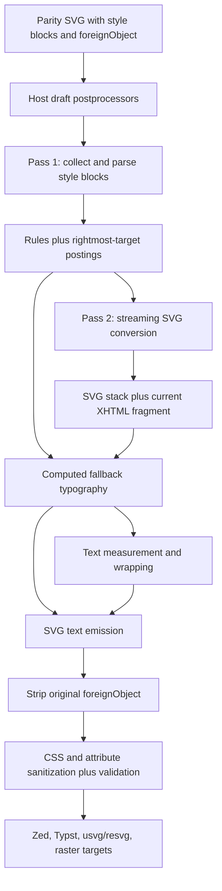
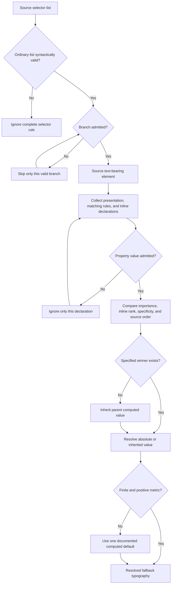
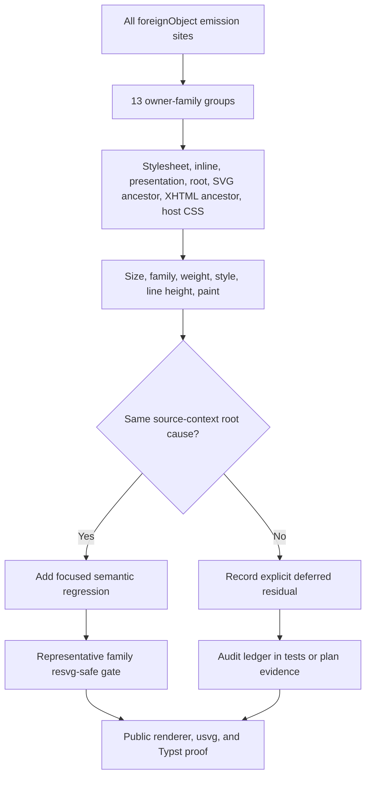

# Resvg-Safe Fallback Typography - Plan

## Goal Capsule

| Field | Contract |
|---|---|
| Objective | Make every supported `resvg-safe` SVG text fallback use the typography that the source `<foreignObject>` label actually inherits before fallback, so measurement, wrapping, placement, and the SVG returned by Merman agree without changing Mermaid-parity output. |
| Means | Replace the flattened class-style lookup with a private, bounded source-context cascade resolver and one computed typography result shared by measurement and emission. See KTD1-KTD6. |
| Authority | The pinned Mermaid 11.16.1 source and Merman's existing output-pipeline contracts govern semantics. Issue #89, the Zed integration, and the Typst package govern consumer acceptance. Product Requirements override implementation convenience. |
| Execution profile | Deep cross-cutting adapter fix with characterization-first tests, focused Rust `nextest` lanes, a family-wide fallback typography audit, Typst consumer proof, and no baseline or package upgrade. |
| Stop conditions | Stop and re-plan if correctness requires changing raw/parity renderer output, modifying the pinned Mermaid baseline, adding a public fallback font-size knob, or implementing a browser-grade CSS/HTML layout engine. |
| Tail ownership | `ce-work` owns U1-U5, focused verification, documentation, and cleanup of abandoned implementation attempts while preserving unrelated worktree changes. |

---

## Product Contract

### Summary

Fix issue #89 in Merman's generic `foreignObject` fallback conversion rather than hiding it in Zed or forcing every fallback label to 16px. Resolve typography against the real SVG and XHTML element chain before the original label is removed. Apply the same fix to every confirmed same-root defect, including ER selector leakage, Venn presentation attributes, nested XHTML styles, cascade priority, relative font sizes, line height, and measurement-versus-paint divergence.

### Problem Frame

`SvgPipeline::resvg_safe()` converts browser-oriented `<foreignObject>` labels into ordinary SVG `<text>` before stripping the HTML. The current `FallbackStyleIndex` extracts every class token from a selector and stores declarations under that class without retaining the selector's rightmost target, ancestor relationship, specificity, or importance. Mermaid's class stylesheet therefore turns `.classLabel .label { font-size: 10px; }` into an effective global `.label { font-size: 10px; }`, even when a class node has no `.classLabel` ancestor and its layout was measured at 16px.

The same approximation affects more than ClassDiagram. ER has different entity and relationship-label sizes, Venn inherits a computed size from a `font-size` presentation attribute on an ancestor `<g>`, XHTML label styles may live on an inner `span` rather than the first element, and the current measurement path omits `font-style` while emission retains it. These errors can make the fallback text smaller, larger, differently wrapped, or vertically misplaced inside geometry that was computed from another style.

The parity renderer is not the defect boundary. Pinned Mermaid CSS and DOM structure are internally consistent in the browser path. The defect belongs to the consumer adapter that changes DOM representation and must materialize browser-relevant typography before deleting the original representation.

### Key Decisions

- **Merman owns the generic fallback semantics.** (session-settled: user-approved — chosen over a Zed-only workaround or a global 16px rule: those approaches hide ClassDiagram while breaking legitimate non-16px labels.) Governs R1-R9 and R12.
- **The audit fixes all confirmed fallback-typography defects but does not expand into rich-text layout.** (session-settled: user-approved — chosen over treating issue #89 as one isolated fixture or implementing a partial browser: source-context typography is one root cause, while mixed-style text runs are a separate layout capability.) Governs R4, R8-R10, and R12.
- **This work contains no version alignment or release activity.** (session-settled: user-directed — chosen over combining the fix with a Mermaid baseline refresh, Merman version bump, Typst package bump, or release: the user explicitly excluded upgrades.) Governs R11.
- **Issue #92 remains a separate Typst policy proposal.** The corrected fallback closes the #89
  source-context defect without requiring a global 16px postprocessor. A package-wide default
  override would overwrite legitimate ER/Venn/host metrics and would repaint without remeasuring;
  this plan therefore keeps Typst's existing explicit `scoped-css` opt-in and records #92 as a
  follow-up decision, not an implementation requirement.

### Requirements

**Fallback typography semantics**

- R1. A ClassDiagram class name, member, and method measured at 16px must remain 16px in `resvg-safe` output. A synthetic arbitrary-SVG fixture must prove that `.classLabel .label` still resolves to 10px when that ancestry actually exists, while the pinned ER `.edgeLabel .label` path provides the real-diagram contextual-selector proof at 14px.
- R2. Stylesheet selectors must match the original element type, id, class, attributes, and admitted ancestry instead of applying declarations from isolated selector tokens.
- R3. Author presentation attributes, stylesheet rules, inline style, `!important`, specificity, source order, and inheritance must resolve in CSS cascade order for the supported typography subset.
- R4. The resolver must cover `font-size`, `font-family`, `font-weight`, `font-style`, `line-height`, text color, and label background paint, including the source XHTML descendant that owns the text or background rather than only the first HTML element.
- R5. Supported font-size values must be converted to one finite positive CSS-pixel value using the computed parent and root context; supported line-height values must become one finite positive pixel value for the resolved font size. CSS declarations admit `px`, `%`, `em`, `rem`, and evidenced keywords, while a unitless nonzero CSS `font-size` is invalid; SVG presentation attributes may additionally use unitless user-unit lengths where the pinned renderer and `usvg` do.
- R6. One resolved typography value must drive text measurement, soft wrapping, line placement, and emitted SVG styling so no Merman-owned path measures one value and paints another. Post-fallback metric overrides remain the explicit R13 consumer limitation.

**Compatibility and ownership**

- R7. Default and explicit Mermaid-parity SVG output must remain unchanged, including the pinned Mermaid 11.16.1 CSS and DOM shape.
- R8. `foreign_object_label_fallback_svg_text`, arbitrary-SVG finalization, typed render requests, raster targets, bindings, and the Typst plugin must receive the same generic fix without diagram-family conditionals or a new public fallback-style API.
- R9. The existing `data-merman-foreignobject="fallback"`, `merman-foreignobject-fallback`, and `merman-foreignobject-fallback-text` hooks must remain stable for Zed and other hosts; source classes remain available as inert `data-merman-source-classes` metadata rather than live classes that can re-trigger source CSS.

**Bounded implementation and audit**

- R10. Stylesheets must be parsed once per fallback operation, conversion must use a second streaming pass, and selector matching must have a backtracking-free `O(C × H)` bound per candidate, where `C` is selector-component count and `H` is admitted ancestry depth. Generated bytes and elements must retain existing preflight enforcement. A syntactically invalid ordinary selector list invalidates its complete rule; a syntactically valid but unadmitted branch is skipped without discarding admitted sibling branches. An unsupported property value invalidates only that declaration so a lower-priority valid declaration can still win, and the final emitted value must match measurement.
- R11. The implementation must not update `tools/upstreams/MERMAID_REFERENCE_BUNDLE.json`, Mermaid fixtures or goldens, Cargo package versions, Typst package versions, changelogs, tags, or release artifacts.
- R12. Every source path that emits a `foreignObject` label must be audited by owner family, with each finding recorded as covered by a semantic test or explicitly deferred as a different root cause.
- R13. Documentation must state that metric-affecting host styles must enter before the fallback stage; changing font metrics after fallback may restyle paint but cannot recompute wrapping or geometry.

### Key Flows

- F1. Generic `resvg-safe` conversion
  - **Trigger:** A caller selects `SvgPipeline::resvg_safe()` or a typed raster/PDF target.
  - **Steps:** Host draft postprocessors run; fallback scans source CSS and the SVG/XHTML element chain; computed typography is resolved; text is measured and emitted; the original `foreignObject` is stripped; terminal sanitization and validation run.
  - **Outcome:** The sealed SVG is resource-compatible and its fallback text uses the same Merman-resolved metric inputs for measurement and painting before any consumer postprocessing.
  - **Covered by:** R2-R10.
- F2. Zed-like host integration
  - **Trigger:** Zed renders through `resvg-safe` with `strip_existing_important()` inside Merman, then injects its product CSS and temporary fallback 16px rule after Merman returns SVG.
  - **Steps:** Merman first resolves generic typography before deleting HTML; stable fallback markers and source classes survive; the separate Zed postprocessor can still find its hooks; `usvg` parses the composed result.
  - **Outcome:** Issue #89 is already correct in Merman's output, while the current downstream 16px rule remains an explicit Zed limitation that must be removed before Zed can preserve Venn or user-defined non-16px sizes.
  - **Covered by:** R1, R6, R8-R9, R13.
- F3. Typst package rendering
  - **Trigger:** A Typst user calls `mermaid` or `mermaid-svg` with the package's default `resvg-safe` pipeline and optional typography context.
  - **Steps:** The plugin transport passes configuration to Merman; fallback materializes the resolved metrics; Typst receives SVG without `foreignObject`.
  - **Outcome:** ClassDiagram text fits its layout box and explicit Typst-to-CSS typography remains effective without a package version change.
  - **Covered by:** R1, R5-R8, R11.
- F4. Similar-problem audit
  - **Trigger:** The implementation scans every parity source that emits `foreignObject` and exercises representative real fixtures.
  - **Steps:** Each owner family is mapped against style source and metric property; confirmed source-context defects are fixed; mixed rich-text or browser-font residuals are classified separately.
  - **Outcome:** The change closes the root cause across the repository rather than only satisfying one ClassDiagram string assertion.
  - **Covered by:** R4-R6, R10-R12.

### Acceptance Examples

- AE1. Covers F1 / R1-R3. Given the issue #89 ClassDiagram, when it is rendered through the public `Renderer` and `SvgPipeline::resvg_safe()`, the class name, members, and methods resolve to 16px because neither `.classLabel .label` nor `g.classGroup text` matches their original XHTML text elements.
- AE2. Covers F1 / R1-R3. Given a synthetic arbitrary SVG whose original XHTML label is under matching `.classLabel .label` ancestry, when fallback runs, its 10px rule remains applicable rather than being removed to make AE1 pass. The pinned ER edge-label fixture is the real-diagram positive contextual-selector case.
- AE3. Covers F4 / R2-R6. Given an ER diagram with 16px entity labels and a 14px `.edgeLabel .label` rule, when fallback runs, entities remain 16px and only the matching relationship label resolves to 14px.
- AE4. Covers F4 / R3-R6. Given a Venn text area whose ancestor `<g>` has `font-size="20px"`, when fallback runs, the generated text is measured and painted at 20px rather than the default 16px.
- AE5. Covers F1 / R3-R6. Given competing presentation, stylesheet, inline, and `!important` declarations, when the target has its own normal declaration and its parent only supplies an inherited important value, the target's specified value wins before inheritance is considered.
- AE6. Covers F1 / R4-R6. Given CSS `%`, `em`, `rem`, keyword, and `px` font sizes, an admitted unitless SVG presentation length, an italic style, and unitless line height, when fallback runs, font size, family, weight, and style agree between the measurement request and emitted SVG; the same resolved line-height state drives line placement and emitted styling without adding line height to `TextStyle` or the host measurement ABI.
- AE7. Covers F2 / R8-R9. Given the Zed-like pipeline without relying on a post-fallback global font-size rule, when issue #89 is rendered and parsed by the workspace `usvg`, the final text sizes are correct and all stable fallback markers remain present.
- AE8. Covers F3 / R5-R8, R11. Given the Typst plugin's default options and a ClassDiagram, when `render_svg_json` or `mermaid-svg` runs, the returned SVG contains no `foreignObject`, retains 16px class text, and requires no Typst package version change.
- AE9. Covers F1 / R7. Given the same source and render configuration, when one request uses parity output and another uses `resvg-safe`, only the consumer-oriented output changes; parity bytes and baseline fixtures remain unchanged.
- AE10. Covers F4 / R10-R12. Given the 13 owner paths and 14 fixture directories that emit fallback-reachable labels, when the audit completes, architecture, block, class, ER, event modeling, flowchart plus its swimlane directory, journey, kanban, mindmap, requirement, sequence, state, and Venn each have representative evidence or a specific non-typography deferral.

### Success Criteria

- Issue #89 fails before the change and passes through Merman's public renderer without a forced fallback font size.
- ClassDiagram, ER, and Venn prove three distinct failure modes: false selector match, legitimate selector match, and presentation-attribute inheritance.
- Unit coverage proves cascade order, supported value conversion, nested XHTML targeting, and measurement/emission identity.
- The representative manifest and one-owner-per-process exhaustive `resvg-safe` audit remain parseable and raster-safe with event modeling, swimlane, and Venn included.
- The pre-injection Zed-like path and the Typst path prove correct typography; the post-injection Zed composition separately proves stable consumer hooks while retaining its documented global-16px limitation. Neither reference checkout nor any version field changes.
- Focused checks, formatting, and diff hygiene pass with no unrelated files staged or changed by this work.

### Scope Boundaries

**In scope**

- A crate-private source-element representation for the SVG ancestry, `foreignObject`, and XHTML label subtree.
- A bounded selector/cascade implementation for the typography shapes used by pinned Mermaid, Merman output, and supported host-injected CSS.
- Computed pixel normalization for current Mermaid font-size and line-height forms.
- Unit, public integration, `usvg`, fixture-family, and Typst regression coverage.
- Documentation of pre-fallback metric styling and post-fallback limitations.

**Deferred to Follow-Up Work**

- Per-run rich-text layout that preserves different `strong`, `em`, or nested `span` typography inside one label through styled SVG `tspan` runs.
- CSS custom properties, `calc()`, `var()`, `:is()`, `:where()`, namespace selectors, sibling combinators, dynamic pseudo-classes, and browser-complete unit/layout behavior if future admitted inputs require them.
- Removal of Zed's global 16px workaround after Zed adopts a Merman build containing this fix.
- A durable `docs/solutions/` learning capture after the implementation is proven.

**Outside this work**

- Mermaid source or baseline upgrades, Merman or Typst package version bumps, changelog/release preparation, tags, or publication.
- Changes inside `repo-ref/mermaid` or `repo-ref/zed`.
- Pixel-perfect browser parity for font shaping, `getBBox()`, `foreignObject`, or platform font rendering.
- A public `fallback_font_size` option, family-specific font-size table, global 16px override, or layout-model distortion to fit one fixture.
- The issue #92 proposal to make a global 16px `scoped-css` rule a Typst default; any such
  opinionated readability profile requires a separate user-facing design and regression matrix.

### System-Wide Impact

- **Rendering pipeline:** The fallback stage gains better source semantics, but built-in pass ordering and the sealed `ResvgCompatibleSvg` boundary stay unchanged.
- **Public APIs:** Behavior improves through existing APIs; no new public type, option, feature, or binding field is introduced.
- **Consumers:** Rust raster targets, CLI/bindings, Zed-like hosts, and Typst inherit the same corrected output. Marker stability prevents downstream selector and dedup regressions.
- **Performance and cancellation:** Work shifts from constant-time class lookup to indexed selector matching. CSS parsing is one linear pass and conversion is a second streaming pass; the implementation does not build a complete SVG DOM, scan every rule for every label, or use recursive selector backtracking.
- **Parity:** Raw/source SVG stays an independent evidence lane and must not be refreshed as part of this adapter fix.

### Risks & Dependencies

| Risk | Impact | Mitigation |
|---|---|---|
| A partial selector engine silently widens matches | Repeats issue #89 under a different syntax | Parse full selector branches, require full admitted syntax, match the rightmost source element and ancestry, and fail closed. |
| Correct cascade logic becomes an unbounded CSS implementation | High maintenance and security surface | Reuse the workspace parser ecosystem, admit only evidenced selector/value forms, and stop at the rich-text/browser boundary. |
| Relative values are measured differently from emitted values | Wrapping and geometry still diverge | Normalize supported metric values to absolute pixels once and emit those same resolved values. |
| Source classes restyle generated `<text>` differently in `usvg` | String assertions pass while final painting is wrong | Add final-tree assertions through the workspace `usvg` version and preserve only intentional hooks. |
| Selector matching regresses operation controls | Large hostile SVGs consume excess time or memory | Parse once, require a rightmost-target posting index, use iterative or dynamic-programming `O(C × H)` matching, checkpoint all owned loops, and retain generated byte/element preflight. |
| Parser-derived rule and posting structures amplify input | A compact stylesheet allocates excessive branches, declarations, or candidates | Store each declaration block once, share it across selector branches, use checked arithmetic before allocations, and bound branch/component/declaration/posting totals by the admitted SVG byte budget plus private caps. |
| Zed's current workaround masks Merman output | Consumer test gives a false positive | Test Merman's result before any global 16px rule, then separately assert marker compatibility with the Zed-like pipeline. |
| Existing unrelated worktree files are disturbed | User work is lost or mixed into the change | Leave the untracked Flutter platform directories untouched and stage only files owned by U1-U5. |

---

## Planning Contract

### Key Technical Decisions

- KTD1. **Resolve styles on the original text-bearing element chain.** Build a private streaming element chain that represents the root SVG, relevant SVG ancestors, `foreignObject`, and the current XHTML `div`/`span`/`p` fragment. Resolve each uniform label against the actual text-bearing XHTML element before conversion. Do not construct a complete SVG/XHTML tree. This prevents SVG `text` selectors and missing ancestors from matching synthetic fallback text. Implements R1-R4 and R8.
- KTD2. **Use a private admitted selector representation, not a flattened class map or an uncheckpointed third-party matcher.** Use `cssparser` and the current scanner to retain qualified-rule, selector-list, declaration, `!important`, source-order, checkpoint, and resource boundaries. Compile admitted type, universal, id, class, attribute, descendant, and child branches into a compact crate-private representation, then match it iteratively or with dynamic programming in `O(C × H)` without recursive backtracking. Reject a complete rule only when the ordinary selector list is syntactically invalid; skip a syntactically valid but unadmitted branch and keep admitted sibling branches. `simplecss 0.2.2` may inform compatibility tests, but its recursive `Selector::matches` and whole-stylesheet parser are not the production matcher. Implements R2-R3, R10-R11.
- KTD3. **Compute each inherited property before converting DOM shape.** For each source element, choose a specified winner by `(important, inline rank, specificity, source order)`; presentation attributes are author declarations with specificity zero and source position before stylesheets. Inherit only when the current element has no valid specified winner. An unsupported value removes that declaration from candidacy rather than forcing a default over lower-priority valid declarations. Implements R3-R5 and R10.
- KTD4. **Materialize one `ResolvedFallbackTypography` plus source-context paint.** The private typography result owns finite `font_size_px`, `font_family`, `font_weight`, `font_style`, text paint, and an intermediate line-height form that preserves `normal`, a unitless multiplier, or an absolute length until the final target font size is known. `em`, `%`, and relative keywords use the parent computed size; `rem` uses the root computed size. A nonzero unitless value is admitted only for SVG presentation lengths, not CSS `font-size` declarations. The resolved font metrics are the sole input to `TextStyle` and wrapping; the same result drives line placement and emitted `<text>` styling, while line height remains private and does not expand `TextStyle` or any host ABI. Label background color is resolved separately on the real XHTML background element through the same source-context cascade, so the old class-only background path does not survive. Implements R4-R6 and R10.
- KTD5. **Keep label-level uniform typography as the current conversion contract.** Resolve every non-empty source text leaf. If their metric tuples agree, use that uniform result. If they differ, record a rich-text residual and deterministically use the computed typography of their deepest common ancestor for the flattened readable fallback. Do not implement run-aware wrapping in this fix. Implements R4 and R12.
- KTD6. **Preserve output markers and separate source metrics from downstream hooks.** Keep fallback groups/classes/data attributes and useful source classes, but never use generated fallback classes to infer the original label's style. Metric-affecting rules are supported only when they target the original SVG/XHTML context before fallback. Post-Merman or fallback-only `!important` metric CSS may still override final painting without remeasurement; this is an R13 consumer limitation, not a reason to simulate a second cascade or emit forced `!important`. Implements R9 and R13.
- KTD7. **Test semantics at three layers.** Unit tests prove selector/cascade/value behavior, public renderer tests prove real diagram output, and `usvg`/Typst tests prove consumer interpretation. Fixture-wide smoke remains a renderability gate rather than a pixel-parity oracle. Implements R1-R12.
- KTD8. **Keep the fix inside the consumer adapter.** Do not alter diagram layout models, parity CSS, Mermaid goldens, baseline manifests, or public configuration. (session-settled: user-approved — chosen over parity changes or a public font-size escape hatch: the source renderer already has the correct semantics.) Implements R7-R8 and R11.
- KTD9. **Exclude all upgrade and release work.** (session-settled: user-directed — chosen over shipping the fix together with a Mermaid or package version change: this plan is behavior-only and must remain independently reviewable.) Implements R11.

### High-Level Technical Design

The following sketches are authoritative for boundaries and flow. They are directional guidance for internal names and file placement, not implementation code.

### Implementation Constraints

- Keep all new resolver types crate-private under `crates/merman-render/src/svg/fallback/`.
- Reuse `SvgTagScanner`, XML attribute helpers, operation checkpoints, and generated-output preflight instead of introducing an independent unbounded parser path.
- Bound selector bytes, branch count, component count, declaration count, posting count, ancestry depth, and candidate comparisons through checked arithmetic, the admitted SVG byte budget, existing tree-depth policy, and private implementation caps; do not add a public resource option.
- Keep the public helper infallible in its existing convenience form and preserve the controlled internal variant's cancellation and error behavior.
- Require a deterministic rightmost-target posting index. Each label examines only the deduplicated union of applicable postings plus a separately capped and checkpointed universal bucket; ordinary inputs must not scan the full rule table. If controlled processing exceeds a private selector/index cap, return the existing resource-limit path before emitting a partial result; the infallible convenience helper remains best-effort and fails closed by ignoring rules beyond the same private cap rather than widening their match.
- Parse CSS once, then perform a second streaming conversion traversal with only the SVG ancestor stack and current XHTML fragment resident. Do not construct a complete SVG/XHTML tree.
- Cache computed inherited typography on the streaming SVG stack so each label does not recompute every ancestor's cascade.
- Do not use diagram family metadata to decide font sizes. Real source styles and inheritance are the authority.
- Do not update reference checkouts or generated baselines during implementation or verification.

### Alternative Approaches Considered

- **Force every fallback label to 16px.** Rejected because ER relationship labels, Venn labels, user `classDef`, theme CSS, and host typography legitimately use other sizes.
- **Fix only Zed's injected CSS.** Rejected because Typst, raster targets, arbitrary-SVG helpers, and every other `resvg-safe` consumer share the same Merman defect.
- **Change Mermaid parity CSS or DOM.** Rejected because pinned Mermaid browser semantics are correct and parity output is a separate contract.
- **Add a public `fallback_font_size` option.** Rejected because it makes users guess a value that Merman can derive from the source and cannot represent per-label variation.
- **Attach layout typography sidecars to every diagram family.** Deferred because it would couple the generic arbitrary-SVG helper to family models, duplicate source CSS semantics, and expand the change across all renderers. Reconsider only if the admitted selector subset grows toward a browser engine.
- **Implement a complete CSS/HTML renderer.** Rejected because this adapter needs a small evidenced subset and must remain maintainable, bounded, and operation-controlled.
- **Use `simplecss::StyleSheet::parse` and `Selector::matches` as the production engine.** Rejected because whole-stylesheet parsing loses Merman's fine-grained checkpoints and recursive descendant matching has no cancellable worst-case guarantee; the private admitted representation keeps the same narrow semantics with explicit bounds.
- **Use Servo's transitive `selectors` crate as the complete production engine.** Considered because it can parse standard selectors already present in the lockfile. Rejected as the end-to-end matcher because its generic DOM integration and matcher do not expose Merman's per-component checkpoint or the required `O(C × H)` contract. A time-boxed U1 spike may reuse its parser only if that cleanly distinguishes invalid selector lists from valid-but-unadmitted branches without importing the matcher or expanding the admitted subset.

### Sources / Research

- `crates/merman-render/src/svg/fallback.rs`, `crates/merman-render/src/svg/fallback/css.rs`, `crates/merman-render/src/svg/fallback/context.rs`, and `crates/merman-render/src/svg/fallback/html.rs` define the current fallback behavior and its unit tests.
- `crates/merman-render/src/svg/pipeline/preset.rs`, `docs/adr/0063-extensible-svg-output-pipeline.md`, `docs/adr/0064-host-styling-svg-postprocessors.md`, and `docs/rendering/SVG_OUTPUT_PIPELINE.md` define pass ordering and output ownership.
- `crates/merman/tests/zed_editor_contract.rs`, `crates/merman/tests/resvg_safe_fixture_smoke.rs`, `crates/merman-typst-plugin/src/lib.rs`, and `distribution/typst/merman/tests/issues/test.typ` are the consumer-facing evidence lanes.
- `tools/upstreams/MERMAID_REFERENCE_BUNDLE.json` pins Mermaid `mermaid@11.16.1` at commit `7ecca0cd7f1658ef74f4e7e91f925724ef403bbf`.
- Issue #89: `https://github.com/Latias94/merman/issues/89`.
- Pinned Mermaid class styles: `https://raw.githubusercontent.com/mermaid-js/mermaid/7ecca0cd7f1658ef74f4e7e91f925724ef403bbf/packages/mermaid/src/diagrams/class/styles.js`.
- Pinned Mermaid HTML text construction: `https://raw.githubusercontent.com/mermaid-js/mermaid/7ecca0cd7f1658ef74f4e7e91f925724ef403bbf/packages/mermaid/src/rendering-util/createText.ts`.
- Zed render contract: `https://raw.githubusercontent.com/zed-industries/zed/d9ad6aff67e47de43abb270d22de75dd950f1b48/crates/mermaid_render/src/render.rs`.
- Zed temporary font-size rule: `https://raw.githubusercontent.com/zed-industries/zed/d9ad6aff67e47de43abb270d22de75dd950f1b48/crates/mermaid_render/src/postprocess/inject_css.rs`.
- SVG presentation attributes: `https://www.w3.org/TR/SVG2/styling.html#PresentationAttributes`.
- CSS cascade: `https://www.w3.org/TR/css-cascade-6/`.
- CSS font size: `https://www.w3.org/TR/css-fonts-4/#font-size-prop`.
- CSS line height: `https://www.w3.org/TR/css-inline-3/#propdef-line-height`.
- Selector compatibility reference and rejected production matcher: `https://github.com/linebender/simplecss/tree/v0.2.2`.

---

## Implementation Units

### U1. Characterize the source-context contract and audit surface

**Goal:** Add failing semantic coverage that distinguishes correct selector context and metric inheritance from the current flattened behavior, then map every fallback-reachable owner family.

**Requirements:** R1-R6, R10, R12; AE1-AE6, AE10.

**Dependencies:** None.

**Files:**

- `crates/merman-render/src/svg/fallback.rs`
- `crates/merman-render/src/svg/fallback/css.rs`
- `crates/merman-render/src/svg/fallback/context.rs`
- `crates/merman-render/src/svg/fallback/html.rs`
- `crates/merman/tests/resvg_safe_typography.rs`
- `crates/merman/tests/resvg_safe_fixture_smoke.rs`
- `docs/alignment/RESVG_SAFE_FALLBACK_TYPOGRAPHY_AUDIT.md`

**Approach:**

1. Add focused unit fixtures for absent and present ancestry, element-target mismatch, specificity, source order, importance, inline style, presentation attributes, root inheritance, nested XHTML style, relative sizes, line height, and italic measurement. Use a synthetic arbitrary-SVG fixture for positive `.classLabel .label` ancestry and the pinned ER fixture for the real contextual-selector case.
2. Add a public-path issue #89 fixture that records the intended class, ER, and Venn results before implementation changes.
3. Enumerate all `foreignObject` emission sites into a checked-in audit ledger that maps 13 owners to 14 fixture directories: architecture; block; class; ER; event modeling; flowchart plus swimlane; journey; kanban; mindmap; requirement; sequence; state; and Venn.
4. Record mixed-style text runs and other non-source-context findings as explicit residuals rather than silently dropping them or expanding the implementation.
5. Time-box a parser-only evaluation of the already-locked `selectors` crate. Retain it only if it cleanly distinguishes syntactically invalid lists from valid-but-unadmitted branches while preserving Merman-owned matching, checkpoints, and bounds; otherwise document the rejection and use the private admitted parser.

**Execution note:** Start with failing characterization tests for issue #89, ER, and Venn before replacing the style resolver.

**Patterns to follow:** Existing cancellation-aware fallback tests in `crates/merman-render/src/svg/fallback.rs` and environment-filtered family audits in `crates/merman/tests/resvg_safe_fixture_smoke.rs`.

**Test scenarios:**

- Covers AE1. A class node under `g.label` but without `.classLabel` resolves to 16px even when the stylesheet contains `.classLabel .label { font-size: 10px; }`.
- Covers AE2. A synthetic arbitrary SVG resolves the same rule to 10px when the original ancestry actually contains `.classLabel` followed by `.label`; the real ER fixture separately proves contextual matching on `.edgeLabel .label`.
- A `g.classGroup text` selector does not match an XHTML `span` or `p` target.
- Covers AE3. ER entity labels remain 16px while matching relationship labels resolve to 14px.
- Covers AE4. A `font-size="20px"` presentation attribute on an SVG ancestor reaches the XHTML text target.
- Covers AE5. Importance, specificity, inline style, source order, and inheritance resolve in the expected order.
- Covers AE6. Relative font sizes, SVG presentation unit lengths, italic, and weight produce the expected measurement inputs and emitted values; line height produces the expected line placement and emitted value without changing the measurement ABI.
- A nonzero unitless CSS `font-size` declaration is ignored so a lower valid declaration or inheritance can win; an admitted unitless SVG presentation length retains its user-unit meaning.
- An unsupported selector branch does not contribute declarations from any isolated class token.
- Cancellation during stylesheet parsing, selector matching, or measurement returns the existing controlled error and emits no partial SVG.

**Verification:** The new tests fail for the known flattened-index and presentation-attribute defects, and the audit list accounts for every source file that emits `foreignObject` without changing production behavior yet.

### U2. Replace the flattened style index with bounded cascade matching

**Goal:** Parse source styles once, match admitted selectors against the real source element chain, and compute specified and inherited property winners without widening unsupported syntax.

**Requirements:** R2-R5, R8, R10-R11; AE2, AE5-AE6.

**Dependencies:** U1.

**Files:**

- `crates/merman-render/src/svg/fallback/css.rs`
- `crates/merman-render/src/svg/fallback/context.rs`
- `crates/merman-render/src/svg/fallback/html.rs`
- `crates/merman-render/src/svg/fallback/typography.rs`
- `crates/merman-render/src/svg/fallback.rs`

**Approach:**

1. Replace `FallbackStyleIndex`'s class-to-declaration map with parsed rules that retain selector branches, importance, specificity, source order, and one shared declaration block per qualified rule. Preserve admitted branches from a syntactically valid mixed selector list while rejecting a syntactically invalid ordinary list as a whole.
2. Add a crate-private element adapter for SVG and XHTML names, ids, classes, admitted attributes, parent relationships, and deterministic non-empty text-leaf paths.
3. Resolve presentation, stylesheet, and inline candidates on each element before inheriting unresolved properties from the parent; migrate text paint and `labelBkg` background away from class-only lookup at the same time.
4. Build mandatory rightmost-target postings, a separately capped universal bucket, and cached computed SVG-ancestor typography on the streaming stack, then match admitted selectors with an iterative or dynamic-programming algorithm.
5. Perform one CSS collection/index pass followed by one streaming conversion pass. Keep only parsed rule/index data, the current SVG stack, and the current XHTML fragment; do not materialize the complete SVG tree.
6. Check allocation arithmetic before storing branches, components, declarations, and postings. Checkpoint style blocks, rules, branches, tokens, declarations, elements, labels, candidate postings, and ancestor/DP steps.

**Patterns to follow:** `crates/merman-render/src/svg/pipeline/builtin/scoped_css/rewrite.rs` for `cssparser` rule boundaries, `crates/merman-render/src/svg/pipeline/static_validation.rs` for bounded token handling, and existing `SvgTagScanner` traversal.

**Test scenarios:**

- A syntactically invalid ordinary selector list contributes no rule. A syntactically valid mixed list preserves admitted branches, skips valid-but-unadmitted branches, and applies a retained branch only when it fully matches the target and ancestry.
- Type, id, class, attribute, compound, descendant, and child selectors match their admitted source shapes.
- Dynamic pseudo-classes, sibling combinators, and namespace selectors are valid-but-unadmitted branch shapes and cannot widen a match; malformed or unknown-invalid selector syntax invalidates the ordinary list.
- An unsupported selector invalidates its rule, while an unsupported high-priority property value allows an earlier valid declaration for that property to win.
- Presentation attributes behave as specificity-zero author declarations.
- Stylesheet `!important` overrides inline normal declarations, while inline important overrides stylesheet important declarations.
- A child's specified normal declaration overrides an inherited important value from its parent because inheritance happens after specified-value selection.
- Multiple style blocks retain global source order for equal-importance, equal-specificity rules.
- A contextual `.labelBkg` rule affects only the matching XHTML background element and cannot leak through an isolated class token.
- A large admitted stylesheet with many labels is parsed once and respects operation checkpoints and resource limits.
- A deep ancestry chain with multiple descendant combinators and a failing leftmost selector completes within the declared `O(C × H)` matcher bound without recursive explosion.
- A stylesheet dominated by rightmost-universal selectors respects the universal-bucket cap, checkpoints candidate work, and never emits a partial result on controlled resource rejection.
- Parsing cancellation, candidate-matching cancellation, and generated-output preflight rejection return the existing error categories without partial SVG.

**Verification:** The cascade unit suite passes without per-label stylesheet rescans, and unsupported rules cannot recreate a global class match.

### U3. Unify computed typography, measurement, and SVG emission

**Goal:** Use one resolved, absolute typography value for wrapping, line geometry, and generated SVG text across all uniform labels.

**Requirements:** R1, R4-R6, R8-R10; AE1, AE3-AE6.

**Dependencies:** U2.

**Files:**

- `crates/merman-render/src/svg/fallback/typography.rs`
- `crates/merman-render/src/svg/fallback/html.rs`
- `crates/merman-render/src/svg/fallback/context.rs`
- `crates/merman-render/src/svg/fallback.rs`
- `crates/merman-render/src/mermaid_style.rs`

**Approach:**

1. Introduce the private resolved typography value owned by KTD4 and make it the only source of metric and text-paint properties in fallback generation.
2. Resolve nested XHTML text-bearing elements rather than taking the first `style` attribute from the whole fragment.
3. Convert supported CSS `px`, `%`, `em`, `rem`, and keyword font sizes using explicit parent and root computed sizes, and separately admit unitless SVG presentation lengths as user units; do not reuse the current helper's parent-relative `rem` behavior or its permissive unitless CSS behavior as the new contract.
4. Preserve unitless line height as a multiplier through inheritance, preserve admitted absolute or percentage lengths with their required context, and materialize pixels only for the final text target. Define deterministic handling for `normal`, `initial`, `inherit`, and `unset`.
5. Pass resolved size, family, weight, and style, including italic, into `TextStyle` before measuring or wrapping. Keep line height in the private typography result and apply it to line placement and emission without adding a public measurement field or binding/host ABI surface.
6. Emit resolved pixel metrics instead of copying relative values into a different DOM hierarchy, while preserving stable fallback classes and data markers.
7. Resolve every non-empty text leaf and apply KTD5's common-ancestor fallback when mixed metric tuples prevent uniform preservation.

**Patterns to follow:** Use existing `parse_css_font_size_px` only as a compatibility-test baseline, not as the new `rem` authority. Follow Flowchart line-height parsing in `crates/merman-render/src/flowchart/style.rs` for admitted value shapes and generated-output preflight in `fallback.rs` for bounded emission.

**Test scenarios:**

- Covers AE1. Class name, member, and method measurement and emitted style all use 16px.
- Covers AE3. ER entity and relationship labels use separate 16px and 14px resolved values.
- Covers AE4. Venn measurement and emission both use the inherited 20px presentation value.
- Covers AE6. Italic, weight, family, and relative size appear in the measurement request and final text with identical computed values; resolved line height appears in line spacing and emitted styling, not in `TextStyle`.
- An inner XHTML `span` declaration overrides an outer `div` declaration according to the cascade.
- A parent unitless line height combines with a child's changed font size at the child, while a parent absolute line height remains absolute.
- `rem` uses the root computed font size even when the immediate parent has a different font size.
- After unsupported or invalid metric declarations are removed, the next lower valid declaration or inherited value wins; only when none remains does one safe default drive both measurement and emission.
- Mixed normal and emphasized runs remain readable and are classified as a mixed-style rich-text residual without panicking or producing invalid XML.
- Soft-wrapped and nowrap labels retain their existing line-break behavior under the resolved typography.

**Verification:** No fallback code path constructs a separate font-size or line-height for measurement and emission, and the U1 semantic regressions pass without a global 16px special case.

### U4. Prove public consumers and close the family-wide audit

**Goal:** Demonstrate the fix through public Merman, Zed-like, `usvg`, Typst, and every fallback-owning diagram family while preserving parity and marker contracts.

**Requirements:** R1, R7-R12; AE1-AE4, AE7-AE10.

**Dependencies:** U3.

**Files:**

- `Cargo.toml`
- `crates/merman/Cargo.toml`
- `crates/merman/tests/resvg_safe_typography.rs`
- `crates/merman/tests/zed_editor_contract.rs`
- `crates/merman/tests/zed_mermaid_issue_fixtures.rs`
- `crates/merman/tests/resvg_safe_fixture_smoke.rs`
- `crates/merman-typst-plugin/src/lib.rs`
- `distribution/typst/merman/tests/issues/test.typ`
- `docs/alignment/RESVG_SAFE_FALLBACK_TYPOGRAPHY_AUDIT.md`

**Approach:**

1. Parse generated output with the locked workspace `usvg` version and inspect final text nodes so retained CSS cannot hide a mismatch between serialized and painted typography.
2. Add a Zed-like regression that proves issue #89 on Merman's returned SVG before Zed injects its global fallback font-size rule, then separately preserve Zed's postprocess marker/class hooks and document the remaining override limitation.
3. Add Typst plugin and package assertions for the default `resvg-safe` path and explicit typography input.
4. Add a fallback-owner representative manifest separate from the general supported-family list. Include all 13 owners and map Flowchart to both `flowchart` and `swimlane` directories.
5. For every owner, record the expected style source, admitted selector/value shape, and resolved typography or paint result. Add a computed-style assertion for every distinct source-context pattern; an owner may reuse another semantic test only when the ledger proves the fallback path and style shape are equivalent.
6. Run the exhaustive ignored audit once per owner process, with Flowchart, Sequence, State, and Class isolated. Record fixture count, pass count, skip count, semantic findings, reused semantic evidence, and deferrals in the checked-in audit ledger without refreshing parity goldens.
7. Add a parity regression that proves the source SVG remains unchanged by this adapter-only fix.

**Patterns to follow:** `zed_like_editor_pipeline_keeps_resvg_safe_themeable_svg_contract`, the environment-filtered audit in `resvg_safe_fixture_smoke.rs`, and existing `render_svg_json` tests in `merman-typst-plugin`.

**Test scenarios:**

- Covers AE7. `usvg` resolves ClassDiagram class text to 16px with no Merman global override and stable fallback markers/classes.
- Zed's current composition still parses and remains themeable even though its downstream 16px workaround is not required for the Merman assertion.
- Covers AE8. Typst's default path returns fallback SVG with 16px class text, no `foreignObject`, and preserved explicit font-family/font-size context.
- Covers AE9. Parity output for the same source is byte-identical to the pre-fix result and the baseline manifest is untouched.
- Covers AE10. Representative fixtures for all 13 owners and all 14 mapped directories pass the structural `resvg-safe` gate, including event modeling, swimlane, and Venn, and each owner has direct or ledger-justified reused semantic typography evidence.
- ClassDiagram, ER, Venn, and styled Flowchart or State labels pass final computed-size assertions through `usvg`.
- Resource-constrained and cancellation tests still terminate without partial output under the larger selector and family corpus.

**Verification:** Public and consumer tests demonstrate correct computed typography, the all-family audit has no unclassified source-context finding, and `git diff` shows no baseline, version, reference-checkout, or release changes.

### U5. Document the styling boundary and finish focused verification

**Goal:** Publish the corrected fallback contract and its limits, then complete the repository's focused quality gates without release work.

**Requirements:** R9-R13.

**Dependencies:** U4.

**Files:**

- `docs/rendering/SVG_OUTPUT_PIPELINE.md`
- `docs/rendering/RASTER_OUTPUT.md`
- `docs/alignment/ZED_MERMAID_ISSUE_AUDIT.md`
- `README.md`

**Approach:**

1. Document that fallback resolves source typography before stripping HTML and materializes metric-affecting values into SVG text.
2. State that host font-size, family, weight, style, and line-height changes must run inside the draft pipeline before fallback; post-finalization metric changes cannot recompute wrapping or geometry.
3. Preserve the distinction between generic Merman behavior and Zed product theming, and describe the global 16px rule as a downstream workaround that can be removed only after adoption.
4. Document the bounded selector/value subset and the deferred mixed-rich-text boundary without claiming browser-complete CSS or pixel parity.
5. Run the Verification Contract in focused, mostly serial order and inspect the final diff for scope, version, baseline, and unrelated-file hygiene.

**Patterns to follow:** The artifact-evidence-lane language in `docs/rendering/SVG_OUTPUT_PIPELINE.md` and the host/core ownership split in ADR-0064.

**Test scenarios:** Test expectation: none -- this unit documents already-tested behavior and runs the plan-wide verification gates.

**Verification:** Documentation matches implemented behavior, all plan-wide gates pass, and the diff contains no package upgrade, release artifact, Mermaid baseline refresh, or unrelated Flutter platform change.

---

## Verification Contract

| Gate | Applicability | Proves |
|---|---|---|
| `cargo nextest run -p merman-render fallback` | U1-U3 | Selector context, cascade, value normalization, measurement/emission identity, cancellation, and output preflight. |
| `cargo nextest run -p merman --test resvg_safe_typography --test zed_editor_contract --test zed_mermaid_issue_fixtures` | U1, U4 | Public issue #89 behavior, Zed hook stability, ER/Venn regressions, and final `usvg` interpretation. |
| `cargo nextest run -p merman --test resvg_safe_fixture_smoke` | U4 | Representative supported and boundary fixtures remain structurally `resvg-safe`. |
| Filtered ignored `all_supported_fixtures_render_typed_resvg_safe_audit` runs once per fallback owner process across the 14 mapped directories, paired with the checked-in semantic ledger | U4 | The repository-wide similar-problem audit closes without hiding failures behind one large run, relying on renderability alone, or retaining one process's peak allocations across large owners. |
| `cargo nextest run -p merman-typst-plugin --features svg` and the repository's existing Typst package test/smoke entrypoint | U4 | The plugin transport and real Typst package default path consume the corrected SVG. |
| Focused parity test for issue #89 source plus existing affected-family parity tests | U4 | The adapter fix did not change parity output or require golden refresh. |
| `cargo fmt --all -- --check` | U1-U5 | Rust formatting. |
| `git diff --check` and targeted `git diff` inspection | U1-U5 | Whitespace, scope, marker stability, and absence of version/baseline/release or unrelated-file changes. |

The default gate runs only the checked-in representative fallback-owner manifest. The exhaustive ignored audit runs serially, one owner per process, with no concurrent Cargo or Typst verification; Flowchart, Sequence, State, and Class each run alone. Before the next owner starts, the audit ledger records fixture, pass, skip, and deferral counts plus the owner's expected source-context pattern and its direct or reused semantic assertion. No verification gate authorizes a baseline refresh, dependency version upgrade, package version change, or release command.

---

## Definition of Done

- R1-R13 are satisfied and AE1-AE10 have direct test or documented audit evidence.
- U1-U5 are implemented in dependency order, and every feature-bearing unit's tests pass.
- Issue #89 is correct through the public Merman renderer before any Zed-specific 16px workaround.
- ER and Venn prove that the solution preserves legitimate non-16px typography.
- The resolver matches actual source context, honors the admitted cascade, rejects invalid ordinary selector lists, and skips valid-but-unadmitted branches without widening their match.
- Measurement, wrapping, line placement, and emission share one resolved typography result.
- All 13 `foreignObject` owners and their 14 fixture directories have representative structural evidence plus direct or ledger-justified reused semantic typography evidence; every non-source-context finding is explicitly deferred.
- Stable fallback markers, public APIs, pipeline order, cancellation, resource controls, and `usvg` compatibility remain intact.
- Parity output, Mermaid 11.16.1 baseline data, Cargo package versions, Typst package version, reference checkouts, changelog, tags, and release artifacts are unchanged.
- Documentation explains the metric-style timing contract and the rich-text/browser residual boundary.
- Formatting and diff checks pass, unrelated untracked Flutter platform directories remain untouched, and abandoned experimental code or dependencies are removed from the final diff.
