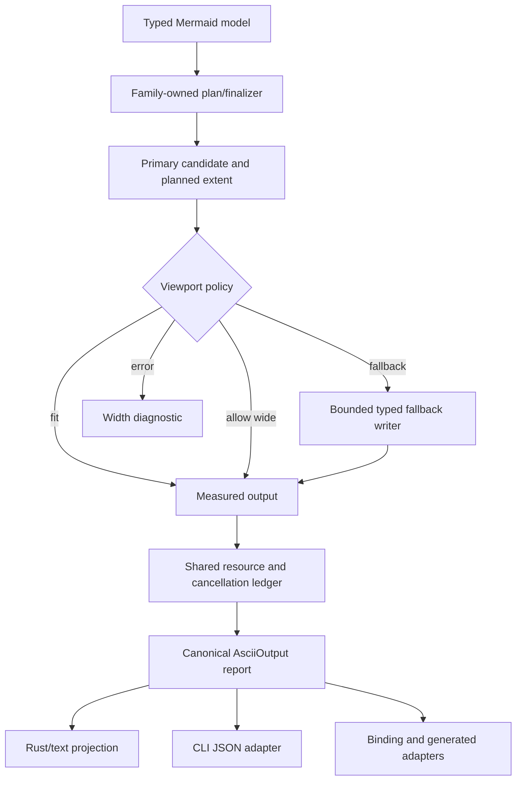

# ASCII Contract Hardening and Output Pipeline Refactor - Plan

## Goal Capsule

- **Objective:** Make the merged ASCII viewport/report contract deterministic under edge cases, bounded under fallback work, and represented by one canonical payload across Rust, CLI, bindings, and generated consumers.
- **Means:** Replace duplicated output finalization and transport mapping with a shared measured-output seam, then prove the complete overflow/resource/cancellation state matrix before expanding ASCII breadth.
- **Authority:** Pinned Mermaid 11.16.1 semantics and typed `merman-core` models outrank ASCII reference output. `docs/adr/0065-ascii-output-boundary.md` and the merged viewport plan define the host boundary. The current canonical profile and Issue #53 wrapping behavior remain compatibility surfaces.
- **Execution profile:** Deep, cross-cutting Rust refactor for an alpha release. Internal seams may break. Public Rust, CLI, JSON, FFI, and generated contracts change only through one coordinated schema-preserving migration.
- **Stop conditions:** Stop and re-plan if the work requires a second parser, SVG-coordinate quantization, global responsive re-layout, silent clipping or ellipsis, provider-specific agent logic, or treating viewport overflow as a resource error.
- **Tail ownership:** The final unit owns documentation, generated-contract verification, deletion of superseded helpers, and the independent review gate.

## Product Contract

### Summary

The merged viewport/report feature gives terminal and agent hosts a width policy and typed output metadata. The next slice hardens that contract. It makes all outcome branches observable, prevents fallback work from bypassing the intended resource and cancellation semantics, removes repeated full-text measurement, and keeps every transport on one report vocabulary.

### Problem Frame

The current implementation is behaviorally useful but still has several duplicated seams. `render_report` can materialize a complete primary string before the width decision. The two fallback builders repeat reflow, trim, extent measurement, and admission. Projection identity can still depend on output-string prefixes. CLI and binding layers manually copy the same report fields. These seams increase allocation cost and make future contract changes easy to apply to only some surfaces.

### Key Decisions

- **Internal refactoring continues while external contracts stabilize.** Alpha status permits breaking private Rust seams, but the merged report vocabulary gets a stabilization window before another public shape change.
- **Viewport policy remains separate from resource policy.** A width overflow never becomes a resource success or resource error, and resource or cancellation failures never select a fallback.
- **Canonical geometry remains unchanged.** This slice does not make Compact the default and does not introduce viewport-driven re-layout.

### Requirements

#### Contract state and semantic safety

- R1. Every supported ASCII finalizer produces one deterministic outcome for primary-fit, wide-allowed, width-error, fallback-success, fallback-unavailable, resource-failure, cancellation, empty, and no-diagram states.
- R2. A successful fallback is complete, terminal-safe, and no wider than the requested display-cell bound; a candidate that remains wide returns a typed fallback-unavailable result.
- R3. Empty and no-diagram inputs remain distinct and consistent across direct Rust, facade, CLI, and binding paths; neither path attempts semantic fallback.
- R4. Resource and cancellation precedence remains unchanged across primary measurement, fallback construction, final emission, and transport conversion.
- R5. Issue #53 pre-layout label wrapping, hard breaks, grapheme ownership, topology, and exact/N-minus-one resource boundaries remain unchanged.

#### Output pipeline and accounting

- R6. Extent, display-cell, grapheme, and encoded-byte observations are computed through a reusable measured-output seam rather than repeated full scans.
- R7. Fallback construction releases or avoids retaining superseded primary material where ownership permits and checks every bounded dimension while constructing the candidate.
- R8. A complete request uses one render-wide resource ledger for primary work, fallback work, extent observation, and output admission.
- R9. Projection identity and fallback capability come from typed family/capability data; output-string prefix inspection is not a semantic decision point.

#### Cross-surface contract

- R10. CLI report JSON, binding operation metadata, Web/Playground metadata, and generated platform contracts use the same schema version, field names, enum vocabulary, and unknown-field behavior.
- R11. The public report shape remains additive or schema-versioned; any breaking change must be one coordinated migration with contract fixtures and migration notes.
- R12. Canonical and Compact profiles remain explicit options, and this slice does not alter the default profile or host-owned agent/token policy.

### Actors

- A1. Terminal and CLI callers need readable output and explicit width outcomes.
- A2. Agent and automation hosts need bounded, loss-aware output without parsing or remeasuring text.
- A3. Rust, FFI, and generated binding consumers need one stable report vocabulary.
- A4. Maintainers need resource behavior, generated artifacts, and support metadata to stay synchronized.

### Key Flows

- F1. **Primary fit:** the normal family projection is measured once, admitted, and returned with a primary report.
- F2. **Primary overflow with fallback:** the primary result is classified as wide, one complete fallback candidate is built, remeasured, and either returned or rejected as unavailable.
- F3. **Primary overflow with strict error:** width overflow returns a width diagnostic without changing resource or cancellation precedence.
- F4. **Failure precedence:** cancellation or resource exhaustion during any measurement or fallback phase wins over presentation fallback.
- F5. **Cross-surface report:** one canonical Rust output is adapted into CLI JSON, binding metadata, and generated fixtures without field-specific reimplementation.

### Acceptance Examples

- AE1. A Flowchart rendered at maximum widths 60, 80, 100, and 120 reports the same primary extent under `Allow`; `Error` returns width overflow; `Fallback` returns a fitting complete projection or fallback-unavailable.
- AE2. A fallback candidate that exceeds the bound after reflow returns fallback-unavailable and never emits an over-wide result.
- AE3. A resource limit set to the exact measured boundary succeeds and the same limit minus one fails in both primary and fallback paths.
- AE4. Cancellation during extent scanning and during semantic flattening returns cancellation rather than a fallback report.
- AE5. Empty source, comment-only source, empty typed graph, and admitted empty document preserve distinct no-diagram versus empty semantics across Rust, CLI, and bindings.
- AE6. Plain, ANSI, and HTML outputs with equivalent logical content report equal display-cell extents while retaining mode-specific encoded bytes.
- AE7. A capability table change updates projection and fallback behavior without changing the emitted text prefix format.
- AE8. CLI JSON, binding metadata, generated operation fixtures, and platform DTOs serialize the same report fields and enum strings.

### Success Criteria

- S1. The width/outcome matrix has executable coverage for all supported finalizer classes and the 60/80/100/120 representative bounds.
- S2. Fallback construction has no unbounded intermediate candidate that is later rejected only by a final full scan.
- S3. Each logical extent and output metric is computed once per emitted candidate and reused by report and admission paths.
- S4. No production caller hand-copies the canonical ASCII report vocabulary outside the designated transport adapter.
- S5. Independent review finds no unresolved P0/P1 contract, safety, or cross-surface parity finding.

### Scope Boundaries

In scope:

- ASCII outcome-state hardening and matrix tests.
- Shared measured-output and render-wide accounting seams.
- Bounded primary/fallback materialization improvements for current finalizers.
- Typed projection/capability selection.
- CLI, binding, generated fixture, Web/Playground, and platform contract synchronization.
- Deletion of superseded internal helpers after replacement coverage exists.

### Deferred to Follow-Up Work

- Adding new ASCII diagram families.
- Making Compact the default profile.
- Global width-driven re-layout, rank recomputation, or responsive routing.
- Automatic edge-label wrapping beyond the existing Issue #53 node-label contract.
- Host-owned token budgets, agent presets, provider adapters, and post-render response truncation.

### Outside this product's identity

- A second Mermaid parser inside `merman-ascii`.
- Pixel-perfect or SVG-coordinate-derived terminal layout.
- Silent loss of authored labels, endpoints, markers, data values, or structured fields.

## Planning Contract

### Key Technical Decisions

- KTD1. **Stabilize the public report before another public break.** (session-settled: user-approved — chosen over repeated CLI/FFI churn: the merged alpha contract needs one evidence window before more surface changes.) Governs R10-R12.
- KTD2. **Use one typed measured-output seam with family-owned semantics.** A shared measurement/admission result owns common metrics; each family continues to own its semantic layout and fallback projection. Governs R6-R9.
- KTD3. **Prefer staged materialization over global responsive re-layout.** Common finalizers may expose a planned extent or staged writer, but topology and Mermaid-compatible geometry remain family-owned. Governs R5, R7, and R12.
- KTD4. **Use one canonical transport adapter.** Rust owns typed report data and serialization vocabulary; CLI, binding, Web, and generated platforms consume adapters or generated fixtures rather than reconstructing fields. Governs R9-R11.
- KTD5. **Gate breadth on contract evidence.** Do not start new-family or default-profile work until the state matrix, resource/cancellation tests, generated-contract checks, and independent review are green. Governs S1-S5.

### High-Level Technical Design

The design preserves one semantic source per family. The shared seam carries candidate text ownership, logical extent, document cells, grapheme metrics, encoded bytes, policy outcome, and fallback metadata. A fallback writer admits work incrementally and returns the same measured result used by the report. Transport layers only adapt the canonical result to their wire shape.

### Phased Delivery

1. U1 freezes the outcome state machine and characterization matrix.
2. U2 introduces the shared measured-output and ledger seam without changing default output.
3. U3 reduces primary/fallback materialization and removes duplicate scans.
4. U4 removes stringly-typed projection decisions and consolidates report construction.
5. U5 migrates CLI, bindings, generated fixtures, Web/Playground metadata, and platform checks.
6. U6 performs deletion, documentation, performance, and independent-review closeout.

### Alternatives Considered

- **Keep the current duplicated builders:** lowest short-term risk, but every new report field and limit would continue to require parallel updates and repeated scans. Rejected.
- **Rewrite all family finalizers behind one universal layout model:** could simplify dispatch, but would erase family semantics and expand the change beyond the merged contract. Rejected.
- **Add host-specific agent adapters:** could optimize one caller, but would violate the provider-neutral boundary and duplicate policy in hosts. Rejected.

### System-Wide Impact

This work affects the ASCII crate, the top-level render facade, CLI output/report modes, binding operation metadata, generated contract fixtures, Web/Playground capability metadata, and platform binding verification. It also touches resource accounting and cancellation checkpoints, so exact boundary tests and serial verification remain required. The user-provided untracked Flutter platform directories remain out of scope and must not be staged.

### Risks and Dependencies

- Fallback metric reuse can change exact resource boundaries if a candidate is charged before its final ownership is known. Preserve transactional admission and exact/N-minus-one fixtures.
- ANSI/HTML visible-width scanning can diverge from renderer-owned encoding rules. Reuse the existing color-role and safe-text encoders and compare logical extents across modes.
- Compatibility JSON may gain fields from typed models. Keep deterministic ordering and treat missing authored fields as fallback-unavailable rather than silently dropping them.
- Generated platform artifacts may be absent or stale in a local checkout. Planning assumes the repository's existing generation and verification tools remain the authority; execution must surface any missing generated source as a blocker.

### Research and Existing Patterns

- `docs/plans/2026-08-25-1232-refactor-ascii-agent-viewport-plan.md` defines the merged viewport contract, host boundary, and phase gates.
- `docs/adr/0065-ascii-output-boundary.md` keeps ASCII as a typed-model-to-terminal backend independent from SVG geometry.
- `crates/merman-ascii/src/resource.rs` already provides render-wide ledgers, scoped contexts, compound admission, and transactional rollback patterns.
- `crates/merman-ascii/tests/output_report.rs`, `viewport_characterization.rs`, and `operation_cancellation.rs` provide the current report, width, and cancellation test seams.
- `crates/merman-bindings-core/src/operation_contract.rs` and `fixtures/bindings/generated/binding-operation-contract-v1.json` are the existing generated-contract authorities.

## Implementation Units

### U1. Freeze the ASCII outcome state machine and characterization matrix

**Goal:** Make every viewport, fallback, empty, resource, and cancellation branch explicit and executable before internal output changes.

**Requirements:** R1-R5; S1.

**Dependencies:** None.

**Files:**

- `crates/merman-ascii/src/output.rs`
- `crates/merman-ascii/src/error.rs`
- `crates/merman-ascii/src/lib.rs`
- `crates/merman-ascii/tests/output_report.rs`
- `crates/merman-ascii/tests/viewport_characterization.rs`
- `crates/merman-ascii/tests/operation_cancellation.rs`

**Approach:**

1. Define one internal decision path for primary fit, wide allow, strict width error, fallback attempt, fallback success, and fallback-unavailable.
2. Preserve the public report vocabulary and stable diagnostic fields while making invalid combinations unreachable or typed.
3. Extend the existing characterization fixtures instead of creating parallel snapshot oracles.

**Patterns to follow:** Existing `AsciiOutputOutcome`, `FallbackMetadata`, `AsciiError`, and exact/N-minus-one resource assertions.

**Test scenarios:**

- A representative Flowchart at widths 60, 80, 100, and 120 returns the expected outcome for `Allow`, `Fallback`, and `Error`.
- A fallback candidate that remains wider than the cap returns fallback-unavailable and emits no partial candidate.
- A family without admitted fallback capability returns fallback-unavailable without changing the primary width or resource error type.
- Empty source, comment-only source, empty typed graph, and admitted empty document keep distinct no-diagram versus empty results.
- A resource error and a cancellation injected during primary measurement win over fallback selection.
- Existing Issue #53 labels, hard breaks, grapheme clusters, edge labels, and topology remain unchanged under all three overflow policies.

**Verification:** The matrix is deterministic, covers all error precedence branches, and existing ASCII behavior remains unchanged when no viewport is requested.

### U2. Introduce the shared measured-output and render-wide accounting seam

**Goal:** Compute logical extent and output metrics once per candidate and expose the measurements to report construction and admission.

**Requirements:** R4, R6, R8; S2-S3.

**Dependencies:** U1.

**Files:**

- `crates/merman-ascii/src/output.rs`
- `crates/merman-ascii/src/operation.rs`
- `crates/merman-ascii/src/resource.rs`
- `crates/merman-ascii/src/text.rs`
- `crates/merman-ascii/tests/output_report.rs`
- `crates/merman-ascii/tests/operation_cancellation.rs`
- `crates/merman-ascii/src/resource.rs` unit tests

**Approach:**

1. Add an internal measured-candidate concept that owns or borrows emitted text together with width, height, document-cell, grapheme, and encoded-byte observations.
2. Reuse the existing `ResourceContext` and transaction patterns so primary, extent, fallback, and final admission share one request ledger.
3. Keep color-role and terminal-width semantics in the existing safe-text/text modules; do not create a second width implementation.

**Patterns to follow:** `ResourceContext::transaction`, `controlled`, `scoped_after_document_admission`, `AsciiExecution::checkpoint_loop`, and `text::display_width_with_profile`.

**Test scenarios:**

- Plain, ANSI16, ANSI256, TrueColor, and HTML candidates report equal logical extents for equivalent visible content.
- A measured candidate's metrics are reused by the report and admission path without charging the same document cells twice.
- Exact resource limits succeed and one-less limits fail for document cells, output bytes, grapheme bytes, and layout work.
- Cancellation during a long extent scan returns the operation cancellation and rolls back transactional counters.
- Trailing-space trimming changes emitted extent only when the explicit trim policy allows it.

**Verification:** The shared seam has one owner for metric calculation, preserves resource precedence, and introduces no default-output snapshot drift.

### U3. Bound primary and fallback materialization

**Goal:** Reduce peak allocations and late rejection while preserving complete-output semantics for current finalizers.

**Requirements:** R2, R4, R6-R8; S2-S3.

**Dependencies:** U1, U2.

**Files:**

- `crates/merman-ascii/src/lib.rs`
- `crates/merman-ascii/src/output.rs`
- `crates/merman-ascii/src/graph/mod.rs`
- `crates/merman-ascii/src/sequence/render.rs`
- `crates/merman-ascii/src/relation_graph/encode.rs`
- `crates/merman-ascii/src/sectioned_text.rs`
- `crates/merman-ascii/src/xychart/render.rs`
- `crates/merman-ascii/tests/output_report.rs`
- `crates/merman-ascii/tests/flowchart_model.rs`
- `crates/merman-ascii/tests/sequence_model.rs`
- `crates/merman-ascii/tests/class_model.rs`
- `crates/merman-ascii/tests/er_model.rs`
- `crates/merman-ascii/tests/xychart_model.rs`

**Approach:**

1. Let finalizers expose a planned extent or staged writer where the family already has the information before final text allocation.
2. Make the fallback path consume the measured candidate and release superseded primary text before constructing a semantic projection when ownership permits.
3. Make reflow, trim, extent, and output admission return or consume one measured result instead of recreating full strings for every check.
4. Keep a family-owned fallback for semantic preservation; do not introduce source framing, label truncation, or a second layout pass.

**Patterns to follow:** Existing graph extent admission, sequence row-document planning, relation summary ownership, `SemanticFallbackWriter`, and transactional resource scopes.

**Test scenarios:**

- Flowchart, Sequence, Class, ER, XYChart, and representative StructuredText outputs take the same policy path and preserve their family-specific semantics.
- A wide primary followed by a fitting fallback never retains or emits primary bytes after the fallback is selected.
- A wide primary followed by an over-wide fallback returns fallback-unavailable after one attempt.
- Output-byte, document-cell, grapheme-byte, and layout-work ceilings reject amplification during fallback construction rather than only after final serialization.
- Representative large models remain cancellable during semantic projection and reflow.

**Verification:** Peak candidate ownership is bounded by the selected resource policy, fallback is attempted at most once, and all common finalizers retain complete semantic content.

### U4. Make projection and capability selection typed

**Goal:** Remove stringly-typed projection detection and duplicate capability lookups from the report path.

**Requirements:** R9; S4.

**Dependencies:** U1, U2.

**Files:**

- `crates/merman-ascii/src/capability.rs`
- `crates/merman-ascii/src/output.rs`
- `crates/merman-ascii/src/lib.rs`
- `crates/merman-ascii/tests/output_report.rs`
- `crates/merman-ascii/tests/fixture_inventory.rs`

**Approach:**

1. Resolve family capability, primary projection, and fallback availability once at the request boundary.
2. Pass the typed projection through finalization rather than inspecting prefixes such as `relations:` or `direction:`.
3. Keep capability metadata exhaustive and derived from the existing typed family catalog.

**Patterns to follow:** `AsciiPrimaryProjection`, `AsciiCapability`, `ascii_capabilities`, and support-matrix tests.

**Test scenarios:**

- Every currently supported family reports the capability-declared projection regardless of incidental text prefixes.
- Changing a structured-text field value cannot change projection classification.
- Unsupported, available, and fallback-capable families expose consistent capability metadata and report fields.
- Capability enumeration remains sorted, unique, and aligned with binding metadata.

**Verification:** Projection and fallback decisions have no output-string parser, and one capability resolution feeds the complete report path.

### U5. Consolidate CLI, binding, generated, and platform report contracts

**Goal:** Make all public transport surfaces consume one canonical ASCII report vocabulary without another incompatible public shape.

**Requirements:** R10-R12; S4.

**Dependencies:** U1, U4.

**Files:**

- `crates/merman-cli/src/render/execute.rs`
- `crates/merman-cli/src/cli.rs`
- `crates/merman-cli/tests/cli_contract.rs`
- `crates/merman-cli/tests/mmdc_contract.rs`
- `crates/merman-bindings-core/src/operation.rs`
- `crates/merman-bindings-core/src/operation_contract.rs`
- `crates/merman-bindings-core/src/ascii.rs`
- `crates/merman-bindings-core/src/artifact_contract/tests.rs`
- `fixtures/bindings/generated/binding-operation-contract-v1.json`
- `platforms/node/src/generated/binding-contract.mjs`
- `platforms/flutter/lib/src/operation_metadata.dart`
- `scripts/verify-platform-bindings.py`
- `scripts/test_verify_platform_bindings.py`

**Approach:**

1. Define one canonical Rust-to-wire projection for the ASCII report and keep transport-specific wrappers thin.
2. Preserve schema version 1 and existing aliases unless a field cannot be represented without a coordinated versioned change.
3. Regenerate or update generated fixtures and platform DTOs from the repository's existing contract authorities.
4. Keep CLI report mode and text-only helpers as projections of the same report, not separate semantics.

**Patterns to follow:** `operation_metadata_contract`, `BindingAsciiOutputPlanWire`, generated binding fixtures, and platform verification scripts.

**Test scenarios:**

- CLI report JSON and binding operation metadata serialize identical field names, enum strings, and null behavior for the same model.
- Valid snake_case and camelCase request aliases produce equivalent viewport and report behavior.
- Unknown fields and unknown enum values retain the existing fail-closed behavior.
- Generated operation fixtures and platform DTOs detect a deliberate source-contract mismatch.
- Text-only CLI and binding helpers return exactly the report's text projection without a second report mapping.

**Verification:** Rust, CLI, bindings, generated fixtures, Web/Playground metadata, and platform checks agree on one schema and no user Flutter directories are staged.

### U6. Close out performance, documentation, and deletion review

**Goal:** Prove the hardening work, remove superseded helpers, and make the live contract discoverable to future maintainers.

**Requirements:** R5, R10-R12; S1-S5.

**Dependencies:** U1-U5.

**Files:**

- `crates/merman-ascii/README.md`
- `crates/merman-ascii/ASCII_GAP_REGISTRY.md`
- `docs/adr/0065-ascii-output-boundary.md`
- `docs/rendering/ASCII_SUPPORT_MATRIX.md`
- `crates/merman-bindings-core/README.md`
- `crates/merman-ascii/benches/`
- `crates/merman-ascii/src/`

**Approach:**

1. Compare representative primary and fallback workloads before and after the seam changes using the repository's existing benchmark conventions.
2. Delete dead compatibility aliases, prefix-based observers, duplicate finishers, and experimental helpers only after caller search and focused tests prove replacement coverage.
3. Update support, gap, ADR, README, and migration notes to describe the live contract and the host boundary.
4. Run the independent plan/code review and resolve every P0/P1 finding before declaring the slice complete.

**Test scenarios:**

- The representative benchmark corpus shows no material regression in unrestricted canonical rendering and records the fallback allocation result.
- All deleted helpers have no remaining callers, and the replacement tests cover their former behavior.
- Documentation examples match the live CLI and binding field names.
- The full cross-package verification set passes with serial Rust test execution where resource pressure is material.

**Verification:** The implementation is simpler than the pre-refactor path, the contract is documented once, and independent review reports no unresolved P0/P1 issue.

## Verification Contract

| Gate | Applies to | Done signal |
| --- | --- | --- |
| `cargo fmt --all -- --check` | U1-U6 | Formatting is stable. |
| `cargo nextest run -p merman-ascii -j1` | U1-U4, U6 | ASCII family, viewport, fallback, resource, grapheme, and cancellation tests pass. |
| `cargo nextest run -p merman --features ascii -j1` | U2-U5 | Facade request/output compatibility and precedence pass. |
| `cargo nextest run -p merman-bindings-core --features ascii -j1` | U1, U2, U4, U5 | JSON aliases, report metadata, strict fields, and resource errors pass. |
| `cargo nextest run -p merman-cli --no-default-features --features ascii -j1` | U1, U4-U5 | CLI parsing, report mode, profile selection, and error projection pass. |
| `cargo clippy -p merman-ascii -p merman -p merman-bindings-core -p merman-cli --all-targets -j1 -- -D warnings` | U1-U6 | Touched Rust packages remain warning-clean. |
| `cargo run --locked -p xtask -- verify-generated` | U5-U6 | Generated binding contracts match their source authorities. |
| `python3 scripts/verify-platform-bindings.py` | U5-U6 | Platform DTOs and generated artifacts are synchronized. |
| Width/outcome matrix at 60/80/100/120 cells | U1-U4 | Canonical, fallback, trim, ASCII/Unicode/CJK, and representative family cases preserve semantics and report stable outcomes. |
| Independent plan/code review | U6 | No unresolved P0/P1 contract, safety, or parity findings remain. |

Resource and cancellation gates must preserve exact/N-minus-one conventions. Viewport overflow must never prove a resource limit safe, and resource failure must never become fallback success.

## Definition of Done

- The outcome state machine is deterministic for every supported finalizer and policy combination.
- Successful fallback output is complete, fitting, terminal-safe, and measured by the same seam as primary output.
- Primary and fallback work share one render-wide resource and cancellation boundary.
- Logical output metrics are computed once per candidate and reused by report and admission paths.
- Projection and fallback capability decisions are typed and independent of output-string prefixes.
- CLI, binding, generated, Web/Playground, and platform contracts agree on schema version, field names, enum vocabulary, and unknown-field behavior.
- Canonical defaults, Issue #53 semantics, host boundaries, and resource error precedence remain unchanged.
- New-family expansion, default Compact, responsive re-layout, and agent/provider policy remain deferred.
- Superseded helpers and duplicate mappings are deleted after caller search and replacement tests.
- Documentation and migration notes describe one live contract without stale parallel claims.
- All Verification Contract gates pass, independent review has no unresolved P0/P1 findings, and the user-provided untracked Flutter directories remain untouched and unstaged.

## Appendix

### Evidence summary

- The merged viewport plan requires Phase 4 closeout to have no unresolved P0/P1 findings and synchronized generated contracts.
- `crates/merman-ascii/src/lib.rs` currently handles primary rendering, extent observation, fallback dispatch, and report construction in one path.
- `crates/merman-ascii/src/output.rs` currently has separate structured and semantic fallback builders plus repeated reflow, trim, measurement, and admission operations.
- `crates/merman-ascii/src/output.rs` still contains prefix-based structured projection detection alongside capability metadata.
- `crates/merman-cli/src/render/execute.rs` and `crates/merman-bindings-core/src/operation.rs` manually map overlapping report fields.
- Existing resource, cancellation, output-report, viewport, and generated-contract tests provide the replacement seams for this plan.
