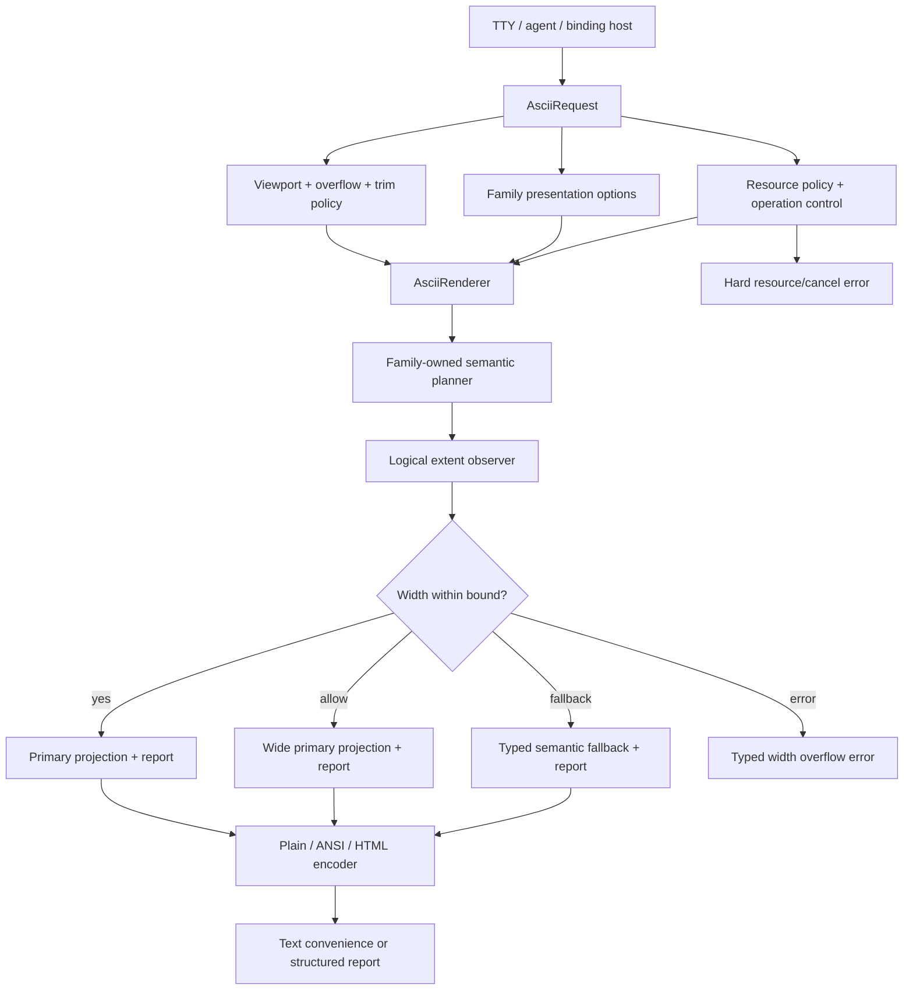

# ASCII Agent Viewport and Output Contract - Plan

## Goal Capsule

- **Objective:** Make Merman ASCII output predictable for terminal, agent, and CLI consumers: callers can state a terminal-cell width, distinguish an intentionally wide result from a width fallback or a hard error, and inspect output extent and projection without parsing the rendered string.
- **Means:** Add a provider-neutral viewport and overflow contract at the request/host boundary, observe final extents across every ASCII finalizer, and keep the existing semantic-depth renderer as the source of diagram meaning. (KTD1, KTD2, KTD3)
- **Authority:** Pinned Mermaid 11.16.1 semantics and the typed `merman-core` model outrank reference output. `docs/adr/0065-ascii-output-boundary.md`, `crates/merman-ascii/ASCII_GAP_REGISTRY.md`, and `docs/rendering/ASCII_SUPPORT_MATRIX.md` define the local ASCII boundary. Issue #53 is evidence that node-label wrapping must remain pre-layout; the Grok implementation is prior art for an explicit post-layout width gate, not a parser or truncation oracle.
- **Execution profile:** Deep, cross-cutting Rust and binding-contract refactor for an alpha release. Internal seams and public Rust/CLI/JSON/binding payloads may be broken when a single canonical contract is simpler; all affected surfaces must be migrated atomically with explicit migration notes and generated-contract checks. Characterization coverage must prove semantic replacement before obsolete paths are deleted.
- **Stop conditions:** Stop and re-plan if the implementation requires a second Mermaid parser, SVG-coordinate quantization, global responsive re-layout, silent ellipsis or clipping of authored labels, treating viewport overflow as a resource-limit error, or an agent/provider-specific adapter inside `merman-ascii`.
- **Tail ownership:** Each behavioral unit updates its tests and affected support contract. The final unit removes superseded helpers and stale claims only after the output matrix, bindings, and documentation agree.

---

## Product Contract

### Summary

This plan adds an explicit terminal viewport and output contract above the already-shipped Issue #53 label wrapping. A caller can request unrestricted, bounded-with-fallback, or bounded-with-error output, while the renderer retains complete semantic content and reports the measured terminal extent. The existing default geometry remains stable until an opt-in compact profile passes a representative corpus.

### Problem Frame

Issue #53 fixed the first-order failure: long Flowchart node labels are wrapped in terminal display cells before node sizing and routing, and the fixture preserves every label, edge label, hard break, and grapheme. That behavior is now a baseline in `A-GRAPH-050`; reworking it would duplicate completed semantic-depth work.

The remaining agent/CLI problem is at the output boundary. `AsciiRenderer` and the facade return a bare `String`, so a host cannot tell whether a result is 74 cells wide, whether it exceeded a requested viewport, whether it is diagrammatic or structured text, or whether a fallback was selected. `AsciiRenderOptions` contains family presentation settings but no viewport policy. The CLI exposes a grid-cell resource limit but no terminal-width limit, and the binding JSON cannot express a width or an overflow policy.

The implementation has several finalization paths. Graph output allocates a canvas after layout and route extents are known; Sequence owns row/document extents; Class and ER use the relation graph document; XYChart and structured-text families use their own styled-line or document finalizers. A graph-only patch would make the contract inconsistent. Trailing-space trimming is also already present as a lower-level capability, but production graph output intentionally preserves the rectangular extent and ANSI/HTML role ownership. It must become an explicit output policy, not an incidental cleanup.

Grok's `xai-grok-markdown::mermaid` demonstrates a useful control flow: wrap and lay out first, reject a canvas wider than `max_width`, and choose an explicit framed fallback while keeping cell-budget overflow separate. Its parser, fixed `MAX_LINES`, `MAX_LABEL`, and ellipsis behavior are unsuitable for Merman because they can discard Mermaid-authored meaning and violate the local complete-output contract.

### Key Decisions

- **Bounded agent output must be typed and loss-aware, with no silent clipping.** (session-settled: user-approved — chosen over always allowing horizontal scroll or truncating to fit: agents need a deterministic, inspectable result and must not lose labels.) Governs R1, R2, R5, R8, R10, R12.
- **Compact layout is opt-in until corpus evidence supports a default change.** (session-settled: user-approved — chosen over changing the current default immediately: the existing default is a compatibility surface and width improvements must not hide route regressions.) Governs R6, R7, R11.

### Requirements

#### Viewport and overflow behavior

- R1. The ASCII request contract must accept an optional maximum terminal width measured in display cells, an overflow policy, and an explicit trailing-space policy without placing host viewport state in `AsciiRenderOptions`.
- R2. `Allow` must return the complete rendered projection even when its measured width exceeds the requested width. `Fallback` must return a complete, terminal-safe projection whose final emitted width is no greater than the requested width; if no admitted fallback fits, it returns a typed fallback-unavailable/width error. `Error` returns a non-resource width error containing the requested and actual extents.
- R3. A missing maximum width must preserve current rendering geometry and output behavior, including the current default Flowchart wrap width of 40 cells and graph padding of 5 cells.
- R4. Viewport width must remain independent from `max_ascii_grid_cells`, layout-work, document-cell, output-byte, grapheme, nesting, and cancellation limits. Resource exhaustion remains a hard structured error and never selects a semantic fallback.
- R5. No viewport path may silently clip, ellipsize, drop, reorder, or partially emit authored labels, edge labels, endpoints, markers, participants, data values, or structured fields. A projection change from Diagrammatic to StructuredText is not itself semantic loss; omitted authored fields are semantic loss and make the default fallback unavailable, with a field-level diagnostic or typed error instead of a silent downgrade.

#### Output report and projection identity

- R6. The renderer must be able to report the final text, requested maximum width, primary logical extent used for the gate, emitted logical extent after explicit trim, row counts under the same convention, actual projection kind/status, overflow outcome, fallback reason, and semantic-loss reasons without requiring callers to re-measure ANSI/HTML escape sequences. The canonical report also carries a schema version, family identity, effective width profile, fallback capability/attempt state, and stable outcome code.
- R7. The report must distinguish at least `Diagrammatic` and `StructuredText` projections and must identify `Fallback` separately from a normal primary projection. A named text convenience helper may remain, but the structured report is the canonical renderer result; the old enum/payload shape is not a compatibility requirement in alpha.
- R8. Extent observation and final encoding must use the same grapheme-width profile, color-role rules, resource ledger, and operation checkpoints as the current renderer. Plain, ANSI, and HTML output must agree on logical cell extent even when encoded byte counts differ.

#### Family coverage and fallback

- R9. Width observation and overflow policy must apply to Graph/Flowchart/State, Sequence, Class, ER, XYChart, and every currently supported StructuredText family; a family-specific finalizer may own its fallback content, but no family may bypass the request contract.
- R10. The first bounded implementation must gate after the family has produced its normal layout extent and before final allocation or emission. It must not introduce global width-driven re-layout or quantize SVG pixels into terminal columns.
- R11. Bounded fallback must prefer a family-owned typed semantic summary or an existing StructuredText projection, re-measure the candidate with the same extent observer, and succeed only when its final width fits. The first release does not make raw Mermaid source a renderer fallback; source framing remains host-owned follow-up work. A family without a complete typed fallback returns a stable fallback-unavailable/unsupported result rather than copying Grok's lossy label truncation.
- R12. Issue #53's pre-layout node-label wrapping, hard-break preservation, grapheme safety, topology, and exact resource-boundary behavior must remain unchanged under `Allow`, `Fallback`, `Error`, canonical profile, compact profile, ASCII charset, Unicode charset, and CJK width profile tests.

#### Host and compatibility surfaces

- R13. The CLI must expose terminal maximum width, overflow policy, trailing-space policy, Flowchart node-label wrap width, and an opt-in compact/canonical layout profile as Text output options. The existing graphical `--width` option remains unrelated.
- R14. Binding JSON must accept the same viewport and profile choices with the repository's snake_case and camelCase aliases, preserve `deny_unknown_fields`, and migrate the default ASCII operation to the canonical report metadata contract in one coordinated alpha change.
- R15. The structured ASCII output report is the canonical Rust/facade/binding result in this slice. `RenderOutput::Ascii(Option<String>)` may be replaced by a report-bearing output, while a separately named text convenience API can serve callers that only need bytes; all FFI, JNI, Swift, Flutter/Dart, Python, Web, and Playground surfaces must be regenerated together rather than preserving a dual contract.
- R16. Public diagnostics must distinguish width overflow, structured fallback, resource exhaustion, cancellation, unsupported semantics, and invalid options with stable codes or fields that do not embed unsafe authored control characters.
- R17. Empty/no-diagram behavior must be explicit and identical across direct Rust, facade, CLI, and bindings: semantic absence is a typed `NoDiagram` result/error, while an admitted empty typed document is a successful zero-extent `Empty` report; neither path attempts viewport fallback or consumes fallback budget.

### Actors

- A1. Human TTY caller: values readable geometry, may accept a wide result for scrolling, and may opt into trailing-space trimming.
- A2. Agent or automation host: needs bounded deterministic output, typed overflow/fallback state, complete labels, and a result that can be placed in a token or context budget by the host.
- A3. Library/binding consumer: needs stable request and response contracts, explicit compatibility behavior, and resource errors that remain distinct from presentation policy.
- A4. Merman maintainer: needs a single provider-neutral renderer boundary and a live support/gap contract that does not drift across CLI, bindings, and Web metadata.

### Key Flows

- F1. **Unrestricted human render:** the host sends no maximum width; the renderer uses the current canonical geometry, emits the selected format, and reports the actual extent.
- F2. **Bounded host render:** the host sends a maximum width and `Fallback`; each family completes its normal plan, the shared boundary observes the extent, and an over-wide result is replaced by a complete typed fallback without partial graph bytes. The host may call this from an agent CLI, but the renderer does not own agent/token policy.
- F3. **Bounded strict render:** the host sends a maximum width and `Error`; an over-wide normal plan returns a width diagnostic before output materialization, while a resource limit or cancellation keeps its existing error precedence.
- F4. **Explicit compact render:** the host selects the compact profile; family-owned wrap and padding candidates are used only if the profile's semantic and width matrix admits them. The canonical profile remains available and unchanged.
- F5. **Binding report render:** a binding caller uses the canonical ASCII operation; the response carries text bytes plus extent/projection/overflow metadata through the shared operation result. A text-only helper is explicitly secondary and is not a second schema.

### Acceptance Examples

- AE1. Given the Issue #53 fixture and no viewport, both ASCII and Unicode retain every node and edge label and keep the current rectangular output behavior.
- AE2. Given the Issue #53 fixture with maximum widths 60, 80, 100, and 120, `Allow` reports the actual width, `Fallback` returns a complete semantic fallback only when its final width fits (otherwise a typed fallback-unavailable/width result), and `Error` returns a width diagnostic; none of the three modes silently drops a word.
- AE3. Given a CJK or ZWJ label at a boundary, reported width uses the selected `TerminalWidthProfile`, and the output never splits a grapheme or miscounts a continuation cell.
- AE4. Given representative Flowchart, Sequence, Class, ER, XYChart, and StructuredText inputs, every supported finalizer reports a non-negative width and height, and the projection kind matches the support matrix.
- AE5. Given identical semantic input under Plain, ANSI16, ANSI256, TrueColor, and HTML modes, logical width and row count are equal even when encoded bytes differ; explicit trimming changes only permitted trailing cells.
- AE6. Given `max_ascii_grid_cells = N`, the normal exact/N-minus-one resource boundary remains unchanged; a viewport width smaller than the normal extent does not become a resource-limit error.
- AE7. Given a binding request with an unknown viewport field, the existing unknown-field error remains; given valid snake_case and camelCase aliases, the compiled request and report are equivalent.
- AE8. Given canonical and compact profiles over the characterization corpus, compact output is admitted only when all retained labels, endpoints, markers, and structured fields remain visible; no default canonical snapshot changes solely because compact candidates exist.
- AE9. Given empty source, comment-only source, an empty typed graph, and an empty structured document, direct, facade, CLI, and binding paths agree on `NoDiagram` versus `Empty`, zero extents, no fallback attempt, and atomic output behavior.
- AE10. Given a primary projection wider than the cap and a fallback candidate wider than the cap, `Fallback` returns a stable fallback-width/unavailable error after one re-measure; it never emits an over-wide fallback or performs a second fallback.

### Success Criteria

- S1. A host, including an agent CLI, can decide whether to emit, select a host-owned delivery fallback, retry with a different policy, or report an error from the typed output state without measuring or parsing the text.
- S2. The width matrix covers at least 60, 80, 100, and 120 terminal cells, ASCII/Unicode/CJK width profiles, and all supported finalizer classes, with no untracked silent-loss case.
- S3. Alpha callers receive one canonical structured output contract; any retained text helper is explicitly documented as a projection, and all generated consumers compile against the same migrated schema.
- S4. CLI, binding JSON, runtime metadata, support matrix, family notes, gap registry, and generated platform contracts describe one viewport/output contract.
- S5. The final diff removes abandoned viewport experiments and stale trim/fallback helpers instead of retaining parallel code paths.

### Host Integration Boundary

This plan is a scoped refinement of the boundary in `docs/adr/0065-ascii-output-boundary.md` and the 2026-08 semantic-depth plan. It supersedes that boundary only for a renderer-owned, request-level terminal viewport, trim policy, and typed projection outcome. Alpha status permits replacing public output shapes, but it does **not** move host delivery policy into Merman.

Merman owns provider-neutral terminal mechanisms and stable contracts: display-cell measurement, viewport policy types, overflow classification, fallback projection metadata, resource limits, capability records, safe diagnostics, and complete-output-or-structured-error behavior. A caller may select `Allow`, `Fallback`, or `Error`, but Merman never infers a terminal width, token budget, provider, or agent persona. `Fallback` here means a complete renderer projection selected before encoding; it is not host post-render truncation, token reduction, or protocol delivery fallback.

Hosts own terminal-size detection, agent/token/context budgets, scroll behavior, protocol envelopes, artifact delivery, post-render response truncation, and provider-specific retry or summarization policy. A CLI may compose a documented agent-friendly default, but that policy remains in CLI/host invocation code and must not become an `AgentPreset`, MCP/provider adapter, token counter, or agent-specific renderer branch. The KTD15 boundary in `docs/plans/2026-08-08-001-refactor-ascii-semantic-depth-plan.md` remains authoritative for host-owned post-render response policy and resource excess: Merman still returns a complete artifact or a structured terminal error, never a partial renderer result.

### Scope Boundaries

In scope:

- A request-level viewport/overflow/trim contract and a canonical typed output report, with a deliberately breaking alpha migration where that removes duplicate payload paths.
- A shared extent observation seam integrated with graph, sequence, relation, chart, and structured-text finalizers.
- Post-layout width gating, typed fallback classification, safe semantic fallback coverage for the common supported families, and CLI/binding/Web contract propagation.
- An opt-in compact profile evaluated by semantic width matrices.
- Support matrix, family support notes, gap registry, binding options documentation, migration notes, and deletion of superseded internal helpers.

### Deferred to Follow-Up Work

- Automatic edge-label wrapping and a new route-occupancy policy for `A-GRAPH-030`; this plan observes edge labels and preserves them but does not make them responsive.
- Global width-driven re-layout, rank recomputation, or a search over multiple compact layout candidates beyond the bounded profile slice.
- New ASCII diagram families and upgrades of currently unsupported families.
- Raw Mermaid-source framing as a renderer fallback. If a host wants to disclose source after a typed renderer result, it must do so outside Merman with its own safety, protocol, and token policy.
- A provider-specific agent output envelope, token estimator, MCP tool, or pager integration.
- Host-owned post-render truncation, token budgeting, scroll/pager behavior, or provider retry policy. The renderer contract may report enough state for a host to choose those actions, but does not perform them.
- Changing the canonical defaults of `flowchart_node_label_wrap_width`, graph padding, sequence spacing, or chart dimensions without a later corpus-backed decision.

### Outside This Product's Identity

- Copying Mermaid or Grok parsers into `merman-ascii`.
- Treating a host-owned source disclosure as diagrammatic parity or allowing `merman-ascii` to reparse source text.
- Using ellipsis, scalar slicing, or byte truncation to make a diagram fit a viewport.
- Converting viewport overflow into a fake resource success or returning partial renderer output.

### Sources and Research

- `docs/adr/0065-ascii-output-boundary.md` — model-driven terminal boundary, resource/cancellation ownership, and explicit degradation rules.
- `crates/merman-ascii/ASCII_GAP_REGISTRY.md` — live gap contract; `A-GRAPH-050` records Issue #53 wrapping as shipped and `A-GRAPH-030` remains a separate route-label gap.
- `crates/merman-ascii/src/options.rs`, `src/resource.rs`, `src/operation.rs`, `src/graph/adapter.rs`, `src/graph/layout/grid.rs`, `src/graph/draw.rs`, `src/canvas.rs`, `src/safe_text/*` — current option, budget, cancellation, pre-layout wrap, extent, and encoding seams.
- `crates/merman-ascii/tests/flowchart_model/direction_and_labels.rs` and `tests/testdata/local-semantic/flowchart/issue_53_long_node_labels.mmd` — Issue #53 semantic and exact resource-boundary evidence.
- `crates/merman-ascii/README.md`, `FLOWCHART_SUPPORT.md`, `SEQUENCE_SUPPORT.md`, and `docs/rendering/ASCII_SUPPORT_MATRIX.md` — user-facing support and width/profile claims.
- `crates/merman/src/render.rs`, `crates/merman/src/ascii.rs`, `crates/merman-cli/src/cli.rs`, `src/invocation.rs`, `src/app.rs`, `crates/merman-bindings-core/src/common.rs`, `src/ascii.rs`, and `docs/bindings/OPTIONS_JSON.md` — public request, CLI, binding, and generated-contract seams.
- `repo-ref/grok-build/crates/codegen/xai-grok-markdown/src/mermaid.rs` — post-layout `max_width` gate, separate width/cell oversize causes, and framed source fallback; parser and ellipsis behavior are explicitly not adopted.
- User-named external references: Latias94/merman Issue #53 and Simon Willison's `grok-mermaid` page. They are comparative evidence only; pinned local Mermaid/Merman semantics remain authoritative.

---

## Planning Contract

### Key Technical Decisions

- KTD1. **Separate host policy selection from Merman mechanism ownership.** (session-settled: user-approved — chosen over adding width and overflow fields to every family-owned `AsciiRenderOptions`: presentation options remain reusable while host policy stays explicit.) The host chooses and injects a numeric display-cell viewport and overflow/trim policy; Merman validates and enforces the provider-neutral mechanism through the `AsciiRequest` seam. Family options continue to own charset, width profile, padding, wrap, and family layout. `AsciiRequest`, `AsciiRenderOptions`, binding schemas, and renderer diagnostics must not accept token/context budgets, provider names, model metadata, response-truncation settings, or environment-derived width. Governs R1, R3, R9, R13.
- KTD2. **Use a provider-neutral bounded-projection policy with complete-output semantics.** (session-settled: user-approved — chosen over a renderer-wide agent preset or implicit scroll/truncation: Merman can remain reusable while hosts choose their delivery policy.) `Allow`, `Fallback`, and `Error` are target policy, not resource limits. A host may select `Fallback`, but the renderer's fallback is still a complete, typed projection; host token reduction, scrolling, and post-render truncation remain outside this contract. Governs R2, R4, R5, R11, R16.
- KTD3. **Gate after normal layout and before materialization.** (session-settled: user-approved — chosen over global responsive re-layout: the first contract can be deterministic without perturbing Mermaid-compatible topology.) Graph gates after planned canvas extent; row/document families gate after their planned output extent; each path retains its own family semantics. Governs R8-R10, R12.
- KTD4. **Make the structured report canonical and accept an alpha-breaking payload migration.** `AsciiOutput` owns text and logical metadata at the renderer/facade boundary; `RenderOutput::Ascii` and binding operation metadata may change shape in this alpha slice. A separately named text helper can project `text` bytes, but no parallel compatibility envelope or legacy enum shape is required. Binding metadata extends the existing versioned output-plan mechanism, and all generated consumers migrate in the same change. (session-settled: user-approved — alpha status permits breaking public surfaces to remove duplicate contracts and simplify agent consumption.) Governs R6, R7, R14, R15.
- KTD5. **Prefer typed semantic fallback and keep source disclosure outside the renderer.** Existing StructuredText projections and family-owned summaries are the first fallback candidates, and each family must declare whether that fallback is actually available at runtime. The first release does not add a framed normalized-source fallback to `merman-ascii`; a host may disclose source later under its own safety/protocol/token policy. Grok's `MAX_LABEL`, `MAX_LINES`, and ellipsis are not imported. A default fallback result may not silently omit authored semantic fields; if required fields cannot be retained, return a typed fallback-unavailable/unsupported error. Governs R5, R7, R11, R16.
- KTD6. **Keep trim explicit and role-aware.** Canonical output remains untrimmed. The new trim policy may remove only renderer-owned trailing blank cells or empty rows that are proven trimmable; it must preserve styled background/role cells when the selected output mode requires them and must run through the same document/output admission as non-trimmed output. For deterministic compatibility, the width gate uses the untrimmed planned primary extent; trim changes only the emitted extent and never turns an over-wide primary into an in-bound result. `trimmed`, projection change, and semantic loss are separate report states; trimming is never a width-clipping mechanism. Governs R3, R8, R12, R15.
- KTD7. **Compact profile is a measured product profile, not a bag of magic numbers.** Candidate values may start from the observed Grok/Merman contrast (smaller node wrap and graph padding), but they are admitted only through a corpus matrix that checks semantic retention, width, height, route readability, and resource amplification. The canonical profile is never silently rewritten. Governs R6, R10, R12, R13.
- KTD8. **One extent observer, multiple family owners.** Introduce a small shared logical extent/report seam, but do not force Graph, Sequence, Relation, XYChart, and StructuredText into one universal layout model. Each family remains responsible for its semantic fallback and finalizer; the shared seam records common metadata and policy outcomes. Governs R7-R10.
- KTD9. **Preserve operation and resource ownership.** Viewport checks use the caller-owned `AsciiExecution`, `ResourceContext`, transactions, and checkpoints. A width fallback cannot bypass cancellation, output-byte admission, grapheme limits, or the existing error precedence. Governs R4, R8, R12, R16.
- KTD10. **Generated/public contracts are part of the implementation, not cleanup.** CLI completion, binding aliases, Web/Playground fallback catalogs, generated platform DTOs, and options documentation update in the same delivery slice as their Rust source. Governs R13-R16.
- KTD11. **Use one canonical machine-readable report vocabulary across every surface.** Rust, facade, CLI report mode, bindings, Web, and generated platforms share one report schema and enum meanings. The default binding operation may become report-bearing; a text-only helper is a projection, not a compatibility branch. Schema version, output-plan discriminant, unknown-field/unknown-enum behavior, and migration notes are frozen before U5. (session-settled: user-approved — a single breaking alpha contract is preferred over retaining two incompatible result paths.) Governs R6, R7, R14-R16.

### High-Level Technical Design

The report is produced from logical cells, not encoded byte length. The policy gate runs after a family has a complete planned extent and before allocating or emitting the over-wide primary surface. `Allow` bypasses replacement but still records overflow. `Fallback` selects a complete family-owned typed summary or StructuredText projection; source disclosure remains host-owned. `Error` returns a width-specific diagnostic. Resource errors and cancellation terminate through their existing paths and never become fallback output.

### Outcome, extent, and accounting contract

The internal sequence is fixed for every family: parameter validation → typed model → family layout/prepared artifact with operation/resource checkpoints → primary logical extent and resource admission → viewport decision → at most one typed fallback attempt → explicit trim → encoder/report. The width decision must operate on the prepared logical artifact, not on an encoded `String`, ANSI escapes, HTML markup, or byte length. Fallback reuses the same typed model, `AsciiExecution`, and resource ledger; it never reparses source text or resets budgets.

The report distinguishes the following fields (exact public names are implementation-owned, but the semantics are not optional):

- requested maximum width, measured primary width, and final visible width;
- height under the same explicit trim convention;
- primary and actual projection identity (`Diagrammatic` versus `StructuredText`, plus primary/fallback provenance);
- overflow state (`none`, `width`, or equivalent typed state with actual/max values);
- fallback reason and availability/provenance;
- `trimmed` state and semantic-loss reasons. Geometry downgrade or encoding normalization is not semantic loss; omitted authored fields are semantic loss and make the default fallback unavailable.

The first terminal cause remains sticky according to the existing operation contract. The decision matrix is:

| First observed condition | Result | Fallback allowed? | Partial output allowed? |
| --- | --- | --- | --- |
| Cancellation/deadline | Existing typed cancellation error with phase/reason | No | No |
| Resource limit (grid, work, document, bytes, grapheme, nesting) | Existing typed resource error with limit/phase/actual/max/profile | No | No |
| Unsupported/invalid semantic or option | Existing typed unsupported/invalid error | No; `Fallback` applies only after a valid primary plan is too wide | No |
| Primary extent exceeds requested width | `Allow` wide report, `Fallback` one bounded typed fallback attempt, or `Error` width diagnostic | Only for `Fallback`, and only before final encoding | No |
| Normal extent within bound | Primary report | Not needed | Yes, complete encoded result |

If the single fallback attempt is itself over-wide, unavailable, or would exceed the remaining resource budget, the operation returns a typed width/fallback/resource result according to the first terminal cause; it does not recurse, truncate, or reset accounting. Width is measured before trim for the gate and both pre-trim and post-trim visible extents remain inspectable so a host cannot mistake trimming for fitting.

### Canonical report and empty-result contract

The alpha migration chooses one canonical `AsciiOutput` report at the renderer/facade boundary. Its wire-equivalent fields are: `schema_version`; `text`; `family`; `projection_kind`; `outcome` (`primary`, `wide_allowed`, `fallback`, `empty`, or `error`); `requested_max_width`; `primary_extent`; `emitted_extent`; `width_profile`; `trimmed`; `overflow`; `fallback` (`supported`, `attempted`, `reason`); `lossiness`; and a stable `error_code` when the outcome is an error. Exact Rust names may follow local conventions, but every transport must preserve these meanings and units (terminal display cells and logical rows).

The canonical Rust result may replace `RenderOutput::Ascii(Option<String>)`. A named text projection helper is allowed for callers that only need bytes; it is not a second result contract. Binding operation data continues to carry text bytes, while the versioned `output_plan.kind = "ascii"` carries the report fields. The alpha migration increments or explicitly extends the metadata schema, updates known-plan decoders and generated bindings together, and documents the old shape as unsupported after migration.

Empty behavior is fixed: semantic absence (empty source, comments only, or parser output with no model) is a typed `NoDiagram` result/error with no text and no extent; an admitted empty typed graph/document is a successful `Empty` report with empty text and `primary_extent = emitted_extent = { width: 0, height: 0 }`. Neither path invokes fallback or changes resource/cancellation precedence.

### Execution Phases and Gates

| Phase | Units | Entry condition | Exit gate |
| --- | --- | --- | --- |
| Phase 0: Characterization | U1 | Current Issue #53 and support contracts are available | Width/height/trim/projection expectations are recorded for representative finalizers without changing defaults. |
| Phase 1: Request and report substrate | U2-U3 | U1 establishes the matrix | Request policy, logical extent, report metadata, and compatibility projection are defined and covered by unit/facade tests. |
| Phase 2: Fallback and host policy | U4-U6 | U2-U3 preserve normal output | Graph and non-graph finalizers gate consistently; CLI and bindings can select the policy; no silent loss or resource-policy regression exists. |
| Phase 3: Compact profile | U7 | Canonical and fallback paths are stable | Compact profile passes corpus width/semantic gates and remains opt-in. |
| Phase 4: Contract closeout | U8 | All runtime/public behavior is covered | Docs, support/gap records, generated contracts, migration notes, and deletion review agree; independent review has no unresolved P0/P1 findings. |

### Assumptions

- The current pinned Mermaid baseline remains 11.16.1 for implementation; no release alignment or dependency upgrade is part of this plan.
- Alpha consumers may need source/API migration. The canonical report shape is chosen once and propagated through Rust, CLI, binding, generated, Web, and Playground surfaces; a text helper is optional convenience, not a compatibility promise.
- The agent host can choose a width from its own terminal or output budget. Merman does not infer a terminal width from environment variables or token counts.
- Structured fallback can be implemented for the common diagrammatic families without inventing a second semantic model; if a family cannot preserve its required fields, it returns a typed unsupported/fallback error rather than silently weakening the report.
- The existing untracked `platforms/flutter/{android,ios,linux,macos,windows}/` directories are user-owned work and are outside this plan.
- Cargo verification is run serially and reuses the existing workspace target directory during execution.

### Alternatives Considered

| Alternative | Benefit | Cost or risk | Decision |
| --- | --- | --- | --- |
| Put `max_width` and overflow into `AsciiRenderOptions` | Fewer request fields | Mixes host policy with family presentation and forces every adapter to carry unrelated state | Rejected; use request/host boundary. |
| Re-layout the graph until it fits | Can produce narrower primary art | Changes topology, rank, route ownership, and semantic behavior based on an external viewport | Deferred; first release uses post-layout gate. |
| Truncate labels with ellipsis like Grok | Small and visually compact | Loses authored meaning and conflicts with complete-output semantics | Rejected. |
| Always return a framed source fallback | Simple universal implementation | Raw source is outside the model-driven renderer boundary and can bypass semantic field ownership or safety framing | Rejected for this renderer slice; defer source disclosure to the host. |
| Replace the existing string output immediately with a report enum | Clean final API | Requires coordinated Rust/CLI/binding/generated migration | Accepted for alpha; keep only a named text projection helper, not a legacy result branch. |
| Change canonical defaults to a compact profile | Immediate width reduction | Causes broad output churn and may hide route regressions | Rejected until corpus evidence supports a later decision. |

### System-Wide Impact

- **Rust API:** `AsciiRequest`, `RenderTarget`, `RenderOutput`, facade re-exports, and target-local diagnostics gain viewport/report concepts. The canonical report may replace the old ASCII string payload; migration tests and a named text projection helper are required, but legacy enum-shape compatibility is not.
- **ASCII families:** All supported finalizers must expose a logical extent and policy outcome. Graph-only changes are incomplete.
- **CLI:** Text output parsing, destination-aware defaults, completion/known-option lists, and error rendering gain new fields. `--width` remains graphical-only.
- **CLI protocol and atomicity:** Default text mode keeps stdout/file output as the final text only; report mode is explicit and machine-readable, with diagnostics/status/exit mapping following existing CLI conventions. Width, fallback-unavailable, resource, cancellation, invalid-option, and write failures must not leave partial stdout or artifact files. Non-interactive paths never prompt for approval.
- **Bindings and generated surfaces:** The shared options JSON is `deny_unknown_fields`; every new field needs aliases, validation, schema documentation, a versioned ASCII output-plan, and generated platform checks. Alpha consumers migrate together rather than receiving two result contracts.
- **Binding operation metadata:** The canonical operation carries text bytes plus report metadata through the versioned output-plan mechanism, with one vocabulary and no duplicated text envelope. A named text helper may project bytes only. Token/context/provider/truncation fields are forbidden renderer inputs.
- **Web/Playground:** Runtime capability and fallback catalogs must distinguish diagrammatic primary output from structured fallback and must not claim a compact default that is not shipped.
- **Security and reliability:** Safe-text normalization, output-byte admission, cancellation, and resource limits remain upstream of fallback emission. No partial output is returned.
- **Performance:** A post-layout width gate is not an early resource guard; an over-wide primary may already have consumed layout/grid/document work. The plan must measure fallback amplification and reject an implementation that scans every output multiple times without accounting or resets the ledger between primary and fallback.
- **Agent action/context parity:** Direct Rust, CLI text/report, binding, Web, and generated surfaces must accept the same provider-neutral viewport/profile/trim choices and expose equivalent report semantics. Host approval, retry, token budgeting, source disclosure, and post-render modification stay outside Merman and must be marked host-owned when documented.

### Risks and Dependencies

| Risk or dependency | Impact | Mitigation |
| --- | --- | --- |
| Public `RenderOutput` and binding bytes are changed incompatibly | Downstream compile/runtime breakage | Treat the alpha migration as intentional, publish one canonical schema and migration note, regenerate all consumers together, and keep only a thin named text projection helper. |
| Only Graph receives the width gate | Agent output is inconsistent by family | U1/U3 require representative Sequence, Relation, XYChart, and StructuredText finalizers before host flags are enabled. |
| Trim removes styled background cells | ANSI/HTML appearance changes or role ownership breaks | Define trimmable-cell policy per color mode and test plain/ANSI/HTML with wide glyphs and empty rows. |
| Width overflow is confused with resource exhaustion | Hosts retry incorrectly or receive a misleading error | Use a distinct target-local overflow result; keep stable resource IDs and error precedence unchanged. |
| Fallback summary omits semantic fields | Agents receive a plausible but incomplete diagram | Field-preservation assertions enumerate labels, endpoints, markers, participants, values, and structured metadata; mark lossiness or fail closed. |
| Primary is over-wide and fallback also exceeds width or budget | Renderer loops, silently clips, or bypasses resource ceilings | Allow at most one typed fallback; return a stable width/fallback-unavailable/resource result using the first terminal cause and the same ledger/checkpoints. |
| Host truncates or summarizes a renderer result | A modified artifact is mislabeled as complete Merman output | Keep host-modified provenance in the host envelope; never add token/truncation state to `AsciiRequest` or renderer report. |
| Report schemas diverge across CLI/bindings/Web | Agents make different decisions for identical output | Use one canonical report vocabulary and action/context parity matrix, with generated-contract and round-trip tests. |
| Width gate is mistaken for a memory/time bound | Large diagrams still amplify before the gate | Document the gate as a presentation contract; rely on existing resource/work limits for early admission and add separate future work for width-aware layout if needed. |
| Compact candidates overfit Issue #53 | Other families regress or become taller | Use a multi-family 60/80/100/120 matrix and require canonical-vs-compact comparison before changing any default. |
| Generated platform contracts drift | Flutter/Web/FFI callers reject valid options | Run generated-binding verification and update source/schema/docs together. |
| A new shared abstraction becomes a universal layout model | Family semantics get erased | Keep the extent/report seam narrow and retain family-owned planners and fallback serializers. |

---

## Implementation Units

### Unit Index

| Unit | Title | Primary files | Depends on |
| --- | --- | --- | --- |
| U1 | Characterize extents and Issue #53 width behavior | ASCII tests, Issue #53 fixture, support/gap docs | None |
| U2 | Define viewport and report contracts | `merman-ascii`, `merman` request/output seams | U1 |
| U3 | Integrate extent observation and width gates | Graph, Canvas, StyledLine/document finalizers | U2 |
| U4 | Add complete semantic fallback policy | Family fallback adapters and diagnostics | U2-U3 |
| U5 | Expose CLI and binding request/response policy | CLI, binding core, generated contracts | U2-U4 |
| U6 | Add compatibility and agent-facing report surfaces | Facade, Web/Playground metadata, examples | U2-U5 |
| U7 | Evaluate and ship the opt-in compact profile | Profile options, corpus tests, support docs | U1-U6 |
| U8 | Close documentation, migration, and cleanup | ADR/support/gap/docs, dead-code review | U3-U7 |

### U1. Characterize extents and Issue #53 width behavior

- **Goal:** Establish a semantic, terminal-cell baseline for normal output, width overflow, trimming, and projection identity before introducing new policy.
- **Requirements:** R3, R4, R6, R8, R9, R12.
- **Dependencies:** None.
- **Files:** `crates/merman-ascii/tests/flowchart_model/direction_and_labels.rs`, `crates/merman-ascii/tests/sequence_model.rs`, `crates/merman-ascii/tests/class_model.rs`, `crates/merman-ascii/tests/er_model.rs`, `crates/merman-ascii/tests/new_family_models/`, `crates/merman-ascii/tests/sectioned_structured_text.rs`, `crates/merman-ascii/tests/testdata/local-semantic/flowchart/issue_53_long_node_labels.mmd`, `crates/merman-ascii/tests/support/mod.rs`, `crates/merman-ascii/ASCII_GAP_REGISTRY.md`.
- **Approach:**
  1. Reuse the existing terminal-cell helpers and local-semantic fixture policy instead of whole-string snapshots for every family.
  2. Record width, height, rectangularity, retained semantic fields, and trailing-cell behavior for representative Graph, Sequence, Class/ER relation, XYChart, and StructuredText cases.
  3. Add a width matrix at 60, 80, 100, and 120 cells, including ASCII, Unicode, and CJK width profiles where the fixture has ambiguous or wide glyphs.
  4. Keep exact/N-minus-one resource tests adjacent to the characterization cases so a viewport constraint cannot accidentally replace a resource boundary.
- **Execution note:** Add characterization coverage before changing shared finalization code.
- **Test scenarios:**
  - Issue #53 preserves every existing node and edge-label fragment under the default and explicit Flowchart wrap widths.
  - Issue #53 reports the same semantic content under all four width profiles and both charsets; CJK width changes measurement only where the selected width table says it should.
  - Representative Sequence, Class, ER, XYChart, and StructuredText inputs expose a stable maximum width and row count without parsing encoded ANSI or HTML bytes.
  - Existing exact/N-minus-one `max_ascii_grid_cells`, document-cell, output-byte, and cancellation tests retain their current outcomes.
- **Verification:** Characterization tests pass against the current renderer and record width, height, rectangularity, semantic retention, and resource behavior without requiring the future report API. Report-specific assertions remain deferred to U2; no default snapshot or support claim is broadened by this unit.

### U2. Define viewport and report contracts

- **Goal:** Introduce provider-neutral request policy and a target-owned logical output report without coupling family options to host viewport state.
- **Requirements:** R1-R8, R13-R17.
- **Dependencies:** U1.
- **Files:** `crates/merman-ascii/src/options.rs`, `crates/merman-ascii/src/lib.rs`, `crates/merman-ascii/src/error.rs`, `crates/merman/src/render.rs`, `crates/merman/src/ascii.rs`, `crates/merman/src/lib.rs`, `crates/merman/tests/ascii_api.rs`, `crates/merman/tests/render_operation.rs`.
- **Approach:**
  1. Add a non-exhaustive viewport policy containing optional maximum display width, `Allow`/`Fallback`/`Error`, and explicit trailing-space behavior. Keep it outside `AsciiRenderOptions`.
  2. Define the canonical `AsciiOutput` report and its wire-equivalent fields, including schema version, family/projection/outcome, primary/emitted extents, width profile, fallback capability/attempt state, trim, lossiness, and stable error code.
  3. Replace the old ASCII string payload at the canonical Rust/facade boundary if that removes duplicate contracts; retain only a clearly named text projection helper. Define the binding `output_plan.kind = "ascii"` fields, schema-version migration, known-plan decoder behavior, and generated-surface update in this unit rather than leaving them to U5.
  4. Add a distinct width-overflow diagnostic that cannot be converted into `AsciiResourceLimitExceeded`, reject host-only fields such as token/context budgets, provider identifiers, and response-truncation settings at the request/schema boundary, and fix `NoDiagram` versus successful `Empty` semantics.
- **Patterns to follow:** `AsciiRequest` resource separation in `merman/src/render.rs`; `AsciiDiagnostic` safe projection in `merman/src/ascii.rs`; non-exhaustive public enums in `merman-ascii`.
- **Test scenarios:**
  - Default request construction has no viewport and reproduces canonical options.
  - Each overflow policy validates its bounds and rejects zero-width maxima without allocating a renderer.
  - Report metadata distinguishes Diagrammatic/StructuredText, Primary/WideAllowed/Fallback/Empty/Error, primary versus emitted extents, width overflow, explicit trimming, and semantic loss.
  - Direct Rust, facade, and binding report fixtures serialize the same canonical fields and enum values; the named text helper is a projection of the report text.
  - Empty/no-diagram, width overflow, resource exhaustion, cancellation, unsupported family, and invalid option diagnostics remain distinguishable and terminal-safe.
- **Verification:** Public type documentation explains the alpha migration and canonical ownership; schema fixtures and generated-contract tests prove one report vocabulary sufficient for a host to make a policy decision without measuring the text.

### U3. Integrate extent observation and width gates across finalizers

- **Goal:** Apply one logical viewport policy consistently to graph, row/document, relation, chart, and structured-text output while preserving family-owned semantics and resource accounting.
- **Requirements:** R4, R6-R10, R12.
- **Dependencies:** U2.
- **Files:** `crates/merman-ascii/src/graph/draw.rs`, `crates/merman-ascii/src/canvas.rs`, `crates/merman-ascii/src/text.rs`, `crates/merman-ascii/src/sequence/render.rs`, `crates/merman-ascii/src/sequence/row_document.rs`, `crates/merman-ascii/src/relation_graph/document.rs`, `crates/merman-ascii/src/relation_graph/summary.rs`, `crates/merman-ascii/src/xychart/render.rs`, `crates/merman-ascii/src/safe_text/document.rs`, `crates/merman-ascii/tests/flowchart_model/direction_and_labels.rs`, `crates/merman-ascii/tests/sequence_model.rs`, `crates/merman-ascii/tests/class_model.rs`, `crates/merman-ascii/tests/er_model.rs`, `crates/merman-ascii/tests/new_family_models/`, `crates/merman-ascii/tests/sectioned_structured_text.rs`.
- **Approach:**
  1. Add a narrow extent observer/finalization seam that consumes planned logical rows/cells and returns the report inputs; the shared layer owns policy/report/common accounting only.
  2. Require each family finalizer to provide its own prepared artifact, logical extent source, and (when available) fallback factory. The shared layer must not own family semantics or rescan encoded strings.
  3. Insert the graph gate after route/canvas extent admission and before `Canvas` allocation; do not crop a painted canvas.
  4. Integrate the same policy with Sequence row extents, relation documents, chart plots, and structured-text line finalizers.
  5. Route trim decisions through both Canvas and StyledLine/document encoders, preserving styled-role cells and charging the same document/output work. Measure with the same `TerminalWidthProfile`/grapheme iterator used for layout.
  6. Keep `AsciiExecution` checkpoints and `ResourceContext` transactions around every observation, fallback preparation, and final encoding pass. A primary-over-wide result cannot reset or evade resource/work charges; fallback is attempted at most once.
- **Finalizer ownership matrix:**

  | Family artifact | Extent owner | Fallback owner | Shared-layer responsibility |
  | --- | --- | --- | --- |
  | Graph/Flowchart/State canvas | graph scene/canvas logical cells after route admission | graph/state typed projection, if admitted | width policy, report, common accounting |
  | Sequence row/document | sequence row/document planner | sequence structured projection | width policy, report, common accounting |
  | Class/ER relation document | relation document/summary planner | relation graph's existing lossless summary seam | width policy, report, common accounting |
  | XYChart plot/document | chart plot and styled-line planner | chart typed data projection, if admitted | width policy, report, common accounting |
  | Other StructuredText families | family-owned logical lines/document | family-owned structured serializer | width policy, report, common accounting |

  A family that cannot retain required fields must return an explicit unsupported/fallback-unavailable result; the shared observer never invents a generic summary.
- **Test scenarios:**
  - A normal graph within the bound emits the primary diagram and reports its actual extent.
  - A graph wider than the bound does not allocate the primary canvas under `Error` and does not emit partial bytes under `Fallback`.
  - Sequence, relation, chart, and structured-text paths make the same `Allow`/`Fallback`/`Error` decision for equivalent extents.
  - Plain, ANSI, and HTML modes report identical logical width/height; trimming does not remove non-trimmable styled cells or continuation cells.
  - Empty rows, trailing blank rows, wide/zero-width/ZWJ graphemes, and CJK profiles use the documented extent convention.
  - A primary width overflow combined with a grid, output-byte, document-cell, or layout-work limit returns the existing resource error; cancellation during measurement, fallback, or encoding remains the sticky cancellation result.
  - Resource-limit and cancellation failures occur at their existing phases and do not become fallback reports.
- **Verification:** All supported finalizer classes pass the width matrix and resource/cancellation regression gates; no family bypasses the viewport contract.

### U4. Add complete semantic fallback policy

- **Goal:** Provide useful, terminal-safe bounded semantic projections without pretending that a summary is diagrammatic geometry or making the renderer agent-aware.
- **Requirements:** R2, R5, R7, R9-R12, R16, R17.
- **Dependencies:** U2, U3.
- **Files:** `crates/merman-ascii/src/lib.rs`, `crates/merman-ascii/src/sectioned_text.rs`, `crates/merman-ascii/src/graph/`, `crates/merman-ascii/src/sequence/`, `crates/merman-ascii/src/relation_graph/`, `crates/merman-ascii/src/xychart/`, `crates/merman-ascii/tests/flowchart_model/`, `crates/merman-ascii/tests/sequence_model/`, `crates/merman-ascii/tests/class_model.rs`, `crates/merman-ascii/tests/er_model.rs`, `crates/merman-ascii/tests/new_family_models/`, `crates/merman-ascii/tests/sectioned_structured_text.rs`.
- **Approach:**
  1. Reuse existing StructuredText projections where they preserve the family fields required by the support matrix.
  2. Add family-owned summaries for common diagrammatic families only where the typed model already exposes the required nodes, endpoints, labels, markers, participants, values, or control facts.
  3. Make the first release typed-model-only: use existing StructuredText/relation summaries and family-owned semantic serializers. Do not add raw-source framing or source reparsing to `merman-ascii`; leave source disclosure to a host follow-up.
  4. Mark projection status, fallback reason, retained-field inventory, and semantic loss in the report. If a required field cannot be preserved, return a typed unsupported/fallback-unavailable error rather than silently omit it.
- **Patterns to follow:** relation `relations:` summaries, existing Gantt/GitGraph/Journey/Kanban/Mindmap/Packet/Timeline/TreeView structured documents, safe terminal framing, and capability projection fields.
- **Test scenarios:**
  - Over-wide Flowchart fallback retains every node, edge, endpoint marker, and edge label in a deterministic semantic order.
  - Over-wide Sequence fallback retains participants, message direction/type, notes, lifecycle/control facts, and visible order.
  - Over-wide Class/ER fallback retains endpoints, relation markers/cardinalities, labels, and multiline fields without duplicating boxes.
  - XYChart fallback discloses series names, values, missing points, and collision/quantization facts without rounding distinct values together.
  - A family with no complete typed fallback returns a stable fallback-unavailable/unsupported result; it never falls through to source text or an ellipsis.
  - A deliberately unrepresentable typed field returns an explicit loss/error result rather than an apparently complete diagram.
- **Verification:** Host-selected bounded fallback output is complete, deterministic, terminal-safe, and labeled as a fallback/structured projection; Grok ellipsis behavior and source reparsing are absent from the renderer path.

### U5. Expose CLI and binding request/response policy

- **Goal:** Make the canonical viewport report usable from the command line and shared binding JSON, migrating the alpha byte/result shape atomically where that removes duplicate contracts.
- **Requirements:** R1-R4, R6-R8, R13-R17.
- **Dependencies:** U2, U3, U4.
- **Files:** `crates/merman-cli/src/cli.rs`, `crates/merman-cli/src/invocation.rs`, `crates/merman-cli/src/app.rs`, `crates/merman-cli/src/render/prepare.rs`, `crates/merman-cli/src/render/execute.rs`, `crates/merman-cli/src/error.rs`, `crates/merman-bindings-core/src/common.rs`, `crates/merman-bindings-core/src/ascii.rs`, `docs/bindings/OPTIONS_JSON.md`, generated platform binding/schema files identified by the repository verification tooling.
- **Approach:**
  1. Add Text-output flags for maximum width, overflow policy, trailing-space trimming, Flowchart wrap width, and canonical/compact profile selection. Do not reuse graphical `--width`.
  2. Keep `--ascii-max-grid-cells` on the resource-policy path and ensure help/completion/recognized-option lists distinguish it from viewport width.
  3. Add binding JSON fields under the ASCII request object with snake_case and camelCase aliases, strict validation, and request-overlay merge behavior consistent with `OPTIONS_JSON.md`.
  4. Migrate the binding operation to the canonical report-bearing ASCII output plan (`kind = "ascii"`) and regenerate all known consumers in one change. A named text-only helper may project the report's `text` bytes, but it is not a second compatibility envelope.
  5. Map width overflow and fallback metadata without conflating them with the existing resource error details schema; reject token/context/provider/truncation fields as unknown.
- **Test scenarios:**
  - CLI parses valid width/overflow/trim/profile combinations and rejects zero, unknown, or contradictory values before rendering.
  - CLI `--ascii-max-grid-cells` remains a resource limit and never changes when a viewport width is supplied.
  - CLI completion and help recognize every new Text-output option while leaving graphical `--width` behavior unchanged.
  - Binding JSON accepts both documented naming forms, rejects unknown nested fields, and deeply merges request-local viewport values without mutating a cached engine.
  - The canonical binding output contains text plus logical metadata; the named text helper returns exactly the report's text bytes.
  - The binding report, generic operation metadata, and generated platform contracts expose the same field set and enum values; unknown output-plan kinds remain forward-compatible according to the existing mechanism.
  - CLI text mode, CLI report mode, Rust facade report, and binding report accept equivalent requests and produce equivalent logical metadata; stdout remains atomic text by default, report output is explicit, and width/resource/cancel/invalid failures have distinct status/exit mappings.
  - Negative schema cases containing `token_budget`, `context_budget`, `max_output_tokens`, provider/model identifiers, or post-render `truncate` fields are rejected rather than entering the renderer contract.
- **Verification:** CLI, binding, generated-contract, and schema checks prove one request contract across Rust, FFI, Flutter/Dart, Swift/JNI, Python, Web, and Playground consumers. An action/context parity matrix covers text render, explicit report render, `Allow`/`Fallback`/`Error`, trim/profile/charset/width-profile choices, independent resource limits, and invalid/width/resource/cancellation/unsupported/write-failure outcomes. The default CLI path writes only the final text atomically; report mode is explicit and non-interactive.

### U6. Add facade and agent-facing report surfaces

- **Goal:** Make the canonical report metadata discoverable to hosts and examples while retaining only a deliberately named text projection and migrating the alpha facade shape.
- **Requirements:** R6-R8, R11, R14-R17.
- **Dependencies:** U2-U5.
- **Files:** `crates/merman/src/render.rs`, `crates/merman/src/ascii.rs`, `crates/merman/src/lib.rs`, `crates/merman/tests/ascii_api.rs`, `crates/merman/tests/render_operation.rs`, `crates/merman/examples/render_terminal.rs`, `crates/merman-bindings-core/src/metadata.rs`, Web/Playground capability and fallback catalog files, `docs/rendering/ASCII_SUPPORT_MATRIX.md`.
- **Approach:**
  1. Replace the old `RenderOutput::Ascii(Option<String>)` payload at the canonical facade boundary with the report-bearing ASCII output. Keep a separately named text convenience projection for callers that only need bytes; do not maintain a parallel legacy enum branch.
  2. Ensure report projection identity follows runtime capability metadata: a StructuredText fallback is not counted as Diagrammatic support.
  3. Add a small non-interactive host example showing: request report → inspect overflow/projection/lossiness → choose emit/retry/host delivery policy → request or publish text. Any approval, retry, token reduction, or post-render truncation remains host-owned and is not represented as renderer state.
  4. Align Web/Playground fallback data and runtime metadata with the same policy fields, while keeping host-specific token/context handling outside Merman.
- **Test scenarios:**
  - Rust callers can request report mode and still call the existing text convenience API.
  - Report metadata remains stable when output color mode changes or trailing spaces are trimmed, with primary and emitted extents kept distinct.
  - Capability JSON, supported-diagram lists, and report projection identity agree for diagrammatic and StructuredText families.
  - A host can choose `Allow`, `Fallback`, or `Error` using report fields without inspecting ANSI escapes or source text; host-modified delivery is not mislabeled as a complete renderer result, and a non-interactive CLI never waits for approval input.
- **Verification:** Public examples, facade tests, binding metadata tests, and Web/Playground contract checks demonstrate action parity for human and agent hosts without adding an agent-specific renderer branch; all alpha consumers use the same report vocabulary.

### U7. Evaluate and ship the opt-in compact profile

- **Goal:** Reduce common terminal width without changing canonical defaults or hiding semantic regressions.
- **Requirements:** R6, R7, R10-R13.
- **Dependencies:** U1-U6.
- **Files:** `crates/merman-ascii/src/options.rs`, `crates/merman-cli/src/cli.rs`, `crates/merman-cli/src/invocation.rs`, `crates/merman-bindings-core/src/common.rs`, `crates/merman-ascii/tests/flowchart_model/direction_and_labels.rs`, `crates/merman-ascii/tests/sequence_model/`, `crates/merman-ascii/tests/class_model.rs`, `crates/merman-ascii/tests/er_model.rs`, `crates/merman-ascii/tests/new_family_models/`, `docs/rendering/ASCII_SUPPORT_MATRIX.md`, `crates/merman-ascii/README.md`.
- **Approach:**
  1. Define named canonical and compact profiles rather than exposing a collection of unrelated magic-number flags.
  2. Measure candidate compact values against the U1 corpus and the 60/80/100/120 width matrix.
  3. Admit a compact candidate only when all required semantic fields remain visible, route/box separation stays readable, and resource amplification stays within the selected profile's budget.
  4. Keep canonical defaults and explicit family-level overrides available; record rejected candidates as evidence rather than silently tuning them away.
- **Test scenarios:**
  - Compact Flowchart output is narrower on the Issue #53 and long-token corpus without dropping labels or changing topology.
  - Compact Sequence, Class, ER, and XYChart output remains readable for nested wrappers, relation summaries, wide values, and CJK labels.
  - Canonical output is byte/shape stable when compact profile support is added.
  - Profile selection is consistent across library, CLI, binding JSON, and report metadata.
- **Verification:** The compact profile is explicitly opt-in, documented with measured trade-offs, and rejected if it only improves one fixture or requires global re-layout.

### U8. Close documentation, migration, and cleanup

- **Goal:** Leave one coherent public contract and remove dead paths created by the refactor.
- **Requirements:** R1-R17, S3-S5.
- **Dependencies:** U3-U7.
- **Files:** `docs/adr/0065-ascii-output-boundary.md` or a new focused ADR, `docs/rendering/ASCII_SUPPORT_MATRIX.md`, `crates/merman-ascii/ASCII_GAP_REGISTRY.md`, `crates/merman-ascii/README.md`, `crates/merman-ascii/FLOWCHART_SUPPORT.md`, `crates/merman-ascii/SEQUENCE_SUPPORT.md`, `docs/bindings/OPTIONS_JSON.md`, affected API docs/examples, and touched Rust modules.
- **Approach:**
  1. Update the support matrix and family notes with viewport, fallback, trim, and compact-profile boundaries.
  2. Mark Issue #53 as the shipped pre-layout wrapping baseline and record the new width/output slice as a separate registry entry; keep `A-GRAPH-030` edge-label wrapping deferred.
  3. Add migration notes for report-capable APIs, CLI flags, binding output mode, and canonical/compact profiles.
  4. Review every temporary observer, test-only trim helper, compatibility shim, and fallback branch; delete or narrow it only when search and tests prove it is superseded.
  5. Confirm no untracked Flutter directory is staged or modified by the implementation.
- **Test scenarios:**
  - Documentation examples use only supported option names and report states.
  - Capability/support/gap documents agree with runtime metadata and generated binding schemas.
  - A clean search finds no abandoned experimental width gate, duplicate fallback encoder, or stale claim that viewport overflow is a resource error.
  - The final diff contains no unrelated changes under `platforms/flutter/`.
- **Verification:** The repository has one discoverable, implementation-ready contract; cleanup removes dead code without changing the covered behavior.

---

## Verification Contract

| Gate | Applies to | Done signal |
| --- | --- | --- |
| `cargo fmt --all -- --check` | All Rust units | Formatting is stable. |
| `cargo nextest run -p merman-ascii -j1` | U1-U4, U7-U8 | ASCII family, width, fallback, trim, resource, grapheme, and cancellation tests pass serially. |
| `cargo nextest run -p merman --features ascii -j1` | U2-U4, U6 | Facade request/output compatibility and operation precedence pass. |
| `cargo nextest run -p merman-bindings-core --features ascii -j1` | U5-U6 | JSON aliases, strict fields, report mode, resource errors, and metadata contracts pass. |
| `cargo nextest run -p merman-cli --no-default-features --features ascii -j1` | U5-U7 | CLI parsing, completion, destination behavior, profile selection, and error projection pass. |
| `cargo clippy -p merman-ascii -p merman -p merman-bindings-core -p merman-cli --all-targets -j1 -- -D warnings` | U2-U8 | Touched packages remain warning-clean. |
| `cargo run --locked -p xtask -- verify-generated` | U5-U6 | Generated bindings and schemas match source contracts. |
| `python3 scripts/verify-platform-bindings.py` | U5-U6 | Platform binding DTOs and generated artifacts are synchronized. |
| Web/WASM contract and build checks | U5-U6 | Web option catalogs, fallback metadata, and Playground filtering agree with runtime capability data. |
| Width/semantic matrix at 60/80/100/120 cells | U1-U7 | Canonical, compact, fallback, trim, ASCII/Unicode/CJK, and representative family cases meet S1-S3 without silent loss. |
| Independent plan/code review | U8 | No unresolved P0/P1 contract or safety findings remain. |

Resource and cancellation gates must preserve existing exact/N-minus-one conventions. A viewport overflow must never be accepted as proof that a resource limit is safe, and a resource error must never be converted into a fallback success.

## Definition of Done

- The request boundary exposes a documented viewport, overflow, trim, and profile policy without moving host state into family presentation options.
- The canonical renderer/facade/binding result reports logical width, height, projection, overflow, and lossiness; a named string/byte projection remains available for convenience but is not a second compatibility contract.
- Graph, Sequence, Class, ER, XYChart, and StructuredText finalizers all participate in the policy and use the same display-cell and resource accounting rules.
- Issue #53 semantics remain intact, including pre-layout wrapping, hard breaks, grapheme safety, topology, and exact resource boundaries.
- `Allow`, `Fallback`, and `Error` have deterministic, complete-output behavior; no path silently clips, ellipsizes, drops, or partially emits authored content.
- CLI flags, binding JSON aliases, report mode, generated platform contracts, Web/WASM metadata, and Playground fallback data agree.
- Compact profile support is opt-in and backed by the width/semantic matrix; canonical defaults remain unchanged unless a separate decision is recorded.
- Support matrix, family notes, gap registry, README, binding options documentation, and ADR/migration notes describe the live behavior.
- `A-GRAPH-030` edge-label auto-wrap and global responsive re-layout remain explicitly deferred.
- Dead observer, trim, fallback, compatibility, and experimental code is deleted or narrowed after caller search and focused verification; no abandoned approach remains in the diff.
- Existing untracked Flutter directories are untouched and unstaged.
- All Verification Contract gates pass, and independent review has no unresolved P0/P1 findings.

## Appendix

### Comparative evidence: Issue #53 versus Grok

Issue #53's current fixture contains long CloudFront, Lambda, DNS, S3, and DynamoDB labels plus labeled and dotted edges. Merman's shipped fix wraps ordinary node labels before layout, preserves every tested word, and uses the same grapheme-safe plan for measurement and materialization. Its remaining weakness is not semantic retention; it is the absence of a host-visible terminal-width/output contract.

The Grok implementation uses `WRAP_WIDTH = 24`, `MAX_LINES = 4`, and `MAX_LABEL = 28`, then checks `canvas_w > max_width` after placement. If the graph is too wide, it frames the source and adds a hint. This is useful as a bounded fallback control flow and as evidence that a narrow terminal may prefer a stable fallback over a reshaped graph. The fixed line/label caps and ellipsis are not adopted because Merman's support matrix and safe-text/resource contracts require complete authored meaning.

### Deferred implementation questions

These are execution-time details, not launch blockers for this plan:

- Which common-family summary serializer can be reused without creating a universal semantic model.
- The exact compact candidate values after the width matrix measures route readability and resource amplification.
- Whether the final ADR extends ADR 0065 or uses a new focused record for the viewport/output contract.
