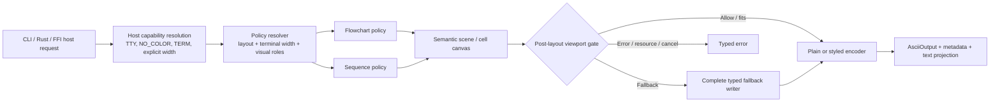
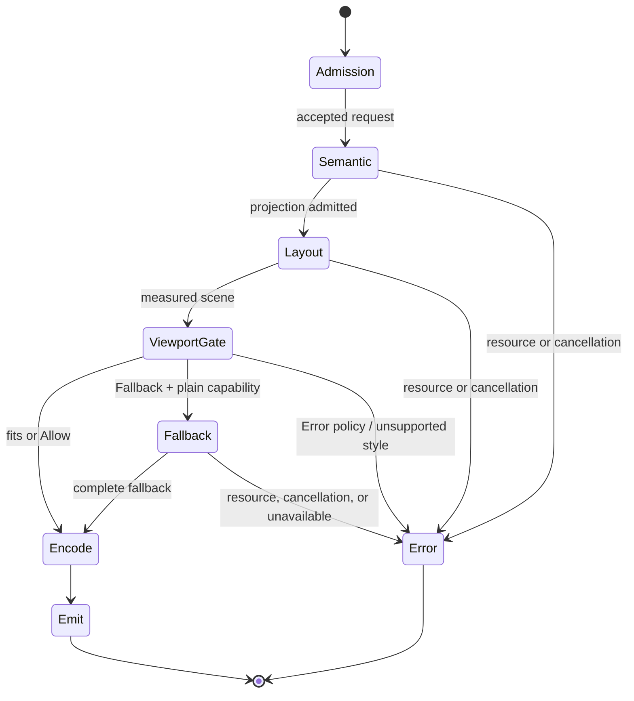
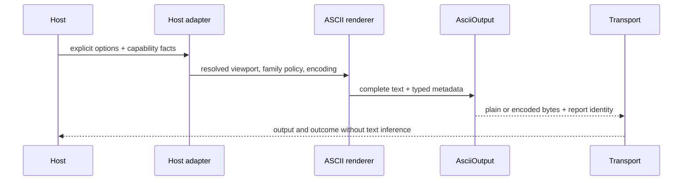

# ASCII Terminal Layout, Visual Hierarchy, and Theme Architecture - Plan

## Goal Capsule

- **Objective:** Make Merman's terminal output easier to read in interactive terminals while remaining a deterministic, complete, typed artifact for agent and pipeline consumers.
- **Means:** Separate host capability resolution, family-owned cell layout policy, semantic visual roles, and output encoding; then admit measured Flowchart and Sequence profiles before changing any default.
- **Authority:** Pinned Mermaid semantics and typed `merman-core` models outrank screenshots. Issue #53 and the merged PR #88 fixture define the pre-layout label-wrapping floor. PR #100, `docs/adr/0065-ascii-output-boundary.md`, and `docs/rendering/ASCII_SUPPORT_MATRIX.md` define the viewport, fallback, resource, and host boundaries. Grok Mermaid is prior art for bounded canvases and terminal layering, not a semantic or truncation oracle.
- **Stop conditions:** Do not copy Grok's parser, raw-source fallback, ellipsis, or fixed-line truncation; do not quantize SVG coordinates; do not probe terminal appearance inside `merman-ascii`; do not change canonical output because one screenshot looks denser; do not ship a styled fallback that silently drops fields.
- **Execution profile:** Deep alpha refactor. Internal seams may break freely. Public CLI, JSON, FFI, UniFFI, Web, and generated contracts change only when the new result is actually admitted, and then migrate atomically.
- **Tail ownership:** Each unit owns its characterization tests and support documentation. The final unit deletes superseded policy paths only after the Flowchart/Sequence matrix, report contract, and generated-contract checks agree.

---

## Product Contract

### Summary

This plan establishes the next ASCII architecture slice after the Issue #53 and viewport/output work. It keeps the current canonical geometry and plain output stable, adds a family-local layout-policy seam, gives the renderer a deeper semantic role vocabulary, and introduces one terminal-native ANSI16 presentation that is safe on unknown terminal backgrounds. Flowchart and Sequence are the first evidence families; other families remain behind the admission gate.

### Problem Frame

`AsciiRenderOptions` currently carries terminal width convention, charset, global layout density, family geometry, color mode, color palette, and diagnostic switches in one public record. That shape is useful during alpha development but makes a terminal-native style or a family-specific compact experiment easy to apply to the wrong family. The renderer already has semantic color roles and cell measurement, but roles do not yet express surfaces, titles, sections, or state emphasis, and current ANSI16 encoding maps RGB themes to nearest colors without a terminal-default polarity strategy.

The agent boundary is mostly sound, but two gaps are load-bearing. The CLI report path can combine `--ascii-report` with host-resolved `auto` color, while the report metadata does not identify its encoded text. The semantic fallback also still materializes an intermediate `serde_json::Value` after bounded serialization, so an adversarial typed model can create an avoidable allocation peak before the final writer admission. The visual refactor must close or explicitly gate these gaps before claiming a stronger agent-safe contract.

### Key Decisions

- **Canonical geometry and plain output remain the compatibility floor.** (session-settled: user-approved — chosen over making compact geometry or terminal styling the new default: existing agent and snapshot consumers need deterministic behavior.) Governs R1, R2, R4, R6, R8.
- **The first visual slice is Flowchart plus Sequence.** The other families remain eligible for later family-local admission instead of inheriting a global density heuristic. Governs R3, R5, R7, R9.
- **Breaking public migration is conditional, not automatic.** (session-settled: user-approved — chosen over broad upfront CLI/FFI churn: only a proven public profile or machine-contract field should force synchronized transport changes.) Governs R10, R11.

### Requirements

- **R1.** The default library and agent/pipe paths emit deterministic plain text with no escape sequences, host-environment reads, raw-source disclosure, clipping, ellipsis, or partial output.
- **R2.** `AsciiOutput` remains the single canonical result. Its typed outcome, projection, extent, viewport, fallback, lossiness, and resource/cancellation precedence remain available without parsing rendered text.
- **R3.** Layout density, wrapping budgets, route clearance, participant spacing, and family geometry are resolved by family-owned policies. A compact candidate for Flowchart must not silently alter Sequence, Class, ER, XYChart, or structured-text output.
- **R4.** Flowchart labels continue to be measured and wrapped in terminal display cells before node sizing and route planning. Hard breaks, graphemes, endpoints, markers, edge labels, group titles, and authored values remain retained under every admitted profile.
- **R5.** Visual roles express semantic intent rather than direct color guesses. Plain mode must carry topology, direction, group membership, edge kind, and state through glyphs, placement, spacing, or explicit text; color cannot be the only carrier.
- **R6.** The initial terminal-native style uses terminal-reset foreground/background ownership and sparse named ANSI16 accents. It never queries the OS appearance, OSC background state, or a pager from the renderer.
- **R7.** Plain and styled encodings use the same width profile, wrapping decision, cell extent, and route geometry. ANSI/HTML byte expansion does not change logical layout or viewport classification.
- **R8.** Width overflow, fallback selection, semantic fallback, resource exhaustion, and cancellation remain separate typed states. A successful fallback is complete, fits the requested width, and is admitted through the render-wide ledger; no candidate is partially emitted.
- **R9.** The initial corpus proves the visual hierarchy in unrestricted and bounded Flowchart/Sequence cases across canonical/compact candidates, ASCII/Unicode charset, Unicode/CJK width profiles, long labels, hard breaks, CJK, combining marks, emoji/ZWJ, fan-in/out, cycles, subgraphs, controls, notes, activations, and dense messages.
- **R10.** Any newly admitted public layout/theme/encoding value is discoverable through capability metadata before rendering. Unsupported combinations fail closed with stable typed diagnostics rather than trial-and-error fallback.
- **R11.** When a public result contract changes, Rust, CLI, bindings-core, operation metadata, UniFFI, Web types/catalogs, and generated projections migrate from one source authority in one coordinated change. Unrelated user-owned untracked `platforms/flutter/**` content remains untouched and unstaged.
- **R12.** CLI `auto` color resolution remains host-owned. Machine report output is an explicit plain channel; if structured result metadata carries styled text, it identifies the encoded representation so callers never have to infer it from bytes.
- **R13.** Support matrices, option documentation, ADR notes, and family gap registries describe the live policy/theme boundary once. Superseded global density helpers and duplicate report mappings are removed after caller and test coverage is proven.

### Actors

- **A1. Human terminal caller:** values topology, hierarchy, readable spacing, and optional ANSI accents; may accept a wide result or an explicit compact candidate.
- **A2. Agent or automation host:** needs complete authored fields, deterministic plain output, typed width/fallback/error state, and report metadata that is safe to branch on without text scanning.
- **A3. Library and binding consumer:** needs environment-independent options, stable display-cell measurements, explicit encoding identity, and synchronized generated contracts.
- **A4. Maintainer:** needs family-local ownership, measurable admission evidence, and a deletable architecture rather than another options record with more flags.

### Key Flows

- **F1. Plain agent render:** the host supplies explicit width, charset, width profile, and overflow policy; the renderer returns a complete plain `AsciiOutput` or a typed result/error, with no terminal probing.
- **F2. Interactive styled render:** the CLI resolves `auto` from TTY and environment facts, passes an explicit color mode, and receives the same logical geometry as plain output with an ANSI16-safe theme when selected.
- **F3. Compact candidate render:** the caller selects `compact`; the relevant family policy reduces outer padding or local gaps only when the corpus preserves semantic fields and route/label clearance. Canonical output remains unchanged.
- **F4. Bounded overflow:** normal layout completes first; `Allow` reports a wide complete result, `Fallback` attempts one complete typed projection, and `Error` returns a width diagnostic. Resource or cancellation failures retain precedence.
- **F5. Public capability admission:** a host reads capability metadata, selects a supported family/profile/encoding combination, and receives the same report vocabulary through CLI, bindings-core, and UniFFI. Web text-only parity remains a deliberate later decision unless this slice proves it necessary.

### Acceptance Examples

- **AE1. Issue #53 retention:** the long-label Flowchart fixture preserves every node label, edge label, endpoint, marker, hard break, and grapheme under canonical and compact candidates; wrapping occurs before graph sizing.
- **AE2. Width matrix:** at 60, 80, 100, and 120 cells, `Allow`, `Fallback`, and `Error` produce typed, mutually distinguishable outcomes without silent loss or partial stdout.
- **AE3. Styled/plain parity:** identical Flowchart and Sequence inputs under Plain, ANSI16, ANSI256, TrueColor, and HTML retain the same logical extent and wrapping decisions; only encoded bytes/styles differ.
- **AE4. Report safety:** `--ascii-report` produces one parseable JSON artifact whose `text` is plain and whose metadata matches the canonical output plan. An explicit request for incompatible styled report output is rejected rather than silently leaking ANSI.
- **AE5. Terminal-default palette:** ANSI16 uses reset ownership and sparse named accents on both dark and light terminals without background probing; removing styles yields the same plain topology and semantic hierarchy.
- **AE6. Semantic fallback safety:** an over-wide Flowchart with edge markers and a structured family fallback preserves authored fields; exact and N-minus-one resource/cancellation limits return typed errors before partial materialization.
- **AE7. Capability discovery:** a host can determine whether Flowchart/Sequence support canonical/compact, the selected width profile, the requested encoding, and a complete fallback before invoking the render.
- **AE8. Transport parity:** the same source and explicit plain request produce equivalent report metadata in CLI JSON, bindings-core operation metadata, and UniFFI output plans; generated contract checks reject drift.

### Success Criteria

- **S1.** An agent can decide whether to emit, accept a wide result, retry with another viewport policy, use a typed fallback, or surface an error without measuring or parsing the text.
- **S2.** The canonical profile and Issue #53 output remain unchanged unless a test explicitly selects a new admitted profile.
- **S3.** Flowchart and Sequence visual hierarchy is demonstrably improved or compacted by corpus metrics, not by a single screenshot; no accepted candidate drops authored semantic fields.
- **S4.** Plain/styled logical extents, wrapping, and route ownership agree across the supported width profiles and encodings.
- **S5.** Report, capability, CLI, bindings, and generated metadata describe one encoding and fallback contract, with no environment-dependent behavior in the library or FFI.
- **S6.** The final diff removes superseded policy duplication and leaves later family work, pager behavior, and agent/provider policy outside the active implementation units.

### Scope Boundaries

#### In scope

- Internal separation of host request, family layout policy, semantic roles, cell scene, encoder, and report assembly.
- Resource-safe semantic fallback projection and machine-safe report behavior needed before the visual slice is admitted.
- Flowchart and Sequence family-local canonical/compact candidates, role mapping, ANSI16 terminal-native encoding, and width/retention evidence.
- Capability and transport updates required by an admitted encoding/result field, with atomic generated-contract migration.
- Support documentation, migration notes, deletion of superseded helpers, and a durable evidence matrix.

#### Deferred to Follow-Up Work

- Class, ER, State, XYChart, and structured-text family-specific density admission beyond shared role/encoder compatibility.
- WASM `renderAsciiResult` convenience parity if no current agent consumer requires structured result bytes in this slice.
- Styled semantic fallback or an explicit host policy that downgrades a styled overflow request to Plain; current fallback remains Plain-only until a separate contract proves otherwise.
- Responsive width-driven re-layout, route search across multiple candidates, edge-label auto-wrapping, pager/image affordances, and terminal scrolling policy.
- Automatic TTY column/row discovery and pager selection; the host adapter may carry optional facts later, but this slice keeps viewport selection explicit and does not change defaults implicitly.
- Mermaid `classDef`/style parity beyond retaining existing semantic role mapping; browser theme pixels and font metrics remain out of scope.

#### Outside This Product's Identity

- Copying Grok or Mermaid parsers/backends into `merman-ascii`.
- Token budgets, model/provider fields, MCP envelopes, agent personas, or renderer-owned source disclosure.
- Automatic OS appearance/OSC probing inside the library, color-only semantics, raw-source fallback, truncation, ellipsis, or partial output.

### Sources / Research

- `docs/research/2026-08-26-ascii-terminal-layout-visual-hierarchy-themes.md` — consolidated Merman, Grok Build, Simon Willison tool, Mermaid, UAX #11, NO_COLOR, and WCAG evidence.
- `crates/merman-ascii/src/options.rs` — current mixed policy record and opt-in Compact defaults.
- `crates/merman-ascii/src/color.rs`, `src/terminal.rs`, and `src/canvas.rs` — current role vocabulary, cell styles, ANSI/HTML encoders, and direct style paths.
- `crates/merman-ascii/src/graph/adapter.rs` and `src/sequence/layout.rs` — pre-layout Flowchart wrapping and Sequence geometry ownership.
- `crates/merman-ascii/src/output.rs` and `src/operation.rs` — typed viewport/report/fallback state and remaining intermediate semantic projection materialization.
- `crates/merman-cli/src/invocation.rs` and `src/render/execute.rs` — host-owned `auto` resolution and report serialization.
- `crates/merman-bindings-core/src/ascii.rs`, `src/operation.rs`, and `src/operation_contract.rs` — JSON request aliases and canonical output-plan transport.
- `repo-ref/grok-build/crates/codegen/xai-grok-markdown/src/mermaid.rs` and pager theme sources — bounded canvas, width gate, and Reset-based terminal palette prior art.
- `repo-ref/mermaid/packages/mermaid/src/diagrams/flowchart/flowRenderer-v3-unified.ts`, `repo-ref/mermaid/packages/mermaid/src/utils.ts`, and `repo-ref/mermaid/packages/mermaid/src/config.ts` — semantic spacing/wrapping/theme precedence to translate into cells, not copy as pixels.

---

## Planning Contract

### Key Technical Decisions

- **KTD1. Keep `AsciiRenderOptions` as a compatibility façade while introducing narrower internal policies.** Layout, terminal capability, visual role/theme, and output/report requests are derived once at the renderer boundary; family code consumes only the policy it owns. This extends the existing option shape temporarily instead of forcing a broad public rewrite.
- **KTD2. Use a four-layer pipeline:** host request/capability → family layout policy → semantic scene/cell canvas → encoder/report. Host environment facts never cross into the semantic or layout layers.
- **KTD3. Preserve pre-layout wrapping and post-layout viewport gating.** Flowchart display-cell wrapping remains before node sizing/routing; viewport classification occurs after normal family layout, matching the useful part of Grok without inheriting its lossy truncation.
- **KTD4. Make report output machine-safe and self-describing.** CLI `--ascii-report` uses Plain and rejects an incompatible styled request; structured `AsciiOutputMetadata`/binding output plans carry an explicit encoded-representation identity whenever styled text can be returned. (session-settled: user-approved — chosen over allowing an ambiguous ANSI/HTML report by default: agents should never infer encoding from text bytes.)
- **KTD5. Make ANSI16 terminal-native rather than nearest-RGB-only.** Reset remains the host-owned polarity baseline; sparse named ANSI accents express hierarchy, and no default background is assumed. ANSI256/TrueColor/HTML retain their existing explicit palette paths.
- **KTD6. Expand roles semantically, not per color idea.** Retain existing edge, border, sequence, and chart roles; add only the role groups needed for canvas/surface, title/section, diagnostics, and status emphasis. Plain mode maps roles to structural glyphs, placement, or text markers.
- **KTD7. Bound semantic fallback before final flattening and share the render-wide ledger.** Replace the remaining intermediate full `Value`/duplicate candidate path with a streaming or controlled projection adapter that preserves deterministic field ordering and Flowchart edge fields. A resource or cancellation failure remains an error, never a fallback success.
- **KTD8. Admit public identifiers atomically.** Existing `canonical`/`compact` and color modes may be reused without inventing an AgentPreset. If capability metadata, encoding identity, or a new theme/profile identifier changes a public contract, migrate all source-owned transport projections together; otherwise keep the experiment internal and opt-in.
- **KTD9. Use family-first evidence.** Flowchart is the first layout policy because Issue #53 supplies a strong retention corpus; Sequence follows because its participant/message/control geometry has distinct spacing and lifecycle constraints. Class/ER/XYChart do not inherit the result by analogy.

### High-Level Technical Design

The policy resolver must preserve one width profile and one semantic role identity through wrapping, placement, extent measurement, trim, encoding, and report assembly. The fallback writer is a sibling of the encoder, not a post-render string slicer. Capability metadata is produced from the same source descriptors that validate the request, so a host can discover supported combinations before rendering.

The following sketches show the two other load-bearing shapes that prose alone would hide: lifecycle/error precedence and cross-surface request/metadata flow. They are directional, not implementation specifications.

#### Lifecycle and outcome sketch

#### Transport parity sketch

### Planning Assumptions

- The current `AsciiOutput` schema and viewport state machine remain the regression floor; changes are additive or explicitly alpha-breaking only when the report/encoding contract cannot remain truthful.
- The terminal-native theme is implemented through the existing ANSI16 choice rather than a provider-specific agent preset.
- CLI/Bindings Core/UniFFI are the first machine-contract surfaces. Web text rendering remains compatible, while a structured WASM result API is deferred unless implementation evidence makes it necessary.
- The repository's existing nextest, generated-contract, and platform verification gates remain authoritative; no parallel cargo build tree is needed.

### Phased Delivery

1. **Safety floor:** characterize current report/viewport/Issue #53 behavior and close the semantic fallback materialization gap.
2. **Internal seam:** derive narrow host/layout/visual policies without changing canonical output.
3. **Visual slice:** add semantic roles and ANSI16, then admit Flowchart and Sequence policy candidates independently.
4. **Contract admission:** add encoding/capability metadata and synchronized transport changes only for values proven by the corpus.
5. **Matrix closeout:** measure retention, extents, clearances, and resource/cancellation boundaries; delete abandoned policy paths and document residuals.

### Alternatives Considered

| Option | Benefit | Problem | Decision |
| --- | --- | --- | --- |
| Continue expanding `AsciiRenderOptions` | Small immediate diff | Keeps host, family, and visual policy coupled; every new family inherits global assumptions | Reject as final shape; retain only as migration façade |
| Copy Grok's renderer and pager theme | Fast terminal screenshot improvement | Second parser, truncation, raw-source fallback, and product-specific pager policy violate Merman's boundary | Reject |
| Quantize Mermaid SVG geometry | Reuses browser layout | Font/browser dependence and poor cell routing violate ADR 0065 | Reject |
| Make Compact/ANSI16 default now | Immediate narrow-screen change | Breaks canonical snapshots and agent determinism before evidence | Reject |
| Add only internal policies and postpone report truthfulness | Smallest public diff | Leaves styled structured results ambiguous and preserves the fallback allocation risk | Reject |
| Split policy/roles/encoder and admit through a corpus | Preserves semantics while enabling measured evolution | Requires staged internal and cross-surface migration | Recommend |

### System-Wide Impact

- **Agent parity:** CLI, bindings-core, UniFFI, and capability consumers must make the same width/overflow/fallback decisions from metadata. No host receives a second agent-only artifact or hidden renderer state.
- **Public contracts:** A metadata encoding field or capability dimension affects `merman-ascii`, `merman`, bindings-core, operation contracts, UniFFI records, Web types/catalogs, and generated fixtures. The migration is atomic and fail-closed.
- **Resource and cancellation:** Semantic projection, layout, canvas compaction, fallback, and encoding remain under one operation control and render-wide ledger. The visual work cannot turn a resource failure into a presentation fallback.
- **Performance:** Policy resolution should be O(1) per request after family selection. The plan also removes avoidable full-value/fallback copies and preserves the existing terminal-cell accounting; no visual metric is accepted at the cost of unbounded intermediate allocation.
- **User-owned files:** Existing untracked `platforms/flutter/**` directories and unrelated fixtures are outside the diff and must not be restored, deleted, or staged.

### Risks & Dependencies

- **Theme polarity risk:** RGB-to-ANSI nearest-color mapping can be unreadable on an unknown background. Mitigation: Reset-based terminal-native mapping, sparse accents, and plain glyph semantics.
- **Compact regression risk:** Lower padding can increase crossings, label collisions, or group ambiguity. Mitigation: family-local candidate admission and clearance/retention metrics.
- **Fallback risk:** Streaming semantic projection may change field order or marker visibility. Mitigation: deterministic ordering tests and Issue #53/edge-marker fixtures before deleting the old path.
- **Contract drift risk:** Adding a report encoding or capability field can desynchronize generated consumers. Mitigation: one source authority, operation-contract snapshots, and generated/platform checks in the same unit.
- **Scope risk:** Class/ER/XYChart may appear to benefit from shared density changes but have different geometry. Mitigation: keep them deferred and require their own family evidence.

---

## Implementation Units

### U1. Establish the machine-safe output and fallback floor

**Goal:** Freeze the current canonical/report/viewport behavior and remove the remaining unbounded intermediate semantic projection risk before visual changes land.

**Requirements:** R1, R2, R4, R8, R12; S1, S2.

**Dependencies:** None.

**Execution note:** Add characterization assertions for the current output/report state before changing projection ownership; keep the first proof focused on complete-or-error fallback behavior.

**Files:**

- `crates/merman-ascii/src/output.rs`
- `crates/merman-ascii/src/operation.rs`
- `crates/merman-ascii/src/lib.rs`
- `crates/merman-ascii/tests/output_report.rs`
- `crates/merman-ascii/tests/viewport_characterization.rs`
- `crates/merman-ascii/tests/operation_cancellation.rs`
- `crates/merman-ascii/tests/flowchart_model/direction_and_labels.rs`

**Approach:**

1. Preserve the existing `AsciiOutput` outcome/projection/fallback state machine and Issue #53 retention fixtures as characterization evidence.
2. Replace the remaining full intermediate `serde_json::Value`/duplicate fallback materialization with a controlled streaming projection or an equivalent bounded adapter; preserve deterministic key/path ordering and Flowchart edge marker fields.
3. Route semantic projection, flattening, reflow, and final admission through the render-wide resource ledger and explicit Semantic/Emit checkpoints.
4. Keep non-Plain fallback unavailable until a complete styled fallback contract exists; never silently downgrade or partially emit.

The Flowchart typed projection is the first required streaming path because its marker and endpoint inventory is load-bearing for Issue #53. Any compatibility projection retained temporarily for another family must have a conservative preflight bound and remain an explicit residual; U1 is not complete while an admitted path can still materialize an unbounded intermediate value.

**Patterns to follow:** `BoundedJsonWriter`, `SemanticFallbackWriter`, `MeasuredOutput`, `AsciiExecution::with_render_ledger`, and the existing exact/N-minus-one resource tests.

**Test scenarios:**

- A wide Flowchart fallback retains node labels, edge endpoints, start/end markers, stroke kind, visibility, and edge labels in deterministic order.
- A semantic projection that crosses output-byte, nesting, or layout-work limits fails during projection with the correct Semantic phase rather than after an unbounded `Value` allocation.
- Cancellation before and during projection returns a typed cancellation error and emits no partial candidate.
- Cancellation before the first fallback row is observed as a Semantic-phase cancellation, with no intermediate candidate materialized.
- Exact and N-minus-one resource boundaries remain resource outcomes and never become viewport fallback success.
- A normal primary render, a structured fallback, and an unavailable fallback continue to report the same schema, projection, outcome, and lossiness vocabulary.

**Verification:** The fallback path is complete-or-error, uses one render-wide ledger, and has no remaining caller that relies on parsing output prefixes or materializing an unbounded intermediate value.

### U2. Introduce the internal host, layout, visual, and output policy seam

**Goal:** Stop adding mixed policy fields to `AsciiRenderOptions`; derive narrow internal policies while preserving the public alpha façade and canonical defaults.

**Requirements:** R2, R3, R4, R7, R12; S2, S4, S5.

**Dependencies:** U1.

**Execution note:** Characterize canonical and Compact defaults first, then move one policy owner at a time so unchanged snapshots prove the façade remains behaviorally stable.

**Files:**

- `crates/merman-ascii/src/options.rs`
- `crates/merman-ascii/src/lib.rs`
- `crates/merman-ascii/src/operation.rs`
- `crates/merman-ascii/src/capability.rs`
- `crates/merman-ascii/src/graph/adapter.rs`
- `crates/merman-ascii/src/graph/layout.rs`
- `crates/merman-ascii/src/sequence/layout.rs`
- `crates/merman-ascii/src/xychart/plot.rs`
- `crates/merman-cli/src/app.rs`
- `crates/merman-cli/src/invocation.rs`
- `crates/merman-ascii/tests/viewport_characterization.rs`
- `crates/merman-ascii/tests/flowchart_model/appearance.rs`
- `crates/merman-ascii/tests/sequence_model/appearance.rs`

**Approach:**

1. Keep `AsciiRenderOptions` as the compatibility input and resolve it once into host capability, family layout, visual role, and output policy views. The CLI adapter derives host facts from `InvocationFacts`; core, FFI, and Web receive only explicit resolved values.
2. Move Compact defaults and explicit overrides behind family policy resolution; do not let a graph field or profile branch leak into Sequence or XYChart.
3. Make the resolved width profile and structural charset available to every measurement and placement owner.
4. Derive capability decisions from the same policy validators used by rendering, with no second enum parser.

**Patterns to follow:** `effective_layout`, `TerminalWidthProfile`, `AsciiViewportPolicy`, typed capability records, and operation-owned resource contexts.

**Test scenarios:**

- Canonical options reproduce the current default graph padding, Flowchart wrap width, Sequence spacing, and chart dimensions.
- Compact options change only the family-owned candidate values whose overrides were not explicitly set.
- ASCII/Unicode charset and Unicode/CJK width profile resolve one structural glyph policy without changing authored text measurement semantics.
- A caller that requests an unsupported policy combination receives a typed invalid-option/capability result before family rendering.

**Verification:** Family renderers no longer read unrelated global density fields directly, and a code search finds one policy-resolution owner for each public option.

### U3. Expand semantic roles and add the terminal-native ANSI16 profile

**Goal:** Make visual hierarchy explicit and safe on unknown terminal backgrounds without changing logical geometry or plain semantics.

**Requirements:** R5, R6, R7, R12; S3, S4.

**Dependencies:** U2.

**Execution note:** Add plain/styled extent and encoder-safety assertions before introducing new roles; verify the role mapping independently of any palette choice.

**Files:**

- `crates/merman-ascii/src/color.rs`
- `crates/merman-ascii/src/terminal.rs`
- `crates/merman-ascii/src/canvas.rs`
- `crates/merman-ascii/src/text.rs`
- `crates/merman-ascii/src/graph/draw.rs`
- `crates/merman-ascii/src/graph/routing/label.rs`
- `crates/merman-ascii/src/sequence/boxes.rs`
- `crates/merman-ascii/src/sequence/control/paint.rs`
- `crates/merman-ascii/tests/terminal_text_safety.rs`
- `crates/merman-ascii/tests/flowchart_model/appearance.rs`
- `crates/merman-ascii/tests/sequence_model/appearance.rs`

**Approach:**

1. Retain existing border, edge, sequence, and chart roles; add only semantic surface, title/section, diagnostic, and status emphasis roles that have a plain-mode representation.
2. Map roles to glyph/placement/indentation first, then to optional palette styles. No renderer path may require color to distinguish topology or state.
3. Add a terminal-native ANSI16 theme/profile using Reset ownership, sparse named accents, and no assumed background. Keep explicit RGB/HTML theme behavior separate.
4. Preserve deferred grapheme text, ANSI reset discipline, HTML escaping, and background-cell ownership through the same encoder.

**Patterns to follow:** `AsciiColorRole`, `CanvasStyle`, `ResolvedCanvasStyle`, sequence background ownership, `AsciiTerminalPalette`, and `NO_COLOR`/TTY resolution in `merman-cli`.

**Test scenarios:**

- Plain Flowchart and Sequence output remains byte-stable when role colors are enabled or disabled.
- ANSI16 output uses reset-safe spans and sparse named accents, with no background query or environment-dependent palette choice.
- Plain, ANSI16, ANSI256, TrueColor, and HTML outputs have identical logical extents and wrapping for the same scene.
- Titles, group labels, edge labels, lifelines, activations, diagnostics, and status roles remain readable when all color is removed.
- Escape characters, combining marks, CJK text, emoji/ZWJ graphemes, and HTML metacharacters remain safe through every encoder.

**Verification:** The terminal-native profile improves hierarchy without changing the semantic scene, cell extent, or default Plain output.

### U4. Admit a Flowchart-owned layout and hierarchy policy

**Goal:** Turn the Issue #53 and Grok comparison into a measured Flowchart policy candidate rather than a global Compact heuristic.

**Requirements:** R3, R4, R5, R7, R9; S2, S3, S4.

**Dependencies:** U2, U3.

**Execution note:** Use the Issue #53 fixture and existing route assertions as characterization gates before admitting any compact candidate; reject candidates from evidence rather than tuning them to one screenshot.

**Files:**

- `crates/merman-ascii/src/graph/adapter.rs`
- `crates/merman-ascii/src/graph/layout.rs`
- `crates/merman-ascii/src/graph/layout/grid.rs`
- `crates/merman-ascii/src/graph/layout/groups.rs`
- `crates/merman-ascii/src/graph/draw.rs`
- `crates/merman-ascii/src/graph/routing/label.rs`
- `crates/merman-ascii/src/graph/routing/occupancy.rs`
- `crates/merman-ascii/src/graph/routing/plan.rs`
- `crates/merman-ascii/tests/flowchart_model/direction_and_labels.rs`
- `crates/merman-ascii/tests/flowchart_model/appearance.rs`
- `crates/merman-ascii/tests/flowchart_model/boundary_routes.rs`
- `crates/merman-ascii/tests/viewport_characterization.rs`
- `crates/merman-ascii/tests/testdata/local-semantic/flowchart/issue_53_long_node_labels.mmd`

**Approach:**

1. Resolve node padding, wrap budgets, rank/column gaps, group title clearance, and edge-label lanes through the Flowchart policy only.
2. Keep display-cell wrapping before node dimensions and preserve Dagre-compatible rank direction and scene-level route occupancy.
3. Reduce outer whitespace before label clearance or topology gaps when evaluating a compact candidate.
4. Record width, height, label-to-route clearance, group/title separation, crossings, blank-run ratio, and authored-field retention for canonical versus candidate output.

**Patterns to follow:** `FlowchartProjectionPlan`, `AsciiGraph::wrap_node_labels_at`, `GraphLayout`, global route occupancy, and the Issue #53 semantic assertions.

**Test scenarios:**

- The long-label fixture wraps before graph sizing and retains all words, hard breaks, markers, and edge labels at every candidate width.
- Fan-in/out, cycles, back edges, nested subgraphs, disconnected components, and boundary labels preserve direction and route ownership after local gap changes.
- CJK width profile and ASCII structural charset keep border/route cells aligned while authored CJK text uses the selected display-width convention.
- A compact candidate that reduces width but violates label clearance, group separation, or authored-field retention is rejected from admission.
- ANSI16/Plain renderings of the same Flowchart use identical geometry and report extents.

**Verification:** Flowchart canonical snapshots remain unchanged; compact is admitted only with corpus evidence and remains an explicit profile.

### U5. Admit a Sequence-owned layout and hierarchy policy

**Goal:** Improve participant/message/control readability without applying graph assumptions to lifelines or lifecycle geometry.

**Requirements:** R3, R5, R7, R9; S3, S4.

**Dependencies:** U2, U3.

**Execution note:** Characterize lifecycle/control fixtures before changing spacing, then prove each candidate against endpoint, activation, frame, and numbering retention.

**Files:**

- `crates/merman-ascii/src/sequence/layout.rs`
- `crates/merman-ascii/src/sequence/render.rs`
- `crates/merman-ascii/src/sequence/row_document.rs`
- `crates/merman-ascii/src/sequence/boxes.rs`
- `crates/merman-ascii/src/sequence/control/geometry.rs`
- `crates/merman-ascii/src/sequence/control/paint.rs`
- `crates/merman-ascii/src/sequence/lifeline.rs`
- `crates/merman-ascii/tests/sequence_model/appearance.rs`
- `crates/merman-ascii/tests/sequence_model/layout_and_lifecycle.rs`
- `crates/merman-ascii/tests/sequence_model/control_composition.rs`
- `crates/merman-ascii/tests/sequence_model/signals.rs`

**Approach:**

1. Resolve participant spacing, message spacing, self-message width, title/section gutters, and mirrored-actor presentation through Sequence policy.
2. Preserve participant display-cell widths, message endpoints, arrow kinds, notes, boxes, nested controls, lifecycles, activations, and numbering.
3. Keep local message/label clearance ahead of global whitespace reduction; do not use Flowchart rank or route logic.
4. Apply the same role and encoding policy as Flowchart while retaining Sequence-specific glyph and lifecycle semantics.

**Patterns to follow:** `SequenceLayout`, `SequenceRowDocument`, control geometry/paint separation, lifecycle planning, and existing appearance fixtures.

**Test scenarios:**

- Long participant names, multiple messages, self messages, bidirectional/half/filled/point arrows, and notes retain endpoints and labels under canonical and compact candidates.
- Nested control frames, activations, actor creation/destruction, autonumbering, and mirrored actors preserve lifecycle order and visual hierarchy.
- CJK, combining marks, emoji/ZWJ, and hard breaks use the selected width profile without splitting graphemes or shifting lifelines.
- Plain and ANSI16 Sequence output has equal logical extents and no style-dependent row or spacing changes.
- A candidate that compresses participants until message labels or control boundaries collide is rejected.

**Verification:** Sequence policy is independently measurable, and no global graph-density field remains the source of participant/message geometry.

### U6. Migrate machine-facing report and capability contracts atomically

**Goal:** Make encoding identity and admitted profile support discoverable across the host and binding surfaces without introducing an agent-specific renderer contract.

**Requirements:** R2, R8, R10, R11, R12; S1, S4, S5.

**Dependencies:** U1, U2, U3, U4, U5.

**Execution note:** Start with cross-surface contract tests for the existing plain and styled result paths; only regenerate projections after the canonical metadata shape and failure behavior are fixed.

**Files:**

- `crates/merman-ascii/src/output.rs`
- `crates/merman-ascii/src/capability.rs`
- `crates/merman-cli/src/cli.rs`
- `crates/merman-cli/src/invocation.rs`
- `crates/merman-cli/src/render/execute.rs`
- `crates/merman-cli/tests/ascii_smoke.rs`
- `crates/merman-cli/src/generated/capability_surface.rs`
- `crates/merman-bindings-core/src/ascii.rs`
- `crates/merman-bindings-core/src/common.rs`
- `crates/merman-bindings-core/src/operation.rs`
- `crates/merman-bindings-core/src/operation_contract.rs`
- `crates/merman-bindings-core/src/metadata.rs`
- `crates/merman-uniffi/src/lib.rs`
- `platforms/web/src/public-types.ts`
- `platforms/web/src/public-catalog.ts`
- `platforms/web/src/generated/binding-contract.ts`
- `platforms/web/src/generated/capability-surface.ts`
- `platforms/web/src/generated/resource-contract.ts`
- Relevant generated contract fixtures owned by the repository

**Approach:**

1. Add an encoded-representation identity to the canonical metadata/operation-plan because styled bytes already cross the FFI/UniFFI result path; keep field names and enum strings sourced from one Rust authority. This is the KTD4 contract, not an optional future field.
2. Make CLI report mode Plain-only and reject an incompatible explicit styled request; keep `auto` resolution in invocation normalization and reject `auto` in environment-independent binding options.
3. Extend capability records/catalogs to describe admitted Flowchart/Sequence profile and encoding combinations, fallback availability, and width-profile constraints; do not advertise deferred families as if they were admitted.
4. Regenerate synchronized DTOs/fixtures and keep the Web text-only API behavior stable unless a concrete structured-result consumer requires the later WASM slice.

**Patterns to follow:** `AsciiOutput::metadata`, `AsciiOutput::report`, `BindingAsciiOutputPlan`, `operation_contract`, generated capability surfaces, strict `deny_unknown_fields`, and existing snake_case/camelCase alias tests.

**Test scenarios:**

- CLI `--ascii-report` on a TTY, pipe, file, `NO_COLOR`, and `TERM=dumb` emits one parseable plain JSON artifact with no ANSI bytes.
- An explicit incompatible styled report request fails as an invalid host option rather than producing ambiguous JSON.
- An explicit ANSI16/ANSI256/TrueColor/HTML binding result carries an encoding identity that matches its returned bytes, while CLI report mode rejects styled JSON.
- CLI, bindings-core, and UniFFI plain results for the same source/options expose equivalent family, projection, extents, width profile, layout profile, encoding, outcome, fallback, trim, and lossiness fields.
- Capability metadata allows a caller to reject unsupported profile/encoding combinations before render; unknown values and fields remain fail-closed.
- Generated operation/catalog fixtures and platform checks detect a deliberate source-contract mismatch.
- Untracked user-owned Flutter directories are not changed or staged by the migration.

**Verification:** The machine contract is self-describing, environment-independent outside the CLI adapter, and synchronized across every admitted transport.

### U7. Run the evidence matrix, documentation, and deletion closeout

**Goal:** Prove the refactor's measurable benefit, document residuals, and remove parallel policy paths without widening family scope.

**Requirements:** R9, R13; S2-S6.

**Dependencies:** U1-U6.

**Execution note:** Run the corpus as the final characterization pass, compare metrics against canonical output, and delete helpers only after caller search and generated-contract checks show no remaining owner.

**Files:**

- `crates/merman-ascii/tests/fixture_inventory/`
- `crates/merman-ascii/tests/flowchart_model/`
- `crates/merman-ascii/tests/sequence_model/`
- `crates/merman-ascii/tests/viewport_characterization.rs`
- `crates/merman-ascii/tests/output_report.rs`
- `crates/merman-ascii/README.md`
- `crates/merman-ascii/FLOWCHART_SUPPORT.md`
- `crates/merman-ascii/SEQUENCE_SUPPORT.md`
- `crates/merman-ascii/ASCII_GAP_REGISTRY.md`
- `docs/rendering/ASCII_SUPPORT_MATRIX.md`
- `docs/bindings/OPTIONS_JSON.md`
- `docs/adr/0065-ascii-output-boundary.md`
- `docs/research/2026-08-26-ascii-terminal-layout-visual-hierarchy-themes.md`
- `crates/merman-ascii/src/`

**Approach:**

1. Run the width/retention matrix across unrestricted, 60, 80, 100, and 120 cells; canonical/compact candidates; ASCII/Unicode charset; Unicode/CJK width profiles; Plain/ANSI16 and existing explicit encodings; and the Flowchart/Sequence corpus.
2. Record authored-field retention, logical extents, route crossings/overlap, label clearance, whitespace/blank-run metrics, style/plain equality, and exact resource/cancellation boundaries.
3. Update support and option documentation with the host boundary, capability admission rules, current Plain-only fallback behavior, and deferred family work.
4. Search callers and delete superseded global compact branches, duplicate report mappings, dead style helpers, and abandoned experiments only after replacement coverage is present.

**Test scenarios:**

- The representative corpus shows canonical stability and a measurable compact/ANSI16 readability or width benefit without semantic loss.
- All accepted Flowchart and Sequence profile combinations have fixture-backed retention and extent assertions.
- Documentation examples match live option aliases, report fields, capability values, and fallback outcomes.
- A final caller search finds no obsolete policy helper, output-prefix classifier, or duplicate transport mapping.

**Verification:** The active contract is documented once, deferred work is explicit, the diff is simpler than the pre-refactor path, and no unresolved P0/P1 architecture or agent-safety finding remains.

---

## Verification Contract

| Gate | Applies to | Done signal |
| --- | --- | --- |
| `cargo fmt --all -- --check` | U1-U7 | Rust formatting is stable. |
| `cargo nextest run -p merman-ascii -j1` | U1-U5, U7 | ASCII family, role, viewport, fallback, resource, grapheme, and cancellation scenarios pass. |
| `cargo nextest run -p merman --features ascii -j1` | U1-U6 | Facade request/output and typed error precedence remain coherent. |
| `cargo nextest run -p merman-bindings-core --features ascii -j1` | U1, U6 | JSON aliases, report encoding metadata, capability discovery, and strict validation pass. |
| `cargo nextest run -p merman-cli --no-default-features --features ascii -j1` | U6 | CLI TTY/pipe/file, auto-color, report, viewport, and profile behavior passes. |
| `cargo clippy -p merman-ascii -p merman -p merman-bindings-core -p merman-cli --all-targets -j1 -- -D warnings` | U1-U7 | Touched Rust packages remain warning-clean. |
| `cargo run --locked -p xtask -- verify-generated` | U6-U7 | Generated contract authorities and projections agree. |
| `python3 scripts/verify-platform-bindings.py` | U6-U7 | Tracked platform DTOs and generated bindings are synchronized; unrelated Flutter work remains untouched. |
| Width/retention/evidence matrix | U1-U7 | Flowchart and Sequence candidates preserve authored fields, logical extents, clearance, and typed overflow outcomes across the admitted matrix. |
| Independent code review | U7 | No unresolved P0/P1 contract, resource, semantic-retention, or cross-surface parity finding remains. |

Resource and cancellation gates must preserve exact/N-minus-one behavior. Viewport overflow is presentation state, never resource success or failure. Styled output must not alter logical cell accounting.

---

## Definition of Done

- The four-layer boundary is visible in code ownership, and family renderers consume family-local policy rather than a growing mixed options record.
- Issue #53 pre-layout wrapping, hard breaks, grapheme safety, endpoints, markers, edge labels, and topology remain intact under every admitted Flowchart/Sequence profile.
- Plain output remains deterministic and escape-free by default; CLI report mode is an explicit machine-safe channel.
- ANSI16 uses Reset/sparse accents without terminal appearance probing, and style never changes wrapping, extents, or plain semantic hierarchy.
- `AsciiOutput` remains canonical; structured metadata identifies encoding when styled result bytes can cross a transport.
- Semantic fallback projection is bounded before final flattening, shares the render-wide ledger, preserves deterministic authored fields, and never turns resource/cancellation failures into fallback success.
- Flowchart and Sequence compact candidates are separately admitted by corpus evidence; canonical defaults remain stable.
- Capability metadata can gate admitted profile/encoding combinations before render, and all affected transport/generated contracts agree.
- Documentation, support matrices, ADR notes, and gap registries contain one live contract; deferred Class/ER/XYChart, WASM result convenience, pager policy, and responsive re-layout remain explicit follow-up work.
- Superseded helpers and duplicate mappings are deleted after caller search; no abandoned experiment remains in the diff.
- All Verification Contract gates pass, independent review has no unresolved P0/P1 finding, and user-owned untracked Flutter directories remain untouched and unstaged.

### Per-unit completion criteria

- **U1:** No unbounded semantic fallback intermediate remains on the admitted path; baseline output/report/resource tests prove complete-or-error behavior.
- **U2:** Policy ownership is separated internally and canonical/override behavior is characterized.
- **U3:** Semantic roles and ANSI16 are plain-safe, reset-safe, and extent-neutral.
- **U4:** Flowchart candidate metrics and Issue #53 retention gates are fixture-backed.
- **U5:** Sequence candidate metrics and lifecycle/control retention gates are fixture-backed.
- **U6:** Report encoding/capability fields and all admitted transport projections are synchronized.
- **U7:** Evidence, docs, deletion review, and independent review close the plan with no stale contract.

---

## Appendix

### Evidence summary

- `AsciiRenderOptions` currently mixes charset, width profile, layout profile, graph/Flowchart/Sequence/XYChart geometry, color mode/theme, and diagnostics; `effective_layout` applies a global Compact candidate.
- Flowchart wraps labels in display cells before graph projection and route planning; Sequence computes participant centers and spacing in its own layout module.
- Existing roles cover text, muted text, borders, edges, labels, junctions, Sequence, and chart series, but surface/title/section/status hierarchy is not first-class.
- CLI `auto` color resolution already owns `NO_COLOR`, TTY, `TERM`, and `COLORTERM`; bindings reject environment-dependent `auto`.
- CLI report serialization currently delegates to `AsciiOutput::report`; binding/UniFFI carry a canonical output plan, while Web exposes text and capability surfaces without a structured result convenience API.
- Grok's useful prior art is bounded cell layout, explicit width gating, and separate pager/theme ownership. Its truncation, raw-source fallback, and narrow role palette are deliberately excluded.
- Mermaid's Flowchart spacing/wrapping and theme variables provide semantic mapping vocabulary, not terminal-cell constants or pixel targets.
- The current research branch also contains unrelated user-owned untracked files; the plan explicitly excludes them from implementation and staging.

### Deferred implementation questions

- The exact internal names and module split for the policy types should be chosen after U2's caller graph is inspected; the ownership boundary is fixed, names are not.
- The exact streaming serde adapter may be a thin `Serialize` sink or a typed Flowchart projection for the first slice; deterministic field order, marker retention, bounded admission, and no parser duplication are fixed requirements.
- Whether Web needs a structured ASCII result becomes a follow-up decision only if a current agent consumer or capability contract requires it; no renderer-specific workaround should be introduced before that evidence exists.
