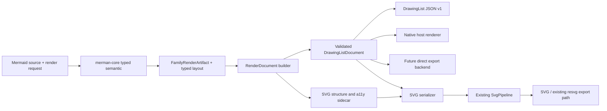
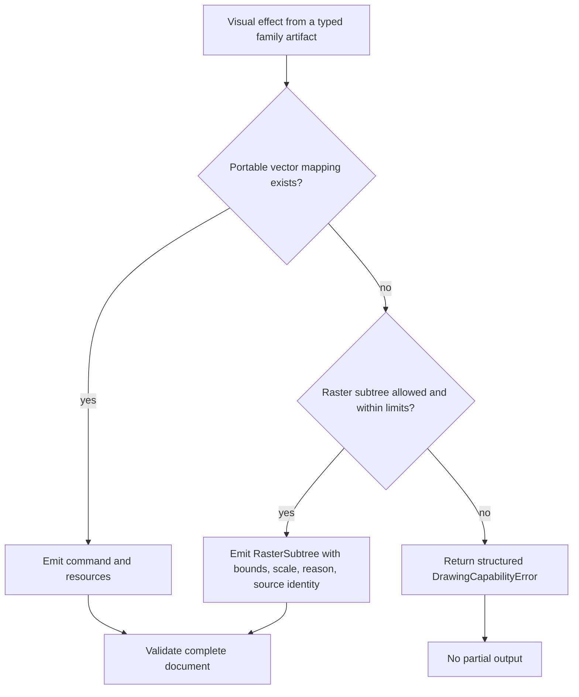
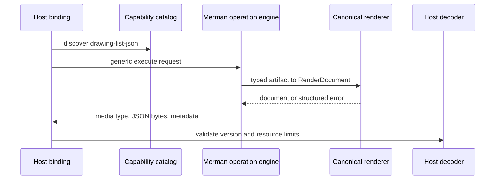

# Renderer-neutral DrawingList as Merman's cross-language render contract

## Goal Capsule

Turn issue #114 into a first-class, versioned, cross-language rendering capability: Merman must be able to return a complete, styled, renderer-neutral drawing document for a whole Mermaid diagram, rather than only SVG text or rasterized derivatives.

The resulting artifact is a retained, ordered drawing list for native canvas, Flutter, Compose, Web Canvas, Skia-like, and future host renderers. It is not an editable scene graph, not an Excalidraw replacement, and not a request for callers to position Mermaid nodes manually.

The non-negotiable quality bar is loss accountability. A visual feature may only have one of three outcomes:

1. it is represented by portable vector commands and resources;
2. it is represented by an explicit, bounded raster subtree with its reason and provenance; or
3. rendering fails with a structured, actionable error before any partial document is returned.

No renderer, adapter, serializer, or binding may silently omit, approximate without declaration, or substitute a visual feature.

---

## Product Contract

### Problem frame

The current public render product is SVG-first. That is suitable for Mermaid parity and existing export paths, but it forces native hosts to parse SVG, emulate browser-dependent SVG behavior, or maintain their own incomplete SVG-to-canvas implementation. SVG features used by Mermaid—CSS cascade, markers, `foreignObject`, masks, filters, gradients, patterns, text measurement, and embedded resources—do not map consistently to Android, iOS, desktop, Web Canvas, or Rust-native graphics APIs.

The new public contract must preserve Merman's typed semantic/layout ownership while making a renderer-neutral result available through every existing language transport. SVG remains a supported serializer and parity target; it stops being the canonical visual representation.

### Actors

| ID | Actor | Need |
| --- | --- | --- |
| A1 | Rust application author | Render Mermaid once and choose SVG, DrawingList, or existing export targets without reparsing source. |
| A2 | Native host author | Consume a stable JSON document in Compose, Flutter, Skia, Web Canvas, or another renderer without implementing Mermaid layout or SVG parsing. |
| A3 | SVG/parity maintainer | Preserve Mermaid-compatible SVG DOM, accessibility, IDs, and pipeline behavior from the same typed render result. |
| A4 | Binding consumer | Discover the capability, invoke it through C/UniFFI/WASM/Node/Android/Flutter, and decode one documented wire schema. |
| A5 | Merman maintainer | Add Mermaid features without creating divergent per-language render semantics or hash-based correctness gates. |

### Requirements

| ID | Requirement |
| --- | --- |
| R1 | Expose a versioned, whole-diagram `DrawingList` output as a public Rust and cross-language capability. |
| R2 | Build one canonical `RenderDocument` from the existing typed semantic and layout artifacts; SVG and DrawingList must be encoders/backends of that result, not independent render pipelines. |
| R3 | Make the public document self-describing: coordinate convention, viewport, deterministic command order, resolved visual state, resources, and protocol version are explicit. |
| R4 | Represent paths, fills, strokes, dash/cap/join, transforms, opacity, blend behavior, text, images, clipping, gradients, patterns, markers, masks, filters, math, icons, links, and accessibility semantics without requiring host SVG support. |
| R5 | Enforce no silent visual loss: every non-portable effect must become an explicit raster subtree or a structured error. No command/effect may be skipped, hidden, or silently approximated. |
| R6 | Make text and font obligations explicit, including measurement provenance and whether a host text run, glyph run, outline, or raster fallback is required. The protocol must not claim browser shaping parity it cannot provide. |
| R7 | Preserve SVG parity through an SVG-specific structural sidecar that carries DOM/a11y/interaction details without contaminating the cross-platform drawing protocol with browser DOM concepts. |
| R8 | Add one discoverable capability/output/operation across the feature descriptor, artifact profiles, generic binding envelope, C ABI, UniFFI, WASM, Node, Android, and Flutter surfaces. |
| R9 | Reuse the established resource, deadline, cancellation, and security boundaries. Cancellation or a limit breach returns no partial DrawingList. The decoder and resource model perform no ambient network, file, or font loading. |
| R10 | Migrate every current `RenderFamilyKind` to direct document construction. A temporary internal SVG importer may assist migration only; it cannot be public or remain the canonical path. |
| R11 | Keep `LayoutJson` and `SvgPlan` as diagnostic/planning outputs where useful, but do not let either become the DrawingList master model. |
| R12 | Do not use hashes as proof of visual completeness, dependency closure, feature support, or correctness. Structural validation, effect inventory, capability contracts, and focused fixtures are the evidence. Hashes may remain optional cache/debug fingerprints only. |

### Key flows

#### F1: canonical render and target selection

The `RenderDocument` is internal and may hold renderer-specific sidecars. `DrawingListDocument` is the public, renderer-neutral projection. A caller requesting DrawingList receives the validated public projection; a caller requesting SVG receives a serializer result built from the same canonical document plus SVG sidecar.

#### F2: accountable effect handling

#### F3: cross-language generic operation

### Acceptance examples

| ID | Scenario | Required outcome |
| --- | --- | --- |
| AE1 | A styled flowchart with markers, rounded nodes, gradients, links, and multiline labels is requested as DrawingList. | Ordered commands, root viewport, path/style resources, marker geometry, and non-executable link metadata are present; no host SVG interpretation is needed. |
| AE2 | A diagram uses `foreignObject`, a filter, a mask, RoughJS output, math, or an embedded icon. | The feature is represented as portable commands when possible; otherwise each affected subtree is an explicit raster fallback with source identity and reason, or the request fails structurally. |
| AE3 | A host asks for vector-only output. | Any effect that would require raster fallback produces a typed failure; the host never gets an incomplete list. |
| AE4 | The same source, config, render environment, and resource limits are rendered twice. | Command/resource order and canonical JSON are deterministic; structural equality is the assertion, not a content hash. |
| AE5 | C, UniFFI, WASM, Node, Android, and Flutter request the same fixture. | Each receives the same media type and schema-compatible bytes, or the advertised profile returns the established typed missing-capability response. |
| AE6 | A request is cancelled or exceeds an operation budget halfway through a complex diagram. | The operation returns cancellation/limit metadata and no partial document payload. |

### Success criteria

1. Every current `RenderFamilyKind` has a direct typed-artifact-to-document implementation and is represented in a maintained family/effect coverage matrix.
2. Every visual construct observed in the admitted fixtures is classified as vector, explicit raster fallback, or structured failure; the coverage test reports zero unclassified or silently dropped constructs.
3. One canonical document can produce both DrawingList JSON and SVG. The public DrawingList path never parses SVG after migration completion.
4. A deterministic encoder produces stable command/resource ordering for identical inputs, while keeping f64 calculations and the existing text-measurement contract intact.
5. Descriptor, profile, ABI, and generated binding projections advertise one operation/media type consistently, and focused consumers decode a shared fixture.
6. DrawingList requests obey current cancellation and resource policies, do not perform external resource acquisition, and never commit partial output.
7. The protocol crate remains lightweight: it does not depend on `usvg`, `resvg`, raster/PDF backends, platform FFI crates, or renderer implementation crates.

### Scope boundaries

In scope:

- A versioned JSON v1 public document and Rust model.
- Direct canonical construction for all current Mermaid diagram families.
- SVG serialization from the canonical document, retaining SVG-specific DOM/a11y sidecar information.
- Explicit resource/fallback/security semantics and common binding transport support.
- Deletion of obsolete public/canonical SVG-only render paths after the migration gates prove replacement coverage.

Out of scope for this version:

- An editable Excalidraw-like scene, manual node placement, drag/re-route behavior, or a general-purpose hit-testing/editor API.
- A promise that a host can silently substitute fonts or match browser text shaping without the required shaping/font capability.
- Ambient resource fetching, host-controlled navigation, browser sandbox guarantees, or external font/image resolution.
- A binary wire format, GPU-specific renderer implementation, or a Compose/Flutter scene renderer maintained by Merman. The JSON protocol is the shared contract those adapters consume.
- Replacing the proven SVG-to-PNG/JPEG/PDF export chain before a direct backend has equivalent effect coverage. Existing export may remain an internal consumer of canonical-document-to-SVG serialization; it must not remain the source for DrawingList.

---

## Planning Contract

### Architectural alternatives

| Option | Description | Benefits | Cost / failure mode | Decision |
| --- | --- | --- | --- | --- |
| A | Make an SVG/resvg/usvg importer the canonical DrawingList producer. | Fastest route to broad visible coverage; reuses current SVG fixtures. | Keeps browser/SVG concepts at the core, loses source-level text/effect provenance, makes CSS/`foreignObject` fidelity unreliable, and leaves every native host dependent on a reverse-engineered SVG subset. | Rejected as the canonical architecture. It may be a private, measurable migration bridge only. |
| B | Add independent DrawingList emitters beside each direct SVG string emitter. | Avoids SVG parsing and can target canvas directly. | Duplicates root/style/text/effect decisions for every family, creates two semantic visual sources, and makes SVG parity drift inevitable. | Rejected. |
| C | Construct a typed `RenderDocument` after semantic/layout; project it to a public DrawingList and an SVG structural sidecar. | One source of visual truth, deep public protocol module, native-host portability, SVG parity preservation, clear deletion path. | Largest initial refactor; requires deliberate conversion of all families/effects. | Chosen. |

### Settled key technical decisions

| ID | Decision | Rationale |
| --- | --- | --- |
| KTD1 | The visual master is a typed `RenderDocument` built after the existing semantic/layout pipeline, never SVG parsed back into a list. (session-settled: user-directed — chosen over an SVG-derived canonical list: this is a cross-language public capability and must be correct rather than merely the smallest patch.) | Preserves Merman's ownership of semantics, geometry, effects, and failure provenance. |
| KTD2 | Introduce a lightweight public `merman-display-list` crate for the stable model, validator, canonical JSON encoder/decoder, and protocol errors. `merman-render` owns document construction and SVG serialization. | Gives every language one narrow protocol dependency while keeping parser/layout/render implementation details private. |
| KTD3 | `RenderDocument` contains two deliberately separate representations: public `DrawingListDocument` visual data and a private SVG structural sidecar for DOM IDs/classes/defs/a11y ordering/HTML shells. | Native renderers do not inherit browser DOM complexity; SVG parity remains source-backed rather than reconstructed from generic canvas commands. |
| KTD4 | The public model is an immutable, retained, ordered command stream with interned resource tables and a balanced state stack. It is not an editable scene graph. | It maps naturally to canvas/Skia/Compose/Flutter while hiding internal layout structure behind a deep module. |
| KTD5 | Use three explicit effect outcomes: portable vector command, `RasterSubtree`, or structured error. Support `AllowRasterSubtree` and `VectorOnly` output policies. | This maximizes practical first-version coverage while giving strict consumers a truthful pure-vector option. |
| KTD6 | Text commands carry resolved style, baseline/geometry, direction, measurement provenance, and a declared rendering obligation: host text, glyph run, outline, or explicit raster fallback. | The host may reject unmet obligations; it may not silently substitute fonts or shaping. This respects ADR-0086's boundary. |
| KTD7 | JSON is the normative v1 interchange form, returned through the existing generic bytes/result envelope with `application/vnd.merman.drawing-list+json;version=1`. A binary format is an additive future transport. | JSON is inspectable, language-neutral, and compatible with current bindings without inventing parallel transports. |
| KTD8 | The existing `RootViewport` and `RenderEnvironment` seams remain authoritative for viewport, numeric behavior, and text measurement. | Prevents backend-local geometry recomputation and fixture-specific tuning. |
| KTD9 | DrawingList construction uses the existing operation work meter, resource limits, cancellation/deadline checks, and complete-candidate commit discipline. New counters are added only for genuinely new costs. | Keeps the public operation bounded without turning release tooling into a duplicate compiler front end. |
| KTD10 | Migration uses family cohorts and a private SVG-to-DrawingList bridge only where it produces an accountable vector/raster/error result. The bridge is deleted once all family/effect rows are direct. | Maintains shipping evidence without accepting a permanent second source of truth. |
| KTD11 | Add `drawing-list` capability and `drawing-list-json` operation to the existing descriptor/profile/catalog system. Append ABI v3 operation code `14` and update `operation_code_count` to `15` only if the generic result/record layout remains unchanged. | One authority governs discovery and generated projections. A separate ABI v4 is required only if an actual layout, function-slot, or error-vocabulary change is unavoidable. |
| KTD12 | SVG-to-raster/PDF export remains an internal backend consumer of canonical-document-to-SVG serialization until a direct export backend meets the same effect coverage. | Avoids replacing a proven exporter prematurely while still removing SVG as the DrawingList source. |
| KTD13 | Obsolete public SVG-only master APIs, direct string-authoritative emitters, and permanent compatibility aliases are removed when their replacement gates pass. (session-settled: user-directed — chosen over preserving broad compatibility layers: this is a fearless refactor and breaking cleanup is allowed.) | A short-lived migration seam is acceptable; permanent dual ownership is not. |

### Protocol model

The v1 protocol uses a document envelope with these conceptual layers. Exact Rust item names and JSON field spelling are implementation details governed by `contracts/drawing-list-v1.json`, not by ad hoc language-specific models.

| Layer | Required content | Invariant |
| --- | --- | --- |
| Header | protocol version, coordinate system, document ID/provenance, viewport/viewBox, declared policy, extensions | Coordinates use logical CSS-pixel-like units with y increasing downward; finite f64 values only; no backend recomputes root bounds. |
| Resources | paints, gradients, patterns, paths, images, font/text assets, clips, masks, filters, reusable geometry | Resource IDs are deterministic and referentially valid. Renderable bytes are inline and bounded; external URIs are never implicit fetch instructions. |
| Commands | save/restore, transforms, layers/semantic groups, paths, text/glyph/outline, images, clips, opacity/blend, raster subtrees | Command order is paint order; state is balanced; all visual state is resolved before host consumption. |
| Semantics | stable semantic IDs, title/description/role/link metadata, source family/node identity | Metadata is non-executable. Links are declarations, never navigation commands. |
| Coverage/fallback report | effect classification, fallback reason, source identity, bounds, scale/pixels, resource impact | Every fallback is auditable. Missing coverage is a construction error, not a warning. |

Portable vector primitives cover the common canvas vocabulary directly. SVG markers are expanded to geometry; CSS-derived style is resolved; gradients/patterns are resources; basic clipping is a command/resource relationship. Browser-only structures such as unsupported `foreignObject`, non-portable filters, or masked subtrees are isolated and emitted as `RasterSubtree` only when policy and limits permit.

`RasterSubtree` must contain inline image bytes, target bounds, pixel dimensions/scale, alpha/format information, source family/node/effect identity, and a machine-readable reason. It is not a generic "best effort" flag. If the fallback cannot be produced within resource limits, the operation fails before serialization.

Unknown visual commands, unknown visual resource kinds, and unknown required effect semantics fail closed. Unknown non-visual extension fields may be preserved only where the schema marks them forward-compatible; a decoder may never ignore a field that changes pixels or layout.

### Text, resources, and security contract

- Text measurement remains supplied through the established `RenderEnvironment` contract. The document records the provenance so callers know whether geometry came from a host measurement callback, deterministic fallback, glyph geometry, or a raster/outline fallback.
- A host rendering a `HostText` command must prove the declared text capability or reject it. It cannot silently fall back to a different font, shaping engine, directionality rule, or line break behavior.
- When Merman has portable glyph/outline geometry or a bounded raster fallback, that asset travels with the command. This is especially important for math, icon-like text, and browser-dependent labels.
- Image and raster resources are self-contained, size-bounded payloads. The protocol carries no network/file URL that a decoder would automatically dereference.
- Decode validation has byte count, command count, resource count, nesting depth, path-point, text/glyph, image-pixel, and filter/raster budget checks using checked arithmetic and fallible allocation.
- A structured capability/limit/cancellation error uses the existing binding error vocabulary where possible and includes operation phase, source family/effect identity, and requested versus allowed budget in diagnostic metadata.

### Capability and ABI contract

The descriptor is the product authority, not a manually maintained binding catalog:

1. `capabilities/feature-surface-v1.json` gains a `drawing-list` capability, `drawing-list-json` output/operation, media type, target eligibility, and stable operation identity.
2. `capabilities/artifact-profiles-v1.json` names supported and intentionally omitted profiles explicitly. A profile that omits DrawingList returns the established missing-capability result rather than an ambiguous transport failure.
3. `contracts/drawing-list-v1.json` is the normative public payload schema. It is versioned separately from C ABI result schema and transport API labels.
4. `merman-bindings-core` maps the operation to the facade target and generic bytes/media-type result. It adds typed metadata/decoder helpers only where they deepen the interface rather than duplicate the transport.
5. ABI v3 appends operation code `14`; its operation code count becomes `15`. Existing function slots, record layouts, and closed error-kind vocabulary remain unchanged. If implementation proves any of those assumptions false, stop at that boundary and design ABI v4 explicitly rather than smuggling a layout change into v3.
6. UniFFI, WASM, Node, Android, Flutter, C, and future Compose consumers use the same generic operation and schema. A transport API version is bumped only when its actual wire shape changes, not merely because a new additive operation exists.

### Family migration map

The current `RenderFamilyKind` surface has 33 variants. All are in scope; no diagram family is allowed to remain an undocumented SVG-only exception.

| Cohort | Families | Shared emphasis |
| --- | --- | --- |
| Core graph | Flowchart, Swimlane, Class, State, ER, Sequence, Mindmap, Architecture, C4, Block, Requirement | Nodes, edges, markers, labels, clusters, links, root/a11y semantics, shared styling. |
| Chart and timeline | Gantt, Pie, Packet, Timeline, Journey, Kanban, Sankey, Radar, Info, Treemap, QuadrantChart, XyChart | Axes, legends, scales, bar/arc/path primitives, label placement, chart-specific gradients/patterns. |
| Specialized | Zenuml, Cynefin, Wardley, Railroad, GitGraph, TreeView, Ishikawa, EventModeling, Venn, Error | Domain-specific geometry, nonstandard labels, hand-drawn/effect behavior, error-diagram fidelity. |

### Dependency and migration order

1. Stabilize the public protocol and validator before any binding exposure.
2. Build the canonical render-document seam using existing typed family artifacts, root viewport, theme resolution, text measurement, and operation control.
3. Migrate shared primitives and Flowchart as the full vertical slice; prove SVG and DrawingList come from one document.
4. Migrate graph families, then chart/timeline families, then specialized families. Each cohort adds direct coverage rows and removes its bridge reliance.
5. Make the SVG serializer consume the canonical document plus sidecar; retain `SvgPipeline` as target-local postprocessing.
6. Wire capability/profile/ABI/generated bindings only after a stable protocol fixture exists, then regenerate every derived surface from its authority.
7. Delete obsolete canonical SVG string paths and the private bridge only after the family/effect coverage gate is complete.

---

## Implementation Units

### U1: Define the lightweight public DrawingList protocol module

**Goal:** establish one deep, renderer-neutral public module before renderer or binding code relies on it.

**Primary files:**

- `Cargo.toml`
- `crates/merman-display-list/Cargo.toml`
- `crates/merman-display-list/src/lib.rs`
- `crates/merman-display-list/src/document.rs`
- `crates/merman-display-list/src/geometry.rs`
- `crates/merman-display-list/src/resources.rs`
- `crates/merman-display-list/src/commands.rs`
- `crates/merman-display-list/src/text.rs`
- `crates/merman-display-list/src/effects.rs`
- `crates/merman-display-list/src/validation.rs`
- `crates/merman-display-list/src/json.rs`
- `crates/merman-display-list/src/error.rs`
- `contracts/drawing-list-v1.json`
- `contracts/README.md`

**Approach:**

- Add a dependency-light crate with no dependency on `merman-render`, `merman-export`, `usvg`, `resvg`, raster/PDF engines, FFI, or host graphics SDKs.
- Define the versioned public envelope, coordinate/viewport contract, command/resource vocabulary, effect/fallback records, semantic metadata, extension policy, and checked validator.
- Use ordered sequences, deterministic IDs, and explicit resource tables rather than unordered maps exposed in the wire format.
- Encode canonical JSON deterministically where the protocol declares it; keep f64 values until encoding and reject non-finite values rather than rounding early.
- Define errors that distinguish malformed document, unsupported required visual feature, unavailable vector-only capability, resource limit, and cancellation boundary without changing the existing C ABI error vocabulary.
- Add an explicit schema migration/version negotiation rule: v1 consumers reject unknown required visual semantics, preserve only allowed metadata extensions, and report the supported protocol version range.

**Tests:**

- Add `crates/merman-display-list/tests/protocol_contract.rs` covering canonical JSON round-trips, stable command/resource order, and equivalent documents constructed in different insertion orders.
- Add `crates/merman-display-list/tests/validation_contract.rs` covering unbalanced state, invalid resource references, non-finite geometry, invalid viewport, oversized nested lists, invalid path counts, and each resource limit at exact boundary and boundary plus one.
- Add `crates/merman-display-list/tests/no_silent_loss_contract.rs` covering required fallback reason/provenance/bounds, rejection of unknown visual command/resource kinds, preservation of permitted metadata extensions, and rejection of a visual effect with no vector/raster/error disposition.
- Add `fixtures/drawing-list/v1/` protocol examples for a basic path/text document, a gradient/clip document, and a raster-subtree document. These are schema and decoder fixtures, not visual hashes.

**Verification outcome:** the crate can validate and canonically serialize a safe, complete, language-neutral document without pulling in renderer or platform dependencies.

### U2: Introduce the canonical RenderDocument seam and output policy

**Goal:** make typed family artifacts construct one document that owns visual semantics before target-specific serialization.

**Primary files:**

- `crates/merman-render/Cargo.toml`
- `crates/merman-render/src/lib.rs`
- `crates/merman-render/src/family.rs`
- `crates/merman-render/src/model.rs`
- `crates/merman-render/src/environment.rs`
- `crates/merman-render/src/resources.rs`
- `crates/merman-render/src/document.rs`
- `crates/merman-render/src/drawing_list.rs`
- `crates/merman-render/src/svg/structure.rs`
- `crates/merman/src/render.rs`
- `crates/merman/src/lib.rs`

**Approach:**

- Add internal `RenderDocument` construction to `FamilyRenderArtifact`; it owns the validated public visual projection and the private SVG structure/a11y sidecar.
- Refactor target dispatch so `RenderTarget::DrawingList` and its output are peers of SVG/LayoutJson/SvgPlan, not another SVG-specific branch. Preserve LayoutJson and SvgPlan as diagnostics rather than reusing them as master IR.
- Keep `RootViewport`, `RenderEnvironment`, theme resolution, text measurement, and `OperationWorkMeter` as shared seams. Backends must consume their results, never recalculate them.
- Add `AllowRasterSubtree` and `VectorOnly` policy selection to the render request/target contract. Construction gathers a complete candidate document, validates it, and only then commits a result.
- Model the SVG sidecar as an internal adapter boundary: DOM IDs/classes, defs ordering, ARIA/title/description, link wrapping, and browser-only label shells stay out of the public visual stream.
- Add narrowly scoped counters for command count, resource count, path points, state depth, text/glyph bytes, inline image bytes/pixels, raster fallback pixels, and filter complexity; reuse existing cancellation/deadline machinery.

**Tests:**

- Add `crates/merman-render/tests/render_document_contract_test.rs` for root viewport ownership, deterministic document order, resolved theme/style state, and SVG sidecar isolation.
- Add `crates/merman-render/tests/drawing_list_policy_test.rs` for vector-only rejection, permitted raster fallback metadata, and no partial result when a later effect fails.
- Add `crates/merman/tests/drawing_list_target_test.rs` for facade target selection, output media-type metadata, and coexistence with SVG/LayoutJson/SvgPlan.
- Extend `crates/merman/tests/runtime_determinism.rs` and `crates/merman-render/tests/flowchart_svg_label_measurement_contract_test.rs` with DrawingList assertions: identical environment yields identical structural output and measurement provenance is retained.
- Extend existing operation-control/resource-limit tests with a document construction cancellation and limit scenario rather than adding a parallel test harness.

**Verification outcome:** no target asks a family to independently recompute layout or style; a complete document is the only visual source introduced by the facade.

### U3: Migrate shared primitives and Flowchart as the complete vertical slice

**Goal:** prove the architecture on the most representative graph family before broad conversion.

**Primary files:**

- `crates/merman-render/src/svg/parity.rs`
- `crates/merman-render/src/svg/parity/root_svg.rs`
- `crates/merman-render/src/svg/parity/flowchart/`
- Shared SVG parity modules for style, edge routing, markers, labels, defs, images, and accessibility
- `crates/merman-render/src/math.rs`
- Icon registry/render helper modules used by Flowchart
- `crates/merman-render/tests/drawing_list_flowchart_test.rs`
- Existing flowchart SVG, label-measurement, hand-drawn, icon, and theme tests

**Approach:**

- Move common geometry/style construction behind document-builder adapters, then make Flowchart directly emit paths/resources/semantic groups to the document.
- Expand markers to document geometry, resolve CSS-derived styles into concrete paints/strokes, and carry root sizing exclusively from `RootViewport`.
- Represent text as declared text/glyph/outline obligations. Map math, icons, HTML labels, and hand-drawn output through portable geometry where available; otherwise route to the explicit raster/error policy.
- Generate SVG from the Flowchart document plus its sidecar and retain current `SvgPipeline` behavior after serialization. Do not make the new SVG serializer reconstruct semantic layout from generic commands.
- Keep any old direct string helper only as a short-lived private comparison adapter; remove it once the vertical-slice tests establish both targets from the same source.

**Tests:**

- `crates/merman-render/tests/drawing_list_flowchart_test.rs` covers nodes, edges, arrow/marker geometry, clusters, rounded corners, stroke styles, gradients, patterns, links, semantic IDs, and root bounds.
- Add fixture cases for multiline labels, markdown/HTML labels, math, registered icons, and RoughJS/hand-drawn styling. Each case asserts either portable commands or a fully populated raster/error record.
- Extend existing SVG flowchart tests to compare DOM/a11y/root attributes generated from the same canonical document, using current Mermaid baseline selectors rather than historic hard-coded IDs.
- Add a mock native recorder test that replays commands and checks paint order/state balance without requiring a real graphics SDK.

**Verification outcome:** Flowchart demonstrates that one typed artifact produces parity SVG and a renderer-neutral list with no SVG-to-list dependency.

### U4: Migrate the core graph family cohort

**Goal:** remove the largest source of family-specific graph rendering duplication while preserving each family's semantics.

**Primary files:**

- `crates/merman-render/src/family.rs`
- Relevant modules under `crates/merman-render/src/svg/parity/` for Swimlane, Class, State, ER, Sequence, Mindmap, Architecture, C4, Block, and Requirement
- `crates/merman-render/tests/drawing_list_graph_families_test.rs`
- Existing per-family SVG/layout tests for those families
- `fixtures/drawing-list/v1/graph-families/`

**Approach:**

- Convert each family from direct SVG-string authority to family-local document construction that reuses the shared graph/style/text/edge primitives from U3.
- Preserve family-owned typed model and layout data; do not flatten semantic/layout distinctions into a generic graph model merely for the new renderer.
- Route clusters, containers, sequence messages, C4 sprites, architecture icons, relation labels, state transitions, and requirement metadata through explicit visual/semantic commands.
- For any browser-only residual, record vector/raster/error evidence by source family and effect rather than hiding it behind a family exception.

**Tests:**

- `crates/merman-render/tests/drawing_list_graph_families_test.rs` contains at least one representative fixture for each of Swimlane, Class, State, ER, Sequence, Mindmap, Architecture, C4, Block, and Requirement.
- Include targeted fixtures for sequence activation/notes, C4 sprites/tags/boundaries, architecture icons/groups, ER cardinalities, class/state relation labels, and nested graph containers.
- Reuse the existing family SVG tests for DOM parity and add DrawingList assertions for visual-order preservation, semantic metadata, effect accounting, and root viewport consistency.
- Add one cohort-level test that fails if any admitted graph fixture uses the private SVG bridge after its direct adapter is declared complete.

**Verification outcome:** all core graph families use the canonical document directly, and their remaining non-portable effects are visible in the coverage report.

### U5: Migrate chart, timeline, and specialized family cohorts

**Goal:** complete direct document construction for every remaining current family variant.

**Primary files:**

- Relevant modules under `crates/merman-render/src/svg/parity/` for Gantt, Pie, Packet, Timeline, Journey, Kanban, Sankey, Radar, Info, Treemap, QuadrantChart, XyChart, Zenuml, Cynefin, Wardley, Railroad, GitGraph, TreeView, Ishikawa, EventModeling, Venn, and Error
- `crates/merman-render/tests/drawing_list_chart_families_test.rs`
- `crates/merman-render/tests/drawing_list_special_families_test.rs`
- Existing per-family SVG/layout tests and family fixtures
- `fixtures/drawing-list/v1/chart-and-special/`

**Approach:**

- Map chart primitives—axes, ticks, legends, arcs, bars, scales, paths, labels, and color resources—to the common document vocabulary rather than introducing ad hoc per-chart host instructions.
- Preserve family-local geometry where it is the appropriate deep module boundary: Sankey paths, Gantt lanes, Wardley evolution markers, Railroad tracks, GitGraph lanes, and Venn regions remain owned by their respective typed render artifacts.
- Cover nonstandard effects and text behavior with the same vector/raster/error policy. A specialized family may add a protocol primitive only when it is broadly renderer-neutral; otherwise it composes existing primitives or uses accountable fallback.
- Ensure `Error` diagrams are renderable in DrawingList too, so error reporting never creates an SVG-only escape hatch.

**Tests:**

- `crates/merman-render/tests/drawing_list_chart_families_test.rs` includes representative cases for Gantt, Pie, Packet, Timeline, Journey, Kanban, Sankey, Radar, Info, Treemap, QuadrantChart, and XyChart, including legends/axes/labels where relevant.
- `crates/merman-render/tests/drawing_list_special_families_test.rs` includes Zenuml, Cynefin, Wardley, Railroad, GitGraph, TreeView, Ishikawa, EventModeling, Venn, and Error.
- Each fixture asserts document validity, deterministic order, no unclassified visual construct, and a family-appropriate SVG parity check using existing test infrastructure.
- Add effect-focused regression fixtures for patterns, gradients, clips, masks/filters, nested SVG/image content, math, and browser-only labels encountered by these cohorts.

**Verification outcome:** the family coverage matrix has a direct canonical-document row for all 33 variants and no undocumented SVG-only family.

### U6: Make SVG/export a canonical-document consumer and remove temporary master paths

**Goal:** preserve current SVG and export quality while eliminating SVG as the visual source for DrawingList.

**Primary files:**

- `crates/merman-render/src/svg/parity.rs`
- `crates/merman-render/src/svg/parity/root_svg.rs`
- `crates/merman-render/src/svg/pipeline/`
- Temporary private SVG-to-document migration adapter, if needed
- `crates/merman-export/src/lib.rs` and its SVG/resvg/krilla adapters
- `crates/merman/src/render.rs`
- `crates/merman-render/tests/drawing_list_svg_parity_test.rs`
- `crates/merman/tests/resvg_safe_fixture_smoke.rs`
- `crates/merman/tests/resvg_safe_typography.rs`
- `crates/merman/tests/security_regression.rs`

**Approach:**

- Implement the SVG serializer as a target-local adapter over `RenderDocument` plus its SVG sidecar. Keep `SvgPipeline` behavior and `ResvgCompatibleSvg` sealing rules intact after serialization.
- Make existing raster/PDF export consume canonical-document-to-SVG output as an internal adapter. Do not introduce a premature direct raster/PDF backend solely to satisfy this feature.
- Instrument the private SVG-to-document bridge by family/effect and prohibit it from becoming a public API. It must produce an explicit fallback/error record for anything it cannot represent.
- Remove direct SVG-string-authoritative render entry points, obsolete result wrappers, and the bridge once all family/effect rows have direct coverage. Do not preserve compatibility aliases that conceal a second source of truth.
- Retain documented browser-dependent residuals rather than normalizing away semantic SVG differences or applying fixture-specific geometry hacks.

**Tests:**

- `crates/merman-render/tests/drawing_list_svg_parity_test.rs` verifies that a canonical document feeds both serializers, preserves root viewport/a11y/DOM structural obligations, and never sends DrawingList through SVG parsing.
- Extend `crates/merman/tests/resvg_safe_fixture_smoke.rs` and `crates/merman/tests/resvg_safe_typography.rs` with representative canonical-document-origin SVG cases.
- Extend `crates/merman/tests/security_regression.rs` to prove that self-contained image/raster resources do not trigger ambient I/O and that unsupported external-resource semantics fail safely.
- Add a cleanup test or static contract check that the family coverage matrix contains no bridge-dependent completed family and that deleted master APIs are not reintroduced.

**Verification outcome:** SVG, PNG, JPEG, and PDF retain their established path quality while the only visual master is the canonical document.

### U7: Publish the capability through the descriptor, ABI, and language bindings

**Goal:** make the DrawingList contract discoverable and consumable everywhere Merman already offers a public transport.

**Primary files:**

- `capabilities/feature-surface-v1.json`
- `capabilities/artifact-profiles-v1.json`
- `contracts/drawing-list-v1.json`
- `contracts/abi/merman-v3.json`
- `crates/merman-bindings-core/src/` capability, operation, payload, metadata, and output-plan modules
- `crates/merman-ffi/src/generated/abi3.rs`
- C headers and `crates/merman-ffi` generated/public contract files
- `crates/merman-uniffi/src/`
- `crates/merman-wasm/src/lib.rs` and TypeScript-facing decoder/types
- Node platform API/wire/type files under `platforms/node/`
- Android/JNI binding files under the existing Android platform surface
- Flutter generated bindings/configuration under `platforms/flutter/`

**Approach:**

- Add the `drawing-list` capability and `drawing-list-json` binding operation once in the feature descriptor, then generate/reconcile all projections from that authority.
- Map the operation to `RenderTarget::DrawingList`; return the normal generic result envelope with the v1 media type, payload bytes, capability metadata, and operation-control diagnostics.
- Append the ABI v3 operation without altering function-slot order, record layout, or closed error vocabulary. Update generated C/Rust/Dart projections from the ABI descriptor rather than hand-editing copies.
- Provide idiomatic typed decode/convenience helpers only after the generic operation remains the source of truth. This protects cross-language consistency and avoids a separate hand-maintained catalog.
- Declare per-profile availability explicitly. Existing platform packages that cannot ship the capability must report typed absence rather than pretending the operation is universally usable.
- Document the JSON schema as the Compose/Flutter/native integration contract. Do not add a new Merman-maintained Compose renderer unless a concrete host adapter is separately requested.

**Tests:**

- Extend `crates/merman-bindings-core` operation/capability/metadata tests to assert operation discovery, exact media type, typed missing capability, cancellation/limit metadata, and payload schema version.
- Extend `crates/merman/tests/feature_surface_smoke.rs` with descriptor/profile closure checks for DrawingList.
- Extend `crates/merman-ffi/tests/header_smoke.rs` and `crates/merman-ffi/tests/c_consumer_smoke.rs` with a C generic-operation request that decodes a shared DrawingList fixture.
- Extend `platforms/flutter/tool/abi3_contract_test.dart` and the Flutter consumer smoke tests with operation code `14`, generated ABI consistency, and JSON schema decode coverage.
- Extend Node transport/API contract tests, WASM tests, UniFFI tests, and Android/JNI smoke tests with the same fixture and an omitted-profile negative case where applicable.
- Add generated-artifact freshness verification to the existing generation checks; do not create a hash-based substitute for an actual descriptor/consumer assertion.

**Verification outcome:** a consumer can discover, request, transport, and validate exactly one DrawingList v1 contract regardless of language surface.

### U8: Close coverage, documentation, deletion, and release evidence

**Goal:** leave no hidden migration debt, undocumented degradation, or over-engineered CI proof behind the refactor.

**Primary files:**

- A new ADR after the current numbered ADRs documenting the renderer-neutral document boundary
- `docs/adr/0063-extensible-svg-output-pipeline.md`
- `docs/adr/0073-family-owned-diagram-architecture.md`
- `docs/adr/0076-capability-driven-feature-and-package-surfaces.md`
- `docs/adr/0086-deterministic-text-measurement-without-vendored-font-tables.md`
- `docs/workstreams/fearless-refactor/README.md`
- `docs/alignment/` or a focused `docs/drawing-list-coverage.md`
- `contracts/README.md`
- `capabilities/README.md`
- Deletion targets identified in U3–U6

**Approach:**

- Record the canonical document, public protocol, SVG sidecar, text/fallback, resource/security, ABI, and migration/deletion decisions in an ADR. Update affected ADRs only where the new architecture changes their boundary, rather than duplicating policy.
- Maintain a concise family/effect coverage matrix with columns for direct adapter status, vector constructs, allowed raster cases, vector-only failures, SVG sidecar obligations, and representative fixture. This is the no-silent-loss audit artifact.
- Delete temporary bridge code, obsolete master APIs, stale generated artifacts, and superseded docs once their explicit gates pass. Do not retain dormant compatibility code just to reduce a diff.
- Keep CI mature rather than maximal: schema/descriptor validation, focused family/effect tests, generated-artifact checks, and a final release preflight are sufficient. Do not add whole-repository source analysis, dependency hashing, or duplicate compiler-like scripts to prove an API row is safe.

**Tests:**

- Add `crates/merman-render/tests/drawing_list_family_coverage_test.rs` to read the maintained coverage fixture and require a direct row for each of the 33 `RenderFamilyKind` variants.
- Add `crates/merman-render/tests/drawing_list_effect_accounting_test.rs` to require vector/raster/error disposition for every exercised effect and reject an unclassified entry.
- Run focused regression coverage for rendering, facade, binding, C, Flutter, Node, WASM, UniFFI, and security surfaces only after the relevant implementation unit changes.
- Run the repository's existing generated-contract verification and one final release preflight after all units are integrated; avoid repeatedly running a full matrix for each small migration commit.

**Verification outcome:** the repository has a documented, deletion-complete, auditable feature rather than a permanent bridge and a collection of opaque checks.

---

## Verification Contract

### Test strategy

Verification is intentionally layered. Unit and cohort work runs focused nextest suites and descriptor checks; broad release validation runs once when the integrated architecture is complete. A content hash can be emitted for cache/debug diagnostics, but it is never used to prove visual coverage or semantic correctness.

| Gate | Evidence | When |
| --- | --- | --- |
| Protocol safety | `merman-display-list` contract/validation/no-silent-loss tests, JSON schema fixtures, decoder limit cases | U1 and whenever protocol changes |
| Canonical seam | RenderDocument/root/text/policy/determinism tests in `merman-render` and facade target tests in `merman` | U2 and U3 |
| Family migration | One representative DrawingList fixture per family plus focused existing SVG parity tests and bridge-usage guard | U3–U5 per cohort |
| Effect coverage | Explicit vector/raster/error assertions for `foreignObject`, filters/masks, gradients/patterns, images, math, icons, RoughJS, and text modes | U3–U6 as effects are admitted |
| Export/security | Existing resvg-safe, typography, security, resource-limit, and cancellation tests with canonical-document-origin inputs | U6 |
| Public transport | Descriptor/profile closure, ABI/header/C consumer, UniFFI, WASM, Node, Android, and Flutter targeted smoke tests | U7 |
| Final release | Formatting, generated-contract freshness, focused package nextest suites, and the existing release preflight | U8 once |

### Required assertions

1. A validator cannot accept a document with unbalanced state, invalid references, non-finite geometry, unavailable required visual semantics, or a fallback record missing bounds/reason/provenance.
2. Repeated rendering under the same source/config/environment/resource limits has equal protocol structure and canonical encoded bytes where canonical encoding is requested.
3. `VectorOnly` fails before output for a required raster effect; `AllowRasterSubtree` yields a bounded, explicit raster resource with the same semantic origin recorded.
4. Cancellation, deadline, or resource limit returns no partial DrawingList payload and retains ordinary operation metadata.
5. No decoder or host adapter performs implicit external image/font/network/file acquisition.
6. Every descriptor-advertised binding operation has a matching profile projection and consumer smoke assertion. Every omitted profile has a typed absence assertion.
7. Every admitted family fixture has a direct builder after migration completion. Browser-dependent residuals are documented as sidecar, raster, or structured failure—not normalized away.
8. SVG DOM/root/a11y behavior is checked from current upstream-shaped fixtures; tests do not pin historical IDs or use broad normalizers to hide semantic change.

### Focused command policy

During implementation, use `cargo nextest` for the touched crate/family suites, `cargo fmt --check` for formatting, and the repository's existing generated-contract verification for descriptor/ABI changes. Run C, Dart/Flutter, Node, WASM, Android, and UniFFI consumer checks only when their projection changes, then run the final release preflight once after integration.

The plan deliberately does not prescribe a new universal hash checker, a source-code call-graph analyzer, or repeated full-workspace stress tests. The required evidence is direct protocol validation, family/effect fixtures, generated-contract freshness, and existing release gates.

---

## Definition of Done

- R1–R12 and AE1–AE6 are satisfied in code, schema, generated surfaces, and tests.
- `DrawingListDocument` v1 is public, versioned, lightweight, self-contained, and decodable without SVG parsing or Merman layout code.
- All 33 current `RenderFamilyKind` variants construct the canonical document directly; none remains an undocumented SVG-only exception.
- Every exercised visual effect has an auditable vector/raster/error disposition, and no renderer/binding silently drops a visual command, style, resource, or semantic visual obligation.
- SVG is serialized from the canonical document plus sidecar and retains the project’s source-backed parity/a11y/root-viewport guarantees. Existing export remains correct as a canonical-document consumer.
- Text/font behavior is explicit and truthful about host measurement/shaping limits; no silent font substitution is permitted by the protocol.
- Feature descriptor, profiles, ABI v3 append, generated C/Rust/Dart artifacts, and all supported bindings agree on the `drawing-list-json` operation and v1 media type.
- Cancellation, resource limits, decoder limits, and security boundaries return structured outcomes with no partial result or ambient resource access.
- The temporary SVG bridge, direct string-authoritative master paths, and obsolete public aliases are deleted after their coverage gates pass.
- Documentation explains the protocol, renderer adapter obligations, fallback policy, versioning, capability discovery, and known browser-dependent residuals.
- The final focused verification and release preflight pass without adding a hash-based or compiler-like overvalidation subsystem.

---

## Appendix

### Relevant existing seams to preserve

| Existing seam | Role after this refactor |
| --- | --- |
| `merman-core` semantic/config/security/operation pipeline | Remains semantic and renderer-neutral; it does not own DrawingList visual commands. |
| `FamilyRenderArtifact` | Continues to pair typed semantic/layout artifacts and becomes the direct document-construction owner. |
| `RootViewport` | Remains the sole root sizing/viewBox authority for SVG and DrawingList. |
| `RenderEnvironment` / text measurer | Remains the explicit host-measurement seam; its provenance is carried forward. |
| `SvgPipeline` / `ResvgCompatibleSvg` | Remain SVG/export-specific adapters after canonical serialization; they do not become a public DrawingList dependency. |
| `merman-bindings-core` operation/result/catalog types | Remain the single transport/capability seam; DrawingList extends them rather than bypassing them. |
| Feature descriptor and artifact profiles | Remain the authority for capability discovery and distribution closure. |

### Explicit non-goals that prevent accidental scope creep

- Do not introduce a generic retained-mode graphics engine beyond Mermaid's emitted diagram result.
- Do not make JSON field-by-field models diverge across C, Dart, Kotlin, JavaScript, Swift, Python, or Rust; schema plus generic payload is the contract.
- Do not force direct PNG/PDF rendering before its effect coverage exists.
- Do not add browser emulation, DOM manipulation, remote-resource loaders, embedded font downloads, or JavaScript execution to the protocol.
- Do not accept a pixel-only fixture match as evidence that semantics/resources/fallbacks are correctly represented.

### Planning review record

The plan was self-reviewed against architecture alternatives, public protocol depth, family coverage, binding/ABI closure, no-silent-loss behavior, resource/security controls, deletion gates, and proportionate verification. The normal `ce-doc-review` execution entry point was not available in this environment, so no separate automated document-review envelope was produced. No implementation, build, or test was run while creating this plan.
