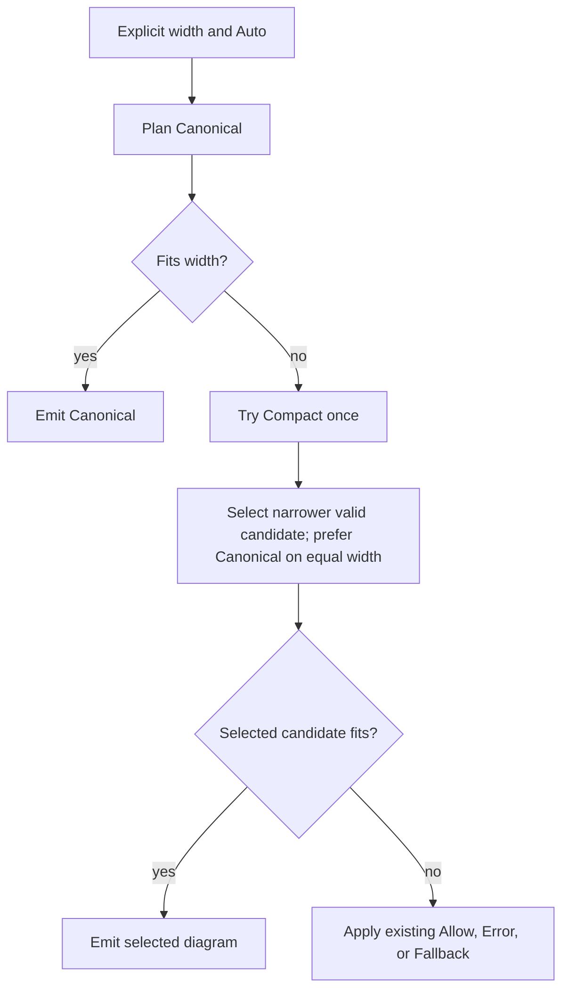

# ASCII terminal fitting and edge-label clearance

## Approved scope

The approved implementation has three bounded units: precise horizontal edge-label clearance,
measured Flowchart Compact spacing, and opt-in automatic layout selection. Keep the existing
family policy, width measurement, viewport, encoding, and resource boundaries.

The maintainer approved A+B+C after reviewing this proposal. Implementation and scoped validation are complete. The initial measurements below retain the pre-refactor evidence; the implementation
measurements at the end record the admitted changes.

Recommended API: add `AsciiLayoutProfile::Auto`, keeping `OverflowPolicy::{Allow, Error,
Fallback}` unchanged. `Auto` permits one Compact attempt after Canonical exceeds an explicit
width. It does not promise that every graph fits. This replaces the earlier tentative proposal
for `OverflowPolicy::Fit` / `CompactThenFallback`.

## Evidence and corrections

Merman base: `796915065cf7e4eadbb4e2d328c8a4372f6a9e63`, with the working-tree issue #132 fix.
Measurements below use the locally built CLI on 2026-09-11, Plain Unicode output, default
Unicode width profile, and unrestricted viewport. Dimensions are display cells by rows.

| Authored example | Canonical | Compact | Observation |
| --- | ---: | ---: | --- |
| Ten edges `N0 -->|yes| N1` through `N9 -->|yes| N10` | 157 x 5 | 157 x 5 | Short edge-label width is unchanged by Compact. |
| Same chain, label `very long description` on every edge | 337 x 5 | 337 x 5 | Compact does not wrap edge labels. |
| Same short-label chain with `---` instead of `-->` | 157 x 5 | 157 x 5 | Current fixed clearance also reserves unused marker space. |
| Three edges/four nodes, each node labelled `many words are too much sometime` | 159 x 5 | 123 x 7 | Node wrapping trades width for height; total rectangle area rises. |
| `A -->|description i| Ni`, for i = 0 through 5 | UnsupportedFeature | UnsupportedFeature | Bounded label-placement search is exhausted. This is not a viewport overflow. |
| Subgraph containing `A -->|very long description| B`, `B -->|yes| C`, followed by `C --> D` | 63 x 11 | 63 x 11 | Compact does not automatically tighten group/rank spacing. |

Reproduce each example with `merman-cli render - --format unicode --ascii-report
--ascii-layout-profile canonical` and then `compact`. The local audit record, including exact
inputs, is `target/issue-132-terminal-policy-audit.json`; the table and input descriptions above
are the durable evidence.

The initial change raises label-dominated rank gaps from label width + 2 to label width + 6.
In the ten-edge chains this accounts for 40 additional columns relative to the previous gap
formula, assuming the same ranks and no other dominating constraints. That is a formula-based
comparison, not a separately executed old-binary benchmark. Parallel edges sharing a rank gap
use its maximum constraint; their clearances do not simply add together.

Corrections to earlier discussion:

- Graph `Point`, `Circle`, and `Cross` markers are all single structural cells. `Open` has no
  marker. CJK mode already substitutes single-cell ASCII structure. A variable-width glyph
  measurement framework is unnecessary for these graph endpoints.
- The actual marker berth matters: source markers may occupy a node connector, and allocation
  can move a marker along a route. Adding the count of semantic markers to every gap is not an
  exact substitute for the existing placement model.
- Flowchart Compact currently changes the default node wrap from 40 to 24 cells; its rank gaps
  are unchanged. Sequence Compact changes participant spacing from 5 to 3.
- Viewport checks can reject a planned extent before painting. They are not exclusively a
  post-render string check.
- `beautiful-mermaid` has a dedicated ASCII renderer and is relevant prior art.

## Existing boundaries to retain

| Concern | Current owner | Decision |
| --- | --- | --- |
| Mermaid parsing and semantics | `merman-core`, typed family projections | Keep; no second parser. |
| Structural charset / Unicode and CJK cell widths | `options.rs`, `safe_text.rs`, `terminal.rs` | Keep one measurement/painting convention. |
| Family geometry | Resolved Flowchart, Sequence, State, XYChart policies | Extend locally; no global spacing heuristic. |
| Node text wrapping | Flowchart projection and normalized label plans | Keep complete graphemes, hard breaks, and authored values. |
| Markers and label collision checks | Graph route plans and scene occupancy | Reuse actual route footprints. |
| Width bounds and final overflow action | `AsciiViewportPolicy` | Keep explicit host-supplied width and all existing defaults. |
| Final text and machine metadata | `AsciiOutput`, `metadata()`, `report()` | One authority for all transports. |
| Work, grid, document, encoded-byte limits and cancellation | Existing operation/resource contexts | Share one operation across attempts. |

No automatic terminal probing in Rust/WASM, no implicit direction changes, and no character
scaling, cropping, ellipsis, or raw-source fallback. A width constraint is not a height or area
constraint; expose actual height and retain existing grid/document budgets.

## A. Precise horizontal label clearance

Replace `HORIZONTAL_EDGE_LABEL_CLEARANCE` with a small graph-local calculation for the cells
needed on each side of an inline horizontal label. Preserve two visible stroke cells on each
side for supported direct horizontal routes under both Canonical and Compact.

Compute the usable interval from the route's endpoint/connector convention and occupied marker
cells. Center the occupied label cells inside that interval, rather than centering across cells
that will become markers. Reverse physical left/right ownership for RL without changing semantic
source/target identity. Retain the existing even-width centering correction.

For a simple route where both markers occupy gap cells, the required gap is label width + four
stroke cells + occupied marker cells (zero, one, or two). This is an example of the cell accounting,
not a universal formula: connector-hosted or relocated markers must follow the actual berth
contract. Layout reservation and label placement must agree on that contract.

Use a narrow helper/value shared at the relevant graph seam. Do not add a public clearance knob,
a parallel marker renderer, or a general constraint solver. Bent routes, cycles, subgraphs, and
State share parts of this engine; preserve their occupancy checks and cover their behavior before
reducing a reservation. Do not claim that every routed label, including off-line labels, must
have two horizontal stroke cells on both sides.

## B. Admit a more useful Flowchart Compact profile

Candidate change: reduce the default Flowchart horizontal rank gap from 5 to 3 cells when
Compact is selected and no explicit horizontal spacing override exists. Retain its 24-cell node
wrap. Keep vertical gaps, node padding, group gutters, and label stroke clearance unchanged in
this unit. These parameters have different collision responsibilities and are not interchangeable.

This spacing change is admitted only after the existing viewport/Flowchart matrix plus chains,
cycles, and compounds demonstrates preserved topology and labels. Explicit `with_graph_padding_x`
values win, including a value equal to the old default. Review direct public-field assignment
behavior and the existing override bits; do not silently introduce another override convention.
State remains on its independently resolved policy; Sequence keeps its existing Compact behavior.

This deliberately does not solve the 337-column long-edge-label chain. End-marker accounting can
save only a small number of columns per edge. Edge-label wrapping would require one normalized
label plan to drive grid reservation, routed descriptors, multiline occupancy, and painting;
shrinking a width in only one of those places is incorrect. Defer that separate change until its
height/collision tradeoff has evidence and approval.

## C. Automatic selection, separate from overflow

### Public request

Add `AsciiLayoutProfile::Auto` / `"auto"` to the existing layout-profile request surface.
Require `max_width > 0`. Initially admit Auto only for Flowchart and Sequence, through capability
metadata. An unsupported family/profile combination remains a preflight error. Canonical and
Compact remain fixed selections; neither acquires hidden retries.

Example CLI request:

```text
merman-cli render chart.mmd --format unicode --ascii-max-width 80 --ascii-layout-profile auto --ascii-overflow fallback --ascii-color plain
```

JSON bindings use `ascii.layout_profile = "auto"`, `ascii.max_width = 80`, and the existing
`ascii.overflow` value. No new Fit overflow value is introduced.

| Selection | Overflow | Behavior after layout selection |
| --- | --- | --- |
| canonical / compact | allow / error / fallback | Preserve current fixed-profile behavior. |
| auto | allow | Return a complete diagram, possibly wider than the bound. |
| auto | error | Return WidthOverflow if neither candidate fits. |
| auto | fallback | Attempt the existing complete structured projection if neither candidate fits. |

Auto works with supported Plain/ANSI/HTML primary encodings. `auto + fallback` retains the current
Plain-only fallback preflight rule, even when a particular input would fit. Styled requests can
use Auto with Allow or Error; silently downgrading styled output is outside scope.

### Candidate selection



Resolve family policies separately for each candidate from the same authored request. Do not
mutate the caller's options or share candidate scene mutation. For Allow, retain the completed Canonical result until a valid narrower Compact candidate is
available. For Error/Fallback, retain the planned extent from the existing early-overflow signal
when no primary text was materialized; a third Canonical layout must not be required. Equal width favors Canonical to avoid
unnecessary wrapping; Compact is not assumed to be smaller in every dimension.

Only width overflow triggers the optional attempt. A Canonical syntax/semantic/route failure is
returned unchanged. A Compact-only `UnsupportedFeature` during the optional attempt can discard
that candidate and retain the already valid Canonical candidate; it does not trigger a semantic
fallback by itself. Invalid requests, resource exhaustion, cancellation, and deadlines are always
terminal errors, including during Compact. Other unexpected errors propagate.

At most two primary layout attempts and one existing semantic fallback are allowed. Do not add
an unbounded loop of wrap widths, density values, or routing candidates. Reuse planned-extent
admission to avoid painting a rejected candidate when possible; do not reparse Mermaid.

### Resource and report contract

Work performed by a rejected candidate remains charged to the same render-wide layout ledger.
Use existing scoped document accounting and `transaction_preserving_layout_work`; a fresh detached
ledger must not reset the retry's CPU budget. Release discarded candidate documents. When Allow
requires keeping a wide candidate, account for retained candidate buffers under the existing
resource policy and avoid simultaneously painting both full canvases. Terminal resource errors
must never be reclassified as width failures.

Existing `layout_profile` and `primary_extent` identify the actual selected primary candidate,
including when structured fallback is emitted. Add `requested_layout_profile` and
`compact_attempted` so hosts can distinguish selection from the request. An Auto result never
reports Auto as the effective geometry profile. `overflowed` and `fallback.reason` retain their
meaning relative to that selected primary candidate; do not reuse `fallback_attempted` for a
Compact attempt.

Increment the report/metadata schema from 2 to 3 and migrate its generated projections atomically.
The changed direct UniFFI record also requires its API 6 version probe to advance to API 7,
with regenerated Python and Swift wrappers; its C ABI and Web transport versions are independent.
Existing output text defaults and fixed-profile behavior remain unchanged outside the explicit
issue #132 correction. Consumers validating schema versions must update; this is the main public
compatibility cost of C. Update CLI help/assets, bindings-core validators/catalogs, operation-plan
metadata, UniFFI and Web/Node generated types wherever they expose these records. Do not create
hand-maintained parallel schemas or a second report serializer. No new Playground selector is
required in this scope; existing hosts can opt in through the request API.

## Alternatives

1. **Keep +6 and document manual Compact retries.** Lowest implementation cost, but wastes marker
   space and makes every host repeat candidate selection/report handling. Retained as the fallback
   scope if public API expansion is declined.
2. **Add OverflowPolicy::Fit.** Rejected: it bundles layout selection with the final failure action,
   cannot independently express automatic layout plus strict Error, and inherits Plain-only
   structured fallback restrictions even for colored terminal previews.
3. **Recommended: exact clearance, measured Compact, Auto selection.** Reuses existing family
   boundaries and gives CLI and SDK users the same opt-in behavior, at the cost of one extra layout
   attempt and an explicit report-schema migration.
4. **Viewport-driven edge wrapping or a general responsive graph solver.** Deferred: the measured
   long-edge case would benefit, but multiline route occupancy and height growth are a separate
   problem. No current evidence justifies replacing ranking or the whole renderer.

## Verification and admission gates

- Preserve #132 semantic tests; add Open/Point/Circle/Cross and asymmetric marker combinations,
  LR/RL, odd/even labels, ASCII/Unicode and Unicode/CJK profiles. Direct horizontal labels retain
  two visible stroke cells per side and every marker; do not merely update snapshots.
- Characterize the six cases above plus the existing issue #53, cycles, parallel/reversed routes,
  nested groups, and Sequence notes/self-messages. Record width, height, rectangle area, and failures.
  The admitted Compact gap change must reduce at least one unlabeled gap-dominated LR case without
  introducing failures in previously supported corpus cases. Do not require every graph to shrink.
- Test 60/80/100/120-column bounds: Canonical fits (one attempt), only Compact fits (two attempts),
  both overflow, equal width, narrower-but-taller Compact, and Compact-only unsupported geometry.
- Preserve the six-way fan-out UnsupportedFeature; do not turn it into silent partial output or
  claim this scope fixes its routing. Capture it as a separate routing follow-up.
- Auto requires a bound; fixed Canonical never retries; explicit family overrides survive both
  candidates; unsupported Auto families fail preflight; styled fallback remains rejected.
- Prove one cumulative work budget, no candidate-document leakage, exact-limit/one-below behavior,
  and cancellation during the second attempt. No output is published before the complete result.
- Validate schema 3 once through canonical serialization and generated CLI/binding projections.
  Equivalent explicit CLI/Rust/binding requests must agree on effective layout, extents, and outcome.
- Use nextest with two build jobs, scoped formatting, and existing contract generators. Immutable
  fixture provenance is not updated to hide local CRLF/LF checkout differences.

## Risks and scope limits

| Risk | Mitigation |
| --- | --- |
| A smaller gap removes a marker or increases collisions | Match actual berths, preserve occupancy checks, admit only with marker/topology tests. |
| Narrower output is taller or occupies more cells | Report both dimensions, keep resource limits, show width/area evidence separately. |
| Retry resets resource budgets | One operation and cumulative work ledger; bounded attempt count. |
| Auto hides unsupported diagrams | Only retry width failures; keep Canonical unsupported errors unchanged. |
| Public API/report migration spreads across SDKs | One generated contract migration in C; A/B can ship independently if C is deferred. |
| Long labels still exceed terminal width | Explicit final overflow action; no promise of universal fitting or silent truncation. |

## Source references

Repository behavior: [options](../../crates/merman-ascii/src/options.rs),
[operation](../../crates/merman-ascii/src/operation.rs),
[output](../../crates/merman-ascii/src/output.rs),
[resource scopes](../../crates/merman-ascii/src/resource.rs),
[grid](../../crates/merman-ascii/src/graph/layout/grid.rs),
[label catalog](../../crates/merman-ascii/src/graph/routing/label.rs),
[marker occupancy](../../crates/merman-ascii/src/graph/routing/occupancy/marker.rs),
[label occupancy](../../crates/merman-ascii/src/graph/routing/occupancy/labels.rs),
[viewport characterization](../../crates/merman-ascii/tests/viewport_characterization.rs),
[ADR 0065](../adr/0065-ascii-output-boundary.md), and the
[existing terminal-layout plan](2026-08-26-1451-refactor-ascii-terminal-layout-theme-architecture-plan.md).

Prior art was inspected in local reference checkouts, not assumed to be the latest upstream:

- Grok Build `37949780c144e37df692e3d669051a21fec24f20`:
  `crates/codegen/xai-grok-markdown/src/mermaid.rs`. Uses bounded node wrapping, edge-label
  truncation, a width gate, and source fallback. Its LR base gap uses a maximum label width across
  relevant edges, so it is not a universal model of minimal spacing. Do not copy its truncation or
  source disclosure into Merman's complete typed fallback contract.
- mermaid-ascii `5f00e3d9ac9fc96a19859d502333e35b87d2ffea`:
  `pkg/render/diagram.go`. Tries spacing 1/1 after width overflow and reports whether it fits;
  it can still return a wide diagram. Useful evidence for a bounded retry, not a fitting guarantee.
- beautiful-mermaid `2ac8bbbb060ca0a65a6a21f3200bd99b1587b488`:
  `src/ascii/edge-routing.ts`, `determineLabelLine`. Selects a route segment and expands a local
  column to `label.length + 2`. Useful route-local placement precedent; JS string length is not a
  replacement for Merman's grapheme/display-cell width policy.

## Implementation measurements (2026-09-11)

The same authored inputs, with exact marker clearance and a Compact horizontal gap of 3:

| Example | Initial +6 Canonical | Revised Canonical | Revised Compact |
| --- | ---: | ---: | ---: |
| Ten short-label arrows | 157 x 5 | 147 x 5 | 147 x 5 |
| Ten long-label arrows | 337 x 5 | 327 x 5 | 327 x 5 |
| Ten short-label open edges | 157 x 5 | 137 x 5 | 137 x 5 |
| Four long-label nodes | 159 x 5 | 159 x 5 | 117 x 7 |
| Subgraph chain | 63 x 11 | 61 x 11 | 59 x 11 |

Auto at 80 columns keeps Canonical on equal-width chains, selects Compact for the long-node
chain, and skips Compact for the already-fitting compound. The six-way labeled fan-out still
returns the same UnsupportedFeature under all three profiles. The long-node Compact rectangle
is 819 cells versus Canonical's 795: its smaller width is not an area reduction.

The existing issue #53 Compact fixture changes from 58 x 67 to 56 x 67, with 2910 blank cells
(previously 3006) and a longest blank run of 41 (previously 43). Canonical stays 74 x 57.

Review found and corrected an interaction between retained Canonical text and Sequence's
already-admitted temporary padded rows. A real Sequence exact-final-cell-budget regression covers
both fixed Compact and Auto; retaining the first candidate must not make temporary padding consume
the final document budget twice.

## Validation record

- ASCII nextest: 1331 passed. The existing immutable-fixture provenance check was excluded because
  this Windows checkout has pre-existing CRLF/LF byte differences; no fixture hashes were changed.
- CLI, bindings-core, and UniFFI scoped contract/metadata tests: 114 passed; API 7 probe and ASCII
  follow-up tests: 5 passed; Swift binding-generator tests: 3 passed.
- `cargo clippy -p merman-ascii --all-targets -- -D warnings`, scoped `cargo fmt --check`, and
  `git diff --check` passed.
- CLI completions/man assets and shared binding/capability artifacts regenerated through the
  maintained generators. Python and Swift bindings regenerated from matching local UniFFI metadata.
- Node API contracts: 37 passed; Python runtime-catalog tests: 29 passed plus native smoke;
  Android metadata tests: 7 passed; Dart ABI contract tests passed using the existing package config.
  Swift source generation was verified on Windows; Apple-target compilation was not run.
- Full Web WASM build, TypeScript contracts, Auto rendering smoke, and Playground production build
  passed. Desktop and 390-pixel browser SVG-guidance regressions both passed.
- The retained-Sequence-budget review finding was corrected and re-reviewed with no remaining findings.

No publication, remote issue update, or default Auto selection was performed.
