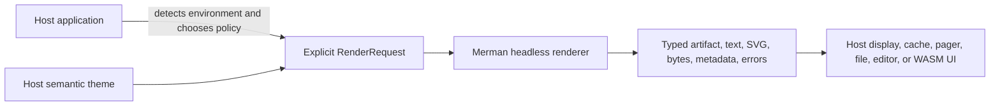

# Headless Library Boundary - Plan

## Goal Capsule

**Objective:** Make Merman easier to adopt as a reusable Mermaid infrastructure library while keeping terminal products, editors, blogs, WASM hosts, and coding-agent UIs free to choose their own display policy.

**Means:** Clarify and exercise the existing request, theme, capability, and output contracts through library-level recipes and documentation, adding a small API only when an actual composition gap is demonstrated.

**Authority:** Existing public Rust and binding contracts, accepted headless boundary ADRs, and the current capability matrix govern behavior. The local Grok Build checkout is prior art, not a compatibility target.

**Stop conditions:** Do not add pager/TUI behavior, terminal probing, filesystem cache, clipboard/image-opening actions, implicit truncation, or a second Mermaid parser. Stop after the existing APIs are demonstrably usable for the supported integration scenarios.

---

## Product Contract

### Summary

Merman is a headless Rust implementation of Mermaid for parsing, layout, rendering, and typed output contracts. This work improves the library boundary around existing SVG, ASCII/Unicode, raster, theme, capability, resource, cancellation, and binding surfaces.

### Problem Frame

Grok Build shows useful terminal presentation behavior, but those choices belong to a pager product. Copying them into Merman would couple a reusable renderer to terminal detection, interaction, caching, and lossy display decisions. The current question is whether Merman exposes enough neutral primitives and guidance for hosts to build those policies themselves.

### Requirements

#### Library boundary

- **R1.** Core rendering remains environment-independent and does not read terminal state, launch OS viewers, manage clipboards, cache files, or own pager/TUI interaction.
- **R2.** Existing typed request/output contracts remain the source of truth for SVG, ASCII/Unicode, raster, capability discovery, resource limits, cancellation, and structured errors.
- **R3.** Library examples and documentation show how a host explicitly selects output, width, charset, color/theme, layout profile, overflow policy, and resource behavior for distinct integration contexts.

#### Theme and composition

- **R4.** Host theme values map through the existing semantic `HostTheme`/presentation and `AsciiTerminalPalette`/`AsciiColorTheme` boundaries without importing terminal or SVG implementation details across layers.
- **R5.** Any new public option or metadata field is added only when an existing composition cannot express a documented integration scenario, and then is exposed through capability and all affected bindings atomically.

#### Integration confidence

- **R6.** The repository contains verified recipes for interactive terminal text, deterministic plain logs/agent pipes, browser SVG, and raster export, each with explicit host-owned policy inputs.
- **R7.** Documentation states the division of responsibility between Merman and host products, including the difference between Merman's complete semantic fallback and product-level truncation or source display.
- **R8.** Comparison claims about Grok Build identify the pinned local revision and distinguish product integration from reusable renderer behavior.

### Actors

- **A1. Library consumer:** embeds Merman in Rust, WASM, CLI, editor, blog, or mobile code and needs stable, explicit contracts.
- **A2. Host product:** chooses terminal detection, UI interaction, caching, scheduling, and presentation policy outside Merman.
- **A3. Maintainer:** needs evidence that a proposed API addition is necessary and does not widen the core boundary.

### Key Flows

- **F1. Terminal host:** host detects terminal facts, constructs explicit ASCII/Unicode options and viewport policy, then renders a typed result and decides how to display it.
- **F2. Agent/log host:** host requests plain output and machine metadata, branches on width/fallback/error state, and never parses layout from text.
- **F3. Themed browser host:** host resolves presentation/theme and selects the SVG pipeline independently from ASCII color policy.
- **F4. Raster host:** host requests validated SVG-to-PNG/JPEG/PDF export and owns file or viewer behavior.

### Acceptance Examples

- **AE1.** A Rust example renders a bounded Unicode terminal diagram with explicit `Auto` layout and `Fallback`, while the library performs no terminal detection.
- **AE2.** A plain agent/log example emits text plus typed metadata that distinguishes a fitting result, allowed overflow, structured fallback, resource exhaustion, and cancellation.
- **AE3.** A browser SVG example combines a semantic host theme with an explicit `parity`, `resvg-safe`, or `readable` pipeline and documents the consumer trade-off.
- **AE4.** A raster example demonstrates that Merman returns artifact bytes and dimensions while the host decides where to save or open them.
- **AE5.** Documentation comparison with Grok Build cites the local pinned checkout and identifies pager affordances, cache keys, worker isolation, and truncation as host concerns.

### Success Criteria

- **S1.** A new library consumer can choose a correct starting recipe without reading internal renderer code.
- **S2.** No product-specific terminal or OS behavior enters `merman-core`, `merman-render`, or `merman-ascii`.
- **S3.** Existing public behavior and generated transport contracts remain unchanged unless a concrete gap is found and justified.
- **S4.** The boundary research and recipes remain accurate for the pinned Mermaid baseline and the local reference revisions.

### Scope Boundaries

#### In scope

- Documentation and examples for existing library contracts.
- A focused audit of theme/presentation composition and output presets already present in the public API.
- Tests that prove the recipes and preserve capability/error/metadata behavior.
- Clarifications to support matrices, README guidance, ADR addenda, and binding usage documentation.

#### Deferred to Follow-Up Work

- A convenience policy builder or named preset if recipe work proves repeated composition cannot remain clear with existing request types.
- A unified cross-output theme object if separate semantic theme boundaries prove insufficient in a concrete host integration.
- Host adapters for automatic TTY detection, pager selection, image opening, caching, clipboard, and product affordances.
- Additional ASCII family admission, responsive re-layout, implicit label truncation, or source-disclosure policy.

#### Outside This Product's Identity

- Pager/TUI implementation, terminal probing, OS integration, model/provider policy, agent orchestration, and a second Mermaid parser.

### Sources / Research

- `docs/research/2026-09-12-headless-library-boundary.md` — current boundary research and pinned Grok Build comparison.
- `docs/research/2026-08-26-ascii-terminal-layout-visual-hierarchy-themes.md` — prior ASCII theme and terminal-policy evidence.
- `README.md` — headless positioning, output targets, feature boundaries, determinism, cancellation, and resource contracts.
- `docs/adr/0003-workspace-structure.md` — reusable headless crate boundary.
- `docs/adr/0008-async-and-runtime.md` — runtime neutrality and host-owned scheduling/isolation.
- `docs/adr/0065-ascii-output-boundary.md` — first-class ASCII target and explicit viewport/fallback boundary.
- `docs/rendering/presentation-themes.md` — existing semantic host theme and presentation layering.
- `docs/rendering/ASCII_SUPPORT_MATRIX.md` — capability admission and structured fallback contract.
- `repo-ref/grok-build/crates/codegen/xai-grok-pager/src/scrollback/blocks/mermaid_content.rs` — pager affordances and product-owned image behavior.
- `repo-ref/grok-build/crates/codegen/xai-grok-pager/src/app/mermaid_worker.rs` — product-owned subprocess isolation and limits.
- `repo-ref/grok-build/crates/codegen/xai-grok-markdown/src/mermaid.rs` — product-owned wrapping/truncation policy.
- `repo-ref/beautiful-mermaid/src/ascii/index.ts` and `repo-ref/beautiful-mermaid/README.md` — comparison prior art for explicit ASCII options and theme inputs; local checkout revision is recorded in the research note.

---

## Planning Contract

### Key Technical Decisions

- **KTD1. Treat existing public contracts as the default solution.** Add no `TerminalRenderProfile`, `AgentPreset`, or cross-output theme abstraction unless a recipe audit identifies a concrete, repeated gap. This preserves the headless boundary and avoids premature API surface.
- **KTD2. Keep host policy outside the library.** Examples may show a host resolving terminal width, color capability, or product theme, but Merman receives explicit values and never discovers them itself.
- **KTD3. Use recipes as the first integration seam.** A small set of copyable examples and a decision table is more reusable across CLI, editor, blog, WASM, and SDK hosts than a product-specific orchestration layer.
- **KTD4. Preserve semantic fallback and explicit lossiness.** Do not import Grok's fixed truncation or raw-source fallback into the renderer; hosts may choose their own presentation after receiving Merman's typed result.
- **KTD5. Keep SVG and terminal theme mappings independent but semantically named.** Existing `HostTheme`/presentation and `AsciiColorTheme` roles can share host concepts through documentation and adapter code without making one output's CSS or terminal encoding the authority for the other.
- **KTD6. Make public-contract changes conditional.** If the audit finds no gap, the implementation is documentation/examples/tests only. If it finds a gap, isolate it as a separately reviewable API unit with capability, binding, and migration impact explicitly listed.

### High-Level Technical Design

The library boundary ends at `RenderOutput` and its typed metadata/errors. The host owns all environment facts and post-render actions. Recipes exercise the same boundary for terminal, agent/log, browser SVG, and raster contexts.

### Assumptions

- The current public APIs are sufficient for the four recipes; any contrary finding is an implementation-time blocker that must be surfaced before inventing a new abstraction.
- The pinned local Grok Build and beautiful-mermaid checkouts are comparison evidence only and may not represent their upstream latest revisions.
- The prior Issue #132 and ASCII fitting changes remain part of the baseline and should not be reverted or reinterpreted by this plan.

---

## Implementation Units

### U1. Audit existing integration seams

**Goal:** Identify whether current Rust, ASCII, SVG, theme, capability, and binding APIs can express the four host scenarios without new public abstractions.

**Requirements:** R1-R5, S2-S3

**Dependencies:** None

**Files:** `README.md`, `crates/merman/examples/`, `crates/merman/src/render.rs`, `crates/merman-ascii/src/options.rs`, `crates/merman-ascii/src/color.rs`, `crates/merman-render/src/svg/pipeline/`, `crates/merman-bindings-core/src/ascii.rs`, `platforms/web/src/runtime-ascii.ts`, `docs/rendering/presentation-themes.md`, `docs/rendering/ASCII_SUPPORT_MATRIX.md`

**Approach:**

1. Trace each recipe from host-owned inputs through `RenderRequest`/binding options to typed output and metadata.
2. Record any missing composition as a concrete reproducible gap rather than an abstract desire for convenience.
3. Keep all terminal detection, cache, UI, and OS actions outside the candidate library surface.

**Patterns to follow:** Existing `render_terminal.rs`, `custom_presentation_theme.rs`, `custom_svg_pipeline.rs`, `AsciiRequest`, capability admission, and operation metadata tests.

**Test scenarios:**

- A fitting Unicode terminal request with explicit width and `Auto` produces a complete typed result without consulting process terminal state.
- A plain request with `Fallback` exposes structured metadata and preserves authored fields.
- An SVG request with a semantic host theme and each supported pipeline preserves the selected pipeline identity.
- A raster request returns bytes and dimensions without creating a host file or invoking an OS viewer.
- Invalid family/profile/encoding combinations fail through existing capability or typed option diagnostics.

**Verification:** Produce an audit table mapping each recipe input, existing API, output contract, and remaining gap. No production API is changed unless the table names a concrete blocker.

### U2. Add copyable library recipes

**Goal:** Make the four host contexts in the Product Contract easy to reproduce from the public Rust API while reusing existing examples wherever they already cover the contract.

**Requirements:** R3, R4, R6, R7; covers F1-F4 and AE1-AE4

**Dependencies:** U1

**Files:** `crates/merman/examples/render_terminal.rs`, `crates/merman/examples/custom_presentation_theme.rs`, `crates/merman/examples/custom_svg_pipeline.rs`, `crates/merman/examples/render_agent_log.rs`, `crates/merman/examples/README.md`, `crates/merman/Cargo.toml`

**Approach:**

1. Keep terminal facts as explicit constants or caller inputs in examples.
2. Show typed report branching for fit, overflow, fallback, and hard errors.
3. Show semantic theme composition and explicit SVG pipeline selection.
4. Show raster bytes/dimensions as an artifact return value with host-owned persistence.

**Execution note:** Prefer smoke-first example execution because these units are public usage guidance and compile drift is the main risk.

**Test scenarios:**

- Terminal recipe renders Unicode and ASCII variants with explicit viewport policy.
- Agent/log recipe emits plain text and machine-readable metadata for fit, allowed overflow, fallback, and error cases.
- Browser SVG recipe compiles with a semantic host theme and documents the selected pipeline.
- Existing SVG and raster examples, or a narrowly justified raster addition, compile under their matching features and return artifacts without owning persistence.
- Examples do not read TTY state, environment appearance, clipboard state, or filesystem paths unless a host argument explicitly supplies them.

**Verification:** All recipes compile under their documented feature sets and their output/metadata matches the existing contracts.

### U3. Align documentation and host-boundary guidance

**Goal:** Make the responsibility split and recipe selection discoverable without turning Merman into a product-specific integration layer.

**Requirements:** R3, R7-R8, S1, S4

**Dependencies:** U1, U2

**Files:** `README.md`, `crates/merman/examples/README.md`, `crates/merman-cli/README.md`, `platforms/node/README.md`, `platforms/web/README.md`, `docs/rendering/presentation-themes.md`, `docs/rendering/ASCII_SUPPORT_MATRIX.md`, `docs/adr/0003-workspace-structure.md`, `docs/adr/0008-async-and-runtime.md`, `docs/adr/0065-ascii-output-boundary.md`, `docs/research/2026-09-12-headless-library-boundary.md`

**Approach:**

1. Add a concise consumer decision table for terminal, agent/log, browser SVG, raster, and editor/WASM use.
2. Link each row to the corresponding copyable recipe and capability documentation.
3. State which Grok behaviors are intentionally host-owned and cite the pinned local comparison revision.
4. Explain when to use `parity`, `resvg-safe`, and `readable` without recommending one globally.

**Test scenarios:**

- README links resolve to existing recipes and boundary documents.
- Documentation examples use current option names and schema versions.
- Grok comparison language does not claim unverified latest behavior or byte parity.
- Node/Web docs retain their feature/package boundaries and do not imply ASCII is present in every artifact.

**Verification:** A cold reader can select a recipe and identify the host responsibilities without reading internal implementation files.

### U4. Add contract and regression coverage

**Goal:** Prevent the library boundary from drifting toward implicit environment or product behavior.

**Requirements:** R1-R8, S2-S4

**Dependencies:** U2, U3

**Files:** `crates/merman/tests/`, `crates/merman-ascii/tests/`, `crates/merman-cli/tests/`, `platforms/web/scripts/`, `platforms/node/tests/`, `crates/merman/examples/`

**Approach:**

1. Add focused tests for recipe output, metadata, capability admission, and feature gating.
2. Add a regression assertion that library rendering is unchanged when terminal-related environment variables are altered or absent.
3. Keep transport tests conditional on an actual public contract change; do not regenerate bindings for documentation-only work.

**Test scenarios:**

- Explicit terminal options produce identical logical output with and without terminal environment variables.
- Styled and plain requests retain the same logical extents and semantic fields.
- Width overflow and structured fallback remain distinct from resource exhaustion and cancellation.
- Unsupported combinations fail closed before rendering.
- Existing SVG pipeline guidance tests continue to distinguish browser parity, export-safe, and readable text-overlay use.

**Verification:** Existing relevant Rust, CLI, binding, Web, and example gates pass, with no new public contract drift unless U1 documented a necessary gap.

---

## System-Wide Impact

The work touches shared documentation and public examples, but it should not change renderer semantics or generated contracts by default. If U1 finds a real public API gap, the impact must be isolated and include Rust facade, capability metadata, CLI/bindings, Web/FFI projections, and migration notes in the same change. Product hosts remain responsible for scheduling, process isolation, terminal detection, caching, and UI actions.

## Risks & Dependencies

- **API duplication:** Adding a preset that merely aliases existing request fields would increase maintenance cost. U1 must reject it unless a repeated composition gap is demonstrated.
- **Theme ambiguity:** SVG and terminal themes have different semantics and encodings. Documentation must describe their mapping without implying shared CSS or terminal state.
- **Reference drift:** `repo-ref/grok-build` and `repo-ref/beautiful-mermaid` are pinned local checkouts. Claims must include revisions and remain comparative rather than normative.
- **Example drift:** Public recipes can silently stop compiling when feature gates or schemas change. Example compilation belongs in the verification contract.

## Documentation / Operational Notes

The research note is the source for the Grok comparison. The implementation should update the relevant README and rendering documents in place rather than create a second competing boundary guide. No issue comment, publication, or remote repository update is part of this plan.

## Verification Contract

- Rust example and facade tests cover each recipe under its required feature set.
- ASCII tests cover explicit width/layout/overflow and environment-independent behavior.
- CLI contract tests cover documented option names and report behavior when examples use CLI output.
- Web and Node contract tests run only when their public types or package guidance changes.
- `cargo fmt --check`, `cargo clippy` for affected Rust packages, and `git diff --check` remain required.
- Generated bindings are regenerated only if U1 proves a public contract change; otherwise generated artifacts remain untouched.
- Documentation links, recipe commands, and feature declarations are checked together before completion.

## Definition of Done

- The four host scenarios have copyable, compiling recipes using existing public APIs or a separately justified API change.
- Merman core and renderer code contain no terminal probing, pager/TUI, OS viewer, clipboard, cache, or implicit truncation behavior.
- README and rendering documentation clearly state the library/host boundary and the appropriate SVG/ASCII choices.
- Capability, metadata, resource, cancellation, and fallback behavior remain typed and environment-independent.
- Grok comparison claims cite the pinned local revision and do not turn product behavior into a Merman requirement.
- Relevant tests, formatting, lint, and documentation checks pass.
- Any abandoned prototype or rejected abstraction is removed from the final diff.
