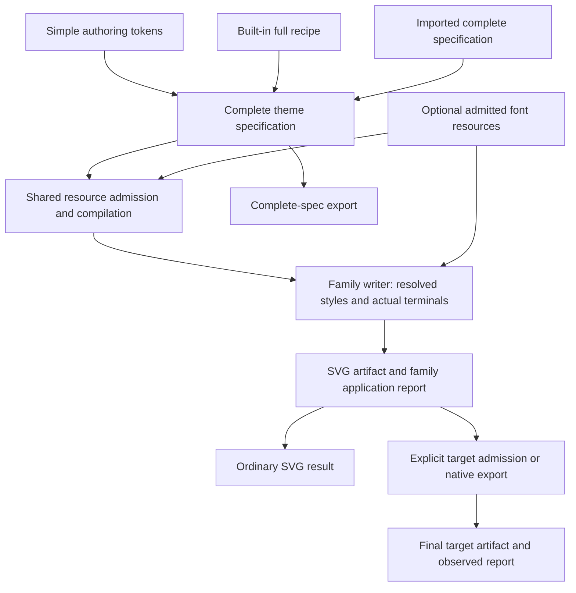
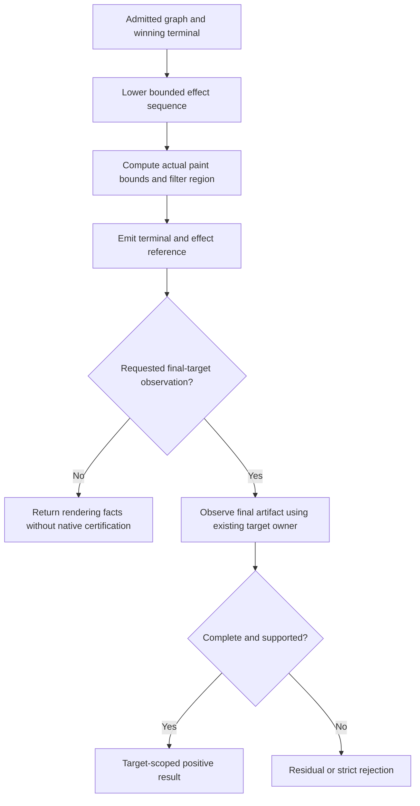

# Theme Product Boundaries and Preset Delivery - Plan

## Goal Capsule

- **Objective:** Users can choose themes with clear family-appropriate design scope, obtain a visibly complete Cyberpunk preset for the declared Flowchart, Sequence and XY Chart scenes, and export reliable results without ordinary typed themes paying for unrelated font-resource or certification work.
- **Means:** Refactor the unpublished boundaries around the existing typed model and real drawing owners; deliver complete public recipes and measure the resulting library cost (KTD1–KTD7).
- **Authority:** This plan supersedes the remaining execution order in the September 15 C7a/C7b replan and the August 9 addendum's deferral of selected reference visual checks. It preserves their completed C5/C6a and provider-retirement history. Product behavior is owned by R1–R15; implementation choices by KTD1–KTD7.
- **Execution profile:** Implement in the current feature branch, use precise commits, shared build targets and bounded serial Cargo work. Leave unrelated work untouched. This document is a plan, not evidence that implementation or acceptance has completed.
- **Stop conditions:** Do not freeze the contract, promote qualification, tag, publish or push while a required behavior or impact gate is unresolved. Report missing hosts as unverified. A necessary change to the agreed product scope requires a decision; ordinary internal design choices do not.
- **Tail ownership:** The executing agent owns implementation, review and the final candidate report. Publication remains a separate maintainer action. The existing broader goal remains open; its delivery order now follows this plan.

---

## Product Contract

### Summary

Keep the useful typed theme model, rule precedence and family drawing ownership. Remove accidental coupling between ordinary SVG, embedded-font processing and target certification. Make the public preset the source of the actual visual recipe, then prove the rendered product through its public entrypoints. Review all 24 reference themes to establish shared identity, family-specific recipes and appropriate use; Cyberpunk is the first effect-rich sample, not the definition of the whole theme product.

This is a substantive boundary refactor with selective deletion, not a restart of parser/layout architecture. The release remains v0.8.0-alpha.7, and unpublished theme protocols remain v1.

### Problem Frame

At source baseline `81ee5cad0`, the public Cyberpunk recipe primarily changes colors. The full model can express layered canvas and effect graphs, but the preset builder returns only a simple definition. Global effect bindings are admitted only for State/State; its nonempty implementation and native exporter recognize one zero-spread shadow. Sequence width/radius and some typography and series paint consumers are also missing.

The pinned reference uses cyan neon edges, rounded surfaces, ordered glows, stronger text and a grid/radial backdrop. Some of that backdrop belongs to the reference preview container. Successful rendering, matrix classification and hand-authored C6 scenes do not prove that the public preset produces those effects.

There is independently confirmed default-render overhead. On matched byte-identical SVG fixtures, alpha.6 to candidate `a5e3cd2d6` median complete-operation time increased from 50.59 to 188.28 microseconds for Class tiny, 600.31 to 1353.40 for Class medium, and 92.76 to 244.62 for XY Chart medium. Sampling locates substantial work in prepared-label partitioning and standalone finalization. These are release-range observations, not isolated attribution of every added microsecond to themes.

Minimal native SVG resolves 104 to 126 unique dependency names, and minimal WASM SVG 104 to 124, comparing alpha.6 with this source baseline. Font parsing, shaping and WOFF2 dependencies became unconditional renderer dependencies. Default system-font rendering already skips native prepared layout when no font assets exist; dependency reachability is not evidence that shaping caused the measured latency.

### Requirements

**Visual product and public authoring**

- R1. The public Cyberpunk preset must render the three bounded reference scenes in SVG, PNG and PDF with the applicable source-backed colors, widths, radii, text weight/glow, series paint, ordered shadows and complete background. Missing requested effects cannot count as successful delivery. Reference provenance and scene-specific tolerances are fixed before changing the oracle.
- R2. Preset compilation and complete-spec export/import must produce the same effective recipe. Simple token authoring stays supported. Overrides, explicit Clear, transparent paint and source ownership retain their defined semantics, and final composed recipes pass the same resource admission as user-authored complete specifications.
- R3. Support and artifact reports must distinguish an implemented facet from observed final-target support. Unsupported, incomplete and unverified outcomes remain explicit. Qualification names the exact recipe, source/profile, target and host assumptions; absent or unknown claims never imply Portable.

**Library cost and boundaries**

- R4. Ordinary SVG plus typed colors, strokes, rules, canvas and supported SVG effects must work without the embedded-font capability. That profile must not reach the newly introduced font parsing/shaping/WOFF2 dependency group. Caller-supplied font stacks remain usable and host-dependent; the library bundles no Inter or replacement font.
- R5. Ordinary rendering must not unconditionally perform native-target certification or scan an absent prepared-label ledger. Explicit certification, native export and mutation boundaries retain the validation needed for their promises. Input/resource validation, cancellation and error classification remain effective in all profiles.
- R6. Close the confirmed default-render regressions using the predeclared comparison gate in the Verification Contract. Publish separate measurements for dependency closure, actual package bytes, cold start, latency and memory. Neither passing an existing size limit nor fewer package names demonstrates acceptable overall cost.

**Delivery and migration**

- R7. Preserve published version/ABI history and the accepted alpha.6 transition policy. Remove superseded unpublished APIs and adapters as their consumers move; do not retain compatibility scaffolding solely for an unreleased design. Keep the alpha.7 sibling pins and theme v1 identity policy.
- R8. Preserve the existing ten public preset IDs through migration, review each for basic usability, and qualify only scenes actually verified. Deliver the R1 tranche before expanding the catalog. Full visual equivalence for all 24 reference themes and all 33 families is not claimed.
- R9. Rebuild the final candidate after production changes, exercising real installed consumers, shared transport vectors, profile/qualification binding and archive replay from one fixed source. Historical candidate evidence remains historical. Missing required host evidence keeps C7a contract closure open.
- R10. Reuse existing render, export and acceptance owners. Retire redundant transient helpers and production duplicate observations with their replacement; retain historical retirement authority in private acceptance code. Do not add a CSS interpreter, universal proof engine or script-level compiler analysis.

**Portfolio and application semantics**

- R11. Review all 24 pinned reference themes for visual identity, dedicated family rules, base-only styling, host dependencies and suitable uses. Separate source intent from observed output. The review does not require publishing 24 presets or making every theme suit every family.
- R12. Apply a preset's shared base and only the current family's scoped recipe. Expose curated family design scope separately from compilation availability, mechanism support and qualification. Preserve diagram semantics and explicit selection when switching families; base-only or unreviewed styling must not be presented as complete reference reproduction. Unknown design scope is not automatically a technical rejection.

**Public authoring and exchange workflows**

- R13. Before public contract freeze, audit and verify preset selection, family switching, small brand modifications, saving, and importing through real public consumers. Show recipe selection, family design scope and actual output outcome separately. Preserve selection outside designed scope; do not silently substitute another preset or hide unsupported requested facets.
- R14. Define one canonical durable exchange representation using an existing envelope, with serialized schema identity, explicit unknown-version behavior and direct import of exported files. A fresh CLI/SDK process must consume the exported recipe without manual envelope reconstruction. Complete canvas/effects/family rules and explicit Clear/transparent values must survive the exchange.
- R15. Make custom theme creation and redistribution understandable: document the simple versus complete authoring path, modification precedence, identity/design metadata policy, host/resource requirements and license/attribution obligations. Evaluate a small preset-customization journey before adding conveniences. Do not add theme package management, remote loading, a registry or a second merge engine.

### Key Decisions

- **Measure necessary growth before considering larger budgets.** Governs R6. (session-settled: user-directed — chosen over blanket size rejection or automatic budget increases: required capability may justify growth only after attribution.)
- **Deliver alpha.7 with unpublished theme contracts at v1.** Governs R7. (session-settled: user-directed — chosen over repeated development version increments: the comparison authority is the published contract.)
- **Reassess product boundaries before release.** Governs R1, R4, R5, R9, R10. The current request moves selected reference-product checks ahead of C7a freeze; it does not reopen completed Legacy migration.

- **Themes need not suit every diagram family.** Governs R11, R12. The maintainer requested portfolio-wide analysis and family-appropriate application rather than extrapolating Cyberpunk or requiring universal adaptation.

### Acceptance Examples

- AE1. Covers R1–R3. A consumer compiles public Cyberpunk, exports the complete spec, imports it in a fresh engine and renders the same Flowchart. The final output retains the grid, both node glow stages, readable edge labels and visible arrowheads; it does not depend on the original process or preset-only writer behavior.
- AE2. Covers R3–R5. A minimal SVG consumer applies Cyberpunk without supplied font bytes. It obtains SVG and honest host-dependent text status without font decoding or native certification. An explicit unsupported target-certification request returns a capability outcome, not a fabricated positive report.
- AE3. Covers R2, R3, R5. Removing an effect binding, the second shadow or a required text/marker terminal invalidates the corresponding strict qualification. Supplying a graph that exceeds its budget fails before expensive lowering or rasterization.
- AE4. Covers R2, R8. A source-owned edge color or explicit effect Clear overrides the preset consistently; cycling light/dark recipes through a reusable engine does not leak paints, filters or cached results across requests.

- AE5. Covers R3, R11, R12. A user keeps Cyberpunk selected while changing a Flowchart into a dense Class diagram. Only the Class/base recipe applies, the consumer explains its actual design scope, and no Flowchart-specific effect leaks or alternative preset is silently selected. Available compilation does not imply a complete Class design.
- AE6. Covers R2, R12. A themed Sequence retains distinguishable request/reply lines and a Class/ER diagram retains relationship markers. A fourth XY series receives the recipe's documented categorical behavior instead of falling out of a three-selector CSS list. DOM sibling insertion does not reassign semantic categories accidentally.

### Scope Boundaries

The active tranche covers the all-24 portfolio/application review, the minimal runtime boundary, optional embedded-font capability, complete preset recipes, a bounded reusable glow implementation, three family consumers and final impact/delivery audit. Existing State shadows and all previously supported theme behavior remain regression obligations.

**Deferred to Follow-Up Work:** Remaining C7b family/value breadth, other reference themes, full C6b cross-target certification, C7c external-host guarantees, and unmeasured XY/Block micro-optimizations unrelated to measured bottlenecks. Their deferral does not excuse missing R1 behavior.

**Outside this product's identity:** A CSS/browser implementation, default font downloading or bundling, preview controls and interactive annotations, a generalized proof language, or universal pixel-identical layout/font output across hosts. True backdrop sampling is not approximated and advertised as ordinary Gaussian blur.

---

## Planning Contract

### Key Technical Decisions

- KTD1. **Use complete specifications as the internal recipe boundary.** Change the catalog's simple-definition-only builder seam, not the public simple authoring language. Simple recipes reuse the materializer; complex recipes compose canvas/effects into the complete wire specification. Admit the final composition once through the existing policy owner. Compiler and exporter consume that same result. This realizes the addendum's existing complete-spec export design (R2).
- KTD2. **Make embedded-font processing an explicit optional capability.** Use one `embedded-fonts` feature propagated through existing crates and package profiles, rather than a family of per-codec/per-effect features or a new font-service abstraction. It owns admitted font bytes, WOFF2 decoding, font metadata and native prepared shaping. Keep font references/typography values in the base contract. Existing PNG/PDF backends retain their ordinary system-font dependencies; those pre-existing export dependencies are not a reason to pull font machinery into SVG. Disabled capability accepts resource-free recipes and permits bounded lossless reading/forwarding of complete-spec data. Compilation rejects actual embedded-resource use with the existing capability-not-built diagnostic pattern, after input byte limits are checked; it never silently substitutes host fonts (R4, R5).
- KTD3. **Separate rendering from requested certification by operation semantics.** Ordinary BestEffort SVG retains family application/residual reporting but does not promise native portability. Unobserved target admission is explicitly Unverified; add this state to the existing target-admission owner, whose current public enum has only Portable, HostDependent and Rejected. Keep the unpublished v1 wire field open and preserve unknown values; static support discovery stays conservative, and final-target observations come from the target/export owner. Strict target admission and native export explicitly finalize against their target. Move validation to the owner that consumes the promise, reuse observations within that immutable artifact, and invalidate them after mutation. Do not replace a missing observation with success or serialize internal prepared-label identifiers merely to scan them out again (R3, R5). Retain hashing where artifact/resource identity is required; removing every new dependency is not the goal.
- KTD4. **Share a bounded effect lowering implementation and preserve drawing ownership.** Support the ordered zero-spread shadow composition needed by the pinned Cyberpunk recipes first. State migrates to the same implementation. The shared code owns effect sequence, inputs, color space and outward paint extent; each family supplies real terminal geometry, attachment point and clipping context. Extend existing exporter verification for the same semantics and remove its single-shadow/count assumptions. Do not generalize Node, Text, Edge and Marker behind a universal drawable trait (R1, R3, R10).
- KTD5. **Let the public recipe drive product evidence.** Use `compile_preset` and export/import through real consumers. Keep C6 hand-built scenes as mechanism regressions, explicitly separate from public-preset oracles. Map reference CSS into typed semantics deliberately; define preview-owned background composition at the root canvas. Capability counts never substitute for visible terminals (R1, R8).
- KTD6. **Simplify at the owning seam, then delete the old implementation.** Replace duplicate string/DOM inspection with writer observations only where they establish the same final-output promise. Mutated or externally supplied SVG still needs its own checks. Remove temporary hard-shadow aliases and dead providers/helpers after checking consumers; keep immutable history private. No new manifest or digest layer is added merely to attest that another checker ran (R5, R10).

- KTD7. **Model curated family design without a second support engine.** Keep shared defaults and family-scoped rules in the existing complete recipe. Add only the curated family-design declaration needed by catalog consumers to the existing descriptor; do not derive aesthetics from qualification cells or create a score/recommendation engine. Use scoped style effect references and ordinal rules for family adaptations; the current unscoped effect bindings and palette entries are not a substitute for family selection. Preserve semantic marker/dash/state distinctions and source-owned colors. Use the application decisions in the [portfolio analysis](../knowledge/engineering/verification/2026-09-16-theme-portfolio-and-application-boundaries.md) for R11/R12.

### High-Level Technical Design

| Operation/profile | Embedded font processing | Target certification | Result promise |
| --- | --- | --- | --- |
| Minimal SVG, no font assets | Absent from dependency closure | Only if explicitly requested and available | Applied/residual facts; host-dependent text |
| SVG plus embedded-fonts | Available for admitted caller assets | On request | Resource-backed text only where actually consumed |
| PNG/PDF with system fonts | Existing backend font handling | Required for the export's declared policy | Actual native target result |
| PNG/PDF plus embedded-fonts | Admitted explicit resources | Required for the export's declared policy | Same resources and target output bound together |
| Private qualification/candidate tools | Exact tested artifact capabilities | Required for promoted cells | Evidence scoped to that recipe/profile/host |

The reference uses ordered CSS shadows; translating them into SVG requires explicit inputs and color interpolation. W3C Filter Effects Level 1 defines sequential filter-function inputs, sRGB for CSS filter functions, and a clipping filter region. Treat the color-space difference from the existing State linearRGB emitter as observable behavior, not a cosmetic parameter. Preserve State's existing output while giving new recipes an explicit intended effect color-space interpretation; if the unpublished model needs that distinction, change it coherently rather than a preset-name special case.

For zero-area lines, marker tips, text glyph bounds and foreignObject text, use family-specific paint bounds and a deliberate coordinate system. Expanding a filter region does not by itself expand the root viewBox or override an ancestor clip. Keep visual outsets distinct from layout dimensions so glow does not alter graph placement unnecessarily. Existing PDF local rasterization of filtered content is permitted when output, clipping, scale and resource limits preserve the declared visual result; whole-document rasterization is not implied. Reference chained CSS shadows use Previous after the first source input. A source-owned fill overrides that facet only, retaining unrelated preset stroke/text/effect winners; an explicit effect Clear removes the effect.

### Sequencing and Assumptions

U12 establishes portfolio and application boundaries; U13 resolves public selection, authoring and exchange contracts before U4/U9; U1 then locks the representative visible contract before any oracle changes. U2 and U3 establish the cost boundary; U4 and U5 establish reusable recipe/effect semantics. U6–U8 deliver independent family tranches. U9 verifies public product/transport behavior, U10 admits measured cost, and U11 produces the final candidate.

The feature name in KTD2 is a concrete starting choice; implementation may improve private module placement without introducing new capability combinations. No new third-party dependency is planned for glow, canvas or typed-style consumers. A genuinely necessary new dependency requires an owner/profile and measured cost rationale before adoption.

The reference checkout is pinned at `a021cbce37fc0b07a9f4791c28e983101ea06f2d`. Its browser audit used Mermaid 11.12.1 and a reused CLI, while Merman targets 11.17.2; it is diagnostic evidence, not current-source parity certification. U1 rebuilds a reproducible comparison with recorded engine/font versions and separates source-backed style expectations from layout differences.

### Alternatives Considered

- **Only add preset parameters:** Rejected because both family consumers and native admission lack required semantics.
- **Rewrite the full theme system:** Rejected because complete canvas/spec/rule models and direct family writers already provide useful seams. Rewrite only implementations whose responsibility or cost cannot be corrected locally.
- **Keep all capabilities unconditional and raise budgets:** Rejected because unrelated SVG consumers cannot choose the cost, and default latency is already regressed.
- **Force every new dependency out of every build:** Rejected because explicit caller font resources and native backends have real decoding/shaping needs. The relevant boundary is capability and actual profile, not a zero-dependency slogan.

---

## Implementation Units

| Unit | Outcome | Primary files | Depends on |
| --- | --- | --- | --- |
| U12 | Portfolio and family application contract | portfolio analysis, capability corpus | None |
| U13 | Public selection, authoring and exchange contract | public workflow audit, existing contract/CLI/SDK owners | U12 |
| U1 | Reproducible visible contract | capability corpus, reference fixtures | U12 |
| U2 | Ordinary rendering avoids unrequested assurance | render facade, family artifacts, SVG pipeline | U1 |
| U3 | Optional embedded-font closure | manifests, assets, prepared text, profiles | U2 |
| U4 | One complete preset recipe | catalog, compiler, preset tests | U13, U1 |
| U5 | Bounded composed glow and native observation | effects, State, export filter receipts | U2, U4 |
| U6 | Cyberpunk Flowchart | Flowchart writers and marker/label tests | U5 |
| U7 | Cyberpunk Sequence | Sequence style/terminal owners | U5 |
| U8 | Cyberpunk XY Chart | XY theme/paint/writer | U5 |
| U9 | Public preset and transport qualification | public recipe fixtures, installed consumers | U13, U3, U6, U7, U8 |
| U10 | Cost regression closure | existing bench owners and impact audit | U9 |
| U11 | Same-source candidate and discovery delivery | release workflows, package/profile owners | U10 |

### U12. Review the portfolio and define family application

**Goal:** Ground the theme product in all reference themes and explicit family suitability rather than one neon example.
**Requirements:** R3, R8, R11, R12; KTD7. **Dependencies:** None.
**Files:** `docs/knowledge/engineering/verification/2026-09-16-theme-portfolio-and-application-boundaries.md`; `docs/alignment/MODERN_MERMAID_THEME_CAPABILITY_CORPUS.md`; representative inputs in `crates/merman-theme-fixtures/fixtures/public-cyberpunk`.
**Approach:** Review all pinned recipes and their Preview-owned behavior. Distinguish whole-family adaptation from typography-only and generic fallback. Probe the same small scenes across reference recipes to expose selector and ordering assumptions. Record an application policy and select non-Cyberpunk product probes before family implementation. Do not add catalog entries during this research unit.
**Test scenarios:**

- Every one of the 24 source themes has an identified design/coverage entry; source-declared scope is not mislabeled as observed support.
- Reference rendering records unmatched selectors, beyond-three-series behavior and host-only postprocessing honestly.
- The documented selection policy separates designed/base-only/unreviewed scope from compile/target outcomes and preserves semantic distinctions.

**Verification:** A source-traceable portfolio report, recorded browser probe limits and explicit family-application decisions exist. No Merman/native qualification is inferred from reference-only captures.

### U13. Resolve public theme selection, authoring and exchange

**Goal:** Make the unpublished interface coherent before consumers depend on its permanent shape.
**Requirements:** R2, R3, R7, R12–R15; KTD1, KTD7. **Dependencies:** U12.
**Files:** `crates/merman-theme-contract/src/{preset_catalog,authoring,materialized,spec,theme_recipe}.rs`; `crates/merman-bindings-core/src/theme.rs`; CLI theme-file and existing SDK import/export owners; `playground/src/components/ToolbarControls.tsx`; ADR 0082 and public theme documentation.
**Approach:** Use the [public workflow audit](../knowledge/engineering/verification/2026-09-17-theme-public-workflows-audit.md). Select a canonical exchange envelope from existing formats, define serialized schema identification and direct import, and settle curated design metadata and customization behavior. Retain shared-base plus family-recipe selection; do not introduce automatic cross-preset fallback absent a demonstrated user need. Resolve these decisions before changing the complete recipe builder and public discovery projections. Add only fields and conveniences needed by the tested journeys and remove displaced unpublished adapters.
**Test scenarios:**

- A caller can distinguish dedicated/base-only/unreviewed design from unavailable compilation and unsupported output without decoding internal compiler records.
- A saved exported recipe imports directly in a fresh public consumer; incompatible schema versions fail with an actionable diagnostic.
- Small brand/family customization preserves unrelated facets, Clear, transparency and resource admission.
- A Web caller can inspect the actual request's unapplied theme facets through an existing-owner projection; an SVG string or artifact-capability `ready` flag is not an application report. Reuse the execution owners rather than inventing a second proof engine. Current binding metadata is coarse status/reasons; useful per-facet explanations require a deliberate projection, not just forwarding that metadata.
- Define an explicit binding/Web strict-policy request and failure semantics; `resvg-safe` is a pipeline choice, not `RequirePortable`.
- Decide how complete complex recipes expose editable semantic color roles. Explicit per-role edits do not prove one-parameter global brand recoloring, and equal color strings must not be treated as shared token ownership.
- User-facing distribution guidance distinguishes recipe identity and legal metadata from actual resource and target guarantees.

**Verification:** Decisions are recorded in the existing contract documentation and implemented through existing owners; U9 exercises the full cross-consumer journeys before freeze. This unit is not closed by the audit report alone.

**Progress (2026-09-17):** Direct versioned recipe exchange, family design disclosure, scoped customization, and coarse Web render outcomes are implemented. Both browser SVG profiles now expose the existing strict policy; real Chromium verified a Portable recipe and the same recipe with an unsupported winning facet. The positive test also closed the shared GitGraph postprocessor's unrelated-family evidence invalidation. U13 remains open for useful rule/facet diagnostics with honest source attribution, semantic customization of complex presets, resource failure journeys, and consumer rollout. See the public workflow audit for scoped evidence; do not treat these results as visual qualification or the final platform matrix.

### U1. Lock the reference scenes and current failures

**Goal:** Give R1 a source-backed visual oracle that cannot silently narrow as implementation proceeds.
**Requirements:** R1, R3, R8, R11, R12. **Dependencies:** U12.
**Files:** `docs/alignment/MODERN_MERMAID_THEME_CAPABILITY_CORPUS.md`; `docs/knowledge/engineering/verification/2026-09-16-modern-mermaid-theme-audit.md`; existing theme fixtures in `crates/merman-theme-fixtures`; new `crates/merman-theme-acceptance/tests/cyberpunk_public_preset.rs`; focused browser cases under `playground/tests`.
**Approach:** Pin three small literal inputs and source recipe facts. Record a per-terminal table for applicable widths/radii, text, stroke/fill/opacity, shadows and background. Include the preview container's 40px two-direction grid and radial Screen layer in the composed visual oracle. Use controlled caller/test fonts with explicit provenance; no production font embedding. Characterize failures before changing expectations.
**Test scenarios:**

- The current public Flowchart recipe fails expected dual glow, background and text-weight checks even though rendering succeeds.
- Sequence includes actors, a message/arrowhead and a note; XY includes both line and bar series with labels and axes.
- A reference layout/font difference does not mask a missing style, blank label or clipped glow.

**Verification:** Recorded current-source SVG/browser/native captures and scene specifications identify required terminals. The oracle records renderer/font versions and target-specific tolerances; it does not certify the current preset.

### U2. Separate ordinary output from requested target assurance

**Goal:** Remove unconditional assurance work from ordinary SVG while preserving actual promises.
**Requirements:** R3, R5, R10; KTD3, KTD6. **Dependencies:** U1.
**Files:** `crates/merman/src/render.rs`; `crates/merman-render/src/family.rs`; `crates/merman-render/src/svg/pipeline/standalone.rs`; prepared-label partition helpers under `crates/merman-render/src/svg`; existing pipeline tests and new `crates/merman/tests/theme_render_policy.rs`.
**Approach:** Make artifact ownership and observation demand explicit at the facade/finalization seam. Avoid creating or scanning absent prepared-text metadata. Consolidate repeated observations within a final artifact and remove displaced helpers. Keep strict and export paths connected to the validator that supplies their guarantee. Separate reference-expansion budget accounting from native compatibility before removing the native observation pass; reuse the existing reference owner and graph algorithm. Preserve the currently enforced use/feImage/marker/effect expansion bounds, source ID rules and cancellation. Current native-incompatible CSS/foreignObject can stop observation before expansion planning; do not describe arbitrary browser CSS expansion as an existing guarantee or introduce a CSS resource model under this unit. Keep that observation limitation explicit. Native backend depth/node ceilings are not ordinary SVG admission, and saturating counters must respect the effective resource budget rather than silently cap at the native ceiling.
**Test scenarios:**

- Ordinary untitled/unthemed SVG, simple typed colors and an empty font catalog preserve output and resource/cancellation behavior without native compatibility observation.
- Strict target requests still reject unsupported content; a postprocessor changing an observed terminal invalidates previous evidence.
- Mixed prepared and ordinary labels retain public IDs and evidence association without leaking internal IDs.
- Empty prepared ledgers still reject forged reserved tokens; bypassing token parsing requires an exact absence condition owned by the token parser.
- For the existing analyzable subset, reference expansion beyond the requested element budget still fails, including budgets above the native backend ceiling; strict/native checks continue rejecting backend-incompatible artifacts. Ordinary foreignObject/unsupported-CSS output retains its ability to return, with Unverified target status and no claim of complete expansion certification. No generic browser CSS interpreter is introduced to justify removing a check.

**Verification:** Selected byte-identical default fixtures remain identical; strict/negative pipeline tests pass; profiling shows the unconditional paths removed rather than merely renamed. U10 decides performance admission.

### U3. Isolate embedded-font processing and align profiles

**Goal:** Make the minimal SVG dependency boundary real across native and WASM builds.
**Requirements:** R4, R5, R7; KTD2. **Dependencies:** U2.
**Files:** `Cargo.toml`; `crates/merman/Cargo.toml`; `crates/merman-render/Cargo.toml`; `crates/merman-export/Cargo.toml`; `diagram_theme/assets.rs` and `text/prepared.rs` in the renderer; existing platform profile declarations; existing profile checks; new `crates/merman/tests/theme_font_capability.rs`.
**Approach:** Move codec/font-parser/shaper implementation and concrete backend construction behind the single explicit capability. Keep complete-spec parsing available without decoding. Map each existing shipping profile deliberately, preserving claimed embedded-font behavior in profiles that opt in and accurately advertising its absence elsewhere. Let native export retain its backend's normal font use.
**Test scenarios:**

- Minimal native/WASM SVG compiles with font-stack typography, full canvas and resource-free effects but without the font-processing dependency group.
- An actual embedded-font request with the feature off fails deterministically through one-shot and reusable APIs; explicit font-family names do not fail.
- With the feature on, valid font resources render and malformed/duplicate-table/over-budget fonts preserve their existing bounded errors and panic regressions.

**Verification:** Exact profile closure checks demonstrate KTD2. Public feature errors and profiles agree across bindings. No bundled font resource is introduced.

### U4. Compile and export one complete preset recipe

**Goal:** Remove the simple-definition-only restriction on internal presets.
**Requirements:** R2, R7, R8, R12; KTD1, KTD7. **Dependencies:** U13, U1.
**Files:** `crates/merman-render/src/diagram_theme/presets/catalog.rs`; `diagram_theme/compiler.rs`; `diagram_theme/presets.rs`; existing complete-spec wire/materializer tests in `crates/merman-theme-contract`.
**Approach:** Produce one complete wire result and use it for compile/export. Keep simple recipes through the existing token materializer. Compose Cyberpunk's full canvas and effects using typed data, with final admission and identities covering the composition. Make family refinements explicit under KTD7 and preserve base-only behavior outside designed scope. Preserve explicit authoring overrides.
**Test scenarios:**

- Covers AE1. Complete-spec export/import retains layers, effect inputs and values without a preset-only rendering branch.
- A budget sufficient for tokens but insufficient for appended effects/canvas rejects the final recipe.
- Existing ten IDs still compile; unknown IDs and explicit null/Clear retain their error or value semantics.

**Verification:** Canonical recipe round trips and shared budget tests pass. No expanded authoring DSL or second serialized recipe owner exists.

### U5. Implement composed glow at the effect and export seam

**Goal:** Replace single-shadow assumptions with the bounded sequence required by R1.
**Requirements:** R1, R3, R5, R10; KTD4, KTD6. **Dependencies:** U2, U4.
**Files:** renderer `diagram_theme/effects.rs`, `diagram_theme/family_mechanism_matrix.rs`, `state/effect_plan.rs`, `family.rs`; `crates/merman-export/src/native_filter_receipt.rs`; existing State/effect tests and new `crates/merman-render/tests/theme_composed_effects.rs`.
**Approach:** Lower graph inputs/order and color interpolation with a shared finite implementation. Derive paint outsets from the sequence and actual terminal geometry. Update native observation to validate the same sequence and bound references; remove `from_hard_shadows`/`hard_shadow_count` compatibility aliases and misleading single-shadow assumptions. Keep graph/node/area limits effective.
**Test scenarios:**

- Two ordered shadows with different colors and offsets survive SVG and native export; SourceGraphic versus Previous produces intentionally different results.
- Zero-width/height geometry, wide strokes and large blur do not lose visible glow or exceed resource limits unchecked.
- Removing/reordering a primitive or changing a terminal reference prevents positive strict evidence; existing State single-shadow output remains covered.

**Verification:** Existing State cases and new browser/native sequence cases pass with real pixels and terminal binding. Unsupported primitives remain honest residuals; no generic filter interpreter is created.

### U6. Deliver the complete Flowchart scene

**Goal:** Make the public Flowchart Cyberpunk scene visibly complete.
**Requirements:** R1–R3; KTD4, KTD5. **Dependencies:** U5.
**Files:** `crates/merman-render/src/svg/parity/flowchart` node, label, edge, defs and bounds owners; `diagram_theme/family_mechanism_matrix.rs`; `crates/merman-render/tests/flowchart_marker_theme.rs`; U1 public-preset tests.
**Approach:** Bind node/edge/text effects at their real terminals. Complete required typography consumption and marker color/geometry ownership. Reuse existing node width/radius support and include glow in outer bounds without changing layout placement.
**Test scenarios:**

- 3px cyan borders, applicable 10px corners, ordered glow, stronger glowing text and readable labels appear on the U1 scene.
- Arrowheads follow the requested winning edge paint; source overrides, transparent paint and Clear remain consistent.
- Removing a cluster title, edge-label background, text or marker binding fails the corresponding qualification; HTML/native label modes stay readable.

**Verification:** Public compile/export/import passes the Flowchart visual contract in all R1 targets. Existing Class label and Flowchart mutation regressions stay covered.

**Progress (2026-09-18):** The [rectangle geometry record](../knowledge/engineering/verification/2026-09-18-flowchart-rectangle-geometry.md) covers typed rectangle radii, browser/native source/config consistency and public Node/Edge stroke widths. The [corner applicability record](../knowledge/engineering/verification/2026-09-18-flowchart-radius-applicability.md) defines Flowchart/Swimlane Node numeric radius as an existing corner-channel parameter: a concrete Diamond polygon reports NotApplicable for that facet, while unverified writers and unsupported Clear retain residuals. The ordinary public Cyberpunk recipe now carries radius 10 and preserves it through export/import. No global radius redefinition or shape selector is introduced. The [label-weight record](../knowledge/engineering/verification/2026-09-18-flowchart-label-weight.md) tracks the next increment: shared static NodeLabel/EdgeLabel weight consumption, source/config/Clear semantics, public Flowchart recipe weight600 and conditional discovery. Browser terminal weights, six native geometry/marker tests, four C6/qualification tests and 2,936 Renderer Release tests have passed; the qualification recheck and scoped lint are tracked in that record. U6 still requires text/edge effects and complete three-target scene acceptance.

**Follow-up (2026-09-18, scoped validation complete):** The [admission and edge-effect record](../knowledge/engineering/verification/2026-09-18-theme-admission-and-edge-effects.md) tracks the external audit corrections (HTML weight ownership, raw transport admission, Web effect color space) and a separate bounded Edge filter consumer. The public Cyberpunk edge recipe was subsequently connected and its browser output checked in the [public Web verification record](../knowledge/engineering/verification/2026-09-18-cyberpunk-web-background-and-glow.md). Text glow and complete scene acceptance remain open; no U6 or C7a closure is claimed.

**Native text increment (2026-09-18):** The [native label effect record](../knowledge/engineering/verification/2026-09-18-flowchart-native-label-effects.md) covers text-only filters using prepared font ink bounds, shared viewport/writer placement, binding/rule/Clear evidence and unsupported-path residuals. This is limited to ordinary native Flowchart labels; host measurements, HTML/Markdown and specialized node label placement remain outside the verified consumer. The public Cyberpunk recipe is unchanged by this increment. U6 remains open for public text glow and complete scene acceptance.

**Host text increment (2026-09-19):** The [host label effect record](../knowledge/engineering/verification/2026-09-19-flowchart-host-label-effects.md) tracks ordinary native SVG labels using existing host metrics without font assets, the native filter ID correction, and explicit hard-break admission for wrapped prepared text. Native PNG/PDF checks now cover host and supplied fonts, nested multiline and blank-line labels. The combined renderer/export Release suite passed 2,803/2,803 (two skips), the no-font suite passed 33/33, and scoped Clippy/formatting passed; commands and evidence limits are tracked in that record. Default HTML/Markdown and specialized placements remain outside this increment; public text-glow bindings and full U6 acceptance remain open.

### U7. Deliver the complete Sequence scene

**Goal:** Connect required Sequence styling and effects beyond palette changes.
**Requirements:** R1–R3; KTD4, KTD5. **Dependencies:** U5.
**Files:** `crates/merman-render/src/sequence` actor/message/typography/evidence owners; `svg/parity/sequence` actor/note/message/activation/bounds writers; `diagram_theme/family_mechanism_matrix.rs`; U1 public-preset tests.
**Approach:** Implement only the scene's required actor/note/message widths, applicable radii, text weights and glows at their native owners. Treat message lines, arrowheads and text as distinct terminals with source ownership. Extend bounds through the existing root-bounds owner.
**Test scenarios:**

- Actors, note and message use their distinct source-backed widths and effects, with readable glowing labels.
- Long labels and messages at the canvas edge retain unclipped paint; actor glyphs unsupported by the bounded tranche remain explicit.
- Explicit message/actor source styles win; missing arrowhead/text effect references invalidate strict qualification.

**Verification:** The public Sequence scene passes SVG/PNG/PDF checks and relevant existing Sequence behavior tests; classification matches consumed facets.

**Terminal increments (2026-09-19):** The [lifeline/activation record](../knowledge/engineering/verification/2026-09-19-sequence-lines-and-activation.md) and [control-surface record](../knowledge/engineering/verification/2026-09-19-sequence-control-surfaces.md) track the remaining shape consumers and local exports. The unpublished target contract separates Loop frame lines, LoopLabelBackground keyword polygons and LoopLabel text; current authors and authorizations migrate together without changing historical retirement evidence. The public recipe uses the source-backed frame/keyword shadows within the existing graph budget. Full scene qualification, controlled-font reference comparison and U10 cost evidence remain open; bounded admission success does not promote public catalog cells.

### U8. Deliver the complete XY Chart scene

**Goal:** Support actual series painting and effects rather than only ordinal colors.
**Requirements:** R1–R3; KTD4, KTD5. **Dependencies:** U5.
**Files:** `crates/merman-render/src/xychart/theme.rs`; `xychart/paint.rs`; `svg/parity/xychart/render.rs`; `diagram_theme/family_mechanism_matrix.rs`; U1 public-preset tests and existing XY theme tests.
**Approach:** Resolve each winning series fill/stroke/width/opacity/effect, preserving ordinal selection and source ownership. Bind line/bar effects and required text semantics at the writer. Retain compact terminal observations only for pending evidence; further cache redesign needs U10 measurement.
**Test scenarios:**

- Mixed line/bar series retain independent stroke, translucent fill and glow, while axes/title/data labels follow their own winners.
- Horizontal and vertical charts, a flat line and extreme values retain correct geometry and clipping.
- A missing later-series binding cannot become NotApplicable or Verified; transparent/Clear and source overrides remain distinct.

**Verification:** Public XY SVG/PNG/PDF scenes meet U1 and existing axis/ordinal/ownership regressions pass.

**Tick role boundary:** Represent tick geometry as the XY-only `AxisTick` target (`axis-tick`), alongside AxisTitle/AxisLabel. Inherit Axis through the existing per-property author-order merge, without Text inheritance or a new selector/query field. Begin with static solid/transparent/Clear paint and opacity; source tick color owns only paint, Clear preserves source/default terminals, and unsupported facets/selectors retain residuals when they match actual terminals. Absent variants and out-of-range ordinals remain NotApplicable. Preserve the existing combined Axis geometry ordinal sequence and verify tick-specific writer attributes. Public discovery must report this limited target separately from generic Axis opacity.

**Text glow consumer increment (2026-09-19):** The [consumer verification](../knowledge/engineering/verification/2026-09-19-xychart-text-glow-consumer.md) records static Title/AxisTitle/Legend effects, unchanged layout measurement, writer-owned placement/filter observations and actual native containment checks. A bounded one-em paint reserve is not an ink guarantee; underestimated host metrics remain rejected by native export. At that baseline, public recipe wiring, multilingual browser/native scenes and U10 allocation cost remained open; this increment does not close U8.

**Public text glow recipe increment (2026-09-19):** The [public recipe record](../knowledge/engineering/verification/2026-09-19-cyberpunk-xy-text-glow-recipe.md) connects the three XY roles through compile_preset and recipe exchange, with English/Chinese and both orientations. Actual SVG/PNG/PDF, Chromium and PDFium observations retain text glow; native admission remains host-dependent. Catalog identity is synchronized without increasing unpublished version numbers or promoting cells. Full reference comparison, axis/tick semantics, shared font provenance and U10 costs remain open.

**Tick paint increment:** The [AxisTick record](../knowledge/engineering/verification/2026-09-18-xychart-axis-tick-paint.md) tracks the bounded tick consumer, writer opacity checks, separate support discovery and public Cyberpunk recipe. Full scene comparison, qualification and U10 costs remain open.

**Reference axis-label correction:** The [controlled-font scene record](../knowledge/engineering/verification/2026-09-18-xychart-axis-label-glow.md) identifies the reference's cross-family `.label` rule on XY category/numeric text. Static AxisLabel effects and the public Cyberpunk recipe now retain that glow and weight while leaving configured label sizes intact. This bounded correction does not close full-scene qualification or U10 costs. At that increment the complete fixed scene needed 140 native conversion filter primitives and was rejected by the default ceiling of 128; an explicit 256 experiment succeeded without changing the default. The following structural correction closes that fixed-scene budget gate.

**Identity-offset lowering:** The [resource-work checkpoint](../performance/zero_offset_shadow_2026-09-18.md) removes exact zero-offset sRGB translations while retaining strict raw/resolved receipts. The fixed scene now uses 112 primitives and passes default PNG/PDF export with identical artifacts, without increasing any budget. Larger charts still encounter conservative reference-expansion and primitive limits; PDF cumulative allocation, complete scene qualification and U10 latency/package acceptance remain open.

### U9. Qualify public recipes and migrate consumers

**Goal:** Make product claims agree with the recipes users actually obtain.
**Requirements:** R2, R3, R7, R8, R11, R12, R13–R15; KTD1, KTD5, KTD7. **Dependencies:** U13, U3, U6, U7, U8.
**Files:** `crates/merman-theme-acceptance/tests/preset_qualification.rs`; `crates/merman/tests/theme_authoring.rs`; U1 public-preset tests; shared `crates/merman-theme-authoring-fixtures/fixtures/authoring-v1`; `crates/merman-theme-contract/src/preset_catalog.rs`; existing Web/Node/Typst/UniFFI/C/Flutter/Python consumer tests; `playground/src/components/ToolbarControls.tsx` and corresponding browser tests; coverage and preset documentation.
**Approach:** Reuse the existing qualification runner for the new full recipes and profile claims. Retain hand-authored C6 tests as mechanism evidence. Review the ten IDs for light/dark contrast, labels/markers/backgrounds and export behavior; record limitations rather than importing all reference themes. Migrate unpublished APIs atomically across real consumers. Present current-family design scope in public discovery and the picker without hiding an explicit or unknown selection. Include the portfolio report's Spotless/Brutalist and non-Cyberpunk reference probes; record limited or unsupported outcomes without inventing new public presets.
**Test scenarios:**

- Covers R13–R15. Execute the six user journeys in the [public workflow audit](../knowledge/engineering/verification/2026-09-17-theme-public-workflows-audit.md), including direct exported-file import in a fresh process and small brand/family customizations. Documentation and schema round-trips alone cannot close these journeys.

- Covers AE1–AE4. Fresh installed consumers export/import/render and explain unsupported or unknown profile/admission values consistently.
- Covers AE5/AE6. Switching families updates design scope without changing selection; semantic reply/cardinality/task-state distinctions and later-series styling remain correct.
- The feature-disabled profile and the embedded-font profile advertise their actual different capabilities.
- Qualified cells reject recipe/profile/source mismatch and cannot reuse the historical a5 palette-only receipt for the new recipe.
- Web public-entry tests assert the exported Cyberpunk background colors, gradient positions/radii and layer order alongside visible glow; field/type checks alone do not qualify the scene.

**Verification:** Public scene tests and shared vectors agree; basic usability findings for all ten IDs are resolved or explicitly bounded without weakening R1. Generated projections derive from their existing owner.

### U10. Close performance and footprint findings

**Goal:** Decide whether the new boundaries are efficient enough to deliver.
**Requirements:** R4–R6, R10. **Dependencies:** U9.
**Files:** existing `tools/bench/compare_self.py`, `run_native_memory.py` and bench owners (modify only if a concrete measurement gap requires it); `PERF_PLAN.md`; `docs/knowledge/engineering/verification/2026-09-16-theme-capability-impact-audit.md`.
**Approach:** Reuse the calibrated experiment recipe and matched semantic outputs. Separate published-package comparisons from same-toolchain source builds, and base/candidate regressions from before/after attribution. Measure minimal and advanced profiles, default and complex themes, cold/warm operation, native export, compile/discovery and allocation growth. Remove abandoned optimization code.
**Test scenarios:**

- The three confirmed default SVG cases meet the declared gate, with adjacent-change output checks and independent confirmation.
- Large diagrams, many static rules and effect-heavy scenes show bounded work/allocation growth; malformed resources and cancellation remain bounded.
- Release packages and their actual dependency closures correspond to the measured profiles, not a smaller substitute build.

**Verification:** Every required metric is recorded as pass, regression or unverified with provenance. No blanket improvement claim, inferred zero-cost feature or unmeasured budget increase is accepted.

### U11. Rebuild the candidate and close the delivery record

**Goal:** Produce an auditable alpha.7 candidate from the completed implementation.
**Requirements:** R3, R7–R9. **Dependencies:** U10.
**Files:** existing release/preflight workflow owners and tests; package/profile declarations and release documentation; the C7a candidate record and September 15 replan.
**Approach:** Build one clean fixed revision through the established CLI/LSP archives and platform package owners. Replay qualification, install consumers, verify shared authoring/catalog/support behavior and legal/version checks. Retire stale current-candidate pointers without relabeling historical records.
**Test scenarios:**

- Installed Web, Node, Python, Typst, Native C/UniFFI and relevant mobile/Apple/Flutter profiles expose the expected feature and error contracts.
- Stale archive/recipe/profile identities and unknown admission states fail or remain unverified, never positive.
- Required host/compiler-floor jobs report their actual results; absent runs remain open gates.

**Verification:** The final record reconciles the release matrix and explicitly states whether C7a is eligible. Tagging, publication and push are excluded by the Goal Capsule.

---

## Verification Contract

Use release-mode Rust tests with nextest for changed owners, cargo fmt, existing browser tests and actual package smoke owners. Feature-gated integration binaries must be listed and have nonzero execution counts; an empty cfg-filtered run is not evidence. Production changes invalidate affected artifact results.

| Gate | Required evidence | Exit condition |
| --- | --- | --- |
| Portfolio/application | All-24 source analysis, bounded reference captures, current-family consumer cases and non-Cyberpunk probes | R11/R12 hold; suitability is separate from technical support and qualification |
| Public workflows | U13 contract decisions and the six U9 journeys through real public consumers | R13–R15 hold; exported files import directly, design scope is explained and small customizations retain defined semantics |
| Visible product | U1 terminal specifications, public recipe screenshots/computed style and native rasterized output | R1 passes for all three scenes and all three targets; mutation negatives fail correctly |
| Recipe/transport | Shared golden vectors plus actual installed public consumers | R2/R3/R7 behavior agrees; no mock-only closure |
| Minimal closure | Locked normal dependency trees for native and WASM SVG, no defaults | R4 excludes wuff, brotli-decompressor, rustybuzz, ttf-parser and unicode-script from this profile |
| Runtime semantics | Focused family/pipeline/resource tests and serial Release nextest | No lost input validation, cancellation, source ownership or truthful admission |
| Default latency | Existing noise calibration and independent balanced repeated comparison | For each of the three confirmed cases, the simultaneous 95% upper bound is below either +10% relative or +50 microseconds absolute versus alpha.6; otherwise regression or inconclusive, never pass by lack of significance |
| Footprint and broader cost | Published alpha.6 packages and matched-toolchain/profile builds; raw/compressed bytes, cold start, SVG/PNG/PDF, memory, compile/discovery | Existing budgets pass and material remaining growth has attribution and a recorded disposition; unknown attribution keeps cost closure open |
| Delivery | Same-source archive replay, qualified catalog binding, legal/version/preflight and host matrix | Every required host gate has evidence or explicitly prevents final C7a closure |

The latency criterion retains the existing joint relative/absolute regression policy while requiring affirmative recovery evidence. Fix the experiment recipe and uncertainty treatment before measuring the replacement; do not choose favorable fixtures after observing results. A deliberate output change must be independently justified and placed in a semantic-equivalence lane, not normalized away to pass a timing comparison.

For unmeasured cold start, memory and themed/native workloads, U1 records the workload and U10 establishes repeatability before judging a change. A statistically supported >10% degradation against a comparable baseline is an unresolved impact item unless explained and explicitly accepted; an unavailable metric is unverified. Size budget changes require measured attribution and a maintainer decision under R6. Package count and inclusive CPU samples are diagnostic, not acceptance scores.

### Deferred Implementation Questions

- Exact module placement for the optional font backend: resolve in U3 from dependency direction; retain KTD2's single capability and base contract.
- Native PDF filter lowering and browser/native color-space tolerance: establish in U1/U5 with the existing backend. If a required R1 effect cannot be represented, report the blocker; do not substitute a blank or flattened effect and call it equivalent.
- Residual package growth attributable to changed toolchains, dependencies and mainline work: U10 must measure it. No current percentage constitutes an accepted budget increase.

---

## Definition of Done

All R1–R15 outcomes and their unit verification are satisfied, with review of the changed production seams and actual public artifacts. The final report distinguishes supported, conditional, unsupported, unverified and deferred scope, and includes the measured costs. Every retained implementation has an active consumer; abandoned experiments and displaced runtime paths are removed. Historical C5/C6/retirement evidence remains accessible without becoming production machinery.

Finishing this document does not finish the active goal. Missing required hosts or unresolved performance/visual gates prevent final C7a closure, even if the new Rust implementation passes locally.

---

## Appendix

### Sources and Evidence Limits

- `docs/knowledge/engineering/verification/2026-09-16-theme-portfolio-and-application-boundaries.md`: all-24 source review, 72 reference browser captures and the family application policy; not native/Merman qualification.
- Source audit baseline: `81ee5cad0`; published comparison: alpha.6 `d529f858ea3d337a1bdc8fe12e44e1403ededf2e`; measured candidate: `a5e3cd2d6e0d848feeb40d2f9407cc163f014ec0`.
- `docs/plans/2026-09-15-theme-c7a-c7b-replan.md` and `docs/plans/2026-08-09-001-portable-theme-architecture-convergence-addendum.md`: prior contracts and completed history; current sequencing is replaced by this plan.
- `docs/knowledge/engineering/verification/2026-09-16-theme-capability-impact-audit.md`: decision-grade default latency, diagnostic CPU attribution, published artifact growth and outstanding measurements.
- `docs/knowledge/engineering/verification/2026-09-16-modern-mermaid-theme-audit.md` and `docs/alignment/MODERN_MERMAID_THEME_CAPABILITY_CORPUS.md`: pinned reference inventory and limitations.
- Local reference checkout `repo-ref/modern_mermaid`, revision `a021cbce37fc0b07a9f4791c28e983101ea06f2d`, `src/utils/themes.ts` Cyberpunk recipe and `src/components/Preview.tsx` composed background. In linked worktrees the checkout is in the main repository.
- W3C Filter Effects Module Level 1, sections “Filter property”, “Filter region”, “Filter primitive feDropShadow” and “color-interpolation-filters”: ordering, clipping and color-space semantics consulted on 2026-09-16. This is not evidence of backend support.
- `target/bench/experiments/theme-alpha6-impact/minimal-profile-dependencies.json`: raw six-profile dependency comparison; ignored experiment evidence, reproducible commands recorded in the impact audit.
- The friend's September 16 browser comparison reused an existing CLI and omitted external font downloads. Its visible gaps are corroborated by the current recipe/consumer source, but it is not a current-HEAD all-target test run.
