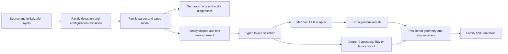

# Mermaid 12 Alignment - Plan

## Goal Capsule

Make Merman a source-backed, pure Rust headless implementation of Mermaid 12.0.0's diagram semantics, default appearance, and exposed layout behavior. A normal installation includes ELK; consumers can still select a documented build without its EPL-licensed dependency closure. Completion requires working behavior across the supported product surfaces, not just updated version labels or refreshed snapshots.

This plan follows the maintainer's September 20 discussion: investigate first, prepare the plan, then use a goal for implementation. Planning does not authorize publishing releases or weakening parity gates.

Release target: `v0.8.0-alpha.7`. The published baseline is `v0.8.0-alpha.6`; the target includes both the unreleased changes already on `main` and this Mermaid 12.0.0 alignment. Version projections, changelog coverage, and final release comparison must use that full scope. Independently versioned support packages retain their own release decisions.

## Product Contract

### Summary

Users should be able to take a Mermaid 12 diagram, parse or edit it through Merman, and render it with the same configuration meaning and structural output. The ordinary build follows upstream's ELK defaults and family appearance defaults. Explicit classic appearance and Dagre remain available. The implementation stays native Rust; JavaScript is only a development/reference dependency.

### Problem Frame

The selected bundle currently targets Mermaid 11.17.2, while several implementation assumptions come from earlier releases. Mermaid 12 changes configuration precedence, bundles ELK in its standard build, adds layout choices and two diagram families, and changes geometry and themes. Updating the version and making ELK the default would expose real gaps: hard-coded family backends, a layered-only ELK adapter, unsupported layer assignment strategies, and a reference generator that forces the old theme.

The checked-out reference is now `mermaid@12.0.0`, commit `98a0945418c76238f15df2afaddbba4272656c3b`. The authoritative Merman bundle still records 11.17.2, commit `dcb694ddb58dc5ad3502e7e903cac05fd812eac3`. No implementation or generated baseline was changed during investigation.

### Requirements

| ID | Observable requirement |
|---|---|
| R1 | Select one reproducible Mermaid 12.0.0 behavior graph, with exact source/package identities, companion roles, and genuine target-generated fixtures. Distinguish upstream lock versions, compatible candidates, and unrelated latest releases. |
| R2 | Resolve theme, look, and layout with upstream's source/initialize/family/global precedence, including scoped overrides and invalid values. An absent theme is different from an explicit `theme: default`. |
| R3 | Ordinary facade, CLI, and Rustdoc builds include ELK. Existing explicit lean feature selections remain possible and have a documented layout fallback and license closure. Lower-level transport crates retain explicit feature composition. |
| R4 | Match the target's reachable layered ELK behavior: presets, explicit overrides, supported layering strategies, grouping, ports, container algorithms, edge routing, and Mermaid postprocessing. |
| R5 | Implement the additional root algorithms registered by Mermaid 12 and its supported container algorithm choices. An accepted option must affect real layout; no metadata-only support or substitute algorithm may pass as parity. |
| R6 | Support Agentflow and Usecase from detection through native parsing, typed models, semantic facts, diagnostics, layout, SVG, and public capability reporting. Preserve upstream syntax and acceptance/error behavior. |
| R7 | Bring existing families' changed syntax, defaults, appearance, shape sizing, colors, and SVG structure into source-backed alignment. Existing explicitly selected Dagre/classic behavior remains functional under the new release. |
| R8 | Expose the new syntax and semantics consistently to editor APIs, Tree-sitter, the playground, and existing language/binding surfaces without giving Tree-sitter ownership of semantic analysis. |
| R9 | Keep ELK-derived algorithms inside an explicit EPL-2.0 source boundary. Ship accurate notices, license texts, source attribution and distribution instructions for each actual artifact closure. Do not represent translated ELK code as workspace MIT/Apache code. |
| R10 | Preserve deterministic seeds, operation cancellation, work limits, bounded memory growth and useful errors through every new layout path. |
| R11 | Admit changed behavior with focused semantic/layout/DOM evidence. Browser text measurement, HTML labels, fonts and RoughJS remain documented residuals unless a robust source-backed correction exists. |
| R12 | Remove superseded internal designs where they obstruct correctness. Keep tooling limited to package selection, projections, fixture execution and comparisons; do not build a compiler-like verifier or a general plugin framework for this upgrade. |

### Scope Boundaries

The scope is the behavior reachable through the pinned Mermaid release and admitted companions, not the complete Eclipse ELK API. It includes all six additional registered root algorithms and the target's container algorithm set. It does not include arbitrary newer ELK options, a blanket Dagre upgrade, production JavaScript execution, an independent redesign of every binding, or forced pixel equality. New families use the existing honest ASCII fallback unless an existing generic representation already handles them.

## Planning Contract

### Evidence and Version Selection

Research used the pinned source, the existing bundle and selection machinery, three family/layout/render audits, and official registry metadata inspected on September 20. Registry candidates must be confirmed once when the implementation admits the target, since registry state can advance.

| Component | Target evidence and selection treatment |
|---|---|
| Mermaid | 12.0.0 at the commit above; core owns the built-in ELK registration. |
| ELK | Mermaid requests `elkjs ^0.9.3` and its lock resolves 0.9.3. Select this behavior source; 0.12.0 is outside that range. Record the corresponding Eclipse ELK source revision before translating missing algorithms. |
| Standalone layout-elk | 1.0.0 supports Mermaid 12, but standard Mermaid no longer needs the external registration. Retain a separate companion role only if the selected tiny-reference profile actually uses it. |
| Tidy tree | The observed compatible plugin is 1.0.1; its layout engine remains 2.0.2. Admit exact identities through the existing selection process. |
| ZenUML | Observed compatible adapter 1.0.1; selected core 3.50.1 is compatible. Latest core 4.3.0 is a different compatibility decision. |
| Dagre / Graphlib | Keep Mermaid's actual `dagre-d3-es` behavior and distinguish it from the standalone Rust port baseline. Latest packages are not evidence of target compatibility. |
| Sanitization | Audit `@braintree/sanitize-url` 7.1.2 and DOMPurify behavior; distinguish Mermaid's lock from the current selected patch. Do not downgrade an admitted patch just to copy a lockfile. |
| Cytoscape | Mermaid locks 3.34.0; 3.34.3 is a compatible candidate requiring scoped evidence. CoSE-Bilkent and fCoSE remain separate components. |
| Parser | Package 2.0.0 mostly changes package/engine metadata. Agentflow and Usecase live in Mermaid core and still need implementations. |
| Reference CLI | The observed CLI 11.17.0 still declares Mermaid 11. Do not assume an override proves Mermaid 12 compatibility. Use the bounded runner decision in KTD7. |

Primary external references: [Mermaid 12 release](https://github.com/mermaid-js/mermaid/releases/tag/mermaid%4012.0.0), [official Mermaid package metadata](https://registry.npmjs.org/mermaid/12.0.0), [official ELK package metadata](https://registry.npmjs.org/elkjs/0.9.3).

Repository constraints applied here: [family ownership](../adr/0073-family-owned-diagram-architecture.md), [capability-driven package surfaces](../adr/0076-capability-driven-feature-and-package-surfaces.md), [Tree-sitter's language boundary](../adr/0083-tree-sitter-language-boundary.md), [highlighting ownership](../adr/0084-tree-sitter-highlighting-ownership.md), [ELK feature closure](../adr/0085-explicit-elk-feature-closure.md), and [lean Rustdoc defaults](../adr/0088-lean-rustdoc-default-features.md). The last two retain their license/optional-feature rationale while KTD3 replaces their conflicting default selections.

### Key Technical Decisions

KTD1. Target behavior, not generic backend substitution. Keep diagram domain models family-specific. Extract a measured layout graph where the ELK adapter actually needs shared nodes, labels, ports, hierarchy, and edges. Replace the Class path that first constructs Dugong geometry before converting to ELK. Use a small typed internal layout selection and dispatch layer, not a dynamic provider framework. Each family advertises only the paths the target uses.

KTD2. Preserve configuration provenance until appearance resolution. Resolve source settings, initialization deltas, family defaults, and global defaults in the target's order. Derive theme variables from raw user variables after selecting the family theme; do not merge already-derived theme output as user input. Cache only values whose inputs are complete. Remove obsolete detector renderer-selection mechanisms while preserving syntax aliases that upstream still accepts. Public compatibility shims belong at the API boundary only where a documented public contract needs them.

KTD3. Default ELK with positive optional features. `session-settled: user-approved` — the maintainer accepted including ELK by default with explicit license and feature treatment; leaving ELK opt-in for ordinary products is rejected. Set facade defaults to the existing `complete-svg-elk`; preserve the existing `complete-svg` membership as an explicit lean aggregate. Add ELK to CLI and Rustdoc defaults, retaining Rustdoc's opt-in math. Keep lower-level renderer/FFI/WASM crates' empty defaults and select features through artifact recipes. Document the aggregate names rather than multiplying feature aliases. Supersede only the conflicting default decisions in ADRs 0085/0088.

KTD4. Resolve missing layout capability at one boundary. Follow standard Mermaid 12 in full builds and the target's tiny-build fallback when a backend is unregistered in an explicit lean build. An unavailable ELK request falls back to Dagre only where the upstream family/loader path does so; an unknown layout follows that same source-backed lookup behavior. Record requested and resolved layouts in the existing facts/diagnostic path where useful. Do not reinterpret an execution failure, cancellation, invalid graph, or work-budget exhaustion as permission to try another backend. Do not apply layout fallback to unrelated missing capabilities such as math.

KTD5. Keep an accurate EPL boundary as algorithm scope grows. Retain `merman-elk-layered` for its existing layered kernel. Introduce a sibling EPL crate for the additional algorithms if their independent source module boundary warrants it; keep the adapter independent of algorithm licensing declarations. Share existing algorithm utilities within the EPL boundary only when there is an actual second consumer. The source revision, translated file coverage and modifications must be traceable. `docs/release/THIRD_PARTY_COMPONENTS.json` and `capabilities/artifact-profiles-v1.json` remain the notice/closure authorities. This is source and distribution bookkeeping, not a new automated legal-analysis system.

KTD6. Implement the selected algorithms, with bounded ports. Root `elk` maps to layered. Root alternatives are `elk.stress`, `elk.force`, `elk.mrtree`, `elk.sporeOverlap`, `elk.box`, and `elk.rectpacking`; do not register root `elk.layered` or `elk.radial` merely because the kernel supports them. Container selection has its own allowlist, including radial where supported by the target. Implement all seven exposed layered strategies: NETWORK_SIMPLEX, LONGEST_PATH, LONGEST_PATH_SOURCE, COFFMAN_GRAHAM, MIN_WIDTH, STRETCH_WIDTH, INTERACTIVE. Use the existing operation control and seed contract in every kernel. Do not use Manatee's force algorithm as an implementation of ELK force.

KTD7. Reuse and correct the reference pipeline before refreshing fixtures. First make the existing scripted Puppeteer renderer express absent versus explicit configuration and validate a small target sample. Exercise CLI compatibility once; if its declared Mermaid 11 dependency is incompatible, converge the existing generator on the scripted renderer rather than adding a third runner. Registry extraction may use the pinned algorithm constant list plus a small registration probe/source fingerprint; no general TypeScript evaluator and no assumed public layout-enumeration API. Standard Mermaid 12 must not load the old external ELK plugin.

KTD8. Refactor decisively within demonstrated boundaries. `session-settled: user-directed` — prefer the correct model and remove obsolete paths; patch-only fixes that preserve a wrong design are rejected. This does not authorize speculative abstraction. Share geometry or palette code only when semantics match; preserve family-specific color-index allocation and model semantics. New diagnostics extend existing facts narrowly instead of introducing a second diagnostic system.

### High-Level Technical Design

The graph above expresses ownership, not a mandatory new object at every arrow. Semantic parsing remains available without layout features. The adapter owns Mermaid options and geometry conversion; algorithm crates own ELK behavior; SVG emitters own DOM and paint.

Each family performs one semantic construction and projects its typed model, compatibility JSON, editor facts, recovery information and diagnostics from that result. The existing family catalog remains the registration authority. Layout stays synchronous and runtime-neutral, with operation inputs frozen once; cancellation or resource exhaustion must not return partial SVG.

The following selection table describes behavior rather than prescribing a new public API:

| State at resolution | Outcome |
|---|---|
| Valid scoped appearance in the current layer | Select it before that layer's global appearance |
| Invalid scoped theme/look | Try that layer's global value, then the next layer |
| No user appearance value | Select the family default, then the global default |
| Requested layout is registered for the family path | Execute that backend |
| Layout is unregistered and upstream permits lookup fallback | Select the registered family fallback, then Dagre |
| Backend selected but execution fails | Propagate the error; do not restart with a different algorithm |

### Product and Compatibility Effects

Defaults visibly change: most affected families use redux-color/neo, global layout becomes ELK, and Mindmap retains its family default unless explicitly overridden. Swimlane keeps its family layout. Existing callers that explicitly request classic appearance remain explicit overrides. The playground needs an automatic/default state distinct from explicitly choosing the classic `default` theme.

Use the existing facade-to-language bridge path for new families. Extend catalogs, serialization, generated declarations and diagnostics where needed; avoid parallel API implementations. Preserve stable C ABI layouts and ownership contracts. If an existing public representation cannot carry new facts, use the established additive/versioned mechanism instead of changing an ABI struct in place.

Most packaged native/web artifacts already enable ELK. Their recipes and notices need closure review, not redundant new build variants. Artifact size is still a risk because new algorithms add code: measure affected profiles against `docs/release/WASM_SIZE_BUDGETS.json`; do not silently raise budgets.

### Transition and Execution Order

Work on an implementation branch and preserve unrelated edits. U1 produces an isolated target reference workspace and family-local target output using existing local path/CLI options where possible. Keep that temporary output outside the accepted baseline directories. Do not publish a second permanent bundle or relabel 11.x bytes as 12.x. The selected production bundle is promoted in U15 after its consumers can use it coherently. A narrow target-input option is acceptable if the current generator cannot stage output; it must not grow into a second selection system.

U2 and algorithm work can proceed against source and local oracle evidence. Switch product defaults only after the default path works. New algorithms do not have to land in one enormous commit, but partial progress is not full Mermaid 12 admission. Use focused commits at coherent boundaries; do not publish intermediate claims of complete parity.

### Implementation-Time Decisions

No product decision blocks starting implementation. Resolve the following bounded technical questions in their owning units: the exact Eclipse ELK revision corresponding to elkjs 0.9.3 (U1), CLI override compatibility (U1), whether new algorithm modules warrant one sibling EPL crate (U6), and any public schema extension required for structured Agentflow diagnostics (U11). These are implementation tasks with explicit acceptance outcomes, not permission to change scope. Stop and report if evidence requires dropping a required algorithm, weakening a gate, or changing the agreed product contract.

## Implementation Units

New file paths below are proposed ownership locations; existing test harnesses should absorb scenarios when they already cover the boundary. Unit IDs remain stable if work is split later.

| Unit | Boundary | Main paths | Dependencies |
|---|---|---|---|
| U1 | Target reference acquisition and runner | `tools/upstreams/`, `crates/xtask/src/cmd/mermaid_reference.rs`, `generate.rs` | None |
| U2 | Configuration and detection | `crates/merman-core/src/` | U1 |
| U3 | Measured graph and dispatch | `crates/merman-render/src/`, `crates/merman-layout-elk/src/` | U2 |
| U4 | Layer assignment algorithms | `crates/merman-elk-layered/src/` | U1 |
| U5 | Layered adapter and postprocessing | `crates/merman-layout-elk/src/`, renderer family adapters | U3, U4 |
| U6 | Additional ELK engine boundary and graph algorithms | proposed `crates/merman-elk-algorithms/` | U1, U3 |
| U7 | ELK packing and overlap algorithms | proposed `crates/merman-elk-algorithms/src/` | U6 |
| U8 | Mixed container integration | adapter and renderer ELK paths | U5, U6, U7 |
| U9 | Shared measurement, theme and geometry | core themes and renderer shapes/geometry | U2, U3 |
| U10 | Existing diagram family convergence | core diagrams and renderer family modules | U5, U8, U9 |
| U11 | Agentflow end to end | proposed core/render Agentflow modules | U2, U8, U9 |
| U12 | Usecase end to end | proposed core/render Usecase modules | U2, U8, U9 |
| U13 | Editor, playground and binding exposure | editor APIs, Tree-sitter, playground, catalogs | U10, U11, U12 |
| U14 | Product features and license materials | product manifests, profiles, legal materials | U8, U10, U11, U12 |
| U15 | Bundle admission and release-facing integration | upstream bundle, fixture manifests, docs, affected distributions | U1–U14 |

### U1. Establish a truthful Mermaid 12 reference path

Goal: R1/R11/R12; implement KTD7 before using generated output as evidence.

Files: `tools/upstreams/MERMAID_REFERENCE_BUNDLE.json` and `MERMAID_SELECTION_DECISION.json` as eventual promotion inputs; `tools/upstreams/REPOS.lock.json`; `tools/mermaid-cli/package.json`; `crates/xtask/src/cmd/mermaid_reference.rs`; `crates/xtask/src/cmd/generate.rs`; existing registry/projection tests in that module.

Approach: acquire exact target/companion sources in the staging workspace, record the ELK source mapping, run the official package authenticity admission once, and correct both generator configuration paths. Model built-in versus external layout ownership explicitly. Use a short default/explicit-Dagre/new-family sample to choose the existing runner path. Leave active bundle promotion to U15.

Scenarios and verification: absent theme differs from explicit classic; built-in ELK aliases are complete and unique; standard runtime does not load external ELK; one default diagram reaches actual ELK; recorded package integrity and source refs reproduce the oracle. No bulk snapshot refresh until these pass.

### U2. Resolve release configuration before deriving appearance

Goal: R2/R7/R12; dependencies: U1; decisions: KTD2.

Files: `crates/merman-core/src/lib.rs`, `parse_pipeline.rs`, `family.rs`, `detect/mod.rs`, `config/`, `theme.rs`, generated configuration/theme data; `crates/merman-core/tests/source_presentation.rs`; `crates/merman-render/tests/theme_resolution_svg_test.rs`.

Approach: retain initialization deltas and raw source values through family detection; replace old renderer-based detection effects; update source-backed defaults and theme derivation. Keep secure filtering and source-position remapping intact. Audit affected configuration/schema data rather than only theme/look/layout constants.

Scenarios and verification: source scoped/global versus initialization scoped/global; family default versus absent settings; invalid scoped theme/look; the string sentinel `theme: "null"` separately from a null-valued setting; explicit variable override; two differently configured operations sharing an engine without stale cached theme state; accepted syntax aliases still detect correctly. Use a compact precedence table rather than all combinations of every theme and family.

### U3. Separate measured family graphs from layout dispatch

Goal: R3/R4/R10/R12; dependencies: U2; decisions: KTD1/KTD4.

Files: `crates/merman-render/src/lib.rs`, `layout_work.rs`, family layout modules, `presentation/profile.rs`; `crates/merman-layout-elk/src/model.rs`; `crates/merman-render/tests/flowchart_layout_test.rs`, `state_layout_test.rs`, `typed_family_api_test.rs`; proposed focused layout-selection tests.

Approach: make requested/resolved backend identity explicit and centralize family-aware availability resolution. Feed ELK measured nodes and labels without constructing a Dugong layout first. Carry hierarchy, ports, options, seed and operation control across the adapter boundary. Remove duplicated string-selection logic and stale presentation-profile renderer keys.

Scenarios and verification: standard default ELK, explicit Dagre, default Mindmap, supported lean fallback, unknown layout, and backend failure after successful resolution. Cancellation and resource failure must propagate without fallback. Preserve typed family output contracts.

### U4. Complete the exposed layered strategies

Goal: R4/R10; dependencies: U1; decision: KTD6.

Files: `crates/merman-elk-layered/src/p2layers.rs`, `pipeline.rs`, `options.rs`, `configurator.rs`, and new strategy modules; `crates/merman-elk-layered/tests/execution_boundary.rs`; proposed strategy behavior tests alongside those modules.

Approach: port the six missing layer-assignment strategies from the selected ELK source, including their required processors. Implement Coffman-Graham's layer bound and Interactive's positional inputs as exposed by the adapter. Keep unsupported internal ELK processors outside the claimed scope.

Scenarios and verification: small distinguishing graphs for each strategy, cycles/disconnected nodes, layer-bound behavior, empty/single-node cases, deterministic ordering and bounded work. Compare source/oracle layer or position outcomes; checking that an enum no longer errors is insufficient.

### U5. Match layered adapter defaults and edge postprocessing

Goal: R4/R7/R10; dependencies: U3/U4.

Files: `crates/merman-layout-elk/src/lib.rs`, `model.rs`; renderer `flowchart/elk.rs`, `class.rs`, `er.rs`; existing family layout tests and focused adapter tests.

Approach: centralize Mermaid preset mapping and explicit option overrides. Match the default NETWORK_SIMPLEX/BRANDES_KOEPF/BALANCED/DEPTH_FIRST combination, preserving explicit NONE where valid. Port source-backed spacing, ports, group padding, frame equalization, terminal-jog straightening and `straightenEdges` behavior. Keep routing output separate from final paint.

Scenarios and verification: each preset with one override, nested groups, self edges, group endpoints, labels, straightening enabled/disabled and stable order. Assert adapter semantics and representative SVG geometry, without magic-number fitting to unrelated fixtures.

### U6. Add ELK graph algorithms within the license boundary

Goal: R5/R9/R10; dependencies: U1/U3; decisions: KTD5/KTD6.

Files: proposed `crates/merman-elk-algorithms/{Cargo.toml,README.md,src/,tests/}` with EPL license materials; adapter dispatch and workspace membership. Retain a clearer existing source boundary instead if inspection justifies it, and document that choice.

Approach: port stress, force, mrtree, and the target's container radial algorithm from the selected ELK source. Limit utilities and options to reachable behavior. Share operation work/seed plumbing with the existing kernel without introducing a second budget system. Keep root registration separate from container availability.

Scenarios and verification: each algorithm on empty, simple, disconnected and cyclic inputs where allowed; algorithm-specific fixed/positional inputs when reachable; cancellation during iterative work; reproducible seed and finite geometry. Oracle comparisons must distinguish these algorithms from superficially similar existing engines.

### U7. Add ELK packing and overlap behavior

Goal: R5/R9/R10; dependency: U6.

Files: the EPL algorithm boundary selected in U6, proposed packing/overlap modules and focused tests; adapter algorithm mapping.

Approach: implement box, rectpacking and sporeOverlap using selected source semantics, including their input positions, dimensions and component treatment. Keep packing layout separate from graph edge-routing assumptions.

Scenarios and verification: varied rectangle sizes, already separated versus overlapping rectangles, deterministic ties, zero/single-item input and unsupported input diagnostics. Compare placement/bounds with the oracle and check work controls on the real loops.

### U8. Integrate mixed algorithms and compound graphs

Goal: R4/R5/R10; dependencies: U5/U6/U7.

Files: `crates/merman-layout-elk/src/{model.rs,lib.rs}`, renderer ELK graph construction and family layout tests; proposed compound-algorithm fixtures.

Approach: support root and per-container algorithm identity, the upstream container allowlist and SEPARATE_CHILDREN treatment. When edges cross a boundary, mirror upstream's override removal and algorithm-option cleanup. Apply child layout, translation, group sizing and final bounds in the source order.

Scenarios and verification: layered parent/packing child, radial child, multiple nested algorithms, crossing edges that disable an override, wrapped/unwrapped group labels and repeated seeded renders. Admit no advertised container option until it runs through the complete geometry path.

### U9. Align measured appearance and shared geometry

Goal: R2/R7/R11; dependencies: U2/U3; decision: KTD8.

Files: `crates/merman-core/src/theme.rs` and generated theme data; renderer shape/text helpers; `svg/parity/flowchart/edge_geom/intersect.rs`; `svg/parity/flowchart/swimlane/line_hops.rs`; `crates/merman-render/tests/{theme_resolution_svg_test.rs,look_svg_test.rs,flowchart_svg_label_measurement_contract_test.rs}`.

Approach: apply min-node-width and wrapping during measurement, with upstream exemptions. Update theme dependency relationships, color palette emission and neo definitions. Remove obsolete half-pixel geometry offsets where the upstream removed them. Port shared line-hop radius/bend/overlap rules and include painted extents in bounds.

Scenarios and verification: empty versus ordinary labels, explicit widths, HTML/SVG labels, palette overrides, valid defs references, near-bend crossings and bounds. Preserve honest browser-measurement residuals.

### U10. Converge existing diagram families

Goal: R4/R7/R11; dependencies: U5/U8/U9.

Files: `crates/merman-core/src/diagrams/` and sanitization; renderer Flowchart, Class, ER, State, Requirement, Mindmap, Sequence and changed shape modules; existing family `*_svg_test.rs` and layout tests; `crates/merman-core/tests/snapshots.rs`.

Approach: route each affected family through its actual target layout behavior. Add family-specific color-index allocation. Update Sequence actor bands/appearance and affected shape sizing. Port C4 named-attribute typing, accepted break-tag changes, and audited Flowchart lexer/whitespace changes. Inspect the full 11.17.2-to-12.0.0 source delta for remaining registered families; fold real changes into their owning modules rather than treating the named examples as exhaustive.

Scenarios and verification: one default and one explicit legacy-appearance case per changed family, declaration-order colors, state nesting/concurrency, sequence actor bands, C4 attribute/error cases, line breaks and whitespace. Family-local evidence precedes main-matrix refresh.

### U11. Implement Agentflow as a complete family

Goal: R6/R10/R11; dependencies: U2/U8/U9.

Files: new Agentflow parser/model and renderer modules under existing family roots; `family.rs`, diagram registration and `parse_pipeline.rs`; `crates/merman-core/tests/editor_semantic_facts.rs`; proposed `agentflow_svg_test.rs` and family fixtures.

Approach: implement the `agentflow-beta` header and native domain semantics for nodes, tasks/tools/actions, containers, metadata, attachments, reference/failure edges and collapse behavior. Extend shared semantic warning/fact output only for actual structured severity/target needs. Preserve real source diagnostics and acceptance rules; a reserved diagnostic code is not a mandate to reject more input.

Scenarios and verification: representative source examples, unsupported/removed shapes and containment errors, unknown metadata acceptance, edge roles, nested groups/collapse, duplicate/implicit declarations according to upstream, and source spans across BOM/CRLF/frontmatter/comments/UTF-16 conversion. Diagnostics reset between operations and exist without rendering.

### U12. Implement Usecase as a complete family

Goal: R6/R10/R11; dependencies: U2/U8/U9.

Files: new Usecase parser/model and renderer modules; shared registration and fact projection; proposed `usecase_svg_test.rs`, parser fixtures and semantic-fact tests.

Approach: implement `usecase-beta`, actors, use cases, boundaries, include/extend/generalization, notes, JSON tables, stereotypes, styles and business variants. Match implicit use-case creation for unknown endpoints, first-source ordering and late metadata validation. Reuse existing parsing infrastructure where appropriate without forcing Agentflow's domain onto Usecase.

Scenarios and verification: explicit/implicit endpoints, nested boundaries, stereotype/style combinations, business shapes, malformed metadata and accurate spans. Compare both semantic models and target SVG structure.

### U13. Expose release behavior through editors and bindings

Goal: R2/R6/R8; dependencies: U10/U11/U12.

Files: existing capability/catalog definitions and their generated consumers; `crates/merman-bindings-core/`, `crates/merman-ffi/`, `crates/merman-uniffi/`, `crates/merman-wasm/` and affected language adapters; `platforms/web/`; `distribution/tree-sitter-mermaid/{grammar.js,queries/,test/corpus/,metadata/}`; `playground/src/lib/mermaid-config.ts`; runtime `mermaid-requirements.ts`, `external-module-registrar.ts` and their tests; existing editor and binding contract tests.

Approach: propagate new families, facts and completion/config metadata through the shared Rust APIs. Admit editor capabilities from actual parser-backed facts rather than treating family registration as proof of every LSP capability. Add structured grammar/query/corpus coverage, not generic-body fallback, and regenerate native/WASM Tree-sitter artifacts under its independently versioned provenance. Make automatic appearance distinct from explicit classic selection. Remove ordinary runtime external ELK loading while preserving Tidy/ZenUML registration. Follow existing additive ABI/serialization conventions.

Scenarios and verification: editor facts/diagnostics agree with semantic parsing, grammar recovery and queries cover new constructs, playground automatic/explicit theme round trips, built-in ELK loads without the external package, and representative existing language adapters carry new family results. Do not duplicate every family test in every binding.

The public surfaces are explicit delivery requirements, not documentation-only projections:

- FFI: carry the new families, layout/config behavior, capability catalogs, diagnostics and operation errors through the shared binding service. Preserve C ABI layouts, handle/buffer ownership and release contracts; update generated headers or declarations only when their authority changes. Exercise the existing C consumer and representative UniFFI boundary contracts, including an operation failure without partial successful output.
- Web WASM: update the Rust WASM bridge and affected `platforms/web/` packages, generated JavaScript/TypeScript declarations, runtime catalogs and artifact recipes. Verify the actual built WASM through the existing web loader/worker boundary with a default ELK graph and both new families; check error/diagnostic propagation, enabled capabilities and the declared lean fallback. Preserve cancellation and work limits through the existing operation contract. U14 owns notices and U15 owns affected export/size checks.
- Web Playground: update the Mermaid reference dependency and admitted companions together, the automatic/classic appearance controls, supported layout choices, family examples, editor syntax/diagnostics and runtime capability presentation. Build against the updated local web package and Tree-sitter artifacts, run the existing distribution verification, and use a focused browser smoke for default ELK, explicit legacy appearance and the new families. Testing only mocked runtime functions does not establish that the shipped playground loads the updated WASM.

### U14. Apply product defaults and regenerate license closures

Goal: R3/R9; dependencies: U8/U10/U11/U12; decisions: KTD3/KTD5.

Files: facade/CLI/Rustdoc manifests; `crates/xtask/src/cmd/feature_matrix.rs`; `capabilities/artifact-profiles-v1.json`; `docs/release/THIRD_PARTY_COMPONENTS.json`; generated notices and license bundles; feature/package docs; successor ADR referencing 0085/0088; `scripts/test_cli_installation_contract.py` and existing legal-material tests.

Approach: change ordinary product defaults only now that their default render path works. Preserve explicit no-ELK recipes, verify their actual dependency closure, and document fallback versus full parity. Regenerate canonical notices and package copies from existing tooling. Include new algorithm source coverage and source-distribution instructions; do not change the workspace-wide license to disguise mixed-license components.

Scenarios and verification: normal facade/CLI/Rustdoc render a default graph; explicit lean profile excludes EPL algorithms and renders via the declared fallback; Rustdoc still does not pull math by default; enabled profiles ship the required license and source attribution. Reuse existing feature/CLI/license contracts rather than adding a second verifier.

### U15. Admit the bundle and verify affected release surfaces

Goal: R1/R8/R9/R11/R12; dependencies: U1–U14.

Files: upstream bundle/decision/lock projections; target-generated semantic/layout/SVG fixtures and manifests; `playground/src/generated/mermaid-reference.ts`; `docs/FEATURES.md`, `docs/release/PACKAGE_SURFACES.md`, upgrade playbook and affected compatibility/performance docs.

Approach: promote one coherent selected graph, regenerate projections and changed defaults, and admit family-local results into the existing main matrix. Keep historical Cypress corpus provenance; import target fixtures without pretending old bytes were generated by v12. Refresh DOM-id assertions from actual target output. Run the integrated gates below once, fix concrete failures and repeat only affected checks. Measure changed artifact size/representative render cost, and document accepted residuals and breaking defaults in release-facing material.

Golden fixtures are part of this upgrade. Inventory the existing semantic/model snapshots, layout goldens, upstream SVGs, theme/config oracles, binding/editor contract fixtures and playground examples against their owning generators. Regenerate affected reference expectations from the pinned Mermaid 12 runtime and selected companions; regenerate Merman-owned snapshots only after the corresponding source-backed behavior is implemented. Include Agentflow/Usecase and distinguishing new layout cases. Review changes by family and cause (default/theme, semantics, geometry or DOM), with targeted assertions for meaningful behavior. Preserve explicitly historical fixture provenance and explicit classic/Dagre regression coverage. Refresh manifests, digests, render-context metadata and admitted residual catalogs through their existing owners; never bulk-accept current Merman output as proof of upstream parity or loosen a comparator to make a refresh pass.

Scenarios and verification: a clean consumer can reproduce the selected reference identities, supported families/configurations render on the target baseline, all declared capabilities are real, generated files match their authority, legal materials match actual artifacts, and no required behavior remains hidden behind a skipped fixture or a weakened comparator.

## Verification Contract

Use existing harnesses and nextest for Rust. The implementation run selects concrete filters from the named test owners; this plan does not create a new validation framework.

| Evidence owner | Required outcome | Execution bound |
|---|---|---|
| U1 reference | Authentic exact packages/source and a runner that preserves default semantics | One admission and small runner sample; recheck only changed inputs |
| U2–U3 configuration/dispatch | Correct precedence, actual selected backend, truthful lean fallback and propagated failures | A representative precedence/availability table |
| U4–U8 layout | Every exposed algorithm/strategy has distinguishing oracle evidence; compound integration and controls work | Focused kernel and adapter tests, then representative family cases |
| U9–U12 families | Model, diagnostics, measured geometry and DOM converge for changed behavior | Family-local nextest and fixture comparisons before matrix admission |
| U13 editor/bindings | Shared semantic facts, syntax artifacts, FFI contracts, built Web WASM and Playground behavior agree | Existing editor/Tree-sitter/binding/web tests, actual WASM consumer smoke and focused built-playground browser cases |
| U14 packaging | Feature closures and legal materials describe the shipped artifacts | Existing feature matrix, CLI contract and license generation/check scripts |
| U15 integration | One admitted graph, authentic refreshed goldens, no stale projection or provenance, required parity gates pass | Family-scoped golden review and repository-mandated integrated checks once; targeted reruns after fixes |

Run Cargo workloads serially by default and reuse `target`. Use `cargo fmt --check` and scoped nextest during implementation. At integration, execute the repository's required Rust/parity/editor/feature checks for the changed surfaces, plus `scripts/verify-third-party-licenses.py` and `scripts/sync-release-legal-materials.py --check` under their documented invocation. Validate generated artifacts through their existing owners. Do not run every family against every theme, algorithm and binding combination. Do not repeatedly rebuild unchanged distribution profiles merely to accumulate receipts.

Measure affected WASM/package sizes against existing budgets and a small representative default-ELK workload for runtime/work-budget regressions. A budget failure needs an explained implementation or product decision; increasing thresholds is not automatic acceptance. Numerical residuals must identify their browser/source cause and stay narrow and non-semantic. No comparator normalization may conceal a wrong algorithm, missing node/edge, theme decision, diagnostic or license closure.

## Definition of Done

- R1–R12 have their owned evidence and all implementation units are complete; optional future ELK scope is not confused with required target-reachable behavior.
- Mermaid 12 defaults and explicit overrides work across the supported families, including Agentflow and Usecase; full and lean product profiles behave as documented.
- Every advertised new root/container layout and layered strategy executes the actual selected algorithm with cancellation/work limits and reproducible seeds.
- Editor facts, Tree-sitter provenance, FFI and Web WASM contracts, the built playground and capability catalogs agree with the implemented behavior.
- The selected bundle, package graph, generated data and baseline provenance are coherent. Historical references retain their actual identities.
- EPL boundaries, notices, source attribution and feature recipes are correct for the actual distributions, and explicit no-ELK consumers have a verified dependency closure.
- Required integrated checks pass, size/performance changes and browser residuals are explained, and obsolete duplicated selection/adapter paths are removed.
- The completion report states what changed, which evidence passed and any bounded residuals. A release, PR publication or merge remains a separate action.

## Completion — September 29, 2026

U1–U15 are implemented and R1–R12 acceptance evidence is reconciled in the
[completion record](../knowledge/engineering/verification/2026-09/2026-09-29T081350Z-mermaid-12-alignment-completion-and-final-artifact-admission-92096f07dfdd4d1e85fd715cadd0f343.md).
The final 37-family admitted DOM gate, freshly rebuilt Web/Playground consumers, all
six existing WASM size budgets, and bounded default-ELK runtime controls pass.
Earlier pending parity/size entries in historical checkpoints are superseded by that
record. No budget, comparator tolerance or accepted residual receipt was relaxed for
this final admission. Publication and merge remain separate maintainer actions.
