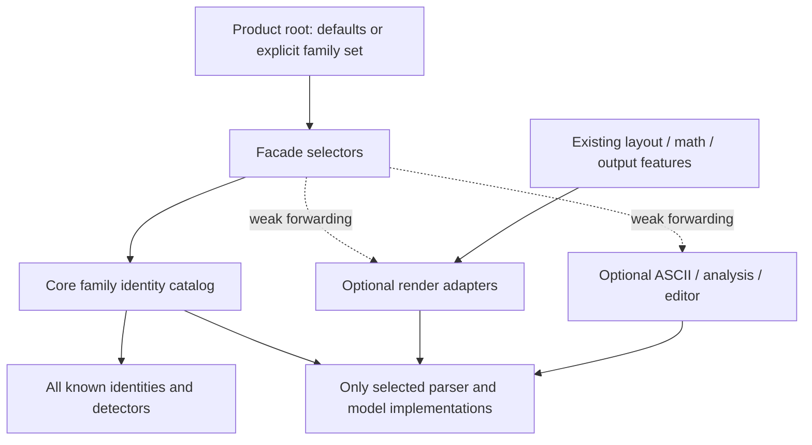
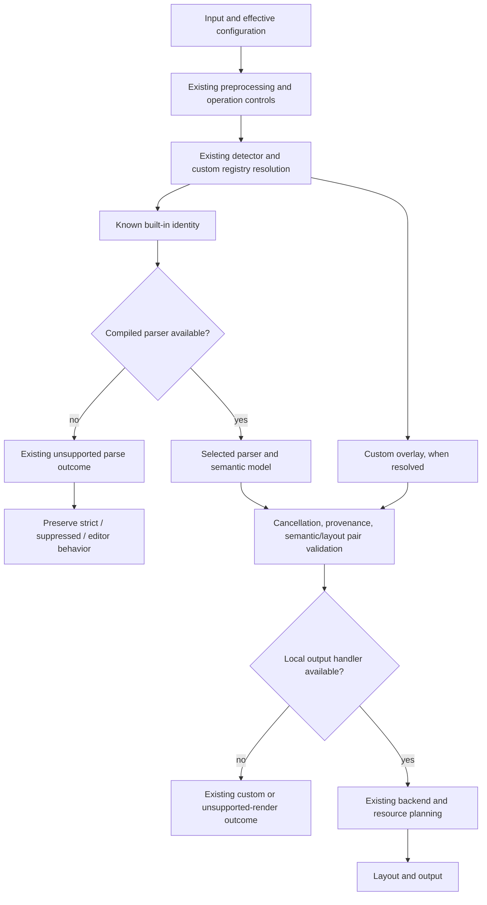

# Selectable Diagram Families - Plan

## Goal Capsule

Allow a headless Rust application to compile only the Mermaid diagram families it uses. The motivating consumer in issue #148 needs Flowchart and Gantt inside a VST Markdown plugin and currently removes other families manually. Provide an additive Cargo feature surface that removes unused implementations while preserving the selected families' semantics and the existing default product experience.

The agreed direction is per-family features inside the current crates, including `merman-core`. Existing layout, math, and output features remain independent. This plan specifies the implementation and its acceptance evidence; it does not implement changes or claim a measured size reduction.

Authority and evidence:

- Product request: GitHub issue #148 and the maintainer's agreement to investigate core feature splitting. The issue's reported 4.74 MB saving is a motivating observation, not a reproducible baseline or acceptance target.
- Repository baseline: `72c024776`; the historical capability architecture plan and ADRs are context, not an instruction to resume completed work.
- Mermaid parity baseline: version 11.17.2, commit `dcb694ddb58dc5ad3502e7e903cac05fd812eac3`, as pinned in `tools/upstreams/REPOS.lock.json` and the reference bundle.
- The local `repo-ref/mermaid` checkout is newer (12.0.0 at `69778e6e995cd72c6cb524449d8e08ee3d231628`). Consult the pinned revision for behavior; do not silently adopt checkout HEAD.

## Product Contract

### Requirements

| ID | Requirement |
| --- | --- |
| R1 | Expose positive `diagram-*` selectors for the built-in logical diagram families and `all-diagrams` as their union. Aliases select their owning family; shared code does not enable another language entry. |
| R2 | Omitted families compile out their exclusive parser, generated grammar, semantic model, layout, and output implementations. Registry filtering alone is insufficient. Shared code may remain when a selected family needs it. |
| R3 | Keep family selection orthogonal to `layout-cytoscape`, `layout-elk`, `math`, and output features. A family selector must not implicitly enable an optional layout engine or output format. |
| R4 | Preserve all-family behavior for the default facade and existing product recipes. Retain empty default feature sets on low-level crates; document explicit family selection as a migration for their direct consumers and facade users disabling defaults. |
| R5 | Selected families preserve pinned parser/model/configuration/render semantics, sanitization, resource controls, and cancellation. |
| R6 | Keep known-but-unavailable built-ins distinguishable from unknown input. Strict parsing returns the existing unsupported-diagram category; existing suppression semantics and editor diagnostics remain intact. |
| R7 | Report parser, renderer, ASCII, and editor availability truthfully for the actual consumer build, including asymmetric Cargo feature unions. |
| R8 | Preserve custom registry overlays, built-in identity reservation, configuration namespace behavior, and custom JSON behavior across feature selections. |
| R9 | Verify no-family, singleton, selected combinations, full builds, and dependency-unification cases with bounded checks and existing tooling. |
| R10 | Demonstrate a smaller final native artifact for Flowchart + Gantt than an equivalent all-family build, using controlled release settings and the same exercised API. |
| R11 | Migrate current artifact recipes and validators atomically. Do not introduce additional prebuilt product variants as part of this work. |
| R12 | Document the conditional typed Rust API, source-compatibility impact, feature-unification limits, and an exact embedding recipe. |

### Non-goals

No per-family crate split, dynamic plugin system, Mermaid baseline upgrade, parser rewrite, broad text-measurement tuning, new deployment service, or family-specific prebuilt distribution catalog. Do not reinterpret existing layout selectors. Do not replace public typed models with an erased interface to avoid conditional compilation. Independent removal of shared Flowchart/Swimlane layout algorithms is outside this change.

### Acceptance examples

- **AE1:** A fresh consumer selects SVG, Flowchart, and Gantt with defaults disabled. It parses and renders both families with unchanged supported behavior. Sequence implementations are absent and strict Sequence input is reported as a known unsupported family.
- **AE2:** A normal default facade consumer retains the current full family surface and existing output/engine defaults.
- **AE3:** A core-only Gantt consumer parses Gantt without adding rendering dependencies. A no-family core consumer still supports the intentional infrastructure surface and custom registries.
- **AE4:** For a disabled built-in, strict parsing yields `UnsupportedDiagram`; suppressed semantic/render parsing produces the existing Error diagram. Suppressed unknown-type detection yields `None`. Editor snapshots retain the original error and unavailable capability facts. Cancellation is never suppressed.
- **AE5:** A downstream dependency independently enables all core families while the local renderer selects only Flowchart. The graph compiles; attempting to render another family returns an explicit unsupported-render result, without a panic or a misleading ready plan.
- **AE6:** Selecting a family without its requested optional backend continues to produce the existing missing-engine outcome. Missing local family handlers are diagnosed before backend planning, after cancellation/provenance/pair validation.

## Planning Contract

### Scope and depth

Deep implementation plan. The change crosses public typed APIs, feature forwarding, parser ownership, multiple render consumers, artifact contracts, and release verification. Research covered core compilation boundaries, product and validator surfaces, pinned upstream behavior, institutional decisions, and end-to-end failure flows. No build or software test was run during planning.

Session-settled direction: keep the existing layout-feature design and add core-inclusive diagram selection. The details below are evidence-backed implementation decisions, rather than additional product requests.

### Key technical decisions

**KTD1 - Select families inside existing crates.** (session-settled: user-approved — chosen over redesigning layout features or splitting family crates: the maintainer approved core-inclusive family feature research while retaining existing layout selection.) Use positive features and conditional modules/adapters. Gate each family at its implementation entry points and every typed consumer. Generated grammars must be omitted from compilation when their owner is absent; users must not regenerate parsers during a normal build. Audit family-exclusive dependencies, but retain genuinely shared dependencies without claiming their removal.

**KTD2 - Keep low-level empty defaults.** Introduce `all-diagrams` in selectable crates. The facade default becomes the explicit combination of `all-diagrams` and its existing `complete-svg` recipe. `complete-svg` remains an output/engine recipe, not an implicit all-family switch. Existing executable and binding product roots explicitly request their intended full family set. This is a documented feature/API migration for direct low-level and no-default consumers.

**KTD3 - Preserve one family catalog with two projections.** Keep complete lightweight identity, alias, header, detector, and configuration-namespace facts in `merman-core/src/family.rs`. Conditionally bind implementation callbacks and availability in that same owner; do not build another registry. `supported_diagrams` and typed implementation lists describe the compiled parser set. The existing complete `diagram_family_capabilities()` catalog retains known rows, with parser/editor/render facts false when absent. A detector or header fact is not a runnable-parser promise.

**KTD4 - Separate family selectors from runtime capability IDs.** Retain the role of `capabilities/feature-surface-v1.json` as the output/API/engine capability contract. Add an explicit public-selector namespace to feature validation, owned by the family catalog, rather than creating a runtime capability for every diagram. Version the artifact-profile contract and migrate its readers together; record the expected compiled parser family set as `diagram_families`. Do not infer render or ASCII availability from that parser set.

**KTD5 - Share implementation without merging language availability.** Flowchart aliases belong to `diagram-flowchart`; Swimlane is a separate logical `diagram-swimlane` selector. Compile their required shared grammar, model, labels, styles, and existing cross-layout routes when either selector needs them. Dispatch currently permits Flowchart source with swimlane layout and Swimlane source with Dagre/ELK layout. Preserve these routes. Determine language availability from logical-family metadata, not the shared Flowchart model variant or final layout family. Apply the same ownership discipline to Mindmap's shared label-measurement helpers.

**KTD6 - Make conditional typed APIs explicit.** Conditionally compile family-exclusive public model variants and payload types, keeping infrastructure variants such as Error and CustomJson available. Shared payloads follow their actual dependency closure. Gate importing matches and adapters across dependent crates. Core may be widened by another dependency without enabling local renderer features: keep a defined unsupported fallback instead of assuming the local enum universe is exhaustive. Do not retain dummy payload types or introduce a blanket public enum redesign.

**KTD7 - Preserve pipeline ordering and error distinctions.** Resolve custom overlays according to existing registry precedence before rejecting an unavailable built-in. Keep strict/suppressed parsing behavior from AE4. A missing rendering handler is a render-stage result, not a suppressed parse error. After cancellation, provenance, and semantic/layout pair checks, reject unavailable local handlers before optional backend/math planning. Apply this to planning and preparation entry points, including raster paths; a plan must not claim readiness for a disabled family. Once a family is available, preserve the existing engine/resource error order.

**KTD8 - Forward selectors along existing dependency edges.** Concrete adapters forward family features to their semantic dependencies. Facade family selectors weak-forward into optional render/ASCII/analysis/editor dependencies so selecting a language alone does not instantiate those crates. Full-family development tools opt in at their own roots; no unconditional all-family edge may leak into a slim consumer. Cargo feature union is additive, not an exclusion mechanism.

**KTD9 - Verify declared graphs and real consumer behavior.** Extend current validators with explicit selector and forwarding rules. Use small isolated downstream fixtures to expose feature unification that workspace-wide checks hide. PR checks cover a curated matrix; the full singleton and product-recipe matrix belongs in exhaustive/release validation. Do not implement Rust name resolution or source-level proof machinery in xtask.

**KTD10 - Measure a controlled final artifact.** Compare pre-change full, candidate full, and candidate Flowchart + Gantt using the same consumer entry point, runtime-fed input, Rust toolchain, target, lock resolution, release profile, LTO, panic, stripping, engines, math, and outputs. Measure final executable or cdylib bytes, not rlib size. Serialize Cargo work and preserve each measured artifact before the next build. Acceptance requires candidate subset bytes below candidate full, plus implementation omission and parity evidence. Report the actual delta and scope; do not promise the issue's 4.74 MB result or add a new CI size budget without evidence.

### High-Level Technical Design

These sketches show ownership and observable behavior; helper names and internal function boundaries are directional.

| Consumer selection | Expected family behavior | Expected dependency behavior |
| --- | --- | --- |
| Default facade | All supported built-in families | Existing complete-SVG defaults plus explicit all-diagrams |
| Facade, no defaults, SVG + Flowchart + Gantt | Only the two selected language families parse | No unrelated optional backend enabled by selectors |
| Core, no defaults, Gantt | Gantt plus intentional infrastructure/custom facilities | No rendering crates |
| Core, no defaults, no family | Complete lightweight recognition; no built-in family parser | No family-exclusive implementation retained |
| SVG + Swimlane, no Flowchart | Swimlane language only; existing shared layout choices work | Shared Flowchart/Swimlane implementation allowed |
| Renderer Flowchart + independently widened core | Parser availability can exceed renderer availability | Missing local render handlers fail explicitly |

The public API has distinct projections; preserving these distinctions avoids turning detection into a support promise.

| Projection | Known disabled family | Enabled family | Custom overlay |
| --- | --- | --- | --- |
| Identity/detection/config namespace | Recognized | Recognized | Existing registry precedence |
| Compiled parser enumeration | Absent | Present | Existing custom registry enumeration contract |
| Complete family capability catalog | Static row; executable flags false | Row with actual implementation facts | Existing custom metadata contract |
| Actionable editor templates | Omitted | Only where currently supported | Existing custom completion contract |
| Local output plan | Unsupported handler | Existing engine/resource checks | Existing custom output behavior |

### Sequencing and rollout

U1 establishes the catalog contract. U2-U5 form one coherent feature rollout: declarations, conditional core types, render adapters, and language/output consumers must land together before a subset build is advertised. Intermediate commits can organize review, but cannot be published as a working partial selector API. U6 migrates the verification and artifact contracts; U7 supplies controlled size evidence; U8 completes the user-facing migration.

Use a feature branch and preserve unrelated work. Avoid parallel Cargo invocations unless local load clearly permits them; reuse the project target directory. Do not automatically create a worktree, publish a package, open a PR, post an issue comment, or change release versions. Release/source-compatibility handling follows the project's normal next-release policy.

### Assumptions and resolved choices

- The consumer accepts a source-level feature selection recipe and does not need a new distributed SKU.
- Existing low-level empty defaults are authoritative; maintaining their old implicit all-family behavior would defeat their new explicit selector contract. Migration is necessary and must be disclosed.
- No independent algorithm-level selector is requested for shared Flowchart/Swimlane layouts.
- No fixed percentage or byte saving can be justified before controlled implementation measurements.
- A bake-off is unnecessary: crate splitting and registry-only filtering do not satisfy the agreed boundary and omission requirement. There is no unresolved architectural choice that requires a prototype.

## Implementation Units

### U1 - Separate known-family identity from compiled implementations

**Goal:** establish one parser-owned source of identity, ownership, and availability.

**Requirements:** R1, R5-R8. **Dependencies:** none.

**Governing decisions:** KTD1, KTD3, KTD7.

**Files and surfaces:** `crates/merman-core/src/family.rs`, `crates/merman-core/src/detect/mod.rs`, `crates/merman-core/src/parse_pipeline.rs`, public catalog exports, and their existing registry/detection tests.

**Approach:** split lightweight identity/configuration facts from optional parser, typed-render, and combined-editor callbacks inside the existing catalog. Preserve ordering, alias ownership, built-in reservation, and configuration side effects. Define compiled parser enumeration separately from the complete known-family capability catalog. Keep custom overlay precedence. Avoid a second hand-maintained family list in a capability descriptor.

**Validation scenarios:** full-family output matches the existing catalog; absent parser entries retain known identities and aliases; unsupported and unknown inputs differ; custom semantic and render overlays on a disabled built-in ID resolve normally; sanitization/config namespace and cancellation behavior remain stable.

**Exit evidence:** focused catalog/registry tests and a documented projection contract that later gates can use without changing language semantics.

### U2 - Wire family selectors through the existing crate graph

**Goal:** make explicit family selections reach their implementation owners without enabling unrelated optional products.

**Requirements:** R1-R4, R9, R11-R12. **Dependencies:** U1.

**Governing decisions:** KTD1, KTD2, KTD5, KTD8.

**Files and surfaces:** workspace `Cargo.toml`; manifests for core, render, facade, ASCII, analysis, editor, export/bindings, CLI/LSP/rustdoc, native/FFI/mobile/WASM/Typst adapters, and xtask where they depend on selectable crates. The artifact-recipe migration is owned by U6. Inspect the actual dependency edges rather than adding every feature to every crate mechanically.

**Approach:** define catalog-derived logical-family selectors and `all-diagrams` unions in crates that own selectable behavior. Keep aliases within their family. Retain empty defaults in current low-level packages; make the facade default opt into all families explicitly. Weak-forward into optional dependencies; concrete adapters forward into required semantic crates. Give full-feature development tools and existing products explicit root selections. Audit dependencies for family-exclusive optionalization where the source establishes ownership.

**Validation scenarios:** core-only Gantt does not introduce render dependencies; Flowchart + Gantt does not pull unrelated families; optional facade features remain optional; default facade preserves the old surface; shared payload dependencies do not imply language admission; an isolated downstream graph can widen core without widening the renderer.

**Exit evidence:** manifest/feature graph checks, a complete logical-family/selector mapping, and identified exact product recipes for U6. Feature declarations alone are not sufficient evidence of size savings.

### U3 - Compile out unselected core parsers and typed models

**Goal:** remove exclusive semantic implementation from slim builds while preserving intentional infrastructure.

**Requirements:** R1-R2, R5-R8, R12. **Dependencies:** U1-U2; coordinate typed consumer gates with U4-U5.

**Governing decisions:** KTD1, KTD3, KTD5-KTD7.

**Files and surfaces:** `crates/merman-core/src/diagrams/mod.rs`, `crates/merman-core/src/diagram/mod.rs`, family-specific model and generated-grammar inclusion sites, `family.rs`, `editor.rs`, resource/semantic context handling, existing family tests, and a proposed focused `crates/merman-core/tests/diagram_features.rs`. Update dependent typed imports/matches alongside these gates.

**Approach:** gate module entry points, callback bindings, family-exclusive typed variants/payloads, parse contexts, sanitization/conversion arms, and parser-backed editor facts. Preserve Error, CustomJson, operation controls, preprocessing, and the static identity projection. Keep common-db/langium infrastructure only to the extent genuinely required; do not turn this into a parser rewrite. Gate or move the Flowchart-specific editor helper to its actual owner.

**Validation scenarios:** no-family core compiles with infrastructure/custom paths; every family singleton compiles; aliases behave identically; strict and suppressed disabled-family parsing follows AE4; selected parsing produces the same typed and compatibility JSON outputs as full builds; disabled implementations cannot be imported as unconditional public payloads. Include tests for shared payload closures and cancellation.

**Exit evidence:** family-exclusive modules/grammar roots are structurally gated, singleton checks pass, and a real minimal consumer proves the feature graph without workspace test-feature pollution.

### U4 - Gate layout and SVG implementations with correct shared ownership

**Goal:** remove exclusive rendering code and preserve enabled-family behavior under asymmetric feature unions.

**Requirements:** R1-R3, R5-R7, R9. **Dependencies:** U2-U3.

**Governing decisions:** KTD1, KTD5-KTD7.

**Files and surfaces:** `crates/merman-render/src/lib.rs`, `family.rs`, `model.rs`, SVG/parity modules, Flowchart/Swimlane/Mindmap shared measurement and layout code, render resources and capability planning, facade render/operation entry points, and proposed `crates/merman/tests/diagram_features.rs`. Extend existing family layout/SVG regression tests where they already own the behavior.

**Approach:** gate exclusive layouts, artifacts, rendering dispatch, and SVG emitters. Extract genuinely shared Flowchart/Mindmap label helpers only where necessary. Keep Flowchart/Swimlane cross-layout routes available under their shared implementation closure while rejecting disabled language entries by metadata. Apply local-handler availability consistently in planning, SVG preparation, layout, and raster preparation. Preserve error ordering from KTD7 and an explicit fallback for core variants made available by other dependencies.

**Validation scenarios:** compare selected-family semantic, layout, and stable SVG structure against equivalent full builds and the pinned reference; Flowchart with swimlane layout works when supported; Swimlane with Dagre/ELK follows the existing backend contracts; disabling a language cannot be bypassed by selecting its shared model/layout; widened-core cases compile and fail gracefully at unavailable output; missing engine and missing handler remain distinct. Test `svg_plan` as well as execution.

**Exit evidence:** no unconditional family imports in supported subset builds, regression parity for enabled families, and actual target-consumer tests for asymmetric unions and planning/execute agreement.

### U5 - Propagate availability to language tools and other outputs

**Goal:** make ASCII, analysis, editor, and binding surfaces agree with the implementation actually compiled.

**Requirements:** R5-R9, R12. **Dependencies:** U2-U4.

**Governing decisions:** KTD3, KTD6-KTD8.

**Files and surfaces:** `crates/merman-ascii/src`, `crates/merman-analysis/src`, `crates/merman-editor-core/src`, binding metadata/registry adapters, facade language APIs, existing feature-surface/LSP tests, and proposed `crates/merman/tests/diagram_language_features.rs`.

**Approach:** gate family-specific imports and typed dispatch without treating every parser as an equally mature editor/ASCII implementation. Retain known-family diagnostic facts. Filter actionable editor header and template suggestions using compiled semantic-parser availability; static identity recognition alone must not offer runnable disabled-family templates. Preserve custom registry paths, original errors in editor snapshots, and established non-renderable CustomJson behavior.

**Validation scenarios:** no-family editor offers no runnable built-in family templates; a singleton offers only appropriate family templates and aliases; disabled source remains recognizable and produces correct diagnostics; selected language facts and completions remain unchanged; ASCII supports only locally available adapters; analysis/editor widened-core combinations fail or degrade through their documented capability paths instead of panicking. Bindings expose consistent supported-family metadata and existing error shapes.

**Exit evidence:** focused end-to-end facade/language tests covering actual selected-family sets, plus metadata agreement across Rust and existing binding surfaces.

### U6 - Migrate feature, artifact, and CI contracts together

**Goal:** keep build recipes and public capability claims machine-checkable without growing a parallel compiler or diagram registry.

**Requirements:** R4, R7, R9, R11-R12. **Dependencies:** U1-U5.

**Governing decisions:** KTD2-KTD4, KTD8-KTD9.

**Files and surfaces:** xtask feature-matrix, artifact-profile, and capability-surface validators; `capabilities/feature-surface-v1.json`; current versioned artifact-profile descriptor and all schema readers; `scripts/artifact_profile_recipe.py` and its tests; dependency-closure/license/packaging readers; existing CI workflow definitions; proposed isolated downstream fixtures under `crates/xtask/tests/fixtures/diagram-features/`.

**Approach:** replace the old blanket rejection of diagram-specific public features with explicit catalog-owned selector validation, while keeping family selectors out of the runtime capability-ID namespace. Preserve empty-default package checks. Version the artifact profile schema and migrate every reader in the same change, recording exact expected compiled parser `diagram_families`; all existing full products opt in explicitly. Probe availability from the actual target artifact/fixture, not xtask's own all-family linked core. Keep graph rules explicit and small.

**Validation scenarios:** current product recipes still describe the intended full set; an undeclared selector/alias or invalid forwarding edge fails validation; omitted or unexpected parser families fail an exact profile probe; old/new schema handling is deliberate in every reader; a lean profile cannot pass using xtask's full registry; renderer/ASCII probes do not infer support solely from core parser presence. Run curated PR lanes and the complete singleton/recipe suite in exhaustive checks.

**Exit evidence:** feature-matrix, artifact-profile, capability-surface, script/schema checks, and applicable license/dependency-closure checks pass for the migrated contract. No stale hardcoded schema reader or implicit full-family recipe remains.

### U7 - Produce native size and parity evidence for the issue's use case

**Goal:** demonstrate that the feature architecture delivers a smaller usable embedding artifact.

**Requirements:** R2, R5, R10. **Dependencies:** U3-U6.

**Governing decisions:** KTD1, KTD10.

**Files and surfaces:** reuse an existing native measurement harness where suitable; otherwise add one bounded runtime-input consumer under proposed `tools/bench/fixtures/diagram-selection/` and a small cross-platform Python driver only if necessary. Store transient artifacts under ignored `target/`; record the reproducible results in a dated report under `docs/performance/`. Isolate the fixture from workspace feature unions.

**Approach:** use the same exported/called render API and runtime-selected input across full and subset variants, so dead-code elimination does not accidentally make the comparison meaningless. Record exact source revisions, package versions, compiler/linker/target/profile settings, features, dependency closure, final file sizes, and supported-family probes. Compare pre-change full to candidate full to identify overhead, then candidate full to candidate subset to isolate selection savings. Copy measured artifacts before serial builds overwrite outputs.

**Validation scenarios:** both variants render the same Flowchart/Gantt corpus; full supports additional families and subset rejects them with the specified outcome; no family-exclusive omitted implementation enters the subset compilation graph; final subset bytes are strictly lower than candidate full under controlled settings. If not, investigate graph/dead-code roots and do not claim the issue resolved on manifest evidence alone.

**Exit evidence:** a reproducible native artifact comparison with absolute and percentage deltas, feature/closure records, selected-family parity results, and an explicit statement that measurements do not automatically generalize to every VST/WASM/mobile target. Existing WASM tooling may provide supplementary evidence but cannot substitute for the native use case.

### U8 - Document the migration and complete the supported rollout

**Goal:** make consumers able to select families safely and make the architectural change explicit.

**Requirements:** R1-R12. **Dependencies:** U1-U7.

**Governing decisions:** KTD1-KTD10.

**Files and surfaces:** the architecture decisions currently governing family ownership and capability-driven features (ADR 0073 and ADR 0076), `docs/FEATURES.md`, capability-contract documentation, applicable crate/root READMEs and release notes, and generated dependency/license material affected by migrated recipes. Record superseding decisions in the current ADR convention; do not rewrite historical plans as though they always permitted family features.

**Approach:** explain parser/model implementation selection versus existing engines and outputs; enumerate the stable logical-family mapping and alias rules; show default/full, core-only, no-family, and Flowchart + Gantt SVG recipes. Describe conditional public model variants, weak forwarding, shared implementation closures, and Cargo feature union. Document strict/suppressed errors, custom overlays, and the difference between static recognition and executable availability. Include the measured native report and migration requirements for low-level/no-default users. Prepare a concise issue response draft in the handoff; publishing it is a separate action.

**Validation scenarios:** documented recipes compile in isolated consumers; every advertised selector resolves to an owner; examples show enough engine/output features for their input; all-family defaults match current products; release notes disclose the source-level change and make no unsupported size promises.

**Exit evidence:** reviewed migration documentation, passing declared release checks, and a source-backed issue response explaining what changed and how to reproduce the supported slim build.

## Verification Contract

Implementation verification uses the repository's existing nextest, formatting, lint, parity, feature-matrix, and artifact-profile infrastructure. Planning does not execute these checks. Each lane must record its actual feature set; a workspace-wide all-feature pass cannot substitute for a slim-consumer result.

| Lane | Owner | Required evidence |
| --- | --- | --- |
| Catalog and registry | U1/U3 | Identity/alias ordering, supported parser projection, custom overlays, built-in reservation, config effects, cancellation, strict/suppressed/unknown distinction |
| No-family and every singleton | U2/U3/U6 | Isolated compilation of core and applicable consumer adapters; deliberate infrastructure surface; family-exclusive omission |
| Full/default regression | U2-U6 | Existing default facade and product recipes, typed/compatibility JSON behavior, existing applicable nextest suites |
| Flowchart + Gantt embedding | U3/U4/U7 | Selected semantic/layout/SVG parity, disabled Sequence outcome, exact downstream dependency and family set |
| Shared-family combinations | U3-U5 | Flowchart/Swimlane language gating and cross-layout behavior; Mindmap measurement dependencies; no accidental admission |
| Asymmetric feature unions | U4-U6 | Actual isolated downstream dependencies widen core independently; renderer/ASCII/editor behavior is honest and panic-free |
| Planning and errors | U3-U5 | Plan/prepare/execute agreement, missing handler versus backend, validation ordering, suppressed parsing, resource and cancellation behavior |
| Editor/bindings | U5 | Filtered header/templates, original diagnostics, parser-backed facts, existing custom/non-renderable contracts, actual metadata |
| Contract/release checks | U6/U8 | `verify-feature-matrix`, `verify-artifact-profiles`, `verify-capability-surface`, schema/script tests, dependency/license and relevant packaging checks |
| Native artifact evidence | U7 | Controlled pre-change full / candidate full / candidate subset final bytes, graph and corpus receipt; subset smaller than candidate full |
| Rust quality/docs | U3-U8 | Scoped `cargo fmt`, applicable Clippy/doctests and nextest checks; no unrelated formatting changes |

PR coverage should include no-family core, a small parser singleton, Flowchart + Gantt SVG, the shared Flowchart/Swimlane boundary, default/full behavior, one asymmetric union consumer, and contract validation. Exhaustive/release coverage adds every singleton and exact existing product recipe. Avoid a power-set matrix and redundant repeated tests.

Parity comparison must use the pinned upstream reference and existing narrow normalization. Do not modify DOM/model semantics, normalize away differences, or introduce fixture-specific magic values to make comparisons pass. Treat established browser/font residuals according to repository policy.

## Definition of Done

- All requirements R1-R12 and acceptance examples AE1-AE6 have traceable passing implementation evidence.
- Default products preserve their family behavior; intentional low-level/no-default migration is documented.
- Omitted exclusive parser/model/layout/output code is gated at implementation ownership boundaries, not merely hidden from a registry.
- Core recognition, parser availability, local renderer/ASCII/editor capabilities, custom overlays, and error suppression agree with their documented contracts.
- Every family singleton and the bounded shared/union matrix compile; targeted semantic/layout/SVG checks retain pinned behavior.
- Existing feature/artifact/license/packaging contracts use the migrated recipes and schema consistently.
- A controlled native Flowchart + Gantt build is smaller than equivalent candidate full and produces the expected outputs. Actual measurements and limitations are published in the repository report.
- User-facing examples and migration notes are verified; no unrelated baseline upgrade, product SKU expansion, temporary feature alias, or source-analysis framework is introduced.
- No issue comment, PR, package publication, or deployment is performed merely because this plan is complete.

## Appendix

### Source map

Repository evidence used in planning:

- `crates/merman-core/src/family.rs`: identity, alias, parser/render/editor callback ownership and capability projection.
- `crates/merman-core/src/diagram/mod.rs`, `parse_pipeline.rs`, and `diagrams/mod.rs`: typed models, registration and parse outcomes, unconditional family implementation roots. Paths in this bullet after the first refer to the same crate's source tree.
- `crates/merman-render/src/family.rs`: layout/output dispatch, custom-model errors, and effective-layout routing.
- `crates/merman-editor-core/src`: completion/template and parser-backed semantic fact consumers.
- Existing workspace/package manifests and xtask feature/artifact/capability validators: empty defaults, optional forwarding, and product ownership.
- `docs/plans/2026-07-22-001-refactor-capability-driven-feature-and-distribution-architecture-plan.md`: historical capability architecture and the previous no-per-family policy.
- `docs/knowledge/engineering/2026-06-28-parser-backed-capability-matrix-gates-for-new-families.md`: parser support and language-tool maturity are different facts.
- `docs/research/2026-07-22-satteri-mermaid-npm-integration.md`: previous size research is contextual and not current native measurement evidence.
- Pinned Mermaid detector/loader registration and build configuration: dynamic imports and its tiny bundle demonstrate a different distribution mechanism; they are not a ready-made Rust selector design.

### Execution-time details

Exact helper names, the minimal shared dependency closure per family, and measured artifact deltas are determined during implementation within the boundaries above. If source evidence requires changing a session-settled direction, stop and surface that conflict rather than silently replacing the agreed architecture.
