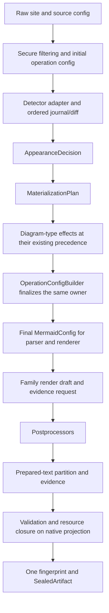

# Fearless Refactor of Theme Configuration and SVG Rendering Ownership

## Goal Capsule

**Objective:** Preserve every admitted diagram, theme, SVG, error, cancellation, resource-limit and public-consumer contract while removing avoidable repeated configuration materialization, stale artifact transitions and unnecessary evidence construction.

**Means:** Replace the current multi-owner lifecycle with an operation-scoped configuration builder and a single SVG sealing boundary, then use measured evidence to remove only work proven to be redundant. The refactor is allowed to delete obsolete intermediate states and compatibility bridges; it is not allowed to delete semantic or security guarantees. (KTD1–KTD5)

**Authority:** Existing public behavior, current Mermaid source-backed semantics, `docs/performance/BENCHMARKING.md`, `docs/performance/RUNBOOK.md`, and the current theme product contract outrank local timing improvements or historical implementation shape.

**Execution:** Implement serially in focused commits on `refactor/theme-ownership-performance`, based on the completed Mermaid 12.1 main integration at `97ed7fcb9`. The earlier `refactor/presentation-theme-model` checkout is preserved as an unqualified mixed-baseline experiment; do not use it as the performance control. Each unit must remain independently reviewable and must leave the repository buildable. No pull request is implied by this plan.

**Stop conditions:** Stop and preserve the work if a change requires family allowlists, weakens validation, changes error precedence, loses provenance, assumes detector immutability, introduces a process-global cache without a complete key and invalidation policy, or cannot be proven against an adjacent clean revision. Do not overwrite unrelated user files or existing untracked documentation.

## Execution checkpoint

The implementation lane is `refactor/theme-ownership-performance`, based on `97ed7fcb9`.
The earlier goal text names the original checkout; this isolated lane is authoritative.

- U1–U5 are implemented in `fdf302d31`, `c186ad38c`, and `8529c2a9b`; operation-isolation
  coverage and Mermaid 12.1 State snapshots are synchronized in `80246241b`.
- Detector replay preserves arbitrary replacement, same-value writes, nested operation ownership,
  cancellation, and bounded traversal storage. The final adversarial review found no remaining
  P1/P2 in the nested ownership repair.
- Verification: core 1,900/1,900; full-feature render unit tests plus Flowchart SVG, root canvas,
  and typed-family integrations 3,093/3,093 (two skipped); facade operation isolation, theme
  layering, and render operation 51/51. Formatting and diff whitespace checks pass.
- The reduced `all-diagrams`-only render run passed 4,422 and failed six existing tests whose
  expectations assume ELK while the missing feature causes Dagre fallback. All six pass with
  `layout-elk,layout-cytoscape,math`; the relevant tests and backend paths are unchanged from base.
- Three existing facade theme-coverage assertions (Flowchart/ER paint and GitGraph palette) remain
  separate baseline debt, already recorded in the embedded-font-retirement verification.
- `verify-generated`, production-feature Clippy, and targeted SVG DOM parity pass with the pinned
  local Mermaid CLI and DOMPurify dependencies. Accepted browser text-layout residuals remain.
- U6 is deferred: traversal fusion is outside the ownership repair and needs an independent
  error-order/resource experiment. U7 compiler movement is deferred: no dependency edge has
  changed, and the equal-capability CLI audit found no stripped-size change.
- U8 is closed in the [2026-10-07 confirmation report](../performance/theme_ownership_refactor_2026-10-07.md):
  eight A/A and eight balanced AB/BA pairs per public fixture confirm non-regression for all four
  workloads and improvement for three; raw CLI size decreases 9,136 bytes, stripped size is
  unchanged. The complete render integration inventory and workspace-wide strict verification
  were not run; the report identifies the verified suites and existing baseline test debt.

## Product Contract

### Summary

The current theme integration works functionally, but its operation lifecycle mixes raw configuration, detector scratch state, derived theme values, compatibility ownership and final render configuration. The same operation can therefore copy and rebuild configuration more than once. The SVG pipeline has a similar ownership problem: a Resvg artifact is fingerprinted before prepared-text evidence is attached and may be fingerprinted again after its bytes change. Class rendering can also build theme evidence before the operation has proved that the evidence is needed.

The refactor must make ownership explicit and reduce repeated work without changing what users can render, what errors they receive, or what evidence and resource limits mean.

### Requirements

#### Behavioral preservation

- R1. Preserve all currently admitted diagram families, feature-selection behavior, layout semantics, DOM shape, theme precedence and public API behavior.
- R2. Preserve the distinction between the string theme sentinel `"null"`, JSON `null`, unset values, invalid values and explicit `Clear` operations.
- R3. Preserve source, site, default, detector, overlay and compatibility-layer precedence, including same-value writes and explicit path provenance.
- R4. Preserve detector mutations, including parent-path writes, deletions, custom detector writes, secure-source filtering, cancellation and error precedence.
- R5. Preserve public SVG, native SVG, resource closure, font policy, prepared-text evidence, digest bindings, postprocessor behavior and final validation contracts.
- R6. Preserve XML/resource validation, expansion budgets, cancellation checkpoints and syntax-before-compatibility error ordering.

#### Architecture and performance

- R7. Give each operation one explicit owner for appearance decisions, theme materialization and final effective configuration.
- R8. Give each Resvg output one explicit sealing boundary after postprocessing and prepared-text partitioning; fingerprints must describe the final bytes they bind.
- R9. Construct theme-specific evidence only when an operation contract requests it; retain all evidence needed for ordinary style, marker, typography and source validation.
- R10. Attribute latency, allocation, memory and artifact-size changes to matched workloads and equal feature closures. Do not infer a dependency-size cause from symbol names alone.

#### Maintainability and deletion

- R11. Delete obsolete intermediate states, duplicate replay paths and unreachable bridges after replacement behavior is proven.
- R12. Do not introduce a generic persistent JSON tree, a universal drawable trait, a second family registry, a broad process-global cache or a compiler-like source-analysis framework.

### Acceptance Examples

- AE1. A source-scoped appearance overrides an initialization-global value, while an explicit source or host theme variable still defeats typed fallback; a same-value explicit assignment remains owned.
- AE2. A detector that writes the same value, writes a parent path or deletes a key still produces the same final config and provenance as before.
- AE3. `theme: "null"`, JSON `null`, an omitted theme and an invalid theme remain distinguishable, including Mindmap's layout default behavior.
- AE4. Reusing an engine for differently scoped operations does not leak derived theme variables or compatibility ownership.
- AE5. An empty prepared-text ledger produces one final Resvg resource fingerprint; a non-empty ledger produces fingerprints bound to the final native projection.
- AE6. A custom postprocessor still receives the same validation boundary and error ordering; malformed output is not hidden by batching.
- AE7. A Class operation that does not request theme evidence does not allocate theme-only expectations, while source-style and marker checks remain intact.
- AE8. A theme-enabled Flowchart, Class and Mindmap preserve exact SVG/DOM/output receipts under default and explicit themes.

### Scope Boundaries

This plan does not remove XML validation, resource closure, cancellation, font policy, output digests, prepared-text forgery protection or public/native SVG dual projections. It does not add new theme products, revive retired embedded-font processing, change Mermaid baselines, loosen comparison tolerances or optimize by diagram-family allowlist. Catalog/preset compilation is measured separately and is not treated as ordinary render cost.

## Planning Contract

### Key Technical Decisions

- KTD1. **Use a single-owner operation builder instead of a cache.** A complete cache key would need raw configuration, source precedence, detector mutations, compatibility ownership, resource policy and measurement environment. The invalidation surface is larger than the demonstrated problem.
- KTD2. **Separate pure decisions from mutation.** `AppearanceDecision` and `MaterializationPlan` calculate choices and origins. The existing detector API still receives one operation-owned mutable config view; it is not assumed to be immutable or setter-only.
- KTD3. **Keep one final JSON owner, not necessarily zero snapshots.** The detector must see a materialized operation-owned config before it runs. Controlled setter paths may use an ordered mutation journal, while `as_value_mut()` or another root mutable escape keeps a snapshot/diff fallback. The goal is to remove duplicate rebuild/replay, not to pretend arbitrary mutation can be observed without evidence.
- KTD4. **Seal SVG artifacts once.** The target lifecycle is `Draft -> Postprocess -> Partition -> Validate -> Fingerprint -> SealedArtifact`. The current finalized-then-attach lifecycle is an implementation defect, not an API guarantee. The seal operation has two valid callers: a general SVG entry with empty evidence and a family entry that supplies prepared-text/math evidence before sealing.
- KTD5. **Make evidence demand-driven by an operation contract.** Use positive ownership facts and explicit evidence requests, never family names, fixture names or an empty ledger as a proof that work is unnecessary.
- KTD6. **Treat strict validation fusion and type erasure as experiments.** They are separate from the primary ownership refactor and may be rejected if error ordering, hot-path latency or equal-capability size evidence regresses.
- KTD7. **Keep dependency direction renderer-owned.** A shared theme JSON compiler may move behind the renderer/facade so CLI and bindings share one owner; `merman-render` must not depend on CLI or bindings to reduce a small symbol delta.

### High-Level Technical Design

The diagram describes ownership, not permission to bypass existing stages. The final configuration must still preserve raw authorship and derived origins. The final artifact must still expose the public/native projections and receipts required by current consumers.

### Performance hypotheses

Previous diagnostic comparison work identified Class parse and theme materialization as the primary investigation target, with Mindmap showing a smaller but similar pattern. A separate diagnostic size attribution showed the largest code growth under `merman-render`, while the direct `merman-bindings-core` contribution was small. These observations select work to measure; they do not establish a causal optimization claim.

The first confirmed target is therefore repeated work, not a promised percentage:

- configuration COW triggers, copied bytes and materialization count;
- Resvg fingerprint count and bytes hashed;
- prepared-text scan bytes;
- Class theme-only expectation count and retained bytes;
- strict validation pass count;
- equal-capability raw, stripped and compressed artifact size.

## Implementation Units

### Unit Index

| U-ID | Title | Primary files | Depends on |
| --- | --- | --- | --- |
| U1 | Characterization and counters | `crates/merman-core/src`, `crates/merman-render/src`, `crates/merman/benches` | — |
| U2 | Pure appearance decision | `crates/merman-core/src/parse_pipeline.rs`, `crates/merman-core/src/config` | U1 |
| U3 | Single-owner config materialization | `crates/merman-core/src/parse_pipeline.rs`, `crates/merman-core/src/theme.rs`, `crates/merman-core/src/family.rs` | U2 |
| U4 | Single SVG sealing boundary | `crates/merman-render/src/svg/pipeline` | U1 |
| U5 | Demand-driven family evidence | `crates/merman-render/src/svg/parity`, `crates/merman-render/src/class/theme` | U2, U4 |
| U6 | Strict-validation experiment | `crates/merman-render/src/svg/pipeline/final_validation.rs` | U4 |
| U7 | Dependency and binary-size ownership | `crates/merman`, `crates/merman-cli`, `crates/merman-render`, `crates/merman-bindings-core` | U3, U4 |
| U8 | Cleanup and closeout | affected files and performance evidence | U2–U5 |

### U1. Establish characterization and diagnostic counters

**Goal:** Make repeated work and size attribution observable without changing production semantics.

**Requirements:** R1, R3, R5, R10. **Dependencies:** none.

**Files:** `crates/merman-core/src/config/mod.rs`, `crates/merman-core/src/parse_pipeline.rs`, `crates/merman-core/src/theme.rs`, `crates/merman-render/src/svg/pipeline/mod.rs`, `crates/merman-render/src/svg/pipeline/prepared_text.rs`, `crates/merman-render/src/svg/parity/class/render.rs`, `crates/merman/benches/` and isolated diagnostic helpers under `target/`.

**Approach:** Add opt-in counters or test-only instrumentation for actual COW copies, copied bytes, theme materialization, fingerprinting, prepared-text scanning, strict validation passes and Class expectation construction. Keep counters out of normal public receipts and do not use them as a substitute for output comparison.

**Test scenarios:** Class, Mindmap and Flowchart with no theme, default theme, source theme, `theme: "null"`, JSON null, detector writes and overlays; empty and non-empty prepared-text ledgers; custom postprocessor.

**Verification:** Existing targeted tests plus Criterion pipeline diagnostics. Capture baseline receipts before any behavior change. No performance improvement claim is allowed from this unit alone.

### U2. Extract `AppearanceDecision` without changing precedence

**Goal:** Make theme/look/layout resolution pure and independently testable while retaining the current config representation.

**Requirements:** R2, R3, R4, R7. **Dependencies:** U1.

**Files:** `crates/merman-core/src/parse_pipeline.rs`, `crates/merman-core/src/config/appearance.rs`, `crates/merman-core/src/config/overlay.rs`, `crates/merman-core/src/tests/detect.rs`, `crates/merman-core/src/tests/misc.rs`, and existing theme tests in `crates/merman-core/src/theme.rs`.

**Approach:** Introduce a private decision type carrying resolved value and origin. Apply it once to the existing config so this unit does not yet remove detector snapshots or replay. Preserve secure filtering before resolution and retain all current sentinel distinctions.

**Test scenarios:** Source-vs-site precedence, same-value explicit ownership, invalid and unknown values, Mindmap layout default, source-selected theme reinitialization, ordinary source update retaining initialized derived values, pre-cancelled operations and detector errors.

**Verification:** `cargo nextest run --locked -p merman-core -E 'test(/appearance|detect|theme|overlay/)'`; exact config/provenance assertions; no SVG output change on the characterization corpus.

### U3. Replace repeated config rebuild and replay with one builder

**Goal:** Construct one final effective configuration per operation while preserving detector compatibility and provenance.

**Requirements:** R3, R4, R7, R11. **Dependencies:** U2.

**Files:** `crates/merman-core/src/parse_pipeline.rs`, `crates/merman-core/src/theme.rs`, `crates/merman-core/src/family.rs`, `crates/merman-core/src/config/mod.rs`, `crates/merman-core/src/config/overlay.rs`, and focused tests under `crates/merman-core/src/tests/`.

**Approach:** Start with one operation-owned config that is materialized enough for the existing detector API to read. Classify mutations before deleting snapshots: controlled setter calls append ordered journal entries; `as_value_mut()` or any root mutable escape marks the operation as opaque and uses the existing snapshot/diff fallback. Treat `family::apply_diagram_type_config_effects` as an explicit builder phase with its current detector-relative precedence; do not silently move layout defaults across detector or source-overlay precedence. Build the final config in that same owner, removing only duplicate rebuilds and replay cycles. Remove duplicate `materialize_operation_theme`, `apply_theme_defaults` and replay paths only after old/new final config, provenance and error receipts match.

**Test scenarios:** Detector same-value writes, parent writes and deletes; scoped overlay filtering; host/fallback priority; compatibility shadowing; `themeVariables`; source theme selection versus source variable update; reused engine isolation; cancellation during theme materialization.

**Verification:** Core unit and integration tests; at least one registered repeated-work metric must improve (snapshot/replay count, copied bytes, materialization count or COW copies), or the change must show structural ownership simplification with public latency non-regression and record that it is not a measured COW win. Run adjacent clean base/head confirmation with fixed feature closure before claiming latency improvement.

### U4. Collapse Resvg finalization into one seal operation

**Goal:** Ensure the artifact's bytes, evidence, resource fingerprint and finalization report are created in one coherent state transition.

**Requirements:** R5, R6, R8, R11. **Dependencies:** U1.

**Files:** `crates/merman-render/src/svg/pipeline/mod.rs`, `crates/merman-render/src/svg/pipeline/standalone.rs`, `crates/merman-render/src/svg/pipeline/prepared_text.rs`, `crates/merman-render/src/family.rs`, and relevant SVG pipeline tests.

**Approach:** Replace the `finalized` then `attach_prepared_text_evidence` lifecycle with a consumption-oriented seal operation. The general pipeline entry calls it with empty evidence; family completion passes prepared-text/math evidence into the same terminal operation. After postprocessing, partition public/native projections and preserve the existing syntax-first validation boundary. The native projection is authoritative for strict Resvg validation, resource closure, font policy, native digest and finalization report; the public projection remains the consumer-facing output and must not be used to satisfy or replace the native resource contract. Preserve any existing public-output validation without rerunning native resource validation or binding the native digest to public bytes. Compute each required digest once at the seal boundary. Audit `SvgFinalizationReport` and standalone ownership before deleting duplicated fields. Keep separate public/native digests when their contracts differ.

**Test scenarios:** Empty and non-empty prepared ledgers; forged reserved token; custom postprocessor mutation; public/native SVG equality and difference cases; partitioned reference IDs whose public and native closures differ; malformed or hostile projection with preserved error type and order; resource closure, font catalog and policy receipts; standalone conversion; malformed XML and cancellation.

**Verification:** The SVG pipeline and export suites pass with exact SVG, digest, receipt and error comparisons. The fingerprint counter shows one final resource fingerprint for the empty-ledger path, and the finalization report proves that resource closure and native fingerprint use the same native projection bytes.

### U5. Make family evidence demand-driven

**Goal:** Stop constructing theme-only evidence when the operation contract does not request it, without weakening ordinary style or marker validation.

**Requirements:** R5, R9, R11. **Dependencies:** U2, U4.

**Files:** `crates/merman-render/src/svg/parity/mod.rs`, `crates/merman-render/src/svg/parity/class/render.rs`, `crates/merman-render/src/class/theme.rs`, `crates/merman-render/src/class/theme/evidence.rs`, related Flowchart/Mindmap evidence modules and family tests.

**Approach:** Introduce an operation-level evidence request/plan before entering a family renderer. The request is assembled from family capability plus the resolved theme/render plan; the Class renderer consumes it rather than deciding whether evidence is needed. Distinguish source-style, marker, typography, prepared-text and theme-receipt obligations. Build expectations at the narrowest owner that proves they are needed. Do not branch on family names, fixtures or `ledger.is_empty()` alone. With no theme, ordinary typography/source-style/marker receipts still come from their existing owners; only theme-only expectations may be omitted.

**Test scenarios:** Class without theme evidence, Class with theme evidence, Flowchart markers/effects, Mindmap empty ledger, source-style-only rendering, typography-only rendering, custom postprocessor and final-output mutation.

**Verification:** Exact SVG/DOM and receipt parity; expectation allocation counters; no missing marker, source color, font or cancellation checks. A reduction is accepted as structural evidence only if latency does not regress beyond the repository's registered non-regression contract.

### U6. Evaluate strict validation pass fusion separately

**Goal:** Determine, as an optional follow-up experiment, whether strict Resvg XML and resource-closure validation can share traversal without changing observable contracts.

**Requirements:** R5, R6, R10. **Dependencies:** U4.

**Files:** `crates/merman-render/src/svg/pipeline/final_validation.rs`, `crates/merman-render/src/svg/pipeline/mod.rs`, strict validation tests and resource-closure fixtures.

**Approach:** Keep the current implementation as the control. Prototype a shared traversal only if it can defer compatibility failures until XML syntax precedence is settled and can preserve budgets, cancellation, font/resource collection and postprocessor boundaries. Reject the experiment if it adds hot-path indirection or complicates error ownership without measured benefit. This unit is not required for the main ownership refactor and may remain unimplemented without blocking the Definition of Done.

**Test scenarios:** Syntax error plus incompatible resource in one document; oversized element/depth/reference expansion; `<use>` closure; CSS and font closure; cancellation at each pass; valid strict Resvg, PNG and PDF outputs.

**Verification:** Strict validation suite and exact error-order assertions. Compare pass counters and matched ResvgSafe/PNG/PDF workloads. Do not apply this result to ordinary BestEffort paths, which already have a single-pass validation design.

### U7. Clarify theme compiler ownership and audit binary size

**Goal:** Separate architecture cleanup from unsupported size claims and identify only equal-capability reductions as an optional follow-up experiment.

**Requirements:** R10, R12. **Dependencies:** U3, U4.

**Files:** `crates/merman/src/diagram_theme.rs`, `crates/merman-render/src/diagram_theme/compiler.rs`, `crates/merman-render/src/diagram_theme/presets.rs`, `crates/merman-bindings-core/src/theme_definition.rs`, `crates/merman-cli/src/config.rs`, relevant `Cargo.toml` files and artifact recipes.

**Approach:** Keep the canonical compiler implementation in `merman-render`; expose only the stable supported surface through the existing `merman` facade. `merman-bindings-core` remains responsible for mapping compiler/materialization errors into `BindingError`, and CLI should consume the facade or a thin adapter rather than renderer internals. Do not move wire-level binding types into renderer merely to remove a small dependency edge. Separately inspect generic validation symbol duplication and catalog preset compilation counts. Do not introduce a cache without a complete resource-policy and environment key. Do not disable existing features to manufacture a smaller binary. This unit is not required for the main ownership refactor and may remain unimplemented without blocking the Definition of Done.

**Test scenarios:** Theme selection, recipe compilation, unknown/duplicate/null fields, resource limits, error mapping, CLI and binding parity, preset catalog and individual preset queries.

**Verification:** Equal feature/profile/lockfile builds with raw, stripped and compressed sizes; dependency closure and symbol attribution; theme operations benchmark. A size change is accepted only when capabilities, output and error contracts match exactly.

### U8. Remove obsolete states and publish the closeout evidence

**Goal:** Finish the refactor by deleting superseded code and leaving a durable evidence trail.

**Requirements:** R1–R12. **Dependencies:** U2–U5.

**Files:** Only files touched by accepted units, plus a dated report under `docs/performance/` and any required learning entry under `docs/knowledge/engineering/`.

**Approach:** Delete old replay/materialization methods, stale artifact transitions, unreachable compatibility bridges and diagnostic-only scaffolding that is not intentionally retained. Keep public compatibility projections and generated artifacts synchronized. Record rejected candidates and their reasons so they are not reintroduced as folklore optimizations.

**Test scenarios:** Full representative matrix across Class, Mindmap, Flowchart and one sequence-like family; no theme, default theme, source theme, the string sentinel `theme: "null"` and JSON `null`; SVG and native export; public consumers and reused engines.

**Verification:** Full affected nextest suites, formatting, generated-contract checks, strict artifact checks, final performance confirmation and clean worktree audit. U6 and U7 are reported as accepted, rejected or deferred experiments; they do not block the core completion claim. No abandoned experiment code remains in the final diff.

## Verification Contract

### Required semantic gates

- `cargo fmt --all -- --check`
- `CARGO_BUILD_JOBS=1 cargo nextest run --locked -p merman-core`
- `CARGO_BUILD_JOBS=1 cargo nextest run --locked -p merman-render`
- Targeted CLI, bindings and export suites for every public surface changed by U7 or U8.
- Exact SVG/DOM, digest, resource receipt, error, cancellation and feature-selection comparisons for the representative matrix.

### Performance and size gates

- Use `cargo bench -p merman --features svg --bench pipeline` for local attribution only.
- Use the repository's `tools/bench/compare_self.py` confirmation lane for claims between adjacent clean revisions, with fixed recipes, `CARGO_BUILD_JOBS=1`, at least 8 A/A calibration pairs and balanced AB/BA pairs within the fixed maximum budget.
- Register the workload, expected call volume, noise floor, decision statistic and thresholds before sampling. The default latency gate is the repository's joint `>10%` and `>50 us` rule unless a narrower preregistered structural metric applies.
- Keep allocation, copied bytes, peak memory, RSS and artifact-size measurements separate from latency. Record raw, stripped and compressed sizes under equal feature closures.
- A candidate that removes repeated work may land as a structural improvement only when exact counters or complexity bounds prove the removal and representative public workloads show no non-regression.

### Evidence hygiene

- Do not run Cargo builds in parallel with another active measurement lane.
- Do not use a dirty worktree as a decision-grade base or head.
- Preserve raw Criterion samples, executable digests, fixture hashes, feature recipes and report JSON alongside the final Markdown scorecard.
- Distinguish diagnostic evidence, confirmation evidence and rejected experiments in the report.

## Definition of Done

- D1. The operation lifecycle has one explicit owner for appearance decisions, theme materialization and final effective configuration.
- D2. The Resvg lifecycle has one explicit sealing boundary after postprocessing, prepared-text partition and validation; no stale mutable-finalized state remains.
- D3. All requirements and acceptance examples pass across the representative workload matrix for U1–U5 and U8. U6 and U7 are optional experiments with independent evidence and disposition.
- D4. At least one repeated-work target is either removed with exact structural evidence or explicitly rejected with a recorded reason; no speculative cache or family fast path remains.
- D5. Strict validation, resource limits, cancellation, error ordering, provenance and public/native SVG contracts are unchanged.
- D6. Any accepted latency or size claim has matched adjacent revisions, equal capabilities, A/A calibration and balanced confirmation evidence.
- D7. Generated artifacts, locks, docs and public consumers are synchronized where affected.
- D8. Obsolete code and failed experiments are deleted; no dead compatibility bridge or diagnostic-only production path remains.
- D9. The final worktree audit shows only intentional changes; pre-existing user files remain untouched.

## Appendix

### Research anchors

- `docs/performance/BENCHMARKING.md` defines diagnostic versus confirmation evidence and separate latency, allocation and size lanes.
- `docs/performance/RUNBOOK.md` defines adjacent-revision recipes, A/A calibration and balanced AB/BA requirements.
- `docs/performance/PERF_PLAN.md` records prior accepted and rejected repeated-work candidates; it specifically warns against inferring latency from allocation or symbol attribution alone.
- `docs/knowledge/engineering/verification/2026-09-24-modern-theme-performance-attribution.md` records why ordinary SVG validation and prepared-text handling must not be optimized through family allowlists.
- `crates/merman-core/src/config/mod.rs` owns `MermaidConfig` write-time copy behavior.
- `crates/merman-core/src/parse_pipeline.rs` and `crates/merman-core/src/theme.rs` own the current appearance/materialization lifecycle.
- `crates/merman-render/src/svg/pipeline/mod.rs`, `prepared_text.rs`, `final_validation.rs` and `standalone.rs` own SVG finalization, evidence and resource closure.
- `crates/merman-render/src/svg/parity/class/render.rs` and `crates/merman-render/src/class/theme/evidence.rs` own the Class expectation/evidence seam.
- `crates/merman-render/src/diagram_theme/compiler.rs`, `presets.rs` and `crates/merman-cli/src/config.rs` own the theme compiler and current CLI integration boundary.

### Rejected approaches

- Process-global theme-result caching without a complete key, invalidation policy, thread model, cancellation policy and provenance projection.
- A general persistent JSON/patch tree before the current `serde_json::Value` ownership problem is measured and bounded.
- Skipping reserved-token scans, validation passes or evidence based on family names, fixture names or empty ledgers.
- Removing final validation or resource checks to improve timing.
- Type-erasing all validation callbacks before symbol-level evidence proves duplication and hot-path cost is acceptable.
- Treating the small direct bindings dependency delta as the explanation for the complete binary-size increase.
