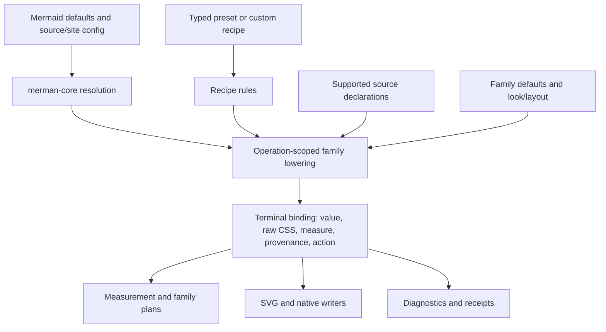

# Fearless Refactor of Unified Theme Lowering and Historical Path Retirement

## Goal Capsule

**Objective:** Make every render operation consume one operation-scoped, family-specific terminal theme binding while preserving Mermaid-compatible input behavior, then remove obsolete runtime adapters, migration gates, stale documentation, and test-only compatibility machinery that no longer owns a current contract.

**Means:** Keep Mermaid's public input and upstream theme derivation in `merman-core`; lower the resulting values, structured Merman recipes, and supported source declarations once into concrete renderer-owned terminal bindings. Reuse existing rule/provenance machinery without equating the terminal binding with the public recipe or `ResolvedThemeStyle`. Do not force arbitrary CSS or Mermaid's non-numeric sentinels into typed paint tokens. Retire historical bridge authorization and obsolete presentation APIs only after their current consumers and evidence owners are removed together.

**Authority hierarchy:** Public Mermaid configuration and source semantics outrank Merman defaults; explicit source declarations retain property-level ownership; typed recipe rules supply missing semantic values; family geometry, layout, `look`, font measurement, and native output constraints remain with their current owners. A value's origin is never inferred from equality.

**Stop conditions:** Investigate before deleting a symbol reachable from a published binding, CLI/Web input, current release workflow, Mermaid compatibility behavior, layout/measurement, or native receipt contract. A live caller requires migrating or deliberately retiring its contract in the same unit; it does not justify retaining a historical path indefinitely. If an externally observable contract cannot be preserved, report the concrete blocker before proceeding.

---

## Product Contract

### Requirements

- **R1. Mermaid compatibility remains complete.** `theme`, `themeVariables`, source directives/frontmatter, `classDef`, `style`, `linkStyle`, property-level precedence, unknown-theme behavior, and config serialization remain observable as before. This includes values that are not representable as finite typed colors.
- **R2. Merman presets remain a separate authoring product.** Presets and custom recipes compile through the same structured theme compiler and do not become a second global `themeVariables` cascade. `look` and layout remain explicit controls; a preset does not silently change them.
- **R3. One runtime interpretation exists.** A render operation/family resolves Mermaid compatibility, typed theme rules, supported source declarations, and family defaults into one terminal binding before measurement/layout consumers and writers use it. The old `SvgTheme`/`MermaidThemeAdapter` JSON-read path is removed per migrated family.
- **R4. Non-typed values remain safe and explainable.** The terminal binding may carry raw CSS, optional numeric measurement, action (`set`, `clear`, `inherit`, or residual), source provenance, declaration order, and importance. It is not a general CSS interpreter and does not broaden resource or security policy.
- **R5. Historical retirement is finite.** The executable KTD23 route/projection authorization, tombstone probes, empty-bridge gate, and acceptance-only constructors are removed when their current callers are removed. Durable evidence is retained as a short historical record and current structural invariants remain narrow and source-backed.
- **R6. User-facing documentation describes the current interface.** Current guides point to compiled presets/custom recipes and Mermaid compatibility configuration. Options 2/`HostTheme`/`PresentationProfile` examples and broken example links cannot remain in the current navigation.
- **R7. Existing visual and output contracts are preserved.** SVG structure, default Mermaid behavior, effects that are currently supported, font/resource limits, cancellation, native filters/receipts, and feature-gated family behavior remain unchanged except where a verified duplicate path is removed.

### Key Flows

- **Mermaid render:** Mermaid defaults and source/site configuration are resolved, source declarations are attached with provenance, typed recipe rules fill only unowned properties, one family binding is produced, then the same binding serves measurement, layout-facing style queries, SVG emission, and native finalization.
- **Preset render:** A preset compiles to typed rules plus only its explicit Mermaid compatibility lane; the operation uses the same lowering path as a Mermaid-only render.
- **Retirement:** An inventory proves a candidate has no production/public/release caller; callers and tests are migrated or deleted in the same unit; historical evidence is archived; structural checks assert absence of the retired path.

### Acceptance Examples

- A flowchart with `themeVariables.primaryColor`, `classDef`, inline `style`, and an explicit font declaration preserves the winning property, source path, and emitted CSS/value behavior.
- A sequence diagram with a typed preset and `look: neo` preserves Neo's built-in visual path and does not claim typed glow ownership where that look does not consume it.
- A Mermaid theme value such as `calculated`, a relative font size, or a browser-safe opaque CSS value remains renderable or is reported as a residual without being silently converted to a different typed value.
- A built-in preset and a custom recipe render through the same terminal binding path; no family reads Mermaid theme JSON after the cutover.
- Removing the historical bridge gate does not make a non-empty runtime legacy route pass; current source-level absence and support claims remain independently checked.

---

## Planning Contract

### Key Technical Decisions

- **KTD1. Lower to a renderer terminal binding, not the public recipe schema.** `CanvasPaint` and `ResolvedThemeStyle` are too strict for all Mermaid CSS values. The internal binding must preserve raw emission and optional measurement alongside typed semantic values.
- **KTD2. Preserve core derivation.** `merman-core/src/theme.rs` remains the source of Mermaid catalog, defaults, derived variables, and unknown-input behavior. The renderer consumes its resolved output instead of reimplementing theme-variable derivation.
- **KTD3. Keep CSS interpretation bounded.** Reuse existing safe CSS parsing and ownership code in `merman_style.rs`; do not create a broad CSS cascade engine, browser emulator, or universal theme adapter.
- **KTD4. Migrate by family evidence.** Start with a family whose typed semantic bindings and geometry are stable, then migrate measurement-sensitive families such as Flowchart and Sequence. Delete the old adapter methods only when all callers for that family have moved.
- **KTD5. Retire historical proof with its wiring.** `legacy_family_theme_bridge.rs`, KTD23 projection ledgers, release-preflight authorization, and acceptance tests are one retirement unit. Keep a durable evidence summary and a small current-source invariant, not an executable historical migration oracle.
- **KTD6. Clean docs by ownership.** Current guides and indexes are updated to current APIs; completed plans and migration records remain only when they explain a durable decision, with stale current-status claims corrected. `HostTheme` aliases are not reintroduced.

### High-Level Technical Design



The binding is concrete per family/target and immutable after preparation. It carries only the fields that the consumer needs, with explicit residuals for unsupported or opaque values. `look` can select an existing built-in effect path, but arbitrary theme CSS never becomes a new effect engine. The compiler and family program remain the ownership points for semantic rules; SVG parity helpers become compatibility adapters only until each family cutover is complete.

### System-Wide Impact

- **Core/config:** Mermaid catalog and precedence remain public; only the handoff to renderer lowering changes.
- **Renderer:** family plans, SVG parity theme helpers, source style ownership, effects, diagnostics, and root paint bounds are affected.
- **Bindings/CLI/Web/Playground:** public recipe and compatibility inputs remain stable; examples and discovery metadata must point at the same current path.
- **Acceptance/release:** historical bridge authorization and private constructors are deleted together; current support and structural checks remain independent.
- **Documentation:** current rendering guides, examples index, migration guide, ADR status links, and historical workstream summaries need link/status cleanup.

---

## Implementation Units

### U1. Build the deletion and semantic inventory

**Goal:** Establish a checked, file-level map of active callers, feature closures, public exports, release wiring, docs links, and tests for every candidate path before changing ownership.

**Files:** `crates/merman-render/src/svg/parity/theme.rs`, `crates/merman-render/src/svg/parity/theme/families.rs`, `crates/merman-render/src/diagram_theme/source_styles.rs`, `crates/merman-render/src/mermaid_style.rs`, `crates/merman-render/src/diagram_theme/legacy_family_theme_bridge.rs`, `crates/merman-render/src/theme_route_cutover.rs`, release/acceptance scripts, current theme docs and example indexes.

**Approach:** Classify each symbol as public compatibility, active runtime, acceptance-only, historical evidence, or stale documentation. Record the exact replacement owner and a deletion proof. Include the lazy family compatibility builders and `FamilyPaintDefaultPaths`; do not assume names containing `legacy` are removable.

**Test scenarios:** Inventory detects a published caller, release caller, or source-compatibility path and blocks deletion; it also detects stale links to missing `HostTheme` examples and identifies historical-only files with no current inbound reference.

### U2. Introduce the operation-scoped terminal binding

**Goal:** Add the smallest renderer-internal value that can represent typed values and Mermaid-compatible raw values without losing ownership or measurement semantics.

**Files:** `crates/merman-render/src/diagram_theme/resolved.rs`, `crates/merman-render/src/diagram_theme/source_styles.rs`, `crates/merman-render/src/mermaid_style.rs`, operation/theme preparation modules, focused family binding module.

**Approach:** Reuse existing `ResolvedProperty`, source provenance, CSS safety policies, and diagnostics. Preserve the core operation's frozen path ownership in a compact cross-crate input view; authored versus derived values cannot be recovered from materialized JSON alone. Add explicit raw/measure/action fields only where a consumer needs them. Apply existing family-specific precedence independently for each property: source declarations, including unverified owning declarations, suppress typed winners; authored Mermaid/compatibility values retain their current priority; typed rules can replace derived/default values. This is not a universal numeric priority order. Keep clear and residual states distinguishable from absence. Do not route through global `MermaidConfig` after lowering.

**Test scenarios:** Verify same-value writes retain their source, later declarations obey order and `!important`, `clear` removes a prior owner, relative font sizes preserve measured output, opaque safe CSS is emitted without numeric fabrication, and unsafe/resource-bearing CSS remains rejected or residual according to existing policy.

### U3. Cut over stable families and delete their JSON adapter reads

**Goal:** Move Class and bounded families with equivalent semantic roles to the binding, then remove their `SvgTheme`/`MermaidThemeAdapter` reads and duplicate fallback helpers. U1 records the complete family list; U3 and U4 partition all currently supported families with no omitted family.

**Files:** `crates/merman-render/src/class`, selected family theme modules, `crates/merman-render/src/svg/parity/theme/families.rs`, `crates/merman-render/src/svg/parity/theme.rs`, family program/plan consumers.

**Approach:** Preserve family-specific target ownership and generated CSS behavior. Keep compatibility fallback in core/compatibility compilation, not in a second renderer cascade. Delete each adapter method only after repository-wide caller search and family tests show no use.

**Test scenarios:** Mermaid-only, typed-preset-only, combined, explicit source override, no-theme, and unknown-theme cases produce the same public SVG structure and winning property values for migrated families.

### U4. Cut over measurement-sensitive families and effects

**Goal:** Migrate Flowchart, Sequence, XYChart, and remaining supported families without changing geometry, Neo/classic behavior, or root paint containment.

**Files:** family theme/plan modules, `crates/merman-render/src/flowchart/theme_evidence.rs`, `crates/merman-render/src/sequence/theme_evidence.rs`, root paint/effect helpers, remaining adapter consumers.

**Approach:** Keep measurement and bounds ownership in the family. Lower only the values consumed by each family. Preserve built-in Neo filters and effect bindings as explicit internal mechanisms; do not treat preset selection as a `look` mutation. Remove duplicated effect decoding only where input and output contracts are identical.

**Test scenarios:** ELK and Dagre flowcharts, classic and Neo look, sequence actor/frame shadows, xychart palette fallback, typed effects, Mermaid `themeVariables`, and source styles retain output containment and diagnostics. Native exports continue to honor final-region and filter receipts.

### U5. Retire the historical bridge and compatibility authorization

**Goal:** Remove the executable historical migration contract after runtime routes are absent and current callers are migrated.

**Files:** `crates/merman-render/src/diagram_theme/legacy_family_theme_bridge.rs`, `legacy_projection_retirement.rs`, `legacy_tombstones.rs`, legacy portions of `theme_route_cutover.rs`, `crates/merman-theme-acceptance/src/cutover_manifest.rs`, release-preflight scripts, related exports/tests.

**Approach:** Delete release authorization, route/value probes, acceptance-only constructors, and empty-inventory gates together. Preserve a compact historical record with revision, scope, and digest where it is needed for audit; add only a current source-level invariant that production has no legacy provider/dispatch. Do not generate historical rows from the current matrix and do not replace the old gate with an always-empty pass.

**Test scenarios:** Production feature closures compile without acceptance bridge modules; private acceptance no longer exposes retired APIs; a deliberate reintroduction of a provider/dispatch is caught by the current structural check; public support discovery and runtime rendering remain independent.

### U6. Remove obsolete compatibility builders and duplicate validation

**Goal:** Delete lazy family compatibility providers, old default-path allowlists, duplicate effect/property readers, and tests that only construct retired objects, while retaining security, ownership, cancellation, resource, and receipt validation.

**Files:** core/render provider builders found by U1, `FamilyPaintDefaultPaths`, duplicated validators, obsolete fixture constructors, related module exports and tests.

**Approach:** For each candidate, require one live caller and one distinct contract before retaining it. Merge only identical validation at a shared boundary; keep independent checks where they protect different layers. Do not add setter journals, cross-family evidence frameworks, or a new universal CSS abstraction.

**Test scenarios:** Invalid input, unsafe CSS, cancellation, resource limits, native filter mismatch, error ordering, and provenance diagnostics remain covered after deletions; duplicate-only tests disappear with their implementation.

### U7. Clean current documentation and historical records

**Goal:** Make the repository describe the current theme interface accurately and remove dead navigation and examples.

**Files:** `docs/rendering/custom-diagram-themes.md`, `docs/rendering/presentation-themes.md`, `crates/merman/examples/README.md`, `crates/merman-ascii/README.md`, `docs/bindings/OPTIONS_JSON.md`, `docs/release/ALPHA7_TO_0_8_0_THEME_MIGRATION.md`, relevant ADRs/plans/workstreams.

**Approach:** Mark or remove the Options 2 guide from current indexes; replace nonexistent HostTheme/presentation examples with real compiled-theme examples; keep the 0.8 migration guide as historical compatibility documentation; compress closed workstream logs only when their decisions and evidence have a current owner. Remove obsolete gate instructions after U5, and retain raw performance evidence only under its existing archive/digest contract.

**Test scenarios:** Link and example checks find no current references to missing files or removed APIs; current docs show Mermaid compatibility, preset/custom recipe, look/layout, family support limits, and sharing behavior without claiming unsupported qualification.

### U8. Final contract and performance verification

**Goal:** Prove behavior and size changes are attributable to the deletion, not to hidden feature or evidence changes.

**Files:** affected tests, performance summary/evidence, support catalog and release notes only when required by measured results.

**Approach:** Run the repository's serial owner matrix for normal, all-diagram, native/export, private acceptance, browser, lint, dependency, and docs/link surfaces. Compare adjacent clean revisions with equal feature closures and calibrated A/A pairs before making latency, binary-size, allocation, or WASM claims. Record residual browser/font differences instead of widening comparators.

**Test scenarios:** All R1-R7 acceptance examples pass; no migrated family reads JSON theme state; no production legacy route or obsolete public export remains; representative SVG/native outputs and artifact budgets are unchanged or have a documented attributable improvement.

---

## Verification Contract

- **Static ownership:** repository-wide symbol/reference search confirms every deleted path has no published, runtime, release, or current-doc caller; a current source invariant catches reintroduction of a production bridge.
- **Behavior:** owner tests cover Mermaid-only, typed-only, combined precedence, source styles, unsupported CSS residuals, effects, `look`, geometry containment, cancellation, resources, and native receipts.
- **Feature closures:** validate normal production, all-diagram with layout features, export/native, and private acceptance closures separately; do not treat a successful default build as coverage of cfg-gated acceptance.
- **Documentation:** link checker, example inventory, and API-doc build pass with no stale current references to Options 2/HostTheme.
- **Performance:** use adjacent-revision, equal-feature, calibrated A/A methodology; retain raw receipts and a small summary with revision, workload, feature closure, toolchain, hashes, and measured deltas.

Concrete owner checks, run serially with the shared target directory and bounded build concurrency:

```bash
cargo fmt --all -- --check
cargo nextest run --locked -p merman-core --lib
cargo nextest run --locked -p merman-render --all-features --lib
cargo nextest run --locked -p merman --features all-diagrams,svg,png,pdf,layout-cytoscape,layout-elk,math
cargo nextest run --locked -p merman-export --features png,pdf --lib
python3 scripts/run_theme_acceptance.py nextest run --locked -p merman-theme-acceptance -p merman --features merman/all-diagrams,merman/layout-elk,merman/math --lib -E 'package(merman-theme-acceptance)'
python3 scripts/verify_theme_acceptance_boundary.py
cargo clippy --locked -p merman-cli --all-targets --all-features -- -D warnings
cargo deny check advisories bans licenses sources
npm --prefix playground/tests run typecheck
npm --prefix playground/tests exec -- playwright test theme-cyberpunk.spec.ts --project=chromium-desktop
```

U1 also records the current GitHub Ubuntu build/test and binding smoke lanes; U8 runs their applicable local steps plus the full affected feature/platform CI matrix. U5 removes obsolete retirement-specific commands from CI and acceptance wrappers together; surviving checks must execute nonzero relevant tests. Existing structure/parity comparison and browser root-containment checks remain authoritative. No check listed here was run during planning.

---

## Definition of Done

- Every supported Mermaid input path and public preset path reaches one family terminal binding before family consumers use theme values.
- No supported family reads visual theme JSON through `SvgTheme`/`MermaidThemeAdapter`; their old visual-reader implementation and exports are deleted. Parser/layout configuration reads remain with their original configuration owner.
- Historical bridge authorization, tombstones, acceptance constructors, and release wiring are removed together, with durable evidence and a narrow current invariant.
- Obsolete compatibility builders, duplicate readers, stale current docs, broken example links, and dead exports are removed; migration history that remains is clearly historical.
- Mermaid compatibility, preset/custom recipe behavior, visual/effect semantics, geometry, native/export, security, cancellation, and resource contracts remain verified.
- The final diff has a complete deletion inventory and no new universal CSS engine, global cache, allowlist bypass, or long-lived compatibility shim.

---

## Scope Boundaries

### Deferred to Follow-Up Work

- Expanding preset qualification metadata or promising pixel parity with Modern Mermaid fixtures.
- Replacing host font measurement or browser-dependent rendering with a new layout engine.

### Outside This Refactor

- Removing Mermaid's public compatibility inputs.
- Changing the pinned Mermaid release or default ELK/layout behavior.
- Adding a theme registry, remote theme loading, automatic font embedding, or a general CSS browser runtime.

---

## Appendix

Primary research artifacts used for this plan:

- `docs/performance/theme_retirement_and_deduplication_2026-10-08.md`
- `docs/performance/theme_root_paint_containment_2026-10-09.md`
- `docs/adr/0077-presentation-theme-and-output-ownership.md`
- `docs/adr/0082-versioned-theme-authoring-facade.md`
- `crates/merman-render/src/diagram_theme/mermaid_compatibility.rs`
- `crates/merman-render/src/diagram_theme/source_styles.rs`
- `crates/merman-render/src/mermaid_style.rs`
- `crates/merman-render/src/svg/parity/theme.rs`
