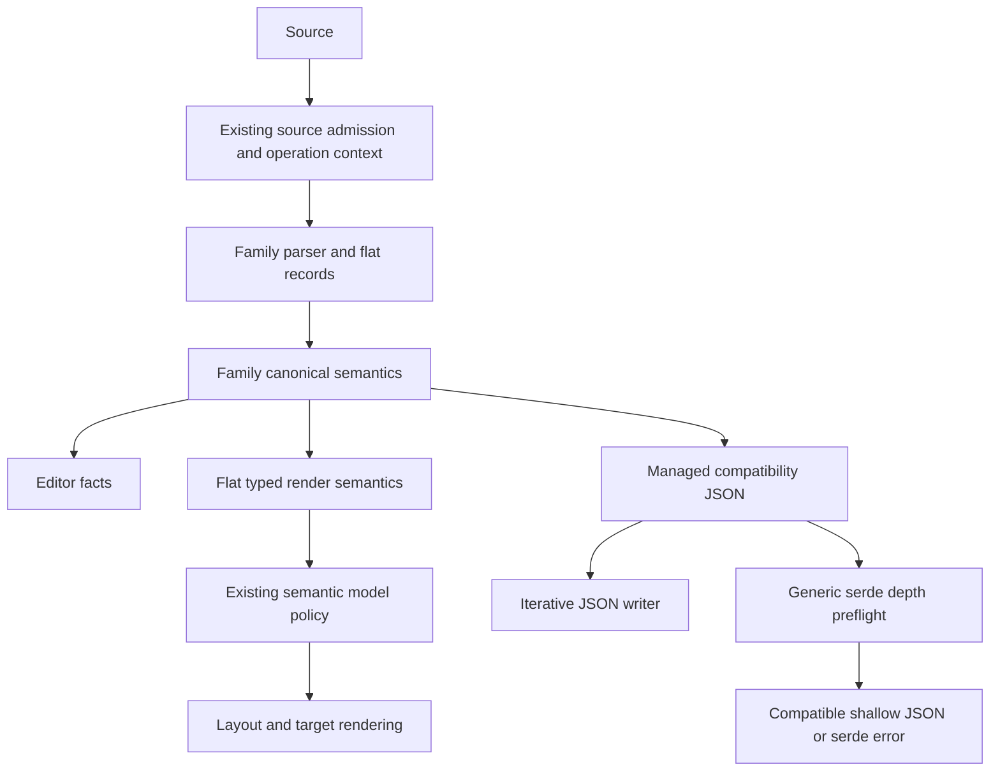
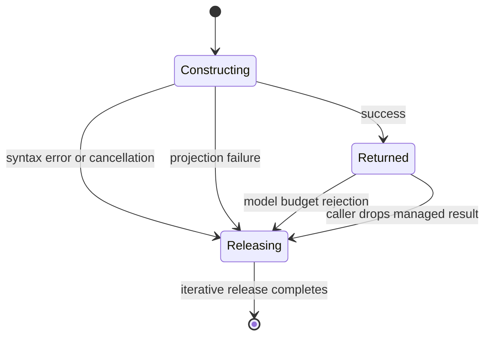
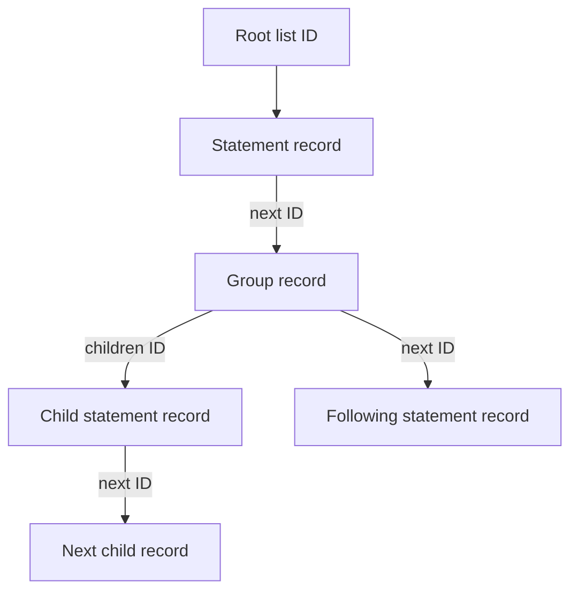

# Deep Diagram Lifecycle Refactor - Plan

## Goal Capsule

- **Objective:** A host can process deeply nested Mermaid input on a 2 MiB background thread, receive a result or a reported failure, and continue using the process.
- **Means:** Family-owned flat construction, flat typed semantics where trees remain recursively owned, and managed compatibility JSON (KTD1, KTD2, KTD3).
- **Authority:** Maintainer instructions govern scope; the pinned Mermaid source governs language and semantic behavior; R-IDs govern outcomes; KTDs govern mechanisms; units implement those contracts.
- **Execution profile:** Characterize ownership boundaries first, land independent family changes, then verify the shared facade. Reuse the workspace target and run Cargo work sequentially with bounded jobs.
- **Stop conditions:** Stop the affected unit if pinned-source behavior cannot be preserved or a supported target requires an unresolved public contract change. A failed lifecycle case is unfinished work, not an accepted residual.
- **Completion owner:** The implementer completes the active units, migration documentation, and verification evidence. Publishing a release, opening a PR, and contacting Holt are separate actions.

---

## Product Contract

### Summary

Remove depth-dependent stack failures from affected family construction, returned models, and compatibility JSON handling. Keep already-flat families flat, preserve Mermaid semantic and JSON contracts, and document necessary Rust API migrations.

### Problem Frame

[Holt issue 31](https://github.com/Onion-L/holt/issues/31) reports an abort when Merman parses a deeply nested Flowchart on a 2 MiB worker thread. Holt uses Merman `0.8.0-alpha.5`; this plan addresses current workspace code, not just that historical package.

Current-code probes also observed failures in ER, State, malformed C4 and Block inputs, Railroad EBNF postfix chains, and Mindmap compatibility JSON disposal. Earlier hardening replaced many recursive visitors, but generated-parser symbols, temporary fragments, public recursive models, and raw `serde_json::Value` still have independent lifecycles. A traversal that uses an explicit stack does not protect ordinary destruction of a recursively owned result.

The issue is host-process reliability. No security-vulnerability classification is part of this work. The evidence table below distinguishes observed failures from structural concerns and timeouts.

### Key Decisions

- **Repair affected ownership paths across families.** A Flowchart-only entrypoint patch leaves other observed failures and shared JSON ownership unresolved. Governs R1, R2, R8. (session-settled: user-approved — chosen over Flowchart-only repair: the family investigations found additional affected paths.)
- **Allow Rust public type changes with migration guidance.** Keeping raw owned JSON and recursive public tree fields would restrict the achievable lifecycle guarantee. Governs R4, R5. (session-settled: user-directed — chosen over retaining existing field types and move-out idioms: the maintainer explicitly selected public type changes while preserving compatibility JSON shape.)

### Requirements

**Host lifecycle**

- R1. Affected maintained Engine and facade paths must complete or report failure without aborting a 2 MiB host thread for the lifecycle scenarios in the Verification Contract.
- R2. Success, malformed input, cancellation, deadline expiry, projection failure, and budget rejection must release every library-owned parser fragment and partial model safely; affected unbounded paths must eliminate depth-dependent call-stack recursion, while established bounded families follow the boundary verification rule in Scope Boundaries and U9.
- R3. Returned canonical typed models on affected unbounded paths and managed JSON must support ordinary disposal and cloning without depth-dependent call-stack recursion; established bounded models may retain recursion after passing U9 at their maximum accepted depth.

**Compatibility and supported operations**

- R4. Preserve pinned Mermaid acceptance, semantic ordering, recovery facts, and compatibility JSON shape; Rust type and construction changes require explicit migration documentation.
- R5. Provide a maintained iterative JSON export for deep results, and make generic serde serialization reject unsupported depth with an error rather than aborting.
- R6. Preserve existing source/model resource-policy meanings, profiles, error provenance, and sticky terminal precedence.
- R7. Do not add a global Engine syntax-depth ceiling or reinterpret semantic model depth as parser-frame depth.

**Scope and cost**

- R8. Refactor confirmed recursively owned paths, verify bounded recursive families, and retain existing flat family representations.
- R9. Remove avoidable repeated statement movement, historical membership scans, and full-subtree storage from the affected canonical construction paths.
- R10. Preserve family-owned parser, semantic, render, and editor projections rather than creating a universal graph/parser framework.

### Acceptance Examples

- AE1. **Deep valid Flowchart:** On a 2 MiB worker, parse a 10,000-level chain through the typed Engine path, clone and drop the result, then process a small valid diagram. Each operation completes without process failure. Covers R1, R3, R7.
- AE2. **Malformed fragment disposal:** Remove the outer closer after inner Flowchart, State, ER, C4, or Block groups have completed. Parsing reports the existing family error or recovery outcome and releases all fragments. Covers R2, R4.
- AE3. **Budget rejection:** A source-admitted deep diagram exceeds the existing facade model limit with `suppress_errors=true`. The facade returns the resource terminal with the existing limit ID and provenance, and releases the rejected model. Covers R2, R6.
- AE4. **Deep compatibility JSON:** Obtain a deep Mindmap result through a direct Engine path whose source size is permitted, export it through the maintained iterative writer, clone it, and drop it. Generic serde above its documented support boundary returns an error; explicitly extracted raw `Value` is outside the managed guarantee. Covers R3, R5.
- AE5. **Repeated subgraph IDs:** A deep Flowchart syntax chain whose IDs merge into a shallow canonical graph retains Mermaid ownership and declaration behavior. A syntax-depth counter must not substitute for the canonical model-depth budget. Covers R4, R6, R7.

### Scope Boundaries

Active structural changes cover Flowchart/Swimlane, ER, C4, State, Block, and the recursively owned typed results of Treemap/Ishikawa. Mindmap needs managed JSON projection, not a new parser. Railroad needs its existing local implementation-depth guard to cover postfix construction. Class/Sequence need bounded-cost grammar carriers, not a new semantic model.

ZenUML, TreeView, and Usecase receive boundary lifecycle verification. Refactor a bounded path only if it fails the stated contract; retain its established acceptance/recovery boundary. Architecture, Agentflow, Kanban, Gantt, GitGraph, Requirement, EventModeling, Wardley, and the remaining fixed-shape families keep their representations.

Considered and not built:

- Production worker isolation, larger stacks, stack-growth dependencies, and `catch_unwind` as a substitute for structural ownership repair.
- A generic graph arena, parser framework, JSON DOM replacement, or configurable serialization-backend registry. Family-local IDs and one narrow JSON owner close the observed gaps.
- A new universal parser work budget. Existing policies and OperationControl remain authoritative; a separate CPU-amplification contract would require measured workloads and its own design.
- Guarantees for arbitrary downstream operations on explicitly extracted raw `Value`, borrowed raw JSON passed to arbitrary serializers, or caller-defined recursive models. Managed methods remain covered by R3/R5.
- Baseline regeneration or comparator relaxation to conceal semantic changes. Browser-dependent measurement residuals remain governed by the project parity strategy.

#### Deferred to Follow-Up Work

- Package version selection, release publication, and a Holt upgrade recommendation after verified implementation.
- Redesigning the meaning of generic model-complexity depth across all families.
- Independent layout-algorithm optimization beyond stack-safe traversal of the changed representations.

---

## Planning Contract

### Evidence and Baseline

The implementation baseline is workspace HEAD `aa88d63e2`, Merman `0.8.0`, Rust `1.95`, and Mermaid `12.1.0` commit `21f72f07ea22c0af48a3149c550654e80d8e40cb`. Resolve the Mermaid revision through `tools/upstreams/REPOS.lock.json` and `tools/upstreams/MERMAID_REFERENCE_BUNDLE.json`. The existing `repo-ref/mermaid` checkout reports Mermaid `12.0.0`, so read the locked revision through Git object lookup without changing that checkout.

The following are prior investigation observations, not acceptance thresholds. Probes used isolated processes, a 2 MiB worker stack, Windows debug artifacts, and stage markers. An abort marker localizes the observed phase; it does not replace a stack trace or prove the precise internal function.

| Family/path | Observation | Planning consequence |
|---|---|---|
| Flowchart | 5,000-level facade semantic path aborted; 10,000-level typed core path and malformed core input aborted | Direct grammar construction must become non-recursively owned |
| State | 5,000-level typed parse printed success, then disposal aborted; malformed 10,000-level input aborted | Repair AST fragments and returned model ownership |
| ER | 3,000-level valid nested subgraphs aborted | Repair recursive actions and replay |
| C4 | 15,000-level missing outer closer aborted; valid case timed out | Repair private semantic-fragment ownership; measure cost separately |
| Block | 10,000-level missing closer aborted; 3,000-level typed case printed success before timeout | Remove recursive temporary ownership and redundant subtree storage |
| Railroad EBNF | 5,000 postfix `?` operators, approximately 5,030 source bytes, aborted | Count constructed ownership depth, not only parser frames |
| Mindmap JSON | 3,000-level typed parse/drop passed; JSON parse printed success, then disposal aborted | Preserve flat typed model; protect JSON ownership |
| Treemap / Ishikawa | 5,000-level typed parse/drop passed | Clone/serde/projection/cancellation gaps remain structural verification targets |
| Class / Sequence | Class 3,000-level parse timed out; Sequence 1,000-level parse passed | Preserve flat events; remove repeated carrier movement and measure remaining work |

Mindmap's 3,000-level source was about 9 MB; the 5,000-level Treemap/Ishikawa sources were about 12.5 MB. These direct Engine probes exceed the facade's default 2 MiB source limit. Do not present them as bypassing default source admission. Timeouts are cost signals, not proof of stack overflow.

Relevant existing architecture and learnings:

- `docs/adr/0073-family-owned-diagram-architecture.md`: one family construction owns semantic, editor, and render meaning; projections must not independently reparse input.
- `docs/workstreams/headless-parity-deepening/JOURNAL/2026-06-07-hpd-050-flowchart-deep-subgraph-panic-surface.md`: previous iterative layout/render work remains valid but did not cover parser ownership.
- Corresponding `2026-06-07-hpd-050-state-deep-composite-panic-surface.md` and `2026-06-07-hpd-050-block-deep-composite-panic-surface.md` in that journal: root cleanup and iterative projection do not cover every temporary fragment.
- `crates/merman-core/src/config/mod.rs`: reuse its non-recursive JSON clone/drop behavior rather than inventing a second incompatible implementation.

### Key Technical Decisions

- KTD1. **Construct family-local flat ownership directly.** Flowchart/Swimlane, ER, State, and C4 parser outputs store records and IDs or boundary events from the first semantic action. Converting a completed recursive tree afterwards does not satisfy R2. Keep parser technologies and payload vocabularies family-local.
- KTD2. **Use flat canonical typed semantics for State, Block, Treemap, and Ishikawa.** Records own payloads; parent/child/document relationships use IDs. Nested compatibility JSON is an explicit projection. This eliminates ordinary recursive Clone/Drop and separates canonical construction cost from duplicated legacy output cost. Applies R3, R4 and the public-type decision.
- KTD3. **Introduce one managed semantic-JSON owner over the existing `Value`.** Its backing value is private; clone, disposal, comparison, diagnostic formatting, and maintained JSON writing use iterative traversal. Immutable raw borrowing and explicitly named unmanaged extraction remain available with documented limits. Temporary deep fragments also require the owner before they enter cancellable collections.
- KTD4. **Bound generic serde by actual serialized structure, not Mermaid syntax.** The managed compatibility serializer supports JSON container depth up to 128, measured from the root of the JSON value it emits; it preflights before recursive delegation and returns a serde error above that boundary. Canonical typed serializers retain their existing compatibility wire shapes through this path. Deep library export uses the iterative writer and has no new syntax-depth ceiling. This is an explicit serialization behavior change under R5, not a resource-policy limit.
- KTD5. **Keep Flowchart list construction constant-time per statement.** A private append-only statement arena and linked list endpoints allow grammar reductions to attach statements without copying the rest of the list. A private enter/exit walker supplies declaration and completion order. Retain the current grammar's language and error locations; do not rewrite it merely to change recursion direction.
- KTD6. **Track completed membership incrementally.** Flowchart's claimed-members set is exactly the union of retained members of completed canonical subgraphs. Apply self-filtering and existing ownership filtering before inserting actual retained members. ER has its own source-backed equivalent and does not inherit Flowchart's repeated-ID rules.
- KTD7. **Preserve operation ownership and terminal outcomes.** Propagate the existing OperationControl into long construction/replay/projection loops. Cleanup drains to completion independently of cancellation. Use existing terminal checkpoints and resource-error projection; an artificial lexer EOF must not replace an already observed terminal.
- KTD8. **Use isolated-process lifecycle tests.** A test process launches one named child case, which creates a 2 MiB worker and emits phase markers. The parent checks success/error status and bounds duration. Reuse the repository's current-executable subprocess pattern; do not add a general test-runner service or parallel Cargo processes.
- KTD9. **Measure canonical work separately from compatibility output.** Statement-carrier movement, membership rescanning, and duplicate internal subtree storage must be removed. Complexity reports include source bytes, record count, membership/output bytes, time, and peak memory where available; no whole-pipeline linearity claim follows from making one stage iterative.

### High-Level Technical Design

The family remains the semantic authority. The shared layers own operation control, resource checks, and JSON lifecycle.

Affected unbounded construction paths release non-recursive ownership on every lifecycle exit. This also covers parser symbols that never become a complete document. Established bounded paths follow U9.

For grammar-carried lists, the directional shape is an arena of payload records plus scalar links, with a root list and each group pointing to its child list. A walker pushes the group-completion event before its children so LIFO execution preserves source order and completes the group after its body. IDs are private indexes, not a shared graph abstraction.

### Alternatives Considered

| Approach | Benefit | Reason for the choice |
|---|---|---|
| Root-only iterative cleanup | Small patch | Cannot protect parser fragments or cancellation before root ownership |
| Iterative Drop on every private recursive node | Viable local repair | Does not remove repeated list movement or unnecessary tree retention; keep as an option only for genuinely bounded local types |
| Direct flat family construction | Covers fragment ownership and traversal | Selected for unbounded canonical paths; it reuses existing family semantics and ID-based outputs |
| Preserve raw public JSON, reject deep projections | Retains most Rust construction idioms | Narrows deep-result capability; the maintainer chose public type changes instead |
| Private universal arena / custom JSON DOM | Broad reusable machinery | Adds abstraction beyond current needs; not selected |
| Larger stacks / stack-growth dependency | Can defer some aborts | Does not establish bounded host-stack use and complicates native/Wasm behavior |

These alternatives can be resolved from current ownership evidence without developing competing runtime prototypes. The plan selects the mechanism; implementation is still responsible for validating its performance and full lifecycle.

### System-Wide Impact and Risks

Rust consumers of `ParsedDiagram`, editor semantic snapshots, State documents, Block children, and Treemap/Ishikawa trees must migrate to managed JSON or ID-based relationships. Custom registry overlays that return raw `Value` are wrapped immediately at the operation boundary; their internal construction remains the overlay author's responsibility. Keep borrowing ergonomic, but do not retain implicit conversion to owned raw JSON that defeats KTD3.

Update generic model-complexity measurement for the changed canonical models to reproduce the existing compatibility-shape definition without recursively serializing them. Flowchart's logical subgraph-depth rule and existing family-specific definitions remain unchanged. Serializer-depth support is a separate output capability and must not consume or rewrite a model budget.

Block's legacy `blocksFlat` and State's per-state documents can duplicate descendants in the emitted JSON. Flat canonical storage removes internal duplication, but compatibility export still costs at least the size of that output. Large output and allocator exhaustion remain distinct from stack safety; this plan does not guarantee unbounded successful allocation.

Generic serde, raw `Value` operations, and Rust API migration are separate contracts. Tests must not quietly use `mem::forget`, a larger stack, or a private cleanup helper in place of the returned result's normal destructor.

---

## Implementation Units

| Unit | Focus | Primary files | Dependencies |
|---|---|---|---|
| U1 | Lifecycle characterization | Core/facade integration tests | None |
| U2 | Managed JSON and iterative export | `compatibility_json.rs`, `diagram/mod.rs` | U1 |
| U3 | Flowchart / Swimlane flat statements | `flowchart/`, grammar | U1 |
| U4 | ER flat actions and replay | `er.rs`, grammar | U1 |
| U5 | C4 flat boundary construction | `c4.rs` | U1 |
| U6 | State canonical documents | `state/`, render adapter | U2 |
| U7 | Block canonical records | `block.rs`, render adapter | U2 |
| U8 | Tree-model and Mindmap projections | Tree family modules | U2 |
| U9 | Railroad and bounded-family boundaries | Railroad / bounded-family tests | U1, U2 |
| U10 | Class / Sequence grammar carriers | Family grammars and parsers | U1 |
| U11 | Facade integration and migrations | Resources, facade, docs | U2–U10 |

### U1. Characterize host-thread lifecycle boundaries

**Goal:** Turn the investigation into reproducible, phase-specific integration evidence.

**Requirements:** R1, R2, R3, R6, R8; KTD8.

**Dependencies:** None.

**Files:** Create `crates/merman-core/tests/deep_lifecycle.rs`, `crates/merman/tests/deep_lifecycle.rs`, and `docs/research/2026-10-10-deep-diagram-lifecycle.md`; reuse `crates/merman-core/tests/nesting_depth_limits.rs` and the subprocess pattern in `crates/merman/tests/runtime_determinism.rs`.

**Approach:**

1. Define a small scenario selector and deterministic family input generators in the integration tests.
2. Run dangerous cases only as named child processes, with parse/model/export/clone/drop markers inside a 2 MiB worker.
3. Record source bytes, path/profile, logical depth, build mode, exit status, and timeout separately; store durable findings in the research note.

**Execution note:** Establish the failing boundary before changing that family. Land passing family assertions with their fixes; do not leave aborting active tests in the main suite.

**Test scenarios:**

- Covers AE1/AE2. Flowchart 10,000 levels, valid and missing outer `end`, isolates parse from disposal.
- State 5,000 levels separates typed parse, ordinary clone/drop, and malformed fragment cleanup.
- ER 3,000 levels, C4 malformed 15,000 levels, and Block malformed 10,000 levels use the corresponding validated syntax generators.
- Railroad 5,000 EBNF postfixes uses a small source; Mindmap JSON 3,000 levels explicitly uses direct Engine admission.
- A timed-out child is terminated and reported as a timeout, without classifying it as a stack failure.

**Verification:** Each failure is reproducible by one named case, and passing cases finish all markers and a subsequent small operation. The parent process remains usable when a baseline child aborts.

### U2. Own compatibility JSON and provide iterative export

**Goal:** Remove recursive raw-JSON lifecycle from maintained returned and temporary semantic results.

**Requirements:** R2, R3, R4, R5, R10; KTD3, KTD4, KTD7.

**Dependencies:** U1.

**Files:** `crates/merman-core/src/compatibility_json.rs`, `crates/merman-core/src/config/mod.rs`, `crates/merman-core/src/diagram/mod.rs`, `crates/merman-core/src/parse_pipeline.rs`, `crates/merman-core/src/lib.rs`; create `crates/merman-core/tests/managed_semantic_json.rs`; update direct semantic-result consumers in `crates/merman-analysis`, `crates/merman-editor-core`, `crates/merman-render`, `crates/merman-export`, and bindings as required by compilation.

**Approach:**

1. Extract the existing iterative JSON ownership helpers into the shared narrow implementation while keeping MermaidConfig behavior intact.
2. Wrap Engine results, snapshot outcomes, and cancellable intermediate JSON fragments at the point ownership begins; replace deep `json!`/raw temporary cloning where they would escape that protection.
3. Add iterative JSON export over the managed value, delegating only scalar escaping and number representation to serde_json.
4. Implement the generic serialization boundary from KTD4 and explicit raw borrowing/extraction from KTD3; audit dependent formatting/comparison paths for recursion.

**Patterns to follow:** MermaidConfig's ownership lifecycle and the existing public projection boundaries in `diagram/mod.rs`. Keep numeric compatibility from the current `compatibility_json.rs` helpers.

**Test scenarios:**

- A 5,000-container managed JSON chain clones, compares, exports, and drops on the 2 MiB worker.
- At depths 127, 128, and 129, generic serde succeeds through its boundary and returns an error at the first unsupported depth before recursively serializing it.
- Quotes, control characters, Unicode, negative zero, integer boundaries, arrays, object order, and null emit the same JSON values as existing shallow output.
- Cancellation after a deep subtree is completed and writer failure after partial output release every owned fragment.
- Extraction and custom-overlay adapters compile with the documented ownership boundary; raw extraction tests do not claim managed guarantees afterward.

**Verification:** Semantic JSON shape remains equal on existing shallow fixtures, the maintained deep writer succeeds, and ordinary result cleanup needs no caller helper.

### U3. Construct Flowchart and Swimlane statements in a flat arena

**Goal:** Protect parser fragments and remove repeated list/member work without changing FlowDB semantics.

**Requirements:** R1, R2, R4, R7, R9, R10; KTD1, KTD5, KTD6, KTD7.

**Dependencies:** U1.

**Files:** `crates/merman-core/src/diagrams/flowchart/ast.rs`, `crates/merman-core/src/diagrams/flowchart/build.rs`, `crates/merman-core/src/diagrams/flowchart/semantic.rs`, `crates/merman-core/src/diagrams/flowchart/subgraph.rs`, `crates/merman-core/src/diagrams/flowchart.rs`, `crates/merman-core/src/diagrams/flowchart_grammar.lalrpop`, `crates/merman-core/src/generated/lalrpop/flowchart_grammar.rs`; family-local tests plus `crates/merman-core/tests/deep_lifecycle.rs`, `crates/merman/tests/swimlane_typed_render.rs`, and existing Flowchart render tests.

**Approach:**

1. Change grammar actions to populate the private arena directly and make generated semantic symbols carry only non-recursive fragments/IDs.
2. Migrate semantic construction, shape-data extraction, and editor facts to the same enter/exit walk while retaining their phase-specific behavior.
3. Replace full historical membership scans with the invariant in KTD6; preserve anonymous numbering, duplicate-ID merges, declaration owners, collapse behavior, styles, and first-completed ownership.
4. Add checkpoints to real token/reduction/replay work where necessary; regenerate committed parser output through the existing generator.

**Test scenarios:**

- Covers AE1/AE2/AE5. Deep valid and malformed unique-ID chains and repeated-ID chains have source-backed results and safe cleanup.
- Wide flat statements preserve declaration/edge order with constant-time carrier attachment.
- An empty group, self-membership, sibling reuse, repeated nested IDs, anonymous groups, and edge endpoints crossing groups match locked FlowDB behavior.
- Cancellation during nested completion releases both the arena and generated-parser symbol stack.
- Swimlane exercises the shared grammar through its maintained typed entrypoint.

**Verification:** Existing semantic/editor/DOM tests pass, generated output is current, and growth measurements attribute only output-required membership work after the rescanning fix.

### U4. Flatten ER actions and semantic replay

**Goal:** Remove `AddSubgraph.body` ownership and recursive `add_subgraph` execution.

**Requirements:** R1, R2, R4, R9, R10; KTD1, KTD6, KTD7.

**Dependencies:** U1.

**Files:** `crates/merman-core/src/diagrams/er.rs`, `crates/merman-core/src/diagrams/er_grammar.lalrpop`, `crates/merman-core/src/generated/lalrpop/er_grammar.rs`, `crates/merman-core/src/tests/er.rs`, `crates/merman-core/tests/deep_lifecycle.rs`, `crates/merman-render/tests/er_svg_test.rs`.

**Approach:** Directly construct family-local flat action records or boundary events, replay them with explicit frames, and replace historical membership reconstruction using the locked ER database's rules. Keep ER lookup/update behavior independent of Flowchart's duplicate-ID rules.

**Test scenarios:**

- Valid 3,000-level nesting and missing outer `end` complete or return the existing parse error on the small stack.
- Nested relationships, shared entity membership, repeated subgraph IDs, and empty groups match ER-specific upstream evidence.
- Cancellation while replaying a single deep action observes the control instead of waiting for the next top-level action.

**Verification:** ER semantic shape, markers, editor facts, and family DOM parity remain unchanged; neither replay nor fragment disposal follows depth on the call stack.

### U5. Flatten C4 boundary fragments

**Goal:** Make incomplete and completed C4 boundary frames non-recursively owned.

**Requirements:** R1, R2, R4, R10; KTD1, KTD7.

**Dependencies:** U1.

**Files:** `crates/merman-core/src/diagrams/c4.rs`, `crates/merman-core/tests/nesting_depth_limits.rs`, `crates/merman-core/tests/deep_lifecycle.rs`, `crates/merman/tests/c4_typed_render.rs`, `crates/merman-render/tests/c4_svg_test.rs`.

**Approach:** Replace recursive `C4SemanticStatement::Boundary.statements` with flat records and boundary references/events. Preserve the existing explicit replay and flat `parentBoundary` output, including declaration context and title/accessibility handling.

**Test scenarios:**

- A 15,000-level chain with completed inner frames and a missing outer `}` returns the existing outcome and completes cleanup.
- Valid nesting, sibling boundaries, empty boundaries, and shapes/relations retain IDs and parent assignment.
- Cancellation during closure construction and replay releases partial frames.

**Verification:** C4's successful typed model stays source-equivalent; incomplete-frame cleanup is structurally safe independent of parser success.

### U6. Give State one flat canonical document

**Goal:** Replace root-only cleanup with safe document ownership through grammar, semantic construction, and returned typed semantics.

**Requirements:** R1, R2, R3, R4, R6, R9, R10; KTD1, KTD2, KTD3, KTD7.

**Dependencies:** U2.

**Files:** `crates/merman-core/src/diagrams/state/ast.rs`, `crates/merman-core/src/diagrams/state/parse.rs`, `crates/merman-core/src/diagrams/state/db.rs`, `crates/merman-core/src/diagrams/state/render_model.rs`, `crates/merman-core/src/diagrams/state/tests.rs`, `crates/merman-core/src/diagrams/state_grammar.lalrpop`, `crates/merman-core/src/generated/lalrpop/state_grammar.rs`, `crates/merman-render/src/state`, `crates/merman-core/src/resources.rs`, `crates/merman-core/tests/deep_lifecycle.rs`, `crates/merman-render/tests/state_layout_test.rs`.

**Approach:**

1. Construct flat statements and document references directly in grammar actions; migrate divider-ID assignment and StateDb traversal.
2. Replace returned per-state recursively owned `doc` values with references into model-owned flat documents; keep nested documents in the compatibility projection only.
3. Adapt cluster extraction and prepared-graph traversal to canonical IDs, retaining the earlier iterative layout work.
4. Reproduce existing model-complexity accounting through the canonical shape rather than generic recursive serialization.

**Test scenarios:**

- A valid 5,000-level model parses, clones, and drops on the 2 MiB worker; a missing outer closer safely releases grammar fragments.
- Cancelling divider assignment before StateDb ownership and cancelling JSON projection after completed inner documents both release safely.
- Notes, dividers, start/end states, relation order, parent assignment, and nested directions preserve existing typed/JSON semantics.
- Default facade model rejection retains its existing actual/maximum calculation and terminal outcome.

**Verification:** Canonical State construction stores each statement once; deep disposal requires no special final StateDb ownership; compatibility docs remain source-equivalent when explicitly projected.

### U7. Store Block structure once

**Goal:** Remove recursively owned parser/DB trees and repeated full-descendant canonical storage.

**Requirements:** R1, R2, R3, R4, R6, R9, R10; KTD1, KTD2, KTD3, KTD9.

**Dependencies:** U2.

**Files:** `crates/merman-core/src/diagrams/block.rs`, `crates/merman-core/src/resources.rs`, `crates/merman-render/src/block.rs`, `crates/merman-core/tests/deep_lifecycle.rs`, `crates/merman-render/tests/block_svg_test.rs`.

**Approach:** Make parser frames, BlockDb, and the canonical typed model share flat block records and child IDs. Delete recursive whole-subtree clone helpers made obsolete by that representation. Project legacy `blocksFlat` trees only when compatibility JSON is requested, and keep renderer traversal over canonical IDs.

**Test scenarios:**

- Missing outer, missing all, and partially completed `end` sequences at 10,000 levels release frames without constructing a recursive error document.
- A valid 3,000-level model clones and drops without duplicate descendant storage in the canonical result.
- Composite children, spans, widths, directions, style classes, and edges preserve existing semantics and DOM order.
- Cancellation after a child record completes and during compatibility export releases all partial results.
- A scaling comparison separates canonical record growth from legacy duplicated JSON output bytes.

**Verification:** The DB contains each logical block once; the default typed/render path does not materialize `blocksFlat` descendant copies; JSON shape and existing layout behavior remain intact.

### U8. Retain flat tree records and protect Mindmap JSON

**Goal:** Stop Treemap/Ishikawa from rebuilding recursive typed ownership and keep Mindmap's good flat model.

**Requirements:** R2, R3, R4, R5, R8, R10; KTD2, KTD3, KTD7.

**Dependencies:** U2.

**Files:** `crates/merman-core/src/diagrams/treemap.rs`, `crates/merman-core/src/diagrams/ishikawa.rs`, `crates/merman-core/src/diagrams/mindmap/render_model.rs`, `crates/merman-core/src/diagrams/mindmap/tests.rs`, `crates/merman-render/src/treemap.rs`, `crates/merman-render/src/ishikawa.rs`, `crates/merman-core/src/resources.rs`, `crates/merman-core/tests/deep_lifecycle.rs`; existing Treemap/Ishikawa/Mindmap SVG tests.

**Approach:** Retain Treemap/Ishikawa's existing ID-based hierarchy through the public canonical typed model and render adapters. Convert their nested JSON and Mindmap's `rootNode` projection to managed ownership at every intermediate slot. Add control checks to tree construction/projection loops that currently only check afterward.

**Test scenarios:**

- Treemap and Ishikawa 5,000-level direct Engine models support clone/drop/export without recursive typed ownership.
- Covers AE4. Mindmap 3,000-level JSON disposal and cancellation after deep subtree completion succeed on the small stack.
- Source-limited facade calls reject the oversized generators at admission while direct Engine cases remain separately identified.
- Sibling order, root totals, inherited classes, leaf values, and Ishikawa parent/order semantics match existing fixtures.

**Verification:** No new parser is introduced for these families; typed clone/drop and JSON projection/export are independently covered; no previously passing probe is mislabeled as a prior abort.

### U9. Close Railroad's construction-depth gap and verify bounded families

**Goal:** Make existing local depth boundaries cover actual owned structure and prove their accepted edge on the host stack.

**Requirements:** R1, R2, R4, R7, R8; KTD4, KTD7, KTD8.

**Dependencies:** U1, U2.

**Files:** `crates/merman-core/src/diagrams/railroad.rs`, `crates/merman-core/src/tests/railroad.rs`, `crates/merman-render/src/railroad.rs`, `crates/merman-core/src/diagrams/zenuml`, `crates/merman-core/src/diagrams/tree_view.rs`, `crates/merman-core/src/diagrams/usecase/ordered_json.rs`, `crates/merman-core/tests/deep_lifecycle.rs`, `crates/merman-render/tests/railroad_svg_test.rs`, `crates/merman-core/tests/zenuml_grammar_test.rs`.

**Approach:** Count Railroad constructed AST depth before group/postfix wrapping and preserve its established local 256-depth implementation boundary and error/recovery behavior. Test bounded downstream visitors and cleanup, converting only a failing path to explicit traversal. Use the same evidence-first rule for ZenUML/TreeView's existing 256 boundary and Usecase's existing JSON boundary; do not lower them to pass a small-stack test.

**Test scenarios:**

- EBNF `?`, `*`, and `+` chains test the largest accepted constructed depth and first excess, including a malformed suffix.
- The 5,000-postfix reproduction returns the established local failure/recovery outcome rather than aborting in sanitize, facts, layout, or disposal.
- Four Railroad dialects test grouped boundaries, empty groups, error fragments, and cancellation through maintained paths.
- ZenUML/TreeView maximum accepted and first rejected depths exercise parse, clone, JSON export, supported render, and ordinary drop on 2 MiB.
- Usecase's 126/127/128/300 JSON cases retain their established fallback/admission semantics and safely release accepted/failed results.

**Verification:** Existing bounded behavior is retained except the confirmed Railroad bypass; any accepted-boundary failure is fixed locally and cannot be waived as an unbounded-family issue.

### U10. Stop repeated Class and Sequence carrier movement

**Goal:** Keep flat semantic events while making grammar assembly independent of ancestor count per emitted event.

**Requirements:** R2, R4, R9, R10; KTD5, KTD7, KTD9.

**Dependencies:** U1.

**Files:** `crates/merman-core/src/diagrams/class_grammar.lalrpop`, `crates/merman-core/src/diagrams/class/parse.rs`, `crates/merman-core/src/diagrams/sequence_grammar.lalrpop`, `crates/merman-core/src/diagrams/sequence/parse.rs`, their generated parser files, `crates/merman-core/tests/nesting_depth_limits.rs`, `crates/merman-core/tests/deep_lifecycle.rs`; existing Class/Sequence semantic and SVG tests.

**Approach:** Use family-local flat list carriers with scalar links during reductions, then replay each event once. Preserve namespace enter/pop, control-signal ordering, and existing spans. Measure qualified-namespace string/output cost separately rather than treating it as a parser ownership bug.

**Test scenarios:**

- Nested namespaces and Sequence loop/alt/opt/par structures retain exact event order and compatibility output.
- Deep valid, missing closer, and wide flat cases clone/drop their flat results without stack failures.
- Cancelled token delivery and replay retain the original terminal instead of a fabricated syntax error.
- Instrumented carrier accounting at increasing depths shows each event attached/materialized once, excluding required emitted string/output size.

**Verification:** Generated parsers are current, canonical events remain flat, and performance evidence distinguishes eliminated movement from remaining semantic/output work.

### U11. Integrate facade budgets, migrate consumers, and close evidence

**Goal:** Deliver the corrected lifecycle through maintained targets and explain the public API transition.

**Requirements:** R1–R10; KTD3, KTD4, KTD7, KTD9.

**Dependencies:** U2, U3, U4, U5, U6, U7, U8, U9, U10.

**Files:** `crates/merman/src/operation.rs`, `crates/merman/src/render.rs`, `crates/merman-core/src/operation.rs`, `crates/merman-core/src/resources.rs`, `crates/merman-core/src/parse_pipeline.rs`, `crates/merman/tests/render_operation.rs`, `crates/merman/tests/deep_lifecycle.rs`, `crates/merman-core/tests/deep_lifecycle.rs`, affected export/binding adapters, `README.md`, `CHANGELOG.md`; create `docs/migrations/deep-diagram-lifecycle.md`; finish the U1 research note.

**Approach:**

1. Adapt policy measurement to flat models with existing meanings and ensure projection/export adapters use managed ownership and maintained writers.
2. Validate original OperationControl and terminal propagation across semantic construction, budget checking, layout, and target emission.
3. Migrate workspace consumers and document new IDs, managed JSON borrowing/extraction, generic serde support, and deep export.
4. Record family-local parity and lifecycle coverage, including representative flat families, feature-selected builds, and bounded-family evidence.

**Test scenarios:**

- Covers AE3/AE5. Default model-limit rejection, `suppress_errors=true`, repeated-ID canonical depth, and cleanup preserve resource semantics.
- An earlier cancellation or resource terminal remains authoritative when a later condition occurs.
- SVG and ASCII deep affected paths complete through supported targets without a new production worker/thread boundary.
- Custom registry overlays, semantic snapshots, prepared artifacts, and binding/export adapters retain the documented ownership boundary.
- Representative Architecture/Agentflow/Kanban/Sequence/Gantt calls exercise existing flat containment and metadata without requiring model replacement.

**Verification:** The workspace compiles against the migrated public API; affected family parity remains intact; all required lifecycle cases pass; migration and evidence notes describe actual guarantees and remaining raw-escape limits.

---

## Verification Contract

Run Cargo verification sequentially with a bounded job count, reuse `target`, and prefer nextest. Use active feature combinations from the repository's contribution/CI contracts rather than assuming the default build proves selective diagram builds.

| Gate | Scope | Required evidence |
|---|---|---|
| Source-backed characterization | Each affected grammar/model | Locked Mermaid acceptance, declaration/completion order, error spans, editor facts, and JSON shape |
| Isolated host lifecycle | U1–U11 | 2 MiB worker completes valid, malformed, cancellation/deadline, clone/drop, projection, and budget scenarios without parent-process failure |
| Targeted nextest | Core, facade, affected render suites | `cargo nextest run` scoped to changed packages/test targets, including new lifecycle integration tests |
| Generated parser verification | U3, U4, U6, U10 | Existing `cargo run -p xtask -- gen-lalrpop-parsers` output and `verify-lalrpop-parsers` agree with committed grammars |
| Family parity | Changed render/semantic families | Existing `compare-<family>-svgs --check-dom --dom-mode parity --dom-decimals 3` gates and semantic fixtures pass without baseline relaxation |
| Format / diff hygiene | Changed Rust/doc files | `cargo fmt --check` for affected packages and `git diff --check` |
| Feature/public API | Changed exported types and consumers | Relevant reduced-family builds, native/Wasm compilation, docs, custom overlay examples, and binding/export contracts compile |
| Canonical growth | U3, U4, U7, U10 | Carrier/record accounting removes repeated movement/storage; measurements report source/output size and distinguish avoidable work |

Lifecycle coverage uses the existing family suites for ordinary semantics and the child-process harness for dangerous depth. Fast defaults include one regression per confirmed failure and bounded-family edges. Keep 30,000-level Flowchart and larger scaling series in an explicitly selected extended run, with fixed timeouts and source/output sizes. Do not run the full parity matrix after every family when a targeted gate already covers that change; run the final relevant aggregate once integration settles.

Cancellation tests must trigger after useful work begins, including nested completion or projection. A deadline-expiry case must exercise an in-progress operation, not only pre-cancelled admission. Child processes must be bounded and reaped; timing a case out is not a pass. Debug and release runs are recorded separately because stack behavior and elapsed time differ.

Generic serialization checks apply KTD4 to actual JSON shape. Test the maintained deep writer independently from generic serde and raw extraction. Policy validation must not silently invoke an unsupported serializer as its complexity calculator.

Release publication validation is outside this implementation plan. If packaging/dependency/FFI changes are needed by the public migration, apply the existing focused contribution checks to those changes; do not invent a new release validator.

---

## Definition of Done

- Required affected paths complete the host lifecycle contract, including ordinary destruction after success and every failure exit.
- The parser never builds an unprotected recursive tree merely to flatten it later.
- Canonical State/Block/Treemap/Ishikawa ownership is flat, and Mindmap keeps its existing flat typed model.
- Flowchart/Swimlane and ER retain pinned-source membership and declaration semantics.
- Managed JSON deep clone/drop/export pass, generic serde rejects unsupported depth cleanly, and raw extraction limits are documented.
- Model/source policy meanings, terminal provenance, and suppression behavior remain unchanged.
- Targeted family parity, relevant feature/API checks, generated parser verification, and formatting gates pass with evidence recorded.
- Public migration examples compile and describe every changed field/construction path used by workspace consumers.
- Obsolete recursive walkers, deep clone helpers, and duplicate subtree storage replaced by active units are removed; abandoned experimental code is absent from the implementation diff.
- No source changes unrelated to this plan are discarded, and no publishing or external communication is implied by completion.
